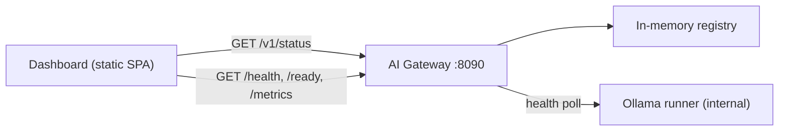

# AI Control Plane Dashboard

A single, sleek, auto-refreshing web dashboard for the AI Gateway control plane (Phases 1-3), served by the gateway itself and designed to grow into Phases 4-6.

## What Phases 1-3 actually expose (grounding)

- Live endpoints: `GET /health`, `GET /ready` (200/503), `GET /metrics` (Prometheus text).
- Rich per-runner state lives in the in-memory registry ([registry.py](ai/gateway/src/gateway/routing/registry.py)): `status` (UNKNOWN/STARTING/READY/DEGRADED/UNREACHABLE), `last_latency_ms`, `avg_latency_ms`, `consecutive_failures`, `in_flight`, `declared_capabilities`, `loaded_model` (name/digest/context_tokens/features), `last_seen_at` — currently NOT exposed as JSON.
- Metrics collectors ([obs/metrics.py](ai/gateway/src/gateway/obs/metrics.py)): `gateway_requests_total`, `gateway_errors_total`, `gateway_runner_health`, `gateway_runner_poll_latency_seconds`, `gateway_inflight_requests`.

## Data flow



The dashboard talks ONLY to the gateway (respects the "clients never reach runners directly" invariant); runner detail is surfaced through the gateway's registry snapshot.

## 1. New backend: read-only status endpoint

Add `GET /v1/status` in a new file `ai/gateway/src/gateway/api/status.py`, returning a safe JSON snapshot (never secrets like `jwt_secret`):
- `gateway`: `{ version, ready, phase_active: 3, uptime_s }`
- `config_safe`: `{ health_poll_interval_s, unreachable_after_failures, allowed_origins, streaming_enabled, enable_multi_command_plans, enable_push_registration, log_verbatim }`
- `runners[]`: mirror of `registry.snapshot()` entries — `id, base_url, status, last_seen_at, last_latency_ms, avg_latency_ms, consecutive_failures, in_flight, declared_capabilities, loaded_model{name,digest,context_tokens,features}`
- `endpoints[]`: declarative catalog of routes with `{ path, method, phase, available }` so the UI can render current vs. future endpoints.

Wire it in [main.py](ai/gateway/src/gateway/main.py) via `app.include_router(status_router)`. This is additive, control-plane only, no inference, and forward-compatible with the Phase 5 `/v1/capabilities` shape (illustrated in [phase-capabilities.md](docs/ai/phase-capabilities.md) lines 400-417). Record process start time at app creation for `uptime_s`.

## 2. Serve the dashboard from the gateway (same-origin, no CORS changes)

- New static assets under `ai/dashboard/` (`index.html`, `styles.css`, `app.js`, `README.md`).
- In [main.py](ai/gateway/src/gateway/main.py), mount `StaticFiles(directory=<ai/dashboard>, html=True)` at `/dashboard`, guarded so it only mounts if the directory exists (keeps prod optional). Resolve the path relative to the module (`Path(__file__).resolve().parents[3] / "dashboard"`), overridable via an optional `dashboard_dir` config key in [settings.py](ai/gateway/src/gateway/config/settings.py).
- `.html/.css/.js` are not in the isolation scan's `TEXT_SUFFIXES` ([isolation_scan.py](ai/gateway/scripts/isolation_scan.py) line 39) and contain no DB creds, so CI stays green.

## 3. Dashboard UI (zero dependencies, offline-friendly)

No CDN, no npm — hand-rolled modern CSS (custom properties, grid, dark theme) and vanilla JS with lightweight inline-SVG charts (LAN clinic may be offline). Follows the `frontend-design` skill for a distinctive, non-templated look. Polls `/v1/status` (+ `/health`, `/ready`, `/metrics`) on a configurable interval (default 5s) with a live/stale/down connection indicator.

Panels:
- **Header / hero**: gateway live-badge, readiness badge, "Phases 1-3 active" pill, refresh control.
- **Overview cards**: liveness, readiness, total runners, READY runners, total requests, error rate (deltas computed client-side from cumulative counters).
- **Runners panel**: one card per runner — color-coded lifecycle badge, model name + short digest, context tokens, capability chips, last/avg latency, in-flight, consecutive failures, last-seen relative time. Includes a small visual of the lifecycle state machine (UNKNOWN -> STARTING -> READY -> DEGRADED/UNREACHABLE) with the current state highlighted.
- **Metrics panel**: inline-SVG sparkline of request rate over the session, status-code distribution bars, per-runner latency bars, error-code breakdown — all parsed from `/metrics`.
- **Endpoint explorer**: interactive "try it" buttons for `/health`, `/ready`, `/metrics`, `/v1/status` showing raw responses + status code; future rows (`/v1/capabilities`, `/v1/ai/generate`, auth-gated routes) rendered greyed with "Coming in Phase 4/5" labels, driven by the `endpoints[]` catalog.
- **Security/isolation panel**: static display of the three invariants from [ai/README.md](ai/README.md) plus the safe config summary.

## 4. Expandability for future phases

- A `PHASES` descriptor in `app.js` maps each phase to its sections; sections render enabled/disabled from live capability detection (e.g. enable the Capabilities panel once `/v1/capabilities` returns 200; flip Generate from stub to live when it stops returning 501; show Auth state when protected routes start returning 401/403).
- The backend `endpoints[]` catalog is the single source of truth for what's available, so adding a Phase-4/5 route automatically surfaces it in the explorer with no UI rewrite.

## 5. Tests & docs

- Add `ai/gateway/tests/contract/test_status.py`: asserts `/v1/status` shape, that `jwt_secret` is absent, and that `runners`/`endpoints` are present. Keep existing 25 tests green.
- `ai/dashboard/README.md`: how to run (start gateway, open `http://localhost:8090/dashboard`), and how to extend per phase.
- Optionally note the dashboard in [docs/ai/phase-capabilities.md](docs/ai/phase-capabilities.md) Phase 3 "What you can do" table.

## How to run (after build)

```bash
cd ai/gateway
GATEWAY_JWT_SECRET=dev-secret .venv/bin/uvicorn gateway.main:create_app --factory --port 8090
# open http://localhost:8090/dashboard
```