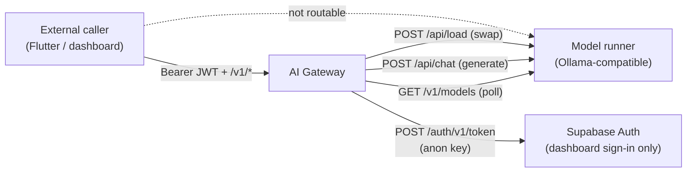
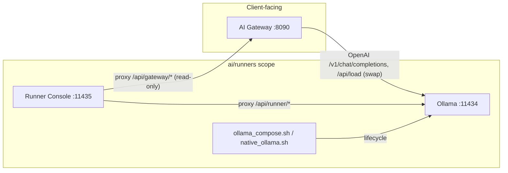
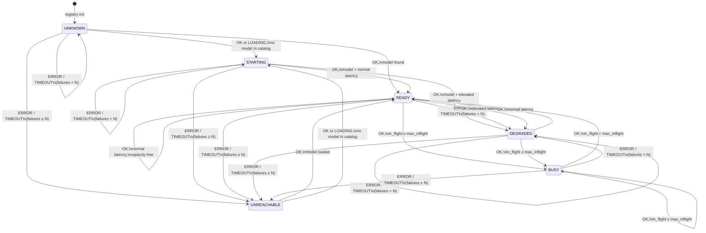

# AI Gateway and Runners — Developer Reference

**Source of truth:** `ai/` (implementation in `ai/gateway/` and `ai/runners/`). This document describes **functional behavior only** — no HTTP server setup, routing, or controller wiring. Where behavior is partial or incomplete, that is stated explicitly.

Dashboard UI lives in `ai/dashboard/` (Gateway-backed) and `ai/runner-console/` (operator tooling). Parent orchestration (`ai/start.sh`) is outside this reference.

---

## Table of Contents

1. [High-Level Architecture](#1-high-level-architecture)
   - [Gateway](#11-gateway)
   - [Runners](#12-runners)
2. [Supported Features](#2-supported-features)
   - [Gateway](#21-gateway)
   - [Runners](#22-runners)
3. [Request Contracts](#3-request-contracts)
   - [Common Types](#31-common-types)
   - [Gateway](#32-gateway)
   - [Runners](#33-runners)
4. [Response Contracts](#4-response-contracts)
   - [Gateway](#41-gateway)
   - [Runners](#42-runners)
5. [Feature Behavior](#5-feature-behavior)
   - [Gateway](#51-gateway)
   - [Runners](#52-runners)
6. [Edge Cases](#6-edge-cases)
   - [Gateway](#61-gateway)
   - [Runners](#62-runners)
   - [Partial / Not Implemented (Both Layers)](#63-partial-not-implemented-both-layers)
7. [Implementation Notes](#7-implementation-notes)
   - [Gateway](#71-gateway)
   - [Runners](#72-runners)
8. [Quick Reference Tables](#8-quick-reference-tables)
   - [Scheduling Commands](#81-scheduling-commands)
   - [Default Role AI Access](#82-default-role-ai-access)
   - [Generation Log Outcomes](#83-generation-log-outcomes)
   - [Config Defaults Reference (`GatewayConfig`)](#84-config-defaults-reference-gatewayconfig)

---

## 1. High-Level Architecture

### 1.1 Gateway

The AI Gateway is the **client-facing control plane** for the isolated AI layer.

#### 1.1.1 Responsibilities

| Responsibility | Implementation |
|---|---|
| Authenticate clinic staff (offline JWT) | `auth/jwt_validator.py`, `auth/dependencies.py` |
| Authorize `ai.access` by role | `auth/role_map.py`, `config/settings.py` (`RoleAiAccessMap`) |
| Maintain runner registry and health | `routing/registry.py`, `routing/health_poller.py`, `routing/lifecycle.py` |
| Route generation to runners | `routing/selector.py`, `pipeline/swap.py` |
| Enforce resilience (queue, timeouts, retry, shutdown) | `pipeline/queue.py`, `pipeline/timeout.py`, `pipeline/retry.py`, `main.py` |
| Run scheduling agent (prompt + grammar + validation) | `agents/scheduling/`, `validation/` |
| Call runners (Ollama `/api/chat`, `/api/load`, `/v1/models`) | `runners/openai_client.py` |
| Emit structured logs, Prometheus metrics, live trace | `obs/`, `middleware/observability.py`, `obs/trace_bus.py` |
| Operator dashboard auth proxy (Supabase anon key only) | `api/dashboard_auth.py` |

**Explicit non-responsibilities (enforced):** no clinic DB credentials, no Supabase service-role keys, no direct DB writes. `scripts/isolation_scan.py` scans `ai/` for forbidden imports/patterns.

---

#### 1.1.2 Interaction Model



- **External callers** send authenticated requests to Gateway only; they cannot supply runner URLs (`RunnerSelector` accepts only logical capability requirements).
- **Runners** are discovered from static YAML config and optionally push registration (`enable_push_registration`).
- **Health poller** pull-polls each runner on a fixed interval and updates registry state.
- **Generation** composes messages, selects a runner, calls Ollama native chat with JSON `format`, then validates and assembles the Command Protocol envelope.

---

#### 1.1.3 Key Source Files

| Area | Path | Primary types |
|---|---|---|
| Bootstrap / lifecycle | `main.py` | `create_app()`, `lifespan()`, `_graceful_shutdown()` |
| Config | `config/settings.py` | `GatewayConfig`, `RunnerConfig`, `ModelDef`, `RoleAiAccessMap` |
| Generation entry | `api/generate.py` | `post_generate()`, `_generate_command_*()` |
| Scheduling agent | `agents/scheduling/agent.py` | `SchedulingAgent`, `get_scheduling_agent()` |
| Runner client | `runners/openai_client.py` | `poll_runner()`, `chat_completion_grammar()`, `chat_completion_grammar_stream()` |
| Registry | `routing/registry.py` | `RunnerRegistry`, `RunnerRegistryEntry`, `LoadedModel` |
| Health poll | `routing/health_poller.py` | `HealthPoller` |
| Lifecycle FSM | `routing/lifecycle.py` | `RunnerStatus`, `transition()` |
| Selection + swap | `routing/selector.py`, `pipeline/swap.py` | `RunnerSelector`, `select_runner_with_swap()`, `ensure_capable_runner()` |
| Queue / shutdown | `pipeline/queue.py` | `GenerationQueue`, `ShutdownCoordinator` |
| Retry / timeout / cancel | `pipeline/retry.py`, `pipeline/timeout.py`, `pipeline/cancel.py` | `execute_with_retry()`, `stream_with_first_token_timeout()`, `log_cancelled()` |
| Validation | `validation/schema_check.py`, `validation/semantic.py`, `validation/envelope.py` | `validate_*()`, `assemble_envelope()` |
| Auth | `auth/jwt_validator.py`, `auth/dependencies.py` | `JwtValidator`, `require_ai_access()` |
| Trace | `obs/trace_bus.py`, `api/trace.py` | `TraceBus` |
| Errors | `api/errors.py` | `GatewayError`, `ErrorCode` |
| Capabilities | `api/capabilities.py` | `build_capabilities_report()` |
| Dashboard (functional) | `api/dashboard_auth.py`, `api/status.py`, `api/runners.py` | sign-in proxy, status snapshot, runner model proxy |

---

### 1.2 Runners

Runners are vanilla OpenAI-compatible inference backends (Ollama by default). They hold no clinic database credentials and bind to localhost only.

**Not implemented in `ai/runners/`:** `llama-server` (documented in README as an alternative only), Gateway-side model swap, grammar-constrained decoding, runner registration, retry/queue logic, and JWT auth. Those live in `ai/gateway/` or upstream Ollama.

#### 1.2.1 Runner Types

| Runner type | Status | Responsibility |
|---|---|---|
| **Ollama (Docker)** | Implemented | Primary production runner. Runs `ollama/ollama:latest` via Docker Compose on `127.0.0.1:11434`. Serves OpenAI-compatible (`/v1/*`) and native Ollama APIs (`/api/*`). |
| **Ollama (native host)** | Implemented | Dev/operator alternative via `scripts/native_ollama.sh`. Runs `ollama serve` on the host using `~/.ollama`, mutually exclusive with Docker on port 11434. |
| **llama-server** | **Not implemented** | Mentioned only in `README.md` as a documented alternative. No compose, scripts, or code exist under `ai/runners/`. |
| **Runner console** | Implemented | Operator tooling (`scripts/console_server.py`) for runtime status, GPU control, Ollama/Gateway probing. Serves static UI from `ai/runner-console/` (outside `ai/runners/`). |

---

#### 1.2.2 Interaction with Gateway and Backends



| Direction | Behavior |
|---|---|
| **Gateway → Ollama** | Gateway calls the runner's `base_url` (configured in `gateway.yaml`, not in runners). Inference, model listing, and model load/unload use Ollama's native APIs. No runner-side registration or push code exists. |
| **Console → Ollama** | `console_server.py` proxies `/api/runner/*` to `OLLAMA_BASE_URL` (default `http://127.0.0.1:11434`). |
| **Console → Gateway** | Read-only observability proxy: capabilities, status, metrics, dev auto-sign-in. Does not route clinic traffic. |
| **Runners → Gateway** | No outbound calls from runner infrastructure code. |

---

#### 1.2.3 Key Source Files

| File | Role |
|---|---|
| `ollama/docker-compose.yaml` | Base Ollama service: localhost bind, named volume, `OLLAMA_HOST=0.0.0.0:11434` inside container |
| `ollama/docker-compose.gpu.yaml` | GPU overlay (`gpus: all`, `NVIDIA_VISIBLE_DEVICES=all`) |
| `ollama/docker-compose.host-models.yaml` | Bind-mount host Ollama store instead of named volume |
| `ollama/Modelfile` | Custom model recipe (`qwen3:4b`, `temperature 0.7`, `num_ctx 8192`) |
| `ollama/digests.md` | Operator digest record for `qwen3:4b` |
| `scripts/ollama_compose.sh` | Docker Ollama lifecycle, GPU preference, health checks, `ollama ps` JSON |
| `scripts/native_ollama.sh` | Native Ollama export/start/stop/chat |
| `scripts/import_host_models.sh` | Copy host model store into Docker volume |
| `scripts/console_server.py` | Runtime APIs, Ollama/Gateway proxy, GPU toggle |
| `scripts/serve_console.sh` | Console launcher with port/env checks |
| `start.sh` | Thin wrapper: `ollama_compose.sh up` |

---

---


## 2. Supported Features

### 2.1 Gateway

#### 2.1.1 Configuration (`GatewayConfig`)

**Purpose:** Fail-fast YAML + `GATEWAY_*` env config.

**Flow:** `load_config()` → `GatewayConfig.from_yaml()` or env defaults.

**Key options:**

##### 2.1.1.1 `runners`

**Default:** `[]`

Startup list of AI backends the gateway knows about. Each entry has an ID, URL (e.g. `http://127.0.0.1:11434`), capabilities (`json_grammar`, etc.), and declared models. The gateway uses this to route requests.

##### 2.1.1.2 `health_poll_interval_s`

**Default:** `10`

How often (seconds) the gateway pings each runner to check it is alive and which model is loaded.

##### 2.1.1.3 `unreachable_after_failures`

**Default:** `3`

How many consecutive failed health checks before a runner is marked `UNREACHABLE` and stops receiving new work.

##### 2.1.1.4 `queue_max_depth`

**Default:** `16`

Max requests that can wait in line per capability. Beyond this, new requests are rejected instead of piling up.

##### 2.1.1.5 `queue_max_wait_s`

**Default:** `20`

Max seconds a request can wait in the queue. After this, the client gets `ai_busy` instead of waiting indefinitely.

##### 2.1.1.6 `max_inflight_per_caller`

**Default:** `2`

Max concurrent AI requests per logged-in staff member. A third request waits or is limited until one finishes.

##### 2.1.1.7 `timeout_total_s`

**Default:** `45`

Overall HTTP timeout for a full runner chat/generation call. If the runner does not finish within this window, the gateway cuts off and reports a timeout.

##### 2.1.1.8 `timeout_first_token_s`

**Default:** `15`

Max wait for the runner to *start* responding (first token when streaming, or first response when not). Silence longer than this fails the request even if the total timeout has not elapsed.

##### 2.1.1.9 `model_swap_first_token_timeout_s`

**Default:** `60`

Longer first-token wait while the runner is in `STARTING` (e.g. loading or swapping models). Normal `timeout_first_token_s` applies once the runner is ready.

##### 2.1.1.10 `confidence_threshold`

**Default:** `0.6`

Minimum model confidence (0–1) before the gateway treats the answer as confident enough. Below this, `needs_clarification` is set so a human can confirm before acting on risky commands.

##### 2.1.1.11 `shutdown_grace_s`

**Default:** `10`

On SIGTERM/SIGINT, seconds to let in-flight requests finish before the gateway forces shutdown and cancels stragglers.

##### 2.1.1.12 `jwt_secret` / `jwks_url`

**Default:** — (**at least one required**)

How staff JWTs are verified. `jwt_secret` is a shared secret for HS256 (simple local/dev). `jwks_url` fetches public keys for RS256/ES256 (typical Supabase). If both are set, JWKS wins.

##### 2.1.1.13 `streaming_enabled`

**Default:** `true`

When `true`, clients can receive token-by-token streaming. When `false`, `options.stream=true` is ignored and the gateway returns one complete JSON body.

##### 2.1.1.14 `enable_push_registration`

**Default:** `false`

When `true`, runners can self-register via `/internal/runners/*` (requires `internal_shared_secret`). Default off — runners are defined in YAML only.

##### 2.1.1.15 `log_verbatim`

**Default:** `false`

When `false`, logs and traces hash/redact PHI. When `true`, full text is logged (debug/dev only).

##### 2.1.1.16 `role_ai_access`

**Default:** `administrator`/`doctor` = `true`; `receptionist`/`lab_staff` = `false`

Which staff roles may call AI endpoints. Reloadable at runtime from `role_ai_access.yaml` without restart.

**Limitations:** `enable_multi_command_plans` is stored and exposed in status but **not used** in generation logic.

---

#### 2.1.2 Authentication & Authorization

**Purpose:** Offline JWT validation; role-gated AI access.

**Flow:**
1. `require_ai_access` requires `Authorization: Bearer <token>`.
2. `JwtValidator.validate()` verifies signature (JWKS RS*/ES* or HS256), `exp`, `sub`, `staff_role`.
3. `RoleMapStore.has_ai_access(staff_role)` — defaults merged from config; reloaded every 60s and on SIGHUP from optional `role_ai_access.yaml`.

**Components:** `JwtValidator`, `CallerIdentity`, `RoleMapStore`, `RoleMapReloader`.

**Error behavior:** missing/invalid token → `401 unauthenticated`; valid token, denied role → `403 forbidden`.

**Limitations:** No per-request Supabase calls for API auth (dashboard sign-in is separate).

---

#### 2.1.3 Runner Registry & Health Polling

**Purpose:** Maintain a single, thread-safe, in-memory picture of every known runner — its declared capabilities, which model is currently loaded, health status, and load — so routing, capabilities discovery, and the operator dashboard can make decisions without talking to runners directly on every request.

**Two cooperating components:**

| Component | File | Role |
|---|---|---|
| `RunnerRegistry` | `routing/registry.py` | Authoritative store of runner entries; all readers get cloned snapshots |
| `HealthPoller` | `routing/health_poller.py` | Background task that periodically probes each runner and writes results back into the registry |

---

##### 2.1.3.1 How runners enter the registry

**Static (default):** On startup, `create_app()` builds a `RunnerRegistry` from the `runners` list in `gateway.yaml`. Each `RunnerConfig` becomes a `RunnerRegistryEntry` with `status=UNKNOWN` and no `loaded_model` yet.

**Dynamic (optional):** When `enable_push_registration=true`, runners can also call `POST /internal/runners/register` (authenticated with `X-Internal-Secret`) to add or update entries at runtime. These are tracked in `_dynamic_ids` and survive config reloads even if they are absent from YAML.

`reload_from_config()` merges YAML changes without discarding runtime state for matching IDs (status, latency, loaded model, failure counters are preserved). Dynamic runners not listed in YAML are kept.

---

##### 2.1.3.2 What each registry entry tracks

Each `RunnerRegistryEntry` holds both **static declaration** (from config or push register) and **runtime observation** (updated by the poller):

| Field | Source | Meaning |
|---|---|---|
| `id`, `base_url` | Config / push register | Logical runner identity and HTTP base URL |
| `declared_capabilities` | Config / push register | Capability tags used by `RunnerSelector` (e.g. `json_grammar`) |
| `declared_models` | Config / push register | Models the runner is expected to serve; poller uses these names as `preferred_models` |
| `status` | Poller (+ optional heartbeat) | Lifecycle state — see §2.1.4 |
| `loaded_model` | Poller (+ optional heartbeat) | Currently loaded model (`name`, `digest`, `context_tokens`, `features`) |
| `last_seen_at` | Poller | UTC timestamp of the last successful model discovery |
| `last_latency_ms`, `avg_latency_ms` | Poller | Most recent poll latency and a rolling average (simple mean of successive readings) |
| `consecutive_failures` | Poller | Failed polls since last success; drives `DEGRADED` → `UNREACHABLE` |
| `in_flight` | Generation pipeline | Active requests on this runner; poller uses this to flip `READY` ↔ `BUSY` |

**Read API:** `snapshot()` and `get()` return deep clones under a lock so callers (selector, capabilities, status) never see partially-updated state. `update_entry()` is the poller's write path. `registry.ready` is `True` when at least one runner is `READY`.

---

##### 2.1.3.3 Health polling loop

The poller starts in the app `lifespan` and runs until shutdown:

```
every health_poll_interval_s:
  for each runner_id in registry:
    1. snapshot entry (clone) for old_status, in_flight, latency baselines
    2. trace emit  gateway_to_runner  GET /v1/models  kind=poll
    3. poll_runner(base_url, preferred_models=[m.name for m in declared_models])
    4. trace emit  runner_to_gateway  (200 for ok/loading, 503 for error/timeout)
    5. update rolling avg_latency_ms
    6. transition(current_status, poll_outcome, counters, config)  → next_status
    7. registry.update_entry(status, failures, latency, loaded_model?, last_seen_at?)
    8. metrics: set_runner_health, set_inflight, observe_runner_latency
    9. structured log  endpoint=/internal/health-poll
```

The poller is **pull-based and periodic** — it is the primary mechanism that moves runners from `UNKNOWN` toward `READY` (or `UNREACHABLE`). Lifecycle rules live in the pure `transition()` function (§2.1.4); the poller only supplies inputs and applies the result.

**Baseline latency for degradation:** When the runner is already `READY`, `DEGRADED`, or `BUSY`, the poller passes the previous `avg_latency_ms` (or `last_latency_ms`) as `baseline_latency_ms` so `transition()` can mark the runner `DEGRADED` when latency exceeds 2 s or doubles the baseline.

---

##### 2.1.3.4 Poll probe (`poll_runner`)

Each poll is a single HTTP call — no generation traffic:

| Step | Behavior |
|---|---|
| Request | `GET {base_url}/v1/models` with a **2 s** hard timeout (`POLL_TIMEOUT_S`) |
| HTTP ≠ 200 | `outcome=error` |
| `data` array empty or missing | `outcome=loading` (runner up, model not yet in catalog) |
| Model selection | First catalog entry whose `id` matches a `declared_models[].name`; if none match, first catalog entry |
| Valid model found | `outcome=ok` + `LoadedModel(name, digest, context_tokens)` parsed from the catalog entry |
| Request times out | `outcome=timeout` |
| Connection / HTTP error | `outcome=error` |

Ollama's `/v1/models` response is OpenAI-compatible (`{"data": [{"id": "...", "digest": "...", "context_length": ...}]}`).

---

##### 2.1.3.5 Push heartbeats (optional, config-gated)

When `enable_push_registration=true`, runners may also send `POST /internal/runners/heartbeat` with a self-reported `status` and optional `loaded_model`. `registry.apply_heartbeat()` writes these fields directly and resets `consecutive_failures`.

Heartbeats are a **supplement**, not a replacement: the poller keeps running on its interval and will re-derive status from the next `GET /v1/models` probe via `transition()`. A heartbeat that says `READY` but a failing poll will still move the runner toward `DEGRADED` / `UNREACHABLE`.

Register and heartbeat endpoints require `X-Internal-Secret` and reject browser `Origin` headers. They are omitted from the app router when push registration is disabled (default).

---

##### 2.1.3.6 Who reads the registry

| Consumer | Usage |
|---|---|
| `RunnerSelector` | `snapshot()` → filter by capability → keep `READY` / `DEGRADED` → least-busy + round-robin |
| `build_capabilities_report()` | Expose runner id, status, loaded model to clients |
| `GET /status` | Operator dashboard: full registry + safe config |
| `HealthPoller` itself | `runner_ids()` to know what to poll; `get()` / `update_entry()` per cycle |

Generation increments `in_flight` on the live entry; the poller reads it each cycle to apply the `BUSY` capacity rule (`max_inflight=1` in the poller path).

---

##### 2.1.3.7 Configuration

| Key | Default | Effect |
|---|---|---|
| `health_poll_interval_s` | `10` | Seconds between full poll cycles (all runners) |
| `unreachable_after_failures` | `3` | Consecutive `error`/`timeout` outcomes before `UNREACHABLE` |
| `enable_push_registration` | `false` | Enables `/internal/runners/register` and `/heartbeat` |
| `internal_shared_secret` | — | Required when push registration is on |

Poll HTTP timeout (`POLL_TIMEOUT_S = 2`) is fixed in code, not configurable.

---

#### 2.1.4 Runner Lifecycle State Machine

**Purpose:** Pure FSM in `routing/lifecycle.py::transition()`. The health poller calls it on every poll cycle with the current status, poll outcome, failure counter, latency readings, and `in_flight` count; it returns the next status and updated failure counter.

**States:** `UNKNOWN` → `STARTING` → `READY` ↔ `BUSY` ↔ `DEGRADED` → `UNREACHABLE`

Only `READY` and `DEGRADED` are routable (`RunnerSelector` ignores `BUSY` and `UNREACHABLE`).

##### 2.1.4.1 Lifecycle diagram

`N` = `unreachable_after_failures` (default **3**). A successful poll (`OK` with a loaded model, or `OK`/`LOADING` without one) resets `consecutive_failures` to **0**.



**Trigger glossary**

| Trigger | Meaning |
|---|---|
| `OK, model found` | Poll returned `outcome=ok` and `poll_runner` resolved a model in the catalog |
| `OK or LOADING, no model` | Poll succeeded but the catalog is empty or no usable model id |
| `ERROR / TIMEOUT` | Non-200 response, connection failure, or poll exceeded 2 s |
| `failures < N` / `failures ≥ N` | `consecutive_failures` after incrementing; at `N` the runner becomes `UNREACHABLE` regardless of prior state |
| `elevated latency` | Poll latency > 2 s, rolling average > 2 s, or average > 2× the pre-poll baseline (when already `READY`/`DEGRADED`/`BUSY`) |
| `in_flight ≥ max_inflight` | Generation has saturated runner capacity; health poller uses `max_inflight=1` |

**Capacity overlay:** `BUSY` is applied *after* health classification on successful polls. A `READY` or `DEGRADED` runner with `in_flight ≥ max_inflight` is promoted to `BUSY`; when `in_flight` drops below the limit on the next successful poll, it returns to `READY` (even if it was `DEGRADED` before going busy — capacity recovery always lands on `READY`).

| Transition trigger | Behavior |
|---|---|
| Poll `ERROR`/`TIMEOUT` | Increment failures; → `DEGRADED` (from `READY`/`BUSY`) or stay in place (`UNKNOWN`/`STARTING`); → `UNREACHABLE` after threshold |
| Poll `OK` + loaded model | → `READY` or `DEGRADED` if latency elevated (>2s or 2× baseline) |
| Poll `OK`/`LOADING`, no model | → `STARTING` |
| `in_flight >= max_inflight` (1 in poller) | `READY`/`DEGRADED` → `BUSY` |
| Recovery from `UNREACHABLE` | → `READY` if model loaded, else `STARTING` |

---

#### 2.1.5 Capabilities Discovery

**Purpose:** Client-facing snapshot of what the AI layer can do.

**Endpoint behavior:** `build_capabilities_report()` returns:
- `schema_version: "1.0"`
- `streaming` from config
- `tasks: ["command"]`
- `commands`: four scheduling command types
- `runners[]`: id, status, loaded model metadata

**Auth:** Requires `ai.access`.

---

#### 2.1.6 AI Generation — `task=command` (Scheduling)

**Purpose:** Proposal-only scheduling commands via grammar-constrained decoding.

**Supported command types:** `create_appointment`, `reschedule_appointment`, `cancel_appointment`, `update_appointment_status`.

**Execution flow (non-streaming):**

```
post_generate
  → require_ai_access
  → GenerationQueue.acquire(capability="command")
  → SchedulingAgent.compose_chat_messages(prompt, context)
  → select_runner_with_swap() [may trigger model swap]
  → execute_with_retry(chat_completion_grammar)
  → normalize_scheduling_envelope()
  → validate_envelope_schema → validate_command_schema → validate_semantics
  → assemble_envelope() [needs_clarification computed]
  → log_generation_record + JSON 200
```

**Request constraints:**
- `prompt`: 1–8192 UTF-8 bytes; C0 control chars stripped (except tab/LF/CR).
- `context`: recursively sanitized strings.
- `task != command` → `501 not_implemented`.
- `conversation_id`, `turn`, `options.confidence_hint`, `options.plan_mode` — **accepted but unused**.

**Components:** `SchedulingAgent`, `openai_client.chat_completion_grammar`, validation stack.

**Configuration:** `confidence_threshold`, `timeout_*`, `streaming_enabled`.

**Limitations:**
- Only `task=command` is implemented. `plan`, `text`, `clinical_note`, `analytics` enum values exist but return `501`.
- `REQUIRED_CAPABILITIES` for generation is `[]` — capability-based routing is effectively a no-op today; swap still keys off declared model capabilities when non-empty.

---

#### 2.1.7 Streaming Generation (SSE)

**Purpose:** Stream human-readable summary text, then emit validated final envelope.

**Flow:**
1. Same queue + runner selection as non-streaming.
2. `chat_completion_grammar_stream()` → `stream_with_first_token_timeout()`.
3. Text before first `{` → SSE `summary` events (`{"delta": "..."}`).
4. JSON body buffered in `GrammarStreamSession`; on completion → `session.parsed_json_matching_schema()`.
5. Terminal SSE: `final` (success) or `error` (failure).

**SSE event types** (`api/sse.py`): `summary`, `final`, `error` (`token` is allowed by encoder but **never emitted** for command tasks).

**Fallback:** If `options.stream=true` but `streaming_enabled=false`, non-streaming JSON path is used.

**Streaming retry:** Inline loop (max 2 attempts) mirroring `should_retry()` — **not** `execute_with_retry()`. No retry after any `summary` byte or partial stream content.

---

#### 2.1.8 Model Auto-Swap

**Purpose:** Load correct model when no `READY`/`DEGRADED` runner already serves required capabilities.

**Flow (`ensure_capable_runner`):**
1. `find_ready_runner()` — if found, return.
2. `find_swap_candidate()` — least-busy runner with undeclared-but-loadable model.
3. Set runner `STARTING` → `POST {ollama_root}/api/load` → `wait_for_runner_ready()` (poll until `READY` or timeout).
4. Metrics: `ai_model_swaps_total{outcome=ok|timeout|error}`.

**Configuration:** `model_swap_first_token_timeout_s` (also used as swap wait window).

**Limitations:** Assumes Ollama-compatible `/api/load`. Only one swap candidate attempted per request. Swap timeout → `503 ai_no_capacity`.

---

#### 2.1.9 Generation Queue & Backpressure

**Purpose:** Bounded FIFO per capability class + per-caller in-flight cap.

**Flow (`GenerationQueue.acquire`):**
1. Reject if shutting down → `503 ai_busy` + `Retry-After: 5`.
2. Per-caller cap → `429 rate_limited`.
3. FIFO wait up to `queue_max_wait_s` → `503 ai_busy` + `Retry-After: 5`.
4. On completion/cancel, slot released in `finally`.

**Capability class:** hardcoded `"command"` in `generate.py`.

**Metrics:** `ai_queue_depth`, `ai_inflight`.

---

#### 2.1.10 Single Retry on Transient Runner Failure

**Purpose:** One idempotent retry on a different healthy runner.

**Retryable** (`is_retryable_error`): `FirstTokenTimeout`, httpx connect/network errors, runner HTTP ≥500.

**Not retryable:** `AI_UNUSABLE`, `AI_BUSY`, `TotalTimeout`, any `GatewayError`, partial stream sent.

**Non-streaming:** `execute_with_retry()` — logs `outcome=retry`.

**Streaming:** manual second attempt via `select_retry_runner()`.

---

#### 2.1.11 Timeouts

| Layer | Non-streaming | Streaming |
|---|---|---|
| httpx runner call | `timeout_total_s` on POST | `timeout_total_s` on stream POST |
| asyncio first-token | `asyncio.wait_for(..., first_token_s)` wraps **entire** non-stream call | `stream_with_first_token_timeout()` until first delta |
| Model swap / `STARTING` | Extended `model_swap_first_token_timeout_s` via runner status in stream path only | Same |

**Error:** `504 ai_timeout` via `FirstTokenTimeout`, `TotalTimeout`, `ModelSwapFirstTokenTimeout`.

**Partial implementation note:** `total_timeout()` / `run_with_total_timeout()` exist in `pipeline/timeout.py` but are **not wired** into `generate.py`. Total bound for non-streaming is effectively `min(asyncio first-token wait, httpx timeout_total_s)`.

---

#### 2.1.12 Cancellation & Graceful Shutdown

**Client disconnect:**
- Raises `asyncio.CancelledError` in generation handlers.
- `log_cancelled()` — `outcome=cancelled` (not `error`).
- Queue slot released via `acquire()` `finally`.

**`CancellableRunnerCall` / `run_cancellable()`:** implemented in `pipeline/cancel.py` but **not used** by `generate.py` today.

**Shutdown (`main.py`):**
1. `ShutdownCoordinator.begin_shutdown()`.
2. `reject_queued_not_started()` — cancel waiting tasks, log cancelled.
3. `drain_in_flight(shutdown_grace_s)`.
4. `cancel_stragglers_after_grace()`.
5. `/health` returns `503 {"status":"shutting_down"}` during shutdown.

---

#### 2.1.13 Semantic Validation Gate

**Purpose:** Reject model output that passes JSON Schema but violates clinic rules.

**Per-command checks** (`agents/scheduling/validators.py`):
- No fabricated `patient_id` / `doctor_id` / `appointment_id` in params.
- Required params per command type.
- Dates not before `context.now` (or system date if absent).
- `requires_resolution.*` must be `"lookup_required"` for required fields.
- `display_summary` must mention key names/refs.
- Legal `type` / `status` enums.

Failures → `422 ai_unusable`.

**Envelope normalization** (`normalize.py`): repairs common runner deviations (`command` → `command_type`, hoists misplaced fields, fills default `requires_resolution`).

---

#### 2.1.14 `needs_clarification` Assembly

**Purpose:** Gateway-owned clarification flag (overrides model's `needs_clarification` field).

**Rules** (`validation/envelope.py::compute_needs_clarification`):
- `true` if `confidence < confidence_threshold`.
- `true` if destructive command (`cancel`, `reschedule`, or `update_appointment_status` with `status=cancelled`) **and** ambiguous resolution warnings (`ambiguous_ref`, `ambiguous_resolution`).

---

#### 2.1.15 Observability

| Feature | Behavior |
|---|---|
| Structured JSON logs | `obs/logging.py` → `{log_dir}/gateway.jsonl` |
| PHI redaction | `obs/redaction.py` — hashes sensitive fields unless `log_verbatim=true` |
| Request middleware | `middleware/observability.py` — assigns `X-Request-ID`, logs outcome, emits client trace |
| Prometheus | `obs/metrics.py` — `/metrics` unauthenticated |
| Live trace | `TraceBus` ring buffer (500 events), SSE fan-out |

**Trace directions:** `client_to_gateway`, `gateway_to_client`, `gateway_to_runner`, `runner_to_gateway`.

**Traced paths:** `/v1/*`, `/health`, `/ready`, `/metrics`.

**Partial:** `observe_ai_first_token_seconds`, `observe_ai_total_seconds`, `observe_ai_tokens_per_sec` are **defined but not called** from the generation path.

---

#### 2.1.16 Health & Readiness

| Endpoint | Auth | Behavior |
|---|---|---|
| `/health` | None | `200 ok`; `503 shutting_down` during graceful shutdown |
| `/ready` | JWT + ai.access | `200` if any runner `READY`; else `503 ai_no_capacity` |

---

#### 2.1.17 Status Snapshot (`/v1/status`)

**Purpose:** Operator dashboard data — gateway version, uptime, safe config, runner registry, endpoint catalog, architecture summary.

**Auth:** JWT + ai.access.

---

#### 2.1.18 Runner Models Proxy (`/v1/runners/{id}/models`)

**Purpose:** Control-plane inspection of runner `GET /v1/models` (same as poller).

**Auth:** JWT + ai.access. Emits trace events (`kind=proxy`).

---

#### 2.1.19 Dashboard Auth Proxy

**Purpose:** Obtain Supabase staff JWT for dashboard without exposing secrets to browser beyond anon key.

| Endpoint | Behavior |
|---|---|
| `GET /v1/dashboard/auth-config` | Public — whether sign-in is configured |
| `POST /v1/dashboard/sign-in` | Proxies password grant to Supabase; returns `access_token`, `staff_role`, `has_ai_access` |
| `POST /v1/dashboard/auto-sign-in` | Dev bootstrap when `dashboard_auto_sign_in=true` |

**Limitations:** Uses Supabase **anon key only** (not service role). Sign-in failure to reach Supabase → `503 ai_no_capacity`.

---

#### 2.1.20 Push Runner Registration (Optional)

**Purpose:** Runners self-register via `X-Internal-Secret`.

**Gated by:** `enable_push_registration=true` + `internal_shared_secret`.

**Endpoints:** `POST /internal/runners/register`, `POST /internal/runners/heartbeat`.

**Safety:** Rejects requests with `Origin` in `allowed_origins` (client browsers).

**Default:** Off; router not mounted when disabled.

---

#### 2.1.21 Isolation Scan (CI Gate)

**Purpose:** Static scan ensuring `ai/` tree has no DB drivers, service-role keys, or postgres URLs.

**Script:** `scripts/isolation_scan.py` (not part of runtime gateway process).

---

### 2.2 Runners

#### 2.2.1 Ollama Docker Runner

**Purpose:** Run a persistent, localhost-only Ollama inference node with optional GPU and flexible model storage.

**Execution flow:**
1. `ollama_compose.sh up` → `ensure_port_available()` → `ollama_up()`.
2. If Ollama is already healthy (container running + `127.0.0.1:11434` reachable + port published on localhost), skip startup.
3. Otherwise: stop conflicting host Ollama (systemd `ollama.service`, native `ollama serve` PID file).
4. `docker compose up -d` with base compose + optional overlays (host-models, GPU).
5. Poll `http://127.0.0.1:11434/api/version` up to 30 attempts × 0.5 s.
6. On failure: `down` → `up --force-recreate` → poll again; exit 1 if still unreachable.

**Configuration options:**

| Option | Default | Effect |
|---|---|---|
| `OLLAMA_HOST_MODELS` | `/usr/share/ollama/.ollama` | If `${OLLAMA_HOST_MODELS}/models` exists, auto-enables host-models overlay |
| `ollama/.gpu-enabled` | `0` (CPU) | When `1`, compose includes GPU overlay |
| Compose volume | `ollama_models` named volume | Model blobs at `/root/.ollama` in container |
| `OLLAMA_HOST` (in-container) | `0.0.0.0:11434` | Listen inside container; host bind restricts to localhost |

**Limitations:**
- **Single port**: Only `11434` on `127.0.0.1`; conflicts with systemd or native Ollama must be resolved manually if auto-stop fails.
- **No custom inference logic**: All generation behavior is upstream Ollama.
- **No digest enforcement**: Digest pinning is Gateway-side; runners only store models.
- **Model swap**: Not implemented in runners; Gateway calls Ollama `/api/load`.
- **Grammar/format**: Not enforced in runners; Gateway sends Ollama `format` on requests.
- **Default model naming inconsistency**: `Modelfile`/`digests.md` use `qwen3:4b`; `ai/start.sh` (parent) references `qwen3:4b-instruct` for pull/warmup.

---

#### 2.2.2 Ollama Native Runner

**Purpose:** Run Ollama outside Docker for development or when using `~/.ollama` directly.

| Command | Flow |
|---|---|
| `export` | `docker compose exec ollama tar` → extract to `$HOME/.ollama` |
| `start` | Stop Docker Ollama → `ollama serve` in background (PID in `$XDG_RUNTIME_DIR/ollama-native-serve.pid`) → poll `/api/version` (30 × 0.5 s) |
| `stop` | Kill native serve → `docker compose up -d` |
| `run [--think\|--no-think] [prompt]` | Requires port 11434 → `ollama run qwen3:4b` with optional `--think` / `--think=false` |
| `status` | Reports port 11434, Docker container, native PID, host store size |
| `list` | `ollama list` after version check |

**Limitations:**
- **Mutually exclusive with Docker** on port 11434 (`start` runs `docker compose down`).
- **Hardcoded model** `qwen3:4b` for `run` command.
- **No GPU management** — uses host Ollama's native GPU detection.
- **No integration with `ollama_compose.sh` GPU toggle**.

---

#### 2.2.3 Host Model Store Import

**Purpose:** Copy an existing host Ollama blob store into the Docker named volume without re-downloading.

**Flow:**
1. Validate `${SOURCE}/models` exists (default `/usr/share/ollama/.ollama`).
2. `docker compose up -d`.
3. `tar` from source → `docker compose exec ollama tar -xf -` into `/root/.ollama`.
4. `ollama list` inside container.

**Limitations:**
- **Named volume mode only** — does not use host-models bind-mount overlay.
- **Full store copy** — no incremental or selective model import.
- **Overwrites** container `/root/.ollama` contents.

---

#### 2.2.4 Host Model Bind-Mount (auto)

**Purpose:** Use an existing host Ollama directory in-place instead of a Docker volume.

**Flow:** `ollama_compose.sh` checks if `${OLLAMA_HOST_MODELS}/models` exists at startup. If yes, adds `-f docker-compose.host-models.yaml` to all compose commands.

**Limitations:**
- **Auto-only** — no manual force flag; directory must exist with `models/` subdirectory.
- **Replaces named volume** — bind-mount overrides `ollama_models` volume in the overlay.

---

#### 2.2.5 GPU Acceleration

**Purpose:** Enable NVIDIA GPU passthrough for Ollama Docker container.

**Execution flow:**
1. **Detection** (`gpu_available` in `ollama_compose.sh`): requires `nvidia-smi` + one of: `nvidia-ctk`, `nvidia-container-toolkit` package, or `nvidia` in `docker info`.
2. **Preference**: `ollama_compose.sh set-gpu 0|1` writes `ollama/.gpu-enabled`.
3. **Compose selection**: `gpu_enabled()` → includes `docker-compose.gpu.yaml`.
4. **Console toggle** (`set_gpu()` in `console_server.py`):
   - Reject if enabling GPU but `gpu_available()` is false.
   - `set-gpu` → `down` (60 s timeout) → `up` (120 s timeout).
   - Poll `_ollama_online()` up to 20 × 0.5 s.

**Limitations:**
- **Restart required** — toggling GPU stops and recreates Ollama; in-flight generation is cancelled.
- **No partial GPU** — `NVIDIA_VISIBLE_DEVICES=all`; no per-device selection in runners code.
- **CPU fallback** — if GPU unavailable, console returns error on enable attempt; compose stays CPU-only.

---

#### 2.2.6 Custom Model Recipe (Modelfile)

**Purpose:** Define a clinic-tuned variant of `qwen3:4b` with fixed parameters.

```
# Qwen3-4B Q4_K_M — default clinic model (CPU-realistic, digest-pinned)
FROM qwen3:4b

PARAMETER temperature 0.7
PARAMETER num_ctx 8192
```

**Limitations:**
- **Not auto-applied** — operator must run `ollama create` manually (documented in README).
- **No automated create** in any `ai/runners/` script.

---

#### 2.2.7 Digest Record

**Purpose:** Operator reference for pinning `qwen3:4b` digest in Gateway config.

| Model tag | Digest |
|---|---|
| `qwen3:4b` | `sha256:3e4cb14174460404e7a233e531675303b2fbf7749c02f91864fe311ab6344e4f` |

**Limitations:** **Documentation only** — no runtime verification in runners code.

---

#### 2.2.8 Runner Console (operator backend)

**Purpose:** Localhost operator tooling: runtime visibility, GPU control, direct Ollama probing, Gateway observability bridge.

**Functional APIs (implemented in `console_server.py`):**

| Endpoint | Method | Behavior |
|---|---|---|
| `/api/runtime` | GET | Ollama online, GPU state, processor, loaded models, compose summary |
| `/api/runtime` | POST | `{"enabled": bool}` → GPU toggle + Ollama restart |
| `/api/config` | GET | Bind host/port, Ollama URL, Gateway URL, proxy prefixes |
| `/api/compose/status` | GET | Compose health + `ollama_online` + `loaded_models` |
| `/api/runtime/logs?lines=N` | GET | Tail Ollama container logs (10–500 lines, default 80) |
| `/api/gateway/capabilities` | GET | Proxy → Gateway `GET /v1/capabilities` |
| `/api/gateway/status` | GET | Proxy → Gateway `GET /v1/status` |
| `/api/gateway/metrics` | GET | Proxy → Gateway `GET /metrics` (raw content-type preserved) |
| `/api/gateway/auto-sign-in` | POST | Proxy → Gateway dev auto sign-in |
| `/api/runner/*` | GET/POST | Transparent proxy to Ollama |

**Configuration options:**

| Variable | Default |
|---|---|
| `RUNNER_CONSOLE_HOST` | `127.0.0.1` |
| `RUNNER_CONSOLE_PORT` | `11435` |
| `OLLAMA_BASE_URL` | `http://127.0.0.1:11434` |
| `GATEWAY_URL` | `http://127.0.0.1:8090` |

**Limitations:**
- **Localhost only** by default.
- **No auth** on console endpoints.
- **Inference bypasses Gateway JWT** — direct Ollama access via proxy.
- **Gateway proxy is read-only** observability (except dev auto-sign-in).
- **Requires** `ai/runner-console/` directory and `ollama_compose.sh` to exist at startup.

---


## 3. Request Contracts

### 3.1 Common Types

#### 3.1.1 Error Envelope (all gateway error responses)

| Field | Type | Required | Notes |
|-------|------|----------|-------|
| `error.code` | `string` (enum) | yes | See error codes table |
| `error.message` | `string` | yes | Human-readable |
| `error.request_id` | `string` | yes | From `X-Request-ID` middleware |

**Error codes and HTTP status mapping** (`gateway/api/errors.py`):

| Code | HTTP | When |
|------|------|------|
| `bad_request` | 400 | Malformed/invalid request body |
| `unauthenticated` | 401 | Missing/invalid JWT |
| `forbidden` | 403 | Valid JWT but role lacks `ai.access` |
| `not_implemented` | 501 | Unsupported task or disabled feature |
| `rate_limited` | 429 | Per-caller in-flight cap exceeded |
| `ai_unusable` | 422 | Model output failed schema/semantic validation |
| `ai_busy` | 503 | Queue full, wait timeout, or shutdown (includes `Retry-After: 5`) |
| `ai_no_capacity` | 503 | No runner capacity / swap failure |
| `ai_timeout` | 504 | First-token or inference timeout |

```json
{
  "error": {
    "code": "ai_unusable",
    "message": "display_summary must mention params.patient_name ('Ahmed')",
    "request_id": "req_01H..."
  }
}
```

---

#### 3.1.2 Authentication

Most endpoints require:

```
Authorization: Bearer <Supabase JWT>
```

JWT validation (`gateway/auth/jwt_validator.py`):
- **Offline only** — no per-request Supabase calls
- **Required claims:** `exp`, `sub`, `staff_role`
- **Algorithms:** JWKS (RS/ES*) if `jwks_url` set (takes precedence); else HS256 via `jwt_secret`
- **`aud` not verified**
- Role must be in `role_ai_access` map with value `true` (defaults: `administrator`/`doctor` → true; `receptionist`/`lab_staff` → false)

**Unauthenticated endpoints:** `GET /health`, `GET /metrics`, `GET /v1/dashboard/auth-config`, `POST /v1/dashboard/sign-in`, `POST /v1/dashboard/auto-sign-in`

---

### 3.2 Gateway

#### 3.2.1 `POST /v1/ai/generate` — Generate Scheduling Command

**Primary generation endpoint.** Only `task=command` is implemented; all other task values return `501 not_implemented`.

**Request schema (`GenerateRequest`):**

| Field | Type | Required | Default | Constraints |
|-------|------|----------|---------|-------------|
| `task` | `string` enum | **yes** | — | `command`, `plan`, `text`, `clinical_note`, `analytics` (only `command` implemented) |
| `prompt` | `string` | **yes** | — | Non-empty; max **8192 UTF-8 bytes**; C0 control chars stripped (except tab/LF/CR) |
| `context` | `object` | no | `null` | Arbitrary key/value; string values recursively sanitized (control chars stripped) |
| `conversation_id` | `string` (UUID) | no | `null` | **Accepted and ignored** this phase |
| `turn` | `integer` | no | `null` | `≥ 0` if present; **accepted and ignored** this phase |
| `options` | `GenerateOptions` | no | see below | Unknown top-level fields **ignored** (`extra="ignore"`) |

**`GenerateOptions`:**

| Field | Type | Required | Default | Constraints |
|-------|------|----------|---------|-------------|
| `stream` | `boolean` | no | `false` | If `true` **and** `streaming_enabled=true` → SSE; else JSON |
| `confidence_hint` | `boolean` | no | `true` | Advisory only; confidence always populated in response |
| `plan_mode` | `string` enum | no | `"single"` | `"multi"` **accepted and ignored** (single commands only) |

**Example — non-streaming create:**

```json
{
  "task": "command",
  "prompt": "book Ahmed with Dr Ali tomorrow 5pm",
  "context": {
    "branch_id": "550e8400-e29b-41d4-a716-446655440000",
    "branch_name": "Main",
    "now": "2026-05-13T17:00:00+03:00",
    "active_patient": {
      "id": "550e8400-e29b-41d4-a716-446655440001",
      "name": "Ahmed Hassan"
    },
    "doctors": [
      { "id": "550e8400-e29b-41d4-a716-446655440002", "name": "Dr. Ali" }
    ]
  },
  "options": {
    "stream": false,
    "confidence_hint": true,
    "plan_mode": "single"
  }
}
```

**Example — streaming:**

```json
{
  "task": "command",
  "prompt": "cancel Ahmed tomorrow 5pm",
  "context": { "now": "2026-07-18T12:00:00+03:00" },
  "options": { "stream": true }
}
```

---

#### 3.2.2 `GET /v1/capabilities`

No request body. Requires auth.

---

#### 3.2.3 `GET /ready`

No request body. Requires auth.

---

#### 3.2.4 `GET /health`

No request body. No auth.

---

#### 3.2.5 `GET /v1/status`

No request body. Requires auth.

---

#### 3.2.6 `GET /v1/runners/{runner_id}/models`

| Parameter | Type | Required | Notes |
|-----------|------|----------|-------|
| `runner_id` | path `string` | yes | Must match a configured registry entry |

Requires auth.

---

#### 3.2.7 `GET /v1/trace/config`

No request body. Requires auth.

---

#### 3.2.8 `GET /v1/trace/events`

| Query param | Type | Required | Default | Constraints |
|-------------|------|----------|---------|-------------|
| `limit` | `integer` | no | `100` | `1`–`500` |
| `direction` | `string` | no | — | Filter: `client_to_gateway`, `gateway_to_runner`, `runner_to_gateway`, `gateway_to_client` |
| `kind` | `string` | no | — | Filter: `poll`, `proxy`, `api`, `internal` |
| `runner_id` | `string` | no | — | Exact match |
| `status_class` | `string` | no | — | `ok`, `client_error`, `server_error`, `unknown` |
| `path_prefix` | `string` | no | — | Path prefix match |

Requires auth.

---

#### 3.2.9 `GET /v1/trace/stream`

Same query filters as `/events` (no `limit`). Requires auth. Returns SSE.

---

#### 3.2.10 `GET /v1/dashboard/auth-config`

No request body. No auth.

---

#### 3.2.11 `POST /v1/dashboard/sign-in`

| Field | Type | Required | Constraints |
|-------|------|----------|-------------|
| `username` | `string` | **yes** | `minLength: 1`, `maxLength: 64` (trimmed before use) |
| `password` | `string` | **yes** | `minLength: 1`, `maxLength: 256` |

No auth required. Requires `supabase_url` + `supabase_anon_key` configured.

```json
{ "username": "admin", "password": "admin" }
```

---

#### 3.2.12 `POST /v1/dashboard/auto-sign-in`

Empty body. No auth. Requires `dashboard_auto_sign_in: true` and Supabase configured. Uses `dashboard_dev_username` / `dashboard_dev_password` from config.

---

#### 3.2.13 `POST /internal/runners/register` *(config-gated)*

**Only mounted when `enable_push_registration: true`.** Requires header `X-Internal-Secret: <internal_shared_secret>`. No JWT.

| Field | Type | Required | Default |
|-------|------|----------|---------|
| `id` | `string` | **yes** | — |
| `base_url` | `string` | **yes** | — |
| `capabilities` | `string[]` | no | `[]` |
| `models` | `ModelDef[]` | no | `[]` |

**`ModelDef`:**

| Field | Type | Required | Constraints |
|-------|------|----------|-------------|
| `name` | `string` | **yes** | — |
| `source` | `string` | **yes** | — |
| `digest` | `string` | **yes** | — |
| `context_tokens` | `integer` | **yes** | `> 0` |
| `capabilities` | `string[]` | no | `[]` |

```json
{
  "id": "push-runner",
  "base_url": "http://127.0.0.1:11435",
  "capabilities": ["json_grammar"],
  "models": [{
    "name": "qwen3:4b-instruct",
    "source": "qwen3:4b-instruct",
    "digest": "sha256:0edcdef3...",
    "context_tokens": 8192,
    "capabilities": ["json_grammar"]
  }]
}
```

---

#### 3.2.14 `POST /internal/runners/heartbeat` *(config-gated)*

Requires `X-Internal-Secret`. No JWT.

| Field | Type | Required | Notes |
|-------|------|----------|-------|
| `id` | `string` | **yes** | Must be registered |
| `status` | `RunnerStatus` enum | **yes** | `UNKNOWN`, `STARTING`, `READY`, `BUSY`, `DEGRADED`, `UNREACHABLE` |
| `loaded_model` | object | no | See below |

**`loaded_model` (HeartbeatLoadedModel):**

| Field | Type | Required | Default |
|-------|------|----------|---------|
| `name` | `string` | **yes** | — |
| `digest` | `string` | **yes** | — |
| `context_tokens` | `integer` | no | `null` |
| `features` | `string[]` | no | `[]` |

---

#### 3.2.15 Gateway → Runner protocol (Ollama)

The gateway does **not** expose these; it calls them on runner `base_url`. Documented because they define the runner contract.

**`GET /v1/models` (health poll / discovery)**

Expected response (200):

```json
{
  "object": "list",
  "data": [
    {
      "id": "qwen3:4b-instruct",
      "object": "model",
      "digest": "sha256:0edcdef3...",
      "context_length": 8192
    }
  ]
}
```

- Empty `data` → runner treated as `LOADING`
- Non-200 → `ERROR`
- Timeout (default 2s) → `TIMEOUT`

**`POST /api/chat` (grammar-constrained generation)**

Request body (`gateway/runners/openai_client.py`):

```json
{
  "model": "qwen3:4b-instruct",
  "messages": [
    { "role": "system", "content": "..." },
    { "role": "user", "content": "..." }
  ],
  "stream": false,
  "format": { },
  "think": false
}
```

**`POST /api/load` (model swap)**

```json
{ "name": "qwen3:4b-instruct" }
```

---

### 3.3 Runners

#### 3.3.1 `GET /api/runtime`

No body.

---

#### 3.3.2 `GET /api/config`

No body.

---

#### 3.3.3 `GET /api/compose/status`

No body.

---

#### 3.3.4 `GET /api/runtime/logs?lines=N`

| Query | Type | Default | Constraints |
|-------|------|---------|-------------|
| `lines` | `integer` | `80` | Clamped to `10`–`500` |

---

#### 3.3.5 `POST /api/runtime` or `POST /api/runtime/gpu`

```json
{ "enabled": true }
```

| Field | Type | Required |
|-------|------|----------|
| `enabled` | `boolean` | **yes** |

---

#### 3.3.6 `GET/POST /api/runner/*`

Transparent proxy to Ollama at `OLLAMA_BASE_URL` (default `http://127.0.0.1:11434`). Upstream timeout 600s; streaming preserved for `ndjson` / `text/event-stream`.

---

#### 3.3.7 Gateway proxy paths (console → gateway)

| Console path | Upstream |
|--------------|----------|
| `GET /api/gateway/capabilities` | `GET /v1/capabilities` |
| `GET /api/gateway/status` | `GET /v1/status` |
| `GET /api/gateway/metrics` | `GET /metrics` |
| `POST /api/gateway/auto-sign-in` | `POST /v1/dashboard/auto-sign-in` |

Gateway proxy timeout: 30s. Unreachable gateway → `502` with `{"error": "Gateway unreachable at ..."}`.

---


## 4. Response Contracts

### 4.1 Gateway

#### 4.1.1 `POST /v1/ai/generate` — Success (non-streaming)

**HTTP 200** `application/json` — **Command Protocol Envelope**

| Field | Type | Required | Constraints |
|-------|------|----------|-------------|
| `schema_version` | `string` | **yes** | `"1.0"` |
| `task` | `string` | **yes** | `"command"` |
| `command_type` | `string` enum | **yes** | `create_appointment`, `reschedule_appointment`, `cancel_appointment`, `update_appointment_status` |
| `confidence` | `number` | **yes** | `0.0`–`1.0` |
| `display_summary` | `string` | **yes** | `minLength: 1` |
| `params` | `object` | **yes** | Command-specific (see below) |
| `requires_resolution` | `object` | **yes** | Values must be `"lookup_required"` |
| `warnings` | `Warning[]` | **yes** | May be `[]` |
| `needs_clarification` | `boolean` | **yes** | Gateway-computed (see edge cases) |

**`Warning`:** `{ "code": string, "message": string }` — `extra` fields forbidden.

**`params` by `command_type`:**

**`create_appointment`**

| Field | Type | Required | Constraints |
|-------|------|----------|-------------|
| `patient_name` | `string` | **yes** | `minLength: 1` |
| `doctor_name` | `string` | **yes** | `minLength: 1` |
| `date` | `string` | **yes** | ISO date (`format: date`) |
| `time` | `string` | **yes** | `HH:MM` 24h (`^([01][0-9]|2[0-3]):[0-5][0-9]$`) |
| `type` | enum | **yes** | `planned`, `emergency`, `follow_up` |
| `notes` | `string` | no | — |

**`reschedule_appointment`**

| Field | Type | Required |
|-------|------|----------|
| `appointment_ref` | `string` | **yes** (`minLength: 1`) |
| `new_date` | `string` (date) | **yes** |
| `new_time` | `string` (time) | **yes** |
| `reason` | `string` | no |

**`cancel_appointment`**

| Field | Type | Required |
|-------|------|----------|
| `appointment_ref` | `string` | **yes** |
| `reason` | `string` | no |

**`update_appointment_status`**

| Field | Type | Required |
|-------|------|----------|
| `appointment_ref` | `string` | **yes** |
| `status` | enum | **yes** — `scheduled`, `arrived`, `completed`, `cancelled`, `no_show` |

**`requires_resolution` required keys per command:**

| `command_type` | Required keys |
|----------------|---------------|
| `create_appointment` | `patient_id`, `doctor_id` |
| `reschedule_appointment` | `appointment_id`, `patient_id`, `doctor_id` |
| `cancel_appointment` | `appointment_id` |
| `update_appointment_status` | `appointment_id` |

**Example success:**

```json
{
  "schema_version": "1.0",
  "task": "command",
  "command_type": "create_appointment",
  "confidence": 0.92,
  "display_summary": "Book Ahmed with Dr Ali tomorrow at 5:00 PM",
  "params": {
    "patient_name": "Ahmed",
    "doctor_name": "Dr Ali",
    "date": "2026-07-19",
    "time": "17:00",
    "type": "planned"
  },
  "requires_resolution": {
    "patient_id": "lookup_required",
    "doctor_id": "lookup_required"
  },
  "warnings": [],
  "needs_clarification": false
}
```

---

#### 4.1.2 `POST /v1/ai/generate` — Success (streaming)

**HTTP 200** `text/event-stream`

**Allowed event types:** `summary`, `final`, `error` (`token` is defined but **never emitted** for `task=command`).

| Event | Payload | When |
|-------|---------|------|
| `summary` | `{ "delta": string }` | Zero or more; text before JSON `{` in model output |
| `final` | Full Command Protocol Envelope | Exactly one on success |
| `error` | Error envelope `{ "error": { code, message, request_id } }` | Exactly one on failure |

**Exactly one terminal event** (`final` or `error`) per stream.

```
event: summary
data: {"delta":"Looking up tomorrow's availability..."}

event: final
data: {"schema_version":"1.0","task":"command","command_type":"create_appointment",...}
```

**Streaming error example** (HTTP still 200):

```
event: error
data: {"error":{"code":"ai_unusable","message":"date must not be earlier than context.now","request_id":"req_..."}}
```

**Fallback:** If `options.stream=true` but `streaming_enabled=false`, response is `application/json` (same as non-streaming).

---

#### 4.1.3 `POST /v1/ai/generate` — Error responses

| HTTP | Code | Trigger |
|------|------|---------|
| 400 | `bad_request` | Pydantic validation failure |
| 401 | `unauthenticated` | Missing/invalid Bearer |
| 403 | `forbidden` | Role lacks `ai.access` |
| 422 | `ai_unusable` | Schema/semantic validation of model output |
| 429 | `rate_limited` | Per-caller in-flight cap (`max_inflight_per_caller`, default 2) |
| 501 | `not_implemented` | `task` ≠ `command` |
| 503 | `ai_busy` | Queue full, wait timeout, or shutdown (`Retry-After: 5`) |
| 503 | `ai_no_capacity` | No runner / swap failure |
| 504 | `ai_timeout` | First-token or total inference timeout |

---

#### 4.1.4 `GET /v1/capabilities` — Success

**HTTP 200**

```json
{
  "schema_version": "1.0",
  "streaming": true,
  "tasks": ["command"],
  "commands": [
    "create_appointment",
    "reschedule_appointment",
    "cancel_appointment",
    "update_appointment_status"
  ],
  "runners": [
    {
      "id": "ollama-local",
      "status": "READY",
      "model": "qwen3:4b-instruct",
      "digest": "sha256:0edcdef3...",
      "features": ["json_grammar"],
      "context_tokens": 8192
    }
  ]
}
```

| Field | Type | Required |
|-------|------|----------|
| `schema_version` | `string` | **yes** — `"1.0"` |
| `streaming` | `boolean` | **yes** — mirrors `streaming_enabled` config |
| `tasks` | `string[]` | **yes** — always `["command"]` |
| `commands` | `string[]` | **yes** — four scheduling commands |
| `runners` | `RunnerCapability[]` | **yes** |

**`RunnerCapability`:** `id` and `status` required; `model`, `digest`, `features`, `context_tokens` nullable when no loaded model.

**`status` enum:** `UNKNOWN`, `STARTING`, `READY`, `BUSY`, `DEGRADED`, `UNREACHABLE`

---

#### 4.1.5 `GET /health`

| Status | Body |
|--------|------|
| 200 | `{ "status": "ok" }` |
| 503 (shutdown) | `{ "status": "shutting_down" }` |

---

#### 4.1.6 `GET /ready`

| Status | Body |
|--------|------|
| 200 | `{ "status": "ready" }` — at least one runner in `READY` |
| 503 | Error envelope `ai_no_capacity` — `"No healthy model runners available"` |

---

#### 4.1.7 `GET /v1/status` — Success

**HTTP 200** — large snapshot object:

```json
{
  "gateway": {
    "version": "0.1.0",
    "ready": true,
    "phase_active": 6,
    "uptime_s": 3600
  },
  "architecture": { "gateway": {}, "runners": {} },
  "poller": {
    "health_poll_interval_s": 10,
    "unreachable_after_failures": 3,
    "estimated_failover_s": 30
  },
  "config_safe": {
    "port": 8090,
    "streaming_enabled": true,
    "enable_multi_command_plans": false,
    "enable_push_registration": false,
    "log_verbatim": false
  },
  "runners": [],
  "endpoints": []
}
```

---

#### 4.1.8 `GET /v1/runners/{runner_id}/models` — Success

**HTTP status mirrors upstream.** Body wraps upstream response:

```json
{
  "runner_id": "ollama-local",
  "upstream": {
    "method": "GET",
    "path": "/v1/models",
    "base_url": "http://127.0.0.1:11434"
  },
  "poll": {
    "latency_ms": 12.34,
    "http_status": 200
  },
  "body": { "object": "list", "data": [] }
}
```

Errors: `400 bad_request` (unknown runner), `504 ai_timeout`, `503 ai_no_capacity` (unreachable).

---

#### 4.1.9 `GET /v1/trace/config` — Success

```json
{
  "directions": ["client_to_gateway", "gateway_to_runner", "runner_to_gateway", "gateway_to_client"],
  "kinds": ["poll", "proxy", "api", "internal"],
  "runner_ids": ["ollama-local"],
  "status_classes": ["ok", "client_error", "server_error", "unknown"],
  "max_buffer": 500
}
```

---

#### 4.1.10 `GET /v1/trace/events` — Success

```json
{
  "events": [
    {
      "id": "uuid",
      "ts": "2026-07-24T09:00:00+00:00",
      "direction": "gateway_to_runner",
      "runner_id": "ollama-local",
      "method": "POST",
      "path": "/api/chat",
      "status_code": 200,
      "latency_ms": 1234.56,
      "request_summary": "...",
      "response_summary": "...",
      "kind": "api",
      "request_id": "req_...",
      "request_body": "...",
      "response_body": "..."
    }
  ],
  "count": 1
}
```

---

#### 4.1.11 `GET /v1/trace/stream` — SSE

```
: connected

data: {"id":"...","ts":"...","direction":"gateway_to_runner",...}

: keepalive
```

Filtered events only; keepalive comments every 1s when idle.

---

#### 4.1.12 Dashboard auth responses

**`GET /v1/dashboard/auth-config` (200):**

```json
{
  "sign_in_enabled": true,
  "auto_sign_in": true,
  "default_username": "admin",
  "supabase_url": "http://127.0.0.1:54321"
}
```

**Sign-in success (200):**

```json
{
  "access_token": "eyJ...",
  "expires_in": 3600,
  "staff_role": "administrator",
  "has_ai_access": true
}
```

---

#### 4.1.13 Internal runner responses

| Endpoint | Success |
|----------|---------|
| `POST /internal/runners/register` | `{ "registered": true, "id": "<id>" }` |
| `POST /internal/runners/heartbeat` | `{ "acknowledged": true, "id": "<id>" }` |

---

#### 4.1.14 Gateway → Runner responses (Ollama)

**Non-streaming `POST /api/chat` (200):**

```json
{
  "model": "qwen3:4b-instruct",
  "message": { "role": "assistant", "content": "{...json envelope...}" },
  "done": true,
  "prompt_eval_count": 100,
  "eval_count": 60
}
```

**Streaming:** NDJSON lines; gateway reads `message.content` deltas and final `done` chunk with token counts.

---

### 4.2 Runners

#### 4.2.1 `GET /api/runtime` (200)

```json
{
  "ollama_online": true,
  "ollama_url": "http://127.0.0.1:11434",
  "gpu_enabled": false,
  "gpu_available": false,
  "processor": "CPU",
  "loaded_model": "qwen3:4b-instruct",
  "loaded_models": [],
  "compose": { "container_running": true, "ollama_reachable": true }
}
```

---

#### 4.2.2 `POST /api/runtime` GPU toggle success (200)

```json
{
  "ok": true,
  "message": "Ollama restarted in CPU-only mode.",
  "ollama_online": true
}
```

---

#### 4.2.3 GPU toggle failure (400)

```json
{
  "ok": false,
  "error": "NVIDIA GPU passthrough is not available..."
}
```

---

#### 4.2.4 Ollama proxy errors

| Condition | Response |
|-----------|----------|
| Ollama unreachable | `502` `{"error": "Ollama unreachable at ..."}` |
| Gateway unreachable (proxy) | `502` `{"error": "Gateway unreachable at ..."}` |

HTTP errors from Ollama upstream are passed through.

---


## 5. Feature Behavior

### 5.1 Gateway

#### 5.1.1 State Transitions (Runners)

See §2.1.4. Generation additionally tracks per-runner `in_flight` (incremented during active runner HTTP calls in `generate.py`).

---

#### 5.1.2 Retry Behavior

| Condition | Retries |
|---|---|
| First failure, no bytes sent to client, retryable error | Exactly **1** retry on different runner (fallback: same runner pool) |
| `AI_UNUSABLE` | **0** |
| Partial SSE / summary emitted | **0** |
| Already retried | **0** |
| Queue full (`queue_was_full` flag in `RetryContext`) | **0** (flag exists; not set in current generate path) |

**Retryable** (`is_retryable_error`): `FirstTokenTimeout`, httpx connect/network errors, runner HTTP ≥500.

**Not retryable:** `AI_UNUSABLE`, `AI_BUSY`, `TotalTimeout`, any `GatewayError`, partial stream sent.

---

#### 5.1.3 Timeouts

| Timeout | Value source | Maps to |
|---|---|---|
| Poll | 2s fixed (`POLL_TIMEOUT_S`) | Poll `TIMEOUT` outcome |
| First token (stream) | `timeout_first_token_s` or `model_swap_first_token_timeout_s` if `STARTING` | `504 ai_timeout` |
| Non-stream generation wait | `asyncio.wait_for(..., first_token_s)` on full call | `504 ai_timeout` |
| httpx chat | `timeout_total_s` | httpx timeout (may surface as retryable network error) |
| Model swap wait | `model_swap_first_token_timeout_s` | `503 ai_no_capacity` on expiry |
| Queue wait | `queue_max_wait_s` | `503 ai_busy` |
| Dashboard sign-in | 10s | `503` or `401` |

---

#### 5.1.4 Cancellation

- Propagates via Starlette/FastAPI task cancellation (`asyncio.CancelledError`).
- Logged as `outcome=cancelled`; `record_ai_request("command", "cancelled")`.
- Queue slot always released when `acquire()` context exits.
- **No explicit runner HTTP abort** in current `generate.py` (unlike `CancellableRunnerCall` design).

---

#### 5.1.5 Concurrency

| Mechanism | Limit |
|---|---|
| Per-caller in-flight | `max_inflight_per_caller` (default 2) |
| Global queue depth | `queue_max_depth` per capability |
| Runner selection load | `in_flight` counter + least-busy + round-robin |
| Poller capacity model | `max_inflight=1` per runner for `BUSY` transitions |

---

#### 5.1.6 Queuing

- Single capability queue: `"command"`.
- FIFO with 50ms sleep polling while waiting.
- On shutdown: queued-not-started tasks cancelled; in-flight drained then force-cancelled.

---

#### 5.1.7 Resource Management

- One httpx `AsyncClient` per generation request (closed on context exit).
- Trace ring buffer capped at 500 events; subscriber queues drop on overflow.
- Log rotation: size-based (redacted) or hourly (verbatim).

---

#### 5.1.8 Model Selection

```
select_runner():
  capable (all required caps in declared_capabilities)
  → healthy (READY or DEGRADED)
  → best health tier
  → min in_flight
  → round-robin tie-break

select_runner_with_swap():
  select_runner() or ensure_capable_runner() then select again
```

Loaded model must be non-null after selection or `503 ai_no_capacity`.

Runner chat uses `loaded.name` + `loaded.digest` from registry (digest passed through but Ollama chat body uses `model` name only).

---

#### 5.1.9 Error Handling

| Code | HTTP | When |
|---|---|---|
| `bad_request` | 400 | Pydantic validation |
| `unauthenticated` | 401 | Missing/invalid JWT |
| `forbidden` | 403 | Role lacks ai.access |
| `rate_limited` | 429 | Per-caller in-flight cap |
| `ai_unusable` | 422 | Schema/semantic/parse failures |
| `ai_busy` | 503 | Queue full, wait timeout, shutting down (`Retry-After: 5`) |
| `ai_no_capacity` | 503 | No runner, swap failure, `/ready` failure |
| `ai_timeout` | 504 | First-token / total timeout classes |
| `not_implemented` | 501 | Unsupported `task` |

Uniform envelope: `{"error": {"code", "message", "request_id"}}`.

Streaming errors emit SSE `error` event with same shape before connection ends.

---

#### 5.1.10 Recovery Behavior

- Runner `UNREACHABLE` → recovers on successful poll with model → `READY`/`STARTING`.
- Transient runner 5xx → single retry on alternate runner.
- Model swap failure leaves runner in polled state; next poll cycle updates status.
- Role map changes apply without restart (60s poll + SIGHUP).

---

### 5.2 Runners

#### 5.2.1 State Transitions

**Ollama Docker lifecycle:**

| State | Entry condition | Exit |
|---|---|---|
| **Not running** | Initial / after `down` | `up` succeeds |
| **Starting** | `docker compose up -d` | `/api/version` responds |
| **Healthy** | Container running + localhost:11434 reachable + port published on 127.0.0.1 | `down`, crash, or unhealthy recreate |
| **Unhealthy recreate** | Reachability fails after first `up` | `down` → `up --force-recreate` |
| **GPU restart** | Console POST or manual `set-gpu` + `up` | Same as Starting → Healthy |

`ollama_compose.sh` treats "healthy" as all three: `docker_ollama_running && ollama_reachable && docker_ollama_ports_published`.

**Native Ollama lifecycle:**

| State | Owner of :11434 |
|---|---|
| Docker mode | Docker container |
| Native mode | `ollama serve` process (PID file) |
| Conflict | `ollama_compose.sh` stops native/systemd before Docker bind; `native_ollama.sh start` stops Docker first |

**GPU preference:** Persisted in `ollama/.gpu-enabled` (`1` = GPU overlay, `0` = CPU). Survives container restarts; applied on next `compose_cmd` invocation.

---

#### 5.2.2 Retry Behavior

| Operation | Retry logic |
|---|---|
| Ollama startup reachability | Up to 30 polls × 0.5 s; then force-recreate + 30 more polls |
| Port free after stopping host Ollama | Up to 20 × 0.25 s |
| GPU toggle post-restart | Up to 20 × 0.5 s for `_ollama_online()` |
| Native Ollama start | Up to 30 × 0.5 s |
| Inference requests | **None** in runners — delegated to Ollama |
| Script subprocess calls | Single attempt; `check=False` |

---

#### 5.2.3 Timeouts

| Call site | Timeout |
|---|---|
| `_run_script()` default | 120 s |
| `_run_script("gpu-enabled")` | 5 s |
| `_run_script("gpu-available")` | 30 s |
| `_run_script("ps-json")` | 15 s |
| `_run_script("status-json")` | 15 s |
| `_run_script("logs-tail")` | 30 s |
| `_ollama_online()` | 3 s |
| Ollama proxy (`_proxy_to_ollama`) | **600 s** (10 min) |
| Gateway proxy (`_proxy_to_gateway*`) | 30 s |
| `set_gpu()` down/up | 60 s / 120 s |
| `serve_console.sh` port check | N/A (fails immediately if port in use) |

---

#### 5.2.4 Cancellation

| Layer | Behavior |
|---|---|
| **Runners code** | No request cancellation API. Ollama proxy catches `BrokenPipeError` when client disconnects during streaming. |
| **Streaming proxy** | Line-buffered flush for `ndjson` / `text/event-stream`; stops reading upstream on client disconnect. |
| **GPU restart** | `down` kills container; in-flight Ollama requests are terminated. |
| **Client abort** | Handled in `ai/runner-console/app.js` via `AbortController` (outside `ai/runners/` scope). |

---

#### 5.2.5 Concurrency

| Component | Model |
|---|---|
| `console_server.py` | `ThreadingHTTPServer` — one thread per request |
| Ollama container | Single Ollama process; concurrent requests handled by Ollama internally |
| `ollama_compose.sh` | Synchronous; no locking |
| Docker compose | `restart: always` on Ollama service |

No request queue, rate limiting, or semaphore exists in `ai/runners/`.

---

#### 5.2.6 Resource Management

| Resource | Management |
|---|---|
| **Model RAM** | Ollama manages load/unload. At most one model resident per Ollama instance during Gateway swap (enforced by Ollama + Gateway, not runners code). |
| **Disk (models)** | Named volume `ollama_models`, host bind-mount, or `~/.ollama` for native |
| **GPU** | All visible NVIDIA devices when GPU overlay active |
| **Logs** | `logs-tail` returns last N container log lines (10–500) |
| **Process cleanup** | `ollama_down` tries both GPU and base compose `down`; stops systemd/native Ollama before port bind |

---

#### 5.2.7 Model Selection

| Context | Selection mechanism |
|---|---|
| **Gateway routing** | Gateway config `runners[].models[]` — **not in runners code** |
| **Modelfile** | Base image `qwen3:4b` for custom create |
| **Native chat** | Hardcoded `qwen3:4b` |
| **Console UI** | User-selected model from `/v1/models` (UI in `runner-console`) |
| **Warmup** | `ai/start.sh` reads Gateway config or defaults to `qwen3:4b-instruct` (parent script) |
| **Loaded model visibility** | `ollama ps` parsed to JSON: `name`, `id`, `size`, `processor`, `context` |

---

#### 5.2.8 Error Handling

| Scenario | Response / action |
|---|---|
| Ollama unreachable (console proxy) | `502` JSON `{"error": "Ollama unreachable at ..."}` |
| Gateway unreachable (console proxy) | `502` JSON `{"error": "Gateway unreachable at ..."}` |
| Invalid JSON body (runtime POST) | `400` `{"ok": false, "error": "..."}` |
| GPU enable without NVIDIA | `400` `{"ok": false, "error": "NVIDIA GPU passthrough is not available..."}` |
| GPU restart failure | `400` with `up.stderr` or stdout |
| Port 11434 still in use | `exit 1` with diagnostic message |
| Cannot stop `ollama.service` | `exit 1` |
| `status-json` parse failure | `{"error": "invalid status-json output"}` |
| `ps-json` empty/failure | `[]` |
| Missing console directory | `console_server.py` exits 1 at startup |
| Missing `ollama_compose.sh` | `console_server.py` exits 1 at startup |

---

#### 5.2.9 Recovery Behavior

| Failure | Recovery |
|---|---|
| Unhealthy container | Auto `down` + `up --force-recreate` |
| Host Ollama port conflict | Stop systemd service and/or native PID; wait for port free |
| GPU toggle failure | Returns error status; Ollama may be down until manual `up` |
| `ollama_down` | Best-effort: tries GPU compose down, then base compose down |
| Console client disconnect during stream | `BrokenPipeError` swallowed; upstream connection closed in `finally` |
| Native serve fails to start | Error message points to `/tmp/ollama-native-serve.log` |

---


## 6. Edge Cases

### 6.1 Gateway

#### 6.1.1 Request validation (`POST /v1/ai/generate`)

| Condition | HTTP | Code | Message (typical) |
|-----------|------|------|-------------------|
| Empty body `{}` | 400 | `bad_request` | `"Request validation failed"` |
| Missing `task` or `prompt` | 400 | `bad_request` | — |
| Invalid `task` enum (e.g. `"draft_note"`) | 400 | `bad_request` | — |
| Empty `prompt` `""` | 400 | `bad_request` | `"prompt must not be empty"` |
| `prompt` > 8192 UTF-8 bytes | 400 | `bad_request` | `"prompt must be at most 8192 bytes"` |
| `turn: -1` | 400 | `bad_request` | — |
| Invalid `conversation_id` (not UUID) | 400 | `bad_request` | — |
| Unknown top-level fields | — | — | **Silently ignored** (`extra="ignore"`) |
| `task: "plan"` / `"text"` / etc. | 501 | `not_implemented` | `"Only task='command' is supported in this deployment phase."` |
| `options.stream=true` + `streaming_enabled=false` | 200 JSON | — | Falls back to non-streaming (not an error) |
| `conversation_id`, `turn`, `plan_mode: "multi"` | — | — | **Accepted and ignored** |

---

#### 6.1.2 Authentication / authorization

| Condition | HTTP | Code |
|-----------|------|------|
| No `Authorization` header | 401 | `unauthenticated` |
| Non-Bearer scheme | 401 | `unauthenticated` |
| Invalid/expired/tampered JWT | 401 | `unauthenticated` |
| Missing `staff_role` claim | 401 | `unauthenticated` |
| Role without `ai.access` (e.g. `receptionist`) | 403 | `forbidden` |
| Missing auth checked **before** role (never 403 when unauthenticated) | — | — |

---

#### 6.1.3 Model output validation (`ai_unusable` → 422)

Applied after runner returns; **not retried**.

| Check | Failure message pattern |
|-------|------------------------|
| Envelope JSON Schema | `"envelope schema validation failed: ..."` |
| Unknown `command_type` | `"unknown command_type ..."` |
| Off-catalog command (e.g. `admin_delete_user`) | `"command_type ... is not an allowed scheduling command"` |
| Per-command `params` schema | `"schema validation failed for ..."` |
| Fabricated entity IDs in `params` | `"params must not contain fabricated entity ids: ..."` |
| Past date vs `context.now` | `"date must not be earlier than context.now"` |
| Missing `requires_resolution` keys | `"requires_resolution.<field> must be 'lookup_required'"` |
| `display_summary` inconsistency | `"display_summary must mention params.<field>"` |
| Invalid JSON from runner | `"runner generation failed: no JSON object found..."` |
| Empty stream body | `"runner stream produced no command body"` |

**Normalization before validation** (`normalize_scheduling_envelope`):
- `command` → `command_type` alias
- Missing `schema_version`/`task`/`warnings` defaulted
- Envelope fields wrongly nested in `params` are hoisted
- Missing/incomplete `requires_resolution` auto-filled with `lookup_required` for required fields

---

#### 6.1.4 `needs_clarification` computation (gateway-side)

Set to `true` when:
1. `confidence < confidence_threshold` (default **0.6**), or
2. Destructive command (`cancel_appointment`, `reschedule_appointment`, or `update_appointment_status` with `status: "cancelled"`) **and** warnings contain `ambiguous_ref` or `ambiguous_resolution`

Model-emitted `needs_clarification` is **overridden** by gateway logic unless explicitly passed to `assemble_envelope`.

---

#### 6.1.5 Runner availability / capacity

| Condition | HTTP | Code | Notes |
|-----------|------|------|-------|
| No `READY`/`DEGRADED` runner | 503 | `ai_no_capacity` | May trigger model swap first |
| All runners `UNREACHABLE` | 503 | `ai_no_capacity` | No chat call made |
| Model swap timeout | 503 | `ai_no_capacity` | `"Model swap did not complete within the configured timeout"` |
| Model swap HTTP failure | 503 | `ai_no_capacity` | `"Model swap failed"` |
| Selected runner has no loaded model | 503 | `ai_no_capacity` | — |
| Runner returns HTTP ≥400 on `/api/chat` | 503/504 | varies | May retry once (see retry) |
| `GET /ready` with no READY runner | 503 | `ai_no_capacity` | — |

**Model swap:** Gateway calls `POST /api/load`, polls until `READY` or `model_swap_first_token_timeout_s` (default 60s). Runner set to `STARTING` during swap; extended first-token timeout applies.

---

#### 6.1.6 Queue / rate limiting

| Condition | HTTP | Code | Headers |
|-----------|------|------|---------|
| Per-caller in-flight ≥ `max_inflight_per_caller` (default 2) | 429 | `rate_limited` | — |
| Queue depth ≥ `queue_max_depth` (default 16) | 503 | `ai_busy` | `Retry-After: 5` |
| Queue wait ≥ `queue_max_wait_s` (default 20s) | 503 | `ai_busy` | `Retry-After: 5` |
| Gateway shutting down (new requests) | 503 | `ai_busy` | `Retry-After: 5` |
| Queued-but-not-started during shutdown | 503 | `ai_busy` or `ai_no_capacity` | Cancelled |

**No request deduplication:** Identical concurrent requests are treated independently.

---

#### 6.1.7 Timeouts

| Timeout | Config key | Default (code) | HTTP | Code |
|---------|-----------|----------------|------|------|
| First token | `timeout_first_token_s` | 15s | 504 | `ai_timeout` |
| Total inference | `timeout_total_s` | 45s | 504 | `ai_timeout` |
| Model swap first token | `model_swap_first_token_timeout_s` | 60s | 503 | `ai_no_capacity` (swap) |
| Runner models probe | hardcoded | 2s | 504 | `ai_timeout` |

Non-streaming: `asyncio.wait_for` on entire runner call with `timeout_first_token_s`.

---

#### 6.1.8 Retry policy (single retry)

| Retries? | Condition |
|----------|-----------|
| **Yes** (once) | Connection error, runner 5xx, first-token timeout — **if** no bytes sent to client yet |
| **No** | `ai_unusable` (422), `ai_busy`, `ai_timeout` (total), partial stream already sent, already retried, `queue_was_full` |

Retry prefers a **different** `READY`/`DEGRADED` runner; falls back to same runner if none available.

---

#### 6.1.9 Streaming-specific

| Condition | Behavior |
|-----------|----------|
| Summary text before `{` in model output | Emitted as `summary` events |
| JSON body starts | Summary stops; `final` carries envelope |
| Mid-stream failure after bytes sent | `error` SSE event; **no retry** |
| Semantic failure | HTTP 200 + single `error` event with `ai_unusable` |
| Unexpected exception | HTTP 200 + `error` event with `ai_unusable` |
| Client disconnect | `asyncio.CancelledError`; logged as `outcome=cancelled` (not error) |
| `token` events | **Never emitted** for `task=command` |

---

#### 6.1.10 Graceful shutdown

On SIGTERM/SIGINT:
1. `/health` → 503 `{ "status": "shutting_down" }`
2. New generate requests → 503 `ai_busy`
3. Queued-not-started → cancelled
4. In-flight drained up to `shutdown_grace_s` (default 10s)
5. Stragglers cancelled after grace

---

#### 6.1.11 Prompt injection / off-catalog commands

Adversarial prompts that cause model to emit `admin_delete_user` or similar → **422 `ai_unusable`** (catalog check). Gateway makes **no Supabase or off-LAN outbound calls** during generation.

---

#### 6.1.12 Internal push registration

| Condition | HTTP | Code |
|-----------|------|------|
| `enable_push_registration=false` | 404 | `bad_request` / `"Not Found"` |
| Missing/wrong `X-Internal-Secret` | 401 | `unauthenticated` |
| `Origin` in `allowed_origins` | 403 | `forbidden` |
| Heartbeat for unknown runner | 400 | `bad_request` |

---

#### 6.1.13 Dashboard sign-in

| Condition | HTTP | Code |
|-----------|------|------|
| Supabase not configured | 501 | `not_implemented` |
| `dashboard_auto_sign_in=false` | 501 | `not_implemented` |
| Invalid credentials | 401 | `unauthenticated` |
| Supabase unreachable | 503 | `ai_no_capacity` |
| Supabase 404 | 503 | `ai_no_capacity` |
| Token missing `staff_role` | 400 | `bad_request` |
| `receptionist` role | 200 sign-in OK but `has_ai_access: false` |

---

### 6.2 Runners

| Condition | Response |
|-----------|----------|
| Ollama unreachable (proxy) | 502 `{"error": "Ollama unreachable at ..."}` |
| Invalid JSON body on `POST /api/runtime` | 400 `{"ok": false, "error": "Invalid JSON body: ..."}` |
| Missing `enabled` field | 400 `{"ok": false, "error": "Expected JSON body with enabled: boolean"}` |
| GPU enable without NVIDIA | 400 `{"ok": false, "error": "NVIDIA GPU passthrough is not available..."}` |
| Invalid `lines` query param | Defaults to 80 |
| Path traversal in static files | 403 Forbidden |

---

### 6.3 Partial / Not Implemented (Both Layers)

| Feature | Status |
|---------|--------|
| Tasks other than `command` | **Not implemented** (501) |
| `conversation_id`, `turn` | Accepted, **ignored** |
| `plan_mode: "multi"` | Accepted, **ignored** |
| `enable_multi_command_plans` config | Exists but **no multi-command output** |
| Push registration endpoints | **Config-gated** (`enable_push_registration`, default `false`); listed in `/v1/status` catalog as `available: false` even when enabled |
| `token` SSE events | Defined but **not used** for command task |
| Request deduplication | **Not implemented** |
| `CancellableRunnerCall` integration | Implemented, not used in generate |
| `total_timeout()` in generation | Implemented, not used |
| AI latency/token Prometheus histograms from generation | Defined, not observed |
| GBNF (`to_gbnf`) | Test/minimal translator; production uses Ollama JSON `format` |
| `/v1/phase-probes` | **Not present** in current `ai/gateway` source (dashboard feature matrix probes call standard endpoints client-side) |
| `llama-server` deployment | Not implemented (README operator notes only) |
| Digest verification at runtime (runners) | Documentation only |

---


## 7. Implementation Notes

### 7.1 Gateway

#### 7.1.1 Assumptions

- Runners expose OpenAI-compatible `GET /v1/models` and Ollama-native `POST /api/chat` with `format` + `think: false`.
- Model swap targets `POST /api/load` on Ollama root (strips trailing `/v1` from `base_url`).
- JWTs carry custom claim `staff_role` (GoTrue hook).
- Clinic clients obtain JWTs from Supabase; Gateway never stores sessions.
- `context.now` is trusted for date semantics (semantic validators).

---

#### 7.1.2 Hidden Behaviors

- **Non-stream timeout naming:** `asyncio.wait_for` on the full `chat_completion_grammar` call uses `first_token_s`, not a separate post-token window.
- **Empty `REQUIRED_CAPABILITIES`:** generation does not filter runners by `json_grammar` capability despite runners declaring it in config.
- **`ensure_capable_runner` fallback:** if swap succeeds but `select_runner` still fails, code returns any `READY` runner from snapshot (last resort).
- **Streaming `partial_stream_sent`:** set when summary deltas are yielded OR when session has content on error — prevents retry.
- **Normalize auto-fills `requires_resolution`:** may mask model omissions before semantic validation.
- **JWKS precedence:** if both `jwt_secret` and `jwks_url` set, JWKS wins with a startup warning.
- **Dashboard dir resolution:** `ai/dashboard` (sibling of `ai/gateway`), not inside gateway package.
- **Metrics histograms for AI latency/tokens:** exported but not populated by generation code path today.

---

#### 7.1.3 Internal Invariants

- System prompt is immutable (`SchedulingAgent.system_prompt`); user/context only in delimited user message regions.
- Gateway sets `needs_clarification`; model field is validated by schema but overridden in assembly.
- `requires_resolution` values must be exactly `"lookup_required"` for required entity fields.
- AI layer is proposal-only — no command execution.
- `TraceBus` redaction follows `log_verbatim` flag.
- Shutdown must call `os._exit(0)` after drain so process managers detect termination (`main.py` comment re `start.sh`).

---

#### 7.1.4 Special Handling

- **JSON extraction:** `_extract_json_matching_schema` prefers the **last** valid JSON object in buffered text (tolerates leading summary prose).
- **Ollama streaming:** NDJSON lines from `/api/chat`; usage counts taken from final `done` chunk.
- **Control character sanitization:** applied to prompt and all context strings before model call.
- **Destructive + ambiguous warnings:** force clarification even above confidence threshold.
- **Status endpoint internal routes:** listed with `available: false` even when push registration enabled (catalog is conservative).

---

#### 7.1.5 Dashboard Functional Behavior (Gateway-backed)

The static dashboard (`ai/dashboard/`) is a **client** of Gateway APIs:

- Stores JWT in `localStorage`; attaches `Authorization: Bearer` to protected routes.
- Auto sign-in via `/v1/dashboard/auto-sign-in` when configured.
- Polls `/health`, `/ready`, `/v1/status`, `/v1/capabilities`, `/metrics`.
- Live trace via `GET /v1/trace/stream` + historical `GET /v1/trace/events`.
- Feature matrix / phase probes execute scripted `fetch()` calls against real endpoints (SSE burst, abort-mid-stream, queue depth via `/metrics`) — **no dedicated Gateway probe API**.

---

### 7.2 Runners

#### 7.2.1 Assumptions

- **Docker is available** for the primary runner path (`docker` CLI + running daemon).
- **Ollama image** `ollama/ollama:latest` is pullable.
- **Port 11434** is the sole inference port, bound to `127.0.0.1` only.
- **OpenAI-compatible API** from Ollama is sufficient for Gateway integration; no runner-side protocol adaptation.
- **Single Ollama instance** per node; no multi-runner orchestration in this tree.
- **Python 3** available for `console_server.py` and inline Python in shell scripts.
- **`ss`** command available for port checks (used by `ollama_compose.sh` and `serve_console.sh`).
- **curl** available for health probes.

---

#### 7.2.2 Hidden Behaviors

| Behavior | Detail |
|---|---|
| **In-container listen on 0.0.0.0** | `OLLAMA_HOST=0.0.0.0:11434` inside container; security relies on host bind `127.0.0.1:11434` only. |
| **Auto host-models overlay** | Silent activation when `${OLLAMA_HOST_MODELS}/models` exists; prints `Using host model store: ...` on `up`. |
| **GPU compose always tried on down** | `ollama_down` runs GPU compose `down` first (errors suppressed), then base. |
| **Hop-by-hop header stripping** | Ollama proxy removes `connection`, `transfer-encoding`, etc. before forwarding. |
| **Stream detection** | Proxy treats `ndjson` or `text/event-stream` content-types as streaming; line-buffered with 512-byte read chunks. |
| **First loaded model in status** | `runtime_status()` uses `ps_rows[0]` for `processor` and `loaded_model`. |
| **Systemd stop escalation** | Tries `systemctl stop` without sudo, then with `sudo`. |
| **Native PID file location** | `$XDG_RUNTIME_DIR/ollama-native-serve.pid` or `/tmp/ollama-native-serve.pid`. |

---

#### 7.2.3 Internal Invariants

- Runners **MUST NOT** bind to LAN-routable addresses (enforced by compose `127.0.0.1:11434` publish).
- Runners **MUST NOT** hold DB credentials (no DB imports or env vars in `ai/runners/`).
- **At most one process** should own port 11434; scripts enforce mutual exclusion between Docker, native, and systemd Ollama.
- GPU preference file `ollama/.gpu-enabled` is the sole source of truth for compose profile selection.
- Console serves static files only from resolved paths under `CONSOLE_DIR` (path traversal blocked via `resolve()` + prefix check).

---

#### 7.2.4 Special Handling

**Port conflict resolution (`ensure_port_available`):**

```117:138:ai/runners/scripts/ollama_compose.sh
ensure_port_available() {
  if ollama_healthy; then
    return 0
  fi
  if docker_ollama_running; then
    echo "warning: Ollama container is running but 127.0.0.1:11434 is not healthy — recreating" >&2
    $(compose_cmd) down
  fi
  stop_conflicting_ollama || { ... exit 1 }
  if port_11434_in_use; then
    echo "error: port 11434 is still in use ..." >&2
    exit 1
  fi
}
```

**GPU toggle with restart:**

```143:175:ai/runners/scripts/console_server.py
def set_gpu(enabled: bool) -> dict[str, Any]:
    if enabled and not _gpu_available():
        return {"ok": False, "error": "NVIDIA GPU passthrough is not available..."}
    _run_script("set-gpu", "1" if enabled else "0", timeout=5)
    down = _run_script("down", timeout=60)
    up = _run_script("up", timeout=120)
    # ... poll _ollama_online up to 20 × 0.5s ...
```

**Ollama streaming proxy:**

```248:261:ai/runners/scripts/console_server.py
            if is_stream and ("ndjson" in content_type or "text/event-stream" in content_type):
                buffer = b""
                while True:
                    chunk = upstream.read(512)
                    # ... line-split and flush per line ...
```

---

#### 7.2.5 What Is Explicitly Out of Scope in `ai/runners/`

| Feature | Where it lives |
|---|---|
| Model swap (`/api/load` orchestration) | Gateway `swap.py` |
| Grammar-constrained decoding (`format` / GBNF) | Gateway `grammar.py` |
| Runner registry / health polling | Gateway `registry.py`, `health_poller.py` |
| Request retry / timeout / cancellation pipeline | Gateway `pipeline/` |
| JWT auth for inference | Gateway middleware |
| `llama-server` deployment | Not implemented (README operator notes only) |
| Digest verification at runtime | Gateway capabilities/health |

---

#### 7.2.6 File Inventory

All files under `ai/runners/`:

```
ai/runners/
├── README.md
├── start.sh
├── ollama/
│   ├── docker-compose.yaml
│   ├── docker-compose.gpu.yaml
│   ├── docker-compose.host-models.yaml
│   ├── Modelfile
│   └── digests.md
└── scripts/
    ├── console_server.py
    ├── serve_console.sh
    ├── ollama_compose.sh
    ├── native_ollama.sh
    └── import_host_models.sh
```

No Python packages, tests, or inference libraries exist under `ai/runners/`. The runners layer is **infrastructure + operator tooling** around upstream Ollama.

---

---

## 8. Quick Reference Tables

### 8.1 Scheduling Commands

| `command_type` | Destructive | Required `requires_resolution` fields |
|---|---|---|
| `create_appointment` | No | `patient_id`, `doctor_id` |
| `reschedule_appointment` | Yes | `appointment_id`, `patient_id`, `doctor_id` |
| `cancel_appointment` | Yes | `appointment_id` |
| `update_appointment_status` | If status=`cancelled` | `appointment_id` |

---

### 8.2 Default Role AI Access

| Role | `ai.access` |
|---|---|
| `administrator` | true |
| `doctor` | true |
| `receptionist` | false |
| `lab_staff` | false |

---

### 8.3 Generation Log Outcomes

`ok` · `error` · `cancelled` · `retry` (retry path only)

---

### 8.4 Config Defaults Reference (`GatewayConfig`)

From `gateway/config/settings.py`:

| Setting | Default |
|---------|---------|
| `queue_max_depth` | 16 |
| `queue_max_wait_s` | 20 |
| `max_inflight_per_caller` | 2 |
| `timeout_total_s` | 45 |
| `timeout_first_token_s` | 15 |
| `confidence_threshold` | 0.6 |
| `streaming_enabled` | `true` |
| `model_swap_first_token_timeout_s` | 60 |
| `shutdown_grace_s` | 10 |
| `health_poll_interval_s` | 10 |
| `unreachable_after_failures` | 3 |

---


