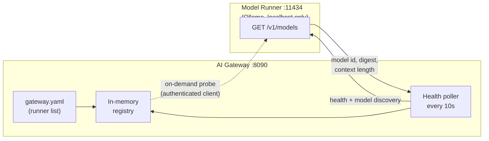
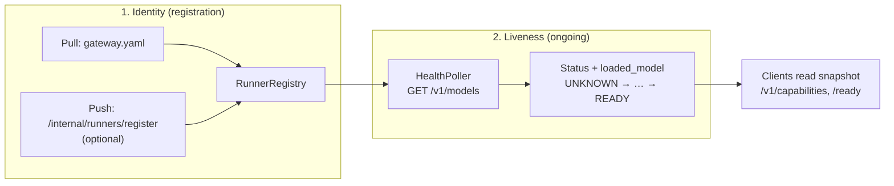
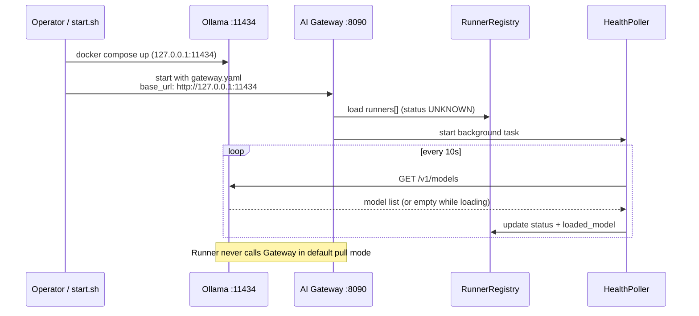
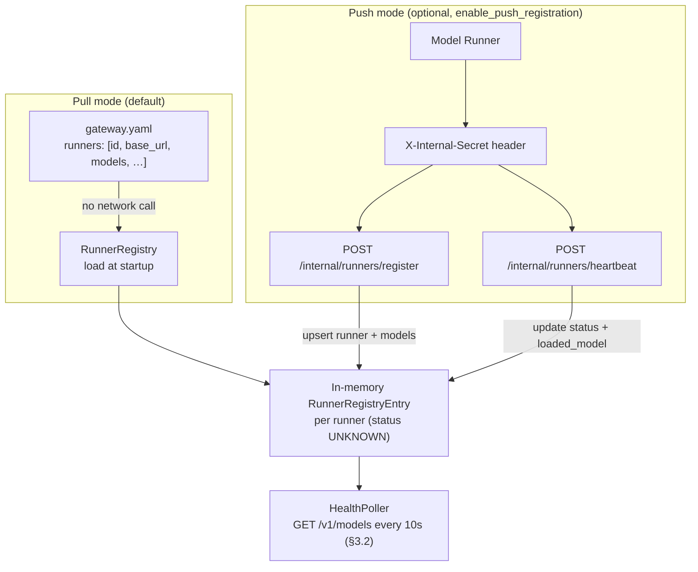
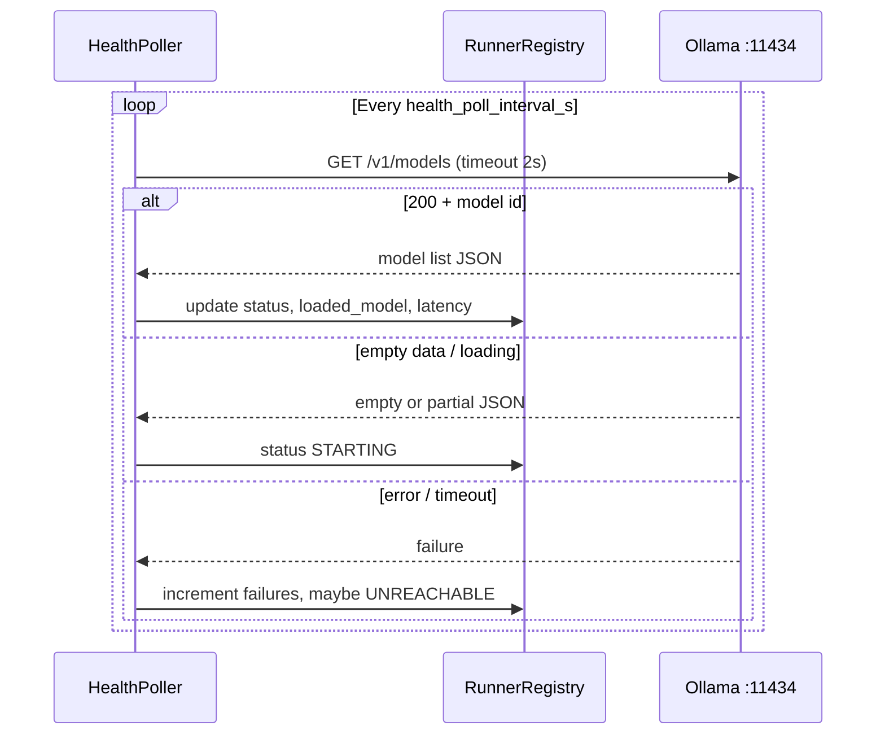
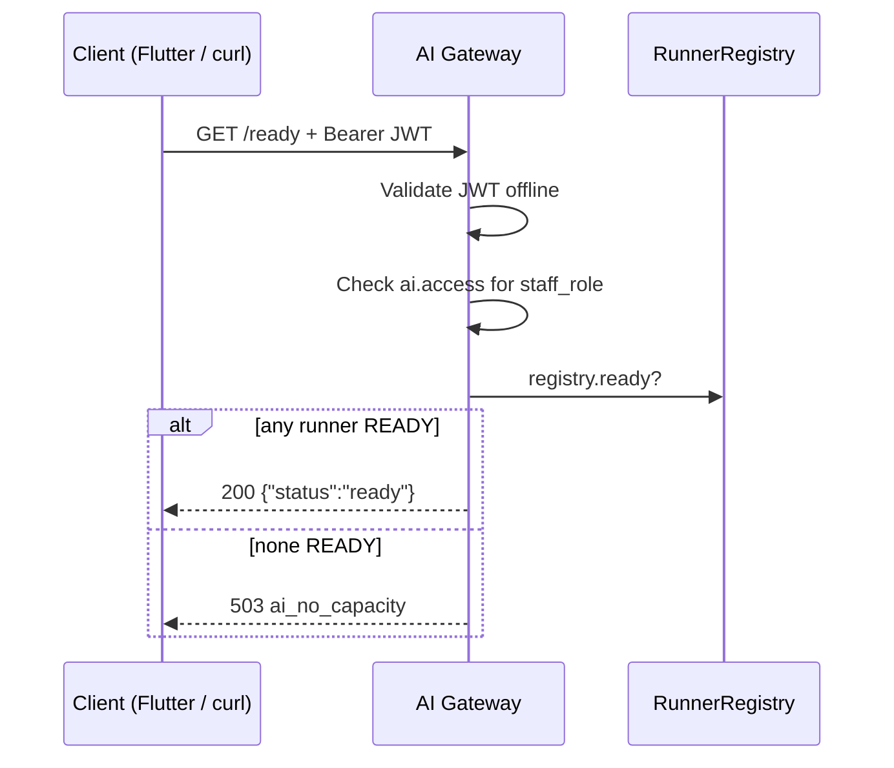

# AI Gateway ↔ Model Runner Interaction & Client Contract

**Feature:** 015-ai-layer-foundation (Phases 1–6 complete)
**Last updated:** 2026-07-17
**Scope:** Control-plane interactions between the AI Gateway and Model Runners, and how clinic clients (you today, Flutter tomorrow) call the Gateway.
**Out of scope:** Runner console (`127.0.0.1:11435`), dashboard UI (`/dashboard`), and any inference/generation — those are separate surfaces; generation is not implemented on the Gateway.

---

## 1. Architecture overview

The AI layer has two logical roles on the clinic server:

| Role | Default address | Reachable by |
| --- | --- | --- |
| **AI Gateway** | `http://<server>:8090` | Clinic clients on the LAN (Flutter, curl, monitoring) |
| **Model Runner** (Ollama) | `http://127.0.0.1:11434` | Gateway only — **not** client-routable |

### Gateway ↔ Runner (at a glance)



**What happens:** the Gateway learns about runners from config, polls them for health and loaded-model info, and keeps an in-memory status (`READY`, `STARTING`, `UNREACHABLE`, etc.). Clients never talk to the runner directly. See **§2** for how discovery works end-to-end; **§3** for registration, polling, and lifecycle detail.

**Security invariants (enforced in code and CI):**

1. The Gateway holds **no** clinic-database credentials and never calls Supabase during request handling (JWT validation is offline).
2. The Runner holds **no** clinic-database credentials.
3. The Runner binds to `127.0.0.1` / AI-internal only; clients must never reach it directly.
4. The Gateway performs **no inference** in this feature — `POST /v1/ai/generate` is a 501 stub.

---

## 2. How the Gateway and Runner discover each other

Discovery in this stack is **asymmetric and operator-configured**. The Gateway learns where runners are and whether they are healthy; runners do not discover, register with, or call the Gateway unless optional push mode is enabled and something on the runner side is explicitly configured to do so.

### 2.1 Who discovers whom

| Party | Discovers | How | Knows Gateway? |
| --- | --- | --- | --- |
| **AI Gateway** | Model runners | Static `base_url` in config (default), optional push registration, then `GET /v1/models` polling | N/A (it is the hub) |
| **Model Runner** (Ollama) | Nothing | Passive HTTP server on `127.0.0.1:11434` | **No** — no callback, no config pointing at `:8090` |
| **Clinic client** (Flutter) | AI Gateway only | App settings / env (`http://<server>:8090`) | Yes (by design) |
| **Operator** (`start.sh`, compose) | Both processes | Fixed ports and paths wired at deploy time | Wires `gateway.yaml` `base_url` to the runner listen address |

There is **no** multicast, service mesh, or mutual handshake. If `base_url` in `gateway.yaml` does not match where Ollama actually listens, the Gateway marks the runner `UNREACHABLE` after consecutive poll failures (see §3.2).

### 2.2 Two layers of “knowing” a runner

Runner knowledge splits into **identity** (is this runner on our list?) and **liveness** (is it up, and what model is loaded?).



| Layer | When | Network direction | Result |
| --- | --- | --- | --- |
| **Identity** | Gateway startup (pull) or on push request | Runner → Gateway only in push mode; pull uses **no** runner contact | `RunnerRegistryEntry` with status `UNKNOWN` |
| **Liveness** | Every `health_poll_interval_s` (default 10 s) | Gateway → Runner | `READY`, `STARTING`, `UNREACHABLE`, `loaded_model`, latency |

§3.1 details registration modes; §3.2 details polling.

### 2.3 Typical bootstrap (`./ai/start.sh`)

On a single clinic host the operator (or `start.sh`) establishes discovery — not the processes themselves:



**Defaults in this repo:** `ai/gateway/config/gateway.yaml` declares `ollama-local` at `http://127.0.0.1:11434`; Ollama compose binds the same host/port. The Gateway’s first successful poll is when it **discovers** the live model digest and context length — config declares intent; polling confirms reality.

### 2.4 Discovery anti-patterns (not supported)

| Expectation | Reality |
| --- | --- |
| Runner auto-registers on startup | **No** — unless you enable push mode and run a registrar |
| Gateway scans the LAN for Ollama | **No** — only configured `base_url` values are polled |
| Client probes `127.0.0.1:11434` | **Forbidden** — runner is not client-routable |
| Gateway learns a new runner without config or push | **No** — in-memory registry is seeded from config/push only |

---

## 3. Gateway ↔ Runner interaction

### 3.1 Runner identity and registration

Runners are known to the Gateway through one of two modes.

#### Registration modes (at a glance)



**Pull:** runners are declared in config and loaded into the registry at process start — no runner contact until the first poll.
**Push:** runners (or an agent on their behalf) call AI-internal endpoints with a shared secret; heartbeats can update status without waiting for the next poll. Both modes can coexist.

#### Pull mode (default, production path)

Runners are declared statically in `gateway.yaml` under `runners`:

```yaml
runners:
  - id: ollama-local
    base_url: http://127.0.0.1:11434
    capabilities:
      - json_grammar
    models:
      - name: qwen3:4b
        source: qwen3:4b
        digest: sha256:3e4cb14174460404e7a233e531675303b2fbf7749c02f91864fe311ab6344e4f
        context_tokens: 8192
        capabilities:
          - json_grammar
```

At startup, `RunnerRegistry` loads each `RunnerConfig` into an in-memory `RunnerRegistryEntry` with status `UNKNOWN`. No network call is made at registration time.

#### Push mode (optional, config-gated, default off)

When `enable_push_registration: true` and `internal_shared_secret` is set, the Gateway also exposes AI-internal endpoints:

| Method | Path | Auth |
| --- | --- | --- |
| `POST` | `/internal/runners/register` | Header `X-Internal-Secret: <internal_shared_secret>` |
| `POST` | `/internal/runners/heartbeat` | Same |

Push endpoints:

- Are mounted only when `enable_push_registration` is true.
- Reject requests whose `Origin` header matches a client CORS origin (`allowed_origins`).
- Are **not** part of the client-facing API.

**Register body:**

```json
{
  "id": "runner-b",
  "base_url": "http://127.0.0.1:11435",
  "capabilities": ["json_grammar"],
  "models": [
    {
      "name": "qwen3:4b",
      "source": "qwen3:4b",
      "digest": "sha256:...",
      "context_tokens": 8192,
      "capabilities": ["json_grammar"]
    }
  ]
}
```

| Field | Type | Required | Description |
| --- | --- | --- | --- |
| `id` | string | Yes | Stable logical runner id (must match on later heartbeats). Upserts if the id already exists. |
| `base_url` | string | Yes | Runner HTTP origin the Gateway will poll (e.g. `http://127.0.0.1:11434`). Must be reachable from the Gateway host only. |
| `capabilities` | string[] | No | Declared capability tags for routing (e.g. `json_grammar`). Used by `RunnerSelector`; not inferred from live polls. |
| `models` | object[] | No | Declared models this runner is expected to serve. Same shape as `runners[].models` in `gateway.yaml`. |
| `models[].name` | string | Yes | Logical model name exposed to clients (e.g. in `/v1/capabilities`). |
| `models[].source` | string | Yes | Upstream pull/load name (Ollama tag), often identical to `name`. |
| `models[].digest` | string | Yes | Pinned `sha256:…` digest for reproducible deployments. |
| `models[].context_tokens` | integer | Yes | Declared context window (> 0). |
| `models[].capabilities` | string[] | No | Per-model capability tags; may be a subset of runner-level `capabilities`. |

**Register response (200):**

```json
{
  "registered": true,
  "id": "runner-b"
}
```

| Field | Type | Description |
| --- | --- | --- |
| `registered` | boolean | Always `true` on success — runner entry was created or updated in the in-memory registry. |
| `id` | string | Echo of the registered runner id. |

**Heartbeat body:**

```json
{
  "id": "runner-b",
  "status": "READY",
  "loaded_model": {
    "name": "qwen3:4b",
    "digest": "sha256:...",
    "context_tokens": 8192,
    "features": ["json_grammar"]
  }
}
```

| Field | Type | Required | Description |
| --- | --- | --- | --- |
| `id` | string | Yes | Runner id previously registered (via push or static config). Unknown ids return `400 bad_request`. |
| `status` | string | Yes | One of `UNKNOWN`, `STARTING`, `READY`, `BUSY`, `DEGRADED`, `UNREACHABLE`. Overwrites registry status until the next poll reconciles it. |
| `loaded_model` | object | No | Currently loaded model snapshot. Omit to update status only. |
| `loaded_model.name` | string | Yes* | Model id/name as reported by the runner (matches poll `data[0].id`). |
| `loaded_model.digest` | string | Yes* | Model digest (`sha256:…`). |
| `loaded_model.context_tokens` | integer | No | Loaded context length in tokens. |
| `loaded_model.features` | string[] | No | Live capability/feature tags from the runner (poll uses this field name; config uses `capabilities`). |

\*Required when `loaded_model` is present.

**Heartbeat response (200):**

```json
{
  "acknowledged": true,
  "id": "runner-b"
}
```

| Field | Type | Description |
| --- | --- | --- |
| `acknowledged` | boolean | Always `true` on success — heartbeat was applied to the registry entry. |
| `id` | string | Echo of the runner id that sent the heartbeat. |

In push mode, heartbeats can update status and loaded model directly. Pull polling still runs for configured runners unless you rely solely on push (both can coexist).

### 3.2 Health polling (primary Gateway → Runner traffic)

The `HealthPoller` background task is the main Gateway→Runner interaction. It starts with the Gateway process and stops on shutdown.

| Parameter | Config key | Default |
| --- | --- | --- |
| Poll cadence | `health_poll_interval_s` | 10 s |
| Per-poll timeout | hardcoded in `openai_client.py` | 2 s |
| Failures before UNREACHABLE | `unreachable_after_failures` | 3 |

**For each configured runner, every poll cycle:**

1. `GET {base_url}/v1/models` (OpenAI-compatible list endpoint)
2. Parse the response and derive a `PollOutcome`
3. Run the lifecycle `transition()` function
4. Update the in-memory registry entry (status, latency, loaded model, failure counter)
5. Emit Prometheus metrics and a structured log record (`endpoint: /internal/health-poll`)

The Gateway does **not** call `POST /v1/chat/completions` or any other inference endpoint in this feature.

#### Runner endpoint: `GET /v1/models`

**Request (from Gateway):**

```http
GET /v1/models HTTP/1.1
Host: 127.0.0.1:11434
```

**Success response (200) — Ollama-compatible example:**

```json
{
  "object": "list",
  "data": [
    {
      "id": "qwen3:4b",
      "object": "model",
      "digest": "sha256:3e4cb14174460404e7a233e531675303b2fbf7749c02f91864fe311ab6344e4f",
      "context_length": 8192
    }
  ]
}
```

**Gateway interpretation:**

| Condition | `PollOutcome` | Typical next status |
| --- | --- | --- |
| HTTP 200, `data[0].id` present | `ok` | `READY` (or `DEGRADED`/`BUSY` per rules) |
| HTTP 200, empty `data` or missing `id` | `loading` | `STARTING` |
| HTTP non-2xx | `error` | Increment failures; may become `DEGRADED` then `UNREACHABLE` |
| Timeout (>2 s) or connection error | `timeout` | Same as error |

On success, the Gateway stores:

- `loaded_model.name` ← `data[0].id`
- `loaded_model.digest` ← `data[0].digest` (empty string if absent)
- `loaded_model.context_tokens` ← `data[0].context_length`
- `last_seen_at` ← UTC now
- `last_latency_ms`, rolling `avg_latency_ms`

Poll traffic carries **no PHI and no clinical data** — only model metadata.

#### Estimated failover timing

With defaults: `health_poll_interval_s × unreachable_after_failures` ≈ **30 seconds** from last good poll to `UNREACHABLE`, and `/ready` flips to 503 when no runner remains `READY`.

### 3.3 Runner lifecycle state machine

States: `UNKNOWN`, `STARTING`, `READY`, `BUSY`, `DEGRADED`, `UNREACHABLE`.

```
[*] --> UNKNOWN
UNKNOWN     --> STARTING     : process up, model loading
STARTING    --> READY        : model loaded, health OK
READY       --> BUSY         : in_flight >= max_inflight (default 1)
BUSY        --> READY        : capacity freed
READY       --> DEGRADED     : elevated latency / sporadic errors
DEGRADED    --> READY        : recovered
READY/DEGRADED --> UNREACHABLE : N consecutive failed polls (default 3)
UNREACHABLE --> STARTING/READY : health recovers
```

**Degraded detection** (implemented): latency above 2000 ms, or average latency more than 2× a prior baseline while the runner was healthy.

**Routing eligibility** (used by `RunnerSelector`, see §3.5):

| Status | Routable |
| --- | --- |
| `READY` | Yes (preferred) |
| `DEGRADED` | Yes (deprioritized) |
| `STARTING`, `UNKNOWN`, `UNREACHABLE`, `BUSY` | No |

**Readiness** (drives `GET /ready`): `registry.ready == any(entry.status == READY)`.

Note: `BUSY` is not considered ready for `/ready` — only strict `READY` counts.

### 3.4 On-demand Gateway → Runner proxy (operator / control plane)

In addition to background polling, authenticated clients can trigger a one-off probe:

| Gateway route | Upstream call | Purpose |
| --- | --- | --- |
| `GET /v1/runners/{runner_id}/models` | `GET {base_url}/v1/models` | Same discovery response the poller uses, wrapped for inspection |

**Success envelope (200):**

```json
{
  "runner_id": "ollama-local",
  "upstream": {
    "method": "GET",
    "path": "/v1/models",
    "base_url": "http://127.0.0.1:11434"
  },
  "poll": {
    "latency_ms": 12.34,
    "http_status": 200
  },
  "body": { "object": "list", "data": [ "..."] }
}
```

**Errors:**

| Situation | HTTP | `error.code` |
| --- | --- | --- |
| Unknown `runner_id` | 400 | `bad_request` |
| Runner timeout | 504 | `ai_timeout` |
| Runner connection failure | 503 | `ai_no_capacity` |

This route does **not** update the registry lifecycle state — only the background poller does that.

### 3.5 Runner selection algorithm (implemented, not yet invoked by client routes)

`RunnerSelector` in `routing/selector.py` implements the routing policy for when inference is added later. It is covered by unit tests but **no client-facing endpoint calls it today** (because generation is stubbed).

Selection order:

1. **Capability match** — runner `declared_capabilities` must include all required capabilities (from config, not from live poll).
2. **Health filter** — keep only `READY` and `DEGRADED`; prefer `READY` over `DEGRADED`.
3. **Least-busy** — lowest `in_flight` count.
4. **Round-robin tie-break** — among equal load, rotate by stable runner `id` sort.

Clients cannot supply runner addresses; only logical capability requirements would be accepted on future generate routes.

### 3.6 What the Gateway does not do to runners (this feature)

| Action | Status |
| --- | --- |
| `POST /v1/chat/completions` | **Not called** |
| Model pull / load / swap | **Not called** (operator handles via Ollama CLI) |
| Push inference traffic | **Not called** |
| Persist runner state to disk/DB | **Not done** (in-memory only) |

---

## 4. Client ↔ Gateway interaction

The Gateway is the **only** AI URL clients should use. All routes below are implemented unless noted.

### 4.1 Base URL and transport

- **Default:** `http://<clinic-server>:8090`
- **TLS:** Not required on trusted LAN in this deployment phase.
- **CORS:** Explicit allowlist in `allowed_origins` (wildcard `*` is rejected at config load).

Every response includes `X-Request-ID` (client may supply one; otherwise the Gateway generates a UUID).

### 4.2 Authentication and authorization

#### Protected vs unprotected routes

| Auth | Routes |
| --- | --- |
| **None** | `GET /health`, `GET /metrics`, `GET /v1/dashboard/auth-config`, `POST /v1/dashboard/sign-in`, `POST /v1/dashboard/auto-sign-in`, static `GET /dashboard/*` |
| **Bearer JWT + `ai.access`** | All other routes listed in §4.3 |

#### Bearer token

```http
Authorization: Bearer <supabase_access_token>
```

The token is a **Supabase-issued JWT**, validated **offline** (no per-request Supabase call):

| Mode | Config | Algorithms |
| --- | --- | --- |
| JWKS (preferred when set) | `jwks_url` | RS256, RS384, RS512, ES256, ES384, ES512 |
| Shared secret | `jwt_secret` | HS256 |

If both `jwks_url` and `jwt_secret` are set, **JWKS takes precedence**.

**Required JWT claims:**

| Claim | Purpose |
| --- | --- |
| `sub` | Staff user ID (`caller_staff_id` in logs) |
| `exp` | Expiry |
| `staff_role` | Clinic role for authorization |
| `nbf` | Validated when present |

#### `ai.access` role gate

After authentication, the Gateway checks `staff_role` against `role_ai_access` (defaults below). Authentication failures (`401`) are always checked before authorization (`403`).

| Role | `ai.access` default |
| --- | --- |
| `administrator` | true |
| `doctor` | true |
| `receptionist` | false |
| `lab_staff` | false |

The map reloads from `config/role_ai_access.yaml` (if present) every 60 s and on `SIGHUP`.

#### Obtaining a token (development)

For manual testing without Flutter:

1. Sign in via Supabase directly, or
2. Use the Gateway dashboard helper (when `supabase_url` + `supabase_anon_key` are configured):

```bash
curl -s -X POST http://localhost:8090/v1/dashboard/sign-in \
  -H 'Content-Type: application/json' \
  -d '{"username":"admin","password":"admin"}' | jq -r .access_token
```

Response includes `access_token`, `staff_role`, and `has_ai_access`.

**Flutter (future):** use the existing Supabase session `access_token` from the clinic app's auth layer — same Bearer header, same validation path. No separate AI login is required.

### 4.3 Client-facing API reference

#### `GET /health` — Liveness

Unauthenticated. Always `200` while the Gateway process is running.

```json
{ "status": "ok" }
```

Use for process monitoring. Does **not** reflect runner availability.

---

#### `GET /ready` — Readiness

Requires JWT + `ai.access`.

| Condition | HTTP | Body |
| --- | --- | --- |
| ≥1 runner in `READY` | 200 | `{ "status": "ready" }` |
| No `READY` runner | 503 | Error envelope, `code: ai_no_capacity` |

Use before enabling AI UI features: if `/ready` is 503, show "AI temporarily unavailable" and keep manual workflows usable.

---

#### `GET /v1/capabilities` — Aggregate capability snapshot

Requires JWT + `ai.access`. Mirrors the live in-memory registry.

```json
{
  "schema_version": "1.0",
  "streaming": true,
  "tasks": [],
  "commands": [],
  "runners": [
    {
      "id": "ollama-local",
      "status": "READY",
      "model": "qwen3:4b",
      "digest": "sha256:3e4cb14174460404e7a233e531675303b2fbf7749c02f91864fe311ab6344e4f",
      "features": [],
      "context_tokens": 8192
    }
  ]
}
```

| Field | Meaning |
| --- | --- |
| `streaming` | Config flag `streaming_enabled` (no streaming endpoint exists yet) |
| `tasks` | Always `[]` — generation not implemented |
| `commands` | Always `[]` — generation not implemented |
| `runners[].status` | Live lifecycle state from polling |
| `runners[].model` / `digest` / `context_tokens` | From last successful `/v1/models` poll |
| `runners[].features` | From loaded model metadata (often empty from Ollama poll) |

Use for feature detection and displaying which model is loaded.

---

#### `POST /v1/ai/generate` — Generation stub

Requires JWT + `ai.access`. **Always returns 501** — performs zero inference and does not contact runners.

```json
{
  "error": {
    "code": "not_implemented",
    "message": "AI generation is not available in this deployment phase.",
    "request_id": "..."
  }
}
```

Request body is accepted but ignored. Clients should call this route to detect whether a generate endpoint exists; today it confirms the route is present but not functional.

---

#### `GET /v1/status` — Control-plane snapshot

Requires JWT + `ai.access`. Operator-oriented JSON: gateway version, uptime, safe config subset, per-runner registry details, poller settings, and an endpoint catalog. Does not leak secrets (`jwt_secret`, `internal_shared_secret`, etc.).

---

#### `GET /v1/runners/{runner_id}/models` — Runner model probe

Requires JWT + `ai.access`. See §3.4.

---

#### `GET /metrics` — Prometheus exposition

Unauthenticated. Text format; intended for local/LAN monitoring scrapers.

| Metric | Labels | Meaning |
| --- | --- | --- |
| `gateway_requests_total` | method, endpoint, status | HTTP request count |
| `gateway_errors_total` | code | Errors by stable code |
| `gateway_runner_health` | runner_id | 1 if status is `READY`, else 0 |
| `gateway_runner_poll_latency_seconds` | runner_id | Poll latency histogram |
| `gateway_inflight_requests` | runner_id | In-flight count (0 in this phase) |

### 4.4 Error contract (all endpoints)

Failures return a uniform envelope:

```json
{
  "error": {
    "code": "<stable_code>",
    "message": "<human-readable, non-sensitive>",
    "request_id": "<matches X-Request-ID / logs>"
  }
}
```

| `code` | HTTP | When |
| --- | --- | --- |
| `bad_request` | 400 | Malformed body, unknown runner ID, validation failure |
| `unauthenticated` | 401 | Missing/invalid/expired JWT |
| `forbidden` | 403 | Valid JWT but role lacks `ai.access` |
| `not_implemented` | 501 | `POST /v1/ai/generate` stub; disabled dashboard features |
| `rate_limited` | 429 | Reserved (not actively enforced in this feature) |
| `ai_no_capacity` | 503 | `/ready` when no runner is `READY`; runner unreachable on proxy |
| `ai_timeout` | 504 | Runner proxy timed out |

**Client guidance:**

- `401` → re-authenticate via Supabase session refresh.
- `403` → hide/disable AI features for this role.
- `503` with `ai_no_capacity` → show temporary unavailability; manual clinic workflows continue.
- `501` with `not_implemented` on `/v1/ai/generate` → generation unavailable; do not retry for inference.

### 4.5 Recommended client flows

#### Flow A — Should we show AI features?

```
1. GET /health          → if not 200, Gateway process is down
2. GET /ready           → if 503, runners not ready (show "AI unavailable")
3. GET /v1/capabilities → inspect runners[].status and model
```

#### Flow B — Feature-detect generation

```
POST /v1/ai/generate (any body)
  → 501 not_implemented = route exists, generation not available
  → 401/403 = auth issue
```

#### Flow C — Flutter integration checklist (when wired)

| Step | Action |
| --- | --- |
| Config | Store Gateway base URL (e.g. `http://192.168.1.50:8090`) in app settings |
| Auth | Attach `Authorization: Bearer ${session.accessToken}` on every protected call |
| Gating | Call `/ready` before showing AI entry points; respect `403` per role |
| Discovery | Call `/v1/capabilities` for model name, context length, runner status |
| Generation | Do **not** expect `/v1/ai/generate` to return content — handle `501` gracefully |
| Resilience | On `503 ai_no_capacity`, degrade to manual workflow; clinic app must work with AI fully down |
| CORS | Ensure the Flutter web origin (if any) is listed in Gateway `allowed_origins` |

---

## 5. Configuration cross-reference

Settings that govern Gateway↔Runner behavior (`ai/gateway/config/gateway.example.yaml`):

| Key | Role in interaction |
| --- | --- |
| `runners[]` | Static runner list (`id`, `base_url`, `capabilities`, `models`) |
| `health_poll_interval_s` | Poll cadence |
| `unreachable_after_failures` | Consecutive failures → `UNREACHABLE` |
| `enable_push_registration` | Enable `/internal/runners/*` |
| `internal_shared_secret` | Auth for push endpoints |
| `streaming_enabled` | Reflected in `/v1/capabilities` only |
| `queue_max_depth`, `timeout_*`, etc. | Parsed and stored; **not used** by any live route in this feature |

Runner packaging: `ai/runners/ollama/docker-compose.yaml` binds Ollama to `127.0.0.1:11434`.

---

## 6. Observability and logging

| Surface | Content |
| --- | --- |
| `GET /metrics` | Request rates, error codes, per-runner health and poll latency |
| `log_dir/gateway.jsonl` | Structured JSON logs with `request_id`, `endpoint`, `outcome`, `caller_staff_id`, `runner_id`, `latency_ms` |
| Poll logs | `endpoint: /internal/health-poll`, `poll_outcome`, `runner_status_change` |

PHI redaction is active unless `log_verbatim: true`. Poll and health traffic should not contain clinical data.

---

## 7. Implementation boundaries (honest scope)

What **is** implemented end-to-end:

- Gateway discovers runners via config (and optionally push registration).
- Gateway polls `GET /v1/models` on a fixed cadence and maintains lifecycle state.
- Gateway exposes health, readiness, capabilities, status, and runner probe to authenticated clients.
- Gateway authenticates offline JWTs and enforces `ai.access`.
- Gateway returns a typed 501 stub on `/v1/ai/generate` with zero runner contact.
- Runner selection algorithm exists and is tested.

What is **not** implemented (do not assume these exist):

- AI text/command generation or streaming.
- Gateway-initiated `POST /v1/chat/completions` to runners.
- Client-selectable runner addresses.
- Rate limiting (code exists in error enum only).
- Queueing, timeouts, and confidence threshold config keys (parsed but unused).
- Any Flutter client code or Supabase schema changes for AI.

---

## 8. Related documents

| Document | Purpose |
| --- | --- |
| `specs/015-ai-layer-foundation/contracts/runner-poll.md` | Normative runner poll contract |
| `specs/015-ai-layer-foundation/contracts/gateway-openapi.yaml` | Client OpenAPI (some response shapes differ slightly from implementation — this doc reflects code) |
| `specs/015-ai-layer-foundation/contracts/error-contract.md` | Error code map |
| `specs/015-ai-layer-foundation/data-model.md` | Registry and lifecycle entities |
| `specs/015-ai-layer-foundation/quickstart.md` | Operator stand-up runbook |
| `docs/ai/phase-capabilities.md` | Phase-by-phase operator guide with curl examples |
| `ai/runners/README.md` | Ollama install and digest pinning |

---

## Appendix A — Quick curl reference

Replace `$TOKEN` with a valid Supabase access token.

```bash
# Liveness (no auth)
curl -s http://localhost:8090/health

# Readiness
curl -s -H "Authorization: Bearer $TOKEN" http://localhost:8090/ready

# Capabilities
curl -s -H "Authorization: Bearer $TOKEN" http://localhost:8090/v1/capabilities | jq .

# Generation stub (always 501)
curl -s -X POST -H "Authorization: Bearer $TOKEN" \
  -H "Content-Type: application/json" \
  -d '{}' http://localhost:8090/v1/ai/generate | jq .

# Runner model probe
curl -s -H "Authorization: Bearer $TOKEN" \
  http://localhost:8090/v1/runners/ollama-local/models | jq .

# Direct runner check (Gateway host only — not from client subnets)
curl -s http://127.0.0.1:11434/v1/models | jq .
```

## Appendix B — Sequence: health poll cycle



## Appendix C — Sequence: authenticated client readiness check


