# AI Platform Architecture

- Purpose: Define the architecture of the AI platform — a provider-independent, multi-tenant AI gateway that serves AI-assisted features to the AiClinic Flutter client without placing prompt logic, provider credentials, or AI business rules in the client.
- Read this when: designing, reviewing, extending, or operating any AI-assisted feature; adding an AI provider; adding an AI capability; or investigating an AI request failure.
- Canonical for: AI platform boundaries, trust model, request lifecycle, prompt ownership, provider routing, AI platform data model, and AI observability.
- Usually paired with: `docs/architecture/01-principles.md`, `docs/architecture/04-backend.md`, `docs/architecture/09-security-rbac.md`, `docs/architecture/10-resilience-and-scale.md`, `.specify/memory/constitution.md`.
- Not covered here: clinical content of specific AI features, prompt text, provider pricing negotiation, clinic business schema, or Flutter widget design.
- Orientation first: `docs/architecture/17a-ai-platform-overview.md` is a short companion overview of the final architecture. Start there if you need the shape of the system rather than its detail.

> **Status:** Architecture proposal. Nothing in this document is implemented. This document
> **supersedes** every earlier AI-related statement in the architecture set and specs,
> including the local-Ollama AI service shown in `docs/architecture/03-deployment-networking.md`.
> Where the two conflict, this document wins; see [§2.6](#26-conflict-with-the-existing-local-ollama-assumption).

---

## Table of Contents

1. [Scope, Inherited Reality, and Constraint Audit](#1-scope-inherited-reality-and-constraint-audit)
2. [Requirement Challenges and Amendments](#2-requirement-challenges-and-amendments)
3. [High-Level Architecture](#3-high-level-architecture)
4. [Components and Responsibilities](#4-components-and-responsibilities)
5. [Contracts](#5-contracts)
6. [Request Lifecycle](#6-request-lifecycle)
7. [Data Flow and Data Model](#7-data-flow-and-data-model)
8. [Sequence Diagrams](#8-sequence-diagrams)
9. [Alternatives Considered](#9-alternatives-considered)
10. [Trade-offs of the Recommended Design](#10-trade-offs-of-the-recommended-design)
11. [Risks and Mitigations](#11-risks-and-mitigations)
12. [Evolution Path](#12-evolution-path)
13. [Operational Concerns](#13-operational-concerns)
14. [Constitution Compliance Check](#14-constitution-compliance-check)
15. [Open Decisions](#15-open-decisions)
16. [Glossary Additions](#16-glossary-additions)

---

## 1. Scope, Inherited Reality, and Constraint Audit

### 1.1 What this document decides

This document decides **where AI responsibilities live, what contracts connect them, and how a
request behaves under success, failure, and abuse**. It deliberately does not decide code
structure, framework choices inside the Worker, prompt wording, or model selection per feature —
those are downstream implementation decisions constrained by the contracts in [§5](#5-contracts).

The design goal, stated once and used as the tie-breaker for every trade-off below:

> **The AI platform must be able to change its prompts, providers, models, validation rules, and
> routing policy without a client release, and the clinic application must be able to evolve its
> schema without an AI platform release.**

Every recommendation in this document is justified by that sentence plus the constitution.

### 1.2 Inherited reality

The AI platform is not being designed on a blank page. These are load-bearing facts about the
existing system, verified in the repository, that constrain the design more than any preference:


| #   | Fact                                                                                                                                                                                                               | Source                                                                                                                | Consequence for the AI platform                                                                                                                                                                                                                                                    |
| --- | ------------------------------------------------------------------------------------------------------------------------------------------------------------------------------------------------------------------ | --------------------------------------------------------------------------------------------------------------------- | ---------------------------------------------------------------------------------------------------------------------------------------------------------------------------------------------------------------------------------------------------------------------------------- |
| F1  | Deployment Tier 1 is **self-hosted Supabase on a clinic PC on a LAN**, "no internet required for daily operations". Tier 3 (Supabase Cloud) is aspirational and unimplemented.                                     | `docs/architecture/03-deployment-networking.md`                                                                       | The AI platform is the **only internet-dependent component** in the product. It must be optional and degrade to "unavailable" cleanly. It also cannot assume the clinic database is reachable from the internet.                                                                   |
| F2  | Each clinic runs its **own GoTrue instance with its own JWT signing secret**. Claims are minted by `auth_internal.build_staff_claims` via the `get_custom_claims` hook.                                            | `backend/supabase/config.toml`, `backend/local/docker-compose.yml`, migrations `20260521170000_`*, `20260611150000_*` | A Cloudflare Worker **cannot validate a clinic's Supabase JWT** without per-clinic trust material. There is no shared JWKS. This is the single most important finding; see [§2.1](#21-amendment-a1-authenticate-every-request-requires-a-trust-bootstrap-that-does-not-exist-yet). |
| F3  | Tenancy is `organizations` → `branches` → `staff_branch_assignments`, all `uuid`. JWT carries `organization_id`, `branch_ids`, `staff_role`, `staff_member_id`, `setup_required`.                                  | `20260516100000_auth_rbac_schema.sql`, `specs/002-auth-rbac/contracts/auth-session.md`                                | The AI platform's tenant key must map to a clinic **installation**, not to `organization_id` alone — `build_staff_claims` currently resolves the org as "oldest row", which is only safe with one org per deployment.                                                              |
| F4  | Client → backend access is **RPC-first** (`snake_case`, `p_`-prefixed params, `rpc_result` envelope) with PostgREST reads for simple RLS-filtered tables. No Edge Functions exist.                                 | `docs/architecture/04-backend.md`, `frontend/lib/features/*/data/`*                                                   | Business-data retrieval for AI context should reuse the existing RPC idiom, not invent a second access path.                                                                                                                                                                       |
| F5  | Constitution forbids microservices, message queues, Kubernetes, and "introducing a custom primary backend service"; requires graceful degradation and forbids subscription enforcement that hard-locks the system. | `.specify/memory/constitution.md`                                                                                     | The AI platform must be a **single deployable unit**, synchronous-first, and explicitly positioned as non-primary. See [§14](#14-constitution-compliance-check).                                                                                                                   |
| F6  | `organizations.subscription_tier` / `subscription_valid_until` and `subscription_cache` exist but have **no writers**. There are no plan, quota, or entitlement tables.                                            | `docs/architecture/05-database.md`, `docs/architecture/10-resilience-and-scale.md`                                    | AI entitlement/quota cannot be sourced from Supabase today. The AI platform must own its own entitlement record — which is also what the constraint "D1 owns AI platform data" demands.                                                                                            |
| F7  | `audit_log` is append-only, populated only by `SECURITY DEFINER` RPCs, and client writes are denied by RLS.                                                                                                        | `20260516100000_auth_rbac_schema.sql`                                                                                 | AI audit trails must live in D1, not `audit_log`. The clinic DB may record only the *acceptance* of AI output as a clinical action.                                                                                                                                                |


### 1.3 The three constraints that actually shape the design

Most of the requirement list is satisfiable in many ways. Three constraints eliminate most of the
design space, so they are stated up front.

#### 1.3.1 The AI platform cannot reach the clinic's database

Under Tier 1 and Tier 2 the clinic database sits behind a home/office router on a private LAN.
There is no inbound path, no stable address, and no certificate. Therefore:

> **Data must flow client → platform, never platform → clinic database.**

This single fact invalidates the most common design for "the AI platform fetches the business data
it needs" and forces the **Context Contract** design in [§5.2](#52-context-contract). It is also,
conveniently, the choice that best preserves decoupling: a platform that queries clinic tables
would be permanently welded to the clinic schema.

#### 1.3.2 Identity is federated per clinic, not centralized

Because every clinic mints its own tokens with its own secret (F2), the AI platform must treat each
clinic installation as an **independent identity provider that it has explicitly enrolled**. That
turns "authenticate every request" into a two-part problem: enroll the clinic once
(establish trust material), then verify per-request tokens against that material.

#### 1.3.3 The execution platform is request-scoped and stateless by default

Cloudflare Workers give effectively unlimited wall-clock time while the client stays connected —
which is exactly what streaming inference needs — but state does not survive the request, and any
coordination between two concurrent requests (for example, "cancel request X from a different
screen") requires an explicitly stateful primitive.

### 1.4 Verified platform capability budget

Design decisions later in this document reference these limits. Values verified July 2026 for the
Workers **Paid** plan; the Free plan is not viable for this workload (10 ms CPU, 50 subrequests).


| Capability                        | Limit                                                                        | Why it matters here                                                                                             |
| --------------------------------- | ---------------------------------------------------------------------------- | --------------------------------------------------------------------------------------------------------------- |
| Worker wall time                  | Unlimited while the client is connected                                      | Long streaming completions are fine. No need for async job plumbing in Phase 0–1.                               |
| Worker CPU time                   | 30 s default, up to 5 min                                                    | Validation, schema checks, and JSON repair are cheap; CPU is not the binding constraint.                        |
| Worker memory                     | 128 MB                                                                       | Never buffer large artifacts in memory; stream through and offload payloads to R2.                              |
| Simultaneous outgoing connections | 6 per request                                                                | Caps in-flight provider calls plus D1/R2 writes per request. Speculative multi-provider racing must be bounded. |
| Worker script size                | 10 MB                                                                        | Bundled prompt artifacts and JSON schemas fit comfortably; large corpora do not.                                |
| D1 max database size              | 10 GB per DB                                                                 | Raw prompt/response text **must not** live in D1 rows at scale.                                                 |
| D1 max row / BLOB                 | 2 MB                                                                         | A single long completion can approach this. Reinforces R2 offload.                                              |
| D1 concurrency                    | Single-threaded per DB; ~1000 q/s at 1 ms queries; overload returns an error | The journal write path must be batched and off the critical path. Never write per-token.                        |
| D1 write cost                     | $1 per million rows written                                                  | Per-token or per-chunk rows would dominate platform cost.                                                       |
| D1 Time Travel                    | 30 days point-in-time recovery                                               | Satisfies platform-data recovery without a bespoke backup design.                                               |
| Durable Objects                   | Unlimited objects; strongly consistent per object; 30 s CPU default          | The correct primitive for strongly consistent per-clinic quota counting.                                        |
| Workers Rate Limiting binding     | GA; `simple` limiter, 10 s or 60 s windows, counters shared by namespace     | Good enough for cheap first-line abuse control; **not** sufficient for quota accounting.                        |
| Workers Analytics Engine          | High-cardinality time-series writes, SQL/GraphQL read                        | Correct home for metrics and analytics, instead of aggregating in D1.                                           |
| Cloudflare AI Gateway             | GA; provider proxy with caching, retries, fallback, token/cost logging       | Optional egress layer; evaluated in [§9.9](#99-cloudflare-ai-gateway-as-the-egress-layer).                      |


---

## 2. Requirement Challenges and Amendments

The brief asks for the requirements to be challenged. Four requirements are underspecified or
internally inconsistent, one conflicts with the existing architecture set, and several necessary
requirements are missing. Each amendment is labelled `A#` and referenced later.

### 2.1 Amendment A1: "authenticate every request" requires a trust bootstrap that does not exist yet

**The requirement as written:** authenticate every request; check clinic AI entitlement and quota.

**Why it cannot be met as stated:** the obvious reading is "the Worker validates the Supabase JWT the
client already has". That works only if the Worker can obtain the signing key of the issuer. In this
product each clinic runs its own GoTrue with its own secret (F2). The Worker would need every
clinic's JWT secret, which means:

- distributing a **long-lived symmetric secret** for a *different security domain* into the AI
platform, so a platform compromise yields the ability to forge clinic sessions — a catastrophic
blast-radius inversion;
- no way to revoke a clinic's AI access without breaking that clinic's own logins;
- token lifetimes and audiences chosen for clinic login, not for a third-party API.

**Amendment:** add an explicit **clinic enrollment** requirement and a **purpose-scoped AI access
token**.

1. A clinic installation is **enrolled once** with the AI platform. Enrollment produces an
  installation identity: an installation ID, an asymmetric signing keypair whose private key stays
   in the clinic's PostgreSQL, and a public key registered in the platform. Enrollment is an
   administrative act, not something a client can perform for itself.
2. Per request, the client obtains a **short-lived AI Access Token (AAT)** — minted by a
  `SECURITY DEFINER` RPC in the clinic database, audience-restricted to the AI platform, lifetime in
   minutes, carrying tenant and actor claims plus the capability scopes the actor is permitted to use.
3. The Worker verifies the AAT signature against the enrolled public key. It never sees a Supabase
  session token.

This keeps Supabase as the **single authority on who the user is and what they may do** (constitution
principle III), keeps AI-specific authorization in the AI platform, and gives the platform a
revocation lever — disable the installation — that has no effect on clinic logins. It also degrades
correctly: if the clinic has no internet, the AAT is simply never used.

Detail in [§5.6](#56-token-contract) and the enrollment sequence in [§8.1](#81-clinic-enrollment-and-trust-bootstrap).

> **Alternative kept on the table:** when Tier 3 (Supabase Cloud) becomes real, cloud-issued tokens
> can be verified against Supabase's published JWKS. The identity component is therefore designed as
> a **pluggable verifier** with two strategies — enrolled-installation keys and OIDC/JWKS — rather
> than hard-coding either.

### 2.2 Amendment A2: "return only validated responses" contradicts "support streaming"

**The conflict:** schema validity and business-rule validity of a structured response are properties
of the *whole* response. They cannot be established while it is still being produced. Requirement [3]
("return only validated responses") and the streaming requirement are therefore mutually exclusive
for structured outputs, taken literally.

**Amendment:** replace "return only validated responses" with **commit-time validation and
provisional streaming**, defined per capability:


| Output mode         | Streaming behaviour                                                                     | Validation point                                                                                                       | Client obligation                                                                                                                       |
| ------------------- | --------------------------------------------------------------------------------------- | ---------------------------------------------------------------------------------------------------------------------- | --------------------------------------------------------------------------------------------------------------------------------------- |
| `prose`             | Stream text chunks as produced                                                          | Lightweight guards during stream (length, stop-sequence, refusal/leak detection); full guard set at end                | May display live. May not persist until the terminal event confirms success.                                                            |
| `structured`        | Stream **progress and provisional fields only**, explicitly flagged `provisional: true` | Schema + business rules validated once on the complete document; a validated envelope is emitted as the terminal event | Must render provisional data as a draft with no commit affordance. Only the validated terminal envelope may be persisted or acted upon. |
| `structured_atomic` | No streaming; heartbeat/progress events only                                            | Same as `structured`                                                                                                   | Nothing to display until completion. Used where a partially-rendered draft would be clinically misleading.                              |


The invariant that survives is the one that actually matters: **no unvalidated content ever reaches
the clinical record.** What changes is that unvalidated content may reach the *screen*, clearly
marked as a draft. This is the standard resolution and it is honest about the trade-off rather than
pretending validation can be streamed.

### 2.3 Amendment A3: "rate limiting should be applied" is underspecified

Rate limiting one dimension is close to useless: a per-user limit does not stop a clinic from
burning its month of budget in an hour, and a per-clinic limit does not stop one runaway client from
starving colleagues. The requirement must name its dimensions and, more importantly, separate two
different concerns that are usually conflated:


| Concern             | Question it answers                              | Enforcement                                                                         | Consistency needed                     | Failure mode                               |
| ------------------- | ------------------------------------------------ | ----------------------------------------------------------------------------------- | -------------------------------------- | ------------------------------------------ |
| **Rate limiting**   | "Too many requests too fast?"                    | Rate Limiting binding, per composite key                                            | Approximate is fine                    | Reject with retry-after                    |
| **Quota / budget**  | "Has this clinic consumed what it paid for?"     | Per-clinic quota Durable Object counter, credited from actual usage and backed by the D1 ledger | Must be strongly consistent per clinic | Reject, or degrade to a cheaper model tier |
| **Concurrency cap** | "Too many *simultaneous* in-flight inferences?"  | Counter in the same per-clinic DO                                                   | Strongly consistent per clinic         | Reject or queue client-side                |
| **Cost ceiling**    | "Is this single request too expensive to allow?" | Pre-flight token estimate vs per-capability ceiling                                 | Local to the request                   | Reject before the provider call            |


**Amendment:** rate limits are evaluated on at least these keys — `installation`,
`installation + actor`, `installation + capability` — and *quota* is a distinct, strongly-consistent
mechanism, not a rate limiter with a long window. Rationale in [§4.3.3](#433-entitlement-quota-and-rate-control).

### 2.4 Amendment A4: "the platform determines what additional data is required" must not mean "the platform knows the clinic schema"

The requirement asks the architecture to define how the platform determines what extra business data
a request needs and how that data is obtained, "while maintaining clean separation of
responsibilities". Left unqualified, the natural implementation is a callback: the Worker queries
Supabase for the patient, the visit, the last labs. That is impossible under Tier 1 (F1,
[§1.3.1](#131-the-ai-platform-cannot-reach-the-clinics-database)) and undesirable in any tier,
because it makes the AI platform a consumer of the clinic schema and turns every clinic migration
into a potential AI outage.

**Amendment:** split the question in two and give each half to the side that legitimately owns it.

- **What is needed** is an AI concern → the platform publishes, per capability, a **Context Contract**:
a versioned list of required and optional *context keys* with their shapes, expressed in a
domain vocabulary (`patient.demographics@v1`, `visit.vitals@v1`, `medication.active_list@v1`), never
in table or column names.
- **How to get it** is a clinic-application concern → the client's **Context Resolver** maps each
context key to an existing Supabase RPC or query and assembles the payload, under the user's own
RLS-enforced permissions.

The result: the platform declares needs and validates what it receives; the clinic app satisfies
needs. Prompt logic stays entirely in the platform — the client never learns *why* a key is needed,
what prompt consumes it, or how it is phrased. Adding a context key to a capability is a platform
release plus a client resolver mapping; changing a clinic table is a client-side mapping change only.

This is the pivotal design decision in the whole document; it is developed in
[§5.2](#52-context-contract), and the alternative is dissected in [§9.4](#94-platform-pulls-context-from-supabase).

### 2.5 Requirements that should be added

These are absent from the brief and are not optional in a clinical product. Each is cheap to honour
if designed in now and expensive to retrofit.


| ID  | Added requirement                                                                                                                                                                                                               | Why it is not optional                                                                                                                                                                         |
| --- | ------------------------------------------------------------------------------------------------------------------------------------------------------------------------------------------------------------------------------- | ---------------------------------------------------------------------------------------------------------------------------------------------------------------------------------------------- |
| A5  | **AI output is advisory and never auto-commits.** Every capability declares its acceptance mode; clinical-content capabilities require an explicit human accept action recorded in the clinic DB with the AI request reference. | Clinical safety and liability. Also the only way the clinic-side `audit_log` can ever answer "why does the record say this?". Aligns with constitution principle IV, "human-gated operations". |
| A6  | **Per-request and per-period cost ceilings, enforced pre-flight.** Estimated input tokens plus max output tokens must fit a per-capability budget, and a per-installation budget must exist independent of request counts.      | A single pasted document can cost more than a clinic's monthly subscription. Request-count quotas do not bound spend.                                                                          |
| A7  | **Idempotency keys on request submission.** A retried submission with the same key returns the original request, never a second inference.                                                                                      | Desktop clients retry on flaky LAN/WAN links. Without this, retries silently double-bill and can produce two divergent drafts.                                                                 |
| A8  | **Per-capability, per-installation, and global kill switches** changeable without deploy.                                                                                                                                       | The only safe response to a provider incident, a prompt regression, or a clinic-specific abuse event.                                                                                          |
| A9  | **A prompt/capability evaluation suite gated in CI.** Golden cases per capability, run against recorded provider fixtures, plus a smaller live smoke set.                                                                       | Prompts are the platform's core logic and they have no type system. Without regression evals, every prompt edit is an unreviewable change.                                                     |
| A10 | **An explicit retention and purge policy** for stored prompts, responses, and context payloads.                                                                                                                                 | The platform will persist clinical text by design ([§2.7](#27-requirement-accepted-as-is-no-phi-redaction)). "Keep everything forever" is a liability and a D1 sizing failure.                 |
| A11 | **A defined degraded mode.** AI unavailable, quota exhausted, and offline are distinct, first-class UI states; no AI failure may block a clinical workflow.                                                                     | Constitution principle V. AI is additive; the clinic must be able to work with it switched off entirely.                                                                                       |
| A12 | **Capability and contract versioning with an overlap window.** Old clients keep working against pinned capability versions for a defined period.                                                                                | Desktop clients update on the clinic's schedule, not the platform's. Breaking a deployed client is a support incident, not a release.                                                          |
| A13 | **A user-visible request reference** on every failure, resolvable by support to a full trace.                                                                                                                                   | The brief's own auditing scenario ("the user says my request failed") is unanswerable without a short identifier the user can read aloud.                                                      |


### 2.6 Conflict with the existing local-Ollama assumption

`docs/architecture/03-deployment-networking.md` states that "AI inference remains local regardless of
tier" and budgets 2–4 GB of RAM for Ollama on the clinic PC, in all three tiers. The brief instead
specifies online providers behind a Cloudflare gateway. These cannot both be true.

**Recommendation:** adopt the cloud gateway as the canonical AI path, and formally retire the local
Ollama assumption, because the constitution's simplicity and low-hardware principles are *better*
served by it — no per-clinic model management, no 3 GB RAM tax on an 8 GB machine, no per-clinic
inference support burden. The consequences must be accepted explicitly:

1. **AI features become internet-dependent** in a product otherwise designed to work offline. This
  must be surfaced as a documented capability difference, not discovered by clinics
   (amendment A11).
2. **Clinical text leaves the clinic** for third-party providers. The brief accepts this
  ([§2.7](#27-requirement-accepted-as-is-no-phi-redaction)); the architecture set and any customer
   agreement must state it.
3. `docs/architecture/03-deployment-networking.md` and the hardware table need updating; the freed
  RAM budget should be reclaimed rather than silently retained.

A local-inference fallback is *not* recommended now, but the provider abstraction is deliberately
shaped so that an on-LAN OpenAI-compatible endpoint could later be registered as just another
provider ([§12.2](#122-phase-map)) — that is the cheapest possible hedge and costs nothing today.

### 2.7 Requirement accepted as-is: no PHI redaction

The brief explicitly excludes PHI redaction. This is accepted as a **product decision**, recorded
here as an accepted risk rather than an oversight (risk R-9 in [§11](#11-risks-and-mitigations)), with
two observations that cost nothing:

- The Context Contract already produces **de facto minimization**: a capability receives exactly the
context keys it declares, so the platform never transmits a whole patient record when it asked for
vitals. Minimization is a free by-product of a decision made for decoupling reasons.
- Because context keys are named and typed, a redaction or pseudonymization step can later be
attached **per context key** rather than by scanning free text. That is the difference between a
future afternoon of work and a rewrite. No redaction is built now.

### 2.8 Amendment summary


| ID     | Amendment                                                                                                                   | Type           | Affects                       |
| ------ | --------------------------------------------------------------------------------------------------------------------------- | -------------- | ----------------------------- |
| A1     | Clinic enrollment + short-lived, audience-scoped AI Access Token; pluggable verifier                                        | Changed        | §4.2, §5.6, §8.1              |
| A2     | Commit-time validation with provisional streaming; three output modes                                                       | Changed        | §5.1, §6.4                    |
| A3     | Rate limiting dimensions named; quota separated from rate limiting                                                          | Clarified      | §4.3.3                        |
| A4     | Context Contract published by platform, resolved by client                                                                  | Clarified      | §5.2, §8.3, §8.4              |
| A5–A13 | Human acceptance, cost ceilings, idempotency, kill switches, evals, retention, degraded mode, versioning, request reference | Added          | throughout                    |
| —      | Retire local-Ollama AI service assumption                                                                                   | Removed        | `03-deployment-networking.md` |
| —      | No PHI redaction                                                                                                            | Accepted as-is | §11 R-9                       |


---

## 3. High-Level Architecture

### 3.1 Architecture style, and why this one

The recommended style is a **capability-driven, contract-first modular monolith at the edge**, built
inside a single Cloudflare Worker: a fixed request pipeline, one genuinely polymorphic boundary
(providers), one narrowly-scoped stateful side-car (a per-clinic quota Durable Object), and a journal
written on the request path.

Four properties define it:

1. **Capability as the unit of extension.** Every AI feature is a declared *capability*
  (`visit.soap_draft@v2`, `patient.summary@v1`, `lab.flag_explain@v1`). A capability manifest
   bundles everything that makes that feature what it is: required context keys, prompt artifact
   reference, output schema, validation rules, routing policy, streaming mode, cost ceiling,
   acceptance mode. Adding an AI feature means adding a manifest and its artifacts — not editing the
   request pipeline. This is what keeps "new AI capabilities" from becoming new code paths.
2. **A fixed pipeline, pluggable stages.** All requests traverse the same ordered stage sequence
  ([§6.1](#61-the-pipeline)). Capabilities parameterize stages; they never reorder or bypass them.
   Uniformity is what makes authentication, quota, validation, journaling, and tracing
   *unbypassable* rather than per-feature good intentions.
3. **One abstraction boundary, not five.** Only two dependencies are hidden behind an interface, and
   only because each will genuinely have several implementations: the **provider port** (one adapter
   per AI provider) and the **token verifier** (enrolled-installation keys today, OIDC/JWKS if Tier 3
   arrives). Provider-independence therefore becomes a structural property — the pipeline contains no
   type that can name a provider. Persistence, logging, and prompt loading are deliberately *not*
   abstracted: they will only ever have one implementation, so an interface there would add a layer to
   read through for a flexibility that never materializes. They are plain modules with clear names.
4. **One deployable unit.** No service decomposition. The constitution forbids microservices and
  queues (F5), and there is no scaling reason to split: the workload is I/O-bound fan-out to
   providers, which Workers handle natively. Splitting would buy nothing and cost a distributed
   system.

**Why not the obvious alternative** — a thin proxy Worker that forwards client requests to providers
with a prompt prepended? Because it cannot satisfy the requirement set: no place to hold quota state,
no validated commit boundary, no journal for auditing, no routing policy, and prompt logic would
inevitably leak back to the client the first time a feature needed a different prefix. The
alternatives are examined properly in [§9](#9-alternatives-considered).

### 3.2 System context

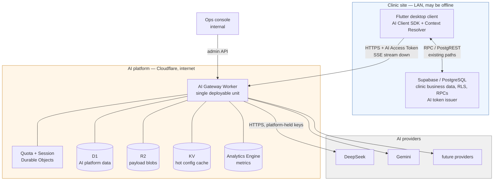


Three properties of this picture are deliberate and worth naming:

- **There is no arrow from the AI platform to Supabase.** Not "we chose not to" — it is not
reachable, and designing as if it were would produce an architecture that only works in a tier
that does not exist yet.
- **Provider credentials exist only inside the edge box.** The client never holds one, and the clinic
server never holds one, so a stolen clinic backup or a decompiled desktop binary yields no
provider access.
- **The clinic box remains fully functional if the edge box disappears.** AI is a strict addition to
the product, not a dependency of it.

### 3.3 Trust and network topology

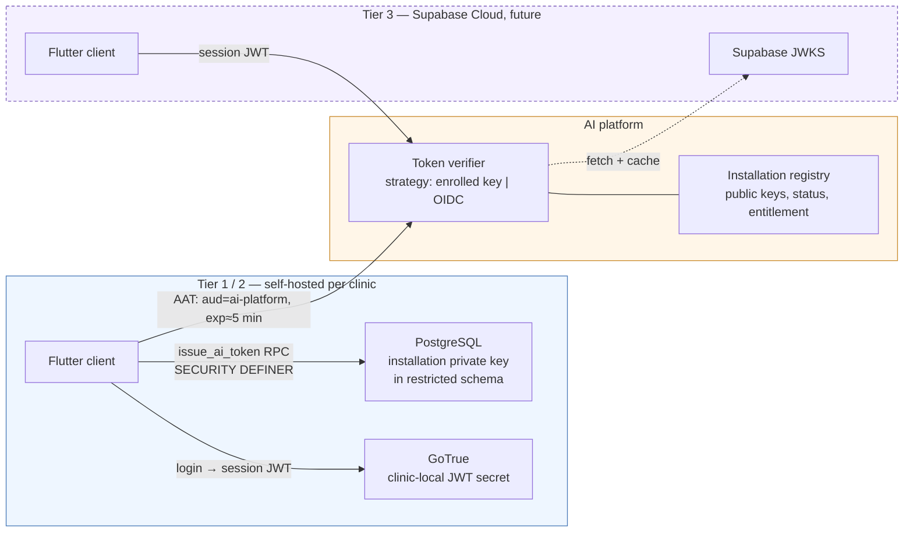


Trust chain, stated as a sequence of assertions each of which is independently verifiable:

1. The platform trusts an **installation** because an operator enrolled it and holds its public key.
2. The platform trusts a **request** because it carries an unexpired token signed by that
  installation's key, with the correct audience, and a `jti` not already seen.
3. The platform trusts the **actor claims** in that token because the clinic's own
  `SECURITY DEFINER` RPC produced them from the authenticated session and the RBAC tables — the
   client cannot fabricate them.
4. The platform trusts **nothing else in the request body**. Context payloads are validated against
  the declared Context Contract and treated as untrusted input, because a compromised client could
   send arbitrary values within its own tenant scope. This is why capability scopes live in the
   *token*, not the body.

The revocation levers, in increasing severity: revoke a `jti`, suspend an actor, rotate the
installation key, suspend the installation, trip a capability kill switch, trip the global kill
switch. All are platform-side and none touch clinic logins.

### 3.4 The three seams

Almost all of this architecture's decoupling value is concentrated in three contracts. If these three
are right, the components behind them can be rewritten freely; if they are wrong, no amount of
internal cleanliness helps.

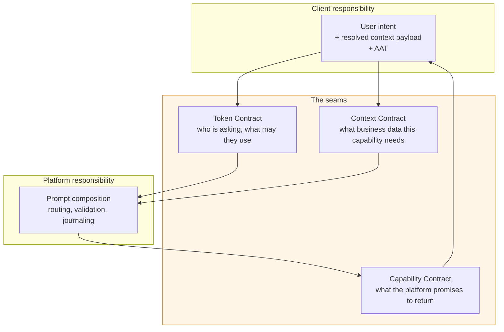


| Seam                    | Owned by                            | Answers                                                                                         | Deliberately excludes                                                                      |
| ----------------------- | ----------------------------------- | ----------------------------------------------------------------------------------------------- | ------------------------------------------------------------------------------------------ |
| **Token Contract**      | Clinic DB issues, platform verifies | Which installation, which actor, which branch, which capability scopes, valid until when        | Any clinic schema detail; any AI configuration                                             |
| **Context Contract**    | Platform declares, client satisfies | Which domain-vocabulary context keys a capability needs, in what shape, required or optional    | Table names, column names, SQL, RPC names — the platform must never learn these            |
| **Capability Contract** | Platform declares                   | Capability id/version, input shape, output schema, streaming mode, acceptance mode, error codes | Prompt text, model name, provider name, routing policy — the client must never learn these |


The asymmetry is the point. The client knows *how to fetch clinic data* and nothing about AI; the
platform knows *everything about AI* and nothing about clinic storage. Neither can be made to depend
on the other's internals because neither is ever told them.

#### 3.4.1 Enforcing the seams

A contract that is only documented decays. Every architecture of this shape fails the same way: a
prompt fragment is added to the client under deadline pressure, then another, and eighteen months later
the prompt logic is in both places. Two automated rules, both cheap, are therefore treated as
**architectural components rather than tests**:

1. **A client-side lint that fails the build** on prompt-like strings, provider names, or model
   identifiers in the Flutter codebase. This is the entire defence against the decay above (R-12), and
   it costs one CI rule.
2. **A client-side contract test** asserting the Context Resolver can produce every context key
   declared by every active capability. This turns the Context Contract from a convention into a
   verified interface, and it catches "the platform requires a key this client cannot produce" before
   release rather than in a clinic.

Neither is glamorous, and together they protect the decoupling more reliably than any component in
[§4](#4-components-and-responsibilities). Details in [§13.5](#135-testing-strategy).

### 3.5 Deliberately not in the platform

Exclusions are as architectural as inclusions. The AI platform does **not**:


| Excluded                                    | Why                                                                                  | Where it lives instead                                                                          |
| ------------------------------------------- | ------------------------------------------------------------------------------------ | ----------------------------------------------------------------------------------------------- |
| Any copy of clinic business tables          | Would create a second source of truth and a sync problem, violating constitution III | Supabase only; context is transient per request                                                 |
| Clinical decision authority                 | Output is advisory (A5)                                                              | Human acceptance recorded in Supabase                                                           |
| The clinic's RBAC rules                     | Duplicated permission logic diverges silently                                        | Supabase RBAC; the platform reads *scopes* from the token and adds only AI-specific entitlement |
| Long-term document storage                  | Not a document store                                                                 | Supabase Storage for clinical attachments; R2 only for the platform's own journal payloads      |
| Session/conversation memory across features | Premature; invites accidental cross-patient context bleed                            | Client passes explicit prior turns when a capability declares a conversational shape            |
| Background/batch inference                  | Constitution forbids queues today; no requirement demands it                         | Deferred to [§12.2](#122-phase-map) Phase 3 with Workflows if a real use case appears           |
| Fine-tuning, embeddings, vector search      | No requirement; would drag in a vector store and an ingestion pipeline               | Deferred; the provider port makes embeddings a later adapter                                    |


---

## 4. Components and Responsibilities

### 4.1 Client-side components

Three components are added to the Flutter application. None of them contains prompt text, model
names, provider names, or AI business rules — that is the acceptance test for this layer.


| Component               | Responsibility                                                                                                                                                                                                                       | Must not                                                                                                                          |
| ----------------------- | ------------------------------------------------------------------------------------------------------------------------------------------------------------------------------------------------------------------------------------ | --------------------------------------------------------------------------------------------------------------------------------- |
| **AI Client SDK**       | Transport concern only: acquire an AAT, submit a capability request with an idempotency key, consume the event stream, surface terminal state, expose cancel, retry on transport errors, hold the last request reference for support | Interpret or transform model output; decide which model/provider; embed prompt fragments; retry after a *terminal* platform error |
| **Context Resolver**    | Map each requested context key to the existing Supabase RPC/query that produces it, assemble a payload conforming to the declared shape, cache short-lived results within a screen                                                   | Decide *which* keys are needed; send unrequested data; bypass RLS by using a privileged path                                      |
| **AI Feature Surfaces** | Per-feature UI: draft rendering, provisional/draft styling, explicit accept/discard, degraded-mode states, request-reference display on failure                                                                                      | Persist provisional content; auto-commit AI output (A5)                                                                           |


The Context Resolver deserves emphasis because it is where a careless implementation would undo the
architecture. It is a **generic registry** — context key → resolver function — not per-feature glue
code. It never sees a capability id and never branches on one; it receives a list of keys and returns
a payload. That property is what allows a new capability requiring an existing key to ship with
**zero** client changes, which in turn is what makes desktop-release cadence tolerable (A12).

### 4.2 Clinic backend components (Supabase)

Additive only. No existing table changes semantics, and every addition follows the established
`public` wrapper → `auth_internal` `SECURITY DEFINER` pattern (F4).


| Component                       | Responsibility                                                                                                                                         | Notes                                                                                                                                                         |
| ------------------------------- | ------------------------------------------------------------------------------------------------------------------------------------------------------ | ------------------------------------------------------------------------------------------------------------------------------------------------------------- |
| **Installation keystore**       | Hold the installation ID and private signing key in a restricted schema, unreadable by `anon`/`authenticated` roles                                    | Only the token-issuing function may read it. Rotation is a supported operation.                                                                               |
| **AI token issuer RPC**         | Verify the caller's session, resolve tenant/actor claims and AI capability scopes from the RBAC tables, mint a short-lived signed AAT, record issuance | The single point where clinic identity is converted into AI platform identity. Rate-limited itself, so a compromised client cannot mint tokens without bound. |
| **Context provider RPCs**       | Return the domain payloads the Context Resolver needs, under the caller's own permissions                                                              | Prefer reusing existing RPCs. New ones are ordinary read RPCs with no AI knowledge — an RPC returning vitals is not "an AI RPC".                              |
| **AI acceptance recording RPC** | Record that a human accepted AI-generated content into a clinical record, storing the AI request reference alongside the domain write                  | Closes the audit loop (A5): the clinic `audit_log` can explain the provenance of a clinical field.                                                            |
| **AI availability flag**        | Store whether this installation is AI-enrolled and the platform base URL                                                                               | Lets the client hide AI affordances entirely for non-AI clinics without probing the network.                                                                  |


> **Boundary note:** the clinic database gains *no* knowledge of prompts, providers, quotas, or AI
> request state. It gains exactly two AI-shaped facts: "I can mint tokens for the AI platform" and
> "a human accepted AI output here". Anything more would migrate AI logic into the wrong layer.

### 4.3 AI Gateway Worker components

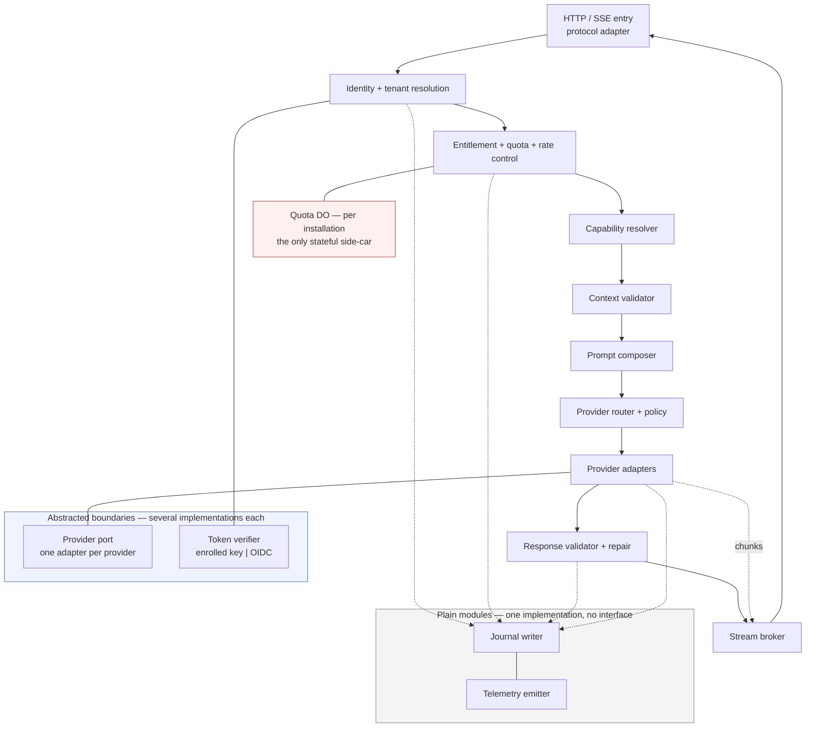


#### 4.3.1 Protocol adapter

Owns the wire format and nothing else: request parsing, size limits, header handling
(idempotency key, client trace id, capability version pin), SSE framing for streaming responses, and
translation of the internal error taxonomy to HTTP status codes plus a stable error body. Keeping
this isolated is what allows a future transport (WebSocket for bidirectional sessions, or plain JSON
for `structured_atomic`) without touching the pipeline.

#### 4.3.2 Identity and tenant resolution

Verifies the AAT through the **verifier port** (enrolled-installation key or OIDC/JWKS, per A1),
enforces audience, expiry, clock skew tolerance, and `jti` replay rejection; loads the installation
record; and produces an immutable **request principal** — installation, organization, branch, actor,
role, capability scopes — that every later stage reads and none may mutate. Installation public keys
and status are read through a KV-cached path so the common case costs no D1 read.

#### 4.3.3 Entitlement, quota, and rate control

Three mechanisms with three different consistency requirements (A3), deliberately not merged:

- **Rate limiting** uses the Rate Limiting binding on composite keys (`installation`,
`installation+actor`, `installation+capability`). Approximate and eventually consistent by design;
its job is to make abuse cheap to reject, not to be exact.
- **Quota and concurrency** use a **per-installation Quota Durable Object**, the only primitive here
that gives serialized, strongly consistent accounting. The DO holds the entitlement snapshot, the
period counters, and the in-flight count. It answers one question before the provider call — "is
there budget left?" — and is **credited with actual usage after** the call completes.
It deliberately does **not** hold pre-flight reservations against the estimated cost of each request:
reservations exist to stop concurrent requests from collectively overshooting the last unit of quota,
which at clinic volumes is an overshoot of one or two requests and no real exposure. The genuinely
dangerous case is a single very expensive request, and the cost ceiling below already blocks that.
Counting after the fact is exact where it matters — in the billing ledger — and one mechanism simpler.
- **Cost ceiling** is a local pre-flight check: estimated input tokens plus the capability's max
output tokens against the capability budget (A6). Rejecting an oversized request before egress is
the cheapest possible protection.

Two rules make this humane rather than hostile, per constitution principle V: quota exhaustion
**never** hard-locks anything (it disables an additive feature and says so), and a *soft* threshold
can downgrade routing to a cheaper model instead of refusing outright.

#### 4.3.4 Capability resolver

Resolves `capability id + requested version` against the **capability registry** to a concrete,
immutable manifest, honouring the client's version pin and the installation's plan-level allowances
(a capability may be entitlement-gated). Rejects unknown or retired capabilities with a distinct,
actionable error, and enforces kill switches (A8) here — the earliest point where a capability is
identified and the last point before any real work happens.

#### 4.3.5 Context validator

Validates the client-supplied context payload against the manifest's Context Contract: required keys
present, shapes conform, sizes within bounds, no unexpected keys accepted silently. Two behaviours
matter architecturally:

- **Missing required context is a typed, machine-readable rejection** carrying the manifest of what
was missing — enabling the self-healing handshake in [§8.4](#84-missing-context-self-healing) so a
slightly stale client recovers automatically instead of failing.
- **Unknown keys are dropped, not forwarded.** A prompt must never be able to receive data the
capability did not declare, or the minimization property in [§2.7](#27-requirement-accepted-as-is-no-phi-redaction) evaporates.

#### 4.3.6 Prompt composer and prompt registry

The heart of requirement [2]. Composes the final provider-bound message set from: the system
instruction artifact, the business-rule fragments the capability declares, the output-format
instruction derived from the capability's schema, the validated context payload rendered through the
capability's template, the user intent, and the output constraints (max tokens, stop sequences,
language, tone, refusal policy).

Two decisions worth defending:

- **Prompt artifacts are versioned, immutable assets deployed with the Worker, and the version in
force is pinned by the capability manifest itself.** Prompts are logic: they deserve code review,
diffs, and CI evals (A9). One artifact, one pointer to it, one answer to "which prompt was live?" —
which is what makes a journal entry trustworthy during an incident. Rollback is a deploy.
The rejected alternative — prompts as editable D1 rows — is examined in
[§9.5](#95-prompts-as-editable-data-in-d1), and the deliberately deferred refinement — a runtime
activation pointer allowing rollback without a deploy — in [§9.14](#914-mechanisms-deliberately-simplified).
- **The output schema is the single source of truth** for the format instruction, the provider's
structured-output/JSON-mode configuration, and the response validator. Deriving all three from one
artifact removes the classic failure where the prompt asks for one shape and the validator demands
another.

#### 4.3.7 Provider router and policy engine

Selects an ordered **candidate chain** of provider+model targets for this capability from routing
policy: capability requirements (structured output support, context window, language, latency class),
installation overrides, cost class, and — where a quota soft threshold was crossed — a degraded tier.
Policy is data, versioned and auditable, not conditionals in the code path; the router also records
*why* a target was chosen, because unexplainable routing is undebuggable in production.

Routing is **stateless**: the chain depends only on the capability, the policy, and this request. There
is no circuit breaker and no shared provider-health state. A sick provider is handled by the retry and
fallback chain on each request, which costs a little latency during an outage but keeps the answer to
"why did this request go to Gemini?" fully contained in one request's own journal entry. Health-based
routing is a deliberate deferral, not an oversight ([§9.14](#914-mechanisms-deliberately-simplified)).

#### 4.3.8 Provider adapters and egress

One adapter per provider, each translating the **canonical inference request** ([§5.3](#53-canonical-inference-representation))
to that provider's wire format and normalizing its responses, streaming chunks, usage counters, and
errors back into the canonical form and the shared error taxonomy. Adapters own: authentication to the
provider, request/response mapping, stream chunk normalization, provider-specific structured-output
mechanics, timeouts, and **classification of every failure as retryable or terminal**. Adapters own
nothing else — no retry decisions, no fallback decisions, no logging policy — because those must be
uniform across providers to be reasoned about.

Provider credentials come from the platform's secret store, are never logged, and are never present
in the journal. The per-request outgoing-connection cap of six ([§1.4](#14-verified-platform-capability-budget))
bounds how much speculative parallelism a routing policy may request.

#### 4.3.9 Response validator and repair

Applies, in order: transport/parse validity → schema conformance → business-constraint checks the
capability declares (enumerations restricted to the clinic's own vocabulary, referential sanity
against the supplied context, numeric ranges, required-section presence) → safety guards (leaked
system instructions, refusals, empty or truncated output, prompt-injection echo).

On failure the validator may attempt a **bounded repair** — a single, budgeted re-ask with the
validation errors appended — then fail terminally with a typed error. Repair attempts are capped and
counted, because an unbounded repair loop is an unbounded bill. Whether repair is allowed is a
per-capability manifest decision, not a global one.

#### 4.3.10 Stream broker

The stream broker relays normalized chunks to the client, enforces provisional-vs-committed semantics
(A2), emits heartbeats so intermediaries do not time out an idle stream, and guarantees that **every
stream ends with exactly one terminal event** — success with the validated payload, or a typed error —
so the client never has to infer completion from silence.

It also owns cancellation, and owns it **without any stateful component**. Cancellation is
connection-scoped: the request is cancelled by closing the stream, the Worker observes the client
disconnect, and the in-flight provider fetch is aborted through its abort signal. This covers the only
cancellation shape the product needs — a user abandoning a generation on the screen that is showing it.

Out-of-band cancellation (from a different window, or after a reconnect) is explicitly **not**
supported, because it would require a per-request Durable Object so that two isolated Worker
invocations could rendezvous — a whole stateful component, with its own lifecycle and failure modes, in
service of one rare interaction. The reasoning and the path to adding it are in
[§9.7](#97-connection-scoped-cancellation-versus-a-session-durable-object).

#### 4.3.11 Journal writer

Records the auditable life of every request: submission, principal, capability and prompt artifact
versions, context key names and sizes, provider attempts with outcomes and latencies, token usage and
cost, validation results, terminal state, and the payload pointers. Two rules dictate its shape:

- **The request row is written synchronously, before the stream opens.** A request that a user saw
must always have a record, so the record is created at the moment the request is accepted and updated
with the terminal state when it finishes. One D1 insert costs single-digit milliseconds against an
inference measured in seconds, so deferring it to a post-response continuation would trade audit
completeness for latency nobody can perceive — the wrong way round for a platform whose hardest
requirement is explaining a failure after the fact. Bulk detail (per-attempt rows, payload blobs,
metrics) is still written after the response, because losing those degrades diagnosis without losing
the existence of the request.
- **Payloads go to R2, pointers go to D1.** Prompts, context payloads, and raw responses are blobs
keyed by request; D1 holds fixed-width metadata. This respects the 2 MB row limit, the 10 GB
database ceiling, and the per-row write cost — and keeps the D1 schema queryable for support
lookups rather than bloated with text.

#### 4.3.12 Telemetry emitter

Structured logs with a propagated trace id, spans per pipeline stage and provider attempt, and
metrics as Analytics Engine data points (capability, provider, model, outcome, latency buckets, token
counts, cost, installation). Metrics go to Analytics Engine rather than D1 because D1 is
single-threaded and metric writes are the highest-volume, least-transactional data in the system —
putting them in D1 would make observability compete with the audit trail for the same write budget.

### 4.4 Storage ownership


| Store                | Owns                                                                                                                                             | Never holds                                                 | Consistency           | Rationale                                                                             |
| -------------------- | ------------------------------------------------------------------------------------------------------------------------------------------------ | ----------------------------------------------------------- | --------------------- | ------------------------------------------------------------------------------------- |
| **D1**               | Installations, entitlements, routing policy, request journal metadata, usage ledger, rollups, admin audit | Clinic business records; large text; high-frequency metrics | Strong, single-writer | The stated platform datastore; ideal for low-volume relational truth                  |
| **R2**               | Prompt/context/response payload blobs, provider raw exchanges                                                                                    | Anything needed on the hot path for authorization           | Read-after-write      | Only economical home for large text; keeps D1 small                                   |
| **KV**               | Cached installation/verifier material, kill-switch flags, routing policy snapshot                                    | Anything requiring immediate global consistency             | Eventual, seconds     | Removes D1 reads from the hot path; acceptable staleness for config                   |
| **Durable Objects**  | Per-installation quota and concurrency counters — nothing else                                                          | Long-term records; per-request state                                           | Strong per object     | The only primitive giving serialized counting; scoped to one job                             |
| **Analytics Engine** | Metrics and analytics time series                                                                                                                | Auditable records of record                                 | Append-only, sampled  | High cardinality, high volume, cheap; wrong tool for audit, right tool for dashboards |
| **Secret store**     | Provider API keys, signing material                                                                                                              | Anything logged or journaled                                | —                     | Credential isolation                                                                  |


The one nuance worth flagging: **KV's eventual consistency is a deliberate acceptance**, so a
kill switch or quota-plan change can take seconds to propagate globally. For quota that would be
unacceptable, which is exactly why quota lives in a DO instead. For config, seconds are fine, and
paying D1 latency on every request to avoid them would be a poor trade.

Note the deliberate absence of a store for live request state. There is **one** Durable Object class
in the whole platform, it holds counters, and it is per-installation rather than per-request. An
in-flight AI request exists only as an open connection plus a journal row.

### 4.5 Control plane

A small internal surface, separate from the client-facing API and separately authenticated
(operator identity, not clinic identity):


| Function                     | Purpose                                                                        |
| ---------------------------- | ------------------------------------------------------------------------------ |
| Installation lifecycle       | Enroll, rotate keys, suspend, resume, delete                                   |
| Entitlement management       | Assign plan, set quota and budget, grant/revoke capabilities                   |
| Kill switches                | Global, per capability, per installation, per provider (A8)                    |
| Capability availability      | Grant, gate, deprecate, or retire a capability version for a plan or installation |
| Routing policy               | Publish a new versioned policy; canary; roll back                              |
| Support lookup               | Resolve a request reference to its full trace and payloads (A13)               |
| Operational dashboards       | Health, error taxonomy breakdown, provider latency and cost, quota consumption |


Every control-plane mutation is journaled with the operator identity. Routing policy and kill-switch
changes are the highest-leverage actions in the entire system — an unaudited change to where requests
go is indistinguishable from an attack.

### 4.6 Responsibility matrix


| Component                  | Owns the decision                            | Must not know                                                | Can be replaced without touching        |
| -------------------------- | -------------------------------------------- | ------------------------------------------------------------ | --------------------------------------- |
| AI Client SDK              | Transport, retry-on-transport, cancel intent | Prompts, providers, schemas beyond the declared output shape | Pipeline, prompts, providers            |
| Context Resolver           | How to obtain a context key                  | Which keys a capability needs, or why                        | Capabilities, prompts                   |
| Token issuer RPC           | Actor identity and AI scopes                 | Platform internals beyond audience and key                   | Entire platform internals               |
| Identity stage             | Whether the caller is authentic              | Clinic schema, provider details                              | Verifier strategy (enrolled key ↔ OIDC) |
| Entitlement stage          | Whether the request is allowed to cost money | Prompt content, provider identity                            | Billing model, plan structure           |
| Capability resolver        | Which manifest governs this request          | Provider wire formats                                        | Registry storage location               |
| Context validator          | Whether supplied context is acceptable       | How context was fetched                                      | Client implementation                   |
| Prompt composer            | The exact provider-bound prompt              | Which provider will receive it                               | Providers, routing                      |
| Provider router            | Which target chain to attempt                | Provider wire formats, prompt text                           | Provider set, policy content            |
| Provider adapter           | Wire translation and failure classification  | Prompt intent, quota, journaling                             | Other adapters, pipeline                |
| Response validator         | Whether output may be returned               | Which provider produced it                                   | Providers, prompts                      |
| Stream broker              | Delivery and cancellation                    | Business meaning of content                                  | Transport protocol                      |
| Journal writer             | What is recorded and where                   | Business meaning of content                                  | Storage layout, retention policy        |


---

## 5. Contracts

Described at interface level — fields and semantics, not encodings or code. These are the artifacts
that need review before implementation starts, because they are the parts that are expensive to change
later.

### 5.1 Capability manifest

The manifest is the platform's declaration of an AI feature. It is immutable per version; changing
anything semantically meaningful produces a new version.


| Field group              | Contents                                                                                                                                                           | Consumed by                                                               |
| ------------------------ | ------------------------------------------------------------------------------------------------------------------------------------------------------------------ | ------------------------------------------------------------------------- |
| **Identity**             | Capability id, semantic version, human title, lifecycle state (`active`, `deprecated`, `retired`), successor id                                                    | Capability resolver, clients (discovery)                                  |
| **Access**               | Required capability scope, minimum plan tier, allowed staff roles, kill-switch flag                                                                                | Identity + entitlement stages                                             |
| **Input**                | User-intent shape, optional prior-turn shape, size limits, allowed languages                                                                                       | Protocol adapter, context validator                                       |
| **Context requirements** | Ordered list of context keys with `required`/`optional`, shape reference, max size, freshness hint                                                                 | Context validator, client Context Resolver ([§5.2](#52-context-contract)) |
| **Prompt binding**       | System instruction artifact ref, business-rule fragment refs, context rendering template ref, output-format instruction derivation rule                            | Prompt composer                                                           |
| **Output**               | Mode (`prose` / `structured` / `structured_atomic`), output schema ref, business validation rule refs, repair policy (allowed, max attempts)                       | Validator, stream broker                                                  |
| **Routing**              | Routing policy ref, required provider features (structured output, context window, language), latency class, degraded-tier policy                                  | Provider router                                                           |
| **Economics**            | Max input tokens, max output tokens, per-request cost ceiling, quota weight                                                                                        | Entitlement stage                                                         |
| **Governance**           | Acceptance mode (`advisory_display`, `human_accept_required`, `auto_apply` — the last one disallowed for clinical content per A5), retention class, eval suite ref | Client, journal, CI                                                       |


Two properties are load-bearing:

- **A manifest is data, not code.** Adding a capability that reuses existing context keys, an existing
routing policy, and an existing validation rule set requires no pipeline change and no client change.
- **A manifest never names a provider or a model.** It names *requirements*; the routing policy maps
requirements to targets. This is what makes "replace a provider with minimal changes" true rather
than aspirational.

### 5.2 Context contract

A **context key** is a stable, versioned name for a unit of business data in domain vocabulary. The
naming rule is strict and worth stating as a rule because violating it silently recouples the layers:

> A context key names **what the data means to a clinician**, never where it is stored.
> `visit.vitals@v1` is correct; `visits_vitals_table@v1` or `get_visit_vitals_rpc@v1` is not.


| Aspect        | Specification                                                                                                                                                                                                           |
| ------------- | ----------------------------------------------------------------------------------------------------------------------------------------------------------------------------------------------------------------------- |
| Key format    | `domain.concept@vN` — e.g. `patient.demographics@v1`, `visit.vitals@v1`, `visit.chief_complaint@v1`, `medication.active_list@v1`, `lab.recent_results@v1`, `clinic.branch_profile@v1`                                   |
| Shape         | Each key has a platform-published shape (field names, types, cardinality, units) — the *only* schema knowledge shared between the two sides                                                                             |
| Direction     | Client → platform, always ([§1.3.1](#131-the-ai-platform-cannot-reach-the-clinics-database))                                                                                                                            |
| Discovery     | Client fetches capability manifests (cached, revalidated by version/etag) and knows the key list before submitting                                                                                                      |
| Self-healing  | If a client submits without a required key (stale cache), the platform rejects with `context_required` plus the missing-key manifest; the client resolves and resubmits once ([§8.4](#84-missing-context-self-healing)) |
| Authorization | Resolution happens under the caller's own Supabase permissions and RLS; the platform additionally verifies that supplied context is branch-consistent with the token's claims                                           |
| Evolution     | Adding an optional key is backward compatible. Adding a required key, or changing a shape, requires a new key version and a new capability version (A12)                                                                |
| Minimization  | Only declared keys are forwarded to the composer; extras are dropped ([§4.3.5](#435-context-validator))                                                                                                                 |


**Freshness and trust.** Context is a client-supplied snapshot, so it can be stale or tampered with
within the caller's own permission scope. The architecture accepts this and compensates: the journal
records exactly what context was used (so any output can be explained), capabilities that depend on
freshness declare a hint the client honours, and no capability may take an irreversible action from
context alone — output is advisory (A5). Attempting to make the platform authoritative over context
freshness would require it to query the clinic database, which is precisely the coupling being
avoided.

### 5.3 Canonical inference representation

An internal, provider-neutral representation sits between the composer and the adapters. Everything
upstream of the adapters speaks only this; nothing upstream may contain a provider-shaped field.


| Element                | Contents                                                                                                                                                                                                                                      |
| ---------------------- | --------------------------------------------------------------------------------------------------------------------------------------------------------------------------------------------------------------------------------------------- |
| Canonical request      | Ordered role-tagged message parts, output format directive (free text / JSON with schema), sampling constraints, max output tokens, stop conditions, tool/function declarations (reserved for future), stream flag, deadline, correlation ids |
| Canonical stream chunk | Sequence number, kind (`text_delta`, `partial_structured`, `usage`, `provider_note`), payload, terminal flag                                                                                                                                  |
| Canonical result       | Final content, usage counters (input/output/cached tokens), provider+model actually used, finish reason, provider request id, timing breakdown                                                                                                |
| Canonical error        | Taxonomy code, retryability, provider-native code and message (for diagnostics only), whether the attempt consumed budget                                                                                                                     |


**Why not simply use an OpenAI-compatible shape as the internal format**, given that most providers
accept it? Because "OpenAI-compatible" is a moving target defined by another vendor: adopting it means
inheriting its quirks, and every provider's partial compatibility becomes a leak into the core. A
deliberately small canonical form — modelled on the common subset, but owned by this platform —
costs one mapping layer and keeps the core stable. This is examined further in
[§9.10](#910-openai-compatible-wire-format-as-the-internal-representation).

### 5.4 Error taxonomy

A closed, stable set of codes. Clients branch on these; providers' native errors are always mapped into
them and never surfaced raw.


| Code                                        | Meaning                                                 | Retryable                | Consumes quota      | Client behaviour                                                          |
| ------------------------------------------- | ------------------------------------------------------- | ------------------------ | ------------------- | ------------------------------------------------------------------------- |
| `unauthenticated`                           | Missing/invalid/expired token                           | After re-mint            | No                  | Silently re-mint AAT and retry once                                       |
| `installation_suspended`                    | Enrollment revoked or inactive                          | No                       | No                  | Hide AI features; instruct admin                                          |
| `forbidden_capability`                      | Actor scope or plan does not allow this capability      | No                       | No                  | Hide the affordance for this role                                         |
| `rate_limited`                              | Too many requests too fast                              | Yes, after `retry_after` | No                  | Backoff, show transient notice                                            |
| `quota_exhausted`                           | Period quota or budget consumed                         | Not until period reset   | No                  | Show quota state, offer admin path                                        |
| `request_too_large`                         | Input or context exceeds capability limits              | No                       | No                  | Ask user to shorten/narrow selection                                      |
| `context_required`                          | Required context keys missing                           | Yes, after resolving     | No                  | Resolve keys and resubmit once ([§8.4](#84-missing-context-self-healing)) |
| `context_invalid`                           | Supplied context violates declared shape                | No                       | No                  | Bug: report with request reference                                        |
| `capability_unknown` / `capability_retired` | Unknown or withdrawn capability/version                 | No                       | No                  | Prompt for app update                                                     |
| `capability_disabled`                       | Kill switch active                                      | Later                    | No                  | Show temporary-unavailable state                                          |
| `provider_unavailable`                      | All candidate targets failed retryably                  | Yes                      | Partially, recorded | Offer retry; degraded notice                                              |
| `provider_rejected`                         | Provider refused content (safety filter etc.)           | No                       | Yes                 | Explain; do not auto-retry                                                |
| `validation_failed`                         | Output failed schema/business rules after repair budget | Yes, at user discretion  | Yes                 | Offer retry; never show invalid content                                   |
| `cancelled`                                 | Cancelled by the user                                   | —                        | Partially, recorded | Return to idle                                                            |
| `timeout`                                   | Deadline exceeded                                       | Yes                      | Partially, recorded | Offer retry                                                               |
| `internal_error`                            | Platform defect                                         | Yes                      | No                  | Show reference; report                                                    |


Every error response carries the **request reference** (A13), the trace id, and whether a retry is
safe — so the client never has to guess, and support never has to ask the user to reproduce.

### 5.5 API surface and streaming protocol


| Surface                        | Purpose                                                                                               | Notes                                                                              |
| ------------------------------ | ----------------------------------------------------------------------------------------------------- | ---------------------------------------------------------------------------------- |
| Capability discovery           | Fetch active manifests for this installation/plan                                                     | Cacheable and revalidated; drives the Context Resolver                             |
| Submit request                 | Create an AI request for a capability, with intent, context payload, idempotency key, and version pin | Returns the request reference immediately; streams if the capability's mode allows |
| Cancel                         | Cancel an in-flight request by closing its stream                                                     | Connection-scoped; no separate endpoint, no cross-invocation state                 |
| Get request                    | Terminal state, and the validated result if the request completed                                     | Answers "what happened to this request?" after the stream is gone                  |
| Usage summary                  | Current period consumption and entitlement for the installation                                       | Powers in-app quota display and future billing UI                                  |
| Support lookup (control plane) | Resolve a request reference to full trace and payloads                                                | Operator-only                                                                      |


**Streaming protocol rules** (server-sent events downstream, single request upstream):

1. A stream always opens with an **accepted** event carrying the request reference — so the user has
  a support handle even if everything after this fails.
2. Content events are explicitly typed and, for structured modes, explicitly flagged provisional
  (A2).
3. Heartbeats keep intermediaries from closing an idle stream during a slow first token.
4. Exactly one terminal event ends every stream: `completed` with the validated result, or `failed`
  with a taxonomy code, or `cancelled`.
5. **Closing the stream cancels the request.** The platform cannot distinguish a user pressing Cancel
  from a network drop, and deliberately does not try: both abort the provider call and end the request
   as `cancelled`. The consequence, stated plainly, is that a connection lost mid-generation loses that
   generation and the user retries. This is the price of having no per-request state, and it is
   affordable because generations are seconds long and every request is independently retryable.
6. **The request always leaves a record, even when the result does not.** The journal row exists from
  the moment the request is accepted ([§4.3.11](#4311-journal-writer)), so a cancelled or dropped
   request is still fully explainable afterwards — which is what the audit requirement actually asks
   for.

### 5.6 Token contract


| Claim           | Purpose                        | Notes                                                    |
| --------------- | ------------------------------ | -------------------------------------------------------- |
| `iss`           | Installation id                | Selects the verification key                             |
| `aud`           | AI platform audience           | Prevents reuse of clinic session tokens and vice versa   |
| `sub`           | Actor: staff member id         | Attribution and per-actor rate limits                    |
| `org`, `branch` | Tenant scope                   | Cross-checked against supplied context                   |
| `role`          | Staff role                     | Capability gating and audit                              |
| `scopes`        | Permitted AI capability scopes | Derived server-side from RBAC; **never** client-supplied |
| `jti`           | Unique token id                | Replay rejection                                         |
| `iat`, `exp`    | Short lifetime, minutes        | Limits the value of a stolen token                       |
| `ver`           | Token contract version         | Enables rotation of the contract itself                  |


Deliberate omissions: no patient identifiers (a token is not a resource grant), no quota state (owned
by the platform and would be stale instantly), no provider or model hints (the client has no say).

### 5.7 Versioning and compatibility rules


| Artifact        | Versioning                          | Compatibility promise                                                                                                                   |
| --------------- | ----------------------------------- | --------------------------------------------------------------------------------------------------------------------------------------- |
| Capability      | Semantic, in the id (`@v2`)         | Deprecated versions remain servable for a defined overlap window (A12); retirement is announced through discovery before it is enforced |
| Context key     | Versioned per key                   | New optional keys are backward compatible; required keys or shape changes force a new capability version                                |
| Output schema   | Versioned with the capability       | Additive optional fields allowed in place; anything else is a new version                                                               |
| Prompt artifact | Immutable, pinned by the capability | Swapping a prompt is a new capability *build*, not a new capability version, as long as the output schema and behaviour contract hold; guarded by the eval suite (A9) |
| Routing policy  | Versioned, independently deployable | Invisible to clients by construction                                                                                                    |
| Error taxonomy  | Additive only                       | Clients must treat unknown codes as `internal_error`                                                                                    |
| Token contract  | `ver` claim                         | Overlapping acceptance during rotation                                                                                                  |


The asymmetry to internalize: **prompts, models, providers, and routing can change hourly without
client awareness; capability ids, context shapes, output schemas, and error codes cannot.** The
architecture's job is to keep as much as possible in the first group.

---

## 6. Request Lifecycle

### 6.1 The pipeline

Every request traverses the same ordered stages. The ordering principle is **cheapest and most
certain rejection first**: no request should reach a paid provider call until everything that can be
known locally has been checked.


| #   | Stage                                 | Decides                                                                  | Typical cost                            | Failure code                                                      |
| --- | ------------------------------------- | ------------------------------------------------------------------------ | --------------------------------------- | ----------------------------------------------------------------- |
| 1   | Ingress and shape                     | Is this a well-formed, size-bounded request?                             | Microseconds, no I/O                    | `request_too_large`, `internal_error`                             |
| 2   | Idempotency check                     | Is this a replay of an existing request? (A7)                            | One cached/D1 lookup                    | returns the original request                                      |
| 3   | Identity                              | Is the token authentic, unexpired, correctly scoped, non-replayed?       | KV-cached key, no D1 in the common case | `unauthenticated`, `installation_suspended`                       |
| 4   | Entitlement                           | Is this installation AI-enabled and this capability permitted?           | KV-cached snapshot                      | `forbidden_capability`, `installation_suspended`                  |
| 5   | Rate limit                            | Is the caller within burst limits on all keys?                           | Rate Limiting binding                   | `rate_limited`                                                    |
| 6   | Capability resolve                    | Which immutable manifest governs this? Is it killed or retired?          | KV-cached registry                      | `capability_unknown`, `capability_retired`, `capability_disabled` |
| 7   | Context validate                      | Is the supplied context complete, well-shaped, tenant-consistent?        | CPU only                                | `context_required`, `context_invalid`                             |
| 8   | Cost pre-flight and quota check       | Does this fit the request ceiling and the remaining budget?              | One Quota DO round trip                 | `request_too_large`, `quota_exhausted`                            |
| 9   | Journal the request                   | Create the durable record before any work begins                         | One D1 insert                           | `internal_error`                                                  |
| 10  | Prompt composition                    | Build the canonical request from artifacts, context, and constraints     | CPU only                                | `internal_error`                                                  |
| 11  | Route and invoke                      | Attempt targets in order, with bounded retry and fallback                | Provider latency — dominates everything | `provider_unavailable`, `provider_rejected`, `timeout`            |
| 12  | Stream relay                          | Deliver normalized chunks, provisional where applicable                  | Streaming duration                      | `cancelled`                                                       |
| 13  | Validate (and optionally repair)      | Is the complete output schema-valid and business-valid?                  | CPU, plus one bounded re-ask            | `validation_failed`                                               |
| 14  | Terminal emit                         | Emit exactly one terminal event with the validated result or typed error | Microseconds                            | —                                                                 |
| 15  | Record outcome                        | Update the journal row with terminal state; credit actual usage to the Quota DO | One D1 update, one DO call      | —                                                                 |
| 16  | Detail and telemetry                  | Attempt rows to D1, payloads to R2, metrics to Analytics Engine           | Post-response continuation              | never fails the request                                           |


Stages 1–10 are collectively the *guard*; they are designed to complete in low tens of milliseconds
with at most a handful of cached lookups and one write. Stage 11 is where all the latency and all the
money is. Stage 16 alone runs after the client has its answer, and it carries only detail that
improves diagnosis — the *existence* of the request is already durable from stage 9, so no request a
user witnessed can vanish from the record.

### 6.2 Why this order and not another

Three orderings that look reasonable and are wrong:

- **Validating context before authenticating** would let an unauthenticated caller consume CPU on
arbitrary payloads. Identity is stage 3 for a reason.
- **Checking quota before resolving the capability** would be impossible to price: quota weight and
cost ceilings are *capability* properties.
- **Journaling before the guard passes** would fill the journal with rejected noise and put a D1 write
in the path of every abusive request — turning the cheap rejection path into an expensive one. Stage 9
sits exactly where a request stops being a candidate and starts being work; rejections are counted in
metrics, not journaled as requests.

The one debatable placement is idempotency at stage 2, before identity. It is placed there so a
retried submission returns the original result even if the token has since expired — a common desktop
scenario. The lookup is keyed by installation-scoped idempotency key, and a mismatched installation is
rejected at stage 3, so this cannot leak across tenants.

### 6.3 Request state machine

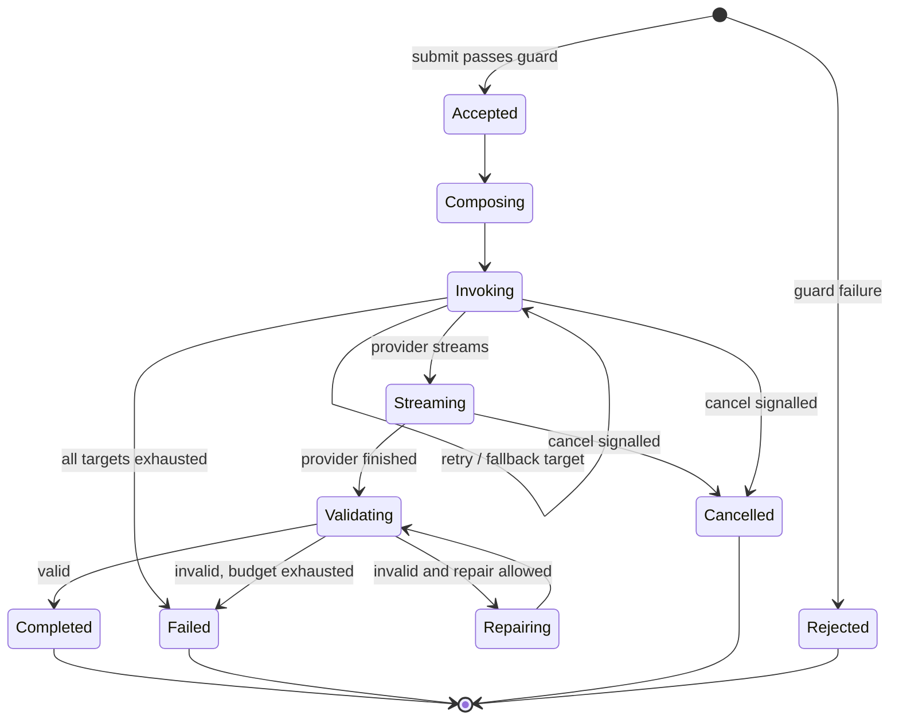


`Completed`, `Failed`, `Cancelled`, and `Rejected` are terminal and immutable. Every state transition
is journaled with a timestamp, which is what makes the support flow in
[§8.9](#89-support-audit-trace) a lookup rather than an investigation.

### 6.4 Streaming with commit-time validation

The mechanics of amendment A2, stated precisely because this is the subtlest part of the design:


| Mode                | During stream                                                                                                                                                              | At completion                                                                                             | Client rule                                                                                                         |
| ------------------- | -------------------------------------------------------------------------------------------------------------------------------------------------------------------------- | --------------------------------------------------------------------------------------------------------- | ------------------------------------------------------------------------------------------------------------------- |
| `prose`             | `text_delta` events; cheap guards applied incrementally (length ceiling, stop-sequence, system-prompt-leak detection) — a violation aborts the stream and fails terminally | Full guard set on the assembled text                                                                      | Display live; enable "save" only on `completed`                                                                     |
| `structured`        | `partial_structured` events derived from incremental parsing, every one flagged provisional                                                                                | Complete document validated against schema and business rules; `completed` carries the validated document | Render provisional as a visibly-draft skeleton with no commit control; replace wholesale with the validated payload |
| `structured_atomic` | Progress/heartbeat only                                                                                                                                                    | Same as `structured`                                                                                      | Show progress indicator only                                                                                        |


Two invariants the implementation must not weaken:

1. **The validated terminal payload is authoritative and self-contained.** Clients never assemble the
  final result from chunks. Chunks are for perceived responsiveness; the terminal event is the
   answer. This also means a client that ignores streaming entirely is fully correct — which is what
   makes `structured_atomic` free rather than a special case.
2. **Provisional content is never persisted, never exported, and never entered into a clinical record.**
  Enforced structurally on the client (no commit affordance until terminal success) and recorded in
   the journal (the accepted payload is always the validated one).

### 6.5 Cancellation

Cancellation is **connection-scoped**, which makes it the simplest mechanism in the platform: there is
no cancel endpoint, no request registry, and no state to reconcile.


| Situation                                          | Mechanism                                                                                                          |
| -------------------------------------------------- | ------------------------------------------------------------------------------------------------------------------ |
| User presses Cancel on the screen showing the stream | The client closes the stream; the Worker observes the disconnect and aborts the in-flight provider fetch          |
| The client crashes, is closed, or loses the network | Identical path — the platform does not distinguish these from a deliberate cancel, and does not need to           |
| User wants to cancel from a different window        | **Not supported.** See [§9.7](#97-connection-scoped-cancellation-versus-a-session-durable-object)                  |


Semantics, chosen to be honest rather than flattering:

- Cancel is a **terminal state**, not a pause. There is no resume; resubmission is a new request,
linked to the cancelled one in the journal for analysis.
- Tokens already generated are already billed by the provider, so cancellation **credits partial usage**
against quota rather than pretending nothing happened. Free cancellation would be a quota-evasion
vector.
- A generation interrupted by a network drop is lost, and the user retries. This is the accepted cost
of holding no per-request state ([§5.5](#55-api-surface-and-streaming-protocol), rule 5).
- The journal row survives regardless, so a cancelled request is still fully explainable.

### 6.6 Idempotency, retry, and duplicate suppression


| Layer                | Rule                                                                                                                                                                                                           |
| -------------------- | -------------------------------------------------------------------------------------------------------------------------------------------------------------------------------------------------------------- |
| Client submission    | Every submission carries a client-generated idempotency key, stable across transport retries of the *same* user action (A7)                                                                                    |
| Platform             | The key maps to at most one request per installation; a repeat returns the existing request's state instead of starting a second inference                                                                     |
| Provider attempts    | Retries are platform-internal, bounded, jittered, and only for adapter-classified retryable failures; each attempt is journaled separately                                                                     |
| User-initiated retry | A distinct new request with a new idempotency key, linked to the previous one — because the user is asking for a *different* attempt, and conflating the two would corrupt both quota accounting and eval data |


The distinction between an *internal* retry (same request, new attempt) and a *user* retry (new
request) is worth insisting on: it is the difference between an auditable, cost-attributable journal
and one where a support engineer cannot tell how many inferences a clinic actually paid for.

---

## 7. Data Flow and Data Model

### 7.1 Data ownership boundaries


| Data                                                | Owner                                              | May the other side hold it?                                                                               |
| --------------------------------------------------- | -------------------------------------------------- | --------------------------------------------------------------------------------------------------------- |
| Patients, visits, invoices, staff, RBAC             | Supabase                                           | The AI platform holds **transient** copies inside request payloads only, subject to retention class (A10) |
| Prompts, manifests, routing policy, provider config | AI platform                                        | The clinic app never receives them                                                                        |
| AI request journal, usage ledger, entitlement       | AI platform (D1)                                   | Supabase holds only the request reference on accepted output                                              |
| Provider credentials                                | AI platform secret store                           | Never leaves it; never journaled                                                                          |
| Installation signing key                            | Clinic PostgreSQL (private) / AI platform (public) | The private key never leaves the clinic                                                                   |
| Human acceptance of AI output                       | Supabase (`audit_log` + domain row)                | The platform journals that a terminal result was delivered, not that it was accepted                      |


The last row is the deliberate seam in the audit story: the platform can prove *what it returned*, and
the clinic database can prove *what a human did with it*. Joining them requires the request reference,
which is stored on both sides. Neither side needs the other's schema for its own audit trail to be
complete.

### 7.2 Data flow

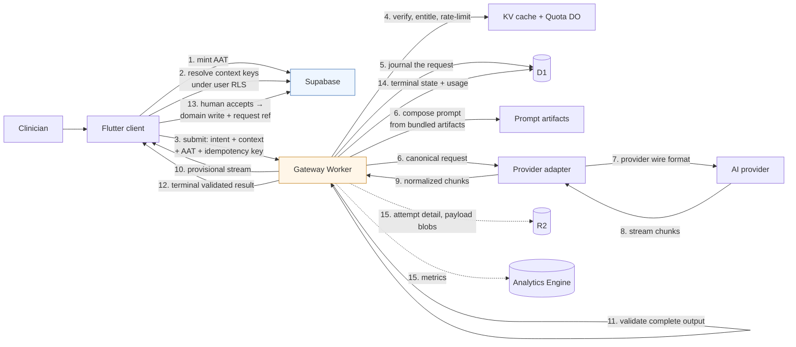


Steps 1–3 are the client's whole responsibility; steps 4–12 are the platform's; step 13 is the
clinical safety gate (A5). Steps 5 and 14 are on the request path so the record always exists; only
step 15, which carries diagnostic detail, runs afterwards. Note that **no step points from the
gateway to Supabase** — the property established in
[§1.3.1](#131-the-ai-platform-cannot-reach-the-clinics-database) and preserved throughout.

### 7.3 D1 logical model

Logical entities and their purpose. Field lists indicate *shape and cardinality*; they are not a
schema definition.


| Entity                  | Purpose                                                                           | Key fields                                                                                                                                                                                       | Growth                 | Retention                                  |
| ----------------------- | --------------------------------------------------------------------------------- | ------------------------------------------------------------------------------------------------------------------------------------------------------------------------------------------------ | ---------------------- | ------------------------------------------ |
| `installation`          | An enrolled clinic deployment                                                     | installation id, org id, display name, status, region, enrolled_at                                                                                                                               | Tens–thousands of rows | Life of customer                           |
| `installation_key`      | Verification material and rotation history                                        | installation id, public key, algorithm, valid_from, valid_until, revoked_at                                                                                                                      | Few per installation   | History kept for audit                     |
| `entitlement`           | What this installation may use and how much                                       | installation id, plan, period bounds, request quota, token/cost budget, allowed capability set, soft threshold, status                                                                           | One current + history  | History kept for billing disputes          |
| `capability_grant`      | Which capability versions a plan or installation may use                          | scope, capability id, version, granted/revoked, changed_at, changed_by                                                                                                                            | Low                    | Full history                               |
| `routing_policy`        | Versioned target chains and selection rules                                       | policy id, version, content pointer, active_from, activated_by                                                                                                                                   | Low                    | Full history                               |
| `ai_request`            | One row per request: the journal spine                                            | request id, **request reference**, installation, actor, branch, capability id+version, prompt artifact hash, idempotency key, state, timestamps, terminal error code, trace id, payload pointers | **The dominant table** | Retention class (A10)                      |
| `ai_attempt`            | One row per provider attempt                                                      | request id, attempt no., provider, model, outcome, latency, tokens in/out, cost, provider request id, error code                                                                                 | 1–3 per request        | With the request                           |
| `usage_event`           | Append-only quota/billing ledger                                                  | installation, period, request id, quota weight, tokens, cost, recorded_at                                                                                                                        | ~1 per request         | Longer than requests — billing evidence    |
| `usage_rollup`          | Pre-aggregated per installation/period/capability                                 | dimensions, counts, tokens, cost                                                                                                                                                                 | Small                  | Long                                       |
| `token_replay_guard`    | Recently seen `jti` values                                                        | jti, installation, expires_at                                                                                                                                                                    | High churn, short TTL  | Minutes–hours, pruned by cron              |
| `control_audit`         | Control-plane mutations                                                           | operator, action, target, before/after pointer, at                                                                                                                                               | Low                    | Long                                       |


Sizing check against the 10 GB per-database ceiling: at roughly 0.5–1 KB per metadata row,
`ai_request` + `ai_attempt` + `usage_event` consume on the order of a few gigabytes per ten million
requests — comfortable, **but only because payloads live in R2**. Storing prompts and responses inline
would exhaust the database at roughly one to two million requests and would collide with the 2 MB row
limit on long completions. This is the most consequential storage decision in the design.

If volume ever outgrows one database, the escape hatch is D1's intended model — a database per region
or per installation cohort, with the installation registry as the routing key. A deliberate late
option, not a Phase 0 complication.

### 7.4 R2 payload layout


| Blob class                     | Contents                                  | Answers                                                                    |
| ------------------------------ | ----------------------------------------- | -------------------------------------------------------------------------- |
| `request/{id}/context`         | The validated context payload as supplied | "What inputs did the model actually see?"                                  |
| `request/{id}/prompt`          | The fully composed provider-bound prompt  | "What did we actually send?" — the first question in every prompt incident |
| `request/{id}/attempt/{n}/raw` | Raw provider response or error body       | Provider-side diagnostics and dispute evidence                             |
| `request/{id}/result`          | The validated terminal payload            | "What was the user given?"                                                 |


Keys are derived from the request id, so a support lookup is a pointer dereference rather than a
search, and lifecycle rules expire blobs by retention class without touching D1.

### 7.5 Write-path economics

Stated explicitly because this is where a reasonable-looking implementation becomes slow and
expensive:


| Anti-pattern                               | Consequence                                                                                | Design rule                                               |
| ------------------------------------------ | ------------------------------------------------------------------------------------------ | --------------------------------------------------------- |
| A D1 row per stream chunk                  | Millions of writes per thousand requests; write cost and single-thread contention dominate | Chunks are never individually persisted — only aggregates |
| Journaling rejected requests               | Puts a D1 write in the cheap-rejection path, so abuse becomes expensive to refuse          | Journal at stage 9, after the guard; count rejections in metrics |
| Writing per-attempt detail before responding | Adds avoidable latency for data only needed during diagnosis                              | One row on the request path; detail afterwards            |
| Storing text in D1                         | 2 MB row ceiling, 10 GB database ceiling, expensive reads                                  | Payloads to R2, pointers in D1                            |
| Metrics as D1 aggregate updates            | Hot-row contention on a single-threaded database                                           | Analytics Engine data points; cron rollups                |
| Quota counters in D1                       | Read-modify-write races between concurrent requests                                        | Per-installation Durable Object                           |
| Unbounded replay-guard table               | Grows without limit and slows its own lookups                                              | TTL plus scheduled pruning                                |


### 7.6 Read paths


| Read path                           | Frequency            | Source                                                 | Constraint                                                          |
| ----------------------------------- | -------------------- | ------------------------------------------------------ | ------------------------------------------------------------------- |
| Verify installation and entitlement | Every request        | KV, D1 on miss                                         | Must not be a D1 read in the common case                            |
| Resolve capability manifest         | Every request        | Bundled artifacts; KV for grants and kill switches     | No D1 on the hot path                                               |
| Support lookup by request reference | Rare                 | D1, indexed on the reference, then R2                  | Single indexed lookup — the reference exists to make this trivial   |
| Usage summary for a clinic          | Occasional           | Quota DO for live counters; `usage_rollup` for history | Live and historical answers deliberately come from different places |
| Analytics and dashboards            | Continuous, internal | Analytics Engine                                       | Never queries journal tables                                        |
| Billing period close                | Monthly              | `usage_event` → `usage_rollup` via cron                | The ledger is the evidence; rollups are the convenience             |


### 7.7 Retention and recovery


| Class        | Applies to                                                              | Default horizon  | Reason                                                                                         |
| ------------ | ----------------------------------------------------------------------- | ---------------- | ---------------------------------------------------------------------------------------------- |
| `diagnostic` | Prompt, context, raw response blobs                                     | Days to weeks    | The window in which anyone actually debugs a request; also the largest and most sensitive data |
| `journal`    | `ai_request`, `ai_attempt` metadata                                     | Months           | Supports the audit scenario without retaining clinical text                                    |
| `ledger`     | `usage_event`, `usage_rollup`, `control_audit`, `capability_grant`      | Years            | Billing and governance evidence; small                                                         |
| `ephemeral`  | Replay guard, provider health                                           | Minutes to hours | Operational only                                                                               |


Retention class is a **per-capability** manifest field ([§5.1](#51-capability-manifest)), so a
capability handling sensitive free text can carry a shorter diagnostic window than one handling coded
data. Retention becomes a per-feature decision instead of a platform-wide compromise. Recovery relies
on D1 Time Travel (30-day point-in-time restore) plus R2 durability — no bespoke backup machinery is
warranted — and an installation deletion request is executable as "purge by installation id" in both
stores.

---

## 8. Sequence Diagrams

Shared participants: `Client` (Flutter, AI Client SDK + Context Resolver), `SB` (Supabase/PostgreSQL),
`GW` (AI Gateway Worker), `QDO` (Quota Durable Object — the only stateful side-car),
`PRV` (AI provider), `D1`/`R2` (platform stores), `OPS` (operator).

### 8.1 Clinic enrollment and trust bootstrap

One-time, per clinic installation. Runs once per deployment, not per user.

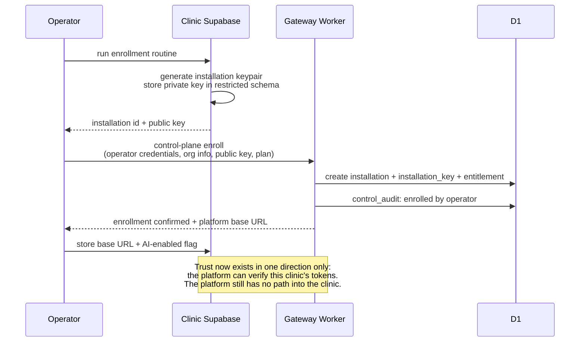


Why enrollment is operator-driven rather than self-service: an installation is a **billing and trust
boundary**. Allowing a client to enroll itself would let anyone with a copy of the desktop app create
a tenant, and would make the platform's entitlement record meaningless.

### 8.2 Streaming prose request — happy path

The most common shape: a clinician asks for a drafted paragraph.

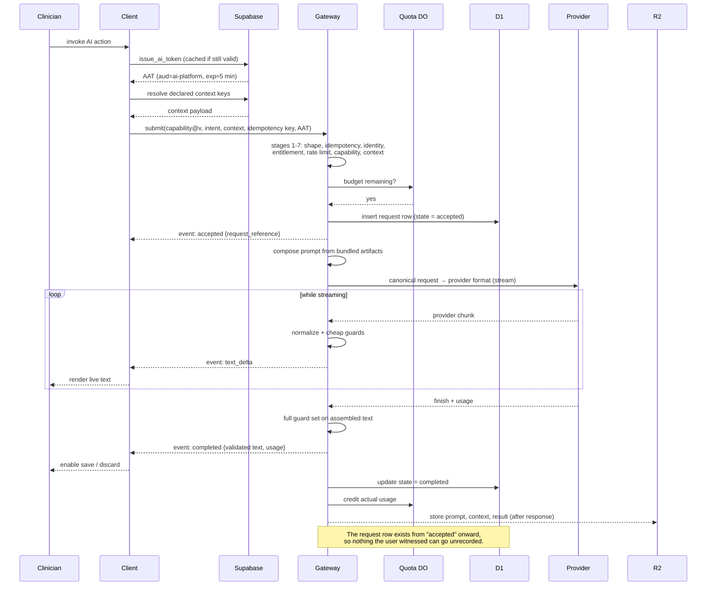


### 8.3 Structured JSON request with context enrichment

The important difference from 8.2: the client must fetch several context keys, and nothing is
displayed as final until the validated envelope arrives.

```mermaid
sequenceDiagram
    participant C as Client
    participant SB as Supabase
    participant GW as Gateway
    participant PRV as Provider

    C->>C: read cached manifest for capability@v<br/>context keys: patient.demographics@v1,<br/>visit.vitals@v1, medication.active_list@v1
    par resolve keys in parallel
        C->>SB: RPC for demographics
        C->>SB: RPC for vitals
        C->>SB: RPC for active medications
    end
    SB-->>C: three payloads
    C->>C: assemble context payload
    C->>GW: submit(structured capability, intent, context, AAT)

    GW->>GW: validate context against Context Contract<br/>(required present, shapes conform, branch consistent)
    GW->>GW: drop any undeclared keys
    GW->>GW: compose prompt; derive JSON format directive<br/>from the capability's output schema
    GW->>PRV: request with structured-output mode enabled
    loop while streaming
        PRV-->>GW: chunk
        GW-->>C: event: partial_structured {provisional: true}
        C-->>C: render draft skeleton, no commit control
    end
    PRV-->>GW: complete document
    GW->>GW: schema validation
    GW->>GW: business rules: enums, ranges,<br/>referential sanity vs supplied context
    GW-->>C: event: completed {validated document}
    C-->>C: replace draft wholesale; enable human accept
    Note over C,SB: Only after explicit human accept:<br/>domain write + request reference (A5)
```


### 8.4 Missing-context self-healing

A client with a stale manifest cache would otherwise fail hard. Instead it recovers in one round trip,
which is what makes desktop release cadence survivable (A12).

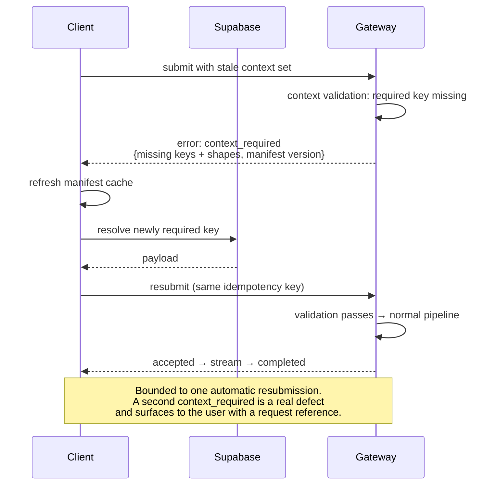


This is why `context_required` is a **typed, data-carrying rejection** rather than a generic 400. The
alternative — the platform fetching the missing data itself — is impossible here
([§1.3.1](#131-the-ai-platform-cannot-reach-the-clinics-database)) and undesirable anyway
([§9.4](#94-platform-pulls-context-from-supabase)).

### 8.5 Validation failure, bounded repair, then terminal failure

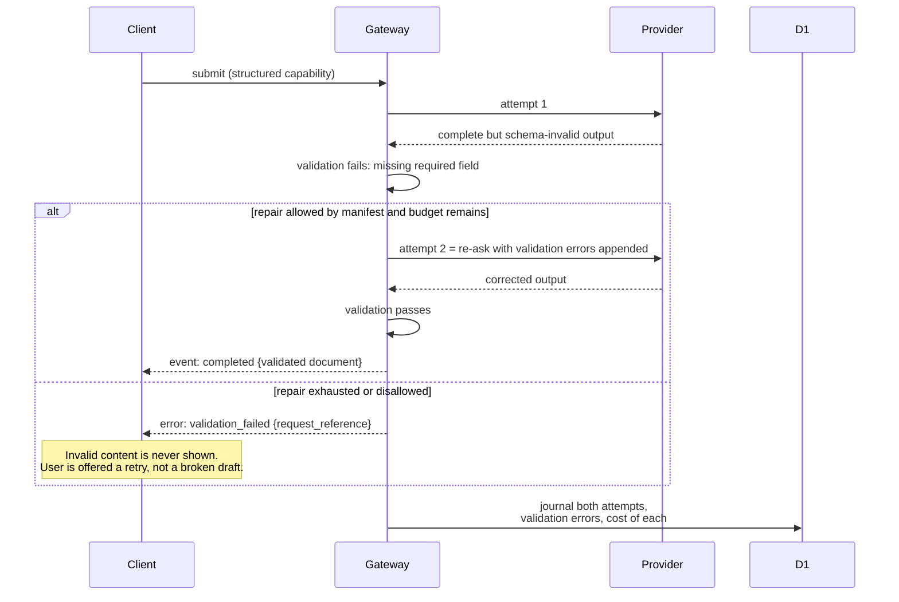


The design choice worth defending: repair is **capped, per-capability, and journaled**. An unbounded
"keep asking until it parses" loop is an unbounded bill and hides a prompt defect that the eval suite
(A9) should be catching instead. Repair rates are a monitored quality metric, not a silent workaround.

### 8.6 Provider failure, retry, and fallback

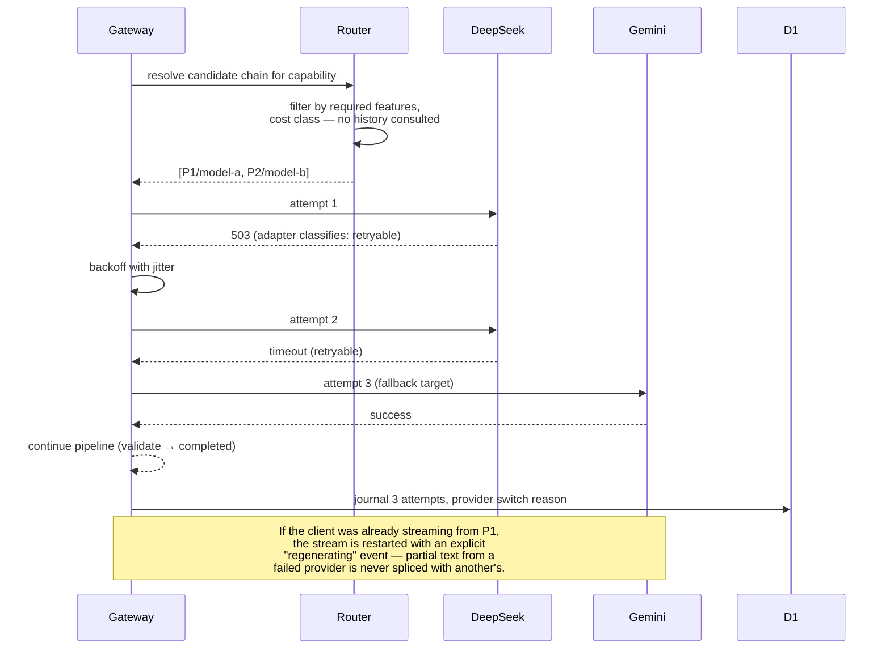


Note that the router consults no history: each request independently walks its chain. During a
provider outage every request pays the failed first attempt, which costs latency but keeps routing
fully explainable from a single journal entry — the trade discussed in
[§9.14](#914-mechanisms-deliberately-simplified).

Two rules that prevent subtle corruption:

- **Never splice output across providers.** A fallback restarts generation. Mid-stream provider
switching would produce text with a seam in the middle of a clinical sentence.
- **Fallback is only permitted to targets that satisfy the capability's declared requirements.** A
capability requiring structured output must never fall back to a model that cannot produce it —
otherwise fallback converts a provider outage into a validation failure, which is a worse outcome
reported as a different problem.

### 8.7 User-initiated cancellation

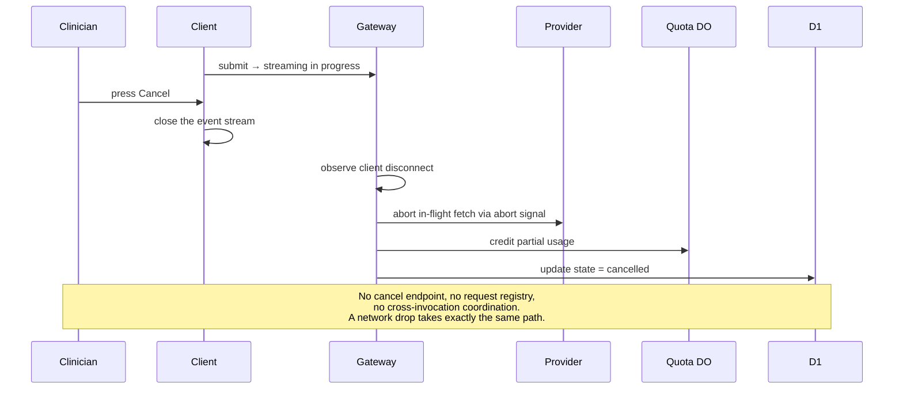


The whole mechanism is the absence of one. Because the invocation serving the stream is the same one
holding the provider connection, closing the stream is sufficient — no shared state is required, which
is why there is no per-request Durable Object in this design
([§9.7](#97-connection-scoped-cancellation-versus-a-session-durable-object)).

### 8.8 Quota and rate-limit rejection

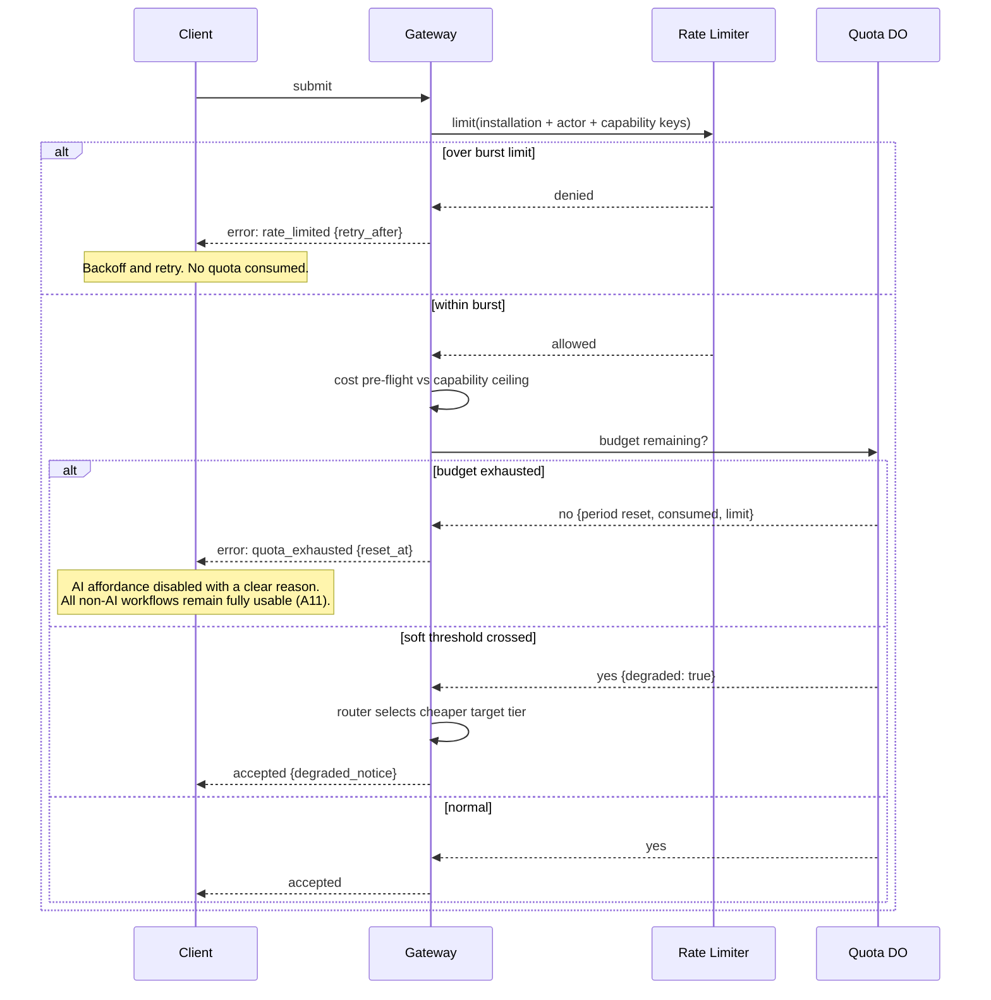


The soft-threshold branch is the constitutional requirement in action: subscription and quota limits
degrade the service, they never lock the product (constitution principle V).

### 8.9 Support audit trace

The scenario the brief names explicitly: a user reports that a request failed.

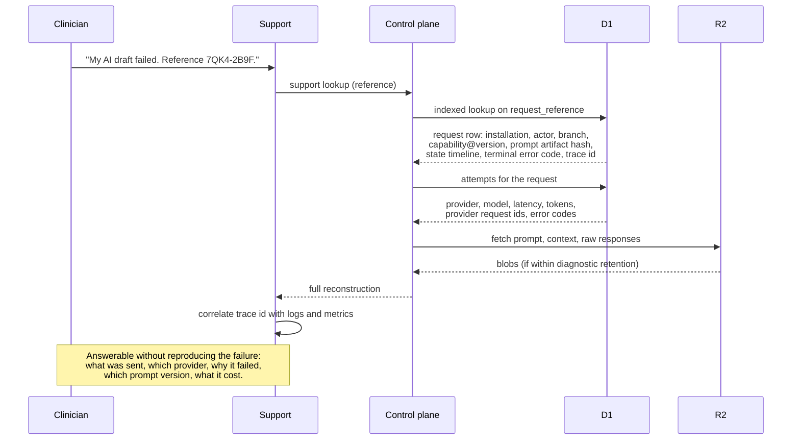


Three properties make this work, and all three are architectural rather than operational:

1. The **request reference is short and human-readable** and is emitted in the `accepted` event —
  before anything can go wrong — so it exists even for failures that occur later (A13).
2. The **prompt artifact hash** is journaled, so a failure can be attributed to a specific prompt
  version even after several rollouts.
3. The **trace id is propagated from the client**, so logs, metrics, and the journal join without a
  correlation heuristic.

---

## 9. Alternatives Considered

Each alternative is stated as its strongest version, then rejected on specific grounds. Several are
rejected *for now* rather than forever, and those are marked as such.

### 9.1 Client calls AI providers directly

**The case for it:** simplest possible thing. No gateway, no platform database, lowest latency, no
single point of failure, and streaming works natively.

**Rejected because** it fails almost every requirement simultaneously: provider API keys would ship
inside a desktop binary (unrecoverable credential exposure — decompilation is trivial and rotation
means a client release); prompt engineering would live in the client, contradicting the explicit
constraint; there would be no place to enforce quota, rate limits, or entitlement; response validation
would be client-side and therefore optional; and there would be no auditable journal. Swapping a
provider would require a coordinated release across every clinic PC.

This alternative is listed because it is what a prototype naturally becomes, and the drift toward it —
"just this once, put the prompt in the client" — is the main long-term threat to the design.

### 9.2 Supabase Edge Functions as the AI gateway

**The case for it:** no new vendor, one auth model, native access to clinic data, and it can query
Postgres directly so context enrichment is trivial.

**Rejected because**:

- Under Tier 1/2 the Supabase instance is the *clinic's own local Docker stack*. Deploying platform
logic there means shipping prompts, provider keys, routing policy, and quota rules **onto clinic
hardware** — the credential exposure of [§9.1](#91-client-calls-ai-providers-directly) plus a
per-clinic deployment problem for every prompt change.
- Platform data would land in the clinic's PostgreSQL, violating the stated constraint that D1 owns AI
data and creating a fragmented, per-clinic audit trail with no cross-tenant view for support,
analytics, or billing.
- Cross-tenant concerns — aggregate quota, platform-wide error rates, cost attribution — are not
expressible in per-clinic isolated runtimes.
- No Edge Functions exist in the repository today (F4), so this is not the cheap reuse it appears to
be.

Worth noting: for a **cloud-only** product this option would be genuinely competitive. It is the
offline-first deployment model that eliminates it.

### 9.3 Postgres-centric AI orchestration

**The case for it:** the constitution puts authority in PostgreSQL. Triggers plus outbound HTTP
(`pg_net`) could call providers from the database, keeping everything in one place, with prompts as
table rows and responses written straight into domain tables.

**Rejected because** it inverts the dependency the constitution actually cares about. The constitution
gives Postgres authority over **domain correctness**, not over network orchestration. Concretely: no
streaming (a fundamental requirement), long-running HTTP inside database sessions, retry/fallback logic
in PL/pgSQL, provider keys in the clinic database, no cross-tenant view, and AI output landing in
clinical tables without human gating (violating A5 and constitution principle IV). It also makes
provider latency a database-connection concern, which is exactly the coupling that takes down
databases.

### 9.4 Platform pulls context from Supabase

**The case for it:** it is the textbook answer to "the platform determines what data it needs" — the
platform knows what it needs, so let it fetch it. Guarantees freshness, and the client stays trivially
thin.

**Rejected because**:

1. **It is not possible in the primary deployment tier.** The clinic database is on a private LAN with
  no inbound path (F1). This alone is decisive.
2. Even in Tier 3 it would make the AI platform a **consumer of the clinic schema**. Every clinic
  migration becomes a potential AI outage, and the two systems could no longer be released
   independently — the direct opposite of the stated design goal.
3. It requires the platform to hold **standing credentials** into clinic data, turning a platform
  compromise into a full patient-data breach. Client-side resolution keeps every read under the
   requesting user's own RLS scope.
4. It would require re-implementing the clinic's RBAC inside the platform to decide what the platform
  may read on a user's behalf — duplicated authorization logic that will drift.

**What is given up:** the platform cannot guarantee context freshness, and a malicious client can
supply plausible-but-false context within its own tenant scope. Mitigated by journaling exact context,
per-capability freshness hints, and the advisory-output rule (A5). This is the right trade: the failure
mode of stale context is a suboptimal draft that a human reviews, while the failure mode of a
schema-coupled platform is correlated outages plus a breach path.

> If Tier 3 becomes dominant, a *narrow* pull path could be added later — platform-initiated calls to
> a small set of **purpose-built, versioned context RPCs** owned by the clinic app, never raw tables.
> The Context Contract is deliberately shaped so that this becomes a change of *transport* for a key,
> not a change of architecture.

### 9.5 Prompts as editable data in D1

**The case for it:** edit prompts in an admin UI, no deploy, instant iteration, per-clinic
customization, non-engineers can tune wording.

**Rejected as the primary mechanism because** prompts are the platform's core business logic. As
mutable rows they get no code review, no diff history in the repository, no CI evaluation (A9), no
atomic coupling to the output schema they must satisfy, and no reproducibility — a journal entry
pointing at "prompt row 42" cannot tell you what row 42 contained last Tuesday.

**Recommended:** prompt artifacts are immutable, deployed with the Worker, and pinned by the capability
manifest — reviewed, tested, versioned, and reproducible. There is exactly one answer to "which prompt
was live for this request?", which is the property that makes the journal worth having.

A middle option exists and is **deliberately deferred**: keeping the artifacts in the deployment but
externalizing an *activation pointer* — which version is live for which cohort — as runtime data. That
buys rollback without a deploy and per-cohort canaries, at the cost of a second source of truth for
prompt provenance. Worth adding once real clinics depend on the platform and a prompt incident would
need minutes rather than a deploy cycle to contain; not worth it before
([§9.14](#914-mechanisms-deliberately-simplified)).

Per-clinic prompt *customization* is not offered at all; if it is ever required, it should arrive as
constrained, validated parameters injected into a reviewed template, never as free-text overrides.

### 9.6 Multiple Workers, one per concern

**The case for it:** independent deployability, isolation of the provider-calling path from the control
plane, per-component scaling, blast-radius reduction.

**Rejected because** it buys nothing here and costs a distributed system. The constitution forbids
microservices (F5); the workload is I/O-bound fan-out that a single Worker handles natively; Workers
already scale per-request; and splitting would introduce service-binding hops, versioned internal
contracts, and multi-service tracing for a team that is currently building the first version. The
modular-monolith-with-ports structure keeps the *option* open: extracting the control plane into a
separate Worker later is a deployment change, not a redesign, because it already sits behind its own
surface ([§4.5](#45-control-plane)).

### 9.7 Connection-scoped cancellation versus a Session Durable Object

Three options for cancellation and stream lifecycle:


| Option                                        | Same-screen cancel | Out-of-band cancel                                                                                        | Reconnect to a live stream | Complexity                                               |
| --------------------------------------------- | ------------------ | --------------------------------------------------------------------------------------------------------- | -------------------------- | -------------------------------------------------------- |
| **Connection-scoped (recommended)**           | ✓ Close the stream | ✗ Not possible                                                                                            | ✗                          | None — no component at all                               |
| Cancel flag polled in D1 or KV                | ✓                  | ~ Works with seconds of lag, and burns writes on the single-threaded D1 or fights KV eventual consistency | ✗                          | Low, but wasteful                                        |
| Session Durable Object                        | ✓                  | ✓ Immediate, event-driven                                                                                 | ✓ Possible                 | Moderate: one DO class, one object per in-flight request |


**Recommendation: connection-scoped.** The product need is a clinician abandoning a generation on the
screen that is showing it, and closing the stream serves that exactly, with no component to build,
operate, or reason about. A per-request Durable Object would be the largest structural addition in the
platform — a second stateful class with its own lifecycle, failure modes, and cost — bought for one rare
interaction.

The polling option is worth naming only to dismiss: KV's eventual consistency makes cancel unreliable,
and polling D1 would spend the same single-threaded write budget the audit journal depends on.

**Two consequences are accepted, not hidden.** A network drop mid-generation is indistinguishable from
a cancel, so that generation is lost and the user retries. And a stream cannot be resumed on another
device or after a reconnect. Both are affordable when generations take seconds and every request is
independently retryable; neither would be affordable for long-running batch work, which is precisely
when the Session DO should be introduced ([§9.11](#911-asynchronous-job-model-with-queues-or-workflows)
covers that case).

**Revisit if** a capability's generations routinely exceed roughly a minute, or if support data shows
users losing work to reconnects. Adding the DO later changes the stream broker and adds a cancel
endpoint; it does not disturb any contract.

### 9.8 D1 as the only platform store

**The case for it:** one store, one mental model, matches the stated constraint literally, no
additional bindings.

**Rejected because** the numbers do not permit it ([§1.4](#14-verified-platform-capability-budget)):
a 2 MB row limit against long completions, a 10 GB database ceiling against retained prompt and
response text, single-threaded writes against per-request journaling plus metrics, and per-row write
pricing against high-volume telemetry. The constraint "D1 is responsible only for AI platform data" is
honoured in the sense that matters — **D1 remains the system of record for AI platform data** — while
R2 holds the byte payloads it points to, KV holds cached copies of D1 truth, DOs hold live counters
that settle into D1, and Analytics Engine holds metrics that were never records in the first place. No
other store holds anything D1 does not authoritatively describe.

### 9.9 Cloudflare AI Gateway as the egress layer

**The case for it:** it is GA and already provides provider proxying, caching, automatic retries and
fallback, token/cost accounting, and per-request logs — a meaningful share of [§4.3.7](#437-provider-router-and-policy-engine)
and [§4.3.8](#438-provider-adapters-and-egress) for free.

**Recommendation: adopt it as an optional egress hop behind the provider port, not as the routing
brain.** Reasons to route through it: free observability and cost attribution per provider, cache
hits on identical requests, and a second layer of retry. Reasons not to delegate routing to it: the
routing decisions here are **capability-aware** (structured-output support, quota-driven degraded
tiers, per-installation overrides) and must be journaled with a reason in the platform's own audit
trail, which an external policy engine cannot supply. Keeping the decision in the router and using
AI Gateway as a smart pipe gives the benefits without surrendering explainability — and because it
sits behind the port, it can be switched on or off per provider without touching the pipeline.

### 9.10 OpenAI-compatible wire format as the internal representation

**The case for it:** most providers accept it, so adapters would become near-passthrough and new
providers would be nearly free to add.

**Rejected as the internal contract** because it makes the platform's core depend on a format another
vendor controls and evolves. Provider support is "compatible-ish": divergences in structured output,
streaming chunk shapes, system-message handling, and usage reporting would leak into the core as
special cases, and the core would inherit deprecations it does not control. A small canonical form
owned by this platform costs one thin mapping layer per provider and keeps the divergences quarantined
inside adapters — which is the entire point of having adapters. Pragmatically, the canonical form
should be *modelled on* the common subset so most adapters stay thin.

### 9.11 Asynchronous job model with Queues or Workflows

**The case for it:** durable execution, survives Worker eviction, natural for long or multi-step
agentic tasks, retries for free.

**Deferred, not rejected.** It is unnecessary today: Workers have no wall-clock limit while the client
is connected ([§1.4](#14-verified-platform-capability-budget)), so interactive inference needs no job
queue, and the constitution explicitly forbids message queues in the current architecture (F5). It
becomes the right answer for genuinely asynchronous work — batch summarization, overnight document
processing, multi-step agentic chains — and the request lifecycle is deliberately modelled as a state
machine ([§6.3](#63-request-state-machine)) so a durable executor can later drive the same states.
Adding it now would be complexity with no user-visible benefit.

### 9.12 One D1 database per installation

**The case for it:** hard tenant isolation, trivial per-clinic purge, and each clinic's 10 GB ceiling
is its own. D1 explicitly supports database-per-tenant at up to 50,000 databases.

**Rejected for now** because it makes every cross-tenant question — provider health, aggregate usage,
platform-wide error rates, billing runs, support triage across clinics — a fan-out across thousands of
databases, and it requires a registry lookup plus dynamic binding on the hot path. With clinic-scale
tenancy (F5: small-to-mid clinics) a shared database with `installation_id` scoping is far simpler and
well within limits. Kept as the documented scaling escape hatch
([§7.3](#73-d1-logical-model)); the `installation_id` on every row is what makes that migration
mechanical rather than a rewrite.

### 9.13 Verifying clinic Supabase JWTs directly

Covered in [§2.1](#21-amendment-a1-authenticate-every-request-requires-a-trust-bootstrap-that-does-not-exist-yet)
and listed here for completeness: rejected because it requires the platform to hold every clinic's
symmetric session-signing secret, inverting the blast radius (a platform compromise becomes the ability
to forge clinic logins), providing no AI-specific revocation lever, and reusing tokens whose audience
and lifetime were chosen for a different purpose.

### 9.14 Mechanisms deliberately simplified

Five mechanisms that a conventional design of this kind would include were evaluated and left out.
Each is a real technique with a real benefit; each was rejected because the benefit does not currently
pay for the extensibility, decoupling, abuse-protection, or debuggability it costs. They are recorded
here so a future reader can tell a deliberate omission from an oversight, and knows what evidence
should reverse it.


| Mechanism                                          | What it buys                                      | Why it is out                                                                                                                                                                                | Add it when                                                                       |
| -------------------------------------------------- | ------------------------------------------------- | -------------------------------------------------------------------------------------------------------------------------------------------------------------------------------------------- | --------------------------------------------------------------------------------- |
| **Interfaces for persistence, logging, and prompt loading** | Swappable infrastructure                  | Each would only ever have one implementation. An interface with one implementor is a layer to read through, permanently, in exchange for nothing — a direct cost to the maintainability it claims to serve | A second implementation genuinely exists, not is imagined                         |
| **Write-behind journaling**                        | ~10 ms off each response                          | Trades audit completeness for latency nobody perceives, in a platform whose hardest requirement is explaining failures after the fact ([§4.3.11](#4311-journal-writer))                        | Guard latency is measurably dominated by the journal write, which it will not be   |
| **Pre-flight quota reservations**                  | Exact quota under concurrency                     | Prevents an overshoot of one or two requests at clinic volumes. The dangerous case — one very expensive request — is already blocked by the per-request cost ceiling ([§4.3.3](#433-entitlement-quota-and-rate-control)) | Quotas become hard commercial limits with disputes, or concurrency per clinic rises sharply |
| **Circuit breaker / provider health state**        | Skips a known-sick provider                       | Introduces shared mutable state that changes routing based on invisible history, so "why did this request go there?" stops being answerable from one journal entry ([§4.3.7](#437-provider-router-and-policy-engine)) | Provider outages are frequent enough that the wasted first attempt is a real cost  |
| **Runtime prompt activation pointer**              | Rollback and canary without a deploy              | A second source of truth for which prompt was live, which is the one fact a prompt incident depends on ([§9.5](#95-prompts-as-editable-data-in-d1))                                            | Paying clinics depend on the platform and incident containment must beat a deploy cycle |


The common thread is worth naming, because it is the rule that should govern future additions:
**each of these adds a mechanism whose state or indirection is invisible at the point of use.** That is
exactly the kind of complexity that makes a system hard to debug and hard to extend safely, and it is
the kind most easily justified in the abstract. Every one of them can be added later without changing a
contract, which is the strongest possible argument for not adding them now.

### 9.15 Decision log


| ID   | Decision                 | Chosen                                                   | Rejected alternative                           | Primary reason                                                           |
| ---- | ------------------------ | -------------------------------------------------------- | ---------------------------------------------- | ------------------------------------------------------------------------ |
| D-1  | Where AI logic lives     | Cloudflare Worker gateway                                | Client-side; Supabase Edge Functions; Postgres | Credential isolation, central prompt ownership, offline-tier reality     |
| D-2  | Authentication           | Enrolled installation keys + short-lived AAT             | Verify clinic Supabase JWTs                    | Blast radius, revocation, audience scoping                               |
| D-3  | Context acquisition      | Client resolves platform-declared context keys           | Platform pulls from Supabase                   | Not reachable in Tier 1; avoids schema coupling and standing credentials |
| D-4  | Prompt storage           | Immutable bundled artifacts pinned by the capability     | Editable D1 rows; runtime activation pointer   | One reviewable, reproducible answer to "which prompt was live?"          |
| D-5  | Internal request format  | Own canonical representation                             | OpenAI-compatible shape                        | Vendor-format independence                                               |
| D-6  | Deployment shape         | Single Worker, modular internals                         | Worker per concern                             | Constitution; no scaling need                                            |
| D-7  | Cancellation             | Connection-scoped, no stateful component                 | Session Durable Object; D1/KV polling          | Serves the only cancellation the product needs, with nothing to operate  |
| D-8  | Quota                    | Per-installation Durable Object counter, credited after  | D1 counters; pre-flight reservations           | Serialized counting without a second mechanism                           |
| D-9  | Payload storage          | R2 blobs, D1 pointers                                    | All in D1                                      | 2 MB row limit, 10 GB ceiling, write cost                                |
| D-10 | Metrics                  | Analytics Engine                                         | D1 aggregates                                  | Volume and cardinality; protects D1 write budget                         |
| D-11 | Validation and streaming | Provisional streaming + commit-time validation           | Literal "only validated responses"             | The two requirements are otherwise contradictory                         |
| D-12 | Tenancy in D1            | Shared DB scoped by installation                         | DB per installation                            | Cross-tenant operations; clinic-scale volume                             |
| D-13 | Async execution          | Synchronous now; state machine ready                     | Queues/Workflows now                           | No requirement; constitution forbids queues                              |
| D-14 | Provider egress          | Direct fetch, AI Gateway optional behind the port        | AI Gateway as router                           | Keep routing explainable and journaled                                   |
| D-15 | Abstraction boundaries   | Interfaces only for providers and token verification     | Ports for persistence, logging, prompt loading  | An interface with one implementor is permanent indirection for nothing    |
| D-16 | Journal timing           | Request row written before work begins                   | Write-behind after the response                | Audit completeness beats imperceptible latency                            |
| D-17 | Provider health          | Stateless routing, retry and fallback per request        | Circuit breaker with shared health state       | Routing must be explainable from one journal entry                        |


---

## 10. Trade-offs of the Recommended Design

Nothing here is free. These are the costs, stated plainly, with the reason each is acceptable.


| #    | What is gained                            | What is given up                                                                                                                | Why the trade is right                                                                                                                          |
| ---- | ----------------------------------------- | ------------------------------------------------------------------------------------------------------------------------------- | ----------------------------------------------------------------------------------------------------------------------------------------------- |
| T-1  | Centralized prompts, keys, and validation | AI features require internet, in an otherwise offline-capable product                                                           | AI is additive (A11). The alternative — local inference on 8 GB clinic PCs — costs more RAM, more support, and worse quality                    |
| T-2  | No coupling to clinic schema              | The platform cannot verify context freshness or authenticity beyond shape and tenant scope                                      | Advisory output plus human acceptance (A5) contains the harm; schema coupling would cause correlated outages and a breach path                  |
| T-3  | Cheap, uniform guard stages               | Extra round trips before inference: token mint, context resolution, then submit                                                 | The guard is tens of milliseconds against provider latency measured in seconds; token and manifest caching removes most of it                   |
| T-4  | Reviewable, reproducible prompts          | Prompt changes *and rollbacks* both need a deploy                                                                               | Prompts are logic. One source of truth for which prompt was live is worth more than sub-minute rollback until real clinics depend on the platform |
| T-5  | No per-request state to build or operate  | Cancellation only works from the screen showing the stream, and a network drop loses that generation                            | Serves the only cancellation the product needs; a whole stateful class for a rare interaction is a poor trade ([§9.7](#97-connection-scoped-cancellation-versus-a-session-durable-object)) |
| T-6  | Strongly consistent quota                 | Quota is per-installation-serialized, and counted after the fact, so concurrent requests can overshoot by one or two            | Clinic volumes are far below a DO's throughput; the expensive-single-request case is caught by the cost ceiling instead                          |
| T-7  | Every witnessed request is recorded       | One D1 write sits on the request path before generation starts                                                                 | Single-digit milliseconds against seconds of inference, in exchange for an audit trail with no holes — the requirement that motivated the journal |
| T-8  | Provider independence                     | One mapping layer per provider, and per-provider quirks must be discovered and encoded                                          | This is the irreducible cost of not being locked in; it is paid once per provider, in one file                                                  |
| T-9  | Live feedback on structured output        | Clients must implement provisional/draft rendering and resist committing it                                                     | This is honest about validation being a whole-document property; hiding it would produce a system that shows unvalidated clinical text as final |
| T-10 | Simple single-deployable platform         | The gateway is a single point of failure for all AI features                                                                    | Correct blast radius: AI down means AI features hidden, not clinic work stopped. The constitution's graceful degradation makes this survivable  |
| T-11 | Multi-tenant efficiency in one D1         | Tenant isolation is enforced by query scoping, not physical separation                                                          | Clinic-scale data volumes; `installation_id` on every row keeps physical sharding available later                                               |
| T-12 | Extensibility through manifests           | A registry and contract discipline to maintain — manifests, context keys, schemas, error codes                                  | This *is* the product's ability to add AI features without releases; the discipline is the asset                                                |
| T-13 | Only one polymorphic boundary             | Replacing D1, the logger, or the prompt source would mean editing their callers rather than swapping an implementation          | Those replacements are hypothetical; the indirection would be permanent. Concentrating abstraction where it is exercised keeps the code readable |
| T-14 | Routing explainable from one record       | During a provider outage, every request pays a failed first attempt                                                            | Latency during an incident is cheaper than routing behaviour that depends on invisible history ([§9.14](#914-mechanisms-deliberately-simplified)) |


Two trade-offs deserve a second sentence, because they are the ones most likely to be regretted:

- **T-2 (client-supplied context)** will eventually produce a support case of the form "the AI used old
vitals". The journal answers it precisely, and freshness hints reduce it, but it cannot be eliminated
without the coupling this design exists to avoid.
- **T-4 (prompts need a deploy)** will feel slow the first time a clinician wants a wording tweak. The
correct response is a fast deploy pipeline, and — once clinics depend on the platform — the activation
pointer described in [§9.14](#914-mechanisms-deliberately-simplified). Never editable prompts at
runtime.
- **T-5 (connection-scoped cancellation)** will produce the complaint "it lost my draft when the WiFi
blipped". That is the accepted cost of holding no per-request state, and the trigger to revisit it is
support evidence, not discomfort with the idea.

---

## 11. Risks and Mitigations

Likelihood and impact are assessed for a clinic-scale product with a small team.


| ID   | Risk                                                                                                                            | L       | I      | Mitigation                                                                                                                                                                                                                                      | Detection                                                                             |
| ---- | ------------------------------------------------------------------------------------------------------------------------------- | ------- | ------ | ----------------------------------------------------------------------------------------------------------------------------------------------------------------------------------------------------------------------------------------------- | ------------------------------------------------------------------------------------- |
| R-1  | **Provider outage or degradation**                                                                                              | High    | Medium | Multi-target candidate chains, bounded retry with jitter, per-capability and per-provider kill switch (A8), degraded UI state (A11). Health-based skipping is a documented later addition ([§9.14](#914-mechanisms-deliberately-simplified))    | Provider error-rate and latency dashboards; fallback-rate alerts                      |
| R-2  | **Prompt regression** — a wording change quietly worsens output                                                                 | Medium  | High   | Immutable artifacts pinned by the capability, CI eval suite per capability (A9), staged rollout, rollback by deploy                                                                                                                             | Validation-failure and repair rates per prompt version; eval scores in CI              |
| R-3  | **Cost blowout** — a pasted document or a loop burns the budget                                                                 | Medium  | High   | Pre-flight token estimation against per-capability ceilings (A6), input size caps, per-installation budget in the Quota DO, max output tokens always set, global spend alerting                                                                 | Cost per installation and per capability in Analytics Engine; budget-threshold alerts |
| R-4  | **Silent model drift** — the provider updates a model and behaviour changes                                                     | Medium  | High   | Pin explicit model versions in routing policy, never use floating aliases; scheduled evals against pinned targets; treat a model change as a policy change with a canary                                                                        | Eval suite run on schedule, not only on prompt edits                                  |
| R-5  | **Gateway or Cloudflare outage**                                                                                                | Low     | Medium | AI is additive: features hide, clinic work continues (A11). Client treats platform unreachability as a normal state, never an error dialog                                                                                                      | Synthetic checks; client-side telemetry of unreachable states                         |
| R-6  | **Loss of post-response detail** — eviction after the terminal event drops attempt rows, blobs, or usage credit                  | Low     | Low    | The request row and its terminal state are already durable ([§4.3.11](#4311-journal-writer)), so only diagnostic depth is at risk; reconcile DO counters against the `usage_event` ledger on a schedule                                          | Periodic reconciliation report: requests with terminal state but missing attempt rows |
| R-7  | **D1 saturation or growth ceiling**                                                                                             | Medium  | Medium | Payloads in R2, metrics in Analytics Engine, one row per request on the hot path, retention purges, rollups; documented shard-by-installation escape hatch                                                                                      | D1 storage and write-rate dashboards with headroom alerts                             |
| R-8  | **Installation private key compromise** (clinic server stolen or breached)                                                      | Low     | High   | Key is confined to a restricted schema readable only by the issuing function; short token lifetime; per-installation suspension; key rotation without re-enrollment; anomaly detection on issuance volume                                       | Sudden change in token issuance rate or geography; usage spikes                       |
| R-9  | **Clinical text sent to third-party providers** (accepted by decision, [§2.7](#27-requirement-accepted-as-is-no-phi-redaction)) | Certain | High   | Context Contract minimization; per-capability retention classes; provider agreements and data-processing terms; region-aware routing if required; per-key redaction is a pre-shaped future option                                               | Journal shows exactly what was transmitted per request                                |
| R-10 | **Prompt injection through clinical free text** — a patient note contains instructions                                          | Medium  | Medium | Context is delivered as clearly delimited, typed data rather than merged into instructions; system instructions assert precedence; validator detects instruction echo and system-prompt leakage; output schema constrains the surface           | Guard-trigger rate per capability                                                     |
| R-11 | **Automation bias** — clinicians accept AI drafts without reading                                                               | Medium  | High   | Advisory-only output with mandatory human acceptance (A5); provisional content visually distinct and non-committable; acceptance recorded with the request reference for later review                                                           | Acceptance-without-edit rates per capability and per user                             |
| R-12 | **Client drift** — prompt fragments or model names creep into the Flutter app                                                   | Medium  | High   | Architectural test in CI that fails on prompt-like strings, provider names, or model identifiers in client code; code review checklist; the Context Resolver is capability-agnostic by construction                                             | CI guard; periodic review of the client's AI directory                                |
| R-13 | **Stale or falsified context** (T-2)                                                                                            | Medium  | Medium | Freshness hints per capability; tenant/branch consistency checks against token claims; full context journaling; advisory output                                                                                                                 | Support cases correlated with journaled context                                       |
| R-14 | **Provider terms, residency, or deprecation changes**                                                                           | Medium  | Medium | Provider abstraction keeps switching cheap; two live providers at all times so no single provider is load-bearing; deprecation calendar tracked in routing policy reviews                                                                       | Provider changelog monitoring; eval failures on deprecated targets                    |
| R-15 | **Quota DO unavailability or hot-spotting**                                                                                     | Low     | Medium | Documented fail-open or fail-closed decision per capability class (recommendation: fail-open with capped grace and a reconciliation pass, so an infrastructure blip never blocks care); intra-installation sharding available if volume demands | DO error rates and latency; grace-mode counters                                       |
| R-20 | **Complexity creep** — mechanisms in [§9.14](#914-mechanisms-deliberately-simplified) get added because they sound prudent      | Medium  | Medium | Each carries a written "add it when" trigger; adding one requires citing the evidence, not the argument. New indirection needs a second implementation to justify it (D-15)                                                                     | Architecture review at each phase gate; diff of components against §4                 |
| R-16 | **Capability sprawl** — dozens of near-duplicate capabilities                                                                   | Medium  | Low    | Capabilities require a manifest, an output schema, and an eval suite before activation; retirement process with an overlap window (A12); registry review                                                                                        | Registry growth versus usage per capability                                           |
| R-17 | **Offline clinics discover AI does not work**                                                                                   | High    | Medium | AI-enabled flag per installation so affordances never appear where they cannot function; explicit, documented capability difference per tier ([§2.6](#26-conflict-with-the-existing-local-ollama-assumption))                                   | Support ticket categories; unreachable-state telemetry                                |
| R-18 | **Token theft or replay**                                                                                                       | Low     | Medium | Minutes-long lifetime, audience restriction, `jti` replay guard, scope minimization, actor-level rate limits, suspension levers                                                                                                                 | Replay-guard hit rate; anomalous actor volume                                         |
| R-19 | **Cloudflare lock-in**                                                                                                          | Low     | Low    | The pipeline is ordinary request/response logic; Durable Object use is one counter class; D1 is SQLite-shaped and exportable; R2 is S3-shaped. Migration would be work, not a rewrite                                                            | Reviewed at each phase gate                                                           |


Two risks are structural rather than technical and deserve the most attention: **R-11 (automation
bias)** is the one that can harm a patient, and **R-12 (client drift)** is the one that quietly
destroys the architecture. Both are mitigated by things that must be built deliberately — a UI that
makes drafts feel like drafts, and a CI guard that fails the build — not by intentions.

---

## 12. Evolution Path

### 12.1 Sequencing principle

Each phase must be independently shippable and must leave the contracts in
[§5](#5-contracts) intact. The order is chosen so that the **contracts and the guard** come first
even though they are the least visible work: they are what later phases plug into, and retrofitting
them is what turns an AI prototype into a rewrite.

### 12.2 Phase map


| Phase                         | Goal                                      | Includes                                                                                                                                                                                                                                                                                  | Deliberately excluded                                   |
| ----------------------------- | ----------------------------------------- | ----------------------------------------------------------------------------------------------------------------------------------------------------------------------------------------------------------------------------------------------------------------------------------------- | ------------------------------------------------------- |
| **P0 — Walking skeleton**     | One capability end to end, contracts real | Enrollment + AAT + verifier; one capability manifest; one context key; one provider adapter; prose streaming with connection-scoped cancellation; guard stages; journal to D1 + R2; request reference; trace propagation                                                                   | Quota, fallback, repair, control-plane UI               |
| **P1 — Production hardening** | Safe to expose to real clinics            | Second provider adapter + routing policy + retry/fallback; structured output + schema validation + bounded repair; rate limiting; cost ceilings; Quota DO; kill switches; retention purges; eval suite in CI; support lookup; client-side CI guards                                        | Billing, self-service admin, analytics product          |
| **P2 — Commercial**           | Usage becomes a product surface           | Usage tracking surfaced in-app; plans and entitlement management; billing period close from the ledger; overage and soft-degrade policies; usage rollups and dashboards; per-installation capability grants                                                                               | Marketplace, per-clinic prompt editing                  |
| **P3 — Scale and depth**      | More capabilities, heavier workloads      | Capability catalogue growth; conversational/multi-turn capabilities; asynchronous/batch execution if a real use case appears (Workflows); provider cost optimization and caching; region-aware routing                                                                                    | Fine-tuning, vector search unless demanded              |
| **P4 — Optional hedges**      | Reduce external dependence                | On-LAN OpenAI-compatible provider as a registered adapter for privacy-sensitive customers; per-context-key redaction; per-installation model preferences; D1 sharding if volume demands                                                                                                   | —                                                       |


The single most important property of this sequence: **P0 already contains the seams.** Enrollment,
the Context Contract, the capability manifest, the canonical representation, the error taxonomy, and
the journal exist from day one with one capability and one provider. Everything after P0 either fills
in an existing extension point or is one of the mechanisms deliberately left out in
[§9.14](#914-mechanisms-deliberately-simplified) — and those require evidence, not enthusiasm.

### 12.3 Where each future-growth requirement plugs in


| Future capability                  | Plugs into                                                  | Additional design needed                                                                                  |
| ---------------------------------- | ----------------------------------------------------------- | --------------------------------------------------------------------------------------------------------- |
| **AI usage tracking**              | `usage_event` ledger + Quota DO counters (exist from P1)     | A read surface only                                                                                       |
| **Analytics**                      | Analytics Engine datasets emitted from P0                   | Dashboards and queries; no schema change                                                                  |
| **Subscription management**        | `entitlement` entity + control plane                        | Plan catalogue; optional sync with `organizations.subscription_tier`, which currently has no writers (F6) |
| **AI quotas**                      | Quota DO + entitlement (P1)                                 | Policy choices: period, weights, soft thresholds                                                          |
| **Billing**                        | `usage_event` is already an append-only priced ledger       | Invoice generation and a payment provider — outside this platform                                         |
| **Additional AI providers**        | New adapter behind the provider port + routing policy entry | Adapter, eval run, canary. No pipeline change                                                             |
| **New AI capabilities**            | New manifest + prompt artifact + schema + eval suite        | Client changes only if a *new* context key is required                                                    |
| **Multi-turn / conversational AI** | Canonical request already carries prior turns               | Turn storage; and this is the case that may finally justify a per-request Durable Object ([§9.7](#97-connection-scoped-cancellation-versus-a-session-durable-object)) |
| **Cross-clinic benchmarking**      | Rollups + Analytics Engine                                  | Aggregation and anonymization policy — a product and legal decision, not a technical one                  |


The test this table is really documenting: every listed future capability is either **already an
emitted data stream** or **a new instance of an existing extension point**. None requires a new
pipeline stage. That is the return on the contract discipline paid for in P0.

### 12.4 Extension recipes

**Add a provider:** implement the adapter against the provider port (wire mapping, stream
normalization, usage extraction, error classification); register credentials in the secret store; add
targets to the routing policy as a low-priority fallback; run the eval suites against it; promote by
policy version with a canary cohort. No pipeline, capability, or client change.

**Add a capability whose context keys already exist:** author the prompt artifacts, output schema,
validation rules, and eval suite; publish the manifest referencing existing context keys and an
existing routing policy; grant it to a cohort. **No client release** — discovery surfaces it, and the
Context Resolver already knows every key it names. This is the payoff case the whole design optimizes
for.

**Add a capability needing a new context key:** define the key name and shape in the platform's
vocabulary; add a resolver mapping in the client (a new or existing Supabase RPC); ship the client;
publish the capability requiring the key. Old clients fail safe via `context_required`
([§8.4](#84-missing-context-self-healing)) rather than breaking.

**Change a prompt:** edit the artifact; CI runs the eval suite and blocks regression; deploy to a
staged cohort; promote, or roll back by deploying the previous build. The prompt version recorded in
each journal row is what makes the effect of the change measurable afterwards.

**Retire a capability:** mark deprecated in discovery with a successor; keep serving through the
overlap window (A12); then retire, returning `capability_retired` so old clients prompt for an update
instead of failing opaquely.

### 12.5 Explicitly not to be built yet


| Not now                              | Why                                                                                                                                       | Revisit when                                                                       |
| ------------------------------------ | ----------------------------------------------------------------------------------------------------------------------------------------- | ---------------------------------------------------------------------------------- |
| Per-clinic prompt editing            | Turns prompts into unreviewable, unversioned, per-tenant logic                                                                            | A large customer's requirement justifies constrained parameterized templates       |
| Vector search / RAG over clinic data | Requires an ingestion pipeline, an embedding store, and a sync problem — plus a copy of clinic data the platform has deliberately avoided | A capability provably needs corpus-wide retrieval that context keys cannot express |
| Agentic multi-step tool use          | Multiplies cost, latency, and failure surface; hard to validate; hard to audit                                                            | A high-value workflow cannot be expressed as one call                              |
| Fine-tuning                          | Locks in a provider, needs a labelled corpus and a governance story                                                                       | Prompt engineering demonstrably plateaus on a high-volume capability               |
| Async/batch execution                | No requirement; constitution forbids queues today                                                                                         | A batch workload appears with a real user                                          |
| Client-side model fallback           | Reintroduces prompts and model choice into the client (R-12)                                                                              | Never, without a constitutional amendment                                          |
| Self-service enrollment              | Enrollment is a billing and trust boundary ([§8.1](#81-clinic-enrollment-and-trust-bootstrap))                                            | A verified sign-up flow with payment exists                                        |
| Out-of-band cancellation, stream resume | Requires per-request state for a rare interaction ([§9.7](#97-connection-scoped-cancellation-versus-a-session-durable-object))         | Generations routinely exceed a minute, or support data shows work lost to reconnects |
| Health-based provider routing        | Makes routing depend on invisible history ([§9.14](#914-mechanisms-deliberately-simplified))                                              | Provider outages make the wasted first attempt a measurable cost                    |


---

## 13. Operational Concerns

### 13.1 Observability


| Signal              | Content                                                                                                                                                                                                                     | Store                             | Purpose                                            |
| ------------------- | --------------------------------------------------------------------------------------------------------------------------------------------------------------------------------------------------------------------------- | --------------------------------- | -------------------------------------------------- |
| **Trace**           | Client-generated trace id propagated through every stage and provider attempt as spans                                                                                                                                      | Workers tracing / logs            | Follow one request end to end                      |
| **Structured logs** | One event per stage transition and provider attempt, always carrying request reference, trace id, installation, capability, prompt version. Never prompts, context, or credentials                                          | Workers Logs, optionally exported | Incident diagnosis                                 |
| **Metrics**         | Request counts by outcome, latency histograms (time to first token, total), token counts, cost, retry and fallback rates, validation-failure and repair rates, quota rejections, per provider/model/capability/installation | Analytics Engine                  | Dashboards, alerting, capacity and cost management |
| **Journal**         | The auditable record ([§7.3](#73-d1-logical-model))                                                                                                                                                                         | D1 + R2                           | Audit, support, billing evidence                   |


The distinction that keeps this affordable: **logs and metrics are for aggregate health, the journal is
for individual truth.** Logs may be sampled and expire quickly; the journal may not. Conflating them
produces either an unaffordable log bill or an unauditable platform.

Named diagnostics worth having from P0 because they are the questions actually asked in incidents:
time to first token by provider; validation-failure rate by prompt version; repair rate by
capability; fallback rate by provider; cost per capability per installation; quota rejection rate.

### 13.2 Auditing and the support workflow

The brief's scenario — "I made a request and it failed" — is answered by three artifacts working
together: the **request reference** (short, human-readable, emitted before anything can fail), the
**journal** (indexed by that reference, and written before generation starts so it cannot be missing),
and the **prompt version** (so the exact logic in effect is recoverable even after several
rollouts). The flow is [§8.9](#89-support-audit-trace). Requirements this
imposes on the client, which are easy to forget and expensive to add later: display the reference on
every failure, keep the last N references locally so a user can report a failure after closing the
screen, and include them in any diagnostic export.

### 13.3 Service levels


| Objective                               | Target shape                             | Notes                                                                        |
| --------------------------------------- | ---------------------------------------- | ---------------------------------------------------------------------------- |
| Guard latency (stages 1–10)             | Tens of milliseconds at p95              | Fully within the platform's control; the only latency it should be judged on |
| Availability of the platform's own path | High, with graceful client degradation   | Excludes provider availability, which is measured separately                 |
| Time to first token                     | Tracked per provider/model, not promised | Not controllable; used for routing decisions                                 |
| Successful validated completion rate    | Tracked per capability                   | The real quality metric; drives prompt and routing work                      |
| Cost per successful completion          | Tracked per capability                   | The metric that keeps the product viable                                     |


Deliberately absent: an end-to-end AI latency SLO. Promising one would mean promising a third party's
performance. The honest commitment is to the guard, to correct degradation, and to transparency about
provider behaviour.

### 13.4 Environments, configuration, and secrets


| Concern             | Approach                                                                                                                                                   |
| ------------------- | ---------------------------------------------------------------------------------------------------------------------------------------------------------- |
| Environments        | Separate Worker environments with separate D1, R2, KV, and DO namespaces. No shared state, no shared installations                                         |
| Development clinics | Non-production installations enrolled against non-production platform environments, so a clinic's staging build never touches production quota or journals |
| Configuration       | Prompts, manifests, and schemas are deployed artifacts; only genuinely volatile policy (kill switches, capability grants, routing policy version) is data in D1, cached in KV |
| Secrets             | Provider keys and signing material in the platform secret store only. Never in config files, never journaled, never logged. Rotation without redeploy      |
| Promotion           | Contracts first: a capability or context-key change is reviewed as a contract change, deployed, then activated by cohort                                   |
| Migrations          | Forward-only, additive D1 migrations, versioned in the repository like the Supabase migrations already are                                                 |


### 13.5 Testing strategy


| Layer                     | What is tested                                                                                                                                       | How                                                                                                                                     |
| ------------------------- | ---------------------------------------------------------------------------------------------------------------------------------------------------- | --------------------------------------------------------------------------------------------------------------------------------------- |
| Contract tests            | Manifests, context key shapes, output schemas, and the error taxonomy are internally consistent and backward compatible against the previous release | CI, on every change                                                                                                                     |
| Provider adapter tests    | Wire mapping, stream normalization, usage extraction, and error classification                                                                       | Recorded provider fixtures, including malformed and truncated responses                                                                 |
| Pipeline tests            | Stage ordering, guard rejection paths, idempotency, quota check and credit, cancellation on disconnect                                               | Fake provider adapter; deterministic                                                                                                    |
| Capability evals (A9)     | Output quality and schema conformance per capability                                                                                                 | Golden cases against fixtures in CI; a small live smoke set on schedule against pinned models                                           |
| Client contract tests     | The Context Resolver satisfies every declared key for every active capability                                                                        | Runs in the Flutter test suite against fetched manifests — catches "platform requires a key the client cannot produce" *before* release |
| Architecture guard (R-12) | No prompt-like strings, provider names, or model identifiers in client code                                                                          | CI lint that fails the build                                                                                                            |
| Load and cost tests       | Guard latency under concurrency; D1 write headroom; DO throughput per installation                                                                   | Before each phase gate                                                                                                                  |


The last two rows carry more architectural weight than their size suggests, and both belong to the
*client* rather than the platform. The client contract test makes the Context Contract a **verified**
interface rather than a documented convention. The architecture guard is the only thing standing
between this design and its most likely failure mode — a prompt fragment added to the Flutter app under
deadline pressure (R-12). Two CI rules protect the decoupling more effectively than any component in
[§4](#4-components-and-responsibilities), and they should exist from P1 at the latest.

### 13.6 Cost model and guardrails


| Cost driver                    | Control                                                                                                                                                         |
| ------------------------------ | --------------------------------------------------------------------------------------------------------------------------------------------------------------- |
| Provider tokens (dominant)     | Per-capability max output tokens, input caps, pre-flight estimation, per-installation budgets, cheaper degraded tiers, caching of identical requests where safe |
| Repair and retry amplification | Hard caps per request, journaled and monitored as quality signals rather than being invisible                                                                   |
| D1 writes                      | One row per request on the hot path, detail afterwards; payloads to R2; metrics to Analytics Engine; no per-chunk rows                                          |
| R2 storage                     | Retention classes with lifecycle expiry; diagnostic blobs are the shortest-lived and the largest                                                                |
| Durable Objects                | One quota object per installation, hibernating when idle — no per-request objects                                                                               |
| Worker invocations             | Negligible relative to token cost                                                                                                                               |


The one-line summary that should govern implementation decisions: **token spend dominates every other
cost by orders of magnitude**, so guard cheaply, reject early, cap outputs, and never let a retry loop
run unbounded.

---

## 14. Constitution Compliance Check

The constitution (`.specify/memory/constitution.md`) is authoritative, and this design adds a component
it does not currently anticipate. The check is therefore explicit.


| Principle / guardrail                                                       | Assessment                     | Justification                                                                                                                                                                                                                                                                                                    |
| --------------------------------------------------------------------------- | ------------------------------ | ---------------------------------------------------------------------------------------------------------------------------------------------------------------------------------------------------------------------------------------------------------------------------------------------------------------- |
| **I. Product fit and simplicity** — no microservices, queues, or Kubernetes | ✅ Pass                         | One deployable Worker, synchronous, no queues (D-6, D-13). One Durable Object class holding counters, no per-request state, and five mechanisms deliberately left out ([§9.14](#914-mechanisms-deliberately-simplified))                                                                                          |
| **I. Desktop-first, local-first where possible**                            | ⚠ Tension, resolved            | AI is the one internet-dependent capability. Mitigated by making AI strictly additive and by hiding affordances where unavailable (A11, R-17). The alternative — local inference — costs 3 GB of RAM on 8 GB clinic machines and a per-clinic model support burden, so this better serves the principle's intent |
| **II. Replaceable layer boundaries**                                        | ✅ Pass, strengthened           | Three explicit contracts ([§3.4](#34-the-three-seams)); the platform never learns clinic schema and the client never learns AI internals                                                                                                                                                                         |
| **II. No custom core backend for primary business logic**                   | ✅ Pass, with a stated boundary | The gateway holds **no domain logic and no business data**. Every clinical rule stays in PostgreSQL; AI output is advisory and requires human acceptance (A5). If the platform vanishes, no business rule is lost — the correct test for "not primary"                                                           |
| **III. Backend authority and data integrity**                               | ✅ Pass                         | AI output enters the clinical record only through existing RPCs, with existing validation, triggers, and RLS. The platform cannot write to Supabase at all                                                                                                                                                       |
| **III. Tenant isolation**                                                   | ✅ Pass                         | Context resolution runs under the user's own RLS. Platform-side isolation is enforced by installation-scoped tokens and installation-scoped queries                                                                                                                                                              |
| **IV. Secure and human-gated operations**                                   | ✅ Pass, reinforced             | Every request authenticated and scoped ([§3.3](#33-trust-and-network-topology)); defense in depth via token scopes, entitlement, and capability gating; human acceptance mandatory for clinical content (A5)                                                                                                     |
| **IV. Auditability**                                                        | ✅ Pass                         | Immutable platform journal plus the clinic-side acceptance record, joined by request reference                                                                                                                                                                                                                   |
| **V. Operational continuity; subscription must never hard-lock**            | ✅ Pass                         | Quota exhaustion and platform outage degrade to "AI unavailable" and never block clinical work; soft thresholds downgrade rather than refuse ([§8.8](#88-quota-and-rate-limit-rejection))                                                                                                                        |
| **Guardrail: no infrastructure assuming enterprise scale**                  | ✅ Pass                         | Serverless, scale-to-zero, no fixed capacity, no cluster to operate                                                                                                                                                                                                                                              |
| **Guardrail: no coupling of unrelated domains**                             | ✅ Pass                         | AI is additive per feature; removing it removes affordances, not workflows                                                                                                                                                                                                                                       |


**Two items require formal acknowledgement rather than a pass mark:**

1. **A new deployable component is introduced.** The constitution's guardrail targets "a custom primary
  backend service for primary business logic". This is not that — but the addition should be recorded
   in the constitution's operating constraints so future readers do not treat it as drift, together
   with the boundary that makes it acceptable: *no domain logic, no business data, no write path into
   Supabase, always optional.*
2. **The local-Ollama assumption is retired** ([§2.6](#26-conflict-with-the-existing-local-ollama-assumption)),
  which changes `docs/architecture/03-deployment-networking.md` including its hardware table. That is
   a documentation amendment with a resource-budget improvement, not an architectural regression.

---

## 15. Open Decisions

These require product or business input before implementation; each has a recommended default so
nothing blocks on them.


| #   | Decision                                                                                     | Recommended default                                                                                                                     |
| --- | -------------------------------------------------------------------------------------------- | --------------------------------------------------------------------------------------------------------------------------------------- |
| 1   | Which capabilities ship in P0/P1, and which are `human_accept_required` versus display-only? | Start with one non-clinical-record capability (e.g. drafting a visit summary for review) to exercise the platform without clinical risk |
| 2   | Quota period and unit: requests, tokens, or cost?                                            | Cost-based budget with a request-count guard; requests alone cannot bound spend (A6)                                                    |
| 3   | Behaviour when the Quota DO is unavailable: fail open or fail closed?                        | Fail open with a capped grace allowance and reconciliation — an infrastructure blip must not block care (R-15)                          |
| 4   | Diagnostic retention horizon for prompts, context, and responses                             | Short by default (days), extendable per capability; this is the largest and most sensitive data (A10)                                   |
| 5   | Is per-clinic model or provider preference a product requirement?                            | No initially; it multiplies the eval matrix. Revisit for privacy-sensitive customers (P4)                                               |
| 6   | Does any capability require data residency guarantees?                                       | Assume no initially; region-aware routing is a routing-policy change if it becomes required                                             |
| 7   | Enrollment operational owner and process                                                     | Part of clinic onboarding, operator-driven ([§8.1](#81-clinic-enrollment-and-trust-bootstrap))                                          |
| 8   | Should AI entitlement mirror into Supabase for offline visibility?                           | Yes, minimally: an AI-enabled flag only, so the client can hide affordances offline. Not quota state, which would be stale (F6)         |
| 9   | Capability version overlap window length                                                     | Two client release cycles, minimum 90 days (A12)                                                                                        |
| 10  | Who reviews prompt changes, and against what acceptance bar?                                 | A named clinical reviewer plus a passing eval suite; prompts are clinical-facing logic (A9)                                             |
| 11  | Is a local/on-LAN provider adapter needed for privacy-sensitive prospects?                   | Not now; kept cheap by the provider port (P4)                                                                                           |


---

## 16. Glossary Additions

Proposed additions to `docs/architecture/13-glossary.md`:


| Term                            | Definition                                                                                                                          |
| ------------------------------- | ----------------------------------------------------------------------------------------------------------------------------------- |
| **AI platform**                 | The Cloudflare-hosted gateway, its stores, and its contracts. Distinct from the clinic application                                  |
| **Installation**                | One enrolled clinic deployment; the platform's tenant and billing boundary                                                          |
| **AI Access Token (AAT)**       | Short-lived, audience-scoped token minted by the clinic database and verified by the platform                                       |
| **Capability**                  | A versioned, declared AI feature: context requirements, prompt binding, output schema, validation rules, routing policy, governance |
| **Capability manifest**         | The immutable declaration of a capability version                                                                                   |
| **Context key**                 | A stable, versioned name for a unit of business data in domain vocabulary, e.g. `visit.vitals@v1`                                   |
| **Context Contract**            | The set of context keys a capability requires; declared by the platform, satisfied by the client                                    |
| **Context Resolver**            | Client-side registry mapping context keys to Supabase reads                                                                         |
| **Canonical inference request** | The platform's provider-neutral internal request representation                                                                     |
| **Provider adapter**            | Component translating between the canonical representation and one provider's wire format                                           |
| **Provisional content**         | Streamed, unvalidated output that may be displayed as a draft but never persisted                                                   |
| **Request reference**           | Short human-readable identifier for one AI request, used for support and audit                                                      |
| **Prompt artifact**             | Immutable, versioned prompt asset deployed with the Worker and pinned by a capability manifest                                       |
| **Quota credit**                | Recording a request's actual token and cost usage against the installation's period counters after it completes                     |
| **Connection-scoped cancellation** | Cancelling a request by closing its event stream, requiring no server-side request state                                          |
| **Degraded tier**               | Cheaper routing target used when a soft quota threshold is crossed                                                                  |


---

