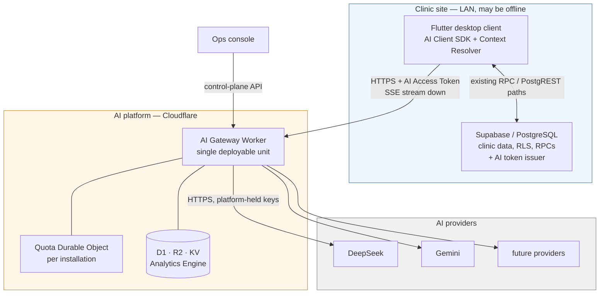
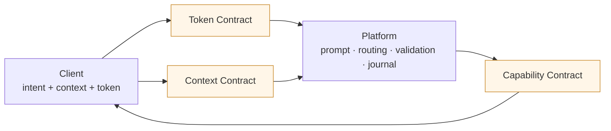
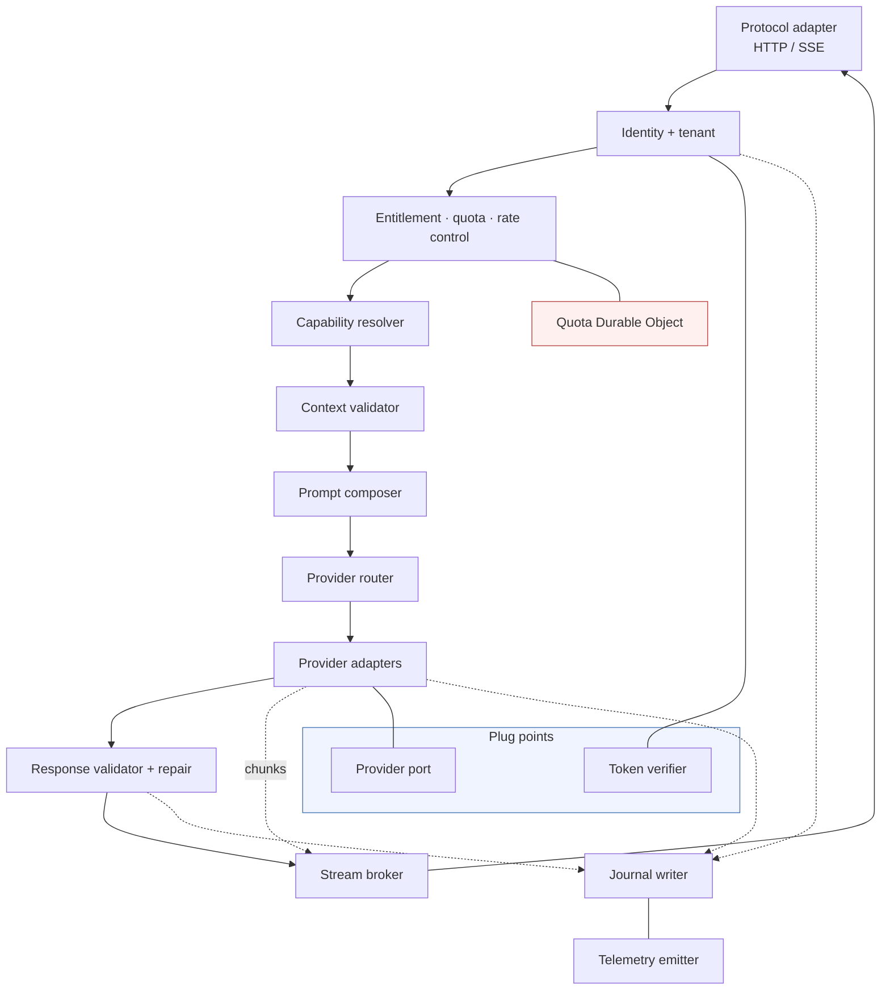
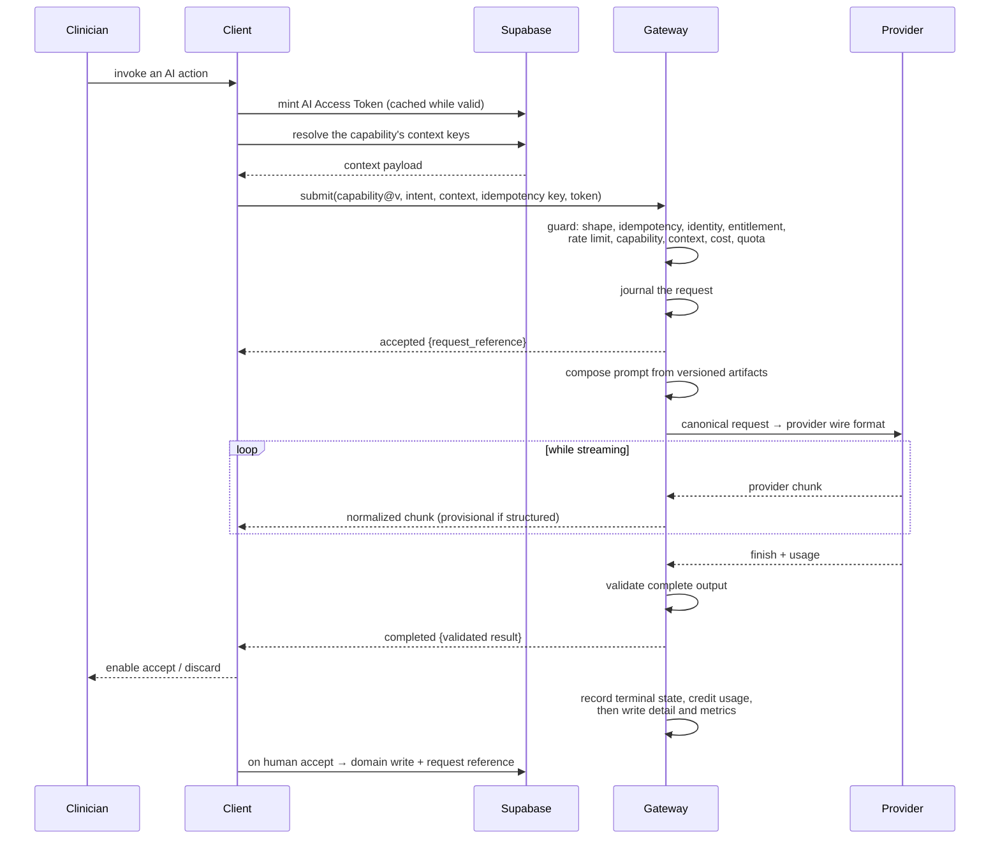
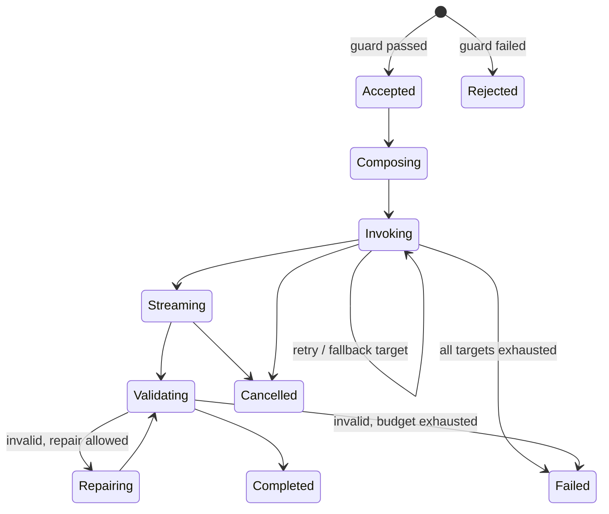
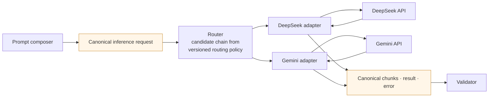

# AI Platform — Architecture Overview

- Purpose: Give a developer or architect a fast, complete mental model of the AI platform — its shape, its parts, and how a request travels through it.
- Read this when: you are new to the AI platform, reviewing a feature that touches it, or need orientation before diving into detail.
- Canonical for: nothing. This is a **companion overview**; `docs/architecture/17-ai-platform.md` is the canonical specification.
- Relationship to `17-ai-platform.md`: this document describes the **final architecture only** — no rationale, alternatives, trade-offs, or implementation guidance. Each section points to the corresponding section of the canonical document for depth.
- Usually paired with: `docs/architecture/02-system-overview.md`, `docs/architecture/04-backend.md`, `docs/architecture/09-security-rbac.md`.

> **Status:** Describes an architecture proposal. Nothing here is implemented yet.

---

## Table of Contents

1. [What the AI Platform Is](#1-what-the-ai-platform-is)
2. [System Landscape](#2-system-landscape)
3. [The Three Contracts](#3-the-three-contracts)
4. [Components and Responsibilities](#4-components-and-responsibilities)
5. [How Clients Talk to the Platform](#5-how-clients-talk-to-the-platform)
6. [End-to-End Request Flow](#6-end-to-end-request-flow)
7. [How the Platform Talks to AI Providers](#7-how-the-platform-talks-to-ai-providers)
8. [Cross-Cutting Concepts](#8-cross-cutting-concepts)
9. [Worked Examples](#9-worked-examples)
   - [Example A — A prompt needing no clinic data](#91-example-a--a-prompt-needing-no-clinic-data)
   - [Example B — A prompt needing clinic data](#92-example-b--a-prompt-needing-clinic-data)
   - [Example C — A streaming prompt](#93-example-c--a-streaming-prompt)
10. [Where to Read More](#10-where-to-read-more)

---

## 1. What the AI Platform Is

The AI platform is a **multi-tenant AI gateway** hosted on Cloudflare. The Flutter desktop client
asks it for AI assistance; it composes prompts, calls an AI provider, validates the result, and
returns it. It is the only internet-dependent part of the product, and it is strictly optional: the
clinic works normally with AI switched off.

Three sentences describe the whole division of labour:

- The **client** knows how to fetch clinic data and how to display and commit results. It knows
  nothing about prompts, models, or providers.
- The **AI platform** knows everything about AI. It knows nothing about clinic tables, columns, or
  SQL.
- The **clinic database (Supabase)** remains the single authority on identity, permissions, and the
  clinical record. The AI platform never writes to it.

### 1.1 Defining ideas

| Idea | Meaning |
| --- | --- |
| **Capability** | The unit of an AI feature (`visit.soap_draft@v2`). A capability is *data* — a manifest declaring what context it needs, which prompt and schema it uses, how it routes, what it costs, and how its output may be used. |
| **Fixed pipeline** | Every request passes through the same ordered stages. Capabilities parameterize stages; they never add, reorder, or skip them. This is what makes auth, quota, validation, and journaling unbypassable. |
| **One deployable unit** | The whole platform is a single Cloudflare Worker, plus its stores and one small stateful side-car. No service decomposition, no queues. |
| **Two plug points only** | AI providers and token verification are behind interfaces because each will have several implementations. Nothing else is abstracted. |
| **Advisory output** | AI output never auto-commits to a clinical record. A human explicitly accepts it, and that acceptance is recorded in Supabase. |

Adding a typical AI feature means publishing a new manifest and its prompt/schema artifacts — not
editing the pipeline, and often not releasing the client at all.

> Detail: [§3.1](17-ai-platform.md#31-architecture-style-and-why-this-one) (architecture style),
> [§5.1](17-ai-platform.md#51-capability-manifest) (capability manifest).

---

## 2. System Landscape

Four properties of this picture define the architecture:

1. **All arrows to the platform point outward from the clinic.** There is no path from the platform
   into the clinic database. Business data reaches the platform only as a payload the client sends.
2. **Provider credentials live only inside the Cloudflare box.** Neither the desktop app nor the
   clinic server ever holds one.
3. **The clinic side is fully functional without the platform.** AI features simply disappear.
4. **Each clinic deployment is an "installation"** — the platform's tenant, trust, and billing
   boundary.

### 2.1 Trust model in brief

Each clinic runs its own authentication with its own signing secret, so the platform cannot validate
clinic session tokens. Trust is established explicitly instead:

- **Enrollment (once per clinic, operator-driven).** A keypair is generated; the private key stays
  in the clinic's PostgreSQL, and the public key is registered with the platform.
- **Per request.** A `SECURITY DEFINER` RPC in the clinic database mints a short-lived **AI Access
  Token (AAT)**, audience-restricted to the platform, carrying tenant, actor, role, and the AI
  capability scopes the actor is allowed to use.
- **Verification.** The platform checks the AAT against the enrolled public key. It never sees a
  Supabase session token.

What the platform trusts, in order: the installation (an operator enrolled it), the token (signed,
unexpired, right audience, not replayed), the actor claims inside the token (the clinic's own RPC
derived them from RBAC). Everything else in the request body — including the context payload — is
treated as untrusted input.

Revocation is entirely platform-side and never affects clinic logins: revoke a token id, suspend an
actor, rotate the installation key, suspend the installation, or trip a kill switch.

> Detail: [§3.3](17-ai-platform.md#33-trust-and-network-topology) (trust and network topology),
> [§5.6](17-ai-platform.md#56-token-contract) (token contract),
> [§8.1](17-ai-platform.md#81-clinic-enrollment-and-trust-bootstrap) (enrollment sequence).

---

## 3. The Three Contracts

Almost all of the decoupling lives in three contracts. They are the interfaces to understand first.

| Contract | Direction | Says | Never contains |
| --- | --- | --- | --- |
| **Token Contract** | Clinic DB issues → platform verifies | Which installation, actor, branch, role, and capability scopes; valid until when | Clinic schema details; AI configuration |
| **Context Contract** | Platform declares → client satisfies | Which **context keys** a capability needs, in what shape, required or optional | Table names, column names, SQL, RPC names |
| **Capability Contract** | Platform declares → client consumes | Capability id and version, input shape, output schema, streaming mode, acceptance mode, error codes | Prompt text, model name, provider name, routing policy |

### 3.1 Context keys

A **context key** is a stable, versioned name for a unit of business data expressed in clinical
vocabulary — `patient.demographics@v1`, `visit.vitals@v1`, `medication.active_list@v1`. A key names
*what the data means*, never where it is stored.

This splits one question into two halves, each owned by the side that legitimately knows the answer:

- *What data does this feature need?* — the platform answers, by declaring keys in the manifest.
- *How is that data obtained?* — the client answers, by mapping each key to an existing Supabase RPC
  or query, read under the requesting user's own permissions and RLS.

Consequences worth internalizing: the platform only ever receives the keys it asked for (undeclared
keys are dropped), a new capability that reuses existing keys needs no client release, and changing a
clinic table changes only the client's mapping.

> Detail: [§3.4](17-ai-platform.md#34-the-three-seams) (the seams),
> [§5.2](17-ai-platform.md#52-context-contract) (context contract),
> [§5.7](17-ai-platform.md#57-versioning-and-compatibility-rules) (versioning rules).

---

## 4. Components and Responsibilities

Components exist in four places: the Flutter client, the clinic's Supabase, the Gateway Worker, and
the platform's stores.

### 4.1 Client side (Flutter)

| Component | Responsibility |
| --- | --- |
| **AI Client SDK** | Transport only: get a token, submit a request with an idempotency key, consume the event stream, expose cancel, surface terminal state, remember the request reference for support. |
| **Context Resolver** | A generic registry mapping *context key → Supabase read*. It receives a list of keys and returns a payload. It never sees a capability id and never branches on one. |
| **AI feature surfaces** | Per-feature UI: draft rendering, visibly-provisional styling, explicit accept/discard, degraded-mode states, request reference on failure. |

None of these contains prompt text, model names, provider names, or AI business rules. That is the
acceptance test for the client layer, and a CI lint enforces it.

### 4.2 Clinic backend (Supabase)

Additive only. The clinic database gains exactly two AI-shaped facts: *"I can mint tokens for the AI
platform"* and *"a human accepted AI output here."*

| Component | Responsibility |
| --- | --- |
| **Installation keystore** | Holds the installation id and private signing key in a restricted schema, readable only by the token-issuing function. |
| **AI token issuer RPC** | Converts an authenticated clinic session into a short-lived AAT, deriving tenant, actor, and AI scopes from the RBAC tables. |
| **Context provider RPCs** | Return the domain payloads the Context Resolver needs, under the caller's own permissions. Ordinary read RPCs with no AI knowledge. |
| **AI acceptance recording RPC** | Records that a human accepted AI content into a clinical record, storing the request reference alongside the domain write. |
| **AI availability flag** | Whether this installation is AI-enrolled, and the platform base URL — so the client can hide AI affordances without probing the network. |

### 4.3 Gateway Worker

One Worker, one pipeline. Each box below is a stage or a supporting module, not a service.

| Component | Owns the decision |
| --- | --- |
| **Protocol adapter** | The wire format: parsing, size limits, headers, SSE framing, mapping internal errors to HTTP responses. |
| **Identity and tenant resolution** | Whether the caller is authentic. Verifies the token through the verifier port and produces an immutable request principal that later stages read and none may change. |
| **Entitlement, quota, and rate control** | Whether the request is allowed to cost money — three separate mechanisms, see [§8.2](#82-rate-limiting-quota-and-cost-are-different-things). |
| **Capability resolver** | Which immutable manifest governs this request, honouring the client's version pin, the installation's grants, and kill switches. |
| **Context validator** | Whether the supplied context is complete, well-shaped, and consistent with the token's tenant claims. Drops undeclared keys. |
| **Prompt composer** | The exact provider-bound prompt, built from versioned prompt artifacts, the capability's business-rule fragments, the rendered context, the user intent, and output constraints. |
| **Provider router** | Which ordered chain of provider+model targets to attempt, from versioned routing policy. Stateless — the chain depends only on the capability, the policy, and this request. |
| **Provider adapters** | Translation between the platform's canonical representation and one provider's wire format, including classifying each failure as retryable or terminal. |
| **Response validator and repair** | Whether output may be returned: parse → schema → business rules → safety guards, with an optional bounded re-ask. |
| **Stream broker** | Delivery and cancellation: relays chunks, enforces provisional semantics, emits heartbeats, guarantees exactly one terminal event. |
| **Journal writer** | What is recorded and where — the auditable life of every request. |
| **Telemetry emitter** | Traces, structured logs, and metrics. Never prompts, context, or credentials. |

Two components stand slightly apart from the pipeline:

- **The Quota Durable Object** is the only stateful component in the platform. There is one per
  installation, it holds counters, and it hibernates when idle. There is no per-request state
  anywhere.
- **The prompt registry** is not a service. Prompt artifacts are immutable assets deployed with the
  Worker, and the version in force is pinned by the capability manifest — so "which prompt produced
  this?" always has exactly one answer.

### 4.4 Platform stores

| Store | Holds | Never holds |
| --- | --- | --- |
| **D1** | Installations, keys, entitlements, routing policy, request journal metadata, usage ledger, control-plane audit | Clinic business records, large text, high-frequency metrics |
| **R2** | Payload blobs: composed prompt, context, raw provider exchanges, validated result | Anything needed on the hot path |
| **KV** | Cached verification material, kill-switch flags, routing policy snapshot | Anything needing immediate global consistency |
| **Durable Object** | Per-installation quota and concurrency counters | Long-term records, per-request state |
| **Analytics Engine** | Metrics and analytics time series | Records of record |
| **Secret store** | Provider API keys and signing material | — |

Two rules govern the write path: **payloads go to R2 and pointers go to D1**, and **metrics never
touch D1**. One D1 row per request on the request path; per-attempt detail and blobs are written after
the client has its answer.

### 4.5 Control plane

A small internal surface, separately authenticated with operator identity rather than clinic
identity. It covers installation lifecycle (enroll, rotate, suspend), entitlement and quota
management, capability grants and deprecation, routing policy publication, kill switches (global, per
capability, per installation, per provider), support lookup by request reference, and operational
dashboards. Every mutation is journaled with the operator identity.

> Detail: [§4](17-ai-platform.md#4-components-and-responsibilities) (all components in full),
> [§4.4](17-ai-platform.md#44-storage-ownership) (storage ownership),
> [§4.6](17-ai-platform.md#46-responsibility-matrix) (responsibility matrix).

---

## 5. How Clients Talk to the Platform

The client speaks HTTPS to the Worker and receives server-sent events back. One request goes up; a
stream of events comes down.

### 5.1 The API surface

| Surface | Purpose |
| --- | --- |
| **Capability discovery** | Fetch the active manifests for this installation. Cached and revalidated; this is what tells the Context Resolver which keys to produce. |
| **Submit request** | Create an AI request for a capability, with the user intent, the resolved context payload, an idempotency key, and a capability version pin. |
| **Cancel** | Close the stream. There is no separate endpoint. |
| **Get request** | Terminal state and validated result for a request, after the stream is gone. |
| **Usage summary** | Current period consumption and entitlement, for in-app quota display. |
| **Support lookup** | Control-plane only: resolve a request reference to a full trace. |

### 5.2 The event stream

Five rules define the protocol, and a client that follows them cannot be surprised:

1. The stream **opens with an `accepted` event carrying the request reference** — so the user has a
   support handle before anything can go wrong.
2. Content events are explicitly typed, and for structured output are explicitly flagged
   `provisional`.
3. Heartbeats keep intermediaries from closing an idle stream during a slow first token.
4. **Exactly one terminal event ends every stream**: `completed` with the validated result, `failed`
   with a taxonomy code, or `cancelled`. Completion is never inferred from silence.
5. **Closing the stream cancels the request.** A deliberate cancel and a network drop take the same
   path; a generation interrupted this way is lost and the user retries.

The terminal payload is authoritative and self-contained. Clients never assemble the final result
from chunks — chunks exist for perceived responsiveness only, which is why a client that ignores
streaming entirely is still correct.

### 5.3 Errors and retries

Errors come from a **closed, stable taxonomy**; provider-native errors are always mapped into it and
never surfaced raw. Every error carries the request reference, the trace id, and whether a retry is
safe.

| Family | Codes | Client behaviour |
| --- | --- | --- |
| Identity | `unauthenticated`, `installation_suspended` | Re-mint the token and retry once; or hide AI entirely. |
| Authorization | `forbidden_capability`, `capability_unknown`, `capability_retired`, `capability_disabled` | Hide the affordance, prompt for an app update, or show temporarily unavailable. |
| Throttling | `rate_limited`, `quota_exhausted` | Back off, or show quota state with an admin path. |
| Input | `request_too_large`, `context_required`, `context_invalid` | Narrow the input, or resolve the missing keys and resubmit once. |
| Provider | `provider_unavailable`, `provider_rejected`, `timeout` | Offer retry, with a degraded notice where relevant. |
| Output | `validation_failed` | Offer retry. Invalid content is never shown. |
| Other | `cancelled`, `internal_error` | Return to idle, or show the reference and report. |

Idempotency separates two kinds of retry, and the distinction is architectural:

- A **transport retry** reuses the same idempotency key and returns the original request — never a
  second inference, never a second charge.
- A **user-initiated retry** is a new request with a new key, linked to the previous one in the
  journal, because the user is genuinely asking for another attempt.

> Detail: [§5.4](17-ai-platform.md#54-error-taxonomy) (full error taxonomy),
> [§5.5](17-ai-platform.md#55-api-surface-and-streaming-protocol) (API and streaming protocol),
> [§6.6](17-ai-platform.md#66-idempotency-retry-and-duplicate-suppression) (idempotency and retry).

---

## 6. End-to-End Request Flow

### 6.1 The happy path

### 6.2 The pipeline, grouped

Every request traverses the same stages, ordered so that the **cheapest and most certain rejection
comes first**. Nothing reaches a paid provider call until everything knowable locally has been
checked.

| Phase | Stages | What it establishes | Typical cost |
| --- | --- | --- | --- |
| **Guard** | Shape → idempotency → identity → entitlement → rate limit → capability resolve → context validate → cost and quota check | This request is well-formed, authentic, permitted, affordable, and not a replay | Tens of milliseconds; cached lookups only |
| **Record** | Journal the request | A durable record exists before any work begins | One database insert |
| **Work** | Compose prompt → route and invoke → stream relay → validate (and optionally repair) | The answer | Provider latency — dominates everything |
| **Settle** | Emit the terminal event → record outcome and credit usage | The result is delivered and accounted for | Milliseconds |
| **After** | Attempt detail to D1, payloads to R2, metrics to Analytics Engine | Diagnostic depth | Runs after the client has its answer; never fails the request |

The important invariant: the journal row is created the moment a request is **accepted**, so nothing a
user witnessed can be missing from the record — including requests that are later cancelled, dropped,
or failed. Rejections from the guard are counted in metrics rather than journaled as requests.

### 6.3 Request states

`Completed`, `Failed`, `Cancelled`, and `Rejected` are terminal and immutable. Every transition is
journaled with a timestamp.

### 6.4 Two flows worth knowing

- **Missing context self-healing.** If a client submits without a required key — usually a stale
  manifest cache — the platform rejects with `context_required` *plus the missing keys and their
  shapes*. The client refreshes its manifests, resolves the key, and resubmits once. This is what
  lets platform releases and desktop releases move on different schedules.
- **Support trace.** A user reports a failure by reading out a short request reference. Support
  resolves it to the journal row (installation, actor, capability version, prompt version, state
  timeline, error code, trace id), the attempt rows (provider, model, latency, tokens, cost), and the
  R2 blobs (exact prompt, exact context, raw provider response). The failure is explained without
  reproducing it.

> Detail: [§6.1](17-ai-platform.md#61-the-pipeline) (all sixteen stages),
> [§6.3](17-ai-platform.md#63-request-state-machine) (state machine),
> [§8](17-ai-platform.md#8-sequence-diagrams) (nine sequence diagrams, including self-healing and
> support trace).

---

## 7. How the Platform Talks to AI Providers

Provider independence is structural, not aspirational: **nothing upstream of the adapters contains a
type that can name a provider.**

### 7.1 The canonical representation

An internal, provider-neutral form sits between the composer and the adapters, with four shapes: the
**request** (role-tagged message parts, output format directive, sampling constraints, token limits,
deadline, correlation ids), the **stream chunk** (sequence number, kind, payload, terminal flag), the
**result** (final content, usage counters, provider and model actually used, finish reason, timings),
and the **error** (taxonomy code, retryability, provider-native detail for diagnostics only).

### 7.2 Routing

The router turns a capability into an **ordered chain of provider+model targets**, using versioned
routing policy plus the capability's declared requirements — structured-output support, context window,
language, latency class, cost class — and any installation override or degraded tier.

- A capability manifest **names requirements, never a provider or model.** The routing policy maps
  requirements to targets.
- Routing policy is **data**: versioned, auditable, independently deployable, invisible to clients.
- Routing is **stateless**. There is no circuit breaker and no shared provider-health state, so the
  reason a request went to a particular provider is fully contained in that request's journal entry.

### 7.3 Adapters, retry, and fallback

Each adapter owns exactly one provider's wire mapping, stream normalization, usage extraction,
timeouts, structured-output mechanics, and **failure classification** (retryable or terminal).
Adapters own nothing else — retry, fallback, logging, and journaling decisions stay uniform across
providers.

On failure the request walks its chain: bounded, jittered retries against a target, then the next
target. Two rules prevent subtle corruption:

- **Never splice output across providers.** A fallback restarts generation and tells the client it is
  regenerating.
- **Fallback only to targets that satisfy the capability's requirements** — so a provider outage never
  turns into a validation failure.

Provider credentials come from the platform's secret store, are never logged, and never appear in the
journal.

> Detail: [§5.3](17-ai-platform.md#53-canonical-inference-representation) (canonical representation),
> [§4.3.7](17-ai-platform.md#437-provider-router-and-policy-engine) and
> [§4.3.8](17-ai-platform.md#438-provider-adapters-and-egress) (router and adapters),
> [§8.6](17-ai-platform.md#86-provider-failure-retry-and-fallback) (failure and fallback sequence).

---

## 8. Cross-Cutting Concepts

Six ideas cut across every component. Missing any of them makes the design look arbitrary.

### 8.1 Validation happens at commit time, streaming is provisional

Whole-document validity cannot be established mid-stream, so each capability declares an output mode:

| Mode | During the stream | At completion |
| --- | --- | --- |
| `prose` | Text chunks, with cheap incremental guards | Full guard set on the assembled text |
| `structured` | Provisional partial fields, always flagged | Complete document validated against schema and business rules |
| `structured_atomic` | Progress and heartbeats only | Same as `structured` |

The invariant that survives: **no unvalidated content ever reaches the clinical record.** Unvalidated
content may reach the *screen*, rendered as a visible draft with no commit control.

### 8.2 Rate limiting, quota, and cost are different things

Four concerns with four different consistency needs, deliberately not merged:

| Concern | Question | Mechanism |
| --- | --- | --- |
| **Rate limiting** | Too many requests too fast? | Rate-limiting binding on composite keys (installation, installation+actor, installation+capability). Approximate by design. |
| **Quota / budget** | Has this clinic consumed what it paid for? | Per-installation Quota Durable Object — strongly consistent counters, credited with *actual* usage after each request, backed by an append-only ledger. |
| **Concurrency cap** | Too many simultaneous inferences? | A counter in the same Durable Object. |
| **Cost ceiling** | Is this single request too expensive? | A local pre-flight estimate against the capability's budget, before any egress. |

Neither quota nor rate limiting ever hard-locks the product. Crossing a *soft* threshold downgrades
routing to a cheaper target; exhausting quota disables an additive feature and says so.

### 8.3 Every request is auditable, and audit spans two systems

- The **platform journal** proves what the platform received, sent, and returned: principal,
  capability and prompt versions, context keys and sizes, provider attempts, tokens and cost,
  validation results, terminal state, plus R2 pointers to the exact prompt, context, and result.
- The **clinic database** proves what a human did with it: an acceptance recorded against the domain
  row.
- The **request reference** is the join key, stored on both sides. It is short, human-readable, and
  emitted before generation starts.

Logs and metrics are for aggregate health and may be sampled; the journal is for individual truth and
may not.

### 8.4 Human acceptance gates the clinical record

Every capability declares an acceptance mode. Clinical-content capabilities require an explicit human
accept action, recorded in Supabase with the request reference. The platform has no write path into
the clinic database, so this gate cannot be bypassed by construction.

### 8.5 Versioning keeps clients and platform independent

The asymmetry to remember: **prompts, models, providers, and routing policy can change at any time
without client awareness. Capability ids, context key shapes, output schemas, and error codes cannot.**

Capability versions are pinned by the client and remain servable through a defined overlap window
after deprecation; retirement is announced through discovery before it is enforced. Adding an optional
context key is backward compatible; a new required key or a shape change forces a new capability
version. Unknown error codes must be treated as `internal_error`.

### 8.6 Degradation is a first-class state

AI is additive, so every failure mode has a defined, non-blocking behaviour:

| Situation | Behaviour |
| --- | --- |
| Installation not AI-enrolled | AI affordances never appear at all. |
| No internet, or platform unreachable | AI shown as unavailable; all clinical workflows continue. |
| Quota exhausted | AI disabled with a clear reason and an admin path; nothing else is affected. |
| Soft quota threshold crossed | Request proceeds on a cheaper routing tier, with a notice. |
| Kill switch tripped | The capability reports temporarily unavailable. |
| Provider outage | Retry and fallback; if all targets fail, a typed error and an offer to retry. |

> Detail: [§6.4](17-ai-platform.md#64-streaming-with-commit-time-validation) (streaming and
> validation), [§4.3.3](17-ai-platform.md#433-entitlement-quota-and-rate-control) (quota and rate
> control), [§7](17-ai-platform.md#7-data-flow-and-data-model) (data model, retention, write-path
> rules), [§13](17-ai-platform.md#13-operational-concerns) (observability, service levels, testing).

---

## 9. Worked Examples

Three end-to-end walkthroughs, each naming every hop and every component involved. They build on each
other: **Example A** is the full path with the fewest moving parts, **Example B** adds clinic data
collection, and **Example C** adds streaming. Where a later example repeats an earlier step it is still
listed, but described in one line.

Shared vocabulary for all three: `SDK` (AI Client SDK), `Resolver` (Context Resolver), `SB`
(clinic Supabase/PostgreSQL), `GW` (Gateway Worker), `DO` (per-installation Quota Durable Object),
`PRV` (AI provider).

### 9.1 Example A — A prompt needing no clinic data

**Scenario.** A clinician has typed a rough note and asks the app to tidy the wording.

**Capability.** `note.polish@v1` — required context keys: *none*; output mode: `structured_atomic` (no
streaming, so nothing is shown until the result is validated); acceptance mode:
`human_accept_required`.

#### 9.1.1 Phase 1 — Client preparation (inside the clinic, no internet)

| # | Hop | What happens |
| --- | --- | --- |
| 1 | Clinician → **AI feature surface** | The user presses "Polish note". The surface passes the selected text as the *user intent*. |
| 2 | Surface → **SDK** | The SDK reads its cached capability manifest for `note.polish@v1` and sees the context requirement list is empty, so the **Resolver is not invoked at all**. |
| 3 | **SDK** → **SB** (`issue_ai_token` RPC, LAN) | If the cached AI Access Token is expired or absent, the SDK calls the token issuer RPC. |
| 4 | **SB** internally | The `SECURITY DEFINER` function verifies the caller's Supabase session, resolves organization, branch, staff member, role, and the actor's AI capability scopes from the RBAC tables, reads the private signing key from the restricted schema, mints a token with `aud = ai-platform`, a `jti`, and a few minutes' expiry, and records the issuance. |
| 5 | **SB** → **SDK** | Returns the AAT. The SDK caches it until shortly before expiry. |
| 6 | **SDK** internally | Generates an idempotency key bound to this user action, and a trace id. |
| 7 | **SDK** → **GW** (HTTPS, internet) | `POST` submit: capability id + pinned version, user intent, empty context payload, idempotency key, trace id, AAT in the authorization header. |

At this point the clinic has sent everything it will ever send for this request. There is no callback
path from the platform back into the clinic.

#### 9.1.2 Phase 2 — The guard (inside the Worker)

Each stage either rejects with a typed error or hands an enriched request to the next. Nothing here
costs money.

| # | Stage / component | What it does | What it touches |
| --- | --- | --- | --- |
| 8 | **Protocol adapter** | Parses the request, enforces body and field size limits, reads the idempotency key, trace id, and version pin. | — |
| 9 | **Idempotency check** | Looks up the installation-scoped idempotency key. First submission, so nothing found. A repeat here would return the original request instead of starting a second inference. | KV / D1 lookup |
| 10 | **Identity + tenant resolution** | Selects the verification key by the token's issuer claim through the **token verifier port**, checks the signature, audience, expiry and clock skew, and rejects a replayed `jti`. Loads the installation record and its status. | KV-cached installation key; replay-guard table |
| 11 | **Identity** (cont.) | Builds the immutable **request principal**: installation, organization, branch, actor, role, capability scopes. No later stage may modify it. | — |
| 12 | **Entitlement** | Confirms the installation is active and AI-enabled, and that its plan and grants permit `note.polish`. | KV-cached entitlement snapshot |
| 13 | **Rate control** | Evaluates burst limits on the composite keys — installation, installation+actor, installation+capability. | Rate-limiting binding |
| 14 | **Capability resolver** | Resolves `note.polish@v1` to its immutable manifest, honouring the client's version pin; checks lifecycle state and the global, per-installation, per-capability, and per-provider kill switches. | Bundled manifest artifacts; KV flags |
| 15 | **Context validator** | The manifest declares no required keys, so there is nothing to validate. If the client had sent extra keys anyway, they would be **dropped here** rather than forwarded. | — |
| 16 | **Cost pre-flight** | Estimates input tokens from the intent, adds the capability's max output tokens, and compares the total against the capability's per-request cost ceiling. | — |
| 17 | **GW** → **DO** → **GW** | One round trip to the per-installation Quota Durable Object: is there budget left in the current period? It answers yes, yes-but-degraded (soft threshold crossed), or no. It also increments the in-flight concurrency counter. | Quota Durable Object |

#### 9.1.3 Phase 3 — Record, compose, and invoke

| # | Step | What happens |
| --- | --- | --- |
| 18 | **Journal writer** → **D1** | Inserts one request row with state `accepted`: request id, the short human-readable **request reference**, principal, capability id and version, prompt artifact hash, idempotency key, trace id, timestamps. This write is synchronous — from here on, the request cannot be missing from the record. |
| 19 | **Stream broker** → **SDK** | Emits the `accepted` event carrying the request reference. Even for a non-streaming capability the client now holds a support handle. |
| 20 | **Prompt composer** | Builds the provider-bound message set from the versioned system instruction artifact, the capability's business-rule fragments, the user intent, and the output constraints. The JSON output directive is **derived from the capability's output schema**, so prompt and validator cannot disagree. |
| 21 | **Prompt composer** → canonical form | Produces the **canonical inference request**: role-tagged parts, output format directive, sampling constraints, max output tokens, deadline, correlation ids. Nothing from here to the adapter can name a provider. |
| 22 | **Provider router** | Reads the versioned routing policy and the capability's declared requirements (structured output support, context window, language, latency and cost class) and returns an ordered candidate chain, for example `[DeepSeek/model-a, Gemini/model-b]`. It records *why* the chain was chosen. No provider history is consulted. |
| 23 | **Provider adapter** (first target) | Fetches the provider credential from the secret store, translates the canonical request into that provider's wire format, enables its structured-output mode, and sets the timeout. |
| 24 | **GW** → **PRV** (HTTPS) | The inference call. This is where the latency and the money are. |
| 25 | **PRV** → **Provider adapter** | The complete response arrives. The adapter normalizes it into the **canonical result**: content, usage counters, provider and model actually used, finish reason, timings. A failure instead would be classified retryable or terminal and handed to the retry/fallback logic. |

#### 9.1.4 Phase 4 — Validate, deliver, settle

| # | Step | What happens |
| --- | --- | --- |
| 26 | **Response validator** | Applies the checks in order: parse validity → schema conformance → the capability's business rules → safety guards (leaked system instructions, refusals, empty or truncated output, prompt-injection echo). |
| 27 | **Response validator** (on failure) | If the manifest allows repair and budget remains, one bounded re-ask is made with the validation errors appended, then re-validated. Exhausting the repair budget ends the request as `validation_failed`, and **invalid content is never shown**. |
| 28 | **Stream broker** → **SDK** | Emits exactly one terminal event: `completed` with the validated document and usage summary. The stream ends. |
| 29 | **SDK** → **Surface** → Clinician | The polished note is rendered as a draft with explicit accept and discard controls. |
| 30 | **Journal writer** → **D1** | Updates the request row to `completed` with the terminal timestamp. |
| 31 | **GW** → **DO** | Credits the **actual** token and cost usage to the period counters and decrements the in-flight count. |
| 32 | *After the response* — **Journal writer** → **D1** / **R2** | Writes the per-attempt row (provider, model, latency, tokens, cost, provider request id) and the payload blobs: composed prompt, context (empty here), raw provider exchange, validated result. |
| 33 | *After the response* — **Telemetry emitter** → **Analytics Engine** | Emits metrics: outcome, latencies, token counts, cost, dimensioned by capability, provider, model, and installation. Also writes the append-only usage ledger row that backs the DO counters. |
| 34 | Clinician → **Surface** → **SB** (acceptance RPC) | The user presses Accept. The client calls the clinic's acceptance RPC, which writes the text into the clinical record **and stores the request reference alongside it**. Discarding instead ends the story here, and the platform never learns which choice was made. |

Steps 32 and 33 are the only ones that run after the user has an answer, and they carry diagnostic
depth only. The existence and outcome of the request were already durable at steps 18 and 30.

### 9.2 Example B — A prompt needing clinic data

**Scenario.** A clinician opens a visit and asks for a draft SOAP note. The platform cannot fetch
anything from the clinic, so the client must collect what the capability declares it needs.

**Capability.** `visit.soap_draft@v2` — required context keys `patient.demographics@v1`,
`visit.vitals@v1`, `visit.chief_complaint@v1`; optional key `medication.active_list@v1`; output mode
`structured`; acceptance mode `human_accept_required`.

#### 9.2.1 Phase 1 — Discovery: learning what is needed

| # | Hop | What happens |
| --- | --- | --- |
| 1 | **SDK** → **GW** (discovery endpoint) | Periodically — not per request — the SDK fetches the active capability manifests for this installation and caches them, revalidating by version/etag. |
| 2 | **GW** → **SDK** | Returns the manifests. For `visit.soap_draft@v2` this includes the **context key list with each key's shape**, the output schema, the streaming mode, and the acceptance mode. It does **not** include the prompt, the model, the provider, or the routing policy. |
| 3 | **SDK** → **Resolver** (registration) | The Resolver already holds a mapping of *context key → Supabase read* for every key this client version supports. It is a generic registry; it never sees a capability id. |

The client now knows *what* data is required. It still has no idea *why*, or what prompt will consume
it.

#### 9.2.2 Phase 2 — Resolving context (inside the clinic, no internet)

| # | Hop | What happens |
| --- | --- | --- |
| 4 | Clinician → **Surface** → **SDK** | The user presses "Draft SOAP note" on visit *V*. The surface supplies the user intent and the visit and patient identifiers. |
| 5 | **SDK** → **Resolver** | Hands the Resolver the key list from the cached manifest — nothing more. |
| 6 | **Resolver** → **SB** (parallel RPCs, LAN) | One read per key, issued concurrently: the demographics RPC, the vitals RPC, the chief-complaint RPC, and the active-medications RPC. |
| 7 | **SB** | Each read executes **under the requesting user's own session and RLS**. A user who may not see the patient gets nothing, so the AI path cannot become a permission bypass. |
| 8 | **Resolver** → **SDK** | Assembles a context payload keyed by context key, each value conforming to the platform-published shape for that key. Short-lived caching within the screen is allowed. |
| 9 | **SDK** → **SB** (`issue_ai_token`) | Mints or reuses the AAT, exactly as in Example A steps 3–5. |
| 10 | **SDK** → **GW** (HTTPS) | Submit: capability id and pinned version, user intent, the assembled context payload, idempotency key, trace id, AAT. |

#### 9.2.3 Phase 3 — The detour: a stale manifest

Suppose this client's cached manifest predates a platform release that added a required key. The
request does not fail hard.

| # | Step | What happens |
| --- | --- | --- |
| 11 | **Context validator** | Runs after identity, entitlement, rate control, and capability resolve — the same guard order as Example A. It compares the supplied payload against the resolved manifest's Context Contract and finds a required key missing. |
| 12 | **GW** → **SDK** | Rejects with `context_required`, and the rejection **carries data**: the missing key names, their shapes, and the current manifest version. No quota is consumed and no journal request row is created. |
| 13 | **SDK** → **GW** | Refreshes its manifest cache. |
| 14 | **SDK** → **Resolver** → **SB** | Resolves the newly required key through the existing registry mapping. |
| 15 | **SDK** → **GW** | Resubmits **with the same idempotency key**. Validation now passes and the normal pipeline continues. |

This retry is bounded to one automatic attempt. A second `context_required` is a real defect: the
client surfaces it to the user with the request reference. If the client version has no mapping for
the new key at all, the same error surfaces immediately and the clinic keeps working without that
capability until the app is updated.

#### 9.2.4 Phase 4 — Validation of context, then the normal path

| # | Step | What happens |
| --- | --- | --- |
| 16 | **Context validator** | Required keys present; every value conforms to its declared shape; sizes within bounds; and the payload is **cross-checked against the token's tenant claims** — context for another organization or branch is rejected. |
| 17 | **Context validator** | Any key the manifest did not declare is **dropped**, not forwarded. This is what keeps the platform from receiving more clinical data than the capability asked for. |
| 18 | **Cost pre-flight** → **DO** | The token estimate now includes the rendered context, which is usually the bulk of the input. Then the quota check, as in Example A step 17. |
| 19 | **Journal writer** → **D1** | The request row is inserted, recording the **context key names and sizes** — not their contents, which go to R2 later. |
| 20 | **Prompt composer** | Renders the validated context through the capability's context template as clearly delimited, typed data, kept separate from the instruction text so that free text inside a clinical note cannot act as an instruction. Then assembles the system instruction, business-rule fragments, the schema-derived JSON directive, and the user intent. |
| 21 | **Router → adapter → provider → adapter** | Identical to Example A steps 22–25, with structured-output mode enabled because the capability requires it. Any fallback target must also support structured output. |
| 22 | **Stream broker** → **SDK** | Because the mode is `structured`, provisional partial fields stream while the document is produced, each explicitly flagged. The client renders a visibly-draft skeleton **with no accept control**. Chunk mechanics are detailed in Example C. |
| 23 | **Response validator** | On the complete document: schema conformance, then the capability's business rules — enumerations restricted to the clinic's own vocabulary, numeric ranges, required sections present, and **referential sanity against the supplied context** — then the safety guards. Bounded repair applies as in Example A step 27. |
| 24 | **Stream broker** → **SDK** | One terminal `completed` event carrying the validated document. The client **replaces the provisional draft wholesale**; it never assembles the result from chunks. |
| 25 | **Settle and after** | Terminal state to D1, actual usage credited to the DO, then attempt rows, payload blobs (including the exact context that was used), the usage ledger row, and metrics — as in Example A steps 30–33. |
| 26 | Clinician → **SB** (acceptance RPC) | The user reviews, edits if needed, and accepts. The clinical write happens through the ordinary clinic RPC with its existing validation, triggers, and RLS, storing the request reference. The AI platform has no write path into Supabase at any point. |

**What this example demonstrates about the design:** the platform declared its data needs in clinical
vocabulary and never learned a table name; the client satisfied them and never learned a prompt; and
adding a fourth key later would need a client mapping but no pipeline change.

### 9.3 Example C — A streaming prompt

**Scenario.** A clinician asks for a drafted patient-instruction paragraph and watches it appear.

**Capability.** `visit.patient_instructions@v1` — required context key `visit.diagnosis_summary@v1`;
output mode `prose`; acceptance mode `human_accept_required`.

#### 9.3.1 Phase 1 — Opening the stream

| # | Step | What happens |
| --- | --- | --- |
| 1 | **SDK** → **SB** → **GW** | Token minted, the single context key resolved through the Resolver, and the request submitted — Example B steps 4–10, condensed. The submit request declares that the client accepts an event stream. |
| 2 | **GW** guard | Stages 1–8 exactly as in Example A: shape, idempotency, identity, entitlement, rate control, capability resolve, context validation, cost pre-flight and quota check. |
| 3 | **Journal writer** → **D1** | Request row inserted with state `accepted`, before a single byte is generated. |
| 4 | **Protocol adapter** → **SDK** | The HTTP response begins: status, SSE headers, and the stream stays open. |
| 5 | **Stream broker** → **SDK** | Event 1: `accepted` with the request reference. The surface switches to a "generating" state and shows a cancel control. |

#### 9.3.2 Phase 2 — While the tokens flow

| # | Step | What happens |
| --- | --- | --- |
| 6 | **Prompt composer → router → adapter** | The canonical request is composed and routed as before, with the stream flag set, and translated to the chosen provider's streaming wire format. |
| 7 | **Adapter** → **PRV** | The streaming inference call opens, carrying an abort signal the Worker retains. |
| 8 | **PRV** → **Adapter** (repeating) | Each provider chunk is normalized into a **canonical stream chunk**: sequence number, kind (`text_delta`, `usage`, `provider_note`), payload, terminal flag. Provider-specific framing stops here. |
| 9 | **Adapter** → **Stream broker** (repeating) | The broker applies the cheap incremental guards a partial text permits: length ceiling, stop sequences, and system-instruction leak detection. A violation aborts the provider call and fails the request terminally rather than continuing to display text. |
| 10 | **Stream broker** → **SDK** (repeating) | Emits a `text_delta` event per normalized chunk. |
| 11 | **Stream broker** → **SDK** (as needed) | Emits heartbeat events during a slow first token so that no intermediary closes an idle connection. |
| 12 | **SDK** → **Surface** → Clinician | Text appears live. The surface may display it, but the **save control stays disabled** — nothing streamed is committable. |
| 13 | Nothing is written per chunk | No journal row, no blob, no metric is written per chunk anywhere in the platform. Only aggregates are recorded, after the fact. |

#### 9.3.3 Phase 3 — Closing the stream

| # | Step | What happens |
| --- | --- | --- |
| 14 | **PRV** → **Adapter** | The provider signals finish and reports usage. The adapter emits the canonical result. |
| 15 | **Response validator** | Now that the text is complete, the **full** guard set runs on the assembled output — the checks that were impossible mid-stream. |
| 16 | **Stream broker** → **SDK** | Event *n*: exactly one terminal `completed`, carrying the validated text and the usage summary. The stream closes. |
| 17 | **SDK** → **Surface** | The client treats the terminal payload as authoritative and replaces what it accumulated from chunks. Accept and discard controls become active. |
| 18 | **Settle and after** | Terminal state to D1, usage credited to the DO, then attempt rows, blobs, ledger row, and metrics — including time-to-first-token, which is tracked per provider and model. |
| 19 | Clinician → **SB** | Accept records the paragraph and the request reference in the clinical record. |

#### 9.3.4 The three ways this stream can end differently

| Situation | Every hop that happens |
| --- | --- |
| **The user cancels** | The clinician presses Cancel → the SDK closes the event stream → the Worker observes the client disconnect → the stream broker aborts the in-flight provider fetch through its abort signal → the DO is credited with the **partial** usage the provider already billed → the journal row is updated to `cancelled`. There is no cancel endpoint and no server-side request registry. A network drop takes this identical path, and the generation is lost. |
| **The provider fails mid-stream** | The adapter classifies the failure as retryable → bounded, jittered retries against the same target → then the next target in the chain → the broker sends an explicit "regenerating" event and **restarts** the text, because output is never spliced across providers → each attempt is journaled separately. If every candidate fails, one terminal `provider_unavailable` event ends the stream. |
| **A guard trips mid-stream** | The incremental guard at step 9 fails → the provider fetch is aborted → one terminal `failed` event carries the taxonomy code and the request reference → the partial text is discarded on the client. |

In all three cases the journal row created at step 3 survives, so support can reconstruct the request
from its reference even though the user has no result.

> Detail: [§8.2](17-ai-platform.md#82-streaming-prose-request--happy-path) (streaming happy path),
> [§8.3](17-ai-platform.md#83-structured-json-request-with-context-enrichment) (structured with
> context), [§8.4](17-ai-platform.md#84-missing-context-self-healing) (missing-context recovery),
> [§8.5](17-ai-platform.md#85-validation-failure-bounded-repair-then-terminal-failure)–[§8.7](17-ai-platform.md#87-user-initiated-cancellation)
> (repair, fallback, cancellation).

---

## 10. Where to Read More

`17-ai-platform.md` is the canonical document. This table maps each overview section to it.

| To go deeper on | Read |
| --- | --- |
| Architecture style, capability model | [§3.1](17-ai-platform.md#31-architecture-style-and-why-this-one) |
| System context and topology diagrams | [§3.2](17-ai-platform.md#32-system-context), [§3.3](17-ai-platform.md#33-trust-and-network-topology) |
| The three contracts, and how they are enforced in CI | [§3.4](17-ai-platform.md#34-the-three-seams) |
| What the platform deliberately excludes | [§3.5](17-ai-platform.md#35-deliberately-not-in-the-platform) |
| Every component in full detail | [§4](17-ai-platform.md#4-components-and-responsibilities) |
| Storage ownership and the control plane | [§4.4](17-ai-platform.md#44-storage-ownership), [§4.5](17-ai-platform.md#45-control-plane) |
| Capability manifest fields | [§5.1](17-ai-platform.md#51-capability-manifest) |
| Context keys, shapes, evolution rules | [§5.2](17-ai-platform.md#52-context-contract) |
| Canonical inference representation | [§5.3](17-ai-platform.md#53-canonical-inference-representation) |
| Full error taxonomy and streaming protocol | [§5.4](17-ai-platform.md#54-error-taxonomy), [§5.5](17-ai-platform.md#55-api-surface-and-streaming-protocol) |
| Token claims | [§5.6](17-ai-platform.md#56-token-contract) |
| Versioning and compatibility rules | [§5.7](17-ai-platform.md#57-versioning-and-compatibility-rules) |
| The sixteen pipeline stages and their ordering | [§6.1](17-ai-platform.md#61-the-pipeline), [§6.2](17-ai-platform.md#62-why-this-order-and-not-another) |
| Cancellation semantics | [§6.5](17-ai-platform.md#65-cancellation) |
| D1 entities, R2 layout, retention classes | [§7.3](17-ai-platform.md#73-d1-logical-model)–[§7.7](17-ai-platform.md#77-retention-and-recovery) |
| Sequence diagrams for every major flow | [§8](17-ai-platform.md#8-sequence-diagrams) |
| Risks and their mitigations | [§11](17-ai-platform.md#11-risks-and-mitigations) |
| Delivery phases and extension recipes | [§12](17-ai-platform.md#12-evolution-path) |
| Observability, service levels, testing, cost | [§13](17-ai-platform.md#13-operational-concerns) |
| Terminology | [§16](17-ai-platform.md#16-glossary-additions) |
