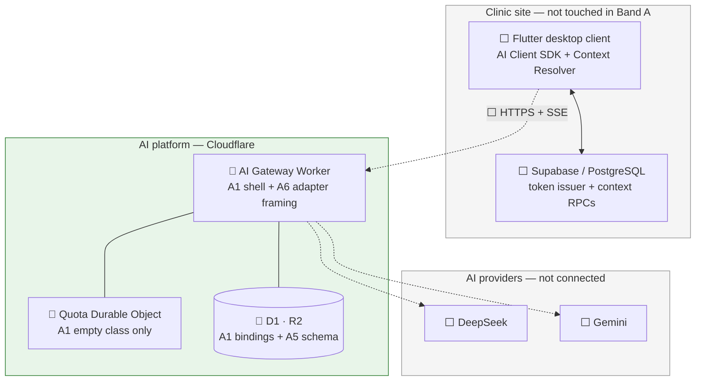
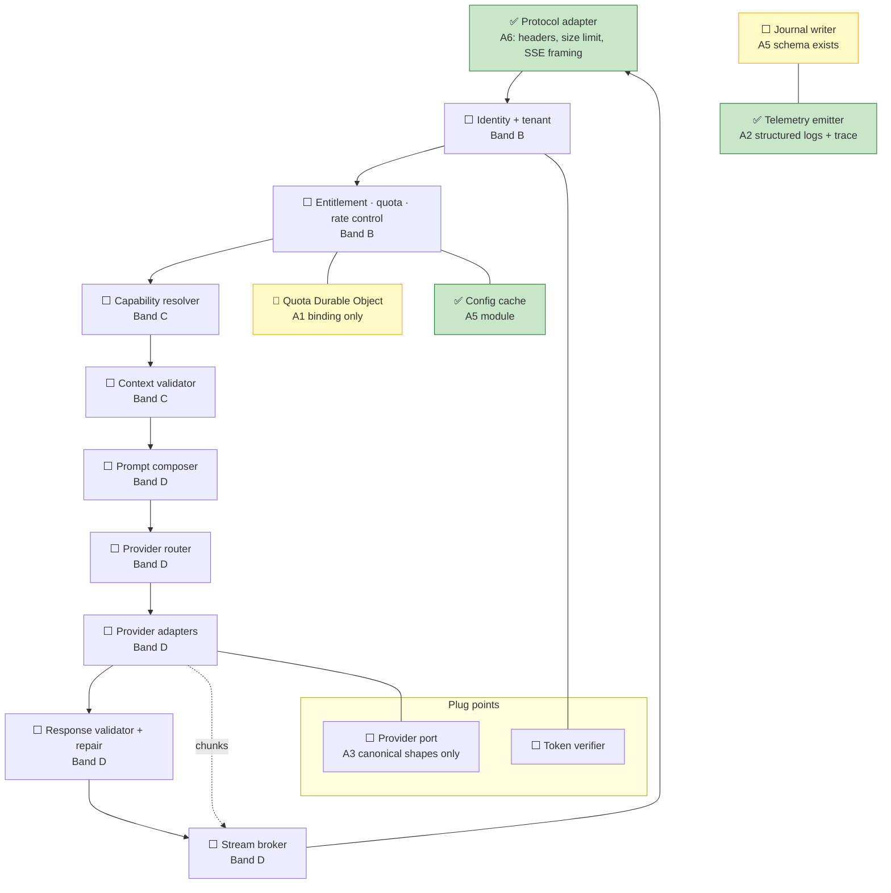
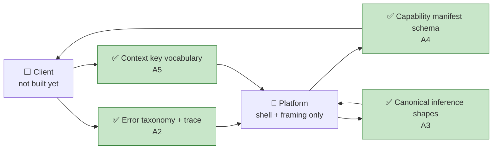

# AI Platform — Band A Implementation Reference

- Purpose: Explain, in plain language, what Band A of the AI platform delivery plan has actually built — for someone who does not know the project or its technologies yet.
- Read this when: onboarding to the AI platform, reviewing what Band A delivered, or preparing for Band B work.
- Canonical for: Band A completion status and where to find the code and tests.
- Usually paired with: [`17a-ai-platform-overview.md`](17a-ai-platform-overview.md) (architecture orientation), [`17b-ai-platform-delivery-plan.md`](17b-ai-platform-delivery-plan.md) (slice definitions), [`17-ai-platform.md`](17-ai-platform.md) (full architecture).
- Not covered here: Band B onward, Flutter client work, or Supabase clinic-side changes.

> **Status:** Band A (slices A1–A6) is **complete**. All 170 automated tests in `ai-platform/` pass. Nothing in Band A handles a real AI request end-to-end yet — it lays down the contracts and scaffolding that later bands build on.

---

## Table of Contents

1. [The One-Paragraph Summary](#1-the-one-paragraph-summary)
2. [Background for New Readers](#2-background-for-new-readers)
3. [What Band A Is and Why It Exists](#3-what-band-a-is-and-why-it-exists)
4. [Technologies in Plain Language](#4-technologies-in-plain-language)
5. [What Was Built — Slice by Slice](#5-what-was-built--slice-by-slice)
6. [Architecture Diagrams — What Is Finished](#6-architecture-diagrams--what-is-finished)
7. [Frozen Contracts at a Glance](#7-frozen-contracts-at-a-glance)
8. [How Testing Was Carried Out](#8-how-testing-was-carried-out)
9. [Repository Map](#9-repository-map)
10. [What Band A Does Not Do Yet](#10-what-band-a-does-not-do-yet)
11. [Checkpoint CP1](#11-checkpoint-cp1)
12. [Where to Read More](#12-where-to-read-more)

---

## 1. The One-Paragraph Summary

Band A built the **empty shell and the rulebook** for the AI platform. A Cloudflare Worker now exists in three isolated environments (development, staging, production), each with its own database, file storage, and stateful counter service. On top of that shell, six small features ("slices") froze typed contracts: how errors are reported, how AI requests are represented internally, how capabilities are described, how clinic data keys are named, what the database tables look like, and how the client will talk to the platform over HTTP with a streaming response. **No authentication, no quota checks, no prompt building, and no real AI calls happen yet.** Band A's job was to make those later steps impossible to get wrong by accident, because the types and tests already say what "correct" looks like.

---

## 2. Background for New Readers

### 2.1 What AiClinic is

AiClinic is clinic management software. The desktop app (`frontend/`) talks to a clinic database (`backend/` — Supabase/PostgreSQL). AI features are **optional**: the clinic works fine with AI turned off.

### 2.2 What the AI platform is

The AI platform (`ai-platform/`) is a **separate internet service** hosted on Cloudflare. It is the only part of the product that calls external AI providers (like DeepSeek or Gemini). The clinic app never holds provider API keys and never sees prompt text.

Think of it as a **smart middleman**:

- The clinic app says: *"Run capability X with this user message and this clinic data."*
- The platform composes a prompt, calls an AI provider, validates the answer, and streams the result back.
- The clinic app displays the draft; a human decides whether to keep it.

### 2.3 The three-way split

| Part | Knows about | Must never know about |
| --- | --- | --- |
| **Flutter client** | Clinic data, UI, how to show drafts | Prompts, models, providers |
| **AI platform** | Prompts, routing, validation, journaling | Clinic table names, SQL |
| **Supabase (clinic DB)** | Patients, visits, permissions | AI provider details |

Band A work lives entirely in **`ai-platform/`**. The Flutter app and Supabase were not changed for Band A.

---

## 3. What Band A Is and Why It Exists

The delivery plan groups work into **bands**. Band A is titled **"Foundations and frozen contracts"**.

The plan's own words apply: *"Nothing in this band handles a real request."*

Band A exists so that every later band is **constrained by code and tests**, not by prose in a specification. Once a contract is frozen, later slices may **extend** it but may **never rewrite** it. That discipline matters because implementation is expected to follow specs literally — frozen types are the guardrail.

Band A contains six slices, implemented as six Spec Kit features:

| Slice | Spec directory | What it delivered |
| --- | --- | --- |
| **A1** | `specs/015-ai-worker-skeleton/` | Worker deploy shell and three environments |
| **A2** | `specs/016-ai-diagnostic-envelope/` | Error codes, support reference, trace IDs |
| **A3** | `specs/017-ai-canonical-inference/` | Internal AI request/response shapes |
| **A4** | `specs/018-ai-capability-manifest/` | Capability description schema |
| **A5** | `specs/019-ai-context-keys-d1-config/` | Context keys, database schema, config cache |
| **A6** | `specs/020-ai-protocol-adapter-sse/` | HTTP ingress and SSE streaming framing |

Completing Band A also satisfies **review checkpoint CP1** in the delivery plan: *"Do the frozen contracts compose at build time?"*

---

## 4. Technologies in Plain Language

You do not need to be a Cloudflare expert to understand what Band A built. Here is what each piece means.

| Technology | What it is | How Band A uses it |
| --- | --- | --- |
| **Cloudflare Worker** | A small program that runs on Cloudflare's edge network, close to users | The AI gateway itself — one `worker.ts` entry point |
| **Wrangler** | Cloudflare's command-line tool to develop and deploy Workers | Configures three environments in `wrangler.toml` |
| **D1** | Cloudflare's SQLite database | Schema created by A5 migrations; not yet written to on the request path |
| **R2** | Cloudflare's object storage (like S3) | Binding exists (A1); payload storage comes in Band C |
| **Durable Object** | A single strongly-consistent stateful instance per key | Binding and empty class exist (A1); quota logic comes in Band B |
| **SSE (Server-Sent Events)** | A way to stream events from server to client over one HTTP connection | Framing implemented by A6 (`text/event-stream`) |
| **Vitest** | JavaScript test runner | All 170 Band A tests |
| **TypeScript** | Typed JavaScript | Contracts are enforced at compile time |

**Node.js 22+** is required to run tests locally (see the repo `.nvmrc`).

---

## 5. What Was Built — Slice by Slice

Each subsection states what the slice does in simple terms, what files implement it, and what is explicitly **not** included.

### 5.1 A1 — Worker skeleton and environments

**In simple terms:** Set up the empty building before installing plumbing.

**What was implemented:**

- The `ai-platform/` directory as a deployable Cloudflare Worker project.
- Three **isolated environments** in `wrangler.toml`: `development`, `staging`, `production`.
- Each environment has its **own** D1 database, R2 bucket, and Durable Object namespace — they cannot accidentally share data.
- A **`/health`** endpoint returning JSON with `build` (git SHA) and `environment` (wrangler environment name).
- **Startup validation**: if D1, R2, or the Durable Object binding is missing, the Worker throws immediately instead of failing on first use.

**Key files:**

- `ai-platform/wrangler.toml` — environment and binding definitions
- `ai-platform/src/worker.ts` — entry point, health route, binding checks
- `ai-platform/test/health.test.ts`, `ai-platform/test/env-deploys.test.ts`

**Not included:** Secrets, business logic, or any route beyond `/health` and (added later by A6) `/v1/requests`.

---

### 5.2 A2 — Diagnostic envelope

**In simple terms:** Agree on how failures are reported so users and support staff can understand them.

**What was implemented:**

- The full **error taxonomy** — 18 stable codes such as `unauthenticated`, `quota_exhausted`, `validation_failed`, each with a fixed HTTP status, retryability rule, and quota-consumption flag (`ai-platform/src/errors.ts`).
- The **error response body** shape: `{ code, request_reference, trace_id, retry_safe }`.
- A **request reference generator** — short human-readable IDs like `7QK4-2B9F` for support (`ai-platform/src/reference.ts`).
- **Trace ID handling** — accepts a client-supplied ULID or generates one; structured JSON logs always carry `trace_id` (`ai-platform/src/trace.ts`).
- **Safety rule**: any unrecognised error code is treated as `internal_error` — raw provider errors never leak out.

**Key files:**

- `ai-platform/src/errors.ts`
- `ai-platform/src/reference.ts`
- `ai-platform/src/trace.ts`
- `ai-platform/test/taxonomy.test.ts`, `error-body.test.ts`, `reference.test.ts`, `trace.test.ts`, `log-redaction.test.ts`

**Not included:** Emitting these errors from real pipeline stages (that comes in Bands B–D). A6 wires the taxonomy to HTTP for adapter-level failures.

---

### 5.3 A3 — Canonical inference representation

**In simple terms:** Define the platform's own internal language for talking to AI providers — not OpenAI's or Google's field names.

**What was implemented:**

- Typed shapes for four elements from the architecture (§5.3):
  - **Request** — messages, output format, sampling, token limits, etc.
  - **Stream chunk** — sequence number, kind, payload, terminal flag
  - **Result** — final content, usage, provider used, timing
  - **Error** — taxonomy code, retryability, provider details
- A closed set of **chunk kinds**: `text_delta`, `partial_structured`, `usage`, `provider_note`.
- **Encode/decode** functions for round-tripping these shapes.
- A **guard** that rejects provider-shaped field names (`messages`, `top_p`, etc.) — the platform must not accidentally adopt vendor vocabulary.

**Key files:**

- `ai-platform/src/contracts/canonical.ts`
- `ai-platform/test/canonical.test.ts`

**Not included:** Actual provider adapters, streaming from a real model, or prompt composition.

---

### 5.4 A4 — Capability manifest schema and loader

**In simple terms:** Define the "recipe card" that describes each AI feature the platform can run.

**What was implemented:**

- A schema with **ten field groups** (Identity, Access, Interaction, Input, Context requirements, Prompt binding, Output, Routing, Economics, Governance).
- A `load()` function that validates a manifest JSON document against all groups.
- **Defaults**: omitted `interactionMode` becomes `single_shot`.
- **Rejections**: conversational-only fields on a `single_shot` manifest are rejected; Routing must not name a `provider` or `model` directly.
- **Immutability check**: `verifyPublishedRegistry()` fails the build if an on-disk manifest hash does not match the published registry (prevents silent in-place edits).
- **Read-only interaction mode** after load (via Proxy).

**Key files:**

- `ai-platform/src/manifest/index.ts`
- `ai-platform/test/manifest.test.ts`

**Not included:** Loading manifests from disk at runtime, the capability resolver stage, or the discovery HTTP endpoint (Band C).

---

### 5.5 A5 — Context keys, D1 schema, and config cache

**In simple terms:** Name the clinic data the platform may ask for, create the platform's database tables, and add a fast in-memory cache for configuration.

**What was implemented:**

**Context key vocabulary (`ai-platform/src/context/index.ts`):**

- Keys follow `domain.concept@vN` — e.g. `visit.chief_complaint@v1`.
- Keys must name **meaning**, not storage (`visits_table@v1` is rejected).
- The **first published key shape** is `visit.chief_complaint@v1` with fields `visit_id`, `complaint`, `recorded_at`.
- `validateKey()` and `validatePayload()` enforce format and shape rules.

**D1 database schema (`ai-platform/migrations/20260731120000_platform_schema.sql`):**

- All §7.3 entities: `installation`, `installation_key`, `entitlement`, `capability_grant`, `routing_policy`, `ai_request`, `ai_attempt`, `usage_event`, `usage_rollup`, `platform_counter`, `control_audit`.
- Unique index on `ai_request.request_reference`.
- Nullable `conversation_id` and `turn_ordinal` on `ai_request` (for future chat features).
- Pinned by `ai-platform/schema.snap.sql` and migration tests.

**Config cache (`ai-platform/src/config-cache/index.ts`):**

- In-memory map with a 30-second TTL per entity kind.
- Entity kinds: `installations`, `keys`, `entitlements`, `grants`, `kill_switches`, `active_routing_policy`.
- **Cold isolate**: first lookup performs exactly one D1 read.
- **Warm isolate**: subsequent lookups perform zero I/O until TTL expires.
- D1 miss throws `ConfigCacheMissError` — never returns an empty fake entry.

**Key files:**

- `ai-platform/src/context/index.ts`
- `ai-platform/src/config-cache/index.ts`
- `ai-platform/migrations/20260731120000_platform_schema.sql`
- `ai-platform/schema.snap.sql`
- `ai-platform/test/context.test.ts`, `config-cache.test.ts`, `migrations.test.ts`

**Not included:** Writing rows on the request path, enrollment, or reading real installation data from a deployed D1.

---

### 5.6 A6 — Protocol adapter and SSE framing

**In simple terms:** Define how the clinic app sends a request and how it receives a streaming answer — even before any real AI work happens.

**What was implemented:**

- **`POST /v1/requests`** — the submit-request endpoint (wired in `worker.ts`).
- **Ingress checks** before any other work:
  - Body size limit (1 MiB) → `request_too_large`
  - Required headers: `x-idempotency-key`, `x-capability-version`, `x-trace-id` (optional but validated if present)
  - Malformed headers or body → HTTP 422
- **SSE response stream** (`text/event-stream`):
  1. Opens with `accepted` event carrying `request_reference` and `trace_id`
  2. May emit heartbeats and content events (via injectable stub in tests)
  3. Ends with **exactly one** terminal event: `completed`, `failed`, or `cancelled`
- **Cancellation**: closing the stream or aborting the request emits `cancelled` — no separate cancel endpoint.
- **One-terminal-event invariant**: duplicate terminal events are suppressed; abort mid-stream still yields exactly one terminal.

**Key files:**

- `ai-platform/src/adapter.ts`
- `ai-platform/test/adapter.test.ts`

**Not included:** Parsing the request body for capability or context, identity verification, journal writes, or real provider streaming. A stub event source drives stream tests.

---

## 6. Architecture Diagrams — What Is Finished

Legend used in all diagrams below:

| Symbol | Meaning |
| --- | --- |
| ✅ | Implemented and tested in Band A |
| ⬜ | Designed in architecture, not built yet |
| 🔶 | Partially present (scaffolding or contract only) |

### 6.1 System landscape



**What Band A actually turned on:** the Worker process, its three isolated environments, the `/health` endpoint, the `POST /v1/requests` SSE framing, the D1 table definitions, and the in-memory config cache module. Everything else in this picture is still ahead.

### 6.2 Gateway pipeline — component status

This is the ordered pipeline every real request will eventually pass through. Band A touches only the first box and the cross-cutting contracts that later boxes will consume.



**How to read this:** green boxes are done. Yellow boxes have scaffolding (bindings, schema, or empty classes) but no behaviour on the request path. Grey boxes are entirely future work.

### 6.3 The three contracts — what is frozen



The **Token Contract** (clinic-issued AI Access Token) is not built until Band B.

### 6.4 Platform stores — what exists today

| Store | Band A status | What exists now |
| --- | --- | --- |
| **D1** | 🔶 Schema only | Tables and indexes created by migration; no request-path writes |
| **R2** | 🔶 Binding only | Bucket binding per environment; no `PutObject` calls yet |
| **Durable Object** | 🔶 Empty class | `GatewayObject` class registered; no quota logic |
| **Config cache** | ✅ Module complete | In-isolate TTL cache with D1 reader port; not yet wired to live pipeline |
| **Secrets** | ⬜ Not configured | Deferred until first provider adapter (Band D) |

---

## 7. Frozen Contracts at a Glance

These are the "rulebooks" later bands must follow. They are enforced by TypeScript types and automated tests.

### 7.1 Error taxonomy (A2)

18 codes, each with HTTP status, retryability, and quota flag. Example:

| Code | HTTP | Retryable? | Meaning (plain English) |
| --- | --- | --- | --- |
| `unauthenticated` | 401 | After re-mint | Token is missing or invalid |
| `quota_exhausted` | 429 | Not until reset | Installation used its budget |
| `request_too_large` | 413 | No | Request body or context too big |
| `validation_failed` | 422 | User choice | AI output failed checks |
| `internal_error` | 500 | Yes | Catch-all for unknown failures |

Full table: `ai-platform/src/errors.ts`.

### 7.2 Request reference format (A2)

- Pattern: `XXXX-XXXX` (eight Crockford base32 characters)
- Example: `7QK4-2B9F`
- Purpose: a support handle the user can read aloud — not the internal database primary key

### 7.3 Canonical inference shapes (A3)

Internal representation between the platform and providers. Chunk kinds are closed:

`text_delta` · `partial_structured` · `usage` · `provider_note`

Provider field names like `messages` or `top_p` are **forbidden** in canonical types.

### 7.4 Capability manifest groups (A4)

Ten groups every capability manifest must include. Default interaction mode: `single_shot`. Routing group must not name a provider or model.

### 7.5 Context key format (A5)

- Pattern: `domain.concept@vN` (e.g. `visit.chief_complaint@v1`)
- First published shape: `visit_id` (UUID), `complaint` (string, max 10 000 chars), `recorded_at` (optional ISO 8601)

### 7.6 SSE event protocol (A6)

Every stream:

1. Starts with `accepted` + `request_reference`
2. May include heartbeats and content events
3. Ends with exactly one of: `completed` | `failed` | `cancelled`
4. Closing the connection = `cancelled`

Required request headers: `x-idempotency-key`, `x-capability-version`. Optional: `x-trace-id` (ULID).

---

## 8. How Testing Was Carried Out

### 8.1 The completion rule

The delivery plan states: **a slice is done when a test a human can read and believe passes.** Band A has no demoable user-facing behaviour — tests are the evidence.

### 8.2 Test runner and environment

- **Runner:** Vitest with `@cloudflare/vitest-pool-workers`
- **Command:** `cd ai-platform && npm test`
- **Result (as of Band A completion):** 13 test files, **170 tests**, all passing (~2 minutes on a typical machine)
- **Node:** 22+ required

Some tests spin up a local Worker via Miniflare (the Wrangler dev runtime) to exercise HTTP routes and SSE streams against a real Worker isolate.

### 8.3 Test layers by slice

| Slice | Test layer | What is being proved |
| --- | --- | --- |
| **A1** | Infra / config | Three environments deploy; `/health` returns build + environment; no shared bindings; missing binding fails at startup |
| **A2** | Unit + contract | One case per error code (HTTP, retry, quota); reference format valid and unique; trace ID on every log line; unknown code → `internal_error`; logs never contain prompts or credentials |
| **A3** | Contract | Round-trip encode/decode; provider-shaped names rejected; chunk kinds exhaustive; exactly one terminal flag per sequence |
| **A4** | Contract + build | Valid manifest loads; one failure per omitted group; in-place edit fails registry check; `interaction_mode` defaults; conversational fields rejected on `single_shot` |
| **A5** | Contract + migration + spy | Key format and shape validation; migrations apply cleanly; schema snapshot matches; one presence case per D1 entity; cache cold = 1 D1 read, warm = 0 reads; D1 miss is typed error |
| **A6** | Integration | Oversized body rejected; header parse cases; stream opens with `accepted`; heartbeat while idle; one terminal per outcome; abort yields `cancelled`; no duplicate terminal |

### 8.4 Test file map

| Test file | Primary slice | Test count (approx.) |
| --- | --- | --- |
| `test/env-deploys.test.ts` | A1 | 6 |
| `test/health.test.ts` | A1 | 2 |
| `test/taxonomy.test.ts` | A2 | 25 |
| `test/error-body.test.ts` | A2 | 17 |
| `test/reference.test.ts` | A2 | 4 |
| `test/trace.test.ts` | A2 | 2 |
| `test/log-redaction.test.ts` | A2 | 2 |
| `test/canonical.test.ts` | A3 | 16 |
| `test/manifest.test.ts` | A4 | 31 |
| `test/context.test.ts` | A5 | 17 |
| `test/migrations.test.ts` | A5 | 12 |
| `test/config-cache.test.ts` | A5 | 13 |
| `test/adapter.test.ts` | A6 | 28 |

### 8.5 Spy-based tests

Several invariants are about work **not** being done (for example, "warm cache performs zero D1 reads"). These use **spy** patterns: tests inject a fake D1 reader and count how many times it was called. This matches the delivery plan's coverage rule — behavioural proof, not line-coverage percentages.

### 8.6 What tests deliberately do not cover yet

- End-to-end flow from Flutter button to AI response (checkpoint **CP3**, after Bands B–E)
- Real provider calls
- Authentication or quota enforcement
- Writing journal rows during a request

---

## 9. Repository Map

```
ai-platform/
├── src/
│   ├── worker.ts              # A1 entry point; A6 routes /v1/requests
│   ├── adapter.ts             # A6 protocol adapter + SSE
│   ├── errors.ts              # A2 error taxonomy
│   ├── reference.ts           # A2 request reference generator
│   ├── trace.ts               # A2 trace ID + structured logger
│   ├── contracts/
│   │   └── canonical.ts       # A3 canonical inference types
│   ├── manifest/
│   │   └── index.ts           # A4 capability manifest loader
│   ├── context/
│   │   └── index.ts           # A5 context key vocabulary
│   └── config-cache/
│       └── index.ts           # A5 in-isolate config cache
├── migrations/
│   └── 20260731120000_platform_schema.sql   # A5 D1 schema
├── schema.snap.sql            # A5 schema snapshot for tests
├── test/                      # All slice test suites
├── wrangler.toml              # A1 three-environment config
└── package.json

specs/
├── 015-ai-worker-skeleton/         # A1 spec, plan, quickstart
├── 016-ai-diagnostic-envelope/     # A2
├── 017-ai-canonical-inference/     # A3
├── 018-ai-capability-manifest/     # A4
├── 019-ai-context-keys-d1-config/  # A5
└── 020-ai-protocol-adapter-sse/    # A6
```

Each `specs/NNN-*/quickstart.md` has manual verification steps for that slice.

---

## 10. What Band A Does Not Do Yet

This section is as important as what was built. Band A is **contracts and scaffolding**, not a working AI product.

| Capability | Status after Band A |
| --- | --- |
| Log in / verify clinic identity | Not built (Band B) |
| Check quotas or rate limits | Not built (Band B) |
| Resolve which capability to run | Not built (Band C) |
| Validate context payload on a request | Not built (Band C) |
| Write request journal rows | Not built (Band C) |
| Compose prompts | Not built (Band D) |
| Call any AI provider | Not built (Band D) |
| Validate AI output | Not built (Band D) |
| Flutter client SDK | Not built (Band E) |
| Any visible AI button in the app | Not built (Band E) |

Calling `POST /v1/requests` today opens an SSE stream with an `accepted` event and then waits for a stub or future pipeline to emit content and a terminal event. **No inference happens.**

---

## 11. Checkpoint CP1

The delivery plan defines **CP1 — after A6**:

> Do the frozen contracts compose at build time? Manifest, context key shapes, canonical representation, and error taxonomy are mutually consistent, and the contract tests pass.

Band A satisfies CP1:

- A4 manifest **Context requirements** reference keys that A5's vocabulary recognises.
- A3 canonical error types bind to A2's taxonomy codes.
- A6 error responses use A2's body shape and HTTP mapping.
- A5 `ai_request.request_reference` column stores A2's `XXXX-XXXX` format.
- All 170 tests pass together in one CI suite.

The next checkpoint, **CP2 (after B4)**, asks whether a request can be authenticated, admitted, and correctly rejected with no inference.

---

## 12. Where to Read More

| Document | Use when |
| --- | --- |
| [`17a-ai-platform-overview.md`](17a-ai-platform-overview.md) | You want the full architecture story in readable form |
| [`17b-ai-platform-delivery-plan.md`](17b-ai-platform-delivery-plan.md) | You need slice definitions, test requirements, or Band B+ ordering |
| [`17-ai-platform.md`](17-ai-platform.md) | You need the authoritative specification |
| `specs/015` through `specs/020` | You need acceptance criteria for a specific slice |
| `ai-platform/README.md` | You need to run tests or deploy the Worker |
| [`AGENTS.md`](../../AGENTS.md) | You are an AI agent orienting to the repo |

**Run the test suite:**

```bash
cd ai-platform
npm install   # first time only
npm test
```

**Run the Worker locally:**

```bash
cd ai-platform
npm run dev   # development environment on localhost
curl http://localhost:8787/health
```

---

*This document describes Band A as implemented. When Band B lands, add a sibling reference or extend this document's diagrams — do not rewrite frozen contract sections without an architecture amendment.*
