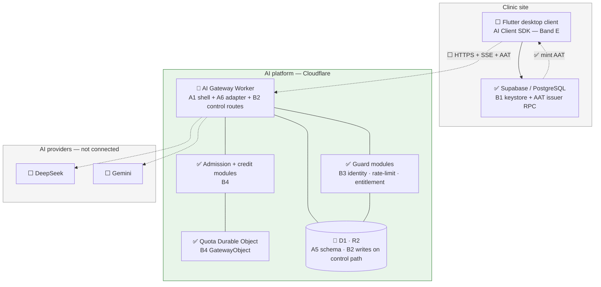
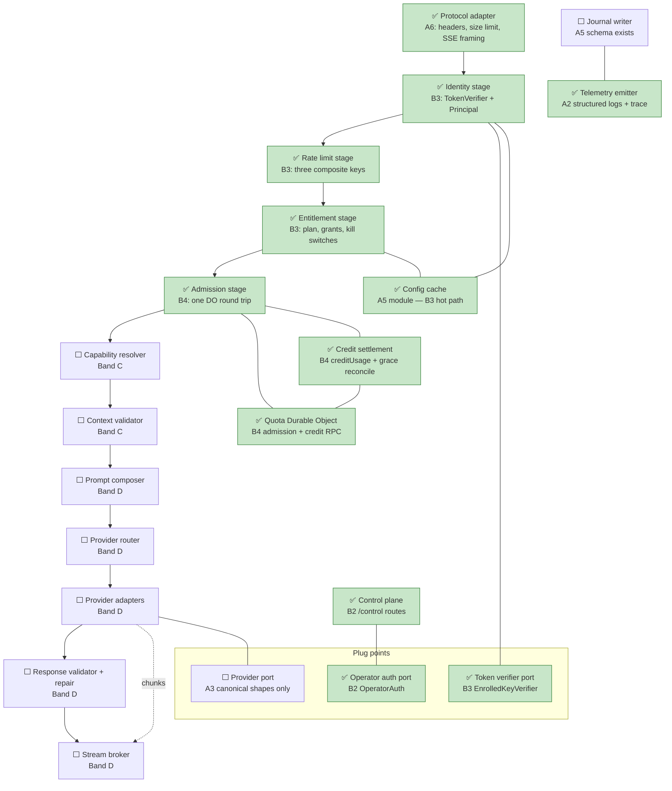
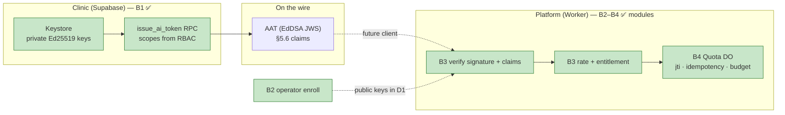

# AI Platform — Band B Implementation Reference

- Purpose: Explain, in plain language, what Band B of the AI platform delivery plan has actually built — for someone who does not know the project or its technologies yet, especially readers who already used [`17c-band-a-implementation-reference.md`](17c-band-a-implementation-reference.md).
- Read this when: onboarding after Band A, reviewing what trust/admission work delivered, or preparing for Band C.
- Canonical for: Band B completion status, where to find the code and tests, and which architecture boxes are now green.
- Usually paired with: [`17c-band-a-implementation-reference.md`](17c-band-a-implementation-reference.md) (Band A baseline), [`17b-ai-platform-delivery-plan.md`](17b-ai-platform-delivery-plan.md) (slice definitions), [`17-ai-platform.md`](17-ai-platform.md) (full architecture).
- Not covered here: capability resolution, journaling on the request path, prompt building, provider calls, or Flutter client work (Bands C–E).

> **Status:** Band B (slices **B1–B4**) is **complete** on branch `ai/master` (tip `0b0f7070`, 2026-08-01). Automated evidence: **59 Band B tests** — **12** named SQL cases (B1) plus **47** Vitest workers-pool tests (B2–B4) — plus **170** Band A Worker tests (`npm test`). Guard and admission **modules exist and are tested in isolation**; they are **not yet wired into** `POST /v1/requests`. **No real AI inference happens yet.**

---

## Table of Contents

1. [The One-Paragraph Summary](#1-the-one-paragraph-summary)
2. [Background for New Readers](#2-background-for-new-readers)
3. [What Band B Is and Why It Exists](#3-what-band-b-is-and-why-it-exists)
4. [Technologies in Plain Language](#4-technologies-in-plain-language)
5. [What Was Built — Slice by Slice](#5-what-was-built--slice-by-slice)
6. [Architecture Diagrams — What Is Finished](#6-architecture-diagrams--what-is-finished)
7. [Frozen Contracts at a Glance](#7-frozen-contracts-at-a-glance)
8. [How Testing Was Carried Out](#8-how-testing-was-carried-out)
9. [Repository Map](#9-repository-map)
10. [What Band B Does Not Do Yet](#10-what-band-b-does-not-do-yet)
11. [Checkpoint CP2](#11-checkpoint-cp2)
12. [Where to Read More](#12-where-to-read-more)

---

## 1. The One-Paragraph Summary

Band B answers the question: **"Who is allowed to ask the AI platform for anything, and under what limits?"** On the **clinic side** (Supabase), it created a locked-down keystore and an RPC that mints short-lived **AI Access Tokens (AATs)** signed with Ed25519. On the **platform side** (Cloudflare Worker), it added operator routes to enroll installations, three **guard stages** that verify tokens and entitlements without touching AI providers, and a **Quota Durable Object** that decides admission (fresh token id, idempotency, budget, concurrency) in a single round trip. Everything is covered by automated tests — SQL scripts for the clinic database, Vitest for the Worker — but the public `POST /v1/requests` path still behaves like Band A (SSE framing only) until later bands connect the guard pipeline.

---

## 2. Background for New Readers

### 2.1 Start with Band A

If Band A is new to you, read [`17c-band-a-implementation-reference.md`](17c-band-a-implementation-reference.md) first. Band A delivered the empty Worker shell, frozen error/capability/context contracts, the D1 schema **definitions**, and the SSE adapter framing. Band B **uses** those foundations (especially the A5 config cache and D1 tables) but does not change the frozen Band A contracts.

### 2.2 The trust problem Band B solves

Before Band B, the platform had no way to know:

- Which clinic installation is calling
- Whether that installation is still allowed to use AI
- Whether the same request is being replayed or double-submitted
- Whether the installation has quota left

Band B builds the **machinery** to answer those questions. Band C will connect much of it to the live request path and start journaling.

### 2.3 Enrollment and daily use (plain language)

1. **One-time enrollment (operator):** Generate an Ed25519 keypair in clinic Postgres (B1) → operator calls `POST /control/.../enroll` on the platform with the **public** key (B2) → platform creates D1 rows; clinic stores the platform URL.
2. **Daily staff use (future client):** Staff logs into the clinic app → Supabase `issue_ai_token` mints an AAT (B1) → client sends `POST /v1/requests` with the AAT and idempotency header → guard stages verify and admit (B3–B4 modules; **not wired to HTTP yet**).

Trust is **one-directional**: the platform verifies clinic-issued tokens; it has no path into the clinic database.

### 2.4 Where the code lives

Band B is split across two repository areas — by design:

| Area | Slices | Role |
| --- | --- | --- |
| **`backend/`** (Supabase/PostgreSQL) | B1 | Store private signing keys; mint AATs for logged-in clinic users |
| **`ai-platform/`** (Cloudflare Worker) | B2, B3, B4 | Enroll installations; verify tokens; rate-limit; check entitlements; admit requests via Durable Object |

The clinic app will talk to **both**: Supabase to get a token, the AI platform to spend it.

### 2.5 How Band B landed in git

Work was integrated linearly on **`ai/master`** (not `origin/master` at the time of writing). Four feature branches map one-to-one to slices:

| Slice | Branch | Final commit (on `ai/master` line) | Date |
| --- | --- | --- | --- |
| **B1** | `ai/021-b1-installation-keystore-aat-issuer` | `d10eac76` | 2026-07-31 |
| **B2** | `ai/022-b2-control-plane-enrollment` | `7e79fca6` | 2026-07-31 |
| **B3** | `ai/023-b3-guard-stages` | `bce94e9c` | 2026-07-31 |
| **B4** | `ai/024-b4-quota-do-admission` | `0b0f7070` | 2026-08-01 |

Spec Kit directories: `specs/021` … `specs/024`.

---

## 3. What Band B Is and Why It Exists

The delivery plan titles Band B **"Trust, identity, and admission"**.

| ID | Slice | Spec directory | One-line purpose |
| --- | --- | --- | --- |
| **B1** | Installation keystore and AAT issuer | `specs/021-installation-keystore-aat-issuer/` | Clinic-side keys and token minting |
| **B2** | Control-plane enrollment and installation lifecycle | `specs/022-control-plane-enrollment/` | Operator enrolls/suspends/resumes/rotates/deletes installations in platform D1 |
| **B3** | Guard stages: identity, rate limiting, entitlement and kill switches | `specs/023-guard-stages/` | Verify AAT; enforce limits and kill switches from config cache |
| **B4** | Quota Durable Object and admission stage | `specs/024-quota-do-admission/` | Per-installation quota, replay protection, idempotency, concurrency |

**Dependency chain:** B1 is independent. B2 needs A5 (D1 schema). B3 needs A5, B1 (token shape), B2 (enrolled keys in D1). B4 needs A5, B3.

---

## 4. Technologies in Plain Language

Band A already introduced the Worker, D1, R2, and Durable Objects. Band B adds these ideas:

| Term | What it means | How Band B uses it |
| --- | --- | --- |
| **AAT** (AI Access Token) | A short-lived signed JWT-like token the clinic gets from Supabase | B1 mints it; B3 verifies signature, audience, expiry, and claims |
| **Ed25519 / EdDSA** | A modern public-key signature algorithm | B1 signs with `pgsodium`; B3 verifies with Web Crypto `Ed25519`, algorithm pinned to `EdDSA` |
| **JWS** | JSON Web Signature — `header.payload.signature` | AAT on the wire; `none` and HMAC algorithms are rejected |
| **Installation** | A registered clinic deployment on the AI platform | B2 creates the row; B3/B4 scope all checks to `installation_id` |
| **Control plane** | Internal operator HTTP API on the Worker | B2 — not for clinic users |
| **Guard stages** | Ordered checks before any AI work | B3 — identity, rate limit, entitlement (stages 2–4 in architecture §6.1) |
| **Config cache** | In-memory cache of D1 config (from A5) | B3 reads installations, keys, entitlements, grants, kill switches — warm isolate = zero D1 reads |
| **Durable Object (DO)** | One strongly-consistent stateful instance per key | B4 — one `GatewayObject` per installation for quota/admission |
| **`jti`** | JWT ID — unique token identifier | B4 rejects replay of the same `jti` within the ephemeral window |
| **Idempotency key** | Client header `x-idempotency-key` | B4 returns prior request state on repeat instead of starting duplicate work |
| **RLS** | Row Level Security in PostgreSQL | B1 proves `anon` and `authenticated` cannot read private keys |
| **`pgsodium`** | Postgres extension for crypto | B1 uses `crypto_sign_detached` for signing |

---

## 5. What Was Built — Slice by Slice

### 5.1 B1 — Installation keystore and AAT issuer (clinic / Supabase)

**In simple terms:** Each clinic installation gets a signing keypair. Private keys live in a schema no normal user can read. When a logged-in staff member needs AI, Supabase mints a 15-minute token whose claims describe org, branch, role, and derived capability scopes.

**What was implemented:**

- **Restricted schema** `ai_internal` with `installation_keys` (public + **secret** key material) and `aat_issuance` ledger.
- **RLS deny-all** policies — only `SECURITY DEFINER` functions reach the keys.
- **Config keys** in `ai_internal.app_settings` (token lifetime, audience `ai-platform`, version `1`, issuer rate-limit ceiling).
- **Keypair routines** in `auth_internal` (generate, rotate additively — old key still verifies in-flight tokens).
- **Issuer RPC** `public.issue_ai_token()` — validates session, derives `scopes` from RBAC (caller cannot supply them), signs EdDSA JWS, writes issuance row, enforces issuer rate limit.
- **Verifier self-test helper** for local validation.

**Key files:**

| Path | Role |
| --- | --- |
| `backend/supabase/migrations/20260801120000_ai_keystore_schema.sql` | Schema, RLS, settings |
| `backend/supabase/migrations/20260801120100_ai_installation_keypair_routines.sql` | Generate/rotate keypairs |
| `backend/supabase/migrations/20260801120200_ai_token_issuer_rpc.sql` | Issuer + helpers |
| `backend/tests/ai_keystore_rls.sql` | RLS and rotation tests |
| `backend/tests/ai_token_issuer.sql` | Claim population, scopes, rate limit, `exp` window |
| `backend/tests/run_ai_platform_trust_tests.sh` | Runner for both SQL suites |
| `specs/021-installation-keystore-aat-issuer/contracts/` | Frozen token and keystore contracts |

**Clinic-side RPCs (no Worker routes):** `public.issue_ai_token`, `public.enroll_installation_keypair`, `public.rotate_installation_key`, `public.revoke_installation_key`.

**Not included:** Flutter calling the issuer; platform-side verification (that is B3). Clinic keystore (Supabase `ai_internal.installation_keys`) and platform registry (D1 `installation` + `installation_key`) are **separate stores** — no automated sync in code.

---

### 5.2 B2 — Control-plane enrollment and installation lifecycle (Worker)

**In simple terms:** An operator (not a clinic user) registers a new installation on the platform, uploads its public key, and can suspend, resume, rotate keys, or delete later. Every action leaves an audit row.

**What was implemented:**

- **Five POST routes** under `/control/installations/{id}/…` wired in `worker.ts`.
- Handlers in `src/control/index.ts`: `handleEnroll`, `handleRotate`, `handleSuspend`, `handleResume`, `handleDelete`.
- **`OperatorAuth` port** — default resolves `Authorization: Bearer <token>` to `operatorId` (real auth scheme intentionally minimal).
- **D1 writes:** `installation`, `installation_key`, `entitlement` (initial `pending` status), `control_audit` on enroll; lifecycle mutations update status or add keys with audit.
- **Duplicate enroll** → HTTP 409 `already_enrolled`.

**Key files:**

| Path | Role |
| --- | --- |
| `ai-platform/src/control/index.ts` | All lifecycle handlers |
| `ai-platform/src/worker.ts` | Routes `/control/...` to `dispatchControlRequest` |
| `ai-platform/test/control.test.ts` | Integration tests against real Miniflare D1 |
| `specs/022-control-plane-enrollment/contracts/control-plane.md` | Frozen HTTP contract |

**Not included:** Clinic-visible enrollment UI; syncing keys from Supabase keystore automatically (operator supplies `public_key` in enroll body).

---

### 5.3 B3 — Guard stages: identity, rate limiting, entitlement (Worker modules)

**In simple terms:** Three separate modules that **will** sit early in the request pipeline. They answer: Is the token real? Is this caller over rate limits? Is AI enabled for this installation/plan/capability, and are kill switches off?

**What was implemented:**

**Identity (`src/identity/index.ts`):**

- **`TokenVerifier` port** and **`EnrolledKeyVerifier`** implementation.
- Parses JWS; rejects wrong algorithm, bad signature, wrong audience, clock skew violations, unknown/revoked keys, unknown installation.
- Builds immutable frozen **`Principal`** (installation, org, branch, actor, role, scopes, `jti`, `iat`, `exp`, `ver`).
- Rejects **suspended** installations with `installation_suspended`.
- Loads installation and key rows via A5 **config cache** (no direct D1 in hot path when warm).

**Rate limiting (`src/rate-limit/index.ts`):**

- Three **composite keys**: per-installation, per-installation+actor, per-installation+capability.
- Uses injectable Cloudflare **`RateLimit` bindings** (not yet declared in `wrangler.toml` for deploy — tests inject fakes).
- Rejections tally to in-memory map, flushed to bucketed **`platform_counter`** rows (never one row per event).
- Returns `rate_limited` with `retryAfter`.

**Entitlement (`src/entitlement/index.ts`):**

- Checks AI enabled, plan tier vs minimum, capability grant, and four kill-switch scopes (global, capability, installation, provider).
- All reads through config cache — **warm isolate performs zero D1 reads** (spy-tested).
- Emits `forbidden_capability` or `capability_disabled` with a rejection path label.

**Key files:**

| Path | Role |
| --- | --- |
| `ai-platform/src/identity/index.ts` | Token verification |
| `ai-platform/src/rate-limit/index.ts` | Composite rate limits |
| `ai-platform/src/entitlement/index.ts` | Entitlement + kill switches |
| `ai-platform/test/identity.test.ts` | Valid token + 8 rejection cases + verifier swap + principal immutability |
| `ai-platform/test/rate-limit.test.ts` | Three keys, counter flush, no `ai_request` on rejection |
| `ai-platform/test/entitlement.test.ts` | AI disabled, plan tier, grants, four kill switches, warm-cache spy |
| `specs/023-guard-stages/contracts/token-verifier.md` | Frozen verifier port |
| `specs/023-guard-stages/contracts/request-principal.md` | Frozen principal shape |

**Explicitly out of scope for B3:** `jti` replay rejection — that belongs to B4 admission / Quota DO.

**Not included:** Calling these stages from `adapter.ts` on every `POST /v1/requests` (modules are library-ready, not pipeline-wired).

---

### 5.4 B4 — Quota Durable Object and admission stage (Worker)

**In simple terms:** Each installation gets its own Durable Object instance that remembers quota usage, in-flight requests, which token IDs were already seen, and which idempotency keys map to which request. Admission asks **one question in one RPC**; credit settles usage afterward.

**What was implemented:**

**Quota DO core (`src/quota-do/index.ts` + `GatewayObject` in `worker.ts`):**

- RPC kinds: `admission` and `credit` over `POST` to the DO stub.
- **Admission** checks in order: `jti` replay → idempotency repeat → budget exhaustion → concurrency ceiling (limit **16**) → admit.
- **Ephemeral sets** for `jti` and idempotency with **2-hour** horizon (`EPHEMERAL_HORIZON_MS`); swept on each call.
- **Period counters** reset when entitlement period bounds change.
- **Credit** decrements in-flight, increments requests/tokens/cost; idempotent per `requestId`.

**Admission stage (`src/admission/index.ts`):**

- `runAdmission()` — exactly **one** DO `fetch` per call (spy-tested).
- Maps DO outcomes to `unauthenticated`, `quota_exhausted`, `concurrency_exhausted`, idempotent replay, or admitted.
- **Fail-open grace:** if DO unavailable, up to **5** grace admissions per installation, queued for reconciliation (`drainPendingGraceAdmissions`).
- Rejections increment bucketed `platform_counter` via `flushRejectionCounters` — **no `ai_request` row** on guard rejection.

**Credit stage (`src/credit/index.ts`):**

- `creditUsage()` — RPC to DO credit handler.
- `reconcileGraceUsage()` — drains grace queue after DO recovery.

**Key files:**

| Path | Role |
| --- | --- |
| `ai-platform/src/quota-do/index.ts` | DO state machine |
| `ai-platform/src/admission/index.ts` | Stage-8 admission caller |
| `ai-platform/src/credit/index.ts` | Post-response credit + grace reconciliation |
| `ai-platform/src/worker.ts` | `GatewayObject` class routes admission/credit RPC |
| `ai-platform/test/quota-do.test.ts` | DO unit + concurrency tests |
| `ai-platform/test/admission-credit.test.ts` | Stage spies, grace, idempotency, rejection counting |
| `specs/024-quota-do-admission/contracts/quota-do-rpc.md` | Frozen admission/credit wire shapes |

**Not included:** Wiring admission into the SSE adapter so a real HTTP request stops at the guard; journal writes on admit/reject (Band C).

---

## 6. Architecture Diagrams — What Is Finished

Legend (same as Band A reference):

| Symbol | Meaning |
| --- | --- |
| ✅ | Implemented and tested in Band B (or Band A if unchanged) |
| 🔶 | Partially present — module or binding exists, not on live request path |
| ⬜ | Designed, not built yet |

### 6.1 System landscape



**What changed since Band A:** Supabase can mint tokens (B1). The Worker can enroll installations (B2) and contains tested guard and admission **libraries** (B3–B4). The clinic app still does not call AI end-to-end.

### 6.2 Gateway pipeline — component status

This is the ordered pipeline from architecture §6.1. Band B completes stages **2–4** and **8** as **tested modules**; the HTTP adapter (stage 1) does not invoke them yet.



**How to read this:** Green boxes are implemented. The adapter box is green but **only runs stage 1 today** — stages 2–4 and 8 are green as **callable code**, not as automatic steps on `POST /v1/requests`. Yellow would mean scaffolding only; there is no yellow in the guard/admission row anymore.

### 6.3 Trust boundary — what Band B added



### 6.4 Platform stores — status after Band B

| Store | Status | What exists now |
| --- | --- | --- |
| **Supabase `ai_internal`** | ✅ B1 | Keys, issuance ledger, issuer RPC, RLS proofs |
| **D1 `installation` etc.** | ✅ B2 writes | Control plane populates rows; guard reads via cache |
| **D1 `platform_counter`** | ✅ B3/B4 | Bucketed rejection counters flushed from guard/admission |
| **Config cache** | ✅ A5+B3 | Used by identity and entitlement in tests and future pipeline |
| **Durable Object** | ✅ B4 | Full quota/admission/credit state machine — not only empty class |
| **Rate limit bindings** | 🔶 | Code expects `RATE_LIMITER_*` bindings; not in `wrangler.toml` yet |
| **R2** | 🔶 A1 | Binding only — no request-path payload storage |
| **Journal (`ai_request`)** | ⬜ Band C | Schema exists; guard rejections correctly **do not** write rows |

---

## 7. Frozen Contracts at a Glance

Band B froze new contracts. Later slices may **extend** but not **rewrite** them (delivery plan §2.3).

### 7.1 AAT claim set (B1 — §5.6)

| Claim | Meaning |
| --- | --- |
| `iss` | Installation id (issuer) |
| `aud` | Audience — `ai-platform` |
| `sub` | Actor (staff user) id |
| `org` | Organisation id |
| `branch` | Branch id |
| `role` | Staff role |
| `scopes` | Derived AI capability scopes — **never client-supplied** |
| `jti` | Unique token id — replay-checked in B4 |
| `iat` / `exp` | Issued-at and expiry (≈15 minutes) |
| `ver` | Token contract version (`1`) |

Deliberately **omitted:** patient ids, quota state, provider/model hints.

### 7.2 Control-plane HTTP (B2)

| Route | Action |
| --- | --- |
| `POST /control/installations/{id}/enroll` | Create installation + key + entitlement + audit |
| `POST /control/installations/{id}/rotate` | Add new `installation_key` row + audit |
| `POST /control/installations/{id}/suspend` | Set status suspended + audit |
| `POST /control/installations/{id}/resume` | Restore active + audit |
| `POST /control/installations/{id}/delete` | Set status deleted + audit |

Full request/response tables: `specs/022-control-plane-enrollment/contracts/control-plane.md`.

### 7.3 Token verifier port (B3)

- Interface: `TokenVerifier.verify(token, ctx) → VerifyResult`
- Default implementation: `EnrolledKeyVerifier`
- Frozen principal fields: see `specs/023-guard-stages/contracts/request-principal.md`

### 7.4 Quota DO RPC (B4)

- **Admission request** carries `jti`, `installationId`, `idempotencyKey`, `entitlement` snapshot, `requestReference`.
- **Outcomes:** `admitted`, `replay`, `idempotent`, `quota_exhausted`, `concurrency_exhausted`.
- **Credit request** carries `requestId`, usage `{ tokens, cost }`, `partial` flag.

Full wire shapes: `specs/024-quota-do-admission/contracts/quota-do-rpc.md`.

---

## 8. How Testing Was Carried Out

### 8.1 The completion rule

Same as Band A: **a slice is done when a test a human can read and believe passes.** Band B has almost no user-visible UI — SQL and Vitest suites are the evidence.

### 8.2 Two Vitest configurations (important)

Band B introduced a **second test harness** because guard and control tests need a real Miniflare D1 binding and Durable Object runtime:

| Config | Command | What it runs |
| --- | --- | --- |
| **Default (Band A + adapter)** | `cd ai-platform && npm test` | 13 files, **170 tests** — excludes Band B worker tests |
| **Workers pool (Band B)** | `cd ai-platform && npx vitest run --config vitest.workers.config.ts` | 6 files, **47 tests** — control, identity, entitlement, rate-limit, quota-do, admission-credit |

Both Worker configs must pass. **`npm test` alone is incomplete** — it skips all 47 Band B Worker tests.

Node **22+** required (see repo `.nvmrc`).

### 8.3 B1 SQL suites (clinic database) — 12 named cases

| Suite | Command | What it proves |
| --- | --- | --- |
| Keystore RLS | `backend/tests/ai_keystore_rls.sql` | T01–T06: RLS deny, issuer read, additive rotation, prior-key verify, revoked key |
| Token issuer | `backend/tests/ai_token_issuer.sql` | T07–T12: §5.6 claims, RBAC scopes, session required, issuance row, rate limit, `exp` window |

| Case | Proves |
| --- | --- |
| `T01_keystore_anon_read_denied` | `anon` cannot read `ai_internal.installation_keys` |
| `T02_keystore_authenticated_read_denied` | `authenticated` cannot read keystore |
| `T03_issuing_function_reads_keystore` | Issuer `SECURITY DEFINER` reaches keystore |
| `T04_rotation_additive` | Rotation adds key without removing previous |
| `T05_previous_key_aat_verifies` | Token signed by prior key still verifies in window |
| `T06_revoked_key_rejected` | Revoked key rejected |
| `T07` (§5.6 claims) | Every claim populated in JWS payload |
| `T08` (scopes from RBAC) | Caller-supplied scopes ignored |
| `T09` (session) | Expired or absent session rejected |
| `T10` (issuance row) | Ledger row written on mint |
| `T11` (issuer rate limit) | Per-caller rate limit enforced |
| `T12` (`exp` window) | `exp` within configured lifetime |

**Runner:**

```bash
bash backend/tests/run_ai_platform_trust_tests.sh
```

Requires local Supabase (`backend/local/.env`, default port 54322). Also listed in `backend/tests/run_auth_backend_tests.sh` (not `run_all_backend_tests.sh`).

### 8.4 Test layers by slice (delivery plan §3.11.2)

| Slice | Layer | Evidence in repo |
| --- | --- | --- |
| **B1** | SQL / RLS | `ai_keystore_rls.sql`, `ai_token_issuer.sql` |
| **B2** | Integration (D1) | `test/control.test.ts` — enroll + four lifecycle actions + auth + duplicate enroll |
| **B3** | Unit + integration (spy) | `test/identity.test.ts`, `test/rate-limit.test.ts`, `test/entitlement.test.ts` — rejection matrix, counter flush, warm-cache zero-read spy, principal immutability, verifier swap |
| **B4** | DO unit + concurrency + integration (spy) | `test/quota-do.test.ts`, `test/admission-credit.test.ts` — jti/idempotency, budget, concurrency N=16, grace cap, one DO fetch, no duplicate inference, rejection without journal |

### 8.5 Band B test file map

| Test file | Slice | Tests (count) | Config |
| --- | --- | --- | --- |
| `backend/tests/ai_keystore_rls.sql` | B1 | 6 (T01–T06) | psql |
| `backend/tests/ai_token_issuer.sql` | B1 | 6 (T07–T12) | psql |
| `test/control.test.ts` | B2 | 7 | workers |
| `test/identity.test.ts` | B3 | 11 | workers |
| `test/rate-limit.test.ts` | B3 | 5 | workers |
| `test/entitlement.test.ts` | B3 | 8 | workers |
| `test/quota-do.test.ts` | B4 | 10 | workers |
| `test/admission-credit.test.ts` | B4 | 6 | workers |

**Slice-only Worker commands** (always pass `--config vitest.workers.config.ts`):

```bash
npx vitest run --config vitest.workers.config.ts test/control.test.ts
npx vitest run --config vitest.workers.config.ts test/identity.test.ts test/entitlement.test.ts test/rate-limit.test.ts
npx vitest run --config vitest.workers.config.ts test/quota-do.test.ts test/admission-credit.test.ts
```

### 8.6 Spy-based tests (work *not* done)

Band B heavily uses **spy** assertions matching delivery plan §3.10:

- Warm entitlement: **zero** D1 reads on second call.
- Rate-limit / admission rejection: **no** `ai_request` row created.
- Admission: **exactly one** Durable Object `fetch` per `runAdmission` call.
- Repeated idempotency key: returns prior state, does **not** start second inference.

### 8.7 Run everything (quick reference)

```bash
# Band A suite (170 tests)
cd ai-platform && npm test

# Band B Worker suite (47 tests)
cd ai-platform && npx vitest run --config vitest.workers.config.ts

# B1 clinic trust suite (local Supabase must be up)
bash backend/tests/run_ai_platform_trust_tests.sh
```

### 8.8 Testing gaps (honest inventory)

| Gap | Detail |
| --- | --- |
| **No CI for ai-platform or B1 SQL** | `.github/workflows/ci.yml` runs Flutter only — delivery plan §3.10 expects permanent CI, not yet wired |
| **`npm test` incomplete** | Default config excludes all Band B Worker tests |
| **No cross-stack test** | B1 mints via `pgsodium`; B3 tests use synthetic WebCrypto keys — no test proves a real clinic-minted AAT verifies on the Worker |
| **CP2 not one automated test** | Component tests exist; no single test runs authenticate → admit → reject on HTTP |
| **Guard not on `/v1/requests`** | B3/B4 tested as modules, not through live adapter |
| **No wrangler dev smoke** | Control plane and admission not smoke-tested in deployed dev |

### 8.9 CI note

The repository `.github/workflows/ci.yml` currently runs **Flutter** quality gates only. AI platform Vitest and B1 SQL suites are **defined and runnable locally**; wiring them into GitHub Actions is not part of Band B's delivered scope. Treat local green runs as the completion evidence documented here.

---

## 9. Repository Map

```
backend/
├── supabase/migrations/
│   ├── 20260801120000_ai_keystore_schema.sql      # B1 schema + RLS
│   ├── 20260801120100_ai_installation_keypair_routines.sql
│   └── 20260801120200_ai_token_issuer_rpc.sql
└── tests/
    ├── ai_keystore_rls.sql                        # B1 tests
    ├── ai_token_issuer.sql
    └── run_ai_platform_trust_tests.sh

ai-platform/
├── src/
│   ├── worker.ts              # A1 + A6 + B2 control + B4 GatewayObject DO class
│   ├── adapter.ts             # A6 — not yet calling B3/B4
│   ├── control/index.ts       # B2
│   ├── identity/index.ts      # B3
│   ├── rate-limit/index.ts    # B3
│   ├── entitlement/index.ts   # B3
│   ├── admission/index.ts     # B4 stage
│   ├── credit/index.ts        # B4 settlement
│   ├── quota-do/index.ts      # B4 DO logic
│   └── config-cache/          # A5 — consumed by B3
├── test/
│   ├── control.test.ts        # B2
│   ├── identity.test.ts       # B3
│   ├── rate-limit.test.ts     # B3
│   ├── entitlement.test.ts    # B3
│   ├── quota-do.test.ts       # B4
│   └── admission-credit.test.ts
├── vitest.config.ts           # Band A default — excludes B2–B4 files
├── vitest.workers.config.ts   # Band B — Miniflare D1 + DO
└── wrangler.toml              # DO binding; rate limit bindings TBD

specs/
├── 021-installation-keystore-aat-issuer/
├── 022-control-plane-enrollment/
├── 023-guard-stages/
└── 024-quota-do-admission/
```

---

## 10. What Band B Does Not Do Yet

### 10.1 User-visible and pipeline gaps

| Capability | Status after Band B |
| --- | --- |
| Flutter acquires or caches an AAT | Not built (Band E) |
| Unified guard pipeline module | **Not built** — stages are separate libraries |
| `POST /v1/requests` runs identity → rate → entitlement → admission | **Not wired** — `adapter.ts` is still A6-only |
| Journal `ai_request` row on admitted requests | Not built (Band C) |
| Resolve capability from manifest | Not built (Band C) |
| Validate context payload | Not built (Band C) |
| Compose prompts or call providers | Not built (Band D) |
| End-to-end clinic button → draft text (CP3) | Not until Bands C–E |

Calling `POST /v1/requests` today still opens SSE with `accepted` and uses a test stub for content — **the guard does not run on that route yet.**

Calling `POST /control/installations/{id}/enroll` **does** run real B2 logic when deployed with D1.

### 10.2 Implementation gaps inside Band B scope

| Gap | Detail |
| --- | --- |
| **Production `D1Reader`** | `D1Reader` port exists (A5); runtime implementation lives only in test helpers — no `src/` reader for deployed Workers |
| **Rate limiter bindings** | `RATE_LIMITER_INSTALLATION`, `_ACTOR`, `_CAPABILITY` expected by `checkRateLimit()` — absent from `wrangler.toml`; tests mock them |
| **`capability_grant` population** | B2 enroll sets `allowed_capabilities = '[]'` and `entitlement.status = pending`; no control route writes `capability_grant` rows yet |
| **Kill-switch control API** | Entitlement reads kill switches from config cache; tests simulate via `control_audit` rows — no dedicated table or `/control` route to toggle switches |
| **Operator auth** | `defaultOperatorAuth` treats bearer string as `operatorId` — intentional stub |
| **Grace reconciliation scheduler** | `reconcileGraceUsage()` exists but is not called from `worker.ts` or any cron |
| **Credit `partial` flag** | Accepted on wire; `creditRPC()` does not branch — partial and full paths adjust counters the same way |
| **Token `ver` overlap (J4)** | Deferred until first contract rotation |

### 10.3 Band A cross-reference (what Band B consumes)

| Band A slice | How Band B uses it |
| --- | --- |
| **A1** Worker shell | B2 `/control` routes; B4 `GatewayObject` DO dispatch |
| **A2** Error taxonomy | B3/B4 emit `unauthenticated`, `installation_suspended`, `forbidden_capability`, `capability_disabled`, `rate_limited`, `quota_exhausted` |
| **A5** D1 + config cache | B2 writes enrollment rows; B3/B4 read via cache; spy tests assert no `ai_request` on guard reject |
| **A6** Protocol adapter | B4 admission consumes parsed `x-idempotency-key` — adapter not calling admission yet |
| **A3, A4** | Not on Band B request path |

---

## 11. Checkpoint CP2

The delivery plan defines **CP2 — after B4**:

> Can a request be authenticated, admitted, and correctly rejected with no inference? The guard's I/O budget — one Durable Object round trip, one D1 insert — is measurable and met.

Band B satisfies the **component-level** requirements for CP2:

- Token verification, entitlement checks, and admission/credit logic are implemented and tested.
- Admission stage asserts **one DO round trip** per call.
- Rejections increment counters without creating `ai_request` rows.
- Idempotency and `jti` replay behave as specified.

What remains for a **full CP2 demo**:

- Wire guard stages into `POST /v1/requests` (or a dedicated integration test harness).
- Add a production `D1Reader` and rate-limiter bindings for deployed environments.
- Optionally automate one HTTP test: authenticate → admit → reject with no inference (not present as a single test today).

The next major milestone, **CP3 (after D4 + E4)**, is the first full Flutter-to-fake-provider thread.

---

## 12. Where to Read More

| Document | Use when |
| --- | --- |
| [`17c-band-a-implementation-reference.md`](17c-band-a-implementation-reference.md) | You need Band A baseline and frozen contracts |
| [`17b-ai-platform-delivery-plan.md`](17b-ai-platform-delivery-plan.md) | You need slice definitions, §3.11.2 test floors, or Band C+ ordering |
| [`17-ai-platform.md`](17-ai-platform.md) | You need the authoritative architecture spec |
| `specs/021` … `specs/024` | Acceptance criteria and quickstarts per Band B slice |
| `specs/023-guard-stages/quickstart.md` | Running B3 tests only |
| `specs/022-control-plane-enrollment/quickstart.md` | Running B2 control tests |
| `specs/021-installation-keystore-aat-issuer/quickstart.md` | Running B1 SQL suites |
| `ai-platform/README.md` | Worker dev/deploy commands |

**Run tests:**

```bash
cd ai-platform && npm test
cd ai-platform && npx vitest run --config vitest.workers.config.ts
bash backend/tests/run_ai_platform_trust_tests.sh   # requires local Supabase
```

---

*This document describes Band B as implemented on `ai/master`. For Band A contracts, see [`17c-band-a-implementation-reference.md`](17c-band-a-implementation-reference.md). Do not rewrite frozen contract sections without an architecture amendment.*
