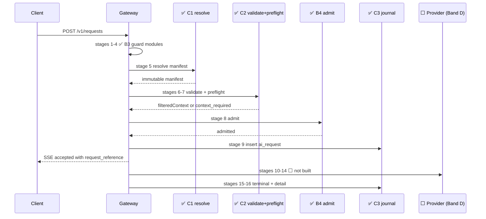
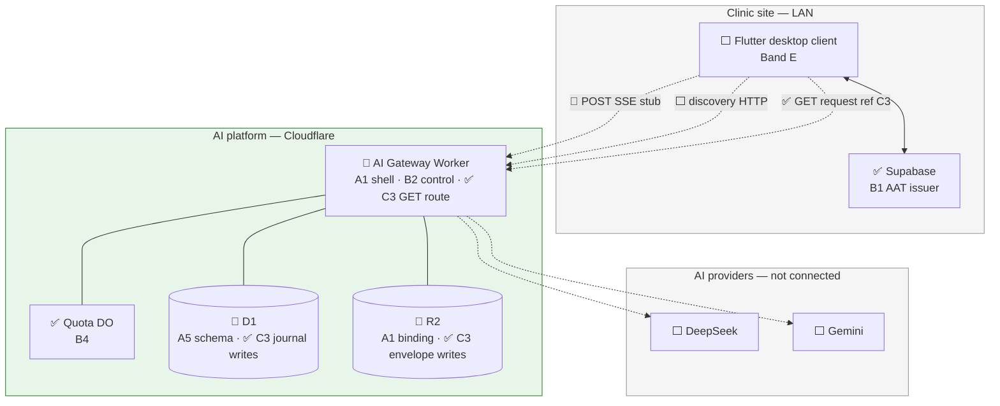
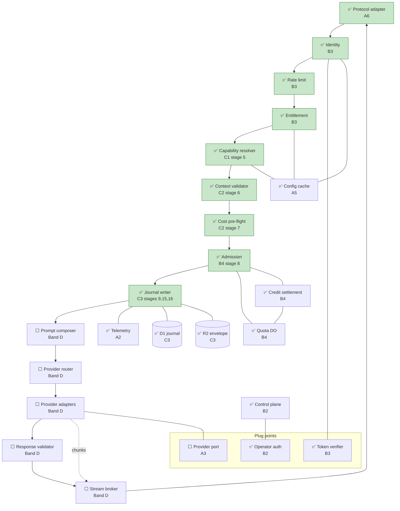

# AI Platform — Band C Implementation Reference

- Purpose: Explain, in plain language, what Band C of the AI platform delivery plan has actually built — for someone who does not know the project or its technologies yet, especially readers who already used [`17c-band-a-implementation-reference.md`](17c-band-a-implementation-reference.md) and [`17d-band-b-implementation-reference.md`](17d-band-b-implementation-reference.md).
- Read this when: onboarding after Band B, reviewing capability/context/journal work, or preparing for Band D.
- Canonical for: Band C completion status, where to find the code and tests, and which architecture boxes are now green.
- Usually paired with: [`17c-band-a-implementation-reference.md`](17c-band-a-implementation-reference.md) (Band A baseline), [`17d-band-b-implementation-reference.md`](17d-band-b-implementation-reference.md) (trust/admission), [`17b-ai-platform-delivery-plan.md`](17b-ai-platform-delivery-plan.md) (slice definitions), [`17-ai-platform.md`](17-ai-platform.md) (full architecture).
- Not covered here: prompt composition, provider calls, streaming, Flutter client work (Bands D–E).

> **Status:** Band C (slices **C1–C3**) is **complete** on branch `ai/master` (tip `69372c56`, 2026-08-01). Automated evidence: **58 Band C tests** — **11** (C1, workers pool) + **19** (C2, default pool) + **28** (C3, workers pool) — within **275** total Worker tests (**189** default config + **86** workers pool; configs are disjoint). Capability resolve, context validate, cost pre-flight, and journal write-path **modules exist and are tested in isolation**; they are **not yet wired into** `POST /v1/requests`. The only Band C client HTTP route live today is **`GET /v1/requests/{reference}`** (C3). **No real AI inference happens yet.**

---

## Table of Contents

1. [The One-Paragraph Summary](#1-the-one-paragraph-summary)
2. [Background for New Readers](#2-background-for-new-readers)
3. [What Band C Is and Why It Exists](#3-what-band-c-is-and-why-it-exists)
4. [Technologies in Plain Language](#4-technologies-in-plain-language)
5. [What Was Built — Slice by Slice](#5-what-was-built--slice-by-slice)
6. [Architecture Diagrams — What Is Finished](#6-architecture-diagrams--what-is-finished)
7. [Frozen Contracts at a Glance](#7-frozen-contracts-at-a-glance)
8. [How Testing Was Carried Out](#8-how-testing-was-carried-out)
9. [Repository Map](#9-repository-map)
10. [What Band C Does Not Do Yet](#10-what-band-c-does-not-do-yet)
11. [What Band C Unlocks Next](#11-what-band-c-unlocks-next)
12. [Where to Read More](#12-where-to-read-more)

---

## 1. The One-Paragraph Summary

Band C answers three questions before any AI provider is called: **which AI feature is this request for, is the clinic data complete and safe to use, and is every admitted request recorded for audit?** It adds **capability resolve** (turn `capability id + version pin` into one immutable manifest), **context validate + cost pre-flight** (filter context to declared keys, emit `context_required` when keys are missing, block oversized requests with `request_too_large` before egress), and **journal write** (insert `ai_request` before work begins; after the response, write attempts, usage, and one R2 envelope; expose `GET /v1/requests/{reference}` for lookup). A **discovery** API lets clients learn granted capabilities without hard-coding ids. Everything is covered by automated tests, but **`POST /v1/requests` still behaves like Band A** (SSE stub) until a later slice wires the full guard → resolve → validate → admit → journal chain.

---

## 2. Background for New Readers

### 2.1 Start with Bands A and B

If Bands A and B are new to you, read [`17c-band-a-implementation-reference.md`](17c-band-a-implementation-reference.md) and [`17d-band-b-implementation-reference.md`](17d-band-b-implementation-reference.md) first.

| Band | What it delivered |
| --- | --- |
| **Band A** | Empty Worker shell, frozen error/capability/context contracts, D1 schema **definitions**, SSE adapter framing |
| **Band B** | Who may call (AAT minting, token verify, entitlement, quota/admission DO) |
| **Band C** | **What** they may run, **what data** they must send, and **audit trail** for admitted requests |

Band C **uses** Band A contracts and Band B identity/principal types. It does not change frozen Band A wire shapes.

### 2.2 The three problems Band C solves

1. **Capability identity** — Map a request to one frozen manifest (not client-supplied prompt logic).
2. **Context safety** — Only manifest-declared keys pass; missing keys return machine-readable `context_required`.
3. **Explainability** — Every *admitted* request gets a durable D1 row and human-readable reference; guard rejections do **not** journal.

### 2.3 Daily request flow (future, when wired)

1. Client discovers capabilities (C1 discovery) and caches manifests.
2. Client assembles context from Supabase RPCs (Band E3 — not built).
3. Client sends `POST /v1/requests` with capability pin, context, AAT, idempotency key.
4. Platform runs guard (B3) → resolve (C1) → validate + pre-flight (C2) → admit (B4) → journal insert (C3 stage 9).
5. Platform composes prompt and calls provider (Band D — not built).
6. Platform records terminal state and R2 envelope (C3 stages 15–16).
7. Client polls or receives SSE; may call `GET /v1/requests/{reference}` (C3 — **live today**).

### 2.4 Where the code lives

All Band C code is in **`ai-platform/`** (Cloudflare Worker). There are **no** new Supabase migrations and **no** Flutter changes. The clinic app will consume Band C indirectly through the client SDK (Band E).

### 2.5 How Band C landed in git

Work was integrated linearly on **`ai/master`** (not `origin/master` at the time of writing). Three feature branches map one-to-one to slices:

| Slice | Branch | Final commit (on `ai/master` line) | Date |
| --- | --- | --- | --- |
| **C1** | `ai/025-c1-capability-resolver-discovery` | `beaff234` | 2026-08-01 |
| **C2** | `ai/026-c2-context-validator-cost-preflight` | `6a44b5b8` | 2026-08-01 |
| **C3** | `ai/027-c3-journal-writer-get-request` | `69372c56` | 2026-08-01 |

Spec Kit directories: `specs/025` … `specs/027`.

---

## 3. What Band C Is and Why It Exists

The delivery plan titles Band C **"Capability, context, and the journal"** (`17b` §3.4).

| ID | Slice | Spec directory | Needs | One-line purpose |
| --- | --- | --- | --- | --- |
| **C1** | Capability registry, resolver, discovery | `specs/025-capability-resolver-discovery/` | A4, B3 | Resolve `capabilityId@vN` → manifest; discovery + etag |
| **C2** | Context validator + cost pre-flight | `specs/026-context-validator-cost-preflight/` | A5, C1 | Stages 6–7: filter context; `context_required`; `request_too_large` |
| **C3** | Journal writer + get-request | `specs/027-journal-writer-get-request/` | A5, C1 | Stages 9, 15–16; `GET /v1/requests/{ref}` |

**Dependency chain:** `A4 → C1 → C2`; `A5 + C1 → C3`. **C1 unlocks parallel work in Bands D and E** — both need a resolved manifest before prompt composition or client manifest caching.

### 3.1 Band C vs Band A vs Band B

| Concern | Band A | Band B | Band C |
| --- | --- | --- | --- |
| Worker deploy shell | ✅ | — | consumes |
| Error taxonomy, canonical types | ✅ | consumes | consumes |
| Manifest **schema** (not runtime resolve) | ✅ A4 | — | C1 resolves |
| D1 schema **definitions** | ✅ A5 | B2 writes install rows | C3 **writes `ai_request`** |
| SSE protocol adapter | ✅ A6 | — | not extended (except C3 GET) |
| AAT minting (clinic) | — | ✅ B1 | — |
| Token verify, rate, entitlement | — | ✅ B3 modules | consumes |
| Quota / admission DO | — | ✅ B4 modules | journal only after admit |
| **Capability resolve (stage 5)** | — | — | ✅ C1 |
| **Context validate (stage 6)** | — | — | ✅ C2 |
| **Cost pre-flight (stage 7)** | — | — | ✅ C2 |
| **Journal + R2 envelope (9, 15–16)** | schema only | no rows on guard reject | ✅ C3 |
| **Discovery endpoint** | — | — | ✅ C1 logic; 🔶 HTTP route |
| Prompt / provider / stream | — | — | ⬜ Band D |

**Legend:** ✅ implemented & tested | 🔶 partial (module exists, not on POST path) | ⬜ not built

---

## 4. Technologies in Plain Language

Band A and B already introduced the Worker, D1, R2, Durable Objects, AAT, and config cache. Band C adds:

| Term | What it means | How Band C uses it |
| --- | --- | --- |
| **Capability** | Named AI feature (e.g. draft visit summary) | Identified by `capabilityId` + exact version pin |
| **Manifest** | Immutable JSON spec: context keys, economics, prompt pin, output mode | Resolved by C1 from A4-loaded registry |
| **Capability registry** | In-memory `Map` of bundled manifests | `createCapabilityRegistry()` / `setCapabilityRegistry()` |
| **Version pin** | Client header `x-capability-version` | Exact match or typed error (`capability_unknown`, etc.) |
| **Discovery** | Read API listing granted active manifests | `discover()` + `computeDiscoveryEtag()` + `buildDiscoveryResponse()` |
| **Context key** | String like `patient.demographics@v1` | Declared in manifest; validated in C2 |
| **Context Contract** | Required/optional keys, shapes, max sizes | A5 vocabulary; C2 enforces per manifest |
| **`context_required`** | Error: client must supply missing keys | Carries missing-key manifest (self-heal behaviour is Band J2) |
| **`filteredContext`** | Only manifest-declared keys | Undeclared keys dropped (spy-tested) |
| **Cost pre-flight** | Byte-based token **estimate** vs ceiling | CPU-only stage 7; no provider call |
| **Request reference** | Human-readable id (`7QK4-2B9F`) | Indexed in D1; returned at accept |
| **`ai_request`** | Journal spine row | Created at stage 9 before provider |
| **`ai_attempt`** | One provider try | Written at stage 16 |
| **`usage_event`** | Billing/quota ledger row | One per request at stage 16 |
| **R2 envelope** | One JSON object per request | Key `request/{id}/envelope` — context, prompt, attempts, result |
| **`GET /v1/requests/{ref}`** | Poll terminal state + result | Only C3 HTTP route on client API today |

---

## 5. What Was Built — Slice by Slice

### 5.1 C1 — Capability registry, resolver, and discovery

**In simple terms:** Turn a client's `capability id + version` into exactly one immutable manifest, or return a typed error. Tell clients which capabilities they are allowed to use, with cache-friendly etags.

**What was implemented:**

- **`src/capability/index.ts`:** `resolve()`, `discover()`, `computeDiscoveryEtag()`, `buildDiscoveryResponse()`, registry helpers.
- **Errors:** `capability_unknown`, `capability_retired`, `capability_disabled` (distinct codes).
- **Kill switches + entitlements + grants** read via A5 config cache and B3 `Principal`.
- **Manifest immutability:** deep-freeze at registry boundary.
- **Tests:** `T-C1-01` … `T-C1-10` in `test/capability.test.ts` (11 cases with parameterization).

**Key files:**

| Path | Role |
| --- | --- |
| `ai-platform/src/capability/index.ts` | Resolver, discovery, etag, HTTP response builder |
| `ai-platform/test/capability.test.ts` | C1 test suite |
| `specs/025-capability-resolver-discovery/contracts/capability-registry.md` | Frozen wire shapes |
| `specs/025-capability-resolver-discovery/quickstart.md` | How to run C1 tests |

**Not included:** Discovery HTTP route in `worker.ts` (functions tested directly — same precedent as B3 guard modules). No worker-boot manifest bundle loading yet (registry set in tests via `setCapabilityRegistry()`).

---

### 5.2 C2 — Context validator and cost pre-flight

**In simple terms:** Check clinic data against the resolved manifest; drop undeclared keys; reject missing keys with `context_required`; block requests that would exceed token ceilings **before** calling any AI provider.

**What was implemented:**

**Stage 6 — `src/context/validator.ts`:**

- `validateContext()` — required keys, shapes, size bounds, org/branch vs `Principal`.
- `buildContextRequiredResponse()` — frozen `context_required` wire shape.
- Undeclared keys removed from `filteredContext`.

**Stage 7 — `src/context/preflight.ts`:**

- `estimateInputTokens()` — `ceil(utf8Bytes / 4) * 1.15` per architecture §13.6.2.
- `runCostPreflight()` — compares estimate + `maxOutputTokens` to `perRequestCostCeiling` and `maxInputTokens`.
- CPU-only; no I/O.

**Tests:** `T-C2-01` … `T-C2-15` in `test/context-validator.test.ts` (19 cases).

**Key files:**

| Path | Role |
| --- | --- |
| `ai-platform/src/context/validator.ts` | Stage 6 |
| `ai-platform/src/context/preflight.ts` | Stage 7 |
| `ai-platform/src/context/index.ts` | A5 vocabulary (C2 consumes `validatePayload`) |
| `ai-platform/test/context-validator.test.ts` | C2 test suite |
| `specs/026-context-validator-cost-preflight/contracts/context-validator.md` | Frozen validator results |

**Not included:** `context_required` auto-resubmit (Band J2). Conversational transcript validation (Band H). Shape enforcement for every example key — only `visit.chief_complaint@v1` has a full published shape today; other keys pass when shape is unknown (A5 scope).

---

### 5.3 C3 — Journal writer, post-response detail, and get-request

**In simple terms:** Write the audit record **before** AI work; after the answer, store details without failing the client; let support look up by reference.

**What was implemented:**

| Function | Stage | Purpose |
| --- | --- | --- |
| `createRequestRow()` | 9 | Sync D1 insert; initial state `Accepted` |
| `journalTransition()` | mid-pipeline | Stamp §6.3 states on row |
| `recordTerminalState()` | 15 | Terminal `Completed` / `Failed` / `Cancelled` |
| `writePostResponseDetail()` | 16 | `ctx.waitUntil` → `ai_attempt`, `usage_event`, R2 envelope |
| `getRequest()` | read | One indexed D1 lookup + optional R2 read |
| `recordGuardRejection()` / `flushGuardRejectionCounters()` | guard | Tally rejections in `platform_counter` — **no** `ai_request` row |

**HTTP — `worker.ts`:**

- `GET /v1/requests/{reference}` — normalizes reference, calls `getRequest()`.
- `Completed` → `200` + `{state, result}`; `Failed` → `200` + `{state, terminal_error_code}`; `Cancelled` → `{state}`; unknown → `404`.

**Tests:** `T-C3-01` … `T-C3-18` in `test/journal.test.ts` (28 cases).

**Key files:**

| Path | Role |
| --- | --- |
| `ai-platform/src/journal/index.ts` | All journal write/read logic |
| `ai-platform/src/worker.ts` | GET route (lines ~88–119) |
| `ai-platform/migrations/20260731120000_platform_schema.sql` | D1 tables (from A5; C3 writes) |
| `ai-platform/test/journal.test.ts` | C3 test suite |
| `specs/027-journal-writer-get-request/contracts/journal.md` | Frozen envelope + get-request shape |

**Not included:** Journal write path on live `POST /v1/requests` (`adapter.ts` unchanged). Stage-15 Quota DO credit (`creditUsage` remains B4). Support operator UI (Band F3). Integration test through `worker.fetch` for GET (thin route; tests call `getRequest()` directly).

---

### 5.4 End-to-end stories in plain language

These describe what Band C **will** do once the pipeline orchestrator connects the modules. Only walkthrough **E** is live on HTTP today.

#### Walkthrough A — Client discovers capabilities (C1)

1. Client (future Band E2) calls discovery with installation identity after auth.
2. Platform loads entitlement and grants from config cache.
3. Returns `{manifests: [...]}` with **ETag**; `304 Not Modified` if unchanged.
4. Client caches manifests and knows which context keys to fetch from Supabase.

**Today:** `discover()` and `buildDiscoveryResponse()` work in tests only — no HTTP route.

#### Walkthrough B — Submit request with context (C1 + C2, when wired)

1. Client sends `POST /v1/requests` with capability version pin, intent, context, AAT, idempotency key.
2. **Stage 5 (C1):** `resolve()` → immutable manifest or `capability_*` error.
3. **Stage 6 (C2):** `validateContext()` → `filteredContext` or `context_required` / `context_invalid`.
4. **Stage 7 (C2):** `runCostPreflight()` → pass or `request_too_large`.
5. Stages 8+ (B4 admit, C3 journal, D inference) — modules exist; **not chained on POST yet**.

#### Walkthrough C — Missing context (C2 emits; J2 heals later)

1. Manifest requires `patient.demographics@v1`; client omits it.
2. Platform returns `context_required` listing missing keys and shapes.
3. **Today:** client must handle manually. **Band J2:** one automatic refresh + resubmit.

#### Walkthrough D — Admitted request journaling (C3)

1. After admission, **stage 9** inserts `ai_request` (`Accepted`).
2. States advance through §6.3 (`Composing` → `Invoking` → …) — Band D will drive these.
3. **Stage 15:** terminal state on D1 row.
4. **Stage 16 (async):** R2 envelope + attempts + usage — failure here **never** changes client outcome.

#### Walkthrough E — Lookup by reference (C3 — **live HTTP**)

1. Caller requests `GET /v1/requests/7QK4-2B9F`.
2. Platform runs one indexed D1 query on `request_reference`.
3. Returns terminal state; includes `result` only when `Completed`.

#### Walkthrough F — Guard rejection (B + C boundary)

1. Token invalid, quota exhausted, or rate limited → **no `ai_request` row**.
2. Rejection counted in `platform_counter` via `recordGuardRejection()` (helpers exist; **not** called from B3 stages yet).



---

## 6. Architecture Diagrams — What Is Finished

**Legend:** ✅ implemented & tested | 🔶 partial | ⬜ not built

> **Stage-order note:** Canonical pipeline order is in `17-ai-platform.md` §6.1 — capability resolve (5) and context validate/preflight (6–7) come **before** admission (8). The Band B reference diagram in [`17d-band-b-implementation-reference.md`](17d-band-b-implementation-reference.md) §6.2 shows `ADM` before `CAP`; that diagram is simplified and **contradicts** §6.1. Trust the stage table and the diagram below.

### 6.1 System context — from `17-ai-platform.md` §3.2



### 6.2 Gateway pipeline — from `17-ai-platform.md` §4.3



**How to read this:** Green boxes are implemented and tested. **Only stage 1 runs automatically on `POST /v1/requests` today.** C1, C2, B3, B4, and C3 write-path functions are **callable libraries**, not yet chained. C3 **GET** is the first client-facing Band C HTTP route.

### 6.3 Pipeline stages — from `17-ai-platform.md` §6.1

| Stage | Name | Band | Status |
| --- | --- | --- | --- |
| 1 | Protocol adapter | A6 | ✅ on POST (stub stream) |
| 2 | Identity | B3 | ✅ module |
| 3 | Entitlement | B3 | ✅ module |
| 4 | Rate limit | B3 | ✅ module |
| 5 | Capability resolve | **C1** | ✅ module |
| 6 | Context validate | **C2** | ✅ module |
| 7 | Cost pre-flight | **C2** | ✅ module |
| 8 | Admission | B4 | ✅ module |
| 9 | Journal insert | **C3** | ✅ module |
| 10–14 | Compose, route, invoke, validate, stream | D | ⬜ |
| 15 | Record terminal state | **C3** | ✅ module |
| 16 | Post-response detail | **C3** | ✅ module |

### 6.4 Platform stores — status after Band C

| Store | Status | What changed in Band C |
| --- | --- | --- |
| D1 `ai_request` | ✅ C3 | Insert at stage 9; transitions; terminal update — **tested**, not on live POST |
| D1 `ai_attempt`, `usage_event` | ✅ C3 | Stage 16 writes |
| D1 `platform_counter` | ✅ B3/B4 + C3 | Guard rejection tallies without journal rows |
| R2 `request/{id}/envelope` | ✅ C3 | One JSON envelope per request |
| Config cache | ✅ A5+C1 | Discovery reads entitlements, grants, kill switches |
| In-memory capability registry | ✅ C1 | Test/bootstrap via `setCapabilityRegistry()` |

### 6.5 Request state machine — `17-ai-platform.md` §6.3

C3 implements timestamped transitions for all §6.3 states used in tests (`Accepted` through `Cancelled`). **`Rejected` is a guard outcome** — it never creates an `ai_request` row; only `platform_counter` increments.

---

## 7. Frozen Contracts at a Glance

Band C froze new contracts. Later slices may **extend** but not **rewrite** them (delivery plan §2.3).

### 7.1 Capability resolver outcomes (C1)

| Outcome | Code |
| --- | --- |
| Success | `{ok: true, manifest}` — manifest deeply frozen |
| Unknown id/version | `capability_unknown` |
| Retired lifecycle | `capability_retired` |
| Kill switch active | `capability_disabled` |

Registry key format: `<capabilityId>@<version>`. Full tables: `specs/025-.../contracts/capability-registry.md`.

### 7.2 Discovery response + ETag (C1)

- `discover()` → `{manifests, etag}` — only granted + `active` lifecycle manifests.
- `buildDiscoveryResponse()` — honors `If-None-Match` → `304` when etag matches.
- `deprecated` manifests may still **resolve** but do not appear in discovery (by design).

### 7.3 Context validator results (C2)

| Outcome | Code |
| --- | --- |
| Success | `{ok: true, filteredContext}` |
| Missing required key(s) | `context_required` + missing-key manifest |
| Shape/size/tenant violation | `context_invalid` |
| Oversized request (stage 7) | `request_too_large` |

Full shapes: `specs/026-.../contracts/context-validator.md`.

### 7.4 R2 envelope + get-request response (C3)

**R2 key:** `request/{request_id}/envelope` — four sections: `context`, `prompt`, `attempts[]`, `result`.

**GET response:**

| Terminal state | Body |
| --- | --- |
| `Completed` | `{state, result}` |
| `Failed` | `{state, terminal_error_code}` |
| `Cancelled` | `{state}` |

Full spec: `specs/027-.../contracts/journal.md`.

---

## 8. How Testing Was Carried Out

### 8.1 The completion rule

Same as Bands A and B: **a slice is done when a test a human can read and believe passes.** Band C has no clinic-side SQL — Vitest suites in `ai-platform/` are the evidence.

### 8.2 Two Vitest configurations

| Config | Command | What it runs |
| --- | --- | --- |
| **Default** | `cd ai-platform && npm test` | **189 tests** — Band A + C2 (`context-validator.test.ts`, 19 tests) |
| **Workers pool** | `npx vitest run --config vitest.workers.config.ts` | **86 tests** — B2–B4 + C1 (11) + C3 (28) |

**Band C total: 58 tests.** Combined Worker suites: **275 tests** (189 + 86; configs are disjoint).

Node **22+** required.

### 8.3 Test layers by slice (`17b` §3.11.3)

| Slice | Layer | File | Named suites |
| --- | --- | --- | --- |
| **C1** | Unit + D1 integration | `test/capability.test.ts` | `T-C1-01` … `T-C1-10` |
| **C2** | Unit (spy) | `test/context-validator.test.ts` | `T-C2-01` … `T-C2-15` |
| **C3** | Integration ordering + spy | `test/journal.test.ts` | `T-C3-01` … `T-C3-18` |

### 8.4 Spy invariants (Band C)

- Undeclared context key **absent** from `filteredContext`.
- Pre-flight rejection → **no provider egress** (spy).
- Guard reject → **zero** `ai_request` inserts.
- Exactly **one** R2 `PutObject` per request.
- Stage 16 runs **after** terminal event; stage-16 failure **does not** fail the request.
- `getRequest()` → exactly **one** indexed D1 query.

### 8.5 Slice-only commands

```bash
cd ai-platform
npx vitest run --config vitest.workers.config.ts test/capability.test.ts
npx vitest run test/context-validator.test.ts
npx vitest run --config vitest.workers.config.ts test/journal.test.ts
```

### 8.6 Run everything (quick reference)

```bash
cd ai-platform && npm test
cd ai-platform && npx vitest run --config vitest.workers.config.ts
bash backend/tests/run_ai_platform_trust_tests.sh   # Band B1 — requires local Supabase
```

### 8.7 Testing gaps (honest inventory)

| Gap | Detail |
| --- | --- |
| **No CI for ai-platform** | `.github/workflows/ci.yml` runs Flutter only |
| **`npm test` alone skips C1/C3** | Workers pool required for capability + journal |
| **No single HTTP integration test** | POST through resolve → validate → journal not automated |
| **C1 discovery not smoke-tested via HTTP** | Functions tested directly |
| **GET route not integration-tested via `worker.fetch`** | Tests call `getRequest()` |
| **Band A reference flake** | `reference.test.ts` T21 uniqueness test may rarely fail under extreme draw counts (pre-existing; unrelated to Band C) |
| **No cross-stack test** | Real clinic context RPCs (E3) not involved |

---

## 9. Repository Map

```
ai-platform/
├── src/
│   ├── capability/index.ts      # C1 resolve, discover, discovery response
│   ├── context/
│   │   ├── index.ts             # A5 vocabulary (C2 consumes)
│   │   ├── validator.ts           # C2 stage 6
│   │   └── preflight.ts         # C2 stage 7
│   ├── journal/index.ts         # C3 stages 9, 15, 16 + getRequest
│   ├── worker.ts                # + GET /v1/requests/{ref} (C3)
│   ├── adapter.ts               # A6 — still stub; not wired to C1/C2/C3
│   ├── identity/index.ts        # B3 — Principal consumed by C1/C2/C3
│   ├── config-cache/            # A5 — C1 discovery reads
│   └── manifest/index.ts        # A4 — C1 registry source
├── test/
│   ├── capability.test.ts       # C1
│   ├── context-validator.test.ts # C2
│   └── journal.test.ts          # C3
├── migrations/
│   └── 20260731120000_platform_schema.sql  # D1 tables C3 writes
├── vitest.config.ts             # Default — includes C2
└── vitest.workers.config.ts     # Workers pool — C1, C3, B2–B4

specs/
├── 025-capability-resolver-discovery/
│   ├── spec.md, plan.md, tasks.md, quickstart.md
│   └── contracts/capability-registry.md
├── 026-context-validator-cost-preflight/
│   ├── spec.md, plan.md, tasks.md, quickstart.md
│   └── contracts/context-validator.md
└── 027-journal-writer-get-request/
    ├── spec.md, plan.md, tasks.md, quickstart.md
    └── contracts/journal.md
```

---

## 10. What Band C Does Not Do Yet

### 10.1 Pipeline and user-visible gaps

| Capability | Status after Band C |
| --- | --- |
| `POST /v1/requests` runs C1→C2→B4→C3 chain | **Not wired** |
| HTTP discovery route | **Functions only** — no `worker.ts` route |
| Prompt compose, provider call, stream | Band D |
| Flutter discovery / context resolver | Band E |
| `context_required` auto-heal | Band J2 |
| Support lookup operator UI | Band F3 |
| End-to-end button → draft (CP3) | D4 + E4 |

Calling `POST /v1/requests` today still opens SSE with `accepted` and stub content — **C1/C2/C3 do not run on that route.**

Calling `GET /v1/requests/{reference}` **does** run real C3 read logic when a row exists.

### 10.2 Implementation gaps inside Band C scope

| Gap | Detail |
| --- | --- |
| **Unified pipeline orchestrator** | Stages are separate modules (same as B3/B4) |
| **Worker-boot manifest bundle** | Registry populated in tests only |
| **Published context shapes** | Full shape validation for one key (`visit.chief_complaint@v1`) |
| **`capability_grant` population** | B2 enroll still `pending` / empty grants |
| **Journal on live POST** | `createRequestRow` not called from `adapter.ts` |
| **Guard rejection hooks** | `recordGuardRejection` / `flushGuardRejectionCounters` not called from B3 stages or `worker.ts` |
| **Stage 15 credit** | Explicitly B4's `creditUsage()` — not in journal module |

### 10.3 What Band C consumes from A/B

| Prior slice | How Band C uses it |
| --- | --- |
| **A4** Manifest | C1 registry and resolve |
| **A5** Context keys + D1 schema + config cache | C2 validation; C3 journal tables |
| **A2** Errors + reference | C2 `context_required` body; C3 reference normalization |
| **A3** CanonicalResult | C3 R2 envelope `result` section |
| **B3** Principal | C1 entitlement filter; C2 org/branch; C3 request row |
| **B4** Admission | C3 journal runs **after** admit in designed pipeline — not wired |

---

## 11. What Band C Unlocks Next

Band C is not a release gate (delivery plan DP-1), but it removes blockers:

| Next band | Why C1/C2/C3 matter |
| --- | --- |
| **Band D** | D1 prompt composer needs resolved manifest (C1) and `filteredContext` (C2) |
| **Band E** | E2/E3 client SDK fetches discovery manifests (C1) and assembles context keys |
| **Band F3** | Support lookup reads C3 journal rows and R2 envelopes |
| **Band J2** | Self-heal on `context_required` — payload frozen by C2 |

### 11.1 Checkpoint CP3 (not satisfied yet)

**CP3** (`17b` §5) is the falsification checkpoint: one Flutter button through guard, composed prompt, fake provider, stream, and rendered draft (**D4 + E4**).

Band C satisfies **component-level** prerequisites for that thread:

- Capability resolve, context validation, and journal modules are implemented and tested.
- `GET /v1/requests/{reference}` proves C3 read path on HTTP.

What remains for **CP3**:

- Wire guard + C1 + C2 + B4 + C3 into `POST /v1/requests` (or dedicated harness).
- Build Band D fake-adapter path and Band E4 first UI surface.

Band C alone does **not** satisfy CP3.

---

## 12. Where to Read More

| Document | Use when |
| --- | --- |
| [`17c-band-a-implementation-reference.md`](17c-band-a-implementation-reference.md) | Band A contracts baseline |
| [`17d-band-b-implementation-reference.md`](17d-band-b-implementation-reference.md) | Trust/admission (note: §6.2 diagram stage order differs from §6.1 — see §6.2 here) |
| [`17b-ai-platform-delivery-plan.md`](17b-ai-platform-delivery-plan.md) | Slice definitions, §3.11.3 test floors, band ordering |
| [`17-ai-platform.md`](17-ai-platform.md) | Authoritative architecture — §4.3.4–4.3.5, §4.3.11, §6.1, §7.2–7.4 |
| `specs/025` … `specs/027` quickstarts | Run one slice's tests |
| `ai-platform/README.md` | Worker dev/deploy commands |

**Run tests:**

```bash
cd ai-platform && npm test
cd ai-platform && npx vitest run --config vitest.workers.config.ts
```

---

*This document describes Band C as implemented on `ai/master` (tip `69372c56`). For Bands A and B, see [`17c`](17c-band-a-implementation-reference.md) and [`17d`](17d-band-b-implementation-reference.md). Do not rewrite frozen contract sections without an architecture amendment.*
