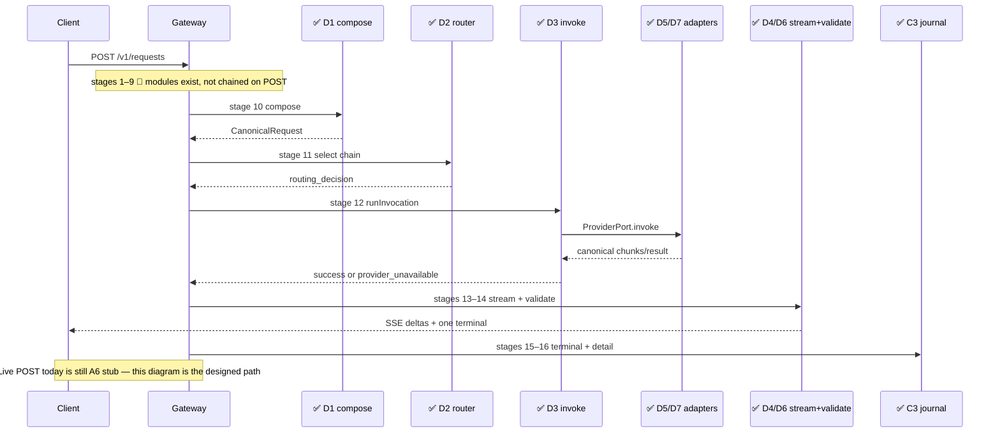
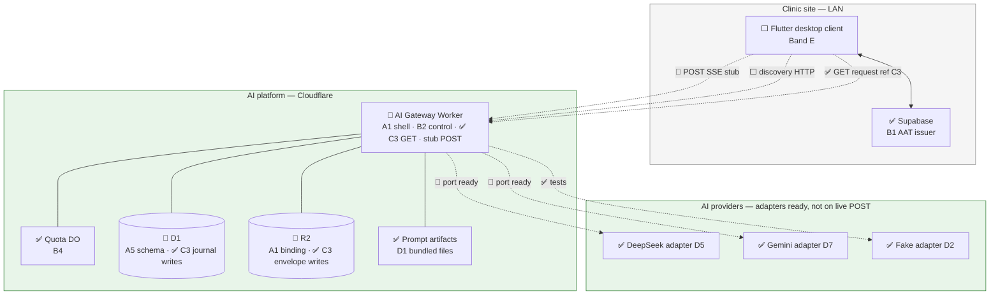
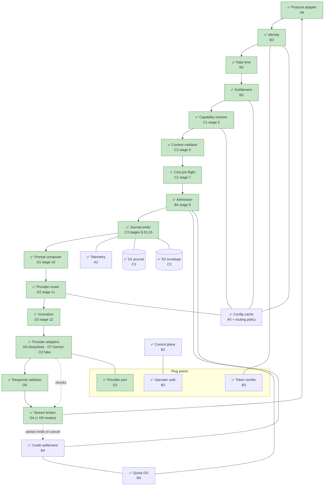

# AI Platform — Band D Implementation Reference

- Purpose: Explain, in plain language, what Band D of the AI platform delivery plan has actually built — for someone who does not know the project or its technologies yet, especially readers who already used [`17c-band-a-implementation-reference.md`](17c-band-a-implementation-reference.md), [`17d-band-b-implementation-reference.md`](17d-band-b-implementation-reference.md), and [`17e-band-c-implementation-reference.md`](17e-band-c-implementation-reference.md).
- Read this when: onboarding after Band C, reviewing prompt/provider/stream/validate work, or preparing for Band E / CP3.
- Canonical for: Band D completion status, where to find the code and tests, and which architecture boxes are now green.
- Usually paired with: [`17c`](17c-band-a-implementation-reference.md) (Band A baseline), [`17d`](17d-band-b-implementation-reference.md) (trust/admission), [`17e`](17e-band-c-implementation-reference.md) (capability/context/journal), [`17b-ai-platform-delivery-plan.md`](17b-ai-platform-delivery-plan.md) (slice definitions), [`17-ai-platform.md`](17-ai-platform.md) (full architecture).
- Not covered here: Flutter client work (Band E), eval harnesses (F1), operator tooling (Band F), conversational turns (Band H), or review-comment remediations after tip `181ab637`.

> **Status:** Band D (slices **D1–D7**) is **complete** on branch `ai/master` (tip `181ab637`, 2026-08-02). Automated evidence: **143 Band D tests** — **13** (D1) + **37** (D2) + **13** (D3) + **20** (D4) + **14** (D5) + **30** (D6) + **16** (D7) — all passing under Node **22+**. Combined Worker suites at this tip: **332** default-config tests + **86** workers-pool tests = **418** (configs are disjoint). Prompt compose, routing, invocation, stream broker, response validation, DeepSeek, and Gemini **modules exist and are tested in isolation**; they are **not yet wired into** `POST /v1/requests` (that route is still the Band A SSE stub). Live HTTP client routes unchanged from Band C: stub `POST /v1/requests` and real `GET /v1/requests/{reference}`. **No end-to-end live inference on the public POST path yet.**

---

## Table of Contents

1. [The One-Paragraph Summary](#1-the-one-paragraph-summary)
2. [Background for New Readers](#2-background-for-new-readers)
3. [What Band D Is and Why It Exists](#3-what-band-d-is-and-why-it-exists)
4. [Technologies in Plain Language](#4-technologies-in-plain-language)
5. [What Was Built — Slice by Slice](#5-what-was-built--slice-by-slice)
6. [Architecture Diagrams — What Is Finished](#6-architecture-diagrams--what-is-finished)
7. [Frozen Contracts at a Glance](#7-frozen-contracts-at-a-glance)
8. [How Testing Was Carried Out](#8-how-testing-was-carried-out)
9. [Repository Map](#9-repository-map)
10. [What Band D Does Not Do Yet](#10-what-band-d-does-not-do-yet)
11. [What Band D Unlocks Next](#11-what-band-d-unlocks-next)
12. [Where to Read More](#12-where-to-read-more)

---

## 1. The One-Paragraph Summary

Band D answers the question: **how does the platform turn an admitted request into a validated AI answer?** It adds a **prompt registry and composer** (hash-pinned artifacts → provider-neutral canonical request), a **provider port** with a deterministic **fake adapter** and a **policy-as-data router**, an **invocation loop** with bounded retry and fallback, a **stream broker** that relays chunks over SSE with prose guards and cancel/credit, a **first real adapter** (DeepSeek), a **response validator** with bounded repair and structured output modes, and a **second real adapter** (Gemini) registered only by wiring + routing-policy data. Everything is covered by automated tests, but **`POST /v1/requests` still behaves like Band A** (SSE stub) until a later slice wires guard → resolve → validate → admit → journal → compose → invoke → stream.

---

## 2. Background for New Readers

### 2.1 Start with Bands A–C

If earlier bands are new to you, read [`17c`](17c-band-a-implementation-reference.md), [`17d`](17d-band-b-implementation-reference.md), and [`17e`](17e-band-c-implementation-reference.md) first.

| Band | What it delivered |
| --- | --- |
| **Band A** | Empty Worker shell, frozen error/capability/context contracts, D1 schema **definitions**, SSE adapter framing |
| **Band B** | Who may call (AAT minting, token verify, entitlement, quota/admission DO) |
| **Band C** | What they may run, what data they must send, and the audit journal |
| **Band D** | **How** to compose prompts, choose providers, invoke, stream, and validate answers |

Band D **uses** Band A canonical types, Band B principal/identity types, and Band C's resolved manifest + `filteredContext`. It does not change frozen Band A–C wire shapes.

### 2.2 The five problems Band D solves

1. **Prompt identity** — Prompts are immutable deployed files, pinned by hash — never editable rows in the database.
2. **Provider neutrality** — Inside the Worker, requests and results use A3 canonical types; only adapters speak provider wire formats.
3. **Honest failure handling** — Retry only when the adapter classifies a failure as retryable; fall back down a precomputed chain; never splice two providers' partial text.
4. **Safe streaming** — Chunks are provisional; only the terminal validated payload is authoritative; disconnect cancels the provider fetch and credits partial usage.
5. **Provider independence** — Adding Gemini required an adapter, a wiring map entry, and a routing-policy JSON edit — not a rewrite of compose/route/invoke/stream.

### 2.3 Daily request flow (future, when wired)

1. Client discovers capabilities (C1) and assembles context (Band E3 — not built).
2. Client sends `POST /v1/requests` with capability pin, context, AAT, idempotency key.
3. Platform runs guard (B3) → resolve (C1) → validate + pre-flight (C2) → admit (B4) → journal insert (C3).
4. **Stage 10 (D1):** `composeRequest()` builds a canonical request from pinned prompt artifacts + `filteredContext`.
5. **Stage 11 (D2):** `selectCandidateChain()` yields an ordered provider chain from routing policy.
6. **Stage 12 (D3):** `runInvocation()` walks the chain with bounded retry/fallback (fake today in tests; DeepSeek/Gemini adapters ready).
7. **Stages 13–14 (D4/D6):** stream broker relays chunks; validator/repair and structured modes apply at completion.
8. Platform records terminal state and R2 envelope (C3 stages 15–16).
9. Client receives SSE; may call `GET /v1/requests/{reference}` (C3 — **live today**).

### 2.4 Where the code lives

All Band D code is in **`ai-platform/`** (Cloudflare Worker). Prompt artifacts live under **`ai-platform/prompts/`**. Routing policy sample data lives under **`ai-platform/control/routing-policy/`**. There are **no** new Supabase migrations and **no** Flutter changes. The clinic app will consume Band D indirectly through the client SDK (Band E).

### 2.5 How Band D landed in git

Work was integrated linearly on **`ai/master`**. Seven feature branches map one-to-one to slices:

| Slice | Branch | Final commit (on `ai/master` line) | Date |
| --- | --- | --- | --- |
| **D1** | `ai/028-d1-prompt-registry-composer` | `e4c5c3db` | 2026-08-01 |
| **D2** | `ai/029-d2-provider-port-routing` | `108aca9c` | 2026-08-01 |
| **D3** | `ai/030-d3-invocation-retry-fallback` | `e1358cb2` | 2026-08-01 |
| **D4** | `ai/031-d4-stream-broker` | `2c9753d7` | 2026-08-01 |
| **D5** | `ai/032-d5-first-real-provider-adapter` | `2364b8fc` | 2026-08-02 |
| **D6** | `ai/033-d6-response-validator` | `5de5cc6a` | 2026-08-02 |
| **D7** | `ai/034-d7-second-provider-adapter` | `181ab637` | 2026-08-02 |

Spec Kit directories: `specs/028` … `specs/034`.

---

## 3. What Band D Is and Why It Exists

The delivery plan titles Band D **"The inference path"** (`17b` §3.5).

| ID | Slice | Spec directory | Needs | One-line purpose |
| --- | --- | --- | --- | --- |
| **D1** | Prompt registry and composer | `specs/028-prompt-registry-composer/` | A3, A4, C2 | Hash-pinned artifacts → `CanonicalRequest` |
| **D2** | Provider port, fake adapter, routing | `specs/029-provider-port-routing/` | A3, A5 | Port + fake + policy-as-data candidate chain |
| **D3** | Invocation with bounded retry/fallback | `specs/030-invocation-retry-fallback/` | D2 | Walk chain; retry only retryable; journal each attempt |
| **D4** | Stream broker, prose streaming, cancel | `specs/031-stream-broker/` | A6, D3 | Relay chunks, heartbeats, cancel + partial credit |
| **D5** | First real provider adapter | `specs/032-first-real-provider-adapter/` | D2 | DeepSeek behind `ProviderPort` (fixtures) |
| **D6** | Response validator, repair, structured modes | `specs/033-response-validator/` | D4 | Four-phase validate; bounded re-ask; structured SSE |
| **D7** | Second provider adapter | `specs/034-second-provider-adapter/` | D5 | Gemini + policy fallback; no pipeline rewrite |

**Dependency chain:** `A3/A4/C2 → D1`; `A3/A5 → D2 → D3 → D4 → D6`; `D2 → D5 → D7`. D1–D4 were built and proven against the **fake** adapter; D5/D7 add real wire adapters without changing the port.

### 3.1 Band D vs prior bands

| Concern | A | B | C | D |
| --- | --- | --- | --- | --- |
| Worker deploy shell | ✅ | — | — | consumes |
| Error taxonomy, canonical types | ✅ A2/A3 | consumes | consumes | consumes / maps |
| Manifest schema / resolve | ✅ A4 schema | — | ✅ C1 resolve | D1 reads resolved manifest |
| Context filter / journal | — | — | ✅ C2/C3 | consumes `filteredContext` |
| Guard / admission | — | ✅ B3/B4 | consumes | not invoked from POST yet |
| **Prompt registry + composer (10)** | — | — | — | ✅ D1 |
| **Provider port + router (11)** | — | — | — | ✅ D2 |
| **Invocation retry/fallback (12)** | — | — | — | ✅ D3 |
| **Stream broker (13–14)** | ✅ A6 framing | — | — | ✅ D4 (+ D6 modes) |
| **Response validator / repair** | — | — | — | ✅ D6 |
| **Real provider adapters** | — | — | — | ✅ D5 DeepSeek · ✅ D7 Gemini |
| Flutter / clinic context RPCs | — | — | — | ⬜ Band E |
| Live POST orchestration | stub | modules | modules | **modules still unwired** |

**Legend:** ✅ implemented & tested | 🔶 partial (module exists, not on POST path) | ⬜ not built

---

## 4. Technologies in Plain Language

Bands A–C already introduced the Worker, D1, R2, Durable Objects, AAT, config cache, capability manifests, and the journal. Band D adds:

| Term | What it means | How Band D uses it |
| --- | --- | --- |
| **Prompt artifact** | Immutable text file shipped with the Worker | Under `prompts/<capability>/`; pinned by FNV-1a hash in `registry.json` |
| **Prompt registry** | Build-time map of ref → content | `resolveArtifact()`, `verifyBuildPins()` — no D1 reads |
| **Composer** | Stage 10 assembler | `composeRequest()` → A3 `CanonicalRequest` |
| **Delimited typed data** | Context wrapped in `<key …>` blocks | Keeps clinic data out of the instruction channel (R-10) |
| **Provider port** | Shared interface every adapter implements | `ProviderPort` in `provider/port.ts` |
| **Fake adapter** | Scripted deterministic outcomes | Success, retryable/terminal errors, truncation, malformed |
| **Routing policy** | Versioned JSON, not code `if`s | `control/routing-policy/.../1.json`; read via config cache |
| **Candidate chain** | Ordered list of provider+model targets | Produced by `selectCandidateChain()` |
| **`routing_decision`** | Auditable selection record | Rule id, chain, exclusions, cost-class source |
| **Invocation** | Platform attempt loop | `runInvocation()` — retries, fallback, regenerating |
| **Stream broker** | Relays provider chunks onto A6 SSE | `createStreamBroker()` — heartbeats, cancel, one terminal |
| **Prose guards** | Cheap incremental + full completion checks | Length ceiling, stop sequence, system-prompt leak |
| **DeepSeek / Gemini adapters** | Real HTTP providers behind the port | Fixture-proven wire mapping; secrets from bindings |
| **Wiring map** | Tiny factory for real adapters | `createProviderAdapter("deepseek" \| "gemini", …)` |
| **Validation phases** | Ordered quality gates | Transport → schema → business → safety |
| **Repair / re-ask** | One budgeted second try with errors appended | `validateAndRepair()` — tested; not called from live POST |
| **`structured` / `structured_atomic`** | Non-prose stream modes | Provisional partials vs progress-only until terminal doc |

---

## 5. What Was Built — Slice by Slice

### 5.1 D1 — Prompt registry and composer

**In simple terms:** Ship prompt text as files next to the Worker, pin each file by hash so a silent edit fails the build, and assemble a provider-neutral request from those files plus the clinic's filtered context.

**What was implemented:**

- **`src/prompt/registry.ts`:** `resolveArtifact()`, `resolvePromptVersion()`, `verifyBuildPins()`.
- **`src/prompt/composer.ts`:** `composeRequest()` — system instruction, business-rule fragments, derived output-format instruction, delimited context (`data` role), user intent.
- **Artifacts:** `prompts/clinic.visit_summary/` (`system.md`, `rules-visit-summary.md`, `template-visit-summary.md`, `registry.json`).
- **Failure:** composition errors surface as `{ ok: false, code: "internal_error" }` — no provider call.
- **Tests:** `T-D1-01` … `T-D1-12` across `test/prompt-registry.test.ts` (6) and `test/prompt-composer.test.ts` (7).

**Key files:**

| Path | Role |
| --- | --- |
| `ai-platform/src/prompt/registry.ts` | Hash-pinned artifact resolution |
| `ai-platform/src/prompt/composer.ts` | Stage 10 composer |
| `ai-platform/prompts/clinic.visit_summary/` | First capability prompt bundle |
| `specs/028-prompt-registry-composer/contracts/composer-output.md` | Frozen composer output |

**Not included:** Conversational transcript rendering (H2). Runtime prompt activation / canary (J3). Journal writes of prompt version on live POST (C3 module exists; D1 only *surfaces* `promptVersion` for consumers). Live wiring into `adapter.ts`.

---

### 5.2 D2 — Provider port, fake adapter, and routing policy

**In simple terms:** Define the plug every AI provider must fit; give tests a fake that can act every failure mode; choose an ordered list of real (or fake) targets from a JSON policy, not from `if (provider === …)` in code.

**What was implemented:**

**Port — `src/provider/port.ts` + `classify.ts` + `fake.ts`:**

- `ProviderPort` invoke contract; `classifyFailure()` maps taxonomy codes to retryable vs terminal.
- `FakeAdapter` FIFO scripted outcomes: `success`, `truncation`, `malformed`, `retryable:<code>`, `terminal:<code>`.
- Exhaustive classification over the A2 taxonomy (`T-D2-06`).

**Router — `src/router/index.ts`:**

- `selectCandidateChain()` reads `active_routing_policy` from the config cache.
- Filters by structured support, context window, language, latency class, cost class, installation overrides, degraded tier.
- Records `routing_decision` (rule id, chain, exclusions, cost-class source).
- Chain depends only on capability + policy + request — **never** provider history (`T-D2-15`).
- `max_parallel_attempts` clamped to 1–6; walk remains sequential (speculative parallel deferred).

**Tests:** `T-D2-01` … `T-D2-21` (gaps in numbering are intentional) in `test/provider-port.test.ts` (24) and `test/router.test.ts` (13).

**Key files:**

| Path | Role |
| --- | --- |
| `ai-platform/src/provider/port.ts` | Port types |
| `ai-platform/src/provider/classify.ts` | Retryable vs terminal |
| `ai-platform/src/provider/fake.ts` | Deterministic fake |
| `ai-platform/src/router/index.ts` | Policy-as-data router |
| `specs/029-…/contracts/provider-port.md` | Port contract |
| `specs/029-…/contracts/routing-decision.md` | Chain + decision shape |

**Not included:** Invocation loop (D3). Real adapters (D5/D7). Soft-threshold *detection* (F4 — router only *matches* a degraded tier signal when already set). Circuit breakers / provider-health store. Region-aware routing.

---

### 5.3 D3 — Invocation with bounded retry and fallback

**In simple terms:** Try the first provider up to its attempt budget; if failures are retryable, back off with jitter; if the budget is exhausted, move to the next chain entry; if the whole chain fails, return `provider_unavailable`. Never stitch half of provider A's answer onto provider B's.

**What was implemented:**

- **`src/invocation/index.ts`:** `runInvocation()`.
- Selection reasons: `primary`, `fallback_after_retryable_error`, `fallback_after_timeout` (not speculative; not `repair_retry`).
- Attempt outcomes: `success`, `retryable_failure`, `terminal_failure`, `timeout`.
- Terminal adapter failures **do not** fall back.
- Exhausted / empty chain → `provider_unavailable`.
- Partial stream then fallback → emit `regenerating`; never splice text across providers.
- Optional `providerHistoryStore` is accepted but **never consulted** (stateless routing preserved).
- Per-attempt records fed to an injected journal sink (C3-compatible shape; not live D1 from this module alone).

**Tests:** `T-D3-01` … `T-D3-13` in `test/invocation.test.ts` (13).

**Key files:**

| Path | Role |
| --- | --- |
| `ai-platform/src/invocation/index.ts` | Attempt loop |
| `specs/030-…/contracts/invocation-attempt-loop.md` | Frozen attempt semantics |

**Not included:** Speculative parallel attempts (`max_parallel_attempts > 1`). Repair/re-ask (D6). Real network I/O (uses port; fake in unit tests). Live POST wiring.

---

### 5.4 D4 — Stream broker, prose streaming, and cancellation

**In simple terms:** Take normalized chunks from the provider side, push them to the client as SSE, keep the connection alive with heartbeats, run cheap prose safety checks while streaming, and if the client hangs up, abort the provider fetch, mark the request cancelled, and credit any partial token usage.

**What was implemented:**

- **`src/stream/index.ts`:** `createStreamBroker()`.
- **`src/stream/prose-guards.ts`:** `checkIncrementalGuards()`, `runFullGuardSet()`.
- SSE events: `heartbeat`, `text_delta` (provisional), `regenerating`, terminal `completed` / `failed` / `cancelled`.
- Incremental abort kinds: `length_ceiling`, `stop_sequence`, `system_prompt_leak` → terminal `validation_failed`.
- Cancel/disconnect aborts broker-held `AbortSignal`; credits via `creditSink`; journals terminal via `journalTerminalSink`.
- Invariants: exactly one terminal event; zero D1 rows per chunk; no Session Durable Object; no out-of-band cancel endpoint.

**Tests:** `T-D4-01` … `T-D4-19` in `test/stream-broker.test.ts` (20 cases; T-D4-15 has two `it`s).

**Key files:**

| Path | Role |
| --- | --- |
| `ai-platform/src/stream/index.ts` | Broker |
| `ai-platform/src/stream/prose-guards.ts` | Prose incremental + full guards |
| `specs/031-…/contracts/stream-broker.md` | Frozen broker contract |

**Not included at D4 land:** Structured modes (added in D6 to the same broker file). Schema/business/safety validation beyond prose guards (D6). Live POST wiring.

---

### 5.5 D5 — First real provider adapter (DeepSeek)

**In simple terms:** Teach the platform to call DeepSeek's HTTP API while still speaking only canonical types to the rest of the Worker. Prove the mapping with recorded fixtures — including ugly responses — so a live network is not required for the suite.

**What was implemented:**

- **`src/provider/deepseek.ts`:** `DeepSeekAdapter` — wire mapping, SSE stream normalization, usage extraction, error classification.
- Credentials from secret-store binding `DEEPSEEK_API_KEY` only; absent from logs/journal (`T-D5-08`, `T-D5-11`).
- Model pin: `deepseek-chat`. API: `https://api.deepseek.com/chat/completions`.
- Classification highlights: 401/403 → `provider_rejected`; 429 → `rate_limited`; ≥500 → `internal_error`; content filter → `provider_rejected`; timeout → `timeout`; `finish_reason: "length"` → truncation; unparseable → malformed/`internal_error`.
- Adapter owns **no** retry, fallback, or logging policy (`T-D5-09`, `T-D5-10`).
- Fixtures under `test/fixtures/deepseek/`.

**Tests:** `T-D5-01` … `T-D5-11` in `test/deepseek-adapter.test.ts` (14 cases including parameterized wire-error classes).

**Key files:**

| Path | Role |
| --- | --- |
| `ai-platform/src/provider/deepseek.ts` | DeepSeek adapter |
| `ai-platform/test/fixtures/deepseek/` | Recorded wire fixtures |
| `specs/032-…/contracts/first-real-provider-adapter.md` | Frozen adapter contract |

**Not included:** Pipeline registration into live Worker POST. On-LAN/local provider. D1/wrangler schema changes. Capability eval harness (F1).

---

### 5.6 D6 — Response validator, bounded repair, and structured modes

**In simple terms:** After the model answers, check the output in a fixed order (parse → schema → business rules → safety). If the capability allows repair, ask once more with the error list appended. For structured capabilities, stream provisional partials (or progress only) and put the whole validated document on the terminal event.

**What was implemented:**

**Phases — `src/validate/phases.ts`:**

- `runValidationPhases()` — order frozen as `transport_parse` → `schema` → `business` → `safety`.
- Safety: leaked system instruction, refusal prefixes, empty, truncated, injection echo.

**Repair — `src/validate/index.ts`:**

- `validateAndRepair()` — loops phases; on failure calls injected `reask(errors)` up to `repairPolicy.maxAttempts`; journals and cost-counts via sinks; exhaustion → `validation_failed`; **invalid content never returned**.

**Structured streaming — extends `src/stream/index.ts`:**

- `structured`: `partial_structured` events with `provisional: true` / not committable; terminal carries whole validated document.
- `structured_atomic`: progress/heartbeat only until terminal.
- Completion path calls `runValidationPhases` (not `validateAndRepair`) — repair remains a separate callable for orchestrators.

**Tests:** `T-D6-01` … `T-D6-16` in `test/response-validator.test.ts` (22) and `T-D6-17` … `T-D6-24` in `test/structured-modes.test.ts` (8).

**Key files:**

| Path | Role |
| --- | --- |
| `ai-platform/src/validate/phases.ts` | Four-phase validation |
| `ai-platform/src/validate/index.ts` | Repair loop |
| `ai-platform/src/stream/index.ts` | Structured emission (extended) |
| `specs/033-…/contracts/response-validator.md` | Frozen validator contract |

**Not included:** Rewriting D3 for repair (repair uses injected `reask` port). On-disk schema stores (in-memory registries in tests). Conversational validation (H2). Wiring `validateAndRepair` into live POST or into the broker's structured completion path.

---

### 5.7 D7 — Second provider adapter (Gemini)

**In simple terms:** Prove that a second provider is "just another adapter plus a policy edit." Gemini mirrors DeepSeek's fixture suite; routing policy lists Gemini after DeepSeek; pipeline modules do not change.

**What was implemented:**

- **`src/provider/gemini.ts`:** `GeminiAdapter` — same port obligations as D5.
- **`src/provider/wiring.ts`:** `createProviderAdapter()`, `listWiredProviderIds()` → `["deepseek", "gemini"]`.
- **Policy:** `control/routing-policy/platform-default/1.json` — DeepSeek primary, Gemini fallback (`gemini-1.5-flash`).
- Auth header: `x-goog-api-key`; binding `GEMINI_API_KEY`.
- Structural test `T-D7-13` allowlists second-adapter + wiring + policy paths and forbids pipeline-module diffs.
- **Capability-eval clause (T-D7-12 / FR-010) deferred to F1** — explicitly out of scope at this tip.

**Tests:** `T-D7-01` … `T-D7-11` in `test/gemini-adapter.test.ts` (14) and `T-D7-13` … `T-D7-14` in `test/second-provider-policy.test.ts` (2).

**Key files:**

| Path | Role |
| --- | --- |
| `ai-platform/src/provider/gemini.ts` | Gemini adapter |
| `ai-platform/src/provider/wiring.ts` | Adapter factory |
| `ai-platform/control/routing-policy/platform-default/1.json` | Fallback ordering |
| `ai-platform/test/fixtures/gemini/` | Recorded fixtures |
| `specs/034-…/contracts/second-provider-adapter.md` | Frozen second-adapter contract |

**Not included:** F1 capability evals (needed for full CP4). Third+ providers. Live POST registration. Pipeline module changes (enforced by test).

---

### 5.8 End-to-end stories in plain language

These describe what Band D **will** do once an orchestrator connects the modules. None of walkthroughs A–E run on live `POST /v1/requests` today.

#### Walkthrough A — Compose a visit-summary prompt (D1)

1. Caller supplies resolved manifest, `filteredContext`, user intent, and principal.
2. Registry resolves pinned system / rules / template artifacts by hash.
3. Composer emits ordered parts: system → rules → derived format → delimited data → user.
4. Returns `CanonicalRequest` + `promptVersion` string for journal consumers.

**Today:** callable in tests via `composeRequest()` only.

#### Walkthrough B — Route then invoke with fake (D2 + D3)

1. Router loads active policy; builds chain (e.g. deepseek → gemini once real adapters exist).
2. Invocation tries primary; on retryable errors, jittered retries then fallback.
3. Terminal failure stops; exhausted chain → `provider_unavailable`.
4. Each attempt recorded through the journal sink.

**Today:** unit-tested with `FakeAdapter` and spy sinks.

#### Walkthrough C — Stream prose with cancel (D4)

1. Broker opens SSE over A6 framing helpers.
2. Relays `text_delta` chunks; emits heartbeats during silence.
3. Incremental guards may abort with `validation_failed`.
4. Client disconnect → abort provider signal → `cancelled` + partial credit.

**Today:** tested via `createStreamBroker()`; not attached to `handleAdapterRequest`.

#### Walkthrough D — Validate / repair / structured (D6)

1. Assembled output runs four phases in order.
2. If repair allowed, one (or capped) re-ask with errors appended.
3. Structured mode emits provisional partials; terminal carries whole validated document.

**Today:** `validateAndRepair` and structured broker paths tested; repair not used by broker completion.

#### Walkthrough E — Real providers behind the port (D5 + D7)

1. `createProviderAdapter("deepseek", { transport, secretStore, … })` maps canonical → DeepSeek wire.
2. Same for `"gemini"`.
3. Routing policy alone decides fallback order.
4. Credentials never appear in adapter emissions, logs, or journal spies.

**Today:** fixture suites are the permanent proof; no live Worker egress on POST.



---

## 6. Architecture Diagrams — What Is Finished

**Legend:** ✅ implemented & tested | 🔶 partial | ⬜ not built

> **Stage-order note:** Canonical pipeline order is in `17-ai-platform.md` §6.1. Trust the stage table and the diagrams below. Band D greens stages 10–14 as **modules**; the live POST path still stops at the A6 stub after accept.

### 6.1 System context — from `17-ai-platform.md` §3.2



### 6.2 Gateway pipeline — from `17-ai-platform.md` §4.3



**How to read this:** Green boxes are implemented and tested. **Only stage 1 (and C3 GET) run automatically on HTTP today.** B3–B4, C1–C3, and D1–D7 functions are **callable libraries**, not yet chained on `POST /v1/requests`.

### 6.3 Pipeline stages — from `17-ai-platform.md` §6.1

| Stage | Name | Band | Status |
| --- | --- | --- | --- |
| 1 | Protocol adapter | A6 | ✅ on POST (stub stream) |
| 2 | Identity | B3 | ✅ module |
| 3 | Entitlement | B3 | ✅ module |
| 4 | Rate limit | B3 | ✅ module |
| 5 | Capability resolve | C1 | ✅ module |
| 6 | Context validate | C2 | ✅ module |
| 7 | Cost pre-flight | C2 | ✅ module |
| 8 | Admission | B4 | ✅ module |
| 9 | Journal insert | C3 | ✅ module |
| 10 | Prompt compose | **D1** | ✅ module |
| 11 | Provider route | **D2** | ✅ module |
| 12 | Invoke (retry/fallback) | **D3** | ✅ module |
| 13–14 | Stream + validate | **D4 / D6** | ✅ modules |
| 15 | Record terminal state | C3 | ✅ module |
| 16 | Post-response detail | C3 | ✅ module |

Adapters (**D5/D7**) and the fake (**D2**) sit behind stage 12's port; they are not separate §6.1 stage numbers.

### 6.4 Platform stores — status after Band D

| Store | Status | What changed in Band D |
| --- | --- | --- |
| Prompt artifact files | ✅ D1 | Bundled under `prompts/`; hash pins in `registry.json` |
| In-memory prompt registry | ✅ D1 | Build-time imports; `verifyBuildPins` in tests |
| Config cache `active_routing_policy` | ✅ A5 + D2/D7 | Router interprets policy; D7 ships platform-default JSON |
| D1 `ai_request` / attempts / usage | ✅ C3 | D3/D4 feed sinks in tests; still not on live POST |
| R2 envelopes | ✅ C3 | Unchanged; ready for composed prompt section when wired |
| Secret bindings | ✅ D5/D7 | `DEEPSEEK_API_KEY`, `GEMINI_API_KEY` (adapter-level; not exercised on live POST) |

### 6.5 Request state machine — `17-ai-platform.md` §6.3

C3 already stamps §6.3 transitions. Band D modules emit the mid-pipeline signals tests care about (`regenerating`, terminal `completed` / `failed` / `cancelled`) through broker and invocation sinks. **Live POST does not drive these states yet.**

---

## 7. Frozen Contracts at a Glance

Band D froze new contracts. Later slices may **extend** but not **rewrite** them (delivery plan §2.3).

### 7.1 Composer output (D1)

| Outcome | Shape |
| --- | --- |
| Success | `{ ok: true, request: CanonicalRequest, promptVersion }` |
| Failure | `{ ok: false, code: "internal_error" }` |

Ordered parts: `system` (instruction) → `system` (rules…) → `system` (derived format) → `data` (delimited context) → `user` (intent). Full tables: `specs/028-…/contracts/composer-output.md`.

### 7.2 Provider port + routing decision (D2)

| Concern | Contract highlight |
| --- | --- |
| Fake outcomes | `success`, `truncation`, `malformed`, `retryable:*`, `terminal:*` |
| Classification | Every A2 taxonomy code → exactly one retryable or terminal class |
| Router success | `{ chain, routing_decision, excluded[] }` |
| Exclusion codes | `feature_unsupported`, `context_window_too_small`, `language_unsupported`, `kill_switch`, `installation_excluded`, `cost_class_excluded` |

Full shapes: `specs/029-…/contracts/provider-port.md`, `routing-decision.md`.

### 7.3 Invocation attempt loop (D3)

| Outcome | Code / reason |
| --- | --- |
| Success | `{ ok: true, result }` |
| Terminal adapter error | `{ ok: false, error }` — no further fallback |
| Chain exhausted | `provider_unavailable` |
| Mid-stream fallback | SSE/sink `regenerating` — no text splice |

Full: `specs/030-…/contracts/invocation-attempt-loop.md`.

### 7.4 Stream broker (D4)

| Event | Notes |
| --- | --- |
| `text_delta` | Provisional; not authoritative |
| `heartbeat` | During provider silence |
| `completed` | Self-contained validated payload |
| `failed` | e.g. `validation_failed` from prose guards |
| `cancelled` | Disconnect / abort; partial usage credited |

Full: `specs/031-…/contracts/stream-broker.md`.

### 7.5 Real adapters (D5 / D7)

Wire mapping, stream normalization, usage extraction, and taxonomy mapping proven by fixtures. Credentials from secret store only. Adapters own no retry/fallback/logging policy. Full: `specs/032-…/contracts/first-real-provider-adapter.md`, `specs/034-…/contracts/second-provider-adapter.md`.

### 7.6 Response validator (D6)

| Outcome | Code |
| --- | --- |
| Pass | `{ ok: true, validated }` |
| Phase failure / repair exhaust | `validation_failed` + failing phase |
| Structured partials | `provisional: true`, not committable |
| Structured terminal | Whole validated document; not assembled from chunk concat |

Phases in order: `transport_parse` → `schema` → `business` → `safety`. Full: `specs/033-…/contracts/response-validator.md`.

---

## 8. How Testing Was Carried Out

### 8.1 The completion rule

Same as earlier bands: **a slice is done when a test a human can read and believe passes.** Band D has no clinic-side SQL — Vitest suites in `ai-platform/` are the evidence. Real-provider slices use **recorded fixtures**, not live network calls.

### 8.2 Two Vitest configurations

| Config | Command | What it runs at tip `181ab637` |
| --- | --- | --- |
| **Default** | `cd ai-platform && npm test` | **332 tests** — Band A + C2 + **all Band D (143)** + other default-pool suites |
| **Workers pool** | `npx vitest run --config vitest.workers.config.ts` | **86 tests** — B2–B4 + C1 + C3 (unchanged from Band C) |

**Band D total: 143 tests** (all passing under Node **22.23.2** when run as the eleven Band D files). Combined Worker suites: **418 tests** (332 + 86; configs are disjoint).

On a full `npm test` run at this tip, **1** Band A reference-generator case (`reference.test.ts` T21 uniqueness across 1,000,000 draws) may fail under collision — **pre-existing flake**, unrelated to Band D (also noted in [`17e`](17e-band-c-implementation-reference.md) §8.7).

Node **22+** required (`package.json` `engines`).

### 8.3 Test layers by slice (`17b` §3.11.3)

| Slice | Layer | File(s) | Named suites | Vitest count |
| --- | --- | --- | --- | --- |
| **D1** | Build + golden + unit | `prompt-registry.test.ts`, `prompt-composer.test.ts` | `T-D1-01` … `T-D1-12` | **13** |
| **D2** | Unit | `provider-port.test.ts`, `router.test.ts` | `T-D2-01` … `T-D2-21` | **37** |
| **D3** | Unit + spy | `invocation.test.ts` | `T-D3-01` … `T-D3-13` | **13** |
| **D4** | Unit + spy | `stream-broker.test.ts` | `T-D4-01` … `T-D4-19` | **20** |
| **D5** | Fixture / golden | `deepseek-adapter.test.ts` | `T-D5-01` … `T-D5-11` | **14** |
| **D6** | Unit + spy | `response-validator.test.ts`, `structured-modes.test.ts` | `T-D6-01` … `T-D6-24` | **30** |
| **D7** | Fixture + policy | `gemini-adapter.test.ts`, `second-provider-policy.test.ts` | `T-D7-01` … `T-D7-14` (no T-D7-12) | **16** |

### 8.4 Spy invariants (Band D)

- Altered or missing prompt pin → build verification fails; no prompt text columns in D1 migrations.
- Context delimiter-like text stays inside `data` blocks (R-10).
- Classification exhaustive over taxonomy; adapters expose no retry/fallback API.
- Identical router inputs → identical chains; prior failure does not change the next chain.
- Retries never exceed `max_attempts`; terminal failures are not retried; exhausted chain → `provider_unavailable`.
- Fallback after partial stream emits `regenerating`; no text splice.
- Exactly one terminal SSE event under guard abort and cancel; zero D1 writes per chunk.
- Invalid validator content never returned; repair capped and journaled when allowed.
- Second provider added without pipeline-module changes (allowlist test).
- Provider credentials absent from fake/real adapter emissions and journal/log spies.

### 8.5 Slice-only commands

```bash
cd ai-platform
npx vitest run test/prompt-registry.test.ts test/prompt-composer.test.ts
npx vitest run test/provider-port.test.ts test/router.test.ts
npx vitest run test/invocation.test.ts
npx vitest run test/stream-broker.test.ts
npx vitest run test/deepseek-adapter.test.ts
npx vitest run test/response-validator.test.ts test/structured-modes.test.ts
npx vitest run test/gemini-adapter.test.ts test/second-provider-policy.test.ts
```

### 8.6 Run everything (quick reference)

```bash
cd ai-platform && npm test
cd ai-platform && npx vitest run --config vitest.workers.config.ts
bash backend/tests/run_ai_platform_trust_tests.sh   # Band B1 — requires local Supabase
```

### 8.7 Testing gaps (honest inventory)

| Gap | Detail |
| --- | --- |
| **No CI for ai-platform** | `.github/workflows/ci.yml` runs Flutter only (same as earlier bands) |
| **No live POST integration** | Compose → route → invoke → stream not chained through `worker.fetch` |
| **Repair not on broker path** | `validateAndRepair` tested; structured completion uses `runValidationPhases` only |
| **F1 eval clause for D7** | Capability-eval acceptance deferred; CP4 incomplete until F1 |
| **No live provider smoke in suite** | D5/D7 prove against fixtures by design |
| **Band A T21 flake** | Reference uniqueness test may rarely collide under 1e6 draws |
| **No Flutter / cross-stack test** | Band E not started; CP3 needs D4 + E4 |

---

## 9. Repository Map

```
ai-platform/
├── src/
│   ├── prompt/
│   │   ├── registry.ts          # D1 hash-pinned artifacts
│   │   └── composer.ts          # D1 stage 10
│   ├── provider/
│   │   ├── port.ts              # D2 ProviderPort
│   │   ├── classify.ts          # D2 retryable/terminal
│   │   ├── fake.ts              # D2 FakeAdapter
│   │   ├── deepseek.ts          # D5
│   │   ├── gemini.ts            # D7
│   │   └── wiring.ts            # D7 factory map
│   ├── router/index.ts          # D2 selectCandidateChain
│   ├── invocation/index.ts      # D3 runInvocation
│   ├── stream/
│   │   ├── index.ts             # D4 broker (+ D6 structured)
│   │   └── prose-guards.ts      # D4 prose guards
│   ├── validate/
│   │   ├── phases.ts            # D6 four phases
│   │   └── index.ts             # D6 validateAndRepair
│   ├── adapter.ts               # A6 — still stub; not wired to D1–D7
│   └── worker.ts                # unchanged client routes vs Band C
├── prompts/
│   └── clinic.visit_summary/    # D1 artifacts + registry.json
├── control/
│   └── routing-policy/
│       └── platform-default/1.json  # D7 fallback ordering
├── test/
│   ├── prompt-registry.test.ts / prompt-composer.test.ts
│   ├── provider-port.test.ts / router.test.ts
│   ├── invocation.test.ts
│   ├── stream-broker.test.ts
│   ├── deepseek-adapter.test.ts / fixtures/deepseek/
│   ├── response-validator.test.ts / structured-modes.test.ts
│   ├── gemini-adapter.test.ts / fixtures/gemini/
│   └── second-provider-policy.test.ts
├── vitest.config.ts             # Default — includes all Band D
└── vitest.workers.config.ts     # Workers pool — B2–B4, C1, C3

specs/
├── 028-prompt-registry-composer/
├── 029-provider-port-routing/
├── 030-invocation-retry-fallback/
├── 031-stream-broker/
├── 032-first-real-provider-adapter/
├── 033-response-validator/
└── 034-second-provider-adapter/
```

---

## 10. What Band D Does Not Do Yet

### 10.1 Pipeline and user-visible gaps

| Capability | Status after Band D |
| --- | --- |
| `POST /v1/requests` runs C→D inference chain | **Not wired** — still A6 stub |
| HTTP discovery route | Still functions-only (C1) |
| Flutter SDK / first AI surface | Band E |
| Eval harness blocking prompt regressions | Band F1 |
| Soft-threshold degraded routing detection | Band F4 (router already matches `degraded` tier) |
| Conversational multi-turn | Band H |
| Staged prompt/policy rollout | Band J3 |
| End-to-end button → draft (CP3) | Needs **D4 + E4** plus orchestrator wiring |
| Provider independence checkpoint (CP4) | Needs **D7 + F1** eval half |

Calling `POST /v1/requests` today still opens SSE with `accepted` and stub content — **D1–D7 do not run on that route.**

### 10.2 Implementation gaps inside Band D scope

| Gap | Detail |
| --- | --- |
| **Unified pipeline orchestrator** | Stages remain separate modules (same pattern as B/C) |
| **`validateAndRepair` vs broker** | Repair is a library; structured completion validates without re-ask |
| **Speculative parallel attempts** | Policy field exists; invocation walks sequentially |
| **Live secret/egress smoke** | Adapters proven by fixtures only |
| **T-D7-12 capability evals** | Deferred to F1 by design |
| **Prompt version on live journal row** | Surfaced by composer; C3 write path not called from POST |

### 10.3 What Band D consumes from A–C

| Prior slice | How Band D uses it |
| --- | --- |
| **A3** Canonical types | Composer output; port I/O; broker payloads |
| **A4** Manifest | Prompt binding, output mode, economics |
| **A5** Config cache + D1 schema | Router reads `active_routing_policy`; no prompt text in D1 |
| **A6** SSE adapter | Broker emits compatible events; POST still stub |
| **B3** Principal | Composer correlation ids |
| **B4** Credit | Broker cancel path calls credit sink |
| **C1** Resolved manifest | Composer input |
| **C2** `filteredContext` | Composer data blocks |
| **C3** Journal sinks | Invocation/broker feed attempt + terminal records in tests |

---

## 11. What Band D Unlocks Next

Band D is not a release gate (delivery plan DP-1), but it removes the inference blockers:

| Next band | Why D1–D7 matter |
| --- | --- |
| **Band E** | E2/E4 consume SSE events and draft UX; CP3 = D4 + E4 |
| **Band F1** | Eval harness needs D1 prompts + D5 real adapter; completes D7's eval clause / CP4 with D7 |
| **Band F4** | Soft-threshold detection feeds the degraded tier signal D2 already matches |
| **Band F5** | Load/cost tests need D7 dual-provider footprint |
| **Band H2** | Conversational composer/validator extends D1/D6 |
| **Band J3** | Staged prompt/policy activation builds on D1/D2 pins |

### 11.1 Checkpoint CP3 (not satisfied yet)

**CP3** (`17b` §5) is the falsification checkpoint: one Flutter button through guard, composed prompt, fake provider, stream, and rendered draft (**D4 + E4**).

Band D satisfies the **platform half** of that thread at the module level:

- Compose, fake port, invoke, and stream broker are implemented and tested.
- Real adapters exist but are not required for CP3's fake path.

What remains for **CP3**:

- Wire B/C/D modules into `POST /v1/requests` (or a dedicated harness).
- Build Band E4 first UI surface (and E2 SDK).

Band D alone does **not** satisfy CP3.

### 11.2 Checkpoint CP4 (not satisfied yet)

**CP4** needs D7 **and** F1 (capability evals). D7's adapter + policy half is done; the eval half waits on F1.

---

## 12. Where to Read More

| Document | Use when |
| --- | --- |
| [`17c-band-a-implementation-reference.md`](17c-band-a-implementation-reference.md) | Band A contracts baseline |
| [`17d-band-b-implementation-reference.md`](17d-band-b-implementation-reference.md) | Trust/admission |
| [`17e-band-c-implementation-reference.md`](17e-band-c-implementation-reference.md) | Capability, context, journal |
| [`17b-ai-platform-delivery-plan.md`](17b-ai-platform-delivery-plan.md) | Slice definitions §3.5, §3.11.3 test floors |
| [`17-ai-platform.md`](17-ai-platform.md) | Authoritative architecture — §4.3.6–4.3.10, §6.1, §6.4–6.5, §13.5 |
| [`17f-ai-platform-operator-runbook.md`](17f-ai-platform-operator-runbook.md) | Operator operations (separate from this implementation reference) |
| `specs/028` … `specs/034` quickstarts | Run one slice's tests |
| `ai-platform/README.md` | Worker dev/deploy commands |

**Run tests:**

```bash
cd ai-platform && npm test
cd ai-platform && npx vitest run --config vitest.workers.config.ts
# Band D only:
cd ai-platform && npx vitest run \
  test/prompt-registry.test.ts test/prompt-composer.test.ts \
  test/provider-port.test.ts test/router.test.ts \
  test/invocation.test.ts test/stream-broker.test.ts \
  test/deepseek-adapter.test.ts test/response-validator.test.ts \
  test/structured-modes.test.ts test/gemini-adapter.test.ts \
  test/second-provider-policy.test.ts
```

---

*This document describes Band D as implemented on `ai/master` (tip `181ab637`). For Bands A–C, see [`17c`](17c-band-a-implementation-reference.md), [`17d`](17d-band-b-implementation-reference.md), and [`17e`](17e-band-c-implementation-reference.md). Do not rewrite frozen contract sections without an architecture amendment.*
