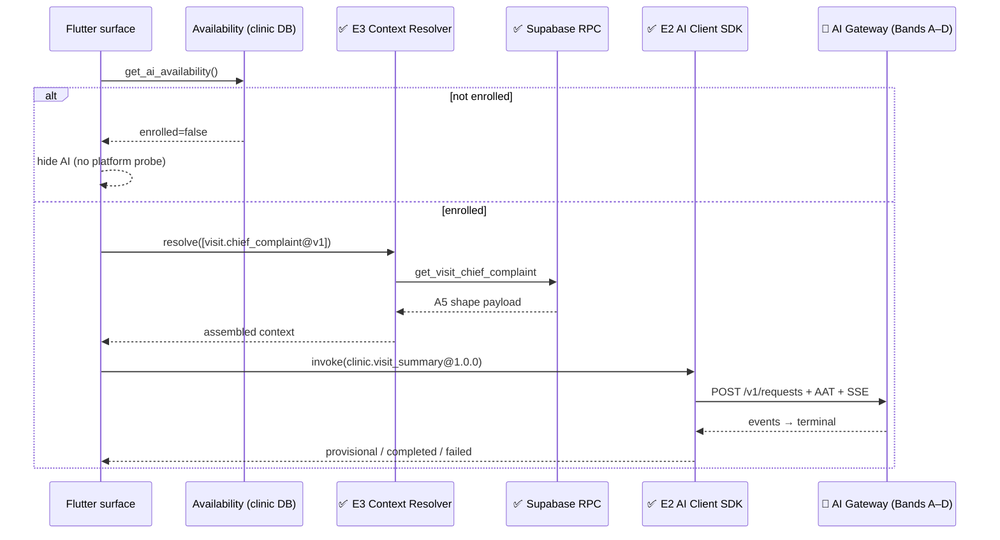
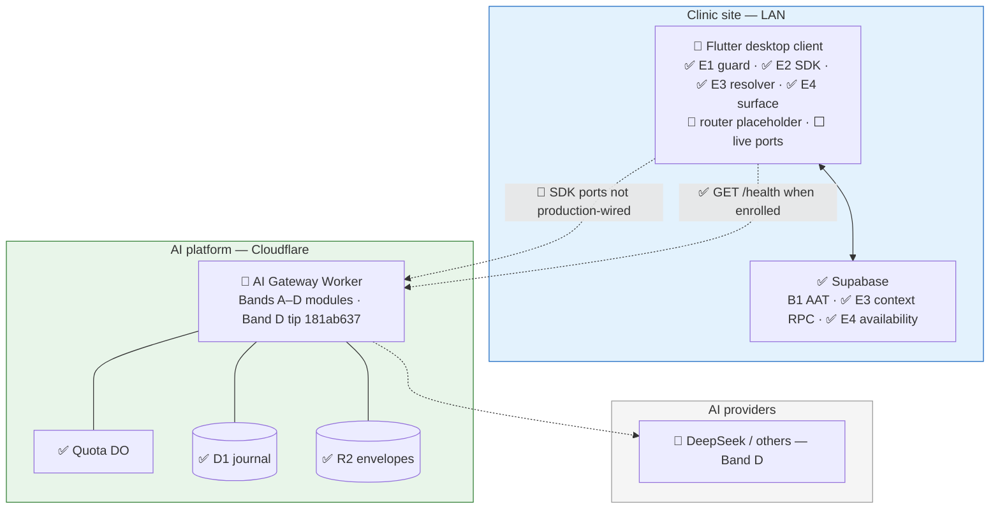
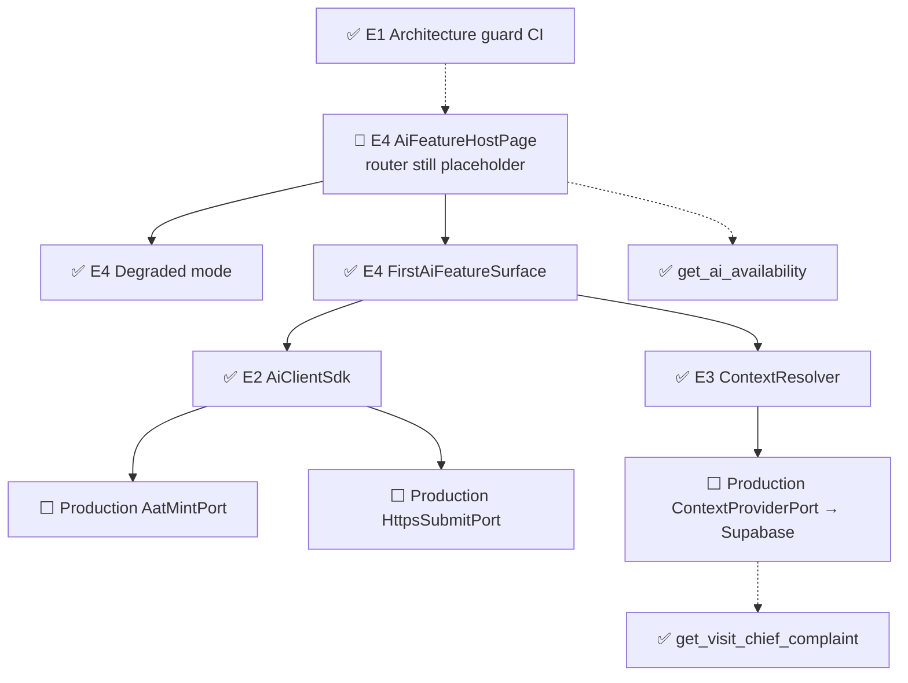

# AI Platform — Band E Implementation Reference

- Purpose: Explain, in plain language, what Band E of the AI platform delivery plan has actually built — for someone who does not know the project or its technologies yet, especially readers who already used [`17c-band-a-implementation-reference.md`](17c-band-a-implementation-reference.md), [`17d-band-b-implementation-reference.md`](17d-band-b-implementation-reference.md), and [`17e-band-c-implementation-reference.md`](17e-band-c-implementation-reference.md).
- Read this when: onboarding after Bands A–D, reviewing Flutter AI client work, or preparing for Band F / CP3 composition.
- Canonical for: Band E completion status, where to find the code and tests across `frontend/` and `backend/`, and which client-side architecture boxes are now green.
- Usually paired with: [`17c`](17c-band-a-implementation-reference.md)–[`17e`](17e-band-c-implementation-reference.md) (platform bands A–C), upcoming [`17g-band-d-implementation-reference.md`](17g-band-d-implementation-reference.md) (Band D tip `181ab637`), [`17b-ai-platform-delivery-plan.md`](17b-ai-platform-delivery-plan.md) (slice definitions), [`17-ai-platform.md`](17-ai-platform.md) (full architecture).
- Not covered here: Worker prompt/provider/stream internals (Band D), acceptance recording into clinical records (Band F2), or conversational surfaces (Band H).

> **Status:** Band E (slices **E1–E4**) is **complete** on the Band E tip (`b41e3894`, 2026-08-02, "Phase 4 Implementation") — **before** later review-comment remediation commits. Automated evidence: **55 Flutter AI tests** (28 E2 + 6 E3 + 21 E4) all passing, **4** E3 SQL cases in the trust suite all passing, and **E1** architecture-guard CI checks proven locally (3 expect-fail fixtures + clean-tree `--assert-coverage`). The transport SDK, Context Resolver, first context RPC, availability flag, and first feature surface **exist and are tested with fakes**; production adapters for AAT mint / HTTPS SSE submit / Supabase context fetch are **not wired into app bootstrap**, and the `/ai/feature-host` router entry is still a **placeholder** (does not mount `AiFeatureHostPage`). **No `ai-platform/` code was added by E1–E4** — the client consumes frozen Worker contracts (A6 SSE, A2 taxonomy, C1 capability identity) without changing the gateway.

---

## Table of Contents

1. [The One-Paragraph Summary](#1-the-one-paragraph-summary)
2. [Background for New Readers](#2-background-for-new-readers)
3. [What Band E Is and Why It Exists](#3-what-band-e-is-and-why-it-exists)
4. [Technologies in Plain Language](#4-technologies-in-plain-language)
5. [What Was Built — Slice by Slice](#5-what-was-built--slice-by-slice)
6. [Architecture Diagrams — What Is Finished](#6-architecture-diagrams--what-is-finished)
7. [Frozen Contracts at a Glance](#7-frozen-contracts-at-a-glance)
8. [How Testing Was Carried Out](#8-how-testing-was-carried-out)
9. [Repository Map](#9-repository-map)
10. [What Band E Does Not Do Yet](#10-what-band-e-does-not-do-yet)
11. [What Band E Unlocks Next](#11-what-band-e-unlocks-next)
12. [Where to Read More](#12-where-to-read-more)

---

## 1. The One-Paragraph Summary

Band E wires the **Flutter desktop clinic app** to the AI platform **without leaking prompts, providers, or model names into client code**. It installs an **architecture guard in CI** (R-12) that fails the build on forbidden AI internals; adds a **transport-only AI Client SDK** (AAT cache/remint, stable idempotency, SSE consumption, cancel, last request reference, no retry after terminal errors); adds a **Context Resolver** that assembles clinic data from a key list (never a capability id) plus the first ordinary Supabase context RPC for `visit.chief_complaint@v1`; and ships the **first AI feature surface** for `clinic.visit_summary` with provisional-draft UX, accept/discard under `advisory_display`, request-reference-on-failure, and first-class degraded modes driven by an **AI availability flag**. Everything is covered by automated tests with injectable fakes. End-to-end CP3 (one button through a live Worker stream) still needs production port wiring plus Band D's live inference path on `POST /v1/requests`.

---

## 2. Background for New Readers

### 2.1 Start with Bands A–D

If earlier bands are new to you, read in order:

| Band | Doc | What it delivered |
| --- | --- | --- |
| **Band A** | [`17c`](17c-band-a-implementation-reference.md) | Worker shell, frozen error/capability/context contracts, SSE framing |
| **Band B** | [`17d`](17d-band-b-implementation-reference.md) | AAT minting (clinic), guard stages, quota/admission DO |
| **Band C** | [`17e`](17e-band-c-implementation-reference.md) | Capability resolve, context validate, journal + GET request |
| **Band D** | upcoming [`17g`](17g-band-d-implementation-reference.md) (tip `181ab637`) | Prompt compose, providers, retry/fallback, stream broker |

Band E **consumes** those platform contracts from the Flutter side. It does not rewrite frozen Worker wire shapes.

### 2.2 The three problems Band E solves

1. **Client leakage** — Prevent prompts, provider names, and model ids from entering Flutter sources (R-12 / E1).
2. **Safe transport** — Talk to the platform with AAT, idempotency, and SSE rules without interpreting model output (E2).
3. **Clinic data + UX** — Assemble context from Supabase under RLS; show drafts as provisional; degrade honestly when AI is off or unreachable (E3–E4).

### 2.3 Daily request flow (client side)

1. Host reads `get_ai_availability()` — if not enrolled, hide AI with **zero** platform network calls.
2. If enrolled, optionally probe `{platform_base_url}/health`.
3. Context Resolver resolves manifest-declared keys (today: `visit.chief_complaint@v1`) via clinic RPCs.
4. SDK mints/caches AAT, submits `POST /v1/requests` with capability pin + context + idempotency key, consumes SSE.
5. Surface shows provisional prose while streaming; on `completed`, shows terminal payload and Accept/Discard; on failure, shows request reference.

**Today:** steps 3–5 work in **widget/unit tests with fakes**. Production mint/submit/context adapters and live router mounting are still open (see §10).

### 2.4 Where the code lives

Band E spans **two** repository areas (by design) and **consumes** a third:

| Area | Slices | Role |
| --- | --- | --- |
| **`frontend/`** | E1–E4 | Architecture guard, SDK, resolver, feature surface, degraded UI |
| **`backend/`** | E3, E4 | `get_visit_chief_complaint`, `get_ai_availability` (+ settings seed) |
| **`ai-platform/`** | — | **No Band E edits** — client uses A6/A2/C1 contracts already frozen |

### 2.5 How Band E landed in git

Work was integrated as four Spec Kit feature branches mapping one-to-one to slices. This document describes the **Band E tip** at `b41e3894` only:

| Slice | Branch | Final commit | Date |
| --- | --- | --- | --- |
| **E1** | `ai/035-e1-client-arch-guard-ci` | `a9d72145` | 2026-08-02 |
| **E2** | `ai/036-e2-ai-client-sdk` | `d225ad3f` | 2026-08-02 |
| **E3** | `ai/037-e3-context-resolver-registry` | `2b8e9816` | 2026-08-02 |
| **E4** | `ai/038-e4-first-ai-feature-surface` | `b41e3894` | 2026-08-02 |

Spec Kit directories: `specs/035` … `specs/038`.

---

## 3. What Band E Is and Why It Exists

The delivery plan titles Band E **"Client integration"** (`17b` §3.6).

| ID | Slice | Spec directory | Needs | One-line purpose |
| --- | --- | --- | --- | --- |
| **E1** | Client architecture guard in CI | `specs/035-client-arch-guard-ci/` | — | CI lint fails on prompt/provider/model strings (R-12) |
| **E2** | AI Client SDK | `specs/036-ai-client-sdk/` | E1, A6, C1 | Transport SDK: AAT, idempotency, SSE, cancel, no terminal retry |
| **E3** | Context Resolver + first RPC + contract test | `specs/037-context-resolver-registry/` | E2, C1 | Key-list registry; first context RPC; manifest key coverage test |
| **E4** | First AI feature surface + degraded mode | `specs/038-first-ai-feature-surface/` | E2, E3 | Provisional draft UX, availability flag, degraded states |

**Dependency chain:** `E1 → E2 → E3 → E4` (E1 must land before any client AI code — DP-6). The rest of Band E may proceed in parallel with Band D once C1 exists. **E4 + D4** together are the CP3 falsification thread.

### 3.1 Band E vs earlier bands

| Concern | A–C (platform) | Band D | Band E |
| --- | --- | --- | --- |
| Worker HTTP / SSE framing | ✅ A6 | consumes / extends | E2 consumes wire events |
| AAT mint (clinic) | ✅ B1 | — | E2 calls via `AatMintPort` |
| Capability resolve / discovery | ✅ C1 modules | — | E2/E3 consume capability id + version; contract suite uses manifests |
| Context validate (platform) | ✅ C2 | — | E3 assembles client payload; C2 still validates on Worker |
| Prompt / provider / stream | — | ✅ Band D | client never sees prompts |
| **R-12 client lint** | — | — | ✅ E1 |
| **Flutter AI transport SDK** | — | — | ✅ E2 |
| **Context Resolver + first RPC** | — | — | ✅ E3 |
| **First feature surface + degraded UX** | — | — | ✅ E4 (tested; router placeholder) |
| Clinical accept write (F2) | — | — | ⬜ Band F2 (`advisory_display` only today) |

**Legend:** ✅ implemented & tested | 🔶 partial (exists but not production-wired) | ⬜ not built

---

## 4. Technologies in Plain Language

Bands A–D already introduced the Worker, D1, R2, AATs, manifests, and SSE. Band E adds client-side and clinic-DB concepts:

| Term | What it means | How Band E uses it |
| --- | --- | --- |
| **R-12 architecture guard** | CI lint over Flutter sources | E1 scans `lib/` + `test/` for prompt-like strings, provider names, model ids |
| **AI Client SDK** | Transport-only Flutter library | E2 — never interprets model output; only moves bytes and events |
| **AAT** | Short-lived AI Access Token (Band B1) | Cached; reminted **once** on `unauthenticated` |
| **Idempotency key** | Stable key for one logical invoke | Generated once per `invoke()`; reused across transport retries |
| **SSE event stream** | Server-sent events from A6 | Relayed as typed Dart events until one terminal state |
| **Taxonomy code** | Closed platform error set (A2 via A6) | Mapped in `taxonomy.dart`; unknown → `internal_error` |
| **Context key** | e.g. `visit.chief_complaint@v1` | Declared in manifests (C1); resolved by E3 registry |
| **Context Resolver** | Key list → assembled payload | No capability id; screen-scoped cache; dispose clears cache |
| **Context provider RPC** | Ordinary Supabase read under RLS | `get_visit_chief_complaint` — no AI parameters |
| **AI availability flag** | Clinic setting `{ enrolled, platform_base_url }` | Non-enrolled hides AI without probing the platform |
| **Provisional prose** | Streaming draft UI | Visually draft; no Accept until terminal `completed` |
| **Degraded mode** | First-class AI-off / limited states | Banners, not error dialogs; clinical work stays available |
| **`advisory_display`** | Acceptance mode: show draft, no clinical write | E4 Accept acknowledges in UI only — F2 not required for CP3 |

---

## 5. What Was Built — Slice by Slice

### 5.1 E1 — Client architecture guard in CI

**In simple terms:** Fail the Flutter CI job if anyone pastes prompts, provider brand names, or model identifiers into client Dart code — proven with fixtures that are *supposed* to fail.

**What was implemented:**

- Standalone Dart tool: `frontend/tool/architecture_guard/architecture_guard.dart`.
- Scans configured roots for three **representative** pattern categories (not an exhaustive catalogue):
  - Prompt-like strings (`You are a helpful assistant`, `system prompt`, `"role": "system"`, …)
  - Provider names (`openai`, `anthropic`, `gemini`, `cohere`, `mistral`)
  - Model identifiers (`gpt-\d`, `claude-\d`, `gemini-\d`, `o\d-\w+`)
- Default scan roots: `lib/` + `test/`. `--assert-coverage` verifies every `.dart` under those roots is covered by a scan root.
- Three expect-fail fixtures under `tool/architecture_guard/fixtures/`.
- CI step in `.github/workflows/ci.yml` (`frontend-quality` job): run each fixture (expect non-zero), then clean-tree `--assert-coverage` (expect zero).

**Key files:**

| Path | Role |
| --- | --- |
| `frontend/tool/architecture_guard/architecture_guard.dart` | Guard implementation |
| `frontend/tool/architecture_guard/fixtures/*/forbidden.dart` | Deliberately dirty proofs |
| `.github/workflows/ci.yml` | CI wiring (PowerShell step) |
| `specs/035-client-arch-guard-ci/quickstart.md` | How to run locally |

**Not included:** Runtime enforcement inside the app. Exhaustive catalogues of every possible provider/model string. Scanning of non-Dart assets.

---

### 5.2 E2 — AI Client SDK

**In simple terms:** A small Flutter library that gets a token, submits a capability request, follows the SSE stream to a terminal outcome, and can cancel — without knowing anything about prompts or models.

**What was implemented:**

| Piece | Path | Behaviour |
| --- | --- | --- |
| SDK core | `frontend/lib/core/ai/ai_client_sdk.dart` | `invoke()` → `AiInvokeSession`; AAT cache; remint once; stable idempotency/trace factories |
| Ports | `ports.dart` | `AatMintPort`, `HttpsSubmitPort`, `SseConnection`, header/input types |
| SSE types | `sse_events.dart` | A6 event kinds + `TerminalState` sealed outcomes |
| Taxonomy | `taxonomy.dart` | Closed enum, wire map, `classifyTaxonomyCode`, `terminalNoRetryCodes` |

**Rules enforced in code/tests:**

- Remint **once** on `unauthenticated`; no remint loop.
- Idempotency key stable across transport retries of the same `invoke()`.
- Consume stream to exactly one terminal; cancel closes the connection → `CancelledTerminal`.
- After a terminal platform error: **no automatic retry** (17 parameterized cases over `terminalNoRetryCodes`).
- Unknown wire codes → `internal_error`.
- `lastRequestReference` retained from accepted/failed events or HTTP exceptions.
- Transport failures (`TransportFailure`) may retry (loop has **no** coded ceiling — see §10).

**Key files:**

| Path | Role |
| --- | --- |
| `frontend/lib/core/ai/ai_client_sdk.dart` | Public SDK |
| `frontend/test/unit/core/ai/ai_client_sdk_test.dart` | 28 tests (`sdk_*`) |
| `frontend/test/unit/core/ai/fakes.dart` | In-memory mint/submit/SSE fakes |
| `specs/036-ai-client-sdk/` | Spec / plan / quickstart |

**Not included:** Production `AatMintPort` calling `issue_ai_token`, or production `HttpsSubmitPort` opening a real SSE connection to the Worker. Those ports are injectable; tests supply fakes.

---

### 5.3 E3 — Context Resolver registry, first context RPC, contract test

**In simple terms:** Given a list of context keys from a capability manifest, fetch each key's clinic data through an ordinary RPC, assemble one payload, and fail loudly if a key has no resolver.

**What was implemented:**

**Flutter:**

- `ContextResolver.resolve(List<String> keys)` — success map or typed `unknown_context_key` failure; per-instance cache; `dispose()` clears.
- Static registration map with first key: `visit.chief_complaint@v1` → `port.fetchVisitChiefComplaint()`.
- `ContextProviderPort` abstraction (no Supabase adapter in `frontend/lib` yet).
- Contract suite: every key in active (fake) manifests must be registered; unknown key fails the suite.

**Backend:**

- Migration `20260802120000_context_provider_chief_complaint.sql`:
  - `auth_internal.get_visit_chief_complaint(uuid)` (SECURITY DEFINER, visit branch scope + clinical access)
  - `public.get_visit_chief_complaint(uuid)` (SECURITY INVOKER wrapper, `GRANT` to `authenticated`)
- Returns A5 shape via `rpc_result`: `{ visit_id, complaint?, recorded_at? }`.
- SQL tests `backend/tests/context_provider_rpc.sql` (E3-T05–E3-T08), included in `run_ai_platform_trust_tests.sh`.

**Frozen contracts:** `specs/037-.../contracts/context-resolver.md`, `context-provider-rpc.md`.

**Key files:**

| Path | Role |
| --- | --- |
| `frontend/lib/core/ai/context_resolver.dart` | Resolver API |
| `frontend/lib/core/ai/context_registration.dart` | Key → resolver map |
| `frontend/lib/core/ai/context_provider_port.dart` | Clinic-read port |
| `frontend/test/unit/core/ai/context_resolver_test.dart` | E3-T01–T04 (4) |
| `frontend/test/unit/core/ai/context_contract_test.dart` | E3-T09–T10 (2) |
| `backend/supabase/migrations/20260802120000_context_provider_chief_complaint.sql` | First RPC |
| `backend/tests/context_provider_rpc.sql` | E3-T05–T08 |

**Not included:** Live C1 discovery fetch inside the Flutter contract suite (uses `FakeActiveManifestSource`). Production Supabase implementation of `ContextProviderPort`. Additional context keys beyond chief complaint.

---

### 5.4 E4 — First AI feature surface and degraded mode

**In simple terms:** A standalone screen that can draft a visit summary as visibly provisional text, let the user accept or discard after success, show the request reference on failure, and hide or soften AI when the clinic is not enrolled or the platform is down.

**What was implemented:**

| Module | Path | Role |
| --- | --- | --- |
| Availability | `features/ai/availability/` | Model + `SupabaseAiAvailabilityReader` + `HttpPlatformReachabilityPort` |
| Degraded | `features/ai/degraded/` | `AiDegradedMode` + `resolveDegradedMode()` + banner UI |
| Surface | `features/ai/surface/` | Provisional prose, request reference, `FirstAiFeatureSurface` |
| Host | `features/ai/host/ai_feature_host_page.dart` | Availability gate + surface composition |
| Routes | `app_routes.dart` / `router.dart` | `/ai/feature-host` **registered**; builder is a **placeholder Scaffold** |

**First capability constants:**

- Id: `clinic.visit_summary` @ `1.0.0`
- Intent: `generate`
- Context: resolve `visit.chief_complaint@v1`, merge with `visit_id`
- Acceptance: `advisory_display` (Accept shows acknowledgment text; no clinical write)

**Degraded modes:** `nonEnrolled`, `unreachable`, `quotaExhausted`, `aiUnavailable`, `installationSuspended`, `forbiddenCapability`, `ready`.

**Backend:** Migration `20260802140000_ai_availability_flag.sql` seeds `ai_internal.app_settings` key `ai.availability` and exposes `public.get_ai_availability()`.

**Frozen contract:** `specs/038-.../contracts/ai-availability-flag.md`.

**Not included:** Mounting `AiFeatureHostPage` in the real router builder; app-wide DI that constructs SDK + resolver with live ports; embedding the surface inside visit clinical screens; F2 acceptance recording.

---

### 5.5 End-to-end stories in plain language

#### Walkthrough A — Architecture guard catches a leak (E1 — **live in CI**)

1. A PR adds a Dart string containing `openai` or `gpt-4o` under `frontend/lib/` or `test/`.
2. CI runs the architecture guard on clean roots → non-zero exit → job fails.
3. Fixtures under `tool/architecture_guard/fixtures/` prove each category is detected.

#### Walkthrough B — SDK invoke with fakes (E2 — **tested**)

1. Test supplies fake mint + submit ports.
2. `AiClientSdk.invoke(...)` acquires AAT, submits with headers, returns session.
3. Session relays SSE events; `terminal` completes once; cancel closes the stream.

#### Walkthrough C — Resolve chief complaint (E3 — **Flutter fakes + live SQL**)

1. Resolver receives `['visit.chief_complaint@v1']`.
2. Registered function calls `ContextProviderPort.fetchVisitChiefComplaint()`.
3. On the database side, `get_visit_chief_complaint` returns the A5 shape under RLS (SQL suite).

#### Walkthrough D — First surface happy path (E4 — **widget tests**)

1. Host reads availability → enrolled + reachable → `ready`.
2. Surface resolves context, invokes SDK, streams provisional prose.
3. On `completed`, terminal text replaces provisional; Accept/Discard appear.
4. Accept → advisory acknowledgment; Discard → clears UI.

#### Walkthrough E — Non-enrolled clinic (E4 — **widget tests**)

1. Availability says `enrolled: false`.
2. Host shows non-enrolled degraded banner; **no** platform `/health` or submit calls.
3. Clinical workflows remain available.

#### Walkthrough F — Production app navigation (**not live yet**)

1. Dev navigates to `/ai/feature-host`.
2. **Today:** placeholder text *"AI feature host route is registered for CP3 composition."*
3. `AiFeatureHostPage` is exercised only via widget-test harness injection.



---

## 6. Architecture Diagrams — What Is Finished

**Legend:** ✅ implemented & tested | 🔶 partial | ⬜ not built

### 6.1 System context — client joins the platform



### 6.2 Client stack after Band E



### 6.3 Pipeline stages — client touchpoints

| Stage / concern | Owner | Band E status |
| --- | --- | --- |
| R-12 client source hygiene | E1 | ✅ in CI |
| AAT acquire / remint | E2 (+ B1 RPC) | ✅ SDK logic; ⬜ live mint adapter |
| Context assembly | E3 | ✅ resolver + ✅ RPC; ⬜ Flutter→RPC adapter |
| Submit + SSE consume | E2 (+ A6/D) | ✅ SDK logic; ⬜ live HTTPS/SSE adapter |
| Provisional / terminal UI | E4 | ✅ widget-tested |
| Degraded / availability | E4 | ✅ reader + modes; 🔶 host not on real route |
| Clinical accept write | F2 | ⬜ (`advisory_display` only) |

### 6.4 Stores and settings after Band E

| Store | Status | What changed in Band E |
| --- | --- | --- |
| `ai_internal.app_settings` / `ai.availability` | ✅ E4 | Seeded default `{ enrolled: false, platform_base_url: null }` |
| Visit clinical notes (existing) | ✅ E3 read | Ordinary read via `get_visit_chief_complaint` |
| Flutter in-memory resolver cache | ✅ E3 | Screen-scoped; discarded on `dispose()` |
| Platform D1 / R2 | unchanged by E | Client may later call GET request ref (C3) — not wired in E4 surface |

---

## 7. Frozen Contracts at a Glance

Band E froze new **client/clinic** contracts. Later slices may **extend** (more keys, more surfaces) but not **rewrite** these shapes (`17b` §2.3).

### 7.1 Architecture guard categories (E1)

| Category | Effect |
| --- | --- |
| Prompt-like strings | Build fail |
| Provider names | Build fail |
| Model identifiers | Build fail |
| Clean tree + coverage | Build must pass `--assert-coverage` |

### 7.2 SDK transport behaviour (E2)

| Rule | Contract |
| --- | --- |
| AAT | Cache; remint **once** on `unauthenticated` |
| Idempotency | Stable for one `invoke()` across transport retries |
| Terminal errors | No automatic retry (`terminalNoRetryCodes`) |
| Unknown codes | → `internal_error` |
| Cancel | Close SSE connection |
| Request reference | Retained on SDK for support |

### 7.3 Context Resolver (E3)

| Outcome | Shape |
| --- | --- |
| Success | Map keyed exactly by requested keys |
| Unknown key | `{ code: 'unknown_context_key', unknownKey }` — no partial success |
| Capability id | **Forbidden** on the public API |
| Cache | Screen-scoped; cleared on `dispose()` |

First key shape (`visit.chief_complaint@v1`): `{ visit_id, complaint?, recorded_at? }` — owned by A5; E3 does not redefine field semantics.

### 7.4 AI availability flag (E4)

```json
{
  "enrolled": false,
  "platform_base_url": null
}
```

| Rule | Effect |
| --- | --- |
| `enrolled: false` | Hide AI affordances; **no** platform network probe |
| `enrolled: true` | May probe `{platform_base_url}/health` |
| Storage | `ai_internal.app_settings` key `ai.availability` |
| Read RPC | `public.get_ai_availability()` → `authenticated` |

Full tables: `specs/037-.../contracts/*.md`, `specs/038-.../contracts/ai-availability-flag.md`.

---

## 8. How Testing Was Carried Out

### 8.1 The completion rule

Same as earlier bands: **a slice is done when a test a human can read and believe passes.** Band E evidence is split across Flutter unit/widget tests, a Dart CI tool, and Supabase SQL scripts.

### 8.2 Verified counts at tip `b41e3894`

| Slice | Layer | Evidence | Count | Result at tip |
| --- | --- | --- | --- | --- |
| **E1** | CI tool | 3 expect-fail fixtures + clean `--assert-coverage` | 4 scenarios | ✅ verified locally |
| **E2** | Flutter unit | `test/unit/core/ai/ai_client_sdk_test.dart` | **28** | ✅ all passed |
| **E3** | Flutter unit | `context_resolver_test.dart` + `context_contract_test.dart` | **6** | ✅ all passed |
| **E3** | SQL | `backend/tests/context_provider_rpc.sql` (via trust suite) | **4** | ✅ all passed |
| **E4** | Flutter widget | `first_ai_feature_surface_test.dart` + `ai_degraded_mode_test.dart` | **21** | ✅ all passed |

**Flutter AI total: 55 tests** (28 + 6 + 21). **SQL: 4.** **E1: CI harness (not counted in Flutter total).**

### 8.3 Test layers by slice (`17b` §3.11.3 style)

| Slice | Named cases | File(s) |
| --- | --- | --- |
| **E1** | Spec T1–T5 | Guard tool + CI step (no dedicated `*_test.dart`) |
| **E2** | `sdk_*` T1–T28 | `ai_client_sdk_test.dart` |
| **E3** | E3-T01–T10 | Flutter unit (T01–T04, T09–T10) + SQL (T05–T08) |
| **E4** | T1–T21 | 13 surface + 8 degraded/flag widget tests |

### 8.4 Spy / invariant highlights

- E1 fixtures must fail; clean tree must pass with full path coverage.
- E2: no remint loop; no retry after terminal taxonomy; idempotency stable; SDK sources pass E1 patterns.
- E3: unknown key typed failure; no capability id in resolver API; cache discarded on dispose; RPC shape matches A5; RLS denies out-of-scope.
- E4: no commit controls before `completed`; terminal payload wins over chunk assembly; request reference on failure; provisional does not survive rebuild/restart; non-enrolled → zero platform calls; unreachable is a normal banner, not an error dialog.

### 8.5 Slice-only commands

```bash
# E1
cd frontend
dart tool/architecture_guard/architecture_guard.dart tool/architecture_guard/fixtures/prompt_like_string/
dart tool/architecture_guard/architecture_guard.dart tool/architecture_guard/fixtures/provider_name/
dart tool/architecture_guard/architecture_guard.dart tool/architecture_guard/fixtures/model_identifier/
dart tool/architecture_guard/architecture_guard.dart --assert-coverage

# E2 + E3 Flutter
flutter test test/unit/core/ai/

# E3 SQL (local Supabase)
bash backend/tests/run_ai_platform_trust_tests.sh

# E4
flutter test test/widget/ai/
```

### 8.6 Testing gaps (honest inventory)

| Gap | Detail |
| --- | --- |
| **No live HTTPS/SSE integration test** | SDK tested with in-memory fakes only |
| **Contract suite uses fake manifests** | Does not call live C1 discovery HTTP |
| **No Flutter→RPC adapter test** | SQL proves RPC; Flutter port is fake in unit/widget tests |
| **Persistence/export probes** | Accepted by surface API; not invoked by production surface code — tests assert zero probe calls |
| **Host taxonomy degraded modes** | `installation_suspended` / `forbidden_capability` injected via test `terminalFailureCode`, not from live SDK outcomes in the host |
| **Router placeholder** | Navigating `/ai/feature-host` in a real build does not mount `AiFeatureHostPage` |
| **Transport retry ceiling** | `TransportFailure` retries in `while (true)` with no max attempts |

---

## 9. Repository Map

```
frontend/
├── tool/architecture_guard/
│   ├── architecture_guard.dart          # E1 R-12 lint
│   └── fixtures/{prompt_like_string,provider_name,model_identifier}/
├── lib/core/ai/
│   ├── ai_client_sdk.dart               # E2 transport SDK
│   ├── ports.dart                       # E2 injectable ports
│   ├── sse_events.dart                  # E2 A6 event types
│   ├── taxonomy.dart                    # E2 error taxonomy map
│   ├── context_resolver.dart            # E3 resolver
│   ├── context_registration.dart        # E3 key → resolver map
│   └── context_provider_port.dart       # E3 clinic-read port
├── lib/features/ai/
│   ├── availability/                    # E4 flag reader + reachability
│   ├── degraded/                        # E4 degraded modes + banners
│   ├── surface/                         # E4 provisional + first surface
│   └── host/ai_feature_host_page.dart   # E4 composition host
├── lib/app/app_routes.dart              # aiFeatureHost constant
├── lib/app/router.dart                  # route registered (placeholder body)
└── test/
    ├── unit/core/ai/                    # E2 + E3 Flutter suites
    └── widget/ai/                       # E4 widget suites

backend/
├── supabase/migrations/
│   ├── 20260802120000_context_provider_chief_complaint.sql   # E3
│   └── 20260802140000_ai_availability_flag.sql               # E4
└── tests/
    ├── context_provider_rpc.sql         # E3-T05–T08
    └── run_ai_platform_trust_tests.sh   # includes E3 SQL

.ai-platform/                            # unchanged by E1–E4 (consumed only)

.github/workflows/ci.yml                 # E1 guard step in frontend-quality

specs/
├── 035-client-arch-guard-ci/
├── 036-ai-client-sdk/
├── 037-context-resolver-registry/
│   └── contracts/{context-resolver,context-provider-rpc}.md
└── 038-first-ai-feature-surface/
    └── contracts/ai-availability-flag.md
```

---

## 10. What Band E Does Not Do Yet

### 10.1 Production wiring and user-visible gaps

| Capability | Status after Band E tip |
| --- | --- |
| Live `AatMintPort` → `issue_ai_token` | **Not in `frontend/lib`** |
| Live `HttpsSubmitPort` → Worker SSE | **Not in `frontend/lib`** |
| Live `ContextProviderPort` → `get_visit_chief_complaint` | **Port only; no Supabase adapter** |
| Router mounts `AiFeatureHostPage` | **Placeholder Scaffold** |
| Surface embedded in visit clinical UI | **Standalone host by design (Clarification Q2); not product nav** |
| CP3 one-button live thread | Needs E4 wiring + Band D live path on POST |
| Clinical field write on Accept | Band F2 (`advisory_display` only) |
| `context_required` auto-heal | Band J2 |
| Additional context keys | Later features extend E3 registration map |

### 10.2 Implementation gaps inside Band E scope

| Gap | Detail |
| --- | --- |
| **App bootstrap / DI** | No composition root that builds real SDK + host dependencies |
| **Transport retry bound** | Infinite retry loop on `TransportFailure` |
| **Host vs surface failure bridging** | Some degraded taxonomy states only via test injection on the host |
| **Provisional chunk handling** | Surface replaces provisional text with each chunk event (fine for tests; multi-delta accumulation UX not productized) |
| **Live discovery in contract suite** | Fake manifests, not Worker discovery HTTP |

### 10.3 What Band E consumes from A–D

| Prior slice | How Band E uses it |
| --- | --- |
| **A2 / A6** | Taxonomy codes + SSE event kinds in SDK |
| **A5** | Context key shapes for chief complaint |
| **B1** | AAT mint RPC (via future port) |
| **C1** | Capability id/version identity; manifest keys for contract suite |
| **C2 / C3** | Platform still validates context and journals — client does not reimplement |
| **Band D** (`181ab637`) | Needed for real streamed drafts on POST; E4 UI is ready to consume when ports point at a live Worker |

---

## 11. What Band E Unlocks Next

Band E is not itself a release gate (`17b` DP-1), but it removes client blockers:

| Next work | Why E1–E4 matter |
| --- | --- |
| **CP3** | E4 surface + D4 stream path = falsification thread once ports and router are wired |
| **Band F2** | Acceptance recording needs a Feature Surface that can Accept; E4 proves `advisory_display` UX first |
| **Band F4 / soft degrade** | Client already has first-class degraded banners to map onto quota soft thresholds |
| **More capabilities** | Extend E3 registration + add surfaces; E1 keeps R-12 pressure on every PR |
| **Band H / J** | Conversational and self-heal flows reuse SDK + resolver contracts |

### 11.1 Checkpoint CP3 (not satisfied yet)

**CP3** (`17b` §5) is: one Flutter button through guard, composed prompt, provider (or fake), stream, and rendered draft (**D4 + E4**).

Band E satisfies the **client half** at component level:

- Guard, SDK, resolver, surface, and degraded modes are implemented and tested.
- First capability constants and provisional UX rules are frozen in code.

What remains for **CP3**:

- Production mint/submit/context adapters and DI.
- Mount `AiFeatureHostPage` (or embed the surface) on a real route.
- Live Band D path on `POST /v1/requests` (see upcoming [`17g`](17g-band-d-implementation-reference.md), tip `181ab637`).

Band E alone does **not** satisfy CP3.

---

## 12. Where to Read More

| Document | Use when |
| --- | --- |
| [`17c-band-a-implementation-reference.md`](17c-band-a-implementation-reference.md) | Band A contracts / SSE baseline |
| [`17d-band-b-implementation-reference.md`](17d-band-b-implementation-reference.md) | AAT minting and trust |
| [`17e-band-c-implementation-reference.md`](17e-band-c-implementation-reference.md) | Capability resolve, context validate, journal |
| [`17g-band-d-implementation-reference.md`](17g-band-d-implementation-reference.md) | Band D inference path (upcoming; tip `181ab637`) |
| [`17b-ai-platform-delivery-plan.md`](17b-ai-platform-delivery-plan.md) | §3.6 Band E slice definitions, CP3 |
| [`17-ai-platform.md`](17-ai-platform.md) | §4.1 Feature Surfaces, §4.2 availability, §5.4 taxonomy, §6.4 provisional prose, R-12 |
| `specs/035` … `specs/038` quickstarts | Run one slice's checks |

**Run tests:**

```bash
cd frontend
dart tool/architecture_guard/architecture_guard.dart --assert-coverage
flutter test test/unit/core/ai/
flutter test test/widget/ai/

bash backend/tests/run_ai_platform_trust_tests.sh
```

---

*This document describes Band E as implemented at tip `b41e3894` (2026-08-02), before review-comment remediation. For Bands A–C see [`17c`](17c-band-a-implementation-reference.md)–[`17e`](17e-band-c-implementation-reference.md). Band D tip `181ab637` is covered by upcoming [`17g`](17g-band-d-implementation-reference.md). Do not rewrite frozen contract sections without an architecture amendment.*
