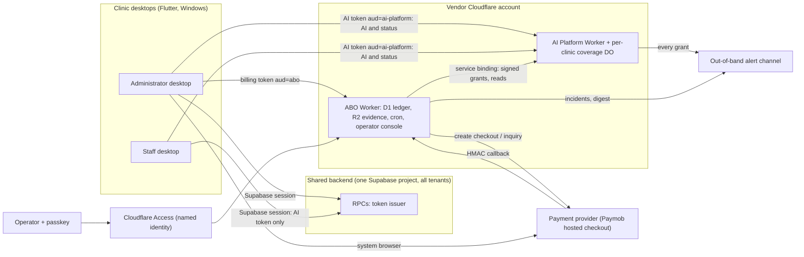

# AI Billing Orchestrator — Design Decisions (Phase 1)

**Status:** Decision memo for approval. **Date:** 2026-10-01. **Inputs:** [00 seed](00-abo-requirements-seed.md), constitution v2.0.0, and the code in `ai-platform/`, `backend/supabase/`, `frontend/` (cited as file:line; the code wins over docs).

## Table of Contents

1. [Shape of the solution](#1-shape-of-the-solution)
2. [Code facts that change the problem](#2-code-facts-that-change-the-problem)
3. [Decisions](#3-decisions)
4. [Seed interpretations and Assumed items to change](#4-seed-interpretations-and-assumed-items-to-change)
5. [Expansion seams](#5-expansion-seams)
6. [Rejected for simplicity](#6-rejected-for-simplicity)
7. [Risks and spikes](#7-risks-and-spikes)

---

## 1. Shape of the solution

The ABO is one new Cloudflare Worker with its own D1 and R2. It owns offers, checkouts, payments, reversals and complimentary-grant requests, and it talks to Paymob only through a provider-neutral port. The AI Platform's per-clinic Durable Object (DO) becomes the single authority for **coverage**: an ordered ledger of terms built only from idempotent, evidence-carrying grants. It evaluates dates, grace, allowance and exhaustion on every request, so it needs neither the ABO nor any cron to stop service on time. The shared backend keeps no billing credentials. It holds one rotatable **issuer key set** that signs short-lived, single-audience tokens: AI tokens for the platform and billing tokens for the ABO, the latter minted only for administrators. The backend **talks only to the desktops** (C-02): it makes no outbound calls, and neither vendor service calls it. Every desktop reads its clinic's AI status from the platform with its AI token; administrator desktops also call the ABO directly with a billing token (FR-61 restricts only staff). Complimentary grants additionally need a per-grant passkey (WebAuthn) signature, which the platform itself verifies. No component other than the backend can read or write the shared database.

## 2. Code facts that change the problem

| #    | Fact                                                                                                                                                        | Evidence                                                                                                                                             | Consequence                                                      |
| ---- | ----------------------------------------------------------------------------------------------------------------------------------------------------------- | ---------------------------------------------------------------------------------------------------------------------------------------------------- | ---------------------------------------------------------------- |
| T-1  | Backend is single-tenant: claims take the **first** organization; staff rows have no organization                                                           | `backend/supabase/migrations/20260611150000_remove_owner_role.sql:870-875`; `20260516100000_auth_rbac_schema.sql:116-131`                            | SR-03/SR-08 cannot hold until a tenancy retrofit exists (§7 R-1) |
| T-2  | `roles_permissions` has no tenant column and any administrator can edit it; AI token scopes come from it                                                    | `20260516100000_auth_rbac_schema.sql:163-176`; `20260611150000_remove_owner_role.sql:666-725`; `20260905120300_fix_aat_lifetime_fallback.sql:122`    | Billing authority must not depend on it (§3.1)                   |
| T-3  | One AI installation per database is enforced by trigger; the issuer picks the first one; availability flag is one global row                                | `20260801120000_ai_keystore_schema.sql:76-111`; `20260905120300_fix_aat_lifetime_fallback.sql:67-74`; `20260802140000_ai_availability_flag.sql:3-40` | Per-clinic AI state must be rebuilt per tenant                   |
| T-4  | Clinic private keys are stored as plaintext `bytea` behind deny-all RLS                                                                                     | `20260801120000_ai_keystore_schema.sql:55,113-117`                                                                                                   | Keys appear in dumps and backups; replaced in §3.1               |
| T-5  | No `owner` role exists; only `administrator`, `doctor`, `receptionist`, `lab_staff`                                                                         | `20260611150000_remove_owner_role.sql:8-30`                                                                                                          | "Owner or administrator" = `administrator` (§4)                  |
| P-11 | Concurrency denial and entitlement config miss are both reported as `quota_exhausted`                                                                       | `ai-platform/src/admission/index.ts:471-483,612-619`                                                                                                 | Breaks FR-09, FR-64, FR-65                                       |
| P-12 | Usage admitted while the DO is down is credited with 0 allowance and dropped 2 h after first sighting, while reconcile runs only on daily and monthly crons | `src/credit/index.ts:20-23,324-336`; `src/worker.ts:1720-1731`; `wrangler.toml:10`                                                                   | Breaks NFR-06 ("never lost")                                     |
| P-13 | The platform issues monthly invoices with money amounts                                                                                                     | `src/period-close/index.ts:43-94`; `migrations/20260911200000_invoice.sql:1-10`                                                                      | Breaks FR-53                                                     |
| P-14 | Purge deletes entitlement and installation rows                                                                                                             | `src/retention/index.ts:314-356`                                                                                                                     | Breaks RC-05                                                     |
| P-15 | Usage is keyed by calendar month of `period_start`; admission reserves nothing                                                                              | `src/worker.ts:290-291,619`; `src/quota-do/index.ts:401-441`                                                                                         | Breaks FR-07, NFR-06, A32, A34                                   |

P-01..P-10 are confirmed in code: P-01 (`period_end` is never compared to the clock), P-02 `src/control/entitle.ts:209-211`, P-03 `src/quota-do/index.ts:263-292`, P-04 `src/platform-vocabulary.ts:2-7` and `src/entitlement/index.ts:186-189`, P-05 `src/worker.ts:983-984`, P-06 `src/control/lifecycle.ts:30-37`, P-07 `src/control/auth.ts:16-51`, P-08 `src/config-cache/index.ts:27`, P-09 `src/worker.ts:1574-1696`, P-10 `src/identity/index.ts:298-332`. All of P-01..P-15 are closed on the platform, not worked around in the ABO.

## 3. Decisions

### 3.1 Clinic identity and trust (P-10, SR-03, SR-07, SR-09, SR-11)

| Option                                                                            | Trade-offs                                                                                                                                                                                          |
| --------------------------------------------------------------------------------- | --------------------------------------------------------------------------------------------------------------------------------------------------------------------------------------------------- |
| A. Keep per-clinic installation keys, multi-tenant, auto-rotated                  | Every key sits in one database (T-4), so there is no real blast-radius gain. Adds per-clinic expiry (A25), an enrollment flow, and a key per clinic                                                 |
| **B. One backend issuer key set; single-audience tokens carry `org` = tenant id** | One rotation (SR-11). No per-clinic expiry (P-06 gone). Reinstall-proof (C-03). A leaked issuer key can impersonate any clinic, but it cannot create service                                        |
| C. Platform and ABO verify Supabase user JWTs via JWKS                            | Simplest, but the JWT is a bearer for PostgREST for 3600 s (`backend/supabase/config.toml:161`). A compromised ABO or platform could replay it against the shared DB, which **fails SR-09 and A35** |

**Recommendation: B.**

- **The key set.** Ed25519, with at least two active `kid`s during rotation. Claims: `iss`, `org`, `sub`, `role`, `branch`, `jti`, `ver=2`. Tokens: AI (`aud=ai-platform`, ≤ 600 s); billing (`aud=abo`, ≤ 300 s, minted only when the caller's membership role is `administrator`). There is no backend-to-platform token: the backend never calls the platform (§3.4).
- **Tenant binding.** The platform maps `org` to a platform clinic id through a `tenant_binding` record; re-creating an identity makes a new binding (FR-72). `org` comes only from the backend session: the ABO and platform never take a clinic id from a request body (SR-03, SR-04, A22, A36).
- **Where roles are checked.** The ABO re-checks `role` (FR-10). Billing authority is the membership role, not an editable `roles_permissions` key (T-2).
- **Key custody.** The private key moves out of the plaintext table into Supabase Vault or an Edge Function secret (spike R-3). Public keys are registered on the platform and ABO only through a passkey-gated operator action (§3.5), each registration alerted, with an alert 30 days before key expiry (A25).
- **Removed:** per-clinic installation keys, the enrollment operations, the single-installation trigger, and the global `ai.availability` flag with its setter (FR-91).

### 3.2 Where terms, allowance and exhaustion live (FR-07, FR-21, FR-22, FR-23, FR-33, NFR-05, NFR-06)

| Option                                                                              | Trade-offs                                                                                                                                                                                                     |
| ----------------------------------------------------------------------------------- | -------------------------------------------------------------------------------------------------------------------------------------------------------------------------------------------------------------- |
| A. The ABO holds the schedule and pushes the "current entitlement" at each boundary | An ABO outage keeps a lapsed clinic active (**fails FR-23, NFR-05**). It cannot start a prepaid term on the exhausting request (A32)                                                                           |
| B. Terms in platform D1, counters in the DO                                         | Exhaustion followed by activation would need an atomic change across two stores behind a 30 s cache (P-08). Split-brain risk (**A34**)                                                                         |
| **C. The per-clinic DO is the coverage authority**                                  | One serialized writer (`blockConcurrencyWhile`, `src/quota-do/index.ts:363`) on an already SQLite-backed class (`wrangler.toml:17-19`). DO availability becomes coverage availability, so a fallback is needed |

**Recommendation: C.**

- **Grants and terms.** Grants append terms. Placement is automatic: active if there is no coverage, otherwise queued (removes `not_pending`, P-02). Queued terms store a duration, not dates. Each term snapshots its plan (capabilities, max cost class, safety limits): plans become versioned data, the tier ranking goes, and routing uses the term's cost class (P-04, P-05).
- **Every admission** evaluates the clock (end date, then grace) and **reserves** the request's quota weight. The reservation that takes the last of the allowance ends the term as `exhausted` (NFR-06) and, in the same transaction, activates the next queued term at that instant (A32). Exhaustion is recorded once (A34).
- **Dates.** UTC calendar months with end-of-month clamping. A queued term starts at its predecessor's end date or at the exhaustion instant.
- **Grace** exists only when no term is queued. It draws on the ended term's leftover allowance, capped by the grace policy (§4); exhaustion ends grace immediately.
- **Usage attribution.** Every usage record carries `term_id`, replacing YYYY-MM (P-15). Usage records live in the platform's D1 `usage_event` journal (`src/journal/index.ts:409`), not in the DO. A reservation that has not settled within 15 minutes is charged, never forgiven (NFR-06). It is charged lazily, on the next admission or the next boundary alarm, never by an alarm per reservation.
- **Distinct denial codes (P-11, FR-09, FR-64, FR-65):** `concurrency_limited` and `rate_limited` for safety limits; `allowance_exhausted`, `coverage_lapsed` and `coverage_unknown` for coverage; `suspended` for suspension.
- **Fallback when the DO is unreachable.** Admit only while the DO-published D1 mirror shows a `hard_stop_at` in the future (FR-23); at most 5 × max weight per outage; settled later into its term, never dropped (P-12).
- **Overshoot bound (A34):** at most one request weight minus one credit per term, plus the outage allowance above.
- **Events.** A DO outbox writes an append-only D1 `coverage_event` log (per-clinic sequence plus a global cursor); a DO alarm fires at the next boundary. The D1 `entitlement` row becomes a read-only mirror that never admits a request (closes P-01, P-03 and P-08 for coverage). The mirror and `coverage_event` are written only on events (a term change, exhaustion, an allowance-warning crossing), never per request.
- **DO write budget.** The DO is billed for compute only while a call runs, so its cost is set by rows written. The hot state is one row per clinic: term counters, in-flight reservations (at most 16, by the concurrency limit), and the short-lived replay and idempotency entries, swept on each write. Admission and settlement each write that one row, about 2 rows per AI request, which keeps row writes inside the included allowance below about 25 M AI requests a month. DO tables have no secondary indexes. Denial and replay paths write nothing unless the state changed (today they always write, `src/quota-do/index.ts:375-418`). `setAlarm` is called only when the next boundary moves. Outbound work (shipping the outbox to D1, and the grant alert in §3.5) runs from the outbox on an alarm, never inline on the request path.

### 3.3 From confirmed payment to coverage, and recovery (G3, FR-12, FR-16, FR-82, NFR-01..03, SR-01, SR-02)

| Option                                                                                    | Trade-offs                                                                                                                                                |
| ----------------------------------------------------------------------------------------- | --------------------------------------------------------------------------------------------------------------------------------------------------------- |
| A. Grant synchronously inside the callback handler                                        | A platform outage of 4 days outlasts any callback redelivery (**fails A4, NFR-01**)                                                                       |
| **B. D1 outbox with an inline first attempt (`waitUntil`) and a cron retry every minute** | Few parts. State is inspectable in D1. At most a minute of added latency on the retry path                                                                |
| C. Cloudflare Queues or Workflows                                                         | Queues is forbidden by the constitution. Workflows is a second durable state engine the operator cannot see (fails G8's "fewer moving parts" tie-breaker) |

**Recommendation: B.** The callback is a **trigger, not proof**.

1. Verify the HMAC, store the raw body as evidence (R2 plus a D1 row, RC-02), and enqueue a `confirm` work row.
2. Confirm by **authenticated inquiry**, using a credential separate from the HMAC secret: the payment succeeded and is not pending, amount and currency equal the checkout snapshot (FR-16, A7, A8), and the provider order is the one bound to the checkout (FR-13). Any mismatch grants nothing and alerts. A leaked HMAC secret alone cannot create service (SR-01).
3. Record the payment fact, derive `grant_id = H(payment_id)`, and enqueue a `grant` work row.
4. Call the platform's grant operation over the service binding. `applied` and `already_applied` mean done; `conflict` and `rejected` park the row and alert; `transient` retries forever with backoff capped at 15 minutes (NFR-01..03).

- **Each step commits in one D1 batch.** The facts a step writes, the next step's work row and the closing of its own row are one batch. A crash therefore leaves either nothing (the row is retried) or everything (the next row exists). No payment can exist without its `grant` work row, so the 5-minute open-row alert always covers a stall.
- **Dedupe key for state changes:** `provider | txn | normalised state | cumulative reversed amount` (SR-02). Paymob re-sends the parent transaction id when a refund happens, so the transaction id alone is not enough.
- **Recovery sweep (FR-82, A3, A23).** The cron inquires every open checkout at +2, +5, +10 and +20 minutes, then every 10 minutes until expiry (set explicitly to 30 minutes), then with widening gaps up to 7 days. Paid transactions are re-inquired to catch lost reversals (A16): hourly for their first 7 days, every 6 hours while they fund an active, grace, queued or held term, and weekly otherwise up to 180 days. Monthly payout imports catch anything older (FR-80). The adapter spends inquiries from a per-minute budget set from the provider's rate limit (R-2), so the load grows with live customers without bursts. An inquiry writes a fact, and its NDJSON line, only when the result changes.
- **Query cost.** D1 bills rows scanned, not rows returned, so every cron and coverage-event query is index-backed: the work rows on `(state, next_attempt_at)`, and `coverage_event` on its global cursor.
- **Alerts (NFR-04):** a work row open for more than 5 minutes; 3 or more verification failures in 15 minutes; a paid checkout with no verified callback (A23); the platform unreachable (A4), hourly while it lasts.

### 3.4 How status and the AI flag reach the desktops (FR-12, FR-61, FR-62, FR-63, SR-09, SR-13, C-02)

| Option                                                                                         | Trade-offs                                                                                                                                                  |
| ---------------------------------------------------------------------------------------------- | ----------------------------------------------------------------------------------------------------------------------------------------------------------- |
| A. The platform or ABO pushes signed snapshots to an anon-callable verify RPC                  | An internet-facing write RPC on the database that holds clinical data (**fails C-02**), and a lost push is never recovered                                  |
| B. The backend pulls a coverage feed from the platform by cursor (pg_cron + pg_net)            | Keeps a status copy that works through a platform outage, but the clinical database makes outbound calls to a vendor host (**fails C-02**) and needs two extensions, a feed token and a puller |
| C. The administrator desktop relays an ABO-signed snapshot                                     | **Fails FR-12 and FR-63**: the copy is only as fresh as the last administrator session                                                                      |
| D. A scheduled Edge Function poller                                                            | An outbound caller (**fails C-02**); Edge Functions also receive `service_role` by default, an all-tenant credential in a second runtime                    |
| **E. Every desktop reads status from the platform with its AI token**                          | Nothing is stored, so nothing goes stale and nothing needs a desktop to be open. No backend extension and no vendor link. Status is unavailable while the platform is unreachable, when AI cannot run anyway |

**Recommendation: E.** The backend's only part is the token it mints for the desktop.

- **What is read.** The flag and notices need only coverage facts. Commercial data stays in the ABO: prices, payment history, checkout progress and the billing contact (FR-51); administrator desktops read it with a billing token. No provider data and no AI status enter the backend (SR-10, C-02).
- **Two views.** `GET /v1/capabilities` returns a staff-safe `status` for every role: availability, state, days left, allowance band and notice codes, with no prices or references (FR-27, FR-61). `GET /v1/coverage` adds plan, dates, allowance figures and the subscription reference for administrators (FR-60, FR-66). The backend mints an AI token for every administrator, with empty `scopes` if the role has no AI scope, so that view never depends on an editable permission (T-2).
- **Computed at read time.** The status is computed from the dates in `coverage_mirror`, read by primary key without the TTL cache (P-08), so a lapse shows exactly on time even while the DO and the ABO are down (A10, A28). If the platform itself is unreachable, the desktop shows "platform unreachable" (FR-65); AI cannot run then either, and clinical work is unaffected (G5, C-04).
- **Freshness (FR-63).** An event reaches `coverage_mirror` when the DO alarm ships the outbox, which it schedules at once, so within a minute; dates are exact. Desktops re-read on open, resume, AI denial, the next transition time, and every 5 minutes. FR-63 bounds what the platform answers, not the desktop; FR-64 covers a desktop that lags.
- **Refresh (FR-62).** No copy exists on the clinic's behalf, so there is nothing for any desktop to refresh. After paying, the administrator desktop simply reads again.

### 3.5 Operator identity and complimentary-grant protection (§5.2, SR-06, P-07, FR-73, A26, A27)

| Option                                                                                                          | Trade-offs                                                                                                                                                                             |
| --------------------------------------------------------------------------------------------------------------- | -------------------------------------------------------------------------------------------------------------------------------------------------------------------------------------- |
| A. Cloudflare Access in front of the console; the ABO signs grants; the platform trusts the ABO                 | A leaked ABO key, a compromised ABO, or a hijacked session can issue grants (**fails SR-21, A27**)                                                                                     |
| **B. Access perimeter, plus a per-grant WebAuthn assertion over the canonical grant, verified by the platform** | Machine credentials alone can never grant. The platform enforces ceilings and sends the alert itself, so a compromised ABO cannot hide a grant. Costs one hardware-key touch per grant |
| C. An external approval service (push-to-approve)                                                               | Adds a vendor and a runtime component for the same property as B                                                                                                                       |

**Recommendation: B.**

- **The perimeter (SR-22).** The console lives in the ABO behind Access; the Access JWT is validated in the app; `workers.dev` and preview URLs are disabled; sessions are short.
- **Value-moving operations need a WebAuthn assertion** (SR-20, SR-21): complimentary grant, ceiling override, transfer (FR-72), hold release, operator-credential and issuer-key registration. The challenge is `H(canonical operation)`; user verification is required; each assertion is single-use and valid for ≤ 5 minutes. The platform verifies it against credentials it stores.
- **Ceilings (SR-24)** are enforced by the platform and mirrored in the ABO for UX; an override needs a separate assertion and a separate alert. **Every accepted grant** triggers an out-of-band alert emitted **by the platform**, plus a daily-digest entry (SR-23).
- **Revocation and bootstrap (SR-25).** Any credential can revoke others; grants can be listed by credential and time window, and voided. The first credential is accepted only while the table is empty (alerted); later credentials need approval by an existing one plus a 24-hour delay.
- **Other operator actions** (retry, record chargeback, cancel checkout, suspend) use the Access identity with an audit record (FR-73). **P-07 closed:** the shared bearer token and the public `/control/`* routes go; human operations use the Access identity, machine operations a named service-binding entrypoint.
- **Honest limit (A26, SR-12).** Any credential that can deploy platform code or write to D1 bypasses every in-code check. A26 holds only under an operating policy: no CI or stored token has production deploy, D1-write or secret rights, and a watcher outside Cloudflare alerts on deploys and audit-log events (R-6).

### 3.6 The payment-provider port and Paymob's quirks (G6, C-05, FR-42..45, X-01, X-03)

| Option                                                              | Trade-offs                                                                                                                    |
| ------------------------------------------------------------------- | ----------------------------------------------------------------------------------------------------------------------------- |
| A. The domain calls Paymob directly                                 | **Fails G6**                                                                                                                  |
| **B. A port with an in-process adapter and adapter-private tables** | Provider concepts stay inside the adapter module. One deployable                                                              |
| C. The adapter as a separate Worker                                 | Adds isolation of Paymob secrets, but a compromised ABO could still forge paid grants. Not needed for security priorities 1–3 |

**Recommendation: B.**

- **Port operations:** `capabilities`, `createCheckout`, `cancelCheckout` (may be `unsupported`), `parseNotification`, `inquire`, `payoutLines`, plus launch stubs for `refund` and `chargeMandate`.
- **Normalised events:** `payment_succeeded`, `payment_failed`, `payment_pending`, and `reversal` (refund, void, chargeback or unknown), in minor units with the cumulative reversed total. The checkout stores `provider_id`; notifications arrive at `/notify/{provider}`.
- **Reversal effect (FR-43).** A full reversal of the current term ends it now with no grace; a queued term is removed; an old, ended term is only recorded. See §4 I-3 for prepaid terms.

| Paymob quirk                                                                         | Where it is absorbed                                                                                                                                                                      |
| ------------------------------------------------------------------------------------ | ----------------------------------------------------------------------------------------------------------------------------------------------------------------------------------------- |
| Intentions cannot be cancelled                                                       | The ABO marks a checkout `cancelled` or `superseded` on its own side. A late payment is still honoured at that checkout's frozen offer and alerted (G3). Update Intention is never called |
| Refunds and voids arrive as child transactions, and the parent is re-sent with flags | The adapter folds them into one `reversal` against the parent payment, confirmed by inquiry, and never treated as a payment (FR-42)                                                       |
| No chargeback notification                                                           | The operator records it manually, attributed, and it flows through the same reversal path (FR-44). Payout-CSV matching alerts on unmatched deductions (A18)                               |
| Billing data is required                                                             | The port requires payer name, email and phone. The billing contact is kept in the ABO, and each checkout records the contact version it sent (FR-51)                                     |
| No callback for pending transactions                                                 | Cards only at launch; inquiry covers pending states (R-2)                                                                                                                                 |

### 3.7 ABO runtime and records (C-07, RC-01..05, SR-05, FR-80)

| Option                                                                 | Trade-offs                                                                                    |
| ---------------------------------------------------------------------- | --------------------------------------------------------------------------------------------- |
| **A. A Worker with its own D1 and R2, on the same Cloudflare account** | Matches the platform's stack (C-06). Service binding to the platform. No database credentials |
| B. Inside the shared Supabase (a schema plus Edge Functions)           | Billing next to clinical data, and functions get `service_role` (**fails SR-09**)             |
| C. A separate Supabase project                                         | A second database to operate, with no security gain over A                                    |

**Recommendation: A.**

- **Records.** Commercial facts are append-only, enforced by D1 triggers (RC-01); raw verified notifications are kept in R2 (RC-02); every fact is also written as NDJSON to a lock-retained R2 prefix, alongside D1 Time Travel (RC-03). The rebuild procedure replays that prefix, re-inquires the provider, and diffs against the platform's grants (RC-04).
- **Payer contact data.** Name, email and phone live only in the ABO's `billing_contact` table. Commercial facts and the locked NDJSON copy hold the contact version and its hash, never the values, so an erasure (R-9) blanks one table and the raw provider bodies without touching the append-only ledger.
- **One shared contract package.** Both Workers import `packages/vendor-contracts/`: RFC 8785 canonical JSON, Ed25519 JWS signing and verification, WebAuthn assertion verification, the message types and the contract-version constants (04 §7). A signature made by one side and checked by the other therefore uses the same bytes by construction.
- **Grant evidence (SR-05).** Paid grants carry an ABO signature over the grant and the payment evidence hash; complimentary grants carry the operator's WebAuthn assertion. The platform returns a signed receipt; both sides keep both.
- **Platform side.** The grant ledger lives in DO SQLite, is mirrored to D1 and R2, and is excluded from purge (P-14, RC-05). Platform invoicing (`invoice`, `credit_price`, period close) is removed (P-13, FR-53). The platform never calls the ABO; the ABO reads `coverage_event` by cursor (FR-23).
- **Reconciliation (FR-80, FR-81).** Payouts are matched to payments, payments to grants, and platform grants to payments or complimentary grants; the digest and push alerts report drift.

## 4. Seed interpretations and Assumed items to change

The first four rows touch [Decided] text; I need your explicit approval for each.

| #    | Seed item                                                   | Proposal                                                                                                                                                                                                                                                                                                                  | Reason                                                                                                                               |
| ---- | ----------------------------------------------------------- | ------------------------------------------------------------------------------------------------------------------------------------------------------------------------------------------------------------------------------------------------------------------------------------------------------------------------- | ------------------------------------------------------------------------------------------------------------------------------------ |
| I-1  | "Owner or administrator" (FR-10, FR-20, FR-62) [Decided]    | Means the `administrator` membership role                                                                                                                                                                                                                                                                                 | No owner role exists in code (T-5)                                                                                                   |
| I-2  | FR-33 and A11: "new term starts at payment" [Decided]       | Starts at activation. In normal operation this is seconds after payment; it differs only when provisioning is delayed on the vendor side (A4)                                                                                                                                                                             | A 4-day platform outage must not cost the clinic 4 paid days                                                                         |
| I-3  | FR-43: a full reversal "ends service immediately" [Decided] | End now. Any queued prepaid terms are **held** until an attributed, passkey-signed operator release                                                                                                                                                                                                                       | Starting them automatically keeps service running, which contradicts "ends"; deleting them loses paid value and conflicts with FR-42 |
| I-4  | FR-74: suspension never grants service                      | The term calendar keeps running during suspension; compensation, if any, is a complimentary grant                                                                                                                                                                                                                         | Pausing the calendar would grant time                                                                                                |
| I-5  | Renewal paid during grace (not specified)                   | Calendar starts at the old end date; allowance is available from activation                                                                                                                                                                                                                                               | Prevents up to 7 free days per cycle (≈ 23 % on monthly terms)                                                                       |
| I-6  | Grace usage (not specified)                                 | Draws on the leftover allowance, capped at ⌈allowance × grace days ÷ term days⌉ as part of the offer's grace policy                                                                                                                                                                                                       | Stops an annual buyer burning a large leftover for free                                                                              |
| I-7  | FR-63 [Assumed]                                             | Keep. Bound: ≤ 1 minute from an event to the status the platform answers, exact for dates                                                                                                                                                                                                                                 | §3.4                                                                                                                                 |
| I-8  | FR-41 [Assumed]                                             | Keep. A payment is `likely_duplicate` when its checkout was opened against the same coverage state as an already-paid one                                                                                                                                                                                                 | Separates a duplicate from an early renewal                                                                                          |
| I-9  | FR-17 [Assumed]                                             | Keep, but show the statement in the app before checkout and record `terms_version` on the checkout                                                                                                                                                                                                                        | The hosted page cannot carry our terms                                                                                               |
| I-10 | §10 parameters                                              | Renewal notices at 7, 3 and 1 days; allowance warnings at 75 % and 90 %; freshness 1 minute. Grant ceilings: ≤ 31 days and ≤ 1 term allowance per grant, ≤ 62 days per clinic per 90 days (the 30-day pilot grant in FR-92 fits). Concurrency 16; the rate limits already in `wrangler.toml:44-57`; overshoot as in §3.2 | Proportionate to C-08                                                                                                                |
| I-11 | C-02, FR-61, FR-62, SR-09 [Decided, revised by the product owner on 2026-10-01] | Approved. The backend talks only to the desktops: no outbound call, no inbound vendor call, no status copy. Desktops read status from the platform (§3.4) | The backend holds every clinic's clinical data; with no vendor link, a vendor-side fault or compromise has no path into it |

FR-08, FR-09, FR-34, FR-72, FR-92 and RC-03 stay as assumed. One honest limit on RC-03: an administrator token can remove an R2 bucket lock, so the digest checks that the lock is still present.

## 5. Expansion seams

Each seam is built at launch; no feature code behind it is.

| #    | Seam                                                                                                                                                                             |
| ---- | -------------------------------------------------------------------------------------------------------------------------------------------------------------------------------- |
| X-01 | Port `refund()` behind a capability flag. Reversal records carry `source = provider | operator | vendor` and an amount. The platform void accepts `partial` (rejected at launch) |
| X-03 | `checkout.provider_id`, an adapter registry and `/notify/{provider}`                                                                                                             |
| X-04 | Port `chargeMandate()` behind a capability flag; `checkout.initiator = payer | merchant`                                                                                         |
| X-05 | Notices are records with `audience` and `channel` fields (only `in_app` at launch), not UI strings                                                                               |
| X-06 | Grant `placement = queue | immediate | replace` with `supersedes_grant_id`; only `queue` and `immediate` are accepted at launch                                                  |
| X-07 | Grant `kind = term | allowance_addition` targeting a `term_id`; only `term` at launch                                                                                            |
| X-08 | Checkout keeps `list_price` and `charged_price`, plus a nullable `adjustment_id`                                                                                                 |
| X-09 | An operator table with a `role`; grant evidence holds `approvals[]`, with the policy minimum set to 1                                                                            |
| X-10 | Every request and response on every channel carries a contract version; each receiver accepts N and N−1 (NFR-09, 04 §7)                                                           |

## 6. Rejected for simplicity

Each item below was checked against priorities 1–3 (security, requirements, expansion seams) and is not needed for any of them.

| Rejected                                                       | Why it is safe to drop                                                          |
| -------------------------------------------------------------- | ------------------------------------------------------------------------------- |
| Queues and Workflows (§3.3)                                    | The outbox gives the same durability                                            |
| A separate adapter Worker (§3.6)                               | Payment secrets are already off the AI request path (C-07)                      |
| A separate billing Supabase project (§3.7)                     | No security gain over a Worker with D1                                          |
| Any link between the backend and the vendor services (§3.4)    | Desktops read status from the platform directly; the backend only mints tokens  |
| A status copy in the backend (§3.4)                            | Status is display-only (SR-13) and computed at read time on the platform        |
| Per-clinic keys (§3.1)                                         | No blast-radius gain                                                            |
| An ABO-side coverage schedule (§3.2)                           | The DO already enforces coverage                                                |

## 7. Risks and spikes

| #   | Risk or unknown                                                                                                                                                                                                                                                                                                                                                                                                                                                                                                                                                                                                                                                                                            | Effect if wrong                                               | Spike or mitigation                                                                                                    |
| --- | ---------------------------------------------------------------------------------------------------------------------------------------------------------------------------------------------------------------------------------------------------------------------------------------------------------------------------------------------------------------------------------------------------------------------------------------------------------------------------------------------------------------------------------------------------------------------------------------------------------------------------------------------------------------------------------------------------------- | ------------------------------------------------------------- | ---------------------------------------------------------------------------------------------------------------------- |
| R-1 | **The backend tenancy retrofit (T-1..T-3) is a precondition and outside the ABO.** It needs: membership `(user, org, role)`, one active `org` claim per session, a `current_org_id()` helper that re-checks membership, and `organization_id` on all AI and billing state                                                                                                                                                                                                                                                                                                                                                                                                                                  | SR-03, SR-08 and A36 cannot pass                              | Track as a separate feature; the ABO depends only on this contract                                                     |
| R-2 | Paymob unknowns. Needs spike: callback redelivery on a non-2xx response; a second success on one intention; whether order retrieval lists every transaction; the default expiration; pending methods; inquiry rate limits. Confirmed: payouts are dashboard CSV only, and chargebacks are undocumented ([callbacks and HMAC](https://developers.paymob.com/paymob-docs/developers/webhook-callbacks-and-hmac), [intention API](https://github.com/paymobaccept/paymob-ai-integration-skill/blob/main/skills/paymob-integration/references/intention-api.md), [inquiry](https://github.com/paymobaccept/paymob-ai-integration-skill/blob/main/skills/paymob-integration/references/transaction-inquiry.md)) | Duplicates are misclassified; FR-80 needs a manual CSV upload | Sandbox spike; launch with cards only                                                                                  |
| R-3 | pgsodium is pending deprecation on Supabase, and issuer signing in SQL relies on it                                                                                                                                                                                                                                                                                                                                                                                                                                                                                                                                                                                                                              | Issuer rework                                                 | Spike: Vault plus signing in SQL versus a single-purpose Edge Function signer that holds no `service_role`             |
| R-4 | Withdrawn: the backend makes no outbound calls (C-02, §3.4), so `pg_cron` and `pg_net` are not used                                                                                                                                                                                                                                                                                                                                                                                                                                                                                                                                                                                                        | —                                                             | —                                                                                                                      |
| R-5 | WebAuthn verification in Workers (ES256 DER to raw conversion); whether Access `amr` proves anything; disabling `workers.dev` and preview URLs; caller identity on a service binding                                                                                                                                                                                                                                                                                                                                                                                                                                                                                                                       | §3.5 mechanics                                                | Spike                                                                                                                  |
| R-6 | Deploy and D1-edit credentials bypass all code (A26)                                                                                                                                                                                                                                                                                                                                                                                                                                                                                                                                                                                                                                                       | A26 fails                                                     | Policy: no CI or stored production token; a separate staging account; a read-only audit-log watcher outside Cloudflare |
| R-7 | The DO migrates from a JSON blob to SQLite tables, and DO availability becomes coverage availability. A naive table layout (a row per reservation, idempotency key or usage record, plus indexes) costs about 8 row writes per AI request instead of 2                                                                                                                                                                                                                                                                                                                                                                                                                                                      | Outage behaviour; DO cost about 4× the §3.2 budget            | Fallback bounded as in §3.2; load-test A34 and measure `rows_written` per AI request against the §3.2 write budget     |
| R-8 | Choice of the out-of-band channel (email via Cloudflare `send_email` versus a push service)                                                                                                                                                                                                                                                                                                                                                                                                                                                                                                                                                                                                                | SR-23, NFR-04                                                 | Decide in Phase 2                                                                                                      |
| R-9 | Legal confirmation of the no-refund policy (RC-06), and of how payer contact data is kept and erased under Egypt's Personal Data Protection Law (No. 151 of 2020)                                                                                                                                                                                                                                                                                                                                                                                                                                                                                                                                                                                                                                                        | Launch gate                                                   | Legal task, outside the design                                                                                         |

