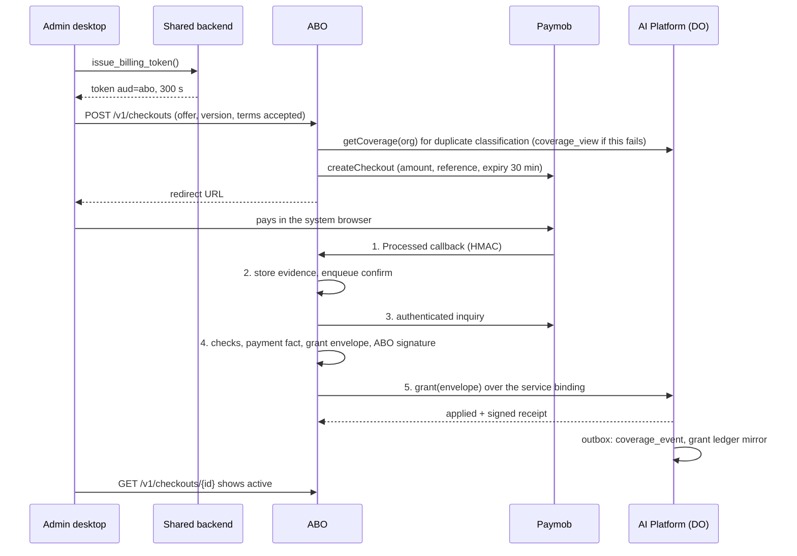
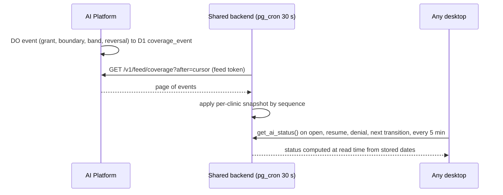

# AI Billing Orchestrator — Architecture, Trust Model and Threat Model

**Status:** Phase 2 design. **Date:** 2026-10-01. **Builds on:** [01 decisions](01-abo-design-decisions.md) (approved). Requirement IDs (FR, SR, NFR, RC, C, P, X, A) refer to the [seed](00-abo-requirements-seed.md). "01 §n" refers to the decision memo. Records are defined in [03](03-abo-data-model-and-lifecycle.md), messages in [04](04-abo-contracts.md), operations in [05](05-abo-operations-and-traceability.md).

## Table of Contents

1. [Architecture](#1-architecture)
   - [Components](#11-components)
   - [ABO modules](#12-abo-modules)
   - [AI Platform surfaces after the change](#13-ai-platform-surfaces-after-the-change)
   - [Hostnames and exposure](#14-hostnames-and-exposure)
   - [Key flows](#15-key-flows)
2. [Trust boundaries](#2-trust-boundaries)
3. [Credentials and authorization](#3-credentials-and-authorization)
   - [Credential inventory](#31-credential-inventory)
   - [Token profiles](#32-token-profiles)
   - [Authorization classes on the platform](#33-authorization-classes-on-the-platform)
4. [Threat model](#4-threat-model)
   - [Scope and assumptions](#41-scope-and-assumptions)
   - [Adversaries](#42-adversaries)
   - [Defence in depth per asset](#43-defence-in-depth-per-asset)
   - [Residual risks](#44-residual-risks)
5. [Out-of-band alerting](#5-out-of-band-alerting)
6. [Rotation and revocation](#6-rotation-and-revocation)
7. [Constitution check](#7-constitution-check)

---

## 1. Architecture

### 1.1 Components

| Component                     | Runtime                                                 | Owns                                                                                                                    | Holds                                                                                                                  | Calls out to                                                                                          |
| ----------------------------- | ------------------------------------------------------- | ----------------------------------------------------------------------------------------------------------------------- | ---------------------------------------------------------------------------------------------------------------------- | ----------------------------------------------------------------------------------------------------- |
| Administrator desktop         | Flutter, Windows                                        | Nothing durable                                                                                                         | Supabase session; short-lived AI and billing tokens in memory                                                          | Backend RPCs; ABO clinic API; AI Platform `/v1/*`; system browser to the hosted checkout             |
| Staff desktop                 | Flutter, Windows                                        | Nothing durable                                                                                                         | Supabase session; short-lived AI token in memory                                                                       | Backend RPCs; AI Platform AI routes only (never the ABO, never `/v1/coverage`, FR-61)                 |
| Shared backend                | Supabase (one project, all tenants)                     | Tenancy (precondition R-1), token issuance, per-tenant AI status projection                                             | Issuer private key set (01 §3.1, custody spike R-3)                                                                    | AI Platform feed only (pg_net), never the ABO                                                         |
| ABO                           | Cloudflare Worker + own D1 + own R2 bucket              | Offers, billing contacts, checkouts, payments, reversals, grant requests, reconciliation, operator console              | Paymob secrets; ABO grant-signing key; pinned platform public keys                                                     | Paymob API; AI Platform service binding; alert channel; heartbeat monitor                             |
| AI Platform                   | Existing Worker + D1 + R2 + per-clinic DO               | Coverage (terms, grants, allowance, usage), tenant bindings, plan versions, issuer and operator key registries, AI traffic | Platform signing key; registered public keys (issuer, ABO, operator passkeys)                                         | AI providers; alert channel; heartbeat monitor                                                        |
| Paymob                        | External                                                | Card data, intentions, transactions, payouts                                                                            | —                                                                                                                      | ABO `/notify/paymob`; browser redirect to ABO `/return/paymob`                                        |
| Cloudflare Access             | Cloudflare                                              | Operator sessions for the console hostname                                                                              | IdP federation                                                                                                         | —                                                                                                     |
| Alert channel                 | Cloudflare Email Routing `send_email` (§5)              | —                                                                                                                       | Verified destination address only                                                                                      | Developer's mailbox (push on phone)                                                                   |
| Heartbeat monitor and audit watcher | Outside Cloudflare and Supabase (§5, 01 R-6)      | Dead-man's-switch schedules; audit-log checks                                                                           | Ping URLs; read-only Cloudflare audit-log token                                                                        | Developer, over its own channel                                                                       |

Constitution fit: one new Worker with its own D1 and R2, plus two Supabase extensions (`pg_cron`, `pg_net`). There are no queues, no microservice mesh, and domain integrity for clinic data stays in PostgreSQL. The principle-by-principle check is in §7.

Both Workers enable Workers Logs (`[observability] enabled = true`) and write one JSON object per log line. Error lines carry the work row id, alert key or request reference, never secrets, tokens or clinic data. The `scheduled` handlers log and alert on a failing job instead of swallowing it.

### 1.2 ABO modules

One deployable (C-07), new top-level directory `abo/`. Only the adapter module may import provider code; an import-boundary check in CI enforces this (G6). The ABO and the AI Platform both depend on `packages/vendor-contracts/` (a `file:` dependency, since the repository has no workspace tooling): canonical JSON, Ed25519 JWS, WebAuthn verification, the shared message types and the contract-version constants of 04 §7. Neither Worker keeps its own copy of these.

| Module            | Responsibility                                                                                               | Entry points                                              |
| ----------------- | ------------------------------------------------------------------------------------------------------------ | --------------------------------------------------------- |
| Clinic API        | Offers, billing contact, checkouts, subscription and payment history for administrators                      | `/v1/*` on the billing hostname, billing token            |
| Notification intake | Verify, store evidence, enqueue confirmation                                                               | `POST /notify/{provider}`; `GET /return/{provider}` (UX only) |
| Pipeline          | Work rows (confirm, grant, reverse, transfer steps, sweeps), leases, backoff                                 | Inline `waitUntil`; cron every minute                     |
| Provider port and adapters | Provider-neutral operations (04 §5); Paymob adapter with its private tables                         | Called by the pipeline and clinic API only                |
| Operator console  | Lookup, actions, passkey ceremonies, payout CSV import                                                       | `/ops/*` on the console hostname, behind Access           |
| Reconciliation and digest | Payout ↔ payment ↔ grant matching, drift findings, daily digest, alert emission and dedupe          | Cron (minute and daily)                                   |
| Records           | Append-only D1 tables, R2 evidence, NDJSON ledger export to the locked prefix                                | Used by every module                                      |

### 1.3 AI Platform surfaces after the change

| Surface                                                  | Caller                       | Authentication                                                            | Status                                        |
| -------------------------------------------------------- | ---------------------------- | ------------------------------------------------------------------------- | --------------------------------------------- |
| `POST /v1/requests`, `GET /v1/requests/{reference}`      | All desktops                 | AI token                                                                  | Kept; identity reworked                       |
| `GET /v1/capabilities`                                   | All desktops                 | AI token                                                                  | Kept; reads coverage, not plan tiers          |
| `GET /v1/coverage`                                       | Administrator desktops       | AI token with `role = administrator`                                      | New (P-09, FR-60)                             |
| `GET /v1/feed/coverage`                                  | Shared backend               | Feed token                                                                | New (01 §3.4)                                 |
| `VendorEntrypoint` (named `WorkerEntrypoint`)            | ABO over a service binding   | Per method: machine, human or human-plus-passkey (§3.3)                   | New; not reachable from the internet          |
| `GET /health`                                            | Anyone                       | None                                                                      | Kept                                          |
| `/control/*`, `GET /v1/usage`                            | —                            | —                                                                         | Removed (P-07, FR-61, FR-91)                  |

### 1.4 Hostnames and exposure

| Hostname                     | Worker      | Routes                                        | Exposure                                                           |
| ---------------------------- | ----------- | --------------------------------------------- | ------------------------------------------------------------------ |
| `billing.<vendor-domain>`    | ABO         | `/v1/*`, `/notify/*`, `/return/*`             | Public; each route authenticates (billing token or HMAC)           |
| `ops.<vendor-domain>`        | ABO         | `/ops/*` only                                 | Cloudflare Access application; the Worker also validates the Access JWT (SR-22) |
| existing platform hostname   | AI Platform | §1.3                                          | Public; token-authenticated                                        |

Both Workers set `workers_dev = false` and `preview_urls = false`, so the Access-protected console has no bypass hostname. The ABO rejects `/ops/*` on the billing hostname and `/v1/*` on the console hostname. Both crossings answer HTTP 404 with an empty body, before the contract-version check and before authentication. That body is not an 04 §2.3 error. Staging runs in a separate Cloudflare account and Supabase project with the Paymob test integration (01 R-6).

### 1.5 Key flows

Purchase to AI on (FR-12, G3). Steps 6–8 also run from the minute cron when the inline attempt fails or the callback never arrives.

Status to every desktop (FR-62, FR-63, FR-27):

## 2. Trust boundaries

Each boundary lists the untrusted side and the controls that make the crossing safe. The adversaries in §4.2 are the parties who can reach the untrusted side.

| #     | Boundary                                          | Untrusted side                  | Controls                                                                                                                                                                                                  |
| ----- | ------------------------------------------------- | ------------------------------- | --------------------------------------------------------------------------------------------------------------------------------------------------------------------------------------------------------- |
| TB-1  | Internet → ABO `/notify/{provider}`, `/return/*`  | Any caller                      | Body-size cap and rate limit. On `POST /notify/{provider}` the cap is 1_048_576 bytes (1 MiB) and the limit is 60 requests per 60 seconds keyed by `CF-Connecting-IP` (a missing header uses the key `unknown`). A body over the cap answers HTTP 413; the request that exceeds the limit answers HTTP 429. Both answers are an empty body and leave nothing stored or enqueued. HMAC in constant time; HMAC-valid bodies stored as evidence; nothing granted without the authenticated inquiry (TB-8); `/return` only schedules an inquiry                  |
| TB-2  | Desktop → ABO clinic API                          | Clinic users, stolen tokens     | Billing token (Ed25519, `aud=abo`, ≤ 300 s); state-changing calls idempotent by `client_request_id`; `role = administrator` re-checked; tenant taken only from `org`; every lookup keyed by `org`; foreign ids answer `not_found`                |
| TB-3  | Desktop → AI Platform                             | Clinic users, stolen tokens     | AI token (`aud=ai-platform`, ≤ 600 s); `org` resolved through `tenant_binding`; DO admission decides; `/v1/coverage` requires `role = administrator`                                                     |
| TB-4  | Desktop → shared backend                          | Clinic users                    | Supabase auth; definer RPCs keyed on `current_org_id()`, which re-checks membership (R-1); projection and keys in non-exposed `ai_internal`; no write RPC for status (SR-07)                                 |
| TB-5  | Shared backend → AI Platform feed                 | Network; the platform's answers | TLS to the platform hostname; feed token (`aud=ai-platform-feed`); applied only forward by per-clinic sequence; daily comparison of feed snapshots with `getCoverage` (05 §3.3). The projection drives display only (SR-13), so pages are not signed (01 §3.4) |
| TB-6  | ABO → AI Platform service binding                 | The ABO (may be compromised)    | Not internet-routable; paid grants need a valid ABO signature and pass plan bounds; human methods need a platform-verified Access JWT; value-moving methods need a platform-verified WebAuthn assertion      |
| TB-7  | Operator browser → ABO console                    | Internet, session thieves       | Cloudflare Access with the IdP's hardware-key MFA; 1-hour sessions; Access JWT validated in the Worker (issuer, `aud` tag, expiry); passkey ceremony per value-moving action                            |
| TB-8  | ABO → Paymob API                                  | Network; the provider's answers | TLS; API-key-derived token for inquiry, separate from the HMAC secret; inquiry answers matched to the checkout's stored order id, amount and currency                                                       |
| TB-9  | Vendor services → alert channel                   | Mail transport                  | Destination fixed in configuration (verified address); alert bodies carry ids and codes, no secrets and no clinic data                                                                                     |
| TB-10 | Developer admin plane (Cloudflare, Supabase, Paymob dashboards, deploy tooling) | —                     | Trusted by definition (SR-12). Bounded by operating policy (§4.4) and watched from outside (§5)                                                                                                          |

## 3. Credentials and authorization

### 3.1 Credential inventory

| #    | Credential                                   | Held by                                         | Lifetime                                             | Used for                                                             |
| ---- | -------------------------------------------- | ----------------------------------------------- | ---------------------------------------------------- | -------------------------------------------------------------------- |
| K-1  | Supabase user session                        | Desktop                                         | 3600 s (`backend/supabase/config.toml:161`)          | Backend RPCs only; never sent to the ABO or the platform (01 §3.1 C) |
| K-2  | Issuer key set (Ed25519, ≥ 2 `kid`s)         | Shared backend (Vault or signer, spike R-3)     | 13 months per key, overlapping                       | Signs AI, billing and feed tokens                                    |
| K-3  | Platform signing key (Ed25519)               | AI Platform secret                              | 13 months, overlapping `kid`s                        | Signs grant and void receipts                                        |
| K-4  | ABO grant key (Ed25519)                      | ABO secret                                      | 13 months, overlapping `kid`s                        | Signs paid-grant envelopes and reversal voids                        |
| K-5  | Paymob HMAC secret                           | ABO secret                                      | Until rotated in the Paymob dashboard                | Verifying callbacks (trigger only)                                   |
| K-6  | Paymob secret key and API key                | ABO secrets                                     | Until rotated                                        | Creating intentions; obtaining the inquiry bearer token              |
| K-7  | Operator passkeys (hardware, user-verifying) | Developer                                       | Until revoked                                        | WebAuthn assertions for value-moving methods                         |
| K-8  | Access session                               | Operator browser                                | 1 hour                                               | Console perimeter and attribution                                    |
| K-9  | Cloudflare and Supabase account credentials, deploy tooling | Developer only                   | Interactive, hardware-key MFA                        | Deploys and administration; no stored production token (§4.4)        |
| K-10 | Audit-watcher token                          | External watcher                                | 90 days                                              | Read-only Cloudflare audit logs                                      |

Removed: the shared `OPERATOR_BEARER_TOKEN` (`ai-platform/src/control/auth.ts:16-51`, `src/worker.ts:124,1613`), per-clinic installation keys (`backend/supabase/migrations/20260801120000_ai_keystore_schema.sql:51-66`) and their 365-day expiry (`ai-platform/src/control/lifecycle.ts:30-37`).

### 3.2 Token profiles

All three are compact JWS, `alg = EdDSA`, header `kid`, signed by K-2. Common claims: `iss` (the backend issuer id), `aud`, `sub`, `org`, `jti`, `iat`, `exp`, `ver = "2"` (X-10). Exact claims are in 04 §2.1.

| Token   | `aud`              | Lifetime | Minted by                                                         | Verifier checks beyond signature and times                                                                  |
| ------- | ------------------ | -------- | ----------------------------------------------------------------- | ----------------------------------------------------------------------------------------------------------- |
| AI      | `ai-platform`      | ≤ 600 s  | `issue_ai_token()`, any member with an AI scope                   | `org` has an active binding (created on first sight); `role` for `/v1/coverage`; existing replay rules     |
| Billing | `abo`              | ≤ 300 s  | `issue_billing_token()`, membership role `administrator` only     | `role = administrator`; reusable within its life; the `jti` is recorded on every checkout and operator-visible action |
| Feed    | `ai-platform-feed` | ≤ 120 s  | The backend itself inside the pull job; `org` is absent           | `sub = backend-feed`; never accepted on any other route                                                     |

Audience separation means a token stolen from one service is useless at the other: an AI token cannot open a checkout and a billing token cannot run AI.

### 3.3 Authorization classes on the platform

Every `VendorEntrypoint` method has exactly one class. The method list is in 04 §1.3.

| Class | Name                  | Required evidence, verified by the platform itself                                                                                                                 | Examples                                                                                                          |
| ----- | --------------------- | ------------------------------------------------------------------------------------------------------------------------------------------------------------------ | ----------------------------------------------------------------------------------------------------------------- |
| M     | Machine               | Service binding, plus an ABO signature (K-4) where the method changes coverage                                                                                     | Paid grant; void after a verified reversal; coverage reads; feed-consumer health                                  |
| H     | Human                 | Forwarded `Cf-Access-Jwt-Assertion`, checked against the Access team certificates, `aud` tag and expiry; the email becomes the audit actor                        | Suspend, resume, kill switch, routing policy, support lookup, retry                                               |
| HP    | Human plus passkey    | Class H, plus a WebAuthn assertion whose challenge is the hash of the canonical operation (04 §1.5); user verification set; single use; ≤ 5 minutes old            | Complimentary grant, term adjustment, ceiling override, transfer, hold release, grant void, plan version publish, key and credential registration, delete |

The platform verifies classes H and HP itself; the ABO's own checks are only for UX. A compromised ABO therefore cannot invent an operator, and cannot perform a platform HP action without a real operator touch (SR-21; the substitution risk is in AD-8). The ABO applies the same passkey ceremony to its own value-affecting records: offer and terms publication, manual chargebacks, and release of withheld payments. It verifies them against the platform's credential registry (05 §3.2). A compromised ABO can skip those ABO-side checks, but that gives it nothing beyond AD-8. For `grant`, `source.kind` selects the class: `paid` is M, `complimentary` is HP (04 §1.3).

A class H or HP call whose Access JWT is missing, expired, or has the wrong `aud` is `rejected` with code `unauthenticated` and writes nothing. The Access verification returns no code; `unauthenticated` is the entrypoint code for that failure. A class HP call that omits `assertion` is `rejected` with code `assertion_required`, except bootstrap `registerOperatorCredential` while `operator_credential` is empty (04 §1.3). The other class HP refusal codes are in 04 §1.5.

## 4. Threat model

### 4.1 Scope and assumptions

- The developer controls every component; the design does not claim protection against the developer (SR-12). It limits and reveals what a *leaked* developer credential can do.
- Clinic users (staff and administrators) and internet callers are untrusted. An administrator is trusted only for their own tenant's purchases.
- Cloudflare, Supabase and Paymob are trusted to run their platforms correctly. A leak of a credential *for* them is in scope.
- The tenancy retrofit (01 R-1) is a precondition. Without it, the isolation rows below (AD-3) do not hold.

### 4.2 Adversaries

| #     | Adversary                                       | Can                                                                                                                                                                                                                          | Cannot                                                                                                                                                                                  | Noticed by                                                                                  |
| ----- | ----------------------------------------------- | ---------------------------------------------------------------------------------------------------------------------------------------------------------------------------------------------------------------------------- | --------------------------------------------------------------------------------------------------------------------------------------------------------------------------------------- | ------------------------------------------------------------------------------------------- |
| AD-1  | Internet caller                                 | Post junk to `/notify` (rate-limited, not stored unless HMAC-valid); open `/return` pages; pay for a clinic's checkout if given its link (a gift)                                                                              | Create or extend service (SR-01); block or hijack any clinic's billing (SR-04, A22); reach the console or the entrypoint                                                               | Verification-failure alert (≥ 3 in 15 min)                                                  |
| AD-2  | Clinic staff user                               | Use AI while covered; read its own tenant's status                                                                                                                                                                           | Obtain a billing token; call `/v1/coverage`; set the flag or status; see prices or payments (FR-61, SR-07)                                                                              | —                                                                                           |
| AD-3  | Clinic administrator, or a bug in one tenant's session (A36) | Buy, renew and edit the billing contact for its own tenant; spam checkouts (per-tenant rate limit)                                                                                               | Act for another tenant: `org` comes from the session only, every store keys by it, and foreign ids return `not_found` (SR-03, SR-08); get service without paying                        | Rate-limit counters                                                                         |
| AD-4  | Leaked issuer key (K-2)                         | Mint tokens for any tenant: use any clinic's allowance, read any clinic's billing view and contact, open checkouts, read the coverage feed                                                                                    | Create coverage (grants need payment evidence or a passkey); read the shared database (tokens are not PostgREST credentials)                                                            | Not reliably: forged tokens are valid. Limited by custody (R-3) and fast revocation (§6)           |
| AD-5  | Leaked Paymob HMAC secret (K-5)                 | Forge callbacks that trigger inquiries                                                                                                                                                                                       | Create a payment fact: the inquiry (K-6) is the proof (SR-01)                                                                                                                            | "Callback without matching inquiry" findings; verification alerts                           |
| AD-6  | Leaked Paymob secret or API key (K-6)           | Create intentions; read transactions; use dashboard-equivalent API functions, including refunds on real payments                                                                                                             | Grant service without a real, successful, correctly priced payment                                                                                                                      | Reversal alerts; payout reconciliation                                                      |
| AD-7  | Leaked ABO grant key (K-4)                      | Nothing alone: the key is only accepted over the service binding, which needs code running in the account                                                                                                                    | Grant from outside Cloudflare                                                                                                                                                           | —                                                                                           |
| AD-8  | Compromised ABO                                 | Fabricate paid grants for any clinic, bounded per grant by the plan version's term units and allowance maximum; void paid grants (denial of service); read billing contacts and payment history; replay an operator's live Access JWT for class-H calls, including support lookups that return AI payload envelopes for references it knows. Because it serves the console's JavaScript, it can also show the operator one operation and ask the passkey to sign another, so the operator's next touch can authorise a substituted HP action | Any class-HP action without an operator touch: complimentary grants, overrides, transfers, releases; read or write the shared database (SR-09, A35); alter its own past records unnoticed (R2 lock copy) | Platform alert on every grant, carrying the decoded operation and its target (AL-11, AL-13), so a substituted operation is visible within minutes; paid-grant velocity alert; daily reconciliation against provider inquiry and payouts (FR-80) |
| AD-9  | Compromised AI Platform                         | Serve AI to anyone; read AI request content; serve a false coverage feed (status display is wrong, SR-13) and forge receipts; suppress its own alerts; inject operator credentials into its registry, which the ABO uses for its own HP checks (offer publication, manual chargeback, withheld release) | Read or write the shared database (A35); take or move money; alter the ABO's records; get the ABO to accept a forged billing token, because the ABO pins issuer keys in its own configuration | ABO reconciliation (platform grants vs payments); the ABO's hourly comparison of the platform's issuer keys and operator credentials with its own pins and last-seen list; external heartbeat if it goes silent |
| AD-10 | Compromised shared backend                      | Read all clinical data; act as any clinic toward the ABO and platform (it holds K-2); show any status                                                                                                                        | Create coverage; obtain Paymob, ABO or platform secrets; perform class-HP actions                                                                                                       | Out of scope for billing; the clinic-data impact is the backend's own security                  |
| AD-11 | Hijacked operator session (A27)                 | Class-H actions: suspend, kill switch, cancel a checkout, retry work                                                                                                                                                         | Any class-HP action without the operator's hardware key and PIN                                                                                                                         | Every H action is audited; suspensions and kill switches alert                              |
| AD-12 | Hijacked session plus stolen passkey and PIN    | Complimentary grants within ceilings (≤ 31 days, ≤ 62 days per clinic per 90 days); overrides, each separately alerted                                                                                                       | Exceed a ceiling silently; hide a grant: the platform alerts on every grant (SR-23)                                                                                                     | Grant alert within minutes; digest; list-and-void by credential and window (SR-25)          |
| AD-13 | Leaked deploy or CI token (A26)                 | Nothing in production: by policy no stored token has production deploy, D1-write or secret rights; staging tokens reach only the staging account                                                                             | Issue a grant or extend service                                                                                                                                                         | External audit watcher, hourly                                                              |
| AD-14 | Leaked developer account credential             | Everything, since it can deploy code or write D1 and bypass every in-code check                                                                                                                                              | Nothing is claimed (SR-12)                                                                                                                                                              | Audit watcher and heartbeat run outside the compromised account                             |
| AD-15 | Leaked platform signing key (K-3)               | Forge grant or void receipts, which the ABO stores as evidence                                                                                                                                                               | Change enforcement or the status display: admission is decided by the DO, and feed pages are not signed                                                                                 | Reconciliation compares stored receipts with `listGrants` (05 §3.3)                         |

### 4.3 Defence in depth per asset

| Asset                        | Layers (each one alone blocks the attack it names)                                                                                                                                                                                                                                                                      |
| ---------------------------- | ----------------------------------------------------------------------------------------------------------------------------------------------------------------------------------------------------------------------------------------------------------------------------------------------------------------------- |
| Paid service                 | 1. The HMAC blocks junk. 2. The authenticated inquiry blocks forged callbacks. 3. Order, amount and currency must equal the checkout snapshot (FR-13, FR-16). 4. `grant_id = H(payment_id)` blocks duplicates (NFR-02). 5. The ABO signature blocks grants from anything but the ABO. 6. Platform plan bounds cap what even a valid signature can buy. 7. Velocity alerts, reconciliation and the digest reveal fabrication. |
| Complimentary service        | 1. Access perimeter. 2. Access JWT verified by the platform. 3. WebAuthn over the exact operation, verified by the platform. 4. Platform ceilings, with overrides separately signed and alerted. 5. Platform alert on every grant. 6. Digest. 7. List and void by credential and time window.                          |
| Tenant isolation             | 1. Membership re-check in `current_org_id()`. 2. `org` claim signed by the backend. 3. The ABO keys every query by the token's `org`. 4. Platform `tenant_binding`. 5. No clinic id is read from a request body anywhere. 6. Unguessable ids answer `not_found` across tenants.                                          |
| Shared database              | 1. No database credential exists outside the backend. 2. The ABO and platform never receive a Supabase JWT (01 §3.1 C). 3. The backend pulls; nothing outside writes it. 4. Tokens carry no PostgREST role.                                                                                                              |
| Commercial records           | 1. Append-only D1 triggers. 2. R2 evidence. 3. NDJSON copy under a bucket lock. 4. D1 Time Travel. 5. The platform's grant ledger, with signed receipts, as an independent witness. 6. The digest checks that the lock still exists.                                                                                  |
| Timely stop (FR-23, NFR-05)  | 1. The DO evaluates dates on every admission. 2. A DO alarm at each boundary. 3. Coverage is never read from a TTL cache (P-08). 4. The fallback admits only before the mirror's `hard_stop_at`. 5. The backend status is computed from dates at read time.                                                              |

### 4.4 Residual risks

- **Deploy-level access bypasses all code (AD-14).** A26 holds only under this operating policy: production deploys and secret changes happen only from the developer's interactive session with hardware-key MFA; no CI system or stored token has production rights; the audit watcher alerts on production deploys, secret changes, D1 exports and Access policy edits. See 05 §10.
- **A compromised ABO can fabricate paid grants within plan bounds** until reconciliation notices. The platform cannot tell a real payment from a forged one without holding provider data, which SR-10 and FR-53 forbid. Detection is minutes (velocity) to a day (reconciliation).
- **A replayed Access JWT** gives a compromised ABO class-H reach while the operator's session is live. Class H excludes everything that creates or moves value.
- **A compromised ABO can substitute the operation behind a passkey touch (AD-8).** The console is served by the ABO, so WebAuthn proves the operator touched the key, not what the operator saw. The platform's grant alert shows the decoded operation, and every HP action stays within ceilings and can be listed and voided by credential (SR-25). Serving the console from a separate origin was rejected for launch because it adds a second deployable with no gain against AD-14.
- **R2 bucket locks can be removed** by an account-level token. The digest checks the lock and alerts (01 §4).
- **The platform is the enforcement point (C-01)**, so a compromised platform can serve anyone. This is inherent to the seed.

## 5. Out-of-band alerting

This closes 01 R-8.

| Option                                                                    | Trade-offs                                                                                                                                                                     |
| ------------------------------------------------------------------------- | ------------------------------------------------------------------------------------------------------------------------------------------------------------------------------ |
| **A. Cloudflare Email Routing `send_email` binding to a verified address** | No extra vendor and no stored secret; the destination is fixed in configuration, so a compromised Worker cannot redirect alerts. Push comes from the phone's mail app; delivery is usually under a minute. Shares fate with Cloudflare |
| B. A push service (for example ntfy or Pushover)                          | Faster push, but it adds a vendor and a token that must be stored in both Workers                                                                                              |
| C. SMS gateway                                                            | Adds a vendor, a cost, and a secret, with no security gain                                                                                                                     |

**Decision: A, plus a heartbeat monitor outside Cloudflare.** Both Workers send alerts through `send_email`, deduplicated and retried from their alert tables (03 §2.10, §3.2). The fate-sharing gap is closed by a dead-man's-switch monitor outside Cloudflare and Supabase. The ABO's minute cron, the platform's 5-minute cron and the ABO's daily digest each ping `HEARTBEAT_URL`, the configuration value that holds the monitor's URL, and a missing ping alerts the developer over the monitor's own channel (NFR-04). The same external scheduler runs the hourly audit-log watcher (§4.4). Alert bodies carry codes and ids only (TB-9).

## 6. Rotation and revocation

Every credential rotates without an outage, and a compromised one is revoked in minutes (SR-11).

| Credential                   | Routine rotation                                                                                                                                             | Emergency revocation                                                                                  |
| ---------------------------- | ------------------------------------------------------------------------------------------------------------------------------------------------------------ | ----------------------------------------------------------------------------------------------------- |
| Issuer key (K-2)             | Generate the next `kid` as `ai_internal.issuer_key.status` `next` (03 §4); add its public key to the ABO's pinned `ISSUER_KEYS` (config deploy) and register it on the platform (HP); `auth_internal.switch_issuer_signing_kid(p_kid)` once both accept it (that row becomes `signing`, the previous `signing` row becomes `retired`); after 10 minutes (the longest token life) `retireIssuerKey` (HP) sets the old `kid` to `retiring`, and that `kid` stays accepted until `not_after` | `revokeIssuerKey` (HP) sets the `kid` to `revoked`, rejected there within one config-cache TTL (≤ 30 s); remove it from the ABO's pins by config deploy (minutes). Alert 30 days before `not_after` (A25) |
| Platform key (K-3)           | Add the next `kid` to the ABO's configuration first; then switch signing. The receipt `signature` is the compact JWS in 04 §1.6, and that receipt's `ledger_seq` is the `clinic_seq` of the `grant_applied` or `grant_voided` event, not a `grant_ledger` column | Same sequence, done at once; the old `kid` is removed from the ABO's configuration                    |
| ABO grant key (K-4)          | Register the next public key on the platform (`registerServiceKey`); switch the secret; revoke the old one (`revokeServiceKey` sets `status` `revoked`). There is no `retiring` status. Each attempt signs with the current key, so pending grants need no rework (03 §2.8). The ABO checks at isolate start, and hourly, that its signing `kid` is `active` and not expired (`listServiceKeys`, 04 §1.3); if not, it pauses `grant` and `reverse` work and raises AL-23 instead of sending envelopes that can only answer `transient` | Revoke on the platform (HP): envelopes under the revoked `kid` are `rejected`. Deploy the new secret; parked rows are retried, re-signed with the new key. An unknown `kid` answers `transient`, so grants retry until a new key's registration is visible (04 §1.4) |
| Paymob HMAC (K-5)            | Rotate in the dashboard, then update the secret; callbacks fail verification in between, and inquiry sweeps recover the payments (A23 path)                   | Same                                                                                                  |
| Paymob keys (K-6)            | Rotate in the dashboard, then update the secrets                                                                                                             | Same; pending work retries                                                                            |
| Operator passkey (K-7)       | Add a new credential (approved by an existing one, active after 24 hours); revoke the old                                                                    | Any active credential revokes another at once; list and void grants by credential and window           |
| Access (K-8)                 | Session length 1 hour                                                                                                                                        | Revoke sessions in Access                                                                             |
| Audit-watcher token (K-10)   | 90 days                                                                                                                                                      | Revoke in Cloudflare                                                                                  |

## 7. Constitution check

Checked against constitution v2.0.0 (`.specify/memory/constitution.md`). Feature plans derived from this design re-run the check, as the constitution requires.

| Principle or rule                          | How the design complies                                                                                                                                                                                                                                                                                                     |
| ------------------------------------------ | --------------------------------------------------------------------------------------------------------------------------------------------------------------------------------------------------------------------------------------------------------------------------------------------------------------------------- |
| I. Product fit and simplicity              | Sized for a few orders a day and one operator (C-08). One new Worker with D1 and R2; no microservices, no message queues (Cloudflare Queues and Workflows rejected, 01 §3.3), no Kubernetes. Background work is a D1 outbox driven by crons. Desktop-first; the backend stays the one shared Supabase project                  |
| II. Replaceable layer boundaries           | Flutter presents and orchestrates; it never enforces access. The ABO and the AI Platform are vendor-side services with no clinical data and no database credential (SR-09, A35); they meet the backend only through tokens it issues and a feed it pulls. The provider sits behind a port (G6). No custom core backend is added |
| III. Backend authority and data integrity  | Clinic-side state (issuer keys, projection, token issuance) is written only by definer RPCs and the feed puller, keyed on `current_org_id()`. Tenant isolation across clinics depends on the tenancy retrofit (01 R-1), a precondition. Vendor-side integrity uses D1 append-only triggers, unique keys and the DO's serialized writer |
| IV. Secure and human-gated operations      | Every call is authenticated and tenant-scoped (§2). Operators use named Access identities; value-moving actions need a passkey verified by the platform (§3.3). Every operator action is audited in `operator_action` and `control_audit`. Nothing commercial is hard-deleted; contact erasure blanks fields and keeps the row (03 §2.3) |
| V. Operational continuity                  | Lapsing AI never blocks clinical work (G5); denials are inline states (04 §3.4). Recovery needs no database surgery (05 §4), and rebuild procedures are documented and tested (05 §5). D1 Time Travel plus the locked R2 copy give restorable backups |
| Workflow automation                        | Crons and work rows are simple trigger-action steps with execution logs; the only multi-step flow, the transfer, is a two-step saga, not a DAG engine                                                                                                                                                                         |
| Higher operational burden                  | Each added part is justified against simpler options in 01 §3 (options tables) and 01 §6 (rejected items). New burden is contained by alerts (05 §2), the digest (05 §3.4) and a console that needs no SQL (G7)                                                                                                         |

