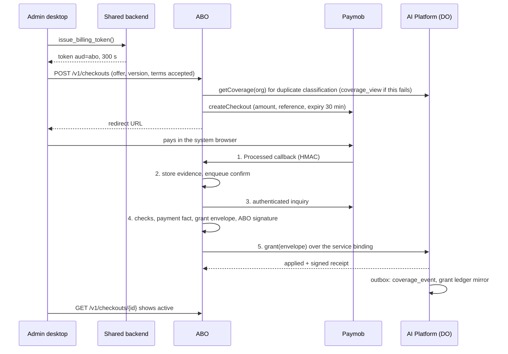
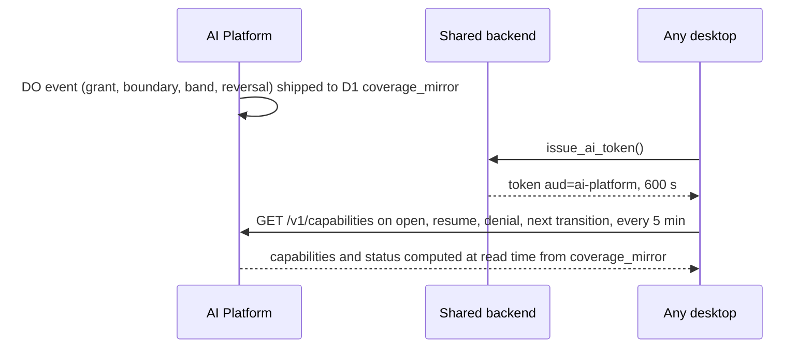

# AI Billing Orchestrator — Architecture, Trust Model and Threat Model

**Status:** Phase 2 design. **Date:** 2026-10-01. **Builds on:** [01 decisions](01-abo-design-decisions.md) (approved). Requirement IDs (FR, SR, NFR, RC, C, P, X, A) refer to the [seed](00-abo-requirements-seed.md). "01 §n" refers to the decision memo. Records are defined in [03](03-abo-data-model-and-lifecycle.md), messages in [04](04-abo-contracts.md), operations in [05](05-abo-operations-and-traceability.md).

Start with section 0. It explains what this document is for, the systems involved, and every security and technical term used later. Sections 1 to 7 keep their numbers because the other design documents cite them (for example "02 §3.3" or "02 AD-8").

## Table of Contents

0. [Start here: the big picture](#0-start-here-the-big-picture)
   - [What we are trying to achieve](#01-what-we-are-trying-to-achieve)
   - [The whole system in one analogy](#02-the-whole-system-in-one-analogy)
   - [The systems involved](#03-the-systems-involved)
   - [Cloudflare and Supabase words](#04-cloudflare-and-supabase-words)
   - [Security words](#05-security-words)
   - [How a threat model is built](#06-how-a-threat-model-is-built)
   - [One purchase, seen through security eyes](#07-one-purchase-seen-through-security-eyes)
   - [How to read the rest of this document](#08-how-to-read-the-rest-of-this-document)
1. [Architecture](#1-architecture)
   - [Components](#11-components)
   - [ABO modules](#12-abo-modules)
   - [AI Platform surfaces after the change](#13-ai-platform-surfaces-after-the-change)
   - [Hostnames and exposure](#14-hostnames-and-exposure)
   - [Key flows](#15-key-flows)
2. [Trust boundaries](#2-trust-boundaries)
3. [Credentials and authorization](#3-credentials-and-authorization)
   - [Credential inventory](#31-credential-inventory)
   - [Token profiles](#32-token-profiles)
   - [Authorization classes on the platform](#33-authorization-classes-on-the-platform)
4. [Threat model](#4-threat-model)
   - [Scope and assumptions](#41-scope-and-assumptions)
   - [Adversaries](#42-adversaries)
   - [Defence in depth per asset](#43-defence-in-depth-per-asset)
   - [Residual risks](#44-residual-risks)
5. [Out-of-band alerting](#5-out-of-band-alerting)
6. [Rotation and revocation](#6-rotation-and-revocation)
7. [Constitution check](#7-constitution-check)

---

## 0. Start here: the big picture

### 0.1 What we are trying to achieve

AiClinic's desktop app has an optional, paid AI add-on. Today the vendor turns AI on for a clinic by hand. The **AI Billing Orchestrator (ABO)** makes it self-service: a clinic administrator picks an offer in the app, pays on the payment provider's web page, and AI switches on by itself within about a minute. It keeps working until the paid time or the paid usage runs out, and then it stops on time.

Anything that turns money into service is a target. Someone may try to get AI without paying, to act for another clinic, to steal the vendor's keys, or to break in through the billing system to reach the clinics' medical data. This document is the **security blueprint** for the whole arrangement. It answers seven questions:

1. **Which pieces exist, what does each one hold, and how do they talk?** Section 1 (architecture).
2. **Where does a trusted area meet an untrusted one, and what checks happen at each meeting point?** Section 2 (trust boundaries).
3. **Which keys, passwords and passes exist, who holds them, how long do they last, and what does each one allow?** Section 3 (credentials and authorization).
4. **Who might attack, what could each attacker do, what could they not do, and how would we notice?** Section 4 (threat model).
5. **How does the developer hear about trouble even if the main systems are the ones in trouble?** Section 5 (out-of-band alerting).
6. **How are keys replaced on a schedule, and cancelled quickly after a leak?** Section 6 (rotation and revocation).
7. **Does the design respect the project's founding rules?** Section 7 (constitution check).

Five security goals shape every choice in this document:

- **No service without payment.** Nobody gets AI without a real, confirmed payment or a deliberate, signed gift from the vendor.
- **No clinic can touch another clinic.** A clinic's user can only ever buy for, read about and use AI for their own clinic.
- **The medical data stays out of reach.** The billing and AI systems never receive a way into the shared database that holds clinical records.
- **No single stolen key is a master key.** Each key opens one door. Doors that move money need several independent proofs.
- **If something goes wrong, the developer is told quickly, by a channel the attacker cannot silence.** And a leaked key can be cancelled within minutes.

One honest limit runs through the whole document: the developer owns and controls everything, so the design cannot protect against the developer's own full account. What it does is limit, and reveal, what a *stolen* developer credential can do (SR-12).

### 0.2 The whole system in one analogy

The sibling documents use a **prepaid mobile phone bundle** as the picture. You walk into a shop, choose a bundle from the price board, pay at the till, and the network adds the bundle to your SIM card. Every call uses some units, and the bundle ends when its month or its units run out. This document keeps that picture and adds a second one for security: the shop and the network sit inside a **guarded building**, with doors, badges, guards, locks and alarms.

**The business picture (same as the other documents):**

| Mobile bundle world                                        | In this design                                                     | Explained in |
| ---------------------------------------------------------- | ------------------------------------------------------------------ | ------------ |
| The customer                                               | A clinic's **desktop app**                                         | §0.3, §1.1   |
| The ID office that issues temporary visitor badges         | The **shared backend** (Supabase), issuing short-lived **tokens**  | §0.3, §3.2   |
| The shop: price board, till and receipt book               | The **ABO**                                                        | §1.1, §1.2   |
| The phone network                                          | The **AI Platform**                                                | §1.1, §1.3   |
| The clinic's dedicated cashier with a private notebook, serving one customer at a time | The clinic's **Durable Object (DO)** on the AI Platform | §0.4, §1.1 |
| The bank's card terminal                                   | **Paymob**, the payment provider                                   | §1.1         |
| A translator who speaks the bank's language                | The **Paymob adapter**                                             | §1.2         |
| The shop owner                                             | The **operator**: the developer, the vendor's single human operator | §0.3, §3.3  |

**The security picture (new in this document):**

| Building security world                                               | In this design                                                        | Explained in |
| --------------------------------------------------------------------- | --------------------------------------------------------------------- | ------------ |
| A door between a public corridor and a private room, with a guard     | A **trust boundary**, with its **controls**                           | §0.6, §2     |
| Keys, badges, ID cards and PIN codes                                  | **Credentials**                                                       | §0.5, §3.1   |
| A visitor badge printed for one building only, valid for ten minutes  | A **token** with an **audience** and a short **lifetime**             | §0.5, §3.2   |
| "Staff only", "manager only" and "manager plus safe key" doors        | The three **authorization classes** M, H and HP                       | §3.3         |
| A list of burglar profiles: the passer-by, the dishonest employee, someone holding a copied key | The **adversaries** AD-1 to AD-15                | §0.6, §4.2   |
| Several independent locks on the same safe                            | **Defence in depth**                                                  | §0.6, §4.3   |
| The weak spots the owner knowingly accepts                            | **Residual risks**                                                    | §0.6, §4.4   |
| A smoke alarm with its own battery and its own line to your phone     | **Out-of-band alerting** and the external **heartbeat monitor**       | §0.6, §5     |
| Changing the locks on a schedule, or at once after a key is lost      | **Rotation** and **revocation**                                       | §0.6, §6     |
| The building code the whole building must pass                        | The project **constitution**                                          | §7           |

Keep both pictures in mind. Each later section zooms into one part of them.

### 0.3 The systems involved

Each system below is a separate program, run by a separate company or in a separate account. Section 1.1 gives the full technical detail; this table only says what each one is.

| System                              | What it is, in plain words                                                                                                    | Analogy                                     | Its security role                                                                                                     |
| ----------------------------------- | ----------------------------------------------------------------------------------------------------------------------------- | ------------------------------------------- | --------------------------------------------------------------------------------------------------------------------- |
| **Administrator desktop**           | The clinic's Windows desktop app (built with the Flutter toolkit), used by someone with the `administrator` role, who may buy                               | A customer who may buy bundles              | Holds only short-lived passes in memory; keeps nothing permanent                                                      |
| **Staff desktop**                   | The same app used by ordinary clinic staff, who may use AI but never buy or see prices                                         | A customer who may only make calls          | Can reach the AI Platform for AI and a simple status, never the ABO                                                   |
| **Shared backend**                  | One Supabase project: a PostgreSQL database plus login, holding every clinic's clinical data. Each clinic is a **tenant** in it | The ID office                              | The most precious store. Issues signed tokens to desktops and talks to nothing else (rule C-02)                      |
| **ABO**                             | A new Cloudflare program with its own storage, that sells offers and keeps the commercial records                              | The shop and its accountant                 | Holds the Paymob secrets and its own signing key. Asks the AI Platform to add AI time                                 |
| **AI Platform**                     | The existing Cloudflare program that serves AI requests                                                                        | The phone network                           | The only place that decides whether an AI request is allowed (the **enforcement point**, C-01)                       |
| **Per-clinic Durable Object (DO)**  | One small program instance per clinic inside the AI Platform, with its own private storage, handling one request at a time    | The clinic's dedicated cashier with a private notebook | Decides each AI request for its clinic, from its own calendar and counters                              |
| **Paymob**                          | The payment provider (Egypt). Shows a hosted card page, sends notifications, answers status questions                          | The bank's card terminal                    | Holds card data; the vendor never sees a card number                                                                  |
| **Cloudflare Access**               | Cloudflare's login gate placed in front of a web address                                                                       | The guard desk at the staff entrance        | Only lets the operator reach the operator console                                                                     |
| **Operator** and **console**        | The developer, using a web page (`ops.<vendor-domain>`) behind Cloudflare Access                                               | The shop owner in the back office           | Looks things up, fixes stuck work, gives complimentary time, records chargebacks                                      |
| **Alert channel**                   | Email sent by Cloudflare to the developer's mailbox, which pushes to their phone                                               | The alarm bell                              | Tells the developer about anything that needs a human                                                                 |
| **Heartbeat monitor and audit watcher** | A small scheduler run by a third company, outside Cloudflare and Supabase                                                  | A smoke alarm with its own battery          | Notices if the vendor systems go silent, and watches Cloudflare's own log of account changes                          |

### 0.4 Cloudflare and Supabase words

The vendor systems run on two hosting companies. **Cloudflare** runs the ABO and the AI Platform. **Supabase** runs the shared backend. These are the product words used later.

**Cloudflare: running code**

- **Worker.** A program that runs on Cloudflare's servers each time a web request arrives. There is no server for the vendor to look after. The ABO is one Worker; the AI Platform is another. Each running copy of a Worker is called an **isolate**; "at isolate start" means "when a fresh copy of the program wakes up".
- **Hostname and route.** A hostname is a web address such as `billing.<vendor-domain>`. A route is a path on it, such as `/v1/checkouts`. `/v1/*` means "every path starting with `/v1/`". `<vendor-domain>` stands for the vendor's real domain name.
- **`workers_dev` and `preview_urls`.** Cloudflare can give every Worker extra automatic addresses (on `workers.dev`, and per preview version). Turning them off (`= false`) means the only way in is through the addresses listed in §1.4, like bricking up a side door.
- **`scheduled` handler and cron.** A cron is a timer that runs a job on a schedule, such as every minute. The `scheduled` handler is the part of a Worker that the timer wakes.
- **Inline `waitUntil`.** A way for a Worker to finish a small job right after answering a request, so work starts at once instead of waiting for the next cron.
- **Workers Logs (`[observability] enabled = true`).** Cloudflare's built-in log store for a Worker, switched on by that configuration line.
- **Durable Object (DO).** A Cloudflare feature: one small program instance per key (here, per clinic), with its own private storage, that handles **one request at a time**. Think of the clinic's dedicated cashier with a private notebook, serving one customer at a time. A DO **alarm** is its alarm clock: it wakes the DO at a set time, for example when a term ends. Its **outbox** is an out-tray: changes other systems must learn about are put there and shipped later.
- **Service binding.** A private line from one Worker to another inside the same Cloudflare account. It is not reachable from the internet, like an internal phone extension that has no outside number.
- **`WorkerEntrypoint` and `VendorEntrypoint`.** A `WorkerEntrypoint` is a named list of operations one Worker offers another over a service binding. The AI Platform's list for the ABO is called `VendorEntrypoint`. Think of it as the menu of requests the internal extension accepts.
- **Email Routing `send_email`.** A Cloudflare feature that lets a Worker send an email, here only to one address fixed in configuration and verified in advance.
- **Cloudflare audit logs.** Cloudflare's own record of changes to the account: who deployed code, changed a secret, exported a database, edited a login rule.
- **Staging.** A full practice copy of the system, in a separate Cloudflare account and Supabase project, using Paymob's test mode, so tests never touch real money or real clinics.

**Cloudflare: storing data**

- **D1.** Cloudflare's database (SQLite). Data is in tables of rows and columns. The ABO has its own D1; the AI Platform has another. Think of a filing cabinet of forms.
- **R2.** Cloudflare's file storage. Files are grouped by name **prefix**, like folders. Think of a warehouse of boxes, grouped by aisle.
- **Append-only.** A table whose rows can be added but never changed or deleted, like a ledger written in pen. **Triggers** (automatic rules inside the database) abort any attempt to edit or delete.
- **Bucket lock.** A rule on an R2 prefix: files there can be added but not changed or deleted for a set time. Think of a sealed vault with a slot.
- **NDJSON** ("newline-delimited JSON"). A text format with one record per line. The ABO writes a copy of every commercial fact as NDJSON into a locked prefix, like a carbon copy of the receipt book kept in that vault.
- **D1 Time Travel.** Lets a D1 database be restored to any moment in the last 30 days, like an "undo to last Tuesday" button.
- **TTL cache.** A short-term memory that keeps a value for a fixed time (its "time to live", TTL) before looking it up again. It is fast but may be slightly out of date. A "config-cache TTL (≤ 30 s)" means a configuration change is noticed within 30 seconds.

**Cloudflare Access: the staff entrance**

- **Cloudflare Access.** A login gate Cloudflare places in front of a hostname. An **Access application** is one such gate. Nobody reaches the page behind it without logging in first.
- **IdP (identity provider) and federation.** The outside login service Access trusts to say who someone is, for example a Google or Microsoft account. "IdP federation" means Access hands the login to that service.
- **Access session.** Once logged in, the operator's browser holds a session that lasts 1 hour.
- **Access JWT and `Cf-Access-Jwt-Assertion`.** On every request, Access adds a signed pass (a JWT, §0.5) in the `Cf-Access-Jwt-Assertion` header, saying who the operator is. The receiving program can check this pass against Access's **team certificates** (Access's public keys), its **`aud` tag** (which gate it was issued for) and its expiry.

**Supabase: the shared backend**

- **Supabase** is a hosted PostgreSQL database with login and storage. One project serves all clinics.
- **Supabase session (Supabase JWT).** The signed pass a desktop receives when a user logs in. It lets the desktop call the backend, and only the backend.
- **RPC and definer RPC.** An RPC ("remote procedure call") is a named function in the database that the desktop calls, such as `issue_ai_token()`. A **definer** RPC runs with the rights of the function's owner, not the caller, so it can do one precise privileged job, like a bank teller who may open the vault only to fetch your own deposit box.
- **`current_org_id()`.** A helper function that returns the caller's clinic, after re-checking that the user really is a member of it.
- **PostgREST and `service_role`.** PostgREST is Supabase's automatic web interface to the database; a valid database login (a "PostgREST role") lets a caller read or write tables through it. `service_role` is the all-powerful database role. The vendor services never hold either.
- **Exposed and non-exposed schema.** A schema is a named group of tables. An exposed schema is reachable through PostgREST; `ai_internal` is non-exposed, so it can only be reached from inside the database.
- **Vault, Edge Function, pgsodium.** Vault is Supabase's encrypted secret store. An Edge Function is a small program Supabase runs. pgsodium is a cryptography add-on that is being retired, which is why the issuer key's custody must be redesigned (spike R-3).
- **`pg_net` and the `http` extension.** Database add-ons that let the database make outgoing web calls. The design forbids them, so the backend has no way to call out.
- **Tenancy retrofit (precondition R-1).** Today the backend effectively serves one clinic. Before this design is safe, it must be reworked so each user belongs to clinics through memberships, and every call works for exactly one clinic. That rework is a separate project that must be finished first.

**Code and delivery**

- **Flutter.** The toolkit the desktop app is written in.
- **CI.** Continuous integration: an automatic system that builds and tests code on every change. An **import-boundary check** in CI fails the build if code in one module uses code it is not allowed to use.
- **Deploy and deploy tooling.** Putting a new version of the code live, and the command-line tools that do it.
- **`file:` dependency.** A way for two programs in the same repository to share a folder of code, used because the repository has no "workspace" tooling for sharing packages.

### 0.5 Security words

**Who may do what**

- **Authentication** answers "who are you?" (showing your ID card). **Authorization** answers "what may you do?" (whether your card opens this door).
- **Credential.** Anything that proves identity or grants access: a password, a key, a pass, a hardware security key. A **secret** is a credential stored inside a program's configuration, hidden from its code listing.
- **Tenant** and **`org`.** A tenant is one customer clinic in the shared backend. `org` is the clinic id written inside a token. "Tenant isolation" means one clinic can never see or affect another.
- **Role** and **scopes.** A role is the user's job in the clinic (`administrator` or staff). Scopes are the specific AI features a user is allowed to use.
- **Session.** A logged-in period. Its pass expires after a fixed time.

**Seals and signatures**

- **Public and private key.** A matched pair. The private key is kept secret and makes a seal; the public key can be shared, and anyone holding it can check the seal. Think of a wax seal: only the owner of the stamp can press it, but anyone who knows its pattern can recognise it.
- **Signature.** The seal itself, attached to a message. If even one character of the message changes, the seal no longer matches.
- **Ed25519 (`alg = EdDSA`).** The modern, fast signature method used everywhere in this design. `EdDSA` is how a token's header names it.
- **`kid` (key id).** A label saying which key made a seal. It lets several keys be valid at once, so an old key can be replaced by a new one without a gap (**overlapping `kid`s**). `not_after` is the date after which a key must no longer be used.
- **Key set.** Several keys held together, each with its own `kid` (here, at least two at any time, so one can replace the other).
- **Pinned keys.** Public keys written into a program's own configuration, so it trusts only those, whatever anyone else claims. Like a guard with a printed list of the only stamp patterns to accept. Changing a pin needs a configuration deploy.
- **Key registry.** A list of trusted public keys kept by the AI Platform, which can be changed only through a protected operator action (class HP, §3.3).
- **Hash.** A short fingerprint computed from data: the same data always gives the same fingerprint. `H(x)` means "the hash of x". **Canonical JSON** is one fixed way of writing a data record, so both sides compute the same fingerprint for the same content.
- **HMAC.** A seal made with a secret that two parties share, here Paymob and the ABO. It shows a notification came from Paymob. Checking it **in constant time** means the check always takes the same time, so an attacker cannot learn the secret by timing many guesses.
- **TLS.** The encryption behind `https://`, which stops anyone on the network from reading or altering traffic.

**Passes (tokens)**

- **Token.** A short-lived signed pass. The shared backend issues them to desktops; the desktops show them to the ABO or the AI Platform. Think of a visitor badge printed by the ID office.
- **JWT and JWS.** A JWT (JSON Web Token) is a standard format for such a pass: a small header, a list of statements, and a signature. A JWS is the signed form; "compact" means it is written as one line of text in three dot-separated parts.
- **Claims.** The statements inside a token. Those used here: `iss` (issuer: who printed the badge), `aud` (**audience**: the one service the badge is for), `sub` (subject: which user), `org` (which clinic), `jti` (a unique id for this one badge), `iat` (issued at), `exp` (expires at), `ver` (the token format version), `role` and `scopes`.
- **Audience separation.** Each token names exactly one audience, and each service refuses tokens meant for another. A badge printed "shop only" does not open the network's door.
- **Bearer token.** A pass that works for whoever holds it, like cash. The Paymob inquiry uses one, obtained with the API key.
- **API key and secret key.** Paymob credentials that let the ABO call Paymob's API: create payment sessions (**intentions**), and read the true state of a payment.
- **Replay.** Re-sending a pass or message that was valid before, hoping it still works. "Replay rules" are the checks that stop this.

**Proof from a human**

- **MFA (multi-factor authentication).** Logging in with more than one proof, for example a password plus a hardware key. **Hardware-key MFA** means one of the proofs is a physical security key.
- **Passkey.** A hardware security key, here one that also checks a PIN or fingerprint (**user verification**, "user-verifying"). It holds a private key that never leaves the device.
- **WebAuthn.** The web standard for using passkeys.
- **Challenge, assertion, ceremony.** The program sends a **challenge** (a value to sign); the operator touches the passkey; the passkey returns an **assertion**, a signed proof that a real person with that key approved *this exact* challenge. The whole exchange is a **ceremony**. Here the challenge is the fingerprint of the exact operation, so the proof is bound to that one operation and cannot be reused (**single use**).
- **Operator credential registry.** The AI Platform's list of passkeys allowed to approve operations.

**Billing evidence**

- **Notification (callback).** A message Paymob sends to the ABO saying "something happened to this payment". It only *triggers* work.
- **Inquiry.** The ABO asking Paymob's API directly, with a separate credential, "what is the real state of this payment?". The inquiry is the *proof*, like phoning the bank instead of trusting a text message.
- **Evidence.** A raw copy of what Paymob sent or answered, stored so it can be shown later.
- **Grant envelope.** The exact, signed contents of a request to add AI time: which clinic, which plan, how long, how many credits, and the evidence. Think of a sealed order form.
- **Receipt.** The AI Platform's signed answer to a grant or void, kept as proof.
- **Idempotent.** Doing it twice has the same effect as doing it once, like pressing a lift button twice. `client_request_id` is the value a desktop attaches so a repeated request is recognised as the same one.
- **Rate limit and body-size cap.** A limit on how many requests a caller may send per minute, and on how large each request may be. Both stop flooding.
- **Unguessable ids and `not_found`.** Record ids contain enough randomness that nobody can guess another clinic's id. If someone asks for an id that belongs to another clinic, the answer is `not_found`, exactly as if it did not exist, so nothing leaks.

### 0.6 How a threat model is built

A **threat model** is a structured answer to "what could go wrong, on purpose, and what stops it?". Think of a security consultant walking round a building with the owner. This document follows the same steps the consultant would.

1. **List what is worth protecting (the assets).** Here: paid service, complimentary service, the separation between clinics, the shared database, the commercial records, and AI stopping on time. In the building: the till, the safe, the files, the customers' privacy.
2. **Draw the doors (trust boundaries).** A **trust boundary** is any point where a request passes from a place we do not trust into one we do. The **untrusted side** is whoever can stand in the corridor. The **controls** are the checks the guard makes at that door. Section 2 lists ten doors, TB-1 to TB-10.
3. **Count the keys (credentials).** Who holds which key, how long it lasts and what it opens. Section 3 lists ten, K-1 to K-10.
4. **Imagine the burglars (adversaries).** An **adversary** is a type of attacker: a passer-by on the internet, a dishonest clinic user, someone holding a copied key, or someone who has taken over one of the vendor's own systems. For each, the threat model writes three things: what they **can** do, what they **cannot** do (and why), and how they would be **noticed**. Section 4.2 lists fifteen, AD-1 to AD-15.
   - A **leaked** credential means a copy of one key got out. A **compromised** system means the attacker controls that whole program and everything it holds. A **hijacked** session means someone took over a logged-in browser.
5. **Stack the locks (defence in depth).** No single lock is trusted alone. Each asset is protected by several independent layers, so an attacker who defeats one still meets the next. Like a safe inside a locked room inside a guarded building. Section 4.3 lists the layers per asset.
6. **Admit the weak spots (residual risks).** Some risks cannot be removed at a sensible cost. They are written down honestly, with what limits them. Section 4.4.
7. **Fit an independent alarm (out-of-band alerting).** If the alarm runs on the same power as the building, a fire that cuts the power also silences the alarm. That is called **sharing fate**. An **out-of-band** alarm uses a separate path. A **heartbeat monitor**, also called a **dead-man's switch**, works the other way round: the systems must "check in" on a schedule, and silence itself raises the alarm. Section 5.
8. **Plan lock changes (rotation and revocation).** **Rotation** is replacing a key on a routine schedule, without an **outage** (a period when the service does not work). **Revocation** is cancelling a key at once because it may have leaked. Section 6.

Words that come up while doing this:

- **Enforcement point.** The one place that actually says yes or no. Here it is the AI Platform, and inside it the clinic's DO (C-01).
- **Blast radius.** How much damage one failure or one stolen key can cause. The design keeps each key's blast radius small.
- **Velocity alert.** An alert that fires when something happens unusually often in a short time, such as many paid grants in an hour.
- **Reconciliation.** Daily cross-checking of the books: every payout traces to a payment, every payment to a grant, every grant to a payment or a signed gift. A mismatch becomes a **finding** (a written discrepancy) or a **drift** finding (two records that have drifted apart).
- **Digest.** A daily summary email that also proves the scheduled jobs are alive.
- **Spike.** A short investigation to answer an open technical question before building (for example spike R-3 on where the issuer key is kept).

### 0.7 One purchase, seen through security eyes

This walk-through follows one purchase and names the door (TB-n), the key (K-n) and the protection used at each step. Every item is explained in full later.

1. **The administrator logs in.** The desktop gets a Supabase session (K-1). That pass works only at the shared backend, never at the ABO or the AI Platform.
2. **The desktop asks for a billing pass.** It calls the backend function `issue_billing_token()` (door TB-4). The backend checks the user is an `administrator` of this clinic and signs a billing token with its issuer key (K-2). The token is for the ABO only (`aud=abo`) and lasts at most 300 seconds.
3. **The administrator opens a checkout.** The desktop shows the billing token to the ABO (door TB-2). The ABO takes the clinic only from the token's `org`, never from the request. It asks Paymob to open a card page and sends the desktop there.
4. **The administrator pays on Paymob's page.** The vendor never sees the card.
5. **Paymob notifies the ABO** (door TB-1). The ABO checks the HMAC seal (K-5), but a valid seal only *triggers* work. The ABO then asks Paymob directly with a separate key (K-6, door TB-8) and checks the order, amount and currency match. Only that inquiry counts as proof of payment.
6. **The ABO asks the AI Platform for AI time.** It seals a grant envelope with its own key (K-4) and sends it over the private service binding (door TB-6). This is a class M ("machine") request. The platform checks the seal and caps what any grant can buy by the plan's limits.
7. **The platform applies the grant and answers.** The clinic's DO adds the term. The platform signs a receipt with its key (K-3) and sends the developer an alert email, because every grant alerts.
8. **Every desktop sees AI switch on.** Each desktop gets an AI token (`aud=ai-platform`, at most 600 seconds) from the backend and asks the AI Platform for its status (door TB-3). The backend itself never learns the status.

If the operator later gives a free month, a different path is used: the operator logs in through Cloudflare Access (door TB-7, K-8), and the platform also demands a passkey touch (K-7) for that exact operation (class HP). Behind all of this, the heartbeat monitor and audit watcher sit outside both hosting companies, watching (§5).

### 0.8 How to read the rest of this document

**Reference codes.** Short codes in brackets point to where a rule comes from, or name an item in a list. You do not need to follow them to understand the text.

| Code          | Means                                                                 | Defined in                                                        |
| ------------- | --------------------------------------------------------------------- | ----------------------------------------------------------------- |
| G-n or Gn     | Product goal                                                          | [Seed](00-abo-requirements-seed.md) §2.1                          |
| FR-n          | Functional requirement (what the product must do)                     | Seed §4                                                           |
| SR-n          | Security requirement                                                  | Seed §5                                                           |
| NFR-n         | Reliability or operational requirement                                | Seed §6                                                           |
| RC-n          | Records and retention requirement                                     | Seed §7                                                           |
| C-n           | Constraint or given fact                                              | Seed §8.1                                                         |
| P-n           | A gap in today's AI Platform code                                     | Seed §8.2                                                         |
| X-n           | A future expansion, and the "seam" kept open for it                   | Seed §2.3 and 01 §5                                               |
| A-n or An     | Acceptance scenario that must pass before launch (for example A26, "a deploy token leaks") | Seed §11                                     |
| T-n, I-n, R-n | Code fact, approved interpretation of the seed, risk                  | [Decision memo](01-abo-design-decisions.md) §2, §4, §7            |
| TB-n          | Trust boundary (a door)                                               | This document §2                                                  |
| K-n           | Credential (a key)                                                    | This document §3.1                                                |
| AD-n          | Adversary (a burglar profile)                                         | This document §4.2                                                |
| AL-n, FM-n    | Alert, failure mode                                                   | [Operations](05-abo-operations-and-traceability.md) §2, §4        |
| M, H, HP      | Authorization classes: machine, human, human plus passkey             | This document §3.3                                                |

"01 §n" means section n of the [decision memo](01-abo-design-decisions.md); "03 §n" the [data model](03-abo-data-model-and-lifecycle.md); "04 §n" the [contracts](04-abo-contracts.md); "05 §n" the [operations document](05-abo-operations-and-traceability.md). A bare "§n" means a section of this document.

**File references.** A reference such as `ai-platform/src/control/auth.ts:16-51` points to lines 16 to 51 of that file in today's code. It shows where something exists now, usually something this design removes.

**Order of reading.** Section 1 shows the pieces and how they talk. Section 2 marks the doors between them. Section 3 lists the keys and the rules for the platform's private menu. Section 4 imagines the attackers and the layers that stop them. Sections 5 and 6 cover alarms and lock changes. Section 7 checks the design against the project's founding rules.

## 1. Architecture

**Purpose.** Before talking about attacks, lay out the building: which pieces exist, what each one keeps, and who talks to whom. Section 1.1 lists the pieces, §1.2 opens up the ABO, §1.3 lists the AI Platform's doors, §1.4 lists the web addresses, and §1.5 walks through the two most important conversations.

### 1.1 Components

**What this is.** The cast list. Each row is one piece of the system (§0.3 gives the plain-language summary). The table says, for each piece:

- **Runtime**: what it runs on.
- **Owns**: the records it is the master keeper of.
- **Holds**: the keys, passes and secrets it keeps. This is what an attacker would get by taking it over.
- **Calls out to**: whom it starts conversations with. Equally important is whom it does *not* call.

Points worth noticing before reading the table:

- The desktops own nothing durable. They hold short-lived passes **in memory** only, so a stolen laptop yields at most a few minutes of access.
- The staff desktop never talks to the ABO and never calls `/v1/coverage` (the administrator-only view, FR-61). It only reaches the AI routes and the **staff-safe status**, a version of the clinic's AI status with no prices, payments or references.
- The shared backend calls nobody, and nobody from the vendor side calls it (C-02). Its only job toward billing is issuing tokens. Its **issuer private key set** is the set of keys that seal those tokens (01 §3.1); where that key is stored safely is still being investigated (custody spike R-3).
- The ABO holds the Paymob secrets, its own grant-signing key, and **pinned platform public keys** (the AI Platform's public keys written into the ABO's own configuration, so it can check the platform's receipts).
- The AI Platform owns **coverage**, meaning all of a clinic's AI time: its **terms** (spans of paid time), **grants** (instructions that add time), **allowance** (credits included) and **usage**. It also owns **tenant bindings** (the link between a clinic id and the clinic's identity on the platform), **plan versions** (what AI each plan includes), and the **key registries** listing trusted issuer keys and operator passkeys. It calls the **AI providers**, the outside companies whose AI models answer requests.
- Paymob owns card data, **intentions** (its payment sessions), **transactions** (individual card payments) and **payouts** (the money it transfers to the vendor's bank). It calls the ABO's notification address, and sends the paying browser back to the ABO's return page.
- The heartbeat monitor holds **ping URLs** (the addresses the vendor systems call to say "I am alive") and a **read-only** Cloudflare audit-log token.

| Component                     | Runtime                                                 | Owns                                                                                                                    | Holds                                                                                                                  | Calls out to                                                                                          |
| ----------------------------- | ------------------------------------------------------- | ----------------------------------------------------------------------------------------------------------------------- | ---------------------------------------------------------------------------------------------------------------------- | ----------------------------------------------------------------------------------------------------- |
| Administrator desktop         | Flutter, Windows                                        | Nothing durable                                                                                                         | Supabase session; short-lived AI and billing tokens in memory                                                          | Backend RPCs; ABO clinic API; AI Platform `/v1/*`, status included; system browser to the hosted checkout |
| Staff desktop                 | Flutter, Windows                                        | Nothing durable                                                                                                         | Supabase session; short-lived AI token in memory                                                                       | Backend RPCs; AI Platform AI routes and the staff-safe status only (never the ABO, never `/v1/coverage`, FR-61) |
| Shared backend                | Supabase (one project, all tenants)                     | Clinic data, tenancy (precondition R-1), token issuance                                                                 | Issuer private key set (01 §3.1, custody spike R-3)                                                                    | Nothing: it answers desktop RPCs only, and no vendor service calls it (C-02)                          |
| ABO                           | Cloudflare Worker + own D1 + own R2 bucket              | Offers, billing contacts, checkouts, payments, reversals, grant requests, reconciliation, operator console              | Paymob secrets; ABO grant-signing key; pinned platform public keys                                                     | Paymob API; AI Platform service binding; alert channel; heartbeat monitor                             |
| AI Platform                   | Existing Worker + D1 + R2 + per-clinic DO               | Coverage (terms, grants, allowance, usage), tenant bindings, plan versions, issuer and operator key registries, AI traffic | Platform signing key; registered public keys (issuer, ABO, operator passkeys)                                         | AI providers; alert channel; heartbeat monitor                                                        |
| Paymob                        | External                                                | Card data, intentions, transactions, payouts                                                                            | —                                                                                                                      | ABO `/notify/paymob`; browser redirect to ABO `/return/paymob`                                        |
| Cloudflare Access             | Cloudflare                                              | Operator sessions for the console hostname                                                                              | IdP federation                                                                                                         | —                                                                                                     |
| Alert channel                 | Cloudflare Email Routing `send_email` (§5)              | —                                                                                                                       | Verified destination address only                                                                                      | Developer's mailbox (push on phone)                                                                   |
| Heartbeat monitor and audit watcher | Outside Cloudflare and Supabase (§5, 01 R-6)      | Dead-man's-switch schedules; audit-log checks                                                                           | Ping URLs; read-only Cloudflare audit-log token                                                                        | Developer, over its own channel                                                                       |

**Constitution fit.** The project's founding rules (the constitution, §7) ask for a simple system. This design adds one new Worker with its own D1 and R2, and no new Supabase extension. There are no queues (services that hold messages between programs), no microservice mesh (a web of many small services), and domain integrity for clinic data stays in PostgreSQL. The principle-by-principle check is in §7.

**Logging rules.** Logs are the building's CCTV: useful, but they must never record the combination to the safe.

- Both Workers enable Workers Logs (`[observability] enabled = true`) and write one JSON object per log line.
- Error lines carry the work row id (the id of the background to-do card, 03 §2.9), alert key or request reference, never secrets, tokens or clinic data.
- The `scheduled` handlers log and alert on a failing job instead of swallowing it (silently ignoring the error).

### 1.2 ABO modules

**What this is.** A look inside the shop. The ABO is a single program, but its code is split into **modules** (separate parts with separate jobs), like the counter, the back office, the safe and the filing room of one shop.

Rules about how the ABO is built:

- **One deployable.** The ABO is one program, put live as one unit (C-07), in a new top-level directory `abo/`.
- **Only the translator speaks Paymob.** Only the adapter module may import provider code (code that knows Paymob's formats). An import-boundary check in CI enforces this (G6). This keeps a second payment provider possible later.
- **One shared rulebook for both Workers.** The ABO and the AI Platform both depend on `packages/vendor-contracts/` (a `file:` dependency, since the repository has no workspace tooling). It contains canonical JSON, Ed25519 JWS (signing and checking tokens and envelopes), WebAuthn verification (checking passkey proofs), the shared message types and the contract-version constants of 04 §7 (the version numbers of each message format). Neither Worker keeps its own copy of these, so the two can never disagree about how a seal is checked.

Words used in the table:

- **Work rows, leases, backoff.** A work row is a to-do card for one background step. A **lease** is a "someone is working on this until 10:05" tag, so two runs never do the same card. **Backoff** means waiting longer between each retry. The steps are: confirm a payment, apply a grant, process a reversal, the steps of a transfer, and **sweeps** (periodic re-checks of open payments).
- **Provider port.** The neutral set of payment operations the rest of the ABO uses (04 §5). The **Paymob adapter** fills it in, with its own private tables.
- **Payout CSV import.** Paymob reports payouts only as a downloadable spreadsheet (CSV file), which the operator uploads through the console.
- **Payout ↔ payment ↔ grant matching.** Checking that each payout traces to payments, and each payment to a grant, in both directions. **Drift findings** are the mismatches found.
- **Alert emission and dedupe.** Sending alerts, and making sure the same alert is not sent twice.
- **Records.** The append-only D1 tables, the evidence files in R2, and the NDJSON ledger export (the carbon copy of every fact) into the locked R2 prefix.

| Module            | Responsibility                                                                                               | Entry points                                              |
| ----------------- | ------------------------------------------------------------------------------------------------------------ | --------------------------------------------------------- |
| Clinic API        | Offers, billing contact, checkouts, subscription and payment history for administrators                      | `/v1/*` on the billing hostname, billing token            |
| Notification intake | Verify, store evidence, enqueue confirmation                                                               | `POST /notify/{provider}`; `GET /return/{provider}` (UX only) |
| Pipeline          | Work rows (confirm, grant, reverse, transfer steps, sweeps), leases, backoff                                 | Inline `waitUntil`; cron every minute                     |
| Provider port and adapters | Provider-neutral operations (04 §5); Paymob adapter with its private tables                         | Called by the pipeline and clinic API only                |
| Operator console  | Lookup, actions, passkey ceremonies, payout CSV import                                                       | `/ops/*` on the console hostname, behind Access           |
| Reconciliation and digest | Payout ↔ payment ↔ grant matching, drift findings, daily digest, alert emission and dedupe          | Cron (minute and daily)                                   |
| Records           | Append-only D1 tables, R2 evidence, NDJSON ledger export to the locked prefix                                | Used by every module                                      |

### 1.3 AI Platform surfaces after the change

**What this is.** The list of the network's doors once this design is built. A **surface** is anything the outside world can call: a web route, or the private menu offered to the ABO. Fewer surfaces means fewer doors to guard.

How to read the table:

- **Surface**: the route or entry point.
- **Caller**: who is expected to use it.
- **Authentication**: what pass the caller must show.
- **Status**: whether the surface is kept, new or removed.

What each surface does:

- `POST /v1/requests` sends an AI request; `GET /v1/requests/{reference}` fetches its result. Kept, but the way the caller's identity is established is reworked to use the new AI token.
- `GET /v1/capabilities` tells a desktop which AI features it may use. It now reads coverage instead of fixed plan tiers, and adds the staff-safe status (01 §3.4).
- `GET /v1/coverage` is the new administrator-only view with plan, dates, allowance figures and the subscription reference (P-09, FR-60).
- `VendorEntrypoint` is the private menu for the ABO over the service binding. Each method needs one of three levels of proof, the authorization classes of §3.3: machine (M), human (H) or human-plus-passkey (HP). It cannot be reached from the internet.
- `GET /health` answers "are you up?" to anyone.
- `/control/*` (today's operator control routes) and `GET /v1/usage` are removed (P-07, FR-61, FR-91). Removing them closes doors that today rely on one shared password (§3.1).

| Surface                                                  | Caller                       | Authentication                                                            | Status                                        |
| -------------------------------------------------------- | ---------------------------- | ------------------------------------------------------------------------- | --------------------------------------------- |
| `POST /v1/requests`, `GET /v1/requests/{reference}`      | All desktops                 | AI token                                                                  | Kept; identity reworked                       |
| `GET /v1/capabilities`                                   | All desktops                 | AI token                                                                  | Kept; reads coverage, not plan tiers; adds the staff-safe status (01 §3.4) |
| `GET /v1/coverage`                                       | Administrator desktops       | AI token with `role = administrator`                                      | New (P-09, FR-60)                             |
| `VendorEntrypoint` (named `WorkerEntrypoint`)            | ABO over a service binding   | Per method: machine, human or human-plus-passkey (§3.3)                   | New; not reachable from the internet          |
| `GET /health`                                            | Anyone                       | None                                                                      | Kept                                          |
| `/control/*`, `GET /v1/usage`                            | —                            | —                                                                         | Removed (P-07, FR-61, FR-91)                  |

### 1.4 Hostnames and exposure

**What this is.** The building's street addresses, and which entrances are public. The ABO answers on two hostnames: a public one for clinics and Paymob, and a guarded one for the operator. Keeping them apart is like having a shop front for customers and a separate staff entrance with a guard desk.

How to read the table:

- **Hostname**: the web address.
- **Worker**: which program answers there.
- **Routes**: which paths are served.
- **Exposure**: who can reach it, and what protects each route. "Billing token or HMAC" means clinic routes need a billing token (§3.2) and Paymob's notification route needs a valid HMAC seal (§0.5).

| Hostname                     | Worker      | Routes                                        | Exposure                                                           |
| ---------------------------- | ----------- | --------------------------------------------- | ------------------------------------------------------------------ |
| `billing.<vendor-domain>`    | ABO         | `/v1/*`, `/notify/*`, `/return/*`             | Public; each route authenticates (billing token or HMAC)           |
| `ops.<vendor-domain>`        | ABO         | `/ops/*` only                                 | Cloudflare Access application; the Worker also validates the Access JWT (SR-22) |
| existing platform hostname   | AI Platform | §1.3                                          | Public; token-authenticated                                        |

Rules:

- **No side doors.** Both Workers set `workers_dev = false` and `preview_urls = false`, so the Access-protected console has no bypass hostname (no automatic Cloudflare address that skips the guard desk).
- **Each entrance serves only its own rooms.** The ABO rejects `/ops/*` on the billing hostname and `/v1/*` on the console hostname.
- **The practice building is separate.** Staging runs in a separate Cloudflare account and Supabase project with the Paymob test integration (01 R-6), so a staging credential never reaches production.

### 1.5 Key flows

**What this is.** The two most important conversations between the pieces, drawn as sequence diagrams.

**Reading a sequence diagram.** Each participant is a column. Time runs downward. A solid arrow is a request; a dashed arrow is the answer. An arrow from a participant to itself is work it does on its own. It reads like a comic strip, top to bottom.

**Flow 1: purchase to AI on (FR-12, G3).** The steps the diagram shows, in plain words:

- The administrator desktop asks the shared backend for a billing token (`issue_billing_token()`). The backend returns one meant for the ABO (`aud=abo`) that lasts 300 seconds.
- The desktop opens a checkout with the ABO, naming the offer, its version, and that the terms of sale were accepted.
- The ABO asks the AI Platform's clinic DO how far the clinic's coverage already reaches (`getCoverage(org)`), so it can tell whether this purchase looks like a duplicate (**duplicate classification**). If that call fails, it uses its own read-only copy, `coverage_view`.
- The ABO asks Paymob to create a checkout with the amount, a reference, and a 30-minute expiry, and returns the payment page address (redirect URL) to the desktop.
- The administrator pays in the system browser, on Paymob's page.
- The numbered steps then run on the vendor side:
  1. Paymob sends a "Processed" callback (notification), sealed with HMAC.
  2. The ABO stores it as evidence and queues a "confirm" work row.
  3. The ABO makes an authenticated inquiry to Paymob, with its separate API credential.
  4. The ABO runs its checks (order, amount, currency), records the **payment fact** (the written record that money arrived), builds the grant envelope and signs it with its ABO key.
  5. The ABO sends `grant(envelope)` to the AI Platform over the service binding.
- The platform answers "applied" with a signed receipt. Its outbox then ships a `coverage_event` (a "coverage changed" notice) and a copy of the grant into the platform's grant ledger (**grant ledger mirror**).
- The desktop asks the ABO for the checkout (`GET /v1/checkouts/{id}`) and sees it is active.

Steps 6–8 also run from the minute cron when the inline attempt fails or the callback never arrives. (Reading note: the diagram itself numbers only steps 1 to 5. "Steps 6–8" refers to the confirmation and grant work that follows a stored callback: the inquiry, the checks and the grant call. The point is that this work does not depend on Paymob's callback arriving; the cron's inquiry sweep reaches the same result.)

**Flow 2: status to every desktop (FR-62, FR-63, FR-27).** How every desktop, staff or administrator, learns whether AI is on. The backend only mints the token; it never sees the status. In plain words:

- Whenever something changes inside the clinic's DO (a grant, a **boundary** such as a term ending, a change of allowance **band** such as "low", or a reversal), the DO ships an event to the platform's D1 table `coverage_mirror`, a read-only copy of each clinic's coverage.
- A desktop asks the backend for an AI token (`issue_ai_token()`) and gets one meant for the AI Platform (`aud=ai-platform`) that lasts 600 seconds.
- The desktop calls `GET /v1/capabilities` when the app opens, when it resumes, after an AI request is denied, at the next expected change (**next transition**), and every 5 minutes.
- The platform answers with the capabilities and status, computed at the moment of reading from the dates in `coverage_mirror`. Because it is computed from dates, a lapse shows exactly on time.

## 2. Trust boundaries

**Purpose.** Mark every door in the building, say who might be standing on the outside, and list what the guard checks before letting a request through (§0.6). If every door is guarded properly, an attacker has to defeat a guard to get anywhere.

Each boundary lists the untrusted side and the controls that make the crossing safe. The adversaries in §4.2 are the parties who can reach the untrusted side.

How to read the table:

- **#**: the door's id, TB-1 to TB-10 ("TB" for trust boundary).
- **Boundary**: which two places the door connects. The arrow points in the direction requests travel; `↔` means no direction is allowed at all.
- **Untrusted side**: who may be standing outside that door.
- **Controls**: the guard's checks.

Each door in plain words:

- **TB-1, the shop's letterbox for bank messages.** Anyone on the internet can post to `/notify/{provider}` or open a `/return/*` page. The ABO caps message size and rate, checks the HMAC seal in constant time, and stores only HMAC-valid messages as evidence. Even a valid message grants nothing on its own: the authenticated inquiry is needed (TB-8). A visit to `/return` (the page the browser comes back to after paying) only schedules an inquiry.
- **TB-2, the shop counter.** Clinic users, or anyone holding a stolen token, talk to the ABO's clinic API. The ABO demands a billing token (signed with Ed25519, `aud=abo`, at most 300 seconds old). Calls that change something are **idempotent** by `client_request_id`, so a repeat does nothing extra. It re-checks `role = administrator`, takes the clinic only from the token's `org`, looks up every record by `org`, and answers `not_found` for another clinic's ids.
- **TB-3, the network's front door.** Clinic users, or stolen tokens, call the AI Platform. It demands an AI token (`aud=ai-platform`, at most 600 seconds). It finds the clinic's platform identity from `org` through `tenant_binding`. The clinic's DO decides whether each AI request is admitted (**DO admission**). The status in `/v1/capabilities` carries no prices, payments or references (FR-61), and `/v1/coverage` requires `role = administrator`.
- **TB-4, the ID office counter.** Clinic users call the shared backend. Supabase's own login applies. The token-issuing functions are definer RPCs keyed on `current_org_id()`, which re-checks membership (R-1). The signing keys sit in the non-exposed `ai_internal` schema. The backend stores no AI status, so there is nothing for a user to set (SR-07).
- **TB-5, the wall between the ID office and the vendor services.** There is deliberately no door here (C-02). The backend has no outbound path to vendor hosts (no `pg_net`, `http` extension or Edge Function calling them), and the vendor services hold no database credential (SR-09). Only tokens the backend signed reach the vendor services, and desktops carry them (TB-2, TB-3).
- **TB-6, the internal line from the shop to the network.** Here the ABO itself is treated as possibly compromised. The service binding cannot be reached from the internet. Paid grants need a valid ABO signature and must fit the plan's limits. Human methods (class H) need an Access JWT the platform checks itself. Value-moving methods (class HP) need a WebAuthn assertion the platform checks itself.
- **TB-7, the staff entrance to the back office.** The internet and anyone trying to steal a session are outside. Cloudflare Access demands a login through the IdP with hardware-key MFA. Sessions last 1 hour. The Worker re-checks the Access JWT itself (issuer, `aud` tag, expiry), and every value-moving action needs a passkey ceremony.
- **TB-8, the shop phoning the bank.** The network in between, and Paymob's own answers, are not blindly trusted. The call uses TLS. The inquiry uses a token derived from the API key, separate from the HMAC secret. Answers must match the checkout's stored order id, amount and currency.
- **TB-9, the alarm wire.** Mail transport is outside the vendor's control. The destination address is fixed in configuration (and verified). Alert emails carry ids and codes only, no secrets and no clinic data, so a read email leaks nothing.
- **TB-10, the developer's master keys.** The Cloudflare, Supabase and Paymob dashboards and the deploy tools. Trusted by definition (SR-12), but bounded by operating policy (§4.4) and watched from outside (§5).

The full table, as a summary:

| #     | Boundary                                          | Untrusted side                  | Controls                                                                                                                                                                                                  |
| ----- | ------------------------------------------------- | ------------------------------- | --------------------------------------------------------------------------------------------------------------------------------------------------------------------------------------------------------- |
| TB-1  | Internet → ABO `/notify/{provider}`, `/return/*`  | Any caller                      | Body-size cap and rate limit; HMAC in constant time; HMAC-valid bodies stored as evidence; nothing granted without the authenticated inquiry (TB-8); `/return` only schedules an inquiry                  |
| TB-2  | Desktop → ABO clinic API                          | Clinic users, stolen tokens     | Billing token (Ed25519, `aud=abo`, ≤ 300 s); state-changing calls idempotent by `client_request_id`; `role = administrator` re-checked; tenant taken only from `org`; every lookup keyed by `org`; foreign ids answer `not_found`                |
| TB-3  | Desktop → AI Platform                             | Clinic users, stolen tokens     | AI token (`aud=ai-platform`, ≤ 600 s); `org` resolved through `tenant_binding`; DO admission decides; the status in `/v1/capabilities` carries no prices, payments or references (FR-61); `/v1/coverage` requires `role = administrator` |
| TB-4  | Desktop → shared backend                          | Clinic users                    | Supabase auth; definer RPCs keyed on `current_org_id()`, which re-checks membership (R-1); keys in non-exposed `ai_internal`; the backend stores no AI status, so there is nothing to set (SR-07)          |
| TB-5  | Shared backend ↔ vendor services                  | —                               | No crossing exists (C-02). The backend has no outbound path to vendor hosts (no `pg_net`, `http` extension or Edge Function calling them), and the vendor services hold no database credential (SR-09). Only tokens the backend signed reach them, carried by desktops (TB-2, TB-3) |
| TB-6  | ABO → AI Platform service binding                 | The ABO (may be compromised)    | Not internet-routable; paid grants need a valid ABO signature and pass plan bounds; human methods need a platform-verified Access JWT; value-moving methods need a platform-verified WebAuthn assertion      |
| TB-7  | Operator browser → ABO console                    | Internet, session thieves       | Cloudflare Access with the IdP's hardware-key MFA; 1-hour sessions; Access JWT validated in the Worker (issuer, `aud` tag, expiry); passkey ceremony per value-moving action                            |
| TB-8  | ABO → Paymob API                                  | Network; the provider's answers | TLS; API-key-derived token for inquiry, separate from the HMAC secret; inquiry answers matched to the checkout's stored order id, amount and currency                                                       |
| TB-9  | Vendor services → alert channel                   | Mail transport                  | Destination fixed in configuration (verified address); alert bodies carry ids and codes, no secrets and no clinic data                                                                                     |
| TB-10 | Developer admin plane (Cloudflare, Supabase, Paymob dashboards, deploy tooling) | —                     | Trusted by definition (SR-12). Bounded by operating policy (§4.4) and watched from outside (§5)                                                                                                          |

## 3. Credentials and authorization

**Purpose.** Count every key in the building and say what it opens. Section 3.1 is the key cabinet: every credential, who holds it, and how long it lasts. Section 3.2 describes the two visitor badges (tokens) the ID office prints. Section 3.3 sets the rules for the AI Platform's private menu: which operations need only a machine's word, which need a logged-in human, and which need a human plus a physical key.

### 3.1 Credential inventory

**What this is.** The key cabinet. Think of the board in a hotel's back office where every key hangs on a labelled hook.

How to read the table:

- **#**: the key's id, K-1 to K-10.
- **Credential**: what kind of key it is.
- **Held by**: who keeps it.
- **Lifetime**: how long it stays valid before it must be replaced. "13 months per key, overlapping" means each key lives 13 months, and the next one is introduced before the old one ends, so there is never a gap (§0.5, overlapping `kid`s).
- **Used for**: the one job it does.

Each key in plain words:

- **K-1, the Supabase session.** The desktop's login pass for the backend, lasting 3600 seconds (one hour, as set in `backend/supabase/config.toml:161`). It is used only for backend RPCs and is never sent to the ABO or the platform (01 §3.1 C), so neither vendor service ever holds a way into the database.
- **K-2, the issuer key set.** The ID office's badge printer: Ed25519 keys, at least two `kid`s at a time, kept by the backend in Vault or in a separate signer (spike R-3). It signs AI and billing tokens.
- **K-3, the platform signing key.** The network's stamp, kept as an AI Platform secret. It signs grant and void receipts.
- **K-4, the ABO grant key.** The shop's stamp, kept as an ABO secret. It signs paid-grant envelopes and **reversal voids** (requests to cancel time after money was taken back).
- **K-5, the Paymob HMAC secret.** Shared with Paymob, kept as an ABO secret, valid until rotated in Paymob's dashboard. It only verifies callbacks, which are triggers, never proof.
- **K-6, the Paymob secret key and API key.** Kept as ABO secrets. They create intentions (payment sessions) and obtain the bearer token used for inquiries.
- **K-7, the operator passkeys.** Hardware keys that also check the operator's PIN or fingerprint, held by the developer until revoked. They produce WebAuthn assertions for value-moving methods.
- **K-8, the Access session.** The operator browser's 1-hour login at the staff entrance. It guards the console perimeter and records who did what (**attribution**).
- **K-9, the developer's account credentials.** Logins to Cloudflare and Supabase, and the deploy tooling. Used interactively only, with hardware-key MFA, for deploys and administration. No production token is stored anywhere (§4.4).
- **K-10, the audit-watcher token.** Held by the external watcher, valid 90 days, able only to *read* Cloudflare's audit logs.

The full table, as a summary:

| #    | Credential                                   | Held by                                         | Lifetime                                             | Used for                                                             |
| ---- | -------------------------------------------- | ----------------------------------------------- | ---------------------------------------------------- | -------------------------------------------------------------------- |
| K-1  | Supabase user session                        | Desktop                                         | 3600 s (`backend/supabase/config.toml:161`)          | Backend RPCs only; never sent to the ABO or the platform (01 §3.1 C) |
| K-2  | Issuer key set (Ed25519, ≥ 2 `kid`s)         | Shared backend (Vault or signer, spike R-3)     | 13 months per key, overlapping                       | Signs AI and billing tokens                                          |
| K-3  | Platform signing key (Ed25519)               | AI Platform secret                              | 13 months, overlapping `kid`s                        | Signs grant and void receipts                                        |
| K-4  | ABO grant key (Ed25519)                      | ABO secret                                      | 13 months, overlapping `kid`s                        | Signs paid-grant envelopes and reversal voids                        |
| K-5  | Paymob HMAC secret                           | ABO secret                                      | Until rotated in the Paymob dashboard                | Verifying callbacks (trigger only)                                   |
| K-6  | Paymob secret key and API key                | ABO secrets                                     | Until rotated                                        | Creating intentions; obtaining the inquiry bearer token              |
| K-7  | Operator passkeys (hardware, user-verifying) | Developer                                       | Until revoked                                        | WebAuthn assertions for value-moving methods                         |
| K-8  | Access session                               | Operator browser                                | 1 hour                                               | Console perimeter and attribution                                    |
| K-9  | Cloudflare and Supabase account credentials, deploy tooling | Developer only                   | Interactive, hardware-key MFA                        | Deploys and administration; no stored production token (§4.4)        |
| K-10 | Audit-watcher token                          | External watcher                                | 90 days                                              | Read-only Cloudflare audit logs                                      |

**Keys thrown away.** Today's code has keys that this design removes, because each one is a master key with a large blast radius:

- **Removed:** the shared `OPERATOR_BEARER_TOKEN` (`ai-platform/src/control/auth.ts:16-51`, `src/worker.ts:124,1613`). It is one shared password for all operator actions, like a single key that opens every office.
- **Removed:** per-clinic installation keys (`backend/supabase/migrations/20260801120000_ai_keystore_schema.sql:51-66`), the Ed25519 keys each clinic uses today to identify itself to the platform (seed P-10),
- **and** their 365-day expiry (`ai-platform/src/control/lifecycle.ts:30-37`), which risks a paying clinic's key running out mid-subscription (seed P-06, A25).

### 3.2 Token profiles

**What this is.** The two kinds of visitor badge the ID office (the shared backend) prints. One badge is for the network (the **AI token**); the other is for the shop (the **billing token**). Each is stamped by the ID office's printer (K-2), names the one building it is for, and expires within minutes.

What both badges have in common:

- **Format.** Both are compact JWS, `alg = EdDSA`, header `kid`, signed by K-2. In plain words: a one-line signed pass, sealed with Ed25519, whose header says which issuer key sealed it.
- **Common claims.** `iss` (the backend issuer id), `aud`, `sub`, `org`, `jti`, `iat`, `exp`, `ver = "2"` (X-10, the token format version, so old and new software can tell formats apart). Each claim is explained in §0.5. Exact claims are in 04 §2.1.

How to read the table:

- **Token**: which badge.
- **`aud`**: the one service that accepts it.
- **Lifetime**: the longest it can be valid.
- **Minted by**: the backend function that prints it, and for whom.
- **Verifier checks beyond signature and times**: what the receiving service checks after confirming the seal and the issue and expiry times.

In plain words:

- **AI token.** Printed by `issue_ai_token()` for any clinic member with an AI scope, and for every administrator (with an empty `scopes` list if the administrator has no AI scope, so the administrator can still read the coverage view). The platform checks the clinic (`org`) has an active tenant binding (one is created the first time a clinic is seen), checks `role` before answering `/v1/coverage`, checks `scopes` for AI requests, and applies the existing replay rules.
- **Billing token.** Printed by `issue_billing_token()` only for users whose membership role is `administrator`. The ABO checks `role = administrator`. The token may be reused within its short life. Its `jti` (unique badge id) is recorded on every checkout and on every action the operator can see, so each purchase can be traced to the exact badge used.

| Token   | `aud`              | Lifetime | Minted by                                                         | Verifier checks beyond signature and times                                                                  |
| ------- | ------------------ | -------- | ----------------------------------------------------------------- | ----------------------------------------------------------------------------------------------------------- |
| AI      | `ai-platform`      | ≤ 600 s  | `issue_ai_token()`, any member with an AI scope, and every administrator (empty `scopes` if it has none) | `org` has an active binding (created on first sight); `role` for `/v1/coverage`; `scopes` for AI requests; existing replay rules |
| Billing | `abo`              | ≤ 300 s  | `issue_billing_token()`, membership role `administrator` only     | `role = administrator`; reusable within its life; the `jti` is recorded on every checkout and operator-visible action |

**Why two badges.** Audience separation means a token stolen from one service is useless at the other: an AI token cannot open a checkout and a billing token cannot run AI. A badge printed "network only" does not open the shop's till.

### 3.3 Authorization classes on the platform

**What this is.** The rules for the AI Platform's private menu (`VendorEntrypoint`, §0.4), which only the ABO can call. Think of three kinds of door inside the network's building:

- **M (machine)**: a "deliveries" door. The shop's own delivery van may use it, and if it delivers something that changes a clinic's coverage, the parcel must carry the shop's stamp.
- **H (human)**: a "manager only" door. A real, named operator must be logged in at the staff entrance.
- **HP (human plus passkey)**: a "manager plus safe key" door. The manager must be logged in *and* turn a physical key for this exact job.

Every `VendorEntrypoint` method has exactly one class. The method list is in 04 §1.3.

How to read the table:

- **Class** and **Name**: the level.
- **Required evidence, verified by the platform itself**: the proof the platform demands. "Verified by the platform itself" matters: the platform does not take the ABO's word for it.
- **Examples**: operations in that class.

What the evidence means in plain words:

- **M** needs the service binding (only code inside the vendor's Cloudflare account can use it), plus an ABO signature (K-4) wherever the method changes coverage.
- **H** needs the Access pass the operator's browser received at the staff entrance, forwarded in the `Cf-Access-Jwt-Assertion` header. The platform checks it against Access's team certificates, its `aud` tag and its expiry. The email address inside it is recorded as the person who acted (the **audit actor**).
- **HP** needs everything in H, plus a WebAuthn assertion whose challenge is the hash of the **canonical operation** (the exact operation written in canonical form, 04 §1.5). User verification (PIN or fingerprint) must have been checked, the assertion is single use, and it must be at most 5 minutes old.

Some example operations that may be unfamiliar: a **kill switch** switches an AI feature off for everyone; a **routing policy** chooses which AI provider serves a request; a **ceiling override** lets a complimentary grant exceed the normal limit; a **hold release** unfreezes a term held after a reversal; **plan version publish** makes a new plan version official; **key and credential registration** adds a trusted issuer key or operator passkey.

| Class | Name                  | Required evidence, verified by the platform itself                                                                                                                 | Examples                                                                                                          |
| ----- | --------------------- | ------------------------------------------------------------------------------------------------------------------------------------------------------------------ | ----------------------------------------------------------------------------------------------------------------- |
| M     | Machine               | Service binding, plus an ABO signature (K-4) where the method changes coverage                                                                                     | Paid grant; void after a verified reversal; coverage and coverage-event reads                                     |
| H     | Human                 | Forwarded `Cf-Access-Jwt-Assertion`, checked against the Access team certificates, `aud` tag and expiry; the email becomes the audit actor                        | Suspend, resume, kill switch, routing policy, support lookup, retry                                               |
| HP    | Human plus passkey    | Class H, plus a WebAuthn assertion whose challenge is the hash of the canonical operation (04 §1.5); user verification set; single use; ≤ 5 minutes old            | Complimentary grant, term adjustment, ceiling override, transfer, hold release, grant void, plan version publish, key and credential registration, delete |

Rules:

- **The platform checks for itself.** The platform verifies classes H and HP itself; the ABO's own checks are only for UX (user experience: showing a clear error early). A compromised ABO therefore cannot invent an operator, and cannot perform a platform HP action without a real operator touch (SR-21; the substitution risk is in AD-8).
- **The ABO uses the same ceremony for its own valuable records.** The ABO applies the same passkey ceremony to its own value-affecting records: offer and terms publication, manual chargebacks, and release of withheld payments. It verifies them against the platform's credential registry (05 §3.2).
- **Skipping those ABO-side checks gains nothing new.** A compromised ABO can skip those ABO-side checks, but that gives it nothing beyond AD-8 (the compromised-ABO profile in §4.2).
- **One operation, two classes, chosen by the source.** For `grant`, `source.kind` selects the class: `paid` is M, `complimentary` is HP (04 §1.3). A paid grant arrives with payment evidence; a free one needs a human with a key.

## 4. Threat model

**Purpose.** This is the security consultant's walk-round (§0.6). Section 4.1 says what the review covers and what it takes for granted. Section 4.2 lists the burglar profiles. Section 4.3 shows the stack of locks on each valuable thing. Section 4.4 lists the weak spots that remain, honestly.

### 4.1 Scope and assumptions

**What this is.** The ground rules of the review: who is trusted, who is not, and what must already be true. A building survey starts the same way: "we assume the walls are sound and the landlord is honest; we are checking the doors and locks".

- **The owner is trusted, a stolen copy of the owner's keys is not.** The developer controls every component; the design does not claim protection against the developer (SR-12). It limits and reveals what a *leaked* developer credential can do.
- **Customers and passers-by are not trusted.** Clinic users (staff and administrators) and internet callers are untrusted. An administrator is trusted only for their own tenant's purchases.
- **The hosting companies are trusted to do their job; their keys are in scope.** Cloudflare, Supabase and Paymob are trusted to run their platforms correctly. A leak of a credential *for* them (a vendor login or key used with their services) is in scope.
- **One precondition.** The tenancy retrofit (01 R-1, §0.4) is a precondition. Without it, the isolation rows below (AD-3) do not hold.

### 4.2 Adversaries

**What this is.** The burglar profiles. Each row imagines one kind of attacker, from a stranger on the internet up to someone holding the developer's own account, and asks three questions about them.

How to read the table:

- **#**: the profile's id, AD-1 to AD-15 ("AD" for adversary).
- **Adversary**: who they are, or which key leaked, or which system they took over.
- **Can**: what they could actually do.
- **Cannot**: what stays out of their reach, and why.
- **Noticed by**: the alarm, check or review that would reveal them. A dash (—) means no special detection is needed, because the profile gains nothing worth detecting.

The profiles in plain words, grouped by kind:

**Outsiders and clinic users**

- **AD-1, a stranger on the internet.** Can post junk to `/notify` (rate-limited, and not stored unless the HMAC is valid), open `/return` pages, and even pay for a clinic's checkout if given its link, which is simply a gift to that clinic. Cannot create or extend service (SR-01), block or hijack any clinic's billing (SR-04, A22), or reach the console or the platform's private menu. Noticed by an alert when verification fails 3 or more times in 15 minutes.
- **AD-2, a clinic staff user.** Can use AI while the clinic is covered and read its own clinic's status. Cannot get a billing token, call `/v1/coverage`, set the AI flag or status, or see prices or payments (FR-61, SR-07). Needs no detection.
- **AD-3, a clinic administrator, or a bug in one clinic's session (A36).** Can buy, renew and edit the billing contact for its own clinic, and spam checkouts (limited per clinic). Cannot act for another clinic, because `org` comes only from the session, every store looks records up by it, and foreign ids return `not_found` (SR-03, SR-08). Cannot get service without paying. Noticed by the rate-limit counters.

**A copied key**

- **AD-4, the issuer key (K-2) leaks.** The badge printer is copied. The holder can print badges for any clinic: use any clinic's allowance, read any clinic's status, billing view and contact, and open checkouts. Cannot create coverage (grants need payment evidence or a passkey) or read the shared database (tokens are not PostgREST credentials). Not reliably noticed, because forged badges look genuine; the defence is careful custody (R-3) and fast revocation (§6).
- **AD-5, the Paymob HMAC secret (K-5) leaks.** Can forge callbacks, which only trigger inquiries. Cannot create a payment fact, because the inquiry (K-6) is the proof (SR-01). Noticed by "callback without matching inquiry" findings and verification alerts.
- **AD-6, the Paymob secret or API key (K-6) leaks.** Can create intentions, read transactions, and use anything the Paymob dashboard could do through the API, including refunds on real payments. Cannot grant service without a real, successful, correctly priced payment. Noticed by reversal alerts and payout reconciliation.
- **AD-7, the ABO grant key (K-4) leaks.** Gains nothing alone, because the platform accepts that stamp only over the service binding, which requires code running inside the vendor's Cloudflare account. Cannot grant from outside Cloudflare.
- **AD-15, the platform signing key (K-3) leaks.** Can forge grant or void receipts, which the ABO stores as evidence. Cannot change enforcement or the status display: admission is decided by the DO, and status is computed from the platform's own `coverage_mirror`, never from receipts. Noticed when reconciliation compares stored receipts with the platform's own grant list (`listGrants`, 05 §3.3).

**A whole system taken over**

- **AD-8, the ABO is compromised.** The most detailed profile, because the shop holds the stamp the network trusts for paid grants.
  - It **can** fabricate paid grants for any clinic, though each grant is capped by the plan version's term units and allowance maximum. It can void paid grants (a denial of service: switching off paid time). It can read billing contacts and payment history. It can **replay** (re-use) an operator's live Access JWT for class-H calls, including support lookups that return AI payload envelopes (the stored AI request contents) for references it knows.
  - Because it serves the console's JavaScript (the code running in the operator's browser), it can also show the operator one operation and ask the passkey to sign another. So the operator's next touch can authorise a substituted HP action. Like a dishonest clerk who slides a different form under your pen.
  - It **cannot** do any class-HP action without an operator touch: complimentary grants, overrides, transfers, releases. It cannot read or write the shared database (SR-09, A35). It cannot alter its own past records unnoticed, because of the R2 lock copy.
  - It is **noticed** by the platform's alert on every grant, carrying the decoded operation and its target (AL-11, AL-13), so a substituted operation is visible within minutes; by the paid-grant velocity alert; and by daily reconciliation against provider inquiry and payouts (FR-80).
- **AD-9, the AI Platform is compromised.**
  - It **can** serve AI to anyone, read AI request content, show desktops a false status (display only, SR-13) and forge receipts, and suppress its own alerts. It can also inject operator credentials into its registry, which the ABO uses for its own HP checks (offer publication, manual chargeback, withheld release).
  - It **cannot** read or write the shared database (A35), take or move money, alter the ABO's records, or get the ABO to accept a forged billing token, because the ABO pins issuer keys in its own configuration.
  - It is **noticed** by ABO reconciliation (platform grants compared with payments), by the ABO's hourly comparison of the platform's issuer keys and operator credentials with its own pins and last-seen list, and by the external heartbeat if it goes silent.
- **AD-10, the shared backend is compromised.** Can read all clinical data, print badges to act as any clinic toward the ABO and platform (it holds K-2), and point desktops at a false platform or ABO address. Cannot create coverage, obtain Paymob, ABO or platform secrets, or perform class-HP actions. Detection is out of scope for billing; the clinic-data impact is the backend's own security.

**The operator's own access**

- **AD-11, a hijacked operator session (A27).** Someone has taken over the operator's logged-in browser. Can do class-H actions: suspend, kill switch, cancel a checkout, retry work. Cannot do any class-HP action without the operator's hardware key and PIN. Noticed because every H action is audited, and suspensions and kill switches alert.
- **AD-12, a hijacked session plus a stolen passkey and PIN.** Can give complimentary grants within the ceilings (at most 31 days per grant, and at most 62 days per clinic in any 90 days), and overrides, each separately alerted. Cannot exceed a ceiling silently, or hide a grant, because the platform alerts on every grant (SR-23). Noticed by the grant alert within minutes, the digest, and listing and voiding grants by credential and time window (SR-25).

**The developer's tooling and account**

- **AD-13, a leaked deploy or CI token (A26).** Gets nothing in production: by policy no stored token has production deploy, D1-write or secret rights, and staging tokens reach only the staging account. Cannot issue a grant or extend service. Noticed by the external audit watcher, hourly.
- **AD-14, a leaked developer account credential.** Can do everything, since it can deploy code or write D1 and so bypass every in-code check. Nothing is claimed against it (SR-12). Noticed because the audit watcher and heartbeat run outside the compromised account.

The full table, as a summary:

| #     | Adversary                                       | Can                                                                                                                                                                                                                          | Cannot                                                                                                                                                                                  | Noticed by                                                                                  |
| ----- | ----------------------------------------------- | ---------------------------------------------------------------------------------------------------------------------------------------------------------------------------------------------------------------------------- | --------------------------------------------------------------------------------------------------------------------------------------------------------------------------------------- | ------------------------------------------------------------------------------------------- |
| AD-1  | Internet caller                                 | Post junk to `/notify` (rate-limited, not stored unless HMAC-valid); open `/return` pages; pay for a clinic's checkout if given its link (a gift)                                                                              | Create or extend service (SR-01); block or hijack any clinic's billing (SR-04, A22); reach the console or the entrypoint                                                               | Verification-failure alert (≥ 3 in 15 min)                                                  |
| AD-2  | Clinic staff user                               | Use AI while covered; read its own tenant's status                                                                                                                                                                           | Obtain a billing token; call `/v1/coverage`; set the flag or status; see prices or payments (FR-61, SR-07)                                                                              | —                                                                                           |
| AD-3  | Clinic administrator, or a bug in one tenant's session (A36) | Buy, renew and edit the billing contact for its own tenant; spam checkouts (per-tenant rate limit)                                                                                               | Act for another tenant: `org` comes from the session only, every store keys by it, and foreign ids return `not_found` (SR-03, SR-08); get service without paying                        | Rate-limit counters                                                                         |
| AD-4  | Leaked issuer key (K-2)                         | Mint tokens for any tenant: use any clinic's allowance, read any clinic's status, billing view and contact, open checkouts                                                                                                    | Create coverage (grants need payment evidence or a passkey); read the shared database (tokens are not PostgREST credentials)                                                            | Not reliably: forged tokens are valid. Limited by custody (R-3) and fast revocation (§6)           |
| AD-5  | Leaked Paymob HMAC secret (K-5)                 | Forge callbacks that trigger inquiries                                                                                                                                                                                       | Create a payment fact: the inquiry (K-6) is the proof (SR-01)                                                                                                                            | "Callback without matching inquiry" findings; verification alerts                           |
| AD-6  | Leaked Paymob secret or API key (K-6)           | Create intentions; read transactions; use dashboard-equivalent API functions, including refunds on real payments                                                                                                             | Grant service without a real, successful, correctly priced payment                                                                                                                      | Reversal alerts; payout reconciliation                                                      |
| AD-7  | Leaked ABO grant key (K-4)                      | Nothing alone: the key is only accepted over the service binding, which needs code running in the account                                                                                                                    | Grant from outside Cloudflare                                                                                                                                                           | —                                                                                           |
| AD-8  | Compromised ABO                                 | Fabricate paid grants for any clinic, bounded per grant by the plan version's term units and allowance maximum; void paid grants (denial of service); read billing contacts and payment history; replay an operator's live Access JWT for class-H calls, including support lookups that return AI payload envelopes for references it knows. Because it serves the console's JavaScript, it can also show the operator one operation and ask the passkey to sign another, so the operator's next touch can authorise a substituted HP action | Any class-HP action without an operator touch: complimentary grants, overrides, transfers, releases; read or write the shared database (SR-09, A35); alter its own past records unnoticed (R2 lock copy) | Platform alert on every grant, carrying the decoded operation and its target (AL-11, AL-13), so a substituted operation is visible within minutes; paid-grant velocity alert; daily reconciliation against provider inquiry and payouts (FR-80) |
| AD-9  | Compromised AI Platform                         | Serve AI to anyone; read AI request content; show desktops a false status (display only, SR-13) and forge receipts; suppress its own alerts; inject operator credentials into its registry, which the ABO uses for its own HP checks (offer publication, manual chargeback, withheld release) | Read or write the shared database (A35); take or move money; alter the ABO's records; get the ABO to accept a forged billing token, because the ABO pins issuer keys in its own configuration | ABO reconciliation (platform grants vs payments); the ABO's hourly comparison of the platform's issuer keys and operator credentials with its own pins and last-seen list; external heartbeat if it goes silent |
| AD-10 | Compromised shared backend                      | Read all clinical data; mint tokens to act as any clinic toward the ABO and platform (it holds K-2); point desktops at a false platform or ABO URL | Create coverage; obtain Paymob, ABO or platform secrets; perform class-HP actions                                                                                                       | Out of scope for billing; the clinic-data impact is the backend's own security                  |
| AD-11 | Hijacked operator session (A27)                 | Class-H actions: suspend, kill switch, cancel a checkout, retry work                                                                                                                                                         | Any class-HP action without the operator's hardware key and PIN                                                                                                                         | Every H action is audited; suspensions and kill switches alert                              |
| AD-12 | Hijacked session plus stolen passkey and PIN    | Complimentary grants within ceilings (≤ 31 days, ≤ 62 days per clinic per 90 days); overrides, each separately alerted                                                                                                       | Exceed a ceiling silently; hide a grant: the platform alerts on every grant (SR-23)                                                                                                     | Grant alert within minutes; digest; list-and-void by credential and window (SR-25)          |
| AD-13 | Leaked deploy or CI token (A26)                 | Nothing in production: by policy no stored token has production deploy, D1-write or secret rights; staging tokens reach only the staging account                                                                             | Issue a grant or extend service                                                                                                                                                         | External audit watcher, hourly                                                              |
| AD-14 | Leaked developer account credential             | Everything, since it can deploy code or write D1 and bypass every in-code check                                                                                                                                              | Nothing is claimed (SR-12)                                                                                                                                                              | Audit watcher and heartbeat run outside the compromised account                             |
| AD-15 | Leaked platform signing key (K-3)               | Forge grant or void receipts, which the ABO stores as evidence                                                                                                                                                               | Change enforcement or the status display: admission is decided by the DO, and status is computed from the platform's own `coverage_mirror`, never from receipts                        | Reconciliation compares stored receipts with `listGrants` (05 §3.3)                         |

### 4.3 Defence in depth per asset

**What this is.** For each valuable thing, the stack of independent locks that protects it (§0.6). The table's heading says it plainly: each layer alone blocks the attack it names. An attacker must get through every layer, not just one, like a safe inside a locked room inside a guarded building.

How to read the table:

- **Asset**: the valuable thing.
- **Layers**: numbered locks, roughly from the outermost to the innermost, ending with the alarms that reveal a break-in.

Each asset in plain words:

- **Paid service** (AI time that someone paid for). The HMAC seal blocks junk messages. The authenticated inquiry blocks forged callbacks. The order, amount and currency must equal the checkout's frozen copy (**snapshot**) (FR-13, FR-16). The grant id is the hash of the payment id, `grant_id = H(payment_id)`, so the same payment can never create two grants (NFR-02). The ABO signature blocks grants from anything but the ABO. The platform's plan limits cap what even a valid signature can buy. Finally, velocity alerts, reconciliation and the digest reveal fabrication.
- **Complimentary service** (free AI time from the operator). The Access perimeter (the staff entrance). The Access JWT, verified by the platform. The WebAuthn proof over the exact operation, verified by the platform. Platform ceilings, with overrides separately signed and alerted. A platform alert on every grant. The digest. And the ability to list and void grants by credential and time window.
- **Tenant isolation** (one clinic never touching another). The membership re-check in `current_org_id()`. The `org` claim signed by the backend. The ABO looks up every record by the token's `org`. The platform's `tenant_binding`. No clinic id is read from a request body anywhere. Unguessable ids answer `not_found` across clinics.
- **Shared database** (the clinical data). No database credential exists outside the backend. The ABO and the platform never receive a Supabase JWT (01 §3.1 C). The backend makes no outbound calls and no vendor service calls it (C-02), so there is no network path between them. Tokens carry no PostgREST role.
- **Commercial records** (the receipt books). Append-only D1 triggers. R2 evidence. The NDJSON copy under a bucket lock. D1 Time Travel. The platform's grant ledger, with signed receipts, as an independent witness. The digest checks that the lock still exists.
- **Timely stop** (AI stopping when time or allowance runs out, FR-23, NFR-05). The DO evaluates dates on every admission. A DO alarm rings at each boundary (each term's start or end). Coverage is never read from a TTL cache (P-08), so it is never out of date. When the DO cannot be reached, the **fallback** (the backup decision path, 03 §6.5) admits requests only before the mirror's `hard_stop_at` (the active term's end, or the end of grace while in grace: the earliest moment the calendar could stop service, 03 §6.5). The status desktops read is computed from dates at read time (04 §4.3).

The full table, as a summary:

| Asset                        | Layers (each one alone blocks the attack it names)                                                                                                                                                                                                                                                                      |
| ---------------------------- | ----------------------------------------------------------------------------------------------------------------------------------------------------------------------------------------------------------------------------------------------------------------------------------------------------------------------- |
| Paid service                 | 1. The HMAC blocks junk. 2. The authenticated inquiry blocks forged callbacks. 3. Order, amount and currency must equal the checkout snapshot (FR-13, FR-16). 4. `grant_id = H(payment_id)` blocks duplicates (NFR-02). 5. The ABO signature blocks grants from anything but the ABO. 6. Platform plan bounds cap what even a valid signature can buy. 7. Velocity alerts, reconciliation and the digest reveal fabrication. |
| Complimentary service        | 1. Access perimeter. 2. Access JWT verified by the platform. 3. WebAuthn over the exact operation, verified by the platform. 4. Platform ceilings, with overrides separately signed and alerted. 5. Platform alert on every grant. 6. Digest. 7. List and void by credential and time window.                          |
| Tenant isolation             | 1. Membership re-check in `current_org_id()`. 2. `org` claim signed by the backend. 3. The ABO keys every query by the token's `org`. 4. Platform `tenant_binding`. 5. No clinic id is read from a request body anywhere. 6. Unguessable ids answer `not_found` across tenants.                                          |
| Shared database              | 1. No database credential exists outside the backend. 2. The ABO and platform never receive a Supabase JWT (01 §3.1 C). 3. The backend makes no outbound calls and no vendor service calls it (C-02), so there is no network path between them. 4. Tokens carry no PostgREST role.                                     |
| Commercial records           | 1. Append-only D1 triggers. 2. R2 evidence. 3. NDJSON copy under a bucket lock. 4. D1 Time Travel. 5. The platform's grant ledger, with signed receipts, as an independent witness. 6. The digest checks that the lock still exists.                                                                                  |
| Timely stop (FR-23, NFR-05)  | 1. The DO evaluates dates on every admission. 2. A DO alarm at each boundary. 3. Coverage is never read from a TTL cache (P-08). 4. The fallback admits only before the mirror's `hard_stop_at`. 5. The status desktops read is computed from dates at read time (04 §4.3).                                               |

### 4.4 Residual risks

**What this is.** The weak spots the owner knowingly accepts, written down so nobody is surprised (§0.6). Each item says what the risk is, and what limits or reveals it. A building owner might write: "the back window has no bars, because bars would block the fire exit; instead there is a motion sensor".

- **Deploy-level access bypasses all code (AD-14).** Whoever can put new code live, or edit the database directly, can simply switch off every check written in code. Like someone with the builder's master key: no lock fitted afterwards stops them. A26 (a leaked deploy or CI token cannot grant service) holds only under this operating policy:
  - production deploys and secret changes happen only from the developer's interactive session with hardware-key MFA;
  - no CI system or stored token has production rights;
  - the audit watcher alerts on production deploys, secret changes, D1 exports and Access policy edits.

  See 05 §10.
- **A compromised ABO can fabricate paid grants within plan bounds** until reconciliation notices. The platform cannot tell a real payment from a forged one without holding provider data (Paymob's payment records), which SR-10 and FR-53 forbid. Detection is minutes (velocity) to a day (reconciliation).
- **A replayed Access JWT** gives a compromised ABO class-H reach while the operator's session is live (it re-uses the operator's pass while it is still valid). Class H excludes everything that creates or moves value.
- **A compromised ABO can substitute the operation behind a passkey touch (AD-8).** The console is served by the ABO, so WebAuthn proves the operator touched the key, not what the operator saw. The platform's grant alert shows the decoded operation, and every HP action stays within ceilings and can be listed and voided by credential (SR-25). Serving the console from a separate origin (a separate web address run by a separate program) was rejected for launch because it adds a second deployable with no gain against AD-14.
- **R2 bucket locks can be removed** by an account-level token (a credential with rights over the whole Cloudflare account). The digest checks the lock and alerts (01 §4).
- **The platform is the enforcement point (C-01)**, so a compromised platform can serve anyone. This is inherent to the seed: whoever controls the one place that says yes can always say yes.

## 5. Out-of-band alerting

**Purpose.** Decide how the developer hears about trouble, including trouble with the systems that would normally send the warning (§0.6). Think of a smoke alarm: it is useless if the fire also cuts the wire to your phone, so it needs its own battery and its own line.

This closes 01 R-8 (the open risk "choice of the out-of-band channel").

The three options considered, in plain words:

- **A. Email through Cloudflare.** Each Worker sends email with Cloudflare's `send_email` feature to one verified address. No extra company and no stored secret. The destination is fixed in configuration, so a compromised Worker cannot redirect alerts. The phone's mail app pushes the email; delivery is usually under a minute. Its weakness is that it **shares fate** with Cloudflare: if Cloudflare is down, alerts from the Workers stop too.
- **B. A push-notification service** (for example ntfy or Pushover). Faster push, but it adds a company and a token that must be stored in both Workers.
- **C. An SMS (text message) gateway.** Adds a company, a cost, and a secret, with no security gain.

| Option                                                                    | Trade-offs                                                                                                                                                                     |
| ------------------------------------------------------------------------- | ------------------------------------------------------------------------------------------------------------------------------------------------------------------------------ |
| **A. Cloudflare Email Routing `send_email` binding to a verified address** | No extra vendor and no stored secret; the destination is fixed in configuration, so a compromised Worker cannot redirect alerts. Push comes from the phone's mail app; delivery is usually under a minute. Shares fate with Cloudflare |
| B. A push service (for example ntfy or Pushover)                          | Faster push, but it adds a vendor and a token that must be stored in both Workers                                                                                              |
| C. SMS gateway                                                            | Adds a vendor, a cost, and a secret, with no security gain                                                                                                                     |

**Decision: A, plus a heartbeat monitor outside Cloudflare.**

- **Alarms go by email.** Both Workers send alerts through `send_email`, deduplicated and retried from their alert tables (03 §2.10, §3.2).
- **Silence is itself an alarm.** The fate-sharing gap is closed by a dead-man's-switch monitor outside Cloudflare and Supabase (§0.6). The ABO's minute cron, the platform's 5-minute cron and the ABO's daily digest each ping it, and a missing ping alerts the developer over the monitor's own channel (NFR-04). Like a night watchman who must phone in every hour: if the call does not come, someone goes to check.
- **The same outside helper watches the account.** The same external scheduler runs the hourly audit-log watcher (§4.4).
- **Alarm messages leak nothing.** Alert bodies carry codes and ids only (TB-9).

## 6. Rotation and revocation

**Purpose.** Say how every key is changed: on a routine schedule (**rotation**), and at once after a suspected leak (**revocation**) (§0.6). Think of changing the locks. A routine change is planned: you fit the new lock, hand out new keys, and only then stop the old ones working, so nobody is locked out. An emergency change happens the moment a key is lost.

Every credential rotates without an outage, and a compromised one is revoked in minutes (SR-11).

How to read the table:

- **Credential**: the key, with its K-number from §3.1.
- **Routine rotation**: the planned change, in order.
- **Emergency revocation**: what happens when it may have leaked.

Words used in the table:

- **Config deploy.** Putting a changed configuration live. Pinned keys (§0.5) change this way, which takes minutes.
- **`ISSUER_KEYS`.** The ABO's configuration entry listing the issuer public keys it trusts (its pins).
- **Retire.** Stop accepting an old key once every badge it sealed has expired.
- **Pending grants** and **parked rows.** Grant work rows waiting to be sent, or set aside because they cannot be sent right now.
- **`rejected` and `transient`.** The platform's two kinds of "no" to a grant. `rejected` is final. `transient` means "not now, try again later", so the work row retries (04 §1.4).
- **AL-23.** The alert "the ABO's signing `kid` is not active on the platform" (05 §2).
- **A23 path.** The recovery route for acceptance scenario A23 (the provider changes a notification field and verification starts failing): payments are recovered by inquiry sweeps.

Each credential in plain words:

- **Issuer key (K-2), routine.** Generate the next `kid`. Add its public key to the ABO's pins and register it on the platform (an HP action). Switch signing to it once both accept it. Retire the old `kid` 10 minutes later, which is the longest any token lives. **Emergency.** Revoke the `kid` on the platform (HP); the platform rejects it within one config-cache TTL (at most 30 seconds). Remove it from the ABO's pins by config deploy (minutes). An alert fires 30 days before a key's `not_after` date (A25), so no key expires by surprise.
- **Platform key (K-3).** Add the next `kid` to the ABO's configuration first, then switch signing. In an emergency, do the same at once and remove the old `kid` from the ABO's configuration.
- **ABO grant key (K-4), routine.** Register the next public key on the platform (HP), switch the secret, retire the old one. Each attempt signs with the current key, so pending grants need no rework (03 §2.8). At isolate start, and hourly, the ABO checks that its signing `kid` is active on the platform. If not, it pauses `grant` and `reverse` work and raises AL-23, instead of sending envelopes that can only be answered `transient`. **Emergency.** Revoke on the platform (HP): envelopes under the revoked `kid` are `rejected`. Deploy the new secret; parked rows are retried and re-signed with the new key. An unknown `kid` is answered `transient`, so grants keep retrying until the new key's registration is visible (04 §1.4).
- **Paymob HMAC secret (K-5).** Rotate in Paymob's dashboard, then update the ABO's secret. Callbacks fail verification in between, and the inquiry sweeps recover those payments (the A23 path). Emergency: the same.
- **Paymob keys (K-6).** Rotate in the dashboard, then update the secrets. Emergency: the same; pending work retries.
- **Operator passkey (K-7).** Add a new passkey, which an existing one must approve and which becomes active only after 24 hours; then revoke the old. In an emergency, any active passkey revokes another at once, and grants can be listed and voided by credential and time window.
- **Access session (K-8).** Sessions last 1 hour anyway. In an emergency, revoke sessions in Access.
- **Audit-watcher token (K-10).** Replaced every 90 days. In an emergency, revoke it in Cloudflare.

The full table, as a summary:

| Credential                   | Routine rotation                                                                                                                                             | Emergency revocation                                                                                  |
| ---------------------------- | ------------------------------------------------------------------------------------------------------------------------------------------------------------ | ----------------------------------------------------------------------------------------------------- |
| Issuer key (K-2)             | Generate the next `kid`; add its public key to the ABO's pinned `ISSUER_KEYS` (config deploy) and register it on the platform (HP); switch signing once both accept it; retire the old `kid` after 10 minutes (the longest token life) | Revoke the `kid` on the platform (HP), rejected there within one config-cache TTL (≤ 30 s); remove it from the ABO's pins by config deploy (minutes). Alert 30 days before `not_after` (A25) |
| Platform key (K-3)           | Add the next `kid` to the ABO's configuration first; then switch signing                                                                                     | Same sequence, done at once; the old `kid` is removed from the ABO's configuration                    |
| ABO grant key (K-4)          | Register the next public key on the platform (HP); switch the secret; retire the old one. Each attempt signs with the current key, so pending grants need no rework (03 §2.8). The ABO checks at isolate start, and hourly, that its signing `kid` is active on the platform; if not, it pauses `grant` and `reverse` work and raises AL-23 instead of sending envelopes that can only answer `transient` | Revoke on the platform (HP): envelopes under the revoked `kid` are `rejected`. Deploy the new secret; parked rows are retried, re-signed with the new key. An unknown `kid` answers `transient`, so grants retry until a new key's registration is visible (04 §1.4) |
| Paymob HMAC (K-5)            | Rotate in the dashboard, then update the secret; callbacks fail verification in between, and inquiry sweeps recover the payments (A23 path)                   | Same                                                                                                  |
| Paymob keys (K-6)            | Rotate in the dashboard, then update the secrets                                                                                                             | Same; pending work retries                                                                            |
| Operator passkey (K-7)       | Add a new credential (approved by an existing one, active after 24 hours); revoke the old                                                                    | Any active credential revokes another at once; list and void grants by credential and window           |
| Access (K-8)                 | Session length 1 hour                                                                                                                                        | Revoke sessions in Access                                                                             |
| Audit-watcher token (K-10)   | 90 days                                                                                                                                                      | Revoke in Cloudflare                                                                                  |

## 7. Constitution check

**Purpose.** The project has a written set of founding rules, the **constitution**, that every design must obey: keep it simple and clinic-sized, keep clinic data integrity in the database, keep layers replaceable, and gate risky operations behind humans. This section is the building inspection against that code.

Checked against constitution v2.0.0 (`.specify/memory/constitution.md`). Feature plans derived from this design re-run the check, as the constitution requires.

How to read the table:

- **Principle or rule**: the constitution's principle (numbered I to V) or rule.
- **How the design complies**: the evidence.

Words used in the table:

- **Cloudflare Queues and Workflows.** Cloudflare products for passing messages between programs and running long multi-step jobs. Both were rejected as unnecessary (01 §3.3).
- **D1 outbox driven by crons.** Background work is a list of to-do rows in D1, picked up by timers, instead of a queue product.
- **Port.** The neutral interface the payment provider sits behind (§1.2), so it can be swapped.
- **`operator_action` and `control_audit`.** The ABO's and the platform's audit tables recording every operator action.
- **Hard-delete.** Removing a row for good. Instead, a billing contact's erasure blanks its fields and keeps the row.
- **Serialized writer.** The DO handles one write at a time, so two writes can never collide.
- **Saga** and **DAG engine.** A saga is a multi-step process where each step can be undone if a later one fails; here, the two-step transfer. A DAG engine is a heavyweight tool for running complex networks of dependent steps, which this design does not need.

| Principle or rule                          | How the design complies                                                                                                                                                                                                                                                                                                     |
| ------------------------------------------ | --------------------------------------------------------------------------------------------------------------------------------------------------------------------------------------------------------------------------------------------------------------------------------------------------------------------------- |
| I. Product fit and simplicity              | Sized for a few orders a day and one operator (C-08). One new Worker with D1 and R2; no microservices, no message queues (Cloudflare Queues and Workflows rejected, 01 §3.3), no Kubernetes. Background work is a D1 outbox driven by crons. Desktop-first; the backend stays the one shared Supabase project                  |
| II. Replaceable layer boundaries           | Flutter presents and orchestrates; it never enforces access. The ABO and the AI Platform are vendor-side services with no clinical data and no database credential (SR-09, A35); they never talk to the backend, and see only the tokens it issues, carried by desktops (C-02). The provider sits behind a port (G6). No custom core backend is added |
| III. Backend authority and data integrity  | Clinic-side state (issuer keys, token issuance) is written only by definer RPCs, keyed on `current_org_id()`; no vendor service writes or reads the backend. Tenant isolation across clinics depends on the tenancy retrofit (01 R-1), a precondition. Vendor-side integrity uses D1 append-only triggers, unique keys and the DO's serialized writer |
| IV. Secure and human-gated operations      | Every call is authenticated and tenant-scoped (§2). Operators use named Access identities; value-moving actions need a passkey verified by the platform (§3.3). Every operator action is audited in `operator_action` and `control_audit`. Nothing commercial is hard-deleted; contact erasure blanks fields and keeps the row (03 §2.3) |
| V. Operational continuity                  | Lapsing AI never blocks clinical work (G5); denials are inline states (04 §4.4). Recovery needs no database surgery (05 §4), and rebuild procedures are documented and tested (05 §5). D1 Time Travel plus the locked R2 copy give restorable backups |
| Workflow automation                        | Crons and work rows are simple trigger-action steps with execution logs; the only multi-step flow, the transfer, is a two-step saga, not a DAG engine                                                                                                                                                                         |
| Higher operational burden                  | Each added part is justified against simpler options in 01 §3 (options tables) and 01 §6 (rejected items). New burden is contained by alerts (05 §2), the digest (05 §3.4) and a console that needs no SQL (G7)                                                                                                         |

