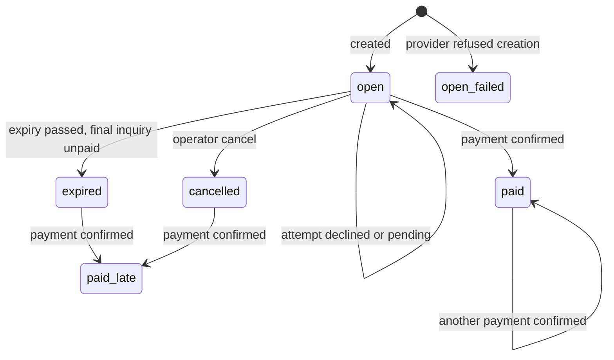
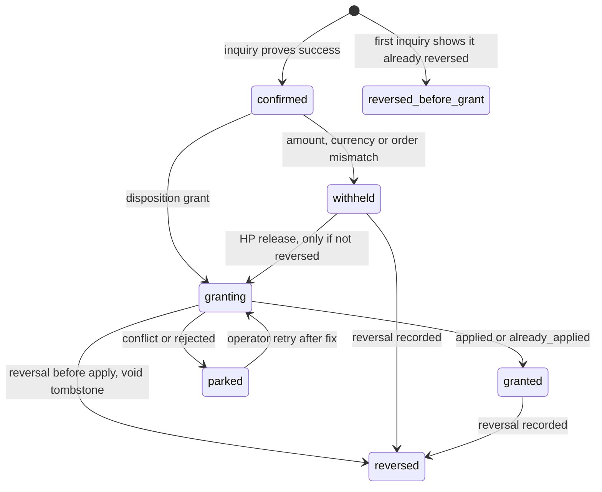
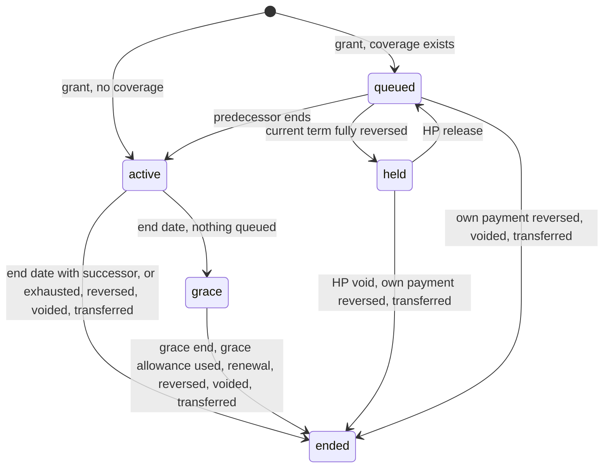
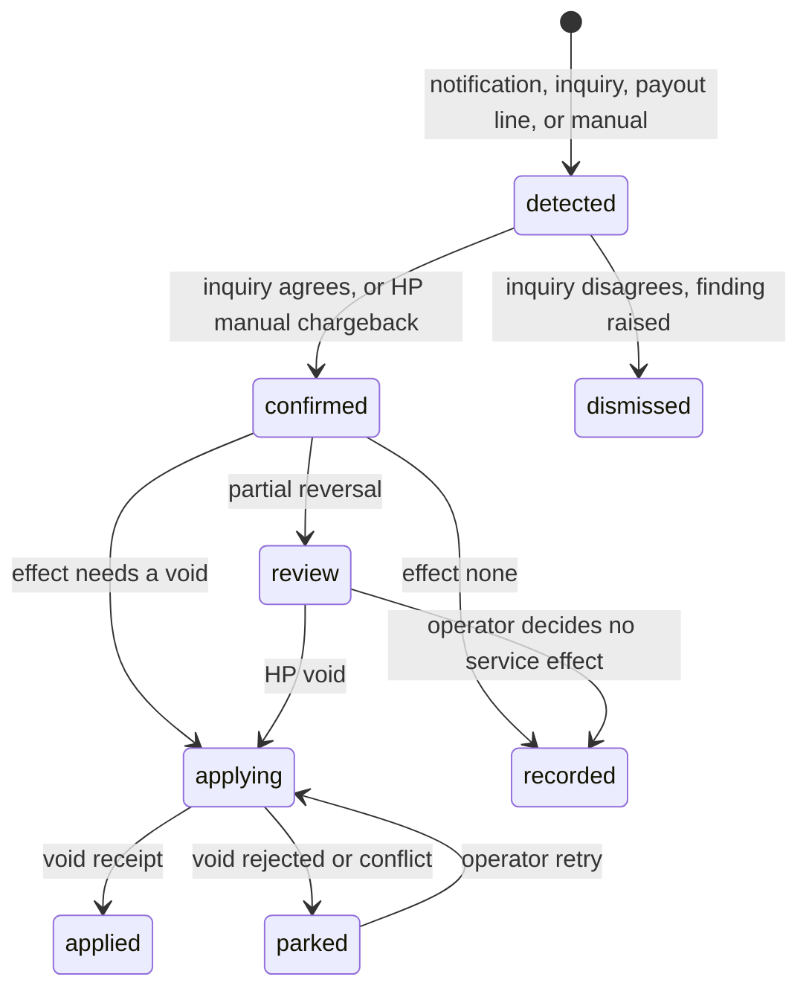
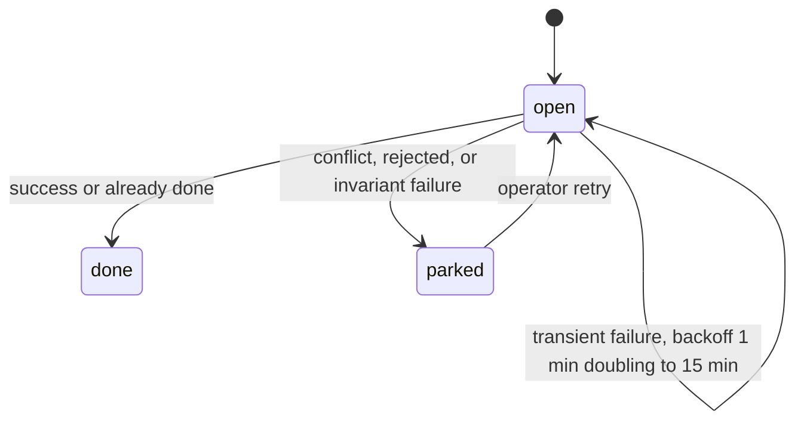

# AI Billing Orchestrator — Data Model and Lifecycle

**Status:** Phase 2 design. **Date:** 2026-10-01. Requirement IDs refer to the [seed](00-abo-requirements-seed.md); "01 §n" to the [decision memo](01-abo-design-decisions.md); "02 §n" to [architecture and threat model](02-abo-architecture-and-threat-model.md); "04 §n" to [contracts](04-abo-contracts.md). Column lists name the fields that carry meaning. Surrogate keys, `created_at` and `contract_version` exist on every record unless stated otherwise.

## Table of Contents

1. [Stores and authority](#1-stores-and-authority)
2. [ABO records](#2-abo-records)
   - [Conventions](#21-conventions)
   - [Offers and terms of sale](#22-offers-and-terms-of-sale)
   - [Billing contact](#23-billing-contact)
   - [Checkout](#24-checkout)
   - [Evidence](#25-evidence)
   - [Payment](#26-payment)
   - [Reversal](#27-reversal)
   - [Grant requests](#28-grant-requests)
   - [Work rows](#29-work-rows)
   - [Alerts, findings, audit and payouts](#210-alerts-findings-audit-and-payouts)
   - [Paymob adapter tables](#211-paymob-adapter-tables)
3. [AI Platform records](#3-ai-platform-records)
   - [Per-clinic DO storage](#31-per-clinic-do-storage)
   - [D1](#32-d1)
   - [R2](#33-r2)
4. [Shared backend records](#4-shared-backend-records)
5. [Lifecycles](#5-lifecycles)
   - [Checkout](#51-checkout)
   - [Payment](#52-payment)
   - [Grant](#53-grant)
   - [Term](#54-term)
   - [Reversal](#55-reversal)
   - [Work row](#56-work-row)
   - [Clinic coverage state](#57-clinic-coverage-state)
6. [Coverage rules](#6-coverage-rules)
   - [Placement and dates](#61-placement-and-dates)
   - [Admission and settlement](#62-admission-and-settlement)
   - [Exhaustion and succession](#63-exhaustion-and-succession)
   - [Grace](#64-grace)
   - [Fallback when the DO is unreachable](#65-fallback-when-the-do-is-unreachable)
   - [Overshoot bound](#66-overshoot-bound)
   - [Events and write budget](#67-events-and-write-budget)
   - [Worked examples](#68-worked-examples)
7. [Identifiers and references](#7-identifiers-and-references)
8. [Retention and immutability](#8-retention-and-immutability)

---

## 1. Stores and authority

Each fact has one authoritative store. Copies exist for evidence, rebuild and display only.

| Record family                                                    | Authority                    | Copies                                                    | Written by                     |
| ---------------------------------------------------------------- | ---------------------------- | --------------------------------------------------------- | ------------------------------ |
| Offers, checkouts, payments, reversals, grant requests           | ABO D1                       | ABO R2 NDJSON ledger (locked prefix); D1 Time Travel      | ABO                            |
| Billing contacts (payer personal data)                           | ABO D1                       | D1 Time Travel only; never in the ledger copy (§2.3)      | ABO                            |
| Raw provider notifications and inquiry answers                   | ABO R2 (`evidence/`, not locked) | Hash in ABO D1                                        | ABO                            |
| Terms, grants, allowance counters, reservations                  | Per-clinic DO (SQLite)       | D1 `grant_ledger`, `coverage_mirror`, `coverage_event`; R2 grant ledger | AI Platform DO           |
| Usage records                                                    | Platform D1 `usage_event`    | `usage_rollup`                                            | AI Platform Worker             |
| Tenant bindings, plan versions, registered keys and credentials  | Platform D1                  | —                                                         | AI Platform (via `VendorEntrypoint`) |
| Per-tenant AI status projection                                  | Backend `ai_internal`        | —                                                         | Backend feed puller only       |
| Tenancy and membership (precondition R-1)                        | Backend                      | —                                                         | Backend                        |

## 2. ABO records

### 2.1 Conventions

- Ids are ULIDs with 80 random bits, so they are unguessable. Money is an integer in minor units plus an ISO 4217 currency. Times are UTC ISO-8601.
- Tables marked **append-only** carry D1 `BEFORE UPDATE` and `BEFORE DELETE` triggers that abort (RC-01). Current state lives in separate, small, mutable status tables that can be recomputed from the facts.
- Every insert into an append-only table also inserts a `fact_log` row (`fact_seq`, table, key, SHA-256 of the canonical row). A separate `fact_export` table records which facts have been exported, and the exporter writes one NDJSON object per fact under the locked R2 prefix `ledger/` (RC-03). No append-only table or export holds payer contact values; they refer to a `billing_contact` version and hash (§2.3).
- `contract_version` on a record is the version of the message that created it (04 §7). Stored payloads are read with the version they were written in and are never rewritten.
- Every query is keyed by `org_id` wherever a tenant is involved, and backed by an index (01 §3.3, query cost).

### 2.2 Offers and terms of sale

| Table            | Kind        | Fields                                                                                                                                                                                                                                                    |
| ---------------- | ----------- | --------------------------------------------------------------------------------------------------------------------------------------------------------------------------------------------------------------------------------------------------------- |
| `offer`          | append-only | `offer_id`, `code` (stable slug)                                                                                                                                                                                                                          |
| `offer_version`  | append-only | `offer_id`, `version`, `plan_id`, `plan_version`, `term_unit` (always `month`; staging compresses time, §6.1), `term_count` (1, 3 or 12), `price_minor`, `currency`, `allowance_credits`, `grace_days` (7), `grace_cap_rule` (`proportional`, §6.4), `copy` (per-locale name and summary), `terms_version`, `published_by`, `assertion_sha256` |
| `offer_event`    | append-only | `offer_id`, `kind` (`published`, `retired`, `reinstated`), `version`, `actor`, `at`                                                                                                                                                                       |
| `terms_version`  | append-only | `terms_version`, `locale`, `text_r2_key`, `text_sha256`, `published_by`                                                                                                                                                                                   |

An offer is **sellable** when its latest event is `published`; the sellable version is the latest published one. Publishing or retiring is an HP action (02 §3.3) because it changes what money buys. Past prices remain in `offer_version` (FR-04).

### 2.3 Billing contact

| Table             | Kind        | Fields                                                                         |
| ----------------- | ----------- | ------------------------------------------------------------------------------ |
| `billing_contact` | insert-only, erasable | `org_id`, `version`, `name`, `email`, `phone`, `contact_sha256`, `created_by_sub`, `erased_at`, `erased_by` |

The latest version is current (FR-51). A checkout records the version it used and its `contact_sha256`; no other table or export holds the values. Rows are never updated except by the operator's erasure action (05 §3.2), which blanks `name`, `email` and `phone` for every version of one tenant, sets `erased_at`, and deletes that tenant's raw provider bodies (§2.5). The hashes stay, so the ledger still proves which contact version each checkout used. An erased tenant must enter a new contact before its next checkout. The legal basis and timing of erasure follow the R-9 advice (01 §7).

### 2.4 Checkout

| Table             | Kind        | Fields                                                                                                                                                                                                                                                                                            |
| ----------------- | ----------- | ------------------------------------------------------------------------------------------------------------------------------------------------------------------------------------------------------------------------------------------------------------------------------------------------- |
| `checkout`        | append-only | `checkout_id`, `reference`, `org_id`, `created_by_sub`, `client_request_id` (unique per org), `offer_id`, `offer_version`, snapshot: `plan_id`, `plan_version`, `term_unit`, `term_count`, `allowance_credits`, `grace_days`, `grace_cap_rule`, `list_price_minor`, `charged_price_minor`, `adjustment_id` (null, X-08), `currency`, `terms_version`, `billing_contact_version`, `billing_contact_sha256`; `opened_with_coverage_through` (I-8), `coverage_source` (`live`, `view`); `provider_id` (X-03); `initiator` (`payer`, X-04); `expires_at` |
| `checkout_event`  | append-only | `checkout_id`, `kind` (`opened`, `open_failed`, `attempt_declined`, `attempt_pending`, `paid`, `expired`, `cancelled`, `late_paid`), `source` (`callback`, `inquiry`, `operator`, `system`), `ref`, `actor`, `at`                                                                                   |
| `checkout_status` | mutable     | `checkout_id`, `state` (§5.1), `last_event_at`                                                                                                                                                                                                                                                    |

The snapshot is what gets charged and granted (FR-16, A7, A8). `opened_with_coverage_through` is the clinic's projected coverage end, read live with `getCoverage` when the checkout opens; it drives duplicate classification (§5.2) and the `starts` projection shown before paying (04 §2.2). If `getCoverage` fails or answers `transient`, the ABO uses its `coverage_view` copy instead and records `coverage_source = view`, so a platform outage never blocks a sale; the only cost is a possibly less accurate duplicate label and projection. A new checkout does not supersede an open one; both stay payable (FR-15).

### 2.5 Evidence

| Table            | Kind        | Fields                                                                                                                                                                          |
| ---------------- | ----------- | ------------------------------------------------------------------------------------------------------------------------------------------------------------------------------- |
| `notification`   | append-only | `notification_id`, `provider_id`, `channel` (`processed`, `response`), `hmac_valid`, `body_r2_key`, `body_sha256`, `dedupe_key`, `checkout_id`, `disposition` (`enqueued`, `duplicate`, `unmatched`) |
| `inquiry_result` | append-only | `inquiry_id`, `subject` (checkout or payment), `normalized_state`, `cumulative_reversed_minor`, `raw_r2_key`, `raw_sha256`, `at`. Written only when the result differs from the previous one (01 §3.3) |

Raw bodies live under the R2 prefix `evidence/`, outside the locked `ledger/` prefix, because provider bodies contain the payer's contact data and must stay erasable (§2.3). The D1 rows keep their hashes, so erasing a body leaves proof that it existed. Bodies that fail HMAC are not stored as evidence. A counter is kept, plus a sample of at most 10 bodies per hour under a 30-day R2 prefix, so a provider format change (A23) can be diagnosed.

### 2.6 Payment

| Table            | Kind        | Fields                                                                                                                                                                                                                                                                                                             |
| ---------------- | ----------- | ------------------------------------------------------------------------------------------------------------------------------------------------------------------------------------------------------------------------------------------------------------------------------------------------------------------ |
| `payment`        | append-only | `payment_id` (§7), `reference`, `org_id`, `checkout_id`, `provider_id`, `amount_minor`, `currency`, `paid_at`, `confirmed_at`, `confirmation_inquiry_id`, `offer_id`, `offer_version`, `billing_contact_version`, `classification` (`normal`, `likely_duplicate`, `late`), `disposition` (`grant`, `withheld_mismatch`, `reversed_before_grant`), `mismatch_detail`, `evidence_sha256` |
| `payment_release`| append-only | `payment_id`, `operator_action_id`, `at`. The HP release of a withheld payment                                                                                                                                                                                                                                      |

A payment exists only after the authenticated inquiry confirms it (01 §3.3). A confirmed success with the wrong amount, currency or order is still recorded, as `withheld_mismatch`: money was received, so it must be recorded (G4), but nothing is granted automatically (FR-16). A success that the first inquiry already shows as fully refunded or voided is recorded as `reversed_before_grant`, with its reversal attached, and grants nothing (FR-42, FR-50).

### 2.7 Reversal

| Table              | Kind        | Fields                                                                                                                                                                                                                                                                                  |
| ------------------ | ----------- | --------------------------------------------------------------------------------------------------------------------------------------------------------------------------------------------------------------------------------------------------------------------------------------- |
| `reversal`         | append-only | `reversal_id`, `reference`, `payment_id`, `source` (`provider`, `operator`, `vendor`; `vendor` is rejected at launch, X-01), `kind` (`refund`, `void`, `chargeback`, `unknown`), `amount_minor`, `cumulative_reversed_minor`, `is_full`, `detected_via` (`notification`, `inquiry`, `payout`, `manual`), `recorded_by`, `evidence_sha256`, `effect` (§5.5) |
| `reversal_outcome` | append-only | `reversal_id`, `result`, `receipt`, `at`                                                                                                                                                                                                                                                |

### 2.8 Grant requests

| Table             | Kind        | Fields                                                                                                                                                                                              |
| ----------------- | ----------- | --------------------------------------------------------------------------------------------------------------------------------------------------------------------------------------------------- |
| `grant_request`   | append-only | `grant_id` (§7), `org_id`, `source_kind` (`paid`, `complimentary`, `transfer`), `source_ref` (payment, operator action or transfer), `envelope` (canonical JSON, 04 §1.4), `envelope_sha256`, `assertion` (complimentary only) |
| `grant_outcome`   | append-only | `grant_id`, `result` (`applied`, `already_applied`, `conflict`, `rejected`), `abo_kid` and `abo_signature` used by the accepted attempt (paid only), `receipt` (platform-signed), `term_ids`, `at`. Each attempt signs with the ABO's current key, so a key rotation needs no new request |

Every payment with disposition `grant` has exactly one `grant_request` (FR-80), and so does every released withheld payment.

### 2.9 Work rows

| Table  | Kind    | Fields                                                                                                                                                                                                              |
| ------ | ------- | ------------------------------------------------------------------------------------------------------------------------------------------------------------------------------------------------------------------- |
| `work` | mutable | `work_id`, `kind` (`confirm`, `grant`, `reverse`, `sweep_checkout`, `sweep_payment`, `transfer_step`), `subject_id`, `dedupe_key` (unique), `state` (§5.6), `attempts`, `next_attempt_at`, `lease_until`, `last_error` |

Work rows are operational, not commercial facts, so they are mutable. The index is `(state, next_attempt_at)`. A runner takes a row with a conditional update on `lease_until`, so an inline attempt and the cron never process the same row at once.

**Step atomicity.** A runner finishes a step with one D1 batch that inserts the step's facts (with their `fact_log` rows), inserts the next step's work row, and sets its own row to `done`, conditional on still holding the lease. If the batch fails, nothing is written and the row is retried. The notification intake does the same: the `notification` row and its `confirm` work row are one batch. So every payment with disposition `grant` has a `grant` work row from the moment it exists, and a stall always shows up as an open row (AL-01).

### 2.10 Alerts, findings, audit and payouts

| Table                | Kind        | Fields                                                                                                                                                  |
| -------------------- | ----------- | ------------------------------------------------------------------------------------------------------------------------------------------------------- |
| `alert`              | mutable     | `alert_key` (code plus subject), `code`, `severity`, `first_at`, `last_at`, `count`, `send_state`, `next_send_at`, `resolved_at`. Deduplicates sends (NFR-02) |
| `finding`            | append-only | `finding_id`, `kind` (05 §3), `subject`, `detail`, `detected_at`                                                                                       |
| `finding_resolution` | append-only | `finding_id`, `resolved_by`, `note`, `at`                                                                                                              |
| `operator_action`    | append-only | `action_id`, `actor_email`, `access_jti`, `action`, `subject`, `params_sha256`, `assertion_sha256`, `result` (FR-73)                                     |
| `payout_import`      | append-only | `import_id`, `provider_id`, `file_sha256`, `r2_key`, `imported_by`, `period`                                                                           |
| `payout_line`        | append-only | `import_id`, `line_no`, `kind` (`payment`, `refund`, `chargeback`, `fee`, `other`), `gross_minor`, `fee_minor`, `net_minor`, `settled_at`, `payment_id` (null if unmatched) |
| `coverage_view`      | mutable     | `org_id`, `binding_epoch`, `clinic_seq`, `snapshot`. The ABO's copy of the platform feed, for the console, grant-origin reconciliation and the checkout fallback (§2.4); applied by the same ordering rule as the backend (§4) |
| `feed_cursor`        | mutable     | Last platform `feed_seq` read                                                                                                                           |

### 2.11 Paymob adapter tables

These hold every Paymob identifier, so none reaches the domain (G6, SR-10). Only the adapter module reads or writes them.

| Table               | Fields                                                                                                                      |
| ------------------- | --------------------------------------------------------------------------------------------------------------------------- |
| `paymob_intention`  | `checkout_id`, `intention_id`, `order_id`, `client_secret`, `special_reference`, `expires_at`                               |
| `paymob_txn`        | `txn_id`, `order_id`, `checkout_id`, `payment_id`, `parent_txn_id`, `last_state_key`                                        |
| `paymob_state_seen` | `dedupe_key` (unique: txn, normalized state, cumulative reversed amount; SR-02), `source`, `first_seen_at`                    |

## 3. AI Platform records

### 3.1 Per-clinic DO storage

The DO already uses SQLite storage (`ai-platform/wrangler.toml:17-19`). The JSON blob state (`src/quota-do/index.ts:57-69`) is replaced by four tables. Only `hot` is written on the request path (01 §3.2, write budget).

| Table    | Rows                      | Fields                                                                                                                                                                                                                                                                                                                                          |
| -------- | ------------------------- | ----------------------------------------------------------------------------------------------------------------------------------------------------------------------------------------------------------------------------------------------------------------------------------------------------------------------------------------------- |
| `hot`    | 1                         | `suspended`, `transferred_out_to`, `awaiting_transfer`, `transfer_pending`, `active_term_id`, `used`, `reserved`, `grace_base_used` (usage when grace started), `reservations` (at most 16: id, weight, term id, capability, admitted at), `replay` and `idempotency` entries (swept on each write, kept at least the 2-hour horizon), `band_emitted`, `binding_epoch`, `clinic_seq`, `next_alarm_at` |
| `term`   | One per term              | `term_id`, `grant_id`, `origin_grant_id` (the grant that first created the term, kept across transfers, §5.5), `position`, `state` (§5.4), `end_reason`, `plan_snapshot` (plan id and version, display name, capabilities, max cost class, concurrency limit), `allowance`, `used_final`, `duration_unit`, `duration_count`, `grace_days`, `grace_cap`, `calendar_start`, `starts_at`, `ends_at`, `grace_ends_at`, `ended_at`                 |
| `grant`  | One per grant             | `grant_id`, `kind` (`term`, `term_adjustment`), `source_kind`, `envelope_sha256`, `envelope`, `evidence`, `receipt`, `applied_at`, `voided_at`, `void_reason`                                                                                                                                                                                      |
| `outbox` | Transient                 | `seq`, `kind` (`coverage_event`, `grant_ledger`, `usage_adjustment`, `alert`), `payload`. Shipped to D1 by the alarm, then deleted                                                                                                                                                                                                                |

### 3.2 D1

| Table                  | Change   | Fields and notes                                                                                                                                                                                         |
| ---------------------- | -------- | -------------------------------------------------------------------------------------------------------------------------------------------------------------------------------------------------------- |
| `issuer_key`           | New      | `kid`, `issuer`, `public_key`, `status` (`active`, `retiring`, `revoked`), `not_before`, `not_after`, `registered_by`, `assertion_sha256`                                                                 |
| `service_key`          | New      | `kid`, `service` (`abo`), `public_key`, `status`, `registered_by`, `assertion_sha256`                                                                                                                    |
| `tenant_binding`       | New      | `org_id`, `installation_id`, `epoch` (1 for the first binding of an org, +1 per re-creation), `status` (`active`, `held_for_transfer`, `retired`), `retired_at`, `reason`. A partial unique index allows at most one binding per `org_id` that is `active` or `held_for_transfer`, so an org never has two live identities (§5.4) |
| `installation`         | Kept     | Now the platform clinic identity. `status` is unconstrained text (`migrations/20260731120000_platform_schema.sql:8`) and already uses `deleted` (`src/control/lifecycle.ts:27`); the row is never removed (RC-05) |
| `plan_version`         | New      | `plan_id`, `version`, `display_name`, `capabilities`, `max_cost_class`, `concurrency_limit`, `max_allowance_per_month`, `status` (`published`, `retired`), `published_by`, `assertion_sha256`. Immutable once published (P-04, P-05) |
| `ceiling_policy`       | New      | Versioned (refines 01 I-10; allowance is counted in months of the plan's `max_allowance_per_month`). Per complimentary grant: ≤ 31 days and ≤ 1 month of allowance. Per clinic per 90-day window: ≤ 62 days (including adjustment extensions) and ≤ 2 months of allowance (including adjustment additions). Paid grants: `grace.days` ≤ 7 and `cap_rule = proportional`. `set_by`, `assertion_sha256` |
| `coverage_mirror`      | New      | `installation_id`, `org_id`, `binding_epoch`, `clinic_seq`, `state`, `suspended`, `hard_stop_at`, `term_snapshot`. Written only on events; never admits by itself (§6.5)                                |
| `coverage_event`       | New      | `feed_seq` (autoincrement, the global cursor), `event_id` (unique), `org_id`, `installation_id`, `binding_epoch`, `clinic_seq`, `kind`, `snapshot`, `at`. Never purged                                 |
| `grant_ledger`         | New      | `grant_id`, `origin_grant_id`, `org_id`, `installation_id`, `kind`, `source_kind`, `operator_credential_id`, `envelope_sha256`, `receipt`, `applied_at`. Append-only; indexes on `(org_id, applied_at)`, `(origin_grant_id)` and `(operator_credential_id, applied_at)` (SR-25) |
| `grant_void`           | New      | `grant_id`, `reason`, `source` (reversal or operator), `evidence_sha256`, `at`. Append-only. A void may precede its grant: it is then a tombstone, and a later `grant` with that id is `rejected` with `voided` (§5.5) |
| `transfer`, `transfer_step` | New | Transfer authorisation, package and steps (§5.4, 04 §1.3)                                                                                                                                              |
| `operator_credential`  | New      | `credential_id`, `operator_email`, `public_key_cose`, `alg`, `status` (`pending`, `active`, `revoked`), `activates_at`, `approved_by`, `revoked_by`                                                      |
| `assertion_used`       | New      | `challenge_sha256`, `credential_id`, `used_at`. Single-use guard, swept after a day                                                                                                                      |
| `fallback_admission`   | Replaces `grace_admission_queue` | `installation_id`, `idempotency_key`, `term_id`, `weight`, `admitted_at`, `state` (`pending`, `settled`); index on `state`                                     |
| `usage_event`          | Changed  | `term_id` replaces `period` (P-15); unique index on `request_id`, so the journal row and a DO `usage_adjustment` for the same request cannot both count (§6.2)                                            |
| `usage_rollup`         | Changed  | Dimensions `{installation_id, term_id}`                                                                                                                                                                 |
| `platform_alert`       | New      | Same shape as the ABO's `alert`                                                                                                                                                                         |
| `feed_consumer`        | New      | `consumer`, `last_pull_at`, `last_cursor`; lets the ABO alert when the backend stops pulling                                                                                                             |
| `control_audit`        | Changed  | `actor` becomes the Access email; adds `assertion_sha256`                                                                                                                                               |
| `installation_key`, `entitlement`, `plan`, `credit_price`, `invoice`, `grace_admission_queue` | Dropped | Pre-launch, so there is no data to migrate. P-06, P-02, P-04, P-13                                                                         |

### 3.3 R2

`grant-ledger/` holds one NDJSON object per grant and per void, with its receipt, under a bucket lock (RC-03, RC-05). The existing request-envelope prefixes are unchanged.

## 4. Shared backend records

All of these live in the non-exposed `ai_internal` schema and are reached only through definer RPCs (SR-07).

| Object                           | Change  | Fields and notes                                                                                                                                                              |
| -------------------------------- | ------- | ----------------------------------------------------------------------------------------------------------------------------------------------------------------------------- |
| Tenancy (R-1)                    | Precondition | Membership `(user, organization, role)`; per-user active-org record `user_active_organization (user_id PK, organization_id, updated_at)` — one mutable row per user, written by the access-token hook and by `set_active_organization`, and the source of the session's `active_org` claim; `current_org_id()` re-checks membership |
| `ai_internal.issuer_key`         | New     | `kid`, `public_key`, `secret_ref` (Vault id, or signer reference per R-3), `status`, `not_before`, `not_after`                                                                  |
| `ai_internal.clinic_ai_coverage` | New     | `organization_id`, `installation_id`, `binding_epoch`, `clinic_seq`, `state`, `term_ref`, `plan_display_name`, `starts_at`, `ends_at`, `grace_ends_at`, `allowance`, `used`, `band`, `queued_count`, `held_count`, `suspended`, `event_at`, `applied_at`. No prices, no provider data (SR-10) |
| `ai_internal.feed_state`         | New     | Singleton: `cursor`, `pending_request_id`, `pending_since`, `last_success_at`, `consecutive_failures`                                                                           |
| `ai_internal.ai_token_issuance`  | Changed | Adds `aud` and `organization_id`; rate limit applies per audience                                                                                                              |
| `ai_internal.app_settings`       | Changed | Adds `ai.platform_base_url`, `ai.abo_base_url`, `ai.issuer_id`, and `ai.contract_versions` (the current and minimum version per channel the backend sends or accepts, 04 §7); removes `ai.availability` (`20260802140000_ai_availability_flag.sql:3-40`)                                    |
| `ai_internal.installation_keys` and its single-installation trigger | Dropped | `20260801120000_ai_keystore_schema.sql:51-117` (T-3, T-4)                                                                    |

**Ordering rule** for the projection and the ABO's `coverage_view`: an event replaces the stored snapshot only if `(binding_epoch, clinic_seq)` is greater than the stored pair. A re-created identity starts a higher epoch, so its first events win even though its `clinic_seq` restarts at 1 (FR-72, A14).

## 5. Lifecycles

### 5.1 Checkout

A checkout never blocks another one (FR-15). Paymob intentions cannot be cancelled, so `cancelled` and `expired` are ABO-side states. A late payment is honoured at the checkout's snapshot and alerted (G3). The sweep keeps inquiring expired and cancelled checkouts for 7 days (01 §3.3).

The desktop shows a derived progress state (FR-14):

| Shown     | When                                                                          |
| --------- | ----------------------------------------------------------------------------- |
| Waiting   | `open` with no attempt, or with a pending attempt                             |
| Failed    | `open` and the last attempt was declined; the same page can still be retried (A5) |
| Paid      | `paid` or `paid_late`, grant not yet applied                                  |
| Active    | The grant outcome is `applied` or `already_applied`                           |
| Abandoned | `expired`, `cancelled` or `open_failed` with no payment                       |

### 5.2 Payment

A payment is a single immutable fact. Its lifecycle is the facts that follow it.

A full reversal that arrives while the grant is still `granting` or `parked` sends `voidForReversal` at once. The platform stores it as a tombstone, so the pending grant is `rejected` with `voided` when it arrives, and the ABO closes that work row (§5.5). An HP release is refused for a payment that has a full reversal.

Classification is set once, at confirmation:

- `likely_duplicate`: an earlier confirmed payment of the same tenant came from a checkout with the same `opened_with_coverage_through` (01 I-8). It is granted like any other payment; it stacks as the next term (FR-41, A6), and the owner and operator are told.
- `late`: the checkout was `expired` or `cancelled`.
- `normal`: everything else.

### 5.3 Grant

Grant kinds and sources:

| Kind              | Source          | Authorization (02 §3.3) | Effect                                                            |
| ----------------- | --------------- | ----------------------- | ----------------------------------------------------------------- |
| `term`            | `paid`          | M + ABO signature       | Appends a term (§6.1)                                             |
| `term`            | `complimentary` | HP                      | Appends a term; trials, goodwill, corrections, extensions (FR-35, A20) |
| `term`            | `transfer`      | Covered by the transfer's HP authorisation | Recreates moved terms on the new identity, keeping each term's `origin_grant_id` (FR-72) |
| `term_adjustment` | `complimentary` | HP                      | Changes the active term's plan version, adds allowance or extends its end date (FR-32). A paid source is rejected at launch (X-06, X-07) |

`source.kind` selects the authorization class of the one `grant` method. Complimentary and transfer grants must carry `operator_email` and `reason` (FR-36). Every grant is placed by the rules of §6.1; `placement = immediate` is rejected at launch, and FR-32's immediate upgrade is a `term_adjustment`. On the platform a grant is `applied` or, later, `voided`. On the ABO the request moves through `granting`, `granted` and `parked` as in §5.2. The platform's answer tells "already done" apart from failure (NFR-03, 04 §1.4).

### 5.4 Term

| From            | Trigger                                              | To             | `end_reason`       | Side effects                                                                                          |
| --------------- | ---------------------------------------------------- | -------------- | ------------------ | ----------------------------------------------------------------------------------------------------- |
| —               | Grant with no active, grace or unheld queued term    | active         | —                  | `starts_at = calendar_start = now` (01 I-2); dates per §6.1                                            |
| —               | Grant while active or queued terms exist             | queued         | —                  | Appended at the end of the queue (FR-21)                                                              |
| —               | Grant during grace                                   | active         | —                  | `calendar_start` = the grace term's `ends_at` (01 I-5); the grace term ends `renewed`                  |
| queued          | Predecessor reaches its end date                     | active         | —                  | `starts_at = calendar_start` = predecessor's `ends_at`                                                |
| queued          | Predecessor ends early (exhausted, voided)           | active         | —                  | `starts_at = calendar_start` = that instant (FR-33, A32)                                              |
| active          | `ends_at` reached, successor exists                  | ended          | `expired`          | Successor activates                                                                                   |
| active          | `ends_at` reached, nothing queued                    | grace          | —                  | Grace window and allowance per §6.4                                                                   |
| active          | Reservation takes the last of the allowance          | ended          | `exhausted`        | No grace; successor activates at once (§6.3)                                                          |
| grace           | `grace_ends_at` reached                              | ended          | `expired`          | Clinic becomes lapsed                                                                                 |
| grace           | Reservation takes the last of the grace allowance (§6.4) | ended      | `grace_exhausted`  | Clinic becomes lapsed                                                                                 |
| active or grace | Full reversal of this term's payment                 | ended          | `reversed`         | Queued terms become `held` (01 I-3)                                                                   |
| queued or held  | Full reversal of this term's own payment             | ended          | `reversed`         | Removed from the queue; other terms unaffected                                                        |
| held            | HP release                                           | queued         | —                  | Re-appended at the end                                                                                |
| any not ended   | Grant voided (HP, SR-25)                             | ended          | `voided`           | If it was active, the successor activates                                                            |
| any not ended   | `transfer_out`                                       | ended          | `transferred`      | Remaining value (days and allowance of the active term; queued and held terms as they are) goes into the transfer package with each `origin_grant_id`; the DO then rejects new grants with `transferred_out` |
| active          | `term_adjustment` grant                              | active         | —                  | New plan snapshot, allowance or `ends_at`; recorded as its own grant                                  |

A term ended by an old payment's reversal is only recorded; nothing else changes (FR-43, A17). Suspension changes no term: the calendar keeps running (01 I-4).

**Deletion with coverage left.** `deleteInstallation` on an identity that still has an active, grace, queued or held term does not retire its binding: the binding becomes `held_for_transfer`, the DO sets `transfer_pending`, and AL-18 fires. While it is held, admission answers `coverage_lapsed` with reason `transfer_pending`, grants for the org answer `transient` (so a renewal waits instead of landing on a second identity), and no new binding can be created for the org. The calendar keeps running, as for suspension; a complimentary grant can compensate. The operator then either runs `beginTransfer` from the held binding, or voids the remaining grants (HP), after which the binding is retired and the org's next token or grant creates a new binding with the next epoch. An identity with no coverage left is retired at once. A DO created by a transfer starts with `awaiting_transfer` set and answers every non-transfer grant with `transient` until `transferIn` completes, so moved terms keep their place ahead of new purchases.

### 5.5 Reversal

| Condition (by the grant lineage, below)                              | `effect`          | Platform action                                    |
| -------------------------------------------------------------------- | ----------------- | -------------------------------------------------- |
| Full; the payment's grant is not yet applied                          | `tombstone`       | Void stored first; the grant is later refused (§5.2) |
| Full; the payment funds the active or grace term                      | `end_current`     | Void: the term ends now with no grace; queued terms become held (FR-43, A15, A16) |
| Full; the payment funds a queued or held term                         | `remove_queued`   | Void: that term is removed                          |
| Full; the payment funds an ended term                                 | `none`            | Recorded only (A17)                                 |
| Partial                                                               | `review_partial`  | None at launch; the operator is alerted (X-01)      |

**Lineage.** `voidForReversal` names the paid `grant_id`. The platform follows `origin_grant_id` through the grant ledger to the term that now carries that value, on whichever installation holds it after any transfer. The effect is therefore the same before and after FR-72.

Every reversal alerts (FR-43). A partial reversal cannot be applied automatically because the platform rejects partial voids at launch (01 §5, X-01). A transient void answer keeps the row `applying`, retried like any work row.

### 5.6 Work row

Transient failures retry forever (NFR-01). An `open` row older than 5 minutes alerts (01 §3.3).

### 5.7 Clinic coverage state

Derived by the DO and carried in every feed snapshot. The backend status (04 §3) is computed from it.

| State         | Meaning                                                                                                    |
| ------------- | ---------------------------------------------------------------------------------------------------------- |
| `none`        | No term has ever been applied                                                                              |
| `active`      | An active term exists                                                                                      |
| `grace`       | The last term passed its end date; grace is running (FR-22)                                                |
| `lapsed`      | Grace ended, or grace allowance was used, with nothing queued                                              |
| `exhausted`   | The last term ended by exhaustion with nothing queued (FR-33)                                              |
| `reversed`    | The last term ended by a full reversal; `held_count` may be non-zero                                       |
| `transferred` | Coverage moved to another identity                                                                         |
| `transfer_pending` | The identity was deleted with coverage left and waits for the operator's transfer (§5.4); unavailable |
| `suspended`   | An overlay flag on any state; blocks admission and never adds time (FR-74)                                 |

## 6. Coverage rules

These rules run inside the DO's single-threaded execution (`blockConcurrencyWhile`, `ai-platform/src/quota-do/index.ts:363`). Every step that changes state writes the `hot` row once.

### 6.1 Placement and dates

- **Placement.** A term grant becomes active if there is no active, grace or unheld queued term; becomes active with a backdated calendar during grace; and otherwise queues at the end (§5.4). There is no `not_pending` refusal (P-02).
- **Units.** Paid terms use `month` only. Complimentary terms may use `month` or `day` (trials, A20 extensions, the FR-92 pilot grant), bounded by the ceilings.
- **End date.** `ends_at = add(calendar_start, duration_unit, duration_count)`. For months: the same day-of-month and time in UTC, clamped to the last day of a shorter month. For days: exact multiples of 24 hours.
- **Staging time scale (NFR-07).** Staging sets `DURATION_SCALE`, which maps 1 month to 30 minutes and 1 day to 1 minute. Every duration, grace window and allowance rule is computed in unscaled units and then scaled, so staging validates exactly as production. Production has no scale.
- **Queued terms store a duration, not dates.** They get dates when they activate.
- **Adjustments** can move `ends_at` later but never earlier, and never touch queued terms.

### 6.2 Admission and settlement

One admission per AI request, after rate limits (stage 4, which stays separate from allowance, FR-09):

1. Return a stored answer for a replayed `jti` or idempotency key, without writing.
2. Charge reservations older than 15 minutes to their terms (NFR-06).
3. Evaluate boundaries at the current time (§5.4), in order, until no transition applies.
4. Refuse in this order: `suspended`; then no active or grace term, which is `allowance_exhausted` if the last term ended by exhaustion, otherwise `coverage_lapsed` with a reason (`none`, `expired`, `grace_exhausted`, `reversed`, `transferred`, `transfer_pending`); then a capability outside the term's plan, which is `forbidden_capability`; then in-flight requests at the term's concurrency limit, which is `concurrency_limited` with `retry_after`. A refusal writes nothing unless step 2 or 3 changed state.
5. Reserve the capability's quota weight `w` against the active or grace term. Admission requires at least one credit left before reserving.
6. For an active term, if `used + reserved ≥ allowance`, end it `exhausted` (§6.3). For a term in grace, if `used + reserved − grace_base_used ≥ grace allowance`, end it `grace_exhausted` (§6.4).
7. Return the reservation id, the `term_id`, the plan snapshot (capabilities, max cost class) and the allowance band.

Settlement converts the reservation: a request that consumed provider capacity adds `w` to `used`; one that consumed nothing releases it. Either way the reservation stays attributed to its `term_id`, even if that term has since ended (NFR-06). The journal's `usage_event` carries the same `term_id`. A reservation charged in step 2 has no journal row yet, so the DO emits a `usage_adjustment` through the outbox, shipped to `usage_event` with the request's `request_id`. Both writers use insert-or-ignore on the unique `request_id`, and a settlement that arrives after the step-2 charge changes nothing in the DO. One request is therefore counted once.

### 6.3 Exhaustion and succession

The reservation that reaches the allowance ends the active term as `exhausted` in the same DO transaction (NFR-06, A34). The next unheld queued term activates at that instant with its full allowance (FR-21, FR-33, A32). If nothing is queued, the clinic is `exhausted` and gets no grace. Because the DO serializes admissions, exactly one request can cross the line, so exhaustion is recorded once. If the exhausting request later settles as "nothing consumed", its credits are released on the ended term, but the term stays ended: exhaustion is final.

### 6.4 Grace

- Grace starts when an active term reaches `ends_at` with no unheld queued term. `grace_ends_at = ends_at + grace_days`.
- At grace start the DO records `grace_base_used = used`. Grace allowance = min(allowance − used, `grace_cap`), where `grace_cap` = ⌈allowance × grace_days ÷ term length in days⌉ (01 I-6). Grace usage is charged to the same term.
- Grace ends at `grace_ends_at` (`expired`), or when the grace allowance is used (`grace_exhausted`). Either way the clinic becomes `lapsed`, and admission answers `coverage_lapsed`. A new grant during grace starts the new term's calendar at the old `ends_at` (01 I-5).
- There is no grace after exhaustion or after a full reversal (FR-22, FR-43).

### 6.5 Fallback when the DO is unreachable

When the DO call errors or takes longer than 2 seconds, admission reads `coverage_mirror` by primary key (never cached) and admits only if all of these hold:

- the state is `active` or `grace`, and the clinic is not suspended;
- now is before `hard_stop_at`, which is the active term's `ends_at`, or `grace_ends_at` in grace. That is the earliest time the calendar could stop service (FR-23);
- the capability is in the mirrored snapshot;
- this outage's pending `fallback_admission` weight plus `w` is at most 5 × `w_max`, where `w_max` is the largest quota weight among the published capabilities.

Otherwise it answers `coverage_unknown` (retryable). Every fallback admission is a `fallback_admission` row carrying its `term_id`. The platform's 5-minute cron drains pending rows into the DO, which charges them to their terms; nothing is dropped (P-12). Each fallback row carries the request's `request_id`. The drain skips any row whose `request_id` the DO still holds as a reservation or replay entry, or that already has a `usage_event`; the unique `request_id` index backs the second check durably. A DO call that timed out after reserving is therefore not charged twice, however long the outage.

### 6.6 Overshoot bound

This is the seed's §10 parameter and A34.

| Situation                   | Maximum usage beyond a term's allowance                  |
| --------------------------- | -------------------------------------------------------- |
| Normal operation            | `w_max − 1` credits (the one reservation that crosses)   |
| During a DO outage          | Additionally at most 5 × `w_max` per outage              |

The overshoot is charged to the term that exhausted, never to the next one (NFR-06).

### 6.7 Events and write budget

- **Events** are emitted through the outbox only on these changes: grant applied or voided; term activated, ended, held or released; grace started; allowance band crossed (75 % or 90 %, once per term per band); suspension changed; transfer. Each event carries the clinic's full coverage snapshot after the change, so a consumer that misses one event is corrected by the next.
- **The alarm** is set to the earliest of: the next boundary (`ends_at`, `grace_ends_at`) or a pending outbox. `setAlarm` is called only when that time moves. The alarm ships the outbox to D1 (`coverage_event`, `grant_ledger`, `grant_void`, `coverage_mirror`, `usage_event` for `usage_adjustment`, `platform_alert`) with `INSERT OR IGNORE` on event id or `request_id`, then deletes the shipped rows. `coverage_mirror` is replaced only by a higher `(binding_epoch, clinic_seq)`.
- **Write budget** (01 §3.2): admission and settlement write `hot` once each, so there are about 2 row writes per AI request. Term, grant and outbox rows are written only on events.

### 6.8 Worked examples

UTC throughout; the allowance is `A`.

| Scenario                                  | Timeline                                                                                                                                                                         |
| ----------------------------------------- | -------------------------------------------------------------------------------------------------------------------------------------------------------------------------------- |
| Early renewal (A9)                        | T1 monthly, 1 Mar 10:00 to 1 Apr 10:00. Renewal paid 27 Mar: T2 queued. T1 keeps its own allowance. At 1 Apr 10:00 the alarm ends T1 (`expired`); T2 runs 1 Apr 10:00 to 1 May 10:00 with a full `A` |
| Lapse and late reactivation (A11)         | T1 ends 1 Mar 10:00; grace to 8 Mar 10:00; lapsed. Payment 1 May 14:00: T2 active 1 May 14:00 to 1 Jun 14:00                                                                       |
| Renewal during grace (01 I-5)             | T1 ends 1 Mar 10:00; grace. Payment 4 Mar: T2 active now with `calendar_start` 1 Mar 10:00, ending 1 Apr 10:00. Grace usage stays on T1                                            |
| Exhaustion without a prepaid term (A31)   | Annual T1 from 1 Jan. On 1 May a request reaches `A`: T1 ends `exhausted`; state `exhausted`; no grace. A monthly purchase on 3 May 09:00 gives T2 from 3 May 09:00 to 3 Jun 09:00  |
| Exhaustion with a prepaid term (A32)      | Monthly T1 1 Mar to 1 Apr, T2 queued. A request on 20 Mar 15:00 reaches `A`: T1 ends; T2 active 20 Mar 15:00 to 20 Apr 15:00 with a full allowance                                |
| Month-end clamping                        | T1 from 31 Jan 10:00 ends 28 Feb 10:00 (29 Feb in a leap year). T2 then runs 28 Feb to 28 Mar, because each term counts from its own `calendar_start`                              |

## 7. Identifiers and references

| Identifier               | Form                                                                                  | Notes                                                                                   |
| ------------------------ | ------------------------------------------------------------------------------------- | --------------------------------------------------------------------------------------- |
| `org_id`                 | Backend tenant UUID                                                                   | The only tenant key across all three systems                                            |
| `installation_id`        | Platform clinic UUID                                                                  | Reached only through `tenant_binding`                                                   |
| Subscription reference   | `AIC-` plus 8 Crockford base-32 characters of SHA-256(`"sub-ref:"` ‖ `org_id`)        | Each system computes it with no lookup; stable across reinstalls and rotations (FR-66, A12, A13) |
| `payment_id`             | SHA-256(`"payment:"` ‖ `provider_id` ‖ `":"` ‖ provider transaction reference), hex   | Computed inside the adapter; the raw reference stays in the adapter's tables (SR-10)    |
| `grant_id`               | SHA-256 over `"grant:paid:"` ‖ `payment_id`; `"grant:comp:"` ‖ operator action id; or `"grant:transfer:"` ‖ `transfer_id` ‖ `":"` ‖ n | Deterministic, so retries are idempotent (NFR-02)           |
| State-change dedupe key  | provider, transaction, normalized state, cumulative reversed amount                  | SR-02; a refund re-sends the parent transaction with changed flags (01 §3.3)           |
| Coverage `event_id`      | `installation_id` ‖ `":"` ‖ `clinic_seq`                                              | Idempotent shipping and applying                                                        |
| Human references         | `CK-`, `PAY-`, `REV-`, `GR-` plus 8 base-32 characters of the record id               | Quotable by both the owner and support (FR-50)                                         |

## 8. Retention and immutability

| Record                                                                  | Kept                                         | Rule                                                                                                     |
| ----------------------------------------------------------------------- | -------------------------------------------- | -------------------------------------------------------------------------------------------------------- |
| ABO commercial facts (§2.2, §2.4–§2.8, `operator_action`, findings, payouts) | Until a retention policy is set (RC-03) | Append-only triggers; NDJSON copy under the bucket lock; D1 Time Travel covers 30 days                    |
| Billing contact values                                                  | Until erased by the operator (§2.3)          | Blanked in place on erasure; version and hash kept; Time Travel copies age out after 30 days (R-9)        |
| Raw verified notifications and inquiry answers                          | Until a retention policy is set, or the tenant's contact is erased | RC-02; hash kept in D1 after erasure                                              |
| Invalid-HMAC samples                                                    | 30 days                                      | Diagnosis only                                                                                           |
| Completed work rows, sent alerts                                        | 90 days                                      | Operational                                                                                              |
| Platform `grant_ledger`, `grant_void`, `coverage_event`, `transfer`, DO `term` and `grant` rows, `installation` rows | Never deleted | Excluded from purge (P-14, RC-05); purge marks the installation `deleted`                                 |
| Platform `usage_event`, requests, attempts                              | Existing retention                           | Usage is not a payment record (FR-53); purge may delete it, except `usage_event` rows of terms that have not ended, which a DO rebuild needs (05 §5) |
| Backend projection                                                      | Current snapshot only                        | Rebuilt by replaying the feed from cursor 0 (05 §5)                                                      |

