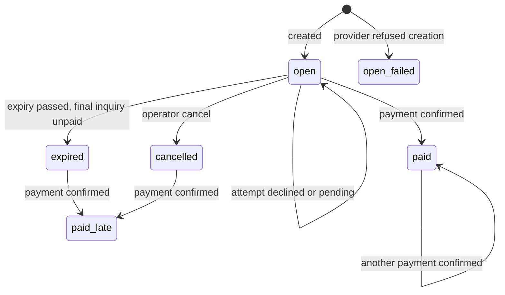
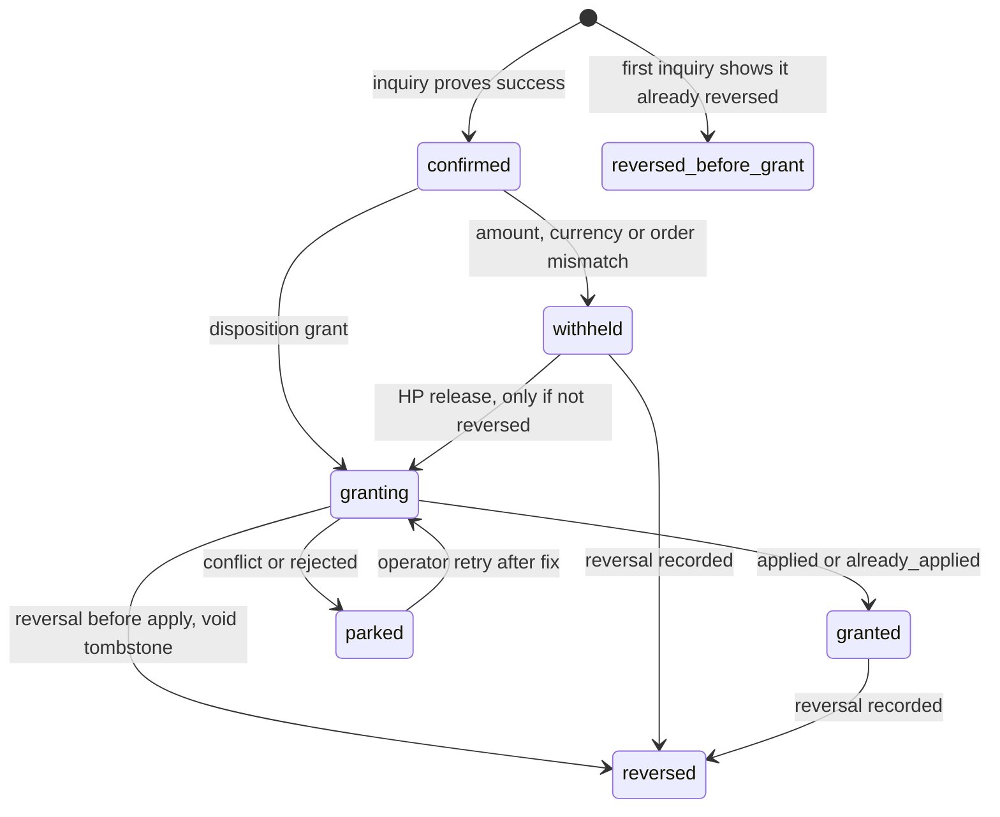
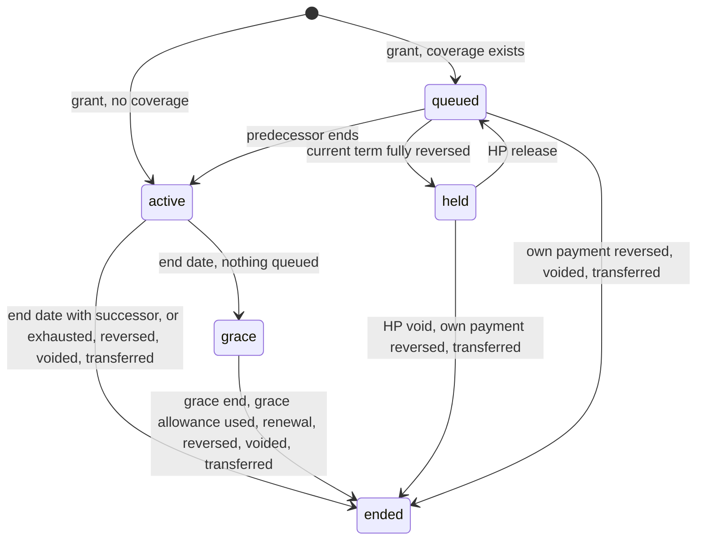
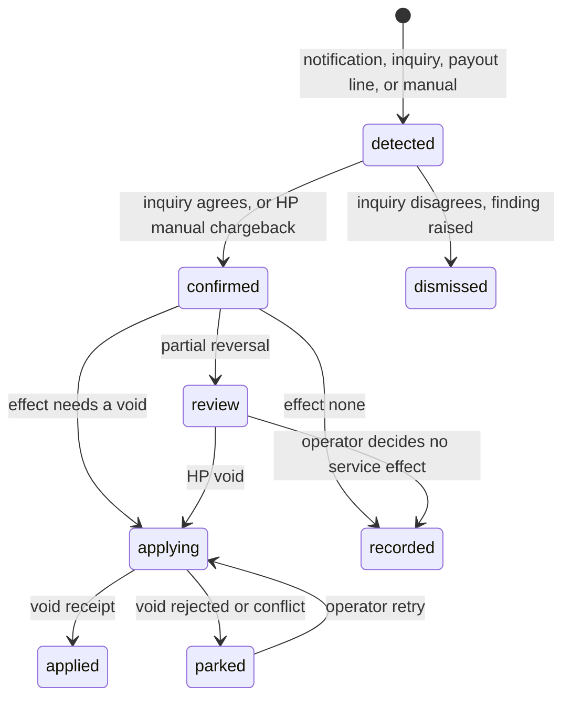
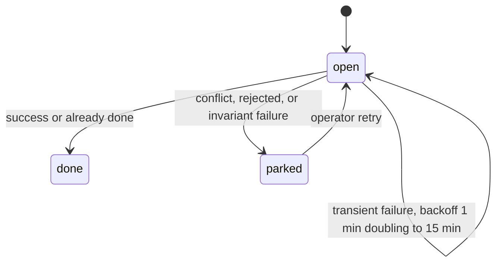

# AI Billing Orchestrator — Data Model and Lifecycle

**Status:** Phase 2 design. **Date:** 2026-10-01.

Start with section 0. It explains the purpose, the systems involved and every term used later. Sections 1 to 8 keep their numbers because the other design documents cite them (for example "03 §5.4").

## Table of Contents

0. [Start here: the big picture](#0-start-here-the-big-picture)
   - [What we are trying to achieve](#01-what-we-are-trying-to-achieve)
   - [The whole system in one analogy](#02-the-whole-system-in-one-analogy)
   - [The systems involved](#03-the-systems-involved)
   - [Where data is kept](#04-where-data-is-kept)
   - [Business words](#05-business-words)
   - [Technical words](#06-technical-words)
   - [One purchase, start to finish](#07-one-purchase-start-to-finish)
   - [How to read the rest of this document](#08-how-to-read-the-rest-of-this-document)
1. [Stores and authority](#1-stores-and-authority)
2. [ABO records](#2-abo-records)
   - [Conventions](#21-conventions)
   - [Offers and terms of sale](#22-offers-and-terms-of-sale)
   - [Billing contact](#23-billing-contact)
   - [Checkout](#24-checkout)
   - [Evidence](#25-evidence)
   - [Payment](#26-payment)
   - [Reversal](#27-reversal)
   - [Grant requests](#28-grant-requests)
   - [Work rows](#29-work-rows)
   - [Alerts, findings, audit and payouts](#210-alerts-findings-audit-and-payouts)
   - [Paymob adapter tables](#211-paymob-adapter-tables)
3. [AI Platform records](#3-ai-platform-records)
   - [Per-clinic DO storage](#31-per-clinic-do-storage)
   - [D1](#32-d1)
   - [R2](#33-r2)
4. [Shared backend records](#4-shared-backend-records)
5. [Lifecycles](#5-lifecycles)
   - [Checkout](#51-checkout)
   - [Payment](#52-payment)
   - [Grant](#53-grant)
   - [Term](#54-term)
   - [Reversal](#55-reversal)
   - [Work row](#56-work-row)
   - [Clinic coverage state](#57-clinic-coverage-state)
6. [Coverage rules](#6-coverage-rules)
   - [Placement and dates](#61-placement-and-dates)
   - [Admission and settlement](#62-admission-and-settlement)
   - [Exhaustion and succession](#63-exhaustion-and-succession)
   - [Grace](#64-grace)
   - [Fallback when the DO is unreachable](#65-fallback-when-the-do-is-unreachable)
   - [Overshoot bound](#66-overshoot-bound)
   - [Events and write budget](#67-events-and-write-budget)
   - [Worked examples](#68-worked-examples)
7. [Identifiers and references](#7-identifiers-and-references)
8. [Retention and immutability](#8-retention-and-immutability)

---

## 0. Start here: the big picture

### 0.1 What we are trying to achieve

AiClinic's desktop app has an optional, paid AI add-on. Today the vendor turns AI on for a clinic by hand. The **AI Billing Orchestrator (ABO)** makes it self-service: a clinic administrator picks an offer in the app, pays on the payment provider's web page, and AI switches on by itself within about a minute. It keeps working until the paid time or the paid usage runs out, and then it stops on time.

To do that safely, the vendor's systems must write down the right facts in the right places and follow exact rules about them. This document describes those facts and rules. It answers five questions:

1. **What is written down, and where?** Sections 1 to 4 list every record and the system that owns it.
2. **How does each thing change over its life?** Section 5 follows a checkout, a payment, a grant, a term, a reversal and a background task from birth to end.
3. **What exactly decides whether an AI request is allowed, and how is usage counted?** Section 6.
4. **How are things named and referenced?** Section 7.
5. **How long is each record kept?** Section 8.

Five goals shape every choice in this document:

- **No service without payment.** Nobody gets AI without a real, confirmed payment or a deliberate, signed gift from the vendor.
- **Money always becomes service, or someone is told.** A confirmed payment is turned into AI time automatically. If that stalls, the vendor is alerted, and recovery never needs hand-editing a database.
- **Records cannot be quietly changed.** Commercial facts are written once and never edited, and an independent copy is kept.
- **AI stops on time even if billing is broken.** The system that enforces AI access keeps its own calendar and does not wait for the billing system.
- **One person can run it.** The vendor has one operator, the developer, so every routine task is a button, not a database query.

### 0.2 The whole system in one analogy

Think of a **prepaid mobile phone bundle**. You walk into a shop, choose a bundle from the price board ("1 month, 500 units"), pay at the till, and the network adds the bundle to your SIM card. Every call uses some units. When the month ends or the units run out, the bundle ends. You can buy next month's bundle early, and it waits until the current one finishes.

This design works the same way:

| Mobile bundle world                                 | In this design                                                    | Explained in |
| --------------------------------------------------- | ----------------------------------------------------------------- | ------------ |
| A bundle on the shop's price board                  | An **offer**                                                      | §2.2         |
| The order slip at the till, with the price written on it | A **checkout**                                              | §2.4         |
| The bank confirming the money arrived               | A **payment**                                                     | §2.6         |
| The shop telling the network "add this bundle to this SIM" | A **grant**                                                | §2.8, §5.3   |
| The bundle sitting on the SIM, with its dates       | A **term**                                                        | §5.4         |
| The units in the bundle                             | The **allowance**, counted in **credits**                         | §6.2         |
| Next month's bundle, bought early and waiting       | A **queued** term                                                 | §6.1         |
| A short courtesy period after the bundle expires    | **Grace**                                                         | §6.4         |
| Units running out before the end date               | **Exhaustion**                                                    | §6.3         |
| The bank pulling the money back                     | A **reversal**                                                    | §2.7, §5.5   |
| A free bundle the shop owner gives a friend         | A **complimentary grant**                                         | §5.3         |
| The shop: price board, till and receipt book        | The **ABO**                                                       | §2           |
| The network's meter for one SIM, which decides every call | The clinic's **Durable Object (DO)** on the AI Platform     | §3.1, §6     |

Keep this picture in mind. Each later section zooms into one part of it.

### 0.3 The systems involved

| System                          | What it is                                                                                                                         | Analogy                                   | Its part in billing                                                                                         |
| ------------------------------- | ---------------------------------------------------------------------------------------------------------------------------------- | ----------------------------------------- | ----------------------------------------------------------------------------------------------------------- |
| **Desktop app**                 | The clinic's Flutter app on Windows. A clinic has several desktops, possibly across branches                                       | The customer                              | Administrators buy and renew. Staff only use AI and see simple notices                                     |
| **Shared backend**              | One Supabase (PostgreSQL database) project that holds every clinic's clinical data. Each clinic is a **tenant** inside it          | The ID office                             | Only issues short-lived signed **tokens** (temporary ID badges) to desktops. It never talks to the ABO or the AI Platform (rule C-02) |
| **ABO**                         | A new program on Cloudflare (a **Worker**: code that runs on Cloudflare's servers when a request arrives), with its own storage      | The shop and its accountant               | Sells offers, takes payments through Paymob, keeps the commercial records, asks the AI Platform to add terms |
| **AI Platform**                 | The existing Cloudflare Worker that serves AI requests                                                                              | The phone network                         | The only place that decides whether an AI request is allowed                                               |
| **Per-clinic Durable Object (DO)** | A Cloudflare feature: one small program instance per clinic, with its own private storage, that handles **one request at a time** | The clinic's dedicated cashier with a private notebook, serving one customer at a time | Holds the clinic's terms and usage counters and decides each AI request. Because it serves one request at a time, two requests can never both take "the last credit" |
| **Paymob**                      | The payment provider (Egypt). Shows a hosted payment page, sends notifications, answers status questions                           | The bank's card terminal                  | Takes the card payment. The ABO never sees card data                                                       |
| **Paymob adapter**              | The only part of the ABO that knows Paymob's formats                                                                               | A translator                              | Converts Paymob messages into neutral ones, so another provider can be added later                          |
| **Operator** and **console**    | The developer, the vendor's single human operator, using a web page (`ops.<vendor-domain>`) behind **Cloudflare Access** (a login gate) | The shop owner                        | Looks things up, fixes stuck work, gives complimentary grants, records chargebacks                         |

### 0.4 Where data is kept

There are four kinds of storage. Each is a different kind of cupboard.

| Storage                       | What it is                                                                                         | Analogy                                                         |
| ----------------------------- | -------------------------------------------------------------------------------------------------- | --------------------------------------------------------------- |
| **D1**                        | Cloudflare's database (SQLite). Data is in tables of rows and columns. The ABO has its own D1; the AI Platform has another | A filing cabinet of forms                      |
| **R2**                        | Cloudflare's file storage. Files are grouped by name **prefix**, like folders (`ledger/`, `evidence/`) | A warehouse of boxes, grouped by aisle                     |
| **DO storage**                | Each clinic's DO has its own small SQLite database that only that DO can read or write              | The cashier's private notebook                                  |
| **Backend database**          | The shared Supabase PostgreSQL database                                                            | The ID office's records                                         |

Three protective features appear often:

- **D1 Time Travel** lets a D1 database be restored to any moment in the last 30 days. Think of an "undo to last Tuesday" button.
- A **bucket lock** on an R2 prefix means files there can be added but not changed or deleted. Think of a sealed vault with a slot: things go in, nothing comes out.
- **NDJSON** ("newline-delimited JSON") is a text format with one record per line. The ABO writes one line per fact into the locked `ledger/` prefix, which works like a carbon copy of the receipt book kept in that vault.

**Authority versus copies.** Every fact has exactly one **authoritative store**, the master copy that wins any disagreement. Other places may hold copies, but only for evidence, for rebuilding after a loss, or for display. Think of an original contract in the safe and photocopies on desks: if they differ, the original is right.

### 0.5 Business words

**Who is who**

- **Clinic, tenant, organisation, `org_id`.** One customer clinic. In the shared backend it is a *tenant*: one of many customers sharing one database. Its id is `org_id`, and that id is the only clinic key used across all three systems.
- **Administrator** and **staff.** Clinic users. Only the `administrator` role can buy. Staff can use AI and see notices, never prices.
- **Installation, `installation_id`.** The clinic's identity on the AI Platform: the "SIM card" the platform knows. It is a separate id from `org_id`.
- **Tenant binding.** The record that links an `org_id` to its current `installation_id`, like a contract linking a customer to a SIM. If the platform identity ever has to be re-created, a new binding is made, and its **epoch** (a counter: 1 for the first binding, 2 for the next, and so on) goes up.
- **Billing contact.** The payer's name, email and phone, which Paymob requires. This is personal data, so it is kept apart from everything else and can be erased (§2.3).

**What is sold**

- **Plan** and **plan version.** The AI Platform's definition of *what AI* a clinic gets: which features (**capabilities**), the most expensive model class it may use (**max cost class**), how many requests may run at once (**concurrency limit**), and the largest allowance per month. A published plan version never changes; a change means a new version.
- **Offer** and **offer version.** What the shop sells: one plan version for a length of time at a price, with an allowance and a grace policy. Example: "Standard, 3 months, EGP 1,500, 600 credits, 7 days' grace". Repricing makes a new offer version; old versions stay on record.
- **Terms of sale** (`terms_version`). The legal text the buyer accepts before paying, such as "payments are non-refundable". Do not confuse it with a *term* below.
- **Credits** and **allowance.** Usage is counted in credits. The **allowance** is the number of credits a term includes, all available from its first day.
- **Quota weight `w`.** How many credits one AI request of a given capability costs. **`w_max`** is the largest weight of any published capability.

**What is bought and owned**

- **Checkout.** One attempt to buy one offer: the order slip. It freezes the price and contents at the moment it is opened.
- **Payment.** Money that Paymob has confirmed was received for a checkout.
- **Grant.** An instruction to the AI Platform: "add this much AI time to this clinic". A grant comes from a payment (**paid**), from the operator as a gift (**complimentary**: trials, goodwill, corrections, extensions) or from moving time between identities (**transfer**). A **term adjustment** is a complimentary grant that changes the current term instead of adding a new one.
- **Term.** The unit of AI time a grant creates: a span of dates plus its allowance. A term is **active** (in use now), **queued** (waiting its turn), **held** (frozen after a reversal, waiting for the operator), in **grace**, or **ended**.
- **Coverage.** All of a clinic's terms together: its current term plus its queue. "Covered" means it may use AI now.
- **Grace.** A short period after a term's end date, when nothing new is queued, during which AI keeps working on a small, capped share of the leftover allowance. It is 7 days.
- **Exhaustion.** The allowance being fully used. It ends the term at once, with no grace.
- **Lapse.** The state after grace ends with nothing new: AI is off until the clinic pays again.
- **Suspension.** The operator switching a clinic's AI off for abuse. It never adds time, and the calendar keeps running.
- **Transfer.** Moving a clinic's remaining paid time to a new platform identity of the *same* clinic, for example after its identity had to be re-created.

**When money goes backwards**

- **Reversal.** Money taken back from a payment. Kinds: a **refund** (money returned, perhaps from Paymob's dashboard, although the vendor does not issue refunds), a **void** (the payment cancelled before it settled) and a **chargeback** (the card holder's bank forces the money back). A reversal is **full** (all of the money) or **partial** (some of it).
- **Payout.** The money Paymob actually transfers to the vendor's bank, minus its fees, reported in a monthly CSV file.
- **Reconciliation.** Daily cross-checking: every payout traces to a payment, every payment to a grant, every grant to a payment or a signed gift. A mismatch becomes a **finding**.
- **Alert** and **digest.** An alert is an email the developer receives quickly when something needs a human. The daily digest is a summary email that also proves the scheduled jobs are alive.

### 0.6 Technical words

**Records**

- **Table, row, field.** A table is a stack of forms of one kind; a row is one filled-in form; a field (column) is one box on the form.
- **Append-only.** Rows can be added but never changed or deleted, like a ledger written in pen: a correction is a new line, never an eraser.
- **Mutable.** Rows may be changed, like a whiteboard. Used only for "current status" and housekeeping, never for commercial facts.
- **Trigger.** A rule inside the database that runs automatically. Here, triggers act as tripwires: any attempt to update or delete an append-only row is aborted.
- **Index.** A sorted lookup list, like a book's index, so the database finds rows without reading every one. D1 bills for rows read, so every query has an index.
- **Surrogate key.** An internal row id with no business meaning.
- **ULID.** A unique id that contains 80 random bits, so nobody can guess another clinic's id.
- **Minor units, ISO 4217.** Money is stored as a whole number of the smallest coin: EGP 150.00 is stored as `15000` piastres. The currency is a standard three-letter code such as `EGP`.
- **UTC, ISO-8601.** All times are in UTC (world time, no time zones) and written in the standard form `2026-03-01T10:00:00Z`.
- **Snapshot.** A complete picture of something at one moment, like a photo.

**Proof and protection**

- **Hash (SHA-256).** A short fingerprint computed from data. The same data always gives the same fingerprint; any change gives a different one. Storing a hash proves later exactly what the data was, without keeping the data itself.
- **Canonical JSON.** One fixed way of writing a JSON object (key order, spacing), so both sides compute the same fingerprint for the same content.
- **Signature, key, `kid`.** A digital wax seal. Only the holder of a private key can make it; anyone with the matching public key can check it. `kid` (key id) says which seal was used, so keys can be replaced over time (**rotation**).
- **HMAC.** A seal made with a secret shared between Paymob and the ABO. It shows a notification came from Paymob.
- **Inquiry.** The ABO asking Paymob's API directly, with a separate credential, "what is the real state of this payment?". A notification only *triggers* work; the inquiry is the *proof*, like phoning the bank instead of trusting a text message.
- **Envelope.** The exact, signed contents of a grant: who, what plan, how long, how many credits, and the evidence. Think of a sealed order form.
- **Receipt.** The AI Platform's signed answer to a grant or void, kept by both sides as proof.
- **Authorization classes.** Each AI Platform operation needs one of three levels of proof: **M** (machine: the ABO over its private line, with its signature when coverage changes), **H** (a human operator logged in through Cloudflare Access) or **HP** (human plus passkey: an H operator who also touches a hardware security key for this exact operation). Defined in 02 §3.3.
- **Passkey, WebAuthn, assertion.** A passkey is a hardware security key. WebAuthn is the web standard for using it. An assertion is the signed proof produced when the operator touches it, bound to one specific operation.
- **Token claims `sub`, `org`, `jti`.** A token issued by the backend states who the user is (`sub`), which clinic they act for (`org`) and carries a unique token id (`jti`).
- **Service binding.** A private connection from the ABO to the AI Platform inside Cloudflare, not reachable from the internet.

**Reliable background work**

- **Idempotent.** Doing it twice has the same effect as doing it once, like pressing a lift button twice. Retries are safe because every operation is idempotent.
- **Dedupe key.** A value that identifies "the same thing", so a repeat is recognised and ignored.
- **Batch.** Several writes committed all together or not at all.
- **Work row.** A to-do card for one background step, such as "confirm this payment" (§2.9).
- **Lease.** A "someone is working on this until 10:05" tag on a work row, so two workers never do the same card at once.
- **Backoff.** Waiting longer between each retry (1 minute, then 2, 4, 8, up to 15).
- **Cron.** A timer that runs a job on a schedule, such as every minute.
- **Inline attempt.** The first try of a work row, made right away while the triggering request finishes, before the cron picks it up.
- **Outbox.** An out-tray inside the DO. Changes that other systems must learn about are put there and shipped later, so the request path stays fast.
- **Alarm.** A DO's alarm clock: it wakes the DO at a set time, for example when a term ends.
- **Mirror** and **view.** Read-only copies of the DO's coverage kept elsewhere: `coverage_mirror` on the platform, `coverage_view` in the ABO.
- **Event, sequence number, cursor.** An event is a "something changed" notice. Sequence numbers (`clinic_seq` per clinic, `feed_seq` across all clinics) put events in order. A cursor is a bookmark saying "I have read up to here".
- **Tombstone.** A marker saying "this id is dead", stored even before the thing it kills arrives, so the thing is refused when it shows up.
- **Lineage.** The chain that links a term back to the grant that first created it, even after it moved to a new identity.
- **`contract_version`.** The version number of a message format, so old and new software can tell each other apart (04 §7).

**Reading state diagrams.** Sections 5.1 to 5.6 draw lifecycles as state diagrams. Each box is a state; each arrow is a change, labelled with what causes it; `[*]` marks the starting point. It is like a board game: you are always on exactly one square, and the arrows say where you may move next.

### 0.7 One purchase, start to finish

This walk-through names the records each step writes. Every record is described in full later; the section is given in brackets.

1. **The administrator looks at offers.** The desktop shows the sellable offer versions (§2.2). The first time, the administrator enters a billing contact (§2.3).
2. **They open a checkout.** The ABO asks the AI Platform how far the clinic's coverage already reaches, so it can say "starts now" or "starts after your current term" and later spot duplicate payments. It writes a `checkout` with a frozen copy of the offer (§2.4). The Paymob adapter creates Paymob's payment session, called an *intention* (§2.11). The desktop opens Paymob's page in the browser.
3. **They pay.** Paymob sends a notification to the ABO. The ABO checks its HMAC seal, saves the raw message in R2 as evidence, and writes a `notification` row plus a "confirm" work row (§2.5, §2.9).
4. **The ABO confirms.** It runs an inquiry against Paymob, stores the answer (§2.5), and checks that the amount, currency and order match the checkout. It then writes the `payment` fact (§2.6) and a `grant_request` (§2.8), with the next work row.
5. **The ABO asks for AI time.** It signs the grant envelope and sends it to the AI Platform over the service binding.
6. **The clinic's DO applies the grant.** It creates a term, active now or queued after the current one (§3.1, §5.4), and answers with a signed receipt, which the ABO stores as the `grant_outcome` (§2.8).
7. **Everyone is told.** The DO's alarm ships its outbox to platform D1: a `coverage_event`, a `grant_ledger` row and an updated `coverage_mirror` (§3.2), plus an alert email, because every grant alerts. The desktops read their status from the mirror (04 §4).
8. **The clinic uses AI.** Each AI request first passes **admission**: the DO checks the term and *reserves* the request's credits. When the request finishes, **settlement** turns the reservation into real usage, recorded in `usage_event` with the term's id (§6.2).
9. **The term ends.** It ends at its end date (then the next queued term starts, or grace begins), or earlier if its allowance runs out (§6.3, §6.4).
10. **Every day, reconciliation checks the books** (05 §3.3).

If anything goes wrong in steps 3 to 7, an open work row keeps retrying, and an alert fires if it stays open for more than 5 minutes (§5.6).

### 0.8 How to read the rest of this document

**Reference codes.** Short codes in brackets point to where a rule comes from. You do not need to follow them to understand the text.

| Code      | Means                                              | Defined in                                               |
| --------- | -------------------------------------------------- | -------------------------------------------------------- |
| G-n       | Product goal                                       | [Seed](00-abo-requirements-seed.md) §2.1                 |
| FR-n      | Functional requirement (what the product must do) | Seed §4                                                  |
| SR-n      | Security requirement                               | Seed §5                                                  |
| NFR-n     | Reliability or operational requirement             | Seed §6                                                  |
| RC-n      | Records and retention requirement                  | Seed §7                                                  |
| C-n       | Constraint or given fact                           | Seed §8.1                                                |
| P-n       | A gap in today's AI Platform code                  | Seed §8.2                                                |
| A-n       | Acceptance scenario that must pass before launch   | Seed §11                                                 |
| X-n       | A future expansion, and the "seam" kept open for it | Seed §2.3 and 01 §5                                     |
| T-n, I-n, R-n | Code fact, approved interpretation of the seed, risk | [Decision memo](01-abo-design-decisions.md) §2, §4, §7 |
| AD-n, K-n | Adversary, credential                              | [Architecture and threat model](02-abo-architecture-and-threat-model.md) §4.2, §3.1 |
| AL-n, FM-n | Alert, failure mode                               | [Operations](05-abo-operations-and-traceability.md) §2, §4 |

"01 §n" means section n of the [decision memo](01-abo-design-decisions.md); "02 §n" the [architecture and threat model](02-abo-architecture-and-threat-model.md); "04 §n" the [contracts](04-abo-contracts.md); "05 §n" the [operations document](05-abo-operations-and-traceability.md). A bare "§n" means a section of this document.

**Field lists.** Field and value names are written in `code font`, exactly as they will appear in the database. Each field list names only the fields that carry meaning. Unless a section says otherwise, every record also has a surrogate key, a `created_at` time and a `contract_version`.

**Order of reading.** Section 1 says which system owns what. Section 2 describes the ABO's records in the order a purchase creates them. Sections 3 and 4 describe the AI Platform's and the backend's records. Section 5 shows how things change over time, and section 6 gives the exact rules the DO follows. If you prefer behaviour before storage, read section 5 and then section 6 first, and come back to sections 2 to 4.

## 1. Stores and authority

**Purpose.** Before looking at any record, settle who owns what. Each fact has exactly one authoritative store, the master copy that wins any disagreement (§0.4). Copies exist only for evidence, for rebuilding after a loss, and for display.

The split follows one idea: **the ABO owns money, and the clinic's DO owns time and usage.** The shop keeps the receipt book; the network keeps the meter. Neither can change the other's master copy.

How to read the table:

- **Record family**: a group of related records.
- **Authority**: the store holding the master copy.
- **Copies**: where duplicates live, and why.
- **Written by**: the only system allowed to write the master copy.

Store names used in the table: "ABO D1" and "Platform D1" are the two separate D1 databases (§0.4). "R2 NDJSON ledger (locked prefix)" is the vault copy of the receipt book. `evidence/` is an R2 folder that is *not* locked, because it holds personal data that may have to be erased. "Per-clinic DO (SQLite)" is the clinic's private notebook. `grant_ledger`, `coverage_mirror` and `coverage_event` are platform D1 tables described in §3.2. `usage_event` is the platform's log of AI usage, and `usage_rollup` its summary. `VendorEntrypoint` is the named set of operations the AI Platform offers the ABO over the service binding (04 §1.3). "Precondition R-1" is the backend's multi-tenant retrofit, which must exist before this design works (01 §7).

| Record family                                                    | Authority                    | Copies                                                    | Written by                     |
| ---------------------------------------------------------------- | ---------------------------- | --------------------------------------------------------- | ------------------------------ |
| Offers, checkouts, payments, reversals, grant requests           | ABO D1                       | ABO R2 NDJSON ledger (locked prefix); D1 Time Travel      | ABO                            |
| Billing contacts (payer personal data)                           | ABO D1                       | D1 Time Travel only; never in the ledger copy (§2.3)      | ABO                            |
| Raw provider notifications and inquiry answers                   | ABO R2 (`evidence/`, not locked) | Hash in ABO D1                                        | ABO                            |
| Terms, grants, allowance counters, reservations                  | Per-clinic DO (SQLite)       | D1 `grant_ledger`, `coverage_mirror`, `coverage_event`; R2 grant ledger | AI Platform DO           |
| Usage records                                                    | Platform D1 `usage_event`    | `usage_rollup`                                            | AI Platform Worker             |
| Tenant bindings, plan versions, registered keys and credentials  | Platform D1                  | —                                                         | AI Platform (via `VendorEntrypoint`) |
| Tenancy and membership (precondition R-1)                        | Backend                      | —                                                         | Backend                        |

The backend holds no copy of any vendor record: desktops read AI status from the platform (04 §4.2), and the backend never talks to the vendor services (C-02). The ID office issues badges; it does not keep a copy of anyone's phone bundle.

## 2. ABO records

**Purpose.** These are the shop's books: everything the ABO writes in its own D1 database. They are listed in roughly the order a purchase creates them: what is for sale (§2.2), who pays (§2.3), the order slip (§2.4), the bank's messages (§2.5), the confirmed money (§2.6), money going back (§2.7), the request for AI time (§2.8), the to-do cards that drive it all (§2.9), the supervision records (§2.10) and finally Paymob's private details (§2.11).

Each table is marked with its **kind**: *append-only* (written in pen, never changed), *mutable* (a whiteboard for current status or housekeeping) or *insert-only, erasable* (written in pen, except that personal details may be blanked out on request).

### 2.1 Conventions

These rules apply to every ABO table.

- **Ids, money and time.** Ids are ULIDs with 80 random bits, so they are unguessable. Money is an integer in minor units plus an ISO 4217 currency (EGP 150.00 is `15000` with `EGP`). Times are UTC ISO-8601.
- **Pen, not pencil.** Tables marked **append-only** carry D1 `BEFORE UPDATE` and `BEFORE DELETE` triggers that abort the change (RC-01): tripwires that stop any edit or deletion. Because facts never change, "what is the current state?" lives in separate, small, mutable **status tables**. They are like the summary line at the bottom of a bank statement: handy, but always recomputable from the facts above it.
- **A numbered list of every fact, and a vault copy.** Every insert into an append-only table also inserts a `fact_log` row: a running number `fact_seq`, the table name, the row's key, and the SHA-256 fingerprint of the row written in canonical form. A separate `fact_export` table records which facts have already been exported. The exporter writes one NDJSON object per fact under the locked R2 prefix `ledger/` (RC-03), the vault copy from §0.4. No append-only table and no export holds the payer's contact details. They refer instead to a `billing_contact` version and its hash (§2.3), so personal data can be erased without touching the pen-written books.
- **Message version.** `contract_version` on a record is the version of the message format that created it (04 §7). A stored payload is always read with the rules of the version it was written in, and is never rewritten into a newer format.
- **Always ask "for which clinic?".** Every query that involves a clinic is filtered by `org_id` and backed by an index (01 §3.3, query cost). This keeps one clinic from ever seeing another's data, and keeps reads cheap.

### 2.2 Offers and terms of sale

**What this is.** The shop's price board, and the legal small print shown next to it. An offer is a stable product name ("Standard monthly"); each repricing or change creates a new **offer version**, so a clinic always knows exactly what it bought, and old prices are never lost (FR-04). Offers live in data, not in code, so the vendor can change the board without releasing a new app.

The four tables:

- `offer` is the product's stable identity. `code` is a short, fixed, human-readable name (a "slug", such as `standard-monthly`).
- `offer_version` is one row on the price board. Its fields: which plan version it sells (`plan_id`, `plan_version`); the length, as `term_unit` (always `month`; staging compresses time instead of using shorter units, §6.1) and `term_count` (1, 3 or 12); the price (`price_minor`, `currency`); the credits included (`allowance_credits`); the grace policy (`grace_days`, which is 7, and `grace_cap_rule`, which is `proportional`, meaning the grace allowance is capped in proportion to the grace length, §6.4); `copy`, the display name and summary in each language; the `terms_version` of the small print that applies; who published it (`published_by`); and `assertion_sha256`, the fingerprint of the operator's passkey proof.
- `offer_event` is the history of the board: when a version was `published`, `retired` (taken off sale) or `reinstated` (put back on sale), by whom (`actor`) and when (`at`).
- `terms_version` is each version of the legal text, per language (`locale`). The text itself is a file in R2 (`text_r2_key`), and its fingerprint (`text_sha256`) proves which exact words the buyer saw.

| Table            | Kind        | Fields                                                                                                                                                                                                                                                    |
| ---------------- | ----------- | --------------------------------------------------------------------------------------------------------------------------------------------------------------------------------------------------------------------------------------------------------- |
| `offer`          | append-only | `offer_id`, `code` (stable slug)                                                                                                                                                                                                                          |
| `offer_version`  | append-only | `offer_id`, `version`, `plan_id`, `plan_version`, `term_unit` (always `month`; staging compresses time, §6.1), `term_count` (1, 3 or 12), `price_minor`, `currency`, `allowance_credits`, `grace_days` (7), `grace_cap_rule` (`proportional`, §6.4), `copy` (per-locale name and summary), `terms_version`, `published_by`, `assertion_sha256` |
| `offer_event`    | append-only | `offer_id`, `kind` (`published`, `retired`, `reinstated`), `version`, `actor`, `at`                                                                                                                                                                       |
| `terms_version`  | append-only | `terms_version`, `locale`, `text_r2_key`, `text_sha256`, `published_by`                                                                                                                                                                                   |

**Rules.**

- An offer is **sellable** when its latest event is `published`. The version on sale is the latest published one.
- Publishing or retiring is an HP action, meaning the operator must log in *and* touch a passkey (02 §3.3), because it changes what money buys.
- Past prices remain in `offer_version` forever (FR-04). Changing the board never changes what anyone already paid for.

### 2.3 Billing contact

**What this is.** The payer's name, email and phone, which Paymob requires for every checkout. It is personal data, protected by law (Egypt's Personal Data Protection Law), so it is kept in exactly one table that can be erased. Everything else refers to it only by version number and fingerprint. Think of a sealed envelope with a number on it: the books record "envelope #3 was used", and the envelope itself can be shredded later without tearing pages out of the books.

Fields: the clinic (`org_id`), the `version` number, the details (`name`, `email`, `phone`), the fingerprint of the details (`contact_sha256`), the user who entered them (`created_by_sub`), and, if erased, when and by whom (`erased_at`, `erased_by`).

| Table             | Kind        | Fields                                                                         |
| ----------------- | ----------- | ------------------------------------------------------------------------------ |
| `billing_contact` | insert-only, erasable | `org_id`, `version`, `name`, `email`, `phone`, `contact_sha256`, `created_by_sub`, `erased_at`, `erased_by` |

**Rules.**

- Editing the contact adds a new version; the latest version is current (FR-51).
- A checkout records the version it used and its `contact_sha256`. No other table or export holds the values.
- Rows are never updated, with one exception: the operator's **erasure** action (05 §3.2). It blanks `name`, `email` and `phone` for every version of one tenant, sets `erased_at`, and deletes that tenant's raw provider messages (§2.5), because those messages contain the same details.
- The fingerprints stay after erasure, so the ledger still proves which contact version each checkout used.
- An erased tenant must enter a new contact before its next checkout.
- The legal basis and timing of erasure follow the legal advice tracked as risk R-9 (01 §7).

### 2.4 Checkout

**What this is.** The order slip. When the administrator presses "buy", the ABO writes a checkout with a frozen copy (**snapshot**) of everything about the offer at that instant. Whatever happens to the price board afterwards, this slip is what gets charged and granted (FR-16, A7, A8). Like a restaurant bill printed when you ordered: a later menu price change does not touch it.

Three tables:

- `checkout` is the slip itself (append-only).
- `checkout_event` is a diary of what happened to it (append-only).
- `checkout_status` is the current state in one line (mutable, recomputable from the diary).

Fields of `checkout`, in groups:

- **Identity.** `checkout_id`, the human `reference` (§7), the clinic (`org_id`), the user who opened it (`created_by_sub`), and `client_request_id`, a random id the desktop sends so that pressing "buy" twice creates only one checkout (unique per clinic).
- **What is being bought.** `offer_id` and `offer_version`.
- **The snapshot.** `plan_id`, `plan_version`, `term_unit`, `term_count`, `allowance_credits`, `grace_days`, `grace_cap_rule`; the price as `list_price_minor` (the board price) and `charged_price_minor` (what is actually charged); `adjustment_id`, always empty at launch and reserved for future discounts (X-08); `currency`; the `terms_version` accepted; and the billing contact used (`billing_contact_version`, `billing_contact_sha256`).
- **Where the clinic stood.** `opened_with_coverage_through`, explained below (I-8), and `coverage_source` (`live` or `view`), saying where that value came from.
- **Future-proofing.** `provider_id` names the payment provider (X-03). `initiator` is always `payer` at launch; it leaves room for automatic renewals charged by the merchant later (X-04).
- **Deadline.** `expires_at`.

Fields of `checkout_event`: the `checkout_id`; the `kind` of event; where the news came from (`source`: a Paymob `callback`, an `inquiry`, the `operator` or the `system` itself); a reference to the evidence (`ref`); who acted (`actor`); and when (`at`). The kinds are:

- `opened`: created successfully.
- `open_failed`: Paymob refused to create its payment session.
- `attempt_declined`: a card attempt failed; the page can be retried.
- `attempt_pending`: a card attempt is still in progress at the bank.
- `paid`: a payment was confirmed.
- `expired`: the deadline passed unpaid.
- `cancelled`: the operator cancelled it.
- `late_paid`: a payment arrived after it expired or was cancelled.

Fields of `checkout_status`: `checkout_id`, the current `state` (§5.1) and `last_event_at`.

| Table             | Kind        | Fields                                                                                                                                                                                                                                                                                            |
| ----------------- | ----------- | ------------------------------------------------------------------------------------------------------------------------------------------------------------------------------------------------------------------------------------------------------------------------------------------------- |
| `checkout`        | append-only | `checkout_id`, `reference`, `org_id`, `created_by_sub`, `client_request_id` (unique per org), `offer_id`, `offer_version`, snapshot: `plan_id`, `plan_version`, `term_unit`, `term_count`, `allowance_credits`, `grace_days`, `grace_cap_rule`, `list_price_minor`, `charged_price_minor`, `adjustment_id` (null, X-08), `currency`, `terms_version`, `billing_contact_version`, `billing_contact_sha256`; `opened_with_coverage_through` (I-8), `coverage_source` (`live`, `view`); `provider_id` (X-03); `initiator` (`payer`, X-04); `expires_at` |
| `checkout_event`  | append-only | `checkout_id`, `kind` (`opened`, `open_failed`, `attempt_declined`, `attempt_pending`, `paid`, `expired`, `cancelled`, `late_paid`), `source` (`callback`, `inquiry`, `operator`, `system`), `ref`, `actor`, `at`                                                                                   |
| `checkout_status` | mutable     | `checkout_id`, `state` (§5.1), `last_event_at`                                                                                                                                                                                                                                                    |

**Rules.**

- **The snapshot is what gets charged and granted** (FR-16, A7, A8).
- **"How far does coverage reach today?"** `opened_with_coverage_through` is the date the clinic's existing coverage is projected to end, read live from the AI Platform with its `getCoverage` operation when the checkout opens. It has two uses. It tells the administrator before paying whether the new term starts now or after the current one (the `starts` projection, 04 §2.2). And it lets the ABO spot a duplicate payment: two checkouts opened against the same coverage end are probably the same purchase made twice (§5.2).
- **A platform outage never blocks a sale.** If `getCoverage` fails or answers `transient` ("try again later"), the ABO uses its own `coverage_view` copy (§2.10) and records `coverage_source = view`. The only cost is that the duplicate label and the start projection may be slightly less accurate.
- **Checkouts never block each other.** A new checkout does not replace an open one; both stay payable (FR-15).

### 2.5 Evidence

**What this is.** Proof of what Paymob said. There are two kinds of message from Paymob: **notifications**, which Paymob sends on its own when something happens, and **inquiry results**, which are Paymob's answers when the ABO asks. A notification is like a text message saying "you've been paid": useful as a nudge, but not trusted alone. The inquiry is like phoning the bank to check (§0.6). Both are kept, the way an accountant files every bank letter.

Fields of `notification`:

- `notification_id` and `provider_id` (which provider sent it).
- `channel`: Paymob sends two kinds of notification. `processed` is the server-to-server message about a transaction; `response` is the redirect when the payer's browser returns to the ABO.
- `hmac_valid`: whether its HMAC seal checked out.
- `body_r2_key` and `body_sha256`: where the raw message is stored in R2, and its fingerprint.
- `dedupe_key`: identifies the payment state change it reports, so repeats are recognised (§7).
- `checkout_id`: the checkout it is about.
- `disposition`, what was done with it: `enqueued` (a confirm task was created), `duplicate` (already seen) or `unmatched` (no matching checkout).

Fields of `inquiry_result`: `inquiry_id`; the `subject` asked about (a checkout or a payment); `normalized_state`, Paymob's answer translated into the ABO's neutral vocabulary; `cumulative_reversed_minor`, the total amount reversed so far; where the raw answer is stored and its fingerprint (`raw_r2_key`, `raw_sha256`); and the time (`at`). A row is written only when the answer differs from the previous one (01 §3.3), because the ABO asks repeatedly and identical answers would only add noise and cost.

| Table            | Kind        | Fields                                                                                                                                                                          |
| ---------------- | ----------- | ------------------------------------------------------------------------------------------------------------------------------------------------------------------------------- |
| `notification`   | append-only | `notification_id`, `provider_id`, `channel` (`processed`, `response`), `hmac_valid`, `body_r2_key`, `body_sha256`, `dedupe_key`, `checkout_id`, `disposition` (`enqueued`, `duplicate`, `unmatched`) |
| `inquiry_result` | append-only | `inquiry_id`, `subject` (checkout or payment), `normalized_state`, `cumulative_reversed_minor`, `raw_r2_key`, `raw_sha256`, `at`. Written only when the result differs from the previous one (01 §3.3) |

**Rules.**

- **Where the raw messages live.** Under the R2 prefix `evidence/`, outside the locked `ledger/` vault, because Paymob's messages contain the payer's contact details and must stay erasable (§2.3). The D1 rows keep the fingerprints, so erasing a message still leaves proof that it existed.
- **Fakes are not evidence.** A message whose HMAC seal fails is not stored as evidence. The ABO only counts such failures, and keeps a sample of at most 10 per hour under an R2 prefix that is cleared after 30 days. If Paymob changes its message format and every seal starts failing (A23), the developer can look at the samples to see what changed.

### 2.6 Payment

**What this is.** The bank's confirmation that money arrived. A payment row is the most important commercial fact in the system: it is what turns into AI time. It exists only after an authenticated inquiry has confirmed the money (01 §3.3). A notification alone never creates one.

Fields of `payment`, in groups:

- **Identity.** `payment_id`, computed from Paymob's transaction id (§7); the human `reference`; the clinic (`org_id`); the `checkout_id` it paid; the `provider_id`.
- **Money and time.** `amount_minor`, `currency`; `paid_at` (when the payer paid, according to Paymob); `confirmed_at` (when the ABO's inquiry confirmed it); `confirmation_inquiry_id` (which inquiry did).
- **What was bought.** `offer_id`, `offer_version` and `billing_contact_version`, copied from the checkout.
- **Labels.** `classification`, set once at confirmation (§5.2): `normal`, `likely_duplicate` (probably the same purchase paid twice) or `late` (paid after the checkout expired or was cancelled).
- **Decision.** `disposition`, what the ABO does with the money: `grant` (turn it into a term), `withheld_mismatch` (hold it, because something does not match; `mismatch_detail` says what) or `reversed_before_grant` (the money was already taken back before AI time was given).
- **Proof.** `evidence_sha256`, the fingerprint of the evidence behind it.

`payment_release` records the operator releasing a withheld payment, which is an HP action: `payment_id`, the `operator_action_id` and the time (`at`).

| Table            | Kind        | Fields                                                                                                                                                                                                                                                                                                             |
| ---------------- | ----------- | ------------------------------------------------------------------------------------------------------------------------------------------------------------------------------------------------------------------------------------------------------------------------------------------------------------------ |
| `payment`        | append-only | `payment_id` (§7), `reference`, `org_id`, `checkout_id`, `provider_id`, `amount_minor`, `currency`, `paid_at`, `confirmed_at`, `confirmation_inquiry_id`, `offer_id`, `offer_version`, `billing_contact_version`, `classification` (`normal`, `likely_duplicate`, `late`), `disposition` (`grant`, `withheld_mismatch`, `reversed_before_grant`), `mismatch_detail`, `evidence_sha256` |
| `payment_release`| append-only | `payment_id`, `operator_action_id`, `at`. The HP release of a withheld payment                                                                                                                                                                                                                                      |

**Rules.**

- **No inquiry, no payment.** A payment exists only after the authenticated inquiry confirms it (01 §3.3).
- **Wrong amount: record it, but do not grant.** A confirmed success with the wrong amount, currency or order is still recorded, as `withheld_mismatch`. Money was received, so the books must show it (G4), but nothing is granted automatically (FR-16). The operator decides, and can release it (`payment_release`).
- **Already taken back: record it, grant nothing.** A success that the very first inquiry already shows as fully refunded or voided is recorded as `reversed_before_grant`, with its reversal attached, and grants nothing (FR-42, FR-50).

### 2.7 Reversal

**What this is.** Money going backwards on a specific payment (§0.5). A reversal is never read as a new payment (FR-42). Like a returned cheque: it is filed against the original deposit, not as a new deposit.

Fields of `reversal`:

- `reversal_id`, the human `reference`, and the `payment_id` it reverses.
- `source`, who started it: `provider` (Paymob or the bank), `operator` (recorded by hand, for example a chargeback Paymob never reported) or `vendor` (a refund the vendor issues). `vendor` is rejected at launch; it is the seam for adding refunds later (X-01).
- `kind`: `refund`, `void`, `chargeback` or `unknown`.
- `amount_minor` (this reversal), `cumulative_reversed_minor` (the total reversed on this payment so far) and `is_full` (whether the whole payment is now reversed).
- `detected_via`, how it was found: a `notification`, an `inquiry`, a `payout` report line, or `manual` entry.
- `recorded_by`, `evidence_sha256`.
- `effect`, what it does to the clinic's AI time (§5.5).

`reversal_outcome` records what the AI Platform did about it: the `reversal_id`, the `result`, the platform's signed `receipt` and the time (`at`).

Summary:

| Table              | Kind        | Fields                                                                                                                                                                                                                                                                                  |
| ------------------ | ----------- | --------------------------------------------------------------------------------------------------------------------------------------------------------------------------------------------------------------------------------------------------------------------------------------- |
| `reversal`         | append-only | `reversal_id`, `reference`, `payment_id`, `source` (`provider`, `operator`, `vendor`; `vendor` is rejected at launch, X-01), `kind` (`refund`, `void`, `chargeback`, `unknown`), `amount_minor`, `cumulative_reversed_minor`, `is_full`, `detected_via` (`notification`, `inquiry`, `payout`, `manual`), `recorded_by`, `evidence_sha256`, `effect` (§5.5) |
| `reversal_outcome` | append-only | `reversal_id`, `result`, `receipt`, `at`                                                                                                                                                                                                                                                |

### 2.8 Grant requests

**What this is.** The ABO's copy of every "please add this AI time" instruction it sends to the AI Platform, and the platform's answers. Think of an order form sent to the warehouse, kept with its signed delivery note.

Fields of `grant_request`:

- `grant_id`, computed from what caused the grant (§7), so the same cause always produces the same id and a retry can never create a second grant.
- `org_id`.
- `source_kind`: `paid`, `complimentary` or `transfer` (§0.5). `source_ref` points to the cause: the payment, the operator action or the transfer.
- `envelope`: the full grant contents in canonical JSON (04 §1.4), and `envelope_sha256`, its fingerprint.
- `assertion`: for complimentary grants only, the operator's passkey proof.

Fields of `grant_outcome`, one row per answer from the platform:

- `grant_id`.
- `result`: `applied` (done now), `already_applied` (it was done before; a harmless repeat), `conflict` (the same id was already used with *different* contents) or `rejected` (it failed the platform's checks).
- For paid grants, `abo_kid` and `abo_signature`: the key and signature the ABO used on the accepted attempt. Each attempt signs with the ABO's *current* key, so when the key is replaced (**key rotation**), waiting requests need no new row.
- `receipt`, signed by the platform; `term_ids`, the terms it created; and the time (`at`).

| Table             | Kind        | Fields                                                                                                                                                                                              |
| ----------------- | ----------- | --------------------------------------------------------------------------------------------------------------------------------------------------------------------------------------------------- |
| `grant_request`   | append-only | `grant_id` (§7), `org_id`, `source_kind` (`paid`, `complimentary`, `transfer`), `source_ref` (payment, operator action or transfer), `envelope` (canonical JSON, 04 §1.4), `envelope_sha256`, `assertion` (complimentary only) |
| `grant_outcome`   | append-only | `grant_id`, `result` (`applied`, `already_applied`, `conflict`, `rejected`), `abo_kid` and `abo_signature` used by the accepted attempt (paid only), `receipt` (platform-signed), `term_ids`, `at`. Each attempt signs with the ABO's current key, so a key rotation needs no new request |

**Rule.** Every payment with disposition `grant` has exactly one `grant_request` (FR-80), and so does every withheld payment the operator releases. One payment, one order form.

### 2.9 Work rows

**What this is.** The ABO's to-do board. Every background step, such as "confirm this payment" or "send this grant", is a card (a **work row**) on the board. Workers pick up cards, do them, and move them to "done". A card that cannot be finished yet stays on the board and is retried. Because the cards are in the database, nothing is forgotten if the ABO crashes, and the operator can always see what is stuck.

Fields of `work`:

- `work_id`.
- `kind`, the type of task: `confirm` (inquire and confirm a payment), `grant` (send a grant), `reverse` (apply a reversal), `sweep_checkout` and `sweep_payment` (periodic re-checks with Paymob that catch lost notifications and lost reversals), or `transfer_step` (one step of moving time to a new identity).
- `subject_id`: what the task is about.
- `dedupe_key`: unique, so the same task cannot be added twice.
- `state` (§5.6).
- `attempts`, `next_attempt_at` (when to try again), `lease_until` (the "someone is on it until…" tag, §0.6) and `last_error`.

| Table  | Kind    | Fields                                                                                                                                                                                                              |
| ------ | ------- | ------------------------------------------------------------------------------------------------------------------------------------------------------------------------------------------------------------------- |
| `work` | mutable | `work_id`, `kind` (`confirm`, `grant`, `reverse`, `sweep_checkout`, `sweep_payment`, `transfer_step`), `subject_id`, `dedupe_key` (unique), `state` (§5.6), `attempts`, `next_attempt_at`, `lease_until`, `last_error` |

**Rules.**

- **Mutable on purpose.** Work rows are housekeeping, not commercial facts, so they are mutable.
- **Finding due cards quickly.** The index is `(state, next_attempt_at)`, so "which cards are due now?" never reads the whole board.
- **One worker per card.** A worker (a **runner**) takes a card by setting `lease_until` with a *conditional* update: "set it only if nobody else holds it". Two runners exist: the inline attempt and the cron (§0.6). The condition means they never process the same card at once.

**Step atomicity: all or nothing.** A runner finishes a step with one D1 batch (§0.6) that does three things together: it inserts the step's facts (with their `fact_log` rows), inserts the work row for the next step, and marks its own row `done`. The batch only succeeds if the runner still holds the lease. If the batch fails, nothing is written and the card is simply retried. Picture a relay race where the baton can never be dropped: either the next runner has it, or the current runner still does.

The notification intake (§2.5) works the same way: the `notification` row and its `confirm` work row are one batch. As a result, every payment with disposition `grant` has a `grant` work row from the moment it exists, and a stall always shows up as an open row, which raises alert AL-01 after 5 minutes.

### 2.10 Alerts, findings, audit and payouts

**What this is.** The shop owner's supervision tools: the alarm bell, the list of discrepancies, the signed log of everything the operator did, the bank statements, and a copy of each clinic's coverage for reference.

- `alert` is one alarm that may need a human. `alert_key` (the alert's code plus what it is about) makes sure the same problem sends one email series, not hundreds (NFR-02). It also stores the `code` and `severity`; when the problem was first and last seen (`first_at`, `last_at`) and how often (`count`); the sending progress (`send_state`, `next_send_at`); and when it was resolved (`resolved_at`).
- `finding` is one discrepancy found by reconciliation: `finding_id`, its `kind` (listed in 05 §3), its `subject`, `detail` and `detected_at`. `finding_resolution` records how the operator closed it: `finding_id`, `resolved_by`, a `note` and `at`.
- `operator_action` is the audit log of every operator action (FR-73): `action_id`, who did it (`actor_email`), the id of their login token (`access_jti`), the `action` and its `subject`, fingerprints of the exact parameters (`params_sha256`) and of the passkey proof (`assertion_sha256`), and the `result`.
- `payout_import` is one uploaded monthly payout file from Paymob: `import_id`, `provider_id`, the file's fingerprint (`file_sha256`) and where it is stored (`r2_key`), who imported it (`imported_by`) and the `period` it covers. `payout_line` is one line of that file: `import_id`, `line_no`, its `kind` (`payment`, `refund`, `chargeback`, `fee`, `other`), the amounts before fees, the fee and after fees (`gross_minor`, `fee_minor`, `net_minor`), `settled_at`, and the matching `payment_id` (empty if no payment matches).
- `coverage_view` is the ABO's read-only copy of each clinic's coverage, built from the coverage events the AI Platform publishes (04 §1.8): `org_id`, `binding_epoch`, `clinic_seq` and the `snapshot`. It is used for the console, for reconciliation that traces each grant to its origin, and as the checkout fallback (§2.4). It is updated by the ordering rule below.
- `feed_cursor` is the ABO's bookmark: the last platform `feed_seq` it has read.

| Table                | Kind        | Fields                                                                                                                                                  |
| -------------------- | ----------- | ------------------------------------------------------------------------------------------------------------------------------------------------------- |
| `alert`              | mutable     | `alert_key` (code plus subject), `code`, `severity`, `first_at`, `last_at`, `count`, `send_state`, `next_send_at`, `resolved_at`. Deduplicates sends (NFR-02) |
| `finding`            | append-only | `finding_id`, `kind` (05 §3), `subject`, `detail`, `detected_at`                                                                                       |
| `finding_resolution` | append-only | `finding_id`, `resolved_by`, `note`, `at`                                                                                                              |
| `operator_action`    | append-only | `action_id`, `actor_email`, `access_jti`, `action`, `subject`, `params_sha256`, `assertion_sha256`, `result` (FR-73)                                     |
| `payout_import`      | append-only | `import_id`, `provider_id`, `file_sha256`, `r2_key`, `imported_by`, `period`                                                                           |
| `payout_line`        | append-only | `import_id`, `line_no`, `kind` (`payment`, `refund`, `chargeback`, `fee`, `other`), `gross_minor`, `fee_minor`, `net_minor`, `settled_at`, `payment_id` (null if unmatched) |
| `coverage_view`      | mutable     | `org_id`, `binding_epoch`, `clinic_seq`, `snapshot`. The ABO's copy of the platform's coverage events (04 §1.8), for the console, grant-origin reconciliation and the checkout fallback (§2.4); applied by the ordering rule below |
| `feed_cursor`        | mutable     | Last platform `feed_seq` read                                                                                                                           |

**Ordering rule.** This applies to `coverage_view` and to the platform's own `coverage_mirror` (§6.7). Events can arrive late or out of order, so a copy must never let an old event overwrite a newer one. An event replaces the stored snapshot only if its pair `(binding_epoch, clinic_seq)` is greater than the stored pair: compare the epochs first, and the sequence numbers only when the epochs are equal.

Think of book editions and page numbers. A re-created identity starts a new edition (a higher epoch), so its first events win even though its page count (`clinic_seq`) restarts at 1. Page 3 of the second edition beats page 900 of the first (FR-72, A14).

### 2.11 Paymob adapter tables

**What this is.** The translator's private notebook. These tables hold every Paymob-specific identifier, so none reaches the rest of the ABO, called the **domain** (G6, SR-10). Only the adapter module reads or writes them. If another provider is added later, it gets its own tables, and nothing else changes.

- `paymob_intention` is Paymob's payment session for one checkout: `checkout_id`, Paymob's `intention_id` and `order_id`, the `client_secret` used to open Paymob's page, the `special_reference` (the ABO's checkout reference, given to Paymob) and `expires_at`.
- `paymob_txn` is one Paymob transaction: `txn_id`, `order_id`, the ABO's `checkout_id` and `payment_id`, `parent_txn_id` (Paymob reports refunds as child transactions of the original payment) and `last_state_key`, the last state seen.
- `paymob_state_seen` records every distinct state change already processed (SR-02). Its `dedupe_key` is unique and made of the transaction, its normalized state and the cumulative reversed amount; it also stores the `source` and `first_seen_at`. The amount is part of the key because Paymob re-sends the same parent transaction with new flags when a refund happens, so the transaction id alone would not show that something changed.

| Table               | Fields                                                                                                                      |
| ------------------- | --------------------------------------------------------------------------------------------------------------------------- |
| `paymob_intention`  | `checkout_id`, `intention_id`, `order_id`, `client_secret`, `special_reference`, `expires_at`                               |
| `paymob_txn`        | `txn_id`, `order_id`, `checkout_id`, `payment_id`, `parent_txn_id`, `last_state_key`                                        |
| `paymob_state_seen` | `dedupe_key` (unique: txn, normalized state, cumulative reversed amount; SR-02), `source`, `first_seen_at`                    |

## 3. AI Platform records

**Purpose.** These are the network's records: the meter for each clinic, the platform's own registers, and its vault copy. The ABO cannot write any of them directly; it can only send signed requests that the platform checks.

### 3.1 Per-clinic DO storage

**What this is.** The clinic cashier's private notebook (§0.3). It is the master copy of the clinic's terms, grants and usage counters, and it decides every AI request.

The DO already uses SQLite storage (`ai-platform/wrangler.toml:17-19`). Today its state is one JSON blob (`src/quota-do/index.ts:57-69`); that is replaced by four tables.

**Why one small "hot" row matters.** Cloudflare bills a DO mainly by rows written. The **request path** (the work done for every AI request) therefore writes only the single `hot` row, about twice per request: once at admission and once at settlement (01 §3.2, write budget). The other tables change only when something notable happens, such as a new grant or a term ending. Picture the cashier keeping a running total on one sticky note and opening the big ledger only for real events.

Fields of `hot` (one row per clinic):

- **Switches.** `suspended` (the operator turned AI off); `transferred_out_to` (this identity's time was moved to another installation); `awaiting_transfer` (this is a new identity waiting for moved time to arrive); `transfer_pending` (this identity was deleted with time left and waits for the operator to move it, §5.4).
- **Counters.** `active_term_id` (the term in use); `used` (credits used); `reserved` (credits held by requests still running); `grace_base_used` (the value of `used` when grace started, §6.4).
- **In-flight requests.** `reservations`: at most 16, matching the concurrency limit. Each has an id, a weight, a term id, a capability and the time it was admitted.
- **Repeat protection.** `replay` entries remember token ids already seen, and `idempotency` entries remember answers already given, so a repeated request gets the stored answer and is not counted twice. Old entries are cleared on each write, but each is kept for at least the 2-hour horizon.
- **Warnings sent.** `band_emitted`: which low-allowance warnings (75 % and 90 %) were already announced for this term.
- **Ordering.** `binding_epoch` and `clinic_seq` (§2.10).
- **Alarm clock.** `next_alarm_at`.

Fields of `term` (one row per term):

- `term_id`; `grant_id` (the grant that created this row); `origin_grant_id` (the grant that *first* created this time, kept when the term is moved to a new identity, §5.5).
- `position` (its place in the queue), `state` (§5.4) and `end_reason`.
- `plan_snapshot`: a frozen copy of the plan (plan id and version, display name, capabilities, max cost class, concurrency limit), so a later plan change cannot alter a term already sold.
- `allowance`, and `used_final`, the usage when it ended.
- Its length: `duration_unit` and `duration_count`. Its grace policy: `grace_days` and `grace_cap`.
- Its dates: `calendar_start` (the instant its calendar counts from, which can be backdated, §5.4), `starts_at` (when it began serving), `ends_at`, `grace_ends_at` and `ended_at`.

Fields of `grant` (one row per grant received): `grant_id`; `kind` (`term` adds a term, `term_adjustment` changes the active one); `source_kind`; the envelope and its fingerprint (`envelope`, `envelope_sha256`); the `evidence`; the platform's `receipt`; `applied_at`; and, if cancelled later, `voided_at` and `void_reason`.

Fields of `outbox` (temporary rows): `seq`, `kind` (`coverage_event`, `grant_ledger`, `usage_adjustment` or `alert`) and the `payload`. The DO's alarm ships these rows to platform D1 and then deletes them (§6.7).

Summary:

| Table    | Rows                      | Fields                                                                                                                                                                                                                                                                                                                                          |
| -------- | ------------------------- | ----------------------------------------------------------------------------------------------------------------------------------------------------------------------------------------------------------------------------------------------------------------------------------------------------------------------------------------------- |
| `hot`    | 1                         | `suspended`, `transferred_out_to`, `awaiting_transfer`, `transfer_pending`, `active_term_id`, `used`, `reserved`, `grace_base_used` (usage when grace started), `reservations` (at most 16: id, weight, term id, capability, admitted at), `replay` and `idempotency` entries (swept on each write, kept at least the 2-hour horizon), `band_emitted`, `binding_epoch`, `clinic_seq`, `next_alarm_at` |
| `term`   | One per term              | `term_id`, `grant_id`, `origin_grant_id` (the grant that first created the term, kept across transfers, §5.5), `position`, `state` (§5.4), `end_reason`, `plan_snapshot` (plan id and version, display name, capabilities, max cost class, concurrency limit), `allowance`, `used_final`, `duration_unit`, `duration_count`, `grace_days`, `grace_cap`, `calendar_start`, `starts_at`, `ends_at`, `grace_ends_at`, `ended_at`                 |
| `grant`  | One per grant             | `grant_id`, `kind` (`term`, `term_adjustment`), `source_kind`, `envelope_sha256`, `envelope`, `evidence`, `receipt`, `applied_at`, `voided_at`, `void_reason`                                                                                                                                                                                      |
| `outbox` | Transient                 | `seq`, `kind` (`coverage_event`, `grant_ledger`, `usage_adjustment`, `alert`), `payload`. Shipped to D1 by the alarm, then deleted                                                                                                                                                                                                                |

### 3.2 D1

**What this is.** The platform's shared filing cabinet, used by all clinics. The table at the end of this section lists each table and whether it is **New**, **Kept**, **Changed**, a **Replacement** for an older table, or **Dropped**. Read in groups, the tables do six jobs:

1. **Who may sign what (key registries).** `issuer_key` holds the public keys of the backend that signs desktop tokens. `service_key` holds the ABO's public keys for signing paid grants. `operator_credential` holds the operator's passkeys: each starts `pending` and becomes `active` only after `activates_at` (a 24-hour delay) and approval by an existing credential, and records who approved or revoked it. `assertion_used` remembers each passkey proof already used, so none can be replayed; entries are cleared after a day. Issuer and service key rows record who registered them and the fingerprint of the passkey proof (`assertion_sha256`).
2. **Which clinic is which.** `tenant_binding` links an `org_id` to an `installation_id` (§0.5). A special **partial unique index** (a uniqueness rule that applies only to rows in certain states) allows at most one binding per clinic that is `active` or `held_for_transfer`, so a clinic can never have two live identities at once (§5.4). `installation` is the platform's clinic identity, kept as it is today; the row is never removed.
3. **What can be sold and how much may be given away.** `plan_version` holds the published plans, which can never change once published (P-04, P-05). `ceiling_policy` sets the limits on complimentary grants, so that even a stolen operator login cannot give away a year of AI.
4. **Copies of each clinic's coverage.** `coverage_mirror` is the latest coverage snapshot of each clinic; desktop status is computed from it (04 §4.3), but it never admits an AI request by itself (§6.5). `coverage_event` is the never-purged history of every change, numbered by `feed_seq`, the global bookmark the ABO reads from.
5. **The grant ledger.** `grant_ledger` lists every grant applied; `grant_void` every grant cancelled; `transfer` and `transfer_step` every move of time between identities. All are append-only.
6. **Usage and housekeeping.** `fallback_admission` records AI requests let through while a clinic's DO could not be reached (§6.5). `usage_event` logs every AI request's usage; `usage_rollup` summarises it. `platform_alert` and `control_audit` are the platform's alarm bell and audit log.

A few terms used in the table:

- A **tombstone** (§0.6): a void stored before its grant arrives, so the grant is refused when it does.
- **Ceiling arithmetic.** Complimentary allowance is counted in *months of the plan's* `max_allowance_per_month`. "≤ 1 month of allowance" means no more than one month's maximum allowance of that plan.
- **Plan bounds for paid grants.** `grace.days` (the grant's grace length) at most 7, and `cap_rule = proportional` (§6.4).
- File and line references such as `migrations/20260731120000_platform_schema.sql:8` point to today's code.

| Table                  | Change   | Fields and notes                                                                                                                                                                                         |
| ---------------------- | -------- | -------------------------------------------------------------------------------------------------------------------------------------------------------------------------------------------------------- |
| `issuer_key`           | New      | `kid`, `issuer`, `public_key`, `status` (`active`, `retiring`, `revoked`), `not_before`, `not_after`, `registered_by`, `assertion_sha256`                                                                 |
| `service_key`          | New      | `kid`, `service` (`abo`), `public_key`, `status`, `registered_by`, `assertion_sha256`                                                                                                                    |
| `tenant_binding`       | New      | `org_id`, `installation_id`, `epoch` (1 for the first binding of an org, +1 per re-creation), `status` (`active`, `held_for_transfer`, `retired`), `retired_at`, `reason`. A partial unique index allows at most one binding per `org_id` that is `active` or `held_for_transfer`, so an org never has two live identities (§5.4) |
| `installation`         | Kept     | Now the platform clinic identity. `status` is unconstrained text (`migrations/20260731120000_platform_schema.sql:8`) and already uses `deleted` (`src/control/lifecycle.ts:27`); the row is never removed (RC-05) |
| `plan_version`         | New      | `plan_id`, `version`, `display_name`, `capabilities`, `max_cost_class`, `concurrency_limit`, `max_allowance_per_month`, `status` (`published`, `retired`), `published_by`, `assertion_sha256`. Immutable once published (P-04, P-05) |
| `ceiling_policy`       | New      | Versioned (refines 01 I-10; allowance is counted in months of the plan's `max_allowance_per_month`). Per complimentary grant: ≤ 31 days and ≤ 1 month of allowance. Per clinic per 90-day window: ≤ 62 days (including adjustment extensions) and ≤ 2 months of allowance (including adjustment additions). Paid grants: `grace.days` ≤ 7 and `cap_rule = proportional`. `set_by`, `assertion_sha256` |
| `coverage_mirror`      | New      | `installation_id`, `org_id`, `binding_epoch`, `clinic_seq`, `state`, `suspended`, `hard_stop_at`, `term_snapshot`, `snapshot` (the full 04 §1.7 snapshot, from which desktop status is computed, 04 §4.3). Written only on events; never admits by itself (§6.5) |
| `coverage_event`       | New      | `feed_seq` (autoincrement, the global cursor), `event_id` (unique), `org_id`, `installation_id`, `binding_epoch`, `clinic_seq`, `kind`, `snapshot`, `at`. Never purged                                 |
| `grant_ledger`         | New      | `grant_id`, `origin_grant_id`, `org_id`, `installation_id`, `kind`, `source_kind`, `operator_credential_id`, `envelope_sha256`, `receipt`, `applied_at`. Append-only; indexes on `(org_id, applied_at)`, `(origin_grant_id)` and `(operator_credential_id, applied_at)` (SR-25) |
| `grant_void`           | New      | `grant_id`, `reason`, `source` (reversal or operator), `evidence_sha256`, `at`. Append-only. A void may precede its grant: it is then a tombstone, and a later `grant` with that id is `rejected` with `voided` (§5.5) |
| `transfer`, `transfer_step` | New | Transfer authorisation, package and steps (§5.4, 04 §1.3)                                                                                                                                              |
| `operator_credential`  | New      | `credential_id`, `operator_email`, `public_key_cose`, `alg`, `status` (`pending`, `active`, `revoked`), `activates_at`, `approved_by`, `revoked_by`                                                      |
| `assertion_used`       | New      | `challenge_sha256`, `credential_id`, `used_at`. Single-use guard, swept after a day                                                                                                                      |
| `fallback_admission`   | Replaces `grace_admission_queue` | `installation_id`, `idempotency_key`, `term_id`, `weight`, `admitted_at`, `state` (`pending`, `settled`); index on `state`                                     |
| `usage_event`          | Changed  | `term_id` replaces `period` (P-15); unique index on `request_id`, so the journal row and a DO `usage_adjustment` for the same request cannot both count (§6.2)                                            |
| `usage_rollup`         | Changed  | Dimensions `{installation_id, term_id}`                                                                                                                                                                 |
| `platform_alert`       | New      | Same shape as the ABO's `alert`                                                                                                                                                                         |
| `control_audit`        | Changed  | `actor` becomes the Access email; adds `assertion_sha256`                                                                                                                                               |
| `installation_key`, `entitlement`, `plan`, `credit_price`, `invoice`, `grace_admission_queue` | Dropped | Pre-launch, so there is no data to migrate. P-06, P-02, P-04, P-13                                                                         |

### 3.3 R2

**What this is.** The platform's own vault copy, independent of the ABO's. The prefix `grant-ledger/` holds one NDJSON object per grant and per void, with its receipt, under a bucket lock (RC-03, RC-05), so even a deleted or damaged D1 cannot erase the record of what was granted. The existing prefixes that store AI request envelopes (the stored contents of AI requests) are unchanged.

## 4. Shared backend records

**Purpose.** The ID office's small part. The backend stores only what it needs to issue tokens: who belongs to which clinic, its signing keys, a log of tokens issued, and a few settings. It stores no AI status, no coverage copy and no vendor bookmark (cursor), because it never talks to the vendor services (C-02).

**Where they live.** All of these sit in `ai_internal`, a **non-exposed schema**: a section of the database that clinic users cannot reach directly. They are reached only through **definer RPCs** (SR-07): named database functions that run with the function owner's rights and do only one fixed job, like a counter window that hands out exactly one kind of form.

Terms used in the table:

- **Tenancy (R-1)** is a *precondition*: it must be built before this design works. It means a membership record `(user, organization, role)`, exactly one active organisation per login session (the **session claim**), and a `current_org_id()` helper that re-checks the membership on every call.
- **Vault** is Supabase's secret store. `secret_ref` points to the private key there, or to a separate signer, depending on the outcome of risk R-3.
- `aud` (**audience**) is the service a token is meant for: `ai-platform` or `abo`. A token for one is useless at the other.

| Object                           | Change  | Fields and notes                                                                                                                                                              |
| -------------------------------- | ------- | ----------------------------------------------------------------------------------------------------------------------------------------------------------------------------- |
| Tenancy (R-1)                    | Precondition | Membership `(user, organization, role)`; one active organization per session claim; `current_org_id()` re-checks membership                                              |
| `ai_internal.issuer_key`         | New     | `kid`, `public_key`, `secret_ref` (Vault id, or signer reference per R-3), `status`, `not_before`, `not_after`                                                                  |
| `ai_internal.ai_token_issuance`  | Changed | Adds `aud` and `organization_id`; rate limit applies per audience                                                                                                              |
| `ai_internal.app_settings`       | Changed | Adds `ai.platform_base_url` and `ai.abo_base_url` (handed to desktops, never called by the backend, 04 §3.1), `ai.issuer_id`, and `ai.contract_versions` (the current and minimum version per channel the backend sends or accepts, 04 §7); removes `ai.availability` (`20260802140000_ai_availability_flag.sql:3-40`)                                    |
| `ai_internal.installation_keys` and its single-installation trigger | Dropped | `20260801120000_ai_keystore_schema.sql:51-117` (T-3, T-4)                                                                    |

## 5. Lifecycles

**Purpose.** Sections 2 to 4 described records as still pictures. This section shows them as films: the states each thing passes through, and what moves it from one state to the next. Read each diagram as a board game (§0.6): one square at a time, moving only along the arrows.

Facts are written in pen (§2.1), so "changing state" never edits a fact. A new event row is added, and the current state is recomputed from the events, like a parcel tracker that shows the latest scan from a list of scans.

### 5.1 Checkout

**The order slip's life.** It is opened, then paid, abandoned or cancelled. A payment that arrives after the slip expired or was cancelled is still honoured.

The states:

- `open`: created and payable. A declined or still-pending card attempt keeps it `open`, so the payer can try again on the same page.
- `open_failed`: Paymob refused to create the payment session.
- `paid`: a payment was confirmed. It can receive another confirmed payment and stay `paid`; that second payment is then labelled as a likely duplicate (§5.2).
- `expired`: the deadline passed and a final inquiry showed it unpaid.
- `cancelled`: the operator cancelled it.
- `paid_late`: a payment was confirmed after it expired or was cancelled.

Rules:

- A checkout never blocks another one (FR-15).
- Paymob's payment sessions (intentions) cannot be cancelled on Paymob's side. So `cancelled` and `expired` exist only in the ABO's books; Paymob may still accept a payment.
- That is why a late payment is honoured at the checkout's own snapshot and the operator is alerted (G3). The customer paid, so the customer gets what that slip said.
- The background re-check (the **sweep**) keeps inquiring expired and cancelled checkouts for 7 days, to catch such late payments (01 §3.3).

**What the desktop shows.** The administrator does not see these internal states. The desktop shows a simpler progress state derived from them (FR-14):

| Shown     | When                                                                          |
| --------- | ----------------------------------------------------------------------------- |
| Waiting   | `open` with no attempt, or with a pending attempt                             |
| Failed    | `open` and the last attempt was declined; the same page can still be retried (A5) |
| Paid      | `paid` or `paid_late`, grant not yet applied                                  |
| Active    | The grant outcome is `applied` or `already_applied`                           |
| Abandoned | `expired`, `cancelled` or `open_failed` with no payment                       |

### 5.2 Payment

**The money's journey into AI time.** A payment is a single fact that never changes. Its "lifecycle" is the trail of facts written after it: the grant request, the platform's answers, any reversal. Like a deposited cheque: the deposit slip never changes, but the bank's later stamps (cleared, bounced) tell its story.

The states:

- `confirmed`: the inquiry proved the money arrived.
- `reversed_before_grant`: the first inquiry already showed it taken back, so nothing is granted.
- `withheld`: the amount, currency or order did not match the checkout. Nothing is granted unless the operator releases it with a passkey (HP), and only if it has not been reversed.
- `granting`: the grant request is being sent to the AI Platform.
- `granted`: the platform answered `applied` or `already_applied`.
- `parked`: the platform answered `conflict` or `rejected`. The task stops retrying and alerts; the operator fixes the cause and retries.
- `reversed`: a reversal was recorded. If it arrived before the grant was applied, a tombstone makes sure the grant is never applied.

**A reversal that overtakes its grant.** A full reversal that arrives while the grant is still `granting` or `parked` immediately sends the platform operation `voidForReversal`. The platform stores it as a tombstone (§0.6). When the pending grant later arrives, it is `rejected` with the code `voided`, and the ABO closes that work row (§5.5). It is like cancelling a parcel while it is still in the van: the warehouse writes "cancelled" on the address list, so the van turns back at the door. An HP release is refused for a payment that has a full reversal.

**Labels.** Classification is set once, at confirmation, and never changes:

- `likely_duplicate`: an earlier confirmed payment of the same tenant came from a checkout with the same `opened_with_coverage_through` (01 I-8). Both checkouts were opened when the clinic's coverage reached the same date, so both were probably meant to buy the same next term. Because there are no refunds, it is granted like any other payment: it stacks as the next term (FR-41, A6), and the owner and operator are told. A renewal checkout opened after the first payment was granted is not labelled a duplicate, because by then the coverage end has moved later (this is how a duplicate is told apart from an early renewal).
- `late`: the checkout was `expired` or `cancelled`.
- `normal`: everything else.

### 5.3 Grant

**The instruction that creates AI time.** There is one platform operation, `grant`, for every way time is added. What changes is the *proof* it needs, set by where the grant comes from (`source.kind`). Like a bank vault where a standing order from the accountant needs the accountant's stamp, but a gift from the owner needs the owner in person with their key.

The **authorization column** uses the classes from §0.6: **M** is machine (the ABO's signature is enough), **HP** is human plus passkey.

Grant kinds and sources:

| Kind              | Source          | Authorization (02 §3.3) | Effect                                                            |
| ----------------- | --------------- | ----------------------- | ----------------------------------------------------------------- |
| `term`            | `paid`          | M + ABO signature       | Appends a term (§6.1)                                             |
| `term`            | `complimentary` | HP                      | Appends a term; trials, goodwill, corrections, extensions (FR-35, A20) |
| `term`            | `transfer`      | Covered by the transfer's HP authorisation | Recreates moved terms on the new identity, keeping each term's `origin_grant_id` (FR-72) |
| `term_adjustment` | `complimentary` | HP                      | Changes the active term's plan version, adds allowance or extends its end date (FR-32). A paid source is rejected at launch (X-06, X-07) |

Rules:

- **The source decides the proof.** `source.kind` selects the authorization class of the one `grant` method.
- **Gifts are signed by a person.** Complimentary and transfer grants must carry `operator_email` and a `reason` (FR-36).
- **Placement is automatic.** Every grant is placed by the rules of §6.1: it starts now if nothing is running, otherwise it joins the queue. A grant cannot ask to jump the queue: `placement = immediate` is rejected at launch. When the operator wants to upgrade a clinic at once (FR-32), they use a `term_adjustment`, which changes the current term instead of adding a new one.
- **Two simple lives.** On the platform a grant is `applied` or, later, `voided` (cancelled). On the ABO the request moves through `granting`, `granted` and `parked`, as in §5.2.
- **"Already done" is not an error.** The platform's answer tells "already done" (`already_applied`) apart from a real failure (NFR-03, 04 §1.4), so retries are safe.

### 5.4 Term

**The bundle on the SIM.** This is the heart of the design. A clinic's terms form a **queue**, like people waiting at a single counter: one term is served at a time (`active`), the others wait their turn (`queued`). When the active term finishes, by reaching its end date or by running out of credits, the next one steps up.

The states:

- `active`: in use now. At most one at a time.
- `queued`: paid for and waiting. A queued term stores only its length, not dates; it gets dates when it becomes active (§6.1).
- `grace`: the term passed its end date with nothing queued, and the courtesy period is running (§6.4).
- `held`: frozen. When the payment behind the active term is fully reversed, the terms queued behind it are held instead of starting automatically, until the operator decides (01 I-3). A held term is like a parcel kept at the depot pending a check.
- `ended`: finished. `end_reason` says why: `expired` (dates ran out), `exhausted` (credits ran out), `grace_exhausted` (grace credits ran out), `renewed` (a new term arrived during grace), `reversed` (its payment was taken back), `voided` (its grant was cancelled) or `transferred` (moved to a new identity).

Two dates need care. **`calendar_start`** is the instant the term's calendar counts from; **`starts_at`** is when it actually started serving. They are usually the same. They differ only when a renewal arrives during grace: the new term's calendar is backdated to the old term's end date, so a clinic cannot gain free days by paying late (01 I-5). The term still begins serving at once.

The table below lists every transition. **From** is the state before ("—" means the term is being created), **Trigger** is what causes the move, **To** is the new state, and **Side effects** are what else happens at the same moment.

| From            | Trigger                                              | To             | `end_reason`       | Side effects                                                                                          |
| --------------- | ---------------------------------------------------- | -------------- | ------------------ | ----------------------------------------------------------------------------------------------------- |
| —               | Grant with no active, grace or unheld queued term    | active         | —                  | `starts_at = calendar_start = now` (01 I-2); dates per §6.1                                            |
| —               | Grant while active or queued terms exist             | queued         | —                  | Appended at the end of the queue (FR-21)                                                              |
| —               | Grant during grace                                   | active         | —                  | `calendar_start` = the grace term's `ends_at` (01 I-5); the grace term ends `renewed`                  |
| queued          | Predecessor reaches its end date                     | active         | —                  | `starts_at = calendar_start` = predecessor's `ends_at`                                                |
| queued          | Predecessor ends early (exhausted, voided)           | active         | —                  | `starts_at = calendar_start` = that instant (FR-33, A32)                                              |
| active          | `ends_at` reached, successor exists                  | ended          | `expired`          | Successor activates                                                                                   |
| active          | `ends_at` reached, nothing queued                    | grace          | —                  | Grace window and allowance per §6.4                                                                   |
| active          | Reservation takes the last of the allowance          | ended          | `exhausted`        | No grace; successor activates at once (§6.3)                                                          |
| grace           | `grace_ends_at` reached                              | ended          | `expired`          | Clinic becomes lapsed                                                                                 |
| grace           | Reservation takes the last of the grace allowance (§6.4) | ended      | `grace_exhausted`  | Clinic becomes lapsed                                                                                 |
| active or grace | Full reversal of this term's payment                 | ended          | `reversed`         | Queued terms become `held` (01 I-3)                                                                   |
| queued or held  | Full reversal of this term's own payment             | ended          | `reversed`         | Removed from the queue; other terms unaffected                                                        |
| held            | HP release                                           | queued         | —                  | Re-appended at the end                                                                                |
| any not ended   | Grant voided (HP, SR-25)                             | ended          | `voided`           | If it was active, the successor activates                                                            |
| any not ended   | `transfer_out`                                       | ended          | `transferred`      | Remaining value (days and allowance of the active term; queued and held terms as they are) goes into the transfer package with each `origin_grant_id`; the DO then rejects new grants with `transferred_out` |
| active          | `term_adjustment` grant                              | active         | —                  | New plan snapshot, allowance or `ends_at`; recorded as its own grant                                  |

Two more rules:

- **Old reversals change nothing.** A reversal of the payment behind a term that has already ended is only recorded; nothing else changes (FR-43, A17).
- **Suspension does not stop the clock.** Suspension changes no term: the calendar keeps running (01 I-4). Pausing the calendar would quietly give the clinic free time.

**Deletion with coverage left.** Sometimes the operator must delete a clinic's platform identity (with the HP operation `deleteInstallation`) while it still has paid time. The time must not be lost, and it must not end up split across two identities. Picture closing a bank account that still has money in it: the bank freezes the account until the balance is moved, rather than throwing the money away.

1. **Freeze.** If the identity still has an active, grace, queued or held term, its binding is not retired. Instead the binding becomes `held_for_transfer`, the DO sets `transfer_pending`, and alert AL-18 fires.
2. **While frozen:**
   - AI requests are refused with `coverage_lapsed`, reason `transfer_pending`.
   - Grants for the clinic answer `transient` ("try later"), so a renewal paid meanwhile waits instead of landing on a second identity.
   - No new binding can be created for the clinic.
   - The calendar keeps running, as for suspension. The operator can compensate with a complimentary grant.
3. **Resolve.** The operator chooses one of two ways out:
   - Run `beginTransfer` from the held binding, which moves the time to a new identity; or
   - Void the remaining grants (HP). The binding is then retired, and the clinic's next token or grant creates a new binding with the next epoch.

An identity with no coverage left is retired at once, with no freeze.

**The receiving side of a transfer.** A DO created by a transfer starts with `awaiting_transfer` set. It answers every non-transfer grant with `transient` until the platform's `transferIn` step completes. That way the moved terms keep their place in the queue ahead of anything bought in the meantime, like holding a place in line for someone who stepped out.

### 5.5 Reversal

**When money goes back, what happens to the AI time it bought?** A reversal is first *detected*, then *confirmed* by asking Paymob, and only then *applied* to the clinic's terms. A rumour of a bounced cheque is checked with the bank before anyone's account is touched.

The states:

- `detected`: news arrived, from a notification, an inquiry, a payout file line or a manual entry.
- `confirmed`: an inquiry agrees, or the operator recorded a manual chargeback with a passkey (HP).
- `dismissed`: the inquiry disagrees. A finding is raised for the operator to look at.
- `applying`: the platform is being asked to void the grant.
- `applied`: the platform returned a void receipt.
- `parked`: the platform rejected the void or reported a conflict; the operator retries after fixing it.
- `recorded`: no change to AI time is needed; the reversal is only on the books.
- `review`: a partial reversal, waiting for the operator, who can void (HP) or decide there is no effect on service.

**The effect depends on what the payment paid for.** The table below decides the `effect` field (§2.7) and what the platform does. "Grant lineage" is explained after the table.

| Condition (by the grant lineage, below)                              | `effect`          | Platform action                                    |
| -------------------------------------------------------------------- | ----------------- | -------------------------------------------------- |
| Full; the payment's grant is not yet applied                          | `tombstone`       | Void stored first; the grant is later refused (§5.2) |
| Full; the payment funds the active or grace term                      | `end_current`     | Void: the term ends now with no grace; queued terms become held (FR-43, A15, A16) |
| Full; the payment funds a queued or held term                         | `remove_queued`   | Void: that term is removed                          |
| Full; the payment funds an ended term                                 | `none`            | Recorded only (A17)                                 |
| Partial                                                               | `review_partial`  | None at launch; the operator is alerted (X-01)      |

**Lineage: following the money after a move.** `voidForReversal` names the paid `grant_id`. If the clinic's time has since been moved to a new identity (a transfer, FR-72), that grant id no longer sits on the term directly. So the platform follows `origin_grant_id` through the grant ledger to the term that now carries that value, on whichever installation holds it after any transfer. It is like a parcel tracking number that still works after the parcel has been handed to a second courier. The effect is therefore the same before and after a transfer.

Further rules:

- Every reversal alerts the operator (FR-43).
- A partial reversal cannot be applied automatically, because the platform rejects partial voids at launch (01 §5, X-01). That is why it goes to `review`.
- A `transient` answer to a void keeps the row `applying`; it is retried like any work row (§5.6).

### 5.6 Work row

**A to-do card's life** (§2.9). It is `open` until it succeeds (`done`) or hits a problem that retrying cannot fix (`parked`, which needs the operator).

- **Temporary problems retry forever** (NFR-01), with backoff: 1 minute, doubling each time, up to 15 minutes between tries. A payment made during a 4-day platform outage is still turned into AI time when the platform returns.
- **Permanent problems park.** A `conflict`, a `rejected` answer, or a broken internal rule (an **invariant failure**: something that must always be true turned out false) stops the card until the operator retries it.
- **"Done" includes "already done".** If the other side says the work was already done, the card is closed as `done`.
- **Nothing stalls silently.** An `open` row older than 5 minutes raises an alert (01 §3.3).

### 5.7 Clinic coverage state

**One word for "where does this clinic stand?".** The DO derives this from the clinic's terms and puts it in every coverage snapshot. The status every desktop reads from the platform (04 §4.2) is computed from it. Think of a traffic light summarising many details: green for `active` and `grace` (unless suspended), red for everything else.

| State         | Meaning                                                                                                    |
| ------------- | ---------------------------------------------------------------------------------------------------------- |
| `none`        | No term has ever been applied                                                                              |
| `active`      | An active term exists                                                                                      |
| `grace`       | The last term passed its end date; grace is running (FR-22)                                                |
| `lapsed`      | Grace ended, or grace allowance was used, with nothing queued                                              |
| `exhausted`   | The last term ended by exhaustion with nothing queued (FR-33)                                              |
| `reversed`    | The last term ended by a full reversal; `held_count` may be non-zero                                       |
| `transferred` | Coverage moved to another identity                                                                         |
| `transfer_pending` | The identity was deleted with coverage left and waits for the operator's transfer (§5.4); unavailable |
| `suspended`   | An overlay flag on any state; blocks admission and never adds time (FR-74)                                 |

## 6. Coverage rules

**Purpose.** These are the exact rules the clinic's DO follows: the cashier's rulebook. They decide where a new term goes, when terms start and end, whether each AI request is let through, and how credits are counted.

**One at a time.** The rules run inside the DO's single-threaded execution: Cloudflare's `blockConcurrencyWhile` (`ai-platform/src/quota-do/index.ts:363`) makes the DO finish one request before starting the next. With a single cashier and a single queue, two customers can never both be handed the last item. Every step that changes state writes the `hot` row once (§3.1).

### 6.1 Placement and dates

**Where a new term goes, and what dates it gets.**

- **Placement.** A new term grant:
  - becomes **active now** if there is no active, grace or unheld queued term;
  - becomes **active now with a backdated calendar** if the clinic is in grace (§5.4);
  - otherwise **joins the end of the queue** (§5.4).

  The old platform refused any grant to a clinic that had ever been active (`not_pending`). That refusal is gone (P-02).
- **Units.** Paid terms use `month` only. Complimentary terms may use `month` or `day` (for trials, extensions such as A20, and the FR-92 pilot grant), within the ceilings (§3.2).
- **End date.** `ends_at = add(calendar_start, duration_unit, duration_count)`: the calendar start plus the term's length.
  - For months: the same day of the month and the same time, in UTC. If the next month is shorter, the date is clamped to its last day (31 January plus one month is 28 February, or 29 in a leap year).
  - For days: exact multiples of 24 hours.
- **Staging time scale (NFR-07).** Staging is the test copy of the system. Nobody can wait a month to test a monthly term, so staging sets `DURATION_SCALE`, which maps 1 month to 30 minutes and 1 day to 1 minute: a film played in fast-forward. Every duration, grace window and allowance rule is first computed in real units and only then scaled, so staging checks exactly the same logic as production. Production has no scale.
- **Queued terms store a duration, not dates.** They get dates when they activate, because nobody knows in advance when the term before them will end (its credits might run out early).
- **Adjustments** (`term_adjustment` grants) can move `ends_at` later but never earlier, and never touch queued terms.

### 6.2 Admission and settlement

**Two moments per AI request.** **Admission** happens before the request runs: the DO decides yes or no, and on yes it *reserves* the credits. **Settlement** happens after: the reservation becomes real usage, or is released. It works like a fuel pump that puts a hold on your card before you fill up, then charges what you actually used.

**Admission.** There is one admission per AI request. It runs after the platform's rate limits (pipeline stage 4), which protect the vendor from runaway cost and stay separate from the allowance (FR-09). The steps run in this order:

1. **Repeat?** If the request repeats one already seen (a replayed token id `jti`, or a repeated idempotency key), return the stored answer without writing anything.
2. **Clear stale holds.** Any reservation older than 15 minutes is charged to its term (NFR-06). A request that never reported back is assumed to have used its credits; it is charged, never forgiven.
3. **Check the clock.** Apply any date boundary that has passed (§5.4), in order, until none applies. For example, a term whose end date passed becomes grace, or the next queued term starts.
4. **Refuse if needed**, checking in this order. Each refusal has its own code, so the desktop can show the right message (04 §4.4):
   - the clinic is suspended: `suspended`;
   - no active or grace term: `allowance_exhausted` if the last term ended by running out of credits, otherwise `coverage_lapsed` with a reason (`none`, `expired`, `grace_exhausted`, `reversed`, `transferred`, `transfer_pending`);
   - the requested capability is not in the term's plan: `forbidden_capability`;
   - the term's concurrency limit is reached (too many requests already running): `concurrency_limited`, with a `retry_after` time.

   A refusal writes nothing, unless step 2 or 3 already changed state.
5. **Reserve.** Reserve the capability's quota weight `w` against the active or grace term. At least one credit must be left before reserving.
6. **Did this take the last credit?** For an active term, if `used + reserved ≥ allowance`, end it as `exhausted` (§6.3). For a term in grace, if `used + reserved − grace_base_used ≥ grace allowance`, end it as `grace_exhausted` (§6.4). The subtraction counts only what was used since grace began.
7. **Answer yes.** Return the reservation id, the `term_id`, the plan snapshot (capabilities and max cost class) and the allowance band (`ok`, 75 %, 90 % or exhausted).

**Settlement.** When the request finishes:

- If it actually used the AI provider, `w` is added to `used`. If it used nothing (for example, it failed before reaching the provider), the reservation is released.
- Either way the reservation stays attributed to its `term_id`, even if that term has ended in the meantime (NFR-06). Usage is always charged to the term it happened in, never to the next one.
- The platform's usage log (**journal**), `usage_event`, carries the same `term_id`.

**Counting each request exactly once.** A reservation charged in step 2 because it was stale has no journal row yet. So the DO puts a `usage_adjustment` in its outbox, which is shipped to `usage_event` with the request's `request_id`. Now two writers might record the same request: the late settlement and the adjustment. Both use **insert-or-ignore** on the unique `request_id` ("add this row unless one with this id already exists"). A settlement that arrives after the step-2 charge also changes nothing in the DO. One request is therefore counted once.

### 6.3 Exhaustion and succession

**When the credits run out before the end date.** Like a phone bundle that runs out of units: the bundle ends there and then, and the next prepaid bundle, if any, starts immediately.

- **Same instant.** The reservation that reaches the allowance ends the active term as `exhausted` in the same DO transaction (one indivisible step) (NFR-06, A34).
- **The next one steps up.** The next unheld queued term activates at that instant with its full allowance (FR-21, FR-33, A32). Its calendar starts then, so a prepaid month still gives a full month.
- **No queue, no grace.** If nothing is queued, the clinic is `exhausted` and gets no grace. The rest of the calendar is forfeited.
- **Exactly once.** Because the DO handles one admission at a time (§6), exactly one request can cross the line, so exhaustion is recorded once.
- **Final.** If the exhausting request later settles as "nothing consumed", its credits are released on the ended term, but the term stays ended. Exhaustion is final.

### 6.4 Grace

**The courtesy week.** A gym that lets you in for a week after your membership expires, so you have time to renew, but only for a few visits.

- **When it starts.** Grace starts when an active term reaches `ends_at` with no unheld queued term. It lasts `grace_days` (7): `grace_ends_at = ends_at + grace_days`.
- **How much may be used.** At grace start the DO records `grace_base_used = used`, a bookmark of usage so far. The **grace allowance** is the smaller of two numbers: the credits left in the term (`allowance − used`), and `grace_cap` = ⌈allowance × grace_days ÷ term length in days⌉ (01 I-6). The ⌈ ⌉ brackets mean "round up". This is the `proportional` rule: grace may use only the share of the allowance that matches its share of time. Without it, an annual buyer with a large leftover could burn it all for free during grace.
  - Example: a monthly term (30 days) with 300 credits and 7 days of grace has `grace_cap` = ⌈300 × 7 ÷ 30⌉ = 70 credits. If 250 credits are used, 50 are left, so the grace allowance is 50. If only 100 are used, the grace allowance is 70.
- **Same term.** Grace usage is charged to the same term.
- **When it ends.** At `grace_ends_at` (`expired`), or when the grace allowance is used (`grace_exhausted`). Either way the clinic becomes `lapsed`, and admission answers `coverage_lapsed`.
- **Renewing during grace.** A new grant during grace starts the new term's calendar at the old `ends_at` (01 I-5). Paying late does not earn extra days.
- **No grace after a hard stop.** There is no grace after exhaustion or after a full reversal (FR-22, FR-43).

### 6.5 Fallback when the DO is unreachable

**If the cashier is briefly away.** A clinic's DO can occasionally be unreachable. Refusing all AI would be harsh; letting everything through would break "no service without payment". So the platform lets a small, bounded amount through, based on the last known picture, and settles the bill when the DO is back. It is like a shop assistant who, while the till is down, accepts a few purchases on a paper slip from customers whose membership card is still in date, and enters them into the till later.

When the DO call fails or takes longer than 2 seconds, admission reads the clinic's `coverage_mirror` row directly by its key (never from a cache, so it is never stale) and admits the request only if **all** of these hold:

- the state is `active` or `grace`, and the clinic is not suspended;
- the current time is before `hard_stop_at`: the active term's `ends_at`, or `grace_ends_at` in grace. That is the earliest time the calendar could stop service (FR-23), so the fallback can never stretch a term past its dates;
- the requested capability is in the mirrored snapshot;
- the credits already let through during this outage (the pending `fallback_admission` weight) plus this request's `w` are at most 5 × `w_max`, where `w_max` is the largest quota weight among the published capabilities.

Otherwise it answers `coverage_unknown`, which tells the desktop to try again shortly.

**Settling the paper slips.**

- Every fallback admission is written as a `fallback_admission` row carrying its `term_id` and the request's `request_id`.
- The platform's 5-minute cron drains pending rows into the DO, which charges them to their terms. Nothing is dropped (P-12).
- **No double charge.** A DO call may have timed out *after* the DO had already reserved credits for the request. So the drain skips any row whose `request_id` the DO still holds as a reservation or replay entry, or that already has a `usage_event`. The unique `request_id` index backs the second check permanently. A request is therefore never charged twice, however long the outage.

### 6.6 Overshoot bound

**How far past the allowance can usage go?** A request reserves its whole weight up front, and admission only needs one credit left (§6.2, step 5). So the request that takes the last credit can go slightly past the allowance, like the last car allowed into a car park when only half a space is left. This section states the maximum. It sets the seed's §10 parameter and answers scenario A34.

| Situation                   | Maximum usage beyond a term's allowance                  |
| --------------------------- | -------------------------------------------------------- |
| Normal operation            | `w_max − 1` credits (the one reservation that crosses)   |
| During a DO outage          | Additionally at most 5 × `w_max` per outage              |

For example, if the largest weight is 10 credits and a term has 1 credit left, one 10-credit request may be admitted, going at most 9 credits over. The overshoot is charged to the term that exhausted, never to the next one (NFR-06).

### 6.7 Events and write budget

**How the rest of the world hears about changes, cheaply.** The DO is the master copy, but the mirror, the ABO and the alert emails need to know when something changes. The DO does not phone each of them during a request. It drops a note in its out-tray (the outbox), and its alarm clock delivers the notes shortly after. Like a shopkeeper who serves customers first and posts the day's letters at the end.

- **Events** are emitted through the outbox only on these changes:
  - a grant applied or voided;
  - a term activated, ended, held or released;
  - grace started;
  - an allowance band crossed (75 % or 90 %, once per term per band);
  - suspension changed;
  - a transfer.

  Each event carries the clinic's full coverage snapshot after the change, not just the difference. A reader that misses one event is therefore corrected by the next, like a daily newspaper that always reprints the full league table.
- **The alarm** is set to the earliest of two times: the next date boundary (`ends_at` or `grace_ends_at`), or "now" if the outbox has rows waiting. `setAlarm` is called only when that time changes, to save writes. When it fires, the alarm ships the outbox to platform D1 (`coverage_event`, `grant_ledger`, `grant_void`, `coverage_mirror`, `usage_event` for each `usage_adjustment`, `platform_alert`) with `INSERT OR IGNORE` on the event id or `request_id`, so a repeated delivery is harmless. Then it deletes the shipped rows. `coverage_mirror` is replaced only by a higher `(binding_epoch, clinic_seq)` (the ordering rule, §2.10).
- **Write budget** (01 §3.2). Admission and settlement write `hot` once each, so there are about 2 row writes per AI request. Term, grant and outbox rows are written only on events. This keeps the DO's running cost within Cloudflare's included allowance up to about 25 million AI requests a month (01 §3.2).

### 6.8 Worked examples

**The rules applied to real calendars.** Each row is a short story. Times are UTC throughout; each term's allowance is `A`; T1 is the clinic's first term and T2 the next. The code in brackets is the acceptance scenario or decision it proves.

| Scenario                                  | Timeline                                                                                                                                                                         |
| ----------------------------------------- | -------------------------------------------------------------------------------------------------------------------------------------------------------------------------------- |
| Early renewal (A9)                        | T1 monthly, 1 Mar 10:00 to 1 Apr 10:00. Renewal paid 27 Mar: T2 queued. T1 keeps its own allowance. At 1 Apr 10:00 the alarm ends T1 (`expired`); T2 runs 1 Apr 10:00 to 1 May 10:00 with a full `A` |
| Lapse and late reactivation (A11)         | T1 ends 1 Mar 10:00; grace to 8 Mar 10:00; lapsed. Payment 1 May 14:00: T2 active 1 May 14:00 to 1 Jun 14:00                                                                       |
| Renewal during grace (01 I-5)             | T1 ends 1 Mar 10:00; grace. Payment 4 Mar: T2 active now with `calendar_start` 1 Mar 10:00, ending 1 Apr 10:00. Grace usage stays on T1                                            |
| Exhaustion without a prepaid term (A31)   | Annual T1 from 1 Jan. On 1 May a request reaches `A`: T1 ends `exhausted`; state `exhausted`; no grace. A monthly purchase on 3 May 09:00 gives T2 from 3 May 09:00 to 3 Jun 09:00  |
| Exhaustion with a prepaid term (A32)      | Monthly T1 1 Mar to 1 Apr, T2 queued. A request on 20 Mar 15:00 reaches `A`: T1 ends; T2 active 20 Mar 15:00 to 20 Apr 15:00 with a full allowance                                |
| Month-end clamping                        | T1 from 31 Jan 10:00 ends 28 Feb 10:00 (29 Feb in a leap year). T2 then runs 28 Feb to 28 Mar, because each term counts from its own `calendar_start`                              |

## 7. Identifiers and references

**Purpose.** How things are named. Two ideas run through this section:

- **Computed ids.** Many ids are not random. They are *computed* from what caused them, using a hash (§0.6). The same cause always gives the same id, so if a step is retried, the retry produces the same id and the receiver recognises it as a repeat instead of creating a duplicate. It is like a cloakroom ticket printed from your coat's serial number: hand in the same coat twice and you get the same ticket.
- **Human references.** Short codes a clinic owner can read out on the phone to support.

Notation in the table: `‖` means "joined together" (string concatenation). **Crockford base-32** is a way of writing numbers with digits and letters that leaves out easily confused characters such as `I`, `L`, `O` and `U`, so references are easy to read aloud. **Hex** writes a hash as the characters 0–9 and a–f.

| Identifier               | Form                                                                                  | Notes                                                                                   |
| ------------------------ | ------------------------------------------------------------------------------------- | --------------------------------------------------------------------------------------- |
| `org_id`                 | Backend tenant UUID                                                                   | The only tenant key across all three systems                                            |
| `installation_id`        | Platform clinic UUID                                                                  | Reached only through `tenant_binding`                                                   |
| Subscription reference   | `AIC-` plus 8 Crockford base-32 characters of SHA-256(`"sub-ref:"` ‖ `org_id`)        | Each system computes it with no lookup; stable across reinstalls and rotations (FR-66, A12, A13) |
| `payment_id`             | SHA-256(`"payment:"` ‖ `provider_id` ‖ `":"` ‖ provider transaction reference), hex   | Computed inside the adapter; the raw reference stays in the adapter's tables (SR-10)    |
| `grant_id`               | SHA-256 over `"grant:paid:"` ‖ `payment_id`; `"grant:comp:"` ‖ operator action id; or `"grant:transfer:"` ‖ `transfer_id` ‖ `":"` ‖ n | Deterministic, so retries are idempotent (NFR-02)           |
| State-change dedupe key  | provider, transaction, normalized state, cumulative reversed amount                  | SR-02; a refund re-sends the parent transaction with changed flags (01 §3.3)           |
| Coverage `event_id`      | `installation_id` ‖ `":"` ‖ `clinic_seq`                                              | Idempotent shipping and applying                                                        |
| Human references         | `CK-`, `PAY-`, `REV-`, `GR-` plus 8 base-32 characters of the record id               | Quotable by both the owner and support (FR-50)                                         |

## 8. Retention and immutability

**Purpose.** How long each record is kept, and whether it can ever change. The principle: **money and grant records are kept for good** (until a formal retention policy is set), because they are the proof of what was paid and given. **Personal data can be erased** on request. **Housekeeping can be cleared** after a while. Like a business that keeps its accounts indefinitely, shreds customers' personal details on request, and throws away old sticky notes.

Terms used in the table: **purge** is the platform's routine clean-up that deletes old data about a clinic; **rebuild** is the documented procedure that reconstructs a clinic's DO after a loss (05 §5). "Existing retention" means the platform's current clean-up schedule.

| Record                                                                  | Kept                                         | Rule                                                                                                     |
| ----------------------------------------------------------------------- | -------------------------------------------- | -------------------------------------------------------------------------------------------------------- |
| ABO commercial facts (§2.2, §2.4–§2.8, `operator_action`, findings, payouts) | Until a retention policy is set (RC-03) | Append-only triggers; NDJSON copy under the bucket lock; D1 Time Travel covers 30 days                    |
| Billing contact values                                                  | Until erased by the operator (§2.3)          | Blanked in place on erasure; version and hash kept; Time Travel copies age out after 30 days (R-9)        |
| Raw verified notifications and inquiry answers                          | Until a retention policy is set, or the tenant's contact is erased | RC-02; hash kept in D1 after erasure                                              |
| Invalid-HMAC samples                                                    | 30 days                                      | Diagnosis only                                                                                           |
| Completed work rows, sent alerts                                        | 90 days                                      | Operational                                                                                              |
| Platform `grant_ledger`, `grant_void`, `coverage_event`, `transfer`, DO `term` and `grant` rows, `installation` rows | Never deleted | Excluded from purge (P-14, RC-05); purge marks the installation `deleted`                                 |
| Platform `usage_event`, requests, attempts                              | Existing retention                           | Usage is not a payment record (FR-53); purge may delete it, except `usage_event` rows of terms that have not ended, which a DO rebuild needs (05 §5) |
