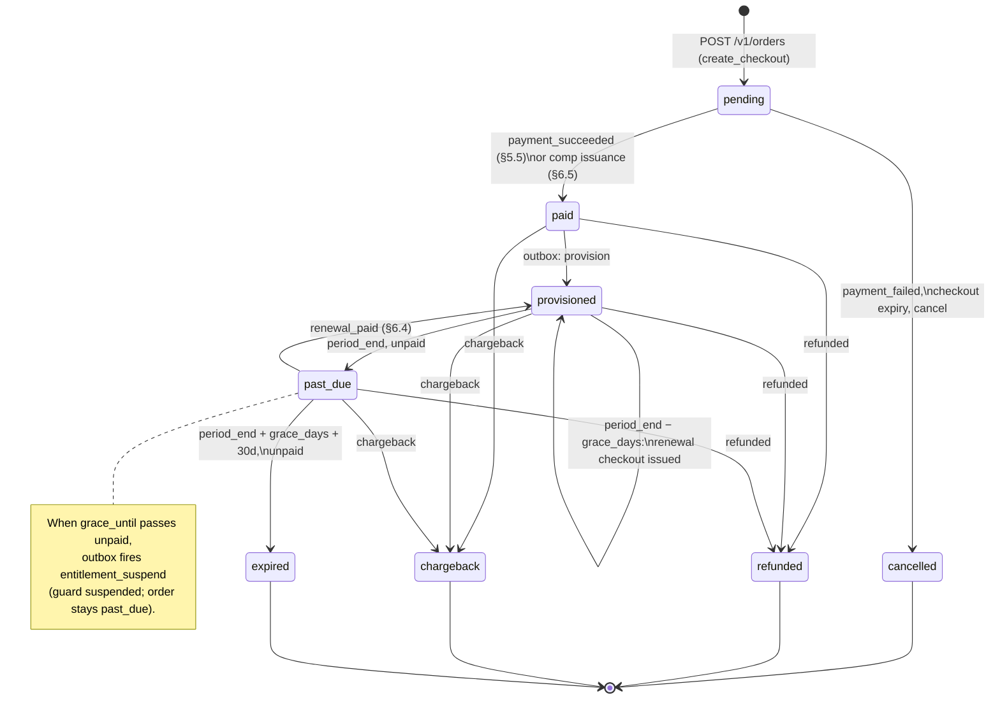

# AI Billing Orchestration — Lifecycle and Policy

**Status:** Architecture — decided
**Date:** 2026-09-11
**Scope:** The vendor-side AI Billing Orchestrator Worker (purchase + orchestrator modules), the ai-platform
control-plane trust refactor, clinic Supabase changes, and Flutter purchase/activation flows.
**Related:** `../01-proposal.md` (agreed decisions, verification findings, attack model),
`../../ai-platform/01-ai-platform.md` (§8.1, §12.5, A15, A16),
`../../ai-platform/03-ai-platform-delivery-plan.md`.
**Index:** [`00-index.md`](00-index.md) (master table of contents).

## Table of Contents

- [6. State machines and dunning policy](#6-state-machines-and-dunning-policy)
  - [6.1 Order state machine (AI Billing Orchestrator)](#61-order-state-machine-ai-billing-orchestrator)
  - [6.2 Entitlement state machine (platform)](#62-entitlement-state-machine-platform)
  - [6.3 Dunning and grace policy — decided](#63-dunning-and-grace-policy-decided)
  - [6.4 Renewal semantics](#64-renewal-semantics)
  - [6.5 Comp orders](#65-comp-orders)
  - [6.6 Plan retirement](#66-plan-retirement)
  - [6.7 Order ↔ entitlement coherence matrix](#67-order-entitlement-coherence-matrix)

---

## 6. State machines and dunning policy

### 6.1 Order state machine (AI Billing Orchestrator)

Rules:

- `pending → paid` on the canonical `payment_succeeded` event only (webhook-verified, §5.5) or
a comp order issuance (§6.5), which transitions `pending → paid → provisioned` without any
provider interaction.
- `paid → provisioned` when the outbox `provision` job completes (delivered via the Cloudflare
Queue consumer; platform enroll + entitle succeeded). A failed provisioning leaves
the order `paid` and retries via the queue — money received always eventually
provisions or alerts.
- `provisioned → past_due` is time-driven: the daily cron flips orders whose `period_end` has
passed without a renewal payment, setting `grace_until = period_end + grace_days` (catalogue
value, §6.3).
- `past_due → provisioned` on `renewal_paid` (new period bounds from the payment date, §6.4).
- `past_due → expired` at `period_end + grace_days + 30 days` (grace + 30-day payable tail).
- `refunded` / `chargeback` are reachable from `paid`, `provisioned`, or `past_due` and are
terminal. Both fire an outbox `entitlement_suspend` **immediately** — no grace when money was
clawed back.
- `cancelled` is reachable from `pending` only (abandoned or expired checkout, or adapter
`cancel`).

### 6.2 Entitlement state machine (platform)

```mermaid
stateDiagram-v2
    direction LR

    [*] --> pending: enroll\n(purchase proof: purchase|comp)

    pending --> active: entitle\n(purchase proof: purchase|comp)

    active --> suspended: entitlement-suspend\n(CAT; no purchase proof)

    suspended --> active: renew\n(purchase proof: purchase|renewal|comp)
```

- `pending` is the enroll sentinel: zero quotas, closed empty period — unchanged from existing platform enroll semantics.
- `active → suspended` only via the new `entitlement-suspend` control action (orchestrator CAT;
no purchase proof required — it grants nothing).
- `suspended → active` **only** via `renew` with a fresh purchase proof. There is no
entitlement-resume action, so restoring service after a non-payment suspension is always
two-key gated. This is deliberate: it is what makes "humans can stop abuse but can never
grant service" hold for the orchestration path too.
- The guard already rejects any `status ≠ active` with `forbidden_capability` / `ai_disabled`
(`src/entitlement/index.ts`) — no guard change is needed for the new status value.
- Installation-level `suspend`/`resume` (existing, installation.status) remain the **human**
incident-response tools and are untouched. The two suspension axes are independent: an
abuse-suspended installation stays rejected at identity even if a renewal payment arrives and
reactivates the entitlement — renew never touches `installation.status`.

**Code-verified correction:** the guard does **not** evaluate `period_end` (verified in
`src/entitlement/index.ts` and `src/quota-do/index.ts` — the DO resets counters when period
bounds change but never rejects on expiry). Non-payment is therefore enforced by two explicit
mechanisms, not by the calendar: the receipt's `valid_until` expires the clinic UI flag, and
the orchestrator's `entitlement-suspend` closes the guard. See §14, deviation 1.

### 6.3 Dunning and grace policy — decided

Proposal §12 item 1, resolved. All three timing constants (renewal lead, grace, receipt
self-expiry) derive from **`grace_days` on the plan catalogue row**, served by `GET /v1/plans`
(§5.10): the ABO order clock reads them from its cached catalogue fetch (§11.1), and the
platform's receipt minting uses the same catalogue value (§5.8) — the two enforcement
mechanisms agree because both read one catalogue, not because two deployables hardcode the
same constant. The initial value is **7 days**.

| Parameter                             | Value                                                      | Rationale                                                                                                                                                                                                                |
| ------------------------------------- | ---------------------------------------------------------- | ------------------------------------------------------------------------------------------------------------------------------------------------------------------------------------------------------------------------ |
| Renewal checkout issued               | `period_end − grace_days`                                  | A full grace-length window of in-app "Renew" CTA (§10.3) before service is at risk                                                                                                                                       |
| Grace (`past_due`, service continues) | **`grace_days`** after `period_end`                        | Constitution V: no hard-lock; clinics have intermittent connectivity and monthly cash cycles. AI is an add-on, so a bounded continuation is safe — the guard still meters every request against the old period's budgets |
| Suspension                            | At `grace_until`, orchestrator fires `entitlement-suspend` | Fail-closed after grace; reactivation only via paid renewal + purchase proof                                                                                                                                             |
| Payable tail                          | 30 further days (`period_end + grace_days + 30`)           | Late payers reactivate via `renew` without re-purchasing or re-enrolling                                                                                                                                                 |
| Terminal                              | `expired` at tail end                                      | New purchase required; platform side still needs only `renew` (entitlement row persists), so reactivation stays cheap                                                                                                    |
| Refund / chargeback                   | **Immediate** `entitlement-suspend`, no grace              | Money was clawed back; grace would be an abuse window                                                                                                                                                                    |
| Receipt `valid_until`                 | `period_end + grace_days` (same catalogue value)           | Clinic UI self-expires exactly when the platform suspends — the two enforcement mechanisms agree by construction                                                                                                         |

Dunning notification surface is **in-app only** (Flutter learns `past_due` / `grace_until` from
`GET /v1/orders/{id}` and from the status endpoint's `period_end`; §10.3). No email/SMS
infrastructure is introduced; the provider's own payment receipts remain the only external
messages. This is a documented simplification, revisited if support data shows missed renewals.

### 6.4 Renewal semantics

A renewal payment produces a new purchase proof with the **same** `order_id`, a new
`purchase_proof_id`, `kind = renewal`, and period bounds that never discard paid time: while the
entitlement is still `active` (a renewal inside the 7-day lead window), the new period starts
at the current `period_end`, not at `paid_at` — early payers keep their remaining days; when
reactivating from `past_due` / `suspended` / `expired`, the period is
`[paid_at, paid_at + 1 month]`. The
orchestrator calls `renew`, which: verifies the purchase proof, resolves `plan` through the
plan catalogue, updates the entitlement's plan/economics/period/`order_id`/`purchase_proof_id`, sets
`status = active`, and records `order_id` in `control_audit`. The Quota DO resets its period
counters automatically when the period bounds change (verified: `maybeResetPeriod` in
`src/quota-do/index.ts`), so no DO coordination is needed.

**Key rotation vs renewal.** A renewal proof re-carries the order's as-purchased key material
(§4.1.2), so renewal is only valid while that material is still the installation's active
enrolled key. Renewal-checkout re-validates the key material against the platform via an
authenticated read before taking payment (§5.4); if the clinic has rotated keys, the order
must be **re-created** — a fresh order with a freshly signed payload — rather than renewed.

**Plan changes** take effect at renewal only: the clinic requests a renewal checkout for a
different plan (`POST /v1/orders/{id}/renewal-checkout`, §5.4) and pays it; the purchase proof
carries the new plan, which `renew` applies. There is **no proration and no mid-period migration** — orchestration policy lives in the core
module, and "change at next period" is the simplest policy that cannot produce invoice
disputes. Mid-period upgrades are a comp-order + `override` (purchase-proof-gated, §6.5) if support
chooses. When a plan is retired from the sellable catalogue, renewal becomes a forced migration
onto a currently active plan — see §6.6.

Composition with platform period-close invoicing is as the proposal states: period close invoices the period that
ended; the paid renewal opens the next. The two systems share only the plan name and the
period bounds carried by the purchase proof. The platform `invoice` row gains a
`purchase_proof_id` (or `order_id`) reference in the A17 amendment pass (§4.2), so the chain
invoice → proof → order is navigable in data, and the invoice is priced from the consumed
proof's `amount_cents` / `currency` — what was actually paid — never from a catalogue
re-lookup (§5.7).

### 6.5 Comp orders

Support goodwill without breaking the traceability rule: an AI Billing Orchestrator ops endpoint
(`POST /v1/ops/comp-orders`, §11.2) creates an order directly in `paid` with `amount = 0`, no
checkout, and enqueues provisioning like any payment, delivering it via the outbox queue
message. The calling operator is recorded on the
order (`comp_operator_id`, §4.1.2). The purchase proof's `kind = comp` is what
authorizes `override` (economics adjustment) or `renew` (period extension) platform-side. Every
comp order appears in reconciliation like any other order — with expected payout zero.

### 6.6 Plan retirement

When a vendor removes a plan from the sellable catalogue — by setting `plan.status` to anything
other than `active`, or by equivalent operator action — clinics on that plan are handled as
follows. Plans do **not** carry a capability-style deprecate → overlap → retire lifecycle; there
is no grandfathered renewal path at the old tier or price.

**During the current paid period.** Nothing changes. The platform entitlement keeps its existing
`plan` name and economics until `period_end`; the guard continues to admit against those
bounds. Retiring a plan from the catalogue does not suspend or reprice an open period.

**At renewal.** Every checkout — initial, cron-issued, or clinic-initiated — validates the
target plan against the platform's cached `GET /v1/plans` fetch, which serves only
`status = 'active'` rows (§5.10). A retired plan is not sellable:

- `POST /v1/orders` with a retired plan → `404 plan_not_found`.
- `POST /v1/orders/{id}/renewal-checkout` with a retired plan → `404 plan_not_found`.
- Platform `renew` resolves economics from the plan catalogue; a purchase proof whose `plan`
  claim is absent from the catalogue fails with no writes (same rule as enroll's unknown-plan
  rejection, §8.2).

There is **no** self-service path to renew at a removed tier. The clinic must pick a currently
active plan from `GET /v1/plans`, call `renewal-checkout` with that plan, pay, and let `renew`
apply the new plan and catalogue economics on the **same** `order_id` (§6.4). The `orders.plan`
column is updated when the renewal payment succeeds.

**Order-clock behaviour** (`period_end − grace_days`, §11.1). The cron may attempt to pre-issue a
renewal checkout using `orders.plan` only when that plan is currently sellable (present in the
cached `GET /v1/plans` response). When `orders.plan` is no longer sellable:

1. **Do not** call the provider adapter — no `checkout_url` is written.
2. Leave the order `provisioned` (or `past_due` if already past `period_end`); dunning
   transitions (§6.3) proceed unchanged.
3. Emit a structured log line (`renewal_checkout_skipped_plan_retired`) naming `order_id` and
   the retired plan — ops visibility, not a clinic-facing error.

The clinic's renewal surface therefore shows the "Renew AI" banner but **no** one-tap checkout
until the owner selects an active plan and the app calls `renewal-checkout` (§10.3). This is
deliberate: a removed tier must not silently charge the old price.

**Vendor operations.** Before marking a plan non-`active`, confirm no clinic still depends on a
cron pre-issued checkout for that plan (unlikely in practice — pre-issued URLs expire with
`checkout_expires_at`). There is no subscriber-count gate on plan retirement in this design;
forced migration at renewal is the policy. Goodwill exceptions (e.g. honouring an old price for
one clinic) go through `comp` orders and `override` (§6.5), not catalogue grandfathering.

**Plan renames are discouraged.** The plan name is a shared key in five places — `orders.plan`,
the purchase-proof `plan` claim, `entitlement.plan`, `invoice.plan`, and
`capability_grant.scope = 'plan:{tier}'` — so a rename is not a catalogue edit but a migration
across `capability_grant` rows (and every record that carries the name). Retire the old plan
and create the new one under a new name instead; the forced-migration path above then applies
cleanly.

### 6.7 Order ↔ entitlement coherence matrix

The two state machines (§6.1, §6.2) are synchronized only through the outbox, the platform's
409-mappings (§11.1), and daily billing reconciliation (§11.3) — so the canonical statement of
which order-status × entitlement-status pairs are coherent is a **contract artifact**, not
prose. This subsection is that artifact: both sides' contract tests and the §11.3
reconciliation job consume this mapping, and a pair marked *drift* is exactly what
`reconciliation_alert` reports.

| `orders.status`              | `entitlement.status`      | Verdict    | Why                                                                                  |
| ---------------------------- | ------------------------- | ---------- | ------------------------------------------------------------------------------------ |
| `pending`                    | *(no entitlement row)*    | Coherent   | Pre-payment; the platform does not know the installation yet                         |
| `pending`                    | any                       | Drift      | An entitlement without a paid order is an unbilled grant                             |
| `paid`                       | `pending`                 | Transient  | Provisioning in flight; must resolve within the outbox retry window (§4.1.5)         |
| `paid`                       | `active` / `suspended` / *(none)* | Drift | Money received but the two records disagree on what was granted               |
| `provisioned`                | `active`                  | Coherent   | The happy path                                                                       |
| `provisioned`                | `suspended`               | Drift      | Paid and in-period, yet the guard is closed — investigate before the clinic notices  |
| `past_due`                   | `active`                  | Coherent   | In grace: `grace_until` has not passed, service continues by policy (§6.3)           |
| `past_due`                   | `suspended`               | Coherent   | Grace expired unpaid; the `entitlement_suspend` outbox row has landed                |
| `refunded` / `chargeback`    | `suspended`               | Coherent   | Money clawed back → immediate suspend, no grace (§6.1)                               |
| `expired`                    | `suspended`               | Coherent   | Terminal; reactivation is a new purchase + `renew`                                   |
| `cancelled`                  | *(no entitlement row)*    | Coherent   | Abandoned checkout; nothing was ever granted                                         |

Any pair not listed as coherent or transient is drift. The matrix is deliberately small: if a
real transition cannot be expressed here, the state machines — not the matrix — are wrong.

