# AI Platform Architecture

- Purpose: Define the architecture of the AI platform — a provider-independent, multi-tenant AI gateway that serves AI-assisted features to the AiClinic Flutter client without placing prompt logic, provider credentials, or AI business rules in the client.
- Read this when: designing, reviewing, extending, or operating any AI-assisted feature; adding an AI provider; adding an AI capability; or investigating an AI request failure.
- Canonical for: AI platform boundaries, trust model, request lifecycle, prompt ownership, provider routing, AI platform data model, and AI observability.
- Usually paired with: `docs/architecture/01-principles.md`, `docs/architecture/04-backend.md`, `docs/architecture/09-security-rbac.md`, `docs/architecture/10-resilience-and-scale.md`, `.specify/memory/constitution.md`.
- Not covered here: clinical content of specific AI features, prompt text, provider pricing negotiation, clinic business schema, or Flutter widget design.
- Orientation first: `docs/architecture/ai-platform/02-ai-platform-overview.md` is a short companion overview of the final architecture. Start there if you need the shape of the system rather than its detail.
- Build order: `docs/architecture/ai-platform/03-ai-platform-delivery-plan.md` decomposes this architecture into individually specifiable slices and defines the rules for authoring their specs. Read it before opening a Spec Kit feature for AI platform work.

> **Status:** Architecture proposal. Nothing in this document is implemented. This document
> **supersedes** every earlier AI-related statement in the architecture set and specs,
> including the local-Ollama AI service shown in `docs/architecture/03-deployment-networking.md`.
> Where the two conflict, this document wins; see [§2.8](#28-conflict-with-the-existing-local-ollama-assumption).

---


## Table of Contents

1. [Scope, Inherited Reality, and Constraint Audit](#1-scope-inherited-reality-and-constraint-audit)
  - [1.1 What this document decides](#11-what-this-document-decides)
  - [1.2 Inherited reality](#12-inherited-reality)
  - [1.3 The three constraints that actually shape the design](#13-the-three-constraints-that-actually-shape-the-design)
    - [1.3.1 The AI platform cannot reach the clinic's database](#131-the-ai-platform-cannot-reach-the-clinics-database)
    - [1.3.2 Identity is federated per clinic, not centralized](#132-identity-is-federated-per-clinic-not-centralized)
    - [1.3.3 The execution platform is request-scoped and stateless by default](#133-the-execution-platform-is-request-scoped-and-stateless-by-default)
  - [1.4 Verified platform capability budget](#14-verified-platform-capability-budget)
    - [1.4.1 How the platform is billed](#141-how-the-platform-is-billed)
2. [Requirement Challenges and Amendments](#2-requirement-challenges-and-amendments)
  - [2.1 Amendment A1: "authenticate every request" requires a trust bootstrap that does not exist yet](#21-amendment-a1-authenticate-every-request-requires-a-trust-bootstrap-that-does-not-exist-yet)
  - [2.2 Amendment A2: "return only validated responses" contradicts "support streaming"](#22-amendment-a2-return-only-validated-responses-contradicts-support-streaming)
  - [2.3 Amendment A3: "rate limiting should be applied" is underspecified](#23-amendment-a3-rate-limiting-should-be-applied-is-underspecified)
  - [2.4 Amendment A4: "the platform determines what additional data is required" must not mean "the platform knows the clinic schema"](#24-amendment-a4-the-platform-determines-what-additional-data-is-required-must-not-mean-the-platform-knows-the-clinic-schema)
  - [2.5 Amendment A14: an open chat surface is a declared capability, not an inferred one](#25-amendment-a14-an-open-chat-surface-is-a-declared-capability-not-an-inferred-one)
  - [2.6 Amendment A15: the commercial surface — credit-denominated quota, a plan catalogue, and platform-issued invoices](#26-amendment-a15-the-commercial-surface--credit-denominated-quota-a-plan-catalogue-and-platform-issued-invoices)
  - [2.7 Requirements that should be added](#27-requirements-that-should-be-added)
  - [2.8 Conflict with the existing local-Ollama assumption](#28-conflict-with-the-existing-local-ollama-assumption)
  - [2.9 Requirement accepted as-is: no PHI redaction](#29-requirement-accepted-as-is-no-phi-redaction)
  - [2.10 Amendment summary](#210-amendment-summary)
3. [High-Level Architecture](#3-high-level-architecture)
  - [3.1 Architecture style, and why this one](#31-architecture-style-and-why-this-one)
    - [3.1.1 Layered architecture](#311-layered-architecture)
  - [3.2 System context](#32-system-context)
  - [3.3 Trust and network topology](#33-trust-and-network-topology)
  - [3.4 The three seams](#34-the-three-seams)
    - [3.4.1 Enforcing the seams](#341-enforcing-the-seams)
  - [3.5 Deliberately not in the platform](#35-deliberately-not-in-the-platform)
4. [Components and Responsibilities](#4-components-and-responsibilities)
  - [4.1 Client-side components](#41-client-side-components)
  - [4.2 Clinic backend components (Supabase)](#42-clinic-backend-components-supabase)
    - [4.2.1 The clinic-side signing mechanism](#421-the-clinic-side-signing-mechanism)
    - [4.2.2 The AI acceptance recording contract](#422-the-ai-acceptance-recording-contract)
  - [4.3 AI Gateway Worker components](#43-ai-gateway-worker-components)
    - [4.3.1 Protocol adapter](#431-protocol-adapter)
    - [4.3.2 Identity and tenant resolution](#432-identity-and-tenant-resolution)
    - [4.3.3 Entitlement, quota, and rate control](#433-entitlement-quota-and-rate-control)
    - [4.3.4 Capability resolver](#434-capability-resolver)
    - [4.3.5 Context validator](#435-context-validator)
    - [4.3.6 Prompt composer and prompt registry](#436-prompt-composer-and-prompt-registry)
    - [4.3.7 Provider router and policy engine](#437-provider-router-and-policy-engine)
    - [4.3.8 Provider adapters and egress](#438-provider-adapters-and-egress)
    - [4.3.9 Response validator and repair](#439-response-validator-and-repair)
    - [4.3.10 Stream broker](#4310-stream-broker)
    - [4.3.11 Journal writer](#4311-journal-writer)
    - [4.3.12 Telemetry emitter](#4312-telemetry-emitter)
  - [4.4 Storage ownership](#44-storage-ownership)
  - [4.5 Control plane](#45-control-plane)
  - [4.6 Responsibility matrix](#46-responsibility-matrix)
5. [Contracts](#5-contracts)
  - [5.1 Capability manifest](#51-capability-manifest)
  - [5.2 Context contract](#52-context-contract)
  - [5.3 Canonical inference representation](#53-canonical-inference-representation)
  - [5.4 Error taxonomy](#54-error-taxonomy)
  - [5.5 API surface and streaming protocol](#55-api-surface-and-streaming-protocol)
  - [5.6 Token contract](#56-token-contract)
  - [5.7 Versioning and compatibility rules](#57-versioning-and-compatibility-rules)
6. [Request Lifecycle](#6-request-lifecycle)
  - [6.1 The pipeline](#61-the-pipeline)
  - [6.2 Why this order and not another](#62-why-this-order-and-not-another)
  - [6.3 Request state machine](#63-request-state-machine)
  - [6.4 Streaming with commit-time validation](#64-streaming-with-commit-time-validation)
  - [6.5 Cancellation](#65-cancellation)
  - [6.6 Idempotency, retry, and duplicate suppression](#66-idempotency-retry-and-duplicate-suppression)
  - [6.7 Conversational capabilities](#67-conversational-capabilities)
    - [6.7.1 The unit of work is a leg, not a conversation](#671-the-unit-of-work-is-a-leg-not-a-conversation)
    - [6.7.2 A turn ends in one of two ways](#672-a-turn-ends-in-one-of-two-ways)
    - [6.7.3 What bounds the loop](#673-what-bounds-the-loop)
    - [6.7.4 What conversational mode does not change](#674-what-conversational-mode-does-not-change)
7. [Data Flow and Data Model](#7-data-flow-and-data-model)
  - [7.1 Data ownership boundaries](#71-data-ownership-boundaries)
  - [7.2 Data flow](#72-data-flow)
  - [7.3 D1 logical model](#73-d1-logical-model)
  - [7.4 R2 payload layout](#74-r2-payload-layout)
    - [7.4.1 Why one object and not four](#741-why-one-object-and-not-four)
  - [7.5 Write-path economics](#75-write-path-economics)
  - [7.6 Read paths](#76-read-paths)
  - [7.7 Retention and recovery](#77-retention-and-recovery)
8. [Sequence Diagrams](#8-sequence-diagrams)
  - [8.1 Clinic enrollment and trust bootstrap](#81-clinic-enrollment-and-trust-bootstrap)
  - [8.2 Streaming prose request — happy path](#82-streaming-prose-request-happy-path)
  - [8.3 Structured JSON request with context enrichment](#83-structured-json-request-with-context-enrichment)
  - [8.4 Missing-context self-healing](#84-missing-context-self-healing)
  - [8.5 Validation failure, bounded repair, then terminal failure](#85-validation-failure-bounded-repair-then-terminal-failure)
  - [8.6 Provider failure, retry, and fallback](#86-provider-failure-retry-and-fallback)
  - [8.7 User-initiated cancellation](#87-user-initiated-cancellation)
  - [8.8 Quota and rate-limit rejection](#88-quota-and-rate-limit-rejection)
  - [8.9 Support audit trace](#89-support-audit-trace)
  - [8.10 Conversational turn with context negotiation](#810-conversational-turn-with-context-negotiation)
9. [Alternatives Considered](#9-alternatives-considered)
  - [9.1 Client calls AI providers directly](#91-client-calls-ai-providers-directly)
  - [9.2 Supabase Edge Functions as the AI gateway](#92-supabase-edge-functions-as-the-ai-gateway)
  - [9.3 Postgres-centric AI orchestration](#93-postgres-centric-ai-orchestration)
  - [9.4 Platform pulls context from Supabase](#94-platform-pulls-context-from-supabase)
  - [9.5 Prompts as editable data in D1](#95-prompts-as-editable-data-in-d1)
  - [9.6 Multiple Workers, one per concern](#96-multiple-workers-one-per-concern)
  - [9.7 Connection-scoped cancellation versus a Session Durable Object](#97-connection-scoped-cancellation-versus-a-session-durable-object)
  - [9.8 D1 as the only platform store](#98-d1-as-the-only-platform-store)
  - [9.9 Cloudflare AI Gateway as the egress layer](#99-cloudflare-ai-gateway-as-the-egress-layer)
  - [9.10 OpenAI-compatible wire format as the internal representation](#910-openai-compatible-wire-format-as-the-internal-representation)
  - [9.11 Asynchronous job model with Queues or Workflows](#911-asynchronous-job-model-with-queues-or-workflows)
  - [9.12 One D1 database per installation](#912-one-d1-database-per-installation)
  - [9.13 Verifying clinic Supabase JWTs directly](#913-verifying-clinic-supabase-jwts-directly)
  - [9.14 Mechanisms deliberately simplified](#914-mechanisms-deliberately-simplified)
  - [9.15 Workers KV as a hot config cache](#915-workers-kv-as-a-hot-config-cache)
  - [9.16 Analytics Engine as the metrics store](#916-analytics-engine-as-the-metrics-store)
  - [9.17 A separate store for replay and idempotency state](#917-a-separate-store-for-replay-and-idempotency-state)
  - [9.18 Platform-held conversation state](#918-platform-held-conversation-state)
  - [9.19 Client-side intent routing for the chat surface](#919-client-side-intent-routing-for-the-chat-surface)
  - [9.20 Decision log](#920-decision-log)
10. [Trade-offs of the Recommended Design](#10-trade-offs-of-the-recommended-design)
11. [Risks and Mitigations](#11-risks-and-mitigations)
12. [Evolution Path](#12-evolution-path)
  - [12.1 Sequencing principle](#121-sequencing-principle)
  - [12.2 Delivery plan](#122-delivery-plan)
  - [12.3 Where each future-growth requirement plugs in](#123-where-each-future-growth-requirement-plugs-in)
  - [12.4 Extension recipes](#124-extension-recipes)
  - [12.5 Explicitly not to be built yet](#125-explicitly-not-to-be-built-yet)
13. [Operational Concerns](#13-operational-concerns)
  - [13.1 Observability](#131-observability)
  - [13.2 Auditing and the support workflow](#132-auditing-and-the-support-workflow)
  - [13.3 Service levels](#133-service-levels)
  - [13.4 Environments, configuration, and secrets](#134-environments-configuration-and-secrets)
  - [13.5 Testing strategy](#135-testing-strategy)
  - [13.6 Cost model and guardrails](#136-cost-model-and-guardrails)
    - [13.6.1 Where the platform actually sits](#1361-where-the-platform-actually-sits)
    - [13.6.2 Pre-flight token estimation](#1362-pre-flight-token-estimation)
14. [Constitution Compliance Check](#14-constitution-compliance-check)
15. [Open Decisions](#15-open-decisions)
16. [Glossary Additions](#16-glossary-additions)


---


## 1. Scope, Inherited Reality, and Constraint Audit


### 1.1 What this document decides

This document decides **where AI responsibilities live, what contracts connect them, and how a
request behaves under success, failure, and abuse**. It deliberately does not decide code
structure, framework choices inside the Worker, prompt wording, or model selection per feature —
those are downstream implementation decisions constrained by the contracts in [§5](#5-contracts).

The design goal, stated once and used as the tie-breaker for every trade-off below:

> **The AI platform must be able to change its prompts, providers, models, validation rules, and
> routing policy without a client release, and the clinic application must be able to evolve its
> schema without an AI platform release.**

Every recommendation in this document is justified by that sentence plus the constitution.

### 1.2 Inherited reality

The AI platform is not being designed on a blank page. These are load-bearing facts about the
existing system, verified in the repository, that constrain the design more than any preference:


| #   | Fact                                                                                                                                                                                                                         | Source                                                                                                                | Consequence for the AI platform                                                                                                                                                                                                                                                    |
| --- | ---------------------------------------------------------------------------------------------------------------------------------------------------------------------------------------------------------------------------- | --------------------------------------------------------------------------------------------------------------------- | ---------------------------------------------------------------------------------------------------------------------------------------------------------------------------------------------------------------------------------------------------------------------------------- |
| F1  | Deployment Tier 1 is **self-hosted Supabase on a clinic PC on a LAN**, "no internet required for daily operations". Tier 3 (Supabase Cloud) is aspirational and unimplemented.                                               | `docs/architecture/03-deployment-networking.md`                                                                       | The AI platform is the **only internet-dependent component** in the product. It must be optional and degrade to "unavailable" cleanly. It also cannot assume the clinic database is reachable from the internet.                                                                   |
| F2  | Each clinic runs its **own GoTrue instance with its own JWT signing secret**. Claims are minted by `auth_internal.build_staff_claims` via the `get_custom_claims` hook.                                                      | `backend/supabase/config.toml`, `backend/local/docker-compose.yml`, migrations `20260521170000_`*,* `20260611150000_` | A Cloudflare Worker **cannot validate a clinic's Supabase JWT** without per-clinic trust material. There is no shared JWKS. This is the single most important finding; see [§2.1](#21-amendment-a1-authenticate-every-request-requires-a-trust-bootstrap-that-does-not-exist-yet). |
| F3  | Tenancy is `organizations` → `branches` → `staff_branch_assignments`, all `uuid`. JWT carries `organization_id`, `branch_ids`, `staff_role`, `staff_member_id`, `setup_required`.                                            | `20260516100000_auth_rbac_schema.sql`, `specs/002-auth-rbac/contracts/auth-session.md`                                | The AI platform's tenant key must map to a clinic **installation**, not to `organization_id` alone — `build_staff_claims` currently resolves the org as "oldest row", which is only safe with one org per deployment.                                                              |
| F4  | Client → backend access is **RPC-first** (`snake_case`, `p_`-prefixed params, `rpc_result` envelope) with PostgREST reads for simple RLS-filtered tables. No Edge Functions exist.                                           | `docs/architecture/04-backend.md`, `frontend/lib/features/*/data/`*                                                   | Business-data retrieval for AI context should reuse the existing RPC idiom, not invent a second access path.                                                                                                                                                                       |
| F5  | Constitution forbids microservices, message queues, Kubernetes, and "introducing a custom primary backend service"; requires graceful degradation and forbids subscription enforcement that hard-locks the system.           | `.specify/memory/constitution.md`                                                                                     | The AI platform must be a **single deployable unit**, synchronous-first, and explicitly positioned as non-primary. See [§14](#14-constitution-compliance-check).                                                                                                                   |
| F6  | `organizations.subscription_tier` / `subscription_valid_until` and `subscription_cache` exist but have **no writers**. There are no plan, quota, or entitlement tables.                                                      | `docs/architecture/05-database.md`, `docs/architecture/10-resilience-and-scale.md`                                    | AI entitlement/quota cannot be sourced from Supabase today. The AI platform must own its own entitlement record — which is also what the constraint "D1 owns AI platform data" demands.                                                                                            |
| F7  | `audit_log` is append-only, populated only by `SECURITY DEFINER` RPCs, and client writes are denied by RLS.                                                                                                                  | `20260516100000_auth_rbac_schema.sql`                                                                                 | AI audit trails must live in D1, not `audit_log`. The clinic DB may record only the *acceptance* of AI output as a clinical action.                                                                                                                                                |
| F8  | The clinic Postgres image (`supabase/postgres:15.8.1.085`) ships `pgcrypto` and `pgjwt` installed and `pgsodium` 3.1.8 available but not enabled. `pgjwt` signs **HMAC only**; `pgsodium.crypto_sign_`* is **Ed25519 only**. | `backend/local/docker-compose.yml`, `pg_available_extensions` on the running image                                    | The AAT's signature algorithm is not a free choice: Ed25519/`EdDSA` is the only asymmetric signing primitive available without adding a component. See [§4.2.1](#421-the-clinic-side-signing-mechanism).                                                                           |


### 1.3 The three constraints that actually shape the design

Most of the requirement list is satisfiable in many ways. Three constraints eliminate most of the
design space, so they are stated up front.

#### 1.3.1 The AI platform cannot reach the clinic's database

Under Tier 1 and Tier 2 the clinic database sits behind a home/office router on a private LAN.
There is no inbound path, no stable address, and no certificate. Therefore:

> **Data must flow client → platform, never platform → clinic database.**

This single fact invalidates the most common design for "the AI platform fetches the business data
it needs" and forces the **Context Contract** design in [§5.2](#52-context-contract). It is also,
conveniently, the choice that best preserves decoupling: a platform that queries clinic tables
would be permanently welded to the clinic schema.

#### 1.3.2 Identity is federated per clinic, not centralized

Because every clinic mints its own tokens with its own secret (F2), the AI platform must treat each
clinic installation as an **independent identity provider that it has explicitly enrolled**. That
turns "authenticate every request" into a two-part problem: enroll the clinic once
(establish trust material), then verify per-request tokens against that material.

#### 1.3.3 The execution platform is request-scoped and stateless by default

Cloudflare Workers give effectively unlimited wall-clock time while the client stays connected —
which is exactly what streaming inference needs — but state does not survive the request, and any
coordination between two concurrent requests (for example, "cancel request X from a different
screen") requires an explicitly stateful primitive.

### 1.4 Verified platform capability budget

Design decisions later in this document reference these limits. Values verified July 2026 for the
Workers **Paid** plan; the Free plan is not viable for this workload (10 ms CPU, 50 subrequests).


| Capability                        | Limit                                                                                                                | Why it matters here                                                                                                                                                                                   |
| --------------------------------- | -------------------------------------------------------------------------------------------------------------------- | ----------------------------------------------------------------------------------------------------------------------------------------------------------------------------------------------------- |
| Worker wall time                  | Unlimited while the client is connected                                                                              | Long streaming completions are fine. No need for async job plumbing.                                                                                                                                  |
| Worker CPU time                   | 30 s default, up to 5 min                                                                                            | Validation, schema checks, and JSON repair are cheap; CPU is not the binding constraint.                                                                                                              |
| Worker memory                     | 128 MB                                                                                                               | Never buffer large artifacts in memory; stream through and offload payloads to R2.                                                                                                                    |
| Simultaneous outgoing connections | 6 per request                                                                                                        | Caps in-flight provider calls plus D1/R2 writes per request. Speculative multi-provider racing must be bounded.                                                                                       |
| Worker script size                | 10 MB                                                                                                                | Bundled prompt artifacts and JSON schemas fit comfortably; large corpora do not.                                                                                                                      |
| D1 max database size              | 10 GB per DB                                                                                                         | Raw prompt/response text **must not** live in D1 rows at scale.                                                                                                                                       |
| D1 max row / BLOB                 | 2 MB                                                                                                                 | A single long completion can approach this. Reinforces R2 offload.                                                                                                                                    |
| D1 concurrency                    | Single-threaded per DB; ~1000 q/s at 1 ms queries; overload returns an error                                         | The journal write path must be batched and off the critical path. Never write per-token.                                                                                                              |
| D1 write cost                     | $1 per million rows written                                                                                          | Per-token or per-chunk rows would dominate platform cost.                                                                                                                                             |
| D1 Time Travel                    | 30 days point-in-time recovery                                                                                       | Satisfies platform-data recovery without a bespoke backup design.                                                                                                                                     |
| Durable Objects                   | Unlimited objects; strongly consistent per object; 30 s CPU default; 1M requests and 400,000 GB-s included per month | The correct primitive for strongly consistent per-clinic quota counting. The request allowance is what caps the number of DO round trips per AI request ([§6.2](#62-why-this-order-and-not-another)). |
| Workers Rate Limiting binding     | GA; `simple` limiter, 10 s or 60 s windows, counters shared by namespace                                             | Good enough for cheap first-line abuse control; **not** sufficient for quota accounting.                                                                                                              |
| R2 operations                     | Class A (writes/lists) and Class B (reads) metered separately; deletes free                                          | Writes are the expensive class, so the per-request blob **count** matters more than blob size ([§7.4](#74-r2-payload-layout)).                                                                        |
| R2 free allowance                 | 10 GB storage, 1M Class A, 10M Class B per month, egress always free                                                 | Recurring, not a trial. One payload object per request keeps clinic-scale volume inside it indefinitely.                                                                                              |
| Cloudflare AI Gateway             | GA; provider proxy with caching, retries, fallback, token/cost logging                                               | Optional egress layer; evaluated in [§9.9](#99-cloudflare-ai-gateway-as-the-egress-layer).                                                                                                            |


#### 1.4.1 How the platform is billed

Worth stating once, because it shapes several storage decisions. **Workers, D1, Durable Objects, the
Rate Limiting binding, and Worker secrets are all bundled into the single Workers Paid subscription**
— a minimum charge, not a floor that usage is added to. Staying inside the included allowances means
the platform costs exactly the subscription and nothing else appears on the invoice. **R2 is the only
store metered separately**, and it carries a recurring monthly free allowance that does not expire.

Two consequences follow, and both are load-bearing later:

- The scarce resources are **R2 Class A operations** and **Durable Object requests**, because both are
consumed by the *design's* per-request fan-out rather than by data volume. Halving the number of R2
objects or DO round trips per request doubles the platform's headroom; storing less data does not.
- **Provider tokens dominate every Cloudflare line item by one to two orders of magnitude** at
clinic scale ([§13.6](#136-cost-model-and-guardrails)). Infrastructure allowances are something to
monitor; the token budget is the thing to engineer.

---


## 2. Requirement Challenges and Amendments

The brief asks for the requirements to be challenged. Four requirements are underspecified or
internally inconsistent, one conflicts with the existing architecture set, and several necessary
requirements are missing. Each amendment is labelled `A#` and referenced later.

### 2.1 Amendment A1: "authenticate every request" requires a trust bootstrap that does not exist yet

**The requirement as written:** authenticate every request; check clinic AI entitlement and quota.

**Why it cannot be met as stated:** the obvious reading is "the Worker validates the Supabase JWT the
client already has". That works only if the Worker can obtain the signing key of the issuer. In this
product each clinic runs its own GoTrue with its own secret (F2). The Worker would need every
clinic's JWT secret, which means:

- distributing a **long-lived symmetric secret** for a *different security domain* into the AI
platform, so a platform compromise yields the ability to forge clinic sessions — a catastrophic
blast-radius inversion;
- no way to revoke a clinic's AI access without breaking that clinic's own logins;
- token lifetimes and audiences chosen for clinic login, not for a third-party API.

**Amendment:** add an explicit **clinic enrollment** requirement and a **purpose-scoped AI access
token**.

1. A clinic installation is **enrolled once** with the AI platform. Enrollment produces an
  installation identity: an installation ID, an asymmetric signing keypair whose private key stays
   in the clinic's PostgreSQL, and a public key registered in the platform. Enrollment is an
   administrative act, not something a client can perform for itself.
2. Per request, the client obtains a **short-lived AI Access Token (AAT)** — minted by a
  `SECURITY DEFINER` RPC in the clinic database, audience-restricted to the AI platform, lifetime in
   minutes, carrying tenant and actor claims plus the capability scopes the actor is permitted to use.
3. The Worker verifies the AAT signature against the enrolled public key. It never sees a Supabase
  session token.

This keeps Supabase as the **single authority on who the user is and what they may do** (constitution
principle III), keeps AI-specific authorization in the AI platform, and gives the platform a
revocation lever — disable the installation — that has no effect on clinic logins. It also degrades
correctly: if the clinic has no internet, the AAT is simply never used.

Detail in [§5.6](#56-token-contract) and the enrollment sequence in [§8.1](#81-clinic-enrollment-and-trust-bootstrap).

> **Alternative kept on the table:** when Tier 3 (Supabase Cloud) becomes real, cloud-issued tokens
> can be verified against Supabase's published JWKS. The identity component is therefore designed as
> a **pluggable verifier** with two strategies — enrolled-installation keys and OIDC/JWKS — rather
> than hard-coding either.


### 2.2 Amendment A2: "return only validated responses" contradicts "support streaming"

**The conflict:** schema validity and business-rule validity of a structured response are properties
of the *whole* response. They cannot be established while it is still being produced. Requirement [3]
("return only validated responses") and the streaming requirement are therefore mutually exclusive
for structured outputs, taken literally.

**Amendment:** replace "return only validated responses" with **commit-time validation and
provisional streaming**, defined per capability:


| Output mode         | Streaming behaviour                                                                     | Validation point                                                                                                       | Client obligation                                                                                                                       |
| ------------------- | --------------------------------------------------------------------------------------- | ---------------------------------------------------------------------------------------------------------------------- | --------------------------------------------------------------------------------------------------------------------------------------- |
| `prose`             | Stream text chunks as produced                                                          | Lightweight guards during stream (length, stop-sequence, refusal/leak detection); full guard set at end                | May display live. May not persist until the terminal event confirms success.                                                            |
| `structured`        | Stream **progress and provisional fields only**, explicitly flagged `provisional: true` | Schema + business rules validated once on the complete document; a validated envelope is emitted as the terminal event | Must render provisional data as a draft with no commit affordance. Only the validated terminal envelope may be persisted or acted upon. |
| `structured_atomic` | No streaming; heartbeat/progress events only                                            | Same as `structured`                                                                                                   | Nothing to display until completion. Used where a partially-rendered draft would be clinically misleading.                              |


The invariant that survives is the one that actually matters: **no unvalidated content ever reaches
the clinical record.** What changes is that unvalidated content may reach the *screen*, clearly
marked as a draft. This is the standard resolution and it is honest about the trade-off rather than
pretending validation can be streamed.

### 2.3 Amendment A3: "rate limiting should be applied" is underspecified

Rate limiting one dimension is close to useless: a per-user limit does not stop a clinic from
burning its month of budget in an hour, and a per-clinic limit does not stop one runaway client from
starving colleagues. The requirement must name its dimensions and, more importantly, separate two
different concerns that are usually conflated:


| Concern             | Question it answers                              | Enforcement                                                                                     | Consistency needed                     | Failure mode                               |
| ------------------- | ------------------------------------------------ | ----------------------------------------------------------------------------------------------- | -------------------------------------- | ------------------------------------------ |
| **Rate limiting**   | "Too many requests too fast?"                    | Rate Limiting binding, per composite key                                                        | Approximate is fine                    | Reject with retry-after                    |
| **Quota / budget**  | "Has this clinic consumed what it paid for?"     | Per-clinic quota Durable Object counter, credited from actual usage and backed by the D1 ledger | Must be strongly consistent per clinic | Reject, or degrade to a cheaper model tier |
| **Concurrency cap** | "Too many *simultaneous* in-flight inferences?"  | Counter in the same per-clinic DO                                                               | Strongly consistent per clinic         | Reject or queue client-side                |
| **Cost ceiling**    | "Is this single request too expensive to allow?" | Pre-flight token estimate vs per-capability ceiling                                             | Local to the request                   | Reject before the provider call            |


**Amendment:** rate limits are evaluated on at least these keys — `installation`,
`installation + actor`, `installation + capability` — and *quota* is a distinct, strongly-consistent
mechanism, not a rate limiter with a long window. Rationale in [§4.3.3](#433-entitlement-quota-and-rate-control).

### 2.4 Amendment A4: "the platform determines what additional data is required" must not mean "the platform knows the clinic schema"

The requirement asks the architecture to define how the platform determines what extra business data
a request needs and how that data is obtained, "while maintaining clean separation of
responsibilities". Left unqualified, the natural implementation is a callback: the Worker queries
Supabase for the patient, the visit, the last labs. That is impossible under Tier 1 (F1,
[§1.3.1](#131-the-ai-platform-cannot-reach-the-clinics-database)) and undesirable in any tier,
because it makes the AI platform a consumer of the clinic schema and turns every clinic migration
into a potential AI outage.

**Amendment:** split the question in two and give each half to the side that legitimately owns it.

- **What is needed** is an AI concern → the platform publishes, per capability, a **Context Contract**:
a versioned list of required and optional *context keys* with their shapes, expressed in a
domain vocabulary (`patient.demographics@v1`, `visit.vitals@v1`, `medication.active_list@v1`), never
in table or column names.
- **How to get it** is a clinic-application concern → the client's **Context Resolver** maps each
context key to an existing Supabase RPC or query and assembles the payload, under the user's own
RLS-enforced permissions.

The result: the platform declares needs and validates what it receives; the clinic app satisfies
needs. Prompt logic stays entirely in the platform — the client never learns *why* a key is needed,
what prompt consumes it, or how it is phrased. Adding a context key to a capability is a platform
release plus a client resolver mapping; changing a clinic table is a client-side mapping change only.

This is the pivotal design decision in the whole document; it is developed in
[§5.2](#52-context-contract), and the alternative is dissected in [§9.4](#94-platform-pulls-context-from-supabase).

### 2.5 Amendment A14: an open chat surface is a declared capability, not an inferred one

**The requirement as written:** the client offers AI in two shapes. Most of it is tied to the UI — a
"Summarize this visit" button on a visit screen, "Draft SOAP note", "Polish note" — where pressing the
control *is* the request. Alongside those, the client offers an open **chat window** where a clinician
types anything, unattached to any screen or record.

**Why the two look incompatible.** The button case is fully determined before the request leaves the
clinic: the capability is known because a specific control was pressed, and the context keys are known
because the manifest lists them. The chat case determines nothing upfront. Which record the clinician
means, and therefore which context is needed, cannot be known until someone has read the sentence they
typed — and reading it is an inference, which is the platform's job, not the client's.

**The wrong resolution** is to let the client classify the typed message and pick a capability and
context keys from it. That places intent inference in the layer deliberately kept ignorant of AI
([§3.4](#34-the-three-seams)), and it is exactly the recoupling that A4 exists to prevent: within a
release the client's classifier would be frozen, so improving the assistant's understanding would
require a desktop release.

**Amendment:** add an **interaction mode** to the capability manifest, and confine every conversational
mechanism to the second of its two values.


| Interaction mode        | Who names the capability                                                        | Context acquisition                                                                                                                    | Turns                                   | Applies to                                                |
| ----------------------- | ------------------------------------------------------------------------------- | -------------------------------------------------------------------------------------------------------------------------------------- | --------------------------------------- | --------------------------------------------------------- |
| `single_shot` (default) | The invoking surface, by construction — the control pressed *is* the capability | Fully determined by the manifest before submission. `context_required` remains a stale-cache repair, bounded to one resubmission       | One                                     | Every button-invoked feature; unchanged by this amendment |
| `conversational`        | The invoking surface — the chat window *is* one capability                      | Determined by the platform during the request, through a bounded negotiation with the client ([§6.7](#67-conversational-capabilities)) | Many, transcript supplied by the client | The chat assistant                                        |


The sentence that resolves the apparent conflict: **the invoking surface always names the capability;
the platform never infers it.** A chat window is not "no capability" — it is one capability
(`clinic.assistant@v1`) whose user intent field is the literal typed message. What the platform infers
is not *which* capability the user wants, but *which context the named capability now needs*, and it
answers that by asking the client for it rather than by fetching anything itself. The direction
established in [§1.3.1](#131-the-ai-platform-cannot-reach-the-clinics-database) is preserved: data
still flows client → platform only.

Three properties of the existing design are what make this an extension rather than a redesign, and
each is load-bearing:

- **The client already holds the transcript.** Conversation state is therefore never platform state, so
no session store and no per-request Durable Object appear ([§9.18](#918-platform-held-conversation-state)).
- `prose` **is already an output mode** ([§5.1](#51-capability-manifest)), so a chat answer has a valid
output contract without inventing one.
- **The canonical request already carries prior turns** ([§5.3](#53-canonical-inference-representation)),
so the representation needs no new element.

What this amendment does *not* license is general agentic tool use. The only "tool" a conversational
capability may invoke is context-key resolution, the allowlist is the manifest's, and the executor is
the client under the user's own RLS ([§12.5](#125-explicitly-not-to-be-built-yet)).

### 2.6 Amendment A15: the commercial surface — credit-denominated quota, a plan catalogue, and platform-issued invoices

**Why this amendment exists.** The delivery plan left its commercial band undecomposed because its
missing inputs were product decisions, not architectural ones. Those decisions are now made. Because
they settle Open Decisions 2 and 15 and reverse one row of [§12.3](#123-where-each-future-growth-requirement-plugs-in),
they are recorded here as a contract change rather than inside a slice spec:

1. **The quota unit is the AI credit; the period is the calendar month.** This settles OD-2.
2. **The credit price is declared, not metered.** Each capability manifest's `quota weight`
   ([§5.1](#51-capability-manifest), Economics group) is the fixed price of one request in credits —
   per leg for `conversational`. The stage-15 settlement debits the declared weight from the
   installation's monthly credit budget; a cancelled request still debits it, because the provider
   cost was incurred, and a guard rejection debits nothing because no request exists. Actual tokens
   and cost remain journaled (`ai_attempt`, `usage_event`) as billing evidence and reconciliation
   input, but they do not determine the debit: a clinic can predict what pressing a button costs,
   and a provider price change is a margin event, not an invoice-correctness event.
3. **There is no overage.** The soft threshold degrades routing ([§8.8](#88-quota-and-rate-limit-rejection));
   hard exhaustion returns `quota_exhausted`; an operator raises the budget. Nothing hard-locks
   (constitution principle V).
4. **A plan catalogue exists, and stays small.** A `plan` entity maps a plan name to its monthly
   credit budget, request-count guard, `max_cost_class`, soft threshold, and capability set
   ([§7.3](#73-d1-logical-model)). Entitlement assignment reads the catalogue; enroll still writes
   the plan name only and leaves the row `pending` ([§8.1](#81-clinic-enrollment-and-trust-bootstrap)).
   This settles OD-15 against its default.
5. **Invoice generation moves inside the platform** — reversing the billing row of
   [§12.3](#123-where-each-future-growth-requirement-plugs-in). A scheduled period close freezes the
   month's `usage_rollup`, prices the consumed credits through a versioned credit price list, and
   writes an immutable `invoice` record per installation. **Payment collection remains outside**:
   the platform issues the invoice document; it does not integrate a payment provider, and
   self-service enrollment stays blocked on exactly that ([§12.5](#125-explicitly-not-to-be-built-yet)).
   The bundled token-rate pricing artifact that normalizes provider-reported tokens into ledger
   cost units ([§13.6.2](#1362-pre-flight-token-estimation)) is a **different table with a
   different job** and is unchanged: it answers "what did this request cost us", while
   `credit_price` answers "what does the clinic pay per credit".
6. **The usage surface is a gauge.** A usage-summary read endpoint answers current-period credits
   consumed against budget — live from the Quota DO, history from `usage_rollup`
   ([§7.6](#76-read-paths)) — and the client renders it as a simple gauge. No analytics dashboard
   is added.

**Why credits and not tokens or money.** Tokens are meaningless to a clinic and couple the
commercial contract to provider pricing; money in the request path is what A6 forbids. Credits are
the platform's own unit: the request path never sees a price — the debit is a weight from the
manifest — and the price list lives in the control plane, where invoices are issued. A6 is
preserved: no provider price appears in the Worker, and the pre-flight remains tokens-to-tokens.

**Why this is extension, not rework.** The frozen admission contracts gain fields and keep their
meanings: the entitlement snapshot gains `credit_budget`, the credit RPC gains a `credits` debit,
the period counters gain `creditsUsed`, and the `entitlement` entity gains a monthly credit budget
column. The token and cost counters already frozen remain, now serving reconciliation and billing
evidence rather than admission. `usage_event` already records `quota weight` per request
([§7.3](#73-d1-logical-model)) — the ledger itself needed no change.

**Constitution check.** No new deployable is introduced: period close is a scheduled job in the
existing Worker, and the catalogue, price list, and invoices are D1 tables. Invoices are the
platform's own commercial records, not clinic business data, so the [§14](#14-constitution-compliance-check)
boundary — no domain logic, no business data, no write path into Supabase — stands.

### 2.7 Requirements that should be added

These are absent from the brief and are not optional in a clinical product. Each is cheap to honour
if designed in now and expensive to retrofit.


| ID  | Added requirement                                                                                                                                                                                                                                                                                                                                                                                                                                                      | Why it is not optional                                                                                                                                                                         |
| --- | ---------------------------------------------------------------------------------------------------------------------------------------------------------------------------------------------------------------------------------------------------------------------------------------------------------------------------------------------------------------------------------------------------------------------------------------------------------------------- | ---------------------------------------------------------------------------------------------------------------------------------------------------------------------------------------------- |
| A5  | **AI output is advisory and never auto-commits.** Every capability declares its acceptance mode; clinical-content capabilities require an explicit human accept action recorded in the clinic DB with the AI request reference.                                                                                                                                                                                                                                        | Clinical safety and liability. Also the only way the clinic-side `audit_log` can ever answer "why does the record say this?". Aligns with constitution principle IV, "human-gated operations". |
| A6  | **Per-request and per-period cost ceilings, enforced pre-flight.** Estimated input tokens plus max output tokens must fit a per-capability budget **denominated in tokens**, and a per-installation budget must exist independent of request counts. The gateway never converts tokens to money: no provider price appears in the Worker, so the pre-flight compares tokens to tokens ([§5.1](#51-capability-manifest), [§13.6.2](#1362-pre-flight-token-estimation)). | A single pasted document can cost more than a clinic's monthly subscription. Request-count quotas do not bound spend.                                                                          |
| A7  | **Idempotency keys on request submission.** A retried submission with the same key returns the original request, never a second inference.                                                                                                                                                                                                                                                                                                                             | Desktop clients retry on flaky LAN/WAN links. Without this, retries silently double-bill and can produce two divergent drafts.                                                                 |
| A8  | **Per-capability, per-installation, and global kill switches** changeable without deploy.                                                                                                                                                                                                                                                                                                                                                                              | The only safe response to a provider incident, a prompt regression, or a clinic-specific abuse event.                                                                                          |
| A9  | **A prompt/capability evaluation suite gated in CI.** Golden cases per capability, run against recorded provider fixtures, plus a smaller live smoke set.                                                                                                                                                                                                                                                                                                              | Prompts are the platform's core logic and they have no type system. Without regression evals, every prompt edit is an unreviewable change.                                                     |
| A10 | **An explicit retention and purge policy** for stored prompts, responses, and context payloads.                                                                                                                                                                                                                                                                                                                                                                        | The platform will persist clinical text by design ([§2.9](#29-requirement-accepted-as-is-no-phi-redaction)). "Keep everything forever" is a liability and a D1 sizing failure.                 |
| A11 | **A defined degraded mode.** AI unavailable, quota exhausted, and offline are distinct, first-class UI states; no AI failure may block a clinical workflow.                                                                                                                                                                                                                                                                                                            | Constitution principle V. AI is additive; the clinic must be able to work with it switched off entirely.                                                                                       |
| A12 | **Capability and contract versioning with an overlap window.** Old clients keep working against pinned capability versions for a defined period.                                                                                                                                                                                                                                                                                                                       | Desktop clients update on the clinic's schedule, not the platform's. Breaking a deployed client is a support incident, not a release.                                                          |
| A13 | **A user-visible request reference** on every failure, resolvable by support to a full trace.                                                                                                                                                                                                                                                                                                                                                                          | The brief's own auditing scenario ("the user says my request failed") is unanswerable without a short identifier the user can read aloud.                                                      |


### 2.8 Conflict with the existing local-Ollama assumption

`docs/architecture/03-deployment-networking.md` states that "AI inference remains local regardless of
tier" and budgets 2–4 GB of RAM for Ollama on the clinic PC, in all three tiers. The brief instead
specifies online providers behind a Cloudflare gateway. These cannot both be true.

**Recommendation:** adopt the cloud gateway as the canonical AI path, and formally retire the local
Ollama assumption, because the constitution's simplicity and low-hardware principles are *better*
served by it — no per-clinic model management, no 3 GB RAM tax on an 8 GB machine, no per-clinic
inference support burden. The consequences must be accepted explicitly:

1. **AI features become internet-dependent** in a product otherwise designed to work offline. This
  must be surfaced as a documented capability difference, not discovered by clinics
   (amendment A11).
2. **Clinical text leaves the clinic** for third-party providers. The brief accepts this
  ([§2.9](#29-requirement-accepted-as-is-no-phi-redaction)); the architecture set and any customer
   agreement must state it.
3. `docs/architecture/03-deployment-networking.md` and the hardware table need updating; the freed
  RAM budget should be reclaimed rather than silently retained.

A local-inference fallback is *not* recommended now, but the provider abstraction is deliberately
shaped so that an on-LAN OpenAI-compatible endpoint could later be registered as just another
provider ([§12.2](#122-delivery-plan)) — that is the cheapest possible hedge and costs nothing today.

### 2.9 Requirement accepted as-is: no PHI redaction

The brief explicitly excludes PHI redaction. This is accepted as a **product decision**, recorded
here as an accepted risk rather than an oversight (risk R-9 in [§11](#11-risks-and-mitigations)), with
two observations that cost nothing:

- The Context Contract already produces **de facto minimization**: a capability receives exactly the
context keys it declares, so the platform never transmits a whole patient record when it asked for
vitals. Minimization is a free by-product of a decision made for decoupling reasons.
- Because context keys are named and typed, a redaction or pseudonymization step can later be
attached **per context key** rather than by scanning free text. That is the difference between a
future afternoon of work and a rewrite. No redaction is built now.


### 2.10 Amendment summary


| ID     | Amendment                                                                                                                   | Type           | Affects                       |
| ------ | --------------------------------------------------------------------------------------------------------------------------- | -------------- | ----------------------------- |
| A1     | Clinic enrollment + short-lived, audience-scoped AI Access Token; pluggable verifier                                        | Changed        | §4.2, §5.6, §8.1              |
| A2     | Commit-time validation with provisional streaming; three output modes                                                       | Changed        | §5.1, §6.4                    |
| A3     | Rate limiting dimensions named; quota separated from rate limiting                                                          | Clarified      | §4.3.3                        |
| A4     | Context Contract published by platform, resolved by client                                                                  | Clarified      | §5.2, §8.3, §8.4              |
| A5–A13 | Human acceptance, cost ceilings, idempotency, kill switches, evals, retention, degraded mode, versioning, request reference | Added          | throughout                    |
| A14    | Interaction mode on the manifest; the chat surface is a declared capability with bounded context negotiation                | Added          | §5.1, §6.7, §8.10, §9.19      |
| A15    | Commercial surface: monthly credit-denominated quota with declared per-capability prices, a small plan catalogue, no overage, platform-issued invoices, gauge usage surface | Added          | §4.3.3, §4.5, §5.1, §7.3, §12.3, §15 |
| —      | Retire local-Ollama AI service assumption                                                                                   | Removed        | `03-deployment-networking.md` |
| —      | No PHI redaction                                                                                                            | Accepted as-is | §11 R-9                       |


---


## 3. High-Level Architecture


### 3.1 Architecture style, and why this one

The recommended style is a **capability-driven, contract-first modular monolith at the edge**, built
inside a single Cloudflare Worker: a fixed request pipeline, one genuinely polymorphic boundary
(providers), one narrowly-scoped stateful side-car (a per-clinic quota Durable Object), and a journal
written on the request path.

Four properties define it:

1. **Capability as the unit of extension.** Every AI feature is a declared *capability*
  (`visit.soap_draft@v2`, `patient.summary@v1`, `lab.flag_explain@v1`). A capability manifest
   bundles everything that makes that feature what it is: required context keys, prompt artifact
   reference, output schema, validation rules, routing policy, streaming mode, cost ceiling,
   acceptance mode, and interaction mode. Adding an AI feature means adding a manifest and its
   artifacts — not editing the request pipeline. This is what keeps "new AI capabilities" from
   becoming new code paths. **The invoking surface always names the capability**: a button press
   names it by being that button, and an open chat window names one assistant capability whose
   intent is the typed message. The client never infers a capability from what a user wrote (A14).
2. **A fixed pipeline, pluggable stages.** All requests traverse the same ordered stage sequence
  ([§6.1](#61-the-pipeline)). Capabilities parameterize stages; they never reorder or bypass them.
   Uniformity is what makes authentication, quota, validation, journaling, and tracing
   *unbypassable* rather than per-feature good intentions.
3. **One abstraction boundary, not five.** Only two dependencies are hidden behind an interface, and
  only because each will genuinely have several implementations: the **provider port** (one adapter
   per AI provider) and the **token verifier** (enrolled-installation keys today, OIDC/JWKS if Tier 3
   arrives). Provider-independence therefore becomes a structural property — the pipeline contains no
   type that can name a provider. Persistence, logging, and prompt loading are deliberately *not*
   abstracted: they will only ever have one implementation, so an interface there would add a layer to
   read through for a flexibility that never materializes. They are plain modules with clear names.
4. **One deployable unit.** No service decomposition. The constitution forbids microservices and
  queues (F5), and there is no scaling reason to split: the workload is I/O-bound fan-out to
   providers, which Workers handle natively. Splitting would buy nothing and cost a distributed
   system.

**Why not the obvious alternative** — a thin proxy Worker that forwards client requests to providers
with a prompt prepended? Because it cannot satisfy the requirement set: no place to hold quota state,
no validated commit boundary, no journal for auditing, no routing policy, and prompt logic would
inevitably leak back to the client the first time a feature needed a different prefix. The
alternatives are examined properly in [§9](#9-alternatives-considered).

#### 3.1.1 Layered architecture

The style in [§3.1](#31-architecture-style-and-why-this-one) is easier to navigate as a stack. The
diagram below is the same system as [§3.2](#32-system-context) and [§4](#4-components-and-responsibilities),
read top-to-bottom as **trust and data flow**: the clinic owns identity and business data; the three
contracts ([§3.4](#34-the-three-seams)) sit on the boundary; the Worker runs a fixed pipeline
parameterized by capability manifests; storage and the Quota Durable Object sit beside the pipeline,
not inside it.

```
┌──────────────────────────────────────────────────────────────────────────────────┐
│  OPERATIONS CONTROL PLANE  (internal; operator auth — not clinic identity)       │
│  enrollment · key rotation · entitlement · kill switches · routing policy ·      │
│  capability gating · support lookup · dashboards                                 │
└────────────────────────────────────────┬─────────────────────────────────────────┘
                                         │ admin API
═════════════════════════════════════════╪═══════════════════════════════════════════
  LAYER 0 — CLINIC SITE  (LAN; may be offline; no arrow from platform into this box)
═════════════════════════════════════════╧═══════════════════════════════════════════
┌──────────────────────────────────────────────────────────────────────────────────┐
│  PRESENTATION                                                                    │
│  ┌─────────────────────────────────────────────────────────────────────────────┐ │
│  │  AI Feature Surfaces          per-capability UI · draft/provisional styling │ │
│  │                               explicit accept/discard · degraded-mode UX    │ │
│  │  Conversation store (chat)    local transcript · resupplied each turn       │ │
│  └─────────────────────────────────────────────────────────────────────────────┘ │
│                                                                                  │
│  CLIENT AI LAYER  (must not contain prompts, models, providers, or AI rules)     │
│  ┌────────────────────────────────────────────────────────────────────────────┐  │
│  │  AI Client SDK                AAT acquisition · HTTPS submit · SSE consume │  │
│  │                                 idempotency key · cancel · transport retry │  │
│  │  Context Resolver               context key → existing RPC/query           │  │
│  │                                 assemble declared shapes · screen cache    │  │
│  └────────────────────────────────────────────────────────────────────────────┘  │
│         │ HTTPS + AAT + capability request + context payload (outbound only)     │
│         │                                                                        │
│  CLINIC BACKEND  (Supabase / PostgreSQL — additive AI components only)           │
│  ┌─────────────────────────────────────────────────────────────────────────────┐ │
│  │  AI token issuer RPC            session → short-lived AAT (aud=ai-platform) │ │
│  │  Installation keystore          installation private key (restricted schema)│ │
│  │  AI availability flag           enrolled? · platform base URL               │ │
│  │  Context provider RPCs          domain payloads under caller's RLS          │ │
│  │  AI acceptance recording RPC    human accepted AI output + request ref      │ │
│  │  ────────────────────────────────────────────────────────────────────────   │ │
│  │  GoTrue · RBAC tables · business data · audit_log  (existing; unchanged)    │ │
│  └─────────────────────────────────────────────────────────────────────────────┘ │
└──────────────────────────────────────────────────────────────────────────────────┘
                                         │
           ╔═════════════════════════════╧═══════════════════════════════════════╗
           ║  THE THREE SEAMS  (contracts — see §3.4)                            ║
           ║  ┌──────────────────┬─────────────────────┬──────────────────────┐  ║
           ║  │ Token Contract   │ Context Contract    │ Capability Contract  │  ║
           ║  │ who · scopes     │ which keys · shapes │ id · output schema   │  ║
           ║  │ clinic issues    │ platform declares   │ platform declares    │  ║
           ║  │ platform verifies│ client satisfies    │ client discovers     │  ║
           ║  └──────────────────┴─────────────────────┴──────────────────────┘  ║
           ╚═════════════════════════════╤═══════════════════════════════════════╝
                                         ▼
═════════════════════════════════════════╤═══════════════════════════════════════════
  LAYER 1 — AI PLATFORM  (Cloudflare edge; single Worker deployable unit)
═════════════════════════════════════════╧═══════════════════════════════════════════
┌──────────────────────────────────────────────────────────────────────────────────┐
│  GUARD SUBLAYER  (stages 1–10 — reject before paid work; see §6.1)               │
│  ┌────────────────────────────────────────────────────────────────────────────┐  │
│  │  1. Protocol adapter            ingress · size limits · SSE framing ·      │  │
│  │                                 idempotency/trace headers · HTTP errors    │  │
│  │     → parse HTTP · reject junk · set up SSE stream                         │  │
│  │  2. Identity + tenant           verify AAT ──► Token verifier port *       │  │
│  │                                 principal: installation · actor · scopes   │  │
│  │     → verify token · clinic · user · permissions                           │  │
│  │  3. Entitlement                 plan · capability scope · install status   │  │
│  │     → clinic may use AI · this capability is granted                       │  │
│  │  4. Rate limit                  Rate Limiting binding (approximate)        │  │
│  │     → block burst traffic (too many requests now)                          │  │
│  │  5. Capability resolver         manifest lookup · version pin · kills      │  │
│  │     → load capability config · check not killed                            │  │
│  │  6. Context validator           required/permitted keys · shapes ·         │  │
│  │                                 transcript budget (conversational)         │  │
│  │     → right keys/shapes sent · chat within budget                          │  │
│  │  7. Cost pre-flight             estimated tokens vs capability ceiling     │  │
│  │     → estimate tokens · reject if too expensive                            │  │
│  │  8. Admission                   Quota DO round trip: jti · idempotency ·   │  │
│  │                                 budget · concurrency                       │  │
│  │     → quota · concurrency · idempotency checks                             │  │
│  │  9. Journal (request row)       D1 insert — record exists before stream    │  │
│  │     → audit row exists before streaming starts                             │  │
│  │ 10. Prompt composer             system + rules + context template +        │  │
│  │                                 intent → canonical inference request       │  │
│  │     → build full model input: rules+context+intent                         │  │
│  └────────────────────────────────────────────────────────────────────────────┘  │
│                                                                                  │
│  INFERENCE SUBLAYER  (stage 11 — latency and cost dominate here)                 │
│  ┌────────────────────────────────────────────────────────────────────────────┐  │
│  │ 11. Provider router + policy    ordered candidate chain · degraded tier    │  │
│  │     Provider adapters ─────────► Provider port *  (one per provider)       │  │
│  │                                 canonical ↔ wire · stream normalize        │  │
│  │     → pick provider/model chain (incl. fallback)                           │  │
│  │     → call provider · normalize stream format                              │  │
│  └────────────────────────────────────────────────────────────────────────────┘  │
│                                                                                  │
│  COMMIT SUBLAYER  (stages 12–16 — delivery, validation, audit)                   │
│  ┌────────────────────────────────────────────────────────────────────────────┐  │
│  │ 12. Stream broker               relay chunks · provisional semantics ·     │  │
│  │                                 heartbeats · connection-scoped cancel      │  │
│  │     → relay live chunks · drafts · heartbeats · cancel                     │  │
│  │ 13. Response validator + repair schema · business rules · safety ·         │  │
│  │                                 bounded single re-ask (if manifest allows) │  │
│  │     → validate schema/rules · optional one re-ask                          │  │
│  │ 14. Terminal emit               exactly one terminal SSE event             │  │
│  │     → one final done event (success or failure)                            │  │
│  │ 15. Record outcome              D1 update · credit usage to Quota DO       │  │
│  │     → update journal · credit quota usage                                  │  │
│  │ 16. Detail + payloads           attempt rows · usage ledger · one R2       │  │
│  │                                 payload envelope per request               │  │
│  │     → R2 payload blobs · attempt · usage rows                              │  │
│  └────────────────────────────────────────────────────────────────────────────┘  │
│                                                                                  │
│  CROSS-CUTTING MODULES  (plain modules — one implementation each; not ports)     │
│  ┌──────────────────┬────────────────────┬───────────────────────────────────┐   │
│  │ Capability       │ Prompt registry    │ Config cache (in-isolate, TTL)    │   │
│  │ registry         │ versioned artifacts│ installations · keys · policy ·   │   │
│  │ (bundled)        │ deployed w/ Worker │ entitlements · kill switches      │   │
│  │ → AI feature cat.│ → prompt templates │ → fast settings cache (skip DB)   │   │
│  └──────────────────┴────────────────────┴───────────────────────────────────┘   │
│  ┌────────────────────────────────────────────────────────────────────────────┐  │
│  │ Telemetry emitter   trace id · per-stage spans · guard-rejection counters  │  │
│  │     → tracing and ops logs for debugging                                   │  │
│  └────────────────────────────────────────────────────────────────────────────┘  │
│                                                                                  │
│  * ABSTRACTED PORTS  (several implementations — only interfaces in the Worker)   │
│     Provider port          DeepSeek · Gemini · future providers                  │
│     Token verifier port    enrolled installation key · OIDC/JWKS (Tier 3 future) │
└──────────────────────────────────────────────────────────────────────────────────┘
         │                    │                         │
         ▼                    ▼                         ▼
┌─────────────────┐  ┌─────────────────────┐  ┌─────────────────────────────────┐
│ PERSISTENCE     │  │ STATEFUL SIDE-CAR   │  │ CREDENTIALS                     │
│ D1              │  │ Quota Durable Object│  │ Secrets binding                 │
│  authoritative  │  │  per installation   │  │  provider API keys              │
│  metadata truth │  │  quota · concurrency│  │  (never logged or journaled)    │
│ R2              │  │  jti replay set     │  └─────────────────────────────────┘
│  one payload    │  │  idempotency keys   │
│  envelope / req │  │  (not long-term     │
└─────────────────┘  │   journal storage)  │
                     └─────────────────────┘
                                         │
                                         ▼ HTTPS (platform-held keys only)
═════════════════════════════════════════╤═══════════════════════════════════════════
  LAYER 2 — AI PROVIDERS  (external; credentials never leave the edge box)
═════════════════════════════════════════╧═══════════════════════════════════════════
┌──────────────────────────────────────────────────────────────────────────────────┐
│  DeepSeek · Gemini · future providers                                            │
│  (optional egress: Cloudflare AI Gateway — evaluated in §9.9)                    │
└──────────────────────────────────────────────────────────────────────────────────┘
```


**How to read this stack.**


| Layer / sublayer   | What it owns                                                        | What it must never know                                   |
| ------------------ | ------------------------------------------------------------------- | --------------------------------------------------------- |
| **Presentation**   | Rendering AI output, human acceptance UX, local chat transcript     | Prompts, providers, which context keys a capability needs |
| **Client AI**      | Transport and context assembly                                      | Capability selection from free text; AI business rules    |
| **Clinic backend** | Identity, RBAC, domain data, AAT minting, acceptance audit          | Prompts, providers, quotas, AI request state              |
| **Three seams**    | Stable contracts between clinic and platform                        | Implementation behind each side                           |
| **Guard**          | Auth, entitlement, validation, admission — everything before egress | Provider wire formats                                     |
| **Inference**      | Routing policy execution and provider translation                   | Clinic schema; journaling policy                          |
| **Commit**         | Validated delivery, terminal semantics, durable audit trail         | Clinical meaning of content                               |
| **Persistence**    | Platform-owned config, journal metadata, payload bytes              | Clinic business tables                                    |
| **Providers**      | Model inference                                                     | Clinic identity beyond the canonical request              |


Three properties the diagram is meant to make obvious:

1. **Data flows up from the clinic, never back into it.** The platform has no inbound path to
  Supabase; context is a transient payload the client sends ([§1.3.1](#131-the-ai-platform-cannot-reach-the-clinics-database)).
2. **The pipeline is fixed; capabilities parameterize it.** No capability adds, reorders, or skips a
  stage — it supplies manifest fields that stages read ([§6.1](#61-the-pipeline)).
3. **Only two boundaries are abstracted.** Everything else is a named module inside the monolith
  ([§3.1](#31-architecture-style-and-why-this-one), property 3).

Component-level detail for each box is in [§4](#4-components-and-responsibilities); stage ordering
and rejection economics are in [§6](#6-request-lifecycle).

### 3.2 System context

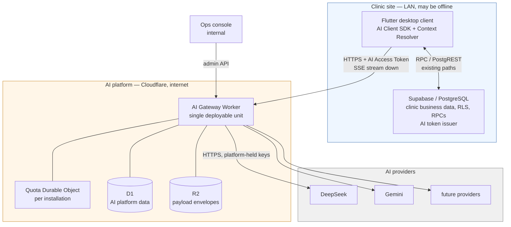


Three properties of this picture are deliberate and worth naming:

- **There is no arrow from the AI platform to Supabase.** Not "we chose not to" — it is not
reachable, and designing as if it were would produce an architecture that only works in a tier
that does not exist yet.
- **Provider credentials exist only inside the edge box.** The client never holds one, and the clinic
server never holds one, so a stolen clinic backup or a decompiled desktop binary yields no
provider access.
- **The clinic box remains fully functional if the edge box disappears.** AI is a strict addition to
the product, not a dependency of it.


### 3.3 Trust and network topology

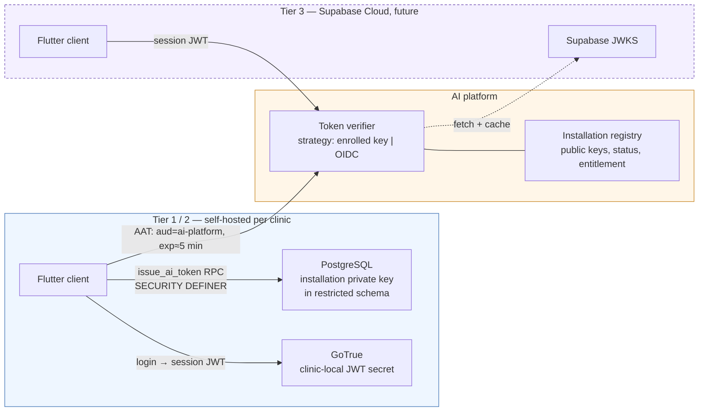


Trust chain, stated as a sequence of assertions each of which is independently verifiable:

1. The platform trusts an **installation** because an operator enrolled it and holds its public key.
2. The platform trusts a **request** because it carries an unexpired token signed by that
  installation's key, with the correct audience, and a `jti` not already seen.
3. The platform trusts the **actor claims** in that token because the clinic's own
  `SECURITY DEFINER` RPC produced them from the authenticated session and the RBAC tables — the
   client cannot fabricate them.
4. The platform trusts **nothing else in the request body**. Context payloads are validated against
  the declared Context Contract and treated as untrusted input, because a compromised client could
   send arbitrary values within its own tenant scope. This is why capability scopes live in the
   *token*, not the body.

The revocation levers, in increasing severity: revoke a `jti`, suspend an actor, rotate the
installation key, suspend the installation, trip a capability kill switch, trip the global kill
switch. All are platform-side and none touch clinic logins.

### 3.4 The three seams

Almost all of this architecture's decoupling value is concentrated in three contracts. If these three
are right, the components behind them can be rewritten freely; if they are wrong, no amount of
internal cleanliness helps.

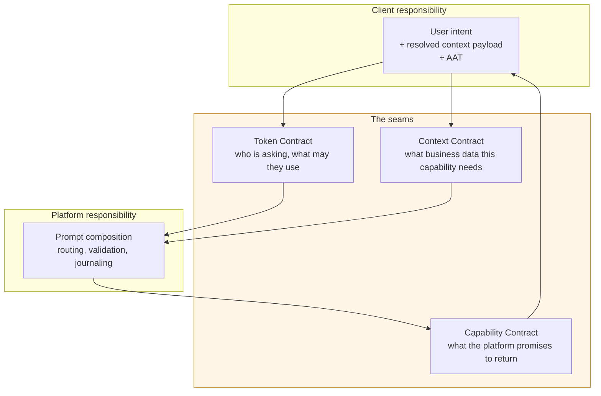


| Seam                    | Owned by                            | Answers                                                                                         | Deliberately excludes                                                                      |
| ----------------------- | ----------------------------------- | ----------------------------------------------------------------------------------------------- | ------------------------------------------------------------------------------------------ |
| **Token Contract**      | Clinic DB issues, platform verifies | Which installation, which actor, which branch, which capability scopes, valid until when        | Any clinic schema detail; any AI configuration                                             |
| **Context Contract**    | Platform declares, client satisfies | Which domain-vocabulary context keys a capability needs, in what shape, required or optional    | Table names, column names, SQL, RPC names — the platform must never learn these            |
| **Capability Contract** | Platform declares                   | Capability id/version, input shape, output schema, streaming mode, acceptance mode, error codes | Prompt text, model name, provider name, routing policy — the client must never learn these |


The asymmetry is the point. The client knows *how to fetch clinic data* and nothing about AI; the
platform knows *everything about AI* and nothing about clinic storage. Neither can be made to depend
on the other's internals because neither is ever told them.

#### 3.4.1 Enforcing the seams

A contract that is only documented decays. Every architecture of this shape fails the same way: a
prompt fragment is added to the client under deadline pressure, then another, and eighteen months later
the prompt logic is in both places. Two automated rules, both cheap, are therefore treated as
**architectural components rather than tests**:

1. **A client-side lint that fails the build** on prompt-like strings, provider names, or model
  identifiers in the Flutter codebase. This is the entire defence against the decay above (R-12), and
   it costs one CI rule.
2. **A client-side contract test** asserting the Context Resolver can produce every context key
  declared by every active capability. This turns the Context Contract from a convention into a
   verified interface, and it catches "the platform requires a key this client cannot produce" before
   release rather than in a clinic.

Neither is glamorous, and together they protect the decoupling more reliably than any component in
[§4](#4-components-and-responsibilities). Details in [§13.5](#135-testing-strategy).

### 3.5 Deliberately not in the platform

Exclusions are as architectural as inclusions. The AI platform does **not**:


| Excluded                                  | Why                                                                                                                      | Where it lives instead                                                                                                                               |
| ----------------------------------------- | ------------------------------------------------------------------------------------------------------------------------ | ---------------------------------------------------------------------------------------------------------------------------------------------------- |
| Any copy of clinic business tables        | Would create a second source of truth and a sync problem, violating constitution III                                     | Supabase only; context is transient per request                                                                                                      |
| Clinical decision authority               | Output is advisory (A5)                                                                                                  | Human acceptance recorded in Supabase                                                                                                                |
| The clinic's RBAC rules                   | Duplicated permission logic diverges silently                                                                            | Supabase RBAC; the platform reads *scopes* from the token and adds only AI-specific entitlement                                                      |
| Long-term document storage                | Not a document store                                                                                                     | Supabase Storage for clinical attachments; R2 only for the platform's own journal payloads                                                           |
| Server-side conversation state            | Would be the platform's first per-request store, and would make a transcript something two isolates must rendezvous over | The client owns the transcript and resupplies it each turn ([§6.7](#67-conversational-capabilities), [§9.18](#918-platform-held-conversation-state)) |
| Conversation memory *across* capabilities | Invites accidental cross-patient context bleed; a transcript belongs to one conversation with one assistant              | Each conversation is scoped to one conversational capability and one `conversation_id`                                                               |
| Background/batch inference                | Constitution forbids queues today; no requirement demands it                                                             | Deferred to a later delivery band ([§12.2](#122-delivery-plan)) with Workflows if a real use case appears                                            |
| Fine-tuning, embeddings, vector search    | No requirement; would drag in a vector store and an ingestion pipeline                                                   | Deferred; the provider port makes embeddings a later adapter                                                                                         |


---


## 4. Components and Responsibilities


### 4.1 Client-side components

Three components are added to the Flutter application. None of them contains prompt text, model
names, provider names, or AI business rules — that is the acceptance test for this layer.


| Component                                                 | Responsibility                                                                                                                                                                                                                       | Must not                                                                                                                          |
| --------------------------------------------------------- | ------------------------------------------------------------------------------------------------------------------------------------------------------------------------------------------------------------------------------------ | --------------------------------------------------------------------------------------------------------------------------------- |
| **AI Client SDK**                                         | Transport concern only: acquire an AAT, submit a capability request with an idempotency key, consume the event stream, surface terminal state, expose cancel, retry on transport errors, hold the last request reference for support | Interpret or transform model output; decide which model/provider; embed prompt fragments; retry after a *terminal* platform error |
| **Context Resolver**                                      | Map each requested context key to the existing Supabase RPC/query that produces it, assemble a payload conforming to the declared shape, cache short-lived results within a screen                                                   | Decide *which* keys are needed; send unrequested data; bypass RLS by using a privileged path                                      |
| **AI Feature Surfaces**                                   | Per-feature UI: draft rendering, provisional/draft styling, explicit accept/discard, degraded-mode states, request-reference display on failure                                                                                      | Persist provisional content; auto-commit AI output (A5)                                                                           |
| **Conversation store** (conversational capabilities only) | Hold the transcript of an open chat locally, resupply it on each turn, and discard it when the conversation is closed ([§6.7](#67-conversational-capabilities))                                                                      | Interpret the transcript; classify the user's message; choose which capability or which context keys a message needs              |


The Context Resolver deserves emphasis because it is where a careless implementation would undo the
architecture. It is a **generic registry** — context key → resolver function — not per-feature glue
code. It never sees a capability id and never branches on one; it receives a list of keys and returns
a payload. That property is what allows a new capability requiring an existing key to ship with
**zero** client changes, which in turn is what makes desktop-release cadence tolerable (A12).

### 4.2 Clinic backend components (Supabase)

Additive only. No existing table changes semantics, and every addition follows the established
`public` wrapper → `auth_internal` `SECURITY DEFINER` pattern (F4).


| Component                       | Responsibility                                                                                                                                         | Notes                                                                                                                                                                                                    |
| ------------------------------- | ------------------------------------------------------------------------------------------------------------------------------------------------------ | -------------------------------------------------------------------------------------------------------------------------------------------------------------------------------------------------------- |
| **Installation keystore**       | Hold the installation ID and the Ed25519 private signing key in a restricted schema, unreadable by `anon`/`authenticated` roles                        | Only the token-issuing function may read it. Rotation is a supported operation. Mechanism in [§4.2.1](#421-the-clinic-side-signing-mechanism).                                                           |
| **AI token issuer RPC**         | Verify the caller's session, resolve tenant/actor claims and AI capability scopes from the RBAC tables, mint a short-lived signed AAT, record issuance | The single point where clinic identity is converted into AI platform identity. Rate-limited itself, so a compromised client cannot mint tokens without bound.                                            |
| **Context provider RPCs**       | Return the domain payloads the Context Resolver needs, under the caller's own permissions                                                              | Prefer reusing existing RPCs. New ones are ordinary read RPCs with no AI knowledge — an RPC returning vitals is not "an AI RPC".                                                                         |
| **AI acceptance recording RPC** | Record that a human accepted AI-generated content into a clinical record, storing the AI request reference alongside the domain write                  | Closes the audit loop (A5): the clinic `audit_log` can explain the provenance of a clinical field. One shared RPC for every capability; contract in [§4.2.2](#422-the-ai-acceptance-recording-contract). |
| **AI availability flag**        | Store whether this installation is AI-enrolled and the platform base URL                                                                               | Lets the client hide AI affordances entirely for non-AI clinics without probing the network.                                                                                                             |


> **Boundary note:** the clinic database gains *no* knowledge of prompts, providers, quotas, or AI
> request state. It gains exactly two AI-shaped facts: "I can mint tokens for the AI platform" and
> "a human accepted AI output here". Anything more would migrate AI logic into the wrong layer.


#### 4.2.1 The clinic-side signing mechanism

[§2.1](#21-amendment-a1-authenticate-every-request-requires-a-trust-bootstrap-that-does-not-exist-yet)
requires the clinic database to sign AATs **asymmetrically**, so the platform can verify them while
holding only a public key. Naming the mechanism is not an implementation detail that a delivery slice
may choose for itself: the algorithm appears in the token header, the public key format appears in the
enrollment payload, and the verifier port depends on both. It is therefore fixed here.

**The mechanism: the** `pgsodium` **extension's Ed25519 detached signatures, producing a JWS with**
`alg: EdDSA`**.**


| Concern             | Named mechanism                                                                                                                                                                                   |
| ------------------- | ------------------------------------------------------------------------------------------------------------------------------------------------------------------------------------------------- |
| Keypair generation  | `pgsodium.crypto_sign_new_keypair()` during enrollment, run by the migration/enrollment role, which must hold `pgsodium_keymaker`. Produces a 64-byte Ed25519 secret key and a 32-byte public key |
| Private key at rest | Stored in the restricted AI schema, with no grants to `anon`/`authenticated`, read only by the `SECURITY DEFINER` issuer. Wrapping it in `supabase_vault` (already installed) is permitted        |
| Signing             | `pgsodium.crypto_sign_detached(signing_input, secret_key)` over the base64url `header.payload`, appended as the third JWS segment. Base64url encoding uses `translate`/`encode`, not `pgjwt`      |
| Public key export   | Raw 32 bytes, published to the platform as a JWK `{"kty":"OKP","crv":"Ed25519","x":<base64url>}` with a `kid`                                                                                     |
| Verification        | Platform side, WebCrypto `Ed25519` `importKey` (`jwk` or `raw`) + `verify` — a first-class Workers algorithm. Clinic-side self-test uses `pgsodium.crypto_sign_verify_detached`                   |


**Why EdDSA and not ES256 or RS256.** The choice is forced, not preferred. Verified against the
clinic's own Postgres image (`supabase/postgres:15.8.1.085`): `pgcrypto` offers hashing, HMAC, and PGP
but no raw asymmetric signing primitive; `pgjwt` is installed but signs **HMAC only** (`HS256`/`HS384`/
`HS512`), so it cannot produce an asymmetric AAT and is used for nothing here; `pgsodium` 3.1.8 is
available in the image and its `crypto_sign_*` family is Ed25519 exclusively. Ed25519 is the only
asymmetric signing primitive the existing stack can offer without adding a component. ECDSA P-256
would require a Postgres extension the image does not ship, and a pure-PL/pgSQL implementation is not
a serious option. Ed25519 is also the better key: 32-byte public keys make the enrolled-key record and
the config cache trivially small ([§4.3.2](#432-identity-and-tenant-resolution)).

**Why not move signing out of Postgres.** A Supabase Edge Function or a signer in the gateway would
introduce a component kind the architecture does not have — the issuer is fixed as a `SECURITY DEFINER`
RPC (F4), the constitution forbids a custom primary backend (F5), and the gateway is the only new
deployable ([§14](#14-constitution-compliance-check)). Moving the private key anywhere outside the
clinic database would also break the one-directional trust that [§3.3](#33-trust-and-network-topology)
depends on.

**The one liability, recorded.** Supabase has marked `pgsodium` *pending deprecation* on its hosted
platform, steering hosted users to Supabase Vault — which stores secrets but exposes no signing
primitive, so it is not a substitute. The deprecation is a **hosted-platform** decision; the clinic
deployment is self-hosted (F1) and pins its own Postgres image, so the extension's availability is
under this project's control, not Supabase's release calendar. Should Tier 3 (Supabase Cloud) ever
become real, the affected clinics are precisely the ones that gain a cloud-issued JWKS, which is the
OIDC verifier strategy [§2.1](#21-amendment-a1-authenticate-every-request-requires-a-trust-bootstrap-that-does-not-exist-yet)
already keeps on the table. Tracked as R-24.

#### 4.2.2 The AI acceptance recording contract

A5 requires clinical content to enter the record only through an explicit human accept recorded with
the AI request reference, and [§14](#14-constitution-compliance-check) (principle III) requires that
AI output enter the record **through the existing domain RPCs**, with their existing validation,
triggers, and RLS. Those two together fix the shape of the acceptance RPC: it is a single,
capability-agnostic wrapper that *delegates* the clinical write to an allow-listed existing domain
RPC and records provenance in the same transaction. Naming it here is not an implementation detail a
delivery slice may choose for itself — Open Decision 14 requires later conversational acceptance to
reuse this exact RPC, so a second acceptance path must be impossible by construction.

**The RPC.**

```sql
public.record_ai_acceptance(
  p_request_reference text,   -- e.g. '7QK4-2B9F' (§8.9 format); the only AI-shaped input
  p_target_key        text,   -- an allow-listed acceptance target
  p_target_args       jsonb   -- named arguments for that target's domain RPC
) RETURNS public.rpc_result
```

It follows the established `public` wrapper → `auth_internal.record_ai_acceptance`
`SECURITY DEFINER` pattern (F4), where the definer half exists to write `ai_accepted_output` and the
append-only `audit_log` — the clinical write itself is delegated and keeps its own authorization, as
below. On success, `rpc_result.data` carries
`{"acceptance_id", "table_name", "record_id", "audit_log_id"}` merged with the delegated RPC's own
`data`. On failure it returns the delegated RPC's `error_code` and `error_message` unchanged, so
acceptance adds **no new error vocabulary** — neither a clinic-side one nor an entry in the platform
error taxonomy ([§5.4](#54-error-taxonomy)), which is not involved at all: by this point the request
is already terminal and the platform has been left behind.

**Why one shared RPC can perform a domain-specific clinical write.** Because it knows no domain.
`p_target_key` resolves, in an allow-list registry `ai_internal.acceptance_targets(target_key, domain_function, table_name)`, to exactly one existing `public` domain RPC. The acceptance RPC
invokes that RPC with `p_target_args`, and because the delegated function runs its own
`auth_internal` authorization against the calling actor exactly as it does for a manual edit, the
write is subject to the same permission checks, validation, triggers, and RLS — acceptance grants no
privilege the clinician did not already have. A function name is never client-supplied: the
registry is the only source, and registering a target is a migration. An unregistered `p_target_key`
is rejected before anything is written. Enabling a new
clinical capability therefore adds a registry row, never a second acceptance path, which is exactly
what Open Decision 14 needs and what keeps AI schema out of the domain functions: they remain
ordinary domain RPCs that have never heard of AI.

**Where the request reference is persisted.** One additive table, `public.ai_accepted_output`:


| Column                 | Type                                                                               | Purpose                                                                                         |
| ---------------------- | ---------------------------------------------------------------------------------- | ----------------------------------------------------------------------------------------------- |
| `id`                   | `uuid` PK                                                                          | The acceptance id returned to the caller                                                        |
| `organization_id`      | `uuid` NOT NULL → `public.organizations`                                           | Tenant scope for RLS, matching every other domain table                                         |
| `branch_id`            | `uuid` NULL → `public.branches`                                                    | Branch scope where the target row has one                                                       |
| `table_name`           | `text` NOT NULL                                                                    | The domain table written — same vocabulary as `audit_log.table_name`                            |
| `record_id`            | `uuid` NOT NULL                                                                    | PK of the domain row written — same vocabulary as `audit_log.record_id`                         |
| `ai_request_reference` | `text` NOT NULL, `CHECK (value ~ '^[0-9A-HJKMNP-TV-Z]{4}-[0-9A-HJKMNP-TV-Z]{4}$')` | The join key to the platform journal, in the fixed [§8.9](#89-support-audit-trace) format (A13) |
| `accepted_by`          | `uuid` NOT NULL → `auth.users`                                                     | The human who accepted (A5)                                                                     |
| `accepted_at`          | `timestamptz` NOT NULL DEFAULT `now()`                                             | When                                                                                            |
| `audit_log_id`         | `uuid` NOT NULL → `public.audit_log`                                               | The audit entry this acceptance produced                                                        |


Unique on `(table_name, record_id, ai_request_reference)`; indexed on `ai_request_reference` and on
`(table_name, record_id)`. The reference is stored as `text` rather than a foreign key because the
row it refers to lives in D1 — the clinic database must be able to hold it while the platform is
gone. Deliberately absent, per the boundary note above: capability id, model, provider, prompt,
token counts, cost, and request state. The clinic stores the *handle*, not the request.

**How** `audit_log` **joins the domain write to the reference.** In the same transaction the RPC writes
one `audit_log` entry with `action = 'ai.acceptance_record'`, `table_name` and `record_id` set to the
domain row just written, and `new_data_json` carrying `{"ai_request_reference": …, "acceptance_id": …}`; `ai_accepted_output.audit_log_id` points back at it. Provenance for a clinical
field is then one query in either direction: from the field, `audit_log` by `(table_name, record_id)` yields the reference; from a reference quoted by a clinician, `ai_accepted_output` yields
the field and its audit entry, and the platform's own trace resolves from the same string
([§8.9](#89-support-audit-trace)). Because the delegated domain write, the `ai_accepted_output` row,
and the `audit_log` entry are one function call and therefore one transaction, "domain change and
request reference together or not at all" is a property of the RPC, not a discipline asked of
callers.

**What the mechanism is first proved against.** Open Decision 1 keeps the *first shipped capability*
non-clinical-record with acceptance mode `advisory_display`, so when this RPC lands there is no
product capability whose accept writes a clinical record — and there must not be, or F2 would become
a prerequisite for CP3. The RPC is therefore proved against a **registered demonstration target**
rather than a product behaviour: one registry row, `visit_clinical_notes` → the existing
`public.save_visit_documentation`, exercised by SQL and Flutter tests for atomicity, provenance, and
the discard path. That target is chosen only because it already exists, is clinical, and is written
by an ordinary domain RPC — a `public` wrapper delegating to `auth_internal.save_visit_documentation`
(`SECURITY DEFINER`), which asserts `visits.edit_soap`, enforces branch scope and optimistic
concurrency, and writes the visit's clinical note row. Registering a target grants no capability the right to write to it: that
right comes from a capability declaring acceptance mode `human_accept_required` in its manifest
([§5.1](#51-capability-manifest)), which stays Open Decision 1's to assign. Until it does, the E4
surface's `advisory_display` accept remains non-writing.

### 4.3 AI Gateway Worker components

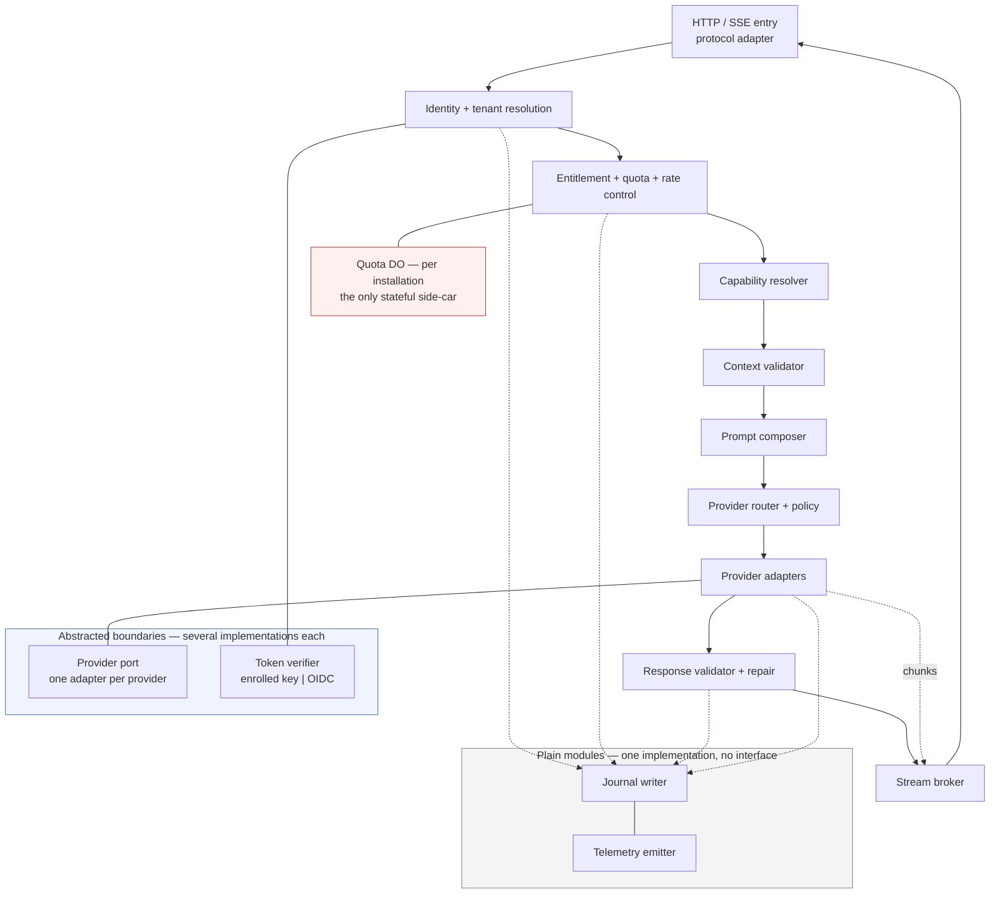


#### 4.3.1 Protocol adapter

Owns the wire format and nothing else: request parsing, size limits, header handling
(idempotency key, client trace id, capability version pin), SSE framing for streaming responses, and
translation of the internal error taxonomy to HTTP status codes plus a stable error body. Keeping
this isolated is what allows a future transport (WebSocket for bidirectional sessions, or plain JSON
for `structured_atomic`) without touching the pipeline.

#### 4.3.2 Identity and tenant resolution

Verifies the AAT through the **verifier port** (enrolled-installation key or OIDC/JWKS, per A1),
enforces audience, expiry, clock skew tolerance, and `jti` replay rejection; loads the installation
record; and produces an immutable **request principal** — installation, organization, branch, actor,
role, capability scopes — that every later stage reads and none may mutate.

The port has two strategies, and only the first is built now:

- **Enrolled installation key** — the AAT is an `EdDSA` JWS, verified with WebCrypto `Ed25519`
 against the installation's enrolled 32-byte public key ([§4.2.1](#421-the-clinic-side-signing-mechanism)).
 The key is selected by `iss` and `kid`; no network call is involved.
- **OIDC / JWKS** — reserved for Tier 3, where a hosted issuer publishes a key set over HTTP. It is
 the reason this is a port at all, and the reason a JWKS-shaped key representation (JWK `OKP`) is
 used for the enrolled key too: the two strategies then differ only in *where the key came from*,
 not in what a key is.

Installation public keys and status are read through the **config cache**: an in-isolate memory map
with a short TTL, populated from D1 on a miss. At clinic scale the entire config set — installations,
keys, entitlements, grants, kill switches, the active routing policy, and the global `token_contract`
accepted-`ver` set ([§5.6](#56-token-contract)) — is a few kilobytes, so a warm isolate answers in
nanoseconds and a cold one pays a single same-region D1 read. Replay rejection is not part of this
stage's own I/O; the `jti` is checked inside the Quota Durable Object round trip at the next stage,
where it costs nothing extra ([§4.3.3](#433-entitlement-quota-and-rate-control)).

#### 4.3.3 Entitlement, quota, and rate control

Mechanisms with different consistency requirements (A3). Rate limiting and the cost ceiling stay
separate because they must be *approximate and local*; everything needing serialized truth shares the
one Durable Object:

- **Rate limiting** uses the Rate Limiting binding on composite keys (`installation`,
`installation+actor`, `installation+capability`). Approximate and eventually consistent by design;
its job is to make abuse cheap to reject, not to be exact.
- **Quota and concurrency** use a **per-installation Quota Durable Object**, the only primitive here
that gives serialized, strongly consistent accounting. The DO holds the entitlement snapshot, the
period counters, and the in-flight count. It answers one question before the provider call — "is
there budget left?" — and is **credited with actual usage after** the call completes. The
per-installation budget is denominated in **AI credits** on a monthly period (A15): settlement
debits the capability's declared `quota weight`, while the token and cost counters remain as
reconciliation and billing evidence.
- **Replay and idempotency** ride along in that same round trip. Both are installation-scoped facts
that need exactly the serialization the DO already provides — "have I seen this `jti`?" and "have I
seen this idempotency key?" are the same shape of question as "is there budget left?" Folding them
in removes a D1 table, its TTL pruning cron, and one D1 write per request, and it costs no
additional DO request because the round trip happens regardless
([§9.17](#917-a-separate-store-for-replay-and-idempotency-state)).
It deliberately does **not** hold pre-flight reservations against the estimated cost of each request:
reservations exist to stop concurrent requests from collectively overshooting the last unit of quota,
which at clinic volumes is an overshoot of one or two requests and no real exposure. The genuinely
dangerous case is a single very expensive request, and the cost ceiling below already blocks that.
Counting after the fact is exact where it matters — in the billing ledger — and one mechanism simpler.
- **Cost ceiling** is a local pre-flight check: estimated input tokens plus the capability's max
output tokens against the capability's token budget (A6, [§13.6.2](#1362-pre-flight-token-estimation)).
Rejecting an oversized request before egress is the cheapest possible protection.

Two rules make this humane rather than hostile, per constitution principle V: quota exhaustion
**never** hard-locks anything (it disables an additive feature and says so), and a *soft* threshold
can downgrade routing to a cheaper model instead of refusing outright.

#### 4.3.4 Capability resolver

Resolves `capability id + requested version` against the **capability registry** to a concrete,
immutable manifest, honouring the client's version pin and the installation's plan-level allowances
(a capability may be entitlement-gated). Rejects unknown or retired capabilities with a distinct,
actionable error, and enforces kill switches (A8) here — the earliest point where a capability is
identified and the last point before any real work happens.

#### 4.3.5 Context validator

Validates the client-supplied context payload against the manifest's Context Contract: required keys
present, shapes conform, sizes within bounds, no unexpected keys accepted silently. Two behaviours
matter architecturally:

- **Missing required context is a typed, machine-readable rejection** carrying the manifest of what
was missing — enabling the self-healing handshake in [§8.4](#84-missing-context-self-healing) so a
slightly stale client recovers automatically instead of failing.
- **Unknown keys are dropped, not forwarded.** A prompt must never be able to receive data the
capability did not declare, or the minimization property in [§2.9](#29-requirement-accepted-as-is-no-phi-redaction) evaporates.

For a **conversational** capability the same two behaviours apply, against a different list. The
manifest declares a *permitted* key set rather than a required one, so "unknown keys are dropped"
becomes the enforcement point for the assistant's entire reach into clinic data: a key the manifest
does not permit cannot enter a prompt even if the model asked for it and the client supplied it. This
stage also validates the supplied transcript — turn ordering, declared shapes, and the conversation
budget counted from the transcript itself ([§6.7](#67-conversational-capabilities)).

The declared shapes are the closed transcript wire contract in
[§6.7.1](#671-the-unit-of-work-is-a-leg-not-a-conversation). Two rejections are distinct and must not
be conflated, because the client's remedy differs:

- **A malformed or out-of-order turn is** `context_invalid` — an out-of-order or duplicate
`turn_ordinal`, an unknown `kind`, or a payload that is missing, mistyped, or not the one that
turn's `kind` declares. The transcript violates its published shape exactly as a malformed context
payload does, and it is the same defect with the same remedy: the client is emitting a shape the
platform never published, so retrying is pointless and the failure is a bug to report
([§5.4](#54-error-taxonomy)). No new taxonomy code is introduced for it.
- **A well-formed transcript that is merely too long is not** `context_invalid`**.** Exceeding max
history turns or max context rounds is `conversation_budget_exhausted`, and exceeding the cost
ceiling is `request_too_large` ([§6.7.3](#673-what-bounds-the-loop)). Shape is checked first: a
transcript that cannot be parsed into turns cannot be counted, so a budget code is never emitted for
a transcript that failed shape validation.


#### 4.3.6 Prompt composer and prompt registry

The heart of requirement [2]. Composes the final provider-bound message set from: the system
instruction artifact, the business-rule fragments the capability declares, the output-format
instruction derived from the capability's schema, the validated context payload rendered through the
capability's template, the user intent, and the output constraints (max tokens, stop sequences,
language, tone, refusal policy).

For a conversational capability it additionally renders the **supplied transcript** as prior turns, and
offers the shared context-request schema as a second permitted output shape alongside prose. Both the
transcript's user turns and any context resolved during the conversation are rendered as delimited,
typed data on the same footing as ordinary context — the composer draws no distinction between free
text that arrived from a clinical note and free text a clinician typed into a chat box, because neither
may act as an instruction (R-10).

The composer emits its parts using the closed canonical role-tag set frozen in
[§5.3](#53-canonical-inference-representation) — `system` for the system instruction, the
business-rule fragments and the derived output-format instruction; `user` for the user intent and a
transcript's user turns; `assistant` for a transcript's prior model turns; `data` for context. It
invents no tag of its own.

**"Delimited, typed data" has one rendering**, so that R-10 is a property of the shape rather than of
the wording: every context part is a single `data` part whose payload is the manifest-declared keys
rendered one per block, each block opened and closed by a tag naming the key and declaring the key's
published shape, and the value emitted verbatim inside it. Nothing else is placed in a `data` part —
no preamble, no instruction, no explanation of what to do with the content. Any delimiter-like text
occurring inside a value is neutralized so a value cannot close its own block or open another; that
escaping, not a plea in the system instruction, is what stops an embedded instruction from acting as
one. **The payload of a** `data` **part is opaque to adapters**: adapters bind to the role tag only and
forward the payload unread, so the block format can change with a capability build without touching
a provider adapter.

Two decisions worth defending:

- **Prompt artifacts are versioned, immutable assets deployed with the Worker, and the version in
force is pinned by the capability manifest itself.** Prompts are logic: they deserve code review,
diffs, and CI evals (A9). One artifact, one pointer to it, one answer to "which prompt was live?" —
which is what makes a journal entry trustworthy during an incident. Rollback is a deploy.
The rejected alternative — prompts as editable D1 rows — is examined in
[§9.5](#95-prompts-as-editable-data-in-d1), and the deliberately deferred refinement — a runtime
activation pointer allowing rollback without a deploy — in [§9.14](#914-mechanisms-deliberately-simplified).
- **The output schema is the single source of truth** for the format instruction, the provider's
structured-output/JSON-mode configuration, and the response validator. Deriving all three from one
artifact removes the classic failure where the prompt asks for one shape and the validator demands
another.


#### 4.3.7 Provider router and policy engine

Selects an ordered **candidate chain** of provider+model targets for this capability from routing
policy: capability requirements (structured output support, context window, language, latency class),
installation overrides, cost class, and — where a quota soft threshold was crossed — a degraded tier.
Policy is data, versioned and auditable, not conditionals in the code path; the router also records
*why* a target was chosen, because unexplainable routing is undebuggable in production.

Routing is **stateless**: the chain depends only on the capability, the policy, and this request. There
is no circuit breaker and no shared provider-health state. A sick provider is handled by the retry and
fallback chain on each request, which costs a little latency during an outage but keeps the answer to
"why did this request go to Gemini?" fully contained in one request's own journal entry. Health-based
routing is a deliberate deferral, not an oversight ([§9.14](#914-mechanisms-deliberately-simplified)).

**Policy content and where it resolves.** `routing_policy.content_pointer`
([§7.3](#73-d1-logical-model)) is an R2 key under the control-plane prefix,
`control/routing-policy/{policy_id}/{version}.json`, written once and never mutated — a new policy
version is a new object plus a new `routing_policy` row, which is what makes rollback an activation
change rather than an edit. The active version's document is held in the config cache
([§4.4](#44-storage-ownership)) alongside kill switches and grants, so the router reads it without
touching D1 or R2 on the request path. The document is:


| Field                           | Type / values                                                                                                                                     | Notes                                                                                                                                         |
| ------------------------------- | ------------------------------------------------------------------------------------------------------------------------------------------------- | --------------------------------------------------------------------------------------------------------------------------------------------- |
| `schema_version`                | integer                                                                                                                                           | Document format version; independent of `policy_version`                                                                                      |
| `policy_id`, `policy_version`   | string, integer                                                                                                                                   | Must equal the owning `routing_policy` row                                                                                                    |
| `defaults`                      | `{ cost_class, max_parallel_attempts }`                                                                                                           | Applied when a rule omits them                                                                                                                |
| `rules[]`                       | ordered, **first match wins**                                                                                                                     | An empty match set matches everything; a document must end with a catch-all rule                                                              |
| `rules[].rule_id`               | string, unique in document                                                                                                                        | Recorded in the selection reason                                                                                                              |
| `rules[].match`                 | `{ capability_ids[], installation_ids[], cost_classes[], tiers[], languages[], latency_classes[] }` — all optional, all present clauses must hold | `tiers[]` takes `standard` / `degraded`                                                                                                       |
| `rules[].requires`              | `{ structured_output: bool, min_context_window: int, languages[] }`                                                                               | Feature floor a target must satisfy; the capability manifest's Routing group supplies the request-side values compared against it             |
| `rules[].targets[]`             | ordered chain of `{ provider_id, model_id, features, max_attempts, timeout_ms }`                                                                  | `model_id` is a **pinned version, never a floating alias** (R-4); `features` mirrors the `requires` shape and is what the filter reads        |
| `rules[].max_parallel_attempts` | integer `1`–`6`, default `1`                                                                                                                      | Speculative parallelism, hard-bounded by the per-request outgoing-connection cap of six ([§1.4](#14-verified-platform-capability-budget))     |
| `overrides[]`                   | `{ installation_id, exclude_providers[], pin_target, force_cost_class }`                                                                          | Applied after rule selection, before feature filtering; an override may narrow the chain but never widen it beyond the matched rule's targets |


**Cost class** is an ordered enum — `economy` < `standard` < `premium`. It is never supplied by the
request; clients must not learn routing ([§3.4](#34-the-three-seams)). The effective class is the
**lowest** of three sources, and the router records which one bound it: the capability manifest's
Routing group (the class the feature is designed for), the entitlement's `max_cost_class` (the plan
ceiling), and an installation `force_cost_class` override in the policy document. Taking the minimum
means a cheaper plan can never be routed above what it pays for, and a premium plan never lifts a
capability above what its manifest declares safe.

**The degraded signal is internal, not a wire field.** The quota check
([§8.8](#88-quota-and-rate-limit-rejection)) returns `{ allowed, degraded }`; when `degraded` is true
the gateway sets `routing_tier = degraded` (otherwise `standard`) on the in-memory request context and
persists it as `ai_request.routing_tier`. The router matches it against `rules[].match.tiers`. Nothing
about the tier is accepted from the client — the client only ever *receives* the boolean
`degraded_notice` on the accepted event, and cannot send it.

**The selection reason** is recorded in two places. `ai_request.routing_decision` holds one object per
request — `policy_id`, `policy_version`, `rule_id`, `effective_cost_class`, `cost_class_source`
(`manifest` / `entitlement_cap` / `installation_override`), `routing_tier`, `required_features`,
`chain` as an ordered list of `{ ordinal, provider_id, model_id }`, `excluded` as a list of
`{ provider_id, model_id, reason_code }`, and `max_parallel_attempts`. A `reason_code` takes
`feature_unsupported`, `context_window_too_small`, `language_unsupported`, `kill_switch`,
`installation_excluded`, or `cost_class_excluded`. Each
`ai_attempt` row then carries a `selection_reason` enum saying why *that* target was tried:
`primary`, `fallback_after_retryable_error`, `fallback_after_timeout`, `speculative`, or
`repair_retry`. The split matters — the request-level object explains the chain, the attempt-level
enum explains the walk through it, and support needs both to answer "why this provider?" from one
journal entry.

#### 4.3.8 Provider adapters and egress

One adapter per provider, each translating the **canonical inference request** ([§5.3](#53-canonical-inference-representation))
to that provider's wire format and normalizing its responses, streaming chunks, usage counters, and
errors back into the canonical form and the shared error taxonomy. Adapters own: authentication to the
provider, request/response mapping, stream chunk normalization, provider-specific structured-output
mechanics, timeouts, and **classification of every failure as retryable or terminal**. Adapters own
nothing else — no retry decisions, no fallback decisions, no logging policy — because those must be
uniform across providers to be reasoned about.

Provider credentials come from the platform's secret store, are never logged, and are never present
in the journal. The per-request outgoing-connection cap of six ([§1.4](#14-verified-platform-capability-budget))
bounds how much speculative parallelism a routing policy may request.

#### 4.3.9 Response validator and repair

Applies, in order: transport/parse validity → schema conformance → business-constraint checks the
capability declares (enumerations restricted to the clinic's own vocabulary, referential sanity
against the supplied context, numeric ranges, required-section presence) → safety guards (leaked
system instructions, refusals, empty or truncated output, prompt-injection echo).

On failure the validator may attempt a **bounded repair** — a single, budgeted re-ask with the
validation errors appended — then fail terminally with a typed error. Repair attempts are capped and
counted, because an unbounded repair loop is an unbounded bill. Whether repair is allowed is a
per-capability manifest decision, not a global one.

#### 4.3.10 Stream broker

The stream broker relays normalized chunks to the client, enforces provisional-vs-committed semantics
(A2), emits heartbeats so intermediaries do not time out an idle stream, and guarantees that **every
stream ends with exactly one terminal event** — success with the validated payload, a typed error, or
(for conversational capabilities only) a validated context request — so the client never has to infer
completion from silence.

It also owns cancellation, and owns it **without any stateful component**. Cancellation is
connection-scoped: the request is cancelled by closing the stream, the Worker observes the client
disconnect, and the in-flight provider fetch is aborted through its abort signal. This covers the only
cancellation shape the product needs — a user abandoning a generation on the screen that is showing it.

Out-of-band cancellation (from a different window, or after a reconnect) is explicitly **not**
supported, because it would require a per-request Durable Object so that two isolated Worker
invocations could rendezvous — a whole stateful component, with its own lifecycle and failure modes, in
service of one rare interaction. The reasoning and the path to adding it are in
[§9.7](#97-connection-scoped-cancellation-versus-a-session-durable-object).

#### 4.3.11 Journal writer

Records the auditable life of every request: submission, principal, capability and prompt artifact
versions, context key names and sizes, provider attempts with outcomes and latencies, token usage and
cost, validation results, terminal state, and the payload pointers. Two rules dictate its shape:

- **The request row is written synchronously, before the stream opens.** A request that a user saw
must always have a record, so the record is created at the moment the request is accepted and updated
in place as the state advances — each transition overwrites `state` and stamps `updated_at`, and the
terminal one stamps `completed_at` ([§6.3](#63-request-state-machine)). The journal keeps one row per
request, never one per transition. One D1 insert costs single-digit milliseconds against an
inference measured in seconds, so deferring it to a post-response continuation would trade audit
completeness for latency nobody can perceive — the wrong way round for a platform whose hardest
requirement is explaining a failure after the fact. Bulk detail (per-attempt rows, the usage ledger
row, the payload envelope) is still written after the response, because losing those degrades
diagnosis without losing the existence of the request.
- **Payloads go to R2, pointers go to D1, and one request produces one R2 object.** Prompt, context,
raw provider exchanges, and the validated result are written as a single **payload envelope** keyed
by request id; D1 holds fixed-width metadata. Offloading respects the 2 MB row limit, the 10 GB
database ceiling, and the per-row write cost. Writing *one* object rather than four is what keeps
R2 Class A operations — the platform's scarcest metered resource — proportional to requests rather
than to a multiple of them ([§7.4](#74-r2-payload-layout)).


#### 4.3.12 Telemetry emitter

Structured logs with a propagated trace id and spans per pipeline stage and provider attempt.

**Metrics are derived, not separately written.** Every dimension a dashboard needs — outcome,
latencies, token counts, cost, per capability, provider, model, and installation — is already on the
`ai_request` and `ai_attempt` rows the journal writes anyway, so aggregate questions are answered by
querying the journal and by the scheduled `usage_rollup` job. The platform emits no second stream of
metric data points ([§9.16](#916-analytics-engine-as-the-metrics-store)).

The one class of signal the journal cannot supply is **guard rejections**, which are deliberately not
journaled so that refusing abuse stays cheap ([§7.5](#75-write-path-economics)). These are counted in
an in-isolate tally flushed periodically to a small `platform_counter` table — bounded, low-cardinality
rows keyed by dimension and time bucket, never one row per event.

### 4.4 Storage ownership

There are **three stores and one credential binding**. Each is present because it has a property none
of the others has; nothing is here for convenience.


| Store               | Owns                                                                                                                              | Never holds                                       | Consistency           | The property nothing else provides                                                                        |
| ------------------- | --------------------------------------------------------------------------------------------------------------------------------- | ------------------------------------------------- | --------------------- | --------------------------------------------------------------------------------------------------------- |
| **D1**              | Installations, keys, entitlements, grants, routing policy, request journal metadata, usage ledger, rollups, counters, admin audit | Clinic business records; large text               | Strong, single-writer | Relational, queryable truth — the only store that can answer "show me this request" and "sum this period" |
| **R2**              | One payload envelope per request: composed prompt, context, raw provider exchanges, validated result                              | Anything needed on the hot path for authorization | Read-after-write      | Unbounded object size at storage prices D1 cannot approach                                                |
| **Durable Object**  | Per-installation quota, concurrency, `jti` replay set, idempotency records                                                        | Long-term records; per-request objects            | Strong per object     | Serialized counting — D1 races on read-modify-write and no cache can be authoritative                     |
| **Secrets binding** | Provider API keys, signing material                                                                                               | Anything logged or journaled                      | —                     | Credential isolation (a binding, not a store)                                                             |


Alongside them sits the **config cache**, which is not a store: an in-isolate memory map, short TTL,
D1 on miss, holding installations, keys, entitlements, grants, kill switches, the active routing
policy, and the global `token_contract` accepted-`ver` set. It is a latency optimization over D1 and
it owns nothing.

Two properties of this set are worth internalizing.

**D1 is the only authoritative store.** R2 holds bytes that D1 rows point to, the Durable Object holds
live counters that settle into D1's ledger, and the config cache holds copies of D1 rows. Nothing
outside D1 is the truth about anything — which is precisely the test that decided what to leave out
([§9.15](#915-workers-kv-as-a-hot-config-cache), [§9.16](#916-analytics-engine-as-the-metrics-store)).

**There is no store for live request state.** One Durable Object class exists, it is per-installation
rather than per-request, and it holds counters and short-lived sets. An in-flight AI request exists
only as an open connection plus a journal row.

### 4.5 Control plane

A small internal surface, separate from the client-facing API and separately authenticated
(operator identity, not clinic identity):


| Function                | Purpose                                                                                                                                                                                                                      |
| ----------------------- | ---------------------------------------------------------------------------------------------------------------------------------------------------------------------------------------------------------------------------- |
| Installation lifecycle  | Enroll, rotate keys, suspend, resume, delete                                                                                                                                                                                 |
| Entitlement management  | Assign plan, set quota and budget, grant/revoke capabilities, set period bounds and soft threshold; maintain the plan catalogue (A15)                                                                                          |
| Billing                 | Period close and invoice generation from the usage ledger and the versioned credit price list (A15); payment collection remains external                                                                                       |
| Kill switches           | Global, per capability, per installation, per provider (A8) — every one of these writes a `kill_switch` row ([§7.3](#73-d1-logical-model))                                                                                    |
| Capability availability | Grant, gate, deprecate, or retire a capability version for a plan or installation — every one of these writes a `capability_grant` row ([§7.3](#73-d1-logical-model)); deprecate and retire write it at `global` scope       |
| Token contract rotation | Begin a rotation (add a `ver` to the accepted set) or retire a `ver` (remove it) — the only two writers of the global `token_contract` record ([§5.7](#57-versioning-and-compatibility-rules), [§7.3](#73-d1-logical-model)) |
| Routing policy          | Publish a new versioned policy; canary; roll back                                                                                                                                                                            |
| Support lookup          | Resolve a request reference to its full trace and payloads (A13)                                                                                                                                                             |
| Operational dashboards  | Health, error taxonomy breakdown, provider latency and cost, quota consumption                                                                                                                                               |


**The line between the first two rows.** Installation lifecycle owns identity and trust material —
the `installation` row, its keys, and its lifecycle status. Entitlement management owns everything
economic. Enroll creates the entitlement row so that the tenant's shape is complete on day one, but
it creates it empty and `pending`; every value that decides what a request may cost is written by
Entitlement management ([§8.1](#81-clinic-enrollment-and-trust-bootstrap) for the exact initial
values). An installation is therefore enrolled and verifiable before it is entitled to anything, and
the two states are separately auditable.

Every control-plane mutation is journaled with the operator identity. Routing policy and kill-switch
changes are the highest-leverage actions in the entire system — an unaudited change to where requests
go is indistinguishable from an attack.

### 4.6 Responsibility matrix


| Component           | Owns the decision                            | Must not know                                                | Can be replaced without touching        |
| ------------------- | -------------------------------------------- | ------------------------------------------------------------ | --------------------------------------- |
| AI Client SDK       | Transport, retry-on-transport, cancel intent | Prompts, providers, schemas beyond the declared output shape | Pipeline, prompts, providers            |
| Context Resolver    | How to obtain a context key                  | Which keys a capability needs, or why                        | Capabilities, prompts                   |
| Token issuer RPC    | Actor identity and AI scopes                 | Platform internals beyond audience and key                   | Entire platform internals               |
| Identity stage      | Whether the caller is authentic              | Clinic schema, provider details                              | Verifier strategy (enrolled key ↔ OIDC) |
| Entitlement stage   | Whether the request is allowed to cost money | Prompt content, provider identity                            | Billing model, plan structure           |
| Capability resolver | Which manifest governs this request          | Provider wire formats                                        | Registry storage location               |
| Context validator   | Whether supplied context is acceptable       | How context was fetched                                      | Client implementation                   |
| Prompt composer     | The exact provider-bound prompt              | Which provider will receive it                               | Providers, routing                      |
| Provider router     | Which target chain to attempt                | Provider wire formats, prompt text                           | Provider set, policy content            |
| Provider adapter    | Wire translation and failure classification  | Prompt intent, quota, journaling                             | Other adapters, pipeline                |
| Response validator  | Whether output may be returned               | Which provider produced it                                   | Providers, prompts                      |
| Stream broker       | Delivery and cancellation                    | Business meaning of content                                  | Transport protocol                      |
| Journal writer      | What is recorded and where                   | Business meaning of content                                  | Storage layout, retention policy        |


---


## 5. Contracts

Described at interface level — fields and semantics, not encodings or code. These are the artifacts
that need review before implementation starts, because they are the parts that are expensive to change
later.

### 5.1 Capability manifest

The manifest is the platform's declaration of an AI feature. It is immutable per version; changing
anything semantically meaningful produces a new version.

**Immutability and lifecycle.** Immutability covers the manifest's *content* — everything the prompt
composer, validator, router, and entitlement stage read, and everything a content hash is taken over.
The Identity group's `lifecycleState` and `successorId` are the values the version was **published
with**; they are the declared starting point, not a mutable field. A capability version's lifecycle
does not stay frozen for its life, but it also never evolves by editing a published manifest: an
operator deprecation or retirement is recorded as a **control-plane availability overlay** in D1
(`capability_grant`, [§7.3](#73-d1-logical-model)) that the capability resolver and discovery apply
on top of the bundled manifest, exactly as they already apply kill-switch and grant flags
([§6.1](#61-the-pipeline) stage 5). The manifest bytes and their hash never change; the effective
lifecycle state is *manifest value, overridden by overlay if one exists*.


| Field group              | Contents                                                                                                                                                                                                                                                                                                                                                                                                                                                                               | Consumed by                                                               |
| ------------------------ | -------------------------------------------------------------------------------------------------------------------------------------------------------------------------------------------------------------------------------------------------------------------------------------------------------------------------------------------------------------------------------------------------------------------------------------------------------------------------------------- | ------------------------------------------------------------------------- |
| **Identity**             | Capability id, semantic version, human title, lifecycle state (`active`, `deprecated`, `retired`), successor id                                                                                                                                                                                                                                                                                                                                                                        | Capability resolver, clients (discovery)                                  |
| **Access**               | Required capability scope, minimum plan tier, allowed staff roles, kill-switch flag                                                                                                                                                                                                                                                                                                                                                                                                    | Identity + entitlement stages                                             |
| **Interaction**          | Interaction mode (`single_shot` / `conversational`); for `conversational` only: max history turns, max context rounds per turn, transcript size limit (A14)                                                                                                                                                                                                                                                                                                                            | Protocol adapter, context validator, prompt composer                      |
| **Input**                | User-intent shape, prior-turn shape (required for `conversational`), size limits, allowed languages                                                                                                                                                                                                                                                                                                                                                                                    | Protocol adapter, context validator                                       |
| **Context requirements** | Ordered list of context keys with `required`/`optional`, shape reference, max size, freshness hint. A `conversational` capability instead declares a **permitted key set** the assistant may request during a turn                                                                                                                                                                                                                                                                     | Context validator, client Context Resolver ([§5.2](#52-context-contract)) |
| **Prompt binding**       | System instruction artifact ref, business-rule fragment refs, context rendering template ref, output-format instruction derivation rule                                                                                                                                                                                                                                                                                                                                                | Prompt composer                                                           |
| **Output**               | Mode (`prose` / `structured` / `structured_atomic`), output schema ref, business validation rule refs, repair policy (allowed, max attempts)                                                                                                                                                                                                                                                                                                                                           | Validator, stream broker                                                  |
| **Routing**              | Routing policy ref, cost class (`economy` / `standard` / `premium` — the class this feature is designed for; see [§4.3.7](#437-provider-router-and-policy-engine)), required provider features (structured output, context window, language), latency class, degraded-tier policy                                                                                                                                                                                                      | Provider router                                                           |
| **Economics**            | Max input tokens, max output tokens, per-request cost ceiling, quota weight. **The per-request cost ceiling is denominated in tokens** — it is the maximum billable token count for one request, that is estimated input tokens plus max output tokens; it carries no currency and the gateway holds no price table. For `conversational`, the per-request ceiling applies per turn, and the conversation is bounded by the turn and round limits above rather than by a running total. **The `quota weight` is the capability's declared price in AI credits per request** — per leg for `conversational` — which is the unit of the per-installation monthly budget (A15) | Entitlement stage                                                         |
| **Governance**           | Acceptance mode (`advisory_display`, `human_accept_required`, `auto_apply` — the last one disallowed for clinical content per A5), retention class, eval suite ref                                                                                                                                                                                                                                                                                                                     | Client, journal, CI                                                       |


**Discovery projection.** `GET /v1/capabilities` does not serve the raw bundle. The wire carries a public projection — Identity (all five fields, so deprecation and successor stay visible per A12), Interaction, Input, Context requirements, and only `mode`/`outputSchemaRef` from Output and `acceptanceMode` from Governance. Access, Prompt binding, Routing, Economics, the Output validation/repair refs, and the Governance retention/eval refs never leave the platform: they are consumed by server-side stages (identity/entitlement, prompt composer, router, validator, journal/CI), and discovery is installation-scoped, so per-user Access data would be meaningless on the wire anyway. The discovery ETag is computed over the projection, so changes to internal-only fields never bust client caches.

Two properties are load-bearing:

- **A manifest is data, not code.** Adding a capability that reuses existing context keys, an existing
routing policy, and an existing validation rule set requires no pipeline change and no client change.
- **A manifest never names a provider or a model.** It names *requirements*; the routing policy maps
requirements to targets. This is what makes "replace a provider with minimal changes" true rather
than aspirational.
- **Interaction mode is the only switch that changes a request's shape**, and it defaults to
`single_shot`. Every mechanism A14 introduces — transcripts, context negotiation, turn budgets — is
unreachable unless a manifest opts into `conversational`, so no button-invoked capability acquires
new behaviour by their existence.


### 5.2 Context contract

A **context key** is a stable, versioned name for a unit of business data in domain vocabulary. The
naming rule is strict and worth stating as a rule because violating it silently recouples the layers:

> A context key names **what the data means to a clinician**, never where it is stored.
> `visit.vitals@v1` is correct; `visits_vitals_table@v1` or `get_visit_vitals_rpc@v1` is not.


| Aspect        | Specification                                                                                                                                                                                                                                                                            |
| ------------- | ---------------------------------------------------------------------------------------------------------------------------------------------------------------------------------------------------------------------------------------------------------------------------------------- |
| Key format    | `domain.concept@vN` — e.g. `patient.demographics@v1`, `visit.vitals@v1`, `visit.chief_complaint@v1`, `medication.active_list@v1`, `lab.recent_results@v1`, `clinic.branch_profile@v1`                                                                                                    |
| Shape         | Each key has a platform-published shape (field names, types, cardinality, units) — the *only* schema knowledge shared between the two sides. The shape is a bundled JSON artifact at `context/shapes/published/<key>.json` (e.g. `visit.chief_complaint@v1.json`), immutable per key version; the shape *schema* (`KeyShape`) and validation stay frozen TypeScript in `src/context/index.ts` |
| Direction     | Client → platform, always ([§1.3.1](#131-the-ai-platform-cannot-reach-the-clinics-database))                                                                                                                                                                                             |
| Discovery     | Client fetches capability manifests (the public projection — [§5.1](#51-capability-manifest)) (cached, revalidated by version/etag) and knows the key list before submitting                                                                                                                                                                       |
| Self-healing  | `single_shot` only. If a client submits without a required key (stale cache), the platform rejects with `context_required` plus the missing-key manifest; the client resolves and resubmits once ([§8.4](#84-missing-context-self-healing))                                              |
| Negotiation   | `conversational` only. The platform may end a turn with `context_requested` naming keys from the manifest's permitted set; the client resolves them and continues the conversation ([§6.7](#67-conversational-capabilities), [§8.10](#810-conversational-turn-with-context-negotiation)) |
| Authorization | Resolution happens under the caller's own Supabase permissions and RLS; the platform additionally verifies that supplied context is branch-consistent with the token's claims                                                                                                            |
| Evolution     | Adding an optional key is backward compatible. Adding a required key, or changing a shape, requires a new key version and a new capability version (A12)                                                                                                                                 |
| Minimization  | Only declared keys are forwarded to the composer; extras are dropped ([§4.3.5](#435-context-validator))                                                                                                                                                                                  |


**Shape artifacts.** A published shape is data, not code — the same discipline as the capability
manifest ([§5.1](#51-capability-manifest)): the `KeyShape` types and validation rules stay frozen in
TypeScript (`src/context/index.ts`), while each key version's field definitions live in an immutable
bundled JSON artifact under `context/shapes/published/`, imported and validated at build time so a
malformed artifact fails the build, never a request. A manifest's `shapeRef` names one of these
artifacts by key id; the manifest schema is unchanged. Changing a shape means publishing a new
`@vN` artifact (the Evolution row above); editing a published artifact in place is a contract
change.


**Freshness and trust.** Context is a client-supplied snapshot, so it can be stale or tampered with
within the caller's own permission scope. The architecture accepts this and compensates: the journal
records exactly what context was used (so any output can be explained), capabilities that depend on
freshness declare a hint the client honours, and no capability may take an irreversible action from
context alone — output is advisory (A5). Attempting to make the platform authoritative over context
freshness would require it to query the clinic database, which is precisely the coupling being
avoided.

### 5.3 Canonical inference representation

An internal, provider-neutral representation sits between the composer and the adapters. Everything
upstream of the adapters speaks only this; nothing upstream may contain a provider-shaped field.

**Field identifiers** in the table below are the frozen wire/TypeScript keys. The Contents column
describes meaning only — it is not a source of key names. (Contract-change amendment: A3 review
resolution — prose contents must not be used as identifiers.)


| Element                | Field                 | Contents                                                                |
| ---------------------- | --------------------- | ----------------------------------------------------------------------- |
| Canonical request      | `parts`               | Ordered role-tagged message parts (role tags from the closed set below) |
|                        | `formatDirective`     | Output format directive (free text / JSON with schema)                  |
|                        | `samplingConstraints` | Sampling constraints                                                    |
|                        | `maxOutputTokens`     | Max output tokens                                                       |
|                        | `stopConditions`      | Stop conditions                                                         |
|                        | `toolDeclarations`    | Tool/function declarations (reserved for future)                        |
|                        | `stream`              | Stream flag                                                             |
|                        | `deadline`            | Deadline                                                                |
|                        | `correlationIds`      | Correlation ids                                                         |
| Canonical stream chunk | `sequenceNumber`      | Sequence number                                                         |
|                        | `kind`                | Kind (`text_delta`, `partial_structured`, `usage`, `provider_note`)     |
|                        | `payload`             | Payload                                                                 |
|                        | `terminal`            | Terminal flag                                                           |
| Canonical result       | `finalContent`        | Final content                                                           |
|                        | `usage`               | Usage counters (input/output/cached tokens)                             |
|                        | `providerModel`       | Provider+model actually used                                            |
|                        | `finishReason`        | Finish reason                                                           |
|                        | `providerRequestId`   | Provider request id                                                     |
|                        | `timing`              | Timing breakdown                                                        |
| Canonical error        | `taxonomyCode`        | Taxonomy code                                                           |
|                        | `retryability`        | Retryability                                                            |
|                        | `providerNative`      | Provider-native code and message (for diagnostics only)                 |
|                        | `consumedBudget`      | Whether the attempt consumed budget                                     |


**Message-part role tags are a closed set**, owned by this section and frozen with the canonical
representation — not invented by the composer and not extended by an adapter:


| Role tag    | Carries                                                                                                              | Adapter obligation                                                                                                                           |
| ----------- | -------------------------------------------------------------------------------------------------------------------- | -------------------------------------------------------------------------------------------------------------------------------------------- |
| `system`    | The system instruction artifact, the capability's business-rule fragments, and the derived output-format instruction | Maps to the provider's system/developer role; where a provider has none, the parts are emitted first and are never merged with a `data` part |
| `user`      | The user intent, and a user turn of a supplied transcript (conversational capabilities)                              | Maps to the provider's user role                                                                                                             |
| `assistant` | A prior model turn of a supplied transcript (conversational capabilities only)                                       | Maps to the provider's assistant role                                                                                                        |
| `data`      | The validated context payload rendered through the capability's template, as delimited typed data (R-10)             | Emitted as a non-instruction part — never as system/developer content and never concatenated into a `system` part                            |


A part carrying a `data` role is data, never command: no provider mapping may promote it to an
instruction role, which is what makes R-10 enforceable at the boundary rather than by prompt wording.
`data` has no direct equivalent in most provider wire formats; an adapter that lacks one emits it in
the provider's user role as its own message, keeping it separate from the user intent part.
The composer (§4.3.6) assembles parts using these tags; it does not define them.

**Why not simply use an OpenAI-compatible shape as the internal format**, given that most providers
accept it? Because "OpenAI-compatible" is a moving target defined by another vendor: adopting it means
inheriting its quirks, and every provider's partial compatibility becomes a leak into the core. A
deliberately small canonical form — modelled on the common subset, but owned by this platform —
costs one mapping layer and keeps the core stable. This is examined further in
[§9.10](#910-openai-compatible-wire-format-as-the-internal-representation).

### 5.4 Error taxonomy

A closed, stable set of codes. Clients branch on these; providers' native errors are always mapped into
them and never surfaced raw.


| Code                                        | Meaning                                                                                                                                                                                                                | HTTP | Retryable                    | Consumes quota      | Client behaviour                                                           |
| ------------------------------------------- | ---------------------------------------------------------------------------------------------------------------------------------------------------------------------------------------------------------------------- | ---- | ---------------------------- | ------------------- | -------------------------------------------------------------------------- |
| `unauthenticated`                           | Missing/invalid/expired token                                                                                                                                                                                          | 401  | After re-mint                | No                  | Silently re-mint AAT and retry once                                        |
| `installation_suspended`                    | Enrollment revoked or inactive                                                                                                                                                                                         | 403  | No                           | No                  | Hide AI features; instruct admin                                           |
| `forbidden_capability`                      | Actor scope or plan does not allow this capability                                                                                                                                                                     | 403  | No                           | No                  | Hide the affordance for this role                                          |
| `rate_limited`                              | Too many requests too fast                                                                                                                                                                                             | 429  | Yes, after `retry_after`     | No                  | Backoff, show transient notice                                             |
| `quota_exhausted`                           | Period quota or budget consumed                                                                                                                                                                                        | 429  | Not until period reset       | No                  | Show quota state, offer admin path                                         |
| `request_too_large`                         | Input or context exceeds capability limits                                                                                                                                                                             | 413  | No                           | No                  | Ask user to shorten/narrow selection                                       |
| `context_required`                          | Required context keys missing                                                                                                                                                                                          | 422  | Yes, after resolving         | No                  | Resolve keys and resubmit once ([§8.4](#84-missing-context-self-healing))  |
| `context_invalid`                           | Supplied context violates declared shape — including a conversational transcript turn that is malformed, of unknown kind, or out of `turn_ordinal` order ([§6.7.1](#671-the-unit-of-work-is-a-leg-not-a-conversation)) | 422  | No                           | No                  | Bug: report with request reference                                         |
| `conversation_budget_exhausted`             | Transcript exceeds the capability's max history turns, or this turn exceeded its max context rounds (A14)                                                                                                              | 409  | No, within this conversation | No                  | Offer to start a fresh conversation; show the last answer if there was one |
| `capability_unknown` / `capability_retired` | Unknown or withdrawn capability/version                                                                                                                                                                                | 404  | No                           | No                  | Prompt for app update                                                      |
| `capability_disabled`                       | Kill switch active                                                                                                                                                                                                     | 503  | Later                        | No                  | Show temporary-unavailable state                                           |
| `provider_unavailable`                      | All candidate targets failed retryably                                                                                                                                                                                 | 503  | Yes                          | Partially, recorded | Offer retry; degraded notice                                               |
| `provider_rejected`                         | Provider refused content (safety filter etc.)                                                                                                                                                                          | 422  | No                           | Yes                 | Explain; do not auto-retry                                                 |
| `validation_failed`                         | Output failed schema/business rules after repair budget                                                                                                                                                                | 422  | Yes, at user discretion      | Yes                 | Offer retry; never show invalid content                                    |
| `cancelled`                                 | Cancelled by the user                                                                                                                                                                                                  | 499  | —                            | Partially, recorded | Return to idle                                                             |
| `timeout`                                   | Deadline exceeded                                                                                                                                                                                                      | 504  | Yes                          | Partially, recorded | Offer retry                                                                |
| `internal_error`                            | Platform defect                                                                                                                                                                                                        | 500  | Yes                          | No                  | Show reference; report                                                     |


The **HTTP** column is normative and is the only translation the protocol adapter
([§4.3.1](#431-protocol-adapter)) may apply; the taxonomy code in the body, not the status, is what
clients branch on. Three notes on the choices, because they are the ones a reader would otherwise
second-guess:

- No code maps to a bare `400`. A malformed request body never reaches the taxonomy — it is rejected
by the adapter's own parsing — so every taxonomy failure has a more specific status than "bad
request." This is what [§8.4](#84-missing-context-self-healing) means when it says `context_required`
is not a generic 400: `422` marks a well-formed request whose *semantics* cannot yet be satisfied.
- `429` carries `retry_after` for `rate_limited` and the period reset instant for `quota_exhausted`;
the pair shares a status because both mean "come back later," and the code distinguishes the
remedy.
- `499` is not a registered status and is never written to a live socket — a cancellation happens by
the client closing the stream, so there is nobody left to receive a response. It is the value
journaled for the terminal state and returned in the *body* of a later "get request" lookup, which
is itself a `200`.


Every error response carries the **request reference** (A13), the trace id, and whether a retry is
safe — so the client never has to guess, and support never has to ask the user to reproduce.

One outcome deliberately does **not** appear in this table. `context_requested`
([§6.7](#67-conversational-capabilities)) is not an error: the turn ran, the provider was called, the
tokens were spent, and the platform is asking for data rather than reporting a fault. It is a terminal
*event kind* alongside `completed`, not a taxonomy code, and conflating the two would make a normal
conversational turn look like a failure in every dashboard the journal feeds.

### 5.5 API surface and streaming protocol


| Surface                        | Purpose                                                                                               | Notes                                                                                                                                                                                                                                      |
| ------------------------------ | ----------------------------------------------------------------------------------------------------- | ------------------------------------------------------------------------------------------------------------------------------------------------------------------------------------------------------------------------------------------ |
| Capability discovery           | Fetch active manifests for this installation/plan                                                     | Wire: `GET /v1/capabilities`. Auth: Bearer AAT on `Authorization` (installation-scoped; same verifier as submit — [§4.3.2](#432-identity-and-tenant-resolution), [§5.6](#56-token-contract)). Conditional revalidation: request `If-None-Match` against the prior response `ETag`; response carries `Cache-Control: private, must-revalidate`. Drives the Context Resolver |
| Submit request                 | Create an AI request for a capability, with intent, context payload, idempotency key, and version pin | Returns the request reference immediately; streams if the capability's mode allows. For a `conversational` capability the same surface also carries the conversation id and the prior-turn transcript — there is no separate chat endpoint |
| Cancel                         | Cancel an in-flight request by closing its stream                                                     | Connection-scoped; no separate endpoint, no cross-invocation state                                                                                                                                                                         |
| Get request                    | Terminal state, and the validated result if the request completed                                     | Answers "what happened to this request?" after the stream is gone                                                                                                                                                                          |
| Usage summary                  | Current period consumption and entitlement for the installation                                       | Powers in-app quota display and future billing UI                                                                                                                                                                                          |
| Support lookup (control plane) | Resolve a request reference to full trace and payloads                                                | Operator-only                                                                                                                                                                                                                              |


**Streaming protocol rules** (server-sent events downstream, single request upstream):

1. A stream always opens with an **accepted** event carrying the request reference — so the user has
  a support handle even if everything after this fails.
2. Content events are explicitly typed and, for structured modes, explicitly flagged provisional
  (A2).
3. Heartbeats keep intermediaries from closing an idle stream during a slow first token.
4. Exactly one terminal event ends every stream: `completed` with the validated result, or `failed`
  with a taxonomy code, or `cancelled`, or — for `conversational` capabilities only —
   `context_requested` carrying the keys the assistant needs
   ([§6.7](#67-conversational-capabilities)). The rule that matters is unchanged: **one terminal
   event, never inferred from silence.** A client that does not implement conversational capabilities
   can never receive the fourth kind, because the capabilities it invokes never declare that mode.
5. **Closing the stream cancels the request.** The platform cannot distinguish a user pressing Cancel
  from a network drop, and deliberately does not try: both abort the provider call and end the request
   as `cancelled`. The consequence, stated plainly, is that a connection lost mid-generation loses that
   generation and the user retries. This is the price of having no per-request state, and it is
   affordable because generations are seconds long and every request is independently retryable.
6. **The request always leaves a record, even when the result does not.** The journal row exists from
  the moment the request is accepted ([§4.3.11](#4311-journal-writer)), so a cancelled or dropped
   request is still fully explainable afterwards — which is what the audit requirement actually asks
   for.


### 5.6 Token contract


| Claim           | Purpose                        | Notes                                                    |
| --------------- | ------------------------------ | -------------------------------------------------------- |
| `iss`           | Installation id                | Selects the verification key                             |
| `aud`           | AI platform audience           | Prevents reuse of clinic session tokens and vice versa   |
| `sub`           | Actor: staff member id         | Attribution and per-actor rate limits                    |
| `org`, `branch` | Tenant scope                   | Cross-checked against supplied context                   |
| `role`          | Staff role                     | Capability gating and audit                              |
| `scopes`        | Permitted AI capability scopes | Derived server-side from RBAC; **never** client-supplied |
| `jti`           | Unique token id                | Replay rejection                                         |
| `iat`, `exp`    | Short lifetime, minutes        | Limits the value of a stolen token                       |
| `ver`           | Token contract version         | Enables rotation of the contract itself                  |


The AAT is a compact JWS. Its header carries `alg: EdDSA` and the `kid` of the installation key that
signed it; `alg` is **not** negotiable per token — a verifier that accepts anything other than
`EdDSA`, and in particular one that accepts `none` or an HMAC algorithm, is accepting a forgery.
The signing and verifying mechanisms are named in [§4.2.1](#421-the-clinic-side-signing-mechanism);
`iss` plus `kid` select the enrolled public key, which is what makes rotation a key-set operation
rather than a re-enrollment.

Deliberate omissions: no patient identifiers (a token is not a resource grant), no quota state (owned
by the platform and would be stale instantly), no provider or model hints (the client has no say).

`ver` **is a platform-global contract version, and it has two sides.** It versions the AAT claim
contract itself, not an installation, so there is exactly one `ver` timeline for the whole platform.

- **Minting side (clinic).** The issuer RPC reads its `ver` from one place — the AI schema's settings
 row `ai.aat.ver` in `ai_internal.app_settings`, alongside `ai.aat.lifetime_minutes` — and mints
 **exactly one** `ver` per token. There is no dual-mint: a clinic is on the old contract or the new
 one, never both. The platform never reads or writes this setting
 ([§1.3.1](#131-the-ai-platform-cannot-reach-the-clinics-database)); advancing it is an operator
 action on the clinic deployment.
- **Accepting side (platform).** The identity stage ([§4.3.2](#432-identity-and-tenant-resolution))
 checks the token's `ver` against the **accepted-**`ver` **set**, a single global `token_contract` record
 in D1 ([§7.3](#73-d1-logical-model)) read through the same config cache as installation keys and
 kill switches. The set holds exactly one value when stable and at most two during a rotation. A
 token whose `ver` is not in the set fails verification as `unauthenticated`
 ([§5.4](#54-error-taxonomy)) — a contract the verifier no longer accepts is not a distinct error
 class from any other unacceptable claim, and no new taxonomy code is added for it.

Rotation is therefore additive in exactly the way key rotation is
([§8.1](#81-clinic-enrollment-and-trust-bootstrap)): both contract versions are accepted during the
window, `iss` and `kid` are untouched, and **no clinic re-enrolls**. The full transition model is in
[§5.7](#57-versioning-and-compatibility-rules).

### 5.7 Versioning and compatibility rules


| Artifact         | Versioning                                 | Compatibility promise                                                                                                                                                                                                                                                                                                                                                                               |
| ---------------- | ------------------------------------------ | --------------------------------------------------------------------------------------------------------------------------------------------------------------------------------------------------------------------------------------------------------------------------------------------------------------------------------------------------------------------------------------------------- |
| Capability       | Semantic, in the id (`@v2`)                | Deprecated versions remain servable for a defined overlap window (A12); retirement is announced through discovery before it is enforced. Lifecycle transitions are control-plane overlay writes, never manifest edits ([§5.1](#51-capability-manifest), [§7.3](#73-d1-logical-model))                                                                                                               |
| Context key      | Versioned per key                          | New optional keys are backward compatible; required keys or shape changes force a new capability version                                                                                                                                                                                                                                                                                            |
| Output schema    | Versioned with the capability              | Additive optional fields allowed in place; anything else is a new version                                                                                                                                                                                                                                                                                                                           |
| Prompt artifact  | Immutable, pinned by the capability        | Swapping a prompt is a new capability *build*, not a new capability version, as long as the output schema and behaviour contract hold; guarded by the eval suite (A9)                                                                                                                                                                                                                               |
| Routing policy   | Versioned, independently deployable        | Invisible to clients by construction                                                                                                                                                                                                                                                                                                                                                                |
| Interaction mode | Fixed for the life of a capability version | Changing a capability between `single_shot` and `conversational` is a new capability version, never an in-place edit — the client's whole interaction shape depends on it                                                                                                                                                                                                                           |
| Error taxonomy   | Additive only                              | Clients must treat unknown codes as `internal_error`                                                                                                                                                                                                                                                                                                                                                |
| Token contract   | `ver` claim, platform-global               | Overlapping acceptance during rotation: the verifier accepts every `ver` in the D1 `token_contract` accepted set — one when stable, at most two mid-rotation. Both transitions are control-plane operator mutations ([§4.5](#45-control-plane)), never request-path clock trips. Issuers mint a single `ver` from clinic `ai.aat.ver` ([§5.6](#56-token-contract)); rotation needs no re-enrollment |


**The token-contract rotation transition model.** A rotation has exactly two operator-driven edges and
no timer:


| Transition         | Who / what                                                                   | Effect on the accepted set                                                                  | Effect on issuers                                                         |
| ------------------ | ---------------------------------------------------------------------------- | ------------------------------------------------------------------------------------------- | ------------------------------------------------------------------------- |
| **Begin rotation** | Control-plane operator mutation on the `token_contract` record               | New `ver` **added**; prior `ver` **kept**. The overlap window is open from this write       | None yet — clinics keep minting the prior `ver`                           |
| *(during)*         | Operator advances `ai.aat.ver` per clinic deployment, at whatever pace suits | Unchanged — both values accepted                                                            | Each clinic flips from prior to new `ver` on its own, one value at a time |
| **Retire**         | Control-plane operator mutation on the `token_contract` record               | Retired `ver` **removed**; the set returns to one value. The window is closed by this write | None — clinics are already on the new `ver` before this is safe to run    |


"During" and "after" are therefore not clock states but **set membership**: the verifier is in overlap
exactly while the accepted set has two members, and a `ver` is retired exactly when an operator has
removed it. Nothing in the request path mutates this record, and nothing auto-retires — the same rule
that governs capability retirement ([§7.3](#73-d1-logical-model)).

**Why this deliberately differs from capability overlap (A12, [§15](#15-open-decisions) OD-9).** A
capability version's overlap must outlive deployed *clients*, which is why it carries `deprecated_at`
and `retire_after` and why OD-9 measures it in release cycles and months. A token contract's overlap
only has to outlive tokens already in flight plus the operator's rollout of `ai.aat.ver` across
clinics — and AAT lifetime is **minutes** ([§5.6](#56-token-contract)). So the `token_contract` record
carries **no** `retire_after` **and no TTL**: adding a timed retirement to the hot path would buy nothing
the operator's own sequencing does not already give, and would create a way for the platform to start
refusing valid clinics on a clock (R-20). Retirement is safe as soon as every clinic has advanced its
minting `ver` and the last old token has expired, and the operator is the one who knows that.

The asymmetry to internalize: **prompts, models, providers, and routing can change hourly without
client awareness; capability ids, context shapes, output schemas, and error codes cannot.** The
architecture's job is to keep as much as possible in the first group.

---


## 6. Request Lifecycle


### 6.1 The pipeline

Every request traverses the same ordered stages. The ordering principle is **cheapest and most
certain rejection first**: no request should reach a paid provider call until everything that can be
known locally has been checked.


| #   | Stage                                  | Decides                                                                                                                                           | Typical cost                              | Failure code                                                          |
| --- | -------------------------------------- | ------------------------------------------------------------------------------------------------------------------------------------------------- | ----------------------------------------- | --------------------------------------------------------------------- |
| 1   | Ingress and shape                      | Is this a well-formed, size-bounded request?                                                                                                      | Microseconds, no I/O                      | `request_too_large`, `internal_error`                                 |
| 2   | Identity                               | Is the token authentic, unexpired, correctly scoped?                                                                                              | Config cache; D1 only on a cold isolate   | `unauthenticated`, `installation_suspended`                           |
| 3   | Entitlement                            | Is this installation AI-enabled and this capability permitted?                                                                                    | Config cache                              | `forbidden_capability`, `installation_suspended`                      |
| 4   | Rate limit                             | Is the caller within burst limits on all keys?                                                                                                    | Rate Limiting binding, no I/O             | `rate_limited`                                                        |
| 5   | Capability resolve                     | Which immutable manifest governs this? Is it killed or retired?                                                                                   | Bundled artifacts; config cache for flags | `capability_unknown`, `capability_retired`, `capability_disabled`     |
| 6   | Context validate                       | Is the supplied context complete, well-shaped, tenant-consistent?                                                                                 | CPU only                                  | `context_required`, `context_invalid`                                 |
| 7   | Cost pre-flight                        | Is `estimated input tokens + maxOutputTokens ≤ perRequestCostCeiling` (tokens), and `estimated input tokens ≤ maxInputTokens`?                    | CPU only                                  | `request_too_large`                                                   |
| 8   | Admission (single Quota DO round trip) | Four installation-scoped questions at once: is the `jti` fresh, is this idempotency key new, is there budget left, is there concurrency headroom? | One Quota DO round trip                   | `unauthenticated`, `quota_exhausted`; or returns the original request |
| 9   | Journal the request                    | Create the durable record before any work begins                                                                                                  | One D1 insert                             | `internal_error`                                                      |
| 10  | Prompt composition                     | Build the canonical request from artifacts, context, and constraints                                                                              | CPU only                                  | `internal_error`                                                      |
| 11  | Route and invoke                       | Attempt targets in order, with bounded retry and fallback                                                                                         | Provider latency — dominates everything   | `provider_unavailable`, `provider_rejected`, `timeout`                |
| 12  | Stream relay                           | Deliver normalized chunks, provisional where applicable                                                                                           | Streaming duration                        | `cancelled`                                                           |
| 13  | Validate (and optionally repair)       | Is the complete output schema-valid and business-valid? For `conversational` capabilities, is it a valid answer *or* a valid context request?     | CPU, plus one bounded re-ask              | `validation_failed`                                                   |
| 14  | Terminal emit                          | Emit exactly one terminal event with the validated result or typed error                                                                          | Microseconds                              | —                                                                     |
| 15  | Record outcome                         | Update the journal row with terminal state; credit actual usage to the Quota DO                                                                   | One D1 update, one DO call                | —                                                                     |
| 16  | Detail and payloads                    | Attempt rows and the usage ledger row to D1; one payload envelope to R2                                                                           | Post-response continuation                | never fails the request                                               |


Stages 1–10 are collectively the *guard*; they are designed to complete in low tens of milliseconds
with **exactly two I/O operations in the common case** — one Durable Object round trip and one D1
insert. Everything before stage 8 is CPU or memory-cache work, which is what keeps rejecting an
abusive request nearly free. Stage 11 is where all the latency and all the money is. Stage 16 alone
runs after the client has its answer, and it carries only detail that improves diagnosis — the
*existence* of the request is already durable from stage 9, so no request a user witnessed can vanish
from the record.

### 6.2 Why this order and not another

Three orderings that look reasonable and are wrong:

- **Validating context before authenticating** would let an unauthenticated caller consume CPU on
arbitrary payloads. Identity is stage 2 for a reason.
- **Checking quota before resolving the capability** would be impossible to price: quota weight and
cost ceilings are *capability* properties.
- **Journaling before the guard passes** would fill the journal with rejected noise and put a D1 write
in the path of every abusive request — turning the cheap rejection path into an expensive one. Stage 9
sits exactly where a request stops being a candidate and starts being work; rejections are counted in
the platform counters, not journaled as requests.

**Why admission is one stage and not four.** Replay rejection, idempotency, quota, and concurrency are
four different questions, but they share three properties: each is scoped to a single installation,
each needs serialized truth rather than a cached approximation, and each is answered by the same
object. Asking them separately would mean either several stores or several round trips to the same
one. Asking them together costs a single Durable Object request — which matters, because DO requests
are one of the two metered resources this design is actually constrained by
([§1.4.1](#141-how-the-platform-is-billed)).

The consequence to accept is that **idempotency is now checked after identity, not before it.** A
transport retry whose token expired in the meantime will be rejected as `unauthenticated` rather than
returning the original result, so the client must re-mint the token and resubmit with the same
idempotency key — which the error taxonomy already instructs it to do
([§5.4](#54-error-taxonomy)). Minting an AAT is a LAN round trip to the clinic's own database, so the
cost of that path is negligible, and the ordering is what makes the single-round-trip admission stage
possible. It also removes a genuine subtlety in the old ordering: an idempotency lookup performed
before authentication is a lookup performed on behalf of an unverified caller.

### 6.3 Request state machine

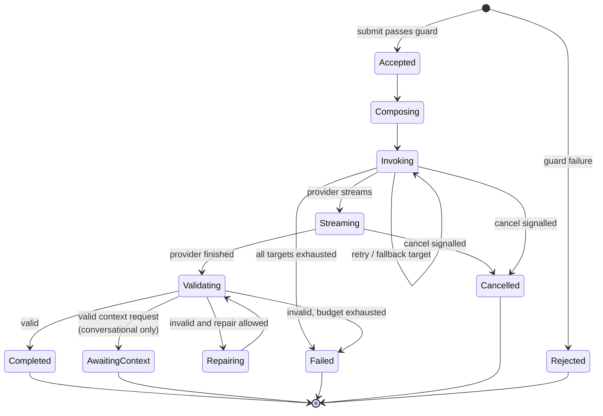


`Completed`, `Failed`, `Cancelled`, `Rejected`, and `AwaitingContext` are terminal and immutable. Every
state transition is journaled with a timestamp, which is what makes the support flow in
[§8.9](#89-support-audit-trace) a lookup rather than an investigation.

**What "journaled with a timestamp" means precisely.** A transition writes the new state to the
`ai_request` row's `state` column and stamps `updated_at`; a transition into a terminal state also
stamps `completed_at`. There is **no per-intermediate-state timestamp history** — no transition table
and no timeline column. The row therefore carries three milestones (`created_at` at `Accepted`,
`updated_at` at the most recent transition, `completed_at` at the terminal one), and the states
between them are recovered by reading those milestones against this graph, which is deterministic:
every path from `Accepted` to a given terminal state passes through a known sequence of states, and
the only branching that costs real time — retry and fallback in `Invoking` — is already timestamped
per attempt on `ai_attempt`. Adding a row or column per transition would multiply the platform's
dominant table's write volume by the length of the pipeline to recover ordering the graph already
gives and durations the attempt rows already give ([§7.5](#75-write-path-economics)).

The honest limit of this choice: the exact instant a request entered, say, `Validating` is not
recoverable. Should a diagnosis ever need per-stage durations, they belong in the trace spans the
telemetry emitter already produces ([§4.3.12](#4312-telemetry-emitter)), joined by trace id — not in
the journal.

`AwaitingContext` is reachable only for `conversational` capabilities (A14) and is terminal in the same
sense as the others: **that request is over**. The conversation continues as a new request with a new
idempotency key, linked by `conversation_id` ([§6.7](#67-conversational-capabilities)). Naming it a
terminal state rather than a pause is what keeps the platform free of in-flight conversation state.

### 6.4 Streaming with commit-time validation

The mechanics of amendment A2, stated precisely because this is the subtlest part of the design:


| Mode                | During stream                                                                                                                                                              | At completion                                                                                             | Client rule                                                                                                         |
| ------------------- | -------------------------------------------------------------------------------------------------------------------------------------------------------------------------- | --------------------------------------------------------------------------------------------------------- | ------------------------------------------------------------------------------------------------------------------- |
| `prose`             | `text_delta` events; cheap guards applied incrementally (length ceiling, stop-sequence, system-prompt-leak detection) — a violation aborts the stream and fails terminally | Full guard set on the assembled text                                                                      | Display live; enable "save" only on `completed`                                                                     |
| `structured`        | `partial_structured` events derived from incremental parsing, every one flagged provisional                                                                                | Complete document validated against schema and business rules; `completed` carries the validated document | Render provisional as a visibly-draft skeleton with no commit control; replace wholesale with the validated payload |
| `structured_atomic` | Progress/heartbeat only                                                                                                                                                    | Same as `structured`                                                                                      | Show progress indicator only                                                                                        |


Two invariants the implementation must not weaken:

1. **The validated terminal payload is authoritative and self-contained.** Clients never assemble the
  final result from chunks. Chunks are for perceived responsiveness; the terminal event is the
   answer. This also means a client that ignores streaming entirely is fully correct — which is what
   makes `structured_atomic` free rather than a special case.
2. **Provisional content is never persisted, never exported, and never entered into a clinical record.**
  Enforced structurally on the client (no commit affordance until terminal success) and recorded in
   the journal (the accepted payload is always the validated one).


### 6.5 Cancellation

Cancellation is **connection-scoped**, which makes it the simplest mechanism in the platform: there is
no cancel endpoint, no request registry, and no state to reconcile.


| Situation                                            | Mechanism                                                                                                |
| ---------------------------------------------------- | -------------------------------------------------------------------------------------------------------- |
| User presses Cancel on the screen showing the stream | The client closes the stream; the Worker observes the disconnect and aborts the in-flight provider fetch |
| The client crashes, is closed, or loses the network  | Identical path — the platform does not distinguish these from a deliberate cancel, and does not need to  |
| User wants to cancel from a different window         | **Not supported.** See [§9.7](#97-connection-scoped-cancellation-versus-a-session-durable-object)        |


Semantics, chosen to be honest rather than flattering:

- Cancel is a **terminal state**, not a pause. There is no resume; resubmission is a new request,
linked to the cancelled one in the journal for analysis.
- Tokens already generated are already billed by the provider, so cancellation **credits partial usage**
against quota rather than pretending nothing happened. Free cancellation would be a quota-evasion
vector.
- A generation interrupted by a network drop is lost, and the user retries. This is the accepted cost
of holding no per-request state ([§5.5](#55-api-surface-and-streaming-protocol), rule 5).
- The journal row survives regardless, so a cancelled request is still fully explainable.


### 6.6 Idempotency, retry, and duplicate suppression


| Layer                | Rule                                                                                                                                                                                                           |
| -------------------- | -------------------------------------------------------------------------------------------------------------------------------------------------------------------------------------------------------------- |
| Client submission    | Every submission carries a client-generated idempotency key, stable across transport retries of the *same* user action (A7)                                                                                    |
| Platform             | The key maps to at most one request per installation; a repeat returns the existing request's state instead of starting a second inference                                                                     |
| Provider attempts    | Retries are platform-internal, bounded, jittered, and only for adapter-classified retryable failures; each attempt is journaled separately                                                                     |
| User-initiated retry | A distinct new request with a new idempotency key, linked to the previous one — because the user is asking for a *different* attempt, and conflating the two would corrupt both quota accounting and eval data |


The distinction between an *internal* retry (same request, new attempt) and a *user* retry (new
request) is worth insisting on: it is the difference between an auditable, cost-attributable journal
and one where a support engineer cannot tell how many inferences a clinic actually paid for.

### 6.7 Conversational capabilities

Everything in this subsection applies **only** to capabilities whose manifest declares
`interaction_mode: conversational` (A14). Button-invoked `single_shot` capabilities are unaffected by
all of it: they resolve their context from the manifest before submitting, they never negotiate, and
`context_required` remains for them exactly what [§8.4](#84-missing-context-self-healing) describes.

#### 6.7.1 The unit of work is a leg, not a conversation

A conversation is not a session the platform holds open. It is a series of independent requests, each
one a full trip through the same pipeline in [§6.1](#61-the-pipeline), tied together by two fields the
client supplies:


| Field             | Supplied by                 | Purpose                                                                               |
| ----------------- | --------------------------- | ------------------------------------------------------------------------------------- |
| `conversation_id` | Client, once per chat       | Groups the legs in the journal so support and evals can read a conversation as a unit |
| `turn_ordinal`    | Client, incremented per leg | Orders them, and makes a replayed or reordered transcript detectable                  |


Each leg carries the **transcript so far** as prior turns in the request body. The platform reads it,
uses it, journals a reference to it, and forgets it. This is what keeps every property the design
depends on: routing stays stateless, cancellation stays connection-scoped, admission and quota stay
per-request, and no store is added ([§9.18](#918-platform-held-conversation-state)).

**The transcript wire shape is closed and platform-owned**, for the same reason the context-request
schema is ([§6.7.2](#672-a-turn-ends-in-one-of-two-ways)): a capability may choose what its
assistant talks about, never how a turn is spelled. The submit surface
([§5.5](#55-api-surface-and-streaming-protocol)) carries `transcript` as a JSON array of turn
objects. Every turn declares exactly two common fields plus the one payload field its kind defines:


| Field          | Type      | Rules                                                                                                                                                                                                                                                                 |
| -------------- | --------- | --------------------------------------------------------------------------------------------------------------------------------------------------------------------------------------------------------------------------------------------------------------------- |
| `turn_ordinal` | `integer` | Required. The ordinal this turn occupied when it happened. Strictly increasing across the array, no duplicates, and every value strictly less than the leg's own `turn_ordinal`. Gaps are legal — a client may trim turns (R-22, [§6.7.3](#673-what-bounds-the-loop)) |
| `kind`         | `string`  | Required. One of the four kinds below. No other value is accepted                                                                                                                                                                                                     |


| `kind`              | Payload field | Payload type | Meaning                                                                                                                                                                                             |
| ------------------- | ------------- | ------------ | --------------------------------------------------------------------------------------------------------------------------------------------------------------------------------------------------- |
| `user`              | `text`        | `string`     | What the clinician typed. Rendered as a `user` part ([§4.3.6](#436-prompt-composer-and-prompt-registry))                                                                                            |
| `model`             | `text`        | `string`     | A prior validated prose answer. Rendered as an `assistant` part                                                                                                                                     |
| `context_requested` | `requests`    | `array`      | The platform-owned `{key, arguments}` list the assistant asked for on that turn, verbatim as the platform emitted it ([§6.7.2](#672-a-turn-ends-in-one-of-two-ways))                                |
| `context_resolved`  | `context`     | `object`     | The keys the client resolved in answer to the preceding `context_requested` turn, keyed and shaped exactly as an ordinary context payload ([§5.2](#52-context-contract)). Rendered as a `data` part |


A turn carrying no payload field, the wrong payload field for its `kind`, a payload of the wrong
type, an unknown `kind`, a missing or non-integer `turn_ordinal`, or a `turn_ordinal` that does not
respect the ordering rule is a **malformed turn** and is rejected by the context validator with
`context_invalid` ([§4.3.5](#435-context-validator), [§5.4](#54-error-taxonomy)). There is no
coercion and no silent drop of a bad turn: a transcript is accepted whole or rejected whole. Keys
inside a `context_resolved` turn are, by contrast, subject to the ordinary allowlist rule — a key
outside the manifest's permitted set is dropped rather than rejecting the request
([§4.3.5](#435-context-validator)).

These are the "declared shapes" [§4.3.5](#435-context-validator) validates against and the turns the
budget counters in [§6.7.3](#673-what-bounds-the-loop) count.

#### 6.7.2 A turn ends in one of two ways

The assistant either answers, or asks for data. Both are terminal for that leg.


| Terminal event      | Meaning                                                                          | Journal                            | Quota                                               | What the client does next                                                                                                           |
| ------------------- | -------------------------------------------------------------------------------- | ---------------------------------- | --------------------------------------------------- | ----------------------------------------------------------------------------------------------------------------------------------- |
| `completed`         | The assistant answered. Validated `prose`, exactly as any other prose capability | Leg row reaches `completed`        | Credited with actual usage                          | Render the answer; append it to the transcript                                                                                      |
| `context_requested` | The assistant needs clinic data, named as context keys with their arguments      | Leg row reaches `awaiting_context` | Credited with actual usage — the inference happened | Resolve the named keys through the Resolver, append the request and the resolved payload to the transcript, and submit the next leg |


The second row is the whole mechanism, and the property that makes it safe is that **the platform
asks; it never fetches**. The requested keys travel to the client, the client resolves them against
Supabase under the requesting user's own session and RLS, and the resolved values come back the same
way any other context payload does. A user who may not see a patient cannot have that patient
summarized by asking the assistant nicely, because the read that would produce the data is the user's
own read.

The context request itself is structured output, validated against a **platform-owned schema shared by
every conversational capability** — a list of `{key, arguments}` drawn from the manifest's permitted
set. It is not a per-capability schema, so the validator gains one fixed shape rather than one per
assistant.

#### 6.7.3 What bounds the loop

An assistant that can ask for data can ask forever, so three bounds apply. All three are computed from
the submitted request alone, which is what keeps them stateless, and all three are evaluated only
after the transcript has passed shape validation
([§6.7.1](#671-the-unit-of-work-is-a-leg-not-a-conversation),
[§4.3.5](#435-context-validator)) — a transcript that is malformed or out of order fails with
`context_invalid` and is never counted:


| Bound                           | Where declared | Enforced by                                                                                                                                                      | Breach                          |
| ------------------------------- | -------------- | ---------------------------------------------------------------------------------------------------------------------------------------------------------------- | ------------------------------- |
| **Max context rounds per turn** | Manifest       | Counting consecutive `context_requested` turns at the tail of the supplied transcript                                                                            | `conversation_budget_exhausted` |
| **Max history turns**           | Manifest       | Counting turns in the supplied transcript                                                                                                                        | `conversation_budget_exhausted` |
| **Per-turn cost ceiling**       | Manifest       | The existing cost pre-flight ([§6.1](#61-the-pipeline) stage 7), which estimates input tokens from the whole request — and the transcript is part of the request | `request_too_large`             |


The third is worth pausing on because it required no change at all. Growth in a conversation shows up
as growth in the input, the pre-flight already prices the input, and so a conversation that grows too
long is rejected by the mechanism that already exists for a pasted document (A6). Total conversation
spend is therefore bounded by max turns × the per-turn ceiling, without a running total and without the
pre-flight reservations rejected in [§9.14](#914-mechanisms-deliberately-simplified).

**The transcript is client-supplied, and therefore untrusted** — the same status as any context payload
([§3.3](#33-trust-and-network-topology), assertion 4). A malicious client can trim the context-request
turns out of a transcript to reset the round counter. That is accepted rather than solved, for the same
reason stale context is accepted: the containment is elsewhere and it is sufficient. Every leg is
independently authenticated, rate-limited, cost-checked, and admitted against the installation's own
budget, so the worst achievable outcome is a clinic spending its own quota faster. Making the platform
authoritative over transcript integrity would mean holding conversation state, which is the thing this
design is avoiding.

#### 6.7.4 What conversational mode does not change

Stated explicitly, because the value of confining A14 to one manifest flag is precisely that this list
is long:

- **No new pipeline stage.** A leg traverses [§6.1](#61-the-pipeline) unchanged. Stage 13 gains a
second valid output shape and stage 14 a fourth terminal event kind; both are parameterized by the
manifest, exactly as capabilities parameterize every other stage.
- **No new store and no new stateful component.** The Quota Durable Object remains the only one, and it
remains per-installation ([§4.4](#44-storage-ownership)).
- **No change to cancellation.** A leg is one connection; closing it cancels that leg
([§6.5](#65-cancellation)). The conversation survives on the client, which still holds the transcript.
- **No change to idempotency.** Each leg carries its own key. A transport retry of a leg returns that
leg; it never re-runs the turn ([§6.6](#66-idempotency-retry-and-duplicate-suppression)).
- **No change to the advisory rule.** Anything a clinician moves from a chat answer into a record goes
through the same human acceptance path (A5).
- **No general tool use.** The only invocable operation is context-key resolution, restricted to the
manifest's permitted set and executed by the client
([§12.5](#125-explicitly-not-to-be-built-yet)).

---


## 7. Data Flow and Data Model


### 7.1 Data ownership boundaries


| Data                                                | Owner                                                      | May the other side hold it?                                                                                                                                                                                                                 |
| --------------------------------------------------- | ---------------------------------------------------------- | ------------------------------------------------------------------------------------------------------------------------------------------------------------------------------------------------------------------------------------------- |
| Patients, visits, invoices, staff, RBAC             | Supabase                                                   | The AI platform holds **transient** copies inside request payloads only, subject to retention class (A10)                                                                                                                                   |
| Prompts, manifests, routing policy, provider config | AI platform                                                | The clinic app never receives them                                                                                                                                                                                                          |
| AI request journal, usage ledger, entitlement       | AI platform (D1)                                           | Supabase holds only the request reference on accepted output — `public.ai_accepted_output.ai_request_reference` (`text`, [§8.9](#89-support-audit-trace) format), never a request row ([§4.2.2](#422-the-ai-acceptance-recording-contract)) |
| Provider credentials                                | AI platform secret store                                   | Never leaves it; never journaled                                                                                                                                                                                                            |
| Installation signing key                            | Clinic PostgreSQL (private) / AI platform (public)         | The private key never leaves the clinic                                                                                                                                                                                                     |
| Human acceptance of AI output                       | Supabase (`audit_log` + domain row + `ai_accepted_output`) | The platform journals that a terminal result was delivered, not that it was accepted                                                                                                                                                        |
| An open conversation's transcript                   | The client, for the life of the chat                       | The platform holds it only for the duration of each leg, and afterwards only inside that leg's retained payload envelope ([§6.7](#67-conversational-capabilities))                                                                          |


The last row is the deliberate seam in the audit story: the platform can prove *what it returned*, and
the clinic database can prove *what a human did with it*. Joining them requires the request reference,
which is stored on both sides. Neither side needs the other's schema for its own audit trail to be
complete. Concretely, on the clinic side the reference lands on
`public.ai_accepted_output` alongside the `(table_name, record_id)` of the domain row and a
foreign key to the `audit_log` entry written in the same transaction, so a clinical field resolves to
a reference and a reference resolves to a clinical field without either query leaving Postgres
([§4.2.2](#422-the-ai-acceptance-recording-contract)).

### 7.2 Data flow

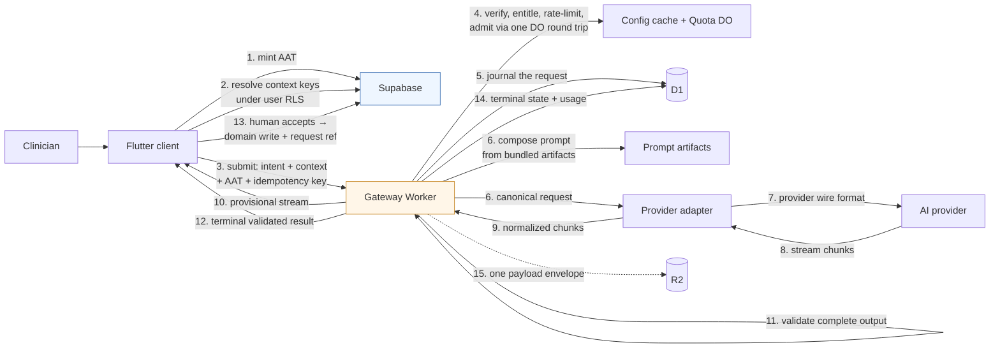


Steps 1–3 are the client's whole responsibility; steps 4–12 are the platform's; step 13 is the
clinical safety gate (A5). Steps 5 and 14 are on the request path so the record always exists; only
step 15, which carries diagnostic detail, runs afterwards. Note that **no step points from the
gateway to Supabase** — the property established in
[§1.3.1](#131-the-ai-platform-cannot-reach-the-clinics-database) and preserved throughout.

### 7.3 D1 logical model

Logical entities and their purpose. Field lists indicate *shape and cardinality*; they are not a
schema definition.


| Entity             | Purpose                                                                                                                          | Key fields                                                                                                                                                                                                                                                                                                                                                                                                                                                                                         | Growth                   | Retention                               |
| ------------------ | -------------------------------------------------------------------------------------------------------------------------------- | -------------------------------------------------------------------------------------------------------------------------------------------------------------------------------------------------------------------------------------------------------------------------------------------------------------------------------------------------------------------------------------------------------------------------------------------------------------------------------------------------- | ------------------------ | --------------------------------------- |
| `installation`     | An enrolled clinic deployment                                                                                                    | installation id, org id, display name, status, region, enrolled_at                                                                                                                                                                                                                                                                                                                                                                                                                                 | Tens–thousands of rows   | Life of customer                        |
| `installation_key` | Verification material and rotation history                                                                                       | installation id, public key, algorithm, valid_from, valid_until, revoked_at                                                                                                                                                                                                                                                                                                                                                                                                                        | Few per installation     | History kept for audit                  |
| `entitlement`      | What this installation may use and how much                                                                                      | installation id, plan, period bounds, request quota, token/cost budget, monthly credit budget (A15), allowed capability set, soft threshold, `max_cost_class`, status                                                                                                                                                                                                                                                                                                                                | One current + history    | History kept for billing disputes       |
| `plan`             | The commercial catalogue: what a named plan includes (A15)                                                                       | plan name, monthly credit budget, request-count guard, `max_cost_class`, soft threshold, capability set, status                                                                                                                                                                                                                                                                                                                                                                                  | A handful of rows        | Full history                            |
| `credit_price`     | The versioned credit price list (A15)                                                                                            | version, price per credit, currency, active_from, activated_by                                                                                                                                                                                                                                                                                                                                                                                                                                   | A handful of rows ever   | Full history                            |
| `invoice`          | One issued invoice per installation per period (A15)                                                                             | installation, period, credits consumed, credit price list version, total, status, issued_at                                                                                                                                                                                                                                                                                                                                                                                                      | One per installation per month | Long — billing evidence            |
| `capability_grant` | Which capability versions a plan or installation may use, **and** the current lifecycle of a capability version (scope `global`) | scope (`global` / `plan` / `installation`), capability id, version, granted/revoked, lifecycle state (`active` / `deprecated` / `retired`), successor id, deprecated_at, retire_after, changed_at, changed_by                                                                                                                                                                                                                                                                                      | Low                      | Full history                            |
| `token_contract`   | The platform-global set of accepted AAT `ver` values                                                                             | accepted `ver` value, added_at, retired_at, changed_by — one row per `ver`; the accepted set is the rows with no `retired_at`                                                                                                                                                                                                                                                                                                                                                                      | A handful of rows ever   | Full history                            |
| `kill_switch`      | Active kill-switch state for the four control-plane scopes (A8)                                                                  | scope (`global` / `capability` / `installation` / `provider`), target (literal `"global"` at global scope; otherwise the capability / installation / provider id), active, changed_at, changed_by — one current row per (`scope`, `target`); config-cache kind `kill_switches` with key `global` or `{scope}:{target}`                                                                                                                                                                              | Low                      | Full history                            |
| `routing_policy`   | Versioned target chains and selection rules                                                                                      | policy id, version, content pointer (R2 key for the immutable policy document — schema in [§4.3.7](#437-provider-router-and-policy-engine)), active_from, activated_by                                                                                                                                                                                                                                                                                                                             | Low                      | Full history                            |
| `ai_request`       | One row per request: the journal spine                                                                                           | request id, **request reference**, installation, actor, branch, capability id+version, prompt artifact hash, idempotency key, state, the three milestone timestamps `created_at` / `updated_at` / `completed_at` ([§6.3](#63-request-state-machine)), terminal error code, trace id, payload pointers, `routing_tier` (`standard` / `degraded`), `routing_decision` ([§4.3.7](#437-provider-router-and-policy-engine)), plus nullable `conversation_id` and `turn_ordinal` for conversational legs | **The dominant table**   | Retention class (A10)                   |
| `ai_attempt`       | One row per provider attempt                                                                                                     | request id, attempt no., provider, model, `selection_reason` ([§4.3.7](#437-provider-router-and-policy-engine)), outcome, latency, tokens in/out, cost, provider request id, error code                                                                                                                                                                                                                                                                                                            | 1–3 per request          | With the request                        |
| `usage_event`      | Append-only quota/billing ledger                                                                                                 | installation, period, request id, quota weight, tokens, cost, recorded_at                                                                                                                                                                                                                                                                                                                                                                                                                          | ~1 per request           | Longer than requests — billing evidence |
| `usage_rollup`     | Pre-aggregated per installation/period/capability                                                                                | dimensions, counts, tokens, cost                                                                                                                                                                                                                                                                                                                                                                                                                                                                   | Small                    | Long                                    |
| `platform_counter` | Bucketed counts for events that are never journaled — chiefly guard rejections                                                   | dimension set, time bucket, count                                                                                                                                                                                                                                                                                                                                                                                                                                                                  | Bounded, low cardinality | Months                                  |
| `control_audit`    | Control-plane mutations                                                                                                          | operator, action, target, before/after pointer, at                                                                                                                                                                                                                                                                                                                                                                                                                                                 | Low                      | Long                                    |


`capability_grant` **is the capability-availability row, and lifecycle is one of the things it makes
available.** It is the durable target for every [§4.5](#45-control-plane) "Capability availability"
mutation — grant, gate, deprecate, retire. A grant or gate is written at `plan` or `installation`
scope; a deprecation or retirement is written at `global` scope, because a version's lifecycle is a
property of the version and not of one tenant. The lifecycle fields are the overlay described in
[§5.1](#51-capability-manifest): absent, the manifest's published `lifecycleState` and `successorId`
stand; present, they win. `deprecated_at` starts the overlap window and `retire_after` is when
retirement may be enforced (A12, [§15](#15-open-decisions) OD-9); the transition to `retired` is
itself an operator mutation, not a clock the gateway trips on its own — nothing in the request path
writes this row. Rows are append-only history like the rest of the ledger set, so "who deprecated
what, when" is answerable without a second store, and each mutation additionally writes
`control_audit` with the operator identity. The resolver and discovery read the current row through
the config cache alongside grants and kill switches ([§6.1](#61-the-pipeline) stage 5), so a cold
isolate reconstructs lifecycle from D1 exactly as it reconstructs every other volatile flag. **No
lifecycle-overlay entity of its own is added**, and no manifest is republished to change a lifecycle
state.

`token_contract` **is the accepted-**`ver` **set, and D1 is its only authority.** It is global, not
per-installation, because `ver` versions the AAT claim contract itself
([§5.6](#56-token-contract)). Begin-rotation inserts a row for the new `ver`; retire stamps
`retired_at` on the old one; both are [§4.5](#45-control-plane) operator mutations that also write
`control_audit`, and the request path never writes here. The identity stage
([§4.3.2](#432-identity-and-tenant-resolution)) reads the live set through the config cache, so a
cold isolate reconstructs it from D1 like every other volatile flag, and a rotation takes effect
within one cache TTL without a deploy. Rows are append-only history, so "which contract versions were
accepted when, and who changed that" is answerable without a second store. There is deliberately no
`retire_after` column here — unlike `capability_grant`, retirement is not scheduled
([§5.7](#57-versioning-and-compatibility-rules)).

`kill_switch` **is the durable kill-switch row, and D1 is its only authority.** It is the target for
every [§4.5](#45-control-plane) kill-switch mutation — global, per capability, per installation, per
provider (A8). Activate and lift are control-plane operator writes that also journal `control_audit`;
the request path never writes here. The config-cache kind is `kill_switches` (A5): a miss loads the
current row for that (`scope`, `target`) from D1, and callers treat a miss or `active: false` as
inactive — only an explicit `active: true` trips the switch. Cache keys are `global` at global scope
and `{scope}:{target}` otherwise (for example `capability:<id>`, `installation:<id>`,
`provider:<id>`), with the cached value carrying `{ active, scope, target }`. Entitlement, capability
resolution, and the router read through the config cache
([§6.1](#61-the-pipeline) stages 3–5, [§4.3.7](#437-provider-router-and-policy-engine)), so a cold
isolate reconstructs kill-switch state from D1 exactly as it reconstructs grants and the token
contract.

**Entitlement status** takes `pending`, `active`, or `suspended`. A row is created `pending` by
enroll with no economics set and is moved to `active` by entitlement assignment
([§4.5](#45-control-plane), [§8.1](#81-clinic-enrollment-and-trust-bootstrap)). Every column stays
non-null throughout — `pending` is expressed as zeroed budgets and an empty capability set, not as
absent values — so the guard reads one shape regardless of which state a tenant is in.

Sizing check against the 10 GB per-database ceiling: at roughly 0.5–1 KB per metadata row,
`ai_request` + `ai_attempt` + `usage_event` consume on the order of a few gigabytes per ten million
requests — comfortable, **but only because payloads live in R2**. Storing prompts and responses inline
would exhaust the database at roughly one to two million requests and would collide with the 2 MB row
limit on long completions. This is the most consequential storage decision in the design.

If volume ever outgrows one database, the escape hatch is D1's intended model — a database per region
or per installation cohort, with the installation registry as the routing key. A deliberate late
option, not an early complication.

**Conversations add two nullable columns and no table** (A14). A chat turn is an ordinary request row;
`conversation_id` and `turn_ordinal` group and order the legs so that support can read a whole
conversation with one indexed query, and so that evals can score a conversation rather than a single
exchange. There is no `conversation` entity, because there is nothing about a conversation the
platform owns: its transcript lives on the client during the chat and in the per-leg R2 envelopes
afterwards. The cost worth noting honestly is that the transcript is re-journaled on every leg, so an
*n*-turn conversation stores roughly *n²/2* turns' worth of text across its envelopes. At the manifest's
turn limits this is kilobytes, and the `diagnostic` retention class ([§7.7](#77-retention-and-recovery))
is the shortest-lived of all — but a capability allowing long conversations should carry a
correspondingly short diagnostic window.

### 7.4 R2 payload layout

**One request produces exactly one R2 object.** The key is `request/{id}/envelope`, derived from the
request id, and the object is a single document with four sections:


| Envelope section | Contents                                         | Answers                                                                    |
| ---------------- | ------------------------------------------------ | -------------------------------------------------------------------------- |
| `context`        | The validated context payload as supplied        | "What inputs did the model actually see?"                                  |
| `prompt`         | The fully composed provider-bound prompt         | "What did we actually send?" — the first question in every prompt incident |
| `attempts[]`     | Raw provider response or error body, per attempt | Provider-side diagnostics and dispute evidence                             |
| `result`         | The validated terminal payload                   | "What was the user given?"                                                 |


#### 7.4.1 Why one object and not four

The natural decomposition is one object per artifact, and it is the wrong one. R2 meters **Class A**
operations (writes and lists) at roughly an order of magnitude more than **Class B** operations
(reads), with a free allowance of one million Class A per month against ten million Class B. Four
objects per request therefore consume the platform's scarcest metered resource four times faster
while producing no benefit:

- **Nothing is written earlier by splitting.** All four artifacts are assembled in the same
post-response continuation ([§6.1](#61-the-pipeline) stage 16), after the client already has its
answer, so there is no latency to reclaim.
- **Nothing expires separately by splitting.** Retention class is a per-capability property
([§5.1](#51-capability-manifest)), not a per-artifact one, so all four sections of a request share a
lifecycle by construction and a single object lifecycle rule expires them together.
- **Support reads get cheaper.** Reconstructing a request is one `GetObject` rather than four, which
also removes the "some parts expired, some did not" state from the support path.

The trade accepted is that a support lookup interested in only the prompt still transfers the whole
envelope. Envelopes are kilobytes and R2 egress is free, so this costs nothing that matters.

Keys are derived from the request id, so a support lookup is a pointer dereference rather than a
search, and lifecycle rules expire envelopes by retention class without touching D1.

### 7.5 Write-path economics

Stated explicitly because this is where a reasonable-looking implementation becomes slow and
expensive:


| Anti-pattern                                 | Consequence                                                                                                  | Design rule                                                                             |
| -------------------------------------------- | ------------------------------------------------------------------------------------------------------------ | --------------------------------------------------------------------------------------- |
| A D1 row per stream chunk                    | Millions of writes per thousand requests; write cost and single-thread contention dominate                   | Chunks are never individually persisted — only aggregates                               |
| Journaling rejected requests                 | Puts a D1 write in the cheap-rejection path, so abuse becomes expensive to refuse                            | Journal at stage 9, after the guard; count rejections in `platform_counter`             |
| Writing per-attempt detail before responding | Adds avoidable latency for data only needed during diagnosis                                                 | One row on the request path; detail afterwards                                          |
| Storing text in D1                           | 2 MB row ceiling, 10 GB database ceiling, expensive reads                                                    | Payloads to R2, pointers in D1                                                          |
| One R2 object per artifact                   | Multiplies Class A operations — the scarcest metered resource — with no offsetting benefit                   | One payload envelope per request ([§7.4.1](#741-why-one-object-and-not-four))           |
| A metric write per event                     | A second high-volume write stream duplicating data the journal already holds                                 | Metrics are queried from the journal; only never-journaled events get bucketed counters |
| Quota counters in D1                         | Read-modify-write races between concurrent requests                                                          | Per-installation Durable Object                                                         |
| A separate store for replay and idempotency  | A high-churn table plus a pruning cron, and extra round trips, for facts the Quota DO is already serializing | Fold both into the admission round trip ([§6.1](#61-the-pipeline) stage 8)              |
| Multiple round trips to the same DO          | Each one bills a Durable Object request against a 1M monthly allowance                                       | Ask every installation-scoped question in a single admission call                       |


### 7.6 Read paths


| Read path                           | Frequency            | Source                                                                  | Constraint                                                                         |
| ----------------------------------- | -------------------- | ----------------------------------------------------------------------- | ---------------------------------------------------------------------------------- |
| Verify installation and entitlement | Every request        | Config cache; D1 on a cold isolate                                      | Must not be a D1 read in the common case                                           |
| Resolve capability manifest         | Every request        | Bundled artifacts; config cache for grants and kill switches            | No D1 on the hot path                                                              |
| Support lookup by request reference | Rare                 | D1, indexed on the reference, then one R2 envelope                      | Single indexed lookup — the reference exists to make this trivial                  |
| Usage summary for a clinic          | Occasional           | Quota DO for live counters; `usage_rollup` for history                  | Live and historical answers deliberately come from different places                |
| Analytics and dashboards            | Continuous, internal | `ai_request` / `ai_attempt` / `usage_rollup` / `platform_counter` in D1 | Read-only, off the request path; acceptable because journal volume is clinic-scale |
| Billing period close                | Monthly              | `usage_event` → `usage_rollup` via cron                                 | The ledger is the evidence; rollups are the convenience                            |


### 7.7 Retention and recovery


| Class        | Applies to                                                         | Default horizon  | Reason                                                                                         |
| ------------ | ------------------------------------------------------------------ | ---------------- | ---------------------------------------------------------------------------------------------- |
| `diagnostic` | The R2 payload envelope (prompt, context, raw responses, result)   | Days to weeks    | The window in which anyone actually debugs a request; also the largest and most sensitive data |
| `journal`    | `ai_request`, `ai_attempt` metadata                                | Months           | Supports the audit scenario without retaining clinical text                                    |
| `ledger`     | `usage_event`, `usage_rollup`, `control_audit`, `capability_grant` | Years            | Billing and governance evidence; small                                                         |
| `ephemeral`  | `jti` replay set and idempotency records inside the Quota DO       | Minutes to hours | Operational only; expired in place by the object, with no table to prune                       |


Retention class is a **per-capability** manifest field ([§5.1](#51-capability-manifest)), so a
capability handling sensitive free text can carry a shorter diagnostic window than one handling coded
data. Retention becomes a per-feature decision instead of a platform-wide compromise. Recovery relies
on D1 Time Travel (30-day point-in-time restore) plus R2 durability — no bespoke backup machinery is
warranted — and an installation deletion request is executable as "purge by installation id" in both
stores.

---


## 8. Sequence Diagrams

Shared participants: `Client` (Flutter, AI Client SDK + Context Resolver), `SB` (Supabase/PostgreSQL),
`GW` (AI Gateway Worker), `QDO` (Quota Durable Object — the only stateful side-car),
`PRV` (AI provider), `D1`/`R2` (platform stores), `OPS` (operator).

### 8.1 Clinic enrollment and trust bootstrap

One-time, per clinic installation. Runs once per deployment, not per user.

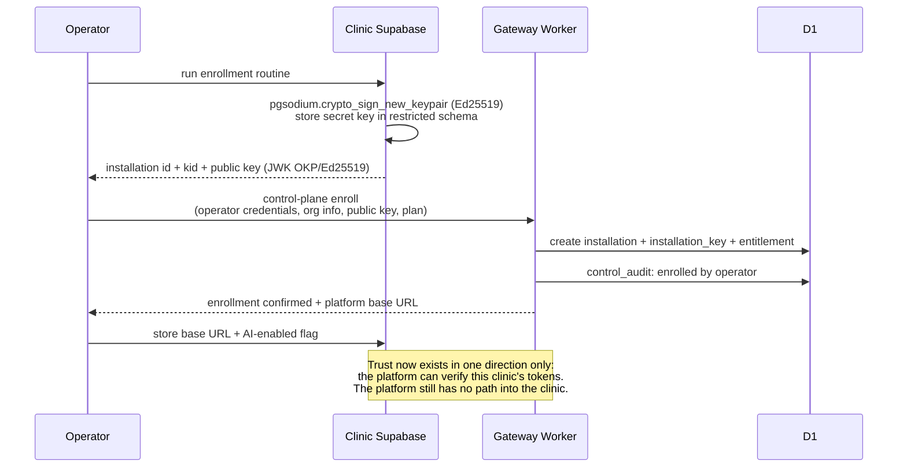


The keypair never leaves the clinic in whole: `crypto_sign_new_keypair()` returns both halves inside
the database, the 64-byte secret half is written to the restricted AI schema and never selected again
except by the issuer, and only the 32-byte public half travels to the operator
([§4.2.1](#421-the-clinic-side-signing-mechanism)). Rotation repeats these three steps and adds a
`kid`; the platform accepts both keys during the overlap, so no clinic is offline for a rotation.

Why enrollment is operator-driven rather than self-service: an installation is a **billing and trust
boundary**. Allowing a client to enroll itself would let anyone with a copy of the desktop app create
a tenant, and would make the platform's entitlement record meaningless.

**What enroll writes into the entitlement row.** Enroll creates the entitlement row but does not set
its economics. The row is created in status `pending` with the plan name from the enroll payload
recorded, a zero request quota, a zero token and cost budget, an empty allowed-capability set, and a
soft threshold of zero (never crossed, because the budget it is a fraction of is zero). The period
bounds are the enrollment instant for both start and end — a closed, empty period, not an open one —
so that no period is silently in force before one has been assigned. The row is therefore complete
and non-null from the moment it exists, and it grants nothing.

The economics are filled by the **Entitlement management** mutation
([§4.5](#45-control-plane)), which assigns the plan's quota, budget, allowed capabilities, soft
threshold, and period bounds and moves the row to status `active`. Enrollment and entitlement are
deliberately two mutations rather than one: enroll establishes *who this tenant is and how to verify
it*, entitlement assignment establishes *what it may spend*. Folding the second into the first would
require enroll to carry a plan catalogue — a pricing artifact the platform does not otherwise model
— and would make every plan change a lifecycle concern.

The consequence a later slice binds to: an installation is enrolled and verifiable but entitled to
nothing until entitlement assignment runs. The guard's entitlement stage
([§4.3.3](#433-entitlement-quota-and-rate-control)) reads a `pending` snapshot as "no capability
allowed" and rejects with the ordinary quota-exhaustion path, so a not-yet-entitled installation
behaves exactly like one that has spent its budget: the AI affordance is unavailable with a stated
reason and no clinical workflow is blocked (constitution principle V, [§8.8](#88-quota-and-rate-limit-rejection)).
This is the reason `pending` is a status value and not an absent row — an absent row would be
indistinguishable from a lookup failure at the guard.

### 8.2 Streaming prose request — happy path

The most common shape: a clinician asks for a drafted paragraph.

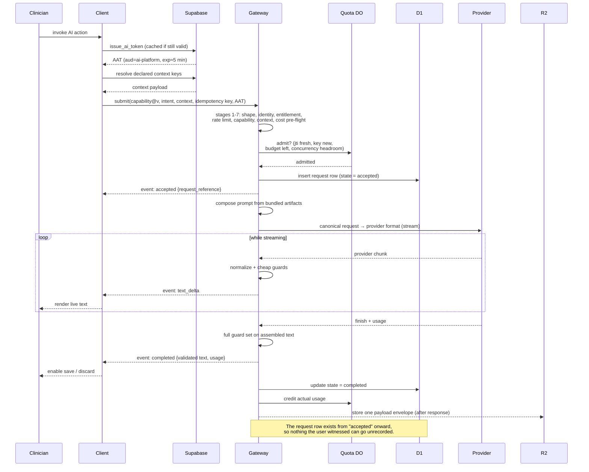


### 8.3 Structured JSON request with context enrichment

The important difference from 8.2: the client must fetch several context keys, and nothing is
displayed as final until the validated envelope arrives.

```mermaid
sequenceDiagram
    participant C as Client
    participant SB as Supabase
    participant GW as Gateway
    participant PRV as Provider

    C->>C: read cached manifest for capability@v<br/>context keys: patient.demographics@v1,<br/>visit.vitals@v1, medication.active_list@v1
    par resolve keys in parallel
        C->>SB: RPC for demographics
        C->>SB: RPC for vitals
        C->>SB: RPC for active medications
    end
    SB-->>C: three payloads
    C->>C: assemble context payload
    C->>GW: submit(structured capability, intent, context, AAT)

    GW->>GW: validate context against Context Contract<br/>(required present, shapes conform, branch consistent)
    GW->>GW: drop any undeclared keys
    GW->>GW: compose prompt; derive JSON format directive<br/>from the capability's output schema
    GW->>PRV: request with structured-output mode enabled
    loop while streaming
        PRV-->>GW: chunk
        GW-->>C: event: partial_structured {provisional: true}
        C-->>C: render draft skeleton, no commit control
    end
    PRV-->>GW: complete document
    GW->>GW: schema validation
    GW->>GW: business rules: enums, ranges,<br/>referential sanity vs supplied context
    GW-->>C: event: completed {validated document}
    C-->>C: replace draft wholesale; enable human accept
    Note over C,SB: Only after explicit human accept:<br/>domain write + request reference (A5)
```


### 8.4 Missing-context self-healing

`single_shot` **capabilities only.** A client with a stale manifest cache would otherwise fail hard.
Instead it recovers in one round trip, which is what makes desktop release cadence survivable (A12).
The superficially similar but distinct conversational flow — where the platform asks for context it
could only identify *after* an inference — is
[§8.10](#810-conversational-turn-with-context-negotiation).

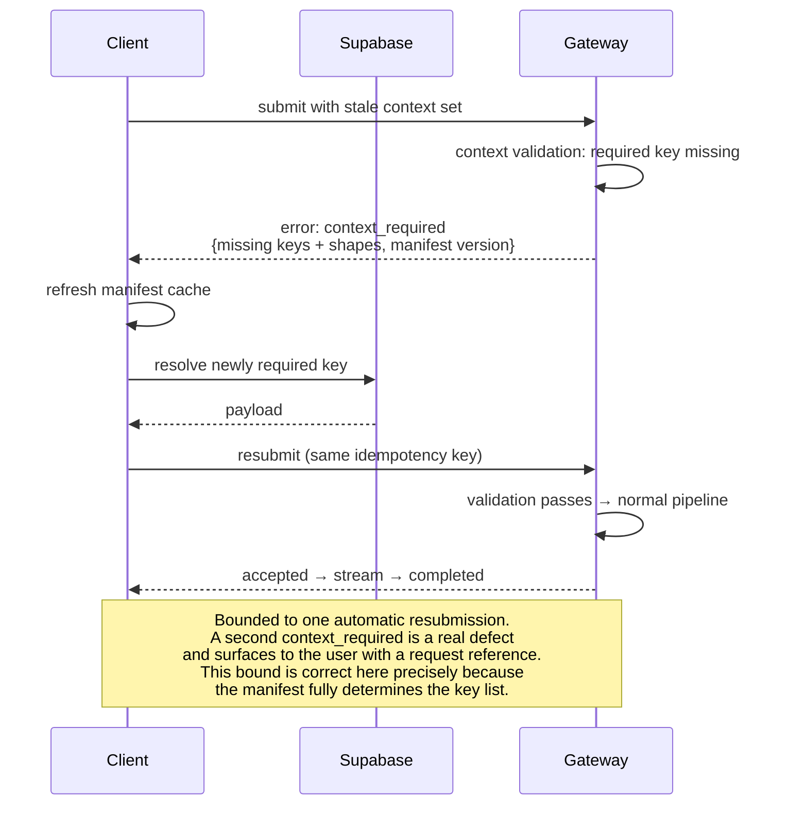


This is why `context_required` is a **typed, data-carrying rejection** rather than a generic 400. The
alternative — the platform fetching the missing data itself — is impossible here
([§1.3.1](#131-the-ai-platform-cannot-reach-the-clinics-database)) and undesirable anyway
([§9.4](#94-platform-pulls-context-from-supabase)).

### 8.5 Validation failure, bounded repair, then terminal failure

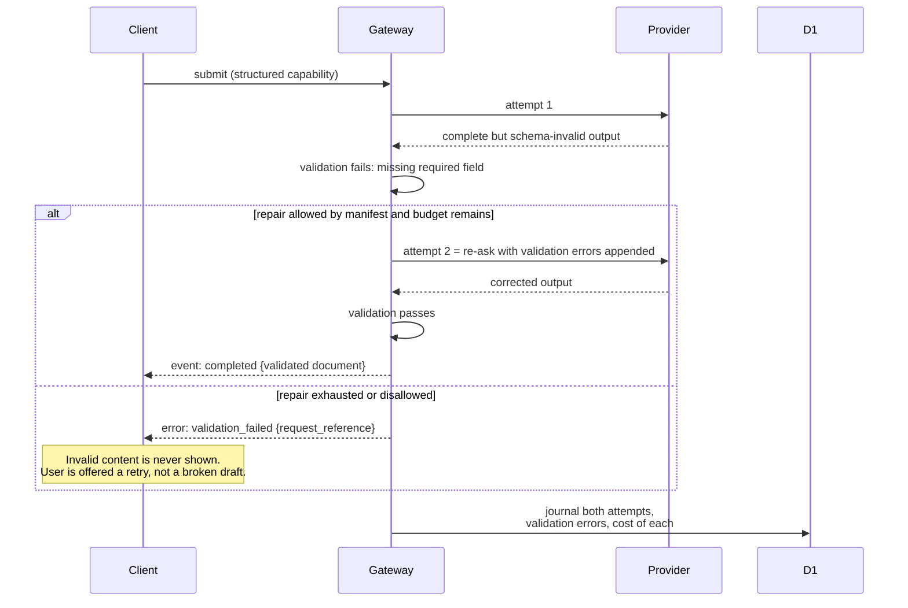


The design choice worth defending: repair is **capped, per-capability, and journaled**. An unbounded
"keep asking until it parses" loop is an unbounded bill and hides a prompt defect that the eval suite
(A9) should be catching instead. Repair rates are a monitored quality metric, not a silent workaround.

### 8.6 Provider failure, retry, and fallback

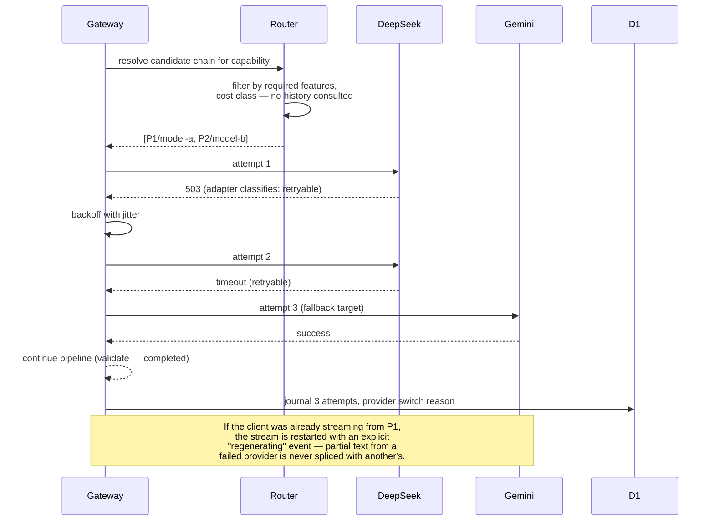


Note that the router consults no history: each request independently walks its chain. During a
provider outage every request pays the failed first attempt, which costs latency but keeps routing
fully explainable from a single journal entry — the trade discussed in
[§9.14](#914-mechanisms-deliberately-simplified).

Two rules that prevent subtle corruption:

- **Never splice output across providers.** A fallback restarts generation. Mid-stream provider
switching would produce text with a seam in the middle of a clinical sentence.
- **Fallback is only permitted to targets that satisfy the capability's declared requirements.** A
capability requiring structured output must never fall back to a model that cannot produce it —
otherwise fallback converts a provider outage into a validation failure, which is a worse outcome
reported as a different problem.


### 8.7 User-initiated cancellation

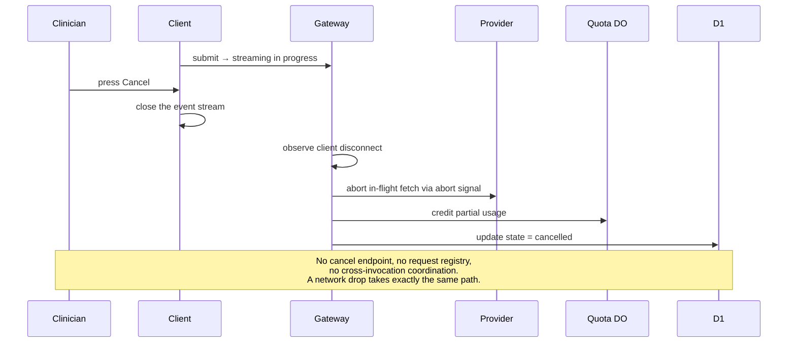


The whole mechanism is the absence of one. Because the invocation serving the stream is the same one
holding the provider connection, closing the stream is sufficient — no shared state is required, which
is why there is no per-request Durable Object in this design
([§9.7](#97-connection-scoped-cancellation-versus-a-session-durable-object)).

### 8.8 Quota and rate-limit rejection

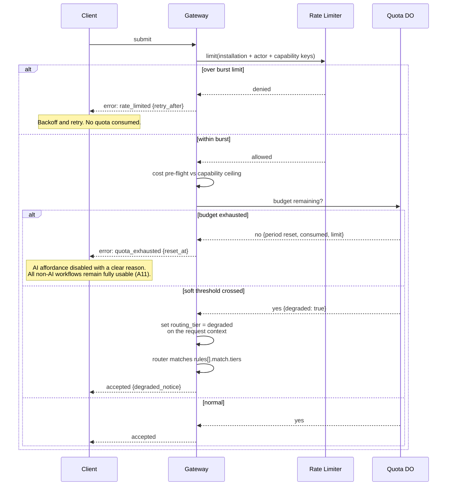


The soft-threshold branch is the constitutional requirement in action: subscription and quota limits
degrade the service, they never lock the product (constitution principle V). `routing_tier` is
gateway-set and internal — the client sends nothing to trigger it and receives only the
`degraded_notice` boolean ([§4.3.7](#437-provider-router-and-policy-engine)).

### 8.9 Support audit trace

The scenario the brief names explicitly: a user reports that a request failed.

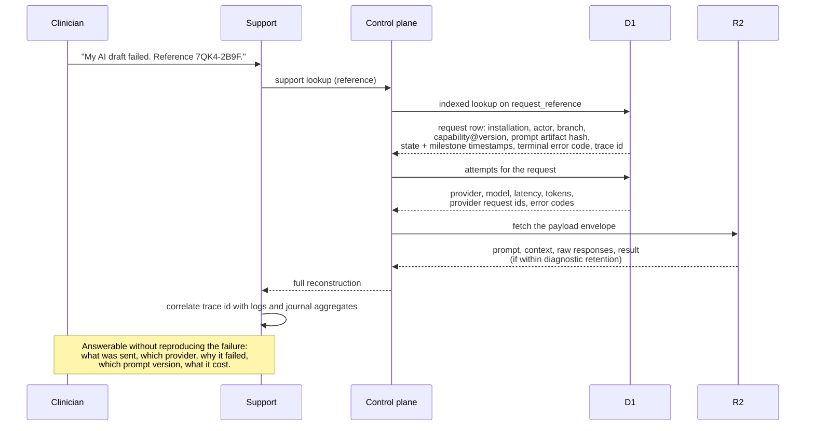


Three properties make this work, and all three are architectural rather than operational:

1. The **request reference is short and human-readable** and is emitted in the `accepted` event —
  before anything can go wrong — so it exists even for failures that occur later (A13).
  The format is fixed, because a clinician reads it aloud over the phone and a support agent types it
  back: **eight symbols from Crockford's base32 alphabet, uppercase, in two hyphen-separated groups of
  four** — `^[0-9A-HJKMNP-TV-Z]{4}-[0-9A-HJKMNP-TV-Z]{4}$`, as in `7QK4-2B9F`. The alphabet omits
  `I`, `L`, `O`, and `U`, which removes the confusions that matter when the channel is speech or
  handwriting (`I`/`1`, `O`/`0`) and the one that matters when the value is unlucky. Input is
  normalised before lookup: case-folded up, and `I`/`L` → `1`, `O` → `0`, so a user who reads the
  string the way it looks still resolves it. Eight symbols is 40 bits, drawn from a CSPRNG rather than
  derived from a counter or timestamp: enough that collisions are not a practical concern at
  clinic-scale volumes, and short enough to stay memorable. The reference is a *support handle*, not a
  key — the request's identity is its ULID, and uniqueness is enforced by the unique index on
  `request_reference` in D1, with the generator retrying on the (vanishingly rare) conflict.
2. The **prompt artifact hash** is journaled, so a failure can be attributed to a specific prompt
  version even after several rollouts.
3. The **trace id is propagated from the client**, so logs, metrics, and the journal join without a
  correlation heuristic.


### 8.10 Conversational turn with context negotiation

The chat surface (A14). A clinician types a free-text question that the client cannot interpret and
does not try to. Contrast this with [§8.4](#84-missing-context-self-healing), which looks superficially
similar and is a different mechanism: there the platform rejects *before* any inference because the
client's cache was stale; here the platform answers *after* an inference, because only the model could
know what was needed.

```mermaid
sequenceDiagram
    participant U as Clinician
    participant C as Client
    participant SB as Supabase
    participant GW as Gateway
    participant PRV as Provider

    U->>C: types "what did we prescribe Ahmed last visit?"
    C->>C: no interpretation — the chat window<br/>is capability clinic.assistant@v1
    C->>GW: leg 1: submit(assistant@v1, intent = the message,<br/>conversation_id, turn 1, empty context, AAT)

    GW->>GW: guard, journal, compose from transcript
    GW->>PRV: canonical request (context-request schema offered)
    PRV-->>GW: structured: need patient.demographics@v1,<br/>medication.active_list@v1 for patient "Ahmed"
    GW->>GW: validate against the permitted key set<br/>drop anything not permitted
    GW-->>C: terminal: context_requested {keys + arguments}
    GW->>GW: state = awaiting_context; credit actual usage

    C->>SB: resolve the named keys (user's own session + RLS)
    SB-->>C: payloads — or nothing, if the user may not see this patient
    C->>C: append request + resolved payload to transcript

    C->>GW: leg 2: submit(same conversation_id, turn 2,<br/>transcript, context, new idempotency key)
    GW->>GW: guard: count context rounds in the transcript<br/>against the manifest's limit
    GW->>PRV: canonical request with rendered context
    loop while streaming
        PRV-->>GW: chunk
        GW-->>C: text_delta
    end
    GW-->>C: terminal: completed {validated prose}
    C-->>U: render the answer

    Note over C,GW: Two journal rows, one conversation_id.<br/>The platform held no state between them.
```


Three properties of this flow carry the design's weight:

1. **The client never interprets anything.** It forwards a message, resolves keys it is told to

resolve, and appends to a transcript. Its ignorance of AI is intact.
2. **Authorization is not re-implemented.** The assistant's reach is the intersection of the manifest's
permitted key set and what the *requesting user* can read through RLS. The platform never gains a way
to see data the user could not have opened in the UI themselves.
3. **Each leg is independently accountable.** Two rows, two admissions, two usage credits. A support
engineer reading the conversation later sees exactly what was asked, what was fetched, and what each
turn cost — the same audit story as any other request, grouped.

---


## 9. Alternatives Considered

Each alternative is stated as its strongest version, then rejected on specific grounds. Several are
rejected *for now* rather than forever, and those are marked as such.

### 9.1 Client calls AI providers directly

**The case for it:** simplest possible thing. No gateway, no platform database, lowest latency, no
single point of failure, and streaming works natively.

**Rejected because** it fails almost every requirement simultaneously: provider API keys would ship
inside a desktop binary (unrecoverable credential exposure — decompilation is trivial and rotation
means a client release); prompt engineering would live in the client, contradicting the explicit
constraint; there would be no place to enforce quota, rate limits, or entitlement; response validation
would be client-side and therefore optional; and there would be no auditable journal. Swapping a
provider would require a coordinated release across every clinic PC.

This alternative is listed because it is what a prototype naturally becomes, and the drift toward it —
"just this once, put the prompt in the client" — is the main long-term threat to the design.

### 9.2 Supabase Edge Functions as the AI gateway

**The case for it:** no new vendor, one auth model, native access to clinic data, and it can query
Postgres directly so context enrichment is trivial.

**Rejected because**:

- Under Tier 1/2 the Supabase instance is the *clinic's own local Docker stack*. Deploying platform
logic there means shipping prompts, provider keys, routing policy, and quota rules **onto clinic
hardware** — the credential exposure of [§9.1](#91-client-calls-ai-providers-directly) plus a
per-clinic deployment problem for every prompt change.
- Platform data would land in the clinic's PostgreSQL, violating the stated constraint that D1 owns AI
data and creating a fragmented, per-clinic audit trail with no cross-tenant view for support,
analytics, or billing.
- Cross-tenant concerns — aggregate quota, platform-wide error rates, cost attribution — are not
expressible in per-clinic isolated runtimes.
- No Edge Functions exist in the repository today (F4), so this is not the cheap reuse it appears to
be.

Worth noting: for a **cloud-only** product this option would be genuinely competitive. It is the
offline-first deployment model that eliminates it.

### 9.3 Postgres-centric AI orchestration

**The case for it:** the constitution puts authority in PostgreSQL. Triggers plus outbound HTTP
(`pg_net`) could call providers from the database, keeping everything in one place, with prompts as
table rows and responses written straight into domain tables.

**Rejected because** it inverts the dependency the constitution actually cares about. The constitution
gives Postgres authority over **domain correctness**, not over network orchestration. Concretely: no
streaming (a fundamental requirement), long-running HTTP inside database sessions, retry/fallback logic
in PL/pgSQL, provider keys in the clinic database, no cross-tenant view, and AI output landing in
clinical tables without human gating (violating A5 and constitution principle IV). It also makes
provider latency a database-connection concern, which is exactly the coupling that takes down
databases.

### 9.4 Platform pulls context from Supabase

**The case for it:** it is the textbook answer to "the platform determines what data it needs" — the
platform knows what it needs, so let it fetch it. Guarantees freshness, and the client stays trivially
thin.

**Rejected because**:

1. **It is not possible in the primary deployment tier.** The clinic database is on a private LAN with
  no inbound path (F1). This alone is decisive.
2. Even in Tier 3 it would make the AI platform a **consumer of the clinic schema**. Every clinic
  migration becomes a potential AI outage, and the two systems could no longer be released
   independently — the direct opposite of the stated design goal.
3. It requires the platform to hold **standing credentials** into clinic data, turning a platform
  compromise into a full patient-data breach. Client-side resolution keeps every read under the
   requesting user's own RLS scope.
4. It would require re-implementing the clinic's RBAC inside the platform to decide what the platform
  may read on a user's behalf — duplicated authorization logic that will drift.

**What is given up:** the platform cannot guarantee context freshness, and a malicious client can
supply plausible-but-false context within its own tenant scope. Mitigated by journaling exact context,
per-capability freshness hints, and the advisory-output rule (A5). This is the right trade: the failure
mode of stale context is a suboptimal draft that a human reviews, while the failure mode of a
schema-coupled platform is correlated outages plus a breach path.

> If Tier 3 becomes dominant, a *narrow* pull path could be added later — platform-initiated calls to
> a small set of **purpose-built, versioned context RPCs** owned by the clinic app, never raw tables.
> The Context Contract is deliberately shaped so that this becomes a change of *transport* for a key,
> not a change of architecture.


### 9.5 Prompts as editable data in D1

**The case for it:** edit prompts in an admin UI, no deploy, instant iteration, per-clinic
customization, non-engineers can tune wording.

**Rejected as the primary mechanism because** prompts are the platform's core business logic. As
mutable rows they get no code review, no diff history in the repository, no CI evaluation (A9), no
atomic coupling to the output schema they must satisfy, and no reproducibility — a journal entry
pointing at "prompt row 42" cannot tell you what row 42 contained last Tuesday.

**Recommended:** prompt artifacts are immutable, deployed with the Worker, and pinned by the capability
manifest — reviewed, tested, versioned, and reproducible. There is exactly one answer to "which prompt
was live for this request?", which is the property that makes the journal worth having.

A middle option exists and is **deliberately deferred**: keeping the artifacts in the deployment but
externalizing an *activation pointer* — which version is live for which cohort — as runtime data. That
buys rollback without a deploy and per-cohort canaries, at the cost of a second source of truth for
prompt provenance. Worth adding once real clinics depend on the platform and a prompt incident would
need minutes rather than a deploy cycle to contain; not worth it before
([§9.14](#914-mechanisms-deliberately-simplified)).

Per-clinic prompt *customization* is not offered at all; if it is ever required, it should arrive as
constrained, validated parameters injected into a reviewed template, never as free-text overrides.

### 9.6 Multiple Workers, one per concern

**The case for it:** independent deployability, isolation of the provider-calling path from the control
plane, per-component scaling, blast-radius reduction.

**Rejected because** it buys nothing here and costs a distributed system. The constitution forbids
microservices (F5); the workload is I/O-bound fan-out that a single Worker handles natively; Workers
already scale per-request; and splitting would introduce service-binding hops, versioned internal
contracts, and multi-service tracing for a team that is currently building the first version. The
modular-monolith-with-ports structure keeps the *option* open: extracting the control plane into a
separate Worker later is a deployment change, not a redesign, because it already sits behind its own
surface ([§4.5](#45-control-plane)).

### 9.7 Connection-scoped cancellation versus a Session Durable Object

Three options for cancellation and stream lifecycle:


| Option                              | Same-screen cancel | Out-of-band cancel                                                      | Reconnect to a live stream | Complexity                                               |
| ----------------------------------- | ------------------ | ----------------------------------------------------------------------- | -------------------------- | -------------------------------------------------------- |
| **Connection-scoped (recommended)** | ✓ Close the stream | ✗ Not possible                                                          | ✗                          | None — no component at all                               |
| Cancel flag polled in D1            | ✓                  | ~ Works with seconds of lag, and burns writes on the single-threaded D1 | ✗                          | Low, but wasteful                                        |
| Session Durable Object              | ✓                  | ✓ Immediate, event-driven                                               | ✓ Possible                 | Moderate: one DO class, one object per in-flight request |


**Recommendation: connection-scoped.** The product need is a clinician abandoning a generation on the
screen that is showing it, and closing the stream serves that exactly, with no component to build,
operate, or reason about. A per-request Durable Object would be the largest structural addition in the
platform — a second stateful class with its own lifecycle, failure modes, and cost — bought for one rare
interaction.

The polling option is worth naming only to dismiss: it would spend the same single-threaded D1 write
budget the audit journal depends on, and it would still cancel with seconds of lag.

**Two consequences are accepted, not hidden.** A network drop mid-generation is indistinguishable from
a cancel, so that generation is lost and the user retries. And a stream cannot be resumed on another
device or after a reconnect. Both are affordable when generations take seconds and every request is
independently retryable; neither would be affordable for long-running batch work, which is precisely
when the Session DO should be introduced ([§9.11](#911-asynchronous-job-model-with-queues-or-workflows)
covers that case).

**Revisit if** a capability's generations routinely exceed roughly a minute, or if support data shows
users losing work to reconnects. Adding the DO later changes the stream broker and adds a cancel
endpoint; it does not disturb any contract.

### 9.8 D1 as the only platform store

**The case for it:** one store, one mental model, matches the stated constraint literally, no
additional bindings.

**Rejected, but only barely, and the reasoning determined the whole store set.** Two of D1's limits
are hard ([§1.4](#14-verified-platform-capability-budget)) and neither can be engineered around: a
2 MB row limit that a single long completion can approach, and a 10 GB database ceiling that retained
prompt and response text would exhaust at roughly one to two million requests. That forces R2. One
more property is missing rather than limited: D1 cannot serialize a read-modify-write, so concurrent
requests would race on a quota counter. That forces the Durable Object. Nothing else about the
workload forces anything.

That last sentence is the useful one, because it supplies the test that every other candidate store
was measured against: **does it hold something authoritative, or is it an optimization over D1?**
Applying it leaves three stores. R2 holds bytes that D1 rows point to. The Durable Object holds live
counters and short-lived sets that settle into D1's ledger. The config cache holds copies of D1 rows
and is not a store at all. **Nothing outside D1 is the truth about anything**, so the constraint "D1
is responsible only for AI platform data" is honoured in the sense that matters — D1 remains the
system of record, and the other two exist because of a byte-size limit and a concurrency primitive
respectively, not because they own data.

Two stores that appeared in earlier drafts of this design failed that test and were removed: Workers
KV, which cached D1 truth ([§9.15](#915-workers-kv-as-a-hot-config-cache)), and Analytics Engine,
which held metrics derivable from the journal
([§9.16](#916-analytics-engine-as-the-metrics-store)). Both were optimizations for a scale this
product does not have, and each carried a store's worth of operational surface.

### 9.9 Cloudflare AI Gateway as the egress layer

**The case for it:** it is GA and already provides provider proxying, caching, automatic retries and
fallback, token/cost accounting, and per-request logs — a meaningful share of [§4.3.7](#437-provider-router-and-policy-engine)
and [§4.3.8](#438-provider-adapters-and-egress) for free.

**Recommendation: adopt it as an optional egress hop behind the provider port, not as the routing
brain.** Reasons to route through it: free observability and cost attribution per provider, cache
hits on identical requests, and a second layer of retry. Reasons not to delegate routing to it: the
routing decisions here are **capability-aware** (structured-output support, quota-driven degraded
tiers, per-installation overrides) and must be journaled with a reason in the platform's own audit
trail, which an external policy engine cannot supply. Keeping the decision in the router and using
AI Gateway as a smart pipe gives the benefits without surrendering explainability — and because it
sits behind the port, it can be switched on or off per provider without touching the pipeline.

### 9.10 OpenAI-compatible wire format as the internal representation

**The case for it:** most providers accept it, so adapters would become near-passthrough and new
providers would be nearly free to add.

**Rejected as the internal contract** because it makes the platform's core depend on a format another
vendor controls and evolves. Provider support is "compatible-ish": divergences in structured output,
streaming chunk shapes, system-message handling, and usage reporting would leak into the core as
special cases, and the core would inherit deprecations it does not control. A small canonical form
owned by this platform costs one thin mapping layer per provider and keeps the divergences quarantined
inside adapters — which is the entire point of having adapters. Pragmatically, the canonical form
should be *modelled on* the common subset so most adapters stay thin.

### 9.11 Asynchronous job model with Queues or Workflows

**The case for it:** durable execution, survives Worker eviction, natural for long or multi-step
agentic tasks, retries for free.

**Deferred, not rejected.** It is unnecessary today: Workers have no wall-clock limit while the client
is connected ([§1.4](#14-verified-platform-capability-budget)), so interactive inference needs no job
queue, and the constitution explicitly forbids message queues in the current architecture (F5). It
becomes the right answer for genuinely asynchronous work — batch summarization, overnight document
processing, multi-step agentic chains — and the request lifecycle is deliberately modelled as a state
machine ([§6.3](#63-request-state-machine)) so a durable executor can later drive the same states.
Adding it now would be complexity with no user-visible benefit.

### 9.12 One D1 database per installation

**The case for it:** hard tenant isolation, trivial per-clinic purge, and each clinic's 10 GB ceiling
is its own. D1 explicitly supports database-per-tenant at up to 50,000 databases.

**Rejected for now** because it makes every cross-tenant question — provider health, aggregate usage,
platform-wide error rates, billing runs, support triage across clinics — a fan-out across thousands of
databases, and it requires a registry lookup plus dynamic binding on the hot path. With clinic-scale
tenancy (F5: small-to-mid clinics) a shared database with `installation_id` scoping is far simpler and
well within limits. Kept as the documented scaling escape hatch
([§7.3](#73-d1-logical-model)); the `installation_id` on every row is what makes that migration
mechanical rather than a rewrite.

### 9.13 Verifying clinic Supabase JWTs directly

Covered in [§2.1](#21-amendment-a1-authenticate-every-request-requires-a-trust-bootstrap-that-does-not-exist-yet)
and listed here for completeness: rejected because it requires the platform to hold every clinic's
symmetric session-signing secret, inverting the blast radius (a platform compromise becomes the ability
to forge clinic logins), providing no AI-specific revocation lever, and reusing tokens whose audience
and lifetime were chosen for a different purpose.

### 9.14 Mechanisms deliberately simplified

Five mechanisms that a conventional design of this kind would include were evaluated and left out.
Each is a real technique with a real benefit; each was rejected because the benefit does not currently
pay for the extensibility, decoupling, abuse-protection, or debuggability it costs. They are recorded
here so a future reader can tell a deliberate omission from an oversight, and knows what evidence
should reverse it.


| Mechanism                                                   | What it buys                         | Why it is out                                                                                                                                                                                                            | Add it when                                                                                 |
| ----------------------------------------------------------- | ------------------------------------ | ------------------------------------------------------------------------------------------------------------------------------------------------------------------------------------------------------------------------ | ------------------------------------------------------------------------------------------- |
| **Interfaces for persistence, logging, and prompt loading** | Swappable infrastructure             | Each would only ever have one implementation. An interface with one implementor is a layer to read through, permanently, in exchange for nothing — a direct cost to the maintainability it claims to serve               | A second implementation genuinely exists, not is imagined                                   |
| **Write-behind journaling**                                 | ~10 ms off each response             | Trades audit completeness for latency nobody perceives, in a platform whose hardest requirement is explaining failures after the fact ([§4.3.11](#4311-journal-writer))                                                  | Guard latency is measurably dominated by the journal write, which it will not be            |
| **Pre-flight quota reservations**                           | Exact quota under concurrency        | Prevents an overshoot of one or two requests at clinic volumes. The dangerous case — one very expensive request — is already blocked by the per-request cost ceiling ([§4.3.3](#433-entitlement-quota-and-rate-control)) | Quotas become hard commercial limits with disputes, or concurrency per clinic rises sharply |
| **Circuit breaker / provider health state**                 | Skips a known-sick provider          | Introduces shared mutable state that changes routing based on invisible history, so "why did this request go there?" stops being answerable from one journal entry ([§4.3.7](#437-provider-router-and-policy-engine))    | Provider outages are frequent enough that the wasted first attempt is a real cost           |
| **Runtime prompt activation pointer**                       | Rollback and canary without a deploy | A second source of truth for which prompt was live, which is the one fact a prompt incident depends on ([§9.5](#95-prompts-as-editable-data-in-d1))                                                                      | Paying clinics depend on the platform and incident containment must beat a deploy cycle     |


The common thread is worth naming, because it is the rule that should govern future additions:
**each of these adds a mechanism whose state or indirection is invisible at the point of use.** That is
exactly the kind of complexity that makes a system hard to debug and hard to extend safely, and it is
the kind most easily justified in the abstract. Every one of them can be added later without changing a
contract, which is the strongest possible argument for not adding them now.

### 9.15 Workers KV as a hot config cache

**The case for it:** KV is the obvious home for the small, read-heavy, rarely-changing config the
guard consults on every request — installation keys, entitlement snapshots, capability grants, kill
switches, the active routing policy — and it keeps those reads off D1's single write thread.

**Rejected**, in favour of an **in-isolate memory cache with a short TTL, backed by a D1 read on
miss**. Three observations decide it:

- **The dataset is tiny and the tenancy is small.** Clinic-scale means tens of installations
(F5), so the entire config set is a few kilobytes. It fits in isolate memory with room to spare, and
a warm isolate answers in nanoseconds — faster than KV's own read, not merely comparable to it.
- **KV would not buy consistency, only a different flavour of staleness.** KV is eventually
consistent, so a kill switch propagates in seconds either way. Swapping a memory TTL for KV
replication changes which seconds you wait, not whether you wait.
- **A cold-isolate D1 read is affordable.** D1 reads are metered at $0.001 per million against a
25-billion-row monthly allowance, and the read is a single indexed lookup in the same region.

**The trigger that reverses this is geographic, not volumetric.** Because low traffic means isolates
go cold often, a meaningful share of requests will actually hit D1. That is a few milliseconds if D1
sits in the same region as the clinics, and 100–200 ms if it does not — which is why the D1 region is
pinned near the served clinics as a deployment decision. **Revisit if** clinics are served far from
the D1 region, or if installations reach the hundreds, at which point the config set stops being
isolate-sized.

Adding KV later is a change inside the config-cache lookup function. It touches no contract and no
pipeline stage.

### 9.16 Analytics Engine as the metrics store

**The case for it:** high-cardinality, append-only, cheap time-series writes that never contend with
D1's single write thread — the textbook home for metrics, and the reason it was in earlier drafts of
this design.

**Rejected**, because at clinic scale it is a second write path to data the platform already stores.
Every dimension the dashboards need — outcome, latencies, token counts, cost, per capability,
provider, model, and installation — is already on the `ai_request` and `ai_attempt` rows
([§7.3](#73-d1-logical-model)). Emitting metric data points duplicates the journal into a second
system that is authoritative for nothing, and then requires reconciling the two when they disagree.
A `GROUP BY` over a journal holding tens of thousands of monthly rows is immediate, runs off the
request path entirely, and has the useful property that the dashboard and the audit trail can never
tell different stories.

Two details make the rejection cleaner than it first appears:

- **The included Analytics Engine tier retains three days.** Anything longer needs the scheduled
`usage_rollup` job regardless — so AE would not have replaced the rollups, only added to them.
- **The one signal AE uniquely served has a smaller answer.** Guard rejections are deliberately not
journaled, so they cannot be queried from `ai_request`. They are counted instead in
`platform_counter` — bucketed, low-cardinality rows flushed periodically, never one row per event
([§4.3.12](#4312-telemetry-emitter)).

**Revisit if** journal aggregation starts contending with the write path — that is, if dashboard
queries become slow enough to notice or D1 shows write-thread saturation — or if a genuine
high-cardinality analytics need appears that the journal's fixed dimensions cannot express. Adding it
later is a call inside the telemetry emitter.

### 9.17 A separate store for replay and idempotency state

**The case for it:** `jti` replay rejection and idempotency records are conceptually part of the
request guard, not part of quota, so a dedicated D1 table (with a TTL and a pruning cron) or a KV
namespace keeps each mechanism in its own place.

**Rejected in favour of folding both into the Quota Durable Object.** All three concerns are
installation-scoped, all three demand serialized truth rather than a cached approximation, and all
three are consulted at the same point in the pipeline. Keeping them apart buys conceptual tidiness
and costs: a high-churn D1 table, a scheduled pruner, one D1 write on every request, and — most
importantly — additional round trips billed against the 1M monthly Durable Object request allowance,
one of the two resources this design is actually constrained by
([§1.4.1](#141-how-the-platform-is-billed)).

Merging them yields a single **admission** stage ([§6.1](#61-the-pipeline) stage 8) that answers four
questions in one round trip. The cost is that idempotency is now evaluated after identity rather than
before it, with the consequence spelled out in [§6.2](#62-why-this-order-and-not-another).

**Revisit if** idempotency records need to outlive the DO's practical retention, or if a future
out-of-band cancellation design introduces a per-request object that would be a more natural home
([§9.7](#97-connection-scoped-cancellation-versus-a-session-durable-object)).

### 9.18 Platform-held conversation state

**The case for it:** it is how every chat product is built. The platform keeps the transcript — in a
per-conversation Durable Object, or a D1 table with an R2 spillover — and the client sends only the new
message. The transcript becomes trustworthy rather than client-asserted, so turn budgets and round
limits can be enforced against a record the client cannot edit. Bandwidth stops growing with
conversation length. And the negotiation in [§6.7](#67-conversational-capabilities) could then happen
*inside* one request over a bidirectional transport, rather than as a sequence of legs.

**Rejected, and the reasoning is the same one that shaped the whole store set**
([§9.8](#98-d1-as-the-only-platform-store)). A transcript store would be the platform's first
per-request stateful component and its first mutable state with a lifecycle — creation, expiry,
abandonment, cleanup — for data the client already has in memory because it is rendering it on screen.
Concretely it would cost:

- **A second Durable Object class**, per conversation rather than per installation, which is precisely
the addition [§9.7](#97-connection-scoped-cancellation-versus-a-session-durable-object) declined for
cancellation and for the same reason.
- **A conversation lifecycle nobody owns.** A clinician who closes the app mid-chat leaves an object
that must expire on a timer the product has no opinion about.
- **A second copy of clinical text** with its own retention story, sitting outside the per-request
envelope that [§7.7](#77-retention-and-recovery) already expires by capability retention class.
- **DO round trips per turn**, against the allowance that is one of the two metered resources this
design is actually constrained by ([§1.4.1](#141-how-the-platform-is-billed)).

**What is given up** is real and worth naming: the transcript stays untrusted, so a modified client can
reset its own round counter. The bound that actually contains this is per-installation quota, which
every leg passes through regardless, so the exposure is a clinic burning its own budget rather than any
cross-tenant or safety problem ([§6.7.3](#673-what-bounds-the-loop)). The other cost is bandwidth: the
transcript is re-sent every turn, which at the manifest's turn limits is kilobytes over a link that is
already carrying clinical context.

**Revisit if** conversations become long enough that re-sending the transcript is a real latency cost,
or if a capability needs a conversation to survive a client restart. Both are the same trigger that
would justify the Session DO in [§9.7](#97-connection-scoped-cancellation-versus-a-session-durable-object),
and if that object is ever built for cancellation, transcripts are its natural second tenant.

### 9.19 Client-side intent routing for the chat surface

**The case for it:** the client could classify the typed message and pick the matching capability —
`visit.summarize@v1` for "summarize this visit", `patient.history@v1` for a history question — reusing
the entire `single_shot` path with its manifest-declared context keys. No new interaction mode, no
negotiation, no fourth terminal event. The chat window becomes a natural-language launcher for
capabilities that already exist.

**Rejected because the classifier is the AI feature.** Deciding what a clinician meant is inference,
and putting it in the client contradicts the seam that the rest of this document is built on
([§3.4](#34-the-three-seams)). Three consequences follow, and each is the failure mode A4 was written
to prevent:

1. **Improving the assistant would require a desktop release.** The classification rules would ship

inside the Flutter binary on the clinic's update schedule, so the platform would lose the property
stated as the design goal in [§1.1](#11-what-this-document-decides).
2. **It reintroduces prompt-shaped logic to the client** — the classifier's rules are prompt
engineering under another name, and the CI lint in [§3.4.1](#341-enforcing-the-seams) exists precisely
to fail builds containing them (R-12).
3. **A misclassification is unfixable from the platform side.** With the capability chosen client-side
there is no kill switch, no routing policy, and no prompt change that can correct it.

The accepted design keeps capability selection where it is unambiguous — the surface the user
touched — and gives intent inference to the platform, inside a capability, where it can be versioned,
evaluated, and killed like any other prompt logic (A14).

### 9.20 Decision log


| ID   | Decision                 | Chosen                                                                                  | Rejected alternative                                                                          | Primary reason                                                                                                                                                                                                                                                         |
| ---- | ------------------------ | --------------------------------------------------------------------------------------- | --------------------------------------------------------------------------------------------- | ---------------------------------------------------------------------------------------------------------------------------------------------------------------------------------------------------------------------------------------------------------------------- |
| D-1  | Where AI logic lives     | Cloudflare Worker gateway                                                               | Client-side; Supabase Edge Functions; Postgres                                                | Credential isolation, central prompt ownership, offline-tier reality                                                                                                                                                                                                   |
| D-2  | Authentication           | Enrolled installation keys + short-lived AAT                                            | Verify clinic Supabase JWTs                                                                   | Blast radius, revocation, audience scoping                                                                                                                                                                                                                             |
| D-3  | Context acquisition      | Client resolves platform-declared context keys                                          | Platform pulls from Supabase                                                                  | Not reachable in Tier 1; avoids schema coupling and standing credentials                                                                                                                                                                                               |
| D-4  | Prompt storage           | Immutable bundled artifacts pinned by the capability                                    | Editable D1 rows; runtime activation pointer                                                  | One reviewable, reproducible answer to "which prompt was live?"                                                                                                                                                                                                        |
| D-5  | Internal request format  | Own canonical representation                                                            | OpenAI-compatible shape                                                                       | Vendor-format independence                                                                                                                                                                                                                                             |
| D-6  | Deployment shape         | Single Worker, modular internals                                                        | Worker per concern                                                                            | Constitution; no scaling need                                                                                                                                                                                                                                          |
| D-7  | Cancellation             | Connection-scoped, no stateful component                                                | Session Durable Object; D1 polling                                                            | Serves the only cancellation the product needs, with nothing to operate                                                                                                                                                                                                |
| D-8  | Quota                    | Per-installation Durable Object counter, credited after                                 | D1 counters; pre-flight reservations                                                          | Serialized counting without a second mechanism                                                                                                                                                                                                                         |
| D-9  | Payload storage          | One R2 envelope per request, D1 pointers                                                | All in D1; one object per artifact                                                            | 2 MB row limit and 10 GB ceiling force R2; Class A operations force one object                                                                                                                                                                                         |
| D-10 | Metrics                  | Derived from the D1 journal; counters for un-journaled events                           | Analytics Engine data points                                                                  | The journal already holds every dimension; a second write path is authoritative for nothing                                                                                                                                                                            |
| D-11 | Validation and streaming | Provisional streaming + commit-time validation                                          | Literal "only validated responses"                                                            | The two requirements are otherwise contradictory                                                                                                                                                                                                                       |
| D-12 | Tenancy in D1            | Shared DB scoped by installation                                                        | DB per installation                                                                           | Cross-tenant operations; clinic-scale volume                                                                                                                                                                                                                           |
| D-13 | Async execution          | Synchronous now; state machine ready                                                    | Queues/Workflows now                                                                          | No requirement; constitution forbids queues                                                                                                                                                                                                                            |
| D-14 | Provider egress          | Direct fetch, AI Gateway optional behind the port                                       | AI Gateway as router                                                                          | Keep routing explainable and journaled                                                                                                                                                                                                                                 |
| D-15 | Abstraction boundaries   | Interfaces only for providers and token verification                                    | Ports for persistence, logging, prompt loading                                                | An interface with one implementor is permanent indirection for nothing                                                                                                                                                                                                 |
| D-16 | Journal timing           | Request row written before work begins                                                  | Write-behind after the response                                                               | Audit completeness beats imperceptible latency                                                                                                                                                                                                                         |
| D-17 | Provider health          | Stateless routing, retry and fallback per request                                       | Circuit breaker with shared health state                                                      | Routing must be explainable from one journal entry                                                                                                                                                                                                                     |
| D-18 | Chat surface             | A declared `conversational` capability; the surface names it                            | Client-side intent classification and routing                                                 | Intent inference is an AI concern; client-side it would freeze at each desktop release                                                                                                                                                                                 |
| D-19 | Conversation state       | Client holds the transcript and resupplies it per leg                                   | Per-conversation Durable Object or D1 table                                                   | Avoids the platform's first per-request store and its lifecycle, for data the client already holds                                                                                                                                                                     |
| D-20 | Context for chat         | Bounded negotiation: the platform asks, the client resolves                             | Platform fetches; or client pre-resolves everything                                           | Preserves client → platform data flow and per-user RLS, while keeping intent inference server-side                                                                                                                                                                     |
| D-21 | AAT signing mechanism    | `pgsodium` Ed25519 detached signatures, `alg: EdDSA`                                    | `pgjwt` (HMAC-only); ECDSA P-256; an Edge Function signer                                     | The only asymmetric signing primitive the clinic's own Postgres image ships; keeps the issuer a `SECURITY DEFINER` RPC ([§4.2.1](#421-the-clinic-side-signing-mechanism))                                                                                              |
| D-22 | Clinical acceptance path | One shared `record_ai_acceptance` RPC delegating to an allow-listed existing domain RPC | An acceptance RPC per capability; or acceptance recorded by the client after the domain write | Keeps the write inside existing validation, triggers, and RLS; makes "domain change and reference together or not at all" a transaction property; leaves no room for a second acceptance path (Open Decision 14) ([§4.2.2](#422-the-ai-acceptance-recording-contract)) |


---


## 10. Trade-offs of the Recommended Design

Nothing here is free. These are the costs, stated plainly, with the reason each is acceptable.


| #    | What is gained                            | What is given up                                                                                                                                              | Why the trade is right                                                                                                                                                                     |
| ---- | ----------------------------------------- | ------------------------------------------------------------------------------------------------------------------------------------------------------------- | ------------------------------------------------------------------------------------------------------------------------------------------------------------------------------------------ |
| T-1  | Centralized prompts, keys, and validation | AI features require internet, in an otherwise offline-capable product                                                                                         | AI is additive (A11). The alternative — local inference on 8 GB clinic PCs — costs more RAM, more support, and worse quality                                                               |
| T-2  | No coupling to clinic schema              | The platform cannot verify context freshness or authenticity beyond shape and tenant scope                                                                    | Advisory output plus human acceptance (A5) contains the harm; schema coupling would cause correlated outages and a breach path                                                             |
| T-3  | Cheap, uniform guard stages               | Extra round trips before inference: token mint, context resolution, then submit                                                                               | The guard is tens of milliseconds against provider latency measured in seconds; token and manifest caching removes most of it                                                              |
| T-4  | Reviewable, reproducible prompts          | Prompt changes *and rollbacks* both need a deploy                                                                                                             | Prompts are logic. One source of truth for which prompt was live is worth more than sub-minute rollback until real clinics depend on the platform                                          |
| T-5  | No per-request state to build or operate  | Cancellation only works from the screen showing the stream, and a network drop loses that generation                                                          | Serves the only cancellation the product needs; a whole stateful class for a rare interaction is a poor trade ([§9.7](#97-connection-scoped-cancellation-versus-a-session-durable-object)) |
| T-6  | Strongly consistent quota                 | Quota is per-installation-serialized, and counted after the fact, so concurrent requests can overshoot by one or two                                          | Clinic volumes are far below a DO's throughput; the expensive-single-request case is caught by the cost ceiling instead                                                                    |
| T-7  | Every witnessed request is recorded       | One D1 write sits on the request path before generation starts                                                                                                | Single-digit milliseconds against seconds of inference, in exchange for an audit trail with no holes — the requirement that motivated the journal                                          |
| T-8  | Provider independence                     | One mapping layer per provider, and per-provider quirks must be discovered and encoded                                                                        | This is the irreducible cost of not being locked in; it is paid once per provider, in one file                                                                                             |
| T-9  | Live feedback on structured output        | Clients must implement provisional/draft rendering and resist committing it                                                                                   | This is honest about validation being a whole-document property; hiding it would produce a system that shows unvalidated clinical text as final                                            |
| T-10 | Simple single-deployable platform         | The gateway is a single point of failure for all AI features                                                                                                  | Correct blast radius: AI down means AI features hidden, not clinic work stopped. The constitution's graceful degradation makes this survivable                                             |
| T-11 | Multi-tenant efficiency in one D1         | Tenant isolation is enforced by query scoping, not physical separation                                                                                        | Clinic-scale data volumes; `installation_id` on every row keeps physical sharding available later                                                                                          |
| T-12 | Extensibility through manifests           | A registry and contract discipline to maintain — manifests, context keys, schemas, error codes                                                                | This *is* the product's ability to add AI features without releases; the discipline is the asset                                                                                           |
| T-13 | Only one polymorphic boundary             | Replacing D1, the logger, or the prompt source would mean editing their callers rather than swapping an implementation                                        | Those replacements are hypothetical; the indirection would be permanent. Concentrating abstraction where it is exercised keeps the code readable                                           |
| T-14 | Routing explainable from one record       | During a provider outage, every request pays a failed first attempt                                                                                           | Latency during an incident is cheaper than routing behaviour that depends on invisible history ([§9.14](#914-mechanisms-deliberately-simplified))                                          |
| T-15 | A chat surface with no conversation store | A chat answer needing clinic data costs two inferences and a client round trip, and the transcript is re-sent every turn                                      | The alternative is the platform's first per-request stateful component and a second copy of clinical text ([§9.18](#918-platform-held-conversation-state))                                 |
| T-16 | Intent inference stays on the platform    | The client cannot show which capability will handle a typed message before sending it, so a chat surface has a less specific "generating" state than a button | Client-side classification would freeze the assistant's understanding at each desktop release (D-18)                                                                                       |


Two trade-offs deserve a second sentence, because they are the ones most likely to be regretted:

- **T-2 (client-supplied context)** will eventually produce a support case of the form "the AI used old
vitals". The journal answers it precisely, and freshness hints reduce it, but it cannot be eliminated
without the coupling this design exists to avoid.
- **T-4 (prompts need a deploy)** will feel slow the first time a clinician wants a wording tweak. The
correct response is a fast deploy pipeline, and — once clinics depend on the platform — the activation
pointer described in [§9.14](#914-mechanisms-deliberately-simplified). Never editable prompts at
runtime.
- **T-5 (connection-scoped cancellation)** will produce the complaint "it lost my draft when the WiFi
blipped". That is the accepted cost of holding no per-request state, and the trigger to revisit it is
support evidence, not discomfort with the idea.


---


## 11. Risks and Mitigations

Likelihood and impact are assessed for a clinic-scale product with a small team.


| ID   | Risk                                                                                                                                                                | L       | I      | Mitigation                                                                                                                                                                                                                                                                                                                                                                                                                                                                              | Detection                                                                                             |
| ---- | ------------------------------------------------------------------------------------------------------------------------------------------------------------------- | ------- | ------ | --------------------------------------------------------------------------------------------------------------------------------------------------------------------------------------------------------------------------------------------------------------------------------------------------------------------------------------------------------------------------------------------------------------------------------------------------------------------------------------- | ----------------------------------------------------------------------------------------------------- |
| R-1  | **Provider outage or degradation**                                                                                                                                  | High    | Medium | Multi-target candidate chains, bounded retry with jitter, per-capability and per-provider kill switch (A8), degraded UI state (A11). Health-based skipping is a documented later addition ([§9.14](#914-mechanisms-deliberately-simplified))                                                                                                                                                                                                                                            | Provider error-rate and latency dashboards; fallback-rate alerts                                      |
| R-2  | **Prompt regression** — a wording change quietly worsens output                                                                                                     | Medium  | High   | Immutable artifacts pinned by the capability, CI eval suite per capability (A9), staged rollout, rollback by deploy                                                                                                                                                                                                                                                                                                                                                                     | Validation-failure and repair rates per prompt version; eval scores in CI                             |
| R-3  | **Cost blowout** — a pasted document or a loop burns the budget                                                                                                     | Medium  | High   | Pre-flight token estimation against per-capability ceilings (A6), input size caps, per-installation budget in the Quota DO, max output tokens always set, global spend alerting                                                                                                                                                                                                                                                                                                         | Cost per installation and per capability from the journal and `usage_rollup`; budget-threshold alerts |
| R-4  | **Silent model drift** — the provider updates a model and behaviour changes                                                                                         | Medium  | High   | Pin explicit model versions in routing policy, never use floating aliases; scheduled evals against pinned targets; treat a model change as a policy change with a canary                                                                                                                                                                                                                                                                                                                | Eval suite run on schedule, not only on prompt edits                                                  |
| R-5  | **Gateway or Cloudflare outage**                                                                                                                                    | Low     | Medium | AI is additive: features hide, clinic work continues (A11). Client treats platform unreachability as a normal state, never an error dialog                                                                                                                                                                                                                                                                                                                                              | Synthetic checks; client-side telemetry of unreachable states                                         |
| R-6  | **Loss of post-response detail** — eviction after the terminal event drops attempt rows, the payload envelope, or usage credit                                      | Low     | Low    | The request row and its terminal state are already durable ([§4.3.11](#4311-journal-writer)), so only diagnostic depth is at risk; reconcile DO counters against the `usage_event` ledger on a schedule                                                                                                                                                                                                                                                                                 | Periodic reconciliation report: requests with terminal state but missing attempt rows                 |
| R-7  | **D1 saturation or growth ceiling**                                                                                                                                 | Medium  | Medium | Payloads in R2, one row per request on the hot path, no per-event metric writes, retention purges, rollups; documented shard-by-installation escape hatch                                                                                                                                                                                                                                                                                                                               | D1 storage and write-rate dashboards with headroom alerts                                             |
| R-8  | **Installation private key compromise** (clinic server stolen or breached)                                                                                          | Low     | High   | Key is confined to a restricted schema readable only by the issuing function; short token lifetime; per-installation suspension; key rotation without re-enrollment; anomaly detection on issuance volume                                                                                                                                                                                                                                                                               | Sudden change in token issuance rate or geography; usage spikes                                       |
| R-9  | **Clinical text sent to third-party providers** (accepted by decision, [§2.9](#29-requirement-accepted-as-is-no-phi-redaction))                                    | Certain | High   | Context Contract minimization; per-capability retention classes; provider agreements and data-processing terms; region-aware routing if required; per-key redaction is a pre-shaped future option                                                                                                                                                                                                                                                                                       | Journal shows exactly what was transmitted per request                                                |
| R-10 | **Prompt injection through clinical free text** — a patient note contains instructions                                                                              | Medium  | Medium | Context is delivered as clearly delimited, typed data rather than merged into instructions; system instructions assert precedence; validator detects instruction echo and system-prompt leakage; output schema constrains the surface. Conversational capabilities widen this — the user's own message is instruction-shaped by design and injected text could steer a context request — so the permitted key set and per-user RLS bound what any successful injection can reach (R-23) | Guard-trigger rate per capability                                                                     |
| R-11 | **Automation bias** — clinicians accept AI drafts without reading                                                                                                   | Medium  | High   | Advisory-only output with mandatory human acceptance (A5); provisional content visually distinct and non-committable; acceptance recorded with the request reference for later review                                                                                                                                                                                                                                                                                                   | Acceptance-without-edit rates per capability and per user                                             |
| R-12 | **Client drift** — prompt fragments or model names creep into the Flutter app                                                                                       | Medium  | High   | Architectural test in CI that fails on prompt-like strings, provider names, or model identifiers in client code; code review checklist; the Context Resolver is capability-agnostic by construction                                                                                                                                                                                                                                                                                     | CI guard; periodic review of the client's AI directory                                                |
| R-13 | **Stale or falsified context** (T-2)                                                                                                                                | Medium  | Medium | Freshness hints per capability; tenant/branch consistency checks against token claims; full context journaling; advisory output                                                                                                                                                                                                                                                                                                                                                         | Support cases correlated with journaled context                                                       |
| R-14 | **Provider terms, residency, or deprecation changes**                                                                                                               | Medium  | Medium | Provider abstraction keeps switching cheap; two live providers at all times so no single provider is load-bearing; deprecation calendar tracked in routing policy reviews                                                                                                                                                                                                                                                                                                               | Provider changelog monitoring; eval failures on deprecated targets                                    |
| R-15 | **Quota DO unavailability or hot-spotting**                                                                                                                         | Low     | Medium | Documented fail-open or fail-closed decision per capability class (recommendation: fail-open with capped grace and a reconciliation pass, so an infrastructure blip never blocks care); intra-installation sharding available if volume demands                                                                                                                                                                                                                                         | DO error rates and latency; grace-mode counters                                                       |
| R-20 | **Complexity creep** — mechanisms in [§9.14](#914-mechanisms-deliberately-simplified) get added because they sound prudent                                          | Medium  | Medium | Each carries a written "add it when" trigger; adding one requires citing the evidence, not the argument. New indirection needs a second implementation to justify it (D-15)                                                                                                                                                                                                                                                                                                             | Architecture review at each delivery checkpoint; diff of components against §4                        |
| R-16 | **Capability sprawl** — dozens of near-duplicate capabilities                                                                                                       | Medium  | Low    | Capabilities require a manifest, an output schema, and an eval suite before activation; retirement process with an overlap window (A12); registry review                                                                                                                                                                                                                                                                                                                                | Registry growth versus usage per capability                                                           |
| R-17 | **Offline clinics discover AI does not work**                                                                                                                       | High    | Medium | AI-enabled flag per installation so affordances never appear where they cannot function; explicit, documented capability difference per tier ([§2.8](#28-conflict-with-the-existing-local-ollama-assumption))                                                                                                                                                                                                                                                                           | Support ticket categories; unreachable-state telemetry                                                |
| R-18 | **Token theft or replay**                                                                                                                                           | Low     | Medium | Minutes-long lifetime, audience restriction, `jti` replay guard, scope minimization, actor-level rate limits, suspension levers                                                                                                                                                                                                                                                                                                                                                         | Replay-guard hit rate; anomalous actor volume                                                         |
| R-21 | **Conversational cost amplification** — a chat turn that negotiates context costs several inferences, and long transcripts re-price the whole history on every turn | Medium  | High   | Max context rounds per turn and max history turns in the manifest, both counted from the submitted transcript; the existing per-turn cost pre-flight already prices the transcript as input (A6); per-installation budget bounds the total ([§6.7.3](#673-what-bounds-the-loop))                                                                                                                                                                                                        | Inferences per conversation and cost per conversation, grouped by `conversation_id` in the journal    |
| R-22 | **Transcript tampering** — a modified client trims context-request turns to reset its round budget, or fabricates assistant turns                                   | Low     | Medium | Accepted, not solved: the transcript has the same untrusted status as any context payload ([§3.3](#33-trust-and-network-topology)). Every leg is separately authenticated, rate-limited, cost-checked, and admitted, so the ceiling is the clinic's own quota. `turn_ordinal` makes reordering and replay visible in the journal                                                                                                                                                        | Conversations with anomalous round counts; per-actor inference rates                                  |
| R-23 | **Assistant over-reach** — a conversational capability asks for context beyond what the question needed                                                             | Medium  | Medium | The manifest's permitted key set is an allowlist enforced at the context validator, so keys outside it are dropped even if requested; resolution still runs under the requesting user's RLS, so the assistant can never reach data the user could not open themselves ([§8.10](#810-conversational-turn-with-context-negotiation))                                                                                                                                                      | Requested-key frequency per capability against the permitted set                                      |
| R-24 | `pgsodium` **deprecation** — the signing extension is pending deprecation on hosted Supabase                                                                        | Low     | Medium | The clinic runs self-hosted Supabase on a pinned Postgres image (F1), so extension availability is this project's choice, not Supabase's calendar. If a future image drops it, the fallback is a pinned build of the extension or, for Tier 3 clinics, the OIDC/JWKS verifier strategy the port already anticipates ([§4.2.1](#421-the-clinic-side-signing-mechanism))                                                                                                                  | Extension presence asserted by a backend test at migration time; Supabase image release notes         |
| R-19 | **Cloudflare lock-in**                                                                                                                                              | Low     | Low    | The pipeline is ordinary request/response logic; Durable Object use is one counter class; D1 is SQLite-shaped and exportable; R2 is S3-shaped. Migration would be work, not a rewrite                                                                                                                                                                                                                                                                                                   | Reviewed at each delivery checkpoint                                                                  |


Two risks are structural rather than technical and deserve the most attention: **R-11 (automation
bias)** is the one that can harm a patient, and **R-12 (client drift)** is the one that quietly
destroys the architecture. Both are mitigated by things that must be built deliberately — a UI that
makes drafts feel like drafts, and a CI guard that fails the build — not by intentions.

---


## 12. Evolution Path


### 12.1 Sequencing principle

Build order is determined by **dependency and contract stability**, and by nothing else. The
**contracts and the guard** come first even though they are the least visible work: they are what
everything later plugs into, and retrofitting them is what turns an AI prototype into a rewrite.

Increments are deliberately *not* sequenced by user-visible value or by shippability. The product
does not reach a customer until the Flutter client, the Supabase backend, and this platform are all
complete, so there is no release in between for an increment to be safe for. The only thing that can
make later work expensive is earlier work having frozen the wrong contract — which is what the order
is chosen to prevent, and what the checkpoints exist to catch.

The completion criterion for an increment is correspondingly an **automated test that a human can
read and believe**, not a demonstration.

### 12.2 Delivery plan

The build order itself lives in `docs/architecture/ai-platform/03-ai-platform-delivery-plan.md`, which
decomposes this architecture into individually specifiable slices grouped into lettered bands, gives
each slice its acceptance shape, and defines the review checkpoints and the spec-authoring rules. It
is not repeated here: this document decides what the platform is, that one decides in what order the
decisions get built, and where they conflict this document wins.

Four consequences of that split change how this section used to read, and are recorded here because
they are governance decisions rather than plan detail:

- **The earlier P0–P4 phase model is retired.** Bands are orientation, not gates, and carry no
release meaning.
- **Compatibility machinery is deferred, but its contract surface is not.** With no deployed clients,
overlap windows (A12), deprecation flows, staged prompt rollout, and the `context_required`
self-healing round trip have no audience yet. The error codes, lifecycle states, and journal columns
they depend on are cheap now and expensive to retrofit, so those exist from the earliest slices and
sit unused until there is a client version in the field.
- **The client architecture guard (R-12) precedes any client AI code**, rather than arriving during
hardening — it is the one control standing between this design and its most likely failure mode, so
it must exist before the code it guards.
- **One end-to-end thread through a fake provider is built early**, as a falsification checkpoint
rather than a demonstration. Without a release to force integration, the standing risk is a large
set of individually correct slices that have never run together.

The property that made the old phase model defensible survives unchanged: **the seams are built
before anything that uses them.** Enrollment, the Context Contract, the capability manifest, the
canonical representation, the error taxonomy, and the journal exist before the first capability and
the first provider. Everything after them either fills in an existing extension point or is one of
the mechanisms deliberately left out in
[§9.14](#914-mechanisms-deliberately-simplified) — and those require evidence, not enthusiasm.

### 12.3 Where each future-growth requirement plugs in


| Future capability                  | Plugs into                                                                                                     | Additional design needed                                                                                                                                                                                                                   |
| ---------------------------------- | -------------------------------------------------------------------------------------------------------------- | ------------------------------------------------------------------------------------------------------------------------------------------------------------------------------------------------------------------------------------------ |
| **AI usage tracking**              | `usage_event` ledger + Quota DO counters                                                                       | A read surface only                                                                                                                                                                                                                        |
| **Analytics**                      | The `ai_request` / `ai_attempt` journal, written from the first request                                        | Dashboards and queries; no schema change. A dedicated metrics store only if aggregation starts contending with the write path ([§9.16](#916-analytics-engine-as-the-metrics-store))                                                        |
| **Subscription management**        | `entitlement` entity + control plane                                                                           | The plan catalogue exists (A15); optional sync with `organizations.subscription_tier`, which currently has no writers (F6)                                                                                                                  |
| **AI quotas**                      | Quota DO + entitlement                                                                                         | Settled by A15: monthly credit budget with declared per-capability weights, a request-count guard, and soft thresholds                                                                                                                      |
| **Billing**                        | `usage_event` is already an append-only priced ledger                                                          | Invoice generation is in the platform (A15): scheduled period close, versioned credit price list, immutable invoice records. **Payment collection remains outside** — no payment provider integration                                       |
| **Additional AI providers**        | New adapter behind the provider port + routing policy entry                                                    | Adapter, eval run, canary. No pipeline change                                                                                                                                                                                              |
| **New AI capabilities**            | New manifest + prompt artifact + schema + eval suite                                                           | Client changes only if a *new* context key is required                                                                                                                                                                                     |
| **Multi-turn / conversational AI** | The `conversational` interaction mode on the manifest (A14); the canonical request already carries prior turns | A manifest flag, a permitted key set, a fourth terminal event kind, and two nullable journal columns. No turn storage and no per-request Durable Object, because the client holds the transcript ([§6.7](#67-conversational-capabilities)) |
| **Cross-clinic benchmarking**      | `usage_rollup` + journal aggregation                                                                           | Aggregation and anonymization policy — a product and legal decision, not a technical one                                                                                                                                                   |


The test this table is really documenting: every listed future capability is either **already an
emitted data stream** or **a new instance of an existing extension point**. None requires a new
pipeline stage. That is the return on the contract discipline paid for in the foundation slices.

### 12.4 Extension recipes

**Add a provider:** implement the adapter against the provider port (wire mapping, stream
normalization, usage extraction, error classification); register credentials in the secret store; add
targets to the routing policy as a low-priority fallback; run the eval suites against it; promote by
policy version with a canary cohort. No pipeline, capability, or client change.

**Add a capability whose context keys already exist:** author the prompt artifacts, output schema,
validation rules, and eval suite; publish the manifest referencing existing context keys and an
existing routing policy; grant it to a cohort. **No client release** — discovery surfaces it, and the
Context Resolver already knows every key it names. This is the payoff case the whole design optimizes
for.

**Add a capability needing a new context key:** define the key name and shape in the platform's
vocabulary; add a resolver mapping in the client (a new or existing Supabase RPC); ship the client;
publish the capability requiring the key. Old clients fail safe via `context_required`
([§8.4](#84-missing-context-self-healing)) rather than breaking.

**Change a prompt:** edit the artifact; CI runs the eval suite and blocks regression; deploy to a
staged cohort; promote, or roll back by deploying the previous build. The prompt version recorded in
each journal row is what makes the effect of the change measurable afterwards.

**Add a conversational capability:** author the prompt artifacts and eval suite as usual, then declare
`interaction_mode: conversational`, the **permitted key set** the assistant may draw on, the max
history turns, and the max context rounds per turn. The output mode is `prose`; the context-request
schema is platform-owned and shared, so none is authored. The client needs a chat surface and a local
transcript once — after that, widening the assistant's reach is a manifest change that adds keys the
Context Resolver already knows, with no client release. Keeping the permitted set narrow is a safety
decision, not a performance one (R-23).

**Retire a capability:** mark deprecated in discovery with a successor; keep serving through the
overlap window (A12); then retire, returning `capability_retired` so old clients prompt for an update
instead of failing opaquely. Both steps are control-plane "Capability availability" mutations
([§4.5](#45-control-plane)) that write the version's `global`-scope `capability_grant` lifecycle
overlay plus a `control_audit` row ([§7.3](#73-d1-logical-model)); the published manifest is never
edited and no new version is published to carry the state change
([§5.1](#51-capability-manifest)).

### 12.5 Explicitly not to be built yet


| Not now                                                | Why                                                                                                                                                                                                                                                                                                                                                                                                                                                              | Revisit when                                                                                          |
| ------------------------------------------------------ | ---------------------------------------------------------------------------------------------------------------------------------------------------------------------------------------------------------------------------------------------------------------------------------------------------------------------------------------------------------------------------------------------------------------------------------------------------------------- | ----------------------------------------------------------------------------------------------------- |
| Per-clinic prompt editing                              | Turns prompts into unreviewable, unversioned, per-tenant logic                                                                                                                                                                                                                                                                                                                                                                                                   | A large customer's requirement justifies constrained parameterized templates                          |
| Vector search / RAG over clinic data                   | Requires an ingestion pipeline, an embedding store, and a sync problem — plus a copy of clinic data the platform has deliberately avoided                                                                                                                                                                                                                                                                                                                        | A capability provably needs corpus-wide retrieval that context keys cannot express                    |
| Agentic multi-step tool use, beyond context resolution | Multiplies cost, latency, and failure surface; hard to validate; hard to audit. The bounded context negotiation in [§6.7](#67-conversational-capabilities) is the one deliberate exception: its only "tool" is context-key resolution, its allowlist is the manifest's permitted key set, its executor is the client under the user's own RLS, and its round count is capped. Tools that *write*, call third-party services, or are chosen at runtime remain out | A high-value workflow cannot be expressed as one call, *and* it can be validated and audited per step |
| Fine-tuning                                            | Locks in a provider, needs a labelled corpus and a governance story                                                                                                                                                                                                                                                                                                                                                                                              | Prompt engineering demonstrably plateaus on a high-volume capability                                  |
| Async/batch execution                                  | No requirement; constitution forbids queues today                                                                                                                                                                                                                                                                                                                                                                                                                | A batch workload appears with a real user                                                             |
| Client-side model fallback                             | Reintroduces prompts and model choice into the client (R-12)                                                                                                                                                                                                                                                                                                                                                                                                     | Never, without a constitutional amendment                                                             |
| Self-service enrollment                                | Enrollment is a billing and trust boundary ([§8.1](#81-clinic-enrollment-and-trust-bootstrap))                                                                                                                                                                                                                                                                                                                                                                   | A verified sign-up flow with payment exists                                                           |
| Out-of-band cancellation, stream resume                | Requires per-request state for a rare interaction ([§9.7](#97-connection-scoped-cancellation-versus-a-session-durable-object))                                                                                                                                                                                                                                                                                                                                   | Generations routinely exceed a minute, or support data shows work lost to reconnects                  |
| Health-based provider routing                          | Makes routing depend on invisible history ([§9.14](#914-mechanisms-deliberately-simplified))                                                                                                                                                                                                                                                                                                                                                                     | Provider outages make the wasted first attempt a measurable cost                                      |


---


## 13. Operational Concerns


### 13.1 Observability


| Signal              | Content                                                                                                                                                                                                   | Store                                          | Purpose                                            |
| ------------------- | --------------------------------------------------------------------------------------------------------------------------------------------------------------------------------------------------------- | ---------------------------------------------- | -------------------------------------------------- |
| **Trace**           | Client-generated trace id propagated through every stage and provider attempt as spans                                                                                                                    | Workers tracing / logs                         | Follow one request end to end                      |
| **Structured logs** | One event per stage transition and provider attempt, always carrying request reference, trace id, installation, capability, prompt version. Never prompts, context, or credentials                        | Workers Logs, optionally exported              | Incident diagnosis                                 |
| **Metrics**         | Request counts by outcome, latency histograms (time to first token, total), token counts, cost, retry and fallback rates, validation-failure and repair rates, per provider/model/capability/installation | Queried from the D1 journal and `usage_rollup` | Dashboards, alerting, capacity and cost management |
| **Counters**        | Only what the journal cannot hold: guard rejections by error code, and other pre-journal events                                                                                                           | `platform_counter` in D1                       | Abuse and misconfiguration signals                 |
| **Journal**         | The auditable record ([§7.3](#73-d1-logical-model))                                                                                                                                                       | D1 + R2                                        | Audit, support, billing evidence                   |


The distinction that keeps this affordable: **logs are for aggregate health, the journal is for
individual truth.** Logs may be sampled and expire quickly; the journal may not. Conflating them
produces either an unaffordable log bill or an unauditable platform.

Metrics sit deliberately on the journal's side of that line rather than in a store of their own. Every
dimension above is already a column on a journal row, so querying it costs one read against data that
is written regardless, and the dashboard can never disagree with the audit trail. The reasoning, and
the condition that would reverse it, are in
[§9.16](#916-analytics-engine-as-the-metrics-store).

Named diagnostics worth having from the first working request, because they are the questions
actually asked in incidents:
time to first token by provider; validation-failure rate by prompt version; repair rate by
capability; fallback rate by provider; cost per capability per installation; quota rejection rate.

### 13.2 Auditing and the support workflow

The brief's scenario — "I made a request and it failed" — is answered by three artifacts working
together: the **request reference** (short, human-readable, emitted before anything can fail; format
pinned in [§8.9](#89-support-audit-trace)), the
**journal** (indexed by that reference, and written before generation starts so it cannot be missing),
and the **prompt version** (so the exact logic in effect is recoverable even after several
rollouts). The flow is [§8.9](#89-support-audit-trace). Requirements this
imposes on the client, which are easy to forget and expensive to add later: display the reference on
every failure, keep the last N references locally so a user can report a failure after closing the
screen, and include them in any diagnostic export.

### 13.3 Service levels


| Objective                               | Target shape                             | Notes                                                                        |
| --------------------------------------- | ---------------------------------------- | ---------------------------------------------------------------------------- |
| Guard latency (stages 1–10)             | Tens of milliseconds at p95              | Fully within the platform's control; the only latency it should be judged on |
| Availability of the platform's own path | High, with graceful client degradation   | Excludes provider availability, which is measured separately                 |
| Time to first token                     | Tracked per provider/model, not promised | Not controllable; used for routing decisions                                 |
| Successful validated completion rate    | Tracked per capability                   | The real quality metric; drives prompt and routing work                      |
| Cost per successful completion          | Tracked per capability                   | The metric that keeps the product viable                                     |


Deliberately absent: an end-to-end AI latency SLO. Promising one would mean promising a third party's
performance. The honest commitment is to the guard, to correct degradation, and to transparency about
provider behaviour.

### 13.4 Environments, configuration, and secrets


| Concern             | Approach                                                                                                                                                                                                              |
| ------------------- | --------------------------------------------------------------------------------------------------------------------------------------------------------------------------------------------------------------------- |
| Environments        | Separate Worker environments with separate D1, R2, and DO namespaces. No shared state, no shared installations                                                                                                        |
| Development clinics | Non-production installations enrolled against non-production platform environments, so a clinic's staging build never touches production quota or journals                                                            |
| Configuration       | Prompts, manifests, and schemas are deployed artifacts; only genuinely volatile policy (kill switches, capability grants, routing policy version, token-contract accepted-`ver` set) is data in D1, read through the config cache |
| D1 region           | Pinned to the region serving the clinics. This is what keeps a cold-isolate config read cheap and is the condition under which a distributed cache stays unnecessary ([§9.15](#915-workers-kv-as-a-hot-config-cache)) |
| Secrets             | Provider keys and signing material in the platform secret store only. Never in config files, never journaled, never logged. Rotation without redeploy                                                                 |
| Promotion           | Contracts first: a capability or context-key change is reviewed as a contract change, deployed, then activated by cohort                                                                                              |
| Migrations          | Forward-only, additive D1 migrations, versioned in the repository like the Supabase migrations already are                                                                                                            |


### 13.5 Testing strategy


| Layer                     | What is tested                                                                                                                                                    | How                                                                                                                                     |
| ------------------------- | ----------------------------------------------------------------------------------------------------------------------------------------------------------------- | --------------------------------------------------------------------------------------------------------------------------------------- |
| Contract tests            | Manifests, context key shapes, output schemas, and the error taxonomy are internally consistent and backward compatible against the previous release              | CI, on every change                                                                                                                     |
| Provider adapter tests    | Wire mapping, stream normalization, usage extraction, and error classification                                                                                    | Recorded provider fixtures, including malformed and truncated responses                                                                 |
| Pipeline tests            | Stage ordering, guard rejection paths, idempotency, quota check and credit, cancellation on disconnect                                                            | Fake provider adapter; deterministic                                                                                                    |
| Capability evals (A9)     | Output quality and schema conformance per capability                                                                                                              | Golden cases against fixtures in CI; a small live smoke set on schedule against pinned models                                           |
| Conversation evals (A14)  | For conversational capabilities: does the assistant request the *right* keys, does it stay inside the permitted set, and does it converge within the round budget | Scripted multi-leg conversations against fixtures, scored per conversation rather than per turn                                         |
| Client contract tests     | The Context Resolver satisfies every declared key for every active capability                                                                                     | Runs in the Flutter test suite against fetched manifests — catches "platform requires a key the client cannot produce" *before* release |
| Architecture guard (R-12) | No prompt-like strings, provider names, or model identifiers in client code                                                                                       | CI lint that fails the build                                                                                                            |
| Load and cost tests       | Guard latency under concurrency; D1 write headroom; DO throughput per installation                                                                                | Before each delivery checkpoint                                                                                                         |


The last two rows carry more architectural weight than their size suggests, and both belong to the
*client* rather than the platform. The client contract test makes the Context Contract a **verified**
interface rather than a documented convention. The architecture guard is the only thing standing
between this design and its most likely failure mode — a prompt fragment added to the Flutter app under
deadline pressure (R-12). Two CI rules protect the decoupling more effectively than any component in
[§4](#4-components-and-responsibilities). The architecture guard must exist **before any AI code is
written in the client**, not after it ([§12.2](#122-delivery-plan)); the contract test follows as
soon as there are live manifests to test against.

### 13.6 Cost model and guardrails


| Cost driver                    | Control                                                                                                                                                                                  |
| ------------------------------ | ---------------------------------------------------------------------------------------------------------------------------------------------------------------------------------------- |
| Provider tokens (dominant)     | Per-capability max output tokens, input caps, pre-flight estimation, per-installation budgets, cheaper degraded tiers, caching of identical requests where safe                          |
| Repair and retry amplification | Hard caps per request, journaled and monitored as quality signals rather than being invisible                                                                                            |
| **R2 Class A operations**      | **One payload envelope per request** ([§7.4.1](#741-why-one-object-and-not-four)) — the single largest lever on the platform's metered footprint                                         |
| **Durable Object requests**    | **Two round trips per request**: one admission call in the guard, one credit call at settle. Every additional installation-scoped question rides an existing trip rather than adding one |
| D1 writes                      | One row per request on the hot path, detail afterwards; payloads to R2; no per-event metric rows; no per-chunk rows                                                                      |
| R2 storage                     | Retention classes with lifecycle expiry; the diagnostic envelope is the shortest-lived and the largest object                                                                            |
| Worker invocations             | Negligible relative to token cost                                                                                                                                                        |


#### 13.6.1 Where the platform actually sits

Two of these are the binding constraints, and both are consumed by *design shape* rather than by data
volume — halving the per-request fan-out doubles the headroom, while storing less data does not
([§1.4.1](#141-how-the-platform-is-billed)). With one envelope and two DO calls per request, each
allowance supports roughly a million requests a month before anything above the subscription is
billed. Twenty clinics averaging forty AI requests a day is on the order of twenty-five thousand
requests a month — low single-digit percentages of every allowance, with no line item beyond the
subscription.

The one-line summary that should govern implementation decisions: **token spend dominates every other
cost by one to two orders of magnitude**, so guard cheaply, reject early, cap outputs, and never let a
retry loop run unbounded. Cloudflare allowances are something to monitor at a checkpoint; the token
budget is the thing to engineer continuously.

#### 13.6.2 Pre-flight token estimation

The pre-flight ([§6.1](#61-the-pipeline) stage 7) must be CPU-only, provider-independent, and
deterministic, so it uses a fixed byte-based estimator rather than a tokenizer:

```
estimatedInputTokens = ceil(utf8ByteLength(serialized request input) / 4) * 1.15
```

- **Input under measurement** is the whole request input the provider would receive: the validated
 and filtered context payload, the caller's intent, and — for `conversational` — the submitted
 transcript. Prompt artifacts bound to the capability are included at their known byte length.
- **The divisor 4** is the conventional bytes-per-token ratio; the **1.15 safety factor** makes the
 estimate deliberately conservative, because a false reject is cheap and a false accept is a paid
 provider call. Both are platform constants, not manifest fields and not per-provider values.
- **Units are tokens throughout.** The comparison is
 `estimatedInputTokens + maxOutputTokens ≤ perRequestCostCeiling`, with the secondary bound
 `estimatedInputTokens ≤ maxInputTokens`. No currency and no provider price enters the Worker;
 money appears only in the post-response `usage_event` ledger
 ([§7.3](#73-d1-relational-store)), which prices *actual* provider-reported tokens.
- **The estimate is never billed.** Exact accounting is stage 15. A request that passes the estimate
 and then exceeds the ceiling at the provider is bounded by `maxOutputTokens`, not rescued here.

---


## 14. Constitution Compliance Check

The constitution (`.specify/memory/constitution.md`) is authoritative, and this design adds a component
it does not currently anticipate. The check is therefore explicit.


| Principle / guardrail                                                       | Assessment                     | Justification                                                                                                                                                                                                                                                                                                                                                                                                                                                                         |
| --------------------------------------------------------------------------- | ------------------------------ | ------------------------------------------------------------------------------------------------------------------------------------------------------------------------------------------------------------------------------------------------------------------------------------------------------------------------------------------------------------------------------------------------------------------------------------------------------------------------------------- |
| **I. Product fit and simplicity** — no microservices, queues, or Kubernetes | ✅ Pass                         | One deployable Worker, synchronous, no queues (D-6, D-13). One Durable Object class holding counters, no per-request state, and five mechanisms deliberately left out ([§9.14](#914-mechanisms-deliberately-simplified)). The chat surface (A14) adds no component and no store — it is a manifest flag plus a fourth terminal event kind (D-19)                                                                                                                                      |
| **I. Desktop-first, local-first where possible**                            | ⚠ Tension, resolved            | AI is the one internet-dependent capability. Mitigated by making AI strictly additive and by hiding affordances where unavailable (A11, R-17). The alternative — local inference — costs 3 GB of RAM on 8 GB clinic machines and a per-clinic model support burden, so this better serves the principle's intent                                                                                                                                                                      |
| **II. Replaceable layer boundaries**                                        | ✅ Pass, strengthened           | Three explicit contracts ([§3.4](#34-the-three-seams)); the platform never learns clinic schema and the client never learns AI internals                                                                                                                                                                                                                                                                                                                                              |
| **II. No custom core backend for primary business logic**                   | ✅ Pass, with a stated boundary | The gateway holds **no domain logic and no business data**. Every clinical rule stays in PostgreSQL; AI output is advisory and requires human acceptance (A5). If the platform vanishes, no business rule is lost — the correct test for "not primary"                                                                                                                                                                                                                                |
| **III. Backend authority and data integrity**                               | ✅ Pass                         | AI output enters the clinical record only through existing RPCs, with existing validation, triggers, and RLS. The platform cannot write to Supabase at all                                                                                                                                                                                                                                                                                                                            |
| **III. Tenant isolation**                                                   | ✅ Pass                         | Context resolution runs under the user's own RLS. Platform-side isolation is enforced by installation-scoped tokens and installation-scoped queries                                                                                                                                                                                                                                                                                                                                   |
| **IV. Secure and human-gated operations**                                   | ✅ Pass, reinforced             | Every request authenticated and scoped ([§3.3](#33-trust-and-network-topology)) by a named, verifiable mechanism — Ed25519 AATs signed in the clinic database and verified against an enrolled public key ([§4.2.1](#421-the-clinic-side-signing-mechanism)), which is what makes the `aud`/`iss`/`jti`/`exp` claims enforceable rather than declarative; defense in depth via token scopes, entitlement, and capability gating; human acceptance mandatory for clinical content (A5) |
| **IV. Auditability**                                                        | ✅ Pass                         | Immutable platform journal plus the clinic-side acceptance record, joined by request reference                                                                                                                                                                                                                                                                                                                                                                                        |
| **V. Operational continuity; subscription must never hard-lock**            | ✅ Pass                         | Quota exhaustion and platform outage degrade to "AI unavailable" and never block clinical work; soft thresholds downgrade rather than refuse ([§8.8](#88-quota-and-rate-limit-rejection))                                                                                                                                                                                                                                                                                             |
| **Guardrail: no infrastructure assuming enterprise scale**                  | ✅ Pass                         | Serverless, scale-to-zero, no fixed capacity, no cluster to operate                                                                                                                                                                                                                                                                                                                                                                                                                   |
| **Guardrail: no coupling of unrelated domains**                             | ✅ Pass                         | AI is additive per feature; removing it removes affordances, not workflows                                                                                                                                                                                                                                                                                                                                                                                                            |


**Two items require formal acknowledgement rather than a pass mark:**

1. **A new deployable component is introduced.** The constitution's guardrail targets "a custom primary
  backend service for primary business logic". This is not that — but the addition should be recorded
   in the constitution's operating constraints so future readers do not treat it as drift, together
   with the boundary that makes it acceptable: *no domain logic, no business data, no write path into
   Supabase, always optional.*
2. **The local-Ollama assumption is retired** ([§2.8](#28-conflict-with-the-existing-local-ollama-assumption)),
  which changes `docs/architecture/03-deployment-networking.md` including its hardware table. That is
   a documentation amendment with a resource-budget improvement, not an architectural regression.


---


## 15. Open Decisions

These require product or business input before implementation; each has a recommended default so
nothing blocks on them.


| #   | Decision                                                                                    | Recommended default                                                                                                                                                                                                                                                                                                                                                                         |
| --- | ------------------------------------------------------------------------------------------- | ------------------------------------------------------------------------------------------------------------------------------------------------------------------------------------------------------------------------------------------------------------------------------------------------------------------------------------------------------------------------------------------- |
| 1   | Which capability is built first, and which are `human_accept_required` versus display-only? | Start with one non-clinical-record capability (e.g. drafting a visit summary for review) to exercise the platform without clinical risk. This does not delay the acceptance mechanism: it is frozen against a registered demonstration target, and only a manifest declaring `human_accept_required` promotes a capability to writing ([§4.2.2](#422-the-ai-acceptance-recording-contract)) |
| 2   | Quota period and unit: requests, tokens, or cost?                                           | **Settled (A15):** the unit is the **AI credit** at a declared per-capability price (`quota weight`); the period is the **calendar month**; a request-count guard rides alongside. Credits keep the commercial contract independent of provider pricing, and requests alone cannot bound spend (A6) |                                                                                                                                                                                                                                                                                                       |
| 3   | Behaviour when the Quota DO is unavailable: fail open or fail closed?                       | Fail open with a capped grace allowance and reconciliation — an infrastructure blip must not block care (R-15)                                                                                                                                                                                                                                                                              |
| 4   | Diagnostic retention horizon for prompts, context, and responses                            | Short by default (days), extendable per capability; this is the largest and most sensitive data (A10)                                                                                                                                                                                                                                                                                       |
| 5   | Is per-clinic model or provider preference a product requirement?                           | No initially; it multiplies the eval matrix. Revisit for privacy-sensitive customers (a later band)                                                                                                                                                                                                                                                                                         |
| 6   | Does any capability require data residency guarantees?                                      | Assume no initially; region-aware routing is a routing-policy change if it becomes required                                                                                                                                                                                                                                                                                                 |
| 7   | Enrollment operational owner and process                                                    | Part of clinic onboarding, operator-driven ([§8.1](#81-clinic-enrollment-and-trust-bootstrap))                                                                                                                                                                                                                                                                                              |
| 8   | Should AI entitlement mirror into Supabase for offline visibility?                          | Yes, minimally: an AI-enabled flag only, so the client can hide affordances offline. Not quota state, which would be stale (F6)                                                                                                                                                                                                                                                             |
| 9   | Capability version overlap window length                                                    | Two client release cycles, minimum 90 days (A12)                                                                                                                                                                                                                                                                                                                                            |
| 10  | Who reviews prompt changes, and against what acceptance bar?                                | A named clinical reviewer plus a passing eval suite; prompts are clinical-facing logic (A9)                                                                                                                                                                                                                                                                                                 |
| 11  | Is a local/on-LAN provider adapter needed for privacy-sensitive prospects?                  | Not now; kept cheap by the provider port (a later band)                                                                                                                                                                                                                                                                                                                                     |
| 12  | What is the chat assistant's permitted context key set, and does it vary by staff role?     | Start narrow — the keys the button-invoked capabilities already use — and widen on evidence. Role variation needs no new mechanism: the token's scopes and the user's own RLS already bound it (A14)                                                                                                                                                                                        |
| 13  | Max history turns and max context rounds per turn for the assistant                         | A short history and two context rounds to begin. Both are manifest values, so tuning them is a manifest publish rather than a release ([§6.7.3](#673-what-bounds-the-loop))                                                                                                                                                                                                                 |
| 14  | May chat output be moved into a clinical record, and through which acceptance path?         | Only through the same human acceptance RPC as any other capability — `public.record_ai_acceptance` with a registered acceptance target, no chat-specific path ([§4.2.2](#422-the-ai-acceptance-recording-contract)) (A5). Declaring the assistant `advisory_display` first, and adding acceptance later, is the lower-risk order                                                            |
| 15  | Is there a plan catalogue that maps a plan name to quota, budget, and capability set?       | **Settled (A15): yes, a small one.** A `plan` entity maps a plan name to its monthly credit budget, request-count guard, `max_cost_class`, soft threshold, and capability set. Enroll still records the plan name only and leaves the row `pending`; entitlement assignment reads the catalogue ([§8.1](#81-clinic-enrollment-and-trust-bootstrap)) — it changes what Entitlement management reads, not what enroll writes |


---


## 16. Glossary Additions

Proposed additions to `docs/architecture/13-glossary.md`:


| Term                               | Definition                                                                                                                             |
| ---------------------------------- | -------------------------------------------------------------------------------------------------------------------------------------- |
| **AI platform**                    | The Cloudflare-hosted gateway, its stores, and its contracts. Distinct from the clinic application                                     |
| **Installation**                   | One enrolled clinic deployment; the platform's tenant and billing boundary                                                             |
| **AI Access Token (AAT)**          | Short-lived, audience-scoped token minted by the clinic database and verified by the platform                                          |
| **Capability**                     | A versioned, declared AI feature: context requirements, prompt binding, output schema, validation rules, routing policy, governance    |
| **Capability manifest**            | The immutable declaration of a capability version                                                                                      |
| **Context key**                    | A stable, versioned name for a unit of business data in domain vocabulary, e.g. `visit.vitals@v1`                                      |
| **Context Contract**               | The set of context keys a capability requires; declared by the platform, satisfied by the client                                       |
| **Context Resolver**               | Client-side registry mapping context keys to Supabase reads                                                                            |
| **Canonical inference request**    | The platform's provider-neutral internal request representation                                                                        |
| **Provider adapter**               | Component translating between the canonical representation and one provider's wire format                                              |
| **Provisional content**            | Streamed, unvalidated output that may be displayed as a draft but never persisted                                                      |
| **Request reference**              | Short human-readable identifier for one AI request, used for support and audit                                                         |
| **Prompt artifact**                | Immutable, versioned prompt asset deployed with the Worker and pinned by a capability manifest                                         |
| **Quota credit**                   | Recording a request's actual token and cost usage against the installation's period counters, and debiting its declared credit price, after it completes (A15) |
| **AI credit**                      | The platform's quota and billing unit. Each capability declares its price per request as the manifest's `quota weight`; the per-installation monthly budget is denominated in credits (A15) |
| **Plan**                           | A named commercial package in the platform's catalogue: monthly credit budget, request-count guard, cost-class ceiling, soft threshold, and capability set (A15) |
| **Connection-scoped cancellation** | Cancelling a request by closing its event stream, requiring no server-side request state                                               |
| **Degraded tier**                  | Cheaper routing target used when a soft quota threshold is crossed                                                                     |
| **Interaction mode**               | Manifest field selecting a capability's request shape: `single_shot` (button-invoked, one call) or `conversational` (chat, many turns) |
| **Conversational capability**      | A capability declaring `interaction_mode: conversational` — the chat assistant. Its user intent is the literal typed message           |
| **Conversation leg**               | One request within a conversation. Each leg is independently authenticated, admitted, journaled, and billed                            |
| **Context negotiation**            | A conversational turn ending in `context_requested` so the client can resolve the keys the assistant asked for, then continue          |
| **Permitted key set**              | The context keys a conversational capability may request during a turn; an allowlist enforced by the context validator                 |


---

