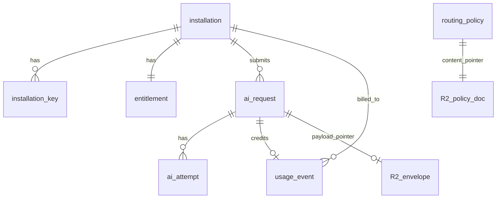

# AI Platform D1 and R2 Storage Reference

- Purpose: Explain what the AI platform stores in D1 and R2, in plain language — what each table is for, how the pieces connect, and when data is read or written.
- Read this when: you are onboarding to `ai-platform/`, debugging a request, or trying to understand how storage fits into the platform lifecycle.
- Canonical for: nothing. This is a **storage companion** derived from `ai-platform/migrations/`, `ai-platform/schema.snap.sql`, and runtime code in `ai-platform/src/`.
- Related docs: [06-ai-platform-behavioral-journey.md](06-ai-platform-behavioral-journey.md) (stage-by-stage behavior), [04-ai-platform-operator-runbook.md](04-ai-platform-operator-runbook.md) (operator recipes).

---


## Table of Contents

1. [The big picture: D1 vs R2](#1-the-big-picture-d1-vs-r2)
2. [Environments](#2-environments)
3. [D1 tables](#3-d1-tables)
  - [3.1 Who is allowed in (identity)](#31-who-is-allowed-in-identity)
  - [3.2 What they may use (entitlements and grants)](#32-what-they-may-use-entitlements-and-grants)
  - [3.3 How AI calls are routed (routing policy and kill switches)](#33-how-ai-calls-are-routed-routing-policy-and-kill-switches)
  - [3.4 What happened on each request (journal)](#34-what-happened-on-each-request-journal)
  - [3.5 Billing and metrics](#35-billing-and-metrics)
  - [3.6 Operator audit log](#36-operator-audit-log)
  - [3.7 Token version rules](#37-token-version-rules)
4. [R2 file storage](#4-r2-file-storage)
5. [How the tables connect](#5-how-the-tables-connect)
6. [When storage is touched (by platform stage)](#6-when-storage-is-touched-by-platform-stage)
7. [How long data is kept](#7-how-long-data-is-kept)
8. [Quick reference](#8-quick-reference)

---


## 1. The big picture: D1 vs R2

The AI platform uses two Cloudflare stores. Think of them like a **filing cabinet** (D1) and a **warehouse** (R2).


| Store  | Binding | Simple role                                                                                         |
| ------ | ------- | --------------------------------------------------------------------------------------------------- |
| **D1** | `DB`    | Structured rows you can query: who is enrolled, what they may use, request status, costs, audit log |
| **R2** | `R2`    | Large JSON files: routing recipes and per-request diagnostic packages                               |


**The rule:** D1 holds **index cards and summaries**. R2 holds **the full documents**. When support looks up a request, the platform reads one D1 row, then optionally fetches one R2 file via a pointer column.

### 1.1 What lives elsewhere (not D1/R2)


| Thing                                      | Where it actually lives                                                                                |
| ------------------------------------------ | ------------------------------------------------------------------------------------------------------ |
| Capability manifests and prompt text       | Bundled inside the Worker (`manifests/published/`, `prompts/`) — deployed with code, not in a database |
| Live quota, idempotency, replay protection | **Durable Object** (`GatewayObject`) — one per installation                                            |
| Rate limiting                              | Cloudflare **Rate Limiting** bindings — not D1                                                         |


This document does not cover the Durable Object; it only covers D1 and R2.

---


## 2. Environments

Each environment (`development`, `staging`, `production`) has its **own** D1 database and R2 bucket. Data never mixes between them.


| Environment   | D1 database               | R2 bucket                 |
| ------------- | ------------------------- | ------------------------- |
| `development` | `ai-platform-development` | `ai-platform-development` |
| `staging`     | `ai-platform-staging`     | `ai-platform-staging`     |
| `production`  | `ai-platform-production`  | `ai-platform-production`  |


Schema changes live in `ai-platform/migrations/`. Ops or Wrangler applies them — the Worker does **not** auto-migrate on boot. The frozen DDL snapshot is `ai-platform/schema.snap.sql`.

---


## 3. D1 tables

Fourteen tables, grouped below by **what question they answer**. All timestamps are ISO-8601 strings.

---


### 3.1 Who is allowed in (identity)

These tables answer: *“Is this clinic registered, and can we verify their token?”*

#### `installation`

One row per enrolled clinic deployment. Created at enroll; updated on suspend, resume, or delete.


| Column            | Type | Nullable | Meaning                                                                             |
| ----------------- | ---- | -------- | ----------------------------------------------------------------------------------- |
| `installation_id` | TEXT | NOT NULL | Primary key; path parameter in control-plane URLs (`/control/installations/{id}/…`) |
| `org_id`          | TEXT | NOT NULL | Clinic organization identifier from enroll payload; must be unique per installation |
| `display_name`    | TEXT | NOT NULL | Human-readable clinic name                                                          |
| `status`          | TEXT | NOT NULL | Lifecycle: `active`, `suspended`, or `deleted`                                      |
| `region`          | TEXT | NOT NULL | Deployment region declared at enroll                                                |
| `enrolled_at`     | TEXT | NOT NULL | Enrollment timestamp                                                                |


**In plain terms:** An **installation** is a clinic on the platform. `status` controls whether they may call AI at all (`suspended` blocks before token verification).

**When read:** Identity stage (guard stage 2) via config cache `installations:{installation_id}`.

**When written:** `POST /control/installations/{id}/enroll`, suspend/resume/delete handlers.

#### `installation_key`

Public verification material for AAT (installation access token) signature checks. Supports rotation and revocation history.


| Column            | Type | Nullable | Meaning                                                |
| ----------------- | ---- | -------- | ------------------------------------------------------ |
| `key_id`          | TEXT | NOT NULL | Primary key; matches `kid` in the AAT header           |
| `installation_id` | TEXT | NOT NULL | FK → `installation.installation_id`                    |
| `public_key`      | TEXT | NOT NULL | Ed25519 public key material for WebCrypto verification |
| `algorithm`       | TEXT | NOT NULL | Algorithm identifier (enroll pins `EdDSA`)             |
| `valid_from`      | TEXT | NOT NULL | Key validity start                                     |
| `valid_until`     | TEXT | Yes      | Optional hard expiry                                   |
| `revoked_at`      | TEXT | Yes      | Set on revoke; non-null keys are rejected              |


**In plain terms:** Each clinic can have **multiple keys** over time (rotation). `key_id` = `kid` in the token header — it tells the platform *which public key* signed this token. The private key never leaves the clinic.

**When read:** Identity stage via config cache `keys:{key_id}`.

**When written:** Enroll (initial key), `POST …/rotate`, `POST …/revoke-key`.

**One-line summary:** `installation` = *which clinics exist*; `installation_key` = *which public keys may sign their tokens*.

---


### 3.2 What they may use (entitlements and grants)

These tables answer: *“Is AI turned on for this clinic, on what plan, and which features are allowed?”*

#### `entitlement`

Per-installation plan, budgets, and AI enablement. One row per installation (updated in place on entitle).


| Column                 | Type    | Nullable | Meaning                                                                                               |
| ---------------------- | ------- | -------- | ----------------------------------------------------------------------------------------------------- |
| `entitlement_id`       | TEXT    | NOT NULL | Primary key                                                                                           |
| `installation_id`      | TEXT    | NOT NULL | FK → `installation`                                                                                   |
| `plan`                 | TEXT    | NOT NULL | Plan tier: `starter`, `standard`, `professional`, or `enterprise`                                     |
| `period_start`         | TEXT    | NOT NULL | Current billing period start                                                                          |
| `period_end`           | TEXT    | NOT NULL | Current billing period end                                                                            |
| `request_quota`        | INTEGER | NOT NULL | Max requests allowed in the period                                                                    |
| `token_budget`         | INTEGER | NOT NULL | Max tokens allowed in the period                                                                      |
| `cost_budget`          | REAL    | NOT NULL | Max cost (platform currency units) in the period                                                      |
| `allowed_capabilities` | TEXT    | NOT NULL | JSON array of capability id strings permitted for this installation                                   |
| `soft_threshold`       | REAL    | NOT NULL | Fraction in `[0, 1]`; when cumulative usage crosses this, admission may set `routing_tier = degraded` |
| `status`               | TEXT    | NOT NULL | `pending` after enroll (quotas zeroed); `active` after entitle                                        |


**In plain terms:** The clinic's **subscription and budgets**. Starts as a placeholder at enroll (`pending`, all zeros); becomes real at entitle (`active`, real quotas).

**When read:** Entitlement stage (guard stage 3), admission stage (guard stage 8), soft-threshold evaluation, discovery plan checks.

**When written:** Enroll creates `pending`; `POST …/entitle` activates.

#### `capability_grant`

Which capability versions a plan or installation may use. Global-scope rows carry lifecycle overlay for deprecate/retire.


| Column               | Type | Nullable | Meaning                                          |
| -------------------- | ---- | -------- | ------------------------------------------------ |
| `grant_id`           | TEXT | NOT NULL | Primary key                                      |
| `scope`              | TEXT | NOT NULL | `plan:{tier}`, `installation:{id}`, or `global`  |
| `capability_id`      | TEXT | NOT NULL | e.g. `clinic.visit_summary`                      |
| `capability_version` | TEXT | NOT NULL | e.g. `1.0.0`                                     |
| `granted_at`         | TEXT | NOT NULL | Grant timestamp                                  |
| `revoked_at`         | TEXT | Yes      | Non-null means grant is inactive                 |
| `changed_at`         | TEXT | NOT NULL | Last mutation timestamp                          |
| `changed_by`         | TEXT | NOT NULL | Operator id                                      |
| `lifecycle_state`    | TEXT | Yes      | Overlay: `active`, `deprecated`, `retired`, etc. |
| `successor_id`       | TEXT | Yes      | Overlay: capability id to migrate clients toward |
| `deprecated_at`      | TEXT | Yes      | Overlay: deprecation timestamp                   |
| `retire_after`       | TEXT | Yes      | Overlay: hard retire-after timestamp             |


**In plain terms:** Permission to use a specific AI feature version. Scope examples:


| Scope                  | Meaning                                            |
| ---------------------- | -------------------------------------------------- |
| `plan:standard`        | Every clinic on the standard plan                  |
| `installation:abc-123` | Only that clinic                                   |
| `global`               | Platform-wide lifecycle overlay (deprecate/retire) |


**When read:** Entitlement and capability resolver stages via config cache `grants:{scope}/{capability_id}` or `grants:global/{capability_id}/{version}`. Discovery lists manifests for granted capabilities.

**When written:** Entitle (installation/plan grants), cohort activate/promote, capability deprecate/retire control endpoints.

**Constraint:** Partial unique indexes prevent duplicate live grants per `(scope, capability_id)` for `installation:` and `plan:` scopes.

**One-line summary:** `entitlement` = *their plan and quotas*; `capability_grant` = *which AI features they may invoke*.

---


### 3.3 How AI calls are routed (routing policy and kill switches)

These tables answer: *“Which AI provider do we call, and is anything emergency-disabled?”*

#### `routing_policy`

Versioned registry of routing policies. The **policy document** (rules, target chains, cost classes) lives in R2; this table holds metadata and activation state.


| Column                    | Type | Nullable | Meaning                                                                                 |
| ------------------------- | ---- | -------- | --------------------------------------------------------------------------------------- |
| `policy_id`               | TEXT | NOT NULL | Composite PK with `version`; e.g. `standard` from ref `routing/standard@v1`             |
| `version`                 | TEXT | NOT NULL | Policy version string                                                                   |
| `content_pointer`         | TEXT | NOT NULL | R2 key → `control/routing-policy/{policy_id}/{version}.json`                            |
| `active_from`             | TEXT | NOT NULL | When this version was published/activated                                               |
| `activated_by`            | TEXT | NOT NULL | Operator id                                                                             |
| `canary_installation_ids` | TEXT | Yes      | JSON array of installation ids when `status = canary`                                   |
| `status`                  | TEXT | NOT NULL | `published` (stored, not serving), `canary` (cohort only), or `active` (global default) |


**In plain terms:** When visit summary runs, the manifest points at `routing/standard@v1`. D1 holds the **catalog card**; R2 holds the **recipe** (which provider, which model, retries, fallbacks).

**What the R2 recipe dictates:**

- Which provider to try first (DeepSeek, Gemini, fake test adapter, …)
- Which model on that provider
- Backup providers if the first fails
- Retry count and timeout per target
- Rules for `standard` vs `degraded` tier (cheaper path when near quota)

**Status values — how rollout works:**


| `status`    | Who uses this version                       |
| ----------- | ------------------------------------------- |
| `published` | Nobody yet — saved draft                    |
| `canary`    | Only clinics in `canary_installation_ids`   |
| `active`    | Everyone (unless they match a newer canary) |


**Canary in one sentence:** Test a new routing recipe on a few clinics before turning it on for all clinics.

Example flow: v1 active (everyone → DeepSeek) → publish v2 (Gemini) → canary one test clinic → promote v2 (everyone → Gemini).

**When read:** Router (invoke path) and config cache `active_routing_policy:{ref}` or `active_routing_policy:{ref}/{installation_id}`. Canary rows are checked first; otherwise the newest `active` row is used. On cache miss, D1 row is loaded and the R2 document is fetched via `content_pointer`.

**When written:** `POST /control/routing-policies/publish` and `POST /control/routing-policies/{id}/versions/{v}/canary|promote|rollback`.

#### `kill_switch`

Durable kill-switch flags evaluated during entitlement (stages 3–4) and routing (stage 5).


| Column       | Type    | Nullable | Meaning                                                                                       |
| ------------ | ------- | -------- | --------------------------------------------------------------------------------------------- |
| `scope`      | TEXT    | NOT NULL | Composite PK with `target`: `global`, `capability`, `installation`, or `provider`             |
| `target`     | TEXT    | NOT NULL | Scope-specific target id (e.g. `global`, `clinic.visit_summary`, installation id, `deepseek`) |
| `active`     | INTEGER | NOT NULL | `1` = kill switch on (fail closed); `0` = off                                                 |
| `changed_at` | TEXT    | NOT NULL | Last change timestamp                                                                         |
| `changed_by` | TEXT    | NOT NULL | Actor who set the switch                                                                      |


**In plain terms:** Emergency off buttons — separate from routing policy.


| `scope`        | `target` example       | Effect                   |
| -------------- | ---------------------- | ------------------------ |
| `global`       | `global`               | Block all AI             |
| `installation` | clinic installation id | Block one clinic         |
| `capability`   | `clinic.visit_summary` | Block one feature        |
| `provider`     | `deepseek`             | Stop using that provider |


**Important:** No row = switch is **off** (normal). There is no admin HTTP API yet — operators insert D1 rows directly when needed.

**When read:** Config cache `kill_switches:{scope}:{target}` or `kill_switches:global`. Miss = inactive.

**One-line summary:** `routing_policy` = *which AI to call and how*; `kill_switch` = *emergency stop*.

---


### 3.4 What happened on each request (journal)

These tables answer: *“What AI requests ran, what state are they in, and what did we try?”*

Rejected requests (bad token, no quota, etc.) **never** get a row here.

#### `ai_request`

One row per admitted AI request. The dominant table and journal spine.


| Column                 | Type    | Nullable | Meaning                                                                                                    |
| ---------------------- | ------- | -------- | ---------------------------------------------------------------------------------------------------------- |
| `request_id`           | TEXT    | NOT NULL | Primary key; internal ULID identity                                                                        |
| `request_reference`    | TEXT    | NOT NULL | Support handle `XXXX-XXXX` (Crockford base32); unique index                                                |
| `installation_id`      | TEXT    | NOT NULL | FK → `installation`                                                                                        |
| `actor_id`             | TEXT    | NOT NULL | Submitting staff actor from AAT principal                                                                  |
| `branch_id`            | TEXT    | Yes      | Branch scope when present on principal                                                                     |
| `capability_id`        | TEXT    | NOT NULL | Invoked capability                                                                                         |
| `capability_version`   | TEXT    | NOT NULL | Invoked version                                                                                            |
| `prompt_artifact_hash` | TEXT    | NOT NULL | Pinned system-instruction ref from manifest at insert time                                                 |
| `idempotency_key`      | TEXT    | NOT NULL | Client idempotency key (dedup owned by Quota DO, not a D1 unique index)                                    |
| `state`                | TEXT    | NOT NULL | Lifecycle: `Accepted` → `Composing` → … → terminal (`Completed`, `Failed`, `Cancelled`, `AwaitingContext`) |
| `created_at`           | TEXT    | NOT NULL | Row insert time (synchronous, before SSE `accepted`)                                                       |
| `updated_at`           | TEXT    | NOT NULL | Last state transition                                                                                      |
| `completed_at`         | TEXT    | Yes      | Set on terminal states                                                                                     |
| `terminal_error_code`  | TEXT    | Yes      | Closed taxonomy code when `state = Failed`                                                                 |
| `trace_id`             | TEXT    | NOT NULL | Correlation id returned to client                                                                          |
| `payload_pointer`      | TEXT    | Yes      | R2 key of diagnostic envelope; set post-response                                                           |
| `routing_tier`         | TEXT    | Yes      | `standard` or `degraded`; set at journal insert from admission/soft-threshold                              |
| `routing_decision`     | TEXT    | Yes      | **Schema column** for serialized router selection reason; **not yet written** by current code              |
| `conversation_id`      | TEXT    | Yes      | Conversational legs only; forced `NULL` for `single_shot`                                                  |
| `turn_ordinal`         | INTEGER | Yes      | Turn order within `conversation_id`                                                                        |


**In plain terms:** One button press or one chat turn = one row. The **main flight log**.

**Two ids (do not confuse them):**


| Column              | Who sees it                               |
| ------------------- | ----------------------------------------- |
| `request_id`        | Platform internals (ULID)                 |
| `request_reference` | Client, support, GET lookup (`A3B7-K9M2`) |


**Status (**`state`**) — where is it in the pipeline?**

```
Accepted → Composing → Invoking → Streaming → … → Completed
                                              └→ Failed / Cancelled / AwaitingContext
```


| State             | Meaning                                     |
| ----------------- | ------------------------------------------- |
| `Accepted`        | Row created; client got SSE `accepted`      |
| `Composing`       | Building the prompt                         |
| `Invoking`        | Calling the AI provider                     |
| `Streaming`       | Sending text back                           |
| `Completed`       | Success                                     |
| `Failed`          | Error — see `terminal_error_code`           |
| `Cancelled`       | Client disconnected                         |
| `AwaitingContext` | Chat assistant waiting for more clinic data |


`conversation_id` + `turn_ordinal` group chat turns; both stay `NULL` for single-shot features like visit summary.

`payload_pointer` links to the R2 envelope — filled **after** the response completes, not at insert.

**When written:**

- Insert at guard stage 9 (`createRequestRow`) with `state = Accepted`
- State transitions during invoke (`journalTransition`, `recordTerminalState`)
- `payload_pointer` updated after terminal response (`writePostResponseDetail`)

**When read:** `GET /v1/requests/{reference}`, support lookup, retention purge, rollup reconciliation, dashboards.

#### `ai_attempt`

One row per provider invoke attempt for a request.


| Column                | Type    | Nullable | Meaning                                         |
| --------------------- | ------- | -------- | ----------------------------------------------- |
| `attempt_id`          | TEXT    | NOT NULL | Primary key                                     |
| `request_id`          | TEXT    | NOT NULL | FK → `ai_request`                               |
| `attempt_no`          | INTEGER | NOT NULL | Sequence within the request (1-based)           |
| `provider`            | TEXT    | NOT NULL | Provider id (e.g. `deepseek`, `gemini`, `fake`) |
| `model`               | TEXT    | NOT NULL | Model id used for this attempt                  |
| `outcome`             | TEXT    | NOT NULL | Attempt outcome label                           |
| `latency_ms`          | INTEGER | NOT NULL | Round-trip latency                              |
| `tokens_in`           | INTEGER | NOT NULL | Input tokens                                    |
| `tokens_out`          | INTEGER | NOT NULL | Output tokens                                   |
| `cost`                | REAL    | NOT NULL | Attempt cost                                    |
| `provider_request_id` | TEXT    | Yes      | Provider-side request id when returned          |
| `error_code`          | TEXT    | Yes      | Taxonomy code on failure                        |


**In plain terms:** Each time the platform dials a provider (retry or fallback) = one row. Example: DeepSeek timeout → DeepSeek retry fail → Gemini success = three rows, one `ai_request`.

**When written:** Post-response detail (stage 16), batched with `usage_event` insert.

**When read:** Support lookup, reconciliation job (missing attempts), dashboards.

**One-line summary:** `ai_request` = *the flight*; `ai_attempt` = *each time we dialed a provider*.

---


### 3.5 Billing and metrics

These tables answer: *“How much did they use, and how many requests failed before journaling?”*

#### `usage_event`

Append-only per-request usage credit for quota settlement and billing evidence.


| Column            | Type    | Nullable | Meaning                                                              |
| ----------------- | ------- | -------- | -------------------------------------------------------------------- |
| `usage_event_id`  | TEXT    | NOT NULL | Primary key                                                          |
| `installation_id` | TEXT    | NOT NULL | FK → `installation`                                                  |
| `period`          | TEXT    | NOT NULL | Billing period key (from entitlement period)                         |
| `request_id`      | TEXT    | Yes      | FK → `ai_request` with `ON DELETE SET NULL` — survives journal purge |
| `quota_weight`    | INTEGER | NOT NULL | Quota units consumed (from manifest economics)                       |
| `tokens`          | INTEGER | NOT NULL | Total tokens credited                                                |
| `cost`            | REAL    | NOT NULL | Total cost credited                                                  |
| `recorded_at`     | TEXT    | NOT NULL | Ledger write timestamp                                               |


**In plain terms:** The **billing receipt** per completed request. Kept much longer than the journal (~7 years). Journal = operational log; `usage_event` = financial record.

**When written:** Post-response detail after Quota DO credit.

**When read:** Rollup aggregation, reconciliation, dashboards.

#### `usage_rollup`

Pre-aggregated sums per installation and period, produced by the daily cron.


| Column          | Type    | Nullable | Meaning                                     |
| --------------- | ------- | -------- | ------------------------------------------- |
| `rollup_id`     | TEXT    | NOT NULL | Primary key; SHA-256 of `dimensions` JSON   |
| `dimensions`    | TEXT    | NOT NULL | JSON `{"installation_id":"…","period":"…"}` |
| `request_count` | INTEGER | NOT NULL | Count of usage events in the period         |
| `tokens`        | INTEGER | NOT NULL | Sum of tokens                               |
| `cost`          | REAL    | NOT NULL | Sum of cost                                 |


**In plain terms:** Daily cron totals per clinic per period — for dashboards without scanning every `usage_event`.

**When written:** `runRollup` cron (`0 4 * * `*). Upserts on conflict.

#### `platform_counter`

Bucketed counts for events that never create `ai_request` rows — chiefly guard rejections.


| Column          | Type    | Nullable | Meaning                                                         |
| --------------- | ------- | -------- | --------------------------------------------------------------- |
| `counter_id`    | TEXT    | NOT NULL | Primary key; hash of `time_bucket` + `dimension_set`            |
| `dimension_set` | TEXT    | NOT NULL | JSON e.g. `{"error_code":"rate_limited","installation_id":"…"}` |
| `time_bucket`   | TEXT    | NOT NULL | Minute-granularity bucket `YYYY-MM-DDTHH:MM:00`                 |
| `count`         | INTEGER | NOT NULL | Rejection count in the bucket                                   |


**In plain terms:** When the guard rejects a request, there is **no** `ai_request` row. Rejections are tallied here instead — useful for "how many 401s / 403s / 429s per clinic?"

**When written:** `flushRejectionCounters` on each cron tick (in-memory tally from `recordGuardRejection`).

**One-line summary:** `usage_event` = *paid requests*; `usage_rollup` = *summaries*; `platform_counter` = *rejected-before-journal counts*.

---


### 3.6 Operator audit log


#### `control_audit`

Append-only log of operator mutations.


| Column           | Type | Nullable | Meaning                                                                                 |
| ---------------- | ---- | -------- | --------------------------------------------------------------------------------------- |
| `audit_id`       | TEXT | NOT NULL | Primary key                                                                             |
| `operator_id`    | TEXT | NOT NULL | From `OPERATOR_ID` / auth context                                                       |
| `action`         | TEXT | NOT NULL | e.g. `enroll`, `entitle`, `routing_policy_publish`, `purge`                             |
| `target`         | TEXT | NOT NULL | Entity id or composite target string                                                    |
| `before_pointer` | TEXT | Yes      | Prior state pointer or inline snapshot reference                                        |
| `after_pointer`  | TEXT | Yes      | New state pointer or inline JSON (e.g. entitle stores `allowed_capabilities` JSON here) |
| `recorded_at`    | TEXT | NOT NULL | Audit timestamp                                                                         |


**In plain terms:** Who changed platform configuration, and when. `before_pointer` / `after_pointer` are not always R2 keys — enroll has both `NULL`; routing publish stores the R2 key in `after_pointer`; entitle stores inline JSON in `after_pointer`.

---


### 3.7 Token version rules


#### `token_contract`

Platform-global set of accepted AAT `ver` claim values.


| Column       | Type | Nullable | Meaning                                   |
| ------------ | ---- | -------- | ----------------------------------------- |
| `ver`        | TEXT | NOT NULL | Primary key; e.g. `1`                     |
| `added_at`   | TEXT | NOT NULL | When this version was accepted            |
| `retired_at` | TEXT | Yes      | When retired; `NULL` = currently accepted |
| `changed_by` | TEXT | NOT NULL | Operator who added/retired                |


**In plain terms:** Passport standard version — "we only accept tokens with `ver` values listed here." Migration seeds `ver = '1'`. Identity rejects unknown or retired versions.

**When written:** `POST /control/token-contract` add/retire endpoints.

**One-line summary:** Which token format versions the platform accepts.

---


## 4. R2 file storage

Only two object families are written by the platform today.

### 4.1 Routing policy documents


| Property         | Value                                                                                                                                                             |
| ---------------- | ----------------------------------------------------------------------------------------------------------------------------------------------------------------- |
| **Key pattern**  | `control/routing-policy/{policy_id}/{version}.json`                                                                                                               |
| **Content-Type** | `application/json`                                                                                                                                                |
| **D1 link**      | `routing_policy.content_pointer`                                                                                                                                  |
| **Shape**        | Versioned policy-as-data: `rules[]` with `match` conditions, `targets[]` (provider, model, `max_attempts`, `timeout_ms`), installation overrides, cost-class caps |
| **Written by**   | `POST …/routing-policies/…/publish`                                                                                                                               |
| **Read by**      | Config cache on router preload; kill-switch evaluation uses provider ids from the loaded document                                                                 |


Example key: `control/routing-policy/standard/1.json` for manifest ref `routing/standard@v1`.

**In plain terms:** The full routing recipe JSON. D1 `routing_policy` is the index card pointing here.

### 4.2 Request diagnostic envelopes


| Property         | Value                                                                                                                                                 |
| ---------------- | ----------------------------------------------------------------------------------------------------------------------------------------------------- |
| **Key pattern**  | `request/{request_id}/envelope`                                                                                                                       |
| **Content-Type** | JSON (default)                                                                                                                                        |
| **D1 link**      | `ai_request.payload_pointer`                                                                                                                          |
| **Shape**        | `Envelope`: `{ context, prompt, attempts, result }` — filtered context, composed prompt, raw provider bodies per attempt, validated `CanonicalResult` |
| **Written by**   | `writePostResponseDetail` (stage 16, best-effort `waitUntil`)                                                                                         |
| **Read by**      | `GET /v1/requests/{reference}` (completed), support lookup, retention purge                                                                           |


**In plain terms:** The full debug package for one request — what went in, what prompt was built, what the provider returned, and the validated result.

**Note:** Idempotent replay does not read R2 — the Quota DO returns prior terminal state, and the live stream emits a stub terminal event.

---


## 5. How the tables connect




**In plain terms:**

- Every **installation** has keys, an entitlement, many **requests**, and many **usage events**.
- Every **request** has zero or more **attempts** and usually one **usage event**.
- **Routing policy** D1 rows point at R2 recipes.
- **Request** D1 rows point at R2 envelopes (when completed).

**Foreign keys (enforced):**

- `installation_key.installation_id` → `installation`
- `entitlement.installation_id` → `installation`
- `ai_request.installation_id` → `installation`
- `ai_attempt.request_id` → `ai_request`
- `usage_event.installation_id` → `installation`
- `usage_event.request_id` → `ai_request` (`ON DELETE SET NULL`)

**Setup chain (must exist before AI works):**

```
enroll → installation + key + entitlement (pending)
entitle → entitlement (active) + capability_grant
publish + promote routing → routing_policy (active) + R2 recipe
```

---


## 6. When storage is touched (by platform stage)

Maps to [06-ai-platform-behavioral-journey.md](06-ai-platform-behavioral-journey.md).

### 6.1 Boot

- Migrations create all D1 tables; seed `token_contract ver='1'`
- Worker loads bundled manifests — **no D1/R2 read**


### 6.2 Operator setup


| Action                 | D1                                                                           | R2          |
| ---------------------- | ---------------------------------------------------------------------------- | ----------- |
| Enroll clinic          | `installation`, `installation_key`, `entitlement` (pending), `control_audit` | —           |
| Entitle clinic         | `entitlement` (active), `capability_grant`, `control_audit`                  | —           |
| Publish routing policy | `routing_policy` (published), `control_audit`                                | Policy JSON |
| Canary / promote       | `routing_policy.status`, canary ids, `control_audit`                         | —           |


### 6.3 Clinic mints token (outside Worker)

No D1/R2 writes. Clinic signs AAT with private key matching `installation_key`.

### 6.4 Discovery (`GET /v1/capabilities`)

**Reads:** installation, keys, token_contract, entitlement, grants, bundled manifests. Kill switches are **not** checked.

### 6.5 Live request — guard (before client sees `accepted`)

```
Token verify     → read installation, installation_key, token_contract
Entitlement      → read entitlement, capability_grant, kill_switch
Admission/quota  → read entitlement (Durable Object holds live counters)
Journal insert   → WRITE ai_request (Accepted)
Guard rejection  → WRITE platform_counter (async) — NO ai_request row
```


### 6.6 Live request — invoke

```
Load routing     → read routing_policy + R2 policy JSON
State updates    → UPDATE ai_request.state
```


### 6.7 Live request — finish

```
Terminal state   → UPDATE ai_request (Completed/Failed/…)
Settlement       → INSERT ai_attempt, INSERT usage_event, PUT R2 envelope, UPDATE payload_pointer
```

Stage 16 failures are logged but do **not** undo the response the client already received.

### 6.8 Lookup later


| Need                    | D1                                  | R2                           |
| ----------------------- | ----------------------------------- | ---------------------------- |
| Client GET by reference | `ai_request` by `request_reference` | Envelope if Completed        |
| Support trace           | `ai_request` + `ai_attempt`         | Envelope if within retention |


### 6.9 Daily crons


| When            | What                                                         |
| --------------- | ------------------------------------------------------------ |
| Every cron tick | Flush `platform_counter`; reconcile grace admissions         |
| 03:00 UTC       | Retention purge — delete old journal rows and R2 envelopes   |
| 04:00 UTC       | Rollup `usage_event` → `usage_rollup`; reconciliation checks |


---


## 7. How long data is kept


| Class          | What                                                                         | Horizon                                                                      | Store                                             |
| -------------- | ---------------------------------------------------------------------------- | ---------------------------------------------------------------------------- | ------------------------------------------------- |
| **Diagnostic** | R2 envelope (context, prompt, PII-adjacent)                                  | Per capability `Governance.retentionClass` (e.g. `diagnostic_30d` = 30 days) | R2; `payload_pointer` nulled                      |
| **Journal**    | `ai_request`, `ai_attempt`                                                   | 90 days                                                                      | D1                                                |
| **Ledger**     | `usage_event`                                                                | 2555 days (~7 years)                                                         | D1 (`request_id` may be NULL after journal purge) |
| **Counter**    | `platform_counter`                                                           | 90 days                                                                      | D1                                                |
| **Customer**   | `installation`, keys, entitlements, grants, routing history, `control_audit` | Life of customer                                                             | D1                                                |


Operator `POST …/purge` on an installation deletes its journal and envelopes immediately.

---


## 8. Quick reference


### 8.1 All D1 tables at a glance


| Table              | One question it answers                |
| ------------------ | -------------------------------------- |
| `installation`     | Which clinics are enrolled?            |
| `installation_key` | Which public keys verify their tokens? |
| `entitlement`      | What plan and quotas do they have?     |
| `capability_grant` | Which AI features are permitted?       |
| `routing_policy`   | Which routing recipe version is live?  |
| `kill_switch`      | What is emergency-disabled?            |
| `ai_request`       | What happened on each AI call?         |
| `ai_attempt`       | Each provider try for that call?       |
| `usage_event`      | What was billed?                       |
| `usage_rollup`     | Period totals per clinic?              |
| `platform_counter` | How many guard rejections?             |
| `control_audit`    | What did operators change?             |
| `token_contract`   | Which token `ver` values are valid?    |


### 8.2 Indexes


| Index                                    | Table              | Columns                                            | Purpose                               |
| ---------------------------------------- | ------------------ | -------------------------------------------------- | ------------------------------------- |
| `idx_ai_request_request_reference`       | `ai_request`       | `request_reference` UNIQUE                         | Support lookup, GET by reference      |
| `idx_ai_request_conversation`            | `ai_request`       | `conversation_id`, `turn_ordinal`                  | Ordered conversation history          |
| `idx_ai_request_installation_id`         | `ai_request`       | `installation_id`                                  | Installation-scoped queries, purge    |
| `idx_ai_request_created_at`              | `ai_request`       | `created_at`                                       | Retention purge window                |
| `idx_ai_attempt_request_id`              | `ai_attempt`       | `request_id`                                       | Support lookup, reconciliation        |
| `idx_usage_event_request_id`             | `usage_event`      | `request_id`                                       | Reconciliation                        |
| `idx_usage_event_installation_id`        | `usage_event`      | `installation_id`                                  | Rollup, dashboards                    |
| `idx_usage_rollup_period`                | `usage_rollup`     | `json_extract(dimensions, '$.period')`             | Period-scoped reporting               |
| `idx_platform_counter_installation`      | `platform_counter` | `json_extract(dimension_set, '$.installation_id')` | Per-installation rejection dashboards |
| `idx_capability_grant_live_installation` | `capability_grant` | `(scope, capability_id)` WHERE live                | Prevent duplicate installation grants |
| `idx_capability_grant_live_plan`         | `capability_grant` | `(scope, capability_id)` WHERE live                | Prevent duplicate plan grants         |


### 8.3 Implementation caveats


| Topic                     | Reality today                                                                       |
| ------------------------- | ----------------------------------------------------------------------------------- |
| Config cache              | 30s in-memory TTL over D1 reads; routing policy merges D1 row + R2 JSON             |
| `routing_decision` column | Exists in schema; router produces it in memory only — **not persisted** to D1 yet   |
| `prompt_artifact_hash`    | Stores manifest ref string, not a hash of composed bytes                            |
| Quota DO vs `usage_event` | DO holds live reservation; D1 ledger is durable — reconciliation catches mismatches |
| Prompt text               | Never in D1; composed prompt lives in R2 envelope after invoke                      |
| Kill switches             | Table exists; no HTTP writer — direct D1 insert                                     |


### 8.4 Migration files


| File                                            | Adds                             |
| ----------------------------------------------- | -------------------------------- |
| `20260731120000_platform_schema.sql`            | Core 11 tables                   |
| `20260802100000_capability_grant_lifecycle.sql` | Grant lifecycle columns          |
| `20260803100000_routing_policy_canary.sql`      | `canary_installation_ids`        |
| `20260803120000_token_contract.sql`             | `token_contract` + seed          |
| `20260805120000_f3_retention_indexes.sql`       | `usage_event` FK relax + indexes |
| `20260805180000_h3_conversation_index.sql`      | Conversation index               |
| `20260805190000_routing_policy_status.sql`      | `routing_policy.status`          |
| `20260807120000_kill_switch.sql`                | `kill_switch`                    |


