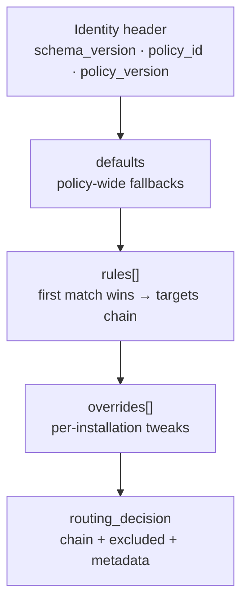

# AI Platform Data Journey

- Purpose: Trace **every field** of data as it moves through the AI platform — from first configuration through enrollment, entitlements, contracts, routing, live AI requests, and settlement in D1, R2, and the Quota Durable Object.
- Read this when: you are learning the platform and want to understand **what each value means, where it came from, and why a path succeeded or failed** — not just which HTTP endpoint to call.
- Canonical for: nothing. This is a **data-field companion** derived from `ai-platform/src/`**, `ai-platform/migrations/`**, `backend/supabase/migrations/**`, and `ai-platform/manifests/**`.
- Related docs: [09-ai-platform-request-response-flow.md](09-ai-platform-request-response-flow.md) (canonical request/response call hierarchy), [06-ai-platform-behavioral-journey.md](06-ai-platform-behavioral-journey.md) (stage behavior), [07-ai-platform-d1-r2-storage.md](07-ai-platform-d1-r2-storage.md) (storage tables), [01-ai-platform.md](01-ai-platform.md) (architecture decisions).

---


## Table of Contents

1. [1. How to read this document](#1-how-to-read-this-document)
   - [1.1 What you will find in each stage](#11-what-you-will-find-in-each-stage)
   - [1.2 Three meanings of “contract”](#12-three-meanings-of-contract)
   - [1.3 Field notation](#13-field-notation)
2. [2. The master data map](#2-the-master-data-map)
3. [3. Storage layers — filing cabinet, warehouse, and live ledger](#3-storage-layers-filing-cabinet-warehouse-and-live-ledger)
   - [3.1 D1 — the filing cabinet (`DB` binding)](#31-d1-the-filing-cabinet-db-binding)
   - [3.2 R2 — the warehouse (`R2` binding)](#32-r2-the-warehouse-r2-binding)
   - [3.3 Quota Durable Object — the live ledger (`DO` binding)](#33-quota-durable-object-the-live-ledger-do-binding)
   - [3.4 Bundled artifacts — the product catalog (neither D1 nor R2)](#34-bundled-artifacts-the-product-catalog-neither-d1-nor-r2)
   - [3.5 Config cache — 30-second reading glasses](#35-config-cache-30-second-reading-glasses)
4. [4. Stage 0 — Platform configuration and boot](#4-stage-0-platform-configuration-and-boot)
   - [4.1 Plain language](#41-plain-language)
   - [4.2 Metaphor](#42-metaphor)
   - [4.3 Wrangler configuration (`ai-platform/wrangler.toml`)](#43-wrangler-configuration-ai-platformwranglertoml)
      - [4.3.1 Top-level Worker metadata](#431-top-level-worker-metadata)
      - [4.3.2 Cron triggers](#432-cron-triggers)
      - [4.3.3 Per-environment bindings](#433-per-environment-bindings)
      - [4.3.4 Secrets (not in wrangler.toml — set via `wrangler secret put` or `.dev.vars`)](#434-secrets-not-in-wranglertoml-set-via-wrangler-secret-put-or-devvars)
   - [4.4 D1 schema bootstrap](#44-d1-schema-bootstrap)
   - [4.5 Worker module boot (`worker.ts` at load)](#45-worker-module-boot-workerts-at-load)
   - [4.6 Happy path](#46-happy-path)
   - [4.7 Failure paths](#47-failure-paths)
5. [5. Stage 1 — Token contract baseline](#5-stage-1-token-contract-baseline)
   - [5.1 Plain language](#51-plain-language)
   - [5.2 Metaphor](#52-metaphor)
   - [5.3 D1 row (`token_contract`)](#53-d1-row-token_contract)
   - [5.4 Control-plane token-contract rotation](#54-control-plane-token-contract-rotation)
      - [`POST /control/token-contract/begin-rotation`](#post-controltoken-contractbegin-rotation)
      - [`POST /control/token-contract/retire`](#post-controltoken-contractretire)
   - [5.5 Runtime consumption (identity stage 2)](#55-runtime-consumption-identity-stage-2)
6. [6. Stage 2 — Clinic keypair enrollment (Supabase)](#6-stage-2-clinic-keypair-enrollment-supabase)
   - [6.1 Plain language](#61-plain-language)
   - [6.2 Metaphor](#62-metaphor)
   - [6.3 API: `public.enroll_installation_keypair()`](#63-api-publicenroll_installation_keypair)
   - [6.4 Clinic availability flag (manual step)](#64-clinic-availability-flag-manual-step)
   - [6.5 Failure paths](#65-failure-paths)
   - [6.6 Happy path](#66-happy-path)
   - [6.7 Who calls this RPC and how the platform learns `installation_id`](#67-who-calls-this-rpc-and-how-the-platform-learns-installation_id)
      - [6.7.1 Caller](#671-caller)
      - [6.7.2 End-to-end flow (intended production)](#672-end-to-end-flow-intended-production)
      - [6.7.3 How the platform learns `installation_id`](#673-how-the-platform-learns-installation_id)
      - [6.7.4 Duplicate `installation_id` across clinics](#674-duplicate-installation_id-across-clinics)
      - [6.7.5 What this stage does not do](#675-what-this-stage-does-not-do)
7. [7. Stage 3 — Platform installation enrollment](#7-stage-3-platform-installation-enrollment)
   - [7.1 Plain language](#71-plain-language)
   - [7.2 Metaphor](#72-metaphor)
   - [7.3 API: `POST /control/installations/{installation_id}/enroll`](#73-api-post-controlinstallationsinstallation_idenroll)
      - [Path parameter](#path-parameter)
      - [Request body — every field](#request-body-every-field)
      - [Success response (200)](#success-response-200)
      - [D1 writes (atomic batch)](#d1-writes-atomic-batch)
      - [How `platform_base_url` reaches Flutter (summary)](#how-platform_base_url-reaches-flutter-summary)
   - [7.4 Failure paths](#74-failure-paths)
   - [7.5 Post-enroll runtime effect](#75-post-enroll-runtime-effect)
   - [7.6 Happy path diagram](#76-happy-path-diagram)
8. [8. Stage 4 — Entitlement and capability grants](#8-stage-4-entitlement-and-capability-grants)
   - [8.1 Plain language](#81-plain-language)
   - [8.2 Metaphor](#82-metaphor)
   - [8.3 API: `POST /control/installations/{installation_id}/entitle`](#83-api-post-controlinstallationsinstallation_identitle)
      - [Request body — every field](#request-body-every-field-1)
      - [Success response (200)](#success-response-200-1)
      - [D1 writes](#d1-writes)
   - [8.4 Runtime entitlement checks (guard stage 3)](#84-runtime-entitlement-checks-guard-stage-3)
   - [8.5 Failure paths](#85-failure-paths)
   - [8.6 Example entitle payload (visit summary)](#86-example-entitle-payload-visit-summary)
9. [9. Stage 5 — Routing policy (D1 index + R2 document)](#9-stage-5-routing-policy-d1-index-r2-document)
   - [9.1 Plain language](#91-plain-language)
   - [9.2 Metaphor](#92-metaphor)
   - [9.3 Manifest link](#93-manifest-link)
      - [9.3.1 Field presence key](#931-field-presence-key)
      - [9.3.2 Routing inputs — manifest → router](#932-routing-inputs-manifest-router)
      - [9.3.3 Complete specimen (visit summary)](#933-complete-specimen-visit-summary)
      - [9.3.4 Field-by-field reference — every group](#934-field-by-field-reference-every-group)
         - [`Identity`](#identity)
         - [`Access`](#access)
         - [`Interaction`](#interaction)
         - [`Input`](#input)
         - [`Context requirements`](#context-requirements)
         - [`Prompt binding`](#prompt-binding)
         - [`Output`](#output)
         - [`Routing`](#routing)
         - [`Economics`](#economics)
         - [`Governance`](#governance)
      - [9.3.5 How manifest floors meet R2 `requires`](#935-how-manifest-floors-meet-r2-requires)
   - [9.4 R2 document — every field](#94-r2-document-every-field)
      - [9.4.1 R2 object key](#941-r2-object-key)
      - [9.4.2 Complete document specimen](#942-complete-document-specimen)
      - [9.4.3 Document overview — what each block is for](#943-document-overview-what-each-block-is-for)
      - [9.4.4 Field-by-field reference](#944-field-by-field-reference)
         - [Identity header](#identity-header)
         - [`defaults` — policy-wide fallbacks](#defaults-policy-wide-fallbacks)
         - [`rules[]` — ordered routing rules](#rules-ordered-routing-rules)
         - [`overrides[]` — per-installation exceptions](#overrides-per-installation-exceptions)
      - [9.4.5 Hardcoded, ignored, and wiring gaps](#945-hardcoded-ignored-and-wiring-gaps)
   - [9.5 D1 `routing_policy` row — every column](#95-d1-routing_policy-row-every-column)
   - [9.6 Control endpoints](#96-control-endpoints)
      - [Publish: `POST /control/routing-policies/publish`](#publish-post-controlrouting-policiespublish)
      - [Canary: `POST …/canary`](#canary-post-canary)
      - [Promote: `POST …/promote`](#promote-post-promote)
      - [Rollback: `POST …/rollback`](#rollback-post-rollback)
   - [9.7 Router output (`RoutingDecision`) — every field](#97-router-output-routingdecision-every-field)
   - [9.8 Routing failure paths (post-accept)](#98-routing-failure-paths-post-accept)
10. [10. Stage 6 — Minting an AAT (clinic-side)](#10-stage-6-minting-an-aat-clinic-side)
   - [10.1 Plain language](#101-plain-language)
   - [10.2 Metaphor](#102-metaphor)
   - [10.3 API: `public.issue_ai_token()`](#103-api-publicissue_ai_token)
   - [10.4 JWS structure](#104-jws-structure)
      - [Header — every field](#header-every-field)
      - [Payload — every claim](#payload-every-claim)
      - [Clinic DB write (`ai_internal.ai_token_issuance`)](#clinic-db-write-ai_internalai_token_issuance)
   - [10.5 Mint failure codes](#105-mint-failure-codes)
   - [10.6 Platform verification summary](#106-platform-verification-summary)
11. [11. Stage 7 — Discovery (`GET /v1/capabilities`)](#11-stage-7-discovery-get-v1capabilities)
   - [11.1 Plain language](#111-plain-language)
   - [11.2 Request](#112-request)
   - [11.3 D1 reads (via config cache)](#113-d1-reads-via-config-cache)
   - [11.4 Response shape (conceptual)](#114-response-shape-conceptual)
   - [11.5 Failure paths](#115-failure-paths)
12. [12. Stage 8 — Request ingress (`POST /v1/requests`)](#12-stage-8-request-ingress-post-v1requests)
   - [12.1 Plain language](#121-plain-language)
   - [12.2 Metaphor](#122-metaphor)
   - [12.3 Required headers — every field](#123-required-headers-every-field)
   - [12.4 Body — every field](#124-body-every-field)
   - [12.5 Ingress validation (before guard)](#125-ingress-validation-before-guard)
   - [12.6 Pre-accept (`createProductionPreAccept`)](#126-pre-accept-createproductionpreaccept)
   - [12.7 Visit summary example body](#127-visit-summary-example-body)
13. [13. Stage 9 — The guard (stages 1–10)](#13-stage-9-the-guard-stages-1-10)
   - [13.1 Plain language](#131-plain-language)
   - [13.2 Metaphor](#132-metaphor)
   - [13.3 Guard flow diagram](#133-guard-flow-diagram)
   - [13.4 Stage 1 — Ingress size + JSON](#134-stage-1-ingress-size-json)
   - [13.5 Stage 2 — Identity](#135-stage-2-identity)
   - [13.6 Stage 3 — Entitlement](#136-stage-3-entitlement)
   - [13.7 Stage 4 — Rate limit](#137-stage-4-rate-limit)
   - [13.8 Stage 5 — Capability resolve](#138-stage-5-capability-resolve)
   - [13.9 Stage 6 — Context validate](#139-stage-6-context-validate)
   - [13.10 Stage 7 — Cost pre-flight](#1310-stage-7-cost-pre-flight)
   - [13.11 Stage 8 — Admission (Quota DO)](#1311-stage-8-admission-quota-do)
   - [13.12 Stage 9 — Journal INSERT](#1312-stage-9-journal-insert)
   - [13.13 Stage 10 — Prompt compose](#1313-stage-10-prompt-compose)
14. [14. Stage 10 — Accept, route, invoke, stream](#14-stage-10-accept-route-invoke-stream)
   - [14.1 Plain language](#141-plain-language)
   - [14.2 SSE events — every field](#142-sse-events-every-field)
      - [`accepted` (first event)](#accepted-first-event)
      - [`heartbeat` (every 15s)](#heartbeat-every-15s)
      - [`regenerating`](#regenerating)
      - [`text_delta`](#text_delta)
      - [`completed` (terminal)](#completed-terminal)
      - [`failed` (terminal)](#failed-terminal)
      - [`cancelled` (terminal)](#cancelled-terminal)
   - [14.3 CanonicalRequest — every field](#143-canonicalrequest-every-field)
   - [14.4 Provider wire transformation](#144-provider-wire-transformation)
      - [DeepSeek (`deepseek-v4-flash`)](#deepseek-deepseek-v4-flash)
      - [Gemini (`gemini-3.5-flash`)](#gemini-gemini-35-flash)
   - [14.5 Invocation retry logic](#145-invocation-retry-logic)
   - [14.6 Idempotent replay path (no provider call)](#146-idempotent-replay-path-no-provider-call)
15. [15. Stage 11 — Terminal settlement (D1, R2, Quota DO)](#15-stage-11-terminal-settlement-d1-r2-quota-do)
   - [15.1 Plain language](#151-plain-language)
   - [15.2 Metaphor](#152-metaphor)
   - [15.3 Quota DO credit (`kind: credit`)](#153-quota-do-credit-kind-credit)
   - [15.4 D1 `ai_request` UPDATE (terminal)](#154-d1-ai_request-update-terminal)
   - [15.5 D1 `ai_attempt` INSERT (per attempt)](#155-d1-ai_attempt-insert-per-attempt)
   - [15.6 D1 `usage_event` INSERT](#156-d1-usage_event-insert)
   - [15.7 R2 envelope — every field](#157-r2-envelope-every-field)
   - [15.8 Happy path settlement diagram](#158-happy-path-settlement-diagram)
16. [16. Stage 12 — Lookup and support](#16-stage-12-lookup-and-support)
   - [16.1 `GET /v1/requests/{request_reference}`](#161-get-v1requestsrequest_reference)
   - [16.2 `POST /control/support/lookup`](#162-post-controlsupportlookup)
17. [17. Alternative and failure journeys](#17-alternative-and-failure-journeys)
   - [17.1 Lifecycle alternatives (control plane)](#171-lifecycle-alternatives-control-plane)
   - [17.2 Zero quotas after entitle](#172-zero-quotas-after-entitle)
   - [17.3 Missing routing policy](#173-missing-routing-policy)
   - [17.4 JTI replay](#174-jti-replay)
   - [17.5 Grace admission + cron reconciliation](#175-grace-admission-cron-reconciliation)
   - [17.6 Client disconnect](#176-client-disconnect)
   - [17.7 Prose guard failures (post-accept)](#177-prose-guard-failures-post-accept)
   - [17.8 Complete pre-SSE failure matrix](#178-complete-pre-sse-failure-matrix)
18. [18. Complete D1 column reference](#18-complete-d1-column-reference)
   - [18.1 `installation`](#181-installation)
   - [18.2 `installation_key`](#182-installation_key)
   - [18.3 `entitlement`](#183-entitlement)
   - [18.4 `capability_grant`](#184-capability_grant)
   - [18.5 `routing_policy`](#185-routing_policy)
   - [18.6 `kill_switch`](#186-kill_switch)
   - [18.7 `token_contract`](#187-token_contract)
   - [18.8 `ai_request`](#188-ai_request)
   - [18.9 `ai_attempt`](#189-ai_attempt)
   - [18.10 `usage_event`](#1810-usage_event)
   - [18.11 `usage_rollup`](#1811-usage_rollup)
   - [18.12 `platform_counter`](#1812-platform_counter)
   - [18.13 `control_audit`](#1813-control_audit)
19. [19. Complete R2 object reference](#19-complete-r2-object-reference)
   - [19.1 Routing policy document](#191-routing-policy-document)
   - [19.2 Request diagnostic envelope](#192-request-diagnostic-envelope)
20. [20. Quota Durable Object state reference](#20-quota-durable-object-state-reference)
   - [20.1 `QuotaDoState` — every field](#201-quotadostate-every-field)
   - [20.2 Constants](#202-constants)
   - [20.3 RPC kinds](#203-rpc-kinds)
21. [21. Taxonomy codes and HTTP mapping](#21-taxonomy-codes-and-http-mapping)
22. [22. Source file index](#22-source-file-index)

---


## 1. How to read this document


### 1.1 What you will find in each stage

Every stage section follows the same recipe:

1. **Plain language** — what we are doing and why, without jargon first.
2. **Metaphor** — a mental model (airport, passport office, filing cabinet).
3. **Data entering** — every field, where it came from.
4. **Data leaving** — every field produced, who consumes it next.
5. **Storage writes** — exact D1 rows, R2 keys, or DO keys touched.
6. **Happy path** — ASCII diagram of success.
7. **Other paths** — every branch, which **input field** caused it, and the **error code** returned.


### 1.2 Three meanings of “contract”

The word **contract** appears in three different places. Do not mix them up:


| Name                             | Where it lives                                      | What it governs                                                   |
| -------------------------------- | --------------------------------------------------- | ----------------------------------------------------------------- |
| **Token contract**               | D1 `token_contract`                                 | Which AAT `ver` claim values the platform accepts                 |
| **Capability manifest**          | Bundled JSON in the Worker (`manifests/published/`) | What a product feature (e.g. visit summary) requires and produces |
| **Canonical inference contract** | TypeScript types (`contracts/canonical.ts`)         | How the gateway talks to DeepSeek/Gemini internally               |


### 1.3 Field notation

- **Wire** = HTTP header or JSON body on the network.
- **D1** = SQLite row column in Cloudflare D1.
- **R2** = object key and JSON document in Cloudflare R2.
- **DO** = Durable Object in-memory + persisted state.
- **Principal** = verified identity extracted from a valid AAT.

---


## 2. The master data map

Read this once. The rest of the document unpacks every box.

```
┌─────────────────────────────────────────────────────────────────────────────┐
│ CONFIGURE (no clinic data yet)                                              │
│  wrangler.toml → bindings: DB, R2, DO, rate limiters, crons, vars, secrets  │
│  D1 migrations → 14 tables + seed token_contract ver='1'                    │
│  Worker boot → in-memory registry: clinic.visit_summary@1.0.0               │
└─────────────────────────────────────────────────────────────────────────────┘
                                    │
                                    ▼
┌─────────────────────────────────────────────────────────────────────────────┐
│ CLINIC TRUST (Supabase PostgreSQL)                                          │
│  enroll_installation_keypair → installation_keys (secret + public, kid)     │
│  app_settings ai.availability → { enrolled, platform_base_url }             │
└─────────────────────────────────────────────────────────────────────────────┘
                                    │ public_jwk.x, kid, installation_id
                                    ▼
┌─────────────────────────────────────────────────────────────────────────────┐
│ CONTROL PLANE — `/control/*` (Bearer OPERATOR_BEARER_TOKEN)                 │
│  POST …/enroll  → D1: installation, installation_key, entitlement(pending)  │
│  POST …/entitle → D1: entitlement(active), capability_grant, control_audit  │
│  POST …/routing-policies/…/publish → R2: policy JSON + D1: routing_policy    │
│  POST …/canary / promote → D1: routing_policy status transitions            │
└─────────────────────────────────────────────────────────────────────────────┘
                                    │
                                    ▼
┌─────────────────────────────────────────────────────────────────────────────┐
│ CLINIC MINT (Supabase)                                                      │
│  issue_ai_token → signed JWS (AAT) + ai_token_issuance row per jti          │
└─────────────────────────────────────────────────────────────────────────────┘
                                    │ Authorization: Bearer <AAT>
                                    ▼
┌─────────────────────────────────────────────────────────────────────────────┐
│ RUNTIME /v1/*                                                               │
│  GET /v1/capabilities → reads D1 entitlement + grants (no R2)               │
│  POST /v1/requests:                                                         │
│    preAccept = guard 1–10 → D1 ai_request INSERT (fresh path)               │
│    SSE accepted → preload routing (D1 + R2) → invoke providers            │
│    terminal → credit Quota DO + D1 attempts/usage + R2 envelope             │
└─────────────────────────────────────────────────────────────────────────────┘
```

**Two facts that confuse newcomers:**

1. The **guard finishes before** `accepted`. A rejected caller never opens an SSE stream.
2. **Routing is not a guard gate**. A request can pass the guard, receive `accepted`, then fail at invoke because no active routing policy exists.

---


## 3. Storage layers — filing cabinet, warehouse, and live ledger


### 3.1 D1 — the filing cabinet (`DB` binding)

Structured rows you can query. Holds identity, entitlements, request journal summaries, billing ledger, audit log, and routing **indexes** (not full routing documents).

**Rule:** D1 stores **index cards**. Large JSON lives in R2; D1 holds a pointer column.

### 3.2 R2 — the warehouse (`R2` binding)

Large JSON blobs:


| Pattern                                             | Contents                                                           |
| --------------------------------------------------- | ------------------------------------------------------------------ |
| `control/routing-policy/{policy_id}/{version}.json` | Full routing policy document                                       |
| `request/{request_id}/envelope`                     | Per-request diagnostic package (context, prompt, attempts, result) |


### 3.3 Quota Durable Object — the live ledger (`DO` binding)

One `GatewayObject` instance per `installation_id` (addressed via `DO.idFromName(installationId)`).

Holds **ephemeral, high-churn** state that must be consistent per installation:

- Period counters (requests, tokens, cost used)
- In-flight concurrency count
- JTI replay map (AAT `jti` claim)
- Idempotency map (`x-idempotency-key` header)
- Admitted / credited request tracking

**Not in D1:** live quota enforcement happens here first; D1 `usage_event` is the durable ledger after completion.

### 3.4 Bundled artifacts — the product catalog (neither D1 nor R2)

Deployed with the Worker:


| Path                                                  | Role                                |
| ----------------------------------------------------- | ----------------------------------- |
| `manifests/published/clinic.visit_summary@1.0.0.json` | Capability manifest                 |
| `prompts/clinic.visit_summary/*.md`                   | System, rules, template prompt text |


### 3.5 Config cache — 30-second reading glasses

Before most D1 reads, `config-cache` may return a cached copy (TTL `30_000` ms). Cache keys:


| Kind                    | Key pattern                                                          | D1 table              |
| ----------------------- | -------------------------------------------------------------------- | --------------------- |
| `installations`         | `{installation_id}`                                                  | `installation`        |
| `keys`                  | `{key_id}`                                                           | `installation_key`    |
| `entitlements`          | `{installation_id}`                                                  | `entitlement`         |
| `grants`                | `{installation_id}/{capability_id}` or `plan:{plan}/{capability_id}` | `capability_grant`    |
| `kill_switches`         | `global` or `{scope}:{target}`                                       | `kill_switch`         |
| `token_contracts`       | `{ver}`                                                              | `token_contract`      |
| `active_routing_policy` | `{policyRef}` or `{policyRef}/{installationId}`                      | `routing_policy` + R2 |


---


## 4. Stage 0 — Platform configuration and boot


### 4.1 Plain language

Before any clinic exists, operators provision Cloudflare resources and deploy the Worker. The Worker loads its product catalog (visit summary manifest) into memory. D1 gets empty tables plus one seeded passport standard (`token_contract ver=1`).

### 4.2 Metaphor

You are building an **airport** before airlines arrive: runways (bindings), a passport office rulebook (token contract), and a flight manual for one route (visit summary manifest). No passengers, no tickets yet.

### 4.3 Wrangler configuration (`ai-platform/wrangler.toml`)


#### 4.3.1 Top-level Worker metadata


| Field                | Example / value       | Meaning                   | Read in code    |
| -------------------- | --------------------- | ------------------------- | --------------- |
| `name`               | `ai-platform-gateway` | Base worker name          | Wrangler deploy |
| `main`               | `src/worker.ts`       | Entry module              | Wrangler        |
| `compatibility_date` | `2026-05-03`          | Workers runtime API level | Runtime         |
| `[dev].ip`           | `127.0.0.1`           | Local dev bind address    | `wrangler dev`  |
| `[dev].port`         | `8787`                | Local dev port            | `wrangler dev`  |


#### 4.3.2 Cron triggers


| Cron        | Handler                      | Data effect                                           |
| ----------- | ---------------------------- | ----------------------------------------------------- |
| `0 3 * * *` | `runRetentionPurge`          | Deletes old R2 envelopes, purges aged D1 journal rows |
| `0 4 * * *` | `runRollupAndReconciliation` | Upserts `usage_rollup`, reconciles grace admissions   |


#### 4.3.3 Per-environment bindings

Each of `development`, `staging`, `production` defines:


| Binding / var                          | Type           | Meaning                                            |
| -------------------------------------- | -------------- | -------------------------------------------------- |
| `name`                                 | string         | e.g. `ai-platform-gateway-development`             |
| `BUILD_SHA`                            | var            | Git SHA shown on `/health`                         |
| `ENVIRONMENT`                          | var            | `development` / `staging` / `production`           |
| `LOG_VERBOSITY`                        | var            | `0` (minimal) / `1` / `2` (verbose)                |
| `OPERATOR_ID`                          | var            | Stable operator principal id written to audit rows |
| `DB`                                   | D1             | SQLite database binding                            |
| `R2`                                   | R2 bucket      | Object storage binding                             |
| `DO`                                   | Durable Object | `GatewayObject` class                              |
| `RATE_LIMITER_INSTALLATION`            | Rate limit     | 600 req / 60s per installation                     |
| `RATE_LIMITER_INSTALLATION_ACTOR`      | Rate limit     | 120 req / 60s per installation+actor               |
| `RATE_LIMITER_INSTALLATION_CAPABILITY` | Rate limit     | 300 req / 60s per installation+capability          |


D1 `database_name` per env: `ai-platform-development`, `ai-platform-staging`, `ai-platform-production`.

R2 `bucket_name` matches the same pattern.

#### 4.3.4 Secrets (not in wrangler.toml — set via `wrangler secret put` or `.dev.vars`)


| Secret                  | Required when           | Read in                |
| ----------------------- | ----------------------- | ---------------------- |
| `OPERATOR_BEARER_TOKEN` | All `/control/*` routes | `control/auth.ts`      |
| `DEEPSEEK_API_KEY`      | Live DeepSeek routing   | `provider/deepseek.ts` |
| `GEMINI_API_KEY`        | Live Gemini routing     | `provider/gemini.ts`   |


Provider key resolution: `env[binding]` string lookup in `worker.ts` `secretStore.getSecret`.

### 4.4 D1 schema bootstrap

**Command:** `npx wrangler d1 migrations apply ai-platform-<env> --env <env>`

Creates 14 tables (see §18). Migration order matters; snapshot at `ai-platform/schema.snap.sql`.

**Only SQL seed row:**

```sql
INSERT INTO token_contract (ver, added_at, retired_at, changed_by)
VALUES ('1', '2026-08-03T00:00:00.000Z', NULL, 'seed');
```


### 4.5 Worker module boot (`worker.ts` at load)


| Action                       | Data produced                               | Consumers                    |
| ---------------------------- | ------------------------------------------- | ---------------------------- |
| `assertRequiredBindings`     | Throws if `DB`, `R2`, or `DO` missing       | Process won't serve          |
| `setCapabilityRegistry(...)` | In-memory map: `clinic.visit_summary@1.0.0` | Guard stage 5, discovery     |
| Prompt artifacts             | **Not loaded** at boot                      | Lazy import on first compose |


`**/health` response:**

```json
{
  "build": "<BUILD_SHA>",
  "environment": "<ENVIRONMENT>"
}
```


### 4.6 Happy path

```
Provision D1 + R2 + DO in Cloudflare
  → fill database_id in wrangler.toml
  → wrangler secret put OPERATOR_BEARER_TOKEN (+ provider keys)
  → wrangler d1 migrations apply
  → wrangler deploy --var BUILD_SHA:<sha>
  → GET /health returns 200
  → npm run bootstrap:routing-policy (publish + promote standard@1 — Stage 5 §6.0)
```


### 4.7 Failure paths


| Condition                      | Effect                           | Field involved    |
| ------------------------------ | -------------------------------- | ----------------- |
| Missing `DB`/`R2`/`DO` binding | Worker isolate throws at load    | Wrangler config   |
| Migrations not applied         | Every AAT fails identity         | D1 tables missing |
| Missing provider API key       | Invoke fails `provider_rejected` | Secret not set    |


---


## 5. Stage 1 — Token contract baseline


### 5.1 Plain language

The platform maintains a list of **accepted AAT versions** (`ver` claim). Today only `ver=1` is seeded. When you rotate to `ver=2`, both can be accepted briefly; retiring `ver=1` rejects old tokens.

### 5.2 Metaphor

**Passport booklet edition.** The border guard checks your passport is a current edition, not expired booklet type.

### 5.3 D1 row (`token_contract`)


| Column       | Seed value                 | Meaning                                    |
| ------------ | -------------------------- | ------------------------------------------ |
| `ver`        | `1`                        | Must match AAT payload `ver` claim         |
| `added_at`   | `2026-08-03T00:00:00.000Z` | When this version became accepted          |
| `retired_at` | `NULL`                     | `NULL` = still accepted; non-null = reject |
| `changed_by` | `seed`                     | Who added it (`OPERATOR_ID` on rotation)   |


### 5.4 Control-plane token-contract rotation


#### `POST /control/token-contract/begin-rotation`

**Request:**

```json
{ "ver": "<new version string>" }
```


| Field | Required       | Meaning                   |
| ----- | -------------- | ------------------------- |
| `ver` | yes, non-empty | New AAT version to accept |


**Success (200):** `{ "ver": "<ver>" }`

**D1 writes:** INSERT `token_contract` if fewer than 2 non-retired versions exist.


| Failure | `error`                 | Triggering field                        |
| ------- | ----------------------- | --------------------------------------- |
| 401     | `unauthorized`          | Missing/invalid `OPERATOR_BEARER_TOKEN` |
| 400     | `invalid_ver`           | Empty `ver`                             |
| 409     | `ver_already_exists`    | `ver` already in table                  |
| 409     | `rotation_already_open` | Already 2 accepted versions             |


#### `POST /control/token-contract/retire`

**Request:** `{ "ver": "<version>" }`

**Success (200):** `{ "ver": "<ver>", "retired_at": "<ISO>" }`


| Failure | `error`               | Trigger                        |
| ------- | --------------------- | ------------------------------ |
| 404     | `ver_not_found`       | `ver` not in table             |
| 409     | `ver_already_retired` | `retired_at` already set       |
| 409     | `no_rotation_open`    | Only one accepted version left |


### 5.5 Runtime consumption (identity stage 2)

After signature verify, load `token_contracts:{payload.ver}`:


| D1 state             | Result            |
| -------------------- | ----------------- |
| Row missing          | `unauthenticated` |
| `retired_at != null` | `unauthenticated` |
| `retired_at == null` | Continue          |


**AAT field:** `ver` (string, required in JWT payload).

---


## 6. Stage 2 — Clinic keypair enrollment (Supabase)


### 6.1 Plain language

The clinic generates an Ed25519 keypair **inside Supabase**. The private key never leaves the clinic database. The public key and `kid` are later copied to the platform enroll call.

### 6.2 Metaphor

The clinic prints its own **signing stamp** (private key) and sends a **stamp specimen** (public key) to the platform passport office.

### 6.3 API: `public.enroll_installation_keypair()`


| Item         | Value                       |
| ------------ | --------------------------- |
| Method       | RPC (PostgREST)             |
| Auth         | Authenticated admin session |
| Request body | **None**                    |


**Success** `data` **object — every field:**


| Field             | Type   | Origin                                                 | Meaning                                                                                                                                                                          |
| ----------------- | ------ | ------------------------------------------------------ | -------------------------------------------------------------------------------------------------------------------------------------------------------------------------------- |
| `kid`             | string | `gen_random_uuid()::text`                              | **Key ID** (standard JWS/JWK `kid` header). Names one row in `ai_internal.installation_keys`; copied to AAT header `kid` and platform `installation_key.key_id`. See note below. |
| `installation_id` | string | Existing key's installation or new `gen_random_uuid()` | Platform installation id; becomes AAT `iss`                                                                                                                                      |
| `public_jwk.kty`  | string | `"OKP"`                                                | JWK key type                                                                                                                                                                     |
| `public_jwk.crv`  | string | `"Ed25519"`                                            | Curve                                                                                                                                                                            |
| `public_jwk.x`    | string | base64url(raw 32-byte public key)                      | **This becomes platform enroll** `public_key`                                                                                                                                    |
| `public_jwk.kid`  | string | Same as top-level `kid`                                | JWK kid mirror                                                                                                                                                                   |


**About** `kid`**:** `installation_id` identifies *which clinic*; `kid` identifies *which signing key* for that
clinic. Steady state is one active key; multiple keys exist only during **rotation overlap** — a new
keypair gets a new `kid` while the old row remains so in-flight AATs (short-lived, ~5 min) still verify.
The platform selects the public key by AAT header `kid` (with payload `iss`). After overlap, the old
key is **revoked** and AATs bearing that `kid` are rejected regardless of `exp`.

**Postgres writes (**`ai_internal.installation_keys`**):**


| Column                                   | Value                                                  |
| ---------------------------------------- | ------------------------------------------------------ |
| `kid`                                    | New UUID text                                          |
| `installation_id`                        | As above                                               |
| `public_key`                             | bytea (raw public bytes)                               |
| `secret_key`                             | bytea (raw private bytes) — **never sent to platform** |
| `algorithm`                              | `EdDSA`                                                |
| `valid_from`                             | `clock_timestamp()`                                    |
| `created_at`, `created_by`, `updated_by` | Audit columns                                          |


### 6.4 Clinic availability flag (manual step)

**Table:** `ai_internal.app_settings` key `ai.availability`


| Field               | Default | Set by                        |
| ------------------- | ------- | ----------------------------- |
| `enrolled`          | `false` | See **Who writes this** below |
| `platform_base_url` | `null`  | See **Who writes this** below |


**Read RPC:** `public.get_ai_availability()` returns the same JSON (any authenticated staff session).
Flutter calls this to decide whether to show AI UI — it **never** probes the AI platform to discover
enrollment.

**Who writes this:**


| Actor                                                 | Writes?                 | When                                                                                                                                                                               |
| ----------------------------------------------------- | ----------------------- | ---------------------------------------------------------------------------------------------------------------------------------------------------------------------------------- |
| Migration (`20260802140000_ai_availability_flag.sql`) | **Yes** — seed only     | Clinic Supabase first deploy; default `{ enrolled: false, platform_base_url: null }`                                                                                               |
| AI platform (Stage 3 enroll)                          | **No**                  | Enroll returns `platform_base_url` in the HTTP response only; D1 is updated, not clinic Postgres                                                                                   |
| `enroll_installation_keypair` (§6.3)                  | **No**                  | Keypair RPC does not touch `app_settings`                                                                                                                                          |
| Flutter (intended production)                         | **Yes** — not built yet | After successful platform enroll (§6.7 step 4): owner/admin flow sets `enrolled: true` and stores `platform_base_url` from the enroll response                                     |
| Vendor onboarding (today)                             | **Yes**                 | Manual `UPDATE ai_internal.app_settings … WHERE key = 'ai.availability'` until Flutter writes it (`[04-ai-platform-operator-runbook.md](04-ai-platform-operator-runbook.md)` §5.3) |


There is **no** `set_ai_availability` write RPC today — only the read path exists. The section title
**manual step** reflects that gap: until Flutter (or a small settings RPC) is built, something outside
the app must flip the flag after platform enroll completes.

**Purpose:** a clinic-local switch so the desktop client can hide or show AI affordances without
calling Cloudflare on every launch. It does not grant quotas; entitlement on the platform (Stage 4)
is separate.

### 6.5 Failure paths


| Condition                         | Code                            | Field                          |
| --------------------------------- | ------------------------------- | ------------------------------ |
| Non-admin caller                  | `FORBIDDEN`                     | Session role                   |
| Second distinct `installation_id` | `SINGLE_INSTALLATION_VIOLATION` | Trigger on `installation_keys` |


### 6.6 Happy path

```
Owner/admin session (Flutter)
  → enroll_installation_keypair()
  → { kid, installation_id, public_jwk }
  → Flutter POST /control/installations/{installation_id}/enroll with public_jwk.x + kid
```


### 6.7 Who calls this RPC and how the platform learns `installation_id`

This subsection answers the production question: after a clinic buys the app and AI add-on, **who** invokes
`enroll_installation_keypair()`, and **how** the Cloudflare AI platform ends up with the same
`installation_id` the clinic minted.

#### 6.7.1 Caller


| Actor                                           | Calls this RPC?                    | Why                                                                                                                                                                                                |
| ----------------------------------------------- | ---------------------------------- | -------------------------------------------------------------------------------------------------------------------------------------------------------------------------------------------------- |
| Clinic **owner or administrator** (via Flutter) | **Yes** — intended production path | Gated by `auth_internal.assert_owner_or_administrator()`; only these roles may create the installation keypair                                                                                     |
| Clinic staff / doctors                          | No                                 | They call `issue_ai_token` (Stage 6) only **after** enrollment is complete                                                                                                                         |
| AI platform (Cloudflare Worker)                 | No                                 | The platform has **no inbound path** to clinic Postgres (`[01-ai-platform.md` §1.3.1](01-ai-platform.md#131-the-ai-platform-cannot-reach-the-clinics-database)); data flows client → platform only |
| `anon` / unauthenticated clients                | No                                 | `GRANT EXECUTE` is to `authenticated` only                                                                                                                                                         |


**Today:** no Flutter screen calls this RPC yet. Enrollment is a vendor onboarding step (direct
`POST /control/.../enroll` plus manual clinic DB updates) until a verified purchase flow exists
(`[01-ai-platform.md` §12.5 — Self-service enrollment](01-ai-platform.md#125-explicitly-not-to-be-built-yet)).

**Intended production path:** the clinic owner or administrator taps **Buy / Enable AI** in Flutter;
after payment verification, Flutter calls this RPC on **that clinic's Supabase** using the owner's or
administrator's authenticated session. Flutter is only the HTTP client — the RPC still runs inside
clinic Postgres and the private key never leaves it.

#### 6.7.2 End-to-end flow (intended production)

```
Clinic owner/admin in Flutter
  │
  ├─1─► Payment / purchase verified (billing gate — not built yet)
  │
  ├─2─► Clinic Supabase: enroll_installation_keypair()
  │         mints installation_id (UUID), kid, Ed25519 pair in ai_internal.installation_keys
  │         returns { installation_id, kid, public_jwk }
  │
  ├─3─► AI Platform: POST /control/installations/{installation_id}/enroll
  │         body: org_id, display_name, region, plan, public_key (= public_jwk.x), algorithm, kid
  │         Auth: Bearer OPERATOR_BEARER_TOKEN (today; `control/auth.ts` — future: purchase token)
  │         Handler: `control/lifecycle.ts` `handleEnroll` → D1 batch; returns `platform_base_url`
  │
  ├─4─► Clinic Supabase: set ai.availability { enrolled: true, platform_base_url }
  │         (§6.4 — Flutter or a small settings RPC; platform enroll does not write this)
  │
  └─5─► POST /control/installations/{installation_id}/entitle (Stage 4) — vendor or automation;
        enroll alone leaves entitlement `pending` / zero quota
```

Stage 2 stops at step 2. Steps 3–5 are downstream; step 3 is documented in [§7](#7-stage-3--platform-installation-enrollment).

#### 6.7.3 How the platform learns `installation_id`

The platform does **not** assign `installation_id`. The clinic mints it:


| Step         | Where                                           | What happens                                                                                                                                                       |
| ------------ | ----------------------------------------------- | ------------------------------------------------------------------------------------------------------------------------------------------------------------------ |
| Mint         | Clinic Postgres (`enroll_installation_keypair`) | On first enroll, `installation_id := gen_random_uuid()` when no active key row exists; reused on later key rotations for the same deployment                       |
| Carry        | Flutter (client)                                | Reads `installation_id` from the RPC response                                                                                                                      |
| Register     | AI platform D1                                  | Flutter passes the same value as the **path parameter** on `POST /control/installations/{installation_id}/enroll`; D1 `installation.installation_id` is that value |
| Verify later | Every AAT                                       | Payload claim `iss` must equal the enrolled `installation_id`; header `kid` selects the public key row                                                             |


The platform learns the id because **Flutter tells it** during platform enroll — not because the
platform generated or polled clinic Postgres.

#### 6.7.4 Duplicate `installation_id` across clinics

Two clinics generating the same id is not a practical risk:


| Layer           | Protection                                                                                                                       |
| --------------- | -------------------------------------------------------------------------------------------------------------------------------- |
| Clinic mint     | `gen_random_uuid()` — UUID v4; collision probability is negligible across independent clinics                                    |
| Platform enroll | `handleEnroll` rejects if `installation_id` **or** `org_id` already exists in D1 → **409** `already_enrolled`; no row is written |


A duplicate would require the same UUID to be minted in two clinic databases **and** the second enroll
attempt to reach the platform before the first — effectively impossible in practice. If a clinic
re-runs enrollment for an already-registered installation/org, the platform returns 409 and the clinic
DB state is unchanged on the platform side.

#### 6.7.5 What this stage does not do

- Does **not** register the installation on the AI platform (Stage 3).
- Does **not** grant quotas or capabilities (Stage 4 entitle).
- Does **not** set `ai.availability` (§6.4).
- Does **not** mint AATs for staff use (Stage 6 — `issue_ai_token` requires an existing keypair from this stage).

---


## 7. Stage 3 — Platform installation enrollment


### 7.1 Plain language

The **control-plane caller** registers the installation: "this `installation_id` exists; here is the
public key we will verify AATs against." **No AI spend rights** are granted — entitlement stays
`pending` with zero quotas.

### 7.2 Metaphor

The **passport office registers the airline** (installation) and files the **stamp specimen** (public key). No flight tickets (quotas) yet.

### 7.3 API: `POST /control/installations/{installation_id}/enroll`

**Auth:** `Authorization: Bearer <OPERATOR_BEARER_TOKEN>` — verified by `requireOperator` in
`control/http.ts`; `operator_id` on audit rows comes from Worker env `OPERATOR_ID` (see §4.3).

#### Path parameter


| Field             | Source                                                                         | Meaning                                                                                                      |
| ----------------- | ------------------------------------------------------------------------------ | ------------------------------------------------------------------------------------------------------------ |
| `installation_id` | **URL path** — value minted in Stage 2 (§6.3) and carried by the enroll caller | Primary key for all platform rows; must equal clinic `installation_keys.installation_id` and later AAT `iss` |


**How this POST gets** `installation_id`**:** the platform does **not** generate, assign, or discover it.
There is no callback from clinic Supabase to Cloudflare. The **enroll caller** must place the id in
the URL after reading it from the Stage 2 RPC response:

```
Stage 2 (clinic Supabase):  enroll_installation_keypair()
                                    │
                                    ▼
                            { installation_id, kid, public_jwk, … }
                                    │
                                    ▼
                         Flutter (owner/admin session)
                         reads data.installation_id from RPC response
                                    │
                                    ▼
POST /control/installations/{installation_id}/enroll
     ────────────────────────^^^^^^^^^^^^^^^^^^^^
     same UUID string from the RPC `data.installation_id` field
```


| Caller                                       | How it obtains `installation_id`                                                                                              |
| -------------------------------------------- | ----------------------------------------------------------------------------------------------------------------------------- |
| **Flutter** (intended production)            | `enroll_installation_keypair()` → `data.installation_id` → URL path on `handleEnroll` request (§6.7)                          |
| **Vendor onboarding** (today, no Flutter UI) | Same RPC via clinic Supabase, then direct `POST /control/installations/{installation_id}/enroll` with `OPERATOR_BEARER_TOKEN` |


The platform only **registers** the id it receives; it never talks to clinic Postgres to learn it.
See also [§6.7.3](#673-how-the-platform-learns-installation_id).

#### Request body — every field


| Field          | Required | Source (enroll request body)                                                                                                                 | D1 destination                                        |
| -------------- | -------- | -------------------------------------------------------------------------------------------------------------------------------------------- | ----------------------------------------------------- |
| `org_id`       | yes      | Clinic `organizations.id` — Flutter auth session (`organizationId`); validated non-empty in `validateEnrollPayload` (`control/lifecycle.ts`) | `installation.org_id` — metadata only; see note below |
| `display_name` | yes      | Clinic org `name` — Flutter session / `organizations` row                                                                                    | `installation.display_name`                           |
| `region`       | yes      | Caller-supplied string (product/billing config); no Worker default — must be non-empty                                                       | `installation.region`                                 |
| `plan`         | yes      | Caller-supplied string (purchase / subscription tier); stored on entitlement, not interpreted at enroll                                      | `entitlement.plan` (not changed on entitle)           |
| `public_key`   | yes      | Stage 2 RPC `public_jwk.x` (base64url Ed25519 public bytes)                                                                                  | `installation_key.public_key`                         |
| `algorithm`    | yes      | `"EdDSA"` (fixed by clinic keystore)                                                                                                         | `installation_key.algorithm`                          |
| `kid`          | yes      | Stage 2 RPC `kid`                                                                                                                            | `installation_key.key_id`                             |


**About** `org_id` **vs** `installation_id` **(needs review):** these are **not** the same id and do not
play the same role. Each clinic runs its **own** Supabase (`[01-ai-platform.md` F2](01-ai-platform.md));
`org_id` is minted in **that** database (`organizations.id`) and is only guaranteed unique **within
that deployment**. The AI platform's global tenant key is path `installation_id` (Stage 2, AAT `iss`).
`org_id` in the body is **metadata** copied for display, support, and the AAT `org` claim — Flutter
reads it from the clinic session and sends it in the enroll JSON body; the platform does not fetch
it from Supabase (`handleEnroll` only reads the request path and body).


| Concern                                                     | Keyed by                                                   |
| ----------------------------------------------------------- | ---------------------------------------------------------- |
| Quota, entitlement, grants, journal, signature verification | `installation_id` (`iss` + `kid`)                          |
| Enroll dedup today                                          | `installation_id` **or** `org_id` → 409 `already_enrolled` |


**Practical impact:** day-to-day AI traffic is unaffected — nothing critical keys off `org_id` alone.
**Risks to review:** (1) two independent clinic deployments could theoretically mint the same
`org_id` UUID, blocking the second enroll; (2) same clinic re-enrolling with a new `installation_id`
but the same `org_id` (e.g. disaster recovery) also hits 409 until the old platform row is removed.
Consider tightening enroll dedup to `**installation_id` only** (or installation plus a clinic-origin
signal) rather than treating clinic-local `org_id` as globally unique.

#### Success response (200)

```json
{ "platform_base_url": "https://<worker-origin>" }
```


| Field               | Origin                        |
| ------------------- | ----------------------------- |
| `platform_base_url` | `new URL(request.url).origin` |


#### D1 writes (atomic batch)

`**installation` INSERT:**


| Column            | Value      |
| ----------------- | ---------- |
| `installation_id` | path param |
| `org_id`          | body       |
| `display_name`    | body       |
| `status`          | `active`   |
| `region`          | body       |
| `enrolled_at`     | ISO now    |


`**installation_key` INSERT:**


| Column            | Value         |
| ----------------- | ------------- |
| `key_id`          | body `kid`    |
| `installation_id` | path          |
| `public_key`      | body          |
| `algorithm`       | body          |
| `valid_from`      | `enrolled_at` |
| `valid_until`     | `NULL`        |
| `revoked_at`      | `NULL`        |


`**entitlement` INSERT:**


| Column                 | Value         | Meaning                                     |
| ---------------------- | ------------- | ------------------------------------------- |
| `entitlement_id`       | new UUID      | PK                                          |
| `installation_id`      | path          | FK                                          |
| `plan`                 | body `plan`   | Tier for later checks                       |
| `period_start`         | `enrolled_at` | Placeholder until entitle                   |
| `period_end`           | `enrolled_at` | Placeholder until entitle                   |
| `request_quota`        | `0`           | No requests allowed                         |
| `token_budget`         | `0`           | No tokens                                   |
| `cost_budget`          | `0`           | No cost                                     |
| `allowed_capabilities` | `'[]'`        | JSON empty array                            |
| `soft_threshold`       | `0`           | Sentinel: never degrade-route while pending |
| `status`               | `pending`     | Not AI-enabled                              |


`**control_audit` INSERT:**


| Column        | Value                 |
| ------------- | --------------------- |
| `action`      | `enroll`              |
| `target`      | `installation_id`     |
| `operator_id` | `OPERATOR_ID` env var |


**R2 writes:** none.

#### How `platform_base_url` reaches Flutter (summary)

The enroll response is **not** a discovery mechanism. The caller must already know the gateway
origin to POST enroll; `platform_base_url` is the Worker echoing that origin back
(`new URL(request.url).origin`) so it can be stored canonically in clinic settings. The same
Worker serves `/control/*` and `/v1/*` on that origin.

Flutter **never** learns the gateway URL from a live enroll HTTP response at runtime. Every
client reads `{ enrolled, platform_base_url }` from clinic Postgres via
`public.get_ai_availability()` (§6.4) and uses `platform_base_url` for `/health` and `/v1/*`
calls. The platform enroll handler does not write clinic `app_settings`.


| Phase                         | Who calls enroll                            | Who receives the enroll JSON | How Flutter gets `platform_base_url`                                                                                                                                                                                                                                                                          |
| ----------------------------- | ------------------------------------------- | ---------------------------- | ------------------------------------------------------------------------------------------------------------------------------------------------------------------------------------------------------------------------------------------------------------------------------------------------------------- |
| **Today** (vendor onboarding) | Operator (`curl` + `OPERATOR_BEARER_TOKEN`) | Operator terminal            | Manual `UPDATE ai_internal.app_settings …` key `ai.availability` after enroll (`[04-ai-platform-operator-runbook.md](04-ai-platform-operator-runbook.md)` §5.3). Operator can paste the enroll response value or the same `GATEWAY` host used for the POST — there is no `set_ai_availability` write RPC yet. |
| **Intended production**       | Flutter (owner/admin, after purchase)       | Flutter in memory            | Flutter writes `ai.availability` after successful enroll (§6.7 step 4); all staff clients then read it via `get_ai_availability()`.                                                                                                                                                                           |


Until self-service enrollment ships (`[01-ai-platform.md` §12.5](01-ai-platform.md#125-explicitly-not-to-be-built-yet)), operator enroll plus a manual clinic DB update is the deliberate bridge: enroll registers trust on the platform; clinic settings tell every Flutter session where to call.

### 7.4 Failure paths


| HTTP | `error`            | Triggering input                                            |
| ---- | ------------------ | ----------------------------------------------------------- |
| 401  | `unauthorized`     | Missing/invalid `OPERATOR_BEARER_TOKEN` (`requireOperator`) |
| 400  | `invalid_payload`  | Any required body field empty                               |
| 400  | `invalid_json`     | Body not JSON                                               |
| 409  | `already_enrolled` | `installation_id` or `org_id` already exists                |
| 409  | `duplicate_kid`    | `kid` UNIQUE violation                                      |
| 500  | `storage_error`    | D1 failure                                                  |


### 7.5 Post-enroll runtime effect

Any `/v1/*` call with valid AAT still fails entitlement stage 3:

- `entitlement.status !== 'active'` → `forbidden_capability`, path `ai_disabled`

**Important:** `installation.status = active` ≠ AI enabled.

### 7.6 Happy path diagram

```
Authorization: Bearer <OPERATOR_BEARER_TOKEN> + enroll JSON body
  → handleEnroll (control/lifecycle.ts)
  → D1: installation(active) + installation_key + entitlement(pending, quotas=0) + control_audit
  → 200 { platform_base_url }  ← new URL(request.url).origin
  → Flutter sets ai.availability.enrolled=true, platform_base_url (§6.4)
```

---


## 8. Stage 4 — Entitlement and capability grants


### 8.1 Plain language

The **control-plane caller** activates spend rights via `POST /control/installations/{installation_id}/entitle`
(`control/entitle.ts`): billing period, quotas, allowed capabilities, and explicit grant rows.
**One-shot:** only works when entitlement is `pending`.

### 8.2 Metaphor

The **ticket office opens** — the airline gets a prepaid card (quotas) and permission slips (grants) for specific flight types (capabilities).

### 8.3 API: `POST /control/installations/{installation_id}/entitle`


#### Request body — every field


| Field                  | Type     | Validation    | D1 destination                                                       |
| ---------------------- | -------- | ------------- | -------------------------------------------------------------------- |
| `period_start`         | string   | non-empty ISO | `entitlement.period_start`                                           |
| `period_end`           | string   | non-empty ISO | `entitlement.period_end`                                             |
| `request_quota`        | integer  | ≥ 0           | `entitlement.request_quota`                                          |
| `token_budget`         | integer  | ≥ 0           | `entitlement.token_budget`                                           |
| `cost_budget`          | number   | finite ≥ 0    | `entitlement.cost_budget`                                            |
| `soft_threshold`       | number   | ∈ [0, 1]      | `entitlement.soft_threshold` — fraction at which routing may degrade |
| `allowed_capabilities` | string[] | each string   | `entitlement.allowed_capabilities` (JSON string)                     |
| `grants`               | array    | non-empty     | → `capability_grant` rows                                            |


**Note — three period ceilings (any one can block):** The Quota Durable Object tracks usage for the
billing period (`period_start`–`period_end`). Admission fails with `quota_exhausted` when **any**
counter has already reached its limit; after each completed request, all three increment at credit
time (`requestsUsed += 1`, `tokensUsed += provider tokens`, `costUsed += platform cost units).


| Field           | What it caps                       | Counted as                                     |
| --------------- | ---------------------------------- | ---------------------------------------------- |
| `request_quota` | Number of AI requests (inferences) | +1 per admitted request at settlement          |
| `token_budget`  | Total tokens consumed              | Sum of provider-reported input + output tokens |
| `cost_budget`   | Total spend in platform currency   | Sum of per-request cost from provider usage    |


**Example** (same numbers as §8.6): `request_quota: 1000`, `token_budget: 500000`, `cost_budget: 50.0`
for one month. A clinic could hit the wall three different ways: 1000 visit summaries even if tokens
and cost are still under budget; one month of heavy summaries burning 500k tokens before the 1000th
call; or a run of expensive model usage reaching $50 while requests and tokens remain. Whichever
ceiling is reached first blocks further admission until the period resets or entitlement is updated.

**Note —** `soft_threshold` **(early degrade, not a hard stop):** A fraction in `[0, 1]` of **any** of the
three period budgets. At admission the Quota DO compares `requestsUsed / request_quota`,
`tokensUsed / token_budget`, and `costUsed / cost_budget`; if **any** ratio ≥ `soft_threshold`, the
next request is still **admitted** but marked `degraded: true` (`routing_tier = degraded` on the
journal row). Hard exhaustion at 100% of a ceiling is separate — that returns `quota_exhausted` and
blocks admission. `soft_threshold = 0` disables soft degrade (enroll’s pending sentinel uses `0` so a
not-yet-entitled row never downgrades routing).

**Example:** `request_quota: 1000`, `soft_threshold: 0.8` (as in §8.6). After **800** requests have
been credited in the period (`requestsUsed / 1000 ≥ 0.8`), the 801st request is still allowed but
admission crosses the soft threshold — the platform may route it on the capability’s **degraded**
chain (cheaper model / fallback per routing policy) instead of the standard tier. The same threshold
can fire on tokens or cost instead: e.g. 400k of 500k tokens used (80%) triggers degrade even if only
600 requests were credited. Below the threshold, routing stays on the standard tier.

**Grant object (**`grants[]`**):**


| Field                | Required | Default        | D1 `capability_grant`                          |
| -------------------- | -------- | -------------- | ---------------------------------------------- |
| `capability_id`      | yes      | —              | `capability_id`                                |
| `capability_version` | yes      | —              | `capability_version`                           |
| `scope`              | no       | `installation` | `scope` = `installation:{id}` or `plan:{plan}` |


#### Success response (200)

```json
{
  "installation_id": "<id>",
  "status": "active"
}
```


#### D1 writes

1. **UPDATE** `entitlement` — all budget fields + `status='active'`
2. **INSERT** `capability_grant` per grant item
3. **INSERT** `control_audit` — `action='entitle'`, `after_pointer` = JSON of `allowed_capabilities`

**Not updated:** `entitlement.plan`, `installation.status`.

### 8.4 Runtime entitlement checks (guard stage 3)

For each request, `evaluateEntitlement` reads cached D1 rows:


| Check order | Field(s) examined                                    | Failure code           | path                     |
| ----------- | ---------------------------------------------------- | ---------------------- | ------------------------ |
| 1           | `entitlement.status`                                 | `forbidden_capability` | `ai_disabled`            |
| 2           | `entitlement.plan` vs `minimumPlanTier`              | `forbidden_capability` | `plan_tier`              |
| 3           | `allowed_capabilities` JSON includes `capability_id` | `forbidden_capability` | `capability_not_granted` |
| 4           | Grant at `installation:{id}` or `plan:{plan}`        | `forbidden_capability` | `capability_not_granted` |
| 5–8         | `kill_switch` rows                                   | `capability_disabled`  | `kill_switch_*`          |


**Plan tier ranks:** `starter` < `standard` < `professional` < `enterprise`.

Worker hardcodes `minimumPlanTier: "standard"` in preAccept — enroll with `plan: starter` fails even after entitle.

**Three gates must align at entitle time:**

1. `allowed_capabilities` contains the capability id
2. A matching `capability_grant` row exists
3. `plan` tier meets manifest minimum


### 8.5 Failure paths


| HTTP | `error`                  | Trigger                                  |
| ---- | ------------------------ | ---------------------------------------- |
| 404  | `installation_not_found` | No `installation` row                    |
| 404  | `entitlement_not_found`  | No `entitlement` row                     |
| 409  | `not_pending`            | `status !== 'pending'`                   |
| 400  | `invalid_payload`        | Bad numbers, empty `grants`, bad `scope` |
| 500  | `storage_error`          | D1 batch failure                         |


### 8.6 Example entitle payload (visit summary)

```json
{
  "period_start": "2026-08-01T00:00:00.000Z",
  "period_end": "2026-09-01T00:00:00.000Z",
  "request_quota": 1000,
  "token_budget": 500000,
  "cost_budget": 50.0,
  "soft_threshold": 0.8,
  "allowed_capabilities": ["clinic.visit_summary"],
  "grants": [
    {
      "capability_id": "clinic.visit_summary",
      "capability_version": "1.0.0",
      "scope": "installation"
    }
  ]
}
```

---


## 9. Stage 5 — Routing policy (D1 index + R2 document)


### 9.1 Plain language

Routing decides **which AI provider and model** handle a request. Three artifacts link together:

1. **Capability manifest** (bundled in the Worker) — each capability declares a `routingPolicyRef` (e.g. `routing/standard`) naming the playbook id only, plus request-side needs (languages, latency class, cost ceiling).
2. **D1 `routing_policy` row** — resolves that ref to an active version and an R2 `content_pointer`; tracks lifecycle (published, canary, active, superseded).
3. **R2 routing policy document** — the full playbook at that pointer: ordered `rules[]` with `match` clauses and provider `targets`.

At invoke time the router parses the manifest ref → loads the document via D1 + config cache → walks `rules[]` top to bottom until the first `match` passes (including `capability_ids`, tier, language, and other filters) → merges manifest requirements with the matched rule → applies installation `overrides` → emits the final target chain. The manifest picks **which playbook**; D1 picks **which version**; R2 defines **which providers to try**.

### 9.2 Metaphor

**Air traffic control playbook** in the warehouse (R2). The filing cabinet (D1) holds the index card saying "playbook standard v1 is active."

### 9.3 Manifest link

The capability manifest is bundled JSON deployed with the Worker (`ai-platform/manifests/published/`). It is **not** in D1 or R2. The loader (`ai-platform/src/manifest/index.ts`, §5.1 ten field groups) validates shape at build time; the invoke path resolves `capability_id@version` from the registry and reads the frozen object in memory.

**Routing role:** the manifest supplies (a) **`routingPolicyRef`** → which R2 playbook to load via D1, and (b) **requirement floors** merged with the matched rule's `requires` before target filtering. Other groups govern entitlement, context, prompts, and economics — not rule selection itself.

#### 9.3.1 Field presence key

| Symbol | Meaning |
| ------ | ------- |
| **group required** | Top-level group must exist in JSON |
| **field required** | Key must appear in the group object |
| **field optional** | Key may be omitted; loader applies a default |
| **nullable** | Key required; value may be `null` |
| **routing: ref** | Feeds policy lookup (`routingPolicyRef` → D1 → R2) |
| **routing: match** | Feeds `rules[].match.*` comparison via `RouterContext` |
| **routing: floor** | Merged with `rules[].requires`; filters `targets[]` |
| **routing: cost** | Input to `effective_cost_class` (partially wired — see §9.4.5) |
| **not routing** | Consumed in earlier/later pipeline stages only |

#### 9.3.2 Routing inputs — manifest → router

| Router input | Manifest source | Routing stage use |
| ------------ | ----------------- | ----------------- |
| `capabilityId` | `Identity.capabilityId` | `match.capability_ids` |
| `installationId` | *(AAT — not manifest)* | `match.installation_ids` |
| `routingTier` | *(quota/admission — not manifest)* | `match.tiers` |
| `requirements.structured_output_required` | `Output.mode` (`!== "prose"`) | target feature filter |
| `requirements.min_context_window` | `Routing.requiredProviderFeatures.contextWindow` | target feature filter |
| `requirements.languages` | `Routing.requiredProviderFeatures.language` | `match.languages` + target filter |
| `requirements.latency_class` | `Routing.latencyClass` | `match.latency_classes` + target filter |
| `manifestCostClass` | architectural cost ceiling *(not a separate published key today; hardcoded in invoke path)* | `match.cost_classes` + target filter |
| `policyCacheKey` | `Routing.routingPolicyRef` | D1 preload → R2 document |

`routingPolicyRef` format: `routing/{policy_id}` (e.g. `routing/standard`). The invoke path looks up D1 by `policy_id` only; `routing_policy.status` (`canary` for cohort installations, else `active`) selects which version is served. A legacy `@v{n}` suffix is tolerated and stripped at parse time — it never pinned a version. To move a capability to playbook v2, operators publish and canary/promote in D1; the manifest ref is not edited.

#### 9.3.3 Complete specimen (visit summary)

Checked-in file: `ai-platform/manifests/published/clinic.visit_summary@1.0.0.json`.

```json
{
  "Identity": {
    "capabilityId": "clinic.visit_summary",
    "version": "1.0.0",
    "title": "Visit summary",
    "lifecycleState": "active",
    "successorId": null
  },
  "Access": {
    "requiredCapabilityScope": "ai.visit_summary",
    "minimumPlanTier": "standard",
    "allowedStaffRoles": ["clinician", "nurse"],
    "killSwitchFlag": false
  },
  "Interaction": {
    "interactionMode": "single_shot"
  },
  "Input": {
    "userIntentShape": "plain_text",
    "priorTurnShape": null,
    "sizeLimits": { "maxChars": 8000 },
    "allowedLanguages": ["en"]
  },
  "Context requirements": [
    {
      "key": "visit.chief_complaint@v1",
      "required": true,
      "shapeRef": "visit.chief_complaint@v1",
      "maxSize": 4096
    }
  ],
  "Prompt binding": {
    "systemInstructionArtifactRef": "clinic.visit_summary/system@v1",
    "businessRuleFragmentRefs": ["clinic.visit_summary/rules-visit-summary@v1"],
    "contextRenderingTemplateRef": "clinic.visit_summary/template-visit-summary@v1",
    "outputFormatInstructionDerivationRule": "derive_from_output_mode"
  },
  "Output": {
    "mode": "prose",
    "outputSchemaRef": null,
    "businessValidationRuleRefs": [],
    "repairPolicy": { "allowed": false, "maxAttempts": 0 }
  },
  "Routing": {
    "routingPolicyRef": "routing/standard",
    "requiredProviderFeatures": {
      "structuredOutput": false,
      "contextWindow": 32000,
      "language": "en"
    },
    "latencyClass": "standard",
    "degradedTierPolicy": "fallback_chain"
  },
  "Economics": {
    "maxInputTokens": 8000,
    "maxOutputTokens": 1024,
    "perRequestCostCeiling": 9024,
    "quotaWeight": 1
  },
  "Governance": {
    "acceptanceMode": "advisory_display",
    "retentionClass": "diagnostic_30d",
    "evalSuiteRef": "evals/visit-summary@v1"
  }
}
```

#### 9.3.4 Field-by-field reference — every group

All ten groups are **group required**. Keys marked **field required** must appear exactly once per group (no extra keys). Enum values enforced at load time are noted.

##### `Identity`

| Field | Presence | Type | Meaning | Routing |
| ----- | -------- | ---- | ------- | ------- |
| `capabilityId` | field required | `string` | Stable capability name (wire `capability_id` must resolve here) | **routing: match** → `match.capability_ids` |
| `version` | field required | `string` | Semver of this manifest revision | not routing (registry lookup key) |
| `title` | field required | `string` | Human label for ops/discovery | not routing |
| `lifecycleState` | field required | `active` \| `deprecated` \| `retired` | Whether invoke is allowed | not routing (capability resolve gate) |
| `successorId` | field required, **nullable** | `string` \| `null` | Replacement capability when deprecated/retired | not routing |

##### `Access`

| Field | Presence | Type | Meaning | Routing |
| ----- | -------- | ---- | ------- | ------- |
| `requiredCapabilityScope` | field required | `string` | Staff scope token required on AAT | not routing (entitlement gate) |
| `minimumPlanTier` | field required | `string` | Lowest plan that may invoke | not routing (entitlement gate) |
| `allowedStaffRoles` | field required | `string[]` | Roles permitted (informational/enforcement elsewhere) | not routing |
| `killSwitchFlag` | field required | `boolean` | Capability-level kill hint | not routing |

##### `Interaction`

| Field | Presence | Type | Meaning | Routing |
| ----- | -------- | ---- | ------- | ------- |
| `interactionMode` | **field optional** (default `single_shot`) | `single_shot` \| `conversational` | Single request vs multi-turn transcript | not routing |
| `maxHistoryTurns` | field required **when conversational** | positive `integer` | Turn budget | not routing |
| `maxContextRoundsPerTurn` | field required **when conversational** | positive `integer` | Context rounds per turn | not routing |
| `transcriptSizeLimit` | field required **when conversational** | positive `integer` | Max transcript bytes | not routing |

##### `Input`

| Field | Presence | Type | Meaning | Routing |
| ----- | -------- | ---- | ------- | ------- |
| `userIntentShape` | field required | `string` | Expected shape of `userIntent` on wire | not routing |
| `priorTurnShape` | field required, **nullable** | `string` \| `null` | Prior-turn shape for conversational mode | not routing |
| `sizeLimits` | field required | object | e.g. `{ "maxChars": 8000 }` ingress cap | not routing |
| `allowedLanguages` | field required | `string[]` | Languages the capability accepts from clients | not routing (distinct from routing `requiredProviderFeatures.language`) |

##### `Context requirements`

Shape depends on `interactionMode`:

| Mode | Shape | Presence |
| ---- | ----- | -------- |
| `single_shot` | `array` of entries | **group required**; array may be empty |
| `conversational` | `{ "permittedKeySet": string[] }` | **group required**; `permittedKeySet` may be `[]` |

Entry fields (single-shot array items):

| Field | Presence | Type | Meaning | Routing |
| ----- | -------- | ---- | ------- | ------- |
| `key` | field required | `string` | A5 context key id | not routing |
| `required` | field required | `boolean` | Must appear in invoke `context` | not routing |
| `shapeRef` | field required | `string` | Validator shape reference → bundled artifact `context/shapes/published/{shapeRef}.json` | not routing |
| `maxSize` | field required | number | Max serialized bytes for key | not routing |

**Schema note:** there is no `freshnessHint`. The loader rejects it as an extra key. Stale context is accepted by design (architecture §6.7.3); containment is the journal of exact context plus the advisory-output rule, not a per-key freshness gate.

##### `Prompt binding`

| Field | Presence | Type | Meaning | Routing |
| ----- | -------- | ---- | ------- | ------- |
| `systemInstructionArtifactRef` | field required | `string` | Prompt artifact ref | not routing (compose stage) |
| `businessRuleFragmentRefs` | field required | `string[]` | Rule fragment refs | not routing |
| `contextRenderingTemplateRef` | field required | `string` | Template ref for context render | not routing |
| `outputFormatInstructionDerivationRule` | field required | `string` | How to derive format instructions | not routing |

##### `Output`

| Field | Presence | Type | Meaning | Routing |
| ----- | -------- | ---- | ------- | ------- |
| `mode` | field required | `prose` \| `structured` \| `structured_atomic` | Response shape contract | **routing: floor** → `structured_output_required` when not `prose` |
| `outputSchemaRef` | field required, **nullable** | `string` \| `null` | JSON schema ref when structured | not routing |
| `businessValidationRuleRefs` | field required | `string[]` | Post-generation validation refs | not routing |
| `repairPolicy` | field required | object | `{ allowed, maxAttempts }` repair loop policy | not routing |

> **`requiredProviderFeatures.structuredOutput`** is declared in `Routing` but the invoke router derives structured-output demand from **`Output.mode`**, not that flag (see `worker.ts`).

##### `Routing`

| Field | Presence | Type | Meaning | Routing |
| ----- | -------- | ---- | ------- | ------- |
| `routingPolicyRef` | field required | `string` | Playbook id reference resolved via D1 (`routing/{id}`); version is chosen by D1 `status`, not the ref | **routing: ref** |
| `requiredProviderFeatures` | field required | object | Minimum provider capability floor from the capability side | **routing: floor** (see nested table) |
| `latencyClass` | field required | `string` | Expected latency tier (e.g. `"interactive"`, `"standard"`) | **routing: match** + **routing: floor** |
| `degradedTierPolicy` | field required | `string` | Policy when `routingTier === "degraded"` (e.g. `fallback_chain`) | not routing today (schema only) |

Nested **`requiredProviderFeatures`** (conventional keys; loader does not enforce exact nested keys beyond forbidding provider/model names):

| Field | Presence | Type | Meaning | Routing |
| ----- | -------- | ---- | ------- | ------- |
| `structuredOutput` | conventional | `boolean` | Documented provider need for JSON/structured output | **not read at invoke** — use `Output.mode` |
| `contextWindow` | conventional | `integer` | Minimum context window in tokens | **routing: floor** → merged with `rules[].requires.min_context_window` |
| `language` | conventional | `string` | Primary language the capability requires | **routing: match** + **routing: floor** → `requirements.languages` |

##### `Economics`

| Field | Presence | Type | Meaning | Routing |
| ----- | -------- | ---- | ------- | ------- |
| `maxInputTokens` | field required | number | Token budget for input side | not routing (cost pre-flight) |
| `maxOutputTokens` | field required | number | Token budget for output side | not routing |
| `perRequestCostCeiling` | field required | number | Combined token ceiling per request | **routing: cost** (architectural; maps to cost class when wired) |
| `quotaWeight` | field required | number | Weight for quota/admission accounting | not routing |

##### `Governance`

| Field | Presence | Type | Meaning | Routing |
| ----- | -------- | ---- | ------- | ------- |
| `acceptanceMode` | field required | `advisory_display` \| `human_accept_required` \| `auto_apply` | How clinic staff must treat AI output | not routing |
| `retentionClass` | field required | `diagnostic_Nd` (`N` = 1–90) | Journal retention horizon | not routing |
| `evalSuiteRef` | field required | `string` | Eval harness reference | not routing |

#### 9.3.5 How manifest floors meet R2 `requires`

After rule selection, the router calls `mergeRequirementFloors(manifest requirements, matchedRule.requires)`:

| Dimension | Merge rule |
| --------- | ---------- |
| `structured_output_required` | OR — either manifest (`Output.mode`) or rule `requires.structured_output` forces structured output |
| `min_context_window` | `Math.max(manifest contextWindow, rule requires.min_context_window)` |
| `languages` | **Union** — rule can add languages, not remove manifest ones |
| `latency_class` | From manifest only; compared to each target's `features.latency_class` |

See §9.4.4 `rules[].requires` and §9.4.5 for wiring gaps (`manifestCostClass`, `routingTier`, entitlement cap).

### 9.4 R2 document — every field

Canonical types: `ai-platform/src/router/index.ts` (`RoutingPolicyDocument`, lines 101–161).
Frozen contract: `specs/029-provider-port-routing/contracts/routing-decision.md` §2.

#### 9.4.1 R2 object key

**Key:** `control/routing-policy/{policy_id}/{version}.json`

Written once at publish (`control/routing-policy.ts`); the D1 `routing_policy.content_pointer`
column stores this key. The config cache loads the JSON at preload time and attaches it as
`row.document` — the router never reads R2 on the hot path.

#### 9.4.2 Complete document specimen

The specimen below shows **every field the router understands**, including every optional key.
Placeholders in angle brackets must be replaced with real values. In production you normally use
**one** override mechanism per installation (not all three at once); the specimen stacks them so
nothing is hidden.

```json
{
  "schema_version": 1,
  "policy_id": "standard",
  "policy_version": 1,
  "defaults": {
    "cost_class": "standard",
    "max_parallel_attempts": 1
  },
  "rules": [
    {
      "rule_id": "visit-summary-standard",
      "match": {
        "capability_ids": ["clinic.visit_summary"],
        "installation_ids": ["<installation-uuid>"],
        "cost_classes": ["standard", "premium"],
        "tiers": ["standard", "degraded"],
        "languages": ["en"],
        "latency_classes": ["interactive"]
      },
      "requires": {
        "structured_output": false,
        "min_context_window": 32000,
        "languages": ["en"]
      },
      "targets": [
        {
          "provider_id": "deepseek",
          "model_id": "deepseek-v4-flash",
          "features": {
            "structured_output": true,
            "min_context_window": 128000,
            "languages": ["en"],
            "latency_class": "interactive",
            "cost_class": "standard"
          },
          "max_attempts": 2,
          "timeout_ms": 30000
        }
      ],
      "max_parallel_attempts": 1
    },
    {
      "rule_id": "catch-all",
      "match": {
        "capability_ids": [],
        "installation_ids": [],
        "cost_classes": [],
        "tiers": [],
        "languages": [],
        "latency_classes": []
      },
      "requires": {
        "structured_output": false,
        "min_context_window": 0,
        "languages": []
      },
      "targets": [
        {
          "provider_id": "deepseek",
          "model_id": "deepseek-v4-flash",
          "features": {
            "structured_output": true,
            "min_context_window": 128000,
            "languages": ["en"],
            "latency_class": "interactive",
            "cost_class": "standard"
          },
          "max_attempts": 2,
          "timeout_ms": 30000
        },
        {
          "provider_id": "gemini",
          "model_id": "gemini-3.5-flash",
          "features": {
            "structured_output": true,
            "min_context_window": 128000,
            "languages": ["en"],
            "latency_class": "interactive",
            "cost_class": "standard"
          },
          "max_attempts": 2,
          "timeout_ms": 30000
        }
      ],
      "max_parallel_attempts": 1
    }
  ],
  "overrides": [
    {
      "installation_id": "<installation-uuid>",
      "exclude_providers": ["gemini"],
      "pin_target": {
        "provider_id": "deepseek",
        "model_id": "deepseek-v4-flash"
      },
      "force_cost_class": "economy"
    }
  ]
}
```

**Field presence key**

| Symbol | Meaning |
| ------ | ------- |
| always present | Key must appear in every published document; router reads it |
| optional key | May be omitted; router treats omission as wildcard or fallback |
| schema-retained | Must be present in JSON but router ignores the value at runtime |

| Path | Presence |
| ---- | -------- |
| `schema_version` | always present |
| `policy_id` | always present |
| `policy_version` | always present |
| `defaults` | always present |
| `defaults.cost_class` | schema-retained |
| `defaults.max_parallel_attempts` | always present |
| `rules` | always present (non-empty) |
| `rules[].rule_id` | always present |
| `rules[].match` | always present (may be `{}`) |
| `rules[].match.capability_ids` | optional key |
| `rules[].match.installation_ids` | optional key |
| `rules[].match.cost_classes` | optional key |
| `rules[].match.tiers` | optional key |
| `rules[].match.languages` | optional key |
| `rules[].match.latency_classes` | optional key |
| `rules[].requires` | always present |
| `rules[].requires.structured_output` | always present |
| `rules[].requires.min_context_window` | always present |
| `rules[].requires.languages` | always present |
| `rules[].targets` | always present |
| `rules[].targets[].provider_id` | always present |
| `rules[].targets[].model_id` | always present |
| `rules[].targets[].features` | always present |
| `rules[].targets[].features.structured_output` | always present |
| `rules[].targets[].features.min_context_window` | always present |
| `rules[].targets[].features.languages` | always present |
| `rules[].targets[].features.latency_class` | always present |
| `rules[].targets[].features.cost_class` | always present |
| `rules[].targets[].max_attempts` | always present |
| `rules[].targets[].timeout_ms` | always present |
| `rules[].max_parallel_attempts` | optional key |
| `overrides` | always present (may be `[]`) |
| `overrides[].installation_id` | always present on each override object |
| `overrides[].exclude_providers` | optional key |
| `overrides[].pin_target` | optional key |
| `overrides[].pin_target.provider_id` | required when `pin_target` is present |
| `overrides[].pin_target.model_id` | required when `pin_target` is present |
| `overrides[].force_cost_class` | optional key |

> **`defaults.cost_class` — safe to remove.** The router never reads this field; deleting it from
> the TypeScript type, test fixtures, ops seed, and docs would not change routing behavior. Existing
> R2 objects that still include it need no migration (extra keys are ignored). A coordinated cleanup
> is required — not a one-line router change.

Checked-in production fixture (catch-all only, no overrides):
`ai-platform/control/routing-policy/platform-default/1.json`.

#### 9.4.3 Document overview — what each block is for

Think of the document as a **playbook the router reads top to bottom once per request**. It does not
call providers; it produces a `routing_decision` — an ordered chain of provider+model targets plus an
audit trail of exclusions. The large picture has four layers:



| Block | One-line responsibility | Router step |
| ----- | ----------------------- | ----------- |
| **Identity header** (`schema_version`, `policy_id`, `policy_version`) | Proves this JSON is the playbook the D1 row points at | `validatePolicyDocument` — reject wrong format or identity mismatch |
| **`defaults`** | Policy-wide fallbacks when a rule omits its own parallelism cap | Used only for `max_parallel_attempts` fallback (then clamped 1–6) |
| **`rules[]`** | The routing logic: *when* (match) → *minimum needs* (requires) → *try these providers in order* (targets) | `.find()` first matching rule; last rule must be catch-all |
| **`overrides[]`** | Per-clinic exceptions after a rule is chosen | Narrow the matched rule's target list; optionally cap cost class |

**How a request walks the document** (implemented in `selectCandidateChain`, `router/index.ts`):

1. Load document from config cache (preloaded from D1 `content_pointer` → R2).
2. Validate identity and catch-all invariant.
3. Find `overrides[]` entry for this `installation_id` (if any).
4. Compute **effective cost class** from manifest ceiling + entitlement cap + optional `force_cost_class` (not from `defaults.cost_class`).
5. Walk `rules[]` in order; first rule whose `match` passes is selected.
6. Apply installation override (`exclude_providers`, `pin_target`) to that rule's `targets`.
7. Merge `requires` with manifest requirements; filter targets by features, kill switches, and cost class.
8. Emit `routing_decision` with chain ordinals, exclusions, and `max_parallel_attempts`.

The manifest supplies the **request-side** inputs (`capabilityId`, `routingTier`, language, context
window, latency class). The document supplies the **provider-side** chain. Neither names the other
directly — the router joins them at runtime.

#### 9.4.4 Field-by-field reference

Each field below states what it holds, how the router uses it, and how it fits the large picture.

##### Identity header

| Field | Type | Role in the large picture |
| ----- | ---- | ------------------------- |
| `schema_version` | `integer` | Document **format** version (today only `1` is accepted). Independent of `policy_version` — you can publish policy v2 that still uses schema v1. Rejected with `unsupported_schema_version` if unknown. |
| `policy_id` | `string` | Short playbook name (e.g. `standard`). Must equal the D1 `routing_policy.policy_id` row and the manifest ref (`routing/standard` → `standard`). Mismatch → `policy_identity_mismatch`. |
| `policy_version` | `integer` | Integer playbook revision (e.g. `1`). Must equal D1 `routing_policy.version`. Enables rollback by activating a different row without editing R2. |

##### `defaults` — policy-wide fallbacks

| Field | Type | Role in the large picture |
| ----- | ---- | ------------------------- |
| `defaults.cost_class` | `economy` \| `standard` \| `premium` | **Schema-retained only** — present for §4.3.7 table parity. `resolveEffectiveCostClass` never reads it. See [§9.4.5](#945-hardcoded-ignored-and-wiring-gaps). |
| `defaults.max_parallel_attempts` | `integer` (1–6) | Default cap on how many targets from one rule may run in parallel. Used when `rules[].max_parallel_attempts` is omitted. Clamped to `[1, 6]` (`OUTGOING_CONNECTION_CAP`). Feeds `routing_decision.max_parallel_attempts`. |

##### `rules[]` — ordered routing rules

The array is evaluated **top to bottom**; the first matching rule wins. The **last** rule must be
a catch-all (empty `match` or all match lists empty/absent) — enforced at router time
(`missing_catch_all`).

| Field | Type | Role in the large picture |
| ----- | ---- | ------------------------- |
| `rules[].rule_id` | `string` | Stable ops label (e.g. `catch-all`). Copied to `routing_decision.rule_id` and the journal so support can answer "which rule fired?" Uniqueness is not enforced at runtime. |
| `rules[].match` | object | **When** this rule applies. See match clauses below. Empty object `{}` = wildcard (matches any request). |
| `rules[].requires` | object | **Minimum capability floor** merged with manifest requirements before target filtering. See requires fields below. |
| `rules[].targets` | array | **Ordered fallback chain** for this rule. Invocation walks ordinals until success or exhaustion. May be empty after filtering → `provider_unavailable`. |
| `rules[].max_parallel_attempts` | `integer` (1–6), optional | Per-rule parallelism override. Omitted → `defaults.max_parallel_attempts`. |

###### `rules[].match` — request filters

All six clause keys are **optional**. Omitted key, empty array `[]`, or absent clause = wildcard for
that dimension. When a clause is **non-empty**, the request must satisfy it.

| Field | Type | Role in the large picture |
| ----- | ---- | ------------------------- |
| `match.capability_ids` | `string[]`, optional | Allow-list of capability ids (e.g. `clinic.visit_summary`). Request `capabilityId` must be in the list. Wildcard when omitted/`[]`. |
| `match.installation_ids` | `string[]`, optional | Allow-list of clinic installation UUIDs. Request `installationId` must be in the list. Enables per-clinic routing rules without a separate document. |
| `match.cost_classes` | `CostClass[]`, optional | Allow-list of **effective** cost classes (computed before rule matching). Lets you write different target chains for economy vs premium effective tiers. |
| `match.tiers` | `"standard"` \| `"degraded"`[], optional | Allow-list of routing tiers. `degraded` is set server-side when quota soft threshold is crossed — never sent by the client. Enables separate degraded-tier chains (see soft-threshold tests). |
| `match.languages` | `string[]`, optional | Allow-list tested against manifest languages. Request must need **every** language in the rule's list (subset check via `matchAllLanguages`). |
| `match.latency_classes` | `string[]`, optional | Allow-list of latency classes. Compared to manifest `Routing.latencyClass` (e.g. `"interactive"`). |

###### `rules[].requires` — capability requirement floor

Merged with manifest `requiredProviderFeatures` via `mergeRequirementFloors`. The stricter value
wins on each axis; languages are **unioned** (rule can only add languages, not remove manifest ones).

| Field | Type | Role in the large picture |
| ----- | ---- | ------------------------- |
| `requires.structured_output` | `boolean` | If `true`, only targets with `features.structured_output: true` survive filtering. OR-merged with manifest: either side `true` forces structured output. |
| `requires.min_context_window` | `integer` | Minimum context window in tokens. `Math.max` with manifest `contextWindow`. Targets below this are excluded (`context_window_too_small`). `0` = no extra floor from this rule. |
| `requires.languages` | `string[]` | Extra languages unioned into the required set. `[]` = rule adds none. Targets must support every merged language (`language_unsupported` if not). |

###### `rules[].targets[]` — one provider/model candidate

Each entry is one step in the fallback chain. The capability layer also reads `provider_id` from all
targets to resolve wired providers (`capability/index.ts`); other target fields are ignored there.

| Field | Type | Role in the large picture |
| ----- | ---- | ------------------------- |
| `targets[].provider_id` | `string` | Provider adapter id wired in the Worker (`deepseek`, `gemini`, …). Kill-switch rows keyed `provider:{id}` can exclude this target at runtime. |
| `targets[].model_id` | `string` | **Pinned** model version (contract R-4 — never a floating alias). Passed through to `chain[].model_id` and `ai_attempt`. |
| `targets[].features` | object | What this target **claims** it can do — compared against merged requirements. See features below. |
| `targets[].max_attempts` | `integer` | Max retries for **this** target before advancing to the next chain ordinal. Passed to invocation as `chain[].max_attempts`. |
| `targets[].timeout_ms` | `integer` | Per-attempt timeout in milliseconds for this target. Passed to invocation as `chain[].timeout_ms`. |

###### `targets[].features` — target capability advertisement

| Field | Type | Role in the large picture |
| ----- | ---- | ------------------------- |
| `features.structured_output` | `boolean` | Whether this model supports structured/JSON output. Excluded with `feature_unsupported` when merged requirements demand structured output. |
| `features.min_context_window` | `integer` | Largest context window this model claims. Must be ≥ merged `min_context_window` or excluded (`context_window_too_small`). |
| `features.languages` | `string[]` | Languages this target supports. Must include **every** merged required language. |
| `features.latency_class` | `string` | Must **equal** manifest `latency_class` exactly. Mismatch → `feature_unsupported` (no distinct latency `reason_code` in the frozen enum). |
| `features.cost_class` | `economy` \| `standard` \| `premium` | Target's price tier. Excluded with `cost_class_excluded` when tier is **higher** than `effective_cost_class`. Order: economy < standard < premium. |

##### `overrides[]` — per-installation exceptions

Matched by `installation_id` on the request. Applied **after** rule selection, **before** feature
filtering. An override may **narrow** the chain but never widen it beyond the matched rule's targets.

| Field | Type | Role in the large picture |
| ----- | ---- | ------------------------- |
| `overrides[].installation_id` | `string` (UUID) | Which clinic this override applies to. Only the first matching entry is used (`.find()`). |
| `overrides[].exclude_providers` | `string[]`, optional | Drop targets whose `provider_id` is listed. Recorded as `installation_excluded`. Omitted = no exclusions. |
| `overrides[].pin_target` | object, optional | Keep exactly one `{ provider_id, model_id }`; all other targets in the rule are `installation_excluded`. If the pin is not in the rule's chain, the chain becomes empty. |
| `overrides[].pin_target.provider_id` | `string` | Required when `pin_target` is present. |
| `overrides[].pin_target.model_id` | `string` | Required when `pin_target` is present. |
| `overrides[].force_cost_class` | `CostClass`, optional | Third input to effective cost-class minimum (with manifest ceiling and entitlement cap). Recorded as `cost_class_source: installation_override` when it binds. |

**Cost class — three names, three roles**

`cost_class` appears in three places; only two participate in routing:

| Where | Used? | Role |
| ----- | ----- | ---- |
| `defaults.cost_class` | **No** | Schema placeholder; see §9.4.5 |
| `rules[].match.cost_classes` | **Yes** | Rule filter on effective cost class |
| `targets[].features.cost_class` | **Yes** | Per-model tier; excluded if above effective ceiling |

Effective cost class = **minimum** of manifest ceiling, entitlement cap, and optional
`force_cost_class`. Client never sends cost class (§3.4 three seams).

**Worked example:** manifest `standard`, entitlement `premium`, no override → effective =
`standard`. Targets tagged `economy` or `standard` stay; `premium` targets get
`cost_class_excluded`. Override `force_cost_class: "economy"` → only economy targets remain.

#### 9.4.5 Hardcoded, ignored, and wiring gaps

Fields and behaviours that exist in the schema or architecture but are not fully wired today.
**Action needed** marks gaps that should be closed for production fidelity.

| Item | Status | Why | Action needed |
| ---- | ------ | --- | ------------- |
| `defaults.cost_class` | **Ignored at runtime** | Retained for §4.3.7 document-shape parity; `resolveEffectiveCostClass` reads only the three-source minimum | None — intentional. Do not rely on this field for routing. |
| `manifestCostClass` in `worker.ts` | **Hardcoded `"standard"`** | Manifest Routing group has a cost-class field in architecture ([§4.3.7](01-ai-platform.md#437-provider-router-and-policy-engine)) but invoke path does not load it yet | **Yes** — wire from `manifest.Routing` cost class |
| `entitlementMaxCostClass` in `worker.ts` | **Hardcoded `"premium"`** | Entitlement `max_cost_class` is architectural ([§4.3.7](01-ai-platform.md#437-provider-router-and-policy-engine)) but not a D1 column today | **Yes** — load from entitlement row when column exists |
| `routingTier` in `worker.ts` | **Hardcoded `"standard"`** | Degraded tier is set by quota check upstream; invoke preload path does not yet pass the real tier | **Yes** — pass `routing_tier` from request context after quota stage |
| `routing_decision.required_features` | **Request requirements only** | `selectCandidateChain` sets this to `context.requirements`, not the merged rule floor — filtering uses merged floor but journal shows manifest-only | Optional — journal accuracy improvement |
| Latency mismatch `reason_code` | **Mapped to `feature_unsupported`** | Frozen enum has no `latency_unsupported` code (`router/index.ts` line 511) | None unless contract is extended |
| `clampParallelAttempts` | **Silent clamp** | Values `< 1` → `1`; values `> 6` → `6` | None — platform cap by design |
| Publish-time validation | **Identity shape + warnings** | `handleRoutingPolicyPublish` checks `document` identity shape (400 `invalid_policy_identity`) and warns on unreferenced identity / latency mismatch; catch-all and target shape are not validated | **Partial** — catch-all and target shape still unvalidated |
| `policy_id` / `policy_version` at publish | **Document is the source of truth** | Publish URL carries no identity; R2 key and D1 PK derive from the document. `policy_identity_mismatch` exists only as the runtime router check against the D1 row | None — closed |
| Extra JSON keys | **Stored, ignored** | R2 body is written as-is; router reads only known fields | None — but avoid relying on unknown keys |
| `rule_id` uniqueness | **Not enforced** | Duplicate ids make journal attribution ambiguous | Ops discipline — consider publish-time check |
| Kill switches | **Not in R2 document** | Live in D1/config cache (`kill_switches` table); applied during `filterTargets` | None — intentional separation of volatile ops controls |


### 9.5 D1 `routing_policy` row — every column


| Column                    | Example                                          | Meaning                         |
| ------------------------- | ------------------------------------------------ | ------------------------------- |
| `policy_id`               | `standard`                                       | PK part                         |
| `version`                 | `1`                                              | PK part                         |
| `content_pointer`         | `control/routing-policy/standard/1.json`         | R2 key                          |
| `active_from`             | ISO timestamp                                    | When published/activated        |
| `activated_by`            | `platform-operator`                              | `OPERATOR_ID`                   |
| `canary_installation_ids` | `NULL` or JSON array                             | Installations on canary version |
| `status`                  | `published` / `canary` / `active` / `superseded` | Lifecycle                       |


### 9.6 Control endpoints


#### Publish: `POST /control/routing-policies/publish`

**Body:**

```json
{ "document": { /* RoutingPolicyDocument */ } }
```

The document is the only source of identity: the R2 key, D1 primary key, and audit target derive from `document.policy_id` / `document.policy_version`. Missing or malformed identity → 400 `invalid_policy_identity`; duplicate `(policy_id, version)` → 409 `already_published`. Warnings: `unreferenced_policy` when no published capability references the policy id, `latency_class_mismatch` when a referencing capability's `Routing.latencyClass` matches no target (matching by policy id only).

**Writes:** R2.put + D1 INSERT `status=published`.

> **Note:** Publish validates identity shape only — not catch-all or target structure — see [§9.4.5](#945-hardcoded-ignored-and-wiring-gaps).

#### Canary: `POST …/canary`

**Body:**

```json
{
  "installation_ids": ["<uuid>"],
  "cohort_name": "optional label"
}
```

**Writes:** D1 UPDATE `status=canary`, `canary_installation_ids`.


| Failure | `error`                     | Trigger                       |
| ------- | --------------------------- | ----------------------------- |
| 400     | `missing_installation_ids`  | Empty array                   |
| 404     | `installation_not_found`    | Id not in `installation`      |
| 409     | `illegal_policy_transition` | e.g. canary on already-active |


#### Promote: `POST …/promote`

**Body:** none.

**Writes:** Supersede other active/canary; target → `active`.

#### Rollback: `POST …/rollback`

Reverts canary → published or active → previous superseded.

### 9.7 Router output (`RoutingDecision`) — every field

Produced by `selectCandidateChain` after invoke preload. See [§9.4.5](#945-hardcoded-ignored-and-wiring-gaps) for
fields that are partially hardcoded in `worker.ts` today.


| Field                   | Meaning                                                               |
| ----------------------- | --------------------------------------------------------------------- |
| `policy_id`             | From document                                                         |
| `policy_version`        | From document                                                         |
| `rule_id`               | Matched rule                                                          |
| `effective_cost_class`  | Min of manifest, entitlement cap, override                            |
| `cost_class_source`     | Which input bound the cost (`manifest` / `entitlement_cap` / `installation_override`) |
| `routing_tier`          | `standard` or `degraded` — from request context (`match.tiers` filter); invoke path currently hardcodes `standard` |
| `required_features`     | Manifest requirements only (not the merged rule floor used for filtering) |
| `chain[]`               | `{ ordinal, provider_id, model_id, max_attempts, timeout_ms }`        |
| `excluded[]`            | `{ provider_id, model_id, reason_code }`                              |
| `max_parallel_attempts` | Clamped 1–6                                                           |


**Target exclusion** `reason_code` **values:** `kill_switch`, `feature_unsupported`, `context_window_too_small`, `language_unsupported`, `installation_excluded`, `cost_class_excluded`.

### 9.8 Routing failure paths (post-accept)


| Condition                     | Terminal SSE         | Code                       |
| ----------------------------- | -------------------- | -------------------------- |
| No active/canary policy in D1 | `failed`             | `internal_error`           |
| R2 document missing           | `failed`             | `internal_error`           |
| Policy id/version mismatch    | `RoutingPolicyError` | `policy_identity_mismatch` |
| No matching rule              |                      | `no_matching_rule`         |
| All targets excluded          | `failed`             | `provider_unavailable`     |


---


## 10. Stage 6 — Minting an AAT (clinic-side)


### 10.1 Plain language

A staff member with AI permissions requests a short-lived signed token. Supabase signs it with the clinic private key. The platform never sees the private key — only verifies with the enrolled public key.

### 10.2 Metaphor

A **boarding pass** — short-lived, tied to one passenger (staff), one airline (installation), stamped with the clinic's key.

### 10.3 API: `public.issue_ai_token()`

**Auth:** Authenticated staff session with `ai.`* RBAC permissions.

**Request:** No client-supplied scopes (ignored if present).

### 10.4 JWS structure

```
<base64url(header)>.<base64url(payload)>.<base64url(signature)>
```


#### Header — every field


| Field | Value   | Meaning                                     |
| ----- | ------- | ------------------------------------------- |
| `alg` | `EdDSA` | Mandatory — other algorithms rejected       |
| `kid` | string  | Selects `installation_keys` row for signing |


#### Payload — every claim


| Claim    | Type     | Source at mint                            | Platform Principal field              |
| -------- | -------- | ----------------------------------------- | ------------------------------------- |
| `iss`    | string   | `installation_id` of signing key          | `installationId`                      |
| `aud`    | string   | `ai.aat.audience` (default `ai-platform`) | Must match verifier audience          |
| `sub`    | string   | `staff_members.id`                        | `actorId`                             |
| `org`    | string   | Staff `organization_id`                   | `organizationId`                      |
| `branch` | string   | Primary active branch                     | `branchId`                            |
| `role`   | string   | `staff_members.role`                      | `role`                                |
| `scopes` | string[] | RBAC `ai.*` permissions                   | `scopes`                              |
| `jti`    | string   | `gen_random_uuid()`                       | `jti` — replay protection in Quota DO |
| `iat`    | number   | Unix seconds now                          | `iat`                                 |
| `exp`    | number   | `iat + lifetime_minutes * 60`             | `exp`                                 |
| `ver`    | string   | `ai.aat.ver` (default `1`)                | `ver` → token_contract lookup         |


**Deliberately omitted:** patient ids, quotas, provider hints.

#### Clinic DB write (`ai_internal.ai_token_issuance`)

One row per `jti` for audit.

### 10.5 Mint failure codes


| Code                        | Trigger                       |
| --------------------------- | ----------------------------- |
| `INSTALLATION_NOT_ENROLLED` | No keypair in clinic DB       |
| `AI_ACCESS_DENIED`          | Staff lacks `ai.*` permission |
| `BRANCH_NOT_FOUND`          | No primary branch             |
| `RATE_LIMITED`              | Issuance rate limit           |


### 10.6 Platform verification summary

See §13.2 (guard stage 2) for every check and failure.

---


## 11. Stage 7 — Discovery (`GET /v1/capabilities`)


### 11.1 Plain language

The client asks "what AI features can I use?" The platform lists capabilities where entitlement + grants pass. Kill switches are **not** applied on discovery (they apply on invoke).

### 11.2 Request


| Item   | Value                         |
| ------ | ----------------------------- |
| Method | `GET /v1/capabilities`        |
| Auth   | `Authorization: Bearer <AAT>` |


No body. No extra required headers.

### 11.3 D1 reads (via config cache)


| Cache kind      | Key                | Purpose                          |
| --------------- | ------------------ | -------------------------------- |
| `installations` | `{installationId}` | Installation exists              |
| `entitlements`  | `{installationId}` | `status`, `allowed_capabilities` |
| `grants`        | per capability     | Version grants                   |


### 11.4 Response shape (conceptual)

List of capability manifests the installation may invoke — filtered to entitled, granted, non-retired capabilities.

**Pending entitlement:** typically empty list or no capabilities.

### 11.5 Failure paths

Same as identity stage 2 — invalid AAT → `401 unauthenticated`.

---


## 12. Stage 8 — Request ingress (`POST /v1/requests`)


### 12.1 Plain language

The client submits an AI job: which capability, what context, optional intent text. The adapter validates size and headers before the guard runs.

### 12.2 Metaphor

**Checking in at the gate** — security scans your bag (body size), checks your ticket number (idempotency key), before you enter the terminal (SSE stream).

### 12.3 Required headers — every field


| Header                 | Required        | Validation              | Used for                                     |
| ---------------------- | --------------- | ----------------------- | -------------------------------------------- |
| `Authorization`        | effectively yes | `Bearer <AAT>`          | Guard stage 2                                |
| `x-idempotency-key`    | **yes**         | non-empty after trim    | Quota DO idempotency                         |
| `x-capability-version` | **yes**         | non-empty after trim    | Guard stages 3, 5, 10                        |
| `x-trace-id`           | optional        | if present, non-empty   | Correlation; server generates ULID if absent |
| `Content-Length`       | optional        | if > 1_048_576 → reject | Pre-read size gate                           |


### 12.4 Body — every field


| Field             | Aliases          | Required             | Default | Consumer                             |
| ----------------- | ---------------- | -------------------- | ------- | ------------------------------------ |
| `capability_id`   | `capability`     | **yes** (pre-accept) | —       | Entire pipeline                      |
| `user_intent`     | `intent`         | no                   | `""`    | Context validate, compose, preflight |
| `context`         | —                | no                   | `{}`    | Must be object if present; stage 6   |
| `conversation_id` | `conversationId` | conversational only  | —       | Journal, conversational validate     |
| `turn_ordinal`    | `turnOrdinal`    | conversational only  | —       | Must be finite number                |
| `transcript`      | —                | conversational only  | —       | Conversational history               |


**Ignored keys:** `routing_tier`, `degraded`, `degraded_notice` — never read from body.

### 12.5 Ingress validation (before guard)


| Check            | Limit               | Failure                      |
| ---------------- | ------------------- | ---------------------------- |
| Body bytes       | ≤ 1_048_576 (1 MiB) | HTTP 413 `request_too_large` |
| JSON parse       | plain object        | HTTP 422 empty body          |
| Required headers | see above           | HTTP 422                     |


### 12.6 Pre-accept (`createProductionPreAccept`)

1. Generate `request_reference` — format `XXXX-XXXX` (Crockford base32).
2. Extract `capability_id` — missing → `internal_error` (no SSE).
3. Run full guard (§13).
4. Store `AcceptContext` in request-scoped map for event source.


### 12.7 Visit summary example body

```json
{
  "capability_id": "clinic.visit_summary",
  "user_intent": "Summarize today's visit for the chart.",
  "context": {
    "org": "<must match AAT org>",
    "branch": "<must match AAT branch>",
    "visit.chief_complaint@v1": "Patient reports headache for 3 days."
  }
}
```

**Manifest context requirement:**


| key                        | required | maxSize    |
| -------------------------- | -------- | ---------- |
| `visit.chief_complaint@v1` | true     | 4096 bytes |


---


## 13. Stage 9 — The guard (stages 1–10)


### 13.1 Plain language

Ten sequential checks run **before** the SSE stream opens. If any fails, the client gets HTTP JSON error — never `accepted`.

### 13.2 Metaphor

**Ten security checkpoints** from parking lot to boarding gate. Fail at checkpoint 3 and you never reach the plane.

### 13.3 Guard flow diagram

```
Stage 1  Ingress size + JSON
Stage 2  Identity (AAT)
Stage 3  Entitlement + kill switches
Stage 4  Rate limits (3 dimensions)
Stage 5  Capability resolve (manifest registry)
Stage 6  Context validate
Stage 7  Cost pre-flight (token estimate)
Stage 8  Admission (Quota DO)
Stage 9  Journal INSERT (D1 ai_request)     ← skipped on idempotent replay
Stage 10 Prompt compose (CanonicalRequest)  ← skipped on idempotent replay
```


### 13.4 Stage 1 — Ingress size + JSON


| Input      | Check             | Success       | Failure             |
| ---------- | ----------------- | ------------- | ------------------- |
| `bodyText` | ≤ 1 MiB UTF-8     | parsed `body` | `request_too_large` |
| `bodyText` | plain object JSON | continues     | `internal_error`    |


Extracts: `userIntent`, `suppliedContext`, `conversationId`, `turnOrdinal`, `transcript`.

### 13.5 Stage 2 — Identity


| Check                                       | AAT / D1 field                | Failure                               |
| ------------------------------------------- | ----------------------------- | ------------------------------------- |
| 3 JWS segments                              | wire token                    | `unauthenticated`                     |
| `alg === EdDSA`                             | header                        | `unauthenticated`                     |
| `kid` non-empty                             | header                        | `unauthenticated`                     |
| All payload claims present                  | see §10.4                     | `unauthenticated`                     |
| `aud === ai-platform`                       | payload `aud`                 | `unauthenticated`                     |
| Clock skew ±60s                             | `iat`, `exp`                  | `unauthenticated`                     |
| Installation exists                         | `iss` → D1 `installation`     | `unauthenticated`                     |
| Key exists, not revoked, in validity window | `kid` → D1 `installation_key` | `unauthenticated`                     |
| Key bound to installation                   | `key.installation_id === iss` | `unauthenticated`                     |
| Ed25519 signature valid                     | signature bytes               | `unauthenticated`                     |
| Installation active                         | `installation.status`         | `installation_suspended` if suspended |
| Token contract accepted                     | `ver` → D1 `token_contract`   | `unauthenticated` if missing/retired  |


**Principal produced:**

```
installationId, organizationId, branchId, actorId, role, scopes, jti, iat, exp, ver
```


### 13.6 Stage 3 — Entitlement

See §8.4 table. Uses `capability_id` from request body and hardcoded `providerId: "fake"` for one kill-switch dimension only.

### 13.7 Stage 4 — Rate limit


| Dimension               | Key                           | Failure                        |
| ----------------------- | ----------------------------- | ------------------------------ |
| installation            | `installationId`              | `rate_limited`, retry_after 60 |
| installation+actor      | `installationId:actorId`      | same                           |
| installation+capability | `installationId:capabilityId` | same                           |


### 13.8 Stage 5 — Capability resolve


| Check                  | Field                                  | Failure                                        |
| ---------------------- | -------------------------------------- | ---------------------------------------------- |
| Registry lookup        | `capability_id@x-capability-version`   | `capability_unknown`                           |
| Lifecycle              | manifest overlay                       | `capability_retired`                           |
| Plan allowance         | `entitlement.plan` vs manifest         | `forbidden_capability` / `capability_disabled` |
| Provider kill switches | routing policy providers (if loadable) | `capability_disabled`                          |


**Manifest fields consumed (visit summary):**


| Section                | Key fields                                     |
| ---------------------- | ---------------------------------------------- |
| `Identity`             | `capabilityId`, `version`, `lifecycleState`    |
| `Access`               | `minimumPlanTier`, `requiredCapabilityScope`   |
| `Interaction`          | `interactionMode` (`single_shot`)              |
| `Context requirements` | required keys, shapes, maxSize                 |
| `Prompt binding`       | artifact refs for compose                      |
| `Routing`              | `routingPolicyRef`, `requiredProviderFeatures` |
| `Economics`            | quotas for preflight and usage weight          |


### 13.9 Stage 6 — Context validate

**Single-shot checks:**


| Check                                      | Fields                          | Failure                             |
| ------------------------------------------ | ------------------------------- | ----------------------------------- |
| Required keys present                      | `context` vs manifest           | `context_required` + `missing_keys` |
| `context.org === principal.organizationId` | body + AAT                      | `context_invalid`                   |
| `context.branch === principal.branchId`    | body + AAT                      | `context_invalid`                   |
| Shape + maxSize per key                    | manifest `Context requirements` | `context_invalid`                   |


**Output:** `filteredContext` — only permitted keys copied.

**Conversational mode:** requires `turn_ordinal` + `transcript`; failures → `conversation_budget_exhausted` or `context_invalid`.

### 13.10 Stage 7 — Cost pre-flight


| Input                      | Source                                                       | Check                        |
| -------------------------- | ------------------------------------------------------------ | ---------------------------- |
| `filteredContext`          | stage 6                                                      | serialized with `userIntent` |
| `promptArtifactByteLength` | manifest artifact size                                       |                              |
| `manifest.Economics`       | `maxInputTokens`, `maxOutputTokens`, `perRequestCostCeiling` |                              |


Estimator: `ceil(utf8Bytes / 4) * 1.15` + prompt artifact bytes.

Failure: `request_too_large` if estimate exceeds ceilings.

### 13.11 Stage 8 — Admission (Quota DO)

**Pre-DO:**


| Check              | Field            | Failure           |
| ------------------ | ---------------- | ----------------- |
| Token not expired  | `principal.exp`  | `unauthenticated` |
| Entitlement config | D1 `entitlement` | `quota_exhausted` |


**DO RPC payload (**`kind: admission`**):**


| Field              | Source                      |
| ------------------ | --------------------------- |
| `jti`              | AAT                         |
| `installationId`   | Principal                   |
| `idempotencyKey`   | header `x-idempotency-key`  |
| `requestReference` | adapter-generated           |
| `entitlement`      | EntitlementSnapshot from D1 |


**EntitlementSnapshot fields:**

```
plan, period_bounds.{period_start, period_end}, request_quota,
token_cost_budget.{token_budget, cost_budget}, allowed_capabilities[],
soft_threshold, status
```

**DO outcomes:**


| outcome                 | Guard result           | Next stages    |
| ----------------------- | ---------------------- | -------------- |
| `admitted`              | ok + `requestId`       | 9, 10          |
| `idempotent`            | ok, prior state        | **skip 9, 10** |
| `replay` (jti)          | `unauthenticated`      | —              |
| `quota_exhausted`       | fail + `period_reset`  | —              |
| `concurrency_exhausted` | fail `quota_exhausted` | —              |


**Grace admission** (DO unavailable): local UUID `requestId`, `routing_tier=degraded`, queued for cron reconciliation. Cap: 5 grace per installation.

**Routing tier after admission:**


| Admission outcome                   | `routing_tier` |
| ----------------------------------- | -------------- |
| `grace_admitted`                    | `degraded`     |
| `admitted` + soft threshold crossed | `degraded`     |
| otherwise                           | `standard`     |


### 13.12 Stage 9 — Journal INSERT

**D1** `ai_request` **INSERT — every column on fresh path:**


| Column                     | Value source                                           |
| -------------------------- | ------------------------------------------------------ |
| `request_id`               | Quota DO `requestId` (or grace UUID)                   |
| `request_reference`        | adapter-generated                                      |
| `installation_id`          | `principal.installationId`                             |
| `actor_id`                 | `principal.actorId`                                    |
| `branch_id`                | `principal.branchId`                                   |
| `capability_id`            | manifest `Identity.capabilityId`                       |
| `capability_version`       | manifest `Identity.version`                            |
| `prompt_artifact_hash`     | manifest `Prompt binding.systemInstructionArtifactRef` |
| `idempotency_key`          | header                                                 |
| `trace_id`                 | header or generated                                    |
| `state`                    | `Accepted`                                             |
| `created_at`, `updated_at` | ISO now                                                |
| `completed_at`             | `NULL`                                                 |
| `terminal_error_code`      | `NULL`                                                 |
| `payload_pointer`          | `NULL` (set later)                                     |
| `routing_tier`             | from admission                                         |
| `conversation_id`          | `NULL` (single_shot) or wire                           |
| `turn_ordinal`             | `NULL` (single_shot) or wire                           |
| `routing_decision`         | **not written by current code**                        |


**On D1 insert failure:** Quota DO `release` RPC + `internal_error`.

### 13.13 Stage 10 — Prompt compose

Builds `CanonicalRequest` (see §14.3). On failure: D1 UPDATE `state=Failed` + guard `internal_error`.

**Guard success output (**`GuardFreshSuccess`**):**

```
requestId, principal, manifest, filteredContext, composed (CanonicalRequest),
promptVersion, guardLatencyMs, requestReference, idempotencyKey, transcript?
```

---


## 14. Stage 10 — Accept, route, invoke, stream


### 14.1 Plain language

After the guard, the client receives SSE `accepted`. The Worker loads routing policy, picks a provider chain, calls DeepSeek/Gemini, streams text deltas, then emits one terminal event.

### 14.2 SSE events — every field


#### `accepted` (first event)

```json
{
  "request_reference": "ABCD-EFGH",
  "trace_id": "<ulid>",
  "degraded_notice": true
}
```

`degraded_notice` only if routing tier is degraded.

#### `heartbeat` (every 15s)

```json
{ "trace_id": "<ulid>" }
```


#### `regenerating`

```json
{ "trace_id": "<ulid>" }
```

On same-target retry or cross-provider fallback after partial stream.

#### `text_delta`

```json
{
  "text": "<chunk>",
  "sequence": 0,
  "provisional": true,
  "trace_id": "<ulid>"
}
```


#### `completed` (terminal)

```json
{
  "result": {
    "finalContent": {
      "text": "<full assembled prose>",
      "authoritative": true
    }
  },
  "trace_id": "<ulid>"
}
```


#### `failed` (terminal)

```json
{
  "code": "<taxonomy code>",
  "request_reference": "ABCD-EFGH",
  "trace_id": "<ulid>",
  "retry_safe": true
}
```


#### `cancelled` (terminal)

```json
{ "trace_id": "<ulid>" }
```


### 14.3 CanonicalRequest — every field


| Field                                  | Visit summary source                                                     |
| -------------------------------------- | ------------------------------------------------------------------------ |
| `parts[]`                              | Composed system + rules + output format + context template + user intent |
| `formatDirective.mode`                 | manifest `Output.mode` (`prose`)                                         |
| `formatDirective.outputSchemaRef`      | manifest `Output.outputSchemaRef`                                        |
| `samplingConstraints.allowedLanguages` | manifest `Input.allowedLanguages`                                        |
| `maxOutputTokens`                      | manifest `Economics.maxOutputTokens` (1024)                              |
| `stopConditions`                       | From manifest stop rules                                                 |
| `toolDeclarations`                     | `[]` (empty in composer)                                                 |
| `stream`                               | From input or default `false`                                            |
| `deadline`                             | Optional ms budget                                                       |
| `correlationIds.request_reference`     | adapter-generated                                                        |
| `correlationIds.trace_id`              | `principal.jti`                                                          |


`**CanonicalMessagePart`:**


| Field     | Values                                |
| --------- | ------------------------------------- |
| `role`    | `system`, `user`, `assistant`, `data` |
| `content` | string                                |


### 14.4 Provider wire transformation


#### DeepSeek (`deepseek-v4-flash`)


| Canonical         | Wire field                                |
| ----------------- | ----------------------------------------- |
| `parts[]`         | `messages[]`                              |
| `maxOutputTokens` | `max_tokens`                              |
| `stopConditions`  | `stop`                                    |
| `stream`          | `stream` + `stream_options.include_usage` |
| JSON mode         | `response_format.type = json_object`      |


| Wire response                   | CanonicalResult                     |
| ------------------------------- | ----------------------------------- |
| `usage.prompt_tokens`           | `usage.input`                       |
| `usage.completion_tokens`       | `usage.output`                      |
| `usage.prompt_cache_hit_tokens` | `usage.cached`                      |
| `id`                            | `providerRequestId`                 |
| `choices[0].message.content`    | `finalContent.text`                 |
| `finish_reason`                 | `finishReason` (`stop` or `length`) |


#### Gemini (`gemini-3.5-flash`)


| Canonical role  | Gemini role         |
| --------------- | ------------------- |
| `system`        | `systemInstruction` |
| `assistant`     | `model`             |
| `user` / `data` | `user`              |


| Wire                                 | Canonical           |
| ------------------------------------ | ------------------- |
| `usageMetadata.promptTokenCount`     | `usage.input`       |
| `usageMetadata.candidatesTokenCount` | `usage.output`      |
| `responseId`                         | `providerRequestId` |


### 14.5 Invocation retry logic


| Outcome                                                    | Next action                  |
| ---------------------------------------------------------- | ---------------------------- |
| Retryable (`timeout`, `rate_limited`, `internal_error`, …) | Backoff retry same target    |
| Terminal (`provider_rejected`, …)                          | Fail or try next chain entry |
| Chain exhausted                                            | `provider_unavailable`       |


### 14.6 Idempotent replay path (no provider call)

When stage 8 returns `idempotent`:

```
SSE accepted
  → replayIdempotentTerminal(priorState)
  → terminal from priorState.state (no D1/R2 writes)
```


| `priorState.state`                     | Terminal                     |
| -------------------------------------- | ---------------------------- |
| `completed`, `admitted`, `in_progress` | `completed` placeholder text |
| `failed`                               | `failed` `internal_error`    |
| `cancelled`                            | `cancelled`                  |


---


## 15. Stage 11 — Terminal settlement (D1, R2, Quota DO)


### 15.1 Plain language

When the stream ends successfully, the platform credits the Quota DO, writes billing ledger rows, stores a diagnostic envelope in R2, and points D1 at it.

### 15.2 Metaphor

**Closing the flight log** — stamp the ledger (DO + usage_event), file the full incident report in the warehouse (R2 envelope), update the index card (payload_pointer).

### 15.3 Quota DO credit (`kind: credit`)


| Field in RPC     | Source                                                  |
| ---------------- | ------------------------------------------------------- |
| `installationId` | Principal                                               |
| `requestId`      | journal row                                             |
| `jti`            | AAT                                                     |
| `idempotencyKey` | header                                                  |
| `usage.tokens`   | `usage.input + usage.output`                            |
| `usage.cost`     | hardcoded `0.001` in worker today                       |
| `partial`        | `false` on success; `true` on cancel with partial usage |


**DO state changes on credit:**

- `tokensUsed += usage.tokens`
- `costUsed += usage.cost`
- `requestsUsed += 1`
- `inFlight -= 1`
- Delete `admittedRequests[requestId]`
- Set `creditedRequests[requestId]`
- Update idempotency state → `completed` or `cancelled`


### 15.4 D1 `ai_request` UPDATE (terminal)


| State       | `completed_at` | `terminal_error_code` |
| ----------- | -------------- | --------------------- |
| `Completed` | now            | unchanged             |
| `Failed`    | now            | taxonomy code         |
| `Cancelled` | now            | unchanged             |


Only updates if current state not already terminal.

### 15.5 D1 `ai_attempt` INSERT (per attempt)


| Column                    | Source                        |
| ------------------------- | ----------------------------- |
| `attempt_id`              | new ULID                      |
| `request_id`              | journal                       |
| `attempt_no`              | sequence                      |
| `provider`                | e.g. `deepseek`               |
| `model`                   | e.g. `deepseek-v4-flash`      |
| `outcome`                 | `success`, `truncation`, etc. |
| `latency_ms`              | measured                      |
| `tokens_in`, `tokens_out` | from provider                 |
| `cost`                    | `0.001` hardcoded             |
| `provider_request_id`     | provider id                   |
| `error_code`              | if failed attempt             |


### 15.6 D1 `usage_event` INSERT


| Column            | Source                               |
| ----------------- | ------------------------------------ |
| `usage_event_id`  | new ULID                             |
| `installation_id` | principal                            |
| `period`          | `YYYY-MM` from `recorded_at`         |
| `request_id`      | journal                              |
| `quota_weight`    | manifest `Economics.quotaWeight` (1) |
| `tokens`          | total tokens                         |
| `cost`            | `0.001`                              |
| `recorded_at`     | ISO now                              |


### 15.7 R2 envelope — every field

**Key:** `request/{request_id}/envelope`

```json
{
  "context": { /* filteredContext from guard stage 6 */ },
  "prompt": { /* CanonicalRequest */ },
  "attempts": [ /* raw provider bodies per attempt */ ],
  "result": { /* CanonicalResult */ }
}
```

**Write order:**

1. D1 batch: `ai_attempt` + `usage_event`
2. `R2.put(envelope)`
3. D1 UPDATE `ai_request.payload_pointer = key`


### 15.8 Happy path settlement diagram

```
Provider success
  → broker emits completed SSE
  → recordTerminalState(Completed)
  → creditUsage(DO, partial=false)
  → writePostResponseDetail(D1 attempts + usage_event + R2 envelope + payload_pointer)
```

---


## 16. Stage 12 — Lookup and support


### 16.1 `GET /v1/requests/{request_reference}`


| Item  | Value                                  |
| ----- | -------------------------------------- |
| Auth  | Bearer AAT                             |
| Scope | Must match installation on journal row |


**D1 read:** `ai_request` by `request_reference`.

**If** `state === Completed` **and** `payload_pointer` **set:** R2 fetch envelope → return `result` from envelope.

### 16.2 `POST /control/support/lookup`

`OPERATOR_BEARER_TOKEN` required (`requireOperator`). Looks up by `request_reference` across
installations (`control/support-lookup.ts`).

---


## 17. Alternative and failure journeys


### 17.1 Lifecycle alternatives (control plane)


| Endpoint            | D1 effect                                | Runtime effect                     |
| ------------------- | ---------------------------------------- | ---------------------------------- |
| `POST …/suspend`    | `installation.status=suspended`          | AAT → `installation_suspended`     |
| `POST …/resume`     | `status=active`                          | Restores                           |
| `POST …/delete`     | `status=deleted`                         | `unauthenticated`                  |
| `POST …/rotate`     | New `installation_key` row               | Old + new keys verify until revoke |
| `POST …/revoke-key` | `revoked_at` on key                      | AAT with that `kid` fails          |
| `POST …/purge`      | Deletes installation data + R2 envelopes | Irreversible cleanup               |


### 17.2 Zero quotas after entitle

`entitlement.status=active` but `request_quota=0` → admission `quota_exhausted`.

### 17.3 Missing routing policy

Guard passes → `accepted` → invoke preload miss → `failed` `internal_error`.

### 17.4 JTI replay

Same `jti` within 2h window → admission `replay` → `unauthenticated`.

### 17.5 Grace admission + cron reconciliation

DO down at stage 8 → grace UUID journaled → cron re-admits and credits or drops after TTL.

### 17.6 Client disconnect

Stream `cancelled` → partial credit if usage available → idempotency state `cancelled`.

### 17.7 Prose guard failures (post-accept)


| Trigger               | Terminal code       |
| --------------------- | ------------------- |
| Output > 128000 chars | `validation_failed` |
| Stop sequence leak    | `validation_failed` |
| Empty output          | `validation_failed` |
| Provider truncation   | `validation_failed` |


### 17.8 Complete pre-SSE failure matrix


| Stage           | HTTP        | Code                                                                     | Triggering field(s)                         |
| --------------- | ----------- | ------------------------------------------------------------------------ | ------------------------------------------- |
| Ingress size    | 413         | `request_too_large`                                                      | body bytes                                  |
| Ingress JSON    | 422         | —                                                                        | malformed JSON                              |
| Missing headers | 422         | —                                                                        | `x-idempotency-key`, `x-capability-version` |
| 1               | 413/500     | `request_too_large` / `internal_error`                                   | body                                        |
| 2               | 401/403     | `unauthenticated` / `installation_suspended`                             | AAT fields, `installation.status`           |
| 3               | 403/503     | `forbidden_capability` / `capability_disabled`                           | entitlement, grants, kill_switch            |
| 4               | 429         | `rate_limited`                                                           | rate limit bindings                         |
| 5               | 404/503     | `capability_unknown` / `capability_retired` / `capability_disabled`      | capability id/version                       |
| 6               | 422/409/500 | `context_required` / `context_invalid` / `conversation_budget_exhausted` | `context`, `org`, `branch`                  |
| 7               | 413         | `request_too_large`                                                      | Economics limits                            |
| 8               | 401/429/500 | `unauthenticated` / `quota_exhausted` / `internal_error`                 | `jti`, `exp`, quotas, DO                    |
| 9               | 422/500     | `context_invalid` / `internal_error`                                     | conversation fields, D1                     |
| 10              | 500         | `internal_error`                                                         | compose failure                             |


---


## 18. Complete D1 column reference

Quick lookup for every table. For narrative, see stages above and [07-ai-platform-d1-r2-storage.md](07-ai-platform-d1-r2-storage.md).

### 18.1 `installation`


| Column            | Type     | Meaning                            |
| ----------------- | -------- | ---------------------------------- |
| `installation_id` | TEXT PK  | Clinic deployment id               |
| `org_id`          | TEXT     | Organization UUID                  |
| `display_name`    | TEXT     | Human label                        |
| `status`          | TEXT     | `active` / `suspended` / `deleted` |
| `region`          | TEXT     | Declared region                    |
| `enrolled_at`     | TEXT ISO | Enrollment timestamp               |


### 18.2 `installation_key`


| Column            | Type      | Meaning                    |
| ----------------- | --------- | -------------------------- |
| `key_id`          | TEXT PK   | AAT header `kid`           |
| `installation_id` | TEXT FK   | Owner                      |
| `public_key`      | TEXT      | Ed25519 public (base64url) |
| `algorithm`       | TEXT      | e.g. `EdDSA`               |
| `valid_from`      | TEXT ISO  | Key valid from             |
| `valid_until`     | TEXT NULL | Optional expiry            |
| `revoked_at`      | TEXT NULL | Revocation timestamp       |


### 18.3 `entitlement`


| Column                 | Type     | Meaning                      |
| ---------------------- | -------- | ---------------------------- |
| `entitlement_id`       | TEXT PK  | UUID                         |
| `installation_id`      | TEXT FK  | One row per installation     |
| `plan`                 | TEXT     | `starter`…`enterprise`       |
| `period_start`         | TEXT ISO | Billing period start         |
| `period_end`           | TEXT ISO | Billing period end           |
| `request_quota`        | INTEGER  | Max requests per period      |
| `token_budget`         | INTEGER  | Max tokens per period        |
| `cost_budget`          | REAL     | Max cost per period          |
| `allowed_capabilities` | TEXT     | JSON array of capability ids |
| `soft_threshold`       | REAL     | Degrade fraction [0,1]       |
| `status`               | TEXT     | `pending` / `active`         |


### 18.4 `capability_grant`


| Column               | Type      | Meaning                                      |
| -------------------- | --------- | -------------------------------------------- |
| `grant_id`           | TEXT PK   | UUID                                         |
| `scope`              | TEXT      | `installation:{id}`, `plan:{tier}`, `global` |
| `capability_id`      | TEXT      | e.g. `clinic.visit_summary`                  |
| `capability_version` | TEXT      | e.g. `1.0.0`                                 |
| `granted_at`         | TEXT ISO  | Grant time                                   |
| `revoked_at`         | TEXT NULL | Non-null = inactive                          |
| `changed_at`         | TEXT ISO  | Last mutation                                |
| `changed_by`         | TEXT      | Operator id                                  |
| `lifecycle_state`    | TEXT NULL | Global overlay: active/deprecated/retired    |
| `successor_id`       | TEXT NULL | Migration target                             |
| `deprecated_at`      | TEXT NULL | Deprecation time                             |
| `retire_after`       | TEXT NULL | Hard retire-after                            |


### 18.5 `routing_policy`


| Column                    | Type         | Meaning                                    |
| ------------------------- | ------------ | ------------------------------------------ |
| `policy_id`               | TEXT PK part | e.g. `standard`                            |
| `version`                 | TEXT PK part | e.g. `1`                                   |
| `content_pointer`         | TEXT         | R2 key                                     |
| `active_from`             | TEXT ISO     | Activation time                            |
| `activated_by`            | TEXT         | Operator id                                |
| `canary_installation_ids` | TEXT NULL    | JSON array                                 |
| `status`                  | TEXT         | `published`/`canary`/`active`/`superseded` |


### 18.6 `kill_switch`


| Column       | Type         | Meaning                                         |
| ------------ | ------------ | ----------------------------------------------- |
| `scope`      | TEXT PK part | `global`/`capability`/`installation`/`provider` |
| `target`     | TEXT PK part | Scope-specific id                               |
| `active`     | INTEGER      | `1` = on (fail closed)                          |
| `changed_at` | TEXT ISO     | Last change                                     |
| `changed_by` | TEXT         | Actor (no HTTP API — direct D1)                 |


### 18.7 `token_contract`


| Column       | Type      | Meaning         |
| ------------ | --------- | --------------- |
| `ver`        | TEXT PK   | AAT `ver` claim |
| `added_at`   | TEXT ISO  | Accepted at     |
| `retired_at` | TEXT NULL | Retired at      |
| `changed_by` | TEXT      | Operator id     |


### 18.8 `ai_request`


| Column                 | Type         | Meaning                          |
| ---------------------- | ------------ | -------------------------------- |
| `request_id`           | TEXT PK      | Internal ULID                    |
| `request_reference`    | TEXT UNIQUE  | Client handle `XXXX-XXXX`        |
| `installation_id`      | TEXT FK      | Submitter                        |
| `actor_id`             | TEXT         | Staff from AAT `sub`             |
| `branch_id`            | TEXT NULL    | Branch scope                     |
| `capability_id`        | TEXT         | Invoked capability               |
| `capability_version`   | TEXT         | Invoked version                  |
| `prompt_artifact_hash` | TEXT         | Manifest artifact ref at insert  |
| `idempotency_key`      | TEXT         | Header value                     |
| `state`                | TEXT         | `Accepted` → terminal states     |
| `created_at`           | TEXT ISO     | Insert time                      |
| `updated_at`           | TEXT ISO     | Last transition                  |
| `completed_at`         | TEXT NULL    | Terminal time                    |
| `terminal_error_code`  | TEXT NULL    | On `Failed`                      |
| `trace_id`             | TEXT         | Correlation id                   |
| `payload_pointer`      | TEXT NULL    | R2 envelope key                  |
| `routing_tier`         | TEXT NULL    | `standard` / `degraded`          |
| `routing_decision`     | TEXT NULL    | Column exists; not written today |
| `conversation_id`      | TEXT NULL    | Conversational only              |
| `turn_ordinal`         | INTEGER NULL | Turn order                       |


### 18.9 `ai_attempt`


| Column                | Type      | Meaning                    |
| --------------------- | --------- | -------------------------- |
| `attempt_id`          | TEXT PK   | ULID                       |
| `request_id`          | TEXT FK   | Parent request             |
| `attempt_no`          | INTEGER   | 1-based sequence           |
| `provider`            | TEXT      | `deepseek`/`gemini`/`fake` |
| `model`               | TEXT      | Model id                   |
| `outcome`             | TEXT      | Attempt label              |
| `latency_ms`          | INTEGER   | Round-trip ms              |
| `tokens_in`           | INTEGER   | Input tokens               |
| `tokens_out`          | INTEGER   | Output tokens              |
| `cost`                | REAL      | Attempt cost               |
| `provider_request_id` | TEXT NULL | Provider-side id           |
| `error_code`          | TEXT NULL | Taxonomy on failure        |


### 18.10 `usage_event`


| Column            | Type         | Meaning                   |
| ----------------- | ------------ | ------------------------- |
| `usage_event_id`  | TEXT PK      | ULID                      |
| `installation_id` | TEXT FK      | Billed installation       |
| `period`          | TEXT         | `YYYY-MM`                 |
| `request_id`      | TEXT NULL FK | SET NULL on journal purge |
| `quota_weight`    | INTEGER      | Manifest weight           |
| `tokens`          | INTEGER      | Total tokens              |
| `cost`            | REAL         | Total cost                |
| `recorded_at`     | TEXT ISO     | Ledger time               |


### 18.11 `usage_rollup`


| Column          | Type    | Meaning                        |
| --------------- | ------- | ------------------------------ |
| `rollup_id`     | TEXT PK | Hash of dimensions JSON        |
| `dimensions`    | TEXT    | `{"installation_id","period"}` |
| `request_count` | INTEGER | Aggregated count               |
| `tokens`        | INTEGER | Sum tokens                     |
| `cost`          | REAL    | Sum cost                       |


### 18.12 `platform_counter`


| Column          | Type    | Meaning                      |
| --------------- | ------- | ---------------------------- |
| `counter_id`    | TEXT PK | Hash of bucket + dimensions  |
| `dimension_set` | TEXT    | JSON error/installation keys |
| `time_bucket`   | TEXT    | Minute bucket ISO            |
| `count`         | INTEGER | Rejection count              |


### 18.13 `control_audit`


| Column           | Type      | Meaning                                            |
| ---------------- | --------- | -------------------------------------------------- |
| `audit_id`       | TEXT PK   | UUID                                               |
| `operator_id`    | TEXT      | `OPERATOR_ID`                                      |
| `action`         | TEXT      | e.g. `enroll`, `entitle`, `routing_policy_publish` |
| `target`         | TEXT      | Entity id                                          |
| `before_pointer` | TEXT NULL | Prior state ref                                    |
| `after_pointer`  | TEXT NULL | New state ref                                      |
| `recorded_at`    | TEXT ISO  | Audit time                                         |


---


## 19. Complete R2 object reference


### 19.1 Routing policy document


| Property     | Value                                               |
| ------------ | --------------------------------------------------- |
| Key pattern  | `control/routing-policy/{policy_id}/{version}.json` |
| Content-Type | `application/json`                                  |
| D1 link      | `routing_policy.content_pointer`                    |
| Written by   | `control/routing-policy.ts` publish                 |
| Read by      | `config-cache` → router                             |


Full field list: §9.4.

### 19.2 Request diagnostic envelope


| Property    | Value                                          |
| ----------- | ---------------------------------------------- |
| Key pattern | `request/{request_id}/envelope`                |
| D1 link     | `ai_request.payload_pointer`                   |
| Written by  | `journal/index.ts` after successful completion |
| Read by     | `getRequest`, support lookup                   |
| Deleted by  | Retention purge (90d diagnostic horizon)       |


Full field list: §15.7.

---


## 20. Quota Durable Object state reference

**Storage key:** `"state"` in DO persistent storage.

### 20.1 `QuotaDoState` — every field


| Field                         | Type   | Meaning                                             |
| ----------------------------- | ------ | --------------------------------------------------- |
| `periodCounters.requestsUsed` | number | Requests credited this period                       |
| `periodCounters.tokensUsed`   | number | Tokens credited                                     |
| `periodCounters.costUsed`     | number | Cost credited                                       |
| `periodCounters.inFlight`     | number | Admitted not yet credited/released                  |
| `periodBounds.period_start`   | string | From entitlement snapshot                           |
| `periodBounds.period_end`     | string | From entitlement snapshot                           |
| `jtiReplay[jti].expiresAt`    | number | Replay window (2h)                                  |
| `idempotency[key]`            | object | `{ expiresAt, requestReference, state, requestId }` |
| `creditedRequests[requestId]` | object | `{ expiresAt }`                                     |
| `admittedRequests[requestId]` | object | `{ requestReference, admittedAt }`                  |
| `boundInstallationId`         | string | Installation binding                                |


### 20.2 Constants


| Constant               | Value          | Meaning                                  |
| ---------------------- | -------------- | ---------------------------------------- |
| `EPHEMERAL_HORIZON_MS` | 7_200_000 (2h) | Ephemeral entry TTL                      |
| `CONCURRENCY_LIMIT`    | 16             | Max in-flight per installation           |
| `GRACE_ADMISSION_CAP`  | 5              | Max grace admissions when DO unavailable |


### 20.3 RPC kinds


| kind        | Purpose                                     |
| ----------- | ------------------------------------------- |
| `admission` | Admit or idempotent replay at guard stage 8 |
| `credit`    | Settle usage on completion/cancel           |
| `release`   | Compensate on journal insert failure        |


---


## 21. Taxonomy codes and HTTP mapping


| Code                            | HTTP     | Retry safe         | Consumes quota | Typical triggering data                           |
| ------------------------------- | -------- | ------------------ | -------------- | ------------------------------------------------- |
| `unauthenticated`               | 401      | After re-mint      | No             | Bad AAT, expired `exp`, JTI replay, retired `ver` |
| `installation_suspended`        | 403      | No                 | No             | `installation.status=suspended`                   |
| `forbidden_capability`          | 403      | No                 | No             | `entitlement.status`, plan, grants                |
| `rate_limited`                  | 429      | Yes                | No             | Rate limit bindings                               |
| `quota_exhausted`               | 429      | After period reset | No             | Quota DO counters vs entitlement                  |
| `request_too_large`             | 413      | No                 | No             | Body size, token estimate                         |
| `context_required`              | 422      | Yes                | No             | Missing manifest context keys                     |
| `context_invalid`               | 422      | No                 | No             | `org`/`branch` mismatch, bad shapes               |
| `conversation_budget_exhausted` | 409      | No                 | No             | Transcript limits                                 |
| `capability_unknown`            | 404      | No                 | No             | Bad `capability_id`                               |
| `capability_retired`            | 404      | No                 | No             | Lifecycle retired                                 |
| `capability_disabled`           | 503      | Later              | No             | Kill switches                                     |
| `provider_unavailable`          | 503      | Yes                | Partially      | Empty routing chain                               |
| `provider_rejected`             | 422      | No                 | Yes            | Provider 401/403, content filter                  |
| `validation_failed`             | 422      | Yes                | Yes            | Prose guards, truncation                          |
| `cancelled`                     | SSE only | —                  | Partially      | Client disconnect                                 |
| `timeout`                       | 504      | Yes                | Partially      | Provider timeout                                  |
| `internal_error`                | 500      | Yes                | No             | D1/compose/routing miss                           |


**Error body shape (HTTP and SSE** `failed`**):**

```json
{
  "code": "<taxonomy>",
  "request_reference": "<XXXX-XXXX>",
  "trace_id": "<ulid>",
  "retry_safe": <boolean>
}
```

Supplementary fields when applicable: `retry_after`, `period_reset`, `missing_keys`.

---


## 22. Source file index


| Area                   | Path                                                                              |
| ---------------------- | --------------------------------------------------------------------------------- |
| Worker entry           | `ai-platform/src/worker.ts`                                                       |
| Ingress adapter        | `ai-platform/src/adapter.ts`                                                      |
| Guard pipeline         | `ai-platform/src/pipeline/index.ts`                                               |
| Identity / AAT         | `ai-platform/src/identity/index.ts`                                               |
| Entitlement            | `ai-platform/src/entitlement/index.ts`                                            |
| Admission              | `ai-platform/src/admission/index.ts`                                              |
| Journal + R2           | `ai-platform/src/journal/index.ts`                                                |
| Router                 | `ai-platform/src/router/index.ts`                                                 |
| Invocation             | `ai-platform/src/invocation/index.ts`                                             |
| Stream broker          | `ai-platform/src/stream/index.ts`                                                 |
| Canonical types        | `ai-platform/src/contracts/canonical.ts`                                          |
| Providers              | `ai-platform/src/provider/deepseek.ts`, `gemini.ts`, `fake.ts`                    |
| Quota DO               | `ai-platform/src/quota-do/index.ts`                                               |
| Config cache           | `ai-platform/src/config-cache/index.ts`                                           |
| Control enroll         | `ai-platform/src/control/lifecycle.ts`                                            |
| Control entitle        | `ai-platform/src/control/entitle.ts`                                              |
| Routing policy         | `ai-platform/src/control/routing-policy.ts`                                       |
| Token contract         | `ai-platform/src/control/token-contract.ts`                                       |
| Errors taxonomy        | `ai-platform/src/errors.ts`                                                       |
| Wrangler config        | `ai-platform/wrangler.toml`                                                       |
| D1 migrations          | `ai-platform/migrations/*.sql`                                                    |
| Visit summary manifest | `ai-platform/manifests/published/clinic.visit_summary@1.0.0.json`                 |
| Clinic keypair RPC     | `backend/supabase/migrations/20260801120100_ai_installation_keypair_routines.sql` |
| AAT issuer RPC         | `backend/supabase/migrations/20260801120200_ai_token_issuer_rpc.sql`              |
| AAT contract spec      | `specs/021-installation-keystore-aat-issuer/contracts/aat-token.md`               |


---

*This document was derived from runtime code in* `ai-platform/` *and clinic Supabase migrations. When code changes, update the corresponding stage section and column tables.*