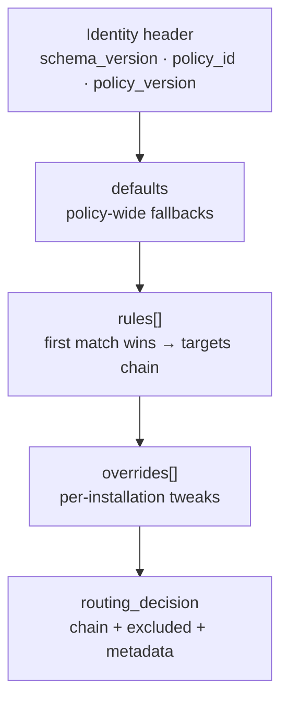

# AI Platform Data Journey — Stage 5 — Routing policy (D1 index + R2 document)

## Table of Contents

1. [Plain language](#1-plain-language)
2. [Metaphor](#2-metaphor)
3. [Manifest link](#3-manifest-link)
   - [Field presence key](#31-field-presence-key)
   - [Routing inputs — manifest → router](#32-routing-inputs-manifest-router)
   - [Complete specimen (visit summary)](#33-complete-specimen-visit-summary)
   - [Field-by-field reference — every group](#34-field-by-field-reference-every-group)
      - [`Identity`](#341-identity)
      - [`Access`](#342-access)
      - [`Interaction`](#343-interaction)
      - [`Input`](#344-input)
      - [`Context requirements`](#345-context-requirements)
      - [`Prompt binding`](#346-prompt-binding)
      - [`Output`](#347-output)
      - [`Routing`](#348-routing)
      - [`Economics`](#349-economics)
      - [`Governance`](#3410-governance)
   - [How manifest floors meet R2 `requires`](#35-how-manifest-floors-meet-r2-requires)
4. [R2 document — every field](#4-r2-document-every-field)
   - [R2 object key](#41-r2-object-key)
   - [Complete document specimen](#42-complete-document-specimen)
   - [Document overview — what each block is for](#43-document-overview-what-each-block-is-for)
   - [Field-by-field reference](#44-field-by-field-reference)
      - [Identity header](#441-identity-header)
      - [`defaults` — policy-wide fallbacks](#442-defaults-policy-wide-fallbacks)
      - [`rules[]` — ordered routing rules](#443-rules-ordered-routing-rules)
         - [`rules[].match` — request filters](#4431-rulesmatch-request-filters)
         - [`rules[].requires` — capability requirement floor](#4432-rulesrequires-capability-requirement-floor)
         - [`rules[].targets[]` — one provider/model candidate](#4433-rulestargets-one-providermodel-candidate)
         - [`targets[].features` — target capability advertisement](#4434-targetsfeatures-target-capability-advertisement)
      - [`overrides[]` — per-installation exceptions](#444-overrides-per-installation-exceptions)
   - [Hardcoded, ignored, and wiring gaps](#45-hardcoded-ignored-and-wiring-gaps)
5. [D1 `routing_policy` row — every column](#5-d1-routing_policy-row-every-column)
6. [Control endpoints](#6-control-endpoints)
   - [Publish: `POST /control/routing-policies/{policyId}/versions/{version}/publish`](#61-publish-post-controlrouting-policiespolicyidversionsversionpublish)
   - [Canary: `POST …/canary`](#62-canary-post-canary)
   - [Promote: `POST …/promote`](#63-promote-post-promote)
   - [Rollback: `POST …/rollback`](#64-rollback-post-rollback)
7. [Router output (`RoutingDecision`) — every field](#7-router-output-routingdecision-every-field)
8. [Routing failure paths (post-accept)](#8-routing-failure-paths-post-accept)

---

## 1. Plain language

Routing decides **which AI provider and model** handle a request. Three artifacts link together:

1. **Capability manifest** (bundled in the Worker) — each capability declares a `routingPolicyRef` (e.g. `routing/standard@v1`) plus request-side needs (languages, latency class, token ceiling).
2. **D1 `routing_policy` row** — resolves that ref to an active version and an R2 `content_pointer`; tracks lifecycle (published, canary, active, superseded).
3. **R2 routing policy document** — the full playbook at that pointer: ordered `rules[]` with `match` clauses and provider `targets`.

At invoke time the router parses the manifest ref → loads the document via D1 + config cache → walks `rules[]` top to bottom until the first `match` passes (including `capability_ids`, tier, language, and other filters) → merges manifest requirements with the matched rule → applies installation `overrides` → emits the final target chain. The manifest picks **which playbook**; D1 picks **which version**; R2 defines **which providers to try**.

## 2. Metaphor

**Air traffic control playbook** in the warehouse (R2). The filing cabinet (D1) holds the index card saying "playbook standard v1 is active."

## 3. Manifest link

The capability manifest is bundled JSON deployed with the Worker (`ai-platform/manifests/published/`). It is **not** in D1 or R2. The loader (`ai-platform/src/manifest/index.ts`, [../01-ai-platform.md §5.1](../01-ai-platform.md#51-capability-manifest) ten field groups) validates shape at build time; the invoke path resolves `capability_id@version` from the registry and reads the frozen object in memory.

**Routing role:** the manifest supplies (a) **`routingPolicyRef`** → which R2 playbook to load via D1, and (b) **requirement floors** merged with the matched rule's `requires` before target filtering. Other groups govern entitlement, context, prompts, and economics — not rule selection itself.

### 3.1 Field presence key

| Symbol | Meaning |
| ------ | ------- |
| **group required** | Top-level group must exist in JSON |
| **field required** | Key must appear in the group object |
| **field optional** | Key may be omitted; loader applies a default |
| **nullable** | Key required; value may be `null` |
| **routing: ref** | Feeds policy lookup (`routingPolicyRef` → D1 → R2) |
| **routing: match** | Feeds `rules[].match.*` comparison via `RouterContext` |
| **routing: floor** | Merged with `rules[].requires`; filters `targets[]` |
| **routing: cost** | Input to `effective_cost_class` (partially wired — see [§4.5](#45-hardcoded-ignored-and-wiring-gaps)) |
| **not routing** | Consumed in earlier/later pipeline stages only |

### 3.2 Routing inputs — manifest → router

| Router input | Manifest source | Routing stage use |
| ------------ | ----------------- | ----------------- |
| `capabilityId` | `Identity.capabilityId` | `match.capability_ids` |
| `installationId` | *(AAT — not manifest)* | `match.installation_ids` |
| `routingTier` | *(quota/admission — not manifest)* | `match.tiers` |
| `requirements.structured_output_required` | `Output.mode` (`!== "prose"`) | target feature filter |
| `requirements.min_context_window` | `Routing.requiredProviderFeatures.contextWindow` | target feature filter |
| `requirements.languages` | `Routing.requiredProviderFeatures.language` | `match.languages` + target filter |
| `requirements.latency_class` | `Routing.latencyClass` | `match.latency_classes` + target filter |
| `manifestCostClass` | architectural cost ceiling *(not a separate published key today; hardcoded in invoke path)* | `match.cost_classes` + target filter |
| `policyCacheKey` | `Routing.routingPolicyRef` | D1 preload → R2 document |

`routingPolicyRef` format: `routing/{policy_id}@v{version}` → parsed to D1 lookup `policy_id` + `version` (e.g. `routing/standard@v1` → `standard`, `1`).

### 3.3 Complete specimen (visit summary)

Checked-in file: `ai-platform/manifests/published/clinic.visit_summary@1.0.0.json`.

```json
{
  "Identity": {
    "capabilityId": "clinic.visit_summary",
    "version": "1.0.0",
    "title": "Visit summary",
    "lifecycleState": "active",
    "successorId": null
  },
  "Access": {
    "requiredCapabilityScope": "ai.visit_summary",
    "minimumPlanTier": "standard",
    "allowedStaffRoles": ["clinician", "nurse"],
    "killSwitchFlag": false
  },
  "Interaction": {
    "interactionMode": "single_shot"
  },
  "Input": {
    "userIntentShape": "plain_text",
    "priorTurnShape": null,
    "sizeLimits": { "maxChars": 8000 },
    "allowedLanguages": ["en"]
  },
  "Context requirements": [
    {
      "key": "visit.chief_complaint@v1",
      "required": true,
      "shapeRef": "visit.chief_complaint@v1",
      "maxSize": 4096
    }
  ],
  "Prompt binding": {
    "systemInstructionArtifactRef": "clinic.visit_summary/system@v1",
    "businessRuleFragmentRefs": ["clinic.visit_summary/rules-visit-summary@v1"],
    "contextRenderingTemplateRef": "clinic.visit_summary/template-visit-summary@v1",
    "outputFormatInstructionDerivationRule": "derive_from_output_mode"
  },
  "Output": {
    "mode": "prose",
    "outputSchemaRef": null,
    "businessValidationRuleRefs": [],
    "repairPolicy": { "allowed": false, "maxAttempts": 0 }
  },
  "Routing": {
    "routingPolicyRef": "routing/standard@v1",
    "requiredProviderFeatures": {
      "structuredOutput": false,
      "contextWindow": 32000,
      "language": "en"
    },
    "latencyClass": "standard",
    "degradedTierPolicy": "fallback_chain"
  },
  "Economics": {
    "maxInputTokens": 8000,
    "maxOutputTokens": 1024,
    "perRequestTokenCeiling": 9024,
    "quotaWeight": 1
  },
  "Governance": {
    "acceptanceMode": "advisory_display",
    "retentionClass": "diagnostic_30d",
    "evalSuiteRef": "evals/visit-summary@v1"
  }
}
```

### 3.4 Field-by-field reference — every group

All ten groups are **group required**. Keys marked **field required** must appear exactly once per group (no extra keys). Enum values enforced at load time are noted.

#### 3.4.1 `Identity`

| Field | Presence | Type | Meaning | Routing |
| ----- | -------- | ---- | ------- | ------- |
| `capabilityId` | field required | `string` | Stable capability name (wire `capability_id` must resolve here) | **routing: match** → `match.capability_ids` |
| `version` | field required | `string` | Semver of this manifest revision | not routing (registry lookup key) |
| `title` | field required | `string` | Human label for ops/discovery | not routing |
| `lifecycleState` | field required | `active` \| `deprecated` \| `retired` | Whether invoke is allowed | not routing (capability resolve gate) |
| `successorId` | field required, **nullable** | `string` \| `null` | Replacement capability when deprecated/retired | not routing |

#### 3.4.2 `Access`

| Field | Presence | Type | Meaning | Routing |
| ----- | -------- | ---- | ------- | ------- |
| `requiredCapabilityScope` | field required | `string` | Staff scope token required on AAT | not routing (enforced at capability resolve / guard stage 5) |
| `minimumPlanTier` | field required | `string` | Lowest plan that may invoke | not routing (entitlement gate) |
| `allowedStaffRoles` | field required | `string[]` | Roles permitted; enforced at capability resolve / guard stage 5 when non-empty | not routing |
| `killSwitchFlag` | field required | `boolean` | Capability-level kill; `=== true` at capability resolve / guard stage 5 → `capability_disabled` | not routing |

#### 3.4.3 `Interaction`

| Field | Presence | Type | Meaning | Routing |
| ----- | -------- | ---- | ------- | ------- |
| `interactionMode` | **field optional** (default `single_shot`) | `single_shot` \| `conversational` | Single request vs multi-turn transcript | not routing |
| `maxHistoryTurns` | field required **when conversational** | positive `integer` | Turn budget | not routing |
| `maxContextRoundsPerTurn` | field required **when conversational** | positive `integer` | Context rounds per turn | not routing |
| `transcriptSizeLimit` | field required **when conversational** | positive `integer` | Max transcript bytes | not routing |

#### 3.4.4 `Input`

| Field | Presence | Type | Meaning | Routing |
| ----- | -------- | ---- | ------- | ------- |
| `userIntentShape` | field required | `string` | Expected shape of `userIntent` on wire | not routing |
| `priorTurnShape` | field required, **nullable** | `string` \| `null` | Prior-turn shape for conversational mode | not routing |
| `sizeLimits` | field required | object | e.g. `{ "maxChars": 8000 }` ingress cap | not routing |
| `allowedLanguages` | field required | `string[]` | Languages the capability accepts from clients | not routing (distinct from routing `requiredProviderFeatures.language`) |

#### 3.4.5 `Context requirements`

Shape depends on `interactionMode`:

| Mode | Shape | Presence |
| ---- | ----- | -------- |
| `single_shot` | `array` of entries | **group required**; array may be empty |
| `conversational` | `{ "permittedKeySet": string[] }` | **group required**; `permittedKeySet` may be `[]` |

Entry fields (single-shot array items):

| Field | Presence | Type | Meaning | Routing |
| ----- | -------- | ---- | ------- | ------- |
| `key` | field required | `string` | A5 context key id | not routing |
| `required` | field required | `boolean` | Must appear in invoke `context` | not routing |
| `shapeRef` | field required | `string` | Validator shape reference | not routing |
| `maxSize` | field required | number | Max serialized bytes for key | not routing |

**Schema note:** there is no `freshnessHint`. The loader rejects it as an extra key. Stale context is accepted by design (architecture §6.7.3); containment is the journal of exact context plus the advisory-output rule, not a per-key freshness gate.

#### 3.4.6 `Prompt binding`

| Field | Presence | Type | Meaning | Routing |
| ----- | -------- | ---- | ------- | ------- |
| `systemInstructionArtifactRef` | field required | `string` | Prompt artifact ref | not routing (compose stage) |
| `businessRuleFragmentRefs` | field required | `string[]` | Rule fragment refs | not routing |
| `contextRenderingTemplateRef` | field required | `string` | Template ref for context render | not routing |
| `outputFormatInstructionDerivationRule` | field required | `string` | How to derive format instructions | not routing |

#### 3.4.7 `Output`

| Field | Presence | Type | Meaning | Routing |
| ----- | -------- | ---- | ------- | ------- |
| `mode` | field required | `prose` \| `structured` \| `structured_atomic` | Response shape contract | **routing: floor** → `structured_output_required` when not `prose` |
| `outputSchemaRef` | field required, **nullable** | `string` \| `null` | JSON schema ref when structured | not routing |
| `businessValidationRuleRefs` | field required | `string[]` | Post-generation validation refs | not routing |
| `repairPolicy` | field required | object | `{ allowed, maxAttempts }` repair loop policy | not routing |

> **`requiredProviderFeatures.structuredOutput`** is declared in `Routing` but the invoke router derives structured-output demand from **`Output.mode`**, not that flag (see `worker.ts`).

#### 3.4.8 `Routing`

| Field | Presence | Type | Meaning | Routing |
| ----- | -------- | ---- | ------- | ------- |
| `routingPolicyRef` | field required | `string` | Pointer to R2 playbook via D1 (`routing/{id}@v{n}`) | **routing: ref** |
| `requiredProviderFeatures` | field required | object | Minimum provider capability floor from the capability side | **routing: floor** (see nested table) |
| `latencyClass` | field required | `string` | Expected latency tier (e.g. `"interactive"`, `"standard"`) | **routing: match** + **routing: floor** |
| `degradedTierPolicy` | field required | `string` | Policy when `routingTier === "degraded"` (e.g. `fallback_chain`) | not routing today (schema only) |

Nested **`requiredProviderFeatures`** (conventional keys; loader does not enforce exact nested keys beyond forbidding provider/model names):

| Field | Presence | Type | Meaning | Routing |
| ----- | -------- | ---- | ------- | ------- |
| `structuredOutput` | conventional | `boolean` | Documented provider need for JSON/structured output | **not read at invoke** — use `Output.mode` |
| `contextWindow` | conventional | `integer` | Minimum context window in tokens | **routing: floor** → merged with `rules[].requires.min_context_window` |
| `language` | conventional | `string` | Primary language the capability requires | **routing: match** + **routing: floor** → `requirements.languages` |

#### 3.4.9 `Economics`

| Field | Presence | Type | Meaning | Routing |
| ----- | -------- | ---- | ------- | ------- |
| `maxInputTokens` | field required | number | Token budget for input side | not routing (token pre-flight) |
| `maxOutputTokens` | field required | number | Token budget for output side | not routing |
| `perRequestTokenCeiling` | field required | number | Combined **token** ceiling per request: `estimatedInputTokens + maxOutputTokens` must not exceed it. Token-denominated; the preflight never converts to currency (§13.6.2). | **routing: cost** (architectural; maps to cost class when wired) |
| `quotaWeight` | field required | number | Weight for quota/admission accounting | not routing |

**Schema note:** the canonical Economics field is `perRequestTokenCeiling`. Previously published manifests used `perRequestCostCeiling` for the same token comparison. The loader (`ai-platform/src/manifest/index.ts`) still accepts that legacy key as a compatibility alias and normalizes it to `perRequestTokenCeiling`. Capability manifests do not carry a numeric `schema_version` header; this is a field-name revision of the Economics group. Public name going forward is tokens, not cost.

#### 3.4.10 `Governance`

| Field | Presence | Type | Meaning | Routing |
| ----- | -------- | ---- | ------- | ------- |
| `acceptanceMode` | field required | `advisory_display` \| `human_accept_required` \| `auto_apply` | How clinic staff must treat AI output | not routing |
| `retentionClass` | field required | `diagnostic_Nd` (`N` = 1–90) | Journal retention horizon | not routing |
| `evalSuiteRef` | field required | `string` | Eval harness reference | not routing |

### 3.5 How manifest floors meet R2 `requires`

After rule selection, the router calls `mergeRequirementFloors(manifest requirements, matchedRule.requires)`:

| Dimension | Merge rule |
| --------- | ---------- |
| `structured_output_required` | OR — either manifest (`Output.mode`) or rule `requires.structured_output` forces structured output |
| `min_context_window` | `Math.max(manifest contextWindow, rule requires.min_context_window)` |
| `languages` | **Union** — rule can add languages, not remove manifest ones |
| `latency_class` | From manifest only; compared to each target's `features.latency_class` |

See [§4.4](#44-field-by-field-reference) `rules[].requires` and [§4.5](#45-hardcoded-ignored-and-wiring-gaps) for remaining wiring gaps (`manifestCostClass`, entitlement cap). `routingTier` is live: invoke uses `routingTierFromAdmission` so `match.tiers` agrees with the journaled `ai_request.routing_tier`.

## 4. R2 document — every field

Canonical types: `ai-platform/src/router/index.ts` (`RoutingPolicyDocument`, lines 101–161).
Frozen contract: `specs/029-provider-port-routing/contracts/routing-decision.md` §2.

### 4.1 R2 object key

**Key:** `control/routing-policy/{policy_id}/{version}.json`

Written once at publish (`control/routing-policy.ts`); the D1 `routing_policy.content_pointer`
column stores this key. The config cache loads the JSON at preload time and attaches it as
`row.document` — the router never reads R2 on the hot path.

### 4.2 Complete document specimen

The specimen below shows **every field the router understands**, including every optional key
and schema-retained keys (`defaults.cost_class`, `defaults.max_parallel_attempts`,
`rules[].max_parallel_attempts`) that existing R2 documents still carry but the router ignores.
Placeholders in angle brackets must be replaced with real values. In production you normally use
**one** override mechanism per installation (not all three at once); the specimen stacks them so
nothing is hidden. `"interactive"` in `match.latency_classes` and target `features.latency_class`
is an **illustrative** example, not the checked-in production fixture (that fixture uses `"standard"`).

```json
{
  "schema_version": 1,
  "policy_id": "standard",
  "policy_version": 1,
  "defaults": {
    "cost_class": "standard",
    "max_parallel_attempts": 1
  },
  "rules": [
    {
      "rule_id": "visit-summary-standard",
      "match": {
        "capability_ids": ["clinic.visit_summary"],
        "installation_ids": ["<installation-uuid>"],
        "cost_classes": ["standard", "premium"],
        "tiers": ["standard", "degraded"],
        "languages": ["en"],
        "latency_classes": ["interactive"]
      },
      "requires": {
        "structured_output": false,
        "min_context_window": 32000,
        "languages": ["en"]
      },
      "targets": [
        {
          "provider_id": "deepseek",
          "model_id": "deepseek-v4-flash",
          "features": {
            "structured_output": true,
            "min_context_window": 128000,
            "languages": ["en"],
            "latency_class": "interactive",
            "cost_class": "standard"
          },
          "max_attempts": 2,
          "timeout_ms": 30000
        }
      ],
      "max_parallel_attempts": 1
    },
    {
      "rule_id": "catch-all",
      "match": {
        "capability_ids": [],
        "installation_ids": [],
        "cost_classes": [],
        "tiers": [],
        "languages": [],
        "latency_classes": []
      },
      "requires": {
        "structured_output": false,
        "min_context_window": 0,
        "languages": []
      },
      "targets": [
        {
          "provider_id": "deepseek",
          "model_id": "deepseek-v4-flash",
          "features": {
            "structured_output": true,
            "min_context_window": 128000,
            "languages": ["en"],
            "latency_class": "interactive",
            "cost_class": "standard"
          },
          "max_attempts": 2,
          "timeout_ms": 30000
        },
        {
          "provider_id": "gemini",
          "model_id": "gemini-3.5-flash",
          "features": {
            "structured_output": true,
            "min_context_window": 128000,
            "languages": ["en"],
            "latency_class": "interactive",
            "cost_class": "standard"
          },
          "max_attempts": 2,
          "timeout_ms": 30000
        }
      ],
      "max_parallel_attempts": 1
    }
  ],
  "overrides": [
    {
      "installation_id": "<installation-uuid>",
      "exclude_providers": ["gemini"],
      "pin_target": {
        "provider_id": "deepseek",
        "model_id": "deepseek-v4-flash"
      },
      "force_cost_class": "economy"
    }
  ]
}
```

**Field presence key**

| Symbol | Meaning |
| ------ | ------- |
| always present | Key must appear in every published document; router reads it |
| optional key | May be omitted; router treats omission as wildcard or fallback |
| schema-retained | Must be present in JSON but router ignores the value at runtime |

| Path | Presence |
| ---- | -------- |
| `schema_version` | always present |
| `policy_id` | always present |
| `policy_version` | always present |
| `defaults` | always present |
| `defaults.cost_class` | schema-retained |
| `defaults.max_parallel_attempts` | schema-retained |
| `rules` | always present (non-empty) |
| `rules[].rule_id` | always present |
| `rules[].match` | always present (may be `{}`) |
| `rules[].match.capability_ids` | optional key |
| `rules[].match.installation_ids` | optional key |
| `rules[].match.cost_classes` | optional key |
| `rules[].match.tiers` | optional key |
| `rules[].match.languages` | optional key |
| `rules[].match.latency_classes` | optional key |
| `rules[].requires` | always present |
| `rules[].requires.structured_output` | always present |
| `rules[].requires.min_context_window` | always present |
| `rules[].requires.languages` | always present |
| `rules[].targets` | always present |
| `rules[].targets[].provider_id` | always present |
| `rules[].targets[].model_id` | always present |
| `rules[].targets[].features` | always present |
| `rules[].targets[].features.structured_output` | always present |
| `rules[].targets[].features.min_context_window` | always present in a well-formed document; missing/non-numeric at request time → `feature_unsupported` |
| `rules[].targets[].features.languages` | always present in a well-formed document; missing/non-array at request time → `feature_unsupported` |
| `rules[].targets[].features.latency_class` | always present |
| `rules[].targets[].features.cost_class` | always present in a well-formed document; missing/unknown at request time → `feature_unsupported` |
| `rules[].targets[].max_attempts` | always present |
| `rules[].targets[].timeout_ms` | always present |
| `rules[].max_parallel_attempts` | schema-retained |
| `overrides` | always present (may be `[]`) |
| `overrides[].installation_id` | always present on each override object |
| `overrides[].exclude_providers` | optional key |
| `overrides[].pin_target` | optional key |
| `overrides[].pin_target.provider_id` | required when `pin_target` is present |
| `overrides[].pin_target.model_id` | required when `pin_target` is present |
| `overrides[].force_cost_class` | optional key |

> **`defaults.cost_class` and `defaults.max_parallel_attempts` — safe to remove.** The router
> never reads either field; deleting them from the TypeScript type, test fixtures, ops seed, and
> docs would not change routing behavior. Existing R2 objects that still include them need no
> migration (extra keys are ignored). A coordinated cleanup is required — not a one-line router
> change. `max_parallel_attempts` is also omitted from `RoutingDecision` and is not persisted.

Checked-in production fixture (catch-all only, no overrides):
`ai-platform/control/routing-policy/platform-default/1.json`.
On-disk directory name is historical; the document identity is `policy_id: "standard"` /
`policy_version: 1`. Both targets advertise `latency_class: "standard"` so they match published
`clinic.visit_summary@1.0.0` (`routingPolicyRef: "routing/standard@v1"`, `latencyClass: "standard"`).
Publish writes R2 at `control/routing-policy/{policyId}/{version}.json` from the URL, not the repo path.

Sibling platform config (not part of this R2 document, never client-visible): the versioned
price table `ai-platform/control/pricing/platform-default/1.json` is bundled into the Worker and
used only after the provider responds. Preflight stays token-only. See [Stage 11](13-stage-11-terminal-settlement.md).

### 4.3 Document overview — what each block is for

Think of the document as a **playbook the router reads top to bottom once per request**. It does not
call providers; it produces a `routing_decision` — an ordered chain of provider+model targets plus an
audit trail of exclusions. The large picture has four layers:



| Block | One-line responsibility | Router step |
| ----- | ----------------------- | ----------- |
| **Identity header** (`schema_version`, `policy_id`, `policy_version`) | Proves this JSON is the playbook the D1 row points at | `validatePolicyDocument` — reject wrong format or identity mismatch |
| **`defaults`** | Schema-retained placeholders (`cost_class`, `max_parallel_attempts`) | **Ignored at runtime** — neither field is read |
| **`rules[]`** | The routing logic: *when* (match) → *minimum needs* (requires) → *try these providers in order* (targets) | `.find()` first matching rule; last rule must be catch-all |
| **`overrides[]`** | Per-clinic exceptions after a rule is chosen | Narrow the matched rule's target list; optionally cap cost class |

**How a request walks the document** (implemented in `selectCandidateChain`, `router/index.ts`):

1. Load document from config cache (preloaded from D1 `content_pointer` → R2).
2. Validate identity and catch-all invariant.
3. Find `overrides[]` entry for this `installation_id` (if any).
4. Compute **effective cost class** from manifest ceiling + entitlement cap + optional `force_cost_class` (not from `defaults.cost_class`).
5. Walk `rules[]` in order; first rule whose `match` passes is selected.
6. Apply installation override (`exclude_providers`, `pin_target`) to that rule's `targets`.
7. Merge `requires` with manifest requirements; filter targets by features, kill switches, and cost class. Active `provider:<id>` kill switches arrive as `RouterContext.killedProviderIds` (collected at guard stage 5 from the policy's named providers). Those targets are excluded with `reason_code: kill_switch`; remaining targets stay in document order so traffic fails over. A provider kill switch does not 503 the capability.
8. Emit `routing_decision` with chain ordinals and exclusions (no `max_parallel_attempts`). Persist that JSON onto the existing `ai_request` row (`persistRoutingDecision`) so support can answer "why did this request go to model X?" from the ledger.

The manifest supplies the **request-side** inputs (`capabilityId`, `routingTier`, language, context
window, latency class). The document supplies the **provider-side** chain. Neither names the other
directly — the router joins them at runtime.

### 4.4 Field-by-field reference

Each field below states what it holds, how the router uses it, and how it fits the large picture.

#### 4.4.1 Identity header

| Field | Type | Role in the large picture |
| ----- | ---- | ------------------------- |
| `schema_version` | `integer` | Document **format** version (today only `1` is accepted). Independent of `policy_version` — you can publish policy v2 that still uses schema v1. Rejected with `unsupported_schema_version` if unknown. |
| `policy_id` | `string` | Short playbook name (e.g. `standard`). Must equal the D1 `routing_policy.policy_id` row and the manifest ref (`routing/standard@v1` → `standard`). Mismatch → `policy_identity_mismatch`. |
| `policy_version` | `integer` | Integer playbook revision (e.g. `1` from `@v1`). Must equal D1 `routing_policy.version`. Enables rollback by activating a different row without editing R2. |

#### 4.4.2 `defaults` — policy-wide fallbacks

| Field | Type | Role in the large picture |
| ----- | ---- | ------------------------- |
| `defaults.cost_class` | `economy` \| `standard` \| `premium` | **Schema-retained only** — present for [§4.3.7](../01-ai-platform.md#437-provider-router-and-policy-engine) table parity. `resolveEffectiveCostClass` never reads it. See [§4.5](#45-hardcoded-ignored-and-wiring-gaps). |
| `defaults.max_parallel_attempts` | `integer` | **Schema-retained only** — ignored. Invocation walks `chain[]` sequentially; parallel racing is not implemented (token spend is the dominant cost, [§13.6](../01-ai-platform.md#136-cost-and-performance-budget)). Not copied onto `routing_decision`. |

#### 4.4.3 `rules[]` — ordered routing rules

The array is evaluated **top to bottom**; the first matching rule wins. The **last** rule must be
a catch-all (empty `match` or all match lists empty/absent) — enforced at router time
(`missing_catch_all`).

| Field | Type | Role in the large picture |
| ----- | ---- | ------------------------- |
| `rules[].rule_id` | `string` | Stable ops label (e.g. `catch-all`). Copied to `routing_decision.rule_id` and persisted on `ai_request.routing_decision` so support can answer "which rule fired?" Uniqueness is not enforced at runtime. |
| `rules[].match` | object | **When** this rule applies. See match clauses below. Empty object `{}` = wildcard (matches any request). |
| `rules[].requires` | object | **Minimum capability floor** merged with manifest requirements before target filtering. See requires fields below. |
| `rules[].targets` | array | **Ordered fallback chain** for this rule. Invocation walks ordinals **sequentially** until success or exhaustion. May be empty after filtering → `provider_unavailable`. |
| `rules[].max_parallel_attempts` | `integer`, optional | **Schema-retained only** — ignored. Omitted or present, the walk stays sequential. Not copied onto `routing_decision`. |

##### 4.4.3.1 `rules[].match` — request filters

All six clause keys are **optional**. Omitted key, empty array `[]`, or absent clause = wildcard for
that dimension. When a clause is **non-empty**, the request must satisfy it.

| Field | Type | Role in the large picture |
| ----- | ---- | ------------------------- |
| `match.capability_ids` | `string[]`, optional | Allow-list of capability ids (e.g. `clinic.visit_summary`). Request `capabilityId` must be in the list. Wildcard when omitted/`[]`. |
| `match.installation_ids` | `string[]`, optional | Allow-list of clinic installation UUIDs. Request `installationId` must be in the list. Enables per-clinic routing rules without a separate document. |
| `match.cost_classes` | `CostClass[]`, optional | Allow-list of **effective** cost classes (computed before rule matching). Lets you write different target chains for economy vs premium effective tiers. |
| `match.tiers` | `"standard"` \| `"degraded"`[], optional | Allow-list of routing tiers. `degraded` is set server-side when quota soft threshold is crossed — never sent by the client (ingress ignores `routing_tier` / `degraded` / `degraded_notice` body keys via empty `ADAPTER_ROUTING_BODY_FIELDS`). Enables separate degraded-tier chains (see soft-threshold tests). |
| `match.languages` | `string[]`, optional | Allow-list tested against manifest languages. Request must need **every** language in the rule's list (subset check via `matchAllLanguages`). |
| `match.latency_classes` | `string[]`, optional | Allow-list of latency classes. Compared to manifest `Routing.latencyClass` (e.g. `"interactive"`). |

##### 4.4.3.2 `rules[].requires` — capability requirement floor

Merged with manifest `requiredProviderFeatures` via `mergeRequirementFloors`. The stricter value
wins on each axis; languages are **unioned** (rule can only add languages, not remove manifest ones).

| Field | Type | Role in the large picture |
| ----- | ---- | ------------------------- |
| `requires.structured_output` | `boolean` | If `true`, only targets with `features.structured_output: true` survive filtering. OR-merged with manifest: either side `true` forces structured output. |
| `requires.min_context_window` | `integer` | Minimum context window in tokens. `Math.max` with manifest `contextWindow`. Targets below this are excluded (`context_window_too_small`). `0` = no extra floor from this rule. |
| `requires.languages` | `string[]` | Extra languages unioned into the required set. `[]` = rule adds none. Targets must support every merged language (`language_unsupported` if not). |

##### 4.4.3.3 `rules[].targets[]` — one provider/model candidate

Each entry is one step in the fallback chain. The capability layer also reads `provider_id` from all
targets to resolve wired providers (`capability/index.ts`); other target fields are ignored there.

| Field | Type | Role in the large picture |
| ----- | ---- | ------------------------- |
| `targets[].provider_id` | `string` | Provider adapter id wired in the Worker (`deepseek`, `gemini`, …). Kill-switch rows keyed `provider:{id}` can exclude this target at runtime. |
| `targets[].model_id` | `string` | **Pinned** model version (contract R-4 — never a floating alias). Passed through to `chain[].model_id` and `ai_attempt`. |
| `targets[].features` | object | What this target **claims** it can do — compared against merged requirements. See features below. |
| `targets[].max_attempts` | `integer` | Max retries for **this** target before advancing to the next chain ordinal. Passed to invocation as `chain[].max_attempts`. |
| `targets[].timeout_ms` | `integer` | Per-attempt timeout in milliseconds for this target. Passed to invocation as `chain[].timeout_ms`. |

##### 4.4.3.4 `targets[].features` — target capability advertisement

| Field | Type | Role in the large picture |
| ----- | ---- | ------------------------- |
| `features.structured_output` | `boolean` | Whether this model supports structured/JSON output. Excluded with `feature_unsupported` when merged requirements demand structured output. |
| `features.min_context_window` | `integer` | Largest context window this model claims. Must be a finite number ≥ merged `min_context_window` or excluded (`context_window_too_small`). Missing or non-numeric → `feature_unsupported` (fail closed). |
| `features.languages` | `string[]` | Languages this target supports. Must be an array that includes **every** merged required language (`language_unsupported` if not). Missing or non-array → `feature_unsupported` (fail closed; does not throw). |
| `features.latency_class` | `string` | Must **equal** manifest `latency_class` exactly. Mismatch or missing → `feature_unsupported` (no distinct latency `reason_code` in the frozen enum). |
| `features.cost_class` | `economy` \| `standard` \| `premium` | Target's price tier. A known class **higher** than `effective_cost_class` is excluded (`cost_class_excluded`). Missing or unknown (e.g. typo `"standrd"`) → `feature_unsupported` (fail closed). Order: economy < standard < premium. |

**Malformed target features fail closed.** Publish still does not fully validate target shape ([§4.5](#45-hardcoded-ignored-and-wiring-gaps)); `filterTargets` is the request-path defense. A missing or unknown `min_context_window`, `cost_class`, or `languages` excludes **that** target with `feature_unsupported`. A well-formed sibling stays in the chain. Declared-but-insufficient values keep their distinct codes (`context_window_too_small`, `language_unsupported`, `cost_class_excluded`). Latency already compared with exact `!==`.

#### 4.4.4 `overrides[]` — per-installation exceptions

Matched by `installation_id` on the request. Applied **after** rule selection, **before** feature
filtering. An override may **narrow** the chain but never widen it beyond the matched rule's targets.

| Field | Type | Role in the large picture |
| ----- | ---- | ------------------------- |
| `overrides[].installation_id` | `string` (UUID) | Which clinic this override applies to. Only the first matching entry is used (`.find()`). |
| `overrides[].exclude_providers` | `string[]`, optional | Drop targets whose `provider_id` is listed. Recorded as `installation_excluded`. Omitted = no exclusions. |
| `overrides[].pin_target` | object, optional | Keep exactly one `{ provider_id, model_id }`; all other targets in the rule are `installation_excluded`. If the pin is not in the rule's chain, the chain becomes empty. |
| `overrides[].pin_target.provider_id` | `string` | Required when `pin_target` is present. |
| `overrides[].pin_target.model_id` | `string` | Required when `pin_target` is present. |
| `overrides[].force_cost_class` | `CostClass`, optional | Third input to effective cost-class minimum (with manifest ceiling and entitlement cap). Recorded as `cost_class_source: installation_override` when it binds. |

**Cost class — three names, three roles**

`cost_class` appears in three places; only two participate in routing:

| Where | Used? | Role |
| ----- | ----- | ---- |
| `defaults.cost_class` | **No** | Schema placeholder; see [§4.5](#45-hardcoded-ignored-and-wiring-gaps) |
| `rules[].match.cost_classes` | **Yes** | Rule filter on effective cost class |
| `targets[].features.cost_class` | **Yes** | Per-model tier; a known class above the effective ceiling is `cost_class_excluded`; missing/unknown is `feature_unsupported` |

Effective cost class = **minimum** of manifest ceiling, entitlement cap, and optional
`force_cost_class`. Client never sends cost class ([§3.4](#34-field-by-field-reference-every-group) three seams).

**Worked example:** manifest `standard`, entitlement `premium`, no override → effective =
`standard`. Targets tagged `economy` or `standard` stay; `premium` targets get
`cost_class_excluded`. Override `force_cost_class: "economy"` → only economy targets remain.

### 4.5 Hardcoded, ignored, and wiring gaps

Fields and behaviours that exist in the schema or architecture but are not fully wired today.
**Action needed** marks gaps that should be closed for production fidelity.

| Item | Status | Why | Action needed |
| ---- | ------ | --- | ------------- |
| `defaults.cost_class` | **Ignored at runtime** | Retained for [§4.3.7](../01-ai-platform.md#437-provider-router-and-policy-engine) document-shape parity; `resolveEffectiveCostClass` reads only the three-source minimum | None — intentional. Do not rely on this field for routing. |
| `defaults.max_parallel_attempts` / `rules[].max_parallel_attempts` | **Ignored at runtime** | Parallel racing is not implemented; `runInvocation` walks `chain[]` sequentially. The field is not on `RoutingDecision` and is not persisted | None — intentional. Do not rely on this field. |
| `manifestCostClass` in `worker.ts` | **Hardcoded `"standard"`** | Manifest Routing group has a cost-class field in architecture ([§4.3.7](../01-ai-platform.md#437-provider-router-and-policy-engine)) but invoke path does not load it yet | **Yes** — wire from `manifest.Routing` cost class |
| `entitlementMaxCostClass` in `worker.ts` | **Hardcoded `"premium"`** | Entitlement `max_cost_class` is architectural ([§4.3.7](../01-ai-platform.md#437-provider-router-and-policy-engine)) but not a D1 column today | **Yes** — load from entitlement row when column exists |
| `routingTier` in `worker.ts` | **From admission** | `runFreshEventSource` passes `routingTierFromAdmission(...)` (soft threshold `degraded: true`, or grace) into `selectCandidateChain` — same value the guard journals as `ai_request.routing_tier` | None — closed |
| `routing_decision.required_features` | **Request requirements only** | `selectCandidateChain` sets this to `context.requirements`, not the merged rule floor — filtering uses merged floor but journal shows manifest-only | Optional — journal accuracy improvement |
| Latency mismatch `reason_code` | **Mapped to `feature_unsupported`** | Frozen enum has no `latency_unsupported` code (`router/index.ts` `filterTargets`) | None unless contract is extended |
| Malformed target feature fields | **Fail closed at `filterTargets`** | Missing/unknown `min_context_window`, `cost_class`, or `languages` → `feature_unsupported`; languages is `Array.isArray`-guarded so a missing array does not throw | None — request-path defense; publish-time target-shape check remains the in-depth layer |
| Publish-time validation | **Identity + latency warning** | `handleRoutingPolicyPublish` rejects URL/document identity mismatch; warns (200 `warnings`) when no target `latency_class` matches a published capability that references this policy. Catch-all and target shape are still not checked. | **Partial** — catch-all and target shape still unvalidated |
| `policy_id` / `policy_version` vs URL at publish | **Rejected (400)** | `document.policy_id` must equal URL `{policyId}`; `document.policy_version` (number) must equal URL `{version}` (string `"1"` matches `1`). Checked before R2.put / D1 insert. Code: `policy_identity_mismatch`. | None — closed |
| Extra JSON keys | **Stored, ignored** | R2 body is written as-is; router reads only known fields | None — but avoid relying on unknown keys |
| `rule_id` uniqueness | **Not enforced** | Duplicate ids make journal attribution ambiguous | Ops discipline — consider publish-time check |
| Kill switches | **Not in R2 document** | Live in D1 (`kill_switches`); guard stage 5 collects active `provider:<id>` rows as `killedProviderIds` and the router applies them in `filterTargets`. Capability-level kills (manifest flag, D1 `global` / `capability:` / `installation:`) 503 before routing. Invoke-path routing shares the isolate `ConfigCache`, so `collectKilledProviderIds` `consult` can hit kill-switch entries the guard already loaded (still merged with `RouterContext.killedProviderIds`) | None — isolate cache is a copy of D1, not a second source of truth |


## 5. D1 `routing_policy` row — every column


| Column                    | Example                                          | Meaning                         |
| ------------------------- | ------------------------------------------------ | ------------------------------- |
| `policy_id`               | `standard`                                       | PK part                         |
| `version`                 | `1`                                              | PK part (TEXT). Latest-version reads do **not** `ORDER BY version` — TEXT sorts `"10"` before `"9"`. Control (canary/promote/rollback) and config-cache serving use `ORDER BY active_from DESC, rowid DESC`. |
| `content_pointer`         | `control/routing-policy/standard/1.json`         | R2 key                          |
| `active_from`             | ISO timestamp                                    | When published/activated        |
| `activated_by`            | `platform-operator`                              | `OPERATOR_ID`                   |
| `canary_installation_ids` | `NULL` or JSON array                             | Installations on canary version |
| `status`                  | `published` / `canary` / `active` / `superseded` | Lifecycle                       |


## 6. Control endpoints


### 6.1 Publish: `POST /control/routing-policies/{policyId}/versions/{version}/publish`

**Body:**

```json
{ "document": { /* RoutingPolicyDocument */ } }
```

**Writes:** SELECT existing `(policy_id, version)` first. On a hit, return 409 `already_published` without touching R2 (a duplicate body must not overwrite the published object). Otherwise R2.put, then D1 INSERT `status=published`. The D1 insert + `control_audit` share one `DB.batch`; a UNIQUE/SQLITE_CONSTRAINT race (two concurrent first publishes) is still mapped to 409.

**Validation (before R2/D1 write) and D1 constraint mapping:**

| Result | Body | Trigger |
| ------ | ---- | ------- |
| 400 | `{ "error": "policy_identity_mismatch" }` | `document.policy_id` ≠ URL `{policyId}`, or `document.policy_version` does not match URL `{version}` (`1` matches `"1"`) |
| 409 | `{ "error": "already_published" }` | Same `(policy_id, version)` already exists in D1 (`PRIMARY KEY`); checked before R2.put so a rejected duplicate does not mutate the published object. Concurrent insert races still map UNIQUE/SQLITE_CONSTRAINT to 409. Other D1 errors → 500 `storage_error`. |
| 200 | `{ "warnings": ["latency_class_mismatch"] }` | Identity matches, but no target `latency_class` equals `Routing.latencyClass` of a published capability whose `routingPolicyRef` is `routing/{policyId}@v{version}` |
| 200 | `{}` | Identity matches and latency is aligned, or no published manifest references this policy version |

Catch-all / target shape are still not validated at publish — see [§4.5](#45-hardcoded-ignored-and-wiring-gaps).

### 6.2 Canary: `POST …/canary`

**Body:**

```json
{
  "installation_ids": ["<uuid>"],
  "cohort_name": "optional label"
}
```

**Writes:** D1 UPDATE `status=canary`, `canary_installation_ids`.


| Failure | `error`                     | Trigger                       |
| ------- | --------------------------- | ----------------------------- |
| 400     | `missing_installation_ids`  | Empty array                   |
| 404     | `installation_not_found`    | Id not in `installation`      |
| 409     | `illegal_policy_transition` | e.g. canary on already-active |


### 6.3 Promote: `POST …/promote`

**Body:** none.

**Writes:** Supersede other active/canary; target → `active`. The prior-active row used for `control_audit.before_pointer` is selected with `ORDER BY active_from DESC, rowid DESC` (not TEXT `version`) so a same-second `active_from` tie picks the later-inserted row — lexical `"9" > "10"` would otherwise win.

### 6.4 Rollback: `POST …/rollback`

Reverts canary → published or active → previous superseded. Prior active / prior superseded lookup uses the same `ORDER BY active_from DESC, rowid DESC` tie-break as promote (and as config-cache serving reads), so rollback of an active version resurrects the true latest superseded row when several share an `active_from` timestamp.

## 7. Router output (`RoutingDecision`) — every field

Produced by `selectCandidateChain` after invoke preload. See [§4.5](#45-hardcoded-ignored-and-wiring-gaps) for
fields that are partially hardcoded in `worker.ts` today.


| Field                   | Meaning                                                               |
| ----------------------- | --------------------------------------------------------------------- |
| `policy_id`             | From document                                                         |
| `policy_version`        | From document                                                         |
| `rule_id`               | Matched rule                                                          |
| `effective_cost_class`  | Min of manifest, entitlement cap, override                            |
| `cost_class_source`     | Which input bound the cost (`manifest` / `entitlement_cap` / `installation_override`) |
| `routing_tier`          | `standard` or `degraded` — from request context (`match.tiers` filter); invoke path uses `routingTierFromAdmission` so this matches D1 `ai_request.routing_tier` |
| `required_features`     | Manifest requirements only (not the merged rule floor used for filtering) |
| `chain[]`               | `{ ordinal, provider_id, model_id, max_attempts, timeout_ms }`        |
| `excluded[]`            | `{ provider_id, model_id, reason_code }`                              |


`max_parallel_attempts` is **not** a `RoutingDecision` field. After `selectCandidateChain`, Stage 10 writes this object as JSON onto the existing D1 row (`ai_request.routing_decision`) via `persistRoutingDecision` — one UPDATE, no new tables. Override provenance is visible through `cost_class_source` (`installation_override` when `force_cost_class` binds) and `excluded[].reason_code` (`installation_excluded` for `exclude_providers` / `pin_target`). That JSON is how support answers "why did this request go to model X?" from the ledger.


**Target exclusion** `reason_code` **values:** `kill_switch`, `feature_unsupported`, `context_window_too_small`, `language_unsupported`, `installation_excluded`, `cost_class_excluded`.

## 8. Routing failure paths (post-accept)


| Condition                     | Terminal SSE         | Code                       |
| ----------------------------- | -------------------- | -------------------------- |
| No active/canary policy in D1 | `failed`             | `internal_error`           |
| R2 document missing           | `failed`             | `internal_error`           |
| Policy id/version mismatch    | `RoutingPolicyError` | `policy_identity_mismatch` |
| No matching rule              |                      | `no_matching_rule`         |
| All targets excluded          | `failed`             | `provider_unavailable`     |


Malformed `targets[].features` (missing/unknown `min_context_window`, `cost_class`, or `languages`) exclude that target with `feature_unsupported` rather than routing it or throwing. If that empties the chain, the terminal is `provider_unavailable` — not `internal_error`.

---

