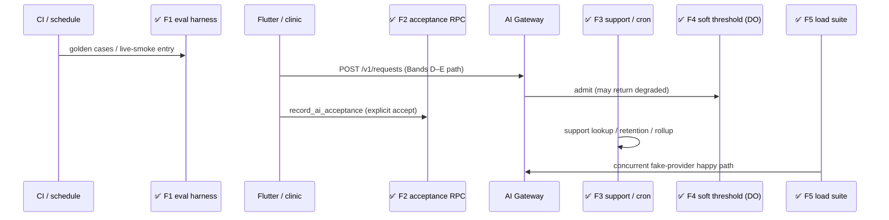
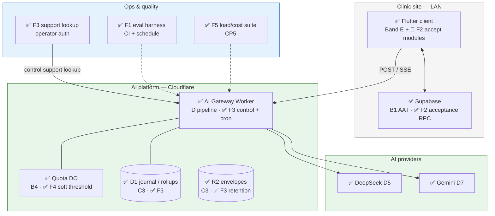
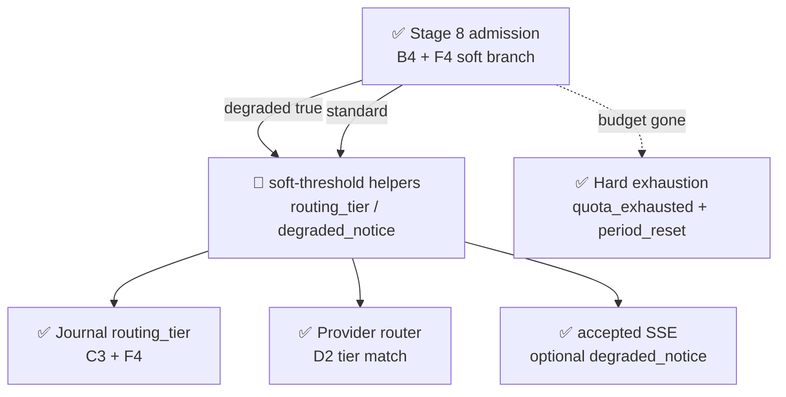

# AI Platform — Band F Implementation Reference

- Purpose: Explain, in plain language, what Band F of the AI platform delivery plan has actually built — for someone who does not know the project or its technologies yet, especially readers who already used [`03-band-c-implementation-reference.md`](03-band-c-implementation-reference.md), [`04-band-d-implementation-reference.md`](04-band-d-implementation-reference.md), and [`05-band-e-implementation-reference.md`](05-band-e-implementation-reference.md).
- Read this when: onboarding after Bands D–E, reviewing eval/acceptance/ops hardening, or preparing for Band H / Band J.
- Canonical for: Band F completion status, where to find the code and tests, and which architecture boxes are now green for hardening and operations.
- Usually paired with: [`01-band-a`](01-band-a-implementation-reference.md) / [`02-band-b`](02-band-b-implementation-reference.md) / [`03-band-c`](03-band-c-implementation-reference.md) (A–C baseline), [`04-band-d`](04-band-d-implementation-reference.md) (inference), [`05-band-e`](05-band-e-implementation-reference.md) (Flutter client), [`../03-ai-platform-delivery-plan.md`](../03-ai-platform-delivery-plan.md) (slice definitions), [`../01-ai-platform.md`](../01-ai-platform.md) (full architecture), [`../04-ai-platform-operator-runbook.md`](../04-ai-platform-operator-runbook.md) (operator procedures).
- Not covered here: conversational mode (Band H), staged rollout / self-heal (Band J), or review-comment follow-ups after tip `9084b9d7`.

> **Status:** Band F (slices **F1–F5**) is **complete** on tip `9084b9d7` (2026-08-02) — end of Band F before later review-comment commits. Automated evidence: **45 Band F Worker Vitest tests** — **9** (F1 eval, default pool) + **20** (F3) + **7** (F4) + **9** (F5 load) — plus **7 Flutter** and **9 SQL assertions** (F2). Combined Worker suites at this tip: **341** default + **122** workers-pool (**463** total; configs are disjoint). Eval goldens gate CI; load suite is the **CP5** gate (`npm run test:load`). Soft-threshold and dashboard query modules are **proven in tests**; soft-threshold helpers are **composed in the F4 test harness**, not imported by the live `worker.ts` POST path. F2 freezes the clinical acceptance **mechanism** against a demonstration target — it does **not** promote a product capability to clinical write.

---

## Table of Contents

1. [The One-Paragraph Summary](#1-the-one-paragraph-summary)
2. [Background for New Readers](#2-background-for-new-readers)
3. [What Band F Is and Why It Exists](#3-what-band-f-is-and-why-it-exists)
4. [Technologies in Plain Language](#4-technologies-in-plain-language)
5. [What Was Built — Slice by Slice](#5-what-was-built--slice-by-slice)
6. [Architecture Diagrams — What Is Finished](#6-architecture-diagrams--what-is-finished)
7. [Frozen Contracts at a Glance](#7-frozen-contracts-at-a-glance)
8. [How Testing Was Carried Out](#8-how-testing-was-carried-out)
9. [Repository Map](#9-repository-map)
10. [What Band F Does Not Do Yet](#10-what-band-f-does-not-do-yet)
11. [What Band F Completes and Unlocks Next](#11-what-band-f-completes-and-unlocks-next)
12. [Where to Read More](#12-where-to-read-more)

---

## 1. The One-Paragraph Summary

Band F makes the platform **operationally honest** after the inference and client paths exist. It adds a **CI-gated capability eval harness** (golden cases + scheduled live-smoke entry), a clinic-side **`record_ai_acceptance` RPC** so human-accepted AI output can join a domain row and the audit log in one transaction, **operator support lookup / retention / usage rollups / journal dashboards** so every request is explainable from its reference, **soft-threshold degraded routing** so quota pressure downgrades the provider tier instead of hard-locking clinical work, and **load/cost tests** that measure guard p95 and prove the §13.6 one-R2 / two-DO metered footprint under concurrency. Completing F5 satisfies checkpoint **CP5**. F1 is half of **CP4** (with D7).

---

## 2. Background for New Readers

### 2.1 Start with Bands A–E

If earlier bands are new to you, read in order: [`01-band-a`](01-band-a-implementation-reference.md) (shell/contracts), [`02-band-b`](02-band-b-implementation-reference.md) (trust/admission), [`03-band-c`](03-band-c-implementation-reference.md) (capability/context/journal), [`04-band-d`](04-band-d-implementation-reference.md) (prompt/provider/stream), [`05-band-e`](05-band-e-implementation-reference.md) (Flutter client).

| Band | What it delivered |
| --- | --- |
| **Band A** | Empty Worker shell, frozen error/capability/context contracts, D1 schema, SSE framing |
| **Band B** | AAT minting, token verify, entitlement, quota/admission DO |
| **Band C** | Capability resolve, context validate, cost pre-flight, journal + GET by reference |
| **Band D** | Prompt compose, routing, adapters, stream, validator, second provider |
| **Band E** | Flutter discovery, context assembly, request surface, first UI draft |
| **Band F** | **Evals, clinical acceptance provenance, ops lookup/retention/rollups, soft degrade, load/cost proof** |

Band F **uses** prior bands. It does not rewrite frozen A–E wire shapes; F4 **extends** B4's admission answer with the soft-threshold branch B4 deferred.

### 2.2 The five problems Band F solves

1. **Prompt regression** — Without evals, every prompt edit is unreviewable (A9).
2. **Clinical provenance** — Accepted AI text must join the domain write and audit log atomically (§4.2.2).
3. **Explainability at ops scale** — Support needs one reference → full trace + envelope; retention and rollups keep stores honest.
4. **Graceful quota pressure** — Soft threshold degrades routing; hard exhaustion disables the additive AI feature only.
5. **Metered-footprint honesty** — Under load, prove one R2 Class A and two Durable Object trips per request (CP5).

### 2.3 Daily flow after Band F (ops + accept)

1. CI runs golden evals on prompt/capability changes (F1).
2. Clinician uses the Band E surface; under soft quota pressure the accept event may carry `degraded_notice` (F4).
3. If a capability later declares `human_accept_required`, accept calls `record_ai_acceptance` (F2) — domain write + `ai_accepted_output` + audit in one transaction.
4. Support looks up `7QK4-2B9F` on the control plane (F3).
5. Nightly crons purge retention classes and roll up usage (F3).
6. Before checkpoints, `npm run test:load` asserts CP5 metrics (F5).

### 2.4 Where the code lives

| Layer | Band F work |
| --- | --- |
| **`ai-platform/`** | F1 eval harness; F3 support/retention/rollup/dashboards; F4 soft-threshold + DO/admission extensions; F5 load suite |
| **`backend/`** | F2 migration + SQL suite (`record_ai_acceptance`, registry, `ai_accepted_output`) |
| **`frontend/`** | F2 clinical accept/discard modules + focused Flutter tests |
| **`.github/workflows/`** | F1 golden CI job + scheduled live-smoke workflow |

### 2.5 How Band F landed in git

Work was integrated linearly. Five feature branches map one-to-one to slices. This document describes tip **`9084b9d7`** — end of F5 **before** later “Handling review comments” commits.

| Slice | Branch | Final commit (pre-review tip) | Date |
| --- | --- | --- | --- |
| **F1** | `ai/039-f1-eval-suite-harness` | `6f64bb3e` | 2026-08-02 |
| **F2** | `ai/040-f2-acceptance-recording` | `48ae5303` | 2026-08-02 |
| **F3** | `ai/041-f3-support-retention-rollups` | `4bcab36e` | 2026-08-02 |
| **F4** | `ai/042-f4-soft-threshold-degraded-routing` | `7c77471e` | 2026-08-02 |
| **F5** | `ai/043-f5-load-and-cost-tests` | `9084b9d7` | 2026-08-02 |

Spec Kit directories: `specs/039` … `specs/043`.

---

## 3. What Band F Is and Why It Exists

The delivery plan titles Band F **"Hardening and operations"** (`03-ai-platform-delivery-plan` §3.7).

| ID | Slice | Spec directory | Needs | One-line purpose |
| --- | --- | --- | --- | --- |
| **F1** | Eval suite harness and first capability eval | `specs/039-eval-suite-harness/` | D1, D5 | Golden CI gate + scheduled live-smoke entry; first capability `clinic.visit_summary` |
| **F2** | Acceptance recording RPC and client accept path | `specs/040-acceptance-recording/` | E4, C3 | `record_ai_acceptance` + allow-list registry + Flutter accept/discard |
| **F3** | Support lookup, retention, rollups, dashboards | `specs/041-support-retention-rollups/` | C3, B4 | One D1 + one R2 support lookup; four-class purge; `usage_rollup`; six journal queries |
| **F4** | Soft-threshold degraded routing | `specs/042-soft-threshold-degraded-routing/` | D2, B4 | Soft allow → `degraded` tier + `degraded_notice`; hard exhaust → `quota_exhausted` only |
| **F5** | Load and cost tests | `specs/043-load-and-cost-tests/` | D7 | Guard p95 under concurrency; one R2 / two DO under load; CP5 |

**Dependency notes:** F slices may start when their `Needs` are met — the band is not strictly sequential. F1 depends on a real prompt (D1) and a real adapter (D5). F5 needs the second provider path (D7). F2 is required before any capability may write a clinical record, but is **not** required for CP3 when the first capability uses `advisory_display`.

### 3.1 Band F vs prior bands

| Concern | A–C | D–E | Band F |
| --- | --- | --- | --- |
| Contracts, guard, journal schema | ✅ | consumes | consumes / extends |
| Prompt / provider / stream | — | ✅ D | F1 evals against D1+D5; F4 uses D2 router tiers |
| Flutter request UI | — | ✅ E | F2 accept modules; E4 advisory accept unchanged |
| **Capability eval harness (A9)** | — | — | ✅ F1 |
| **Clinical acceptance provenance** | — | — | ✅ F2 (clinic DB) |
| **Support lookup / retention / rollups / dashboards** | C3 GET client path | — | ✅ F3 (control plane + cron) |
| **Soft-threshold degraded routing** | B4 hard exhaust only | D2 tier match | ✅ F4 |
| **Load / cost / CP5** | — | — | ✅ F5 |
| Conversational mode | — | — | ⬜ Band H |
| Staged rollout / `context_required` self-heal | — | — | ⬜ Band J |

**Legend:** ✅ implemented & tested | 🔶 partial (module/API exists; not fully on live product path) | ⬜ not built

---

## 4. Technologies in Plain Language

Prior bands already introduced the Worker, D1, R2, Durable Objects, AAT, manifests, journal, providers, and Flutter SDK. Band F adds:

| Term | What it means | How Band F uses it |
| --- | --- | --- |
| **Capability eval / golden case** | Fixture-backed quality + schema check for one capability | F1 harness under `test/eval/` |
| **Deliberately worse prompt** | Checked-in bad prompt artifact | Must **fail** goldens so regressions are blocked |
| **Score report** | Per-run JSON of quality/schema pass/fail | Written under `test/eval/reports/` (no D1 table) |
| **Live smoke** | Smaller scheduled Vitest entry against pinned `model_id`s | Workflow `ai-platform-eval-live-smoke.yml` |
| **`record_ai_acceptance`** | Clinic RPC that accepts AI output into a domain write | F2 — never invents domain logic; delegates via registry |
| **Acceptance target registry** | `ai_internal.acceptance_targets` | Maps `target_key` → existing domain RPC; no client-supplied function names |
| **`ai_accepted_output`** | Provenance row storing AI request reference as text | Joins domain row ↔ platform reference; no prompts/models |
| **Support lookup** | Operator resolves a request reference | Exactly one indexed D1 query + at most one R2 `GetObject` |
| **Retention class** | Diagnostic / journal / ledger / ephemeral horizons | F3 purge; diagnostic horizon is per-capability |
| **`usage_rollup`** | Convenience aggregate from `usage_event` ledger | Scheduled job; re-run is idempotent |
| **Reconciliation** | Report terminal requests missing attempts or usage credit | R-6 honesty pass |
| **Journal dashboards** | Named diagnostics answered by D1 SELECT only | No second metrics store |
| **Soft threshold** | Entitlement fraction of period quota | Crossing it admits with `degraded: true` |
| **`routing_tier`** | Gateway-internal `standard` \| `degraded` | Persisted on `ai_request`; never client-supplied |
| **`degraded_notice`** | Boolean on SSE `accepted` | Client-visible soft-path signal only |
| **Load suite / CP5** | Concurrency fixture N=20 with binding spies | Asserts p95 guard latency and one-R2 / two-DO |

---

## 5. What Was Built — Slice by Slice

### 5.1 F1 — Eval suite harness and first capability eval

**In simple terms:** Before a prompt change ships, run golden cases for the first capability against recorded provider fixtures. A deliberately worse prompt must fail. Record scores. On a schedule, run a live-smoke entry that targets pinned model ids.

**What was implemented:**

- **`test/eval/harness.ts`** — compose via D1 registry, invoke D5 fixture-backed adapter path, score quality + schema (pass/fail only).
- **`test/eval/score-report.ts`** — JSON score report writer.
- **`test/eval/clinic.visit_summary/`** — cases, fixtures, expectations for the first capability.
- **`test/eval/prompts/clinic.visit_summary.worse/`** — deliberately regressed prompt for the failure gate.
- **Tests T1–T8** in `golden.test.ts`, `live-smoke.test.ts`, `prohibitions.test.ts` (**9** cases).
- **CI:** `.github/workflows/ci.yml` job `ai-platform-eval-golden`.
- **Schedule:** `.github/workflows/ai-platform-eval-live-smoke.yml` (weekly cron → live-smoke Vitest entry).

**Key files:**

| Path | Role |
| --- | --- |
| `ai-platform/test/eval/harness.ts` | Runner / scorer |
| `ai-platform/test/eval/golden.test.ts` | T1, T2, T3, T5, T6 |
| `ai-platform/test/eval/live-smoke.test.ts` | T4 |
| `ai-platform/test/eval/prohibitions.test.ts` | T7, T8 |
| `specs/039-eval-suite-harness/contracts/capability-eval-harness.md` | Frozen harness contract |

**Not included:** No `src/eval/` module (harness is test-only by design). Live-smoke tests assert pinned models and workflow wiring; they do **not** require live provider credentials at this tip. No numeric quality cutoff beyond pass/fail.

---

### 5.2 F2 — Acceptance recording RPC and client accept path

**In simple terms:** When a clinician explicitly accepts AI text into a clinical field, one clinic RPC writes the domain change, stores the AI request reference, and writes an audit row — all together or not at all. Discard writes nothing. The gateway and D1 journal are **not** involved.

**What was implemented:**

- Migration `backend/supabase/migrations/20260802150000_ai_acceptance_recording.sql`:
  - `ai_internal.acceptance_targets` with demonstration row `visit_clinical_notes` → `save_visit_documentation`.
  - `public.ai_accepted_output` (+ RLS).
  - `auth_internal.record_ai_acceptance` / `public.record_ai_acceptance`.
- Flutter modules under `frontend/lib/features/ai/acceptance/`:
  - `ClinicalAcceptancePort` / `ClinicalAcceptanceClient` / `ClinicalAcceptController`.
  - Accept invokes the RPC; `discard()` is a no-op write path.
- SQL suite `backend/tests/ai_acceptance_recording.sql` (T1–T6, T9–T10 + fixture).
- Flutter tests: widget accept path + unit RPC mapping (**7** tests).

**Key files:**

| Path | Role |
| --- | --- |
| `backend/supabase/migrations/20260802150000_ai_acceptance_recording.sql` | Registry, table, RPC |
| `backend/tests/ai_acceptance_recording.sql` | SQL named assertions |
| `frontend/lib/features/ai/acceptance/*.dart` | Accept/discard client path |
| `specs/040-acceptance-recording/contracts/acceptance-recording.md` | Frozen RPC/registry contract |

**Not included:** No product capability is promoted to `human_accept_required` by registering the demonstration target. Accept modules are **not** wired into a visit documentation screen in this slice — controller/port/client + tests only. E4 `advisory_display` remain non-writing (proved by T8).

---

### 5.3 F3 — Support lookup, retention, rollups, and journal dashboards

**In simple terms:** An operator pastes a request reference and gets the reconstructable trace plus envelope (while retained). Nightly jobs delete expired data by retention class, roll usage events into `usage_rollup`, and flag incomplete terminal requests. Six named diagnostics are ordinary D1 queries — no second metrics product.

**What was implemented:**

| Module | Purpose |
| --- | --- |
| `src/support/index.ts` | `supportLookup()` — one indexed D1 JOIN; GetObject only inside diagnostic retention |
| `src/retention/index.ts` | `runRetentionPurge()` + `purgeByInstallationId()` (control audit) |
| `src/rollup/index.ts` | `runRollup()` / reconciliation / `runRollupAndReconciliation()` |
| `src/dashboards/index.ts` | Six named queries + `runAllDashboardQueries()` |
| `src/control/index.ts` | `POST /control/support/lookup?reference=…`; `POST /control/installations/{id}/purge` |
| `src/worker.ts` `scheduled` | Cron `0 3 * * *` retention; `0 4 * * *` rollup |

**Retention horizons (code constants):** diagnostic baseline 7d (per-capability override via manifest class), journal 90d, ledger 2555d; ephemeral jti/idempotency remains B4 in-DO expiry.

**Tests:** 20 workers-pool cases across four files (T1–T20).

**Key files:**

| Path | Role |
| --- | --- |
| `ai-platform/src/support/index.ts` | Support lookup |
| `ai-platform/src/retention/index.ts` | Purges |
| `ai-platform/src/rollup/index.ts` | Rollup + reconciliation |
| `ai-platform/src/dashboards/index.ts` | Journal dashboards |
| `ai-platform/wrangler.toml` | Cron triggers |
| `specs/041-support-retention-rollups/contracts/*.md` | Four frozen contracts |

**Not included:** Dashboard queries have **no** dedicated HTTP control-plane UI route — callable library + tests. No operator web console. Client `GET /v1/requests/{ref}` (C3) remains the clinic-facing poll; support lookup is **operator-authenticated** and separate.

---

### 5.4 F4 — Soft-threshold degraded routing

**In simple terms:** When the installation is still within budget but has crossed the soft threshold, admit the request as **degraded**, route to the capability's cheaper/fallback tier, tell the client via `degraded_notice`, and journal `routing_tier`. When budget is truly gone, return only `quota_exhausted` with period reset — never lock clinical workflows.

**What was implemented:**

- **Quota DO** (`src/quota-do/index.ts`) — soft-threshold branch sets `degraded: true`; hard exhaust carries `period_end`.
- **Admission** (`src/admission/index.ts`) — maps DO `degraded` / `period_end` onto gateway outcomes.
- **`src/soft-threshold/index.ts`** — pure helpers: admission → `routing_tier` / `degraded_notice`; ignores client injection.
- **Journal** — `createRequestRow` persists `routing_tier`.
- **Adapter** — `buildAcceptedSseEvent` may include `degraded_notice`.
- **Router (D2)** — already matches `rules[].match.tiers` for `degraded` (consumed by F4 tests).

**Tests:** 7 workers-pool cases in `test/soft-threshold-routing.test.ts` via an in-test `runSoftThresholdPipeline` that chains DO → admission → soft-threshold helpers → router → journal → accepted SSE.

**Key files:**

| Path | Role |
| --- | --- |
| `ai-platform/src/quota-do/index.ts` | Soft/hard evaluation |
| `ai-platform/src/admission/index.ts` | Gateway mapping |
| `ai-platform/src/soft-threshold/index.ts` | Tier / notice derivation |
| `ai-platform/src/journal/index.ts` | Persist `routing_tier` |
| `ai-platform/src/adapter.ts` | `degraded_notice` on accept |
| `specs/042-soft-threshold-degraded-routing/contracts/*.md` | Frozen admission + signal contracts |

**Not included:** `src/soft-threshold` is imported by **tests**, not by `worker.ts`. The live POST orchestrator does not yet call `resolveRoutingTier` / `degradedNoticeFromAdmission` on every request the way the F4 harness does — same “library + harness” honesty pattern as early Band C modules.

---

### 5.5 F5 — Load and cost tests

**In simple terms:** Drive many concurrent happy-path requests with a fake provider, measure guard latency, and spy that each request still costs exactly one R2 Class A write and two Quota DO round trips.

**What was implemented:**

- `test/load/load-and-cost.test.ts` — nine named cases (T1–T9).
- `binding-spies.ts` — counting spies on D1 / R2 / Quota DO.
- `happy-path.ts` — admission + journal + fake provider envelope + credit under concurrency fixture **N=20**.
- `measurement-report.ts` — structured report (finite D1/DO measurements; **no invented ceilings**).
- `package.json` script `test:load` — CP5 gate.

**Key files:**

| Path | Role |
| --- | --- |
| `ai-platform/test/load/load-and-cost.test.ts` | T1–T9 |
| `ai-platform/test/load/happy-path.ts` | Concurrent driver |
| `ai-platform/test/load/binding-spies.ts` | Metered-footprint spies |
| `specs/043-load-and-cost-tests/contracts/load-and-cost-tests.md` | Frozen CP5 / load contract |

**Not included:** No `src/load/` module. Suite is workers-pool only. Guard p95 assertion uses a **100 ms** test ceiling under the fixture (clinic-scale honesty, not a production SLO product).

---

### 5.6 End-to-end stories in plain language

#### Walkthrough A — Prompt change blocked by eval (F1)

1. Engineer edits production prompt artifact (new capability build).
2. CI runs golden suite against recorded fixtures.
3. Current prompt passes; deliberately worse prompt fails T2 and blocks merge.
4. Score report JSON is uploaded as a CI artifact.

#### Walkthrough B — Clinician accepts draft into visit notes (F2)

1. UI (future product wiring) calls `ClinicalAcceptController.acceptVisitClinicalNotes` with request reference + visit fields.
2. Supabase `record_ai_acceptance` looks up `visit_clinical_notes` in the registry.
3. Delegates to `save_visit_documentation`; writes `ai_accepted_output` + `ai.acceptance_record` audit in the same transaction.
4. Discard path never calls the RPC — nothing durable is written.

#### Walkthrough C — Support explains a bad draft (F3)

1. Operator authenticates to the control plane with `7QK4-2B9F`.
2. `supportLookup` runs one indexed D1 query (request + attempts) and one R2 GetObject if still in diagnostic retention.
3. Outside retention: metadata/trace without envelope body.
4. Nightly cron purges expired classes and refreshes `usage_rollup`.

#### Walkthrough D — Soft quota pressure (F4)

1. Installation usage crosses `soft_threshold` with budget remaining.
2. Quota DO admits with `degraded: true` (still one DO round trip).
3. Gateway sets `routing_tier = degraded`; router selects degraded chain; client sees `degraded_notice`.
4. Hard exhaustion: `quota_exhausted` + `period_reset`; no `ai_request` row; no clinical lockout.

#### Walkthrough E — CP5 load proof (F5)

1. Operator/CI runs `npm run test:load`.
2. Suite drives N=20 concurrent happy paths with FakeAdapter.
3. Asserts guard p95 < 100 ms, exactly one R2 PutObject and two Quota DO fetches per request, and finite D1/DO measurement fields.



---

## 6. Architecture Diagrams — What Is Finished

**Legend:** ✅ implemented & tested | 🔶 partial | ⬜ not built

### 6.1 System context — hardening surfaces



### 6.2 Soft-threshold path — from `../01-ai-platform.md` §8.8 / §4.3.7



**How to read this:** Green boxes exist and have automated proof. The soft-threshold **helpers** are 🔶 because the F4 suite composes them; `worker.ts` does not import `src/soft-threshold` at this tip.

### 6.3 Ops jobs and control plane — F3

| Surface | Status | Notes |
| --- | --- | --- |
| `POST /control/support/lookup` | ✅ | Operator auth; one D1 + ≤ one GetObject |
| `POST /control/installations/{id}/purge` | ✅ | Installation-scoped D1+R2 purge + `control_audit` |
| Cron `0 3 * * *` retention | ✅ | `runRetentionPurge` |
| Cron `0 4 * * *` rollup | ✅ | `runRollupAndReconciliation` |
| Dashboard query library | ✅ module | No HTTP route / UI |
| `GET /v1/requests/{ref}` | ✅ C3 | Clinic poll — not support envelope dump |

### 6.4 Pipeline / store status after Band F

| Area | Status after Band F |
| --- | --- |
| Eval gate in CI | ✅ F1 |
| Clinical acceptance mechanism | ✅ F2 (demonstration target only) |
| Support explainability | ✅ F3 API |
| Retention + rollups | ✅ F3 scheduled |
| Soft degrade admission/router/journal/SSE hooks | ✅ modules; 🔶 live POST wiring via helpers |
| CP5 load/cost assertions | ✅ F5 |
| Conversational evals (H4) | ⬜ needs F1 + H2 |
| Staged canary (J3) | ⬜ needs F1 among others |

---

## 7. Frozen Contracts at a Glance

Band F froze new contracts. Later slices may **extend** but not **rewrite** them (delivery plan §2.3).

### 7.1 Capability eval harness (F1)

- Goldens run per capability under `test/eval/` against recorded fixtures.
- Deliberately regressed prompt must fail the golden set.
- Per-run JSON score report (quality + schema pass/fail; no numeric cutoff).
- Scheduled live-smoke Vitest entry targets pinned model ids.

Full: `specs/039-eval-suite-harness/contracts/capability-eval-harness.md`.

### 7.2 Acceptance recording (F2)

| Piece | Contract |
| --- | --- |
| RPC | `public.record_ai_acceptance(p_request_reference, p_target_key, p_target_args) → rpc_result` |
| Registry | `ai_internal.acceptance_targets(target_key, domain_function, table_name)` |
| Provenance table | `public.ai_accepted_output` — reference as text; unique `(table_name, record_id, ai_request_reference)` |
| Atomicity | Domain write + acceptance row + `audit_log` action `ai.acceptance_record` in one transaction |
| Demo target | `visit_clinical_notes` → `public.save_visit_documentation` (mechanism only) |

Full: `specs/040-acceptance-recording/contracts/acceptance-recording.md`.

### 7.3 Support / retention / rollup / dashboards (F3)

| Contract | Essence |
| --- | --- |
| Support lookup | One indexed D1 lookup + one GetObject budget; Crockford reference normalisation |
| Retention | Four classes; per-capability diagnostic horizon; purge-by-installation-id |
| Rollup | `usage_event` → `usage_rollup`; idempotent re-run; reconciliation report |
| Dashboards | Six named diagnostics; D1-only; no second metrics store |

Full: `specs/041-support-retention-rollups/contracts/*.md`.

### 7.4 Soft-threshold admission + degraded routing (F4)

| Outcome | Behaviour |
| --- | --- |
| Soft crossed, budget left | Admit `{ degraded: true }` → `routing_tier=degraded` → `degraded_notice` |
| Below soft | Standard tier; no notice |
| Hard exhaust | `quota_exhausted` + `period_reset`; no journal row; no clinical lockout |
| Client injection | Tier / degraded fields from client **ignored** |

Full: `specs/042-soft-threshold-degraded-routing/contracts/*.md`.

### 7.5 Load and cost / CP5 (F5)

- Measure guard p95 under concurrency, D1 write headroom, DO throughput per installation.
- Under load: **exactly one** R2 Class A and **exactly two** Durable Object requests per request.
- Completing F5 satisfies **CP5**.

Full: `specs/043-load-and-cost-tests/contracts/load-and-cost-tests.md`.

---

## 8. How Testing Was Carried Out

### 8.1 The completion rule

Same as prior bands: **a slice is done when a test a human can read and believe passes.** Band F spreads evidence across Vitest (Worker), SQL (clinic), and Flutter.

### 8.2 Two Vitest configurations (+ clinic suites)

| Config | Command | What it runs (at tip `9084b9d7`) |
| --- | --- | --- |
| **Default** | `cd ai-platform && npm test` | **341 tests** — includes F1 eval (`test/eval/**`) |
| **Workers pool** | `npx vitest run --config vitest.workers.config.ts` | **122 tests** — includes F3, F4, F5 |
| **Load gate** | `npm run test:load` | **9** F5 tests (workers) |
| **F2 SQL** | `psql … -f backend/tests/ai_acceptance_recording.sql` | **9** assertions (fixture + T1–T6, T9–T10) |
| **F2 Flutter** | `flutter test` on accept widget/unit files | **7** tests |

**Band F focused total: 45 Worker Vitest + 7 Flutter + 9 SQL = 61 automated cases.** Combined Worker suites: **463** (341 + 122; disjoint).

Node **22+** required for ai-platform engines field (Node 20 may warn but often still runs).

### 8.3 Test layers by slice (`03-ai-platform-delivery-plan` §3.11)

| Slice | Layer | File(s) | Count |
| --- | --- | --- | --- |
| **F1** | Eval / CI gate | `test/eval/*.test.ts` | 9 |
| **F2** | SQL + Flutter | `ai_acceptance_recording.sql`; clinical accept tests | 9 + 7 |
| **F3** | Workers integration | support / retention / rollup / dashboards tests | 20 |
| **F4** | Workers integration | `soft-threshold-routing.test.ts` | 7 |
| **F5** | Workers load | `test/load/load-and-cost.test.ts` | 9 |

### 8.4 Spy / honesty invariants (Band F)

- Eval harness holds **no** per-request server state; lives under `test/eval/` only.
- Soft path: **one** Quota DO fetch for admission; client cannot force tier.
- Hard exhaust: **only** `quota_exhausted`; **zero** new `ai_request` rows.
- Support lookup: **one** indexed D1 query; **≤ one** GetObject.
- Rollup re-run does **not** duplicate totals.
- Dashboards perform **no** writes to a second metrics store.
- Under load: **one** R2 Class A and **two** DO trips per request.

### 8.5 Slice-only commands

```bash
cd ai-platform
npx vitest run test/eval/golden.test.ts test/eval/live-smoke.test.ts test/eval/prohibitions.test.ts
npx vitest run --config vitest.workers.config.ts \
  test/support-lookup.test.ts test/retention.test.ts \
  test/rollup-reconciliation.test.ts test/journal-dashboards.test.ts
npx vitest run --config vitest.workers.config.ts test/soft-threshold-routing.test.ts
npm run test:load

# F2 (clinic)
PGPASSWORD=postgres psql -h 127.0.0.1 -p 54322 -U postgres -d postgres \
  -v ON_ERROR_STOP=1 -f backend/tests/ai_acceptance_recording.sql
cd frontend && flutter test test/widget/ai/clinical_accept_path_test.dart \
  test/unit/ai/clinical_acceptance_client_test.dart
```

### 8.6 Testing gaps (honest inventory)

| Gap | Detail |
| --- | --- |
| **Full `npm test` may flake on T21** | Band A `reference.test.ts` uniqueness draw (pre-existing; unrelated to F) |
| **Live smoke is pin/workflow proof** | Does not require live provider credentials at this tip |
| **F4 helpers not on live POST** | Composed in test harness; DO/admission/journal/adapter pieces exist |
| **Dashboards have no HTTP route** | Library + tests only |
| **F2 accept not in product UI** | Modules + tests; not mounted on visit documentation screen |
| **No single “Band F” CI job** | Golden eval is in CI; F3–F5 workers suites are not a dedicated CI matrix at this tip |
| **SQL suite needs local Supabase** | Port 54322 with F2 migration applied |

---

## 9. Repository Map

```
ai-platform/
├── src/
│   ├── support/index.ts           # F3 support lookup
│   ├── retention/index.ts         # F3 retention + installation purge
│   ├── rollup/index.ts            # F3 usage_rollup + reconciliation
│   ├── dashboards/index.ts        # F3 journal dashboard queries
│   ├── soft-threshold/index.ts    # F4 routing_tier / degraded_notice helpers
│   ├── quota-do/index.ts          # + F4 soft/hard branch
│   ├── admission/index.ts         # + F4 degraded / period_reset mapping
│   ├── journal/index.ts           # + routing_tier persistence
│   ├── adapter.ts                 # + degraded_notice on accepted SSE
│   ├── control/index.ts           # + support lookup + installation purge routes
│   ├── worker.ts                  # + scheduled retention/rollup
│   └── router/index.ts            # D2 — consumes degraded tier (F4)
├── test/
│   ├── eval/                      # F1 harness, goldens, live-smoke, reports
│   ├── support-lookup.test.ts     # F3
│   ├── retention.test.ts          # F3
│   ├── rollup-reconciliation.test.ts
│   ├── journal-dashboards.test.ts
│   ├── soft-threshold-routing.test.ts  # F4
│   └── load/                      # F5
├── migrations/20260731120000_platform_schema.sql  # includes routing_tier, usage_rollup
├── wrangler.toml                  # crons for F3
├── package.json                   # test:load
├── vitest.config.ts               # default — includes F1; excludes F3–F5
└── vitest.workers.config.ts       # F3–F5 (+ earlier B/C workers suites)

backend/
├── supabase/migrations/20260802150000_ai_acceptance_recording.sql  # F2
└── tests/ai_acceptance_recording.sql

frontend/
└── lib/features/ai/acceptance/    # F2 accept/discard modules
    └── test/.../clinical_accept*.dart

.github/workflows/
├── ci.yml                         # ai-platform-eval-golden
└── ai-platform-eval-live-smoke.yml

specs/
├── 039-eval-suite-harness/
├── 040-acceptance-recording/
├── 041-support-retention-rollups/
├── 042-soft-threshold-degraded-routing/
└── 043-load-and-cost-tests/
```

---

## 10. What Band F Does Not Do Yet

### 10.1 Product and pipeline gaps

| Capability | Status after Band F |
| --- | --- |
| Soft-threshold helpers on live `POST /v1/requests` | **Harness-proven**; not imported by `worker.ts` |
| Operator dashboard HTTP/UI for the six queries | **Library only** |
| Clinical accept mounted in visit UI | **Modules + tests only** |
| Manifest declaring `human_accept_required` for a product capability | **Not done** — F2 freezes mechanism only |
| Conversational evals | Band **H4** (needs F1 + H2) |
| Staged rollout / canary | Band **J3** |
| `context_required` client self-heal | Band **J2** |

### 10.2 Implementation gaps inside Band F scope

| Gap | Detail |
| --- | --- |
| **Live-smoke without live egress** | Tests assert pins + workflow; scheduled job runs the same Vitest entry |
| **No dedicated F3–F5 CI matrix** | Golden eval is gated; workers F3–F5 rely on local/`test:load` practice |
| **Support lookup ≠ clinic GET** | Different auth and payload richness by design |
| **Demonstration target ≠ clinical write entitlement** | Registry seed does not change capability acceptance mode |

### 10.3 What Band F consumes from prior bands

| Prior slice | How Band F uses it |
| --- | --- |
| **D1 / D5** | F1 goldens compose prompts and replay first-provider fixtures |
| **D2 / D7** | F4 degraded tier match; F5 load after second provider exists |
| **D4 / E4** | Walking skeleton / advisory display; F2 leaves advisory non-writing |
| **C3** | Journal rows + R2 envelopes for support lookup and retention |
| **B4** | Quota DO admission/credit; soft threshold extends B4; ephemeral retention stays in-DO |
| **A2 / A9 / A13** | Error fields (`period_reset`), eval doctrine, request-reference support handle |

---

## 11. What Band F Completes and Unlocks Next

### 11.1 Checkpoint CP5

**CP5** (`03-ai-platform-delivery-plan` §5): *Is the platform operationally honest?* Every request explainable from its reference, costs bounded and measured, metered footprint matches §13.6.1.

At tip `9084b9d7`, F5's `test:load` suite **satisfies CP5's automated gate**: guard p95 under concurrency is measured, D1/DO headroom fields are finite, and one-R2 / two-DO assertions pass under load. F3 supplies the explainability and rollup half of the checkpoint narrative.

### 11.2 Checkpoint CP4 (F1 half)

**CP4** needs **D7 and F1**: provider independence via a second adapter **and** capability evals. F1 delivers the eval harness half. D7's adapter/policy half is a Band D concern ([`04-band-d`](04-band-d-implementation-reference.md)); together they close CP4.

### 11.3 What this unlocks

| Next work | Why Band F matters |
| --- | --- |
| **Band H4** | Conversation evals reuse the F1 harness |
| **Band J3** | Staged rollout / canary assumes eval gates exist |
| **Clinical write capabilities** | May declare `human_accept_required` only because F2 froze `record_ai_acceptance` |
| **Operator runbooks** | F3 lookup/purge/rollup are the APIs behind [`04-operator-runbook`](../04-ai-platform-operator-runbook.md) procedures |
| **Ongoing delivery checkpoints** | F5 load layer is the recurring metered-footprint proof |

---

## 12. Where to Read More

| Document | Use when |
| --- | --- |
| [`01-band-a-implementation-reference.md`](01-band-a-implementation-reference.md) | Contracts / shell baseline |
| [`02-band-b-implementation-reference.md`](02-band-b-implementation-reference.md) | Trust / Quota DO (F4 extends soft branch) |
| [`03-band-c-implementation-reference.md`](03-band-c-implementation-reference.md) | Journal / GET reference (F3 reads) |
| [`04-band-d-implementation-reference.md`](04-band-d-implementation-reference.md) | Inference path F1/F4/F5 consume |
| [`05-band-e-implementation-reference.md`](05-band-e-implementation-reference.md) | Flutter surfaces F2 extends |
| [`../04-ai-platform-operator-runbook.md`](../04-ai-platform-operator-runbook.md) | Operator procedures for support/retention |
| [`../03-ai-platform-delivery-plan.md`](../03-ai-platform-delivery-plan.md) | §3.7 Band F, §5 CP4/CP5 |
| [`../01-ai-platform.md`](../01-ai-platform.md) | §4.2.2, §4.5, §7.6–7.7, §8.8–8.9, §13.1, §13.5–13.6 |
| `specs/039` … `specs/043` quickstarts | Run one slice's tests |

**Run tests:**

```bash
cd ai-platform && npm test
cd ai-platform && npx vitest run --config vitest.workers.config.ts
cd ai-platform && npm run test:load
```

---

*This document describes Band F as implemented at tip `9084b9d7` (2026-08-02), before later review-comment follow-ups. For Bands A–E see [`01-band-a`](01-band-a-implementation-reference.md), [`02-band-b`](02-band-b-implementation-reference.md), [`03-band-c`](03-band-c-implementation-reference.md), [`04-band-d`](04-band-d-implementation-reference.md), and [`05-band-e`](05-band-e-implementation-reference.md). Do not rewrite frozen contract sections without an architecture amendment.*
