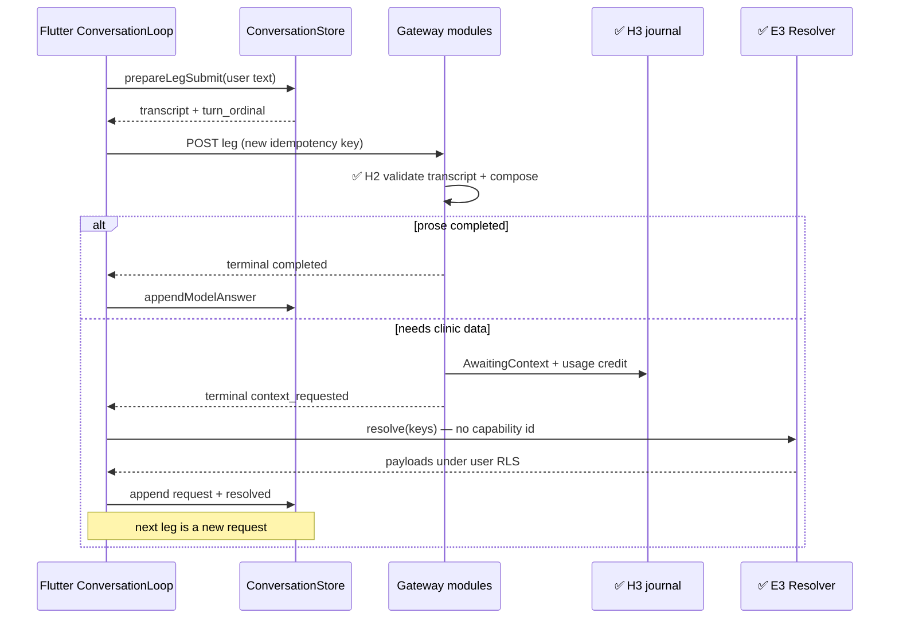
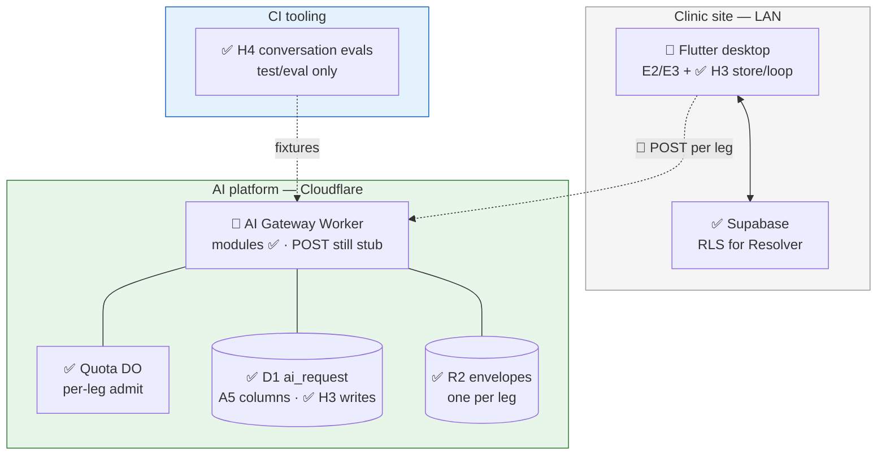
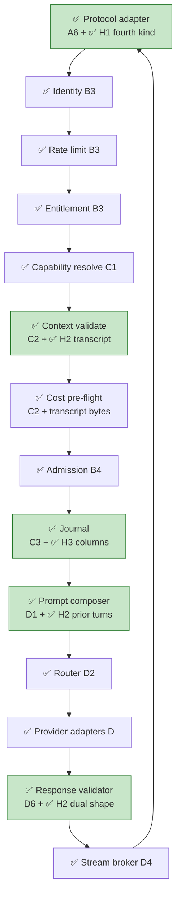

# AI Platform — Band H Implementation Reference

- Purpose: Explain, in plain language, what Band H of the AI platform delivery plan has actually built — for someone who does not know the project or its technologies yet, especially readers who already used [`01-band-a`](01-band-a-implementation-reference.md)–[`06-band-f`](06-band-f-implementation-reference.md).
- Read this when: onboarding after Bands A–F, reviewing multi-turn / chat capabilities, or preparing for Band J compatibility behaviour.
- Canonical for: Band H completion status, where to find the code and tests, and which architecture boxes are now green for conversational mode.
- Usually paired with: [`01-band-a`](01-band-a-implementation-reference.md)–[`03-band-c`](03-band-c-implementation-reference.md) (A–C), [`04-band-d`](04-band-d-implementation-reference.md) (compose/validate), [`05-band-e`](05-band-e-implementation-reference.md) (Flutter SDK/resolver), [`06-band-f`](06-band-f-implementation-reference.md) (eval harness F1), [`../03-ai-platform-delivery-plan.md`](../03-ai-platform-delivery-plan.md) (slice definitions), [`../01-ai-platform.md`](../01-ai-platform.md) (full architecture §6.7).
- Not covered here: Band G commercial surface (undecomposed — skipped), Band J deferred compatibility (see [`08-band-j`](08-band-j-implementation-reference.md)), or review-comment remediations after tip `24d1e7cc`.

> **Status:** Band H (slices **H1–H4**) is **complete** on branch `ai/master` (tip `24d1e7cc`, 2026-08-02) — **before** later review-comment remediation commits. Automated evidence: **73 Band H Worker tests** — **28** (H1) + **28** (H2) + **8** (H3, workers pool) + **9** (H4 named T1–T9) — plus **12 Flutter** tests (H3 client: **5** store + **7** loop) — within **536** total Worker tests at this tip (**406** default config + **130** workers pool; configs are disjoint). Conversational manifest load, transcript validation, composer dual-output, journaling columns, client Conversation store/loop, and conversation evals **exist and are tested**; they are **additive** — `interaction_mode` defaults to `single_shot`, so no existing button-invoked capability acquires chat behaviour from this band's existence. **No server-side conversation entity** is introduced; `conversation_id` / `turn_ordinal` were reserved in A5. Live `POST /v1/requests` remains the earlier SSE stub path — H modules are proven in focused suites and H3 pipeline spies, not as a new public chat HTTP product.

---

## Table of Contents

1. [The One-Paragraph Summary](#1-the-one-paragraph-summary)
2. [Background for New Readers](#2-background-for-new-readers)
3. [What Band H Is and Why It Exists](#3-what-band-h-is-and-why-it-exists)
4. [Technologies in Plain Language](#4-technologies-in-plain-language)
5. [What Was Built — Slice by Slice](#5-what-was-built--slice-by-slice)
6. [Architecture Diagrams — What Is Finished](#6-architecture-diagrams--what-is-finished)
7. [Frozen Contracts at a Glance](#7-frozen-contracts-at-a-glance)
8. [How Testing Was Carried Out](#8-how-testing-was-carried-out)
9. [Repository Map](#9-repository-map)
10. [What Band H Does Not Do Yet](#10-what-band-h-does-not-do-yet)
11. [What Band H Unlocks Next](#11-what-band-h-unlocks-next)
12. [Where to Read More](#12-where-to-read-more)

---

## 1. The One-Paragraph Summary

Band H adds **multi-turn conversational AI** on top of the single-shot path without changing how existing capabilities behave. A capability may declare `interaction_mode: conversational` with history/round/size limits and a **permitted key set**; the platform validates a client-supplied **transcript**, enforces budgets, renders prior turns as delimited typed data, and accepts either a **prose answer** or a shared **context-request** as output. When the model needs clinic data it ends the leg with terminal event `context_requested` (state `AwaitingContext`) — not an error code. The Flutter client holds the transcript locally, resolves requested keys through the existing Context Resolver, and submits the next leg with a **new idempotency key**. Each leg is an ordinary admitted request; journaling writes `conversation_id` and `turn_ordinal` on the A5-reserved columns. Conversation evals score scripted multi-leg fixtures per conversation in the same CI gate as F1 goldens.

---

## 2. Background for New Readers

### 2.1 Start with earlier bands

If Bands A–F are new to you, read the matching implementation references first.

| Band | What it delivered (Band H needs) |
| --- | --- |
| **Band A** | Manifest schema + `interaction_mode` default `single_shot` (A4); D1 columns `conversation_id` / `turn_ordinal` reserved nullable (A5); SSE framing with fourth kind reserved (A6) |
| **Band B** | Identity, entitlement, quota admission — each conversational **leg** is admitted independently |
| **Band C** | Context validator + cost pre-flight (C2); journal writer (C3) — H2/H3 extend these |
| **Band D** | Prompt composer (D1); response validator (D6) — H2 extends dual output shapes |
| **Band E** | AI Client SDK (E2); Context Resolver (E3) — H3 wires optional invoke fields + negotiation loop |
| **Band F** | Eval suite harness (F1 / A9) — H4 extends with conversation-scored cases |
| **Band G** | Commercial surface — **undecomposed**; skipped in this doc series |
| **Band H** | **Conversational capabilities** (this document) |

Band H **uses** those contracts. It does not rewrite frozen Band A–F wire shapes. Amendment **A14** is the architectural home for conversational mode.

### 2.2 The four problems Band H solves

1. **Declare chat safely** — Only capabilities that opt into `conversational` get extra fields; `single_shot` rejects them.
2. **Validate untrusted history** — The client resupplies the transcript each leg; the platform accepts or rejects it whole, then counts budgets from that transcript alone.
3. **Negotiate context without a server session** — `context_requested` ends the request; the next turn is a new request. No conversation Durable Object or table.
4. **Prove behaviour in CI** — Scripted multi-leg evals catch wrong keys, permit-set escapes, and round-budget failures.

### 2.3 Daily conversational flow (designed)

1. Client opens a chat for a conversational capability; Conversation store creates a `conversation_id` and empty transcript.
2. User types; store appends a `user` turn and submits a leg with `transcript`, `turn_ordinal`, AAT, and a **new** idempotency key.
3. Platform runs the ordinary §6.1 pipeline; stage 6 validates the transcript; composer renders prior turns; model answers with prose **or** a context request.
4. If `context_requested`: stream ends; journal state `AwaitingContext`; client Resolver fetches keys under the user's RLS; store appends `context_requested` + `context_resolved`; next leg.
5. If `completed`: store appends `model` turn; UI shows the answer.
6. On close: client **discards** the local transcript. Support can still read legs via `listConversationLegs(conversation_id)`.

### 2.4 Where the code lives

| Area | Path |
| --- | --- |
| Worker conversational logic | `ai-platform/src/` — `manifest/`, `context/`, `prompt/composer.ts`, `validate/`, `adapter.ts`, `journal/` |
| Conversation evals | `ai-platform/test/eval/` (sibling to F1; no `src/eval/`) |
| Flutter chat core | `frontend/lib/core/ai/conversation_store.dart`, `conversation_loop.dart` (+ E2/E3 SDK surfaces) |
| Spec Kit | `specs/044` … `specs/047` |

**No new D1 migration** in Band H (columns reserved in A5). **No** Supabase schema for conversations.

### 2.5 How Band H landed in git

Work was integrated linearly on **`ai/master`**. Four feature branches map one-to-one to slices. Tip `24d1e7cc` is the end of H4 **before** review-comment follow-ups.

| Slice | Branch | Final commit (on `ai/master` line) | Date |
| --- | --- | --- | --- |
| **H1** | `ai/044-h1-conversational-manifest-schema` | `74eb1ce7` | 2026-08-02 |
| **H2** | `ai/045-h2-transcript-validation-budgets` | `f324e63c` | 2026-08-02 |
| **H3** | `ai/046-h3-conversational-journaling` | `16e441ce` | 2026-08-02 |
| **H4** | `ai/047-h4-conversation-evals` | `24d1e7cc` | 2026-08-02 |

Spec Kit directories: `specs/044` … `specs/047`.

---

## 3. What Band H Is and Why It Exists

The delivery plan titles Band H **"Conversational capabilities"** (`03-ai-platform-delivery-plan` §3.8).

| ID | Slice | Spec directory | Needs | One-line purpose |
| --- | --- | --- | --- | --- |
| **H1** | Conversational manifest fields and context-request schema | `specs/044-conversational-manifest-schema/` | A2, A4, A6 | Freeze conversational extras, shared `{key, arguments}` schema, fourth terminal kind, `AwaitingContext` |
| **H2** | Transcript validation, budgets, composer rendering | `specs/045-transcript-validation-budgets/` | C2, D1, D6, H1 | Validate transcript; budgets; allowlist; dual prose/context-request output |
| **H3** | Conversational journaling and client chat surface | `specs/046-conversational-journaling/` | C3, E2, E3, H1 | Populate `conversation_id` / `turn_ordinal`; Flutter store + loop |
| **H4** | Conversation evals | `specs/047-conversation-evals/` | F1, H2 | Scripted multi-leg CI evals scored per conversation |

**Dependency chain:** `A2/A4/A6 → H1 → H2`; `C3 + E2/E3 + H1 → H3`; `F1 + H2 → H4`. Band H is placed late because it is the largest **capability addition**, not because it was under-specified — §6.7 already decided the model.

### 3.1 Band H vs prior bands (additive)

| Concern | Before Band H | After Band H |
| --- | --- | --- |
| Default capability mode | `single_shot` (A4) | unchanged — still the default |
| Existing button features | single-shot only | **unaffected** (A14) |
| Manifest conversational fields | rejected / absent content | ✅ H1 load rules when mode is conversational |
| Shared context-request schema | reserved idea | ✅ H1 `validateContextRequest` |
| Terminal `context_requested` | reserved in A6 | ✅ H1 mode-gated emission |
| Transcript on submit | — | ✅ H2 wire + validation |
| `conversation_budget_exhausted` | taxonomy slot (A2) | ✅ H2 runtime emission |
| Composer prior turns | single-shot context only | ✅ H2 transcript role tags |
| Dual output (prose \| context request) | — | ✅ H2 / D6 extension |
| Journal `conversation_id` / `turn_ordinal` | nullable columns (A5) | ✅ H3 writes them |
| Client transcript hold | — | ✅ H3 Conversation store |
| Conversation evals | — | ✅ H4 under F1 CI gate |
| Conversation **table** / session DO | forbidden by design | still **none** |

**Legend:** ✅ implemented & tested | — not applicable / not built

---

## 4. Technologies in Plain Language

Earlier bands introduced the Worker, D1, R2, manifests, composer, and Flutter SDK. Band H adds:

| Term | What it means | How Band H uses it |
| --- | --- | --- |
| **`interaction_mode`** | `single_shot` (default) or `conversational` | Fixed for the life of a capability **version**; in-place change fails the build |
| **Conversational extras** | `maxHistoryTurns`, `maxContextRoundsPerTurn`, `transcriptSizeLimit`, `permittedKeySet` | Required on conversational manifests; rejected on `single_shot` |
| **Permitted key set** | Allowlist of context keys the assistant may request | H1 validates vocabulary; H2 drops keys outside the set |
| **Context request** | List of `{key, arguments}` | One platform-owned schema (`platform.context_request@v1`); not per-capability |
| **`context_requested`** | Fourth SSE **terminal** event kind | Conversational only; **not** a §5.4 taxonomy code |
| **`AwaitingContext`** | Terminal §6.3 request state | Immutable; that leg is over; conversation continues as a **new** request |
| **Transcript** | JSON array of prior turns the client resupplies | Closed kinds: `user`, `model`, `context_requested`, `context_resolved` |
| **`conversation_budget_exhausted`** | Taxonomy code | History-turn or context-round limit breached (after shape validation) |
| **Leg** | One independent `POST` / journal row in a chat | Own admission, credit, idempotency key, R2 envelope |
| **`conversation_id`** | Client-chosen id shared across legs | Written on `ai_request`; groups support/eval reads |
| **`turn_ordinal`** | Client-incremented leg number | Written on `ai_request`; orders `listConversationLegs` |
| **Conversation store** | Flutter in-memory transcript holder | Hold / resupply / discard — never interprets messages or chooses keys |
| **Conversation loop** | Flutter negotiation driver | On `context_requested`, resolve via E3 Resolver; submit next leg |
| **Conversation eval** | CI multi-leg fixture score | Criteria: right keys, permitted set, round-budget convergence |

---

## 5. What Was Built — Slice by Slice

### 5.1 H1 — Conversational manifest fields and context-request schema

**In simple terms:** Teach the platform how to load a chat-capable manifest, what a structured "please fetch these keys" answer looks like, and how a conversational leg may end by asking for context — without treating that ask as an error.

**What was implemented:**

- **`src/manifest/index.ts`:** When `interactionMode === "conversational"`, require the four extras; reject those fields on `single_shot`; validate `permittedKeySet` entries with A5 `validateKey`; fail published-registry verify if mode changes in place.
- **`src/context/context-request.ts`:** `validateContextRequest()`, `CONTEXT_REQUEST_SCHEMA_ID` (`platform.context_request@v1`).
- **`src/adapter.ts`:** `context_requested` in `TERMINAL_EVENT_KINDS`; `pushTerminalEvent` gates on mode; stub helpers for integration tests.
- **`src/journal/index.ts`:** `isJournalTerminalState`, `isJournalTransitionAllowed`, `canReachAwaitingContext` — `AwaitingContext` terminal and conversational-only.
- **`src/errors.ts`:** Building an error body with code `context_requested` throws (not a taxonomy code).

**Tests:** 28 cases across `conversational-manifest.test.ts`, `context-request.test.ts`, `awaiting-context.test.ts`, `context-requested-terminal.test.ts`.

**Key files:**

| Path | Role |
| --- | --- |
| `ai-platform/src/manifest/index.ts` | Conversational load / reject rules |
| `ai-platform/src/context/context-request.ts` | Shared schema |
| `ai-platform/src/adapter.ts` | Fourth terminal kind + mode gate |
| `ai-platform/src/journal/index.ts` | `AwaitingContext` helpers |
| `specs/044-.../contracts/conversational-manifest.md` | Frozen extras + permitted set |
| `specs/044-.../contracts/context-request-schema.md` | Frozen `{key, arguments}` list |
| `specs/044-.../contracts/context-requested-terminal.md` | Frozen terminal kind + state |

**Not included:** Transcript validation (H2), journaling column population (H3), product numeric limits for a real chat assistant (Open Decisions 12/13 at capability authoring).

---

### 5.2 H2 — Transcript validation, conversation budgets, and composer rendering

**In simple terms:** Check the client's history for shape and length; price it with the existing pre-flight; put prior turns into the prompt as typed data; accept either a normal prose answer or a context request.

**What was implemented:**

**Stage 6 — `src/context/validator.ts`:**

- `validateContext()` branches to `validateConversationalContext` when mode is conversational.
- Shape/order first → `context_invalid` (whole transcript accept-or-reject).
- Then history-turn and tail context-round budgets → `conversation_budget_exhausted`.
- Permitted-key allowlist: drop unknown keys inside `context_resolved` (and ordinary context); do not reject for those drops.
- `single_shot` path unchanged (no transcript/budget codes).

**Composer — `src/prompt/composer.ts`:**

- `renderTranscriptPriorTurns()` maps kinds to closed role tags (`user` / `assistant` / `data`).
- Offers context-request schema as a second permitted output shape alongside prose.
- R-10: instruction-like user text stays in a user part, never becomes system instruction.

**Response validator — `src/validate/phases.ts` + `index.ts`:**

- Conversational legs accept valid prose **or** a conforming context request; neither → existing `validation_failed` path.

**Stage 7:** Existing `runCostPreflight` prices the serialized request including transcript → `request_too_large` when oversized. No second cost mechanism.

**Tests:** 28 cases across `transcript-validation.test.ts` (21), `conversational-composer.test.ts` (4), `conversational-response-validator.test.ts` (3).

**Key files:**

| Path | Role |
| --- | --- |
| `ai-platform/src/context/validator.ts` | Transcript shape, budgets, allowlist |
| `ai-platform/src/prompt/composer.ts` | Prior-turn rendering + dual shape offer |
| `ai-platform/src/validate/phases.ts` | Dual-shape acceptance |
| `specs/045-.../contracts/transcript-wire.md` | Closed turn kinds |
| `specs/045-.../contracts/transcript-validation-budgets.md` | Order, budgets, allowlist |
| `specs/045-.../contracts/conversational-composition.md` | Role tags + dual output |

**Not included:** Conversation store / Flutter (H3); conversation evals (H4); new pipeline stage (still stages 6–7 / 10–13 parameterized by mode).

---

### 5.3 H3 — Conversational journaling and client chat surface

**In simple terms:** Stamp each chat leg with conversation identity in the ordinary journal; let support list a whole chat in one query; give Flutter a local transcript holder and a loop that talks to the existing SDK and Resolver.

**What was implemented:**

**Journal — `src/journal/index.ts`:**

- `createRequestRow()` writes client-supplied `conversation_id` / `turn_ordinal` for conversational legs; **NULL** for `single_shot`.
- `listConversationLegs(conversationId)` — `WHERE conversation_id = ? ORDER BY turn_ordinal`.
- No conversation table; no schema migration.

**Flutter — `frontend/lib/core/ai/`:**

| Module | Role |
| --- | --- |
| `conversation_store.dart` | Hold / resupply / discard transcript; allocate leg ordinals |
| `conversation_loop.dart` | Submit leg; on `context_requested` call Resolver `resolve(keys)` with **no** capability id; append; new idempotency key; cancel only current leg |
| `ports.dart` | Optional `conversationId`, `turnOrdinal`, `transcript` on `CapabilityInvokeInput` |
| `sse_events.dart` / `ai_client_sdk.dart` | `ContextRequestedEvent` / `ContextRequestedTerminal` |

**Tests:** 8 workers-pool cases in `conversational-journaling.test.ts`; 12 Flutter cases (5 store + 7 loop).

**Key files:**

| Path | Role |
| --- | --- |
| `ai-platform/src/journal/index.ts` | Column write + `listConversationLegs` |
| `ai-platform/test/conversational-journaling.test.ts` | Independent admit/credit, no conversation entity |
| `frontend/lib/core/ai/conversation_store.dart` | Local transcript |
| `frontend/lib/core/ai/conversation_loop.dart` | Negotiation loop |
| `specs/046-.../contracts/conversational-journaling.md` | Frozen journaling + client rules |

**Not included:** Production chat page mounted in app navigation (core library only at this tip); wiring ConversationLoop into a shipped clinic screen; H3 does not require H2 eval harness.

---

### 5.4 H4 — Conversation evals

**In simple terms:** Run scripted multi-turn chats against recorded fixtures in CI and fail the build if the assistant asks for the wrong keys, escapes the allowlist, or never finishes within the round budget.

**What was implemented:**

- **`test/eval/conversation-harness.ts`** — Active multi-leg loop against recorded fixtures; scores whole conversation at end (no H3 Flutter required).
- **`test/eval/conversation-score-report.ts`** — JSON report with `right_keys`, `permitted_set`, `round_budget`.
- **`test/eval/clinic.chat_assistant/`** — One fixture conversational capability + three scripted cases:
  - `converges_within_round_budget`
  - `assistant_must_request_correct_key`
  - `cannot_obtain_key_outside_permitted_set`
- **`test/eval/conversation.test.ts`** — Named tests T1–T7.
- **`test/eval/prohibitions.test.ts`** — H4 entries T8–T9 (plus inherited F1 structural checks).
- **`.github/workflows/ci.yml`** — `ai-platform-eval-golden` runs `conversation.test.ts` beside goldens.

**Tests:** 9 H4-named cases (7 + 2 prohibitions); running the full prohibitions file also executes 2 inherited F1 checks (11 tests in that combined command).

**Key files:**

| Path | Role |
| --- | --- |
| `ai-platform/test/eval/conversation-harness.ts` | Multi-leg harness |
| `ai-platform/test/eval/conversation-score-report.ts` | Score JSON |
| `ai-platform/test/eval/clinic.chat_assistant/` | Fixture capability + cases |
| `ai-platform/test/eval/conversation.test.ts` | T1–T7 |
| `specs/047-.../contracts/conversation-evals.md` | Frozen gate + criteria |

**Not included:** Live unbounded chat matrix; per-clinic eval matrices (OD-5); `src/eval/` runtime module; replacing F1 capability goldens.

---

### 5.5 End-to-end stories in plain language

#### Walkthrough A — Load a conversational manifest (H1)

1. Author a capability with `interactionMode: "conversational"` and the four extras.
2. `load()` succeeds; `permittedKeySet` entries must exist in the A5 vocabulary.
3. The same extras on a `single_shot` manifest fail the build.
4. Changing mode on a published version fails `verifyPublishedRegistry`.

#### Walkthrough B — Submit a leg with transcript (H2)

1. Client sends prior turns as `transcript` plus the leg's own `turn_ordinal`.
2. Shape/order fail → `context_invalid` (never a budget code).
3. Too many history turns or context rounds at the tail → `conversation_budget_exhausted`.
4. Oversized serialized input → `request_too_large` from existing pre-flight.
5. Composer emits prior turns as delimited typed parts; validator accepts prose or context request.

#### Walkthrough C — Model asks for clinic data (H1 + H2 + H3)

1. Validated model output is a context request drawn from the permitted set.
2. Stream ends with **one** terminal event: `context_requested`.
3. Journal reaches terminal `AwaitingContext` (immutable).
4. Flutter loop resolves keys via E3 Resolver (user RLS); appends turns; submits **new** leg with **new** idempotency key.
5. That prior leg is still credited with actual usage — inference happened.

#### Walkthrough D — Support reads a conversation (H3)

1. Operator (or eval tooling) calls `listConversationLegs(conversation_id)`.
2. One indexed D1 query returns ordinary `ai_request` rows ordered by `turn_ordinal`.
3. There is no conversation entity to join.

#### Walkthrough E — CI catches a bad prompt change (H4)

1. `ai-platform-eval-golden` runs conversation fixtures.
2. Failures on wrong key, forbidden key obtained, or non-convergence fail the conversation (not turn-by-turn as the acceptance unit).
3. Score JSON is written under `test/eval/reports/`.



---

## 6. Architecture Diagrams — What Is Finished

**Legend:** ✅ implemented & tested | 🔶 partial / module not on live POST | ⬜ not built

### 6.1 System context — conversational addition



### 6.2 Gateway pipeline — mode-parameterized stages

Conversational mode does **not** add a new §6.1 stage number. Stages 6–7, 10, and 13 gain conversational behaviour when the resolved manifest says so.



**How to read this:** Green Band H boxes are implemented and tested in their modules. **Live `POST /v1/requests` at this tip still opens the SSE stub** (same caution as [`04-band-d`](04-band-d-implementation-reference.md)); H3 journaling integration tests exercise `createRequestRow` / admit / credit spies directly.

### 6.3 Pipeline stages — conversational notes

| Stage | Name | Band H note |
| --- | --- | --- |
| 1 | Protocol adapter | ✅ H1: may emit `context_requested` only if conversational |
| 5 | Capability resolve | Manifest carries mode + extras (H1 load) |
| 6 | Context validate | ✅ H2 transcript / budgets / allowlist |
| 7 | Cost pre-flight | Prices transcript; no new mechanism |
| 9 | Journal insert | ✅ H3 writes `conversation_id` / `turn_ordinal` |
| 10 | Compose | ✅ H2 prior-turn rendering |
| 13 | Response validate | ✅ H2 prose **or** context request |
| 14 | Stream | Fourth terminal kind for conversational |
| 15–16 | Terminal + detail | `AwaitingContext` is terminal; usage credited |

### 6.4 Platform stores — status after Band H

| Store | Status | What changed in Band H |
| --- | --- | --- |
| D1 `ai_request.conversation_id` | ✅ H3 | Populated for conversational legs; NULL for single-shot |
| D1 `ai_request.turn_ordinal` | ✅ H3 | Same |
| D1 conversation table | ⬜ none | Intentionally absent |
| Per-request conversation DO | ⬜ none | Quota DO remains the only stateful DO |
| R2 envelope | ✅ per leg | Unchanged one-envelope rule; transcript lives in client + envelopes |
| Flutter Conversation store | ✅ H3 | Process-local only; discarded on close |
| `test/eval/` conversation harness | ✅ H4 | CI tooling only |

### 6.5 Request state machine — `AwaitingContext`

H1 freezes `AwaitingContext` as terminal and immutable, reachable only for conversational capabilities (typically from validating a context-request output). Continuing the chat is always a **new** `ai_request` with a **new** idempotency key, linked only by `conversation_id`.

---

## 7. Frozen Contracts at a Glance

Band H froze new contracts. Later slices may **extend** but not **rewrite** them (delivery plan §2.3).

### 7.1 Conversational manifest (H1)

| Rule | Detail |
| --- | --- |
| Required extras | `maxHistoryTurns`, `maxContextRoundsPerTurn`, `transcriptSizeLimit`, `permittedKeySet` |
| `single_shot` | Those fields rejected (no silent strip) |
| Mode versioning | In-place mode change fails build |
| Unknown permitted key | `load()` fails |

Full table: `specs/044-.../contracts/conversational-manifest.md`.

### 7.2 Context-request schema (H1)

| Outcome | Meaning |
| --- | --- |
| Success | Array of `{key, arguments}` |
| Reject | Non-list root; missing fields; non-object elements |
| Ownership | One platform schema id — not per-capability |

### 7.3 Terminal `context_requested` + `AwaitingContext` (H1)

| Property | Rule |
| --- | --- |
| Event kind | Terminal SSE; conversational only |
| Taxonomy | **Absent** from §5.4; cannot build as error body |
| One-terminal invariant | Still exactly one terminal per leg |
| `AwaitingContext` | Terminal, immutable, conversational-only |

### 7.4 Transcript wire + budgets (H2)

| Turn `kind` | Payload |
| --- | --- |
| `user` | `text` |
| `model` | `text` |
| `context_requested` | `requests` |
| `context_resolved` | `context` |

| Failure | Code |
| --- | --- |
| Bad shape / order | `context_invalid` |
| History or context-round breach | `conversation_budget_exhausted` |
| Oversized (pre-flight) | `request_too_large` |
| Key outside permitted set | **Dropped** (not a reject) |

### 7.5 Composition dual shapes (H2)

Composer offers prose **or** context-request; validator accepts either; neither → `validation_failed`. Role tags: `user` / `assistant` / `data` only.

### 7.6 Conversational journaling (H3)

| Invariant | Rule |
| --- | --- |
| Columns | Written on ordinary `ai_request`; no migration |
| Query | One indexed `listConversationLegs` |
| Accountability | N legs → N admits, N credits, N envelopes |
| Entity | No conversation table / session object |

### 7.7 Conversation evals (H4)

| Criterion | Meaning |
| --- | --- |
| `right_keys` | Requests the correct permitted key when the script requires it |
| `permitted_set` | Cannot obtain a key outside the allowlist |
| `round_budget` | Converges within declared rounds |

Scoring is **per conversation**. Same CI job as F1 goldens.

---

## 8. How Testing Was Carried Out

### 8.1 The completion rule

Same as prior bands: **a slice is done when a test a human can read and believe passes** (`03-ai-platform-delivery-plan` §3.11.7).

### 8.2 Two Vitest configurations (+ Flutter)

| Config | Command | Tip totals (`24d1e7cc`) |
| --- | --- | --- |
| **Default** | `cd ai-platform && npm test` | **406** tests |
| **Workers pool** | `npx vitest run --config vitest.workers.config.ts` | **130** tests |
| **Flutter (H3)** | `flutter test …conversation_*_test.dart` | **12** tests |

**Band H Worker total: 73 tests** (28+28+8+9). Combined Worker suites: **536** (406+130; disjoint). Node **22+** required for ai-platform engines field.

### 8.3 Test layers by slice (`03-ai-platform-delivery-plan` §3.11.7)

| Slice | Layer | Files | Count |
| --- | --- | --- | --- |
| **H1** | Contract + build + integration | `conversational-manifest`, `context-request`, `awaiting-context`, `context-requested-terminal` | 28 |
| **H2** | Unit + golden | `transcript-validation`, `conversational-composer`, `conversational-response-validator` | 28 |
| **H3** | Integration (spy) + Flutter | `conversational-journaling` (workers); `conversation_store_test`, `conversation_loop_test` | 8 + 12 |
| **H4** | Evals | `conversation.test.ts` + H4 prohibitions entries | 9 named |

### 8.4 Spy / invariant highlights

- `single_shot` never emits `context_requested`.
- Still exactly one terminal event when ending in `context_requested`.
- Shape checked before budgets (no budget code on malformed transcripts).
- Budgets counted from **submitted transcript alone** (no platform conversation counter).
- Key outside permitted set dropped inside `context_resolved`.
- N conversational legs → N admissions and N usage credits; `AwaitingContext` legs credited.
- No conversation table; no per-request server-side conversation state between legs.
- H4: no Flutter prompt/provider/model strings in conversation modules; harness is CI-only.

### 8.5 Slice-only commands

```bash
cd ai-platform
# H1
npx vitest run \
  test/conversational-manifest.test.ts \
  test/context-request.test.ts \
  test/awaiting-context.test.ts \
  test/context-requested-terminal.test.ts
# H2
npx vitest run \
  test/transcript-validation.test.ts \
  test/conversational-composer.test.ts \
  test/conversational-response-validator.test.ts
# H3 journal
npx vitest run --config vitest.workers.config.ts test/conversational-journaling.test.ts
# H4
npx vitest run test/eval/conversation.test.ts test/eval/prohibitions.test.ts

cd frontend
flutter test \
  test/unit/core/ai/conversation_store_test.dart \
  test/unit/core/ai/conversation_loop_test.dart
```

### 8.6 Run everything (quick reference)

```bash
cd ai-platform && npm test
cd ai-platform && npx vitest run --config vitest.workers.config.ts
```

### 8.7 Testing gaps (honest inventory)

| Gap | Detail |
| --- | --- |
| **Live POST not an H integration target** | Public `POST /v1/requests` remains the SSE stub; H3 spies call journal/admit helpers directly |
| **No mounted clinic chat screen** | Store/loop are core libraries; not proven via a production feature route at this tip |
| **H4 harness ≠ H3 Flutter** | Conversation evals advance legs without the client loop (by design) |
| **Numeric product limits** | Fixture capability has test values; real clinic chat limits are Open Decisions 12/13 |
| **Workers pool required for H3** | Default `npm test` excludes `conversational-journaling.test.ts` |

---

## 9. Repository Map

```
ai-platform/
├── src/
│   ├── manifest/index.ts           # H1 conversational load rules
│   ├── context/
│   │   ├── context-request.ts      # H1 shared schema
│   │   ├── validator.ts            # H2 transcript / budgets / allowlist
│   │   └── preflight.ts            # C2 — prices transcript unchanged
│   ├── adapter.ts                  # H1 context_requested terminal gate
│   ├── journal/index.ts            # H1 AwaitingContext helpers; H3 columns + listConversationLegs
│   ├── prompt/composer.ts          # H2 prior-turn rendering
│   ├── validate/
│   │   ├── phases.ts               # H2 dual-shape acceptance
│   │   └── index.ts                # validateAndRepair wiring
│   └── errors.ts                   # context_requested not a taxonomy code
├── test/
│   ├── conversational-manifest.test.ts
│   ├── context-request.test.ts
│   ├── awaiting-context.test.ts
│   ├── context-requested-terminal.test.ts
│   ├── transcript-validation.test.ts
│   ├── conversational-composer.test.ts
│   ├── conversational-response-validator.test.ts
│   ├── conversational-journaling.test.ts   # workers pool
│   └── eval/
│       ├── conversation-harness.ts
│       ├── conversation-score-report.ts
│       ├── conversation.test.ts
│       ├── prohibitions.test.ts            # F1 + H4 entries
│       └── clinic.chat_assistant/
├── migrations/
│   └── 20260731120000_platform_schema.sql  # A5 reserved columns (H3 writes)
└── vitest.workers.config.ts

frontend/lib/core/ai/
├── conversation_store.dart          # H3
├── conversation_loop.dart           # H3
├── ports.dart                       # optional conversational invoke fields
├── sse_events.dart                  # ContextRequested*
└── ai_client_sdk.dart               # surfaces fourth terminal

frontend/test/unit/core/ai/
├── conversation_store_test.dart
└── conversation_loop_test.dart

specs/
├── 044-conversational-manifest-schema/
│   └── contracts/{conversational-manifest,context-request-schema,context-requested-terminal}.md
├── 045-transcript-validation-budgets/
│   └── contracts/{transcript-wire,transcript-validation-budgets,conversational-composition}.md
├── 046-conversational-journaling/
│   └── contracts/conversational-journaling.md
└── 047-conversation-evals/
    └── contracts/conversation-evals.md
```

---

## 10. What Band H Does Not Do Yet

### 10.1 Product and pipeline gaps

| Capability | Status after Band H |
| --- | --- |
| Existing single-shot buttons gain chat | **No** — mode defaults to `single_shot` (A14) |
| Server-side conversation entity / session | **Never in scope** — client holds transcript |
| D1 migration for conversation columns | **Not needed** — reserved in A5 |
| Live `POST /v1/requests` conversational E2E | **Not the public path at this tip** (stub) |
| Shipped clinic chat UI route | **Core library only** |
| Band G commercial / plan UI | Undecomposed — skipped |
| `context_required` auto-heal on conversational | **Explicitly out** — J2 does not apply to conversational (`03-ai-platform-delivery-plan` §3.9) |

### 10.2 Implementation gaps inside Band H scope

| Gap | Detail |
| --- | --- |
| **Unified live orchestrator on POST** | Same caution as Band D reference — modules + spies, not stub replacement |
| **Widget/host chrome for chat** | Spec clarified store/loop under `core/ai/`; feature chrome may still be separate |
| **Concrete clinic chat capability** | Fixture `clinic.chat_assistant` is eval-only; production capability authoring is separate |
| **Support UI conversation browser** | `listConversationLegs` helper exists; Band F3 support UI may consume it later |

### 10.3 What Band H consumes from prior bands

| Prior slice | How Band H uses it |
| --- | --- |
| **A2** | Closed taxonomy; `conversation_budget_exhausted` slot; forbids `context_requested` as error |
| **A4** | Ten-group manifest; default `single_shot`; reject conversational fields on single-shot |
| **A5** | Nullable `conversation_id` / `turn_ordinal`; context-key vocabulary |
| **A6** | SSE framing; reserved fourth terminal kind |
| **C2** | Stage 6–7 surfaces H2 extends |
| **C3** | Journal lifecycle H3 extends |
| **D1 / D6** | Composer + validator dual-shape extension |
| **E2 / E3** | SDK invoke + Resolver for H3 loop |
| **F1** | A9 eval gate H4 extends |

---

## 11. What Band H Unlocks Next

Band H is the last large **new behaviour** block in the delivery plan (`03-ai-platform-delivery-plan` §3). It unlocks:

| Next | Why H matters |
| --- | --- |
| **Band J** | Compatibility machinery on frozen surfaces; remember **J2 self-heal does not apply** to conversational capabilities |
| **Product chat features** | Manifest + client loop + journaling contracts are ready for a real conversational capability version |
| **Support / ops** | Ordered conversation reads via `listConversationLegs` without a new entity |
| **Prompt quality** | H4 CI gate catches multi-leg negotiation regressions beside F1 goldens |

### 11.1 Relationship to checkpoints

CP3/CP4 in `03-ai-platform-delivery-plan` §5 target the single-shot first-feature thread (D+E). Band H is **orthogonal and additive**: it does not replace CP3, and shipping chat still needs a product capability, mounted UI, and a live POST path that runs the full module chain.

---

## 12. Where to Read More

| Document | Use when |
| --- | --- |
| [`01-band-a-implementation-reference.md`](01-band-a-implementation-reference.md) | Manifest default, A5 columns, SSE reservation |
| [`02-band-b-implementation-reference.md`](02-band-b-implementation-reference.md) | Per-leg admission / quota |
| [`03-band-c-implementation-reference.md`](03-band-c-implementation-reference.md) | Context validate + journal baseline |
| [`04-band-d-implementation-reference.md`](04-band-d-implementation-reference.md) | Composer / response validator Band H extends |
| [`05-band-e-implementation-reference.md`](05-band-e-implementation-reference.md) | SDK + Resolver Band H wires |
| [`06-band-f-implementation-reference.md`](06-band-f-implementation-reference.md) | F1 eval harness Band H extends |
| [`08-band-j-implementation-reference.md`](08-band-j-implementation-reference.md) | Deferred compatibility (J2 ≠ conversational) |
| [`../03-ai-platform-delivery-plan.md`](../03-ai-platform-delivery-plan.md) | §3.8 Band H, §3.11.7 test floors |
| [`../01-ai-platform.md`](../01-ai-platform.md) | Authoritative §6.7 conversational model |
| [`../04-ai-platform-operator-runbook.md`](../04-ai-platform-operator-runbook.md) | Day-to-day run/observe |
| `specs/044` … `specs/047` quickstarts | Run one slice's tests |

**Run tests:**

```bash
cd ai-platform && npm test
cd ai-platform && npx vitest run --config vitest.workers.config.ts
cd frontend && flutter test \
  test/unit/core/ai/conversation_store_test.dart \
  test/unit/core/ai/conversation_loop_test.dart
```

---

*This document describes Band H as implemented at tip `24d1e7cc` (2026-08-02), before review-comment remediation commits. For Bands A–F see [`01-band-a`](01-band-a-implementation-reference.md)–[`06-band-f`](06-band-f-implementation-reference.md). Band G remains undecomposed. Do not rewrite frozen contract sections without an architecture amendment.*
