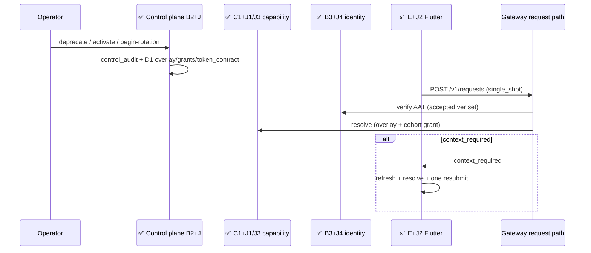
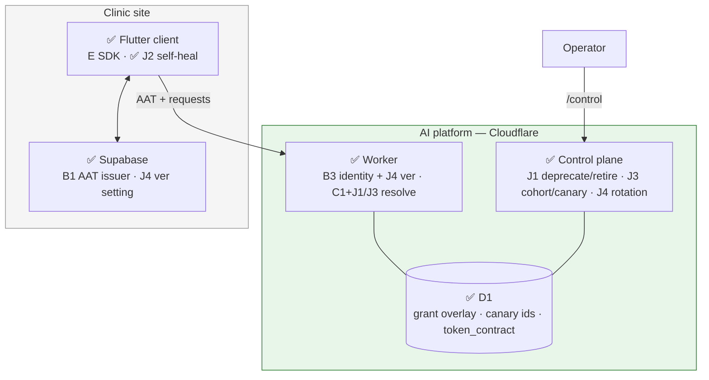
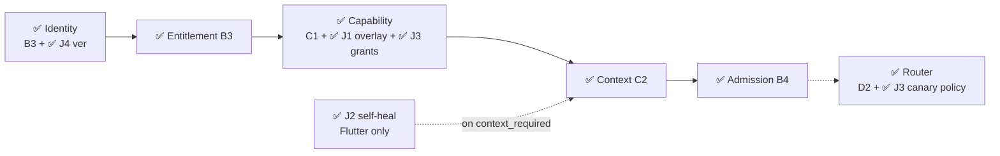

# AI Platform — Band J Implementation Reference

- Purpose: Explain, in plain language, what Band J of the AI platform delivery plan has actually built — for someone who does not know the project or its technologies yet, especially readers who already used the Band A–H implementation references ([`01-band-a`](01-band-a-implementation-reference.md)–[`07-band-h`](07-band-h-implementation-reference.md)).
- Read this when: onboarding after Bands A–H, reviewing deprecation / self-heal / canary / token-rotation behaviour, or asking why compatibility machinery waited until late.
- Canonical for: Band J completion status, where to find the code and tests, which triggers fire each slice, and which architecture boxes are now green for deferred compatibility.
- Usually paired with: [`01-band-a`](01-band-a-implementation-reference.md)–[`07-band-h`](07-band-h-implementation-reference.md) (prior bands), [`../03-ai-platform-delivery-plan.md`](../03-ai-platform-delivery-plan.md) (slice definitions, DP-5, §3.9), [`../01-ai-platform.md`](../01-ai-platform.md) (full architecture), [`../04-ai-platform-operator-runbook.md`](../04-ai-platform-operator-runbook.md) (operator how-to).
- Not covered here: commercial plan/billing UI (Band G — undecomposed), deliberately later items (Band K — undecomposed), review-comment follow-ups after tip `37b82f0e`.

> **Status:** Band J (slices **J1–J4**) is **complete** at tip `37b82f0e` (2026-08-03). Automated evidence: **25** Band J automated tests verified at tip — **5** (J1 workers) + **4** (J2 Flutter) + **7** (J3 workers) + **9** (J4 Vitest: 5 default pool + 4 workers) — plus **3** clinic SQL assertion blocks for J4 (`backend/tests/ai_token_contract_rotation.sql`; require local Supabase). Band J is mostly **behaviour on contracts frozen earlier** (DP-5): lifecycle overlays, `context_required` self-heal, cohort/canary activation, and overlapping AAT `ver` acceptance. **J1** may add one forward-only additive migration for `capability_grant` lifecycle-overlay columns. **Triggers matter more than band position** — build a slice when its audience exists, not because it is next alphabetically.

---

## Table of Contents

1. [The One-Paragraph Summary](#1-the-one-paragraph-summary)
2. [Background for New Readers](#2-background-for-new-readers)
3. [What Band J Is and Why It Exists](#3-what-band-j-is-and-why-it-exists)
4. [Technologies in Plain Language](#4-technologies-in-plain-language)
5. [What Was Built — Slice by Slice](#5-what-was-built--slice-by-slice)
6. [Architecture Diagrams — What Is Finished](#6-architecture-diagrams--what-is-finished)
7. [Frozen Contracts at a Glance](#7-frozen-contracts-at-a-glance)
8. [How Testing Was Carried Out](#8-how-testing-was-carried-out)
9. [Repository Map](#9-repository-map)
10. [What Band J Does Not Do Yet](#10-what-band-j-does-not-do-yet)
11. [What Band J Unlocks Next](#11-what-band-j-unlocks-next)
12. [Where to Read More](#12-where-to-read-more)

---

## 1. The One-Paragraph Summary

Band J answers four compatibility questions that only matter once real clients exist: **how do we deprecate a capability without breaking old pins, how does a stale client heal one missing-context rejection, how do we stage a new build to a canary cohort, and how do we rotate the AAT token contract without re-enrolling clinics?** J1 adds operator deprecate/retire mutations that persist a lifecycle overlay on `capability_grant`, keep deprecated pins serving for a 90-day overlap window, and return existing `capability_retired` after retirement. J2 adds a Flutter-only one-shot self-heal around C2's `context_required` (refresh manifest → resolve keys → same idempotency key; never for conversational). J3 adds control-plane cohort activate/promote and routing-policy publish/canary/rollback, with installation-scoped grants and journaled serving versions. J4 adds a D1 `token_contract` accepted-`ver` set, control-plane begin-rotation/retire, and identity-stage overlapping verification that refuses retired/unknown `ver` as existing `unauthenticated`. Everything is covered by automated tests; slices wait on **triggers**, not on alphabetical order.

---

## 2. Background for New Readers

### 2.1 Start with Bands A–H

If earlier bands are new to you, read them in order:

| Band | Reference | What it delivered that Band J consumes |
| --- | --- | --- |
| **A** | [`01-band-a`](01-band-a-implementation-reference.md) | Error taxonomy, manifests, D1 schema definitions, config cache |
| **B** | [`02-band-b`](02-band-b-implementation-reference.md) | AAT minting, identity verify, control plane, `control_audit` |
| **C** | [`03-band-c`](03-band-c-implementation-reference.md) | Capability resolve/discovery, `context_required` payload, journal |
| **D** | [`04-band-d`](04-band-d-implementation-reference.md) | Prompt registry, router, provider path (J3 stages builds / policies) |
| **E** | [`05-band-e`](05-band-e-implementation-reference.md) | Client SDK + context resolver (J2 composes them) |
| **F** | [`06-band-f`](06-band-f-implementation-reference.md) | Eval harness / ops surfaces (J3 assumes F1 eval gate as CI precondition) |
| **H** | [`07-band-h`](07-band-h-implementation-reference.md) | Conversational mode (J2 explicitly **excludes** it) |

Band **G** (commercial) and Band **K** (explicitly later) are **not decomposed** — see [`03-delivery-plan` §4](../03-ai-platform-delivery-plan.md#4-bands-not-yet-decomposed). There is no `implementation-references/*-band-g-*` or Band K implementation reference.

### 2.2 Why Band J waited (DP-5)

Delivery plan **DP-5**: *Compatibility machinery is deferred, but its contract surface is not.*

Early bands froze the cheap parts — error codes (`capability_retired`, `context_required`, `unauthenticated`), lifecycle vocabulary, journal columns, grant tables — while there were **no deployed clients** to deprecate, heal, canary, or rotate against. Building the *behaviour* early would have been busywork with no audience. Band J wires the behaviour when triggers fire.

### 2.3 The four problems Band J solves

1. **Capability deprecation** — Announce successor in discovery; keep old pins alive for an overlap window; then retire with a typed error.
2. **Stale manifest cache** — One automatic `context_required` round trip for `single_shot` only.
3. **Staged rollout** — Activate a new capability/prompt/routing-policy version for a named installation cohort; promote or roll back; audit every mutation.
4. **Token contract rotation** — Accept two AAT `ver` values during rotation; refuse the retired one afterwards; no clinic re-enrollment.

### 2.4 Daily flows (when triggers apply)

1. Operator deprecates `cap@v1` with successor `cap@v2` → discovery shows deprecation; old clients still resolve `v1` until retire.
2. Stale Flutter client omits a newly required context key → `context_required` → J2 refreshes, resolves, resubmits once → success or surfaces reference.
3. Operator activates build `v3` for canary installations → those installs see `v3`; others keep prior; promote ends the split.
4. Operator begins token-contract rotation to `ver=2` → both `1` and `2` verify; clinic advances `ai.aat.ver`; operator retires `1` → only `2` verifies.

### 2.5 Where the code lives

| Slice | Primary tree |
| --- | --- |
| **J1, J3, J4** | `ai-platform/` (Worker + D1 migrations + control routes) |
| **J2** | `frontend/lib/core/ai/` (Flutter orchestration only — **zero** Worker changes) |
| **J4 clinic half** | `backend/tests/ai_token_contract_rotation.sql` (asserts B1 issuer; **no** new Supabase migration) |

### 2.6 How Band J landed in git

Work was integrated as four feature branches mapping one-to-one to slices. Tip below is the Band J end state **before** later "Handling review comments…" commits.

| Slice | Branch | Final commit | Date |
| --- | --- | --- | --- |
| **J1** | `ai/048-j1-capability-deprecation` | `bc2ac22b` | 2026-08-03 |
| **J2** | `ai/049-j2-context-required-self-healing` | `8521e825` | 2026-08-03 |
| **J3** | `ai/050-j3-staged-rollout-canary` | `913c7833` | 2026-08-03 |
| **J4** | `ai/051-j4-token-contract-rotation` | `37b82f0e` | 2026-08-03 |

J4 tip includes a small pre-phase fix `0b8b9761` (identity regression + schema snapshot order for the `token_contract` migration) — that is implementation and belongs in this reference.

Spec Kit directories: `specs/048` … `specs/051`.

---

## 3. What Band J Is and Why It Exists

The delivery plan titles Band J **"Deferred compatibility machinery"** (`03-ai-platform-delivery-plan` §3.9).

| ID | Slice | Spec directory | Needs | Build when | One-line purpose |
| --- | --- | --- | --- | --- | --- |
| **J1** | Capability deprecation and overlap window | `specs/048-capability-deprecation/` | C1, B2 | A fielded client version could break on a capability change | Deprecate with successor; serve during window; retire → `capability_retired` |
| **J2** | `context_required` self-healing | `specs/049-context-required-self-healing/` | C2, E2, E3 | Client manifest cache can be stale | One refresh+resolve+resubmit; not for conversational |
| **J3** | Staged rollout and canary cohorts | `specs/050-staged-rollout-canary/` | B2, D1, D2, F1 | Audience can be split for a new build/policy | Cohort activate/promote; routing canary; `control_audit` |
| **J4** | Token contract rotation | `specs/051-token-contract-rotation/` | B1, B3 | Token contract needs its first change | Overlapping `ver` acceptance; no re-enrollment |

**Ordering rule:** Band J is ordered by **trigger**, not by position after H. J1 does not unlock J2; each slice can land when its `Build when` condition is true.

### 3.1 Behaviour-only vs the J1 migration exception

Most of Band J is **behaviour on already-frozen contracts** (DP-5). The one exception:

> **J1** may ship one forward-only additive D1 migration adding lifecycle-overlay columns on existing `capability_grant` (`lifecycle_state`, `successor_id`, `deprecated_at`, `retire_after`) if A5's original migration predates the §5.1 / §7.3 overlay amendment. J1 introduces **no new entity**.

J3 adds an additive column (`routing_policy.canary_installation_ids`). J4 adds the `token_contract` table (named by architecture §7.3; deferred until the rotation trigger). J2 adds no schema.

### 3.2 Band J vs prior bands

| Concern | Prior bands | Band J |
| --- | --- | --- |
| `capability_retired` error code | ✅ A2 / C1 taxonomy | J1 **enforces** via overlay after retire |
| Discovery + resolve | ✅ C1 | J1/J3 extend (deprecated announcement; installation grant version) |
| `context_required` wire shape | ✅ C2 | J2 **consumes** on Flutter; Worker unchanged |
| Control plane + `control_audit` | ✅ B2 | J1/J3/J4 add mutation actions |
| AAT verify | ✅ B3 | J4 adds accepted-`ver` membership check |
| AAT mint (`ai.aat.ver`) | ✅ B1 | J4 clinic tests advance setting; platform never writes it |
| Router / prompt pins | ✅ D | J3 stages which version a cohort receives |
| Client SDK + context resolver | ✅ E | J2 orchestrates self-heal |
| Conversational negotiation | ✅ H | J2 **never** takes conversational path |
| Commercial / later deferrals | ⬜ G / K | still undecomposed |

**Legend:** ✅ implemented & tested | ⬜ not built / undecomposed

---

## 4. Technologies in Plain Language

Prior bands introduced the Worker, D1, R2, Durable Objects, AAT, manifests, and the Flutter AI SDK. Band J adds:

| Term | What it means | How Band J uses it |
| --- | --- | --- |
| **Lifecycle overlay** | Durable deprecate/retire state beside an immutable manifest | J1 rows on global-scope `capability_grant`; manifests never edited |
| **Overlap window** | Period a deprecated pin still serves | `OVERLAP_WINDOW_MS` = 90 days (OD-9 minimum); `retire_after` stamped at deprecate |
| **Successor** | Next capability version clients should move to | Required on deprecate; surfaced in discovery |
| **`effectiveLifecycle()`** | Merge registry lifecycle with overlay | Resolve rejects only effective `retired` |
| **Self-heal** | Client auto-recovery from `context_required` | J2: refresh → resolve missing keys → one resubmit |
| **`ManifestRefreshPort`** | Injectable discovery revalidation seam | Production wires to C1; tests spy one call |
| **Idempotency key reuse** | Same key on heal resubmit | Required so B4 admission returns one logical request |
| **Named cohort** | Operator-supplied list of installation ids | No cohort table — body `{ installation_ids, cohort_name? }` |
| **Cohort activate / promote** | Stage then universalize a capability version | Installation-scoped `capability_grant` writes |
| **Routing-policy canary** | Split which policy document an install sees | `canary_installation_ids` + installation-keyed cache |
| **Rollback by deploy** | Undo a prompt/capability stage | Re-activate previous build via grants (no runtime prompt pointer) |
| **`token_contract`** | Platform-global accepted AAT `ver` set | One stable row, two mid-rotation; `retired_at` ends acceptance |
| **Begin rotation / retire** | Only writers of `token_contract` | Control POSTs + `control_audit` |
| **`ai.aat.ver`** | Clinic setting the issuer mints | Clinic advances; platform never reads/writes |

---

## 5. What Was Built — Slice by Slice

### 5.1 J1 — Capability deprecation and the overlap window

**In simple terms:** Operators mark a capability version deprecated (with a successor). Old clients keep working for at least 90 days. After operators retire it, the same pin returns `capability_retired` so clients can prompt for an update. Published manifest bytes never change.

**What was implemented:**

- **Migration** `ai-platform/migrations/20260802100000_capability_grant_lifecycle.sql` — nullable overlay columns on `capability_grant`.
- **`src/capability/index.ts`:** `OVERLAP_WINDOW_MS`, `effectiveLifecycle()`, `loadLifecycleOverlay()` via config cache `"grants"` key `global/{id}/{version}`; `resolve()` / `discover()` honour overlay (deprecated still serves; discovery announces successor).
- **`src/control/index.ts`:** `handleDeprecate()`, `handleRetire()`; `control_audit` actions `deprecate` / `retire`.
- **Routes:**
  - `POST /control/capabilities/{id}/versions/{version}/deprecate` — body `{ successor_id }`
  - `POST /control/capabilities/{id}/versions/{version}/retire` — body `{}`
- **Errors on request path:** existing `capability_retired` (no new taxonomy code). Control rejects: `missing_successor_id`, `not_deprecated`, `overlap_window_active`, `unauthorized`, …
- **Tests:** `T-J1-01` … `T-J1-05` in `test/capability-deprecation.test.ts` (**5**).

**Key files:**

| Path | Role |
| --- | --- |
| `ai-platform/migrations/20260802100000_capability_grant_lifecycle.sql` | Additive overlay columns |
| `ai-platform/src/capability/index.ts` | Effective lifecycle + resolve/discover |
| `ai-platform/src/control/index.ts` | Deprecate / retire handlers |
| `ai-platform/test/capability-deprecation.test.ts` | J1 suite |
| `specs/048-capability-deprecation/contracts/capability-deprecation.md` | Frozen overlay / routes / overlap default |

**Not included:** Auto-retire on the clock (operator must call retire after `retire_after`). Flutter "please update" UX. Request-path writes to overlay.

---

### 5.2 J2 — `context_required` self-healing round trip

**In simple terms:** If a `single_shot` client has a stale manifest and omits a newly required context key, it automatically refreshes the manifest, fetches the missing keys, and resubmits **once** with the **same** idempotency key. A second `context_required` stops and shows the request reference. Conversational capabilities never enter this path.

**What was implemented (Flutter only):**

- **`ContextRequiredSelfHeal`** — `frontend/lib/core/ai/context_required_self_heal.dart`.
- **`ManifestRefreshPort`** — injectable refresh seam.
- **`PlatformHttpException`** extended in `ports.dart` with optional C2 fields: `missingKeys`, `shapes`, `manifestVersion`, `manifestCapabilityId`.
- Composes E2 `AiClientSdk` + E3 `ContextResolver` without changing the SDK transport itself.
- **Tests:** 4 named cases in `frontend/test/unit/core/ai/context_required_self_heal_test.dart` (**4**).

**Key files:**

| Path | Role |
| --- | --- |
| `frontend/lib/core/ai/context_required_self_heal.dart` | Heal loop + interaction-mode gate |
| `frontend/lib/core/ai/ports.dart` | C2 missing-key fields on exception |
| `frontend/test/unit/core/ai/context_required_self_heal_test.dart` | J2 suite |
| `frontend/test/unit/core/ai/fakes.dart` | Refresh spy + C2 error steps |

**Not included:** Worker / D1 / HTTP route changes. Production wiring of `ManifestRefreshPort` to live C1 discovery (injectable; feature surfaces supply it). No `contracts/` artifact (behavioural freezes only in `spec.md`).

---

### 5.3 J3 — Staged rollout and canary cohorts

**In simple terms:** Operators activate a new capability (or prompt-backed) version for a list of installations, promote everyone onto it, or roll back by re-deploying the previous build. Separately, they publish / canary / roll back routing-policy versions. Every mutation writes `control_audit` with operator identity; the journal records which version served under a split.

**What was implemented:**

- **Migration** `ai-platform/migrations/20260803100000_routing_policy_canary.sql` — `routing_policy.canary_installation_ids`.
- **Control handlers:** `handleCohortActivate`, `handleCohortPromote`, `handleRoutingPolicyPublish`, `handleRoutingPolicyCanary`, `handleRoutingPolicyRollback`.
- **Capability reads:** `getGrantedCapabilityVersion()`; `discover()` filters by installation grant version.
- **Router:** `preloadRoutingPolicyForInstallation()`; `selectCandidateChain()` consults installation-keyed then global active policy.
- **Routes:**
  - `POST /control/capabilities/{id}/versions/{version}/activate`
  - `POST /control/capabilities/{id}/versions/{version}/promote`
  - `POST /control/routing-policies/publish` (identity derived from `document.policy_id` / `document.policy_version`)
  - `…/canary`, `…/rollback`
- **Audit actions:** `cohort_activate`, `cohort_promote`, `routing_policy_publish`, `routing_policy_canary`, `routing_policy_rollback`.
- **Tests:** `T-J3-01` … `T-J3-05` plus routing canary split cases — **7** across two files.

**Key files:**

| Path | Role |
| --- | --- |
| `ai-platform/migrations/20260803100000_routing_policy_canary.sql` | Canary installation ids column |
| `ai-platform/src/control/index.ts` | Cohort + routing-policy handlers |
| `ai-platform/src/capability/index.ts` | Grant-version filtering |
| `ai-platform/src/router/index.ts` | Installation-aware policy preload |
| `ai-platform/test/cohort-activate-promote.test.ts` | T-J3-01..03, T-J3-05 |
| `ai-platform/test/routing-policy-canary.test.ts` | T-J3-04 + canary split |
| `specs/050-staged-rollout-canary/contracts/staged-rollout-canary.md` | Frozen routes / audit / rollback rule |

**Not included:** Runtime enforcement of F1 eval gate inside activate handlers (assumed CI precondition). Shared production `D1Reader` for canary→cache population (test harness implements reader used by suite). Separate prompt-rollback HTTP verb (rollback = activate previous build). Flutter operator UI.

---

### 5.4 J4 — Token contract rotation with overlapping acceptance

**In simple terms:** The platform keeps a set of accepted AAT `ver` values in D1. During rotation both old and new verify; after retire the old is refused as `unauthenticated`. Clinics keep the same enrollment keys; they only advance `ai.aat.ver` so the issuer mints the new claim.

**What was implemented:**

- **Migration** `ai-platform/migrations/20260803120000_token_contract.sql` — table + seed `ver='1'`.
- **Config cache:** kind `"token_contracts"`.
- **Identity:** after signature/audience/expiry/skew, `EnrolledKeyVerifier` loads `token_contracts` for `payload.ver`; miss or `retired_at` → `{ ok: false, code: "unauthenticated" }`.
- **Control:** `handleTokenContractBeginRotation`, `handleTokenContractRetire`; audit `token_contract_begin_rotation` / `token_contract_retire`.
- **Routes:**
  - `POST /control/token-contract/begin-rotation` — `{ ver }`
  - `POST /control/token-contract/retire` — `{ ver }`
- **Clinic SQL:** `backend/tests/ai_token_contract_rotation.sql` — mint claims + no re-enrollment (B1 issuer unchanged).
- **Pre-phase fix `0b8b9761`:** identity workers tests apply `token_contract` migration; schema snapshot order corrected.
- **Tests:** `T-J4-01` … `T-J4-10` — **9** Vitest + **3** clinic SQL blocks.

**Key files:**

| Path | Role |
| --- | --- |
| `ai-platform/migrations/20260803120000_token_contract.sql` | DDL + seed |
| `ai-platform/src/config-cache/index.ts` | `"token_contracts"` kind |
| `ai-platform/src/identity/index.ts` | Accepted-`ver` check |
| `ai-platform/src/control/index.ts` | Begin-rotation / retire |
| `ai-platform/test/token-contract-rotation.test.ts` | Unit cases (5) |
| `ai-platform/test/token-contract-control.test.ts` | Workers/SQL cases (4) |
| `backend/tests/ai_token_contract_rotation.sql` | Clinic halves |
| `specs/051-token-contract-rotation/contracts/token-contract-rotation.md` | Frozen contract |
| `specs/051-token-contract-rotation/data-model.md` | Entity binding |

**Not included:** Timed overlap TTL (set membership only). Platform read/write of `ai.aat.ver`. New §5.4 taxonomy code. Re-enrollment flows.

---

### 5.5 End-to-end stories in plain language

#### Walkthrough A — Deprecate then retire (J1)

1. Operator POSTs deprecate with `successor_id`.
2. Overlay row: `lifecycle_state=deprecated`, `retire_after = now + 90d`.
3. Discovery lists deprecated pin + successor; resolve still serves the old pin.
4. After window, operator POSTs retire (rejects if still inside window / not deprecated).
5. Same client pin → `capability_retired`; `control_audit` carries operator id.

#### Walkthrough B — Stale single_shot client (J2)

1. Client invokes with incomplete context → C2 returns `context_required` + missing keys.
2. `ContextRequiredSelfHeal` refreshes manifest once, resolves keys via E3, resubmits same idempotency key.
3. Success → normal session. Second `context_required` → exception with request reference; no third attempt.
4. If `InteractionMode.conversational` → SDK invoke only; heal never runs.

#### Walkthrough C — Canary then promote (J3)

1. Operator activates version for `{ installation_ids: [canary…] }`.
2. Canary installs discover/resolve the new grant version; others keep previous.
3. Journal under split records the serving version / prompt hash.
4. Promote expands all installation grants; or rollback-by-deploy re-activates prior version.
5. Routing-policy canary sets `canary_installation_ids`; canary installs load canary policy document.

#### Walkthrough D — Rotate AAT contract (J4)

1. Operator begin-rotation `{ ver: "2" }` → accepted set `{1,2}`; audit row written.
2. Both token versions verify at identity stage.
3. Clinic sets `ai.aat.ver=2`; issuer mints `ver=2` with full claim set; enrollment keys unchanged.
4. Operator retire `{ ver: "1" }` → set back to `{2}`; `ver=1` tokens → `unauthenticated`.



---

## 6. Architecture Diagrams — What Is Finished

**Legend:** ✅ implemented & tested | 🔶 partial / harness-backed | ⬜ not built / undecomposed

### 6.1 Compatibility surfaces — system context



### 6.2 Where Band J plugs into the gateway pipeline



Band J does **not** add new pipeline stage numbers. It extends stages that already existed (identity, capability resolve/discovery, router policy selection) and adds Flutter orchestration beside the client SDK.

### 6.3 Control-plane mutations added

| Action | Slice | Durable effect |
| --- | --- | --- |
| `deprecate` / `retire` | J1 | Global `capability_grant` overlay |
| `cohort_activate` / `cohort_promote` | J3 | Installation-scoped grants |
| `routing_policy_publish` / `canary` / `rollback` | J3 | Policy rows + optional R2 document + canary ids |
| `token_contract_begin_rotation` / `token_contract_retire` | J4 | `token_contract` rows |

### 6.4 Platform stores — status after Band J

| Store | Status | What changed in Band J |
| --- | --- | --- |
| D1 `capability_grant` | ✅ J1 + J3 | Lifecycle overlay columns; installation cohort versions |
| D1 `routing_policy` | ✅ J3 | `canary_installation_ids` |
| D1 `token_contract` | ✅ J4 | New table; seed `ver=1` |
| D1 `control_audit` | ✅ B2 + J | New action strings for J mutations |
| Config cache | ✅ A5 + J | Reads overlays / grants / `token_contracts` |
| Flutter AI core | ✅ E + J2 | Self-heal module |

### 6.5 Request vs control path

| Path | Band J writes? | Band J reads? |
| --- | --- | --- |
| Client `POST /v1/requests` | No (J1/J3/J4 request path is read-only through cache) | Overlay, grants, accepted `ver` |
| Flutter self-heal | No platform write | Consumes `context_required` |
| Operator `/control` | Yes — only writers for overlays, cohorts, canaries, token_contract | — |

---

## 7. Frozen Contracts at a Glance

Band J freezes **behavioural contracts** on surfaces that earlier bands already named. Later slices may extend but not rewrite them (`03-ai-platform-delivery-plan` §2.3).

### 7.1 Capability deprecation (J1)

| Outcome | Behaviour |
| --- | --- |
| Deprecate | Overlay `deprecated` + `successor_id` + `retire_after`; discovery announces |
| Inside window | Deprecated pin still **resolves** |
| Retire | Effective `retired` → existing `capability_retired` |
| Manifest bytes | **Never** edited in place |

Full tables: `specs/048-.../contracts/capability-deprecation.md`.

### 7.2 Self-heal bounds (J2)

| Rule | Contract |
| --- | --- |
| Mode | `single_shot` only |
| Attempts | Exactly one automatic resubmit |
| Key | Same idempotency key |
| Second rejection | Surface request reference; no third attempt |
| Conversational | Hard bypass |

### 7.3 Staged rollout / canary (J3)

| Rule | Contract |
| --- | --- |
| Cohort | Named by installation id list |
| Promote | Ends split for capability grants |
| Prompt rollback | By deploy / re-activate prior build (R-20 — no runtime prompt pointer) |
| Audit | Every activation → `control_audit` + operator identity |
| Journal | Serving version measurable under split |

Full: `specs/050-.../contracts/staged-rollout-canary.md`.

### 7.4 Token contract rotation (J4)

| Rule | Contract |
| --- | --- |
| Accepted set | 1 stable; ≤2 mid-rotation |
| Writers | Control begin-rotation / retire only |
| Bad / retired `ver` | Existing `unauthenticated` |
| Clinic mint | Exactly one `ver` from `ai.aat.ver` |
| Enrollment | Unchanged (`iss` + `kid`) |

Full: `specs/051-.../contracts/token-contract-rotation.md` + `data-model.md`.

---

## 8. How Testing Was Carried Out

### 8.1 The completion rule

Same as prior bands: **a slice is done when a test a human can read and believe passes** (`03-ai-platform-delivery-plan` DP-3 / §3.10). Band J splits evidence across Worker Vitest, Flutter tests, and clinic SQL.

### 8.2 Band J test inventory (verified at tip `37b82f0e`)

| Slice | Layer (`03-ai-platform-delivery-plan` §3.11.8) | File(s) | Count |
| --- | --- | --- | --- |
| **J1** | Integration (workers) | `capability-deprecation.test.ts` | **5** |
| **J2** | Flutter integration | `context_required_self_heal_test.dart` | **4** |
| **J3** | Integration (workers) | `cohort-activate-promote.test.ts` + `routing-policy-canary.test.ts` | **7** |
| **J4** | Unit + D1 SQL + clinic SQL | `token-contract-rotation.test.ts` (5) + `token-contract-control.test.ts` (4) + `ai_token_contract_rotation.sql` (3 blocks) | **9** Vitest + **3** SQL |

**Verified green in this reference pass:** J1 5 + J2 4 + J3 7 + J4 Vitest 9 = **25**. Clinic SQL blocks were not executed here (need local Supabase).

Node **22+** required for `ai-platform` engines field (workers suite still ran under Node 20 in verification with an `EBADENGINE` warning).

### 8.3 Named cases

| ID | Describe / test name |
| --- | --- |
| T-J1-01 | `discovery_marks_deprecated_with_successor` |
| T-J1-02 | `deprecated_serves_inside_overlap_window` |
| T-J1-03 | `retired_pin_returns_capability_retired` |
| T-J1-04 | `retire_journaled_with_operator_identity` |
| T-J1-05 | `lifecycle_survives_cold_isolate_manifest_unchanged` |
| J2-1 | stale client refreshes, resolves, resubmits once, succeeds |
| J2-2 | second `context_required` stops and surfaces request reference |
| J2-3 | no automatic third attempt |
| J2-4 | conversational capabilities never take self-heal path |
| T-J3-01 | `cohort_receives_new_build_others_previous` |
| T-J3-02 | `promotion_moves_all_cohorts` |
| T-J3-03 | `rollback_by_deploy_restores_previous_build` |
| T-J3-04 | `every_activation_writes_control_audit_with_operator_identity` |
| T-J3-05 | `journal_records_serving_version_under_cohort_split` |
| T-J4-01 … T-J4-10 | overlapping verify, retire/unknown refuse, set cardinality, control mutations, no request-path writes, claim completeness, single mint, no re-enrollment |

### 8.4 Spy / invariant highlights

- J1: published manifest registry bytes unchanged after deprecate (overlay only).
- J2: exactly one `ManifestRefreshPort.refresh()` on first heal; conversational path never refreshes.
- J3: each mutate path writes `control_audit` with operator identity; non-operator rejected.
- J4: request path never INSERTs/UPDATEs `token_contract`; retired `ver` → `unauthenticated` only.

### 8.5 Slice-only commands

```bash
# J1
cd ai-platform && npx vitest run --config vitest.workers.config.ts test/capability-deprecation.test.ts

# J2
cd frontend && flutter test test/unit/core/ai/context_required_self_heal_test.dart

# J3
cd ai-platform && npx vitest run --config vitest.workers.config.ts \
  test/cohort-activate-promote.test.ts test/routing-policy-canary.test.ts

# J4 Worker
cd ai-platform && npx vitest run test/token-contract-rotation.test.ts
cd ai-platform && npx vitest run --config vitest.workers.config.ts test/token-contract-control.test.ts

# J4 clinic (local Supabase)
psql -h 127.0.0.1 -p 54322 -U postgres -d postgres \
  -v ON_ERROR_STOP=1 -f backend/tests/ai_token_contract_rotation.sql
# or: bash backend/tests/run_ai_platform_trust_tests.sh
```

### 8.6 Testing gaps (honest inventory)

| Gap | Detail |
| --- | --- |
| **Clinic SQL not run in this doc pass** | Needs local Supabase for T-J4-08..10 |
| **J3 canary D1Reader** | Production shared reader for canary→installation cache not in `src/`; suite uses test harness reader |
| **F1 eval gate** | Not runtime-enforced on `handleCohortActivate` |
| **J2 production refresh wiring** | `ManifestRefreshPort` injectable; live C1 discovery binding is feature-surface work |
| **No ai-platform CI in `.github/workflows`** | Same historical gap as earlier bands (Flutter CI only) unless extended elsewhere |
| **Node engines** | Package wants Node 22+ |

---

## 9. Repository Map

```
ai-platform/
├── src/
│   ├── capability/index.ts     # C1 + J1 overlay + J3 getGrantedCapabilityVersion
│   ├── control/index.ts        # B2 + J1/J3/J4 mutation handlers
│   ├── identity/index.ts       # B3 + J4 accepted-ver check
│   ├── router/index.ts         # D2 + J3 preloadRoutingPolicyForInstallation
│   ├── config-cache/index.ts   # + token_contracts kind (J4)
│   └── worker.ts               # /control dispatch via isControlRoute
├── migrations/
│   ├── 20260802100000_capability_grant_lifecycle.sql   # J1
│   ├── 20260803100000_routing_policy_canary.sql        # J3
│   └── 20260803120000_token_contract.sql               # J4
├── test/
│   ├── capability-deprecation.test.ts
│   ├── cohort-activate-promote.test.ts
│   ├── routing-policy-canary.test.ts
│   ├── token-contract-rotation.test.ts
│   ├── token-contract-control.test.ts
│   └── helpers/control-audit-assert.ts
├── vitest.config.ts
└── vitest.workers.config.ts

frontend/
├── lib/core/ai/
│   ├── context_required_self_heal.dart   # J2
│   └── ports.dart                        # + C2 exception fields
└── test/unit/core/ai/
    ├── context_required_self_heal_test.dart
    └── fakes.dart

backend/tests/
├── ai_token_contract_rotation.sql        # J4 clinic
└── run_ai_platform_trust_tests.sh        # registers clinic SQL

specs/
├── 048-capability-deprecation/
├── 049-context-required-self-healing/
├── 050-staged-rollout-canary/
└── 051-token-contract-rotation/
```

---

## 10. What Band J Does Not Do Yet

### 10.1 Outside Band J (including undecomposed bands)

| Capability | Status |
| --- | --- |
| Commercial plan catalogue, billing close, in-app quota UI | **Band G — undecomposed** (`03-ai-platform-delivery-plan` §4.1) |
| Health-based routing, stream resume, sharding, fine-tuning, … | **Band K — undecomposed** (`03-ai-platform-delivery-plan` §4.2) |
| Auto-retire deprecated capabilities on a timer | Not built (operator retire) |
| Operator Flutter console for deprecate/canary/rotation | Control HTTP only |
| Conversational context negotiation | Band H — different path; J2 excluded |

### 10.2 Implementation gaps inside Band J scope

| Gap | Detail |
| --- | --- |
| **J3 production canary reader** | Installation-specific policy cache population proven in tests; shared `src/` D1Reader not shipped |
| **F1 gate on activate** | Spec FR assumes eval green; handlers do not check harness results |
| **J2 ManifestRefreshPort production bind** | Seam exists; discovery client wiring left to feature surfaces |
| **Unified request orchestrator** | Same module-library pattern as earlier bands — J extensions are library + control routes |

### 10.3 What Band J consumes from prior bands

| Prior slice | How Band J uses it |
| --- | --- |
| **C1** | Resolve/discover extended; taxonomy codes reused |
| **C2** | `context_required` missing-key manifest (J2) |
| **B2** | Operator auth, `control_audit`, `/control` dispatch |
| **B3** | Identity verifier extended for `ver` (J4) |
| **B1** | Issuer mint from `ai.aat.ver` (J4 clinic) |
| **D1/D2** | Prompt pins / router policy documents staged by J3 |
| **E2/E3** | SDK + context resolver composed by J2 |
| **F1** | Eval suite assumed before staged activate |
| **H** | Conversational mode identified so J2 can refuse it |

---

## 11. What Band J Unlocks Next

Band J is not a release gate (DP-1). It removes the “no audience yet” blocker for compatibility operations:

| Next concern | Why J1–J4 matter |
| --- | --- |
| **Fielded client upgrades** | J1 overlap + `capability_retired` make capability changes safe |
| **Manifest evolution** | J2 keeps stale single_shot clients from hard-failing on new required keys |
| **Safe prompt/policy changes** | J3 canary → promote / rollback-by-deploy |
| **AAT claim evolution** | J4 rotates `ver` without re-enrollment |
| **Operator runbook** | [`04-operator-runbook`](../04-ai-platform-operator-runbook.md) §8.8 Compatibility can cite live mutations |

### 11.1 Still not a substitute for undecomposed work

Band J does **not** satisfy Band G product decisions or Band K triggers. It also does not replace checkpoints CP3–CP5 — those remain composition reviews of inference, second provider, and operational honesty (`03-ai-platform-delivery-plan` §5).

---

## 12. Where to Read More

| Document | Use when |
| --- | --- |
| [`01-band-a-implementation-reference.md`](01-band-a-implementation-reference.md) | Band A contracts baseline |
| [`02-band-b-implementation-reference.md`](02-band-b-implementation-reference.md) | Trust, control plane, admission |
| [`03-band-c-implementation-reference.md`](03-band-c-implementation-reference.md) | Resolve, `context_required`, journal |
| [`04-band-d-implementation-reference.md`](04-band-d-implementation-reference.md) | Inference path J3 stages |
| [`05-band-e-implementation-reference.md`](05-band-e-implementation-reference.md) | Client SDK / resolver J2 composes |
| [`06-band-f-implementation-reference.md`](06-band-f-implementation-reference.md) | Hardening / eval gate context |
| [`07-band-h-implementation-reference.md`](07-band-h-implementation-reference.md) | Conversational (J2 exclusion) |
| [`../03-ai-platform-delivery-plan.md`](../03-ai-platform-delivery-plan.md) | DP-5, §3.9 triggers, §3.11.8 floors, §4 G/K |
| [`../01-ai-platform.md`](../01-ai-platform.md) | §5.2, §5.6–5.7, §8.4, §12.4, §13.4 |
| [`../04-ai-platform-operator-runbook.md`](../04-ai-platform-operator-runbook.md) | Operator procedures |
| `specs/048` … `specs/051` quickstarts | Run one slice's tests |

**Run Band J tests:**

```bash
cd ai-platform && npx vitest run --config vitest.workers.config.ts \
  test/capability-deprecation.test.ts \
  test/cohort-activate-promote.test.ts \
  test/routing-policy-canary.test.ts \
  test/token-contract-control.test.ts
cd ai-platform && npx vitest run test/token-contract-rotation.test.ts
cd frontend && flutter test test/unit/core/ai/context_required_self_heal_test.dart
```

---

*This document describes Band J as implemented at tip `37b82f0e` (2026-08-03), before later review-comment commits. For Bands A–H see [`01-band-a`](01-band-a-implementation-reference.md)–[`07-band-h`](07-band-h-implementation-reference.md). Band G and Band K remain undecomposed (`03-ai-platform-delivery-plan` §4). Do not rewrite frozen contract sections without an architecture amendment.*
