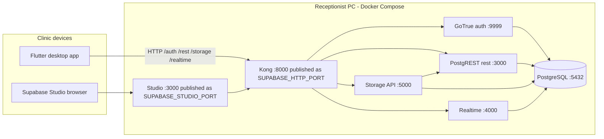
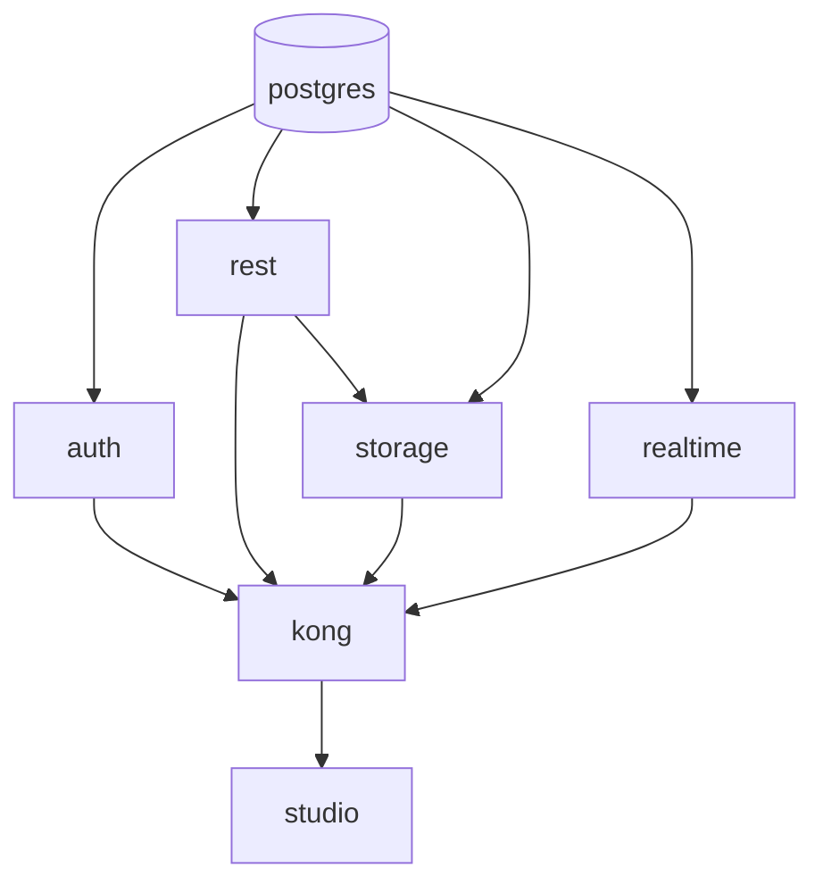
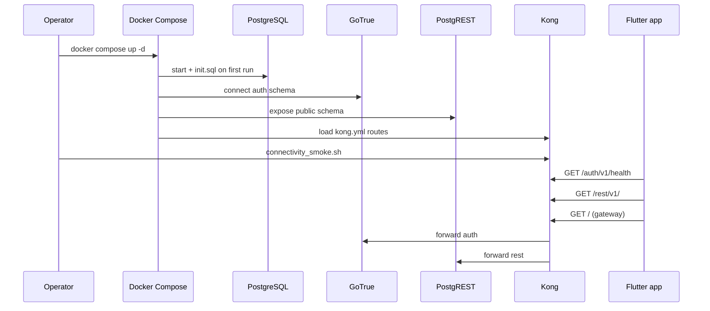

# Backend Implementation Guide

# Phase 1 and 2

## Purpose and current scope

The backend for AiClinic Phase 1 / Phase 2 (`spec001/p01p02`) is not a custom application server. It is a **clinic-local Supabase stack** packaged for repeatable local and LAN deployment: PostgreSQL plus the standard Supabase services (Auth, PostgREST, Storage, Realtime), fronted by Kong as a single HTTP gateway, with Supabase Studio for operators.

In the current codebase, the backend implementation is intentionally narrow:

- Docker Compose orchestration under `backend/local/`
- minimal PostgreSQL bootstrap (`init.sql`) for Supabase roles and schemas
- Kong declarative routing to internal services
- environment-driven ports and JWT/API keys
- a shell-based connectivity smoke harness under `backend/tests/`
- a checked-in Supabase CLI workspace under `backend/supabase/` (tooling scaffold, not the primary runtime path today)

Implemented concerns:

- single-command local stack bring-up via Docker Compose
- one public HTTP gateway port for client devices (`SUPABASE_HTTP_PORT`, default `54321`)
- Auth, REST, Storage, and Realtime routes exposed through Kong
- PostgreSQL with `anon`, `authenticated`, and `service_role` roles required by PostgREST and RLS
- Supabase Studio on a separate port for local administration
- automated smoke checks for gateway reachability

Not implemented yet:

- domain tables, migrations, RLS policies, or RPC functions
- Edge Functions runtime in the Compose stack
- email testing (Inbucket) in the Compose stack
- connection pooler (Supavisor) in the Compose stack
- production hardening (TLS termination, secret rotation, backups automation)
- cloud Supabase project linkage

The backend exists so the Flutter client can validate `deployment-profile.json`, probe clinic-local connectivity, and later initialize `supabase_flutter` against a real gateway—without introducing a bespoke API layer.

## Code map

The backend is best understood as three cooperating areas:

| Path                                    | Role                                                                                         |
| --------------------------------------- | -------------------------------------------------------------------------------------------- |
| `backend/local/docker-compose.yml`      | Primary runtime definition: services, dependencies, ports, volumes                           |
| `backend/local/.env` / `.env.example`   | Host-visible ports, public URLs, JWT secret, demo anon/service keys                          |
| `backend/local/init.sql`                | First-boot PostgreSQL bootstrap for Supabase roles and `auth` / `storage` schemas            |
| `backend/local/kong.yml`                | Declarative Kong routes: `/auth/v1/`, `/rest/v1/`, `/storage/v1/`, `/realtime/v1/`           |
| `backend/local/config.toml`             | Lightweight Supabase-style metadata aligned with local ports (documentation parity)          |
| `backend/tests/connectivity_smoke.sh`   | Post-start verification of auth, REST, and storage through the gateway                       |
| `backend/tests/validate_local_stack.sh` | End-to-end stack bring-up, readiness wait, smoke checks, optional teardown (US2, T018)       |
| `backend/supabase/config.toml`          | Full Supabase CLI project config (migrations, seeds, auth defaults) for future CLI workflows |

There is no `backend/src/`, no custom HTTP handlers, and no application-specific SQL beyond bootstrap roles/schemas.

## Ownership model

Responsibility is split along constitution boundaries:

1. **Docker Compose (`backend/local/`)** owns process topology, image versions, networking, and persistent volumes on the receptionist PC.
2. **Kong (`kong.yml`)** owns external URL shape: clients always talk to one base URL; path prefixes route to internal services.
3. **PostgreSQL (`postgres` service + `init.sql`)** owns database availability and Supabase role prerequisites.
4. **GoTrue (`auth`)** owns authentication APIs behind `/auth/v1/`.
5. **PostgREST (`rest`)** owns auto-generated REST under `/rest/v1/` (schema exposure only; no app tables yet).
6. **Storage API (`storage`)** owns file API under `/storage/v1/`.
7. **Realtime (`realtime`)** owns websocket endpoint under `/realtime/v1/`.
8. **Supabase Studio (`studio`)** owns operator UI; it is not part of the clinic client data plane.
9. **`connectivity_smoke.sh`** owns automated “is the gateway alive?” checks for CI and developers.
10. **`validate_local_stack.sh`** owns full-stack validation: optional `compose up`, gateway readiness polling, smoke execution, Kong health assertion, optional `compose down`.

Flutter remains responsible for startup UX, deployment-profile validation, and health probing. PostgreSQL will eventually own domain integrity via constraints, triggers, RLS, and RPC—none of that exists in this phase.

## High-level architecture



**Key design choice:** only Kong’s proxy port (mapped to `SUPABASE_HTTP_PORT`) and Studio’s port are published to the host. Auth, REST, Storage, and Realtime are `expose`d on the internal Docker network only. External clients—including other PCs on the clinic LAN—should use the gateway URL (for example `http://192.168.1.100:54321`), not service-specific ports.

## Directory layout

```text
backend/
├── local/
│   ├── docker-compose.yml   # Stack definition
│   ├── kong.yml             # Gateway routes
│   ├── init.sql             # DB bootstrap on first volume init
│   ├── config.toml          # Port/schema metadata (local mirror)
│   ├── .env.example         # Committed defaults / template
│   └── .env                 # Local overrides (gitignored)
├── tests/
│   ├── connectivity_smoke.sh
│   └── validate_local_stack.sh
└── supabase/
    ├── config.toml          # Supabase CLI project (future migrations)
    └── .gitignore
```

## Runtime stack: `docker-compose.yml`

Compose project name comes from `COMPOSE_PROJECT_NAME` in `.env` (default `ai_clinic_local`). All application services use `restart: unless-stopped` so the clinic server node recovers after reboot when Docker starts.

### `postgres`

- **Image:** `supabase/postgres:15.8.1.085`
- **Purpose:** Primary data store for Auth metadata, future app schema, Storage metadata, and Realtime replication state.
- **Host port:** `${SUPABASE_DB_PORT}:5432` (default `54322` → container `5432`) for direct SQL access during development.
- **Environment:** `POSTGRES_PASSWORD`, `JWT_SECRET` (same value as `SUPABASE_JWT_SECRET`), `JWT_EXP: 3600`.
- **Volumes:**
  - `postgres_data` — durable database files
  - `./init.sql` mounted to `/docker-entrypoint-initdb.d/00-init.sql` — runs **only on first empty volume initialization**

If you need to re-run `init.sql` after changing it, you must remove the `postgres_data` volume (destructive) or apply changes manually.

### `auth` (GoTrue)

- **Image:** `supabase/gotrue:v2.186.0`
- **Depends on:** `postgres`
- **Internal port:** `9999` (`expose` only)
- **Notable environment:**
  - `API_EXTERNAL_URL` → `${SUPABASE_PUBLIC_URL}` (what clients see as the API base)
  - `GOTRUE_SITE_URL` / `GOTRUE_URI_ALLOW_LIST` → `${SUPABASE_SITE_URL}` (redirect allow-list for auth flows)
  - `GOTRUE_DB_DATABASE_URL` → Postgres with `search_path=auth`
  - `GOTRUE_JWT_SECRET` → shared signing secret for JWTs
  - `GOTRUE_DISABLE_SIGNUP: "false"` — sign-up enabled for local dev (tighten for production clinics later)
  - `GOTRUE_JWT_ADMIN_ROLES: service_role` — admin JWT role mapping

GoTrue creates and manages the `auth` schema tables on startup when connected to an empty `auth` schema. `init.sql` ensures the schema exists before migrations run.

### `rest` (PostgREST)

- **Image:** `postgrest/postgrest:v14.8`
- **Depends on:** `postgres`
- **Internal port:** `3000`
- **Notable environment:**
  - `PGRST_DB_URI` — full database connection as `postgres` superuser
  - `PGRST_DB_SCHEMAS: public` — only `public` is exposed via REST in V1-0
  - `PGRST_DB_ANON_ROLE: anon` — unauthenticated requests assume the `anon` role
  - `PGRST_JWT_SECRET` — must match GoTrue JWT secret for role elevation from JWT claims

With no tables in `public`, `GET /rest/v1/` still proves PostgREST and Kong routing work; the frontend treats sub-500 responses (including `404`) as reachable.

### `storage`

- **Image:** `supabase/storage-api:v1.48.26`
- **Depends on:** `postgres`, `rest`
- **Internal port:** `5000`
- **Backend:** local filesystem (`STORAGE_BACKEND: file`, path `/var/lib/storage`)
- **Volume:** `storage_data` mounted at `/var/lib/storage`
- **Keys:** `ANON_KEY` and `SERVICE_KEY` from env (must match JWTs the clients use)
- **Integration:** `POSTGREST_URL: http://rest:3000` for metadata operations

### `realtime`

- **Image:** `supabase/realtime:v2.76.5`
- **Depends on:** `postgres`
- **Internal port:** `4000`
- **Notable environment:** DB connection to `postgres`, `API_JWT_SECRET`, `SECRET_KEY_BASE` (Realtime internal signing)
- **Kong path:** routes to `http://realtime:4000/socket/` with public prefix `/realtime/v1/`

Realtime is included for parity with production Supabase topology even though the current Flutter startup flow does not probe it.

### `kong`

- **Image:** `kong/kong:3.9.1`
- **Mode:** database-less declarative config (`KONG_DATABASE: "off"`, `KONG_DECLARATIVE_CONFIG: /home/kong/kong.yml`)
- **Published port:** `${SUPABASE_HTTP_PORT}:8000` — **this is the clinic gateway**
- **Admin API:** `127.0.0.1:8001` inside the container (not published to host by default)
- **Depends on:** `auth`, `rest`, `storage`, `realtime`

Kong terminates HTTP from clients and forwards to internal services without path rewriting beyond what each route defines (`strip_path: false` everywhere).

### `studio`

- **Image:** `supabase/studio:2026.04.27-sha-5f60601`
- **Depends on:** `kong`
- **Published port:** `${SUPABASE_STUDIO_PORT}:3000` (default `54323`)
- **Connects to:** `SUPABASE_URL: http://kong:8000` internally; displays `SUPABASE_PUBLIC_URL` to the operator
- **Keys:** anon and service role keys from `.env` for in-browser API calls

Studio is for developers and clinic IT on the server node, not for end-user clinical workflows.

### Named volumes

| Volume          | Service  | Purpose               |
| --------------- | -------- | --------------------- |
| `postgres_data` | postgres | Database files        |
| `storage_data`  | storage  | Uploaded object files |

## Gateway routing: `kong.yml`

Kong uses declarative format version `3.0` with `_transform: true`. Each Supabase surface area gets a named service and route:

| Service  | Upstream                       | Public path prefix | strip_path |
| -------- | ------------------------------ | ------------------ | ---------- |
| auth     | `http://auth:9999/`            | `/auth/v1/`        | false      |
| rest     | `http://rest:3000/`            | `/rest/v1/`        | false      |
| storage  | `http://storage:5000/`         | `/storage/v1/`     | false      |
| realtime | `http://realtime:4000/socket/` | `/realtime/v1/`    | false      |

`strip_path: false` means a request to `http://gateway:54321/auth/v1/health` is forwarded to GoTrue as `/auth/v1/health`, not `/health`. This matches Supabase client SDK expectations.

**Example resolved URLs** (default `.env.example`):

| Probe / API  | URL                                             |
| ------------ | ----------------------------------------------- |
| Gateway root | `http://127.0.0.1:54321/`                       |
| Auth health  | `http://127.0.0.1:54321/auth/v1/health`         |
| REST         | `http://127.0.0.1:54321/rest/v1/`               |
| Storage      | `http://127.0.0.1:54321/storage/v1/`            |
| Realtime     | `ws://127.0.0.1:54321/realtime/v1/` (websocket) |

## Database bootstrap: `init.sql`

On first PostgreSQL initialization only, `init.sql`:

1. Creates roles if missing:
   - `anon` — `nologin` (PostgREST anonymous role)
   - `authenticated` — `nologin` (JWT-authenticated role)
   - `service_role` — `nologin bypassrls` (admin/service operations)
2. Creates schemas if missing:
   - `auth` — GoTrue
   - `storage` — Storage API metadata

No application tables, extensions, or RLS policies are created in this phase. Domain schema will arrive via future migrations under `backend/supabase/` (CLI) or additional SQL mounted into Postgres.

## Configuration and secrets

### `.env.example` (committed template)

| Variable                      | Default                   | Meaning                                                         |
| ----------------------------- | ------------------------- | --------------------------------------------------------------- |
| `COMPOSE_PROJECT_NAME`        | `ai_clinic_local`         | Docker Compose project name                                     |
| `SUPABASE_HTTP_PORT`          | `54321`                   | Host port for Kong gateway                                      |
| `SUPABASE_DB_PORT`            | `54322`                   | Host port for direct Postgres                                   |
| `SUPABASE_STUDIO_PORT`        | `54323`                   | Host port for Studio UI                                         |
| `SUPABASE_PUBLIC_URL`         | `http://127.0.0.1:54321`  | URL clients and GoTrue advertise                                |
| `SUPABASE_SITE_URL`           | `http://127.0.0.1:3000`   | Auth redirect allow-list base (placeholder for future web auth) |
| `POSTGRES_PASSWORD`           | `postgres`                | Database superuser password                                     |
| `SUPABASE_JWT_SECRET`         | demo-length secret string | Signs JWTs for Auth and validates in PostgREST/Realtime         |
| `SUPABASE_ANON_KEY`           | demo JWT                  | Public client key (role `anon`)                                 |
| `SUPABASE_SERVICE_ROLE_KEY`   | demo JWT                  | Service key (role `service_role`, bypasses RLS)                 |
| `SUPABASE_SECRET_KEY_BASE`    | random string             | Realtime internal secret                                        |
| `STUDIO_DEFAULT_ORGANIZATION` | `AiClinic`                | Studio sidebar label                                            |
| `STUDIO_DEFAULT_PROJECT`      | `clinic-local`            | Studio project label                                            |

Copy to `.env` for local overrides:

```bash
cp backend/local/.env.example backend/local/.env
```

`.env` is gitignored (see root `.gitignore`). **Never commit real clinic secrets.** The committed anon/service keys are Supabase demo keys suitable only for local scaffolding.

**JWT coherence rule:** `SUPABASE_JWT_SECRET` must be identical across `postgres`, `auth`, `rest`, `storage`, and `realtime`. If you change the secret, regenerate `SUPABASE_ANON_KEY` and `SUPABASE_SERVICE_ROLE_KEY` with the same secret or Auth and PostgREST will reject tokens.

### `backend/local/config.toml`

A short Toml file mirroring CLI conventions:

- `project_id = "ai-clinic-local"`
- API port `54321`, schemas `["public"]`, `max_rows = 1000`
- DB port `54322`, Postgres major version `15`
- Studio port `54323`
- Auth `site_url` and storage/realtime enabled flags

This file documents intended ports alongside Compose; it is not automatically consumed by Docker Compose today.

### `backend/supabase/config.toml`

Full Supabase CLI configuration generated by `supabase init`. Notable differences from the Compose stack:

- `project_id = "backend"`
- DB `major_version = 17` in CLI config vs Postgres **15** image in Compose — intentional mismatch until migrations are unified; align versions before running CLI `db push` against this Compose database
- Enables Inbucket, analytics, edge runtime, seed paths — features **not** started by current `docker-compose.yml`

Treat `backend/supabase/` as the **future** migration and CLI workflow home. The **current** runnable stack is `backend/local/docker-compose.yml`.

## End-to-end request lifecycle

### Client health probe (Flutter)

The frontend `StartupHealthService` probes three URLs derived from `SupabaseConfig`:

1. `gatewayProbeUrl` — deployment profile `supabase_url`
2. `authHealthUrl` — `{supabase_url}/auth/v1/health`
3. `restProbeUrl` — `{supabase_url}/rest/v1/`

Reachability rule: HTTP status &lt; 500 counts as reachable (includes `401`, `404`). Timeout is 3 seconds per probe.

Aggregate status:

- 3 reachable → `healthy`
- 0 reachable → `unreachable`
- otherwise → `degraded`

Storage and Realtime are not probed by Flutter in this phase, but `connectivity_smoke.sh` does probe storage.

### Smoke test script

`backend/tests/connectivity_smoke.sh`:

1. Resolves `backend/local/.env` or falls back to `.env.example`
2. Sets `base_url` from `SUPABASE_PUBLIC_URL` or `http://127.0.0.1:${SUPABASE_HTTP_PORT}`
3. `curl` probes with 5s timeout:
   - `auth health` → `${base_url}/auth/v1/health`
   - `rest gateway` → `${base_url}/rest/v1/`
   - `storage gateway` → `${base_url}/storage/v1/`
4. Passes on `2xx`, `3xx`, `401`, or `404`; fails on unreachable or other statuses
5. Exits non-zero if any probe fails

Run after the stack is up:

```bash
cd backend/local && docker compose up -d
cd ../.. && ./backend/tests/connectivity_smoke.sh
```

## Operating the stack

### Prerequisites

- Docker Engine with Compose v2
- Sufficient disk for `postgres_data` and `storage_data`
- Host firewall allows `SUPABASE_HTTP_PORT` from clinic LAN when acting as server node

### Start / stop

```bash
cd backend/local
docker compose up -d      # start detached
docker compose ps         # service status
docker compose logs -f kong auth rest   # follow logs
docker compose down       # stop containers (volumes persist)
docker compose down -v    # stop and delete volumes (wipes DB + storage)
```

### Port reference (defaults)

| Port  | Consumer                                                                   |
| ----- | -------------------------------------------------------------------------- |
| 54321 | Kong gateway — **put this in `deployment-profile.json` as `supabase_url`** |
| 54322 | PostgreSQL — SQL tools, backups, migrations                                |
| 54323 | Supabase Studio — browser admin                                            |

### LAN exposure (receptionist server node)

For client workstations on the clinic LAN:

1. Run Compose on the receptionist PC.
2. Set `SUPABASE_PUBLIC_URL` to the LAN-reachable gateway, e.g. `http://192.168.1.100:54321`.
3. Open host firewall for TCP `SUPABASE_HTTP_PORT`.
4. Distribute `deployment-profile.json` to clients:

```json
{
  "deployment_mode": "local",
  "supabase_url": "http://192.168.1.100:54321",
  "supabase_anon_key": "<same SUPABASE_ANON_KEY as server .env>"
}
```

GoTrue’s `API_EXTERNAL_URL` must match what clients use, or auth redirects and metadata may be wrong.

Studio can remain bound to localhost-only access in production clinics; only the gateway must be LAN-wide.

## Service dependency graph



Startup order is enforced by Compose `depends_on`. Kong may briefly return `502` while upstreams initialize; retry smoke tests after health stabilizes.

## Integration with the frontend

| Concern           | Backend provides              | Frontend consumes                      |
| ----------------- | ----------------------------- | -------------------------------------- |
| Gateway URL       | Kong on `SUPABASE_PUBLIC_URL` | `deployment_profile.supabase_url`      |
| Anon key          | `SUPABASE_ANON_KEY` in `.env` | `deployment_profile.supabase_anon_key` |
| Auth health       | `/auth/v1/health` via Kong    | `SupabaseConfig.authHealthUrl`         |
| REST availability | `/rest/v1/` via Kong          | `SupabaseConfig.restProbeUrl`          |
| Storage           | `/storage/v1/` via Kong       | smoke script only (not Flutter yet)    |

The Flutter app does **not** mount the Supabase SDK yet; it only performs HTTP reachability checks. When SDK integration lands, it will target the same gateway URL and anon key—no backend code changes required for basic client init.

## Security posture in V1-0

This stack is a **development and scaffolding** baseline, not a hardened clinic production deployment:

- Default passwords and demo JWT keys in `.env.example`
- Sign-up enabled in GoTrue
- `service_role` bypasses RLS when used
- No TLS on the gateway
- Database and Studio ports may be exposed on the host

Before any real PHI or production clinic use:

- Replace all secrets and JWT keys; store `.env` outside git
- Restrict Studio and Postgres ports to admin networks
- Add TLS or clinic VPN requirements per `docs/architecture/03-deployment-networking.md`
- Disable public sign-up; use invite-only or provisioned accounts
- Implement RLS on all tables and avoid shipping `service_role` to client devices

## Testing and verification

| Check                 | Command / action                                        |
| --------------------- | ------------------------------------------------------- |
| Containers running    | `docker compose ps` in `backend/local`                  |
| Gateway smoke         | `./backend/tests/connectivity_smoke.sh`                 |
| Full stack validation | `./backend/tests/validate_local_stack.sh` (see Phase 4) |
| Manual auth           | `curl -sS "${SUPABASE_PUBLIC_URL}/auth/v1/health"`      |
| Manual REST           | `curl -sS "${SUPABASE_PUBLIC_URL}/rest/v1/"`            |
| Studio UI             | open `http://127.0.0.1:54323` (default)                 |

## What is intentionally out of scope

Aligned with `specs/001-project-scaffolding/` and constitution checks:

- Custom Node/Go/Dart API servers
- Domain migrations, seeds, and business RPCs
- Row Level Security policies
- Edge Functions in Compose
- Email (Inbucket) in Compose
- Connection pooler
- AI service container (AI talks to Flutter only)
- Cloud Supabase linking and sync

## Extension points

The likely evolution path:

1. **Migrations** — add `backend/supabase/migrations/*.sql`, align CLI `major_version` with Compose Postgres image, run `supabase db reset` / `db push` against local Postgres
2. **RLS and roles** — grant `anon` / `authenticated` appropriate table privileges; never expose `service_role` to desktop clients
3. **RPC functions** — domain writes via `supabase.rpc()` per `docs/architecture/04-backend.md`
4. **Hardening** — TLS terminator in front of Kong, secret management, backup job for `postgres_data`
5. **Realtime probe** — optional fourth Flutter probe for parity with smoke coverage

## Current design strengths

- Matches production Supabase topology (gateway + standard path prefixes) without custom servers
- Single public port simplifies LAN firewall rules and deployment profiles
- Internal-only service ports reduce accidental direct exposure
- Smoke script encodes the same reachability semantics as Flutter (treat `401`/`404` as alive)
- Volumes make restart non-destructive; bootstrap SQL is idempotent on fresh installs
- Studio gives operators visibility before Flutter features exist

## Current design constraints

- Two config sources (`backend/local` vs `backend/supabase`) can drift (Postgres 15 vs 17, feature flags)
- `init.sql` does not re-run on existing volumes
- No healthcheck directives in Compose — dependents use `depends_on` only, not readiness
- Demo keys in `.env.example` must not be reused in production
- Flutter does not probe storage/realtime; degraded gateway might still show partial green if only auth+REST respond
- No automated backup of `postgres_data` / `storage_data`

## Lifecycle diagram (bring-up to client probe)



## Summary

The backend implementation is a **self-hosted Supabase-compatible stack** under `backend/local/`, not application source code. Docker Compose runs PostgreSQL, GoTrue, PostgREST, Storage, Realtime, and Kong; Kong publishes one clinic gateway URL that matches what the Flutter deployment profile and health probes expect. `init.sql` seeds only Supabase prerequisites; domain data and security rules come later via migrations and RLS. `connectivity_smoke.sh` provides a minimal automated guarantee that the gateway and core APIs are reachable before developers or CI rely on the frontend startup flow.

---

# Phase 3

## Purpose and scope

Phase 3 in `specs/001-project-scaffolding/tasks.md` covers **User Story 1** on the Flutter client only (T011–T017). There are **no Phase 3 backend tasks**: no new Compose services, SQL migrations, Kong routes, environment variables, or changes to `backend/tests/connectivity_smoke.sh`.

The clinic-local stack delivered in Phase 1 and Phase 2 is the **runtime dependency** for Phase 3 acceptance testing. Phase 3 frontend behavior assumes the gateway URLs and reachability semantics documented above remain stable.

## What changed in the repository

| Path                                  | Phase 3 change |
| ------------------------------------- | -------------- |
| `backend/local/docker-compose.yml`    | None           |
| `backend/local/kong.yml`              | None           |
| `backend/local/init.sql`              | None           |
| `backend/local/.env.example`          | None           |
| `backend/local/config.toml`           | None           |
| `backend/tests/connectivity_smoke.sh` | None           |
| `backend/supabase/`                   | None           |

No new files were added under `backend/` for Phase 3.

## How Phase 3 uses the existing stack

The Flutter startup flow (Phase 3) exercises the same three HTTP surfaces the backend already exposes through Kong:

| Frontend probe (`StartupHealthService`)    | Backend endpoint (via gateway) | Used in smoke script              |
| ------------------------------------------ | ------------------------------ | --------------------------------- |
| `gatewayProbeUrl` (profile `supabase_url`) | Kong root / gateway            | No (Flutter only)                 |
| `authHealthUrl` → `{base}/auth/v1/health`  | GoTrue health                  | Yes                               |
| `restProbeUrl` → `{base}/rest/v1/`         | PostgREST                      | Yes                               |
| —                                          | `{base}/storage/v1/`           | Yes (smoke only; not Flutter yet) |

Reachability rules are aligned between client and smoke harness:

- HTTP status **&lt; 500** counts as reachable (includes `401`, `404`)
- Timeouts count as unreachable
- Flutter aggregate: 3/3 → healthy, 0/3 → unreachable, otherwise → degraded

So operators validating Phase 3 should still bring up the stack the same way as Phase 2:

```bash
cd backend/local
cp -n .env.example .env   # if needed
docker compose up -d
cd ../..
./backend/tests/connectivity_smoke.sh
```

Then point the client `deployment-profile.json` at the same gateway URL and anon key as `SUPABASE_PUBLIC_URL` / `SUPABASE_ANON_KEY` in `backend/local/.env`.

## Operator scenarios for Phase 3 acceptance

| Scenario                            | Backend expectation                               | Expected client behavior                                                     |
| ----------------------------------- | ------------------------------------------------- | ---------------------------------------------------------------------------- |
| Stack up, valid profile             | Smoke script passes; auth + REST respond via Kong | Entry screen, connectivity **Healthy**                                       |
| Stack stopped or wrong LAN URL      | Probes time out or fail                           | Entry screen remains (valid profile), **Unreachable** or **Degraded** notice |
| Partial failure (e.g. only auth up) | Some probes &lt; 500, not all three               | **Degraded** on entry screen                                                 |
| Invalid/missing profile             | Backend irrelevant until profile fixed            | Setup guidance (no dependency on stack)                                      |

Protected-route blocking is entirely a **frontend routing** concern; the backend does not participate in `/protected/*` guards in V1-0.

## Testing matrix (backend + Phase 3 frontend)

| Step              | Command / action                                                                             |
| ----------------- | -------------------------------------------------------------------------------------------- |
| 1. Start stack    | `docker compose up -d` in `backend/local`                                                    |
| 2. Backend smoke  | `./backend/tests/connectivity_smoke.sh`                                                      |
| 3. Client profile | `supabase_url` = gateway (default `http://127.0.0.1:54321`), `supabase_anon_key` from `.env` |
| 4. Client tests   | `cd frontend && flutter test`                                                                |
| 5. Manual UI      | `flutter run` — entry, degraded (stack down), protected-route guard                          |

LAN client testing: set `SUPABASE_PUBLIC_URL` on the server to the receptionist PC’s LAN IP, open firewall for `SUPABASE_HTTP_PORT`, distribute the same URL and anon key in client profiles (unchanged from Phase 2).

## Planned backend work (not Phase 3)

Still out of scope and tracked for later phases in `tasks.md`:

- Domain migrations, RLS, RPCs under `backend/supabase/migrations/`
- Storage/realtime probes from Flutter (optional parity with smoke script)
- Production hardening (TLS, secret rotation, backups)

## Phase 3 summary

Phase 3 does not modify the backend implementation. The existing clinic-local Supabase Compose stack, Kong routing, and `connectivity_smoke.sh` remain the authoritative backend surface for startup. Phase 3 adds client-side startup UX and tests that **consume** those endpoints; verifying User Story 1 still requires a running stack (or deliberate unreachability) plus a valid deployment profile.

---

# Phase 4

**Commit:** `fdb28e09e420517e8fab246fe40bbb47d71ba92b` — *Phase 4 Implementation*

## Purpose and scope

Phase 4 implements **User Story 2 — Prepare a Workstation Consistently** (`specs/001-project-scaffolding/tasks.md`, T018–T024). The backend contribution is **operational validation and documentation**, not new Compose services or application SQL.

Goals:

- give developers and operators a single script to prove the clinic-local stack is up and reachable
- document repeatable setup for developer machines, receptionist server nodes, and clinic clients
- align quickstart and deployment-profile contracts with those guides

## What changed in the repository

| Path                                                            | Phase 4 change                                      |
| --------------------------------------------------------------- | --------------------------------------------------- |
| `backend/tests/validate_local_stack.sh`                         | **NEW** — full-stack validation harness (T018)      |
| `backend/local/docker-compose.yml`                              | None                                                |
| `backend/local/kong.yml`                                        | None                                                |
| `backend/local/init.sql`                                        | None                                                |
| `backend/tests/connectivity_smoke.sh`                           | None (still invoked by validate script)             |
| `docs/setup/developer-workstation.md`                           | **NEW** — developer setup (T020)                    |
| `docs/setup/server-node.md`                                     | **NEW** — receptionist PC / LAN exposure (T021)     |
| `docs/setup/client-workstation.md`                              | **NEW** — client profile and connectivity (T022)    |
| `docs/setup/troubleshooting.md`                                 | **NEW** — backups and troubleshooting (T023)        |
| `docs/setup/verification-checklist.md`                          | **NEW** — acceptance checklist (T019)               |
| `specs/001-project-scaffolding/quickstart.md`                   | Updated to reference setup docs and validate script |
| `specs/001-project-scaffolding/contracts/deployment-profile.md` | Expanded contract alignment (T024)                  |
| `specs/001-project-scaffolding/tasks.md`                        | T018–T024 marked complete                           |

No changes under `backend/local/` runtime definitions. Phase 4 adds **how to run and verify** the existing stack, not new services.

## `validate_local_stack.sh` (T018)

Executable at `backend/tests/validate_local_stack.sh`. It orchestrates bring-up, readiness, smoke checks, and optional teardown.

### Behavior

1. **Prerequisites** — requires `docker`, `curl`, and Docker Compose v2 plugin.
2. **Environment** — loads `backend/local/.env`; copies from `.env.example` if missing.
3. **Start (default)** — runs `docker compose up -d` in `backend/local/` unless `--no-start` is passed.
4. **Readiness** — polls `{SUPABASE_PUBLIC_URL}/auth/v1/health` until HTTP is non-empty and not `000`, up to `--max-wait` seconds (default 120).
5. **Smoke** — runs `./backend/tests/connectivity_smoke.sh` (auth, REST, storage probes).
6. **Container check** — runs `docker compose ps` and fails if Kong is not in `running` state.
7. **Teardown (optional)** — with `--teardown`, runs `docker compose down` after success.

### CLI options

| Flag             | Effect                                                 |
| ---------------- | ------------------------------------------------------ |
| `--no-start`     | Skip `compose up`; fail if gateway never becomes ready |
| `--teardown`     | `compose down` after successful validation             |
| `--max-wait SEC` | Override readiness timeout (default 120)               |
| `-h`, `--help`   | Usage text                                             |

### Typical commands

```bash
# Stack already running (developer loop)
./backend/tests/validate_local_stack.sh --no-start

# First-time or CI: start, validate, leave running
./backend/tests/validate_local_stack.sh

# CI: start, validate, tear down
./backend/tests/validate_local_stack.sh --teardown
```

On success, the script prints gateway, Studio, Postgres host ports, and reminds operators to copy `SUPABASE_ANON_KEY` into `deployment-profile.json`.

### Relationship to `connectivity_smoke.sh`

| Script                    | Responsibility                                                                      |
| ------------------------- | ----------------------------------------------------------------------------------- |
| `connectivity_smoke.sh`   | Assumes stack is up; curls auth, REST, storage; exits non-zero on failure           |
| `validate_local_stack.sh` | Optional compose lifecycle, gateway wait loop, invokes smoke, verifies Kong running |

Use smoke alone for quick checks; use validate for onboarding, checklist acceptance, and scripted CI (when a Docker host is available).

## Operator documentation (`docs/setup/`)

Phase 4 setup guides live outside `backend/` but define how the stack is installed and verified:

| Document                    | Audience          | Backend relevance                                                   |
| --------------------------- | ----------------- | ------------------------------------------------------------------- |
| `developer-workstation.md`  | Engineers         | Flutter toolchain, clone, `validate_local_stack.sh`, profile paths  |
| `server-node.md`            | Receptionist / IT | Compose on clinic PC, `SUPABASE_PUBLIC_URL`, firewall, LAN clients  |
| `client-workstation.md`     | Clinic desktops   | `deployment-profile.json`, gateway URL, anon key from server `.env` |
| `troubleshooting.md`        | All               | Logs, ports, volume reset, backup expectations                      |
| `verification-checklist.md` | Acceptance        | Step-by-step US2 independent test                                   |

`specs/001-project-scaffolding/quickstart.md` now points to these paths instead of duplicating full setup prose.

## Testing matrix (Phase 4)

| Step                | Command / action                                                          |
| ------------------- | ------------------------------------------------------------------------- |
| 1. Validate stack   | `./backend/tests/validate_local_stack.sh` (or `--no-start` if already up) |
| 2. Quick smoke only | `./backend/tests/connectivity_smoke.sh`                                   |
| 3. Checklist        | Follow `docs/setup/verification-checklist.md`                             |
| 4. Client           | Valid profile + `flutter run` (Phase 3 startup UX)                        |

## Phase 4 summary

Phase 4 delivers **T018** (`validate_local_stack.sh`) and operator setup documentation. The clinic-local Supabase stack definition is unchanged; validation and written procedures make User Story 2 independently testable alongside User Story 1.

---

# Phase 5

**Commit:** `ee2e62cff10cedde30f1b231ba465bc938bbceff` — *Phase 5 Implementation*

## Backend impact

Phase 5 has **no changes** under `backend/`. User Story 3 is entirely frontend shared foundations, foundation demo screen, and GitHub Actions CI for `flutter analyze` / `flutter test` / `flutter build windows`.

The clinic-local Compose stack, Kong routes, and test scripts (`connectivity_smoke.sh`, `validate_local_stack.sh`) are unchanged. CI does not run Docker stack validation; operators still use Phase 4 scripts and setup docs for backend bring-up.
