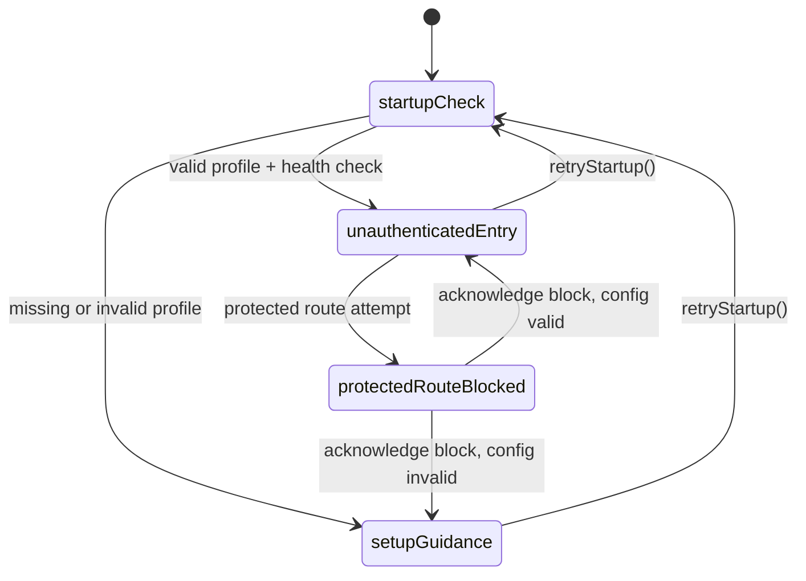
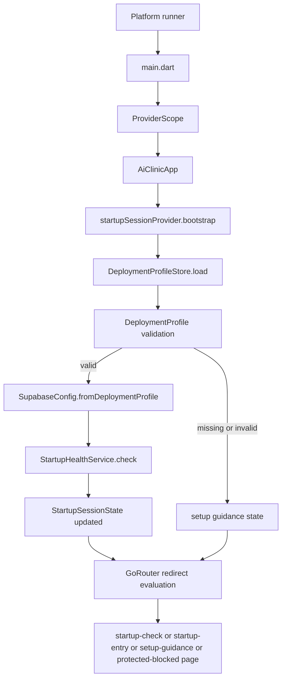
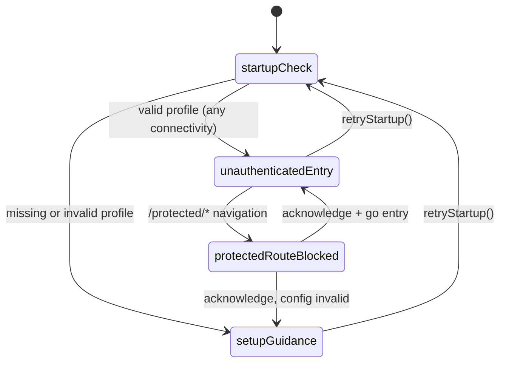

# Frontend Implementation Guide

# Phase 1 and 2

## Purpose and current scope

The frontend is a Flutter startup shell for AiClinic's clinic-local deployment model. In the current codebase, the implemented runtime is intentionally narrow: it validates local configuration, probes backend reachability, exposes a safe pre-auth startup experience, and blocks access to protected routes until authenticated flows exist.

Today, almost all application-specific behavior lives under `frontend/lib`. The runtime surface is still small and centered on a single Riverpod state machine plus a GoRouter redirect layer.

Implemented concerns:

- application bootstrap
- deployment-profile loading and validation
- clinic-local connectivity checks
- guarded routing before authentication
- startup, setup-guidance, and blocked-route screens
- shared theme, loading, and failure presentation foundations

Not implemented yet:

- Supabase SDK initialization
- authentication/session management
- domain features beyond startup and the US3 foundation demo
- persistent local settings such as stored theme mode (theme mode is in-memory via startup session only)

## Code map

The current implementation is best understood as a small set of cooperating layers:

- `frontend/lib/main.dart`
  The Dart entrypoint. It only creates a top-level `ProviderScope` and mounts `AiClinicApp`.

- `frontend/lib/app/app.dart`
  The root widget. It triggers bootstrap once, reads the app router, and applies the current `ThemeMode`.

- `frontend/lib/app/router.dart`
  Owns all current routes, redirect logic, and the startup-oriented pages. This file currently contains both routing and presentation for the startup flow.

- `frontend/lib/shared/providers/startup_session_provider.dart`
  The main orchestration layer. It owns startup state, theme mode, bootstrap lifecycle, and protected-route blocking.

- `frontend/lib/shared/services/startup_health_service.dart`
  Performs backend reachability probes against the configured Supabase gateway, auth health endpoint, and REST endpoint.

- `frontend/lib/core/config/deployment_profile.dart`
  Defines the deployment-profile contract, validation rules, and file lookup behavior.

- `frontend/lib/core/config/supabase_config.dart`
  Adapts a validated deployment profile into probeable endpoint URLs.

- `frontend/lib/core/errors/exceptions.dart`
  Defines typed exceptions for configuration and startup failures.

- `frontend/lib/core/errors/failures.dart`
  Maps internal exceptions into UI-facing failure models.

- `frontend/lib/core/widgets/app_loading_state.dart`
  Shared loading UI used during bootstrap.

- `frontend/lib/app/theme/app_theme.dart`
  Defines the app's light and dark Material 3 theme foundations.

There is also a planned but mostly unused architectural boundary in `frontend/lib/features`. At the moment, the startup experience is still app-shell-centric rather than feature-modular.

## Ownership model

The frontend follows a simple ownership chain:

1. `main.dart` owns process startup.
2. `AiClinicApp` owns app-shell initialization and theming.
3. `StartupSessionNotifier` owns startup state and side effects.
4. `DeploymentProfileStore` owns configuration discovery.
5. `StartupHealthService` owns connectivity probing.
6. `GoRouter` owns route selection based on startup state.
7. Startup pages render the current state and expose user actions.

That chain keeps the current design easy to reason about because nearly every runtime decision flows through a single state object: `StartupSessionState`.

## End-to-end lifecycle

### 1. Process startup

The Flutter host boots the app and enters `frontend/lib/main.dart`. The entrypoint is intentionally minimal:

```dart
void main() {
  runApp(const ProviderScope(child: AiClinicApp()));
}
```

This makes Riverpod available to the entire widget tree from the first frame.

### 2. App-shell initialization

`AiClinicApp` is a `ConsumerStatefulWidget`. In `initState`, it schedules bootstrap with a microtask:

```dart
Future<void>.microtask(() {
  return ref.read(startupSessionProvider.notifier).bootstrap();
});
```

Important implications:

- bootstrap is kicked off once when the app widget is first mounted
- the call is deferred until after `initState`, avoiding provider work directly inline with widget construction
- startup logic is centralized in the notifier rather than spread through widgets

In `build`, the widget watches:

- `appRouterProvider` for navigation
- `startupSessionProvider` for the active `ThemeMode`

Because the entire session object is watched, every session-state change rebuilds the app root, even though the root only directly uses `themeMode` plus the router.

### 3. State reset before bootstrap

`StartupSessionNotifier.bootstrap()` begins by preserving the current theme mode and resetting the rest of the session to its initial state:

```dart
final preservedThemeMode = state.themeMode;
state = StartupSessionState.initial().copyWith(themeMode: preservedThemeMode);
```

This matters for retries. Pressing "Refresh startup checks" or "Retry bootstrap" restarts the lifecycle without losing the user's in-memory theme selection.

### 4. Deployment profile discovery and validation

The notifier asks `DeploymentProfileStore` to load a configuration file.

Path resolution order:

1. explicit `profilePath` override passed to `bootstrap()`
2. environment variable `AICLINIC_DEPLOYMENT_PROFILE_PATH`
3. `deployment-profile.json`
4. `lib/core/config/deployment-profile.json`
5. `frontend/lib/core/config/deployment-profile.json`

The first existing file wins. The store then parses JSON and validates the contract through `DeploymentProfile.fromJsonString()` / `DeploymentProfile.fromMap()`.

The profile currently enforces:

- `deployment_mode` is required and must be `local`
- `supabase_url` is required and must be a valid `http` or `https` URI
- `supabase_anon_key` is required
- `ai_service_url` is optional
- `source_device_role` is optional and limited to `server-node` or `client-node` style values

If no file exists, `MissingDeploymentProfileException` is thrown. If the file exists but is malformed or unsupported, `InvalidDeploymentProfileException` is thrown.

### 5. Supabase probe configuration

Once a `DeploymentProfile` is valid, the notifier converts it into `SupabaseConfig`.

This is a thin adaptation layer. It does not initialize a Supabase client. Instead, it derives probeable URLs:

- `gatewayProbeUrl` -> the configured base URL
- `authHealthUrl` -> `auth/v1/health`
- `restProbeUrl` -> `rest/v1/`

This is an important implementation detail: in the current frontend, "Supabase integration" means configuration and health probing, not SDK-backed auth or data access.

### 6. Connectivity probing

`StartupHealthService.check()` performs three HTTP probes concurrently using `Future.wait()`:

- `gateway`
- `auth`
- `rest`

Each probe:

- uses `dart:io` `HttpClient`
- applies a 3-second connection/request timeout
- sends an `Accept: application/json` header
- drains the response body and only keeps metadata

Reachability is calculated per endpoint using this rule:

- any HTTP status below `500` counts as reachable
- timeout, socket, or HTTP exceptions count as unreachable

That means some non-success responses such as `401` or `404` still prove that the service is reachable at the network level.

Aggregate connectivity status is computed from the number of reachable endpoints:

- `0` reachable -> `unreachable`
- `3` reachable -> `healthy`
- anything in between -> `degraded`

### 7. Session-state materialization

If configuration is valid, bootstrap always transitions to `StartupCurrentView.unauthenticatedEntry`, regardless of whether connectivity is healthy, degraded, or unreachable.

The resulting state includes:

- `configurationStatus`
- `connectivityStatus`
- `currentView`
- `blockedReason`
- `lastHealthCheck`
- `deploymentProfile`
- `failure`
- `healthResult`

One important nuance is that degraded connectivity does not force the app into setup guidance. Only configuration failure does that. A valid profile with bad backend reachability still leaves the startup shell visible so the user can inspect status and retry.

### 8. Router-driven view selection

`appRouterProvider` builds a `GoRouter` with an initial location of `/startup-check`.

Defined routes:

- `/startup-check`
- `/`
- `/setup-guidance`
- `/protected-blocked`
- `/protected/dashboard`

The router listens to `startupSessionProvider` through a `ValueNotifier<int>` refresh signal. Whenever the session changes, the notifier increments and GoRouter reevaluates redirects.

Redirect behavior has two layers:

1. **Protected-route interception**
   Any route beginning with `/protected` immediately triggers `blockProtectedRoute(location)` and redirects to `/protected-blocked`.

2. **Startup view enforcement**
   The current `StartupCurrentView` is treated as the source of truth for which page may render:
   - `startupCheck` -> `/startup-check`
   - `setupGuidance` -> `/setup-guidance`
   - `protectedRouteBlocked` -> `/protected-blocked`
   - `unauthenticatedEntry` -> `/`

This makes routing a projection of application state rather than a free-form navigation layer.

### 9. Screen rendering and user interaction

The router file currently contains the startup screens themselves.

#### `_StartupCheckPage`

Displayed during bootstrap. It uses `AppLoadingState` to communicate that configuration and connectivity are being validated before any protected use is allowed.

#### `_StartupEntryPage`

This is the main success state for the current app. It shows:

- deployment-profile status
- selected deployment mode
- source profile file path
- configured Supabase URL
- connectivity status
- timestamp of the last health check
- per-endpoint probe details
- theme-selection chips

It also exposes two user actions:

- `Refresh startup checks` -> calls `retryStartup()`
- `Try a protected route` -> navigates to `/protected/dashboard`, which is then intercepted by the router guard

#### `_SetupGuidancePage`

Displayed when configuration is missing or invalid. It renders:

- a failure banner when present
- guidance about where to place `deployment-profile.json`
- required and optional field expectations
- a JSON example
- a retry button

#### `_ProtectedRouteBlockedPage`

Displayed when the user or code tries to navigate to a protected route. It explains why the redirect happened and provides a button that:

1. calls `acknowledgeProtectedRouteBlock()`
2. navigates back to `/`

#### `_ProtectedPlaceholderPage`

This page exists as a safety assertion. In normal operation it should never render before authentication exists, because the redirect layer should intercept the route first.

## State machine

The startup flow is effectively a single state machine backed by `StartupSessionState`.



The router does not decide the state machine. The notifier does. The router only enforces which screen corresponds to the current state.

## Module interactions

### `app.dart` <-> `startup_session_provider.dart`

`AiClinicApp` delegates startup work to the provider and depends on it for theme state. This keeps startup side effects out of the view layer.

### `router.dart` <-> `startup_session_provider.dart`

This is the tightest interaction in the app:

- the router reads session state to decide redirects
- the router listens for provider updates to refresh redirect evaluation
- the router can also mutate session state through `blockProtectedRoute()`

That last point is worth noting: the router is not purely read-only. It participates in state transitions when a protected path is attempted.

### `startup_session_provider.dart` <-> `deployment_profile.dart`

The notifier uses `DeploymentProfileStore` to discover configuration and `DeploymentProfile` to validate and normalize it. The validated profile is then stored in session state for the UI to display.

### `startup_session_provider.dart` <-> `supabase_config.dart`

The notifier converts a valid `DeploymentProfile` into `SupabaseConfig`. This adaptation keeps backend probe URL construction out of the state machine.

### `startup_session_provider.dart` <-> `startup_health_service.dart`

The notifier delegates network probing to the health service, then maps the result into:

- `connectivityStatus`
- `blockedReason`
- `failure`
- `healthResult`
- `lastHealthCheck`

This keeps the service focused on I/O and the notifier focused on application decisions.

### `router.dart` <-> shared UI primitives

The router file composes several small UI helpers:

- `_StartupScaffold` for a consistent centered shell
- `_StatusCard` for grouped status text
- `_FailureBanner` for recoverable startup problems
- `AppLoadingState` for bootstrap loading feedback

This is convenient for a scaffold phase, but it also means routing, page logic, and page widgets are currently co-located in one file.

## Error and failure handling

The code distinguishes between exceptions and failures:

- **exceptions** describe what went wrong in lower layers
- **failures** describe what the UI should say about it

Exception hierarchy:

- `AppException`
- `DeploymentProfileException`
- `MissingDeploymentProfileException`
- `InvalidDeploymentProfileException`
- `StartupHealthCheckException`

UI failure types:

- `ConfigurationFailure`
- `ConnectivityFailure`
- `UnexpectedFailure`

Mapping behavior:

- missing or invalid profile -> configuration failure
- startup health exception -> connectivity failure
- anything else -> unexpected failure

In the current implementation, the health service usually returns structured reachability results instead of throwing `StartupHealthCheckException`, so connectivity problems are mostly surfaced as a valid startup session with degraded/unreachable status and a `ConnectivityFailure`.

## Theme and presentation lifecycle

`AppTheme` builds both light and dark `ThemeData` from the same seeded Material 3 color system.

Current theme behavior:

- default is `ThemeMode.system`
- the user can change theme mode on the startup page
- the choice is stored in `StartupSessionState`
- retries preserve the in-memory theme mode
- app restarts do not preserve the choice because there is no persistence layer yet

Presentation-wise, the UI favors visible operational status over abstraction. Instead of hiding startup details, it shows configuration source, URLs, connectivity labels, and raw probe details directly on screen.

## Lifecycle diagram



## Current design strengths

- Very small runtime surface, so startup behavior is easy to trace.
- One provider owns almost all startup decisions.
- Route guarding is enforced centrally rather than page-by-page.
- Configuration failure and connectivity failure are treated differently, which matches the product intent.
- The UI already exposes degraded-state messaging instead of failing silently.

## Current design constraints and extension points

- `frontend/lib/features` is not yet the home of runtime behavior; startup UI still lives in `router.dart`.
- There is no authenticated lifecycle yet, so all `/protected/*` routes are hard-blocked.
- `SupabaseConfig` is only used for probe URLs; there is no `supabase_flutter` client wiring yet.
- Theme mode is transient and app-local.
- `AiClinicApp` watches the full startup session even though it mainly needs theme state.
- Startup and shared-foundation behavior are covered by widget/integration tests; domain features are not.

The most likely next structural evolution is:

1. introduce authenticated session state alongside startup state
2. initialize the actual Supabase client
3. persist lightweight user/device preferences such as theme mode
4. adopt shared `core/widgets` primitives on startup pages where not yet migrated

## Summary

The frontend is currently a startup-oriented orchestration layer rather than a full product surface. Its lifecycle is driven by one Riverpod notifier that loads clinic-local configuration, checks backend reachability, and feeds a router that strictly controls which page can render. The main interactions are simple and explicit, which makes the current codebase easy to extend as authentication, real feature modules, and persistent state are added.

---

# Phase 3

## Purpose and scope

Phase 3 implements **User Story 1 — Launch a Safe Pre-Auth Entry** (`specs/001-project-scaffolding/tasks.md`, T011–T017). The goal is a complete, testable startup experience that:

- validates the local deployment profile at launch
- shows connection status and actionable next-step guidance on the unauthenticated entry screen
- surfaces degraded startup clearly when the clinic-local gateway is partially or fully unreachable
- blocks protected routes and returns users to the safe entry flow

Phase 3 does **not** add Supabase SDK initialization, authentication, domain features, or persistent theme storage. It moves startup UI out of the app shell into `features/startup` and adds automated widget and integration tests.

## What changed from Phase 2

| Area                  | Phase 2                                                              | Phase 3                                                                      |
| --------------------- | -------------------------------------------------------------------- | ---------------------------------------------------------------------------- |
| Startup pages         | Private widgets co-located in `app/router.dart`                      | Dedicated pages under `features/startup/presentation/pages/`                 |
| Presentation state    | UI read `startupSessionProvider` directly                            | `startupNotifierProvider` exposes UI-ready labels and actions                |
| Reusable startup UI   | `_StatusCard`, `_FailureBanner`, `_StartupScaffold` inline in router | Shared widgets under `features/startup/presentation/widgets/`                |
| Route constants       | Defined in `router.dart`                                             | Extracted to `app/app_routes.dart` to avoid circular imports                 |
| Tests                 | Placeholder directories only                                         | Widget + integration tests for entry, degraded, and protected-route behavior |
| Protected-route guard | Any path starting with `/protected`                                  | Only paths under `/protected/` (e.g. `/protected/dashboard`)                 |

The shared orchestration layer (`startup_session_provider.dart`, `startup_health_service.dart`, config, errors, theme) is unchanged in responsibility; Phase 3 consumes it from the feature module.

## New code map

```text
frontend/lib/
├── app/
│   ├── app_routes.dart          # NEW — route name constants
│   ├── router.dart              # CHANGED — routing + redirects only
│   └── app.dart                 # unchanged bootstrap wiring
└── features/startup/presentation/
    ├── pages/
    │   ├── startup_check_page.dart
    │   ├── startup_entry_page.dart
    │   ├── setup_guidance_page.dart
    │   ├── protected_route_blocked_page.dart
    │   └── protected_placeholder_page.dart
    ├── providers/
    │   └── startup_notifier.dart
    └── widgets/
        ├── startup_scaffold.dart
        ├── connection_status_card.dart
        ├── degraded_state_notice.dart
        └── failure_banner.dart

frontend/test/
├── support/startup_test_support.dart
├── widget/startup/startup_entry_page_test.dart
└── integration/startup/
    ├── protected_route_redirect_test.dart
    └── degraded_startup_test.dart
```

## Presentation layer: `startup_notifier.dart`

`StartupNotifier` watches `startupSessionProvider` and projects `StartupUiState` for widgets. It does not duplicate bootstrap logic; it delegates to `StartupSessionNotifier` for:

- `bootstrap()` / `retryStartup()`
- `setThemeMode()`
- `blockProtectedRoute()` / `acknowledgeProtectedRouteBlock()`

`StartupUiState` adds presentation helpers used by pages:

- `showDegradedNotice` — valid configuration plus `degraded` or `unreachable` connectivity
- `deploymentProfileLines` / `connectivityLines` — labeled status lines for cards
- `configurationStatusLabel()` / `connectivityStatusLabel()` / `themeModeLabel()` — human-readable enums

Pages should prefer `startupNotifierProvider` for rendering and actions. `startupSessionProvider` remains the source of truth for routing (`appRouterProvider` still listens to session state).

## Screens and widgets

### `StartupCheckPage`

Shown while `StartupCurrentView.startupCheck` is active during bootstrap. Uses `StartupScaffold` + `AppLoadingState` with copy that protected routes stay blocked until configuration and connectivity are known.

### `StartupEntryPage`

Main **unauthenticated entry** experience after a valid profile is loaded (`StartupCurrentView.unauthenticatedEntry`). Renders:

- `DegradedStateNotice` when connectivity is degraded or unreachable (profile still valid)
- `FailureBanner` for `ConnectivityFailure` when present
- `ConnectionStatusCard` for deployment profile and clinic-local connectivity
- a **Next steps** card with workstation setup guidance (no domain navigation)
- theme `ChoiceChip`s wired to `setThemeMode()`
- **Refresh startup checks** → `retryStartup()`
- **Try a protected route** → `context.go(AppRoutes.protectedPlaceholder)` to exercise the guard

Connectivity failure does **not** redirect to setup guidance; the entry screen stays visible for troubleshooting, matching the startup-experience contract.

### `SetupGuidancePage`

Shown when the profile is missing or invalid (`StartupCurrentView.setupGuidance`). Displays `FailureBanner`, file-location instructions, required JSON fields, an example profile, and **Retry bootstrap**.

### `ProtectedRouteBlockedPage`

Shown when navigation targets a protected **feature** route (`/protected/...`) without auth context. Explains the redirect and offers **Return to startup**, which calls `acknowledgeProtectedRouteBlock()` and `context.go(AppRoutes.startupEntry)`.

### `ProtectedPlaceholderPage`

Safety placeholder for `/protected/dashboard`. The redirect layer should send users to `/protected-blocked` before this widget renders; integration tests assert the placeholder text never appears.

### Shared widgets

| Widget                 | Role                                                                       |
| ---------------------- | -------------------------------------------------------------------------- |
| `StartupScaffold`      | Centered, scrollable shell (title, subtitle, body) for all startup screens |
| `ConnectionStatusCard` | Card listing status lines (profile or connectivity)                        |
| `DegradedStateNotice`  | Tertiary-container banner for degraded/unreachable clinic-local services   |
| `FailureBanner`        | Error-container banner for `AppFailure` (configuration or connectivity)    |

## Routing updates

### `app_routes.dart`

Route constants moved out of `router.dart` so feature pages can import paths without importing the router (which imports those pages).

| Constant               | Path                   |
| ---------------------- | ---------------------- |
| `startupEntry`         | `/`                    |
| `startupCheck`         | `/startup-check`       |
| `setupGuidance`        | `/setup-guidance`      |
| `protectedBlocked`     | `/protected-blocked`   |
| `protectedPlaceholder` | `/protected/dashboard` |
| `protectedPrefix`      | `/protected`           |

### Redirect rules (unchanged intent, fixed guard)

1. **Protected feature routes** — `location.startsWith('${AppRoutes.protectedPrefix}/')` (note trailing slash). Intercepts e.g. `/protected/dashboard`, calls `blockProtectedRoute(location)`, redirects to `/protected-blocked`.
   **Fix:** `/protected-blocked` no longer matches this prefix, so acknowledging a block and returning to `/` works correctly.

2. **Startup view enforcement** — `StartupCurrentView` still maps to exactly one allowed location; other locations redirect to the canonical screen.

`app.dart` and `main.dart` are unchanged: `ProviderScope` → `AiClinicApp` → microtask `bootstrap()`.

## State machine (Phase 3 behavior)

The state machine in Phase 2 is unchanged; Phase 3 only changes **where** screens live and **how** degraded status is shown on the entry page.



## Automated tests (T011–T013)

| Test file                                                     | Covers                                                                                               |
| ------------------------------------------------------------- | ---------------------------------------------------------------------------------------------------- |
| `test/widget/startup/startup_entry_page_test.dart`            | Entry page shows profile/connectivity cards, healthy labels, degraded notice with overridden session |
| `test/integration/startup/protected_route_redirect_test.dart` | **Try a protected route** flow; direct `router.go` to placeholder never renders placeholder          |
| `test/integration/startup/degraded_startup_test.dart`         | Unreachable and degraded health results; missing profile → setup guidance                            |

`test/support/startup_test_support.dart` provides:

- `FakeDeploymentProfileStore` / `FakeStartupHealthService`
- `sampleDeploymentProfile()` / `sampleHealthResult()`
- `pumpStartupApp()` — full app with provider overrides
- `completeStartupBootstrap()` — `pumpAndSettle()` after bootstrap

Run:

```bash
cd frontend
flutter analyze
flutter test
```

## Manual verification checklist

1. Place a valid `deployment-profile.json` (see Phase 2 path resolution).
2. Start the local Supabase stack (`backend/local/docker compose up -d`).
3. `flutter run` — expect startup check, then entry screen with **Healthy** connectivity.
4. Stop the stack or point `supabase_url` at an unreachable host — entry screen remains with **Degraded** or **Unreachable** notice.
5. Tap **Try a protected route** — blocked screen, then **Return to startup** — entry screen again.
6. Remove or invalidate the profile — setup guidance with retry.

## Extension points after Phase 3

- Initialize `supabase_flutter` using the validated profile (no backend URL changes required).
- Add authenticated session state and narrow the protected-route guard to real feature paths.
- Persist `ThemeMode` locally.
- Adopt shared `core/widgets` on startup pages where they still use feature-local scaffolds only.
- Add storage/realtime probes if parity with `connectivity_smoke.sh` is required.

## Phase 3 summary

Phase 3 delivers the MVP pre-auth startup UX as a proper feature module with tests. Runtime decisions still flow through `StartupSessionNotifier` and `GoRouter` redirects; the feature layer focuses on presentation, degraded-state visibility, and safe navigation boundaries until authentication exists.

---

# Phase 4

**Commit:** `fdb28e09e420517e8fab246fe40bbb47d71ba92b` — *Phase 4 Implementation*

## Frontend impact

Phase 4 has **no Flutter code changes**. User Story 2 work is backend validation (`validate_local_stack.sh`) and operator documentation under `docs/setup/`.

For frontend acceptance, Phase 4 only affects **how** operators prepare workstations (profile placement, stack URL, checklist in `docs/setup/verification-checklist.md` and `client-workstation.md`). The startup app behavior documented in Phase 3 is unchanged.

---

# Phase 5

**Commit:** `ee2e62cff10cedde30f1b231ba465bc938bbceff` — *Phase 5 Implementation*

## Purpose and scope

Phase 5 implements **User Story 3 — Build New Features on Shared Foundations** (`specs/001-project-scaffolding/tasks.md`, T025–T032). It adds:

- a shared Material 3 theme and semantic color tokens
- reusable UI primitives under `core/widgets/`
- cross-feature Riverpod providers for theme and connectivity
- a placeholder **foundation demo** screen that exercises those building blocks
- baseline CI (analyze, test, Windows release build) and quality-gate documentation

Phase 5 does **not** add Supabase SDK init, authentication, or domain clinical features. Startup orchestration (`startup_session_provider.dart`, health probes, redirects) remains as in Phase 3.

## What changed from Phase 3

| Area                      | Phase 3                                   | Phase 5                                                                                                 |
| ------------------------- | ----------------------------------------- | ------------------------------------------------------------------------------------------------------- |
| Theme                     | `AppTheme` light/dark from seed only      | `AppColors` + `AppSpacing` tokens; enhanced `app_theme.dart`                                            |
| Shared widgets            | `AppLoadingState` only in `core/widgets/` | Full primitive set (button, card, dialog, form field, data table, error panel, snackbar, demo scaffold) |
| Theme wiring in app root  | `startupSessionProvider.themeMode`        | `themeModeProvider` in `shared/providers/theme_provider.dart`                                           |
| Connectivity for features | Only via `startupNotifierProvider`        | `connectivityStatusProvider` / `connectivityHealthResultProvider`                                       |
| Routes                    | Startup + protected paths                 | Adds `/foundation-demo` allowed during `unauthenticatedEntry`                                           |
| Tests                     | Startup widget/integration only           | `shared_foundations_test.dart`, `foundation_demo_page_test.dart`                                        |
| CI                        | None in repo                              | `.github/workflows/ci.yml` (Windows: analyze, test, build)                                              |

## New code map

```text
frontend/lib/
├── app/
│   ├── app.dart                    # CHANGED — watches themeModeProvider
│   ├── app_routes.dart             # CHANGED — AppRoutes.foundationDemo
│   ├── router.dart                 # CHANGED — FoundationDemoPage route + redirect allowlist
│   └── theme/
│       ├── app_colors.dart         # NEW — semantic colors + AppSpacing
│       └── app_theme.dart          # CHANGED — uses AppColors / spacing
├── core/widgets/
│   ├── app_button.dart             # NEW
│   ├── app_card.dart               # NEW
│   ├── app_data_table.dart         # NEW
│   ├── app_dialog.dart             # NEW
│   ├── app_form_field.dart         # NEW
│   ├── app_loading_state.dart      # CHANGED — aligned with theme tokens
│   ├── demo_scaffold.dart          # NEW — scrollable demo/feature shell
│   ├── error_state_panel.dart      # NEW
│   └── snackbar_service.dart       # NEW — success/error/info snackbars
├── features/foundation_demo/
│   └── presentation/pages/
│       └── foundation_demo_page.dart   # NEW — US3 placeholder screen (T030)
└── shared/providers/
    ├── theme_provider.dart         # NEW
    └── connectivity_provider.dart  # NEW

frontend/test/widget/shared/
├── shared_foundations_test.dart    # NEW (T025)
└── foundation_demo_page_test.dart  # NEW (T026)

.github/workflows/ci.yml            # NEW (T031)
docs/setup/quality-gates.md         # NEW (T032)
frontend/test-results/flutter.json  # CI JSON reporter output (generated locally/CI)
```

## Theme system (T027)

### `app_colors.dart`

- **Seed:** teal `0xFF0F766E` (clinical / calm palette)
- **Semantic:** `success`, `warning`, `info` with brightness-aware container/on-container pairs
- **`AppSpacing`:** `xs`–`xxl` scale and `borderRadius` (16) for desktop layouts

### `app_theme.dart`

Builds light and dark `ThemeData` from the seed and `AppColors`, applying shared spacing to cards, inputs, and dialogs. `AiClinicApp` still sets `theme`, `darkTheme`, and `themeMode` from `themeModeProvider`.

## Shared widgets (T028–T029)

| Widget            | Role                                                    |
| ----------------- | ------------------------------------------------------- |
| `AppButton`       | Primary/outlined/text actions with consistent padding   |
| `AppCard`         | Titled card sections for forms and status               |
| `AppDialog`       | Confirmation and alert dialogs                          |
| `AppFormField`    | Labeled text field wrapper                              |
| `AppDataTable`    | Simple column/row table for desktop lists               |
| `AppLoadingState` | Centered progress + message (updated styling)           |
| `ErrorStatePanel` | Full-width error with optional retry action             |
| `SnackbarService` | Static helpers for success, error, and info snackbars   |
| `DemoScaffold`    | Title/subtitle scroll shell used by the foundation demo |

New feature screens should import from `frontend/lib/core/widgets/` and `frontend/lib/app/theme/` per `docs/setup/quality-gates.md`.

## Cross-feature providers (T030)

### `theme_provider.dart`

- `themeModeProvider` — reads `ThemeMode` from `startupSessionProvider` (single source of truth)
- `setAppThemeMode(ref, mode)` — delegates to `StartupSessionNotifier.setThemeMode`
- `themeModeLabel()` — shared labels for chips and demo UI

`AiClinicApp` and `StartupEntryPage` use this provider instead of reaching into session state directly for theme.

### `connectivity_provider.dart`

- `connectivityStatusProvider` — `StartupConnectivityStatus` from session
- `connectivityHealthResultProvider` — last `StartupHealthResult?` when bootstrap succeeded
- `connectivityStatusLabel()` — Healthy / Degraded / Unreachable / Unknown

Lets non-startup screens (e.g. foundation demo) show connectivity context without importing startup presentation types.

## Foundation demo screen (T030)

**Route:** `AppRoutes.foundationDemo` → `/foundation-demo`

**Access:** While `StartupCurrentView.unauthenticatedEntry`, the router allows both `/` and `/foundation-demo` (see `router.dart` redirect). Entry page adds **View shared foundations** → `context.go(AppRoutes.foundationDemo)`.

**`FoundationDemoPage`** (ConsumerStatefulWidget) demonstrates:

- `DemoScaffold`, `AppCard`, `AppButton`, `AppFormField`, `AppDataTable`
- `AppLoadingState` toggle, `ErrorStatePanel` with retry
- `AppDialog` confirm flow, `SnackbarService` variants
- `themeModeProvider` and `connectivityStatusProvider` read-only display

No domain data or Supabase calls—only shared patterns for future features.

## Routing update

```dart
// unauthenticatedEntry allows entry + foundation demo
StartupCurrentView.unauthenticatedEntry =>
  location == AppRoutes.startupEntry || location == AppRoutes.foundationDemo
    ? null
    : AppRoutes.startupEntry,
```

Protected-route guard (`/protected/...`) is unchanged from Phase 3.

## `startup_notifier.dart` changes

Theme label helpers moved to `theme_provider.dart`; notifier remains focused on startup UI projection (`StartupUiState`, degraded notice, profile/connectivity lines). `setThemeMode` still delegates to session notifier.

## Automated tests (T025–T026)

| Test file                                           | Covers                                                                                                                            |
| --------------------------------------------------- | --------------------------------------------------------------------------------------------------------------------------------- |
| `test/widget/shared/shared_foundations_test.dart`   | Theme brightness, `AppButton`, `AppCard`, `AppFormField`, `AppDataTable`, `ErrorStatePanel`, `AppLoadingState`, dialog + snackbar |
| `test/widget/shared/foundation_demo_page_test.dart` | Demo page renders sections; loading toggle; dialog/snackbar interactions                                                          |

Run with the rest of the suite:

```bash
cd frontend
flutter analyze
flutter test
```

## CI and quality gates (T031–T032)

### `.github/workflows/ci.yml`

Triggers on push/PR to `main`, `master`, `001-*`, and `feature/*`.

**Job `frontend-quality`** (`windows-latest`, `working-directory: frontend`):

1. `flutter pub get`
2. `flutter analyze`
3. `flutter test --file-reporter=json:test-results/flutter.json`
4. Publish results via `dorny/test-reporter` (flutter-json)
5. `flutter build windows --release`
6. Upload `windows-build` artifact (7-day retention)

Backend Docker validation is **not** in this workflow; stack checks remain manual or separate automation via `validate_local_stack.sh`.

### `docs/setup/quality-gates.md`

Documents local commands mirroring CI and maps feature needs to shared widgets. Referenced from updated `quickstart.md`.

## Manual verification (Phase 5)

1. Complete Phase 3/4 startup (valid profile, stack up).
2. On entry screen, tap **View shared foundations**.
3. Exercise buttons, loading toggle, dialog, snackbars, form field, data table.
4. Confirm theme chips on entry still update demo “Theme:” line after return.
5. Run `flutter analyze` and `flutter test` (or rely on CI on push).

## Extension points after Phase 5

- Initialize `supabase_flutter` using validated profile.
- Replace `StartupScaffold` / feature-local cards with `DemoScaffold` / `AppCard` on startup pages for visual consistency.
- Persist `ThemeMode` to local storage.
- Add authenticated routes; keep using `core/widgets` for new surfaces.
- Optional CI job for `validate_local_stack.sh` on a Linux runner with Docker.

## Phase 5 summary

Phase 5 establishes **shared visual and interaction foundations** plus **Windows desktop CI**. Startup behavior from Phase 3 is preserved; theme and connectivity are exposed through dedicated providers, and `/foundation-demo` proves the widget kit without touching domain logic.
