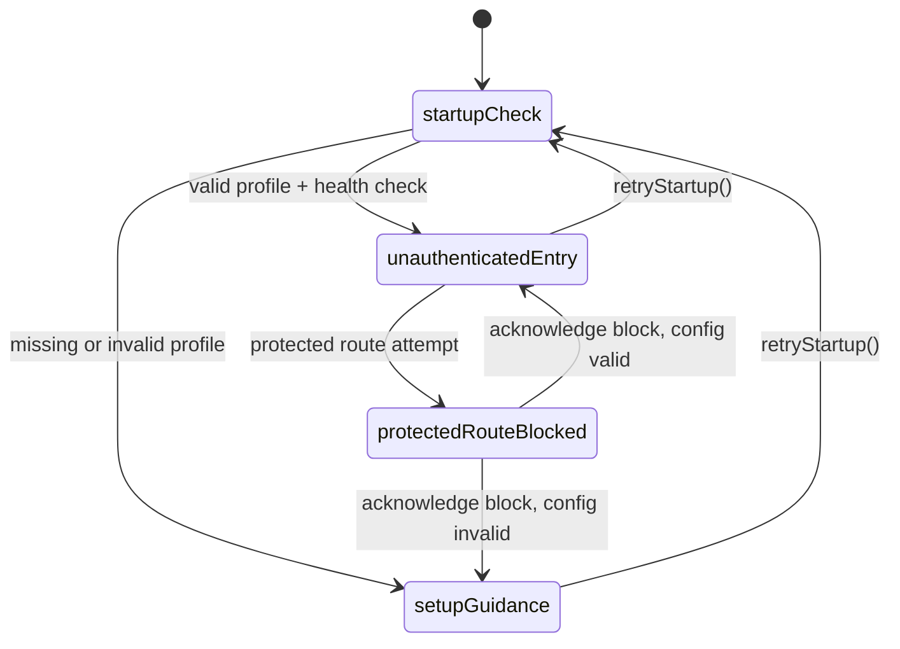
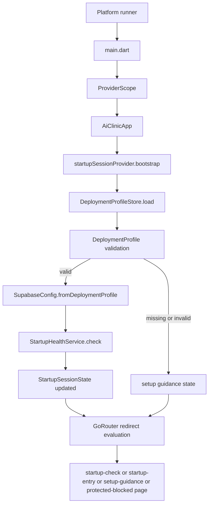

# Frontend Implementation Guide

# Phase 1 and 2

## Purpose and current scope

The frontend is a Flutter startup shell for AiClinic's clinic-local deployment model. In the current codebase, the implemented runtime is intentionally narrow: it validates local configuration, probes backend reachability, exposes a safe pre-auth startup experience, and blocks access to protected routes until authenticated flows exist.

Today, almost all application-specific behavior lives under `frontend/lib`. The runtime surface is still small and centered on a single Riverpod state machine plus a GoRouter redirect layer.

Implemented concerns:

- application bootstrap
- deployment-profile loading and validation
- clinic-local connectivity checks
- guarded routing before authentication
- startup, setup-guidance, and blocked-route screens
- shared theme, loading, and failure presentation foundations

Not implemented yet:

- Supabase SDK initialization
- authentication/session management
- domain features under `frontend/lib/features`
- persistent local settings such as stored theme mode
- meaningful automated frontend test coverage

## Code map

The current implementation is best understood as a small set of cooperating layers:

- `frontend/lib/main.dart`
  The Dart entrypoint. It only creates a top-level `ProviderScope` and mounts `AiClinicApp`.

- `frontend/lib/app/app.dart`
  The root widget. It triggers bootstrap once, reads the app router, and applies the current `ThemeMode`.

- `frontend/lib/app/router.dart`
  Owns all current routes, redirect logic, and the startup-oriented pages. This file currently contains both routing and presentation for the startup flow.

- `frontend/lib/shared/providers/startup_session_provider.dart`
  The main orchestration layer. It owns startup state, theme mode, bootstrap lifecycle, and protected-route blocking.

- `frontend/lib/shared/services/startup_health_service.dart`
  Performs backend reachability probes against the configured Supabase gateway, auth health endpoint, and REST endpoint.

- `frontend/lib/core/config/deployment_profile.dart`
  Defines the deployment-profile contract, validation rules, and file lookup behavior.

- `frontend/lib/core/config/supabase_config.dart`
  Adapts a validated deployment profile into probeable endpoint URLs.

- `frontend/lib/core/errors/exceptions.dart`
  Defines typed exceptions for configuration and startup failures.

- `frontend/lib/core/errors/failures.dart`
  Maps internal exceptions into UI-facing failure models.

- `frontend/lib/core/widgets/app_loading_state.dart`
  Shared loading UI used during bootstrap.

- `frontend/lib/app/theme/app_theme.dart`
  Defines the app's light and dark Material 3 theme foundations.

There is also a planned but mostly unused architectural boundary in `frontend/lib/features`. At the moment, the startup experience is still app-shell-centric rather than feature-modular.

## Ownership model

The frontend follows a simple ownership chain:

1. `main.dart` owns process startup.
2. `AiClinicApp` owns app-shell initialization and theming.
3. `StartupSessionNotifier` owns startup state and side effects.
4. `DeploymentProfileStore` owns configuration discovery.
5. `StartupHealthService` owns connectivity probing.
6. `GoRouter` owns route selection based on startup state.
7. Startup pages render the current state and expose user actions.

That chain keeps the current design easy to reason about because nearly every runtime decision flows through a single state object: `StartupSessionState`.

## End-to-end lifecycle

### 1. Process startup

The Flutter host boots the app and enters `frontend/lib/main.dart`. The entrypoint is intentionally minimal:

```dart
void main() {
  runApp(const ProviderScope(child: AiClinicApp()));
}
```

This makes Riverpod available to the entire widget tree from the first frame.

### 2. App-shell initialization

`AiClinicApp` is a `ConsumerStatefulWidget`. In `initState`, it schedules bootstrap with a microtask:

```dart
Future<void>.microtask(() {
  return ref.read(startupSessionProvider.notifier).bootstrap();
});
```

Important implications:

- bootstrap is kicked off once when the app widget is first mounted
- the call is deferred until after `initState`, avoiding provider work directly inline with widget construction
- startup logic is centralized in the notifier rather than spread through widgets

In `build`, the widget watches:

- `appRouterProvider` for navigation
- `startupSessionProvider` for the active `ThemeMode`

Because the entire session object is watched, every session-state change rebuilds the app root, even though the root only directly uses `themeMode` plus the router.

### 3. State reset before bootstrap

`StartupSessionNotifier.bootstrap()` begins by preserving the current theme mode and resetting the rest of the session to its initial state:

```dart
final preservedThemeMode = state.themeMode;
state = StartupSessionState.initial().copyWith(themeMode: preservedThemeMode);
```

This matters for retries. Pressing "Refresh startup checks" or "Retry bootstrap" restarts the lifecycle without losing the user's in-memory theme selection.

### 4. Deployment profile discovery and validation

The notifier asks `DeploymentProfileStore` to load a configuration file.

Path resolution order:

1. explicit `profilePath` override passed to `bootstrap()`
2. environment variable `AICLINIC_DEPLOYMENT_PROFILE_PATH`
3. `deployment-profile.json`
4. `lib/core/config/deployment-profile.json`
5. `frontend/lib/core/config/deployment-profile.json`

The first existing file wins. The store then parses JSON and validates the contract through `DeploymentProfile.fromJsonString()` / `DeploymentProfile.fromMap()`.

The profile currently enforces:

- `deployment_mode` is required and must be `local`
- `supabase_url` is required and must be a valid `http` or `https` URI
- `supabase_anon_key` is required
- `ai_service_url` is optional
- `source_device_role` is optional and limited to `server-node` or `client-node` style values

If no file exists, `MissingDeploymentProfileException` is thrown. If the file exists but is malformed or unsupported, `InvalidDeploymentProfileException` is thrown.

### 5. Supabase probe configuration

Once a `DeploymentProfile` is valid, the notifier converts it into `SupabaseConfig`.

This is a thin adaptation layer. It does not initialize a Supabase client. Instead, it derives probeable URLs:

- `gatewayProbeUrl` -> the configured base URL
- `authHealthUrl` -> `auth/v1/health`
- `restProbeUrl` -> `rest/v1/`

This is an important implementation detail: in the current frontend, "Supabase integration" means configuration and health probing, not SDK-backed auth or data access.

### 6. Connectivity probing

`StartupHealthService.check()` performs three HTTP probes concurrently using `Future.wait()`:

- `gateway`
- `auth`
- `rest`

Each probe:

- uses `dart:io` `HttpClient`
- applies a 3-second connection/request timeout
- sends an `Accept: application/json` header
- drains the response body and only keeps metadata

Reachability is calculated per endpoint using this rule:

- any HTTP status below `500` counts as reachable
- timeout, socket, or HTTP exceptions count as unreachable

That means some non-success responses such as `401` or `404` still prove that the service is reachable at the network level.

Aggregate connectivity status is computed from the number of reachable endpoints:

- `0` reachable -> `unreachable`
- `3` reachable -> `healthy`
- anything in between -> `degraded`

### 7. Session-state materialization

If configuration is valid, bootstrap always transitions to `StartupCurrentView.unauthenticatedEntry`, regardless of whether connectivity is healthy, degraded, or unreachable.

The resulting state includes:

- `configurationStatus`
- `connectivityStatus`
- `currentView`
- `blockedReason`
- `lastHealthCheck`
- `deploymentProfile`
- `failure`
- `healthResult`

One important nuance is that degraded connectivity does not force the app into setup guidance. Only configuration failure does that. A valid profile with bad backend reachability still leaves the startup shell visible so the user can inspect status and retry.

### 8. Router-driven view selection

`appRouterProvider` builds a `GoRouter` with an initial location of `/startup-check`.

Defined routes:

- `/startup-check`
- `/`
- `/setup-guidance`
- `/protected-blocked`
- `/protected/dashboard`

The router listens to `startupSessionProvider` through a `ValueNotifier<int>` refresh signal. Whenever the session changes, the notifier increments and GoRouter reevaluates redirects.

Redirect behavior has two layers:

1. **Protected-route interception**
   Any route beginning with `/protected` immediately triggers `blockProtectedRoute(location)` and redirects to `/protected-blocked`.

2. **Startup view enforcement**
   The current `StartupCurrentView` is treated as the source of truth for which page may render:
   - `startupCheck` -> `/startup-check`
   - `setupGuidance` -> `/setup-guidance`
   - `protectedRouteBlocked` -> `/protected-blocked`
   - `unauthenticatedEntry` -> `/`

This makes routing a projection of application state rather than a free-form navigation layer.

### 9. Screen rendering and user interaction

The router file currently contains the startup screens themselves.

#### `_StartupCheckPage`

Displayed during bootstrap. It uses `AppLoadingState` to communicate that configuration and connectivity are being validated before any protected use is allowed.

#### `_StartupEntryPage`

This is the main success state for the current app. It shows:

- deployment-profile status
- selected deployment mode
- source profile file path
- configured Supabase URL
- connectivity status
- timestamp of the last health check
- per-endpoint probe details
- theme-selection chips

It also exposes two user actions:

- `Refresh startup checks` -> calls `retryStartup()`
- `Try a protected route` -> navigates to `/protected/dashboard`, which is then intercepted by the router guard

#### `_SetupGuidancePage`

Displayed when configuration is missing or invalid. It renders:

- a failure banner when present
- guidance about where to place `deployment-profile.json`
- required and optional field expectations
- a JSON example
- a retry button

#### `_ProtectedRouteBlockedPage`

Displayed when the user or code tries to navigate to a protected route. It explains why the redirect happened and provides a button that:

1. calls `acknowledgeProtectedRouteBlock()`
2. navigates back to `/`

#### `_ProtectedPlaceholderPage`

This page exists as a safety assertion. In normal operation it should never render before authentication exists, because the redirect layer should intercept the route first.

## State machine

The startup flow is effectively a single state machine backed by `StartupSessionState`.



The router does not decide the state machine. The notifier does. The router only enforces which screen corresponds to the current state.

## Module interactions

### `app.dart` <-> `startup_session_provider.dart`

`AiClinicApp` delegates startup work to the provider and depends on it for theme state. This keeps startup side effects out of the view layer.

### `router.dart` <-> `startup_session_provider.dart`

This is the tightest interaction in the app:

- the router reads session state to decide redirects
- the router listens for provider updates to refresh redirect evaluation
- the router can also mutate session state through `blockProtectedRoute()`

That last point is worth noting: the router is not purely read-only. It participates in state transitions when a protected path is attempted.

### `startup_session_provider.dart` <-> `deployment_profile.dart`

The notifier uses `DeploymentProfileStore` to discover configuration and `DeploymentProfile` to validate and normalize it. The validated profile is then stored in session state for the UI to display.

### `startup_session_provider.dart` <-> `supabase_config.dart`

The notifier converts a valid `DeploymentProfile` into `SupabaseConfig`. This adaptation keeps backend probe URL construction out of the state machine.

### `startup_session_provider.dart` <-> `startup_health_service.dart`

The notifier delegates network probing to the health service, then maps the result into:

- `connectivityStatus`
- `blockedReason`
- `failure`
- `healthResult`
- `lastHealthCheck`

This keeps the service focused on I/O and the notifier focused on application decisions.

### `router.dart` <-> shared UI primitives

The router file composes several small UI helpers:

- `_StartupScaffold` for a consistent centered shell
- `_StatusCard` for grouped status text
- `_FailureBanner` for recoverable startup problems
- `AppLoadingState` for bootstrap loading feedback

This is convenient for a scaffold phase, but it also means routing, page logic, and page widgets are currently co-located in one file.

## Error and failure handling

The code distinguishes between exceptions and failures:

- **exceptions** describe what went wrong in lower layers
- **failures** describe what the UI should say about it

Exception hierarchy:

- `AppException`
- `DeploymentProfileException`
- `MissingDeploymentProfileException`
- `InvalidDeploymentProfileException`
- `StartupHealthCheckException`

UI failure types:

- `ConfigurationFailure`
- `ConnectivityFailure`
- `UnexpectedFailure`

Mapping behavior:

- missing or invalid profile -> configuration failure
- startup health exception -> connectivity failure
- anything else -> unexpected failure

In the current implementation, the health service usually returns structured reachability results instead of throwing `StartupHealthCheckException`, so connectivity problems are mostly surfaced as a valid startup session with degraded/unreachable status and a `ConnectivityFailure`.

## Theme and presentation lifecycle

`AppTheme` builds both light and dark `ThemeData` from the same seeded Material 3 color system.

Current theme behavior:

- default is `ThemeMode.system`
- the user can change theme mode on the startup page
- the choice is stored in `StartupSessionState`
- retries preserve the in-memory theme mode
- app restarts do not preserve the choice because there is no persistence layer yet

Presentation-wise, the UI favors visible operational status over abstraction. Instead of hiding startup details, it shows configuration source, URLs, connectivity labels, and raw probe details directly on screen.

## Lifecycle diagram



## Current design strengths

- Very small runtime surface, so startup behavior is easy to trace.
- One provider owns almost all startup decisions.
- Route guarding is enforced centrally rather than page-by-page.
- Configuration failure and connectivity failure are treated differently, which matches the product intent.
- The UI already exposes degraded-state messaging instead of failing silently.

## Current design constraints and extension points

- `frontend/lib/features` is not yet the home of runtime behavior; startup UI still lives in `router.dart`.
- There is no authenticated lifecycle yet, so all `/protected/*` routes are hard-blocked.
- `SupabaseConfig` is only used for probe URLs; there is no `supabase_flutter` client wiring yet.
- Theme mode is transient and app-local.
- `AiClinicApp` watches the full startup session even though it mainly needs theme state.
- There are no meaningful tests validating bootstrap, routing redirects, or degraded-state rendering.

The most likely next structural evolution is:

1. move startup pages out of `router.dart` into `features/startup`
2. introduce authenticated session state alongside startup state
3. initialize the actual Supabase client
4. persist lightweight user/device preferences such as theme mode
5. add unit and widget tests around bootstrap and redirect behavior

## Summary

The frontend is currently a startup-oriented orchestration layer rather than a full product surface. Its lifecycle is driven by one Riverpod notifier that loads clinic-local configuration, checks backend reachability, and feeds a router that strictly controls which page can render. The main interactions are simple and explicit, which makes the current codebase easy to extend as authentication, real feature modules, and persistent state are added.
