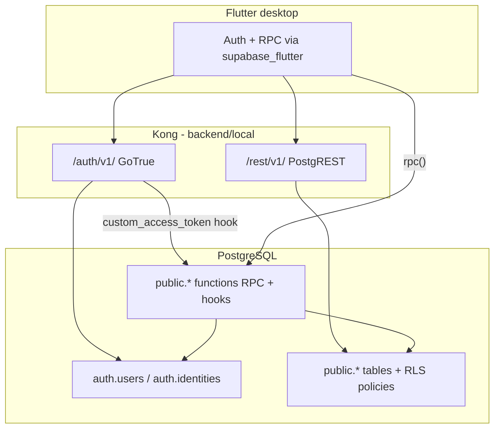
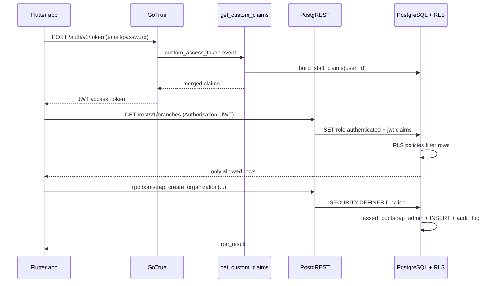

# Phase 2 Implementation

**Feature**: `specs/002-auth-rbac` — Auth and RBAC (V1-1)
**Phase**: 2 — Foundational (blocking prerequisites)
**Scope**: Backend only (PostgreSQL migrations, GoTrue hook, verification scripts)

Phase 2 delivers the database and server-side authorization foundation for AiClinic. The Flutter client (also part of Phase 2 in `tasks.md`) consumes this layer via Supabase Auth, PostgREST, and RPC calls. There is still no custom application server; all business rules live in SQL migrations under `backend/supabase/migrations/`.

## Purpose and scope

Phase 2 backend work implements:

- **Tenancy schema** — organizations, branches, staff, branch assignments
- **RBAC data** — `staff_role` enum, `roles_permissions` matrix
- **Supporting tables** — audit log, app settings, subscription cache (login not blocked on expiry)
- **Automatic audit columns** — triggers for `created_by`, `updated_by`, timestamps
- **Row Level Security (RLS)** — tenant and branch isolation on every feature table
- **JWT custom claims** — org, branches, role, staff id, setup flag injected at login
- **SECURITY DEFINER RPCs** — bootstrap org/branch, create staff, admin password reset
- **Seed data** — default permission matrix and bootstrap administrator account
- **Verification** — `auth_flow_smoke.sh` and `rls_isolation.sql`

Out of scope for this phase (later tasks or features):

- Full staff/branch management UI (V1-2)
- Permission-matrix editor UI
- Subscription enforcement blocking login
- Edge Functions
- Changes to `backend/local/docker-compose.yml` (Compose stack from spec001 remains the runtime)

## What changed in the repository

| Path                                                                      | Change                                                                |
| ------------------------------------------------------------------------- | --------------------------------------------------------------------- |
| `backend/supabase/migrations/20260516100000_auth_rbac_schema.sql`         | **NEW** — tables, enums, indexes, enable RLS                          |
| `backend/supabase/migrations/20260516100100_auth_rbac_audit_triggers.sql` | **NEW** — `set_updated_at`, `set_audit_user`, apply to feature tables |
| `backend/supabase/migrations/20260516100200_auth_rbac_rls.sql`            | **NEW** — JWT helpers and RLS policies                                |
| `backend/supabase/migrations/20260516100300_auth_rbac_functions.sql`      | **NEW** — claims, bootstrap RPCs, staff RPCs                          |
| `backend/supabase/migrations/20260516100400_auth_rbac_seed.sql`           | **NEW** — permissions matrix + bootstrap admin                        |
| `backend/supabase/config.toml`                                            | Enabled `[auth.hook.custom_access_token]` → `get_custom_claims`       |
| `backend/README.md`                                                       | AiClinic section: migrations, hook restart, verification scripts      |
| `backend/tests/auth_flow_smoke.sh`                                        | **NEW** — sign-in / claims / bootstrap RPC smoke                      |
| `backend/tests/rls_isolation.sql`                                         | **NEW** — cross-org RLS denial tests (transactional)                  |
| `backend/seed/bootstrap_admin.env.example`                                | Credential template (referenced by smoke script env vars)             |

Migrations run in timestamp order. Each file is heavily commented for readers new to SQL/Supabase.

## How this fits the existing stack



- **Compose stack** (`backend/local/`) from spec001 still hosts Postgres, GoTrue, PostgREST, and Kong.
- **Supabase CLI** (`backend/supabase/`) applies migrations and registers the auth hook via `config.toml`.
- Align **Postgres major version**: `config.toml` uses `major_version = 15`, matching the Compose Postgres 15 image.

## Applying migrations

From repository root, with the database reachable (Supabase CLI local DB or Compose Postgres on port `54322`):

```bash
cd backend
supabase db reset    # wipe + re-run all migrations (dev)
# or:
supabase migration up
```

After migration or hook changes, restart GoTrue so the custom access token hook reloads:

| Stack          | Command                                           |
| -------------- | ------------------------------------------------- |
| Supabase CLI   | `supabase stop` then `supabase start`             |
| Docker Compose | `cd backend/local && docker compose restart auth` |

See `backend/README.md` and `specs/002-auth-rbac/quickstart.md` for the full verification flow.

## Migration breakdown

### 1. `20260516100000_auth_rbac_schema.sql`

Creates the V1-1 data model:

| Object                      | Purpose                                                            |
| --------------------------- | ------------------------------------------------------------------ |
| Extension `pgcrypto`        | Password hashing (`crypt`, `gen_salt`) for staff provisioning RPCs |
| `staff_role` enum           | `owner`, `administrator`, `doctor`, `receptionist`, `lab_staff`    |
| `rpc_result` composite type | Standard `{ success, data, error_code, error_message }` for RPCs   |
| `organizations`             | Single clinic tenant per installation (V1-1); subscription fields  |
| `branches`                  | Locations under an organization                                    |
| `staff_members`             | Links `auth.users` to clinic profile, role, `is_bootstrap_admin`   |
| `staff_branch_assignments`  | Many-to-many staff ↔ branch; `is_primary` for default branch       |
| `roles_permissions`         | Role → permission_key grants for UI and future enforcement         |
| `audit_log`                 | Append-only action history                                         |
| `app_settings`              | Per-branch or org-wide JSON settings                               |
| `subscription_cache`        | Cached billing tier (does not block login in V1-1)                 |

All feature tables use **soft delete** (`is_deleted`, `deleted_at`, `deleted_by`) and standard audit columns. RLS is **enabled** on each table; policies are added in migration 3.

### 2. `20260516100100_auth_rbac_audit_triggers.sql`

| Function                                  | Behavior                                                             |
| ----------------------------------------- | -------------------------------------------------------------------- |
| `set_updated_at()`                        | Sets `updated_at = now()` on UPDATE                                  |
| `set_audit_user()`                        | On INSERT/UPDATE, sets `created_by` / `updated_by` from `auth.uid()` |
| `apply_standard_audit_triggers(regclass)` | Attaches both triggers to a table                                    |

Applied to: `organizations`, `branches`, `staff_members`, `staff_branch_assignments`, `roles_permissions`, `app_settings`.
`audit_log` is excluded (it records audit events, it is not audited by these triggers).

### 3. `20260516100200_auth_rbac_rls.sql`

**JWT helper functions** (read claims from the current request):

| Function                     | Claim / use                                   |
| ---------------------------- | --------------------------------------------- |
| `request_jwt_claims()`       | Raw JWT JSON from PostgREST or `auth.jwt()`   |
| `jwt_organization_id()`      | Tenant scope                                  |
| `jwt_branch_ids()`           | Comma-separated branch UUIDs → array          |
| `jwt_staff_member_id()`      | Staff row id                                  |
| `jwt_staff_role()`           | Clinic role enum                              |
| `jwt_setup_required()`       | Bootstrap wizard needed                       |
| `current_staff_member_row()` | SECURITY DEFINER lookup of caller's staff row |

**Policy pattern (defense in depth)**:

- **SELECT** — filtered by org, branch assignments, or bootstrap setup exception.
- **INSERT on sensitive tables** — `WITH CHECK (false)`; writes go through RPCs in migration 4.
- **UPDATE** — org-scoped; branches also require assignment in `jwt_branch_ids()`.

Notable rules:

- Bootstrap admin with `setup_required` may **select** organizations before one exists.
- Staff see themselves and colleagues sharing a branch in the same org.
- `roles_permissions` is read-only for authenticated users (`is_granted = true` only).

### 4. `20260516100300_auth_rbac_functions.sql`

**Custom claims (login)**

| Function                      | Role                                              |
| ----------------------------- | ------------------------------------------------- |
| `build_staff_claims(user_id)` | Builds claim object from staff + org + branches   |
| `get_custom_claims(uuid)`     | Wrapper for tests                                 |
| `get_custom_claims(jsonb)`    | **GoTrue hook** — merges claims into access token |

Claims emitted (when staff is active):

- `staff_member_id`, `role`, `organization_id`, `branch_ids`, `setup_required`

When bootstrap admin has no organization yet, `organization_id` is omitted and `setup_required` is `true`.

**RPC helpers**

| Function                                   | Returns                                 |
| ------------------------------------------ | --------------------------------------- |
| `rpc_success(data)`                        | Success `rpc_result`                    |
| `rpc_error(code, message)`                 | Failure `rpc_result`                    |
| `assert_bootstrap_admin()`                 | Raises if caller is not bootstrap admin |
| `assert_owner_or_administrator()`          | Raises if caller lacks admin privileges |
| `organization_exists()` / `owner_exists()` | Installation state checks               |

**Callable RPCs** (granted to `authenticated`):

| RPC                                                                                   | Purpose                                   |
| ------------------------------------------------------------------------------------- | ----------------------------------------- |
| `bootstrap_create_organization(name, settings_json?)`                                 | First org only; bootstrap admin only      |
| `bootstrap_create_branch(org_id, name, address?, phone?)`                             | First branch auto-assigns bootstrap admin |
| `create_staff_account(email, password, name, role, branch_ids[], primary_branch_id?)` | Owner/admin provisions staff + auth user  |
| `admin_reset_staff_password(staff_member_id, new_password)`                           | Owner/admin reset; same-org check         |

**Internal**

| Function                            | Purpose                                                                |
| ----------------------------------- | ---------------------------------------------------------------------- |
| `create_auth_user(email, password)` | Inserts into `auth.users` + `auth.identities` (not granted to clients) |

All RPCs write to `audit_log` on success. Errors use stable `error_code` strings (e.g. `ORG_ALREADY_EXISTS`, `FORBIDDEN`, `EMAIL_EXISTS`).

### 5. `20260516100400_auth_rbac_seed.sql`

**Permission matrix** — seeds `roles_permissions` for keys used in V1-1 and planned modules (`patients.*`, `appointments.*`, `invoices.*`, `ai.access`, etc.). Uses `ON CONFLICT DO UPDATE` so re-running is safe.

**Bootstrap administrator** (fixed UUIDs for repeatable local installs):

| Field        | Default                                          |
| ------------ | ------------------------------------------------ |
| Email        | `admin@clinic.local`                             |
| Password     | `ChangeMeOnFirstSignIn!`                         |
| Auth user id | `a0000000-0000-4000-8000-000000000001`           |
| Staff id     | `b0000000-0000-4000-8000-000000000001`           |
| Role         | `administrator` with `is_bootstrap_admin = true` |

Override via env for smoke tests: `BOOTSTRAP_ADMIN_EMAIL`, `BOOTSTRAP_ADMIN_PASSWORD`, etc. (see `backend/seed/bootstrap_admin.env.example`).

No organization or branch is pre-seeded; bootstrap admin must create them via RPC after first login.

## GoTrue custom access token hook

In `backend/supabase/config.toml`:

```toml
[auth.hook.custom_access_token]
enabled = true
uri = "pg-functions://postgres/public/get_custom_claims"
```

On each token issue, GoTrue calls `public.get_custom_claims(event jsonb)`, which merges `build_staff_claims` into the JWT. PostgREST RLS policies read those claims on every REST request.

**Important**: Changing this hook or claim-building logic requires an **auth service restart** (see Applying migrations above). Clients must sign in again to receive updated claims.

## Request and authorization lifecycle



## Verification scripts

### `backend/tests/auth_flow_smoke.sh`

Loads `backend/local/.env` (or `.env.example`), then:

1. **HTTP sign-in** — `POST /auth/v1/token?grant_type=password` as bootstrap admin; decodes JWT and prints `staff_member_id`, `role`, `setup_required`.
2. **SQL fallback** — if gateway auth is unavailable, calls `build_staff_claims` via `psql`.
3. **Bootstrap guard** — invokes `bootstrap_create_organization` as bootstrap user; expects `ORG_ALREADY_EXISTS` when an org already exists.

```bash
./backend/tests/auth_flow_smoke.sh
```

Requires: `curl`, `python3`, `psql`, running stack, migrations applied, `SUPABASE_ANON_KEY` in env for HTTP path.

### `backend/tests/rls_isolation.sql`

Transactional test harness:

1. Inserts two orgs, branches, staff users (fixed test UUIDs).
2. Sets `request.jwt.claims` to simulate user A and user B.
3. Asserts branch/org visibility counts (user A sees only org A branch; user B cannot see org A branch).
4. **ROLLBACK** — no permanent test data left in the database.

```bash
PGPASSWORD=postgres psql -h 127.0.0.1 -p 54322 -U postgres -d postgres \
  -v ON_ERROR_STOP=1 -f backend/tests/rls_isolation.sql
```

Fails with an exception if any test row reports `passed = false`.

## Security model (V1-1)

| Layer                  | Mechanism                                                           |
| ---------------------- | ------------------------------------------------------------------- |
| Authentication         | GoTrue email/password; `auth.users`                                 |
| Authorization (API)    | JWT custom claims + RLS on all public tables                        |
| Authorization (writes) | Sensitive INSERT/UPDATE blocked by RLS; RPCs validate role          |
| Tenant isolation       | `jwt_organization_id()` on org-scoped tables                        |
| Branch isolation       | `jwt_branch_ids()` on assignments and branch updates                |
| Audit                  | `audit_log` entries from RPCs; column triggers on mutable tables    |
| Bootstrap              | Single bootstrap admin flag; one org per installation via RPC guard |

**Local dev warnings**:

- Default bootstrap password is in seed SQL and `.env.example` — change before any real clinic use.
- `service_role` key bypasses RLS; never ship it to desktop clients.
- Demo JWT keys in `backend/local/.env.example` are not production-safe.

## Operator checklist (Phase 2 backend)

| Step | Action                                                   | Expected                              |
| ---- | -------------------------------------------------------- | ------------------------------------- |
| 1    | Start stack (`docker compose up -d` or `supabase start`) | Postgres + GoTrue healthy             |
| 2    | `cd backend && supabase db reset`                        | Five migrations apply without error   |
| 3    | Restart auth                                             | Hook active                           |
| 4    | `./backend/tests/connectivity_smoke.sh`                  | Gateway reachable (spec001)           |
| 5    | `./backend/tests/auth_flow_smoke.sh`                     | Sign-in or SQL claims OK              |
| 6    | `psql ... -f backend/tests/rls_isolation.sql`            | All tests `passed = t`                |
| 7    | Sign in via Flutter (Phase 2 client)                     | JWT contains staff claims after setup |

## Relationship to spec001 backend

| spec001 (V1-0)                              | spec002 Phase 2 (V1-1)                     |
| ------------------------------------------- | ------------------------------------------ |
| Compose + Kong + empty `public` schema      | Domain tables + RLS + RPCs in `public`     |
| `init.sql` — roles `anon` / `authenticated` | Policies use `authenticated` + JWT         |
| `connectivity_smoke.sh` — gateway alive     | `auth_flow_smoke.sh` — auth + claims + RPC |
| No migrations                               | Five ordered SQL migrations                |
| No custom claims                            | `get_custom_claims` hook                   |

Phase 2 does not replace the Compose stack; it **extends** the same Postgres instance with application schema and security rules.

## Extension points (later phases)

- Additional migrations for patient/appointment/billing tables with org/branch RLS patterns matching this phase
- Tighter `audit_log` policies and INSERT triggers
- Subscription enforcement RPCs (without blocking login per spec)
- Aligning Compose-only deployments with automatic migration apply on Postgres init (optional automation)

## Summary

Phase 2 backend implementation adds the full **auth/RBAC database layer** for AiClinic: schema, audit triggers, RLS, JWT claims via GoTrue hook, bootstrap and staff administration RPCs, seeded permissions and bootstrap admin, and automated verification scripts. The Flutter client in the same phase depends on this layer but does not duplicate authorization logic—PostgreSQL remains the source of truth for tenant isolation and privileged writes.
