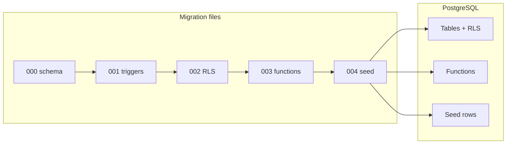
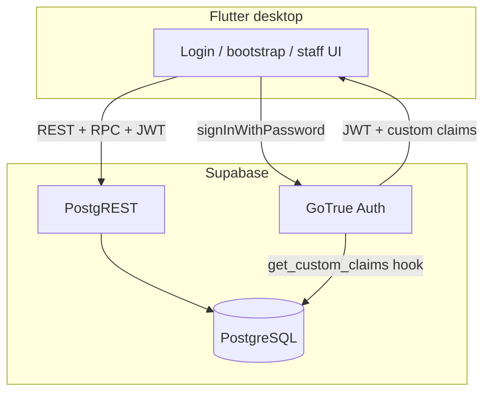
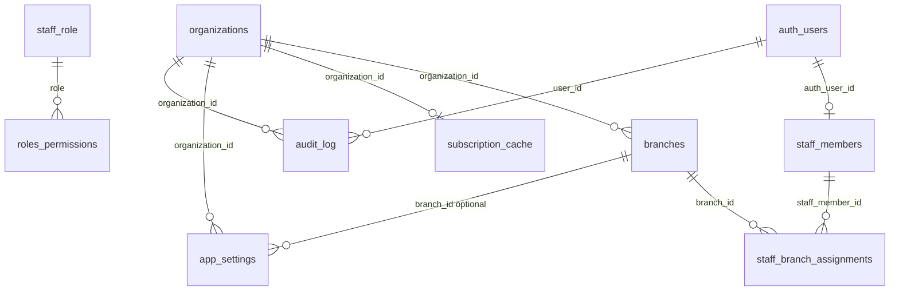
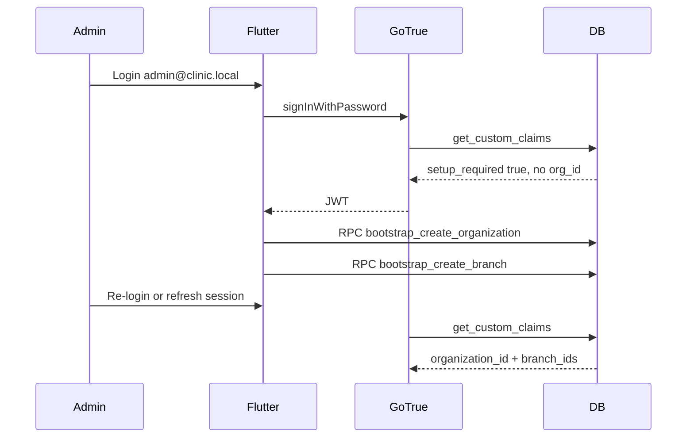
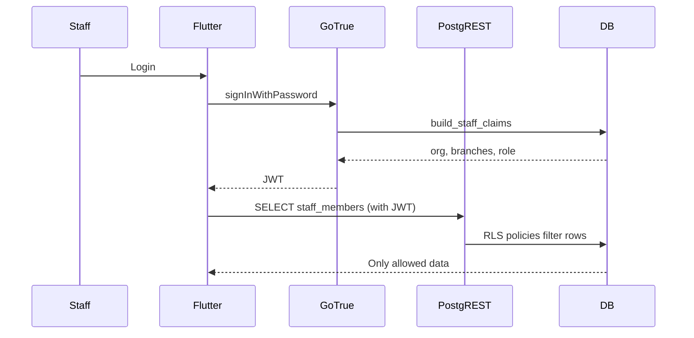
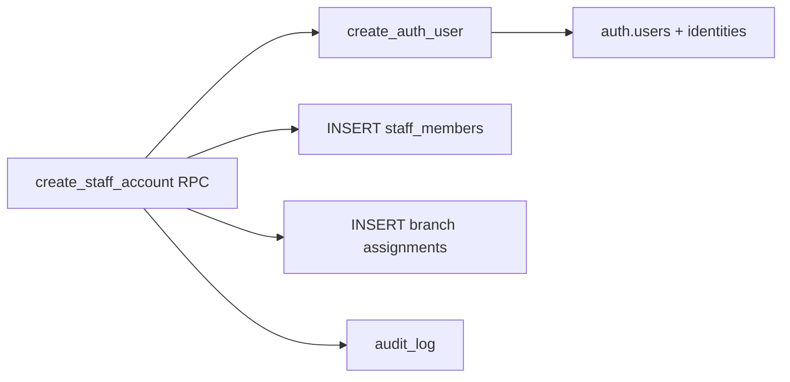

# Auth & RBAC Migrations — Complete Guide

**Feature**: `specs/002-auth-rbac` (V1-1 authentication and role-based access control)
**Audience**: Anyone new to backends — no prior database or Supabase experience required
**Source files**: `backend/supabase/migrations/` (five SQL files, run in order)

This document explains **what** the migration folder is, **why** it exists, **how** the pieces connect, and **every major block of SQL** in those files. For how migrations fit the wider Phase 2 backend work, see also [backend-implementation.md](./backend-implementation.md).

---

## 1. The problem these files solve

AiClinic is a clinic management app. Before staff can use it, the system must know:

- **Who** is logging in (email + password)
- **Which clinic** they belong to (organization)
- **Which locations** they work at (branches)
- **What they are allowed to do** (owner, doctor, receptionist, etc.)

All of that “truth” lives in a **database** (PostgreSQL), not only in the Flutter app. The migration files are the **blueprint** that creates and secures that database structure on a fresh install.

If you only changed the Flutter UI, a malicious user could still call the API directly and read another clinic’s data. Migrations define **tables**, **automatic audit fields**, **row-level security**, **server functions**, and **starting data** so the database enforces rules even when the app has bugs.

---

## 2. Core ideas (read this first)

### Database

A **database** stores structured data in **tables** (like spreadsheets with strict columns). **PostgreSQL** is the database engine Supabase uses.

### Supabase

**Supabase** wraps PostgreSQL with:

| Piece             | Role                                                           |
| ----------------- | -------------------------------------------------------------- |
| **PostgreSQL**    | Stores clinic data (`organizations`, `staff_members`, …)       |
| **GoTrue (Auth)** | Handles login, passwords, JWT tokens                           |
| **PostgREST**     | Exposes tables and functions over HTTP as a REST API           |
| **Kong**          | Routes requests (`/auth/v1`, `/rest/v1`) in local Docker setup |

The Flutter app talks to Supabase; it does **not** run its own primary backend server for this feature.

### SQL and migrations

**SQL** is the language used to define and change the database.

A **migration** is one versioned SQL file that changes the database **once**, in a known order. Think of migrations as **git commits for your schema**: each file builds on the previous one.

Filenames use a timestamp prefix so order is always the same:

```text
20260516100000_auth_rbac_schema.sql      ← runs 1st
20260516100100_auth_rbac_audit_triggers.sql
20260516100200_auth_rbac_rls.sql
20260516100300_auth_rbac_functions.sql
20260516100400_auth_rbac_seed.sql        ← runs 5th
```

### Schemas: `public` vs `auth`

PostgreSQL groups tables into **schemas** (namespaces):

- **`auth`** — Supabase-owned login tables (`auth.users`, identities). You rarely insert here from the app; RPCs do it for staff provisioning.
- **`public`** — Your application tables (`organizations`, `branches`, `staff_members`, …).

### UUID

Each row gets a **UUID** — a long random unique id (e.g. `a0000000-0000-4000-8000-000000000001`). Better than auto-increment numbers for distributed systems and merging data.

### Soft delete

Rows are not physically removed. Instead `is_deleted = true` (and optionally `deleted_at`, `deleted_by`). History and referential integrity stay intact.

### Row Level Security (RLS)

With RLS **enabled**, PostgreSQL hides rows unless a **policy** allows access. Even if the API grants `SELECT` on a table, users only see rows policies permit — typically “your organization” or “your branches.”

### JWT and custom claims

When someone logs in, **GoTrue** issues a **JWT** (signed token). The Flutter app sends it on every API request. Policies read **claims** inside the JWT, such as:

- `organization_id`
- `branch_ids` (comma-separated UUIDs)
- `staff_member_id`
- `role`
- `setup_required` (first-time installer before org exists)

Claims are built by `get_custom_claims` (migration 4) and configured in `backend/supabase/config.toml`.

### RPC (Remote Procedure Call)

Instead of inserting into sensitive tables directly, the app calls **functions** exposed as RPC endpoints, e.g. `bootstrap_create_organization`. These run as **SECURITY DEFINER** (with elevated privileges) but **check** the caller first (bootstrap admin, owner, etc.).

### `rpc_result`

Most RPCs return a standard composite type:

| Field           | Meaning                                           |
| --------------- | ------------------------------------------------- |
| `success`       | `true` / `false`                                  |
| `data`          | JSON payload on success                           |
| `error_code`    | Machine-readable code (e.g. `ORG_ALREADY_EXISTS`) |
| `error_message` | Human-readable text                               |

---

## 3. Where migrations live and how they run

```text
AiClinic/
└── backend/
    └── supabase/
        ├── config.toml          ← Auth hook points to get_custom_claims
        └── migrations/          ← YOU ARE HERE (5 SQL files)
```

**When they run**

- **Local**: Starting the Supabase stack (`supabase db reset` or first `supabase start`) applies any migration not yet recorded in the database’s migration history table.
- **Deploy**: Same idea on hosted Supabase — migrations run in filename order exactly once.

**Important**: Do not change a migration file after it has been applied in a shared environment. Add a **new** migration file for changes. (Local dev can reset the DB during early development.)



---

## 4. Big-picture architecture



**Defense in depth** (three layers):

1. **Flutter** — hides buttons the user should not see (UX only; not security alone).
2. **RPC functions** — validate role and state before writes.
3. **RLS policies** — database refuses wrong rows even if someone bypasses the app.

---

## 5. The five files at a glance

| Order | File                                          | One-line purpose                                                     |
| ----- | --------------------------------------------- | -------------------------------------------------------------------- |
| 1     | `20260516100000_auth_rbac_schema.sql`         | Create tables, types, indexes; turn RLS **on** (policies come later) |
| 2     | `20260516100100_auth_rbac_audit_triggers.sql` | Auto-fill `created_by`, `updated_by`, timestamps on insert/update    |
| 3     | `20260516100200_auth_rbac_rls.sql`            | JWT helper functions + **policies** (who sees which rows)            |
| 4     | `20260516100300_auth_rbac_functions.sql`      | Custom claims, bootstrap RPCs, staff provisioning, password reset    |
| 5     | `20260516100400_auth_rbac_seed.sql`           | Default permission matrix + bootstrap admin login                    |

**Why this order matters**

1. Tables must exist before triggers attach to them.
2. RLS needs tables and JWT helpers before the app can query safely.
3. Functions reference tables and often assume RLS is already defined.
4. Seed inserts into tables and may call nothing from file 4, but needs the full schema.

---

## 6. Data model (tables and relationships)



### Table summary

| Table                      | What it stores                                                                           |
| -------------------------- | ---------------------------------------------------------------------------------------- |
| `organizations`            | One clinic tenant per installation (V1-1); name, currency, timezone, subscription fields |
| `branches`                 | Locations under the org (Main, North, …)                                                 |
| `staff_members`            | Clinic profile linked 1:1 to `auth.users` (name, role, bootstrap flag)                   |
| `staff_branch_assignments` | Which branches each staff member may use; one `is_primary`                               |
| `roles_permissions`        | Matrix: for each `staff_role`, which `permission_key` is granted                         |
| `audit_log`                | Who did what, when (append-only style usage)                                             |
| `app_settings`             | Key/value JSON per org or branch                                                         |
| `subscription_cache`       | Cached billing status; **must not** block login when stale                               |

### Types

- **`staff_role` enum**: `owner`, `administrator`, `doctor`, `receptionist`, `lab_staff`
- **`rpc_result` composite**: standard RPC return shape (see [Core ideas](#2-core-ideas-read-this-first))

---

## 7. End-to-end flows

### First-time install (bootstrap)



### Normal staff login



### Provision new staff (owner/admin)



---