# Auth RBAC — SQL migration diagrams

Source: `backend/supabase/migrations/*.sql` only.

---

## Migration apply order

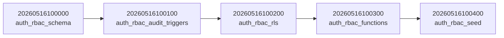

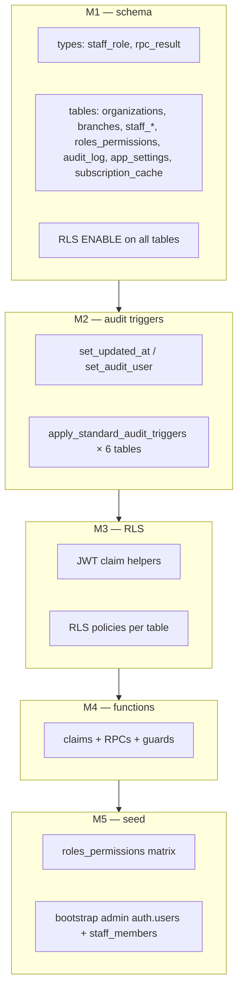

---

## All functions — call graph

```mermaid
flowchart TB
  subgraph external["External callers"]
    GoTrue["GoTrue Auth Hook"]
    Flutter["Flutter client RPC"]
    PG["INSERT/UPDATE on audited tables"]
    Policies["RLS policy evaluation"]
  end

  subgraph jwt["JWT / RLS helpers — M3"]
    request_jwt_claims
    jwt_organization_id
    jwt_branch_ids
    jwt_staff_member_id
    jwt_staff_role
    jwt_setup_required
    current_staff_member_row
  end

  subgraph claims["Custom claims — M4"]
    get_custom_claims_uuid["get_custom_claims(uuid)"]
    get_custom_claims_event["get_custom_claims(jsonb)"]
    build_staff_claims
  end

  subgraph rpc_helpers["RPC response helpers — M4"]
    rpc_success
    rpc_error
  end

  subgraph guards["Authorization guards — M4"]
    assert_bootstrap_admin
    assert_owner_or_administrator
    organization_exists
    owner_exists
  end

  subgraph rpcs["Client RPCs — M4"]
    bootstrap_create_organization
    bootstrap_create_branch
    create_staff_account
    admin_reset_staff_password
  end

  subgraph internal["Internal only — M4"]
    create_auth_user
  end

  subgraph audit_trig["Audit triggers — M2"]
    apply_standard_audit_triggers
    set_updated_at
    set_audit_user
  end

  GoTrue --> get_custom_claims_event
  get_custom_claims_event --> build_staff_claims
  get_custom_claims_uuid --> build_staff_claims

  Flutter --> bootstrap_create_organization
  Flutter --> bootstrap_create_branch
  Flutter --> create_staff_account
  Flutter --> admin_reset_staff_password

  Policies --> jwt_organization_id
  Policies --> jwt_branch_ids
  Policies --> jwt_staff_member_id
  Policies --> jwt_staff_role
  Policies --> jwt_setup_required
  Policies --> current_staff_member_row

  jwt_organization_id --> request_jwt_claims
  jwt_branch_ids --> request_jwt_claims
  jwt_staff_member_id --> request_jwt_claims
  jwt_staff_role --> request_jwt_claims
  jwt_setup_required --> request_jwt_claims
  request_jwt_claims --> auth_jwt["auth.jwt() fallback"]

  bootstrap_create_organization --> assert_bootstrap_admin
  bootstrap_create_organization --> organization_exists
  bootstrap_create_organization --> rpc_success
  bootstrap_create_organization --> rpc_error

  bootstrap_create_branch --> assert_bootstrap_admin
  bootstrap_create_branch --> rpc_success
  bootstrap_create_branch --> rpc_error

  create_staff_account --> assert_owner_or_administrator
  create_staff_account --> organization_exists
  create_staff_account --> owner_exists
  create_staff_account --> create_auth_user
  create_staff_account --> jwt_organization_id
  create_staff_account --> rpc_success
  create_staff_account --> rpc_error

  admin_reset_staff_password --> assert_owner_or_administrator
  admin_reset_staff_password --> jwt_organization_id
  admin_reset_staff_password --> rpc_success
  admin_reset_staff_password --> rpc_error

  PG --> set_updated_at
  PG --> set_audit_user

  apply_standard_audit_triggers -.->|creates triggers| set_updated_at
  apply_standard_audit_triggers -.->|creates triggers| set_audit_user
```

---

## Function inventory by migration file

```mermaid
flowchart TB
  INV(("Functions"))

  INV --> M2
  INV --> M3
  INV --> M4

  subgraph M2["M2 · auth_rbac_audit_triggers"]
    direction TB
    M2a["set_updated_at()"]
    M2b["set_audit_user()"]
    M2c["apply_standard_audit_triggers()"]
  end

  subgraph M3["M3 · auth_rbac_rls"]
    direction TB
    M3a["request_jwt_claims()"]
    M3b["jwt_organization_id()"]
    M3c["jwt_branch_ids()"]
    M3d["jwt_staff_member_id()"]
    M3e["jwt_staff_role()"]
    M3f["jwt_setup_required()"]
    M3g["current_staff_member_row()"]
  end

  subgraph M4["M4 · auth_rbac_functions"]
    direction TB
    M4a["build_staff_claims()"]
    M4b["get_custom_claims(uuid)"]
    M4c["get_custom_claims(jsonb)"]
    M4d["rpc_success() / rpc_error()"]
    M4e["assert_bootstrap_admin()"]
    M4f["assert_owner_or_administrator()"]
    M4g["organization_exists() / owner_exists()"]
    M4h["bootstrap_create_organization()"]
    M4i["bootstrap_create_branch()"]
    M4j["create_auth_user()"]
    M4k["create_staff_account()"]
    M4l["admin_reset_staff_password()"]
  end
```

---

## Login → JWT claims → RLS

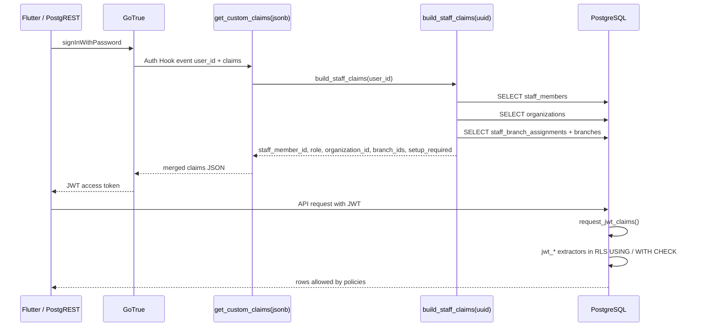

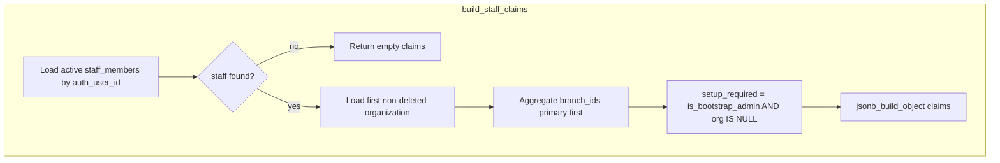

---

## Audit trigger chain (M2)

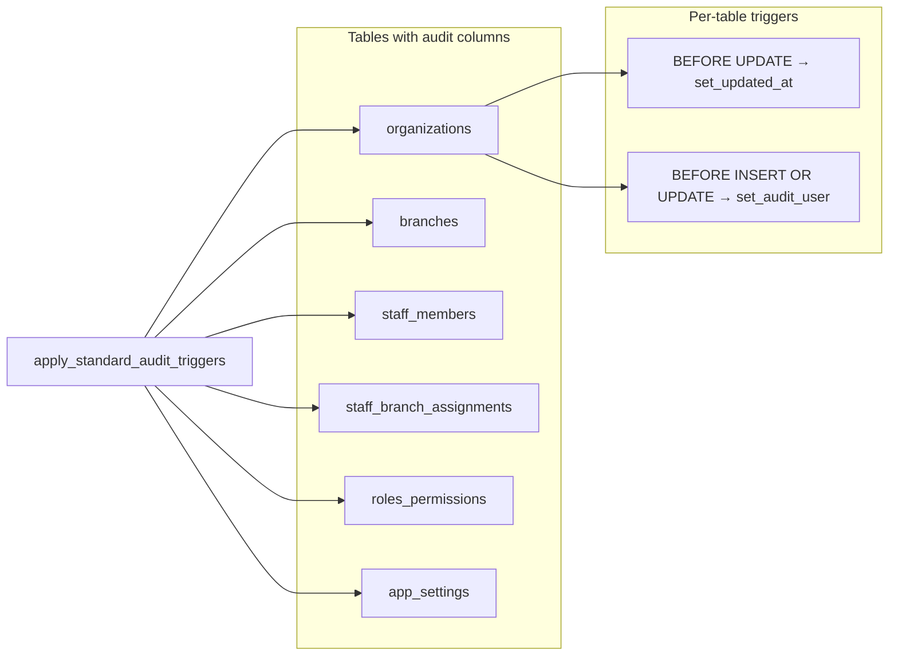

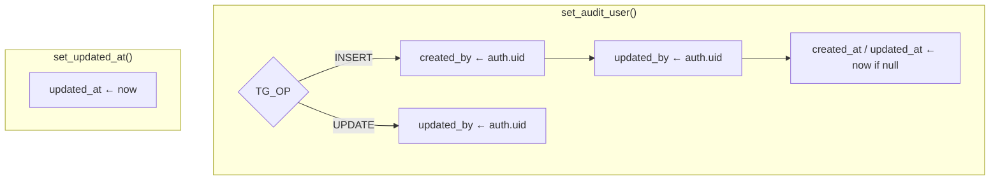

---

## RLS policies → JWT helpers

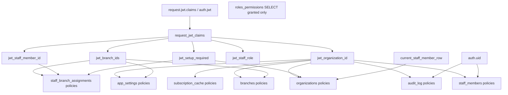

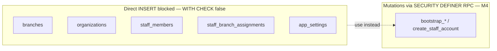

---

## End-to-end installation lifecycle

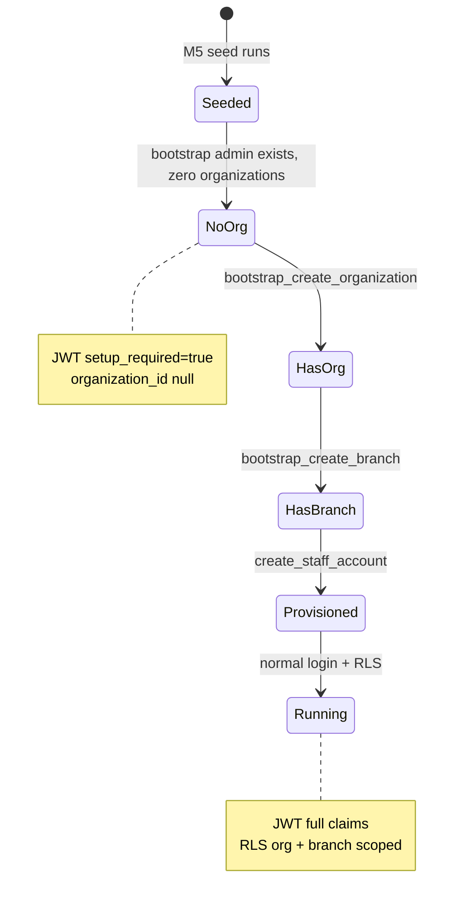

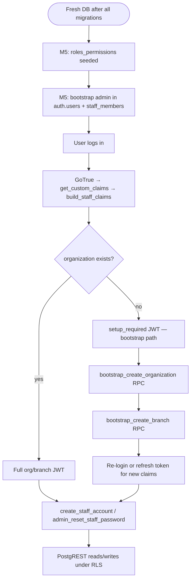

---

## Bootstrap create organization (RPC)

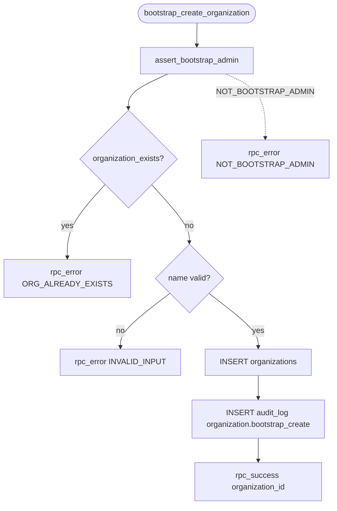

---

## Bootstrap create branch (RPC)

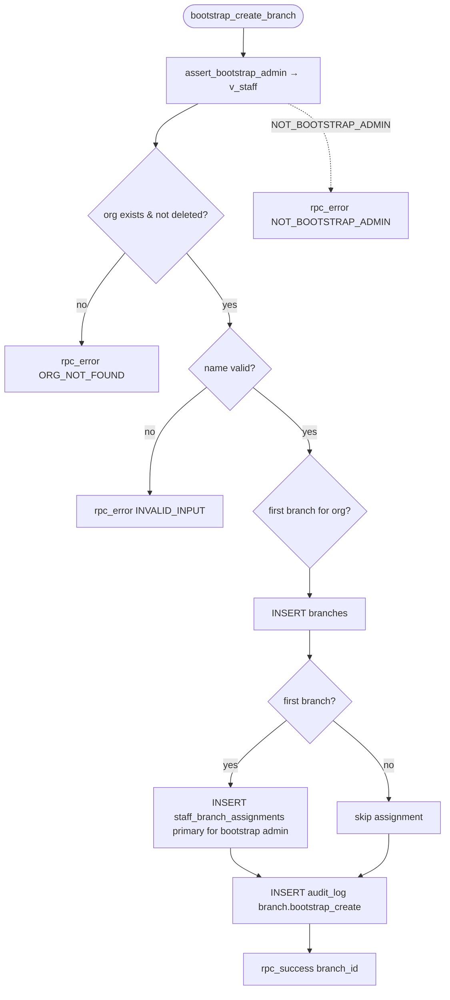

---

## Create staff account (RPC)

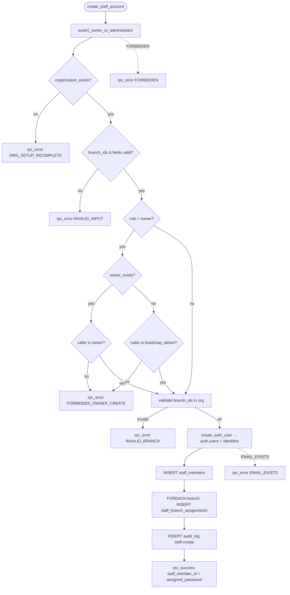

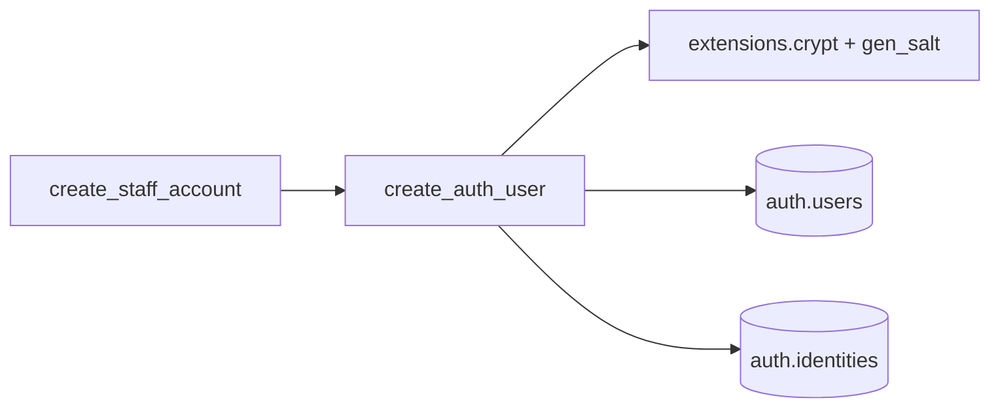

---

## Admin reset staff password (RPC)

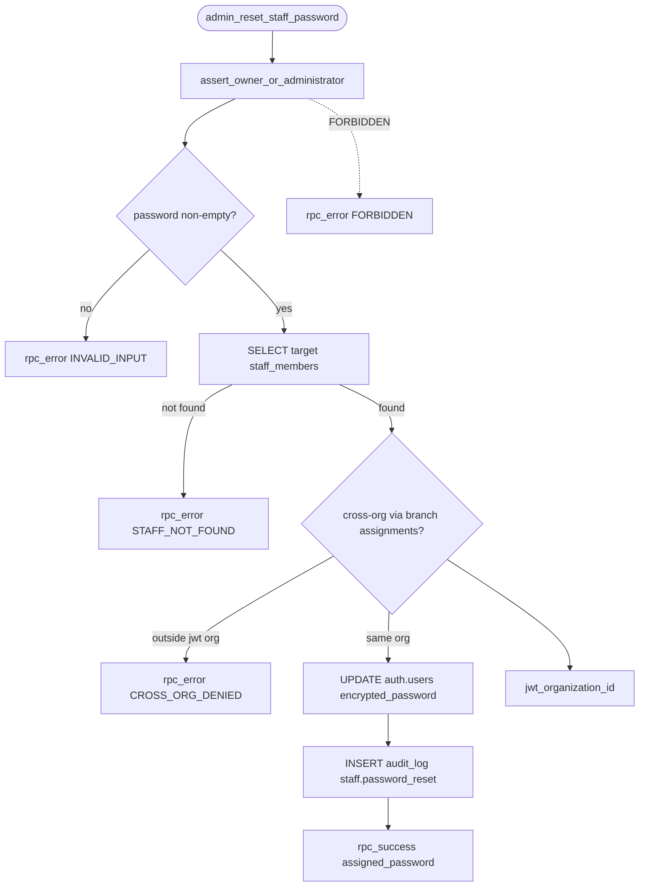

---

## build_staff_claims data dependencies

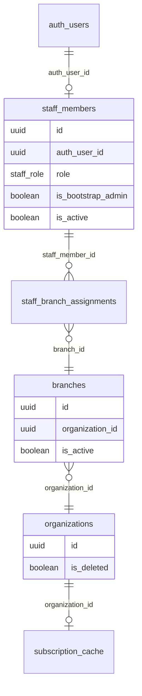

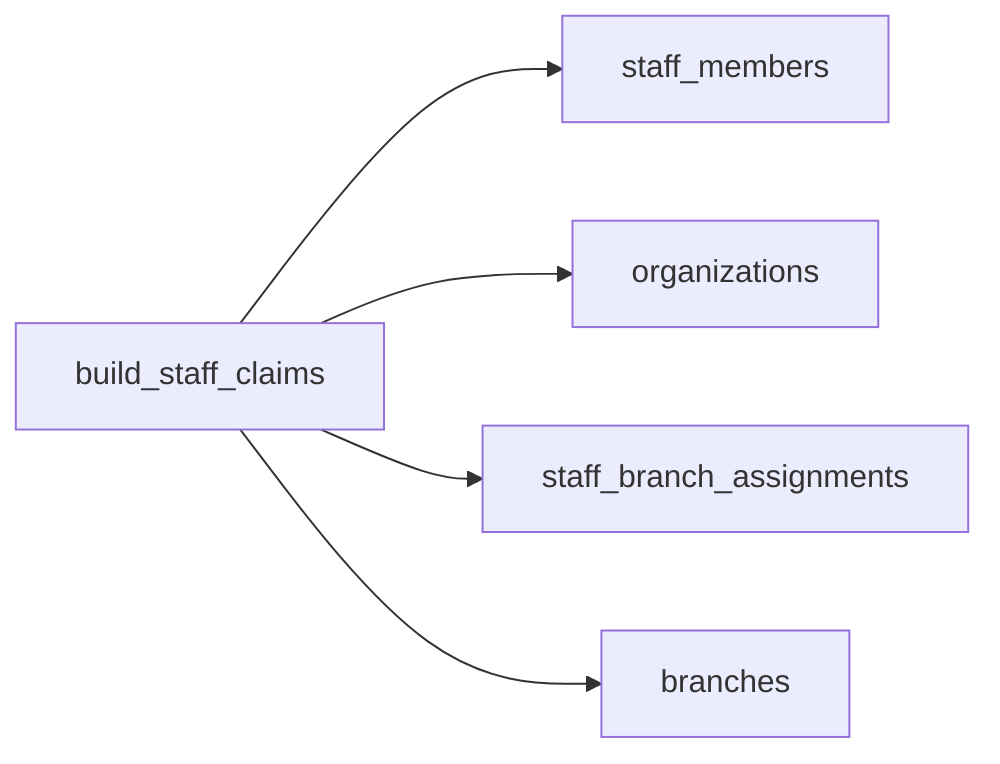

---

## Tables touched by RPCs (writes)

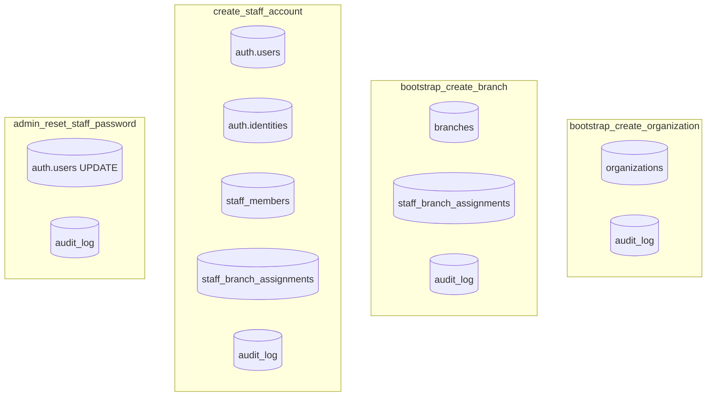

---

## Seed migration (M5) — data flow

```mermaid
flowchart TB
  M5[M5 auth_rbac_seed.sql]
  M5 --> RP[INSERT roles_permissions ON CONFLICT UPDATE]
  M5 --> DO[DO block bootstrap admin]

  DO --> AU{auth.users exists?}
  AU -->|no| INS_AU[INSERT auth.users + identities]
  AU -->|yes| SKIP_AU[skip]
  INS_AU --> SM{staff_members exists?}
  SKIP_AU --> SM
  SM -->|no| INS_SM[INSERT staff_members is_bootstrap_admin=true]
  SM -->|yes| SKIP_SM[skip]

  DO --> CRYPT["extensions.crypt + gen_salt"]
```

```mermaid
flowchart LR
  subgraph seed_only["M5 only — no function calls"]
    RP2[roles_permissions rows]
    BA[bootstrap admin fixed UUIDs]
  end
```

---

## Grants and execution surface

```mermaid
flowchart TB
  subgraph authenticated_grants["GRANT EXECUTE — authenticated"]
    G1[bootstrap_create_organization]
    G2[bootstrap_create_branch]
    G3[create_staff_account]
    G4[admin_reset_staff_password]
    G5[get_custom_claims uuid]
  end

  subgraph auth_admin["GRANT EXECUTE — supabase_auth_admin if role exists"]
    G6[get_custom_claims jsonb]
  end

  subgraph no_client_grant["Not granted to clients"]
    NG1[create_auth_user]
    NG2[assert_*]
    NG3[build_staff_claims direct]
    NG4[organization_exists / owner_exists]
  end
```
