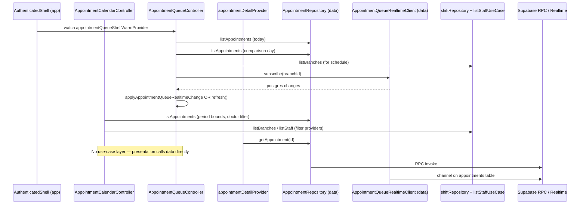

# Appointments Feature Code Review

**Feature path:** `frontend/lib/features/appointments`  
**Review date:** 2026-07-05  
**Architecture:** Intended Clean Architecture + Riverpod (partially implemented)  
**Review scope:** Domain (23 files), Data (4 files), Application (1 file), Presentation (6 files), app-layer integration, 41 test files; comparison to `features/auth`

---

## Executive Summary

### Overall Verdict: **Conditionally Acceptable for Backend/Domain Work — Not Ready for Production Appointment UI**

The appointments stack has **unusually strong pure-domain and repository test coverage** for a feature with no screens: status lifecycle, reschedule validation, calendar display math, queue partitioning, and RPC wrappers are well exercised. Business rules are thoughtfully encoded (org-timezone day gates, doctor-busy start blocking, client-side overlap checks before reschedule).

However, the feature **diverges sharply from the auth feature's Clean Architecture shape**: there are **no repository interfaces, no use cases, and no `domain/usecases/` folder**. Presentation providers call `AppointmentRepository` directly. The **entire appointment UI is placeholder** (`uiPendingPlaceholder` on all `/appointments/*` routes). Domain layer **imports Flutter, Syncfusion, and cross-feature types** (auth, shifts, settings). Status and scheduling rules are **reimplemented in 4+ places** with subtle behavioral differences (realtime apply vs queue display vs calendar filter vs server RPC). **Concurrent async refresh** in queue and calendar providers can serve stale data under load.

| Category | Count |
|----------|-------|
| Critical | 6 |
| High | 18 |
| Medium | 22 |
| Low | 14 |
| Clean Architecture violations | 12 |
| SOLID violations | 7 |
| Performance items | 8 |
| Test coverage gaps | 28 |

**Recommended action:** Do not ship production appointment screens until Phase 1 (async correctness, architectural seams, status-rule consolidation) is complete. Phase 2–4 can proceed in parallel with UI work once serialization guards and domain ports are in place.

---

## Feature Overview

### Purpose

Manages **appointment scheduling** (create, list, detail, reschedule, cancel, no-show), **today's clinic queue** (status progression, wait stats, realtime patches), and **multi-mode calendar** (day/week/month/doctors/schedule views with filters). Integrates with Supabase RPCs (`create_appointment`, `list_appointments`, `update_appointment_status`, etc.), Postgres realtime on `appointments`, shifts feature for on-shift doctors, and auth session for branch/timezone scope.

### Data Flow



**Use cases:** **Skipped entirely.** Auth has 5 use cases + `auth_use_case_providers.dart`; appointments have zero equivalents.

### File Inventory

| Layer | Path | Responsibility |
|-------|------|----------------|
| **Domain** | `domain/appointment_status.dart` | PG enum mapping, `isTerminal`, `canTransitionTo` matrix |
| | `domain/appointment_type.dart` | Planned/walk-in type enum |
| | `domain/appointment_list_item.dart` | List row entity + lenient `fromRow` |
| | `domain/appointment_detail.dart` | Detail entity + strict `fromRow` |
| | `domain/appointment_settings.dart` | Branch settings from `get_appointment_settings` |
| | `domain/create_appointment_result.dart` | Create/update/reschedule RPC result |
| | `domain/appointment_status_update_result.dart` | Status update RPC result |
| | `domain/appointment_row_parsing.dart` | Shared datetime/string parsers |
| | `domain/appointment_fetch_scope.dart` | Branch/org/timezone scope from `AuthSessionContext` |
| | `domain/appointment_today_range.dart` | Today bounds, sort helper |
| | `domain/appointment_org_calendar.dart` | IANA timezone day math + global init |
| | `domain/appointment_status_day_rules.dart` | Day-gated status transitions |
| | `domain/appointment_status_transitions.dart` | Forward action targets, cancel/no-show/reschedule gates |
| | `domain/appointment_status_timeline.dart` | Detail timeline step states |
| | `domain/appointment_reschedule_validation.dart` | Pre-RPC drag/reschedule client checks |
| | `domain/appointment_working_hours.dart` | Slot-within-schedule checks |
| | `domain/appointment_branch_working_hours.dart` | Branch schedule validation, previous working day |
| | `domain/appointment_calendar_period.dart` | Calendar mode bounds/navigation |
| | `domain/appointment_calendar_display.dart` | Syncfusion layout, colors, visibility filters |
| | `domain/appointment_queue_display.dart` | Queue stats, partition, wait tiers, scroll math |
| | `domain/appointment_queue_start_doctor.dart` | Start-visit doctor picker / busy rules |
| | `domain/appointment_queue_shift_doctors.dart` | Shift→doctor lookup for queue display |
| | `domain/doctor_dev_seed_data.dart` | Dev doctor seed specs + password |
| **Application** | `application/appointment_rpc_messages.dart` | User-facing RPC error mapping |
| **Data** | `data/appointment_repository.dart` | All appointment RPCs + `appointmentRepositoryProvider` |
| | `data/appointment_queue_realtime.dart` | Supabase realtime client + provider |
| | `data/appointment_queue_realtime_apply.dart` | In-place realtime patch logic |
| | `data/doctor_dev_seed_service.dart` | Dev doctor account seeding |
| **Presentation** | `presentation/providers/appointment_queue_provider.dart` | Queue state, refresh, realtime, patch |
| | `presentation/providers/appointment_calendar_provider.dart` | Calendar state, filters, fetch |
| | `presentation/providers/appointment_detail_provider.dart` | Detail `FutureProvider.family` |
| | `presentation/providers/appointment_queue_shift_provider.dart` | Shift doctor lookup for queue |
| | `presentation/providers/appointment_surface_invalidation.dart` | Cross-provider invalidation helper |
| | `presentation/navigation/appointment_detail_route_extra.dart` | go_router extra payload |

**Related code outside the feature folder:**

| Path | Role |
|------|------|
| `app/router.dart` | 6 appointment routes — all `uiPendingPlaceholder` |
| `app/shell/authenticated_shell.dart` | Eager queue warm for nav badge |
| `core/auth/auth_route_guard.dart` | Appointment route permission rules |
| `core/auth/permission_service.dart` | `appointments.read/create/cancel` checks |
| `features/patients/.../patient_detail_history_provider.dart` | `patientUpcomingAppointmentsProvider` |
| `features/setup/.../setup_notifier.dart` | Calls `invalidateAppointmentSurfaceProviders` |
| `app/shell/dev/dev_clinic_seed_*.dart` | Dev seed uses `createAppointment` / status RPCs |

### Architecture Assessment vs Auth

| Aspect | Auth (`features/auth`) | Appointments |
|--------|------------------------|--------------|
| Repository interface | `domain/repositories/auth_repository.dart` | **Missing** — concrete `AppointmentRepository` in data |
| Use cases | 5 in `domain/usecases/` | **None** |
| Use-case providers | `auth_use_case_providers.dart` | **None** |
| Presentation → domain | Via use cases (intended) | **Direct to `appointmentRepositoryProvider`** |
| DI provider location | Data layer (auth also has CA smell) | Data layer only |
| UI screens | Login placeholder | **All 6 routes placeholder** |
| Application layer | Minimal | `appointment_rpc_messages.dart` only |
| Orchestration split | `app/providers/auth_session_provider.dart` | Queue/calendar logic in feature providers |

**Dependency direction today:**

```
presentation → data (AppointmentRepository)     ← violation
presentation → app (authSessionProvider)          ← integration coupling
presentation → settings/shifts use cases          ← cross-feature
domain → auth, settings, shifts, syncfusion       ← violation
data → domain (correct)
```

**Target direction (aligned with auth review):**

```
presentation → domain (use cases, entities)
data → domain (implements AppointmentRepository interface)
app/composition → wires providers
```

### Positive Patterns

1. **Rich pure domain** — Status transitions, reschedule validation, queue stats, and calendar layout are testable without widgets.
2. **Repository input validation** — Empty IDs, duration minimums, notes length checked before RPC (mirrored in tests).
3. **`appointment_rpc_messages.dart`** — Centralized user-facing error copy for RPC codes.
4. **`AppointmentFetchScope`** — Clean session-scope comparison for provider reload triggers.
5. **`applyAppointmentQueueRealtimeChange`** — Surgical in-place updates avoid full list reload when possible.
6. **`patchAppointmentStatus`** — Optimistic queue update without re-fetch (with server timestamp discipline).
7. **Extensive unit tests** — 38 unit files covering domain + repository; regression tests for known BUG-00x items.
8. **Boundary tests** — Live DB scenarios for settings, status lifecycle, FORBIDDEN.
9. **Route ordering and guards** — Static paths before `/:appointmentId`; `AuthRouteGuard` appointment tests are solid.

---

## 1. Critical Issues

### 1.1 No production appointment UI — all routes are placeholders

| Field | Detail |
|-------|--------|
| **Severity** | Critical |
| **Layers** | Presentation (missing), Integration |
| **Files** | `app/router.dart` (lines 77–98) |
| **Evidence** | All `/appointments`, `/appointments/book`, `/queue`, `/calendar`, `/:id`, `/schedule/:doctorId` use `uiPendingPlaceholder('Appointments', state)`. No widgets exist under `features/appointments/presentation/` except providers and route extra. |
| **Why** | Provider APIs (`patchAppointmentStatus`, `selectedStatuses`, `AppointmentDetailRouteExtra.preview`) are unvalidated in widget/integration tests; drag-reschedule tests exercise domain only. |
| **Impact** | Zero realistic UI flows (drag-reschedule, status buttons, doctor picker, error toasts via `appointmentMessageForRpc`); cannot ship appointment feature to users. |
| **Solution** | Implement screens under `features/appointments/presentation/`; wire through use cases; add widget/integration tests for error/retry and preview hydration. |

---

### 1.2 Unserialized concurrent `refresh()` races serve stale data

| Field | Detail |
|-------|--------|
| **Severity** | Critical |
| **Layers** | Presentation (primary), Data (trigger) |
| **Files** | `appointment_queue_provider.dart`, `appointment_calendar_provider.dart`; triggered by `appointment_queue_realtime_apply.dart` returning `false` |
| **Evidence** | `AppointmentQueueController.refresh()` and `AppointmentCalendarController.refresh()` have no mutex, epoch token, or in-flight guard. Invoked from: `Future.microtask` on build, auth-session listener, and `_onRealtimeChange` via `unawaited(refresh())` when incremental apply fails. Overlapping calls complete out of order; last-writer-wins on `state.items`. Calendar `refresh()` captures branchId/filter state, awaits `listAppointments`, then unconditionally assigns state. |
| **Why** | Realtime insert, unknown-row update, and malformed payloads all force full refresh. Fast filter changes, branch switch, and auth scope updates compound the problem. |
| **Impact** | Queue/calendar can briefly or persistently show superseded appointment rows, miss new check-ins, or display wrong branch's data — intermittent, hard-to-reproduce data corruption. |
| **Solution** | Single-flight `refresh()` with monotonic `_fetchGeneration`; ignore results when generation or `branchId`/`todayRange` changed mid-flight. Debounce realtime-triggered refreshes (200–500 ms coalesce). Optionally cancel in-flight work on dispose/branch change. |

```110:130:frontend/lib/features/appointments/presentation/providers/appointment_calendar_provider.dart
  Future<void> refresh() async {
    final branchId = _normalizedOrNull(state.selectedBranchId);
    // ...
    try {
      final bounds = appointmentCalendarFetchBounds(state.focusDate, state.mode);
      final items = await ref
          .read(appointmentRepositoryProvider)
          .listAppointments(branchId: branchId, from: bounds.$1, to: bounds.$2, doctorId: state.selectedDoctorId);
      state = state.copyWith(loading: false, items: items, error: null);
```

---

### 1.3 Presentation bypasses domain — no use cases or repository interface

| Field | Detail |
|-------|--------|
| **Severity** | Critical |
| **Layers** | Presentation → Data, Domain (structural) |
| **Files** | `appointment_queue_provider.dart`, `appointment_calendar_provider.dart`, `appointment_detail_provider.dart`, `patient_detail_history_provider.dart`; entire `domain/` vs `auth/domain/repositories/`, `auth/domain/usecases/` |
| **Evidence** | All three appointment providers `ref.read(appointmentRepositoryProvider)` directly. No `abstract class AppointmentRepository` in domain. Auth uses `signInUseCaseProvider` etc. |
| **Why** | When UI arrives, mutation orchestration (status update → queue patch → calendar invalidate → error mapping) will land in widgets or providers ad hoc; domain cannot define appointment operations as ports. |
| **Impact** | Hard to mock/swap data sources; presentation untestable without Supabase-shaped fakes; violates dependency rule; domain grows as a "god folder" of static helpers. |
| **Solution** | Add `domain/repositories/appointment_repository.dart` (abstract) and use cases: `ListAppointments`, `GetAppointment`, `CreateAppointment`, `UpdateAppointmentStatus`, `RescheduleAppointment`, `CancelAppointment`, `GetAppointmentSettings`. Mirror `auth_use_case_providers.dart`. |

---

### 1.4 Realtime insert path forces full refresh — no incremental queue add

| Field | Detail |
|-------|--------|
| **Severity** | Critical |
| **Layers** | Data → Presentation |
| **Files** | `appointment_queue_realtime_apply.dart` (lines 29–30); `appointment_queue_provider.dart` (lines 269–279) |
| **Evidence** | `PostgresChangeEvent.insert` returns `false`; provider calls `unawaited(refresh())` — triggers **2× `list_appointments`** (today + comparison day). |
| **Why** | No handler builds `AppointmentListItem` from `newRecord` when payload is complete. |
| **Impact** | Under active booking (many inserts), queue generates redundant RPC load; compounds refresh race (§1.2). |
| **Solution** | Implement insert handler building `AppointmentListItem` from `newRecord` when payload complete; debounce refresh fallback. |

---

### 1.5 Syncfusion and Flutter UI types in domain

| Field | Detail |
|-------|--------|
| **Severity** | Critical |
| **Category** | Clean Architecture violation |
| **Files** | `appointment_calendar_display.dart` |
| **Evidence** | Imports `dart:ui`, `package:intl/intl.dart`, `package:syncfusion_flutter_calendar/calendar.dart`. `resourceRowStripeRegions` returns `List<TimeRegion>`; `statusColor` returns `Color`; `isAlignedToSlotGrid` takes `Rect`. |
| **Why** | Domain depends on a third-party calendar widget and Flutter rendering types. Cannot be tested or reused without Flutter/Syncfusion. |
| **Impact** | Blocks headless domain testing; couples business rules to one UI library; any calendar widget swap forces domain rewrite. |
| **Solution** | Split into `appointment_calendar_layout.dart` (pure: hours, slots, shade regions as plain `DateTime` pairs) in domain, and `appointment_calendar_presentation.dart` in presentation that maps to `TimeRegion`/`Color`. Use `package:meta/meta.dart` for `@immutable`. |

---

### 1.6 Dev credentials and seed data in domain

| Field | Detail |
|-------|--------|
| **Severity** | Critical |
| **Category** | Clean Architecture / security |
| **Files** | `doctor_dev_seed_data.dart` |
| **Evidence** | `abstract final class DoctorDevSeedData { static const String defaultPassword = 'DevDoctor123!';` |
| **Why** | Domain layer should not contain environment-specific dev passwords or seed orchestration data. |
| **Impact** | Risk of accidental production inclusion; domain polluted with non-business concepts. |
| **Solution** | Move to `data/dev/` or `tooling/`; keep domain free of dev-only artifacts. |

---

## 2. High Priority Issues

### 2.1 Duplicate working-hours logic with inconsistent parsers

| Field | Detail |
|-------|--------|
| **Severity** | High |
| **Category** | Code duplication / correctness risk |
| **Files** | `appointment_branch_working_hours.dart`, `appointment_working_hours.dart`, `appointment_reschedule_validation.dart`, `appointment_calendar_display.dart` |
| **Evidence** | Branch parser accepts optional seconds: `r'^([01]\d|2[0-3]):([0-5]\d)(?::[0-5]\d)?$'`. WorkingHours parser does not: `r'^([01]\d|2[0-3]):([0-5]\d)$'`. Weekday mapping duplicated in both classes. Reschedule calls **both** validators sequentially. |
| **Why** | Same schedule can pass one validator and fail another; maintenance drift is already visible. |
| **Impact** | Subtle booking/reschedule bugs for `HH:MM:SS` close times or 23:59-midnight slots; confusing error messages. |
| **Solution** | Single `BranchScheduleValidator` with one parser and shared weekday helper; expose `validateDuration(...)` and `validateInterval(...)` as thin wrappers. |

---

### 2.2 Timezone split-brain: org TZ for queue/day rules vs device-local for calendar bounds

| Field | Detail |
|-------|--------|
| **Severity** | High |
| **Category** | Business rule inconsistency |
| **Files** | `appointment_org_calendar.dart`, `appointment_calendar_period.dart`, `appointment_status_day_rules.dart` |
| **Evidence** | Queue uses `appointmentTodayRangeInTimezone(organizationTimezone, ...)`. Calendar fetch uses `appointmentCalendarFetchBounds(focusDate, mode)` with `DateTime(focusDate.year, focusDate.month, focusDate.day)` — **device-local calendar components**, no org timezone. Day rules correctly use org timezone (tested regression). |
| **Why** | A clinic in `America/Los_Angeles` can allow check-in per org day rules while calendar fetches the wrong UTC window near midnight boundaries. |
| **Impact** | Missing/extra appointments on calendar; status actions and visible data disagree. |
| **Solution** | Thread `organizationTimezone` into `appointmentCalendarFetchBounds` and navigation helpers; deprecate unused `appointmentTodayRange(DateTime reference)`. |

---

### 2.3 Global timezone initialization side effect in domain

| Field | Detail |
|-------|--------|
| **Severity** | High |
| **Category** | Infrastructure leak |
| **Files** | `appointment_org_calendar.dart`, `appointment_queue_shift_doctors.dart` |
| **Evidence** | `ensureAppointmentTimezonesInitialized()` calls `tz_data.initializeTimeZones()` with module-level `_timezonesInitialized` flag. |
| **Why** | Domain performs one-time IO-ish global init; hidden dependency for tests (`setUpAll(ensureAppointmentTimezonesInitialized)` required). |
| **Impact** | Test ordering hazards; domain not a pure function of inputs. |
| **Solution** | Inject a `CalendarClock` / `TimezoneService` port from data or core; initialize in app bootstrap. |

---

### 2.4 `AppointmentListItem` vs `AppointmentDetail` parsing policy divergence

| Field | Detail |
|-------|--------|
| **Severity** | High |
| **Category** | Consistency / data integrity |
| **Files** | `appointment_list_item.dart`, `appointment_detail.dart` |
| **Evidence** | List: `AppointmentType.tryParse(...) ?? AppointmentType.unknown` — keeps row. Detail: `type == null` → returns `null` — drops row. Same for status. |
| **Why** | Same backend row can appear in list but fail to open detail; tests encode this as intentional but it's fragile. |
| **Impact** | User sees appointment on calendar/queue, detail screen fails silently. |
| **Solution** | Unify parsing policy (prefer strict everywhere with explicit `unknown` only when product requires list resilience); or map list→detail via ID refetch that tolerates partial data. |

---

### 2.5 Riverpod providers live inside data layer files

| Field | Detail |
|-------|--------|
| **Severity** | High |
| **Category** | DI / layer violation |
| **Files** | `appointment_repository.dart` (346–348), `appointment_queue_realtime.dart` (81–83) |
| **Evidence** | `import 'package:flutter_riverpod/flutter_riverpod.dart'` in data layer; `Provider<>` definitions at file bottom. |
| **Why** | Composition root should not live with infrastructure. |
| **Impact** | Data layer depends on UI framework; circular import risk; harder to reuse data code outside Flutter. |
| **Solution** | Move providers to `app/di/appointments_di.dart` or `features/appointments/di/`. |

---

### 2.6 Realtime client: no reconnection, no error logging, fire-and-forget channel teardown

| Field | Detail |
|-------|--------|
| **Severity** | High |
| **Category** | Realtime lifecycle / resilience |
| **Files** | `appointment_queue_realtime.dart` (33–78) |
| **Evidence** | `subscribe` callback maps `channelError`/`timedOut`/`closed` → `degraded` only. `error` parameter ignored. No retry/resubscribe. `unsubscribe` uses `unawaited(_client.removeChannel(channel))` then immediately creates new channel on resubscribe. |
| **Why** | Degraded is a terminal UI flag unless consumer re-subscribes; consumer only subscribes on branch change / init. |
| **Impact** | After network blip, queue may stop receiving live updates until branch switch or app restart; silent diagnostic loss. |
| **Solution** | Log `error` with `AppLog`. Exponential backoff resubscribe while provider alive. `await removeChannel` before new subscribe, or use single channel with updated filter. |

---

### 2.7 Incremental realtime apply omits doctor/patient fields

| Field | Detail |
|-------|--------|
| **Severity** | High |
| **Category** | DTO mapping / stale cache |
| **Files** | `appointment_queue_realtime_apply.dart` (85–93) |
| **Evidence** | `_applyUpdate` only patches `startTime`, `endTime`, `status`, `type`, timestamp fields. `doctorId`, `doctorName`, `patientName` never updated from `newRecord`. |
| **Why** | Postgres realtime payloads often include only changed columns depending on replica identity. |
| **Impact** | After doctor reassignment via `update_appointment`, queue row shows stale doctor until full refresh — which may lose race (§1.2) or not fire if apply returns `true`. |
| **Solution** | Patch doctor/patient fields when keys present in `record`. If doctor or patient keys changed but missing from payload, return `false` to force refresh. |

---

### 2.8 `StateError` on malformed RPC success responses bypasses `appointmentMessageForRpc`

| Field | Detail |
|-------|--------|
| **Severity** | High |
| **Category** | Exception handling |
| **Files** | `appointment_repository.dart` (41, 57, 114, 126, 192, 244, 278, 306) |
| **Evidence** | Every mutation path: `if (parsed == null) throw StateError('...unexpected shape.')`. Presentation catches generic `catch (error)` and shows fixed strings (e.g. queue: `'Unable to load today's queue.'`). |
| **Why** | Contract drift between SQL RPC and client parsers surfaces as programmer errors, not user-actionable `RpcFailure`. |
| **Impact** | Users see generic failures; Sentry/logs may miss structured codes; harder to distinguish migration issues from parse bugs. |
| **Solution** | Throw `RpcFailure(RpcResult(success: false, errorCode: 'INVALID_RESPONSE', ...))` or a domain `AppointmentParseFailure`. Log raw payload at warning level. |

---

### 2.9 `updateAppointment` has no dedicated unit tests; production wiring absent

| Field | Detail |
|-------|--------|
| **Severity** | High |
| **Category** | Test coverage / dead API surface |
| **Files** | `appointment_repository.dart` (201–247); `appointment_queue_doctor_rollback_test.dart` (only consumer test) |
| **Evidence** | Grep shows **no** `lib/` call sites for `.updateAppointment(` except repository definition. Only rollback contract test exercises it. No tests for param forwarding, notes semantics, `p_end_time`, or malformed payload. |
| **Why** | Method documented for calendar/detail edit flows but not wired in Flutter presentation yet. |
| **Impact** | Regressions in a core mutation RPC will go unnoticed until presentation is built. QA doc references doctor-assign flow (BUG-004) without repository-level coverage. |
| **Solution** | Add `appointment_repository_update_test.dart` mirroring create/reschedule tests. Wire presentation or mark `@visibleForTesting` with explicit TODO. |

---

### 2.10 Status lifecycle rules duplicated across 4+ locations

| Field | Detail |
|-------|--------|
| **Severity** | High |
| **Files** | `appointment_status.dart`, `appointment_status_transitions.dart`, `appointment_status_day_rules.dart`, `appointment_rpc_messages.dart`, server RPC, `appointment_queue_realtime_apply.dart` |
| **Evidence** | `canTransitionTo` matrix, day-gated transitions, forward actions, RPC error messages, and realtime apply (cancel removes, no-show keeps) each encode overlapping rules independently. |
| **Why** | No single `AppointmentLifecyclePolicy` entry point. |
| **Impact** | Client may show "Start" button while server rejects; realtime queue state diverges from display partition rules. |
| **Solution** | Single `AppointmentLifecyclePolicy.canApply(item, target, context)` combining matrix, day rules, queue doctor rules — single entry point for UI, realtime, and tests. |

---

### 2.11 Cross-feature domain imports create coupling

| Field | Detail |
|-------|--------|
| **Severity** | High |
| **Files** | `appointment_fetch_scope.dart` → `auth_session.dart`; `appointment_queue_shift_doctors.dart` → auth, settings, shifts |
| **Evidence** | Appointments domain imports other features' domain types directly. |
| **Why** | Appointments domain cannot be understood or tested in isolation; changes to `StaffRole`, `ShiftListItem` ripple into appointments. |
| **Impact** | Feature fan-in; brittle cross-feature contracts. |
| **Solution** | Define appointments-local DTOs or ports; map at provider/application boundary. |

---

### 2.12 Doctor-busy detection duplicated

| Field | Detail |
|-------|--------|
| **Severity** | High |
| **Files** | `appointment_queue_start_doctor.dart` (`isDoctorBusy`); `appointment_queue_display.dart` (`inProgressAppointmentForDoctor`) |
| **Evidence** | Nearly identical iteration over in-progress items including unassigned slot semantics. |
| **Impact** | Fix in one may not propagate; rules can't be reused without copy-paste. |
| **Solution** | Single `AppointmentDoctorAvailability` helper in domain. |

---

### 2.13 Business logic leaked into presentation providers

| Field | Detail |
|-------|--------|
| **Severity** | High |
| **Files** | `appointment_queue_provider.dart`, `appointment_queue_shift_provider.dart` |
| **Evidence** | Queue: `_fetchComparisonItems`, `_resolveBranchSchedule`, previous-working-day offset math. Shift: `_resolveQueueShiftDoctors` (80+ lines) duplicates domain `AppointmentQueueShiftDoctorLookup.fromShiftsAndDoctors` doctor-set resolution. |
| **Why** | Orchestration and business rules belong in domain use cases, not Notifier/FutureProvider bodies. |
| **Impact** | Providers become untestable god-objects; shift doctor rules can't be reused by future web without copy-paste. |
| **Solution** | Extract `GetQueueComparisonAppointmentsUseCase`, `ResolveQueueShiftDoctorsUseCase` into domain; providers only map results → state. |

---

### 2.14 `DoctorDevSeedService` reports `created: 0` after partial provisioning failure

| Field | Detail |
|-------|--------|
| **Severity** | High (data integrity, dev tooling) |
| **Files** | `doctor_dev_seed_service.dart` (lines 51–72) |
| **Evidence** | Loop calls `createStaffAccount` sequentially. On `RpcFailure`, catch returns `DoctorDevSeedOutcome(created: 0, ...)`. Earlier iterations may have succeeded. Idempotency check only looks for dev-prefix names, not usernames. Service is documented but never wired (no provider, no import from `lib/app/`). |
| **Why** | No transaction boundary; outcome struct does not track partial progress. |
| **Impact** | Orphan staff accounts; retry may hit username conflicts; operator sees "0 created" while DB is mutated. |
| **Solution** | Track `created` count in `catch`; return `created: createdSoFar`. Wire into dev shell with provider, or move to `tool/` until needed. |

---

### 2.15 Calendar status filter is client-only — full fetch cost for large lists

| Field | Detail |
|-------|--------|
| **Severity** | High |
| **Files** | `appointment_calendar_provider.dart`, `appointment_calendar_display.dart` |
| **Evidence** | `applyFilters(statuses: …)` updates `selectedStatuses` but does **not** refetch when only statuses change (test explicitly asserts no extra RPC). `refresh()` never passes statuses to `listAppointments`. Filtering is via `filterVisibleAppointments` — UI must call; provider stores raw `items`. |
| **Why** | Valid if UI always applies client filter; invalid if consumers render `state.items` directly. |
| **Impact** | Future calendar widgets that bind raw `items` will show unfiltered data; cancelled/no-show rows still fetched over the wire for entire period. Scales poorly for busy branches. |
| **Solution** | Expose `filteredItems` on state (computed via domain helper) or document contract. Consider server-side status filter when `selectedStatuses` non-empty. |

---

### 2.16 `appointment_detail_provider` permission check uses `StateError`

| Field | Detail |
|-------|--------|
| **Severity** | High |
| **Files** | `appointment_detail_provider.dart` (lines 14–16) |
| **Evidence** | Permission denial throws `StateError('Appointment access denied.')` before fetch. |
| **Why** | Inconsistent with `appointmentMessageForRpc` curated messages. |
| **Impact** | UI will see generic `AsyncError`, not curated forbidden message, if provider is read outside guarded navigation. |
| **Solution** | Throw typed `AppointmentAccessDenied` mapped to UI empty state. |

---

### 2.17 Supabase realtime client and shift provider untested

| Field | Detail |
|-------|--------|
| **Severity** | High |
| **Files** | `appointment_queue_realtime.dart`, `appointment_queue_shift_provider.dart` |
| **Evidence** | `SupabaseAppointmentQueueRealtimeClient` — only fakes used in tests. Shift provider makes 3 RPC/use-case calls per queue render (shifts, branch staff, all staff); fallback doctor matching by name untested. |
| **Impact** | Channel naming, filter, status callback mapping unverified; doctor resolution logic split between provider and domain untested. |
| **Solution** | Add realtime client unit tests; test shift provider full flow; move `_resolveQueueShiftDoctors` to domain. |

---

### 2.18 `_normalizedOrNull` duplicated in presentation

| Field | Detail |
|-------|--------|
| **Severity** | High |
| **Files** | `appointment_fetch_scope.dart`; `appointment_calendar_provider.dart` |
| **Evidence** | Identical string normalization helper in two files. |
| **Solution** | Extract to `core/utils/string_normalize.dart` or domain helper. |

---

## 3. Medium Priority Issues

### 3.1 `unknown` status is terminal but under-tested in transitions/timeline

| Field | Detail |
|-------|--------|
| **Severity** | Medium |
| **Files** | `appointment_status.dart`, `appointment_status_timeline.dart` |
| **Evidence** | `unknown.isTerminal => true`; timeline `indexOf(unknown)` → all steps `skipped`; no test for forward actions on unknown rows. |
| **Impact** | Unknown rows excluded from queue stats but could still appear on calendar; no recovery path in UI. |
| **Solution** | Explicit product rule for unknown (hide vs show banner); add tests. |

---

### 3.2 Reschedule overlap ignores `completed` (and `unknown`) appointments

| Field | Detail |
|-------|--------|
| **Severity** | Medium |
| **Files** | `appointment_reschedule_validation.dart` |
| **Evidence** | `_blocksScheduling` only skips `cancelled` and `noShow`. Completed visit at 10:00 still blocks another appointment moved to 10:00. |
| **Impact** | False "overlap" errors when reusing slots after completed visits. |
| **Solution** | Align with backend overlap rules; likely also skip `completed` (and possibly `unknown`). |

---

### 3.3 Hardcoded 5-minute minimum vs settings-driven `minDurationMinutes`

| Field | Detail |
|-------|--------|
| **Severity** | Medium |
| **Files** | `appointment_reschedule_validation.dart`, `appointment_settings.dart`, `appointment_repository.dart` (`_assertDurationMinutes`) |
| **Evidence** | Reschedule and repository reject `< 5` locally. Settings RPC returns `min_duration_minutes` parsed into domain but never used by repository or validation. |
| **Impact** | If org sets min 10, client allows 5 until server rejects; confusing `INVALID_INPUT`. |
| **Solution** | Pass `AppointmentSettings` into validation and use cases, or drop client min and rely on server with message mapping. |

---

### 3.4 `schedule` calendar mode: week fetch bounds + day navigation mismatch

| Field | Detail |
|-------|--------|
| **Severity** | Medium |
| **Files** | `appointment_calendar_period.dart` |
| **Evidence** | `schedule` fetch = 7-day week window; `appointmentCalendarNextFocus` for `schedule` = +1 day (tested). |
| **Impact** | User navigates one day at a time but refetches a week — wasteful and confusing if UI implies single-day schedule. |
| **Solution** | Document intentional prefetch or align bounds to 1 day for `schedule` mode. |

---

### 3.5 Month navigation date overflow

| Field | Detail |
|-------|--------|
| **Severity** | Medium |
| **Files** | `appointment_calendar_period.dart` |
| **Evidence** | `DateTime(focusDate.year, focusDate.month - 1, focusDate.day)` — Dart normalizes invalid dates (e.g. Mar 31 → Mar 3). |
| **Impact** | Focus date jumps unexpectedly when navigating months. |
| **Solution** | Use safe month arithmetic (clamp day to last day of month). |

---

### 3.6 `debugPrint` in domain entity factory

| Field | Detail |
|-------|--------|
| **Severity** | Medium |
| **Files** | `appointment_list_item.dart` (lines 58–63) |
| **Evidence** | Logs unrecognized type/status via `debugPrint`. |
| **Impact** | Console noise in production; domain depends on Flutter logging. |
| **Solution** | Return parse warnings as `ParseResult` or log in data layer. |

---

### 3.7 `AppointmentStatus.canTransitionTo` does not encode day rules (API footgun)

| Field | Detail |
|-------|--------|
| **Severity** | Medium |
| **Files** | `appointment_status.dart`, `appointment_status_day_rules.dart`, `appointment_status_transitions.dart` |
| **Evidence** | `canCancelAppointment` uses only `canTransitionTo`; `canMarkNoShowAppointment` adds day rules. Callers using `canTransitionTo` alone for check-in will be wrong. |
| **Impact** | Future features may allow actions on wrong day. |
| **Solution** | Add composed `canTransitionToStatus(from, to, {org tz, startTime})` helper. |

---

### 3.8 `listAppointments` silently returns `[]` when `items` is not a `List`

| Field | Detail |
|-------|--------|
| **Severity** | Medium |
| **Files** | `appointment_repository.dart` (162–164) |
| **Evidence** | `if (rawItems is! List) { return const []; }` — no log, no exception. |
| **Impact** | Migration/RPC shape bugs manifest as "empty calendar" with no error banner. |
| **Solution** | Log warning with `rawItems` runtimeType; consider `RpcFailure(INVALID_RESPONSE)` when `success: true` but `items` missing. |

---

### 3.9 Inconsistent notes parameter semantics between create and update

| Field | Detail |
|-------|--------|
| **Severity** | Medium |
| **Files** | `appointment_repository.dart` (108 vs 235) |
| **Evidence** | `createAppointment`: omits `p_notes` when null or blank after trim. `updateAppointment`: sends `p_notes: notes.trim()` whenever `notes != null`, including `""`. |
| **Impact** | Callers passing `notes: ''` on update clear server notes unintentionally. |
| **Solution** | Align semantics (document "null = no change, empty = clear" or omit empty on both). Add tests. |

---

### 3.10 `appointment_queue_realtime_apply` belongs in domain, not data

| Field | Detail |
|-------|--------|
| **Severity** | Medium |
| **Files** | `appointment_queue_realtime_apply.dart` |
| **Evidence** | Pure function over `AppointmentListItem` + `AppointmentTodayRange`; only Supabase import is `PostgresChangeEvent` enum on DTO. |
| **Impact** | Data layer import of `supabase_flutter` for an enum; harder to test without data package path. |
| **Solution** | Move to `domain/appointment_queue_realtime_apply.dart` with domain `RealtimeChangeKind` enum; map Supabase event in data adapter. |

---

### 3.11 Realtime apply: `completed`/`no_show`/`is_deleted` handling gaps

| Field | Detail |
|-------|--------|
| **Severity** | Medium |
| **Files** | `appointment_queue_realtime_apply.dart`; `appointment_queue_display.dart` |
| **Evidence** | `cancelled` → remove. `no_show` → keep with updated status. `completed` → keep (not removed). `is_deleted` checked on update only, not delete path. Out-of-range reschedule removal untested. |
| **Impact** | Completed appointments stay in schedule column (dimmed). If product expects removal, realtime won't match list filter behavior. |
| **Solution** | Document as intentional; add apply tests for `completed`, `is_deleted`, out-of-range reschedule, unknown id update. |

---

### 3.12 `RpcResult.fromDynamic` `FormatException` not mapped in `AppRpcInvoker`

| Field | Detail |
|-------|--------|
| **Severity** | Medium |
| **Files** | `app_rpc_invoker.dart`; `rpc_result.dart` |
| **Evidence** | `invokeRpc` catches `AuthException`, `PostgrestException` only. Unrecognized RPC payload shape throws `FormatException`. |
| **Impact** | Crash or generic error instead of `RPC_NOT_CONFIGURED`/`INVALID_RESPONSE`. |
| **Solution** | Catch `FormatException` → `RpcFailure(INVALID_RESPONSE)`. Add repository test with malformed envelope. |

---

### 3.13 Cross-surface invalidation incomplete

| Field | Detail |
|-------|--------|
| **Severity** | Medium |
| **Files** | `appointment_surface_invalidation.dart`, `setup_notifier.dart`, `dev_clinic_seed_notifier.dart` |
| **Evidence** | `invalidateAppointmentSurfaceProviders` invalidates queue, calendar, shift lookup only. **Not** invalidated: `appointmentDetailProvider` (family), `patientUpcomingAppointmentsProvider`, `appointmentCalendarBranchesProvider`, `appointmentCalendarDoctorsProvider`. |
| **Impact** | After data wipe/re-seed, cached detail and patient upcoming appointments can show pre-reset data; calendar filter dropdowns may list old branches/staff. |
| **Solution** | Extend invalidation helper; call from all mutation surfaces when they exist. |

---

### 3.14 Branch-switch loading UX gap in queue provider

| Field | Detail |
|-------|--------|
| **Severity** | Medium |
| **Files** | `appointment_queue_provider.dart` |
| **Evidence** | On branch change, items cleared synchronously, but `refresh()` only sets `loading: true` when `state.items.isEmpty` — check runs before clear when prior refresh started from listener. |
| **Impact** | Brief "empty queue, not loading" flash during branch switch. |
| **Solution** | On branch change, set `loading: true` and clear items *before* starting refresh. |

---

### 3.15 Global provider lifetime + shell eager warming

| Field | Detail |
|-------|--------|
| **Severity** | Medium |
| **Files** | `appointment_queue_provider.dart`, `authenticated_shell.dart` |
| **Evidence** | `appointmentQueueProvider` is non–auto-dispose. Shell watches `appointmentQueueShellWarmProvider` whenever `canAccessAppointments()` is true — not gated on `!setupRequired`. Pulls queue data + realtime for entire authenticated session. |
| **Impact** | Persistent Supabase realtime channel, 2× `list_appointments` RPCs on warm, memory/CPU on every shell page. |
| **Solution** | Split lighter "badge counter" provider; gate warm on `!setupRequired && activeBranchId != null`; pause realtime when app backgrounded. |

---

### 3.16 Presentation enums and UI types in domain

| Field | Detail |
|-------|--------|
| **Severity** | Medium |
| **Files** | `appointment_queue_display.dart` (`AppBadgeTone`); `appointment_calendar_display.dart` (`intl` `DateFormat`) |
| **Impact** | Presentation semantics leak into domain policy files. |
| **Solution** | Move badge tone mapping to presentation; keep pure metrics in domain. |

---

### 3.17 `appointment_rpc_messages.dart` incomplete test coverage

| Field | Detail |
|-------|--------|
| **Severity** | Medium |
| **Files** | `appointment_rpc_messages.dart`; `appointment_rpc_messages_test.dart` |
| **Evidence** | Missing tests for: `DOCTOR_ALREADY_IN_PROGRESS`, `INVALID_TRANSITION` (appointment-day variant), `FORBIDDEN`, `RPC_NOT_APPLIED`, `INVALID_INPUT` passthrough, default fallback. |
| **Solution** | Complete RPC message test matrix. |

---

### 3.18 Queue provider missing branch-change and error-path tests

| Field | Detail |
|-------|--------|
| **Severity** | Medium |
| **Files** | `appointment_queue_provider.dart` |
| **Evidence** | Not tested: branch switch clears items + resubscribes realtime; `refresh()` catch sets generic error; missing branch message; concurrent refresh + realtime patch race. |
| **Solution** | Add provider tests for these paths. |

---

### 3.19 Calendar branch/doctor providers and error paths untested

| Field | Detail |
|-------|--------|
| **Severity** | Medium |
| **Files** | `appointment_calendar_provider.dart` |
| **Evidence** | `appointmentCalendarBranchesProvider`, `appointmentCalendarDoctorsProvider` (fetches all org staff then filters), `refresh()` error catch, doctor filter RPC `p_doctor_id` untested. |
| **Solution** | Add dedicated provider tests. |

---

### 3.20 `appointment_fetch_scope` equality/hashCode untested

| Field | Detail |
|-------|--------|
| **Severity** | Medium |
| **Files** | `appointment_fetch_scope.dart` |
| **Evidence** | Only `fromContext` normalization tested indirectly in queue provider test. |
| **Solution** | Add unit tests for `==` / `hashCode`. |

---

### 3.21 `appointment_org_calendar.dart` partial coverage

| Field | Detail |
|-------|--------|
| **Severity** | Medium |
| **Files** | `appointment_org_calendar.dart` |
| **Evidence** | `appointmentWallClockInOrganizationTimezone`, `effectiveOrganizationTimezone`, init idempotency untested. |
| **Solution** | Add org calendar edge-case tests. |

---

### 3.22 Error UX: calendar swallows exceptions without logging

| Field | Detail |
|-------|--------|
| **Severity** | Medium |
| **Files** | `appointment_calendar_provider.dart`, `appointment_queue_provider.dart` |
| **Evidence** | Calendar: `catch (_)` swallows exception, generic string — no logging. Queue: logs via `debugPrint` (should use `AppLog`). |
| **Impact** | Calendar production failures hard to diagnose. |
| **Solution** | Log calendar failures at warning level; align error copy across surfaces. |

---

## 4. Low Priority Issues

### 4.1 Dead code: `appointmentTodayRange(DateTime reference)`

| Field | Detail |
|-------|--------|
| **Severity** | Low |
| **Files** | `appointment_today_range.dart` |
| **Evidence** | Only defined, never referenced outside domain file. |
| **Solution** | Remove or wire to callers still using device-local "today." |

---

### 4.2 `doctorDisplayName` duplicated on list and detail

| Field | Detail |
|-------|--------|
| **Severity** | Low |
| **Files** | `appointment_list_item.dart`, `appointment_detail.dart` |
| **Solution** | Shared mixin or extension on a small `DoctorAssignment` value type. |

---

### 4.3 Hardcoded "No preferred doctor" string duplication

| Field | Detail |
|-------|--------|
| **Severity** | Low |
| **Files** | `appointment_queue_shift_doctors.dart`, `appointment_queue_display.dart` |
| **Solution** | Single constant in one domain file. |

---

### 4.4 `AppointmentStatus.test` omits `unknown` from terminal test

| Field | Detail |
|-------|--------|
| **Severity** | Low |
| **Files** | `appointment_status_test.dart` |
| **Evidence** | Tests completed/cancelled/noShow but not `unknown.isTerminal`. |

---

### 4.5 `appointment_list_item_test.dart` misnamed test

| Field | Detail |
|-------|--------|
| **Severity** | Low |
| **Evidence** | `'returns null for unknown appointment type'` expects `isNotNull`. |

---

### 4.6 `appointment_booking_validation_test.dart` is a stub

| Field | Detail |
|-------|--------|
| **Severity** | Low |
| **Evidence** | Tests `DateTime.now()` ordering and delegates to branch hours — **no booking validation class exists**; misnamed file. |

---

### 4.7 `PostgresChangeEvent.all` switch arm is dead code

| Field | Detail |
|-------|--------|
| **Severity** | Low |
| **Files** | `appointment_queue_realtime_apply.dart` (33–34) |
| **Solution** | Remove arm or assert-unreachable with comment. |

---

### 4.8 `markAppointmentNoShow` drops server timestamps

| Field | Detail |
|-------|--------|
| **Severity** | Low |
| **Files** | `appointment_repository.dart` (312–314) |
| **Evidence** | Returns `update.status` only; discards `updatedAt` from `AppointmentStatusUpdateResult`. |

---

### 4.9 `sortAppointmentsByStartTime` naming mismatch

| Field | Detail |
|-------|--------|
| **Severity** | Low |
| **Files** | `appointment_today_range.dart` |
| **Evidence** | Sort helper lives in "today range" file. |

---

### 4.10 `appointment_calendar_provider.dart` re-exports domain period

| Field | Detail |
|-------|--------|
| **Severity** | Low |
| **Evidence** | Unusual re-export of `AppointmentCalendarMode` from provider file. |

---

### 4.11 Boundary tests missing for create, cancel, reschedule, list

| Field | Detail |
|-------|--------|
| **Severity** | Low |
| **Files** | `appointment_repository_boundary_test.dart` |
| **Evidence** | Only getSettings and status lifecycle covered at boundary level. |

---

### 4.12 `getSettings` inline validation vs `_assertNonEmpty` helper inconsistency

| Field | Detail |
|-------|--------|
| **Severity** | Low |
| **Files** | `appointment_repository.dart` (30–36 vs 317–320) |

---

### 4.13 `createAppointment` requires `startTime` for all types

| Field | Detail |
|-------|--------|
| **Severity** | Low |
| **Files** | `appointment_repository.dart` |
| **Evidence** | Only `AppointmentType.planned` exists; future walk-in types need API revisit. |

---

### 4.14 `patientUpcomingAppointmentsProvider` cross-feature test gap

| Field | Detail |
|-------|--------|
| **Severity** | Low |
| **Files** | `patient_detail_history_provider.dart` |
| **Evidence** | Tested in patients test file only; appointments team may own contract. |

---

## 5. Clean Architecture Violations

| # | Violation | Severity | Files |
|---|-----------|----------|-------|
| CA-1 | Syncfusion `TimeRegion`, Flutter `Color`/`Rect` in domain | Critical | `appointment_calendar_display.dart` |
| CA-2 | Dev password + seed list in domain | Critical | `doctor_dev_seed_data.dart` |
| CA-3 | No domain repository abstraction | Critical | `appointment_repository.dart` vs missing `domain/repositories/` |
| CA-4 | No use-case layer | Critical | Entire feature vs `auth/domain/usecases/` |
| CA-5 | Presentation imports data repositories directly | Critical | All appointment providers |
| CA-6 | `timezone` package + global init in domain | High | `appointment_org_calendar.dart`, `appointment_queue_shift_doctors.dart` |
| CA-7 | Riverpod `Provider`s defined in data layer | High | `appointment_repository.dart`, `appointment_queue_realtime.dart` |
| CA-8 | Application layer is a single message mapper | Medium | Only `appointment_rpc_messages.dart`; no orchestration |
| CA-9 | Supabase types in data DTO (`PostgresChangeEvent`) | Medium | `appointment_queue_realtime_apply.dart` |
| CA-10 | Presentation enums (`AppBadgeTone`) in domain | Medium | `appointment_queue_display.dart` |
| CA-11 | Cross-feature domain imports (auth, settings, shifts) | High | Multiple domain files |
| CA-12 | Validation in data layer duplicates domain rules | Medium | `appointment_repository.dart` duration/notes guards |

**Auth pattern comparison:** Auth domain uses `flutter/foundation` for `@immutable` only — no UI libraries, no third-party widgets. Appointments domain exceeds that tolerance substantially in calendar/queue display files.

---

## 6. SOLID Violations

| Principle | Finding |
|-----------|---------|
| **S** — Single Responsibility | `appointment_calendar_display.dart` mixes layout math, filtering, theming, and Syncfusion adapter. `appointment_queue_display.dart` mixes metrics, formatting, badge mapping, scroll layout. `AppointmentRepository` handles settings, CRUD, status, cancel, and client-side validation. |
| **O** — Open/Closed | Status colors, badge tones, and lifecycle rules are closed `switch`es — extension requires editing multiple files. New appointment types require editing repository and domain enums together. |
| **L** — Liskov | N/A — no interface substitution. |
| **I** — Interface Segregation | Fat concrete repository forced on all consumers (calendar only needs `list`; detail only needs `get`). No interfaces; fat static classes in domain. |
| **D** — Dependency Inversion | Concrete `AppointmentRepository` in data; domain depends on settings/shifts concrete types; calendar depends on Syncfusion; presentation depends on data implementations. |

---

## 7. Code Duplication & Redundancy

| Duplicate | Locations | Notes |
|-----------|-----------|-------|
| Working hours / weekday parse | `appointment_branch_working_hours.dart`, `appointment_working_hours.dart` | Different HH:MM:SS acceptance |
| Status transition matrix | `appointment_status.dart`, `appointment_status_transitions.dart`, server RPC, RPC messages | No single policy entry point |
| Doctor in-progress busy check | `appointment_queue_start_doctor.dart`, `appointment_queue_display.dart` | Same unassigned-slot rule |
| String normalization | `appointment_fetch_scope.dart`, `appointment_calendar_provider.dart` | Identical `_normalizedOrNull` |
| Week start calculation | `appointment_calendar_display.dart`, `appointment_calendar_period.dart` | Inline vs helper |
| Clock parsing | `appointment_queue_shift_doctors.dart` vs `parseHm` elsewhere | Parallel parsers |
| Doctor resolution for shifts | `appointment_queue_shift_provider.dart`, `AppointmentQueueShiftDoctorLookup` | Provider rebuilds from shift members |
| Doctor display name | `appointment_list_item.dart`, `appointment_detail.dart` | Identical getter |
| Reschedule double validation | `appointment_reschedule_validation.dart` | Branch duration + interval often redundant |
| "No preferred doctor" label | `appointment_queue_shift_doctors.dart`, `appointment_queue_display.dart` | Constant vs hardcoded string |
| Notes ≤2000 / duration validation | `createAppointment`, `updateAppointment`, `cancelAppointment`, `rescheduleAppointment` | Extract shared guards |
| Queue patch logic | `patchAppointmentStatus` in provider vs `applyAppointmentQueueRealtimeChange` | Two paths to mutate same fields — drift risk |
| List fetch for stats | `appointment_queue_provider.refresh` | Always 2× `list_appointments` |

---

## 8. Performance Issues

| # | Concern | Location | Detail |
|---|---------|----------|--------|
| P1 | **Double list fetch on every queue refresh** | `appointment_queue_provider.dart:136-137` | Today + previous working day for trend stats |
| P2 | **Eager shell warm** | `authenticated_shell.dart:25-27` | All appointment-permitted users load queue on every shell build |
| P3 | **Realtime insert → full refresh** | queue provider `_onRealtimeChange` | 2× RPC per insert event; no debounce |
| P4 | **Calendar doctor filter loads all staff** | `appointmentCalendarDoctorsProvider` | `listStaffUseCaseProvider` then filter `StaffRole.doctor` |
| P5 | **Queue schedule resolution lists all branches** | `_resolveBranchSchedule` | `listBranchesUseCase` for entire org to find one `workingSchedule` |
| P6 | **Shift provider triple fetch** | `appointment_queue_shift_provider.dart` | `listShifts` + `listActiveStaffForBranch` + `listStaff` per rebuild |
| P7 | **Calendar fetches full period without status RPC filter** | `appointment_calendar_provider.refresh` | Week/month views may return hundreds of rows; client filters |
| P8 | **No pagination on `listAppointments`** | repository + all callers | Patient history uses 365-day window; appointments have no limit |

**Algorithmic notes:** `filterVisibleAppointments` O(n) per filter is fine for clinic scale. `validateMove` scans all `branchAppointments` per drag — could index by doctor/day if lists grow large. `ensureAppointmentTimezonesInitialized` once is acceptable but global state is a smell.

**Rebuild notes:** Providers use `ref.listen` on `authSessionProvider` appropriately; `appointmentQueueCheckedInCountProvider` derives from queue — shell warm causes broad watch chain.

---

## 9. Test Coverage Gaps

### 9.1 Coverage Summary

| Area | Files | Tested? | Coverage Quality |
|------|-------|---------|------------------|
| Domain pure logic | 23 files | **20/23** | **Strong** — transitions, display, validation, parsing |
| Application messages | 1 file | **Partial** | 9/15+ RPC codes |
| Data repository | 1 file | **Strong** | 8 dedicated test files + boundary |
| Data realtime | 2 files | **Partial** | apply tested; client not |
| Data dev seed | 1 file | **None** | 0 |
| Presentation providers | 5 files | **2/5** | queue + calendar only |
| Navigation | 1 file | **None** | 0 |
| UI widgets | 0 files | N/A | No UI exists |
| Integration (app shell, setup) | — | **Minimal** | shell warm only |

### 9.2 What IS Tested (representative)

- **Repository:** getSettings, setDefaultDuration, getAppointment, createAppointment, listAppointments, updateAppointmentStatus, reschedule, cancel, markNoShow, Postgrest error mapping
- **Domain:** full status enum, day rules, transitions, reschedule validation, calendar period/display, queue display/stats, shift doctors, start doctor, working hours, branch hours, timeline, settings parsing, list/detail fromRow
- **Providers:** calendar refresh/filters/mode/branch change; queue refresh/patch/realtime degraded/comparison/shell warm
- **Integration:** auth route guard appointments, permission service, app routes, patient upcoming appointments (in patients test)
- **Boundary:** getSettings, updateAppointmentStatus lifecycle + INVALID_TRANSITION

### 9.3 Untested Production Code Paths

| ID | Untested path | File(s) | Risk |
|----|---------------|---------|------|
| TG-01 | `appointmentDetailProvider` permission deny + success | `appointment_detail_provider.dart` | High |
| TG-02 | `invalidateAppointmentSurfaceProviders` | `appointment_surface_invalidation.dart` | Medium |
| TG-03 | `appointmentQueueShiftDoctorLookupProvider` full flow | `appointment_queue_shift_provider.dart` | High |
| TG-04 | `_resolveQueueShiftDoctors` fallback branches | shift provider | High |
| TG-05 | `SupabaseAppointmentQueueRealtimeClient.subscribe/unsubscribe` | `appointment_queue_realtime.dart` | High |
| TG-06 | Realtime connection `connecting` → `live` path in provider | queue provider | Medium |
| TG-07 | `_onRealtimeChange` → `refresh()` fallback on insert | queue provider | High |
| TG-08 | Queue branch change clears state + resubscribes | queue provider | High |
| TG-09 | Queue `refresh()` error catch | queue provider | Medium |
| TG-10 | Queue no-branch error message | queue provider | Low |
| TG-11 | `appointmentCalendarBranchesProvider` | calendar provider | Medium |
| TG-12 | `appointmentCalendarDoctorsProvider` | calendar provider | Medium |
| TG-13 | Calendar `refresh()` error catch | calendar provider | Medium |
| TG-14 | Calendar doctor filter RPC `p_doctor_id` | calendar provider | Medium |
| TG-15 | `updateAppointment` full validation suite | repository | High |
| TG-16 | `CreateAppointmentResult.fromRpcData` edge cases | domain | Low |
| TG-17 | `AppointmentDetailRouteExtra.fromExtra` legacy path | navigation | Low |
| TG-18 | `DoctorDevSeedService.seed` success/skip/error | dev seed service | Medium |
| TG-19 | `appointmentMessageForRpc` remaining codes | application | Medium |
| TG-20 | Realtime: move appointment outside today | realtime apply | Medium |
| TG-21 | Realtime: `is_deleted` soft delete | realtime apply | Medium |
| TG-22 | `appointment_fetch_scope` == / hashCode | domain | Low |
| TG-23 | `appointmentWallClockInOrganizationTimezone` | org calendar | Low |
| TG-24 | Setup notifier → invalidation integration | setup_notifier | Medium |
| TG-25 | Widget/drag-reschedule integration | N/A (no UI) | Critical when UI lands |
| TG-26 | `appointment_calendar_drag_reschedule_test` / resize tests | domain only | Latent — no UI consumer |
| TG-27 | Boundary: create, cancel, reschedule, list | boundary test | Medium |
| TG-28 | Concurrent queue refresh + realtime patch race | queue provider | High |

### 9.4 Test Files Inventory (41 total)

**Unit (38):** `appointment_calendar_provider_test`, `appointment_queue_provider_test`, `appointment_working_hours_test`, `appointment_status_test`, `appointment_status_day_rules_test`, `appointment_rpc_messages_test`, `appointment_status_timeline_test`, `appointment_status_update_result_test`, `appointment_status_transitions_test`, `appointment_rpc_test_client_test`, `appointment_today_range_test`, `permission_service_appointments_test`, `appointment_reschedule_validation_test`, `appointment_settings_test`, `auth_route_guard_appointments_test`, `appointment_type_test`, `appointment_row_parsing_test`, `appointment_repository_create_planned_test`, `appointment_repository_postgrest_error_test`, `appointment_repository_list_test`, `appointment_repository_status_test`, `appointment_queue_shift_doctors_test`, `appointment_queue_doctor_rollback_test`, `appointment_repository_cancel_test`, `appointment_repository_reschedule_test`, `appointment_queue_realtime_apply_test`, `appointment_repository_test`, `appointment_queue_start_doctor_test`, `appointment_list_item_test`, `appointment_calendar_period_test`, `appointment_booking_validation_test`, `appointment_calendar_drag_reschedule_test`, `appointment_detail_test`, `appointment_queue_display_test`, `appointment_calendar_display_test`, `appointment_branch_working_hours_test`, `appointment_calendar_resize_section_h_test`, `app_routes_appointments_test`

**Boundary (1):** `appointment_repository_boundary_test`

**Support (2):** `appointment_rpc_test_client.dart`, `appointment_calendar_test_support.dart`

---

## Cross-Layer Validation Table

### Status Transitions vs Day Rules vs Timeline vs Validation

| Concern | Transitions | Day rules | Timeline | Reschedule |
|---------|-------------|-----------|----------|------------|
| scheduled → confirmed | Allowed; no day gate | N/A | Step progression | N/A |
| confirmed → checkedIn | Gated by `canTransitionToStatusOnDate` | checkedIn requires appointment day | Linear flow | N/A |
| checkedIn → inProgress | Day gate + doctor busy rules | inProgress requires day | Linear flow | N/A |
| inProgress → completed | Not via forward button (null target) | completed requires day (unused for forward) | Current step | N/A |
| cancel | `canTransitionTo` only — **before day OK** | cancelled not day-gated | All steps skipped when terminal negative | N/A |
| no-show | `canMarkNoShow` uses matrix + day gate | noShow requires day | Skipped when no-show | N/A |
| reschedule | `canReschedule`: scheduled + planned only | Not tied to day rules | N/A | Branch + overlap rules |

**Verdict:** Lifecycle matrix and day rules are **mostly coherent** and well-tested for check-in/no-show. Timeline is **display-only** and correctly skips terminal negatives. Reschedule is **orthogonal** but overlaps with working-hours duplication. Main cross-cutting risk is **timezone** (day rules org-aware, calendar bounds not).

### Status & Rules Across Layers

| Rule | Domain | Repository | Provider | Realtime Apply | Display |
|------|--------|------------|----------|----------------|---------|
| Cancelled in queue | `canCancelAppointment` | `cancel_appointment` RPC | patch removes on RPC success | **Removes row** on cancelled | Excluded from `_activeToday` stats |
| No-show in queue | `canMarkNoShowAppointment` (day-gated) | via `update_appointment_status` | not specialized | **Keeps row**, updates status | Kept in schedule column per partition test |
| Completed in queue | terminal | server | patch supported | update patches | Dimmed via `isScheduleRowDimmed` |
| Check-in day gate | `canTransitionToStatusOnDate` | server INVALID_TRANSITION | not enforced in provider | not enforced | `forwardStatusTargetFor` enforces |
| Start doctor busy | `AppointmentQueueStartDoctor` | `DOCTOR_ALREADY_IN_PROGRESS` RPC | not enforced before RPC | N/A | `doctorInProgressBlockReason` |
| Reschedule allowed | `canRescheduleAppointment` (scheduled only) | `reschedule_appointment` | N/A | N/A | `AppointmentRescheduleValidation` |
| Calendar hidden statuses | `isHiddenOnCalendar` | N/A | **Not applied in provider** | N/A | `filterVisibleAppointments` (UI must call) |
| Status filter | N/A | `listAppointments(statuses:)` supported | **Not passed** in calendar refresh | N/A | Client highlight/dim via `selectedStatuses` |
| Upcoming patient appts | N/A | filters 4 active statuses | `patient_detail_history_provider` | N/A | N/A |

**Key inconsistency:** Queue realtime removes cancelled appointments but keeps no-shows; queue stats count no-shows separately while excluding cancelled from active totals — consistent internally but differs from calendar hide rules. Calendar provider stores unfiltered items; domain filter must be applied by future UI.

### Circular Dependencies

**No true import cycles** detected within `features/appointments/`.

**Risky dependency knots (not cycles):**

| From | To | Risk |
|------|-----|------|
| `domain/appointment_fetch_scope` | `auth/domain/auth_session` | Domain-to-domain cross-feature |
| `domain/appointment_queue_shift_doctors` | auth, settings, shifts domain | Feature fan-in |
| `presentation/*` | `data/appointment_repository` | Upward dependency |
| `appointment_queue_provider` | settings `listBranchesUseCaseProvider` | Presentation cross-feature orchestration |

---

## 10. Recommended Refactoring Roadmap

Priority-ordered. Items reference consolidated finding IDs above.

### Phase 1 — Correctness (do first; blocks production appointment UI)

| # | Action | Findings |
|---|--------|----------|
| 1 | Single-flight `refresh()` with generation guard on calendar + queue providers | §1.2, TG-28 |
| 2 | Implement realtime insert handler; debounce refresh fallback | §1.4, P3 |
| 3 | Map malformed RPC success payloads to `RpcFailure(INVALID_RESPONSE)` instead of `StateError` | §2.8 |
| 4 | Patch doctor/patient fields in realtime apply (or force refresh when those change) | §2.7 |
| 5 | Fix `DoctorDevSeedService` partial-failure reporting | §2.14 |
| 6 | Add `domain/repositories/appointment_repository.dart` interface | §1.3, CA-3 |
| 7 | Consolidate status/lifecycle into `AppointmentLifecyclePolicy` | §2.10 |
| 8 | Merge working-hours modules with single parser | §2.1 |
| 9 | Thread `organizationTimezone` into calendar fetch bounds | §2.2 |
| 10 | Add `updateAppointment` repository test suite | §2.9, TG-15 |

### Phase 2 — Provider & integration test completeness

| # | Action | Findings |
|---|--------|----------|
| 11 | Add use cases + `appointment_use_case_providers.dart` (mirror auth) | §1.3 |
| 12 | Test `appointment_queue_shift_provider`; move `_resolveQueueShiftDoctors` to domain | §2.13, §2.17, TG-03–04 |
| 13 | Queue provider: branch change, error paths, stale-fetch guard tests | §3.14, §3.18, TG-07–09 |
| 14 | Calendar provider: doctors/branches providers, error path, doctor RPC param | §3.19, TG-11–14 |
| 15 | Test `appointment_detail_provider`, expand `invalidateAppointmentSurfaceProviders` | §2.16, §3.13, TG-01–02 |
| 16 | Complete `appointment_rpc_messages` test matrix | §3.17, TG-19 |
| 17 | Realtime apply: out-of-range, `is_deleted`, `completed` | §3.11, TG-20–21 |
| 18 | Realtime client tests + reconnect with backoff | §2.6, TG-05 |
| 19 | Expand boundary tests: create, cancel, reschedule, list | TG-27 |
| 20 | Catch `FormatException` in `AppRpcInvoker` | §3.12 |

### Phase 3 — Clean Architecture realignment

| # | Action | Findings |
|---|--------|----------|
| 21 | Remove Syncfusion/Color from domain; split calendar display | §1.5, CA-1 |
| 22 | Relocate `doctor_dev_seed_data.dart` to `data/dev/` | §1.6, CA-2 |
| 23 | Replace cross-feature domain imports with ports/DTOs | §2.11, CA-11 |
| 24 | Move Riverpod providers to `app/di/appointments_di.dart` | §2.5, CA-7 |
| 25 | Move `appointment_queue_realtime_apply` to domain; Supabase adapter in data | §3.10, CA-9 |
| 26 | Consolidate doctor-busy logic | §2.12 |
| 27 | Extract shared `_normalizedOrNull` | §2.18 |
| 28 | Inject timezone service; remove global init from domain | §2.3, CA-6 |
| 29 | Unify entity parsing policy (list vs detail) | §2.4 |
| 30 | Pass `AppointmentSettings` into validation and use cases | §3.2, §3.3 |

### Phase 4 — Performance & production UI

| # | Action | Findings |
|---|--------|----------|
| 31 | Implement appointment screens (queue, calendar, book, detail) | §1.1 |
| 32 | Lazy-load queue warm (badge-only provider or debounce) | §3.15, P2 |
| 33 | Cache branch `workingSchedule` per branchId | P5 |
| 34 | Scope doctor list to branch before org fallback | P4, P6 |
| 35 | Optional server-side status filter for calendar when appropriate | §2.15, P7 |
| 36 | Widget/integration tests for drag-reschedule, status actions, doctor picker | TG-25–26 |
| 37 | Wire or gate `DoctorDevSeedService` behind `kDebugMode` | §2.14, TG-18 |
| 38 | Gate shell warm on `!setupRequired && activeBranchId != null` | §3.15 |
| 39 | Add pagination or date-window limits for patient appointment history | P8 |

---

## Layer Review Summaries

### Domain Layer

**Strengths:** Comprehensive business rules for status lifecycle, queue operations, and reschedule validation; good test coverage; clear V1-4 spec alignment in comments; lifecycle matrix and day rules mostly coherent.

**Primary risks:** Framework leakage (Flutter, Syncfusion, `AppBadgeTone`), cross-feature imports, duplicated working-hours and doctor-busy logic, timezone split-brain between calendar bounds and org-timezone queue rules, no repository/use-case layer, dev seed data in domain.

### Data Layer

**Strengths:** Thorough RPC wrapper with client-side validation; good unit and partial boundary tests; realtime abstraction interface; consistent `AppRpcInvoker` usage; defensive list row skipping.

**Primary risks:** No repository interface; Riverpod providers in data files; realtime resilience gaps (no reconnect, partial apply); `StateError` on malformed success; `updateAppointment` untested/unwired; `DoctorDevSeedService` partial failure and unwired state; validation duplicates settings-driven rules.

### Presentation Layer

**Strengths:** Riverpod notifiers with session-scope listening via `AppointmentFetchScope`, optimistic `patchAppointmentStatus`, calendar filter state machine, realtime disposal on provider dispose, solid route guards and navigation extra shim.

**Primary risks:** No widgets (all routes placeholder); direct repository access; unstale-guarded async refresh; shift doctor resolution and comparison fetch logic in providers; incomplete cross-surface invalidation; generic error UX on calendar; 3/5 provider files untested.

### Integration Layer (app)

**Strengths:** Route ordering prevents `/:appointmentId` collisions; `AuthRouteGuard` appointment tests; shell nav maps all `/appointments/*` to sidebar; invalidation hooks in setup/dev seed; patient history reuses repository with status filter.

**Primary risks:** All routes placeholder; shell eager warm over-fetches; setup invalidation untested; queue may warm during bootstrap if permissions already granted.

---

## Second Cycle Review (2026-07-05)

**Method:** Four parallel layer-focused reviews per `docs/review/prompt.md`. All 34 feature files re-read; **300 unit tests pass**; 1 boundary test fails to load without live Supabase (`appointment_repository_boundary_test.dart`).

**Executive summary:**

- **Zero first-cycle issues resolved** — no feature code changed since cycle 1.
- **All 6 cycle-1 critical findings confirmed still open.**
- **Cycle 2 adds 1 new critical data finding:** realtime apply rejects typical status-only UPDATE payloads (Postgres replica identity) — incremental queue patches are effectively dead for check-in/in-progress transitions.
- **Cycle 2 adds presentation race refinements** (branch-switch stale fetch, patch-vs-refresh collision) and **integration gaps** (incomplete invalidation, boundary-test harness).
- **Verdict unchanged:** Conditionally acceptable for domain/repository work; **not ready** for production appointment UI until Phase 1 async guards, realtime apply fixes, and architectural seams land.

**Detailed layer write-ups:** [`appointments-second-cycle-domain.md`](appointments-second-cycle-domain.md) · [`appointments-second-cycle-data.md`](appointments-second-cycle-data.md) · [`appointments-second-cycle-presentation.md`](appointments-second-cycle-presentation.md)

---

### Domain Layer

Second-cycle review re-read all **23 domain files** and **20 domain-related unit tests**. Full write-up: [`appointments-second-cycle-domain.md`](appointments-second-cycle-domain.md).

**Verdict:** Domain business rules remain strong for happy paths, but **both first-cycle Critical domain findings are still unfixed**, and timezone/working-hours inconsistencies are **broader than calendar fetch bounds alone** (reschedule, filtering, and weekday resolution also use device `toLocal()`).

| Severity | Count | New vs first cycle |
|----------|-------|-------------------|
| Critical | 2 | 0 new (both still open) |
| High | 9 | 1 elevated (completed overlap); 1 expanded (device-local beyond calendar bounds) |
| Medium | 9 | 1 new (shift date naive compare) |

#### Critical

**C-1. Syncfusion / Flutter types in domain (STILL OPEN)**  
- **Files:** `appointment_calendar_display.dart`  
- **Evidence:**

```1:4:frontend/lib/features/appointments/domain/appointment_calendar_display.dart
import 'dart:ui';

import 'package:intl/intl.dart';
import 'package:syncfusion_flutter_calendar/calendar.dart';
```

- **Why:** Domain depends on Syncfusion `TimeRegion`, Flutter `Color`/`Rect`; cannot be headless.  
- **Impact:** Blocks calendar library swap and pure domain testing.  
- **Solution:** Split pure layout model in domain; map to Syncfusion in presentation.

**C-2. Dev password and seed list in domain (STILL OPEN)**  
- **Files:** `doctor_dev_seed_data.dart`  
- **Evidence:**

```12:13:frontend/lib/features/appointments/domain/doctor_dev_seed_data.dart
abstract final class DoctorDevSeedData {
  static const String defaultPassword = 'DevDoctor123!';
```

- **Why:** Non-business, environment-specific credentials in domain.  
- **Impact:** Security/maintainability risk.  
- **Solution:** Move to `data/dev/` or tooling.

#### High

**H-1. Cross-feature domain imports (STILL OPEN)** — `appointment_fetch_scope.dart`, `appointment_settings.dart`, `appointment_queue_shift_doctors.dart`, working-hours/calendar files import auth, settings, shifts types. **Impact:** Feature fan-in; appointments domain not isolatable. **Solution:** Appointments-local DTOs/ports.

**H-2. Duplicate working hours with inconsistent parsers and contradictory end-of-day rules (STILL OPEN)** — Branch accepts `HH:MM:SS` and rejects cross-midnight slots; `AppointmentWorkingHours` accepts `HH:MM` only and supports 23:59 midnight sentinel. Reschedule runs both sequentially (`appointment_reschedule_validation.dart` lines 53–64). **Impact:** False rejections for late-day and `HH:MM:SS` schedules. **Solution:** Single validator.

**H-3. Org timezone vs device-local split (STILL OPEN, EXPANDED)** — Day rules and queue today bounds use org IANA TZ (tested). Calendar fetch bounds, reschedule, overlap/same-day checks, working-hours weekday, and `filterVisibleAppointments` use device `toLocal()` or local `DateTime(y,m,d)`. **Impact:** Data/actions disagree near midnight for non-UTC clinics. **Solution:** Thread `organizationTimezone` through all calendar-day math.

**H-4. Global timezone init in domain (STILL OPEN)** — `ensureAppointmentTimezonesInitialized()` in `appointment_org_calendar.dart` / shift lookup. **Solution:** Inject timezone port from app bootstrap.

**H-5. List vs detail parsing divergence (STILL OPEN)** — List keeps `unknown` placeholders; detail returns `null` on unrecognized type/status. **Impact:** Row visible in list, detail fails.

**H-6. Fragmented status lifecycle policy (STILL OPEN)** — Matrix, day rules, forward actions, timeline, and queue filters are separate with no composed entry point; `canCancelAppointment` uses matrix only.

**H-7. Doctor-busy logic duplicated (STILL OPEN)** — `appointment_queue_start_doctor.dart`, `appointment_queue_display.dart`, `appointment_status_transitions.dart`.

**H-8. Domain lacks repository/timezone ports (STILL OPEN)** — No `domain/repositories/` or use cases vs auth feature.

**H-9. Completed appointments block reschedule overlap (STILL OPEN, ELEVATED)** — `_blocksScheduling` skips only `cancelled`/`noShow`; no test. **Impact:** False overlap errors.

#### Medium

**M-1.** Hardcoded 5-minute min vs `AppointmentSettings.minDurationMinutes` unused in reschedule.  
**M-2.** `canTransitionTo` omits day rules (API footgun).  
**M-3.** Schedule mode: week fetch + day nav mismatch; hardcoded 8–18 layout ignores branch hours.  
**M-4.** Month navigation overflow (day 29–31 untested).  
**M-5.** `debugPrint` in `AppointmentListItem.fromRow`.  
**M-6.** `AppBadgeTone` presentation enum in `appointment_queue_display.dart`.  
**M-7.** `unknown` status terminal behavior under-tested in transitions/timeline.  
**M-8.** Test gaps: `appointmentWallClockInOrganizationTimezone`, `effectiveOrganizationTimezone`, `AppointmentFetchScope` equality.  
**M-9. NEW:** Shift `shiftDate` compared as naive calendar date vs org-TZ-derived appointment day in `appointment_queue_shift_doctors.dart` — potential midnight boundary mismatch.

#### Recommended priority (domain-only)

1. Fix timezone threading (H-3) before shipping calendar/reschedule UI.  
2. Consolidate working-hours validators (H-2).  
3. Split Syncfusion from domain (C-1).  
4. Introduce `AppointmentLifecyclePolicy` (H-6) and `AppointmentDoctorAvailability` (H-7).  
5. Unify list/detail parsing (H-5) and skip `completed` in overlap (H-9).

### Presentation Layer

*Second-cycle deep review — see `appointments-second-cycle-presentation.md` for full evidence.*

#### Critical

**C-P1. Unserialized concurrent `refresh()` (first-cycle §1.2 — STILL PRESENT)**  
- **Severity:** Critical  
- **Files:** `appointment_queue_provider.dart`, `appointment_calendar_provider.dart`  
- **Evidence:** No `_fetchGeneration`, mutex, or in-flight guard. Overlapping `refresh()` from microtask, auth listener, realtime fallback, and calendar navigation all last-writer-wins on `state.items`.  
- **Why:** Slow fetch completing after a newer scope/filter change overwrites correct state.  
- **Impact:** Intermittent wrong-branch queue, missing check-ins, superseded calendar rows.  
- **Recommended solution:** Monotonic generation token + scope capture (`branchId`, `todayRange`/`focusDate+mode`); discard stale results; debounce realtime refreshes.

**C-P2. Stale in-flight refresh after branch switch**  
- **Severity:** Critical  
- **Files:** `appointment_queue_provider.dart` (auth listener)  
- **Evidence:** On `activeBranchId` change, `unawaited(refresh())` runs before clearing items; prior-branch `refresh()` can complete afterward and repopulate wrong data.  
- **Why:** No cancellation or branch guard on async completion.  
- **Impact:** Queue shows Branch A data while session is on Branch B.  
- **Recommended solution:** Increment generation on branch change; never apply results when `branchId != _branchId`.

**C-P3. Realtime patch vs full refresh race**  
- **Severity:** Critical  
- **Files:** `appointment_queue_provider.dart` (`_onRealtimeChange`, `patchAppointmentStatus`, `refresh`)  
- **Evidence:** Incremental apply and optimistic patch update `items` in place; concurrent `refresh()` overwrites without merge/version check.  
- **Why:** Two mutation paths share state with no versioning.  
- **Impact:** Status changes revert; nav badge count wrong.  
- **Recommended solution:** List version counter or merge-by-id after fetch; pause patches during refresh.

**C-P4. Direct repository access — no use cases (first-cycle §1.3 — STILL PRESENT)**  
- **Severity:** Critical  
- **Files:** All presentation providers; `patient_detail_history_provider.dart`  
- **Evidence:** `ref.read(appointmentRepositoryProvider)` / `shiftRepositoryProvider` from presentation; no domain repository interface.  
- **Why:** Violates dependency rule; untestable without RPC fakes.  
- **Impact:** Orchestration trapped in providers/widgets; cannot swap data sources.  
- **Recommended solution:** Domain ports + use cases mirroring auth pattern.

#### High

**H-P1. `patchAppointmentStatus` vs realtime cancel handling diverge**  
- **Severity:** High | **Files:** `appointment_queue_provider.dart`, `appointment_queue_realtime_apply.dart`  
- **Evidence:** Realtime removes `cancelled` rows; `patchAppointmentStatus` only `copyWith`s — cancelled rows remain after RPC.  
- **Impact:** Queue partition/stats differ between RPC and realtime paths.  
- **Recommended solution:** Shared domain mutation helper; remove terminal rows in patch when appropriate.

**H-P2. Cross-provider invalidation incomplete**  
- **Severity:** High | **Files:** `appointment_surface_invalidation.dart`, `setup_notifier.dart`  
- **Evidence:** Omits `appointmentDetailProvider`, `patientUpcomingAppointmentsProvider`, `appointmentCalendarBranchesProvider`, `appointmentCalendarDoctorsProvider`.  
- **Impact:** Stale detail, patient upcoming, and filter dropdowns after reset/seed.  
- **Recommended solution:** Extend invalidation helper; add integration test.

**H-P3. Detail provider `StateError` + not invalidated**  
- **Severity:** High | **Files:** `appointment_detail_provider.dart`  
- **Evidence:** Permission deny throws `StateError`; zero presentation tests; excluded from invalidation.  
- **Impact:** Generic async error; ghost detail after data wipe.  
- **Recommended solution:** Typed `AppointmentAccessDenied`; include in invalidation; add tests.

**H-P4. Shift provider — logic + triple RPC in presentation**  
- **Severity:** High | **Files:** `appointment_queue_shift_provider.dart`  
- **Evidence:** 80-line `_resolveQueueShiftDoctors`; `listShifts` + `listActiveStaffForBranch` + `listStaff`; no tests.  
- **Impact:** Untested name fallback; expensive per-rebuild.  
- **Recommended solution:** Extract use case; cache per branch/day.

**H-P5. Global queue + eager shell warm**  
- **Severity:** High | **Files:** `appointment_queue_provider.dart`, `authenticated_shell.dart`  
- **Evidence:** Non–auto-dispose provider; shell warm not gated on `setupRequired` or active branch.  
- **Impact:** Persistent realtime + 2× RPC for all appointment-permitted sessions.  
- **Recommended solution:** Badge-only provider; gate warm conditions.

**H-P6. Realtime insert → full refresh (first-cycle §1.4 — STILL PRESENT)**  
- **Severity:** High | **Files:** `appointment_queue_realtime_apply.dart`, `appointment_queue_provider.dart`  
- **Evidence:** Insert returns `false` → `unawaited(refresh())` → 2× RPC per insert, no debounce.  
- **Impact:** RPC storm; amplifies C-P1/C-P3.  
- **Recommended solution:** Incremental insert handler; debounce fallback.

**H-P7. Branch-switch loading UX gap**  
- **Severity:** High | **Files:** `appointment_queue_provider.dart`  
- **Evidence:** Items cleared without `loading: true`; `refresh()` called before clear.  
- **Impact:** Empty non-loading flash during branch switch.  
- **Recommended solution:** Set loading + clear before guarded refresh.

**H-P8. Calendar swallows errors**  
- **Severity:** High | **Files:** `appointment_calendar_provider.dart`  
- **Evidence:** `catch (_)` with no `AppLog`; untested.  
- **Impact:** Production failures invisible.  
- **Recommended solution:** Structured logging; align error copy with queue.

#### Medium

**M-P1. No dispose guard on async refresh completion** — check `ref.mounted`/generation before state write after `await`.  
**M-P2. Calendar unfiltered `items` contract** — status filter client-only; expose `filteredItems` or pass statuses to RPC.  
**M-P3. `patientUpcomingAppointmentsProvider` not invalidated** — stale patient tab after mutations/reset.  
**M-P4. Test gaps** — no concurrent refresh, branch switch, detail, shift, or invalidation tests (3/6 presentation files untested).  
**M-P5. Queue error path preserves stale items** — wrong-branch rows can persist alongside error.  
**M-P6. Route extra preview vs detail provider** — no cache coordination; `fromExtra` untested.  
**M-P7. Comparison fetch lists all branches** — `_resolveBranchSchedule` over-fetches in provider.

### Data & Application Layers

Second-cycle review of **4 data files**, **1 application file**, and **14 data-related test files**. Full write-up: [`appointments-second-cycle-data.md`](appointments-second-cycle-data.md).

**Verdict:** RPC wrappers are well-tested for happy paths, but **realtime incremental updates are effectively broken in production** (replica-identity partial payloads + no insert handler), forcing full `list_appointments` reloads that compound presentation refresh races. Infrastructure is **presentation-coupled** (concrete repository, Riverpod in data files). Application error mapper exists but is **unwired** and missing `DOCTOR_REQUIRED`.

| Severity | Count | Top items |
|----------|-------|-----------|
| Critical | 3 | Insert → full refresh only; no domain repository port; apply rejects status-only UPDATE payloads |
| High | 9 | Realtime no reconnect/leak; doctor fields not patched; `StateError` on parse drift; dev seed security; `updateAppointment` untested; duration ignores settings; providers in data layer; `markAppointmentNoShow` drops timestamps; realtime client untested |
| Medium | 7 | Silent empty list; `DOCTOR_REQUIRED` unmapped; `FormatException` uncaught; soft-delete tests; Supabase enum in apply; no RPC cancellation; dev seed idempotency |

#### Critical

**C-D1. Realtime insert always forces full refresh**  
- **Severity:** Critical  
- **Files:** `appointment_queue_realtime_apply.dart`, `appointment_queue_provider.dart`  
- **Evidence:**

```29:30:frontend/lib/features/appointments/data/appointment_queue_realtime_apply.dart
    case PostgresChangeEvent.insert:
      return false;
```

```269:279:frontend/lib/features/appointments/presentation/providers/appointment_queue_provider.dart
    final applied = applyAppointmentQueueRealtimeChange(items: items, change: change, todayRange: _todayRange);
    if (applied) {
      state = state.copyWith(items: sortAppointmentsByStartTime(items));
      return;
    }
    unawaited(refresh());
```

- **Why:** No handler builds `AppointmentListItem` from `newRecord` despite `fromRow` existing.  
- **Impact:** 2× `list_appointments` per insert; amplifies refresh races (C-P1).  
- **Recommended solution:** Implement insert handler; debounce refresh fallback.

**C-D2. No domain repository port — concrete class is only contract**  
- **Severity:** Critical  
- **Files:** `appointment_repository.dart`; all presentation providers  
- **Evidence:**

```15:19:frontend/lib/features/appointments/data/appointment_repository.dart
class AppointmentRepository with AppRpcInvoker {
  AppointmentRepository(this._client);

  final SupabaseClient _client;
```

- **Why:** Auth has `abstract class AuthRepository`; appointments have no domain port. Presentation `ref.read(appointmentRepositoryProvider)` depends on data layer.  
- **Impact:** Blocks use cases; violates DIP; RPC shape changes ripple to UI.  
- **Recommended solution:** `domain/repositories/appointment_repository.dart` + implementor in data.

**C-D3. Realtime apply rejects typical status-only UPDATE payloads**  
- **Severity:** Critical  
- **Files:** `appointment_queue_realtime_apply.dart`  
- **Evidence:**

```80:83:frontend/lib/features/appointments/data/appointment_queue_realtime_apply.dart
  final existing = items[index];
  if (startTime == null || endTime == null) {
    return false;
  }
```

- **Why:** Postgres `REPLICA IDENTITY DEFAULT` omits unchanged `start_time`/`end_time` on status transitions. Tests always include both fields — masks production behavior.  
- **Impact:** Most check-in/progress realtime events force full refresh instead of in-place patch.  
- **Recommended solution:** Fall back to `existing.startTime`/`endTime` when omitted; add partial-payload tests.

#### High

**H-D1. Realtime client: no reconnect, ignored errors, unawaited `removeChannel`** (`appointment_queue_realtime.dart:59-77`). Degraded is terminal until branch switch; rapid resubscribe can overlap channels.

**H-D2. Apply omits doctor/patient fields** (`appointment_queue_realtime_apply.dart:85-93`). Doctor reassignment leaves stale queue labels when apply returns `true`.

**H-D3. `StateError` on malformed success responses** (`appointment_repository.dart` — 8 sites at lines 41, 57, 114, 126, 192, 244, 278, 306). Bypasses `appointmentMessageForRpc`.

**H-D4. `DoctorDevSeedService` security** (`doctor_dev_seed_service.dart`, `doctor_dev_seed_data.dart`). Hardcoded password, no `kDebugMode` gate, partial failure reports `created: 0`, zero tests, unwired.

**H-D5. `updateAppointment` untested; notes semantics differ from create** (`appointment_repository.dart:108 vs 235`). `notes: ''` clears server notes on update.

**H-D6. Duration validation hardcodes min 5, ignores settings `min_duration_minutes`** (`appointment_repository.dart:333-342`).

**H-D7. Riverpod providers in data files** (`appointment_repository.dart:346-348`, `appointment_queue_realtime.dart:81-83`).

**H-D8. `markAppointmentNoShow` drops wait timestamps** (`appointment_repository.dart:312-314`).

**H-D9. `SupabaseAppointmentQueueRealtimeClient` has zero unit tests.**

#### Medium

**M-D1.** `listAppointments` returns `[]` silently when `items` is not a List (`appointment_repository.dart:162-164`).  
**M-D2.** `appointmentMessageForRpc` missing `DOCTOR_REQUIRED`; not imported by any `lib/` consumer.  
**M-D3.** `FormatException` from `RpcResult.fromDynamic` uncaught in `AppRpcInvoker`.  
**M-D4.** Realtime apply gaps untested: `is_deleted`, out-of-range, partial payloads.  
**M-D5.** `PostgresChangeEvent` Supabase dependency in apply — should be domain enum + adapter.  
**M-D6.** No RPC cancellation/deduplication in repository.  
**M-D7.** Dev seed idempotency checks name prefix only, not usernames.

#### Recommended fix order (data + application)

1. Fix apply for partial UPDATE payloads (C-D3) → 2. Insert handler (C-D1) → 3. Realtime reconnect (H-D1) → 4. Patch doctor/patient (H-D2) → 5. Domain repository port (C-D2) → 6. `INVALID_RESPONSE` instead of `StateError` (H-D3) → 7. Dev seed hardening (H-D4) → 8. `updateAppointment` tests (H-D5) → 9. Wire RPC messages (M-D2).

---

### Integration & Cross-Cutting

Reviewed app integration (`router.dart`, `auth_route_guard.dart`, `permission_service.dart`, `authenticated_shell.dart`, `setup_notifier.dart`, `patient_detail_history_provider.dart`), auth feature comparison, and full unit test run (**300 pass**, 1 boundary test blocked without live Supabase).

| Severity | Count | New vs first cycle |
|----------|-------|-------------------|
| Critical | 2 | 0 new (both still open) |
| High | 6 | 2 new |
| Medium | 5 | 1 new |

#### Critical

**C-I1. No production appointment UI (§1.1 — STILL OPEN)** — all 6 `/appointments/*` routes use `uiPendingPlaceholder` in `router.dart` (lines 77–98).

**C-I2. Missing use-case layer vs auth (§1.3 — STILL OPEN)** — auth has 5 use cases; appointments have zero `domain/usecases/`.

#### High

**H-I1. NEW: Boundary test harness requires live Supabase** — `appointment_repository_boundary_test.dart` fails to load without initialized instance.

**H-I2. Cross-provider invalidation incomplete** — `invalidateAppointmentSurfaceProviders` omits detail, patient upcoming, calendar branches/doctors providers.

**H-I3. Eager shell warm over-fetches (§3.15 — STILL OPEN)** — `authenticated_shell.dart` warms queue whenever `canAccessAppointments()`; not gated on setup or active branch.

**H-I4. Shift provider imports data-layer `shiftRepositoryProvider`** — presentation → data violation.

**H-I5. Status rules duplicated across 4+ layers (§2.10 — STILL OPEN)** — domain, realtime apply, RPC messages, server RPC.

**H-I6. `appointmentMessageForRpc` not integrated** — no presentation `catch (RpcFailure)` uses the mapper.

#### Medium

**M-I1. NEW: Calendar error path erases items** — `appointment_calendar_provider.dart` line 129 sets `items: const []` on fetch failure.

**M-I2.** Route guards tested; screens untested (all placeholders).

**M-I3.** Patient history provider not invalidated on appointment mutations.

**M-I4.** Dev clinic seed uses appointment RPCs without integration tests.

**M-I5.** No widget/integration tests for appointment flows.

---

### Second Cycle Summary

| Severity | Cycle 1 | Cycle 2 (deduplicated) | New in cycle 2 |
|----------|---------|------------------------|----------------|
| Critical | 6 | **9** | 3 (replica-identity apply; branch stale fetch; patch/refresh race) |
| High | 18 | **22** | 4 (`markAppointmentNoShow` timestamps; boundary harness; calendar error erasure; expanded timezone scope) |
| Medium | 22 | **20** | 3 (shift date naive compare; silent empty list; `DOCTOR_REQUIRED` gap) |

**First-cycle issues confirmed still open:** 46 of 46  
**First-cycle issues resolved:** 0  
**New issues found in cycle 2:** 10

**Immediate actions (cycle-2 emphasis):**

1. Fix realtime apply partial UPDATE payloads (C-D3) — unlocks incremental status patches.
2. Single-flight `refresh()` with generation guard (C-P1, C-P2, C-P3).
3. Implement realtime insert handler + debounce (C-D1).
4. Add domain repository interface (C-D2, C-I2).
5. Unify lifecycle policy including optimistic patch vs realtime cancel (H-P1, H-I5).
6. Thread `organizationTimezone` through all calendar-day math (H-D3).

---

*Second cycle review consolidated 2026-07-05 from domain, data, presentation, and integration layer reviews.*

---

## Second Cycle — Cross-Cutting Integration Review (Supplement)

**Full report:** [appointments-second-cycle-integration.md](./appointments-second-cycle-integration.md)

### Executive Summary (Integration Focus)

- Unit suite **300/300 passed** (`test/unit/appointments/`); boundary tests **fail to load** without live Supabase harness.
- All six appointment routes remain **placeholders**; `AppointmentDetailRouteExtra` is **unwired** in the router.
- **Permission model is navigation-only:** shell warm and queue/calendar providers fetch data without `setupRequired` or appointment-grant guards; only `appointmentDetailProvider` checks hub access.
- **Architecture gap vs auth unchanged:** no repository interface, no use cases; dev seed and patient history call concrete `AppointmentRepository`.
- Status/lifecycle rules confirmed in **5+ locations** including `dev_clinic_seed_schedule.advancementPathTo`.

### Integration & Cross-Cutting

**Critical**

1. **Placeholder routes block all UI integration** — `router.dart` lines 76–98; no feature widgets; `AppointmentDetailRouteExtra` unused. *Cycle 1 §1.1 confirmed.*
2. **No repository port or use cases** — providers, patient history, and dev seed import `data/appointment_repository.dart` directly; auth has `domain/repositories/` + `domain/usecases/`. *Cycle 1 §1.3 confirmed.*
3. **Unserialized `refresh()` races amplified by shell warm** — `appointmentQueueShellWarmProvider` keeps queue hot; realtime fallback triggers overlapping fetches. *Cycle 1 §1.2 confirmed.*

**High**

4. **Shell warm diverges from `AuthRouteGuard`** — `authenticated_shell.dart` uses `permissionServiceProvider.canAccessAppointments()` (no `setupRequired`); guard requires `!setupRequired`. RPC + realtime can run during bootstrap. **NEW.**
5. **Queue/calendar providers lack permission guards** — unlike `appointmentDetailProvider` and visits' `visitDetailViewProvider`; `patchAppointmentStatus` ungated. **NEW.**
6. **`canAccessAppointmentCancelActions` orphaned** — defined in `auth_route_guard.dart`, zero call sites; no permission keys for status progression/reschedule. **NEW.**
7. **`patientUpcomingAppointmentsProvider` bypasses appointment permissions** — cross-feature `list_appointments` on patient detail without `appointments.read`. **NEW.**
8. **Shell nav shows Appointments to all users** — `ShellNavConfig` static list; no permission filter; redirect to home on click. **NEW.**
9. **Invalidation incomplete + untested** — `invalidateAppointmentSurfaceProviders` omits detail, patient upcoming, calendar filter providers; setup/dev-seed call sites lack tests. *Cycle 1 §3.13 confirmed.*
10. **Boundary tests require Supabase init** — default `flutter test` cannot load `appointment_repository_boundary_test.dart`. **NEW.**

**Medium**

11. **`AppointmentDetailRouteExtra` unwired** — parser exists; router ignores `state.extra`. **NEW.**
12. **No go_router redirect integration tests** — guards tested in isolation only. **NEW.**
13. **Dev seed `advancementPathTo` — 5th lifecycle encoding** — differs from domain transition matrix. **NEW.**
14. **Dev seed mirrors data-layer coupling** — seven concrete repositories wired in notifier. **NEW.**
15. **No `AuthenticatedShell` widget test for warm gating**. **NEW.**
16. **Calendar provider vs domain visibility split** — unfiltered `items` in state; realtime apply vs `filterVisibleAppointments` disagree on terminal statuses. *Cycle 1 §2.15 confirmed.*

### Second Cycle Summary

| Severity | Count |
|----------|-------|
| Critical | 3 |
| High | 7 |
| Medium | 6 |

**New issues found in cycle 2:** 9  
**First-cycle issues confirmed still open:** 28  
**First-cycle issues resolved:** 0
