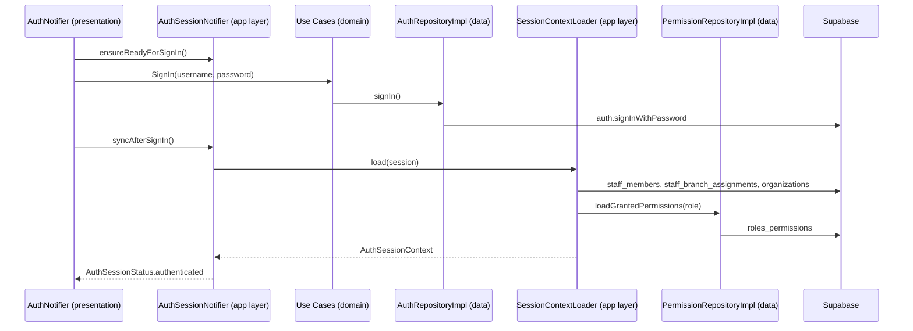

# Auth Feature Code Review

**Feature path:** `frontend/lib/features/auth`  
**Review date:** 2026-07-05  
**Architecture:** Clean Architecture + Riverpod  
**Review scope:** Domain, Data, Presentation layers + app-layer integration (`auth_session_provider`, `session_context_loader`)

---

## Executive Summary

### Overall Verdict: **Conditionally Acceptable — Fix Critical Async & Error Handling Before Production Login UI**

The auth stack demonstrates solid security instincts: generic credential errors, cold-start session clearing, DB-authoritative staff role, inactive-staff rejection, and idle-timeout semantics. Unit and boundary tests cover isolated pieces (repository normalization, permission parsing, route guards, idle sign-out).

However, **async session orchestration has race and caching defects** that can cause intermittent production failures. **User-facing error leakage** (`error.toString()` on session failures) needs immediate attention. **Clean Architecture boundaries are porous** — Supabase types live in the domain interface, DI providers are wired from domain into data, and the heaviest orchestration (`AuthSessionNotifier`, `SessionContextLoader`) sits in `app/` rather than inside the feature. The **login UI is not implemented** (`uiPendingPlaceholder`), leaving `AuthNotifier` untested in realistic flows.

| Category | Count |
|----------|-------|
| Critical | 4 |
| High | 12 |
| Medium | 14 |
| Low | 12 |
| Clean Architecture violations | 10 |
| SOLID violations | 6 |
| Performance items | 5 |
| Test coverage gaps | 18 |

**Recommended action:** Complete Phase 1 (correctness) before wiring production login UI. Phase 2–4 can proceed in parallel with UI work once serialization and error mapping are fixed.

---

## Feature Overview

### Purpose

The auth feature manages **staff sign-in/sign-out**, **session lifecycle** (cold-start clearing, idle timeout, token refresh), and **post-login context** (staff profile, organization/branch scope, RBAC permission grants, setup flags). It integrates with Supabase GoTrue for credentials and PostgREST for staff profile and permission data.

### Data Flow



### File Inventory

| Layer | Path | Responsibility |
|-------|------|----------------|
| **Domain** | `domain/auth_session.dart` | `StaffRole`, `StaffProfile`, `AuthSessionContext` entities |
| | `domain/staff_username.dart` | Username normalization and validation |
| | `domain/permission_keys.dart` | Permission key constants and `RolePermissionSeed` |
| | `domain/repositories/auth_repository.dart` | Auth repository interface |
| | `domain/repositories/permission_repository.dart` | Permission repository interface |
| | `domain/usecases/*.dart` | Thin use-case facades (5 use cases) |
| | `domain/usecases/auth_use_case_providers.dart` | Riverpod providers for use cases |
| **Data** | `data/auth_repository.dart` | Supabase auth wrapper + `authRepositoryProvider` |
| | `data/permission_repository.dart` | PostgREST permission loader + provider |
| **Presentation** | `presentation/providers/auth_notifier.dart` | Sign-in form state and orchestration |
| | `presentation/dev/auth_dev_widgets.dart` | Debug-only widgets (stubbed) |

**Related code outside the feature folder (integration layer):**

| Path | Role |
|------|------|
| `app/providers/auth_session_provider.dart` | Primary session orchestrator (status, idle timeout, auth stream) |
| `app/providers/session_context_loader.dart` | JWT decode + DB hydration → `AuthSessionContext` |
| `core/auth/auth_route_guard.dart` | Route access rules |
| `core/auth/permission_service.dart` | Client-side permission checks |
| `core/auth/idle_timeout_service.dart` | Inactivity sign-out |
| `app/router.dart` | Login route (placeholder UI) |

### Architecture Assessment

Recognizable Clean Architecture skeleton (entities, repository interfaces, use cases, implementations) but **boundaries are inconsistently enforced**. Domain leaks Supabase framework types; DI providers live in the data layer and are imported upward into domain; orchestration is split across `app/` and `features/auth`. Use cases are pass-through wrappers — validation and error mapping sit in presentation instead.

**Dependency direction today:**

```
presentation → app → data → Supabase
                ↓
              domain (interfaces polluted with Supabase types)
domain/usecases → data (via providers)  ← violation
```

**Target direction:**

```
presentation → domain (use cases, entities)
data → domain (implements interfaces)
app/composition → wires providers
```

### Positive Patterns

1. **`staff_username.dart`** — Pure Dart validation/normalization; correctly placed in domain.
2. **`PermissionRepository` interface** — Minimal, domain-only types; data impl matches contract.
3. **`StaffRole.tryParse` / `wireValue`** — Bidirectional mapping aligned with PostgreSQL enum.
4. **`PermissionKeys`** — Centralized string constants prevent magic strings across features.
5. **`parseGrantedPermissionKeys`** — Solid defensive parser with thorough unit tests.
6. **Security choices** — Generic credential errors, cold-start session clear, DB-authoritative role, inactive staff rejection.

---

## 1. Critical Issues

### 1.1 Cached `_ensureSupabaseReady` task prevents auth listener binding after early return

| Field | Detail |
|-------|--------|
| **Severity** | Critical |
| **Layers** | Integration (Presentation caller) |
| **Files** | `app/providers/auth_session_provider.dart` (lines 85–119) |
| **Evidence** | `_ensureSupabaseReady` memoizes `_runEnsureSupabaseReady` in `_ensureSupabaseReadyTask`. When `SupabaseBootstrap.isReady` is false, the method logs and **returns early** without clearing `_ensureSupabaseReadyTask`. Subsequent calls reuse the completed future and never retry binding. |
| **Why** | If startup fires `_ensureSupabaseReady` before Supabase initialization completes (microtask on line 79 or startup listener on line 73), the auth state stream is never subscribed, `_syncFromCurrentSession` never runs, and sign-in context may never propagate unless `syncAfterSignIn` is called manually. State may remain `loading` indefinitely. |
| **Impact** | Intermittent “stuck on login”, session status stuck at `unknown`/`loading`, post-login navigation failure, `StateError` from `ensureReadyForSignIn` — especially on slower devices or web cold starts. |
| **Solution** | Clear `_ensureSupabaseReadyTask = null` on early return paths (`!isReady`, `profile == null`). Reset status to `unauthenticated` when Supabase is not ready. Retry when `SupabaseBootstrap.isReady` transitions to true via a dedicated listener. Do not cache a future that can complete without doing its work. |

**Cross-layer:** Called by `AuthNotifier.ensureReadyForSignIn()` before every sign-in attempt.

---

### 1.2 Unsynchronized concurrent `_handleAuthState` invocations

| Field | Detail |
|-------|--------|
| **Severity** | Critical |
| **Layers** | Integration |
| **Files** | `app/providers/auth_session_provider.dart` (lines 127–128, 132–168, 268–276); `app/app.dart` (resume `reloadContext`) |
| **Evidence** | Auth stream listener uses `unawaited(_handleAuthState(authState))`. `syncAfterSignIn`, `_syncFromCurrentSession`, and `reloadContext` also call `_handleAuthState` directly. No mutex, queue, or generation token exists. |
| **Why** | Rapid auth events (sign-in + token refresh, sign-in + stream `signedIn`, sign-out during in-flight load) can run overlapping `_loadSessionContext` calls. If call A fails and signs out while call B (started earlier) is still awaiting context load, B can complete afterward and set `authenticated` again. |
| **Impact** | Wrong permissions/branch after login, brief authenticated state after sign-out, duplicate network calls, hard-to-reproduce session corruption; idle timer and permission cache out of sync. |
| **Solution** | Serialize session loads with an incrementing `_authEpoch` (ignore stale results when epoch mismatches), or use a `Lock`/single-flight wrapper around `_handleAuthState`. Cancel in-flight loads on `signedOut`. |

**Cross-layer:** Compounded by `AuthNotifier.signIn` → `syncAfterSignIn` racing with stream events (Presentation §2.1).

---

### 1.3 Raw exception strings exposed to users via `failureMessage`

| Field | Detail |
|-------|--------|
| **Severity** | Critical (security/UX) |
| **Layers** | Integration, Presentation, Data (upstream) |
| **Files** | `app/providers/auth_session_provider.dart` (lines 117, 165); `presentation/providers/auth_notifier.dart` (lines 127–128); `data/permission_repository.dart` (unmapped PostgREST errors) |
| **Evidence** | `_runEnsureSupabaseReady` catch sets `failureMessage: error.toString()`. `_handleAuthState` catch sets `failureMessage: error.toString()`. `AuthNotifier._waitForPostLoginResolution` surfaces `session.failureMessage` directly. `AuthNotifier` has careful mapping for `AuthException`, but context-load failures bypass that layer. |
| **Why** | PostgREST errors, JWT decode failures, and internal `StateError` messages (e.g. `"Authenticated session is missing staff claims."`) can contain table names, claim keys, or stack fragments. Contract (`docs/specs/002-auth-rbac/contracts/auth-session.md`) requires actionable user messages. |
| **Impact** | Information disclosure; confusing or intimidating error text on login screen; inconsistent copy vs credential-error handling. |
| **Solution** | Introduce domain `AuthFailure` sealed class. Map known failure types in `SessionContextLoader.contextFailureReason` to user-facing copy (partially done for logging). Add `PermissionLoadFailure` mapping in data layer (align with bootstrap/shift repos). Never assign `error.toString()` to `failureMessage`. |

**Cross-layer:** Data layer's unmapped PostgREST failures (§2.4) feed directly into this channel.

---

### 1.4 Post-login polling can report failure while session becomes authenticated

| Field | Detail |
|-------|--------|
| **Severity** | Critical |
| **Layers** | Presentation |
| **Files** | `presentation/providers/auth_notifier.dart` (lines 118–141) |
| **Evidence** | `_waitForPostLoginResolution` polls up to 150 × 20 ms (3 s), then sets a timeout error. It does not listen to `authSessionProvider` — only `ref.read` in a loop. Does not treat prolonged `loading` as in-progress. |
| **Why** | `SessionContextLoader.load()` performs up to 4 sequential Supabase queries. Slow context loading can exceed 3 s while `AuthSessionStatus` remains `loading`. |
| **Impact** | User sees sign-in error while `authSessionProvider` later reaches `authenticated` — split UI state (error on login overlay + authenticated shell). User retries sign-in while already authenticated. |
| **Solution** | Replace polling with `ref.listen(authSessionProvider, ...)`. On timeout, check final auth status before showing error. Align timeout with realistic network latency or remove in favor of session-driven resolution. |

**Cross-layer:** Compounded by `syncAfterSignIn` silently no-oping when `currentSession` is null (§2.3).

---

## 2. High Priority Issues

### 2.1 Domain `AuthRepository` leaks Supabase framework types

| Field | Detail |
|-------|--------|
| **Severity** | High (architecture) |
| **Layers** | Domain, Data |
| **Files** | `domain/repositories/auth_repository.dart`; `data/auth_repository.dart` |
| **Evidence** | Domain interface imports `supabase_flutter` and exposes `Stream<AuthState>`, `Session?`, `User?`. `AuthSessionNotifier` constructs `AuthState(AuthChangeEvent.signedIn, session)` — vendor event types leak through the entire stack. |
| **Why** | Domain cannot compile or be reasoned about without the Supabase SDK. Data layer cannot hide infrastructure. |
| **Impact** | Domain not testable or portable without Supabase mocks; dependency rule inverted at the most foundational boundary; presentation maps `AuthException` directly. |
| **Solution** | Define domain types (`DomainAuthSession`, `AuthSessionChange`, `AuthChangeKind`, `AuthFailure`). Map Supabase → domain only in `AuthRepositoryImpl`. Remove `currentUser` (unused in production). |

---

### 2.2 Composition root lives inside domain / data packages

| Field | Detail |
|-------|--------|
| **Severity** | High (architecture) |
| **Layers** | Domain, Data |
| **Files** | `domain/usecases/auth_use_case_providers.dart`; `data/auth_repository.dart` (56–58); `data/permission_repository.dart` (42–44) |
| **Evidence** | `auth_use_case_providers.dart` imports `flutter_riverpod`, `features/auth/data/auth_repository.dart`, and `features/auth/data/permission_repository.dart`. Repository providers defined alongside implementations in data layer. |
| **Why** | Domain depends on data layer (concrete providers) and UI framework (Riverpod). Opposite of Clean Architecture dependency flow. |
| **Impact** | Any domain import pulls in data + DI framework; circular dependency risk; domain cannot be reused in non-Riverpod contexts. |
| **Solution** | Move all `*Provider` wiring to `app/di/` or `features/auth/di/`. Domain use cases should have zero provider files. |

---

### 2.3 Use-case layer bypassed — ceremonial pass-throughs

| Field | Detail |
|-------|--------|
| **Severity** | High (architecture/consistency) |
| **Layers** | Domain, Integration, Presentation |
| **Files** | All `domain/usecases/*.dart`; `auth_use_case_providers.dart`; `app/providers/auth_session_provider.dart`; `app/providers/session_context_loader.dart`; `presentation/providers/auth_notifier.dart` |
| **Evidence** | Only `signInUseCaseProvider` is used (in `AuthNotifier`). `signOutUseCaseProvider`, `refreshSessionUseCaseProvider`, `clearPersistedSessionUseCaseProvider`, `loadGrantedPermissionsUseCaseProvider` have **zero** production consumers. `AuthSessionNotifier` calls `authRepositoryProvider` directly for sign-out, refresh, clear. `SessionContextLoader` calls `_permissionRepository.loadGrantedPermissions` directly. |
| **Why** | Use cases add indirection without encapsulating business rules. Creates illusion of Clean Architecture while application layer bypasses it. |
| **Impact** | Business rules added to use cases won't run; dead providers confuse maintainers; inconsistent behavior between entry points; harder to mock in tests. |
| **Solution** | Either route **all** auth operations through use cases (inject into notifiers/loaders), or delete unused use cases until real domain logic exists. |

---

### 2.4 `RolePermissionSeed` drift vs live database grants

| Field | Detail |
|-------|--------|
| **Severity** | High |
| **Layers** | Domain (definition), Data (live reads), Tests |
| **Files** | `domain/permission_keys.dart`; `backend/supabase/migrations/20260516100400_auth_rbac_seed.sql`; `backend/supabase/migrations/20260613140000_role_permissions_full_matrix.sql` |
| **Evidence** | `PermissionKeys.shiftsManage` defined and used by `PermissionService`, but `RolePermissionSeed.administrator` omits it (DB grants it, migration line 57). `RolePermissionSeed.doctor` omits `patients.edit`/`patients.delete` (DB grants them). `RolePermissionSeed.receptionist` omits `patients.create`, `patients.edit`, `patients.delete`, discount keys (DB grants them). Comment says "Expected V1-1 seed grants" but V1-1 included removed `owner` role and lacked later permissions. Boundary test only asserts `isNotEmpty`, not correctness. |
| **Why** | `RolePermissionSeed` is used widely in unit tests as ground truth (`permission_service_test.dart`, route guard tests). Data layer correctly reads live DB rows, but domain seed constants are stale. |
| **Impact** | Tests pass with wrong permission sets; false confidence; shift-management and patient-edit tests won't reflect production RBAC. |
| **Solution** | Sync seeds with current migrations, or generate from shared manifest/SQL snapshot. Add boundary test: `expect(await repo.loadGrantedPermissions(role), RolePermissionSeed.forRole(role))`. Add missing key `invoices.apply_discount_above_threshold`. |

---

### 2.5 Username validation not enforced at domain boundary

| Field | Detail |
|-------|--------|
| **Severity** | High |
| **Layers** | Domain, Data, Presentation |
| **Files** | `domain/staff_username.dart`; `domain/usecases/sign_in.dart`; `data/auth_repository.dart` (line 25); `presentation/providers/auth_notifier.dart` (lines 49–52) |
| **Evidence** | `validateStaffUsername` exists in domain. `SignIn.call` does not call it. Data layer only `normalizeStaffUsername` without validation. Validation enforced only in presentation. Boundary test `auth.signIn.emptyCredentials` expects `AuthException` from Supabase, not domain validation. |
| **Why** | Domain rules are optional depending on call site. Normalization in data layer is a domain concern applied at the wrong layer. |
| **Impact** | Inconsistent invariants; unnecessary auth API calls; harder to unit-test sign-in rules in isolation. |
| **Solution** | Validate + normalize inside `SignIn.call()`; throw domain `InvalidStaffUsername`. Data layer receives already-validated input or re-validates defensively. |

---

### 2.6 Login presentation is a router placeholder — feature UI incomplete

| Field | Detail |
|-------|--------|
| **Severity** | High |
| **Layers** | Presentation |
| **Files** | `app/router.dart` (line 52); `presentation/dev/auth_dev_widgets.dart`; `presentation/providers/auth_notifier.dart` |
| **Evidence** | Login route: `uiPendingPlaceholder('Auth', state)`. `AuthDevWidgets.panel` always returns `SizedBox.shrink()` even in `kDebugMode`. No login screen/widget exists under `features/auth/presentation/`. `authNotifierProvider` has no widget consumer. |
| **Why** | `AuthNotifier` (validation, error messages, submit flow, post-login polling) has no production UI consumer. Dev quick-login shortcuts are dead code. |
| **Impact** | Feature cannot be exercised end-to-end; regressions in `signIn` flow go undetected in manual QA. |
| **Solution** | Implement login screen under `presentation/screens/` wired to `authNotifierProvider` and `authSessionProvider.failureMessage`. Remove or restore `AuthDevWidgets.panel` intentionally. |

---

### 2.7 Contract gap: no dedicated “blocked shell” for staff without branch assignments

| Field | Detail |
|-------|--------|
| **Severity** | High |
| **Layers** | Domain, Integration |
| **Files** | `domain/auth_session.dart` (line 82); `core/auth/permission_service.dart` (lines 17–18); `core/auth/auth_route_guard.dart`; `docs/specs/002-auth-rbac/contracts/auth-session.md` (line 45) |
| **Evidence** | Contract: "No branch assignments → Shell blocked state". Implementation: `hasBranchAssignment` causes all `hasPermission` checks to return false, but no route guard or shell state routes authenticated no-branch users to a blocked view. |
| **Why** | User can reach `/home` authenticated with empty `branchIds` and see a broken/empty app instead of an explicit blocked state. |
| **Impact** | Confusing UX; features silently deny actions without explanation. |
| **Solution** | Add guard in `AuthRouteGuard._resolveRedirect` or shell layout: if `isAuthenticated && !context.hasBranchAssignment && !setupRequired` → blocked route with admin contact guidance. |

---

### 2.8 `clearPersistedSessionOnColdStart` swallows every `AuthException`

| Field | Detail |
|-------|--------|
| **Severity** | High |
| **Layers** | Data, Integration |
| **Files** | `data/auth_repository.dart` (lines 38–44); `app/providers/auth_session_provider.dart` (caller, line 105) |
| **Evidence** | Catch block treats any `AuthException` as "no session to clear." `AuthException` also covers invalid/expired refresh tokens, revoked sessions, and other GoTrue failures. |
| **Why** | Cold start may mark persistence as cleared (`_clearedPersistedSessionOnColdStart = true`) while an in-memory session remains. |
| **Impact** | Violates FR-004 intent ("never restore prior workstation session") in edge cases. |
| **Solution** | Catch only the specific "no session" case (message/code inspection). Verify `currentSession == null` after operation; rethrow or log other `AuthException`s. |

---

### 2.9 Non-`AuthException` failures during cold-start clear block bootstrap

| Field | Detail |
|-------|--------|
| **Severity** | High |
| **Layers** | Data, Integration |
| **Files** | `data/auth_repository.dart` (lines 38–44); `app/providers/auth_session_provider.dart` (lines 104–117) |
| **Evidence** | Only `AuthException` is caught. Network/`StorageException`/other errors propagate to `_runEnsureSupabaseReady`, which sets `failureMessage: error.toString()` and aborts listener binding. |
| **Why** | Transient network glitch during cold-start `signOut()` can prevent auth listener binding. |
| **Impact** | App stuck in bad startup state (compounds Critical 1.1). |
| **Solution** | Treat cold-start clear as best-effort: catch broader failures, log, continue if `currentSession == null`. Optionally retry with backoff. |

---

### 2.10 `refreshSession` discards the underlying failure

| Field | Detail |
|-------|--------|
| **Severity** | High |
| **Layers** | Data |
| **Files** | `data/auth_repository.dart` (lines 48–53) |
| **Evidence** | When `response.session == null`, a new generic `AuthException` is thrown. Original SDK error (expired refresh token, network, etc.) is lost. |
| **Why** | Callers and logs cannot distinguish recoverable vs terminal refresh failures. |
| **Impact** | Harder to debug stale-session behavior after bootstrap or role-matrix changes. |
| **Solution** | Preserve SDK response/error with `cause`. Add unit test for null-session branch. |

---

### 2.11 `PermissionRepositoryImpl` has no PostgREST error mapping

| Field | Detail |
|-------|--------|
| **Severity** | High |
| **Layers** | Data |
| **Files** | `data/permission_repository.dart` (lines 15–24) |
| **Evidence** | Raw `await _client.from(...)` with no `on PostgrestException`. `BootstrapRepositoryImpl`, `ProvisioningRepositoryImpl`, and `ShiftRepositoryImpl` map PostgREST errors; auth permission loading does not. |
| **Why** | Login context load failures surface as raw PostgREST strings through session notifier. |
| **Impact** | Feeds Critical 1.3 (error leakage); inconsistent UX vs other features. |
| **Solution** | Add `PermissionLoadFailure` (or reuse `AppException`) and map common codes (401, PGRST301, network). |

---

### 2.12 Dual error channels with weak synchronization

| Field | Detail |
|-------|--------|
| **Severity** | High |
| **Layers** | Presentation, Integration |
| **Files** | `presentation/providers/auth_notifier.dart`; `app/providers/auth_session_provider.dart` |
| **Evidence** | Form errors: `AuthUiState.errorMessage`. Session errors: `AuthSessionState.failureMessage`. Sign-in bridges them only via polling. `clearSignInError()` and `clearSignInFailureMessage()` exist independently with **zero** production callers. |
| **Why** | Two sources of truth for login errors. Idle-timeout and session-ended messages live on session state; credential errors on UI state. |
| **Impact** | Login screen must know which channel to read/clear; easy to show wrong banner or miss one. |
| **Solution** | Single error surface for login. Wire clear methods from login widget `dispose`/`PopScope`. |

---

### 2.13 No guard against concurrent `signIn()` calls

| Field | Detail |
|-------|--------|
| **Severity** | High |
| **Layers** | Presentation |
| **Files** | `presentation/providers/auth_notifier.dart` (lines 48–55) |
| **Evidence** | `signIn` sets `isSubmitting: true` with no check for existing `state.isSubmitting`. |
| **Why** | Double-tap or rapid retries spawn parallel flows: duplicate Supabase sign-in, duplicate `syncAfterSignIn`, racing `_handleAuthState`. |
| **Impact** | Flaky sign-in, duplicate network calls, unpredictable final state (compounds Critical 1.2). |
| **Solution** | Early-return if `state.isSubmitting`. Optionally track generation counter. |

---

### 2.14 `syncAfterSignIn()` silently no-ops when `currentSession` is null

| Field | Detail |
|-------|--------|
| **Severity** | High |
| **Layers** | Integration |
| **Files** | `app/providers/auth_session_provider.dart` (lines 268–275) |
| **Evidence** | After successful `signInUseCase`, if `currentSession == null`, method returns without error. `AuthNotifier` polls until timeout. |
| **Why** | SDK may not have populated `currentSession` synchronously after sign-in. |
| **Impact** | False timeout errors (compounds Critical 1.4). |
| **Solution** | Throw domain failure if session is null after sign-in, or retry with backoff inside `syncAfterSignIn`. |

---

### 2.15 `signOut` sets local state before auth stream confirms sign-out

| Field | Detail |
|-------|--------|
| **Severity** | High |
| **Layers** | Integration |
| **Files** | `app/providers/auth_session_provider.dart` (lines 240–248) |
| **Evidence** | `signOut()` awaits repository `signOut()` then immediately sets `state = unauthenticated`. `_intentionalSignOut` flag cleared in `finally` before stream event may arrive. |
| **Why** | External sign-out path might attach `kSessionEndedMessage` incorrectly on race. |
| **Impact** | Spurious "Your session has ended" banner after explicit logout. |
| **Solution** | Either rely solely on auth stream for state transition, or keep `_intentionalSignOut` true until stream confirms `signedOut`. |

---

### 2.16 `AuthSessionContext` has no invariant enforcement

| Field | Detail |
|-------|--------|
| **Severity** | High |
| **Layers** | Domain |
| **Files** | `domain/auth_session.dart` |
| **Evidence** | Constructor accepts any values. `activeBranchId` can be set outside `branchIds` via `copyWith`. Invariants like "active branch ∈ branchIds", "inactive staff cannot authenticate", "setupRequired ⇒ null organizationId" enforced only in `SessionContextLoader` (app layer). |
| **Why** | Domain entity is a mutable bag of fields. Tests construct invalid contexts freely (`auth_test_support.dart`). |
| **Impact** | Silent permission bugs if context built outside loader; `@immutable` misleading when `List`/`Set` contents are mutable. |
| **Solution** | Factory `AuthSessionContext.create(...)` with assertions, or value type with `UnmodifiableListView`/`UnmodifiableSetView`. Mirror `setActiveBranch` guard inside entity. |

---

## 3. Medium Priority Issues

### 3.1 `tokenRefreshed` handler ignores refresh when not yet authenticated

| Field | Detail |
|-------|--------|
| **Severity** | Medium |
| **Layers** | Integration |
| **Files** | `app/providers/auth_session_provider.dart` (lines 138–150) |
| **Evidence** | On `AuthChangeEvent.tokenRefreshed`, context reload runs only `if (state.isAuthenticated)`. During sign-in, status is `loading`. |
| **Why** | Token refresh during context load is dropped. |
| **Impact** | Stale `setupRequired` or branch claims until explicit refresh. |
| **Solution** | Also handle `tokenRefreshed` when `status == loading` and session is non-null. |

---

### 3.2 `AuthNotifier.signIn` lacks disposal/cancellation guard

| Field | Detail |
|-------|--------|
| **Severity** | Medium |
| **Layers** | Presentation |
| **Files** | `presentation/providers/auth_notifier.dart` (lines 48–72, 118–133) |
| **Evidence** | Long async chain with polling loop; no `ref.mounted` checks after awaits. |
| **Why** | If provider disposed mid-sign-in, state updates may throw or update disposed notifier. |
| **Impact** | Debug-mode assertion failures; rare production errors. |
| **Solution** | Check `ref.mounted` after each `await`; abort polling if disposed. |

---

### 3.3 `permissionServiceProvider` rebuilds on any session state change

| Field | Detail |
|-------|--------|
| **Severity** | Medium (performance) |
| **Layers** | Integration |
| **Files** | `app/providers/auth_session_provider.dart` (lines 318–320) |
| **Evidence** | `PermissionService(ref.watch(authSessionProvider).context)` — watches entire provider, not `select` on context. |
| **Why** | Transitions like `loading` → `authenticated` or failure message changes recreate `PermissionService` for all dependents. |
| **Impact** | Unnecessary widget rebuilds in large trees. |
| **Solution** | `ref.watch(authSessionProvider.select((s) => s.context))`. |

---

### 3.4 `AuthDevWidgets` and `AuthDevBootstrapCredentials` are dead code

| Field | Detail |
|-------|--------|
| **Severity** | Medium |
| **Layers** | Presentation |
| **Files** | `presentation/dev/auth_dev_widgets.dart` |
| **Evidence** | `panel()` ignores `onLoginAsAdmin`, `isSubmitting`, returns `SizedBox.shrink()` in all modes. `AuthDevBootstrapCredentials` ships credential constants in `lib/` but is unused. |
| **Why** | Misleading comment ("Dev-only shortcuts shown beneath the login modal"); maintenance burden. |
| **Impact** | Developers assume dev login exists; credentials in production lib tree. |
| **Solution** | Implement dev panel, delete until login UI exists, or move credentials to test-only harness with conditional import. |

---

### 3.5 `flutter/foundation.dart` dependency for `@immutable`

| Field | Detail |
|-------|--------|
| **Severity** | Medium |
| **Layers** | Domain |
| **Files** | `domain/auth_session.dart` (line 2) |
| **Evidence** | `import 'package:flutter/foundation.dart'` solely for `@immutable`. |
| **Why** | Domain depends on Flutter framework for an annotation. |
| **Impact** | Domain cannot be used in pure Dart contexts without Flutter SDK. |
| **Solution** | Use `package:meta/meta.dart` `@immutable` instead. |

---

### 3.6 `copyWith` does not defensively copy collections

| Field | Detail |
|-------|--------|
| **Severity** | Medium |
| **Layers** | Domain |
| **Files** | `domain/auth_session.dart` (lines 96–98) |
| **Evidence** | `branchIds: branchIds ?? this.branchIds` and `permissions: permissions ?? this.permissions` share references. |
| **Why** | External mutation of passed-in list/set corrupts session state. `@immutable` does not protect collection contents. |
| **Impact** | Hard-to-debug state corruption if caller mutates `branchIds` after construction. |
| **Solution** | Store `List.unmodifiable`/`Set.unmodifiable` in constructor; copy in `copyWith`. |

---

### 3.7 Missing permission key: `invoices.apply_discount_above_threshold`

| Field | Detail |
|-------|--------|
| **Severity** | Medium |
| **Layers** | Domain |
| **Files** | `domain/permission_keys.dart` |
| **Evidence** | No constant for `invoices.apply_discount_above_threshold`. Backend seeds it. Frontend has `invoicesApplyDiscount` but not above-threshold variant. |
| **Why** | Incomplete permission catalog in domain. |
| **Impact** | Stringly-typed permission checks; drift from backend catalog. |
| **Solution** | Add `PermissionKeys.invoicesApplyDiscountAboveThreshold`; include in `RolePermissionSeed` (see §2.4). |

---

### 3.8 `currentUser` on repository interface is unused

| Field | Detail |
|-------|--------|
| **Severity** | Medium |
| **Layers** | Domain, Data |
| **Files** | `domain/repositories/auth_repository.dart` (line 7); `data/auth_repository.dart` |
| **Evidence** | Interface declares `User? get currentUser`. Production code never reads `repository.currentUser` — only `currentSession`. |
| **Why** | Dead API surface widens Supabase coupling without benefit. |
| **Impact** | Confusion about canonical session access path. |
| **Solution** | Remove from domain interface; derive user id from domain session if needed. |

---

### 3.9 No domain failure types for auth operations

| Field | Detail |
|-------|--------|
| **Severity** | Medium |
| **Layers** | Domain, Data, Presentation |
| **Files** | `domain/repositories/auth_repository.dart`; `domain/usecases/*.dart`; `data/auth_repository.dart`; `presentation/providers/auth_notifier.dart` |
| **Evidence** | All methods return `Future<void>` with no documented failure model. Data `refreshSession` throws `AuthException`. Presentation catches `AuthException` directly and string-matches codes. |
| **Why** | Domain does not own error semantics; presentation depends on Supabase exception types. |
| **Impact** | Cannot swap auth backend without rewriting presentation error mapping. |
| **Solution** | Define `AuthFailure` sealed class (`invalidCredentials`, `sessionExpired`, `unavailable`); map in data layer. |

---

### 3.10 `loadGrantedPermissions` trusts caller-supplied `role`

| Field | Detail |
|-------|--------|
| **Severity** | Medium |
| **Layers** | Data, Integration |
| **Files** | `data/permission_repository.dart`; `app/providers/session_context_loader.dart` |
| **Evidence** | Repository loads grants for whatever `StaffRole` is passed. Correctness depends on `SessionContextLoader` resolving role from `staff_members` first (it does). |
| **Why** | Any future caller passing JWT `staff_role` without DB verification could load wrong grants. |
| **Impact** | Wrong permission set if call contract violated. |
| **Solution** | Document contract on `PermissionRepository`; or accept `staffMemberId` and join in one query. |

---

### 3.11 No retry / offline handling in data layer

| Field | Detail |
|-------|--------|
| **Severity** | Medium |
| **Layers** | Data |
| **Files** | `data/auth_repository.dart`; `data/permission_repository.dart` |
| **Evidence** | All methods are single `await` with no retry. |
| **Why** | Transient failures during permission load or refresh immediately fail session bootstrap. |
| **Impact** | Flaky login on poor clinic LAN; no differentiation between offline and auth failure. |
| **Solution** | Optional lightweight retry (1–2 attempts) for idempotent reads; surface structured offline state to presentation. |

---

### 3.12 `SessionContextLoader` performs data-layer work from app providers

| Field | Detail |
|-------|--------|
| **Severity** | Medium (architecture) |
| **Layers** | Integration |
| **Files** | `app/providers/session_context_loader.dart` |
| **Evidence** | Direct Supabase table queries (`staff_members`, `staff_branch_assignments`, `organizations`) in a class under `app/providers/`. |
| **Why** | Clean Architecture violation; loader should live in `data/` behind repository interface. |
| **Impact** | Feature boundary unclear; hard to test in isolation. |
| **Solution** | Move to `features/auth/data/` behind `SessionContextRepository` interface; add `LoadSessionContext` use case. |

---

### 3.13 `AuthSessionNotifier` lives in `app/providers`, not auth feature

| Field | Detail |
|-------|--------|
| **Severity** | Medium (architecture) |
| **Layers** | Integration |
| **Files** | `app/providers/auth_session_provider.dart` |
| **Evidence** | Session orchestration, idle timeout wiring, permission service provider, and Supabase stream binding are in app shell layer. |
| **Why** | Auth feature presentation is incomplete; testing and ownership boundaries blur. |
| **Impact** | Feature cannot be understood or tested as a unit. |
| **Solution** | Move to `features/auth/application/` with app layer consuming narrow interface. |

---

### 3.14 `reloadContext()` on app resume can race with sign-in

| Field | Detail |
|-------|--------|
| **Severity** | Medium |
| **Layers** | Integration |
| **Files** | `app/app.dart` (lines 48–53); `app/providers/auth_session_provider.dart` |
| **Evidence** | `unawaited(ref.read(authSessionProvider.notifier).reloadContext())` on resume. Concurrent with active sign-in; unserialized (compounds Critical 1.2). |
| **Why** | No coordination between resume refresh and sign-in flow. |
| **Impact** | Stale or conflicting session state on resume during login. |
| **Solution** | Serialize via auth epoch (§1.2); skip resume reload when `status == loading`. |

---

## 4. Low Priority Issues

### 4.1 Pass-through use cases add indirection without behavior

| Field | Detail |
|-------|--------|
| **Severity** | Low |
| **Layers** | Domain |
| **Files** | `domain/usecases/sign_in.dart`, `sign_out.dart`, `refresh_session.dart`, `clear_persisted_session.dart`, `load_granted_permissions.dart` |
| **Evidence** | Each use case is a one-line delegate to repository. |
| **Why** | Extra files and providers without encapsulating validation, policy, or orchestration. |
| **Impact** | Navigation overhead for new contributors. |
| **Solution** | Enrich use cases with domain rules or collapse until logic warrants extraction (see §2.3). |

---

### 4.2 `validateCredentials` duplicates `signIn` validation logic

| Field | Detail |
|-------|--------|
| **Severity** | Low |
| **Layers** | Presentation |
| **Files** | `presentation/providers/auth_notifier.dart` (lines 40–46 vs 49–52) |
| **Evidence** | `validateCredentials` returns bool; `signIn` repeats validation with error messages. |
| **Why** | Two validation paths can drift. |
| **Solution** | Shared private method returning `String?` error; used by both. |

---

### 4.3 `StaffRole.tryParse` does not handle all PostgreSQL enum aliases

| Field | Detail |
|-------|--------|
| **Severity** | Low |
| **Layers** | Domain |
| **Files** | `domain/auth_session.dart` (lines 11–23) |
| **Evidence** | Only `lab_staff` wire form accepted; other aliases return null. Fallback to JWT `staff_role` exists in loader. |
| **Impact** | Minor — DB is primary source for role. |
| **Solution** | Document accepted wire values; align with backend enum contract. |

---

### 4.4 Duplicate `PermissionDeniedException` import path confusion

| Field | Detail |
|-------|--------|
| **Severity** | Low |
| **Layers** | Integration (core) |
| **Files** | `core/auth/permission_service.dart` (lines 1, 106–108) |
| **Evidence** | Imports `core/errors/exceptions.dart` for `AppException` but defines `PermissionDeniedException` in same file. |
| **Solution** | Move `PermissionDeniedException` to `core/errors/exceptions.dart`. |

---

### 4.5 Use case / repository method naming mismatch

| Field | Detail |
|-------|--------|
| **Severity** | Low |
| **Layers** | Domain |
| **Files** | `domain/usecases/clear_persisted_session.dart`; `domain/repositories/auth_repository.dart` |
| **Evidence** | Use case `ClearPersistedSession.call()` delegates to `clearPersistedSessionOnColdStart()`. |
| **Solution** | Align names (`clearPersistedSession` everywhere). |

---

### 4.6 `StaffRole.displayLabel` is presentation concern in domain

| Field | Detail |
|-------|--------|
| **Severity** | Low |
| **Layers** | Domain |
| **Files** | `domain/auth_session.dart` (lines 33–38) |
| **Evidence** | English display strings in domain enum. |
| **Impact** | Minor; matters if i18n is added. |
| **Solution** | Move labels to presentation extension or l10n ARB files. |

---

### 4.7 `validateStaffUsername` error messages generic for length failures

| Field | Detail |
|-------|--------|
| **Severity** | Low |
| **Layers** | Domain |
| **Files** | `domain/staff_username.dart` (lines 17–18) |
| **Evidence** | Returns `'Enter a valid username.'` for length violations; pattern message is more specific. |
| **Solution** | Return length-specific message or reuse `staffUsernameRequirements`. |

---

### 4.8 No `==` / `hashCode` on session value types

| Field | Detail |
|-------|--------|
| **Severity** | Low |
| **Layers** | Domain |
| **Files** | `domain/auth_session.dart` |
| **Evidence** | `StaffProfile` and `AuthSessionContext` lack value equality. |
| **Impact** | Extra rebuilds if instances compared; unlikely bug today. |
| **Solution** | Add `Equatable` or manual `==` if diffing becomes necessary. |

---

### 4.9 `signOut` uses implicit default scope

| Field | Detail |
|-------|--------|
| **Severity** | Low |
| **Layers** | Data |
| **Files** | `data/auth_repository.dart` (lines 29–31) |
| **Evidence** | Default `SignOutScope.local` likely correct but undocumented. |
| **Solution** | Pass `scope: SignOutScope.local` explicitly with comment tying to FR-004. |

---

### 4.10 Misleading cache comment on permission repository

| Field | Detail |
|-------|--------|
| **Severity** | Low |
| **Layers** | Data |
| **Files** | `data/permission_repository.dart` (line 8) |
| **Evidence** | "cached in session context" — repository always hits PostgREST. |
| **Solution** | Clarify: "Caller caches result in `AuthSessionContext`." |

---

### 4.11 Magic numbers in poll loop

| Field | Detail |
|-------|--------|
| **Severity** | Low |
| **Layers** | Presentation |
| **Files** | `presentation/providers/auth_notifier.dart` |
| **Evidence** | 150 attempts × 20 ms — undocumented, not tied to SLA. |
| **Solution** | Remove with reactive listen (§1.4); or extract named constants with telemetry. |

---

### 4.12 `AuthNotifier` imports `supabase_flutter` for `AuthException` only

| Field | Detail |
|-------|--------|
| **Severity** | Low |
| **Layers** | Presentation |
| **Files** | `presentation/providers/auth_notifier.dart` |
| **Evidence** | Presentation depends on SDK exception type for error mapping. |
| **Solution** | Prefer domain `AuthFailure` (§3.9). |

---

## 5. Clean Architecture Violations

| # | Violation | Layers | Files | Evidence | Impact |
|---|-----------|--------|-------|----------|--------|
| CA-1 | **Domain depends on Supabase SDK** | Domain, Data | `domain/repositories/auth_repository.dart` | Imports `supabase_flutter`; exposes `AuthState`, `Session`, `User` | Domain not testable without framework |
| CA-2 | **Domain imports data layer for DI** | Domain | `domain/usecases/auth_use_case_providers.dart` | Imports `data/auth_repository.dart`, `data/permission_repository.dart` | Domain depends outward on data |
| CA-3 | **Providers in data layer** | Data | `data/auth_repository.dart`, `data/permission_repository.dart` | `authRepositoryProvider`, `permissionRepositoryProvider` alongside impls | Composition root mixed with infrastructure |
| CA-4 | **Core orchestration outside feature** | Integration | `app/providers/auth_session_provider.dart`, `session_context_loader.dart` | Session lifecycle not in `features/auth` | Feature boundary unclear |
| CA-5 | **Presentation depends on app layer directly** | Presentation | `presentation/providers/auth_notifier.dart` | Imports `app/providers/auth_session_provider.dart` | Feature not self-contained |
| CA-6 | **Route guard in core, not feature** | Integration | `core/auth/auth_route_guard.dart` | Auth-specific routing in core | Couples core to `AuthSessionState`, `PermissionKeys` |
| CA-7 | **Business validation in presentation** | Presentation, Domain | `auth_notifier.dart` vs `sign_in.dart` | Username/password rules only in notifier | Domain should own credential validation |
| CA-8 | **Domain → Flutter framework** | Domain | `domain/auth_session.dart` | `flutter/foundation.dart` for `@immutable` | Domain not pure Dart |
| CA-9 | **Session loader is data access in app layer** | Integration | `session_context_loader.dart` | Direct PostgREST queries | Data fetching outside data layer |
| CA-10 | **Presentation maps Supabase errors** | Presentation | `auth_notifier.dart` | String-matching on `AuthException.code/message` | Infrastructure knowledge in UI layer |

**Compliant pieces:** `staff_username.dart`, `PermissionRepository` interface, `PermissionKeys` constants, data impls depend on domain abstractions correctly.

---

## 6. SOLID Violations

| Principle | Violation | Layers | Files | Evidence |
|-----------|-----------|--------|-------|----------|
| **SRP** | `AuthSessionNotifier` has many responsibilities | Integration | `auth_session_provider.dart` | Bootstrap, stream handling, idle timeout, branch selection, refresh, sign-out variants, permission service wiring (~320 lines) |
| **SRP** | `AuthRouteGuard` mixes route classification and permission matrix | Integration | `auth_route_guard.dart` | 500+ lines covering patients, billing, shifts, settings, visits |
| **SRP** | `permission_keys.dart` holds constants and test seed matrices | Domain | `permission_keys.dart` | Two reasons to change: new features vs DB seed updates |
| **OCP** | Adding a feature route requires editing monolithic guard | Integration | `auth_route_guard.dart` | No plugin/registry pattern |
| **OCP** | Error handling requires editing presentation when auth backend changes | Domain, Presentation | — | No domain failure abstraction |
| **DIP** | Domain interface tied to concrete Supabase types | Domain | `auth_repository.dart` | Abstraction does not abstract |
| **ISP** | `AuthRepository` exposes `currentUser`, stream, and commands | Domain | Same | Consumers needing only `signIn` depend on full surface |
| **LSP** | N/A | — | — | No problematic subtype substitutions observed |

---

## 7. Code Duplication & Redundancy

| Duplication | Layers | Where | Recommendation |
|-------------|--------|-------|----------------|
| **Auth repository access** | Integration, Domain | `AuthSessionNotifier` vs use cases vs `AuthNotifier` | Consolidate through use cases or single `AuthCoordinator` (§2.3) |
| **`roles_permissions` PostgREST access** | Data | `permission_repository.dart`, `settings/data/role_permissions_repository.dart` | Share low-level `RolesPermissionsDataSource` |
| **Error message mapping** | Presentation, Integration | `AuthNotifier._messageForUnexpectedSignInError` vs `SessionContextLoader` vs raw `error.toString()` | Single `AuthFailureMapper` (§1.3) |
| **Permission checks in route guard** | Integration | `AuthRouteGuard.canAccess*` + `PermissionService` | Extract `requiresSetupComplete` helper |
| **Validation paths** | Presentation, Domain | `validateCredentials` vs `signIn` vs unused domain validation | Single validation in `SignIn` use case (§2.5) |
| **Sign-out paths** | Integration | `signOut()`, `signOutDueToInactivity()`, stream handler | Consolidate unauthenticated state construction |
| **Clear error APIs** | Presentation, Integration | `clearSignInError()` vs `clearSignInFailureMessage()` | Single channel (§2.12) |
| **Dead dev widgets** | Presentation | `AuthDevWidgets`, `AuthDevBootstrapCredentials` | Remove or implement (§3.4) |
| **`RolePermissionSeed` vs DB seed** | Domain, Data | `permission_keys.dart` vs migrations | Sync or generate (§2.4) |
| **Five identical use-case shells** | Domain | `sign_in.dart`, `sign_out.dart`, etc. | Enrich or remove (§2.3) |

---

## 8. Performance Issues

| Issue | Severity | Layers | Files | Evidence | Impact |
|-------|----------|--------|-------|----------|--------|
| Sequential DB round-trips on every context load | Medium | Integration | `session_context_loader.dart` | Up to 4 queries: staff_members, roles_permissions, staff_branch_assignments, organizations | Login latency; repeated on every token refresh |
| Duplicate context loads on sign-in | Medium | Presentation, Integration | `auth_notifier.dart` + stream listener | `syncAfterSignIn` + possible stream event both trigger `_handleAuthState` | Redundant network (compounds §1.2) |
| Polling loop (150 iterations) | Low | Presentation | `auth_notifier.dart` | Busy-waits with 20 ms delays instead of reactive listen | CPU/timer churn during sign-in |
| `PermissionService` recreated broadly | Low | Integration | `permissionServiceProvider` | Watches full session state | Extra rebuilds (§3.3) |
| No caching of permission grants across refresh | Low | Data | `permission_repository.dart` | Always hits `roles_permissions` | Acceptable if refresh infrequent; consider in-memory cache with role key |
| `_enableIdleWithPersistedDuration` async disk read | Low | Integration | `auth_session_provider.dart` | Disk read on every auth transition | Minor; could inject from `idleTimeoutSettingsProvider` |

---

## 9. Test Coverage Gaps

### Coverage Matrix

| Area / Behavior | Layer | Existing Tests | Gap Risk | Recommended Tests |
|-----------------|-------|----------------|----------|-------------------|
| Username validation | Domain / Presentation | `auth_notifier_test.dart` (via notifier only) | Medium | Dedicated `staff_username_test.dart` — 3–32 char edges, pattern, normalization |
| `SignIn` / other use cases | Domain | None | High | Mock repository; assert validation throws before repo call |
| `AuthNotifier.signIn` E2E | Presentation | None | **Critical** | Mock session + use case; error mapping, `isSubmitting`, post-login resolution |
| Post-login poll timeout vs success | Presentation | None | **Critical** | Fake slow session load > 3 s; assert no false error |
| Concurrent `signIn()` guard | Presentation | None | High | Double-tap; assert single flow |
| `_ensureSupabaseReady` race | Integration | None | **Critical** | Not ready on first call, ready on second — assert listener bound |
| Concurrent `_handleAuthState` | Integration | None | **Critical** | Two overlapping loads; assert final state matches latest event |
| `syncAfterSignIn` null session | Integration | None | High | Assert failure propagated, not silent no-op |
| Stream `tokenRefreshed` during `loading` | Integration | None | Medium | Assert context reload runs |
| `SessionContextLoader` unit tests | Integration | Boundary only | Medium | Inactive staff, missing claims, empty branch_ids, malformed JWT — mocked client |
| `AuthSessionContext` invariants | Domain | Partial (`staff_role_and_session_context_test.dart`) | Medium | Invalid-state rejection; sentinel `copyWith` for nullable fields |
| `RolePermissionSeed` vs DB | Domain / Data | Boundary `isNotEmpty` only | **High** | Assert grants match migration snapshot per role |
| User-facing error mapping | Integration / Presentation | None | High | Assert `failureMessage` never contains `Postgrest` / `StateError` raw text |
| No-branch blocked state | Integration | None | Medium | Authenticated `branchIds: []` route behavior |
| `refreshSession` null-session branch | Data | None | High | Unit test for discarded underlying error |
| `loadGrantedPermissions` network path | Data | Parser only | Medium | `SettingsTableTestClient` pattern from settings tests |
| `clearPersistedSessionOnColdStart` broad catch | Data | Happy + `AuthException` only | Medium | Non-AuthException paths; verify session null |
| Idle vs sign-in interaction | Integration | Idle tests only | Medium | Sign-in during idle timer; `signOutDueToInactivity` during `loading` |
| `ensureReadyForSignIn` happy path | Integration | Invalid startup only | Medium | Full bootstrap success path |
| Login widget/integration | Presentation | None | High | Blocked by missing UI |
| `AuthDevWidgets` release safety | Presentation | None | Low | Assert panel inert in release/profile |
| Repository normalization / cold start | Data | `auth_repository_test.dart` | — | Covered |
| Permission row parsing | Data | `permission_repository_test.dart` | — | Covered |
| Route guard redirects | Integration | `auth_route_guard_test.dart` + variants | — | Covered |
| Session reload / role precedence | Integration | `auth_session_reload_context_test.dart` | — | Covered |
| Idle sign-out | Integration | `auth_session_idle_test.dart` | — | Covered |
| Live boundary auth | Data | `auth_repository_boundary_test.dart`, `permission_repository_boundary_test.dart` | — | Covered |
| Staff role / branch assignment | Domain | `staff_role_and_session_context_test.dart` | — | Partial |

### Existing Coverage (Good)

- Username validation (presentation path): `auth_notifier_test.dart`
- Repository normalization / cold start: `auth_repository_test.dart`
- Permission row parsing: `permission_repository_test.dart`
- Route guard redirects: `auth_route_guard_test.dart`, integration variant, per-feature guard tests
- Session reload / role precedence: `auth_session_reload_context_test.dart`
- Idle sign-out: `auth_session_idle_test.dart`
- Live boundary: `auth_repository_boundary_test.dart`, `permission_repository_boundary_test.dart`
- Staff role / branch assignment: `staff_role_and_session_context_test.dart`

---

## 10. Recommended Refactoring Roadmap

Priority-ordered. Items reference consolidated finding IDs above.

### Phase 1 — Correctness (do first; blocks production login UI)

| # | Action | Findings |
|---|--------|----------|
| 1 | Fix `_ensureSupabaseReady` task caching on early return; reset `loading` → `unauthenticated` | §1.1 |
| 2 | Serialize `_handleAuthState` with auth epoch or lock; cancel on `signedOut` | §1.2 |
| 3 | Replace raw `error.toString()` with `AuthFailure` / curated user messages | §1.3, §3.9 |
| 4 | Replace post-login polling with `ref.listen` on `authSessionProvider` | §1.4 |
| 5 | Harden `clearPersistedSessionOnColdStart` — narrow exception catch; best-effort bootstrap | §2.8, §2.9 |
| 6 | Add `isSubmitting` guard on concurrent `signIn()` | §2.13 |
| 7 | Fix `syncAfterSignIn` null-session silent no-op | §2.14 |
| 8 | Add PostgREST error mapping in `PermissionRepositoryImpl` | §2.11 |

### Phase 2 — Feature completeness

| # | Action | Findings |
|---|--------|----------|
| 9 | Implement login screen under `features/auth/presentation/screens/` | §2.6 |
| 10 | Add no-branch-assignment blocked route per contract | §2.7 |
| 11 | Wire `AuthSessionNotifier` through use cases | §2.3 |
| 12 | Collapse dual error channels to single surface | §2.12 |
| 13 | Fix `signOut` / `_intentionalSignOut` timing vs auth stream | §2.15 |
| 14 | Handle `tokenRefreshed` during `loading` | §3.1 |

### Phase 3 — Clean Architecture realignment

| # | Action | Findings |
|---|--------|----------|
| 15 | Introduce domain-neutral auth types; map Supabase only in data | §2.1, CA-1 |
| 16 | Move repository + use-case providers to `app/di/` or `features/auth/di/` | §2.2, CA-2, CA-3 |
| 17 | Move `AuthSessionNotifier` + `SessionContextLoader` into `features/auth/application/` | §3.12, §3.13, CA-4 |
| 18 | Move credential validation into `SignIn` use case | §2.5, CA-7 |
| 19 | Add `AuthSessionContext.create` factory with invariants; unmodifiable collections | §2.16, §3.6 |
| 20 | Switch `@immutable` to `package:meta/meta.dart` | §3.5, CA-8 |
| 21 | Preserve `refreshSession` underlying failure | §2.10 |

### Phase 4 — Hardening & maintainability

| # | Action | Findings |
|---|--------|----------|
| 22 | Sync `RolePermissionSeed` with backend migrations; add contract boundary test | §2.4, §3.7 |
| 23 | Split `AuthRouteGuard` by feature domain or adopt route → permission registry | SOLID OCP |
| 24 | Add missing unit/integration tests from §9 matrix | All gaps |
| 25 | Remove or implement `AuthDevWidgets`; relocate bootstrap credentials | §3.4 |
| 26 | Optional: shared `RolesPermissionsDataSource`; retry for idempotent reads | §7, §3.11 |
| 27 | `ref.mounted` guards in `AuthNotifier`; `select` on `permissionServiceProvider` | §3.2, §3.3 |
| 28 | Remove unused `currentUser`; align `clearPersistedSession` naming | §3.8, §4.5 |

---

## Layer Review Summaries

### Domain Layer

**Strengths:** `staff_username.dart`, `PermissionRepository` interface, `PermissionKeys`, `StaffRole` wire mapping, `copyWithSentinel` pattern.

**Primary risks:** Supabase type leakage in `AuthRepository` (§2.1), DI in domain package (§2.2), ceremonial use cases (§2.3), `RolePermissionSeed` drift (§2.4), validation not enforced in `SignIn` (§2.5), weak entity invariants (§2.16).

### Data Layer

**Strengths:** Correct Supabase/PostgREST query shapes; defensive `parseGrantedPermissionKeys`; stateless repos; good parser unit tests and boundary happy paths.

**Primary risks:** Broad `AuthException` swallow on cold-start clear (§2.8–2.9), discarded refresh failures (§2.10), unmapped PostgREST errors (§2.11), no validation at repository boundary (§2.5), providers in data layer (§2.2).

### Presentation Layer

**Strengths:** Thoughtful credential error mapping in `AuthNotifier`; generic messages for auth failures; `validateCredentials` tested.

**Primary risks:** Polling-based post-login sync (§1.4), no concurrent sign-in guard (§2.13), dual error channels (§2.12), no login UI (§2.6), dead dev widgets (§3.4), `ref.mounted` gaps (§3.2).

### Integration Layer (app providers)

**Strengths:** Cold-start session clear, idle timeout semantics, stream subscription cancelled on dispose, DB-authoritative staff role, inactive staff rejection.

**Primary risks:** Bootstrap task caching (§1.1), unsynchronized `_handleAuthState` (§1.2), raw error leakage (§1.3), use-case bypass (§2.3), orchestration outside feature (§3.13), `SessionContextLoader` as data access (§3.12), resume reload races (§3.14).

---

*Consolidated from domain, data, and presentation layer reviews — 2026-07-05.*

---

## Second Cycle Review (2026-07-05)

**Reviewers:** Four parallel skeptical passes — [domain](c2635661-efa9-4489-bda4-c4b74573779b), [data](0ed1c282-3279-4ac7-8bb5-69c577b76d8a), [presentation](c2aa2e31-3a50-426f-ba38-a11ea9f5d0f5), [integration](028f3342-df79-4274-8b7f-705bdcfceab7) — validated by relaunch passes ([domain](80c02e5b-1d46-4025-99e9-b59c3e992832), [data](a7d18c00-4402-4f20-a634-322c48236746), [integration](acc49c0d-455a-46c8-a33c-5aff55f17f47))  
**Methodology:** Re-read every file; verify first-cycle findings with fresh evidence; find new critical/high/medium issues only.

### Executive Summary — Second Cycle

**Verdict: Not production-ready — no material fixes since cycle 1.**

All four first-cycle **critical** integration/presentation defects remain unfixed. Second-cycle review confirms the root cause is **uncoordinated async session orchestration** (multiple writers, no epoch/lock, parallel context-load paths) compounded by **error leakage** (`error.toString()` upstream, unsanitized `failureMessage` in presentation polling).

Domain and data layers add **no new critical defects in isolation**, but architectural weaknesses (Supabase leakage, inverted DI, ceremonial use cases, missing entity invariants) and a **new high-severity data finding** (empty permission set returned as success, violating NFR-004 fail-closed) amplify integration failures.

| Category | Cycle 1 | Cycle 2 (confirmed + new) |
|----------|---------|---------------------------|
| Critical | 4 | **4** (all still open) |
| High | 12 | **19** (+7 new) |
| Medium | 14 | **23** (+9 new) |

**New high findings (cycle 2):** `refreshSessionContext` bypasses `_handleAuthState` serialization; idle sign-out no-ops during `loading`; polling uses `status == authenticated` instead of `isAuthenticated`; empty permission grants returned as success; inactive-staff state constructible in domain entities.

**Recommended action unchanged:** Complete Phase 1 (correctness) before wiring production login UI. Add fail-closed permission loading and domain failure types to the critical path.

---

### Second Cycle — Critical Issues

All four cycle-1 critical issues **confirmed unchanged**. No fixes applied.

| ID | Finding | Layer | Status | Key Evidence |
|----|---------|-------|--------|--------------|
| **2C-1** | Cached `_ensureSupabaseReady` task survives early return without binding listener | Integration | **OPEN** | `auth_session_provider.dart:85–98` — early returns at lines 91–93, 96–98 do not clear `_ensureSupabaseReadyTask` |
| **2C-2** | Unsynchronized concurrent `_handleAuthState`; stale completion can resurrect session | Integration | **OPEN** | Stream `unawaited` at line 128; no mutex/epoch; `refreshSessionContext` adds parallel writer at lines 282–301 |
| **2C-3** | Raw `error.toString()` exposed via `failureMessage` | Integration → Presentation | **PARTIALLY OPEN** | Still leaks at lines 117, 165; **fixed** on token-refresh (146) and `refreshSessionContext` failure (299) via `kSessionEndedMessage` |
| **2C-4** | Post-login polling reports failure while session later authenticates | Presentation → Integration | **OPEN** | `auth_notifier.dart:118–141` — 3 s poll, no `ref.listen`; compounds `syncAfterSignIn` null no-op at lines 271–272 |

---

### Second Cycle — High Priority Issues

#### Integration (confirmed + new)

| ID | Finding | Status | Notes |
|----|---------|--------|-------|
| **2H-1** | `syncAfterSignIn()` silently no-ops when `currentSession == null` | **OPEN** | `auth_session_provider.dart:271–272` |
| **2H-2** | `signOut` clears `_intentionalSignOut` before stream handler observes it | **OPEN** | Lines 240–248; spurious `kSessionEndedMessage` |
| **2H-3** | **`refreshSessionContext` races `_handleAuthState` on separate code path** | **NEW** | Lines 282–301; callers include `app.dart:53`, role/setup notifiers |
| **2H-4** | No blocked-shell route for authenticated users without branch assignments | **OPEN** | `auth_route_guard.dart:485–521`; `no_branch_blocked_panel.dart` **does not exist** |
| **2H-5** | **`signOutDueToInactivity` no-ops when `status == loading`** | **NEW** | Lines 252–255; idle already disabled before callback |
| **2H-6** | Dual error channels unsynchronized; clear APIs have zero production callers | **OPEN** | `failureMessage` vs `errorMessage` |
| **2H-24** | **Duplicate context loads on every sign-in** (`syncAfterSignIn` + stream `signedIn`) | **NEW** | `auth_notifier.dart:60` + stream listener line 128; amplifies 2C-2 |

#### Presentation (confirmed + new)

| ID | Finding | Status | Notes |
|----|---------|--------|-------|
| **2H-7** | `authNotifierProvider` has zero production consumers; login UI still placeholder | **OPEN** | Grep: no `authNotifierProvider` in `frontend/lib/` |
| **2H-8** | No guard against concurrent `signIn()` calls | **OPEN** | `auth_notifier.dart:48–61` |
| **2H-9** | Presentation depends on app integration layer (CA violation) | **OPEN** | Direct `auth_session_provider` import |
| **2H-10** | Presentation maps Supabase `AuthException` directly | **OPEN** | `auth_notifier.dart:62–116` |
| **2H-11** | Username validation enforced only in presentation, not `SignIn` use case | **OPEN** | Cross-layer with domain/data |
| **2H-12** | **Polling success uses `status == authenticated` instead of `isAuthenticated`** | **NEW** | `auth_notifier.dart:122` vs `auth_session_provider.dart:29` |

#### Domain (confirmed + new)

| ID | Finding | Status | Notes |
|----|---------|--------|-------|
| **2H-13** | **`StaffProfile` / `AuthSessionContext` permit inactive-staff authenticated state** | **NEW** | No factory guard; loader enforces in app layer only |
| **2H-14** | Domain `AuthRepository` leaks Supabase types | **OPEN** | `domain/repositories/auth_repository.dart:1–12` |
| **2H-15** | DI direction inverted — domain imports data + Riverpod | **OPEN** | `auth_use_case_providers.dart:3–4` |
| **2H-16** | Use-case layer bypassed — only `signInUseCaseProvider` consumed | **OPEN** | `AuthSessionNotifier` calls repos directly (12 sites) |
| **2H-17** | `RolePermissionSeed` materially drifted from live DB grants | **OPEN**, expanded | Doctor `appointments.read` drift added; administrator missing `shifts.manage` |
| **2H-18** | `AuthSessionContext` has no invariant enforcement | **OPEN** | `copyWith` allows `activeBranchId` outside `branchIds` |

#### Data (confirmed + new)

| ID | Finding | Status | Notes |
|----|---------|--------|-------|
| **2H-19** | Unmapped PostgREST errors in `PermissionRepositoryImpl` | **OPEN** | Feeds 2C-3 error leakage chain |
| **2H-20** | `refreshSession` discards underlying SDK failure | **OPEN** | `auth_repository.dart:48–53` |
| **2H-21** | Username validation bypassed at repository boundary | **OPEN** | Only normalizes; boundary test hits Supabase for empty username |
| **2H-22** | Riverpod providers defined in data layer | **OPEN** | `auth_repository.dart:56–58`, `permission_repository.dart:42–44` |
| **2H-23** | **`loadGrantedPermissions` returns empty set on HTTP 200 with zero rows** | **NEW** | Violates NFR-004 fail-closed; silent lockout |

---

### Second Cycle — Medium Priority Issues

| ID | Finding | Layer | Status |
|----|---------|-------|--------|
| **2M-1** | `tokenRefreshed` ignored while `status == loading` | Integration | OPEN |
| **2M-2** | `permissionServiceProvider` watches full session state (no `.select`) | Integration | OPEN |
| **2M-3** | Resume `reloadContext` unawaited, unguarded | Integration | OPEN |
| **2M-4** | **`loading` / `unknown` session bypasses route redirects** | Integration | NEW |
| **2M-5** | Orchestration and data access remain in `app/` | Integration | OPEN |
| **2M-6** | `signIn` async chain lacks `ref.mounted` guards | Presentation | OPEN |
| **2M-7** | `AuthDevWidgets` dead / unsafe scaffolding | Presentation | OPEN |
| **2M-8** | **`resetSignInForm` clears UI channel only, not session failures** | Presentation | NEW |
| **2M-9** | `AuthNotifier.signOut` dead code; shell bypasses presentation | Presentation | OPEN |
| **2M-10** | Domain entity depends on `core/utils/copy_with_sentinel.dart` | Domain | NEW |
| **2M-11** | `setupRequired` ↔ `organizationId` invariant not encoded | Domain | NEW |
| **2M-12** | No domain password validation module | Domain | NEW |
| **2M-13** | Flutter `@immutable` in domain; `copyWith` shares collection refs | Domain | OPEN |
| **2M-14** | Missing `invoices.apply_discount_above_threshold` permission key | Domain | OPEN |
| **2M-15** | `currentUser` on repository interface unused | Domain/Data | OPEN |
| **2M-16** | No domain failure types for auth operations | Domain/Data | OPEN |
| **2M-17** | `clearPersistedSessionOnColdStart` swallows all `AuthException` | Data | OPEN, downgraded from High |
| **2M-18** | Non-`AuthException` failures during cold-start clear block bootstrap | Data | OPEN, downgraded from High |
| **2M-19** | No retry / offline differentiation in data layer | Data | OPEN |
| **2M-20** | Duplicated `roles_permissions` PostgREST access (auth + settings) | Data | NEW |
| **2M-21** | No domain abstraction for session-context assembly (`SessionContextLoader` in app/) | Domain | NEW |
| **2M-22** | Permission grants are untyped `Set<String>` despite `PermissionKeys` catalog | Domain | NEW |
| **2M-23** | Zero dedicated unit tests for domain primitives (`staff_username`, use cases) | Domain | NEW |
| **2M-24** | Parser accepts arbitrary permission keys — no `PermissionKeys` catalog validation | Data | NEW |
| **2M-25** | `loadGrantedPermissions` query behavior untested (parser-only unit tests) | Data | NEW |
| **2M-26** | `auth_repository_test.dart` mixes integration tests with repository unit tests | Data | NEW |

---

### First-Cycle Reconciliation Summary

| Cycle-1 Critical | Second-Cycle Verdict |
|------------------|----------------------|
| §1.1 Bootstrap task caching | **STILL PRESENT** — no code change |
| §1.2 Concurrent `_handleAuthState` | **STILL PRESENT** — worse with `refreshSessionContext` bypass |
| §1.3 `error.toString()` leakage | **STILL PRESENT** — data layer still unmapped |
| §1.4 Post-login polling | **STILL PRESENT** — no `ref.listen` |

**Downgrades (cycle 2):** §2.8 and §2.9 (cold-start `AuthException` swallow) downgraded to **Medium** — mitigated by `EmptyLocalStorage` in `supabase_config.dart:119–120`.

**Rejections (cycle 2):** Data-layer race conditions (stateless repos); `signOut` default scope (correct for shared workstation).

**Expansions:** `RolePermissionSeed` drift now includes doctor `appointments.read`; permission seed gaps documented per role in domain review.

---

### Second Cycle — Test Coverage Gaps (Critical / High)

| Gap | Severity | Layer |
|-----|----------|-------|
| `_ensureSupabaseReady` not-ready → ready retry | Critical | Integration |
| Concurrent overlapping `_handleAuthState` / stale-after-sign-out | Critical | Integration |
| Post-login poll timeout vs slow load (>3 s) | Critical | Integration/Presentation |
| `failureMessage` never contains internal/PostgREST text | Critical | Integration/Presentation |
| `AuthNotifier.signIn` full flow | Critical | Presentation |
| Empty permission set fail-closed (zero rows → error) | High | Data |
| `refreshSessionContext` ∥ stream `tokenRefreshed` | High | Integration |
| `syncAfterSignIn` null session propagation | High | Integration |
| `signOut` vs stream ordering / idle during `loading` | High | Integration |
| No-branch authenticated route behavior | High | Integration |
| Concurrent `signIn()` double-tap | High | Presentation |
| `signIn` success uses `isAuthenticated` not `status` alone | High | Presentation |
| `RolePermissionSeed` vs live DB grants contract test | High | Domain/Data |
| `refreshSession` null-session preserves SDK error | High | Data |
| `loadGrantedPermissions` PostgREST failure mapping | High | Data |

**Adequate existing coverage (unchanged):** permission row parsing, username normalization, route guard matrix, idle sign-out message, session reload/role precedence, boundary happy paths.

---

### Second Cycle — Recommended Fix Order

Priority updates from cycle 2. Items reference cycle-1 § IDs where unchanged.

| Priority | Action | Findings |
|----------|--------|----------|
| **P0** | Fix `_ensureSupabaseReady` task caching on all early-return paths | 2C-1 / §1.1 |
| **P0** | Serialize **all** context loads (`_handleAuthState` + `refreshSessionContext`) with auth epoch | 2C-2 / §1.2, 2H-3 |
| **P0** | Introduce `AuthFailure` mapper; never assign `error.toString()` to `failureMessage` | 2C-3 / §1.3 |
| **P0** | Replace post-login polling with `ref.listen`; exit on `isAuthenticated` | 2C-4 / §1.4, 2H-12 |
| **P0** | Fail closed on empty permission grants | 2H-23 (NEW) |
| **P1** | Harden `syncAfterSignIn` null-session; add `isSubmitting` guard on `signIn` | 2H-1, 2H-8 |
| **P1** | Map PostgREST errors in `PermissionRepositoryImpl`; preserve `refreshSession` cause | 2H-19, 2H-20 |
| **P1** | Implement login screen; wire `authNotifierProvider` + unified error surface | 2H-7, 2H-6 |
| **P2** | Add `AuthSessionContext` factory with invariants; validate in `SignIn` use case | 2H-13, 2H-18, 2H-11 |
| **P2** | Sync `RolePermissionSeed` with migrations; add contract boundary test | 2H-17 |
| **P2** | Move providers to composition root; domain-neutral auth types | 2H-14, 2H-15, 2H-22 |
| **P3** | No-branch blocked shell; idle-during-loading edge case | 2H-4, 2H-5 |
| **P3** | Add critical/high tests from gap matrix above | All |

---

### Second Cycle — Layer Verdicts

| Layer | Verdict | Key Delta from Cycle 1 |
|-------|---------|--------------------------|
| **Integration** | **Blocker** | All 4 criticals open; 2 new high races (`refreshSessionContext`, idle-during-loading) |
| **Presentation** | **Blocker** | Orphaned `AuthNotifier`; 1 new high (`isAuthenticated` mismatch) |
| **Data** | **Not hardened** | 1 new high (empty permissions as success); error mapping still absent |
| **Domain** | **Porous boundaries** | 1 new high (inactive-staff entity state); seed drift expanded |

---

*Second cycle consolidated from four parallel layer reviews — 2026-07-05.*
