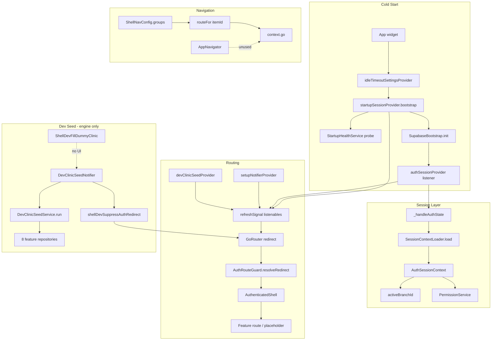

# Flutter App Feature Review — Consolidated

**Review date:** 2026-07-05  
**Scope:** `frontend/lib/app` (routing, shell UI, providers, dev tooling, cross-cutting validation)  
**Architecture:** Clean Architecture + Riverpod + go_router  
**Sources merged:** routing, shell-ui, providers, dev-crosscutting partial reviews

---

## Feature Purpose

`frontend/lib/app` is the **application composition root** for the AiClinic Flutter client. It owns:

| Area | Responsibility |
|------|----------------|
| **Bootstrap** | `App` widget: startup ordering, lifecycle hooks, `MaterialApp.router`, idle-timeout scope |
| **Routing** | Centralized `AppRoutes`, single `GoRouter` with composite redirect, permission guards via `AuthRouteGuard` |
| **Session** | `authSessionProvider`, `startupSessionProvider`, `SessionContextLoader`, branch selection, connectivity/theme |
| **Shell chrome** | `AuthenticatedShell`, sidebar/top bar, branch switcher, nav config, collapse persistence |
| **Navigation facade** | `AppNavigator` typed API over `go_router` (defined but largely unused) |
| **Dev tooling** | Debug-only clinic seed engine, design-system bypass, redirect suppression during seed |

Most feature routes intentionally render `uiPendingPlaceholder` during UI migration. The shell is structurally sound but integration correctness — routing logic, permission-aware nav, branch persistence, and dev UI wiring — lags behind the scaffold.

---

## Data Flow Summary

**Key flows:**

1. **Startup → auth → redirect:** `bootstrap()` validates config/connectivity, initializes Supabase; `authSessionProvider` listens to auth stream and loads session context; router `refreshListenable` re-evaluates redirects on startup/auth/setup/dev-seed changes.
2. **Branch scoping:** User selects branch via `branchSelectionProvider` → `setActiveBranch` mutates in-memory `AuthSessionContext.activeBranchId`; feature providers key lists/queues off this ID.
3. **Permission gating:** `AuthRouteGuard` blocks direct URL access; sidebar nav is **not** filtered — only router redirects enforce permissions.
4. **Dev seed:** Notifier orchestrates wipe + multi-step seed; suppresses all auth redirects while `inProgress`; **no UI entry point** wires the handler.

---

## Architecture Assessment

| Dimension | Verdict | Notes |
|-----------|---------|-------|
| **Layering** | Mixed | Composition root importing features is acceptable; `AuthRouteGuard` and `SessionContextLoader` leak app/feature dependencies into `core` and `app` respectively |
| **Routing model** | Sound structure, buggy execution | Single router + centralized routes is correct; two high-severity redirect bugs (H1, H2) and auth-loading gap (H4) undermine it |
| **State machines** | Partially coordinated | Startup and auth are independent; `retryStartup()` does not reset auth listener; bootstrap wizard state not synced on session restore |
| **Shell / nav** | Presentation-polished, integration-weak | Layout widgets and tokens are solid; permission nav, dead items, branch names, and auth-route chrome are misaligned |
| **Branch selection** | Critical clinical-scope gap | In-memory only; wiped on token refresh, `reloadContext()`, and app resume |
| **Dev tooling** | Strong engine, missing productization | ~1,200 LOC seed logic with tests; UI unwired, service lacks debug guard, assets ship in prod |
| **Navigation API** | Duplicated | `AppNavigator` defined with bugs; shell uses raw `context.go()` |
| **Test coverage** | Guard-heavy, wiring-thin | `AuthRouteGuard` well tested; router composition, shell widgets, bootstrap races, branch persistence largely untested |

**Overall:** The module is a **scaffold-quality shell** ready for feature wiring once redirect bugs, branch persistence, permission-aware nav, and dev UI are addressed.

---

## 1. Critical Issues

### C1. Dev seed and reset actions have no UI entry point

| Field | Detail |
|-------|--------|
| **Severity** | Critical |
| **Files** | `shell_dev_nav.dart`, `shell_dev_fill_dummy_clinic.dart`, `shell_dev_integration.dart`, `features/setup/presentation/dev/setup_dev_widgets.dart`, `shell/navigation/shell_nav_config.dart` |
| **Evidence** | `ShellDevNav.footerItemIds` lists `fill-dummy-clinic` and `reset-database`. `ShellDevFillDummyClinic.handleNavSelection` exists with **zero call sites**. `shell_dev_integration.dart` documents `ShellDevNavFooter` / `[ShellNav]` — neither class exists. `SetupDevWidgets.panel` returns `SizedBox.shrink()` even in debug. Sidebar footer only routes "Dev" to design system. |
| **Why** | Dev nav metadata and handlers were implemented ahead of UI wiring. |
| **Impact** | ~1,200 LOC of seed engine is unreachable in the running app; developers cannot trigger dummy clinic fill or reset from the UI. |
| **Solution** | Implement `ShellDevNavFooter` (or embed dev options in `DesignSystemPage` / setup wizard) rendering `footerItemIds`, routing `theme-showcase` to foundation demo, calling `ShellDevFillDummyClinic.handleNavSelection`, and wiring reset to `setupNotifier.resetInstallationForDevelopment()`. Add widget test proving debug visibility. |

### C2. `DevClinicSeedService.run()` lacks client-side debug guard

| Field | Detail |
|-------|--------|
| **Severity** | Critical |
| **Files** | `dev_clinic_seed_service.dart`, `dev_clinic_seed_notifier.dart` |
| **Evidence** | `DevClinicSeedNotifier.fillDummyClinic()` checks `kDebugMode`; `DevClinicSeedService.run()` does not — it immediately calls `_bootstrap.resetInstallationForDevelopment()`. |
| **Why** | Defense-in-depth assumed notifier is the only entry point. |
| **Impact** | Profile builds against dev backends, or future UI mistakes, could trigger destructive wipe if service is invoked directly. Server env guard mitigates production DB risk but not dev/staging accidents. |
| **Solution** | Add `if (!kDebugMode) throw StateError(...)` at top of `run()`. Consider `@visibleForTesting` escape hatch for integration tests with mocked repos. |

---

## 2. High Priority Issues

### H1. Authorized users cannot reach `/protected/*` routes — missing `return null`

| Field | Detail |
|-------|--------|
| **Severity** | High |
| **Files** | `router.dart`, `auth_route_guard.dart`, `app_routes.dart` |
| **Evidence** | When `canAccessProtectedFeatureRoute(auth)` succeeds, router falls through to `blockProtectedRoute` + `return AppRoutes.protectedBlocked` instead of `return null`. `AuthRouteGuard.resolveRedirect` returns `null` for authenticated, setup-complete users on `/protected/*`. |
| **Why** | Router and guard disagree on the happy path after access checks pass. |
| **Impact** | Deep links to `/protected/*` always land on `/protected-blocked` even for fully authorized sessions; future protected features cannot ship without fix. |
| **Solution** | After successful `canAccessProtectedFeatureRoute`, `return null`. Only call `blockProtectedRoute` when config is invalid or auth/setup is insufficient. |

### H2. `isBootstrapWizardInProgress` defaults `true` on cold start — `/bootstrap` not redirected

| Field | Detail |
|-------|--------|
| **Severity** | High |
| **Files** | `router.dart`, `setup_notifier.dart`, `auth_route_guard.dart` |
| **Evidence** | `SetupUiState` defaults to `SetupWizardStep.organization` → `isBootstrapWizardInProgress == true` on every cold start. `markSetupComplete()` is only called from dev seed tooling, not from auth session restore after `finishSetup()`. Guard allows `/bootstrap` when wizard in progress. |
| **Why** | Wizard UI state is used as proxy for "user may stay on `/bootstrap`" but is not restored from `auth.context.setupRequired`. |
| **Impact** | After cold start, authenticated user with `setupRequired: false` on `/bootstrap` is not redirected to `/home`. Same-session `finishSetup()` works until app restart. |
| **Solution** | Derive bootstrap allowance from `auth.context!.setupRequired`. On auth restore when `!setupRequired`, call `markSetupComplete()` or reset wizard state. |

### H3. Auth `loading`/`unknown` skips redirects — brief unauthorized route exposure

| Field | Detail |
|-------|--------|
| **Severity** | High (security/UX) |
| **Files** | `auth_route_guard.dart`, `router.dart`, `app.dart` |
| **Evidence** | `AuthRouteGuard` returns `null` when `auth.status == unknown || loading`. Router has no loading gate; `initialLocation` is `/home`. Bootstrap runs in microtask after first frame. |
| **Why** | No global auth-loading splash or redirect while session resolves. |
| **Impact** | Feature routes can briefly render inside `AuthenticatedShell` before permission redirects apply; confusing flash on cold start. |
| **Solution** | Redirect to dedicated startup/loading route when auth is unknown/loading, or hold `MaterialApp.router` until bootstrap + initial auth sync complete. |

### H4. Active branch selection lost on token refresh and context reload

| Field | Detail |
|-------|--------|
| **Severity** | High |
| **Files** | `auth_session_provider.dart`, `session_context_loader.dart`, `branch_selection_notifier.dart`, `app.dart`, `authenticated_shell.dart` |
| **Evidence** | `setActiveBranch` only mutates in-memory context. `_loadSessionContext` always recomputes `activeBranchId` from DB primary. `tokenRefreshed`, `refreshSessionContext`, and app-resume `reloadContext()` all call `_loadSessionContext` without preserving prior selection. |
| **Why** | User branch choice is session UI state; reload paths treat JWT/DB primary as sole source of truth. |
| **Impact** | Multi-branch staff silently revert to primary branch after JWT refresh (~hourly) or app resume. Patient lists, billing, appointments scoped to wrong branch — clinical-scope data risk without UI indication. |
| **Solution** | Before replacing context, capture `previousActiveBranchId`; if still in `branchIds`, pass into loader or merge after load. Apply in `tokenRefreshed`, `refreshSessionContext`, and `_handleAuthState` reload paths. Optionally persist in `SharedPreferences` or server-side preference. |

### H5. Sidebar shows all nav items without permission gating

| Field | Detail |
|-------|--------|
| **Severity** | High |
| **Files** | `authenticated_shell.dart`, `shell_nav_config.dart` |
| **Evidence** | `AuthenticatedShell` passes static `ShellNavConfig.groups` with no filtering. Router guards block direct URL access, but sidebar always renders Patients, Billing, Staff, etc. Keyboard nav can cycle through forbidden routes. |
| **Why** | Nav config is static; unlike `SettingsTabs.visibleFor(auth)`, shell nav has no permission equivalent. |
| **Impact** | Users see destinations they cannot access; clicks redirect or show blocked content — undermines permission model UX. |
| **Solution** | Add `ShellNavConfig.visibleGroupsFor(PermissionService)` mirroring `AuthRouteGuard` rules; filter `groups` and `footerItems` in `AuthenticatedShell`. |

### H6. Four sidebar items are dead — no route binding

| Field | Detail |
|-------|--------|
| **Severity** | High |
| **Files** | `shell_nav_config.dart`, `authenticated_shell.dart` |
| **Evidence** | Items `encounters`, `workspace`, `reports` exist in `groups` but are absent from `_routesByItemId`. `routeFor` returns `null`; `onNavigate` silently no-ops. |
| **Why** | Placeholder nav entries added before routes existed. |
| **Impact** | Click and keyboard navigation appear broken with no feedback. |
| **Solution** | Remove until routes exist, disable with "Coming soon" tooltip, or route to explicit placeholders. Exclude dead items from keyboard nav. |

### H7. `AuthenticatedShell` wraps unauthenticated routes with full chrome

| Field | Detail |
|-------|--------|
| **Severity** | High |
| **Files** | `router.dart`, `authenticated_shell.dart` |
| **Evidence** | `ShellRoute` builder always returns `AuthenticatedShell`, including `login`, `bootstrap`, `startupCheck`. Shell renders sidebar, top bar, branch selector; may warm appointment queue providers. |
| **Why** | Single shell route for all pages. |
| **Impact** | Login/setup show full clinic chrome; unnecessary provider work on auth pages; misleading component name. |
| **Solution** | Split `ShellRoute` — auth routes outside shell, or conditionally render chrome when `auth.isAuthenticated && !context.setupRequired`. |

### H8. Nav/route model inconsistencies — duplicate items, wrong active states

| Field | Detail |
|-------|--------|
| **Severity** | High |
| **Files** | `shell_nav_config.dart` |
| **Evidence** | (1) `home`/`dashboard` both map to `/home`. (2) `billing`/`invoices` both map to billing invoices. (3) On `/billing/invoices`, exact-match returns `'billing'` first — `'invoices'` never active. (4) Settings sub-routes have no prefix handler — footer Settings never highlights. (5) Visit routes have no nav item or location mapping. |
| **Why** | Dual mapping + exact-match-first logic + incomplete prefix rules. |
| **Impact** | Two nav items per destination; only one highlights; settings deep links show no active nav; visits invisible in chrome. |
| **Solution** | One canonical item per route; add `isSettingsLocation` to `itemIdForLocation`; add visit mapping or remove visit chrome expectation. |

### H9. `showPatientRegister()` always returns `null`

| Field | Detail |
|-------|--------|
| **Severity** | High |
| **Files** | `app_navigator.dart` |
| **Evidence** | `await _context.push<String?>(AppRoutes.patientsNew); return null;` — push result discarded. |
| **Why** | Documented contract implies returning created patient ID on pop. |
| **Impact** | Silent data loss for callers awaiting registration outcome when registration UI is wired. |
| **Solution** | `Future<String?> showPatientRegister() => _context.push<String?>(AppRoutes.patientsNew);` Ensure registration route pops with `context.pop(newPatientId)`. |

### H10. Auth bootstrap can permanently stall at `unknown` if Supabase isn't ready

| Field | Detail |
|-------|--------|
| **Severity** | High |
| **Files** | `auth_session_provider.dart`, `auth_route_guard.dart` |
| **Evidence** | `_runEnsureSupabaseReady` returns early when `!SupabaseBootstrap.isReady` without updating state or clearing `_ensureSupabaseReadyTask`. Initial state is `unknown`. Guard allows navigation when `unknown`. |
| **Why** | Memoized task completes on no-op; no retry path unless startup state changes again. |
| **Impact** | Rare timing edge case: auth never transitions; sign-in may throw while router treats session as indeterminate. |
| **Solution** | On early return: set `unauthenticated` with actionable failure, or null `_ensureSupabaseReadyTask` and schedule retry. Log at error level. |

### H11. Concurrent `_handleAuthState` calls are unserialized

| Field | Detail |
|-------|--------|
| **Severity** | High |
| **Files** | `auth_session_provider.dart`, `auth_notifier.dart` |
| **Evidence** | Stream listener uses `unawaited(_handleAuthState(...))`. `syncAfterSignIn` also calls `_handleAuthState`. No mutex/generation token. |
| **Why** | Supabase can emit `signedIn` while `syncAfterSignIn` runs; overlapping loads have no "latest wins" guard. |
| **Impact** | Stale context can overwrite fresh context (wrong permissions, branch, `setupRequired`); duplicate DB/RPC work on sign-in. |
| **Solution** | Serialize with incrementing generation counter or lock chain; discard results when generation mismatches. |

### H12. Dev assets bundled in production builds (~796 KB)

| Field | Detail |
|-------|--------|
| **Severity** | High |
| **Files** | `pubspec.yaml`, `dev_egyptian_medications_asset.dart`, `dev_egyptian_investigations_asset.dart` |
| **Evidence** | Assets declared unconditionally; medication JSON is 792 KB / 25,065 names. |
| **Why** | Simplest pubspec setup during development. |
| **Impact** | Increased APK/IPA size; dev catalog strings shipped to production users. |
| **Solution** | Move assets to debug-only flavor or conditional asset bundle; lazy-load only when seed starts. |

### H13. `resetDatabaseId` declared but completely unwired

| Field | Detail |
|-------|--------|
| **Severity** | High |
| **Files** | `shell_dev_nav.dart` |
| **Evidence** | `resetDatabaseId = 'reset-database'` in `footerItemIds` and `labelFor`; no `routeFor`, no handler, no connection to `resetInstallationForDevelopment()`. |
| **Why** | Placeholder for future UI. |
| **Impact** | Misleading dev API; developers expect reset capability that does not exist. |
| **Solution** | Implement handler mirroring `ShellDevFillDummyClinic` pattern, or remove from `footerItemIds` until ready. |

### H14. Auth redirect suppression during seed masks session problems

| Field | Detail |
|-------|--------|
| **Severity** | High |
| **Files** | `shell_dev_integration.dart`, `router.dart` |
| **Evidence** | `shellDevSuppressAuthRedirect` returns true when `devClinicSeedProvider.inProgress`, bypassing **all** redirect logic including auth guards. |
| **Why** | Prevents redirect away from current page during multi-minute seed. |
| **Impact** | If session becomes invalid mid-seed, user stays on protected route with stale UI; overlay blocks interaction without explaining auth loss. |
| **Solution** | Suppress only setup/bootstrap redirects, not auth-failure redirects; show progress + auth state in overlay; abort seed on sign-out. |

### H15. Branch switcher displays raw branch UUIDs

| Field | Detail |
|-------|--------|
| **Severity** | High |
| **Files** | `authenticated_shell.dart`, `app_branch_switcher.dart`, `app_sidebar.dart` |
| **Evidence** | `ShellBranch(id: id, name: id, ...)`. `AuthSessionContext` has `branchIds` only — no names. Sidebar header shows raw `activeBranchId`. |
| **Why** | Branch name lookup not implemented in session context. |
| **Impact** | Unusable branch switcher UX on multi-branch clinics (especially after dev seed). |
| **Solution** | Extend `AuthSessionContext` or add `branchDirectoryProvider` with id→name map; load during session context load. |

### H16. Router hardcodes service catalog edit path

| Field | Detail |
|-------|--------|
| **Severity** | High |
| **Files** | `router.dart`, `app_routes.dart` |
| **Evidence** | Router: `path: '/settings/services/:serviceId/edit'`. `AppRoutes.settingsServiceEdit(serviceId)` builder exists separately. |
| **Why** | Path defined in two places during route registration. |
| **Impact** | Refactoring `AppRoutes` won't update router; deep links and guards may drift. |
| **Solution** | Derive `GoRoute` path from `AppRoutes.settingsServices` + `/:serviceId/edit` or shared pattern constant. |

### H17. No automated test for `DevClinicSeedService` orchestration

| Field | Detail |
|-------|--------|
| **Severity** | High |
| **Files** | `dev_clinic_seed_service.dart`, `test/unit/shell/` |
| **Evidence** | Tests exist for spec, schedule, assets, security gates — not for service/notifier integration. |
| **Why** | Service requires extensive mocking across 8 repositories. |
| **Impact** | Regressions in appointment seeding, doctor concurrency resolution, or catalog import undetected. |
| **Solution** | Add unit test with fake repositories verifying call order, bootstrap-admin guard, and error propagation. |

### H18. Seed progress message not shown to user

| Field | Detail |
|-------|--------|
| **Severity** | High |
| **Files** | `dev_clinic_seed_overlay.dart`, `dev_clinic_seed_notifier.dart` |
| **Evidence** | Notifier updates `progressMessage` ("Creating patients (10/48)…"); overlay only shows `CircularProgressIndicator` on black scrim. |
| **Why** | Minimal overlay implementation. |
| **Impact** | Multi-minute seed appears hung; poor dev UX even once UI is wired. |
| **Solution** | Display `seed.progressMessage` below spinner; optional linear progress when totals known. |

---

## 3. Medium Priority Issues

### M1. Side effect inside `GoRouter.redirect` — `blockProtectedRoute` mutates provider state

| Field | Detail |
|-------|--------|
| **Severity** | Medium |
| **Files** | `router.dart`, `startup_session_provider.dart` |
| **Evidence** | Redirect calls `notifier.blockProtectedRoute(location)` then returns `protectedBlocked`. Triggers `refreshSignal++`, re-running redirect. |
| **Why** | Redirect callbacks should be pure; mutating state inside redirect is fragile. |
| **Impact** | Extra rebuilds; risk of redirect loops in future edits; stale `blockedReason`. |
| **Solution** | Compute redirect target from session + location only. Move blocked state to explicit navigation handler. |

### M2. Duplicated unauthenticated-entry redirect logic (~80 lines)

| Field | Detail |
|-------|--------|
| **Severity** | Medium |
| **Files** | `router.dart` |
| **Evidence** | `StartupCurrentView.unauthenticatedEntry` switch branch (lines ~233–257) partially overlaps second block (lines ~264–314): `resolveAuthRedirect`, permission redirects, etc. |
| **Why** | Two paths maintained for coarse vs fine-grained gating. |
| **Impact** | Drift risk — one path updated, the other not. |
| **Solution** | Extract `_resolveUnauthenticatedEntryRedirect(location, auth, session)` with single ordered pipeline. |

### M3. `AppNavigator` missing navigation for registered routes

| Field | Detail |
|-------|--------|
| **Severity** | Medium |
| **Files** | `app_navigator.dart`, `app_routes.dart`, `router.dart` |
| **Evidence** | Router registers service catalog, shifts, billing insurance, visit routes with extras. `AppNavigator` has no `goSettingsServices`, `goShifts`, `goBillingInsurance`, etc. |
| **Why** | Incremental addition as features land. |
| **Impact** | Features will scatter raw `context.go()` calls; lost `extra` payloads. |
| **Solution** | Add methods mirroring all `AppRoutes` builders. |

### M4. `AppNavigator` has zero consumers — navigation facade unused

| Field | Detail |
|-------|--------|
| **Severity** | Medium |
| **Files** | `app_navigator.dart`, `authenticated_shell.dart` |
| **Evidence** | No file imports `app_navigator.dart`. Shell uses raw `context.go(route)`. |
| **Why** | Facade added but not adopted. |
| **Impact** | Two parallel navigation APIs; H9 bug goes unnoticed; facade will drift. |
| **Solution** | Migrate shell and first feature pages to `context.nav`; add lint/CI check discouraging direct `context.go` outside `app/navigation/`. |

### M5. `startupCheck` / `startupEntry` routes effectively unreachable

| Field | Detail |
|-------|--------|
| **Severity** | Medium |
| **Files** | `router.dart`, `startup_session_provider.dart` |
| **Evidence** | While `currentView == startupCheck`, only `/home` allowed; `/startup-check` redirects to `/home`. `initialLocation` is `/home`. |
| **Why** | Dead route registrations and misleading `AppRoutes` surface. |
| **Impact** | Confusion for deep links and tests. |
| **Solution** | Redirect to dedicated startup splash during `startupCheck`, or remove unused routes. |

### M6. Route `extra` payloads lost on placeholder pages

| Field | Detail |
|-------|--------|
| **Severity** | Medium |
| **Files** | `app_navigator.dart`, `ui_pending_placeholder_page.dart` |
| **Evidence** | `pushPatientDetail` passes `PatientDetailRouteExtra`; placeholders ignore `state.extra`. |
| **Why** | Migration placeholders don't read route extras. |
| **Impact** | Broken hero transitions when mixing real list UI with placeholder detail routes. |
| **Solution** | Read `extra` in placeholders for dev validation; ensure real pages use typed `fromExtra`. |

### M7. No `GoRouter.onException` / fallback for unknown paths

| Field | Detail |
|-------|--------|
| **Severity** | Medium |
| **Files** | `router.dart` |
| **Evidence** | `GoRouter` has no `errorBuilder`, `onException`, or catch-all route. |
| **Why** | Not yet implemented. |
| **Impact** | Typos or removed routes yield blank/error screens on web. |
| **Solution** | Add `errorBuilder` redirecting to `/home` or dedicated 404 page. |

### M8. Branch switcher hidden below 768px with no fallback

| Field | Detail |
|-------|--------|
| **Severity** | Medium |
| **Files** | `app_top_bar.dart` |
| **Evidence** | `AppBranchSwitcher` gated by `width >= 768`; not exposed in `AppUserMenu`. |
| **Why** | Responsive layout choice without mobile fallback. |
| **Impact** | Narrow/desktop-resized windows cannot switch branch. |
| **Solution** | Add branch entry to user menu or sidebar header on small widths. |

### M9. Queue badge warm provider never wired to sidebar

| Field | Detail |
|-------|--------|
| **Severity** | Medium |
| **Files** | `authenticated_shell.dart`, `appointment_queue_provider.dart`, `shell_nav_model.dart` |
| **Evidence** | `appointmentQueueShellWarmProvider` watched; `ShellNavItem.count` supported but never set on appointments item. |
| **Why** | Warm provider added ahead of badge UI. |
| **Impact** | Unnecessary provider subscription and network work with no UI benefit. |
| **Solution** | Pass count from `appointmentQueueCheckedInCountProvider`, or remove warm provider until badge implemented. |

### M10. Sidebar collapse state flashes on startup

| Field | Detail |
|-------|--------|
| **Severity** | Medium |
| **Files** | `shell_sidebar_collapsed_provider.dart` |
| **Evidence** | `build()` returns `false`, then `Future.microtask(_load)` async-updates persisted value. |
| **Why** | Sync default before async prefs load. |
| **Impact** | Visible expand-then-collapse animation on cold start when user prefers collapsed. |
| **Solution** | Use `AsyncNotifier` / `FutureProvider` so first paint reads persisted value. |

### M11. `AppCommandBarTrigger` non-functional but looks interactive

| Field | Detail |
|-------|--------|
| **Severity** | Medium |
| **Files** | `app_command_bar_trigger.dart`, `app_top_bar.dart` |
| **Evidence** | Constructed without `onPressed`; shows `⌘K` hint but no `Shortcuts`/`Actions` binding. |
| **Why** | Placeholder ahead of command palette. |
| **Impact** | Dead control; false affordance; accessibility gap. |
| **Solution** | Wire command palette or mark disabled with explicit styling and `ExcludeSemantics`. |

### M12. Notifications button always disabled

| Field | Detail |
|-------|--------|
| **Severity** | Medium |
| **Files** | `app_top_bar.dart`, `authenticated_shell.dart` |
| **Evidence** | `onNotificationsPressed` defaults to `null`; shell never passes handler. |
| **Why** | Feature not implemented. |
| **Impact** | Visible but inert control. |
| **Solution** | Hide until implemented, or pass handler. |

### M13. Duplicate theme toggle in top bar and user menu

| Field | Detail |
|-------|--------|
| **Severity** | Medium |
| **Files** | `app_top_bar.dart`, `app_user_menu.dart` |
| **Evidence** | Theme button at `width >= 480`; "Toggle theme" always in user menu. |
| **Why** | Both surfaces added independently. |
| **Impact** | Redundant controls. |
| **Solution** | Keep one surface; hide menu item when top-bar button visible. |

### M14. `AppShell` forces `SingleChildScrollView` on all feature content

| Field | Detail |
|-------|--------|
| **Severity** | Medium |
| **Files** | `app_shell.dart` |
| **Evidence** | `Expanded` → `SingleChildScrollView(primary: true)` wraps child. `fullWidth` never used. |
| **Why** | Default scroll wrapper for all pages. |
| **Impact** | Nested scroll conflicts with feature lists/tables. |
| **Solution** | Let features own scrolling; pass `scrollable: false` flag or use child directly. |

### M15. Sidebar keyboard nav lacks selected-state semantics

| Field | Detail |
|-------|--------|
| **Severity** | Medium |
| **Files** | `app_sidebar.dart` |
| **Evidence** | `_SidebarNavItem` uses visual `active` styling; no `Semantics(selected: active)`. |
| **Why** | Accessibility not yet wired. |
| **Impact** | Screen readers may not announce current page. |
| **Solution** | Wrap nav rows in `Semantics(button: true, selected: active, label: item.label)`. |

### M16. Connectivity is startup-only; no runtime re-check

| Field | Detail |
|-------|--------|
| **Severity** | Medium |
| **Files** | `connectivity_provider.dart`, `startup_session_provider.dart`, `startup_health_service.dart` |
| **Evidence** | `connectivityStatusProvider` reads startup snapshot. Health probe runs only in `bootstrap()`. |
| **Why** | Design treats connectivity as bootstrap gate, not ongoing signal. |
| **Impact** | Network loss after startup invisible to these providers. |
| **Solution** | Document assumption, or add periodic/on-resume health re-probe. |

### M17. Raw `error.toString()` exposed in session failure UI

| Field | Detail |
|-------|--------|
| **Severity** | Medium |
| **Files** | `auth_session_provider.dart` |
| **Evidence** | Bootstrap and context load failures use `error.toString()`; token refresh uses sanitized `kSessionEndedMessage`. |
| **Why** | Inconsistent error sanitization. |
| **Impact** | Internal exception text may appear on login/session banners. |
| **Solution** | Map to user-safe messages; log details via `AppLog` only. |

### M18. `clearBranch()` desyncs from auth session (dead code)

| Field | Detail |
|-------|--------|
| **Severity** | Medium |
| **Files** | `branch_selection_notifier.dart`, `authenticated_shell.dart` |
| **Evidence** | `clearBranch` sets local `state = null` only; shell masks with `branchSelectionProvider ?? session?.activeBranchId`. Zero call sites. |
| **Why** | Dual state: notifier vs `AuthSessionContext.activeBranchId`. |
| **Impact** | If used later, picker shows fallback while notifier reads `null`. |
| **Solution** | Remove `clearBranch`, or route through `AuthSessionNotifier`. |

### M19. `repository_providers.dart` unused and incomplete

| Field | Detail |
|-------|--------|
| **Severity** | Medium |
| **Files** | `repository_providers.dart` |
| **Evidence** | Re-exports only 3 providers; grep shows no imports. Features import repos directly; dev seed imports 8 repos directly. |
| **Why** | Partial DI facade started but not adopted. |
| **Impact** | Misleading documented import path; scattered dependency graph. |
| **Solution** | Expand barrel and migrate imports, or delete file and update docs. |

### M20. Startup `bootstrap()` reset does not coordinate auth session

| Field | Detail |
|-------|--------|
| **Severity** | Medium |
| **Files** | `startup_session_provider.dart`, `auth_session_provider.dart` |
| **Evidence** | `bootstrap()` resets `StartupSessionState`; auth listener not reset on `retryStartup()`. |
| **Why** | Independent state machines. |
| **Impact** | `retryStartup()` after profile change may leave auth bound to old Supabase client. |
| **Solution** | On bootstrap restart, invalidate `_ensureSupabaseReadyTask` and cancel `_authSubscription`. |

### M21. Auth health retry only on HTTP 502

| Field | Detail |
|-------|--------|
| **Severity** | Medium |
| **Files** | `startup_health_service.dart` |
| **Evidence** | Retry conditioned on `statusCode == 502`. Timeouts and connection refused get no retry. |
| **Why** | Tailored for Supabase CLI cold-start race. |
| **Impact** | Transient auth timeout → `unreachable` → manual retry required. |
| **Solution** | Retry on timeout/`ClientException` once. |

### M22. `DevClinicSeedNotifier` creates app-layer coupling to 8 features

| Field | Detail |
|-------|--------|
| **Severity** | Medium |
| **Files** | `dev_clinic_seed_notifier.dart`, `dev_clinic_seed_service.dart` |
| **Evidence** | Direct imports from setup, settings, patients, appointments, visits, shifts layers. |
| **Why** | Dev tooling prioritized speed over boundaries. |
| **Impact** | Hard to delete `shell/dev/` cleanly; feature repo changes break dev seed. |
| **Solution** | Introduce `DevSeedPort` interface; single adapter implements using repos. |

### M23. Duplicate Egyptian asset loader implementations

| Field | Detail |
|-------|--------|
| **Severity** | Medium |
| **Files** | `dev_egyptian_medications_asset.dart`, `dev_egyptian_investigations_asset.dart` |
| **Evidence** | Identical `loadNames()` and `batchesFor()` except asset path and batch size. |
| **Why** | Copy-paste for two catalogs. |
| **Impact** | Fix in one file not applied to other. |
| **Solution** | Extract `DevJsonNameListAsset.load(path, batchSize)`. |

### M24. Design system route registered in all build modes

| Field | Detail |
|-------|--------|
| **Severity** | Medium |
| **Files** | `router.dart`, `shell_dev_nav.dart` |
| **Evidence** | `GoRoute(path: AppRoutes.foundationDemo, ...)` always registered; access gated at redirect layer only in debug. |
| **Why** | Single router tree for all modes. |
| **Impact** | Release builds expose route surface (returns login redirect); minor recon surface. |
| **Solution** | Register route only when `kDebugMode`, or document current redirect gate as acceptable. |

### M25. Seed operation has no cancellation

| Field | Detail |
|-------|--------|
| **Severity** | Medium |
| **Files** | `dev_clinic_seed_service.dart`, `dev_clinic_seed_overlay.dart` |
| **Evidence** | Long sequential RPC loop with no cancel token; overlay uses `AbsorbPointer`. |
| **Why** | Simplicity. |
| **Impact** | Developer must kill app to stop runaway seed against dev DB. |
| **Solution** | `CancelToken` checked between phases; abort button in overlay (debug only). |

### M26. All authenticated feature routes render placeholders

| Field | Detail |
|-------|--------|
| **Severity** | Medium |
| **Files** | `router.dart`, `ui_pending_placeholder_page.dart` |
| **Evidence** | Patients, appointments, visits, billing, shifts, settings routes → `uiPendingPlaceholder`. |
| **Why** | UI migration in progress. |
| **Impact** | App shell appears complete but delivers no feature value yet. |
| **Solution** | Track per-feature migration; wire real pages as they land. |

---

## 4. Low Priority Issues

### L1. Duplicate methods `goDesignSystem()` and `goFoundationDemo()`

| Field | Detail |
|-------|--------|
| **Severity** | Low |
| **Files** | `app_navigator.dart` |
| **Evidence** | Both call `AppRoutes.foundationDemo`. |
| **Why** | Alias added without removing original. |
| **Impact** | API clutter. |
| **Solution** | Remove one alias. |

### L2. `GoRouter` instance not disposed on provider teardown

| Field | Detail |
|-------|--------|
| **Severity** | Low |
| **Files** | `router.dart` |
| **Evidence** | `ref.onDispose(refreshSignal.dispose)` but not `router.dispose()`. |
| **Why** | Provider assumed to live for app lifetime. |
| **Impact** | Negligible in normal use. |
| **Solution** | Call `router.dispose()` in `onDispose` if provider scope changes. |

### L3. `forgot-password` route is redirect-only

| Field | Detail |
|-------|--------|
| **Severity** | Low |
| **Files** | `router.dart` |
| **Evidence** | Redirects to `${AppRoutes.login}?forgot=1`. |
| **Why** | Login page handles forgot flow via query param. |
| **Impact** | Verify login UI reads `state.uri.queryParameters`. |
| **Solution** | Confirm login handles `?forgot=1`; centralize in `AppRoutes.forgotPasswordQuery`. |

### L4. `protectedPlaceholder` route unreachable (symptom of H1)

| Field | Detail |
|-------|--------|
| **Severity** | Low |
| **Files** | `router.dart`, `app_routes.dart` |
| **Evidence** | Builder registered but redirect always blocks. |
| **Why** | H1 redirect bug. |
| **Impact** | Dead route registration. |
| **Solution** | Fixed automatically when H1 is resolved. |

### L5. App resume reloads context without in-flight guard

| Field | Detail |
|-------|--------|
| **Severity** | Low |
| **Files** | `app.dart`, `auth_session_provider.dart` |
| **Evidence** | `unawaited(reloadContext())` on resume; no serialization of overlapping reloads. |
| **Why** | Fire-and-forget resume refresh. |
| **Impact** | Rapid resume could overlap `refreshSessionContext()` calls. |
| **Solution** | Serialize reloads or ignore if already in progress. |

### L6. `goPatientRegister` vs `showPatientRegister` overlap

| Field | Detail |
|-------|--------|
| **Severity** | Low |
| **Files** | `app_navigator.dart` |
| **Evidence** | Both push `patientsNew`; one returns `Future`, one `void`. |
| **Why** | Two APIs for same navigation. |
| **Impact** | API confusion. |
| **Solution** | Consolidate to single method with optional result. |

### L7. Bootstrap microtask lacks `mounted` guard

| Field | Detail |
|-------|--------|
| **Severity** | Low |
| **Files** | `app.dart` |
| **Evidence** | Microtask awaits idle settings + bootstrap without checking widget mounted. |
| **Why** | Widget lifecycle not guarded after async gaps. |
| **Impact** | Edge case if widget disposed before microtask completes. |
| **Solution** | Check `if (!mounted) return;` after each `await`, or move bootstrap to dedicated provider. |

### L8. `footerItems()` allocates new list every build

| Field | Detail |
|-------|--------|
| **Severity** | Low |
| **Files** | `shell_nav_config.dart`, `authenticated_shell.dart` |
| **Evidence** | `footerItems()` called in `build`. |
| **Why** | Factory method not cached. |
| **Impact** | Minor allocation per rebuild. |
| **Solution** | Cache as `static final` or memoize in provider. |

### L9. `AppUserMenu` hardcodes `appVersion = '1.0.0'`

| Field | Detail |
|-------|--------|
| **Severity** | Low |
| **Files** | `app_user_menu.dart` |
| **Evidence** | Default parameter never overridden by shell. |
| **Why** | Placeholder version. |
| **Impact** | Incorrect version shown. |
| **Solution** | Inject from `package_info_plus` or build config. |

### L10. `ShellUser.email` never populated

| Field | Detail |
|-------|--------|
| **Severity** | Low |
| **Files** | `authenticated_shell.dart`, `shell_nav_model.dart`, `app_user_menu.dart` |
| **Evidence** | `ShellUser` created with `name` and `role` only. |
| **Why** | Email not mapped from session. |
| **Impact** | Email UI conditional never renders. |
| **Solution** | Populate from session when available. |

### L11. `FocusNode` map grows without pruning

| Field | Detail |
|-------|--------|
| **Severity** | Low |
| **Files** | `app_sidebar.dart` |
| **Evidence** | `_focusNodes.putIfAbsent`; no removal when items disappear. |
| **Why** | Static nav today. |
| **Impact** | Negligible now; leak if nav becomes dynamic. |
| **Solution** | Prune focus nodes when items removed. |

### L12. Single-branch switcher still shows dropdown affordance

| Field | Detail |
|-------|--------|
| **Severity** | Low |
| **Files** | `app_branch_switcher.dart` |
| **Evidence** | `branches.length == 1` still renders `MenuAnchor` with `expand_more`. |
| **Why** | Same widget for all branch counts. |
| **Impact** | Misleading affordance. |
| **Solution** | Render static label when `branches.length <= 1`. |

### L13. `BranchSelectionNotifier` largely redundant

| Field | Detail |
|-------|--------|
| **Severity** | Low |
| **Files** | `branch_selection_notifier.dart`, feature providers |
| **Evidence** | Notifier mirrors `authSessionProvider.context.activeBranchId`; features read auth directly. |
| **Why** | Thin wrapper added for shell only. |
| **Impact** | Two APIs for same concept. |
| **Solution** | Consolidate on `authSessionProvider.select((s) => s.context?.activeBranchId)`. |

### L14. `SessionContextLoader` instantiated per load

| Field | Detail |
|-------|--------|
| **Severity** | Low |
| **Files** | `auth_session_provider.dart` |
| **Evidence** | Getter creates new instance each call. |
| **Why** | Stateless class. |
| **Impact** | Negligible allocation. |
| **Solution** | Cache as `late final` in notifier `build()`. |

### L15. `probeEndpointForTest` may leak `http.Client`

| Field | Detail |
|-------|--------|
| **Severity** | Low |
| **Files** | `startup_health_service.dart` |
| **Evidence** | Test helper creates client when null but never closes. |
| **Why** | Asymmetry with `check()` which closes in `finally`. |
| **Impact** | Test-only socket leak. |
| **Solution** | Document inject client in tests, or close in helper. |

### L16. Theme coupled to startup session state

| Field | Detail |
|-------|--------|
| **Severity** | Low |
| **Files** | `theme_provider.dart`, `startup_session_provider.dart` |
| **Evidence** | `themeMode` lives on `StartupSessionState`; preserved across bootstrap reset. |
| **Why** | Pre-auth screens need theme before auth exists. |
| **Impact** | Theming conceptually mixed with bootstrap. |
| **Solution** | Acceptable for V1; optional split `themePreferencesProvider` later. |

### L17. Stale documentation references in `shell_dev_integration.dart`

| Field | Detail |
|-------|--------|
| **Severity** | Low |
| **Files** | `shell_dev_integration.dart` |
| **Evidence** | Comments reference `[ShellDevNavFooter]`, `[ShellNav]` — symbols don't exist. |
| **Why** | Docs not updated after refactor. |
| **Impact** | Misleading removal checklist. |
| **Solution** | Update to actual symbols (`ShellNavConfig.footerItems`, `DesignSystemPage`). |

### L18. Hardcoded default staff password in dev spec

| Field | Detail |
|-------|--------|
| **Severity** | Low |
| **Files** | `dev_clinic_seed_spec.dart` |
| **Evidence** | `defaultStaffPassword = 'DemoPass1'`. |
| **Why** | Dev convenience. |
| **Impact** | Predictable credentials on dev-seeded clinics (acceptable if documented). |
| **Solution** | Document in dev README; optional random password with log output. |

---

## 5. Clean Architecture Violations

### CA1. `core/auth/auth_route_guard.dart` imports app-layer `auth_session_provider.dart`

| Field | Detail |
|-------|--------|
| **Severity** | Medium (architectural) |
| **Files** | `auth_route_guard.dart` |
| **Evidence** | Core guard depends on app-layer `AuthSessionState`. |
| **Why** | Domain auth types live in features; guard tied to app presentation state. |
| **Impact** | Core layer depends on app layer; harder to reuse guard independently. |
| **Solution** | Move `AuthSessionState` to `features/auth/application` or define routing DTO in `core/auth` that app provider maps to. |

### CA2. App layer performs data access in `SessionContextLoader`

| Field | Detail |
|-------|--------|
| **Severity** | Medium (architectural) |
| **Files** | `session_context_loader.dart`, `auth_session_provider.dart` |
| **Evidence** | Direct PostgREST queries: `staff_members`, `staff_branch_assignments`, `organizations`. |
| **Why** | Session assembly is infrastructure concern, not app orchestration. |
| **Impact** | App layer depends on PostgREST schema; duplicates staff/branch knowledge in `staff_admin_repository.dart`. |
| **Solution** | Move to `features/auth/data/session_context_repository.dart` implementing domain port. |

### CA3. App providers import feature data implementations

| Field | Detail |
|-------|--------|
| **Severity** | Medium (architectural) |
| **Files** | `auth_session_provider.dart` |
| **Evidence** | Imports `auth_repository.dart`, `permission_repository.dart` from `features/auth/data/`. |
| **Why** | Composition root wires concrete implementations. |
| **Impact** | App module transitively coupled to Supabase data layer. |
| **Solution** | Define providers in `features/auth/di/`; app imports only domain abstractions. |

### CA4. `AppNavigator` imports feature domain and presentation types

| Field | Detail |
|-------|--------|
| **Severity** | Medium (architectural) |
| **Files** | `app_navigator.dart` |
| **Evidence** | Imports `PatientListItem`, `PatientDetailRouteExtra`, `AppointmentListItem` from features. |
| **Why** | Navigation facade accepts feature-specific types. |
| **Impact** | App shell depends on feature internals. |
| **Solution** | Define route extras in `app/navigation/`; features map at presentation boundary. |

### CA5. Shell orchestrator imports feature presentation provider

| Field | Detail |
|-------|--------|
| **Severity** | Medium (architectural) |
| **Files** | `authenticated_shell.dart` |
| **Evidence** | Imports and watches `appointmentQueueShellWarmProvider`. |
| **Why** | Shell warms feature data directly. |
| **Impact** | App shell depends on appointments feature presentation layer. |
| **Solution** | Expose badge count via app-layer provider or callback injection. |

### CA6. `ShellNavConfig` couples nav presentation to routing and dev tooling

| Field | Detail |
|-------|--------|
| **Severity** | Medium (architectural) |
| **Files** | `shell_nav_config.dart` |
| **Evidence** | Single class holds UI data, `AppRoutes` bindings, `ShellDevNav` delegation, title resolution. |
| **Why** | Convenience single file. |
| **Impact** | Hard to test and evolve nav independently. |
| **Solution** | Split `ShellRouteRegistry` (routes ↔ IDs) from `ShellNavCatalog` (labels/icons). |

### CA7. `router.dart` imports feature presentation directly

| Field | Detail |
|-------|--------|
| **Severity** | Low (architectural) |
| **Files** | `router.dart` |
| **Evidence** | Imports `design_system_page.dart`, `setup_notifier.dart`. |
| **Why** | Composition root pattern. |
| **Impact** | Couples routing to setup wizard state; acceptable short-term. |
| **Solution** | Consider route modules per feature as table grows. |

---

## 6. SOLID Violations

### S1. `router.dart` redirect closure violates SRP

| Field | Detail |
|-------|--------|
| **Severity** | Medium |
| **Files** | `router.dart` |
| **Evidence** | Single ~130-line `redirect` handles dev bypass, protected blocking, startup FSM, auth, eight permission domains. |
| **Why** | Monolithic redirect grew organically. |
| **Impact** | Hard to test, reason about, and modify safely. |
| **Solution** | Extract `StartupRouteRedirect`, `ProtectedRouteRedirect`; compose in order. |

### S2. `AuthSessionNotifier` has multiple responsibilities

| Field | Detail |
|-------|--------|
| **Severity** | Medium |
| **Files** | `auth_session_provider.dart` |
| **Evidence** | Single class: Supabase bootstrap gate, auth stream, context load, idle monitoring, branch mutation, sign-out. |
| **Why** | Historical growth; partial extract to `SessionContextLoader`. |
| **Impact** | Hard to test orchestration in isolation. |
| **Solution** | Extract `AuthSessionCoordinator` + `IdleSessionLifecycle` services. |

### S3. `AuthenticatedShell` does too much (SRP)

| Field | Detail |
|-------|--------|
| **Severity** | Medium |
| **Files** | `authenticated_shell.dart` |
| **Evidence** | Composes shell, maps session → view models, warms feature providers, handles theme/sign-out/branch/nav. |
| **Why** | Single orchestrator widget. |
| **Impact** | Changes to any concern rebuild entire shell. |
| **Solution** | Extract `ShellViewModel` provider producing `ShellChromeState`. |

### S4. Open/Closed — adding nav items requires editing multiple blocks

| Field | Detail |
|-------|--------|
| **Severity** | Medium |
| **Files** | `shell_nav_config.dart` |
| **Evidence** | `_routesByItemId`, `groups`, and `itemIdForLocation` prefix rules maintained separately. |
| **Why** | No single declarative nav entry type. |
| **Impact** | Easy to add item without route or active-state mapping. |
| **Solution** | Single entry type: `{ id, label, icon, route, prefixMatch, permission }`. |

### S5. `AppNavigator` grows without interface segregation

| Field | Detail |
|-------|--------|
| **Severity** | Low |
| **Files** | `app_navigator.dart` |
| **Evidence** | One class owns auth, patients, appointments, billing, visits, settings. |
| **Why** | Monolithic facade. |
| **Impact** | Large surface area; features depend on unrelated methods. |
| **Solution** | `PatientNavigator`, `SettingsNavigator`, or extension parts per feature. |

### S6. `permissionServiceProvider` rebuilds on any auth field change

| Field | Detail |
|-------|--------|
| **Severity** | Low |
| **Files** | `auth_session_provider.dart` |
| **Evidence** | `ref.watch(authSessionProvider).context` — full auth state watch. |
| **Why** | Simplicity over selectivity. |
| **Impact** | Extra rebuilds when only `failureMessage` changes. |
| **Solution** | `ref.watch(authSessionProvider.select((s) => s.context))`. |

### S7. Duplicated `MenuAnchor` toggle pattern

| Field | Detail |
|-------|--------|
| **Severity** | Low |
| **Files** | `app_branch_switcher.dart`, `app_user_menu.dart` |
| **Evidence** | Identical `controller.isOpen ? close() : open()` in both builders. |
| **Why** | Copy-paste between menu widgets. |
| **Impact** | Minor duplication. |
| **Solution** | Shared `AppMenuAnchorTrigger` widget. |

---

## 7. Code Duplication & Redundancy

| ID | Description | Files | Why | Impact | Solution |
|----|-------------|-------|-----|--------|----------|
| **D1** | Unauthenticated entry redirect duplicated (~80 lines) | `router.dart` | Two code paths for coarse vs fine gating | Subtle redirect bugs when auth rules change | Extract single `_resolveUnauthenticatedEntryRedirect` pipeline |
| **D2** | Branch selection API duplicated | `auth_session_provider.dart`, `branch_selection_notifier.dart`, feature notifiers | Three write/read paths for same concept | Divergent branch logic | Single write API; document canonical read path |
| **D3** | Duplicate nav entries for same destination | `shell_nav_config.dart` | `home`/`dashboard`, `billing`/`invoices` | Wrong active highlights | One canonical item per route |
| **D4** | Duplicate route-resolution logic | `shell_nav_config.dart`, `shell_dev_nav.dart` | Both implement `routeFor`, `itemIdForLocation`, `labelFor` | Fix in one not applied to other | Shared `NavRouteRegistry` base |
| **D5** | Parallel navigation APIs | `authenticated_shell.dart`, `app_navigator.dart` | Facade defined but shell uses `context.go` | Drift, H9 unnoticed | Enforce one API via migration + lint |
| **D6** | `goDesignSystem` / `goFoundationDemo` aliases | `app_navigator.dart` | Duplicate method names | API clutter | Remove one alias |
| **D7** | Forgot-password URL in router + navigator | `router.dart`, `app_navigator.dart` | Same path in two places | Drift on rename | Centralize in `AppRoutes.forgotPasswordQuery` |
| **D8** | Service edit path literal vs builder | `router.dart`, `app_routes.dart` | Hardcoded path in router | Deep link drift | Single source of truth |
| **D9** | Session context failure string matching | `session_context_loader.dart`, `auth_notifier.dart` | Similar substring checks | Inconsistent classification | Shared `SessionContextFailure` typed exceptions |
| **D10** | Duplicate Egyptian asset loaders | `dev_egyptian_medications_asset.dart`, `dev_egyptian_investigations_asset.dart` | Copy-paste | Fix in one not applied to other | Extract `DevJsonNameListAsset` |
| **D11** | Duplicate theme toggle surfaces | `app_top_bar.dart`, `app_user_menu.dart` | Both expose theme control | Redundant UI | Keep one surface |

---

## 8. Performance Issues

| ID | Description | Severity | Files | Evidence | Impact | Solution |
|----|-------------|----------|-------|----------|--------|----------|
| **P1** | Redundant session context loads on sign-in | Medium | `auth_session_provider.dart`, `auth_notifier.dart` | `syncAfterSignIn` + stream `signedIn` both trigger `_handleAuthState`; UI polls up to 150×20ms | 3–6 DB round-trips per sign-in | Serialize handlers (H11); have `syncAfterSignIn` return context |
| **P2** | `SessionContextLoader.load` sequential (4+ network calls) | Medium | `session_context_loader.dart` | staff → permissions → branch → org sequentially | Latency on every auth event | `Future.wait` for independent queries |
| **P3** | Broad `ref.watch(authSessionProvider)` rebuilds entire shell | Low | `authenticated_shell.dart` | Full auth state watched | Unnecessary shell rebuilds | Use `select` for `context`, `isAuthenticated`, `activeBranchId` |
| **P4** | Conditional side-effect watch in `build` | Low | `authenticated_shell.dart` | `if (canAccessAppointments()) { ref.watch(warmProvider) }` | Anti-pattern; couples build to side effects | `ref.listen` or dedicated provider |
| **P5** | Router refresh on every `SetupUiState` change | Low | `router.dart` | `ref.listen(setupNotifierProvider)` increments refresh on any wizard draft/step | Global redirect re-evaluation | Narrow listen to `isBootstrapWizardInProgress` only |
| **P6** | `AuthenticatedShell` warms appointment queue on all routes | Low | `authenticated_shell.dart`, `router.dart` | Warm provider runs on login/bootstrap due to H7 | Unnecessary network on auth pages | Fix shell split (H7) or gate warm to authenticated routes |

---

## 9. Test Coverage Gaps

| ID | Gap | Severity | Files / Area | Risk | Recommended Test |
|----|-----|----------|--------------|------|------------------|
| **T1** | No tests for `appRouterProvider` / redirect composition | High | `router.dart` | H1, H2, startup FSM bugs undetected | Matrix: startup view × auth × path → expected redirect |
| **T2** | No test that branch survives `reloadContext` / `tokenRefreshed` | High | `auth_session_provider.dart` | H4 would be caught | Select non-primary → reload → branch unchanged |
| **T3** | No test for concurrent auth events | High | `auth_session_provider.dart` | H11 race regressions | Overlapping `signedIn` + `syncAfterSignIn` |
| **T4** | No tests for any shell widget / nav config | High | All 10 shell files | H5–H8, M15 UX regressions | Unit: `itemIdForLocation`, `pageTitleForLocation`; widget: collapse, branch switcher, permission-filtered nav |
| **T5** | No test for `blockProtectedRoute` side effect during redirect | Medium | `router.dart` | M1 regressions | Assert no provider mutation in redirect after refactor |
| **T6** | No test for `showPatientRegister` return value | Medium | `app_navigator.dart` | H9 silent failure | Mock push returns ID; assert propagated |
| **T7** | No unit tests for `StartupSessionNotifier.bootstrap()` | Medium | `startup_session_provider.dart` | Bootstrap failure undetected | Mock health service; assert state transitions |
| **T8** | `auth_session_provider` bootstrap stuck path untested | Medium | `auth_session_provider.dart` | H10 undetected | Simulate valid startup + `isReady == false` |
| **T9** | No test for `DevClinicSeedService` orchestration | High | `dev_clinic_seed_service.dart` | Seed regressions undetected | Fake repos; verify call order and error propagation |
| **T10** | No test asserting dev UI renders dev actions | Medium | `shell/dev/` | C1 unwired UI persists | Widget test: debug footer shows fill/reset |
| **T11** | No service-layer debug guard test | Medium | `dev_clinic_seed_service.dart` | C2 undetected | Assert `run()` throws outside debug |
| **T12** | No sidebar collapse persistence round-trip test | Low | `shell_sidebar_collapsed_provider.dart` | M10 flash regressions | Provider test with mock SharedPreferences |
| **T13** | `connectivity_provider` / `theme_provider` untested | Low | delegate providers | Low risk | Optional smoke tests |

**Existing coverage (positive):** `auth_route_guard_*.dart`, `auth_route_guard_test.dart`, `app_routes_*_test.dart`, idle sign-out, reload context permissions, health classification, `SessionContextLoader` boundary suite, `shell_dev_security_test.dart` (kDebugMode gating, redirect suppression logic).

**Recommended router integration matrix (`test/router/app_router_redirect_test.dart`):**

| Startup view | Auth state | Path | Expected redirect |
|--------------|------------|------|-------------------|
| `startupCheck` | any | `/patients` | `/home` |
| `unauthenticatedEntry` | unauthenticated | `/patients` | `/login` |
| `unauthenticatedEntry` | authenticated, setup complete | `/protected/dashboard` | `null` (after H1 fix) |
| `unauthenticatedEntry` | authenticated, setup complete | `/bootstrap` | `/home` (after H2 fix) |
| `unauthenticatedEntry` | authenticated, no invoice perm | `/billing/invoices` | `/home` |
| `setupGuidance` | any | `/home` | `/setup-guidance` |
| `unknown` / `loading` | any | `/patients` | loading route (after H3 fix) |

---

## 10. Recommended Refactoring

Priority-ordered action plan merging all partial reviews:

### Phase 1 — Blockers before feature wiring

1. **Fix router redirect bugs (H1, H2, H3)** — add `return null` for granted protected access; sync bootstrap wizard with `auth.context.setupRequired`; add auth-loading gate.
2. **Preserve branch selection across reloads (H4)** — merge prior `activeBranchId` in `SessionContextLoader` / `refreshSessionContext` / `tokenRefreshed`; add T2 test.
3. **Serialize `_handleAuthState` (H11)** — generation token or lock; eliminates race and redundant loads (P1).
4. **Wire dev tooling UI (C1, C2, H13, H18)** — implement dev footer panel; add `kDebugMode` guard in service; show seed progress.
5. **Fix `showPatientRegister` (H9)** — return push result.

### Phase 2 — Shell and permission nav parity

6. **Permission-filtered sidebar (H5)** — `ShellNavConfig.visibleGroupsFor(PermissionService)` mirroring settings pattern.
7. **Remove or disable dead nav items (H6)** — encounters, workspace, reports.
8. **Split auth layout from app chrome (H7)** — login/bootstrap outside full shell.
9. **Fix nav model (H8)** — dedupe home/dashboard and billing/invoices; settings prefix matching; visit mapping.
10. **Load branch display names (H15)** — extend session context or branch directory provider.

### Phase 3 — Routing and navigation hygiene

11. **Extract redirect pipeline (M1, M2, S1)** — pure functions; no state mutation in redirect.
12. **Add router integration tests (T1)** — matrix above.
13. **Complete and enforce `AppNavigator` (M3, M4, D5)** — all routes; migrate shell; lint direct `context.go`.
14. **Single source for route paths (H16, D8)** — service edit and other parameterized routes.
15. **Add `errorBuilder` (M7)** — unknown path fallback.

### Phase 4 — Provider and architecture cleanup

16. **Fix auth bootstrap stuck path (H10)** — retry or fail visibly.
17. **Coordinate startup retry with auth (M20)** — invalidate auth listener on bootstrap restart.
18. **Invert CA1** — routing DTO or move `AuthSessionState` out of app layer.
19. **Move `SessionContextLoader` behind repository port (CA2)**.
20. **Adopt or delete `repository_providers.dart` (M19)**.
21. **Extract `ShellChromeController` provider (S3)** — filtered nav, branch names, badge counts, chrome visibility.

### Phase 5 — Dev tooling hardening

22. **Conditional dev assets (H12)** — debug flavor or lazy load.
23. **Narrow seed redirect suppression (H14)** — don't bypass auth-failure redirects.
24. **Add service orchestration tests (T9, T10, T11)**.
25. **Extract shared asset loader (M23, D10)**; optional seed cancellation (M25).

---

## Finding Count Summary

| Category | Count |
|----------|-------|
| Critical | 2 |
| High | 18 |
| Medium | 26 |
| Low | 18 |
| Clean Architecture violations | 7 |
| SOLID violations | 7 |
| Code duplication items | 11 |
| Performance issues | 6 |
| Test coverage gaps | 13 |

**Recommended action:** Complete Phase 1 before wiring real feature pages. Add router integration tests (T1) in parallel with H1–H3 fixes. Branch persistence (H4) and permission nav (H5) are the highest-impact cross-cutting themes for multi-branch clinical workflows.

---

## Second Cycle Review (2026-07-05)

**Method:** Four parallel layer re-reads with direct code verification (see layer reports below).  
**Verdict:** **No first-cycle Critical or High issue has been fixed.** The app composition root remains scaffold-quality — structurally sound shell and routing model, but integration correctness (redirects, branch persistence, permission nav, dev UI, auth races) lags behind the scaffold.

### Second Cycle Executive Summary

| Category | Cycle 1 | Cycle 2 (deduplicated) | New in cycle 2 |
|----------|---------|------------------------|----------------|
| Critical | 2 | **2** (0 fixed) | 0 |
| High | 18 | **~24** | ~10 |
| Medium | 26 | **~40** | ~14 |

**Top risk clusters:**

1. **Branch clinical scope (H4)** — `activeBranchId` wiped on token refresh, `reloadContext()`, and app resume; shell shows raw UUIDs (H15, H2-S-01).
2. **Auth orchestration races (H11, H2-P-02)** — unserialized `_handleAuthState`; `refreshSessionContext` races stream `tokenRefreshed`; memoized `_ensureSupabaseReadyTask` blocks recovery after retry (H2-P-01).
3. **Router redirect defects (H1, H2, H3, C2-R-01)** — authorized `/protected/*` still blocked; bootstrap wizard not synced on cold start; no auth-loading gate; visiting `/protected/*` can permanently lock FSM to `protectedRouteBlocked` (`acknowledgeProtectedRouteBlock` has zero call sites).
4. **Dev tooling unwired (C1, C2)** — ~1,200 LOC seed engine unreachable; service lacks `kDebugMode` guard; public `devClinicSeedServiceProvider` bypasses notifier.
5. **Shell integration gaps (H5–H8, H7)** — permission-unfiltered nav, dead items, full chrome on login/bootstrap, duplicate nav entries.

### First-Cycle Triage — Cycle 2 Status

| ID | Severity | Cycle 2 status | Notes |
|----|----------|-----------------|-------|
| **C1** | Critical | **STILL OPEN** | Dev seed/reset handlers have zero UI call sites |
| **C2** | Critical | **STILL OPEN** | `DevClinicSeedService.run()` has no `kDebugMode` guard |
| **H1** | High | **STILL OPEN** | Missing `return null` after granted `/protected/*` access |
| **H2** | High | **STILL OPEN** | Wizard defaults `inProgress` on cold start; not synced from JWT |
| **H3** | High | **STILL OPEN** | No global auth-loading gate; unknown sessions flash feature routes |
| **H4** | High | **STILL OPEN** | Branch selection not preserved across context reloads |
| **H5** | High | **STILL OPEN** | Sidebar nav not permission-filtered |
| **H6** | High | **STILL OPEN** | `encounters`, `workspace`, `reports` are dead nav items |
| **H7** | High | **STILL OPEN** | `AuthenticatedShell` wraps login/bootstrap/startup routes |
| **H8** | High | **PARTIALLY FIXED** | Settings *titles* work; footer highlight, duplicates, visits still broken |
| **H9** | High | **STILL OPEN** | `showPatientRegister()` discards push result |
| **H10** | High | **STILL OPEN** | Auth stuck at `unknown` when Supabase not ready (warning log only) |
| **H11** | High | **STILL OPEN** | Concurrent `_handleAuthState` unserialized |
| **H12–H18** | High | **STILL OPEN** | Dev assets, reset unwired, redirect suppression, branch UUIDs, etc. |

### New High Findings (Cycle 2)

| ID | Layer | Finding |
|----|-------|---------|
| **C2-R-01** | Routing | `protectedRouteBlocked` FSM locks all navigation after any `/protected/*` visit |
| **C2-R-02** | Routing/Dev | Dev seed suppresses **all** auth redirects while `inProgress` |
| **C2-R-03** | Routing | Unknown auth on deep links redirects to `/home` instead of login/loading |
| **C2-R-04** | Routing/Providers | Auth remains `unknown` permanently if Supabase not ready (memoized task) |
| **H2-P-01** | Providers | `_ensureSupabaseReadyTask` not cleared on early return or `retryStartup()` |
| **H2-P-02** | Providers | `refreshSessionContext()` races `tokenRefreshed` stream handler |
| **H2-P-03** | Providers | Auth stream subscription never rebound after startup retry |
| **H2-D-01** | Dev | Router redirect re-evaluates on every seed progress tick |
| **H2-D-02** | Dev | Public `devClinicSeedServiceProvider` exposes unguarded destructive API |
| **H2-D-03** | Dev | Dev notifier imports feature presentation providers |
| **H2-S-01** | Shell | Sidebar org header displays raw `organizationId` UUID |

### New Medium Findings (Cycle 2 — selected)

| ID | Layer | Finding |
|----|-------|---------|
| **C2-R-05** | Routing | Router refreshes on every `SetupUiState` change (not just wizard flag) |
| **C2-R-06** | Routing | Debug design-system bypass skips all redirects |
| **M2-P-01** | Providers | App-resume `reloadContext()` has no in-flight guard |
| **M2-P-02** | Providers | `connectivityStatusProvider` is bootstrap snapshot, not live |
| **M2-D-01–05** | Dev | Integration boundary violated; dead `SetupDevWidgets`; misleading security test; post-seed setup divergence; unused `repository_providers.dart` |
| **M2-S-01–05** | Shell | Keyboard nav gaps; dead-item cycling; billing active split; branch switcher mismatch; settings footer inactive on sub-routes |

### Updated Recommended Priority (Cycle 2)

**Phase 1 — Blockers before feature wiring**

1. Fix router redirect bugs: **H1 + C2-R-01 + M1** (return `null` for granted protected access; remove FSM mutation from redirect; add recovery UI).
2. **H2** — Sync bootstrap wizard from `auth.context.setupRequired` on session restore.
3. **H3 + C2-R-03** — Auth-loading gate for `unknown`/`loading`; fix deep-link fallback.
4. **H4** — Preserve `activeBranchId` across `_loadSessionContext` / `tokenRefreshed` / resume.
5. **H11 + H2-P-02** — Serialize `_handleAuthState`; deduplicate refresh paths.
6. **H10 + H2-P-01 + H2-P-03 + M20** — Bootstrap retry coordination (null ready-task, rebind auth listener).
7. **C1 + C2 + H2-D-02** — Wire dev UI; add `kDebugMode` guard in service.
8. **T1** — Router integration test matrix in parallel with fixes.

**Phase 2 — Shell and permission parity:** H5, H6, H8, H7, H15, H2-S-01, T4.

**Phase 3 — Dev hardening:** H12, H14, H2-D-01, H18, T9–T11.

### Second Cycle Layer Reports

| Layer | Report |
|-------|--------|
| Routing | [`flutter-app-second-cycle-routing.md`](flutter-app-second-cycle-routing.md) |
| Shell UI | [`flutter-app-second-cycle-shell-ui.md`](flutter-app-second-cycle-shell-ui.md) |
| Providers & Session | [`flutter-app-second-cycle-providers.md`](flutter-app-second-cycle-providers.md) |
| Dev & Cross-cutting | [`flutter-app-second-cycle-dev-crosscutting.md`](flutter-app-second-cycle-dev-crosscutting.md) |

### Second Cycle Bottom Line

Cycle 2 **confirms** cycle 1 with **zero fixes**. The inventory **grew by ~10 High and ~14 Medium** findings, sharpening bootstrap-recovery defects (H2-P-01/03), routing FSM lock (C2-R-01), and dev-seed router churn (H2-D-01). Do not wire real feature pages until Phase 1 (redirect bugs, branch persistence, auth serialization, dev UI) is complete. Add `appRouterProvider` integration tests (T1) alongside H1–H3 fixes.

*Second cycle consolidated from four parallel agent reviews — 2026-07-05. Sources: [routing](3362c30b-b3a9-48d1-aae9-ffbdd00c750f), [shell UI](f37f3753-e084-425a-8586-1ed27792a324), [providers](441ac4c8-9848-4987-9393-e2024657a701), [dev/cross-cutting](3f1dfc13-37d5-42c3-93c1-69d24d4b6abc).*

---

## Second Cycle Review (2026-07-05)

Second-cycle verification re-read every scoped file in four parallel layer reviews (routing, shell UI, providers/session, dev/cross-cutting). **No first-cycle Critical, High, or Medium issue was fixed in code.** The finding inventory grew with deduplicated new IDs across layers.

### Executive Summary

| Outcome | Detail |
|---------|--------|
| **Fixes since cycle 1** | **0** Critical / High / Medium items resolved |
| **Critical still open** | **2** — C1 (dev seed UI unwired), C2 (service lacks `kDebugMode` guard) |
| **High still open** | **~24+** — 18 first-cycle + ~10 new (deduplicated across layers) |
| **Medium still open** | **~40+** — 26 first-cycle + ~14 new (deduplicated) |
| **Partial progress** | Shell `pageTitleForLocation` for settings sub-routes only; auth bootstrap adds warning log on Supabase-not-ready (behavior unchanged) |

### Severity Rollup (Second Cycle)

| Severity | First cycle | Fixed | Still open | New (deduplicated) | Total open |
|----------|-------------|-------|------------|-------------------|------------|
| **Critical** | 2 | 0 | 2 | 0 | **2** |
| **High** | 18 | 0 | 18 | ~10 | **~24+** |
| **Medium** | 26 | 0 | 26 | ~14 | **~40+** |

### First-Cycle Triage — Key Items

| ID | Severity | Finding (summary) | Cycle 2 status |
|----|----------|-------------------|----------------|
| **C1** | Critical | Dev seed / reset have no UI entry point | **STILL OPEN** |
| **C2** | Critical | `DevClinicSeedService.run()` lacks client debug guard | **STILL OPEN** |
| **H1** | High | Authorized users blocked from `/protected/*` (missing `return null`) | **STILL OPEN** — amplifies C2-R-01 sticky FSM lock |
| **H2** | High | Bootstrap wizard defaults `inProgress` on cold start | **STILL OPEN** |
| **H3** | High | No auth loading gate for `unknown`/`loading` | **STILL OPEN** |
| **H4** | High | Branch selection lost on refresh / resume | **STILL OPEN** |
| **H5** | High | Sidebar not permission-filtered | **STILL OPEN** |
| **H6** | High | Dead nav items (encounters, workspace, reports) | **STILL OPEN** |
| **H7** | High | Auth routes wrapped in full shell chrome | **STILL OPEN** |
| **H8** | High | Nav duplicates / wrong active states | **PARTIALLY FIXED** (settings title only) |
| **H9** | High | `showPatientRegister()` discards push result | **STILL OPEN** |
| **H10** | High | Auth stuck at `unknown` when Supabase not ready | **STILL OPEN** |
| **H11** | High | Concurrent `_handleAuthState` unserialized | **STILL OPEN** |
| **H12** | High | Dev assets (~797 KB) ship in all builds | **STILL OPEN** |
| **H13** | High | `resetDatabaseId` declared but unwired | **STILL OPEN** |
| **H14** | High | Seed redirect suppression bypasses all auth redirects | **STILL OPEN** |
| **H15** | High | Branch switcher shows raw UUIDs | **STILL OPEN** |
| **H16** | High | Service edit path hardcoded in router | **STILL OPEN** |
| **H17** | High | No `DevClinicSeedService` orchestration test | **STILL OPEN** |
| **H18** | High | Seed progress message not shown in overlay | **STILL OPEN** |

### New Findings by Layer

#### Routing — [flutter-app-second-cycle-routing.md](flutter-app-second-cycle-routing.md)

| ID | Sev | Title |
|----|-----|-------|
| **C2-R-01** | High | `protectedRouteBlocked` FSM locks all navigation after `/protected/*` visit |
| **C2-R-02** | High | Dev seed suppresses all auth redirects |
| **C2-R-03** | High | Unknown auth on protected routes → `/home` not login/loading |
| **C2-R-04** | High | Auth remains `unknown` if Supabase not ready (memoized task) |
| **C2-R-05** | Medium | Router refreshes on every `SetupUiState` change |
| **C2-R-06** | Medium | Debug design-system open access bypasses all redirects |

#### Shell UI — [flutter-app-second-cycle-shell-ui.md](flutter-app-second-cycle-shell-ui.md)

| ID | Sev | Title |
|----|-----|-------|
| **H2-S-01** | High | Sidebar org header displays raw `organizationId` UUID |
| **M2-S-01** | Medium | Keyboard nav disabled when route has no nav mapping |
| **M2-S-02** | Medium | Keyboard nav cycles dead items with silent no-op |
| **M2-S-03** | Medium | Billing active-state split between list and detail |
| **M2-S-04** | Medium | Branch switcher label misrepresents stale selection |
| **M2-S-05** | Medium | Settings footer never highlights on sub-routes |

#### Providers & Session — [flutter-app-second-cycle-providers.md](flutter-app-second-cycle-providers.md)

| ID | Sev | Title |
|----|-----|-------|
| **H2-P-01** | High | Memoized `_ensureSupabaseReadyTask` prevents recovery after retry |
| **H2-P-02** | High | `refreshSessionContext()` races with `tokenRefreshed` stream |
| **H2-P-03** | High | Auth stream subscription never rebound after startup retry |
| **M2-P-01** | Medium | App-resume `reloadContext()` has no in-flight guard |
| **M2-P-02** | Medium | `connectivityStatusProvider` is bootstrap snapshot only |
| **M2-P-03** | Medium | `permissionServiceProvider` broad watch on full auth state |

#### Dev & Cross-Cutting — [flutter-app-second-cycle-dev-crosscutting.md](flutter-app-second-cycle-dev-crosscutting.md)

| ID | Sev | Title |
|----|-----|-------|
| **H2-D-01** | High | Router redirect re-evaluates on every seed progress tick |
| **H2-D-02** | High | Public `devClinicSeedServiceProvider` exposes unguarded destructive API |
| **H2-D-03** | High | Dev notifier imports feature presentation providers |
| **M2-D-01** | Medium | Documented dev integration boundary violated |
| **M2-D-02** | Medium | `SetupDevWidgets.panel` is dead parallel dev UI stub |
| **M2-D-03** | Medium | Security test DV-S-002 gives false confidence on UI wiring |
| **M2-D-04** | Medium | Post-seed `markSetupComplete()` diverges from JWT `setupRequired` |
| **M2-D-05** | Medium | `repository_providers.dart` completely unused |

### Top Risk Clusters

1. **Branch persistence (H4)** — Multi-branch staff silently revert to primary branch on JWT refresh, `reloadContext()`, and app resume; shell branch switcher can mislabel selection (M2-S-04).
2. **Auth races (H11 / H2-P-02)** — Overlapping `_handleAuthState`, `syncAfterSignIn`, and resume `reloadContext()` can overwrite fresh context; stale permissions and branch IDs.
3. **Router redirect bugs (H1 / C2-R-01)** — Protected-route happy path missing + redirect side effect traps session on `/protected-blocked` with no recovery UI.
4. **Protected FSM lock (C2-R-01)** — `acknowledgeProtectedRouteBlock()` exists but has zero call sites; any `/protected/*` visit can brick navigation until restart.
5. **Dev seed unwired (C1)** — ~1,200 LOC seed engine unreachable; C2/H2-D-02 leave destructive wipe callable without defense-in-depth.

### Layer Reports

| Layer | Report |
|-------|--------|
| Routing | [flutter-app-second-cycle-routing.md](flutter-app-second-cycle-routing.md) |
| Shell UI | [flutter-app-second-cycle-shell-ui.md](flutter-app-second-cycle-shell-ui.md) |
| Providers & Session | [flutter-app-second-cycle-providers.md](flutter-app-second-cycle-providers.md) |
| Dev & Cross-Cutting | [flutter-app-second-cycle-dev-crosscutting.md](flutter-app-second-cycle-dev-crosscutting.md) |

### Updated Recommended Fix Order — Phase 1 Blockers

1. **H1 + C2-R-01 + M1** — Fix protected-route redirect; remove `blockProtectedRoute` from redirect; add FSM recovery UI.
2. **H4 + T2** — Preserve `activeBranchId` across `tokenRefreshed`, `refreshSessionContext`, and resume reload.
3. **H11 + H2-P-02 + P1** — Serialize `_handleAuthState`; deduplicate refresh vs stream paths.
4. **H2 + M2-D-04** — Sync bootstrap wizard from `auth.context.setupRequired` on session restore.
5. **H3 + C2-R-03** — Global loading route for `unknown`/`loading`; fix unknown deep-link fallback.
6. **C1 + C2 + H2-D-02 + H18** — Wire dev UI; add service `kDebugMode` guard; show seed progress.
7. **T1** — Router integration test matrix in parallel with routing fixes.

### Second Cycle Bottom Line

The app composition root remains a **scaffold-quality shell with zero regression fixes** since the first review. Critical dev tooling gaps (C1, C2) and clinical-scope risks (H4 branch reset, H11 auth races) block production multi-branch workflows. Router redirect composition (H1, C2-R-01) can trap sessions entirely. Permission-aware nav (H5), shell integration (H6–H8), and test coverage (T1, T4) must land before real feature pages ship.

### Agent Sources

| Layer | Agent |
|-------|-------|
| Routing | [3362c30b-b3a9-48d1-aae9-ffbdd00c750f](3362c30b-b3a9-48d1-aae9-ffbdd00c750f) |
| Shell UI | [f37f3753-e084-425a-8586-1ed27792a324](f37f3753-e084-425a-8586-1ed27792a324) |
| Providers | [441ac4c8-9848-4987-9393-e2024657a701](441ac4c8-9848-4987-9393-e2024657a701) |
| Dev & Cross-Cutting | [3f1dfc13-37d5-42c3-93c1-69d24d4b6abc](3f1dfc13-37d5-42c3-93c1-69d24d4b6abc) |

---

*Consolidated from: flutter-app-review-routing.md, flutter-app-review-shell-ui.md, flutter-app-review-providers.md, flutter-app-review-dev-crosscutting.md*
