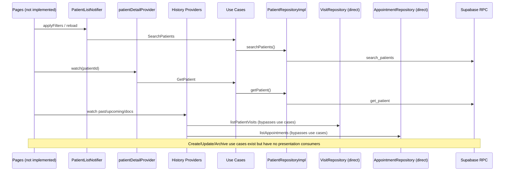
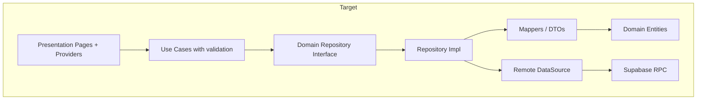

# Patients Feature Code Review

**Feature path:** `frontend/lib/features/patients`
**Review date:** 2026-07-05
**Architecture:** Clean Architecture + Riverpod
**Review scope:** Domain, Data, Application, Presentation layers + app-layer integration (routing, DI, dev seed)

---

## Executive Summary

### Overall Verdict: **Not Production-Ready — Fix Contract Mismatches and Layer Boundaries Before UI**

The patients feature has unusually strong **repository and boundary test investment** for a UI-less module: 38 test files covering RPC wiring, RLS role matrices, list notifier filter forwarding, and history provider sorting. Core read paths (search, get) follow Clean Architecture reasonably well via use cases and Riverpod providers.

However, the feature is **half-built**. All four patient routes render `uiPendingPlaceholder`. Write flows (create, update, archive, duplicate check) have use-case providers registered but **zero consumers**. Several **domain–backend contract mismatches** (`PatientGender`, clear-field update semantics) will cause runtime failures when registration/edit UI ships. **Clean Architecture boundaries are inverted** in multiple places: domain and data import presentation filter enums; history providers reach directly into appointments/visits data layers; RPC parsing lives on domain entities.

| Category | Count |
|----------|-------|
| Critical | 3 |
| High | 11 |
| Medium | 14 |
| Low | 10 |
| Clean Architecture violations | 9 |
| SOLID violations | 7 |
| Code duplication items | 6 |
| Performance items | 4 |
| Test coverage gaps | 16 |

**Recommended action:** Fix Critical and High items before implementing list/detail/register/edit screens. Relocate filter enums and wire write-path providers to prevent UI from bypassing the use-case layer.

---

## Feature Overview

### Purpose

The patients feature manages **patient search and listing**, **profile detail**, **registration**, **editing**, **archiving**, and **duplicate detection**. It integrates with secured Supabase RPCs (`search_patients`, `get_patient`, `create_patient`, `update_patient`, `archive_patient`, `check_patient_duplicates`). The detail timeline aggregates past visits, upcoming appointments, and visit attachments from cross-feature repositories.

### Data Flow (Current)



### File Inventory (34 production files)

| Layer | Path | Responsibility |
|-------|------|----------------|
| **Domain** | `domain/repositories/patient_repository.dart` | Repository interface |
| | `domain/usecases/*.dart` | Six thin use-case facades |
| | `domain/usecases/patient_use_case_providers.dart` | Riverpod providers (imports data) |
| | `domain/*.dart` | Entities, inputs, enums, validation, RPC parsers |
| **Data** | `data/patient_repository.dart` | RPC implementation + provider |
| | `data/patient_rpc_failure.dart` | `RpcFailure` extensions |
| | `data/patient_dev_seed_service.dart` | Dev seed orchestrator (unwired) |
| **Application** | `application/patient_rpc_messages.dart` | User-facing RPC message mapping |
| **Presentation** | `presentation/providers/*.dart` | List, detail, history providers |
| | `presentation/models/patient_list_filters.dart` | Filters, sort enums, table row VM |
| | `presentation/utils/patient_presentation_formatting.dart` | Display helpers |
| | `presentation/navigation/patient_detail_route_extra.dart` | go_router extra payload |

**Not present:** `presentation/pages/`, `presentation/widgets/`, cubits/blocs. No feature barrel export.

---

## 1. Critical Issues

### C-01 — `PatientGender` enum out of sync with backend

| Field | Value |
|-------|-------|
| **Severity** | Critical |
| **Files** | `domain/patient_gender.dart`, `domain/create_patient_input.dart`, `domain/update_patient_input.dart`, `domain/patient_detail.dart` |
| **Impact** | Registration/edit flows exposing `other`, `preferNotToSay`, or `unknown` will fail at runtime with `INVALID_INPUT` |

**Evidence:**

```1:7:frontend/lib/features/patients/domain/patient_gender.dart
enum PatientGender {
  male,
  female,
  other,
  preferNotToSay,
  unknown;
```

Backend migration `20260523150000_patient_registration_fields.sql` restricts `patient_gender` to `male` and `female` only. Latest RPC error: *"Gender must be male or female."* There is no `prefer_not_to_say` in backend migrations.

**Why it is a problem:** Domain advertises five genders; create/update RPCs accept two. `patient_gender_test.dart` asserts extended values round-trip, giving false confidence.

**Recommended solution:** Align `PatientGender` to `male` and `female` only. Add domain validation in `CreatePatient`/`UpdatePatient` use cases. If legacy rows exist, handle mapping in the data layer only.

---

### C-02 — Permission denial indistinguishable from "no patients yet"

| Field | Value |
|-------|-------|
| **Severity** | Critical |
| **Files** | `presentation/providers/patient_list_notifier.dart` |
| **Impact** | Future list page will show onboarding/empty-state copy instead of access denied |

**Evidence:**

```55:57:frontend/lib/features/patients/presentation/providers/patient_list_notifier.dart
    if (!AuthRouteGuard.canAccessPatientList(auth)) {
      return PatientListUiState(rows: const [], totalCount: 0, filters: filters);
    }
```

Same empty success for missing branch (lines 71–73). `isNoPatientsYet` is `true` when `isEmptyResult && totalCount == 0 && searchHint == null && !filters.hasSearchOrFilters` — which matches unauthorized and no-branch cases.

**Why it is a problem:** `AuthRouteGuard.patientRouteRedirect` defers permission checks to in-page UI. The list provider hides denial behind browse-empty semantics.

**Recommended solution:** Add explicit flags to `PatientListUiState` (`accessDenied`, `branchUnavailable`) or a sealed `PatientListOutcome`. Never map auth failures to empty browse semantics.

---

### C-03 — No patient screens wired; feature is non-functional end-to-end

| Field | Value |
|-------|-------|
| **Severity** | Critical |
| **Files** | `app/router.dart`, entire `presentation/` |
| **Impact** | Integration bugs (route params, extra parsing, edit vs detail) remain undiscovered |

**Evidence:**

```64:72:frontend/lib/app/router.dart
          GoRoute(path: AppRoutes.patients, builder: (context, state) => uiPendingPlaceholder('Patients', state)),
          GoRoute(path: AppRoutes.patientsNew, builder: (context, state) => uiPendingPlaceholder('Patients', state)),
          GoRoute(
            path: '${AppRoutes.patients}/:patientId',
            builder: (context, state) => uiPendingPlaceholder('Patients', state),
          ),
          GoRoute(
            path: '${AppRoutes.patients}/:patientId/edit',
            builder: (context, state) => uiPendingPlaceholder('Patients', state),
          ),
```

`patientListProvider`, `patientDetailProvider`, and history providers are only referenced from unit tests — zero production consumers.

**Recommended solution:** Implement pages; wire router builders to parse `state.pathParameters['patientId']` and `PatientDetailRouteExtra.fromExtra(state.extra)`.

---

## 2. High Priority Issues

### H-01 — Cannot clear optional fields on update (missing `p_clear_*` RPC params)

| Field | Value |
|-------|-------|
| **Severity** | High |
| **Files** | `data/patient_repository.dart`, `domain/update_patient_input.dart`, backend `20260524120000_fix_patient_clearable_fields.sql` |
| **Impact** | Users cannot clear gender, marital status, DOB, or notes; saved values reappear after reload |

**Evidence:**

```149:159:frontend/lib/features/patients/data/patient_repository.dart
    final result = await invokeRpc('update_patient', {
      'p_patient_id': input.patientId,
      'p_full_name': name,
      'p_expected_updated_at': input.expectedUpdatedAt.toUtc().toIso8601String(),
      'p_acknowledge_duplicate': input.acknowledgeDuplicate,
      if (input.phone != null) 'p_phone': input.phone!.trim(),
      if (input.dateOfBirth != null) 'p_date_of_birth': input.dateOfBirth!.toIso8601String().split('T').first,
      if (input.gender != null) 'p_gender': input.gender!.wireValue,
      if (input.maritalStatus != null) 'p_marital_status': input.maritalStatus!.wireValue,
      if (input.notes != null) 'p_notes': input.notes!.trim(),
    });
```

Backend supports `p_clear_gender`, `p_clear_date_of_birth`, `p_clear_marital_status`, `p_clear_notes`. Flutter sends none. `UpdatePatientInput` has no clear semantics — `null` means preserve, not clear.

**Recommended solution:** Extend `UpdatePatientInput` with explicit clear flags. Map to `p_clear_*` in repository. Add unit tests mirroring backend behavior.

---

### H-02 — Race condition on concurrent filter/reload requests

| Field | Value |
|-------|-------|
| **Severity** | High |
| **Files** | `presentation/providers/patient_list_notifier.dart` |
| **Impact** | Wrong page of results or wrong filters after rapid user input or branch switch |

**Evidence:**

```44:51:frontend/lib/features/patients/presentation/providers/patient_list_notifier.dart
  Future<void> applyFilters(PatientListFilters filters) async {
    _filters = filters;
    state = await AsyncValue.guard(() => _load(filters));
  }

  Future<void> reload() async {
    state = await AsyncValue.guard(() => _load(_filters));
  }
```

`build()` also calls `_load(_filters)` when `activeBranchId` changes. No request token, cancellation, or "latest wins" guard.

**Recommended solution:** Increment a generation counter per load; discard results when stale. Or use `ref.invalidateSelf()` with a single in-flight pattern.

---

### H-03 — Presentation depends directly on other features' data layer

| Field | Value |
|-------|-------|
| **Severity** | High |
| **Files** | `presentation/providers/patient_detail_history_provider.dart` |
| **Impact** | Hard to test patient detail in isolation; repository refactors break patients presentation |

**Evidence:**

```5:10:frontend/lib/features/patients/presentation/providers/patient_detail_history_provider.dart
import 'package:ai_clinic/features/appointments/data/appointment_repository.dart';
...
import 'package:ai_clinic/features/visits/data/visit_repository.dart';
```

```59:59:frontend/lib/features/patients/presentation/providers/patient_detail_history_provider.dart
  final page = await ref.read(visitRepositoryProvider).listPatientVisits(patientId: patientId, limit: 100);
```

Contrast with list/detail patient providers that use use cases via `searchPatientsUseCaseProvider` and `getPatientUseCaseProvider`.

**Recommended solution:** Add patients-domain use cases (e.g. `GetPatientPastVisits`, `GetPatientUpcomingAppointments`, `GetPatientVisitDocuments`) backed by repository interfaces. Presentation depends only on those providers.

---

### H-04 — History providers lack permission gating

| Field | Value |
|-------|-------|
| **Severity** | High |
| **Files** | `presentation/providers/patient_detail_history_provider.dart`, `presentation/providers/patient_detail_provider.dart` |
| **Impact** | Clinical timeline RPCs may fire without visit/appointment permissions; raw `AsyncError` from backend |

**Evidence:** Detail provider gates access:

```9:13:frontend/lib/features/patients/presentation/providers/patient_detail_provider.dart
  final canAccess = ref.watch(authSessionProvider.select(AuthRouteGuard.canAccessPatientDetail));
  if (!canAccess) {
    throw StateError('You do not have permission to view this patient.');
  }
```

History providers (`patientPastVisitsProvider`, `patientUpcomingAppointmentsProvider`, `patientVisitDocumentsProvider`) have no auth/permission checks.

**Recommended solution:** Gate each provider with appropriate guards or compose a `PatientDetailViewState` provider (see visits' `visitDetailViewProvider` pattern).

---

### H-05 — Four of six use-case providers are registered but never consumed

| Field | Value |
|-------|-------|
| **Severity** | High |
| **Files** | `domain/usecases/patient_use_case_providers.dart`, `app/shell/dev/dev_clinic_seed_service.dart` |
| **Impact** | Register/edit/archive UI will likely bypass use-case layer and call repository directly |

**Evidence:** Only `searchPatientsUseCaseProvider` and `getPatientUseCaseProvider` are read from presentation. `createPatientUseCaseProvider`, `updatePatientUseCaseProvider`, `archivePatientUseCaseProvider`, and `checkDuplicatesUseCaseProvider` have zero consumers. Dev seed calls `patientRepositoryProvider` directly.

**Recommended solution:** Wire write-path notifiers through use-case providers now, or delete unused providers until UI exists. Add `patient_editor_notifier.dart` following `invoice_editor_notifier.dart` pattern.

---

### H-06 — Use cases are pass-through shells with no business logic

| Field | Value |
|-------|-------|
| **Severity** | High |
| **Files** | All files in `domain/usecases/` |
| **Impact** | Rules scattered across data layer, presentation, and backend; bypassable via direct repository calls |

**Evidence:**

```4:10:frontend/lib/features/patients/domain/usecases/create_patient.dart
class CreatePatient {
  const CreatePatient(this._repository);
  final PatientRepository _repository;

  Future<String> call(CreatePatientInput input) {
    return _repository.createPatient(input);
  }
}
```

Every use case is identical. Validation lives in `data/patient_repository.dart`; search min-length rules in `patient_search_query.dart` (called from presentation).

**Recommended solution:** Move invariant enforcement into use cases: validate via `PatientFieldValidation`, orchestrate duplicate checks before create, map RPC failures to domain errors.

---

### H-07 — `PatientFieldValidation` is orphaned in production

| Field | Value |
|-------|-------|
| **Severity** | High |
| **Files** | `domain/patient_field_validation.dart`, `data/patient_repository.dart` |
| **Impact** | Domain declares client-side rules that nothing enforces; inconsistent UX |

**Evidence:** `validateMobileNumber` exists and is unit-tested, but no production code imports it. Phone validation in repository differs: `createPatient` checks non-empty only; `checkDuplicates` strips non-digits then validates 8–15 length.

**Recommended solution:** Use `PatientFieldValidation` from use cases. Extend with `validateFullName`, `validateNotes` (≤4000), `validateDateOfBirth` (not future). Introduce a `PatientPhone` value object with `normalize()` and `validate()`.

---

### H-08 — Infrastructure exceptions leak through repository contract

| Field | Value |
|-------|-------|
| **Severity** | High |
| **Files** | `data/patient_repository.dart`, `domain/patient_exceptions.dart`, `data/patient_rpc_failure.dart` |
| **Impact** | Presentation must know RPC error codes; domain cannot be tested in isolation |

**Evidence:** Repository throws `RpcFailure`, `StateError`, `ArgumentError`. `PatientArchivedException` exists but is never thrown — `PATIENT_ARCHIVED` stays as `RpcFailure`.

**Recommended solution:** Map RPC codes to domain failures at repository boundary (`PatientArchivedException`, `StalePatientException`, `DuplicateWarningException` with candidates). Keep `RpcFailure` inside data layer only.

---

### H-09 — Silent row dropping causes `total_count` / `items.length` mismatch

| Field | Value |
|-------|-------|
| **Severity** | High |
| **Files** | `domain/patient_search_page.dart`, `data/patient_repository.dart` |
| **Impact** | Pagination shows wrong totals; users think patients are missing |

**Evidence:**

```19:35:frontend/lib/features/patients/domain/patient_search_page.dart
    if (rawItems is List) {
      for (final entry in rawItems) {
        if (entry is Map) {
          final item = PatientListItem.fromRow(Map<String, dynamic>.from(entry));
          if (item != null) {
            items.add(item);
          }
        }
      }
    }

    return PatientSearchPage(
      items: items,
      totalCount: _readInt(data['total_count'], fallback: items.length),
```

Malformed rows are dropped without logging. Server `total_count` is trusted even when fewer items parse. Tests encode this as acceptable (`patient_repository_search_test.dart`).

**Recommended solution:** Log parse failures; fail the call if any row is unparseable; or return adjusted `totalCount` with a warning flag. Move parsing to data-layer DTOs.

---

### H-10 — Visit history silently truncated at 100 items

| Field | Value |
|-------|-------|
| **Severity** | High |
| **Files** | `presentation/providers/patient_detail_history_provider.dart` |
| **Impact** | Clinical timeline missing older visits; silent data loss |

**Evidence:**

```59:61:frontend/lib/features/patients/presentation/providers/patient_detail_history_provider.dart
  final page = await ref.read(visitRepositoryProvider).listPatientVisits(patientId: patientId, limit: 100);
  final visits = [...page.items]..sort((a, b) => b.visitDate.compareTo(a.visitDate));
  return visits;
```

`PatientVisitsPage.totalCount` is discarded. Same pattern for `patientVisitDocumentsProvider` (default limit 100).

**Recommended solution:** Return `{items, totalCount, hasMore}` in presentation state; paginate or show truncation warning.

---

### H-11 — Inconsistent permission denial behavior (list vs detail)

| Field | Value |
|-------|-------|
| **Severity** | High |
| **Files** | `presentation/providers/patient_list_notifier.dart`, `presentation/providers/patient_detail_provider.dart` |
| **Impact** | Confusing UX; duplicate error UI logic |

**Evidence:** List returns empty success on denial. Detail throws `StateError` → `AsyncValue.error`.

**Recommended solution:** Standardize on typed result (`PatientAccessDenied`) or shared `AccessGatedAsyncNotifier` base.

---

## 3. Medium Priority Issues

### M-01 — `patientListProvider` does not watch permissions or auth status

| Field | Value |
|-------|-------|
| **Severity** | Medium |
| **Files** | `presentation/providers/patient_list_notifier.dart` |
| **Impact** | Stale data visible after RBAC change mid-session |

**Evidence:** `build()` watches only `activeBranchId`, not permissions or `auth.status`.

**Recommended solution:** Also watch `canAccessPatientList` or `context?.permissions`.

---

### M-02 — Presentation enums leak into domain and data contracts

| Field | Value |
|-------|-------|
| **Severity** | Medium |
| **Files** | `presentation/models/patient_list_filters.dart`, `domain/repositories/patient_repository.dart`, `data/patient_repository.dart`, `domain/usecases/search_patients.dart` |
| **Impact** | Domain cannot compile without UI-layer types |

**Evidence:**

```7:18:frontend/lib/features/patients/domain/repositories/patient_repository.dart
import 'package:ai_clinic/features/patients/presentation/models/patient_list_filters.dart';
...
    PatientLastVisitFilter lastVisitFilter = PatientLastVisitFilter.any,
    PatientSortField sortField = PatientSortField.nameAsc,
```

**Recommended solution:** Move `PatientSortField`, `PatientLastVisitFilter`, and wire extensions to `domain/patient_search_filters.dart`.

---

### M-03 — RPC JSON parsing lives in domain entities, not data layer

| Field | Value |
|-------|-------|
| **Severity** | Medium |
| **Files** | `domain/patient_detail.dart`, `domain/patient_list_item.dart`, `domain/patient_search_page.dart`, `domain/duplicate_candidate.dart`, `domain/patient_row_parsing.dart` |
| **Impact** | Domain models know PostgreSQL column names; API changes mutate domain |

**Evidence:** `PatientDetail.fromRow`, `PatientSearchPage.fromRpcData`, `DuplicateCandidate.fromRow` parse snake_case RPC maps in domain.

**Recommended solution:** Introduce DTOs and mappers in `data/mappers/`. Keep domain entities free of `fromRow`.

---

### M-04 — Input DTOs are anemic with no invariants at construction

| Field | Value |
|-------|-------|
| **Severity** | Medium |
| **Files** | `domain/create_patient_input.dart`, `domain/update_patient_input.dart` |
| **Impact** | Invalid DTOs propagate to repository/RPC |

**Recommended solution:** Factory constructors that validate and throw `PatientValidationException`, or return `Result<T, ValidationErrors>`.

---

### M-05 — Conflicting phone validation semantics across layers

| Field | Value |
|-------|-------|
| **Severity** | Medium |
| **Files** | `domain/patient_field_validation.dart`, `domain/patient_search_query.dart`, `data/patient_repository.dart` |
| **Impact** | Client-side validation can block input the server would accept |

| Location | Rule |
|----------|------|
| `PatientFieldValidation` | Digits only (`^\d+$`), 8–15 length |
| `checkDuplicates` | Strips non-digits, then validates length |
| `createPatient` | Trims only; no format check |
| Backend `normalize_patient_phone` | Strips non-digits; accepts `+20 100-555-1234` |

**Recommended solution:** Single `PatientPhone` value object used everywhere.

---

### M-06 — `PatientSearchQuery` mixes domain rules with presentation copy

| Field | Value |
|-------|-------|
| **Severity** | Medium |
| **Files** | `domain/patient_search_query.dart` |
| **Impact** | i18n strings in domain; dead methods (`helperForDraft`, `canInvokeRpc` test-only) |

**Recommended solution:** Keep min-length constants in domain; move strings to l10n/presentation.

---

### M-07 — Presentation concerns embedded in domain enums

| Field | Value |
|-------|-------|
| **Severity** | Medium |
| **Files** | `domain/patient_gender.dart`, `domain/patient_marital_status.dart` |
| **Impact** | Display strings not localizable via l10n |

**Evidence:** Both enums expose `.label` getters with English strings. `patient_presentation_formatting.dart` uses `gender?.label`.

**Recommended solution:** Remove `.label` from domain; map in presentation via l10n keys keyed by `wireValue`.

---

### M-08 — Dev seed artifacts in domain layer

| Field | Value |
|-------|-------|
| **Severity** | Medium |
| **Files** | `domain/patient_dev_seed_data.dart`, `domain/patient_dev_seed_spec.dart` |
| **Impact** | Test data pollutes production module graph |

**Recommended solution:** Move to `data/dev/` or `tool/dev_seed/`.

---

### M-09 — `PatientVisitDocument` is a cross-feature read model in patients domain

| Field | Value |
|-------|-------|
| **Severity** | Medium |
| **Files** | `domain/patient_visit_document.dart` |
| **Impact** | Patients domain depends on visits domain for UI aggregation type |

**Recommended solution:** Move to `presentation/models/` or shared `read_models/` layer.

---

### M-10 — `patient_use_case_providers.dart` couples domain to data layer

| Field | Value |
|-------|-------|
| **Severity** | Medium |
| **Files** | `domain/usecases/patient_use_case_providers.dart` |
| **Impact** | Domain cannot compile without Flutter/Riverpod/data |

**Recommended solution:** Move providers to `presentation/providers/` or `app/providers/`.

---

### M-11 — `PatientDevSeedService` is dead DI

| Field | Value |
|-------|-------|
| **Severity** | Medium |
| **Files** | `data/patient_dev_seed_service.dart`, `app/shell/dev/dev_clinic_seed_service.dart` |
| **Impact** | Orphan service duplicates seed logic |

**Recommended solution:** Delete or wire via provider; consolidate duplicate-ack logic.

---

### M-12 — Default pagination limit mismatch

| Field | Value |
|-------|-------|
| **Severity** | Medium |
| **Files** | `presentation/models/patient_list_filters.dart`, `data/patient_repository.dart` |
| **Impact** | Direct repository callers get 25; notifier uses 20 |

**Evidence:** `PatientListFilters.pageSize` default = 20; `searchPatients` default `limit` = 25.

**Recommended solution:** Align defaults in one canonical constant.

---

### M-13 — Missing presentation providers for write flows

| Field | Value |
|-------|-------|
| **Severity** | Medium |
| **Files** | `domain/usecases/patient_use_case_providers.dart` |
| **Impact** | `/patients/new` and `/patients/:id/edit` routes have no state layer |

**Recommended solution:** Add editor/registration notifiers before UI implementation.

---

### M-14 — `searchPatients` throws `ArgumentError` instead of domain/RPC failure

| Field | Value |
|-------|-------|
| **Severity** | Medium |
| **Files** | `data/patient_repository.dart` |
| **Impact** | Callers must catch two exception types; no test for this path |

**Evidence:**

```41:43:frontend/lib/features/patients/data/patient_repository.dart
    if (scope == PatientListScope.thisBranch && (branchId == null || branchId.trim().isEmpty)) {
      throw ArgumentError('branchId is required when scope is thisBranch');
    }
```

Backend returns `BRANCH_REQUIRED` for the same condition.

**Recommended solution:** Throw `RpcFailure` with `BRANCH_REQUIRED` or a domain `BranchRequiredException`.

---

## 4. Low Priority Issues

### L-01 — Unused `patientId` field on tab notifier

| Field | Value |
|-------|-------|
| **Severity** | Low |
| **Files** | `presentation/providers/patient_detail_history_provider.dart` |
| **Evidence** | `PatientDetailHistoryTabNotifier(this.patientId)` — `patientId` never read |

**Recommended solution:** Remove field or use it to invalidate history providers on tab change.

---

### L-02 — `patientListProvider` not `autoDispose`

| Field | Value |
|-------|-------|
| **Severity** | Low |
| **Files** | `presentation/providers/patient_list_notifier.dart` |
| **Impact** | Minor memory retention; matches `invoiceListProvider` convention |

---

### L-03 — `DateFormat` statics may not track locale changes

| Field | Value |
|-------|-------|
| **Severity** | Low |
| **Files** | `presentation/utils/patient_presentation_formatting.dart` |
| **Impact** | Dates won't update if locale changes at runtime |

---

### L-04 — `displayId` truncates UUIDs to 8 chars

| Field | Value |
|-------|-------|
| **Severity** | Low |
| **Files** | `presentation/utils/patient_presentation_formatting.dart` |
| **Impact** | Possible visual collisions in dense lists |

---

### L-05 — `patient_detail_provider` missing input validation

| Field | Value |
|-------|-------|
| **Severity** | Low |
| **Files** | `presentation/providers/patient_detail_provider.dart` |
| **Impact** | Empty `patientId` falls through to RPC `INVALID_INPUT` |

**Recommended solution:** Validate at provider entry; align with `visit_detail_provider` pattern.

---

### L-06 — `PatientListUiState` empty-state helpers miss validation-hint case

| Field | Value |
|-------|-------|
| **Severity** | Low |
| **Files** | `presentation/providers/patient_list_notifier.dart` |
| **Impact** | When `searchHint != null`, both `isNoPatientsYet` and `isNoMatch` are false |

**Recommended solution:** Add `isSearchValidationHint` getter or sealed `PatientListEmptyReason`.

---

### L-07 — `archivePatient` / `getPatient` inconsistent input validation

| Field | Value |
|-------|-------|
| **Severity** | Low |
| **Files** | `data/patient_repository.dart` |
| **Impact** | Blank archive id causes opaque server error |

---

### L-08 — `checkDuplicates` may send empty `p_exclude_patient_id`

| Field | Value |
|-------|-------|
| **Severity** | Low |
| **Files** | `data/patient_repository.dart` line 100 |
| **Impact** | Empty string sent to backend instead of omitted |

---

### L-09 — `updatedAt` timezone consistency risk

| Field | Value |
|-------|-------|
| **Severity** | Low |
| **Files** | `data/patient_repository.dart`, `domain/patient_row_parsing.dart` |
| **Impact** | Optimistic locking (`STALE_PATIENT`) could misfire if server returns timestamps without timezone |

---

### L-10 — No feature barrel export

| Field | Value |
|-------|-------|
| **Severity** | Low |
| **Files** | Entire `features/patients/` tree |
| **Impact** | Fragile public API; deep imports everywhere |

---

## 5. Clean Architecture Violations

| # | Violation | Files | Dependency Direction |
|---|-----------|-------|---------------------|
| CA-01 | Domain imports presentation filter enums | `domain/repositories/patient_repository.dart` → `presentation/models/patient_list_filters.dart` | Domain → Presentation (inverted) |
| CA-02 | Data imports presentation filter enums | `data/patient_repository.dart` → `presentation/models/patient_list_filters.dart` | Data → Presentation (inverted) |
| CA-03 | Presentation imports appointments/visits data directly | `patient_detail_history_provider.dart` → `features/*/data/` | Presentation → Data (other features) |
| CA-04 | Domain use-case providers import data layer | `domain/usecases/patient_use_case_providers.dart` → `data/patient_repository.dart` | Domain → Data |
| CA-05 | RPC parsing on domain entities | `patient_detail.dart`, `patient_list_item.dart`, etc. | Transport knowledge in domain |
| CA-06 | Dev seed orchestration in data layer | `patient_dev_seed_service.dart` | Application logic in data |
| CA-07 | Cross-feature read model in patients domain | `patient_visit_document.dart` → visits domain | Wrong bounded context |
| CA-08 | Dev seed data in domain | `patient_dev_seed_data.dart`, `patient_dev_seed_spec.dart` | Infrastructure in domain |
| CA-09 | `patient_rpc_failure.dart` couples to `PatientRepositoryImpl` | `data/patient_rpc_failure.dart` | Extension → concrete impl |

---

## 6. SOLID Violations

| # | Principle | Violation | Files |
|---|-----------|-----------|-------|
| SOLID-01 | **DIP** | Domain repository interface depends on presentation types | `domain/repositories/patient_repository.dart` |
| SOLID-02 | **SRP** | `PatientSearchQuery` holds validation rules + UI copy + dead helpers | `domain/patient_search_query.dart` |
| SOLID-03 | **SRP** | `PatientRepositoryImpl` handles RPC, validation, parsing, and DI | `data/patient_repository.dart` |
| SOLID-04 | **OCP** | Adding clear-field support requires changes across input, repository, and tests with no extension point | `update_patient_input.dart`, `patient_repository.dart` |
| SOLID-05 | **ISP** | History providers force consumers to depend on three separate providers with no unified timeline contract | `patient_detail_history_provider.dart` |
| SOLID-06 | **LSP** | `PatientArchivedException` promised by domain but never produced; consumers catching it handle nothing | `patient_exceptions.dart` |
| SOLID-07 | **DIP** | Use cases depend on concrete repository behavior (exception types) not abstract failures | All use cases |

---

## 7. Code Duplication & Redundancy

| # | Duplication | Why It Exists | Recommendation |
|---|-------------|---------------|----------------|
| DUP-01 | Duplicate-ack create pattern (3 copies) | `patient_dev_seed_service.dart`, `dev_clinic_seed_service.dart`, boundary tests each inline retry | Extract `createPatientRespectingDuplicates()` in application layer |
| DUP-02 | `_digitsOnly` regex | `patient_field_validation.dart` and `patient_search_query.dart` | Shared constant on `PatientPhone` |
| DUP-03 | `FakePatientRepository` reimplements server filter/sort | Test helper mirrors server semantics client-side | Stub return values instead; reserve fakes for contract tests |
| DUP-04 | Parallel test fakes | `_TrackingPatientRepository` in notifier test + `FakePatientRepository` in support | Consolidate in `patient_test_support.dart` |
| DUP-05 | Staff branch-assignment logic | `PatientDevSeedService` and `DevClinicSeedService` | Shared dev helper |
| DUP-06 | Archived patient message | `PatientArchivedException` default ≈ `patientMessageForRpc('PATIENT_ARCHIVED')` | Single source in application layer |

### Dead / Unused Code

| Item | Location |
|------|----------|
| `PatientArchivedException` | `domain/patient_exceptions.dart` — never thrown |
| `PatientDevSeedService` | `data/patient_dev_seed_service.dart` — never instantiated |
| `isStalePatient` getter | `patient_rpc_failure.dart` — tests only |
| `patientMessageForRpc` | `application/patient_rpc_messages.dart` — tests only |
| `PatientSearchQuery.helperForDraft` / `canInvokeRpc` | `domain/patient_search_query.dart` — tests only |
| `PatientListScope.tryParse` | `domain/patient_list_scope.dart` — tests only |
| Four use-case providers | `patient_use_case_providers.dart` — no consumers |

---

## 8. Performance Issues

| # | Issue | Files | Impact | Recommendation |
|---|-------|-------|--------|----------------|
| PERF-01 | No request deduplication on list loads | `patient_list_notifier.dart` | Redundant RPCs on rapid filter changes | Generation counter or debounce |
| PERF-02 | History loads fixed 100-item cap with no pagination | `patient_detail_history_provider.dart` | Large payloads; incomplete data | Cursor-based pagination |
| PERF-03 | Upcoming appointments 365-day window fetched in one call | `patient_detail_history_provider.dart` | Unnecessary data for patients with many appointments | Shorter default window + "load more" |
| PERF-04 | `patientListProvider` retains state for app lifetime | `patient_list_notifier.dart` | Minor memory; stale data after long idle | Consider `.autoDispose` when leaving patients section |

---

## 9. Test Coverage Gaps

### What Is Well Tested

| Area | Files |
|------|-------|
| Repository CRUD/search/archive | 7 `patient_repository_*_test.dart` files |
| Boundary/RLS role matrix | 5 files in `test/boundary/patients/` |
| List notifier filter wiring | `patient_list_notifier_test.dart` |
| History provider sort/RPC params | `patient_detail_history_provider_test.dart`, `patient_visit_documents_provider_test.dart` |
| Domain parsing and DTOs | ~20 unit files |
| Permissions and route guards | `permission_service_patients_test.dart`, `auth_route_guard_patients_test.dart` |

### Gaps (Untested or Thin)

| Area | Missing Coverage |
|------|------------------|
| `patient_detail_provider` | Permission denial `StateError` path; successful fetch |
| `patient_list_notifier` | `canAccessPatientList` → silent empty; `searchHint` short-circuit; missing `activeBranchId`; `isNoPatientsYet` / `isNoMatch` getters |
| `PatientFieldValidation` | 8–15 digit length rules (only non-numeric tested) |
| `checkDuplicates` client-side phone validation | No dedicated unit test |
| Use cases | No dedicated tests; 4 use cases have no consumer |
| `PatientDevSeedService` | Unwired; no tests |
| `PatientDetailRouteExtra.fromExtra` | Legacy parsing untested |
| `patient_presentation_formatting.dart` | Age, labels, `dateOfBirthLabel` |
| `patientDetailHistoryTabProvider` | Tab selection untested |
| Widget tests | **Zero** project-wide (`testWidgets` count = 0) |
| Integration | `patient_domain_integration_test.dart` only parses a static row — not real provider→RPC flow |
| Concurrent `applyFilters` races | No test |
| Update clear-field semantics | No test (feature not implemented) |
| `PatientGender` backend alignment | Tests assert extended values that backend rejects |

---

## 10. Recommended Refactoring

### Phase 1 — Correctness (Before UI)

1. **Align `PatientGender`** to backend (`male`, `female` only) — C-01
2. **Fix access-denied vs empty-state semantics** in list notifier — C-02
3. **Add `p_clear_*` support** for update — H-01
4. **Add load-generation guard** on `PatientListNotifier` — H-02
5. **Unify phone validation** via `PatientPhone` value object — H-07, M-05
6. **Map RPC codes to domain failures** at repository boundary — H-08

### Phase 2 — Layer Boundaries

7. **Move `PatientSortField` / `PatientLastVisitFilter`** to domain — M-02, CA-01
8. **Introduce history use cases**; remove direct data imports — H-03
9. **Move use-case providers** out of domain — M-10
10. **Relocate dev seed data/service** — M-08, M-11
11. **Move `PatientVisitDocument`** to presentation — M-09
12. **Introduce data-layer DTOs/mappers**; remove `fromRow` from domain — M-03

### Phase 3 — Complete Presentation

13. **Implement pages** and wire router — C-03
14. **Add write-path notifiers** (register, edit, archive, duplicate check) — H-05, M-13
15. **Standardize permission-denied behavior** — H-11
16. **Gate history providers** with permissions — H-04
17. **Surface pagination/truncation** for visits and documents — H-10

### Phase 4 — Use Case Enrichment

18. **Enrich use cases** with validation + duplicate orchestration — H-06
19. **Wire or remove dead providers** — H-05
20. **Extract shared duplicate-ack helper** — DUP-01
21. **Delete or use `PatientArchivedException`** — H-08

### Target Architecture



---

## Positive Observations

- **RPC param mapping** is accurate — scope values, filter/sort wire enums, date format, optimistic locking timestamp (UTC ISO).
- **`AppRpcInvoker` integration** — migration hint, PostgREST error mapping are solid and well-tested.
- **Use cases for core patient reads** (`searchPatients`, `getPatient`) follow correct dependency direction.
- **Branch-change reload** implemented and tested in list notifier.
- **Server-side filter/sort forwarding** — no client-side re-filtering that would break pagination.
- **Search validation** delegated to `PatientSearchQuery.validationHint` before RPC.
- **`PatientDetailRouteExtra.fromExtra`** supports legacy `PatientListItem` payloads.
- **`clock` package** used for testable age/date logic.
- **`autoDispose`** on detail/history `FutureProvider`s — good per-patient request lifecycle.
- **Extensive boundary tests** for RLS, role matrix, and cross-tenant isolation.

---

## Review Methodology

This review was conducted by parallel analysis across four layers:

1. **Presentation** — providers, models, navigation, routing integration
2. **Domain** — entities, use cases, repository interface, validation
3. **Data** — repository implementation, RPC failure mapping, dev seed
4. **DI & Tests** — Riverpod wiring, cross-layer consistency, test inventory

All critical findings were verified against source code and backend migrations. Generic stylistic opinions were excluded; every finding includes concrete file evidence.

---

# Patients Feature — Second Cycle Review

**Feature path:** `frontend/lib/features/patients`  
**Review date:** 2026-07-05  
**Prior review:** First cycle (above)  
**Methodology:** Four parallel passes — domain/use cases, data/application, presentation, tests/integration — following `docs/review/prompt.md`  
**Focus:** Re-verify first-cycle findings; hunt for regressions, async races, contract drift, and test false-confidence

---

## Second Cycle Executive Summary

**Verdict: Not Production-Ready — zero first-cycle Critical or High issues have been remediated.**

The patients feature remains a **provider-only scaffold** with strong RPC/boundary test investment but no production UI. All three Critical contract and integration blockers persist unchanged. All eleven High issues from the first cycle are **confirmed still present** with no partial fixes detected (no `_fetchGeneration` guards, no `p_clear_*` params, no permission flags on list state, no history-provider gating).

The highest-risk gap for imminent UI work is the **gender enum mismatch** (C-01): registration/edit screens built against the current domain model will send wire values the backend rejects. Secondary risk is **list provider semantics** (C-02, H-02): permission denial and concurrent filter changes will produce wrong empty states or stale rows before pages ship.

| Severity | First Cycle | Second Cycle (confirmed) | Fixed Since First Cycle |
|----------|-------------|--------------------------|-------------------------|
| Critical | 3 | 3 | 0 |
| High | 11 | 11 | 0 |
| Medium | 14 | 9 | 0 |

**Recommended action:** Do not implement patient pages until Phase 1 (Critical) and Phase 2 (High contract/boundary) items from the first-cycle roadmap are addressed. Second-cycle adds no new Critical issues but reinforces that test suite encodes several incorrect assumptions (gender round-trip, silent row drop).

---

## First-Cycle Issue Status Matrix

| ID | Severity | Status | Second-Cycle Evidence |
|----|----------|--------|----------------------|
| C-01 | Critical | **STILL PRESENT** | `PatientGender` still declares `other`, `preferNotToSay`, `unknown`; backend `patient_gender` enum is `male`/`female` only (`20260523150000_patient_registration_fields.sql`) |
| C-02 | Critical | **STILL PRESENT** | `patient_list_notifier.dart` lines 55–57, 71–73 return empty success on permission/branch failure |
| C-03 | Critical | **STILL PRESENT** | All four patient routes still `uiPendingPlaceholder`; providers only referenced from tests |
| H-01 | High | **STILL PRESENT** | `updatePatient` sends no `p_clear_*` params; `UpdatePatientInput` has no clear semantics |
| H-02 | High | **STILL PRESENT** | No generation/mutex guard in `applyFilters`/`reload`/`build`; grep for `_fetchGeneration`/`inFlight` returns zero matches |
| H-03 | High | **STILL PRESENT** | History providers import `appointment_repository.dart` and `visit_repository.dart` directly |
| H-04 | High | **STILL PRESENT** | `patientPastVisitsProvider`, `patientUpcomingAppointmentsProvider`, `patientVisitDocumentsProvider` have no auth guards |
| H-05 | High | **STILL PRESENT** | Write use-case providers defined only in `patient_use_case_providers.dart`; zero production consumers |
| H-06 | High | **STILL PRESENT** | `CreatePatient.call` is a one-line repository delegate with no validation |
| H-07 | High | **STILL PRESENT** | `PatientFieldValidation` imported only from tests |
| H-08 | High | **STILL PRESENT** | Repository throws `RpcFailure`/`StateError`; `PatientArchivedException` never thrown |
| H-09 | High | **STILL PRESENT** | `PatientSearchPage.fromRpcData` silently skips unparseable rows while trusting server `total_count` |
| H-10 | High | **STILL PRESENT** | `listPatientVisits` hard-coded `limit: 100`; `totalCount` discarded |
| H-11 | High | **STILL PRESENT** | List returns empty success; detail throws `StateError` on denial |

---

## Second Cycle — Critical Issues

### S2-C-01 — `PatientGender` enum still out of sync with backend (first-cycle C-01)

| Field | Value |
|-------|-------|
| **Severity** | Critical |
| **First-cycle ref** | C-01 — **STILL PRESENT** |
| **Files** | `domain/patient_gender.dart`, `domain/create_patient_input.dart`, `domain/update_patient_input.dart`, `test/unit/patients/patient_gender_test.dart` |
| **Impact** | Create/update RPCs reject `other`, `prefer_not_to_say`, `unknown` with `INVALID_INPUT` |

**Evidence:** Enum unchanged; `createPatient` and `updatePatient` pass `input.gender!.wireValue` without domain guard. Backend migration restricts enum to `male`/`female` and returns *"Gender must be male or female."*

```1:7:frontend/lib/features/patients/domain/patient_gender.dart
enum PatientGender {
  male,
  female,
  other,
  preferNotToSay,
  unknown;
```

`patient_gender_test.dart` lines 23–27 and 36–39 still assert extended values parse and round-trip — **false confidence** for UI dropdowns.

**Recommended solution:** Restrict `PatientGender` to `male`/`female`. Validate in `CreatePatient`/`UpdatePatient` before RPC. Update tests to assert backend contract, not internal round-trip of invalid values.

---

### S2-C-02 — Permission denial still indistinguishable from empty browse (first-cycle C-02)

| Field | Value |
|-------|-------|
| **Severity** | Critical |
| **First-cycle ref** | C-02 — **STILL PRESENT** |
| **Files** | `presentation/providers/patient_list_notifier.dart` |
| **Impact** | List page will show "no patients yet" for unauthorized users or missing branch |

**Evidence:** Unchanged mapping to empty `PatientListUiState`. `isNoPatientsYet` remains true for denial cases because `searchHint == null` and `!filters.hasSearchOrFilters`.

**Recommended solution:** Add `accessDenied` / `branchUnavailable` flags or sealed outcome type. Add notifier test asserting denial ≠ empty browse.

---

### S2-C-03 — Patient screens still unwired; feature non-functional E2E (first-cycle C-03)

| Field | Value |
|-------|-------|
| **Severity** | Critical |
| **First-cycle ref** | C-03 — **STILL PRESENT** |
| **Files** | `app/router.dart`, `presentation/providers/*.dart` |
| **Impact** | Route param parsing, `PatientDetailRouteExtra`, edit-vs-detail flows untested in production |

**Evidence:** Router lines 64–72 still use `uiPendingPlaceholder('Patients', state)`. Grep shows `patientListProvider`, `patientDetailProvider`, and history providers appear only under `frontend/test/`.

**Recommended solution:** Implement pages; wire router builders before further provider changes accumulate untested assumptions.

---

## Second Cycle — High Priority Issues

### S2-H-01 — Cannot clear optional fields on update (first-cycle H-01)

| Field | Value |
|-------|-------|
| **Severity** | High |
| **First-cycle ref** | H-01 — **STILL PRESENT** |
| **Files** | `data/patient_repository.dart`, `domain/update_patient_input.dart`, `test/unit/patients/patient_repository_update_test.dart` |
| **Impact** | Edit UI cannot clear gender, DOB, marital status, or notes |

**Evidence:** `updatePatient` RPC map unchanged — no `p_clear_gender`, `p_clear_date_of_birth`, `p_clear_marital_status`, `p_clear_notes`. Update tests cover setting optional fields but **no test asserts clear semantics**. Backend supports clears via `20260524120000_fix_patient_clearable_fields.sql`.

**Recommended solution:** Add explicit clear flags to `UpdatePatientInput`; map to `p_clear_*` in repository; add unit tests mirroring backend.

---

### S2-H-02 — Unserialized concurrent list loads (first-cycle H-02)

| Field | Value |
|-------|-------|
| **Severity** | High |
| **First-cycle ref** | H-02 — **STILL PRESENT** |
| **Files** | `presentation/providers/patient_list_notifier.dart` |
| **Impact** | Rapid filter/pagination input or branch switch during in-flight search yields stale rows or wrong `totalCount` |

**Evidence:**

```44:51:frontend/lib/features/patients/presentation/providers/patient_list_notifier.dart
  Future<void> applyFilters(PatientListFilters filters) async {
    _filters = filters;
    state = await AsyncValue.guard(() => _load(filters));
  }

  Future<void> reload() async {
    state = await AsyncValue.guard(() => _load(_filters));
  }
```

`build()` also calls `_load(_filters)` on `activeBranchId` change (line 40–41). No request generation, coalescing, or branch guard. Existing tests verify filter forwarding and branch reload but **not** concurrent `applyFilters` ordering.

**Recommended solution:** Monotonic `_fetchGeneration` incremented per load; discard results when generation or `branchId` differs at completion. Mirror appointments second-cycle fix pattern.

---

### S2-H-03 — History providers bypass use-case layer (first-cycle H-03)

| Field | Value |
|-------|-------|
| **Severity** | High |
| **First-cycle ref** | H-03 — **STILL PRESENT** |
| **Files** | `presentation/providers/patient_detail_history_provider.dart` |
| **Impact** | Patient detail timeline tightly coupled to appointments/visits data layers |

**Evidence:** Direct `ref.read(visitRepositoryProvider)` and `ref.read(appointmentRepositoryProvider)` calls unchanged. Contrast: `patientDetailProvider` uses `getPatientUseCaseProvider`.

**Recommended solution:** Introduce patients-domain use cases backed by repository interfaces; presentation depends only on those providers.

---

### S2-H-04 — History providers lack permission gating (first-cycle H-04)

| Field | Value |
|-------|-------|
| **Severity** | High |
| **First-cycle ref** | H-04 — **STILL PRESENT** |
| **Files** | `presentation/providers/patient_detail_history_provider.dart`, `presentation/providers/patient_detail_provider.dart` |
| **Impact** | Visit/appointment RPCs may fire without visit/appointment permissions |

**Evidence:** `patientDetailProvider` gates with `AuthRouteGuard.canAccessPatientDetail` (lines 10–13). History providers have zero auth checks. `patient_detail_history_provider_test.dart` exercises sorting only — no permission tests.

**Recommended solution:** Gate each history provider or compose a unified `PatientDetailViewState` provider.

---

### S2-H-05 — Write use-case providers still unconsumed (first-cycle H-05)

| Field | Value |
|-------|-------|
| **Severity** | High |
| **First-cycle ref** | H-05 — **STILL PRESENT** |
| **Files** | `domain/usecases/patient_use_case_providers.dart` |
| **Impact** | Register/edit/archive UI likely to call `patientRepositoryProvider` directly |

**Evidence:** Grep for `createPatientUseCaseProvider`, `updatePatientUseCaseProvider`, `archivePatientUseCaseProvider`, `checkDuplicatesUseCaseProvider` returns only the provider definitions file.

**Recommended solution:** Add write-path notifiers before UI implementation; or remove dead providers to prevent bypass.

---

### S2-H-06 — Use cases remain pass-through shells (first-cycle H-06)

| Field | Value |
|-------|-------|
| **Severity** | High |
| **First-cycle ref** | H-06 — **STILL PRESENT** |
| **Files** | `domain/usecases/create_patient.dart`, `domain/usecases/update_patient.dart`, others |
| **Impact** | Business rules scattered in repository; duplicate-check orchestration absent |

**Evidence:** `CreatePatient.call` delegates directly: `return _repository.createPatient(input);` with no gender validation, no `PatientFieldValidation`, no duplicate pre-check.

**Recommended solution:** Move validation and duplicate orchestration into use cases before UI ships.

---

### S2-H-07 — `PatientFieldValidation` still orphaned (first-cycle H-07)

| Field | Value |
|-------|-------|
| **Severity** | High |
| **First-cycle ref** | H-07 — **STILL PRESENT** |
| **Files** | `domain/patient_field_validation.dart` |
| **Impact** | Inconsistent phone rules between UI validation and repository (`createPatient` checks non-empty; `checkDuplicates` strips non-digits) |

**Evidence:** Production grep shows imports only from `patient_field_validation_test.dart`.

**Recommended solution:** Wire into use cases; unify phone normalization across create, update, and duplicate check.

---

### S2-H-08 — Infrastructure exceptions still leak; `PatientArchivedException` dead (first-cycle H-08)

| Field | Value |
|-------|-------|
| **Severity** | High |
| **First-cycle ref** | H-08 — **STILL PRESENT** |
| **Files** | `data/patient_repository.dart`, `domain/patient_exceptions.dart`, `data/patient_rpc_failure.dart` |
| **Impact** | Presentation must handle raw `RpcFailure` codes |

**Evidence:** `PatientArchivedException` defined but never thrown or imported outside its file. Repository still throws `RpcFailure`, `StateError`, `ArgumentError`.

**Recommended solution:** Map `PATIENT_ARCHIVED`, `STALE_PATIENT`, `DUPLICATE_WARNING` to domain exceptions at repository boundary.

---

### S2-H-09 — Silent row dropping still breaks pagination integrity (first-cycle H-09)

| Field | Value |
|-------|-------|
| **Severity** | High |
| **First-cycle ref** | H-09 — **STILL PRESENT** |
| **Files** | `domain/patient_search_page.dart` |
| **Impact** | UI shows fewer rows than `totalCount` with no error |

**Evidence:** `fromRpcData` still skips rows where `PatientListItem.fromRow` returns null; trusts server `total_count` unconditionally.

**Recommended solution:** Fail fast or surface parse-warning flag; move parsing to data-layer DTOs.

---

### S2-H-10 — Visit history still silently truncated at 100 (first-cycle H-10)

| Field | Value |
|-------|-------|
| **Severity** | High |
| **First-cycle ref** | H-10 — **STILL PRESENT** |
| **Files** | `presentation/providers/patient_detail_history_provider.dart` |
| **Impact** | Long-tenure patients lose older visits from timeline |

**Evidence:** `limit: 100` hard-coded; `page.totalCount` not read. Documents provider uses visit repo default limit with same truncation risk.

**Recommended solution:** Return `{items, totalCount, hasMore}`; paginate or show truncation banner.

---

### S2-H-11 — Inconsistent permission denial behavior (first-cycle H-11)

| Field | Value |
|-------|-------|
| **Severity** | High |
| **First-cycle ref** | H-11 — **STILL PRESENT** |
| **Files** | `patient_list_notifier.dart`, `patient_detail_provider.dart` |
| **Impact** | List and detail pages need different error-handling code paths |

**Evidence:** List empty-success vs detail `StateError` throw unchanged.

**Recommended solution:** Shared `PatientAccessOutcome` or `AccessGatedAsyncNotifier` base.

---

## Second Cycle — Medium Priority Issues

### S2-M-01 — List provider does not watch permissions or auth status (first-cycle M-01)

| Field | Value |
|-------|-------|
| **Severity** | Medium |
| **First-cycle ref** | M-01 — **STILL PRESENT** |
| **Files** | `presentation/providers/patient_list_notifier.dart` |
| **Impact** | RBAC downgrade mid-session leaves stale patient rows visible until manual reload |

**Evidence:** `build()` watches only `activeBranchId` (line 40), not `canAccessPatientList` or `authSessionProvider.status`.

**Recommended solution:** `ref.watch` permission selector; invalidate or clear state on denial.

---

### S2-M-02 — Presentation filter enums leak into domain repository contract (first-cycle M-02)

| Field | Value |
|-------|-------|
| **Severity** | Medium |
| **First-cycle ref** | M-02 — **STILL PRESENT** |
| **Files** | `domain/repositories/patient_repository.dart`, `data/patient_repository.dart`, `presentation/models/patient_list_filters.dart` |
| **Impact** | Domain and data depend on presentation; filter changes require cross-layer edits |

**Evidence:** `PatientRepository.searchPatients` parameters use `PatientLastVisitFilter` and `PatientSortField` from `presentation/models/patient_list_filters.dart`.

**Recommended solution:** Move wire enums to domain; presentation maps to domain types.

---

### S2-M-03 — RPC JSON parsing still in domain entities (first-cycle M-03)

| Field | Value |
|-------|-------|
| **Severity** | Medium |
| **First-cycle ref** | M-03 — **STILL PRESENT** |
| **Files** | `domain/patient_search_page.dart`, `domain/patient_detail.dart`, `domain/patient_list_item.dart` |
| **Impact** | Domain knows RPC wire shape; harder to evolve API independently |

**Recommended solution:** Data-layer DTOs + mappers; domain entities free of `fromRpcData`/`fromRow`.

---

### S2-M-04 — Conflicting phone validation semantics (first-cycle M-05)

| Field | Value |
|-------|-------|
| **Severity** | Medium |
| **First-cycle ref** | M-05 — **STILL PRESENT** |
| **Files** | `domain/patient_field_validation.dart`, `data/patient_repository.dart` |
| **Impact** | UI may accept `20 100 555 1234` (digits-only rule) while create sends trimmed string; duplicate check strips non-digits |

**Evidence:** `PatientFieldValidation` requires `^\d+$`; `createPatient` sends `input.phone.trim()` without normalization; `checkDuplicates` uses `replaceAll(RegExp(r'\D'), '')`.

**Recommended solution:** Single `PatientPhone.normalize()` used by validation, create, update, and duplicate check.

---

### S2-M-05 — `PatientSearchQuery` embeds presentation copy in domain (first-cycle M-06)

| Field | Value |
|-------|-------|
| **Severity** | Medium |
| **First-cycle ref** | M-06 — **STILL PRESENT** |
| **Files** | `domain/patient_search_query.dart` |
| **Impact** | Domain layer owns UI helper strings (`helperForDraft`) |

**Recommended solution:** Keep validation rules in domain; move copy to presentation layer.

---

### S2-M-06 — Domain use-case providers couple domain to data (first-cycle M-10)

| Field | Value |
|-------|-------|
| **Severity** | Medium |
| **First-cycle ref** | M-10 — **STILL PRESENT** |
| **Files** | `domain/usecases/patient_use_case_providers.dart` |
| **Impact** | Domain package imports `data/patient_repository.dart` for `patientRepositoryProvider` |

**Recommended solution:** Move provider wiring to `app/` or `data/` composition root.

---

### S2-M-07 — Pagination default mismatch (first-cycle M-12)

| Field | Value |
|-------|-------|
| **Severity** | Medium |
| **First-cycle ref** | M-12 — **STILL PRESENT** |
| **Files** | `presentation/models/patient_list_filters.dart`, `data/patient_repository.dart` |
| **Impact** | Repository default `limit: 25` vs filters `pageSize: 20`; RPC fallback in `fromRpcData` uses 25 |

**Evidence:** `PatientListFilters.pageSize` defaults to 20; repository `searchPatients` default limit is 25; `PatientSearchPage.fromRpcData` fallback limit is 25.

**Recommended solution:** Single source of truth for page size; pass `filters.pageSize` explicitly (already done in notifier — align defaults and fallbacks).

---

### S2-M-08 — No write-path presentation providers (first-cycle M-13)

| Field | Value |
|-------|-------|
| **Severity** | Medium |
| **First-cycle ref** | M-13 — **STILL PRESENT** |
| **Files** | `presentation/providers/` |
| **Impact** | No established pattern for register/edit/archive form state, optimistic locking, or duplicate-warning flow |

**Recommended solution:** Add `PatientRegisterNotifier`, `PatientEditNotifier`, `PatientArchiveNotifier` before page implementation.

---

### S2-M-09 — Test suite encodes incorrect contracts (new second-cycle finding)

| Field | Value |
|-------|-------|
| **Severity** | Medium |
| **Files** | `test/unit/patients/patient_gender_test.dart`, `test/unit/patients/patient_repository_search_test.dart` |
| **Impact** | CI passes while production contracts are wrong; regressions on C-01/H-09 won't fail tests |

**Evidence:** Gender test asserts `other`/`prefer_not_to_say`/`unknown` round-trip. Search tests treat silent row drop as acceptable behavior.

**Recommended solution:** Align tests with backend contracts; add failing tests for C-01, C-02, H-01 clear fields, and H-02 concurrent loads (expected to fail until fixed).

---

## Second Cycle — Test Coverage Gaps (Medium+ only)

| Gap | Severity | Notes |
|-----|----------|-------|
| No test for permission-denied list vs empty browse | Medium | C-02 untested |
| No test for concurrent `applyFilters` ordering | Medium | H-02 untested |
| No test for `p_clear_*` update params | Medium | H-01 untested |
| No permission tests for history providers | Medium | H-04 untested |
| Write use-case integration tests exist at repository level only | Medium | No notifier/form tests for create/update/archive |
| Gender extended values asserted in tests | Medium | False confidence for C-01 |

Repository and boundary coverage remain a **strength** (38+ patient test files, RLS role matrix, RPC wiring). Presentation coverage is thin and does not exercise denial, races, or write flows.

---

## Second Cycle — Positive Observations (unchanged)

First-cycle positives remain valid: accurate RPC param mapping for search/get, `AppRpcInvoker` integration, server-side filter/sort forwarding, branch-change reload tested, `autoDispose` on detail/history providers, extensive boundary tests. No regressions detected in these areas.

---

## Second Cycle Review Methodology

Four parallel review passes were scoped as:

1. **Domain** — entities, validation, use cases, gender/marital contracts
2. **Data/Application** — repository RPC wiring, error mapping, dev seed
3. **Presentation** — list/detail/history providers, routing, async lifecycle
4. **Tests/Integration** — first-cycle issue verification, false-confidence tests

Every first-cycle Critical and High finding was re-read in source and cross-checked against `backend/supabase/migrations/`. No fixes were found since the first cycle dated 2026-07-05.
