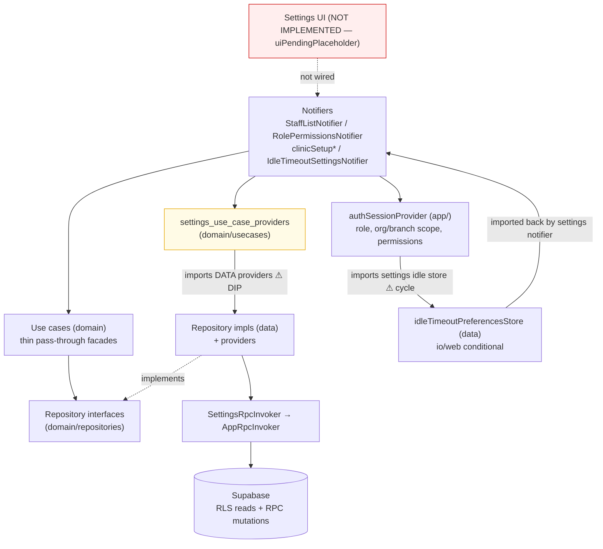

# Settings Feature Code Review

**Feature path:** `frontend/lib/features/settings`  
**Review date:** 2026-07-05  
**Architecture:** Clean Architecture + Riverpod (`domain` / `data` / `application` / `presentation`)  
**Review scope:** All 49 feature files + app-layer integration (`repository_providers`, `auth_session_provider`, `auth_route_guard`, `router`, `app_routes`, `shell_nav_config`), cross-feature overlap (`setup`, `appointments`, `shifts`), and settings test suite.

---

## Executive Summary

### Overall Verdict: **Conditionally Acceptable — Fix Dependency Direction & Coupling Before GA; Complete or Prune Presentation Layer**

The settings data/RPC layers are structurally sound, but the **domain layer is anemic**: use cases are one-line pass-throughs with validation leaking into repository implementations. Presentation is unwired scaffolding with latent notifier bugs.

Four cross-cutting problems dominate:

1. **Presentation is unwired.** Every `/settings/*` route is a `uiPendingPlaceholder`. Four notifiers and the `SettingsTabs` model have no UI consumer.
2. **Dependency direction is violated.** `domain/usecases/settings_use_case_providers.dart` imports data-layer providers; settings ↔ app form a bidirectional cycle through the idle-timeout store.
3. **Settings domain is an undeclared shared kernel.** `BranchWorkingSchedule`, `StaffListItem`, and use-case providers are imported directly by `appointments` (9 files), `setup` (3 files), and `shifts` — contradicting NFR-006/007 in the 015 plan.

| Category | Count |
|----------|-------|
| Critical | 3 |
| High | 9 |
| Medium | 28 |
| Low | 20 |
| Clean Architecture violations | 15 |
| SOLID violations | 10 |
| Code duplication items | 14 |
| Performance items | 7 |
| Test coverage gaps | 25 |

---

## Feature Overview

### Purpose

The settings feature owns steady-state clinic administration: **organization profile** read/update, **branch** lifecycle (list/create/update/activate/delete) including per-branch **working schedule**, **staff administration** (list/detail/update/activate/delete with branch assignment + username enrichment), the **role → permission matrix** editor, and the workstation **idle-timeout** preference (persisted locally per platform). Mutations go through Supabase RPCs returning `rpc_result`; reads go through RLS-scoped PostgREST selects.

### Data Flow



### File Inventory (49 files)

| Layer | Files | Notes |
|-------|-------|-------|
| **domain/** (entities) | 15 entity/input/filter files | Rich immutable models; `fromRow` DB mapping lives here (boundary smell) |
| **domain/repositories/** | 4 interfaces | Clean interfaces (depend only on domain + `core/rpc`) |
| **domain/usecases/** | 15 pass-through use cases + `settings_use_case_providers` | ⚠ Providers file imports **data** layer |
| **data/** | 8 files (4 repos + RPC invoker + idle store) | Impls + providers; consistent RPC pattern |
| **application/** | `idle_timeout_settings_notifier`, `settings_rpc_messages` | Notifier home split from presentation |
| **presentation/providers/** | 3 notifiers | Not consumed by any widget |
| **presentation/models/** | `settings_tab` | Tab catalog; no tab-bar widget consumes it |

---

## 1. Critical Issues

### C1. `StaffListNotifier.reload()` completes before data is fetched

- **Severity:** Critical
- **Files:** `presentation/providers/staff_list_notifier.dart`
- **Evidence:**

```31:35:frontend/lib/features/settings/presentation/providers/staff_list_notifier.dart
  Future<void> reload() async {
    state = const AsyncLoading();
    ref.invalidateSelf();
  }
```

- **Why it is a problem:** `invalidateSelf()` does not await the rebuilt `build()`. The returned `Future` resolves immediately while the list fetch is still in flight.
- **Potential impact:** Callers awaiting `reload()` then reading state see stale or still-loading data.
- **Recommended solution:** `ref.invalidateSelf(); await future;` and remove the manual `state = const AsyncLoading()`.

### C3. Batch `updateRolePermissions` is not atomic; partial writes commit on RPC failure

- **Severity:** Critical
- **Files:** `data/role_permissions_repository.dart`, `presentation/providers/role_permissions_notifier.dart`, `backend/supabase/migrations/20260614100000_settings_code_review_fixes.sql`
- **Evidence:** SQL loops changes and `RETURN`s error mid-loop without `RAISE EXCEPTION`; earlier iterations commit. Notifier re-fetches and syncs UI on failure, masking partial application.
- **Why it is a problem:** Client treats batch save as all-or-nothing; server can partially apply permission changes.
- **Potential impact:** Security-relevant permission grants changed while user sees failure message.
- **Recommended solution:** `RAISE EXCEPTION` on mid-loop error, or validate entire payload before any writes; surface "state may be inconsistent" on failure.

### C2. `RolePermissionsNotifier.saveChanges` reverts a successful save on `reloadContext()` failure

- **Severity:** Critical
- **Files:** `presentation/providers/role_permissions_notifier.dart`
- **Evidence:** `current` is captured at method start. After RPC + refetch succeed and state is updated, a thrown `reloadContext()` falls into the generic `catch`, reverting to the **pre-save** `current` and returning `false`.
- **Why it is a problem:** Permissions are persisted server-side but the UI shows failure and the old matrix.
- **Potential impact:** Administrator retries unnecessarily; successful `saveMessage` is never shown.
- **Recommended solution:** Treat post-mutation `reloadContext()` failure as a soft warning; keep post-save state and return `true`.

---

## 2. High Priority Issues

### H1. Domain layer imports the data layer (DIP inversion)

- **Severity:** High
- **Files:** `domain/usecases/settings_use_case_providers.dart`; `data/{branch,staff_admin,organization,role_permissions}_repository.dart`
- **Evidence:**

```3:6:frontend/lib/features/settings/domain/usecases/settings_use_case_providers.dart
import 'package:ai_clinic/features/settings/data/branch_repository.dart';
import 'package:ai_clinic/features/settings/data/organization_repository.dart';
import 'package:ai_clinic/features/settings/data/role_permissions_repository.dart';
import 'package:ai_clinic/features/settings/data/staff_admin_repository.dart';
```

- **Why it is a problem:** Clean Architecture requires dependencies point inward — `domain` must not know about `data`. Composition/DI wiring belongs in an outer layer.
- **Potential impact:** Domain cannot be unit-tested in isolation from Supabase-backed impls; mirrors the auth review violation — now a systemic pattern.
- **Recommended solution:** Move `settings_use_case_providers.dart` to `application/` (or `data/`). Domain retains only entities, interfaces, and framework-free use-case classes.

### H2. settings ↔ app feature-level cycle via idle-timeout

- **Severity:** High
- **Files:** `app/providers/auth_session_provider.dart` ↔ `application/idle_timeout_settings_notifier.dart`
- **Evidence:**

```13:13:frontend/lib/app/providers/auth_session_provider.dart
import 'package:ai_clinic/features/settings/data/idle_timeout_preferences_store.dart';
```

```3:5:frontend/lib/features/settings/application/idle_timeout_settings_notifier.dart
import 'package:ai_clinic/features/settings/data/idle_timeout_preferences_store.dart';
import 'package:ai_clinic/features/settings/domain/idle_timeout_config.dart';
import 'package:ai_clinic/app/providers/auth_session_provider.dart';
```

- **Why it is a problem:** Idle-timeout responsibility is smeared across `core/`, `app/`, and `features/settings/`, producing a bidirectional feature↔app dependency.
- **Potential impact:** Neither auth-session orchestrator nor settings can be extracted/tested without dragging in the other.
- **Recommended solution:** Define the idle-preference contract (`IdleTimeoutPreferencesStore` interface + `idleTimeoutServiceProvider`) in `core/auth/`. Both `app/auth_session_provider` and settings depend downward onto `core`.

### H3. Settings domain acting as an undeclared shared kernel

- **Severity:** High
- **Files:** consumers in `features/appointments/**` (9 files), `features/setup/**` (3 files), `features/shifts` (via staff types)
- **Evidence:** `BranchWorkingSchedule` imported by appointments (`appointment_working_hours`, `appointment_settings`, `appointment_calendar_display`, etc.) and setup (`bootstrap_branch_input`, `setup_step_readiness`, `setup_notifier`). `StaffListItem` / `StaffListFilter` imported by appointment queue/calendar providers and `doctor_dev_seed_service`.
- **Why it is a problem:** The 015 plan states a feature should expose "only its repository + providers" as the single cross-feature coupling (NFR-006/007). Settings instead exports scheduling/staff domain types consumed widely.
- **Potential impact:** Changes to `BranchWorkingSchedule` or `StaffListItem` are cross-feature breaking changes with no ownership boundary.
- **Recommended solution:** Promote shared types into a neutral `core/`/`shared/` domain module, or formalize settings as owner and route access through a published contract.

### H7. `updateBranch` silently clears `code` when omitted (backend contract asymmetry)

- **Severity:** High
- **Files:** `data/branch_repository.dart`, `backend/supabase/migrations/20260528141000_branch_working_schedule_required.sql`
- **Evidence:** Dart omits `p_code` when null; SQL sets `code = NULLIF(trim(p_code), '')` while `address`/`phone`/`mapsUrl` use `COALESCE` to preserve existing values.
- **Potential impact:** Partial field-update UI will wipe branch codes.
- **Recommended solution:** Align SQL with `COALESCE` or require `code` always on update; add boundary test.

### H8. `_loadUsernamesByStaffId` swallows all exceptions with zero logging

- **Severity:** High
- **Files:** `data/staff_admin_repository.dart` (138-164)
- **Evidence:** `catch (_) { return const {}; }` with no `AppLog` — unlike every other RPC path.
- **Potential impact:** Missing usernames indistinguishable from config/network failures.
- **Recommended solution:** Log before fallback; narrow catch to expected exception types.

### H9. `RpcResult`/`RpcFailure` leak into domain repository interfaces

- **Severity:** High
- **Files:** `domain/repositories/{branch,staff_admin}_repository.dart`, `core/rpc/rpc_result.dart`
- **Evidence:** `setBranchActive`/`deleteBranch` return `Future<RpcResult>`; failures already thrown as `RpcFailure`; `.success` never checked.
- **Recommended solution:** Return `Future<void>`; map to domain failure type at data boundary.

### H6. Business-rule validation lives in the data layer, not domain

- **Severity:** High
- **Files:** `domain/usecases/{create_branch,update_branch,update_organization,update_staff_member}.dart` vs `data/{branch,organization,staff_admin}_repository.dart`
- **Evidence:** Use cases are one-line delegations; "name required," "branchIds non-empty," etc. are enforced only in `*RepositoryImpl` (e.g. `branch_repository.dart:54-60`).
- **Why it is a problem:** Domain invariants are coupled to the Supabase implementation; alternate repository impls skip validation; `domain/usecases/` has zero unit tests for these rules.
- **Potential impact:** Rules cannot be tested in isolation; error messages drift per call site.
- **Recommended solution:** Move validation into input types or use-case `call()` before delegating to repositories.

### H5. `IdleTimeoutSettingsNotifier` has no concurrency guard on saves

- **Severity:** High
- **Files:** `application/idle_timeout_settings_notifier.dart`, `data/idle_timeout_preferences_store_io.dart`
- **Evidence:** `_persistAndApply` never checks `current.isSaving`. Overlapping preset taps can race read-modify-write on `clinic-settings.json` with no locking.
- **Why it is a problem:** Last-write-wins may not match last user action; `isSaving` can stick `true` when validation errors race with in-flight saves.
- **Potential impact:** Security-relevant idle-timeout value silently wrong or UI stuck saving.
- **Recommended solution:** Guard `if (current.isSaving) return;`; serialize or debounce disk writes.

### H4. Entire settings presentation is unrendered (placeholders)

- **Severity:** High (maturity)
- **Files:** `app/router.dart` (~lines 148–185), all `/settings/*` builders
- **Evidence:** Every settings route resolves to `uiPendingPlaceholder('Settings', state)`. No widget reads `staffListProvider`, `rolePermissionsProvider`, `clinicSetup*`, or `SettingsTabs`.
- **Why it is a problem:** Presentation notifiers, tab model, and RPC-message mappers exist but are dead relative to the running app.
- **Potential impact:** End-to-end flow (UI → use case → repo → data source) is unverifiable through the router; large surface ships untested-in-context.
- **Recommended solution:** Implement settings pages consuming existing notifiers, or quarantine unwired code behind a feature flag until UI lands.

---

## 3. Medium Priority Issues

### M1. DB-row mapping (`fromRow`) lives in domain entities

- **Severity:** Medium
- **Files:** `domain/{organization_profile,branch_list_item,staff_list_item,staff_member_detail,permission_matrix_row}.dart`, `domain/branch_working_schedule.dart`
- **Evidence:** Domain entities parse raw Supabase maps with snake_case wire keys via `fromRow` factories.
- **Why it is a problem:** Wire-format knowledge is a data-layer concern; domain entities should be persistence-ignorant.
- **Potential impact:** Schema/column renames force domain edits.
- **Recommended solution:** Introduce thin data-layer DTOs/mappers; keep domain entities constructor-only.

### M2. Inconsistent authorization model across settings tabs

- **Severity:** Medium
- **Files:** `core/auth/auth_route_guard.dart`, `presentation/providers/role_permissions_notifier.dart`
- **Evidence:** Org settings + permission matrix gate on `role == StaffRole.administrator`; branch + staff management gate on permission keys. `RolePermissionsNotifier` re-derives `editable = role == administrator` after passing `canAccessPermissionMatrix`.
- **Why it is a problem:** Two authorization philosophies coexist; admin rule is double-encoded.
- **Potential impact:** Permissions granted via the matrix cannot unlock org/permission tabs.
- **Recommended solution:** Standardize on permission keys; derive `editable` from a single guard call.

### M3. Repository scoping inconsistency (org filter)

- **Severity:** Medium
- **Files:** `data/staff_admin_repository.dart` vs `data/branch_repository.dart`
- **Evidence:** `listBranches({required organizationId})` filters explicitly; `listStaff()` relies solely on RLS.
- **Why it is a problem:** Sibling repos use divergent tenancy strategies.
- **Potential impact:** Latent risk if RLS coverage differs between `staff_members` and `branches`.
- **Recommended solution:** Pick one convention and document it in `SettingsRpcInvoker`.

### M4. Non-reactive vs reactive auth reads

- **Severity:** Medium
- **Files:** `presentation/providers/staff_list_notifier.dart`, `role_permissions_notifier.dart` vs `clinic_setup_providers.dart`
- **Evidence:** `StaffListNotifier` / `RolePermissionsNotifier` use `ref.read(authSessionProvider)`; `clinicSetup*` use `ref.watch(authSessionProvider.select(...))`.
- **Why it is a problem:** `read` snapshots auth once; providers won't auto-rebuild on context refresh.
- **Potential impact:** Stale staff list / matrix after `reloadContext()` unless manually invalidated.
- **Recommended solution:** Use `ref.watch(...select(...))` on consumed fields.

### M5. Cross-feature reach into settings DI (use-case providers)

- **Severity:** Medium
- **Files:** `appointments/presentation/providers/{appointment_calendar_provider,appointment_queue_provider,appointment_queue_shift_provider}.dart`
- **Evidence:** Direct import of `features/settings/domain/usecases/settings_use_case_providers.dart`.
- **Why it is a problem:** Other features depend on settings' internal DI wiring (and transitively on settings' data layer via H1).
- **Potential impact:** Refactoring settings DI breaks appointments.
- **Recommended solution:** Expose a narrow published provider surface for cross-feature reads.

### M6. `repository_providers` barrel is bypassed

- **Severity:** Medium
- **Files:** `app/providers/repository_providers.dart`, appointments/setup consumers
- **Evidence:** Barrel comment says features should import from here; appointments import settings use-case providers and domain paths directly.
- **Recommended solution:** Route all cross-feature settings access through the barrel; enforce with an import lint.

### M7. `StaffListQuery` is dead code

- **Severity:** Medium
- **Files:** `domain/staff_list_query.dart`, `presentation/providers/staff_list_notifier.dart`
- **Evidence:** Rich client-side search/role/branch filtering referenced only by its own test; `StaffListNotifier` always fetches `StaffListFilter.all`.
- **Recommended solution:** Wire into list UI or remove.

### M8. idle-timeout provider ownership

- **Severity:** Medium
- **Files:** `app/providers/auth_session_provider.dart`, `application/idle_timeout_settings_notifier.dart`
- **Evidence:** `idleTimeoutServiceProvider` lives in auth session provider but is a settings-tuned concern.
- **Recommended solution:** See H2 — relocate contract to `core/auth/`.

### M9. `SettingsTabs` / `SettingsTabDefinition` unused

- **Severity:** Medium
- **Files:** `presentation/models/settings_tab.dart`
- **Evidence:** Tab catalog with `visibleFor(auth)` gating has no tab-bar consumer.
- **Recommended solution:** Implement settings hub UI or remove until needed.

### M10. Guards wired but authorization model inconsistent

- **Severity:** Medium
- **Files:** `core/auth/auth_route_guard.dart`, `app/router.dart`
- **Evidence:** `adminSettingsRedirect` correctly invoked; route classification well tested (`app_routes_settings_test.dart`). Substantive issue is M2.
- **Recommended solution:** Unify authorization (M2).

### M11. `ClinicSetupProviders` skip client-side permission gating

- **Severity:** Medium
- **Files:** `presentation/providers/clinic_setup_providers.dart`
- **Evidence:** Unlike `StaffListNotifier` and `RolePermissionsNotifier`, clinic-setup providers fetch org profile without checking `canAccessOrganizationSettings`.
- **Potential impact:** Branch managers on the clinic-setup tab may hit RLS errors or see data other notifiers would hide.
- **Recommended solution:** Gate each provider behind the matching `AuthRouteGuard` check.

### M12. `discardChanges()` missing `isSaving` guard

- **Severity:** Medium
- **Files:** `presentation/providers/role_permissions_notifier.dart`
- **Evidence:** `setLocalGrant` blocks during save; `discardChanges` does not.
- **Recommended solution:** Add `|| current.isSaving` to early return.

### M13. Dead RPC message mappers for org/branch/staff mutations

- **Severity:** Medium
- **Files:** `application/settings_rpc_messages.dart`
- **Evidence:** `organizationMessageForRpc`, `branchMessageForRpc`, `staffMessageForRpc` have zero callers; write-side notifiers were never built.
- **Recommended solution:** Wire write notifiers or track as explicit follow-up.

### M14. Feature `application/` layer imports `app/providers/auth_session_provider.dart`

- **Severity:** Medium
- **Files:** All settings notifiers
- **Evidence:** Presentation and application layers reach into the app composition root for session/idle service.
- **Recommended solution:** Narrow ports in `settings/domain`; bind in `app/`.

### M15. Full permission matrix deep-copy on every cell toggle

- **Severity:** Medium
- **Files:** `domain/permission_matrix_view.dart`, `role_permissions_notifier.dart`
- **Evidence:** `withGrant` deep-copies entire `grantsByRoleAndKey` map per click.
- **Recommended solution:** Copy only the affected row; use per-cell `select` once UI exists.

### M16. Idle-timeout loading duplicated between auth session and settings notifier

- **Severity:** Medium
- **Files:** `app/providers/auth_session_provider.dart`, `application/idle_timeout_settings_notifier.dart`
- **Evidence:** Both independently load from store and call `updateIdleDuration`.
- **Recommended solution:** Single canonical loader via `idleTimeoutSettingsProvider`.

### M17. `_parseIsActive` duplicated with logic drift in `BranchWorkingDayHours.fromJson`

- **Severity:** Medium (real parsing bug)
- **Files:** `domain/branch_working_schedule.dart` vs `domain/{branch_list_item,staff_list_item,staff_member_detail,permission_matrix_row}.dart`
- **Evidence:** Four files accept `'t'`/`'1'` strings; `BranchWorkingDayHours.fromJson` only accepts literal `1` or `'true'`.
- **Potential impact:** Working days silently parsed as closed if wire format differs.
- **Recommended solution:** Single shared `parseTruthy()` in `core/utils/`.

### M18. `BranchListItem.normalizeCode` is dead code on the write path

- **Severity:** Medium
- **Files:** `domain/branch_list_item.dart`, `data/branch_repository.dart`
- **Evidence:** `normalizeCode` documented for uniqueness checks but never called; repo sends raw trimmed `input.code`.
- **Recommended solution:** Apply on create/update or remove if server-only.

### M19. `hasConfiguredWorkingHours` used by setup but not settings branch CRUD

- **Severity:** Medium
- **Files:** `domain/branch_working_schedule.dart`, `features/setup/domain/setup_step_readiness.dart`
- **Evidence:** Setup wizard gates on this invariant; `CreateBranch`/`UpdateBranch` and `BranchRepositoryImpl` do not.
- **Potential impact:** Settings branch management will fail server-side with worse UX than setup once UI ships.
- **Recommended solution:** Enforce in use cases before network calls.

### M20. No cross-field validation: `primaryBranchId` vs `branchIds`

- **Severity:** Medium
- **Files:** `domain/update_staff_member_input.dart`, `data/staff_admin_repository.dart`
- **Evidence:** Nothing verifies `primaryBranchId` is in `branchIds` when non-null.
- **Recommended solution:** Validate in input or `UpdateStaffMember.call()`.

### M21. `FetchPermissionMatrix` returns raw rows; `fromRows` duplicated 3× in presentation

- **Severity:** Medium
- **Files:** `domain/usecases/fetch_permission_matrix.dart`, `role_permissions_notifier.dart`
- **Recommended solution:** Use case should return `PermissionMatrixView` directly.

### M22. Inconsistent local-validation exception types (`StateError` vs `RpcFailure`)

- **Severity:** Medium
- **Files:** `data/role_permissions_repository.dart` vs other repos
- **Evidence:** `updateRolePermission` throws `StateError` for empty key; others throw `RpcFailure(INVALID_INPUT)`.
- **Recommended solution:** Standardize on `RpcFailure`.

### M23. Staff-branch enrichment doesn't filter soft-deleted branches

- **Severity:** Medium
- **Files:** `data/staff_admin_repository.dart` (`_loadBranchesByStaffId`)
- **Evidence:** `is_deleted` checked on assignment row, not joined `branches` row (contrast `listBranches`).
- **Recommended solution:** Use `branches!inner` with `is_deleted = false` filter.

### M24. Stale migration hint for 5+ settings RPCs

- **Severity:** Medium
- **Files:** `data/settings_rpc_repository.dart`
- **Evidence:** Single hint `20260522100000_org_branch_management.sql` for all RPCs spanning six migrations.
- **Recommended solution:** Per-function hint map or generic "settings migrations" message.

### M25. Web idle-timeout store only catches `Exception`, not `Error`

- **Severity:** Medium
- **Files:** `data/idle_timeout_preferences_store_web.dart`
- **Evidence:** Corrupt `SharedPreferences` type can throw `TypeError` uncaught.
- **Recommended solution:** Widen catch to match IO defensiveness.

### M26. Non-atomic read-modify-write race in IO idle-timeout store

- **Severity:** Medium
- **Files:** `data/idle_timeout_preferences_store_io.dart`
- **Evidence:** Read-merge-write with no lock; races with concurrent saves (see H5).
- **Recommended solution:** Serialize writes; atomic temp-file + rename.

---

## 4. Low Priority Issues

### L1. `StaffMemberDetail` lacks `copyWith`

- **Files:** `domain/staff_member_detail.dart`, `data/staff_admin_repository.dart`
- **Evidence:** `fetchStaffMember` rebuilds object field-by-field to inject `username`.
- **Recommended solution:** Add `copyWith` and use it.

### L2. Notifier location split + lifecycle inconsistency

- **Files:** `application/idle_timeout_settings_notifier.dart` vs `presentation/providers/*`
- **Evidence:** `clinicSetup*` are `autoDispose`; `staffList`/`rolePermissions` are not.
- **Recommended solution:** One home for notifiers; consistent `autoDispose` policy.

### L3. Duplicated parsing helpers

- **Files:** `_parseIsActive`/`_parseIsGranted` and `optionalString` closures across 6 domain entity files.
- **Recommended solution:** Extract `WireParse.bool`/`WireParse.optionalString` into `core/utils/`.

### L4. Duplicated repository file names (interface vs impl)

- **Files:** `data/branch_repository.dart` and `domain/repositories/branch_repository.dart` (same for 3 other repos).
- **Recommended solution:** Suffix impls `*_repository_impl.dart`.

### L5. RPC message-mapper duplication

- **Files:** `application/settings_rpc_messages.dart`
- **Evidence:** Four near-identical `switch (failure.code)` functions.
- **Recommended solution:** Extract shared arms into a base mapper.

### L6. Provider lifecycle inconsistency

- **Files:** `presentation/providers/*`
- **Evidence:** See L2.
- **Recommended solution:** Standardize `autoDispose`.

### L7. Nav binding coverage gap

- **Files:** `app/shell/navigation/shell_nav_config.dart`
- **Evidence:** No direct nav entry for `settingsPermissions` / `settingsOrganization` / `settingsBranches`.
- **Recommended solution:** Add when settings hub UI is implemented.

---

## 5. Clean Architecture Violations

| ID | Violation | Severity | Files |
|----|-----------|----------|-------|
| CA-1 | Domain imports data layer providers | High | `settings_use_case_providers.dart` |
| CA-2 | settings ↔ app bidirectional coupling via idle store | High | `auth_session_provider.dart`, `idle_timeout_settings_notifier.dart` |
| CA-3 | `fromRow` DB mapping in domain entities | Medium | 6 domain entity files |
| CA-4 | Settings domain types used as cross-feature shared kernel | High | appointments, setup, shifts consumers |
| CA-5 | Presentation notifiers unwired to any UI | High | router placeholders, 4 notifiers |
| CA-6 | Appointments bypass settings notifiers, call use-case providers directly | Medium | 3 appointment providers |
| CA-7 | Anemic use cases; validation in data repos not domain | High | use cases + `*_repository.dart` |
| CA-8 | Idle timeout bypasses domain repository abstraction | Medium | `idle_timeout_preferences_store.dart` |
| CA-9 | `PermissionMatrixView.fromRows` invoked from presentation | Medium | `fetch_permission_matrix.dart`, `role_permissions_notifier.dart` |
| CA-10 | `hasConfiguredWorkingHours` enforced in setup but not settings | Medium | `branch_working_schedule.dart` |
| CA-12 | `RpcResult`/`RpcFailure` in domain interfaces | High | `domain/repositories/*.dart` |
| CA-13 | Riverpod providers declared in data layer files | Low | all `data/*_repository.dart` |
| CA-14 | `repository_providers` barrel incomplete (org/role missing) | Medium | `repository_providers.dart` |

---

## 6. SOLID Violations

| ID | Principle | Violation | Severity | Files |
|----|-----------|-----------|----------|-------|
| SOLID-1 | DIP | Domain use-case providers depend on concrete data providers | High | `settings_use_case_providers.dart` |
| SOLID-2 | SRP | Idle-timeout split across core, app, settings domain/data/application | Medium | idle-timeout files across 3 layers |
| SOLID-3 | OCP | Authorization model requires edits in multiple places (guard + notifier) | Medium | `auth_route_guard.dart`, `role_permissions_notifier.dart` |
| SOLID-5 | Anemic use cases own no domain behavior (SRP vacuous) | Medium | all `domain/usecases/*.dart` |
| SOLID-6 | `RolePermissionsRepository` exposes unused `updateRolePermission` (ISP) | Low | `role_permissions_repository.dart` |
| SOLID-7 | Idle timeout: concrete data class, no abstraction (DIP) | Medium | Finding 8 / H2 |
| SOLID-8 | `BranchRepository.listBranches` explicit orgId; mutations implicit (inconsistent interface) | Low | `branch_repository.dart` |

---

## 7. Code Duplication & Redundancy

| Item | Why duplication exists | Action | Files |
|------|------------------------|--------|-------|
| `_parseIsActive` / `_parseIsGranted` | Copy-pasted per entity `fromRow` | Extract to `WireParse` util | 5 domain entity files |
| `optionalString` closure | Repeated in each `fromRow` | Consolidate into `WireParse` | 4 domain entity files |
| RPC message mappers | Per-mutation switch with shared arms | Base mapper + feature-specific codes | `settings_rpc_messages.dart` |
| Repository filenames | Interface and impl share name | Rename impls `*_repository_impl.dart` | 4 repo pairs |
| `PermissionMatrixView.fromRows` call duplicated 3× | Use case stops short of view | Return `PermissionMatrixView` from use case | `fetch_permission_matrix.dart` |
| `isAssignedToBranch` vs `StaffListQuery` inline logic | Two branch-membership checks | Delegate or remove dead method | `staff_list_item.dart`, `staff_list_query.dart` |
| Default filter values redeclared 3× per repo | Dart default-param limitation | Document canonical source | list_branches/list_staff |
| "Field required" validation in 4 data repos | No domain validation home | Move to domain (H6) | `*_repository.dart` |

---

## 8. Performance Issues

| ID | Issue | Severity | Evidence | Impact |
|----|-------|----------|----------|--------|
| P-1 | Staff list fetches all staff without client filter | Low | `StaffListNotifier` uses `StaffListFilter.all`; `StaffListQuery` unused | Unnecessary data transfer for large clinics once UI ships |
| P-2 | `fetchStaffMember` may trigger extra username lookup query | Low | `staff_admin_repository.dart` enriches username post-fetch | Extra round-trip per detail view |
| P-3 | Permission matrix O(n) copy per toggle | Medium | `permission_matrix_view.withGrant` | Jank once UI ships with large catalog |
| P-5 | `PermissionMatrixView.hasDefinedCell` uses `List.contains` in nested loops | Low | `permission_matrix_view.dart` | O(n²) equality/hashing if catalog grows |
| P-6 | `listStaff` enrichment queries run sequentially not parallel | Low | `staff_admin_repository.dart` | 3 round-trips instead of 2 |
| P-4 | Redundant idle-duration disk read on sign-in + provider rebuild | Low | `auth_session_provider` + `idle_timeout_settings_notifier` | Extra file I/O per session |

---

## 9. Test Coverage Gaps

| Gap | Severity | Evidence |
|-----|----------|----------|
| `StaffListNotifier` has zero tests | High | `reload()` race (C1) completely untested |
| `clinicSetup*` providers untested | Medium | No dedicated test files |
| `settings_tab.dart` untested | Low | `visibleFor` / `byId` logic unverified |
| End-to-end settings page flow untestable | High | All routes are placeholders |
| `StaffListQuery` tested in isolation only | Medium | Only referenced by its own unit test |
| No widget/integration test for settings redirect + guard | Medium | `app_routes_settings_test.dart` covers route classification only |
| `reloadContext()`-after-success failure untested | High | C2 bug has no regression test |
| Concurrent idle-timeout saves untested | High | H5 race has no regression test |
| Dead RPC message mappers untested | Medium | org/branch/staff mappers unreferenced |
| `role_permissions_notifier` partial gaps | Medium | No `discardChanges` during save, no `clearSaveMessage` test |
| `idle_timeout_settings_notifier` partial gaps | Medium | No `selectPresetMinutes`, no persistence-failure path |
| `updateRolePermissions` batch has zero tests | Critical | Production save path; C3 untested |
| `updateBranch` omit-code behavior untested | High | H7 landmine undetected |
| `_loadUsernamesByStaffId` silent-catch untested | High | H8 fallback unverified |
| `_loadBranchesByStaffId` enrichment untested | Medium | Branch labels never asserted in unit tests |
| IO idle-timeout store has no unit test | Medium | File-based load/save/race paths uncovered |
| Fake test clients ignore `.select()` columns | Medium | Column typos pass unit tests silently |
| `domain/usecases/` has zero unit tests | High | All 15 use cases untested; validation only tested at data layer |
| `BranchWorkingDayHours.fromJson` string forms untested | Medium | `'t'`/`'1'` bug (M17) undetected |
| `UpdateStaffMemberInput` cross-field consistency untested | Medium | No `primaryBranchId` vs `branchIds` test |
| `PermissionMatrixView.fromRows` duplicate rows untested | Low | Silent overwrite on duplicate `(role, key)` |
| `BranchListItem.normalizeCode` E2E untested | Low | Dead on write path (M18) |

**Existing coverage (positive):** `role_permissions_notifier_test.dart`, `idle_timeout_settings_notifier_test.dart`, `settings_rpc_repository_test.dart`, `app_routes_settings_test.dart`, entity parsing tests in domain test files.

---

## 10. Recommended Refactoring

### Phase 0 — Correctness blockers (before wiring UI)

1. Fix batch `update_role_permissions` atomicity — SQL `RAISE EXCEPTION` or pre-validate (C3).
2. Fix `StaffListNotifier.reload()` to `await future` (C1).
3. Fix `RolePermissionsNotifier.saveChanges` post-success error handling (C2).
4. Clarify/fix `updateBranch` code preservation contract (H7).
5. Add `isSaving` guard to `IdleTimeoutSettingsNotifier._persistAndApply` (H5).
6. Log in `_loadUsernamesByStaffId` catch path (H8).

### Phase 1 — Dependency direction & coupling (before more features consume settings)

1. Move `settings_use_case_providers.dart` from `domain/usecases/` to `application/` (H1).
2. Break settings↔app cycle: relocate idle-preference contract + `idleTimeoutServiceProvider` into `core/auth/` (H2, M8).
3. Extract shared scheduling/staff types into neutral `core/shared/` module; route `appointments`/`setup`/`shifts` through published surface (H3, M5, M6).

### Phase 2 — Domain validation & consistency

4. Move field validation from data repos into domain inputs/use cases (H6).
5. Enforce `hasConfiguredWorkingHours` in branch CRUD use cases (M19).
6. Unify authorization on permission keys for all settings tabs (M2, M10).
7. Normalize repository tenancy scoping across `listStaff`/`listBranches` (M3).
8. Move `fromRow` into data-layer DTOs (M1).
9. Consolidate `parseTruthy`/`optionalString`; add `StaffMemberDetail.copyWith`; make auth reads reactive (M4, M17, L1–L3).
10. Return `PermissionMatrixView` from `FetchPermissionMatrix` (M21).

### Phase 3 — Presentation completion or quarantine

11. Implement settings pages consuming existing notifiers, or feature-flag unwired code (H4, M9, L7).
12. Wire `StaffListQuery` into list UI or delete (M7).
13. Add `StaffListNotifier` and `clinicSetup*` provider tests; add widget test for a real settings page.

### Phase 4 — Hygiene

14. Rename repository impls to `*_repository_impl.dart` (L4).
15. Deduplicate RPC message mappers (L5).
16. Remove dead `updateRolePermission` singular API or document intent.
17. Add import-boundary lint forbidding deep imports into `features/settings/{data,domain/usecases}` from other features.

---

## Appendix: End-to-End Data Flow Consistency

For **wired** paths the flow is uniform:

```
Notifier → *UseCaseProvider → UseCase(call) → RepositoryInterface
        → RepositoryImpl (AppRpcInvoker, SettingsRpcInvoker)
        → invokeSettingsRpc → Supabase RPC (rpc_result) | RLS select
```

Consistency is strong at the data boundary. The break is at the top (H4: no presentation consumer) and the side-channel is M5 (appointments call settings use-case providers directly).

---

*Review sources (first cycle): [integration architecture](bd125584-8f8f-4b5c-b302-dfbe85a4a8d4), [presentation & application](1a8ebdf9-3f80-4528-85e1-3631a67bec66), [domain layer](3f448dde-02cb-4ddb-992b-7e2eed6fe0d4), and [data layer](1a7dfa0b-8121-4171-bebb-39542fcc1858) passes merged.*

---

# Second-Cycle Review (2026-07-05)

**Method:** Four parallel skeptical passes — [domain](./settings-second-cycle-domain.md), [data](./settings-second-cycle-data.md), [presentation & application](./settings-second-cycle-presentation.md), [integration](./settings-second-cycle-integration.md). Every in-scope file re-read; first-cycle findings re-verified against current code.

## Second-Cycle Executive Summary

### Verdict: **No First-Cycle Blockers Fixed — Do Not Wire Settings UI Until Correctness & Boundary Issues Are Resolved**

All three first-cycle **Critical** defects remain unfixed. Four cross-cutting problems from cycle 1 are unchanged:

1. **Presentation is unwired** — every `/settings/*` route is still `uiPendingPlaceholder`; notifiers have no UI consumer.
2. **Dependency direction is violated** — `settings_use_case_providers.dart` still imports data-layer providers; settings ↔ app idle-timeout cycle persists.
3. **Settings domain is an undeclared shared kernel** — appointments (11 files) and setup (3 files) import settings domain types and DI wiring directly.
4. **Batch permission saves are not atomic** — SQL partial commits on mid-loop failure; presentation masks inconsistency on refetch.

| Layer | Critical | High | Medium |
|-------|----------|------|--------|
| Presentation & application | 2 | 5 | 11 |
| Data | 1 | 6 | 11 |
| Domain | 0 | 4 | 12 |
| Integration | 1* | 7 | 10 |
| **Deduplicated unique** | **3** | **12** | **~22** |

\*Integration Critical (INT-C1) is the same defect as first-cycle C2.

### First-Cycle Status: **0 Fixed, 3 Critical Confirmed, All High/Medium Integration Items Confirmed**

No first-cycle finding in any layer was fixed since the initial review. Shifts had no direct settings imports (first-cycle H3 claim was **nuanced** — coupling is indirect via appointments).

---

## Second-Cycle Critical Issues (Deduplicated)

### C1. `StaffListNotifier.reload()` completes before data is fetched

- **Status:** CONFIRMED STILL PRESENT
- **Layers:** Presentation, Integration
- **Impact:** Callers awaiting `reload()` see stale or in-flight data; blocks reliable staff-management UI integration.
- **Fix:** `ref.invalidateSelf(); await future;`

### C2. `RolePermissionsNotifier.saveChanges` reverts successful persistence on post-mutation failure

- **Status:** CONFIRMED STILL PRESENT (scope expanded to post-RPC refetch failure, not only `reloadContext()`)
- **Layers:** Presentation, Integration
- **Impact:** Permissions committed server-side; UI shows failure and pre-save matrix; session may be stale.
- **Fix:** Treat post-save refetch/`reloadContext()` failure as soft warning; keep post-save state; return `true`.

### C3. Batch `update_role_permissions` is not atomic

- **Status:** CONFIRMED STILL PRESENT
- **Layers:** Data, SQL
- **Impact:** Partial permission commits on batch failure; security-relevant grants may diverge from administrator intent.
- **Fix:** Pre-validate entire payload or `RAISE EXCEPTION` mid-loop; add backend partial-failure test.

---

## Second-Cycle High Priority Issues (Deduplicated)

| ID | Finding | Status | Layer |
|----|---------|--------|-------|
| H1 | Domain `settings_use_case_providers` imports data layer (DIP) | CONFIRMED | Domain, Integration |
| H2 | settings ↔ app bidirectional cycle via idle-timeout store | CONFIRMED | Integration |
| H3 | Settings domain as undeclared shared kernel (appointments/setup) | CONFIRMED | Domain, Integration |
| H4 | All `/settings/*` routes are `uiPendingPlaceholder` | CONFIRMED | Presentation, Integration |
| H5 | `IdleTimeoutSettingsNotifier` no `isSaving` concurrency guard | CONFIRMED | Presentation |
| H6 | Business validation in data repos, not domain/use cases | CONFIRMED | Domain, Data |
| H7 | `updateBranch` wipes `code` when field omitted (SQL `NULLIF` vs `COALESCE`) | CONFIRMED | Data |
| H8 | `_loadUsernamesByStaffId` swallows errors with no logging | CONFIRMED | Data |
| H9 | `RpcResult`/`RpcFailure` leak through domain repository interfaces | CONFIRMED | Domain, Data |
| H10 | Batch `updateRolePermissions` skips empty-key validation (singular path has it) | **NEW** | Data |
| H11 | Username enrichment failure indistinguishable from permission denial | **NEW** | Data |
| H12 | `discardChanges()` during in-flight save not blocked | **NEW** | Presentation |

---

## Second-Cycle Medium Priority Issues (Selected — New or Cross-Cutting)

| ID | Finding | Status | Layer |
|----|---------|--------|-------|
| M1 | Dual authorization model (role vs permission keys) | CONFIRMED | Integration |
| M2 | `SettingsTabs.visibleFor` missing staff/roles auth gates | CONFIRMED + NEW nuance | Presentation, Integration |
| M3 | Shell sidebar Staff nav always visible without permission filter | **NEW** | Integration |
| M4 | `clinicSetup*` providers fetch without permission gates | CONFIRMED | Presentation, Integration |
| M5 | Non-reactive `ref.read(authSessionProvider)` in staff/role notifiers | CONFIRMED | Presentation, Integration |
| M6 | Triple idle-timeout load path (app bootstrap + auth + notifier) | CONFIRMED | Integration |
| M7 | `StaffListQuery` dead code | CONFIRMED | Domain |
| M8 | `hasConfiguredWorkingHours` not enforced in branch CRUD use cases | CONFIRMED | Domain |
| M9 | `FetchPermissionMatrix` returns raw rows; view assembly in presentation | CONFIRMED | Domain |
| M10 | `fromRow` DB mapping in domain entities | CONFIRMED | Domain |
| M11 | Staff-branch enrichment includes soft-deleted branch labels | CONFIRMED | Data |
| M12 | IO idle store non-atomic RMW + no save error handling | CONFIRMED + NEW | Data |
| M13 | Invalid PostgREST rows silently dropped in list parsers | **NEW** | Data |
| M14 | Zero `StaffListNotifier` / `clinicSetup*` / `SettingsTabs` tests | CONFIRMED | Presentation, Integration |
| M15 | No GoRouter integration test for settings admin redirects | **NEW** | Integration |
| M16 | `repository_providers` barrel incomplete (2 of 4 repos) and bypassed | CONFIRMED | Integration |
| M17 | `SettingsTabBar` referenced in doc comment but does not exist | CONFIRMED | Presentation |
| M18 | Settings domain couples to auth `StaffRole` enum | **NEW** | Domain |
| M19 | Domain entities import `package:flutter/foundation.dart` (`@immutable`) | **NEW** | Domain |
| M20 | Zero unit tests for domain use cases; validation only at repository layer | **NEW** | Domain |

Full medium-tier detail per layer is in the linked second-cycle documents.

---

## Second-Cycle Recommended Fix Order

### Phase 0 — Correctness blockers (before wiring UI)

1. Fix C3 — SQL atomicity for `update_role_permissions`.
2. Fix C1 — `StaffListNotifier.reload()` await pattern.
3. Fix C2 — `saveChanges` post-mutation soft-fail handling.
4. Fix H7 — `update_branch` code preservation contract.
5. Fix H5 — `isSaving` guard on `IdleTimeoutSettingsNotifier`.
6. Fix H10 — batch empty-key pre-validation.
7. Fix H12 — block `discardChanges()` during save.

### Phase 1 — Authorization & nav consistency (before settings shell)

8. Unify authorization model (M1); align `SettingsTabs.visibleFor` and shell nav (M2, M3).
9. Gate `clinicSetup*` providers (M4).
10. Make staff/role notifiers reactive to auth changes (M5).

### Phase 2 — Boundary cleanup

11. Move `settings_use_case_providers.dart` to `application/` (H1).
12. Break idle-timeout cycle via `core/auth/` (H2, M6).
13. Extract shared types or published read API (H3, H11).
14. Complete `repository_providers` barrel; forbid deep cross-feature imports (M16).

### Phase 3 — Wire presentation & test

15. Replace router placeholders with settings shell (H4).
16. Add notifier, guard, and GoRouter integration tests (M14, M15).

---

## Second-Cycle Layer Reports

| Pass | Document | Critical | High | Medium |
|------|----------|----------|------|--------|
| Domain | [settings-second-cycle-domain.md](./settings-second-cycle-domain.md) | 0 | 4 | 12 |
| Data | [settings-second-cycle-data.md](./settings-second-cycle-data.md) | 1 | 6 | 11 |
| Presentation | [settings-second-cycle-presentation.md](./settings-second-cycle-presentation.md) | 2 | 5 | 11 |
| Integration | [settings-second-cycle-integration.md](./settings-second-cycle-integration.md) | 1 | 7 | 10 |

---

*Second-cycle review: four parallel passes merged 2026-07-05. No first-cycle findings were remediated between cycles.*
