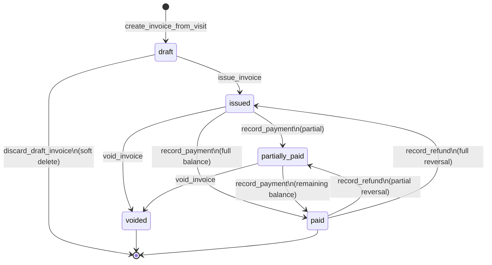

# Invoice Status Cycle

This document explains how invoice statuses work in AiClinic billing (V1-6): what each status means, how invoices move between statuses, and which operations are allowed in each state.

**Related docs:** [`data-model.md`](./data-model.md), [`contracts/billing-mutations.md`](./contracts/billing-mutations.md), [`docs/architecture/15-billing.md`](../../architecture/15-billing.md)

---

## Statuses

Invoices use a PostgreSQL enum with exactly five values. There is **no** `overdue` or `cancelled` status in V1-6.

| Status | DB value | Meaning |
| ------ | -------- | ------- |
| **Draft** | `draft` | Invoice created from a completed visit; editable; not yet assigned an invoice number. |
| **Issued** | `issued` | Finalized and numbered; awaiting payment. Line items are frozen. |
| **Partially paid** | `partially_paid` | At least one payment recorded, but balance remains greater than zero. |
| **Paid** | `paid` | Balance is zero or less. No further payments required. |
| **Voided** | `voided` | Cancelled with a reason. Terminal and locked — no further mutations. |

The Flutter domain enum mirrors this in `frontend/lib/features/billing/domain/invoice_status.dart`.

---

## Balance drives payment statuses

Payment-related statuses (`issued`, `partially_paid`, `paid`) are derived from the invoice balance:

```
balance = subtotal − discount_amount − insurance_covered_amount − sum(payments.amount)
```

- **Original due** (amount owed before any payments): `subtotal − discount_amount − insurance_covered_amount`
- Payments are **positive**; refunds are stored as **negative** payment rows (append-only ledger).
- Overpayment is rejected — balance cannot go below zero on payment.
- `paid` means `balance ≤ 0` (in practice, balance equals zero).

---

## Lifecycle diagram



ASCII equivalent:

```
                    issue_invoice
       draft  ─────────────────────►  issued
         │                                │
         │ discard_draft_invoice          │ record_payment (partial)
         │ (soft delete)                  ▼
         ▼                           partially_paid
      (removed)                           │
                                          │ record_payment (final)
                                          ▼
                                        paid
                                          │
         void_invoice (issued or          │ record_refund
         partially_paid only)             ▼
              │                    partially_paid | issued
              ▼
           voided  (terminal)
```

---

## Transitions in detail

### 1. Draft → Issued

**RPC:** `issue_invoice`

**Trigger:** Staff issues a draft invoice after adding line items.

**Requirements:**
- Invoice is in `draft`
- At least one line item exists
- Branch has a `code` set (for invoice number generation, e.g. `INV-MAIN-000042`)
- Caller has `invoices.create`

**Effect:**
- Assigns `invoice_number` and sets `issued_at`
- Freezes `subtotal`, discounts, and line items (no further edits)
- Sets `status = 'issued'`

---

### 2. Draft → Removed (not a status)

**RPC:** `discard_draft_invoice`

**Trigger:** Staff discards an unwanted draft before issue.

**Effect:**
- Soft-deletes the invoice and its items (`deleted_at` set)
- Frees the visit so a new invoice can be created
- Does **not** set status to `voided` — the record is simply excluded from operational queries

---

### 3. Issued → Partially paid

**RPC:** `record_payment`

**Trigger:** A payment is recorded for less than the full current balance.

**Requirements:**
- Invoice is `issued` or `partially_paid`
- Payment amount `> 0` and `≤ current balance`
- If org setting **Allow partial payments** is disabled, patient-tender methods (`cash`, `card`, `bank_transfer`) must pay the **full** balance; `insurance_settlement` is exempt from this rule
- Caller has `payments.record`

**Effect:**
- Inserts a payment row
- Recomputes balance; if balance `> 0`, status becomes `partially_paid`

---

### 4. Issued / Partially paid → Paid

**RPC:** `record_payment`

**Trigger:** Payment(s) bring the balance to zero.

**Effect:**
- Status becomes `paid` when `balance ≤ 0` after payment

---

### 5. Issued / Partially paid → Voided

**RPC:** `void_invoice`

**Trigger:** Staff cancels an invoice that has not been fully paid.

**Requirements:**
- Invoice is `issued` or `partially_paid` only
- Non-empty void reason
- Caller has `invoices.void`

**Effect:**
- Sets `status = 'voided'`, `void_reason`, `voided_at`, `voided_by`
- Invoice is locked — no payments, refunds, or edits
- Visit becomes eligible for a **new** invoice (partial unique index excludes voided invoices)

**Cannot void a `paid` invoice.** Staff must record refunds first until balance is positive again, then void if still appropriate.

---

### 6. Paid → Partially paid or Issued (refunds)

**RPC:** `record_refund`

**Trigger:** Staff reverses part or all of prior payments.

**Requirements:**
- Invoice is not `voided` or `draft`
- Refund amount `> 0` (stored as negative payment)
- Non-empty refund note (reason)
- Refund cannot exceed net positive payments on the invoice
- Caller has `payments.refund`

**Status after refund** (via `recompute_invoice_status_after_payment`):

| Condition | New status |
| --------- | ---------- |
| `balance ≤ 0` | `paid` |
| Prior status was `paid` and `balance ≥ original_due` | `issued` (all payments effectively reversed) |
| Prior status was `paid` and `0 < balance < original_due` | `partially_paid` |
| Prior status was `issued` or `partially_paid` and `balance > 0` | `partially_paid` |

---

## What is allowed in each status

| Operation | draft | issued | partially_paid | paid | voided |
| --------- | :---: | :----: | :------------: | :--: | :----: |
| Add / edit / remove line items | ✓ | | | | |
| Apply discounts (line or invoice) | ✓ | | | | |
| Set insurance coverage | ✓ | | | | |
| Issue invoice | ✓ | | | | |
| Discard draft | ✓ | | | | |
| Record payment | | ✓ | ✓ | | |
| Record refund | | ✓ | ✓ | ✓ | |
| Void invoice | | ✓ | ✓ | | |
| Edit header / items | ✓ | | | | |

Corrections on issued invoices require **void + re-issue** (new draft from the same visit after voiding).

---

## Terminal states

| Status | Terminal? | Notes |
| ------ | --------- | ----- |
| `paid` | Yes* | *Can move back to `partially_paid` or `issued` via refunds, but no open balance remains until a refund is recorded. |
| `voided` | Yes | Fully locked. No payments, refunds, or mutations. |

In the Flutter model, `isTerminal` is true for `paid` and `voided`. `isVoidable` is true only for `issued` and `partially_paid`.

---

## One active invoice per visit

A visit may have only **one** non-voided, non-deleted invoice at a time (enforced by a partial unique index on `visit_id`).

- If an invoice is **voided**, a new invoice may be created for the same visit.
- If a draft is **discarded** (soft-deleted), the visit is also freed for a new invoice.

Invoices are always tied to a **completed** visit — there is no visit-less invoicing in V1-6.

---

## UI representation

Status badges in the Flutter app (`InvoiceStatusBadge`) use these visual styles:

| Status | Label | Badge style |
| ------ | ----- | ----------- |
| Draft | Draft | Muted / neutral |
| Issued | Issued | Primary / teal |
| Partially paid | Partially paid | Accent / warning |
| Paid | Paid | Success / green |
| Voided | Voided | Destructive / red |

---

## RPCs that change status

| RPC | From | To |
| --- | ---- | -- |
| `create_invoice_from_visit` | — | `draft` |
| `issue_invoice` | `draft` | `issued` |
| `record_payment` | `issued`, `partially_paid` | `partially_paid` or `paid` |
| `record_refund` | `issued`, `partially_paid`, `paid` | `issued`, `partially_paid`, or `paid` |
| `void_invoice` | `issued`, `partially_paid` | `voided` |
| `discard_draft_invoice` | `draft` | *(soft-deleted, not voided)* |

All status changes are enforced server-side in SECURITY DEFINER RPCs and written to the audit log.

---

## Out of scope (V1-6)

- **Overdue** detection and dunning — deferred to V3-2 (Advanced Billing)
- **Cancelled** as a separate status — use `voided` instead
- Automated status changes based on calendar dates
