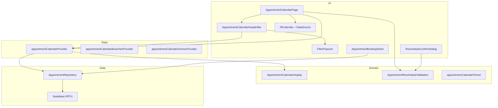

# Senior QA Review — `ui/008-calendar`

**Base branch:** `ui/master`
**Head:** `ui/008-calendar` (`f5c323b`)
**Scope:** 34 files, +5,109 / −57 lines across frontend calendar feature, one SQL migration, shared UI widgets, and automated tests.

This document analyzes every commit and functional change between `ui/master` and `ui/008-calendar`, identifies regression and risk areas, and defines a production-oriented test suite. Findings assume the implementation may contain defects.

---

## Executive summary

This branch replaces the appointments calendar placeholder route with a full **Syncfusion-based appointment calendar**: five view modes (Day, Week, Month, Schedule, Timeline Day), branch/doctor filtering, skeleton loading states, slot-based booking, drag-and-drop reschedule, and duration resize. A backend migration removes the **240-minute maximum** appointment duration cap.

**Release confidence blockers to verify manually:**

| Area                                     | Risk                                                                                                                                                |
| ---------------------------------------- | --------------------------------------------------------------------------------------------------------------------------------------------------- |
| Drag/resize + booking under slow network | Optimistic UI revert paths; shared `_isProcessingDrag` flag                                                                                         |
| Duration > 240 min after migration       | Stale RPC error strings still mention 240 in exception handlers                                                                                     |
| `filterVisibleAppointments`              | Appointments outside current branch hours are hidden, not flagged                                                                                   |
| Syncfusion dependency versions           | `syncfusion_flutter_calendar: ^32.1.23` vs `syncfusion_flutter_core: ^32.2.9` mismatch                                                              |
| Widget/integration coverage              | CAL-* widget, integration, and regression suites added in this PR; run with `--concurrency 1` (see [Verification commands](#verification-commands)) |
| License key in `main.dart`               | Unused constant committed to source                                                                                                                 |

---

## Commit-by-commit change analysis

### `3e52f7b` — Initial Syncfusion calendar integration

| Category         | Detail                                                                                                                                                                                |
| ---------------- | ------------------------------------------------------------------------------------------------------------------------------------------------------------------------------------- |
| **New feature**  | `AppointmentCalendarPage`, `AppointmentCalendarController`, `AppointmentCalendarDataSource`, domain helpers (`appointment_calendar_period.dart`, `appointment_calendar_display.dart`) |
| **UI**           | Syncfusion `SfCalendar` with day/week/month views; custom theming via `SfCalendarTheme`                                                                                               |
| **State**        | Riverpod `appointmentCalendarProvider`; auto-fetch on mount; mode/focus-date navigation                                                                                               |
| **Routing**      | `/appointments/calendar` wired to real page (was placeholder)                                                                                                                         |
| **Dependencies** | `syncfusion_flutter_calendar`, `syncfusion_flutter_core`, `skeletonizer` added to `pubspec.yaml`                                                                                      |

**Affected systems:** App router, appointments feature module, navigation shell.

**Regression areas:** Any code depending on calendar placeholder; shell nav link to calendar route.

**Risks:** Large third-party widget surface; timezone handling via `ensureAppointmentTimezonesInitialized()` in `main.dart`.

---

### `e412108` — Fix overflow and remove hover effect

| Category    | Detail                             |
| ----------- | ---------------------------------- |
| **Bug fix** | Layout overflow in calendar chrome |
| **UI**      | Removed problematic hover styling  |

**Regression areas:** Header/calendar layout at narrow widths.

---

### `0637848` — Booking functionality

| Category        | Detail                                                                                                 |
| --------------- | ------------------------------------------------------------------------------------------------------ |
| **New feature** | `AppointmentBookingSheet` — patient search, doctor select, time fields, notes, `createAppointment` RPC |
| **UI**          | Modal overlay with blurred scrim, fade transition                                                      |
| **API**         | `getSettings` + `createAppointment` via `AppointmentRepository`                                        |

**Regression areas:** Patient search (`searchPatientsUseCase`), appointment settings parsing, `AppClockTimeField` usage in forms.

**Risks:** Barrier dismissible — accidental outside tap loses form data; no duplicate-submit guard beyond `_isSaving`.

---

### `8ba7616` — Improving header colors

| Category | Detail                                            |
| -------- | ------------------------------------------------- |
| **UI**   | Header/theme color alignment with semantic tokens |

---

### `80d7e9f` — Doctors calendar view (Timeline Day)

| Category        | Detail                                                                               |
| --------------- | ------------------------------------------------------------------------------------ |
| **New feature** | `AppointmentCalendarMode.doctors` → `CalendarView.timelineDay` with doctor resources |
| **UI**          | Per-doctor resource rows; unassigned resource bucket                                 |

**Regression areas:** Doctor list loading; appointments without `doctorId` mapping to `__unassigned__` resource.

**Risks:** Resource count scales with all org doctors — performance on large clinics.

---

### `987bf4d` — Month view agenda panel visibility fix

| Category    | Detail                                                 |
| ----------- | ------------------------------------------------------ |
| **Bug fix** | Appointments visible in month view bottom agenda panel |

**Regression areas:** Month view + `showAgenda: true` interaction.

---

### `139e1dd` — Alternating colors for resource view

| Category | Detail                                                            |
| -------- | ----------------------------------------------------------------- |
| **UI**   | Odd/even doctor row stripe regions via `resourceRowStripeRegions` |

---

### `4f0882a` — Schedule view option

| Category        | Detail                                                                    |
| --------------- | ------------------------------------------------------------------------- |
| **New feature** | `AppointmentCalendarMode.schedule` → `CalendarView.schedule`              |
| **UI**          | Header hides prev/next arrows in schedule mode (`showNavigation = false`) |

**Risks:** Schedule mode still changes focus via `onViewChanged` — navigation UX may confuse users.

---

### `b2b0055` — Month view bubbles (indicators)

| Category | Detail                                                          |
| -------- | --------------------------------------------------------------- |
| **UI**   | `MonthAppointmentDisplayMode.indicator` instead of line display |

---

### `5d08533` — Skeletonizer for slow loading

| Category        | Detail                                                                      |
| --------------- | --------------------------------------------------------------------------- |
| **UI**          | `AppointmentCalendarSkeleton` full-page placeholder while `loading == true` |
| **Performance** | Perceived performance improvement                                           |

---

### `8950d5d` — Appointment tiles over skeletonizer

| Category | Detail                                                                          |
| -------- | ------------------------------------------------------------------------------- |
| **UI**   | Staggered reveal (`_skeletonRevealDelay` 180ms) on appointment tiles after load |

**Risks:** Rapid filter/refresh may cancel reveal generation — flicker possible.

---

### `406d6d2` — Full-height timeline appointments

| Category | Detail                                                          |
| -------- | --------------------------------------------------------------- |
| **UI**   | `timelineAppointmentHeight` matches resource row height (120px) |

---

### `abfdb92` — Custom header (replaces Syncfusion header)

| Category        | Detail                                                               |
| --------------- | -------------------------------------------------------------------- |
| **New feature** | `AppointmentCalendarHeaderBar` — title, nav arrows, Today, view tabs |
| **UI**          | `headerHeight: 0` on `SfCalendar`; custom chrome above grid          |

---

### `ba68b04` — Header padding improvements

| Category | Detail                       |
| -------- | ---------------------------- |
| **UI**   | Padding tokens on header bar |

---

### `e971c73` — Filter popover

| Category        | Detail                                                                             |
| --------------- | ---------------------------------------------------------------------------------- |
| **New feature** | `AppointmentCalendarFilterPopover` — branch + doctor filters                       |
| **State**       | `applyFilters`, `clearFilters`, `hasActiveFilters`; clears on active-branch change |

**Regression areas:** `listBranchesUseCase`, `listStaffUseCase`; auth session branch switch.

---

### `5d086cd` — Drag and move appointments

| Category        | Detail                                              |
| --------------- | --------------------------------------------------- |
| **New feature** | Drag-and-drop reschedule in day/week/timeline views |
| **Validation**  | `AppointmentRescheduleValidation` client checks     |
| **UI**          | `AppointmentRescheduleConfirmDialog` before RPC     |
| **API**         | `rescheduleAppointment` RPC                         |
| **Permission**  | Gated on `canCreateAppointments()` (same as create) |

**Risks:** Client validation uses in-memory `branchAppointments` — stale if concurrent edits; TOCTOU vs server.

---

### `97d1dcf` — Extend/shrink appointment duration (resize)

| Category        | Detail                                         |
| --------------- | ---------------------------------------------- |
| **New feature** | `onAppointmentResizeStart/Update/End` handlers |
| **Validation**  | Reuses `validateMove` with explicit `newEnd`   |

**Risks:** Resize edge detection (`resizeFromStart`) may flip mid-gesture; minimum 5-minute duration enforced client-side.

---

### `dfa8a8e` — Book Appointment header button

| Category | Detail                                                                            |
| -------- | --------------------------------------------------------------------------------- |
| **UI**   | Header `Book Appointment` button (uses focus date default slot, not tap position) |

**Risks:** Button opens booking at focus-date open time, not visually selected slot — UX mismatch vs cell tap.

---

### `f5c323b` — Calendar on page (outside card)

| Category | Detail                                               |
| -------- | ---------------------------------------------------- |
| **UI**   | Full-page `Material` layout; calendar fills viewport |

---

### `20260615120000_remove_appointment_max_duration.sql` (included in branch)

| Category         | Detail                                                                                          |
| ---------------- | ----------------------------------------------------------------------------------------------- |
| **Database/API** | `assert_appointment_duration_bounds` — removes 240-min upper bound; min 5 remains               |
| **API**          | `get_appointment_settings` no longer returns `max_duration_minutes`                             |
| **Frontend**     | `AppointmentSettings.maxDurationMinutes` optional; repository `_assertDurationMinutes` min-only |

**Regression areas:** All create/reschedule paths; UI that assumed 240-min cap.

**Risks:** Stale exception messages in `reschedule_appointment` / `create_appointment` still say "5 and 240 minutes" on `assert_appointment_duration_bounds` failure (misleading, not blocking for >240). No client max-duration guard in booking/reschedule dialogs.

---

### Ancillary changes (supporting)

| File                          | Change                                                                 |
| ----------------------------- | ---------------------------------------------------------------------- |
| `app_clock_time_field.dart`   | Post-frame `didChange` on value update; `Material` wrapper for InkWell |
| `app_selectors.dart`          | Minor selector support                                                 |
| `app_sheets.dart`             | Sheet overlay tweak                                                    |
| `appointment_repository.dart` | Duration validation min-only                                           |
| `dev_clinic_seed_*.dart`      | Seed schedule alignment                                                |
| `main.dart`                   | Timezone init; unused Syncfusion license constant                      |

---

## Cross-cutting architecture



---

## Potential bugs and risky decisions

### High priority

1. **Stale appointment list during drag validation** — `validateMove` uses `items` from last fetch. Another user booking the same slot between fetch and drop may still succeed server-side with conflict, or fail after optimistic preview.

2. **`filterVisibleAppointments` silently hides data** — Appointments spanning outside branch working hours (or after schedule change) disappear from calendar with no warning.

3. **Book Appointment button vs cell tap** — Header button uses `slotRangeFromTap(tappedDate: state.focusDate)` without time component → always branch open time on focus day, not user-selected slot.

4. **Exception handler message drift after migration** — Backend RPCs may still return "between 5 and 240 minutes" when duration assertion fails for other reasons.

5. **Syncfusion package version skew** — Calendar `32.1.23` vs Core `32.2.9` may cause subtle runtime issues.

### Medium priority

6. **Read-only users cannot drag** — Drag gated on `canCreateAppointments()`. Users with only `appointments.read` see calendar but cannot reschedule (consistent with backend `appointments.create` on reschedule, but may surprise operators).

7. **Shared `_isProcessingDrag` for drag and resize** — Concurrent gestures blocked; rapid drag→resize may drop second action.

8. **`_onViewChanged` double refresh** — `setMode` + `setFocusDate` each call `refresh()`; scrolling calendar may trigger redundant RPCs.

9. **Doctor filter in Timeline Day** — `_filteredDoctors` collapses resource list to single doctor when filter applied — other doctors' rows vanish (may be intended).

10. **Confirmed appointments draggable in UI until drop** — Syncfusion may still allow drag start on confirmed appointments; validation only on drop (toast error). Should verify `allowDragAndDrop` per appointment status.

11. **Unused license key in `main.dart`** — Committed key constant with comment that v32+ needs no registration; dead code and license exposure.

12. **No refresh after failed booking conflict** — `SCHEDULE_CONFLICT` shows inline message but calendar not refreshed — slot may appear free.

### Low priority

13. **Schedule view navigation** — Prev/next hidden but focus can still change via swipe/`onViewChanged`.

14. **Month view tap** — Sets `selectedDate` only; does not open booking (by design — only day/week cell tap books).

15. **Patient search race** — Handled via `_lastPatientQuery`; worth stress-testing rapid typing.

---

## Missing automated test coverage

| Area                     | Gap                                                                                      |
| ------------------------ | ---------------------------------------------------------------------------------------- |
| Calendar page edge cases | Concurrent drag/resize flags under flaky network; branch-specific load errors            |
| E2E                      | Full authenticated flows: book → refresh → tile; drag → confirm → RPC across real router |
| Month-view booking       | Document-only: month cell tap selects date but does not open booking (by design)         |

**Existing automated tests (extend, do not duplicate):**

- **Unit:** `appointment_calendar_display_test`, `appointment_calendar_period_test`, `appointment_calendar_provider_test`, `appointment_reschedule_validation_test`, `appointment_calendar_data_source_test`, `appointment_calendar_drag_reschedule_test`, `appointment_calendar_resize_section_h_test`, `appointment_settings_test`, `appointment_repository_test`
- **Widget / integration / regression:** `appointment_calendar_page_test`, `appointment_calendar_view_modes_test`, `appointment_calendar_filter_test`, `appointment_calendar_booking_test`, `appointment_calendar_drag_test`, `appointment_calendar_resize_test`, `appointment_calendar_detail_sheet_test`, `appointment_calendar_section_i_test`, `appointment_calendar_section_k_test`, `appointment_calendar_section_m_test`, `appointment_booking_sheet_test`, `appointment_reschedule_confirm_dialog_test`, `appointment_calendar_routing_test`, `calendar_section_l_regression_test`
- **Backend:** `backend/tests/appointment_calendar_backend_integrity.sql` (Section J)

---

## Test implementation plan

**Audience:** Agent implementing the CAL-* suite from scratch.

### Suggested test layout

| Path                                                                                | Sections                               |
| ----------------------------------------------------------------------------------- | -------------------------------------- |
| `frontend/test/integration/appointments/appointment_calendar_routing_test.dart`     | A01, M05                               |
| `frontend/test/widget/appointments/appointment_calendar_page_test.dart`             | A02–A03, A05, A07, B01–B05, G03, G11   |
| `frontend/test/widget/appointments/appointment_calendar_view_modes_test.dart`       | C01–C11                                |
| `frontend/test/widget/appointments/appointment_calendar_filter_test.dart`           | D01–D08                                |
| `frontend/test/widget/appointments/appointment_calendar_booking_test.dart`          | E01, E02, E16, E18                     |
| `frontend/test/widget/appointments/appointment_booking_sheet_test.dart`             | A04, E03–E15, E17                      |
| `frontend/test/widget/appointments/appointment_booking_sheet_test_support.dart`     | E (shared)                             |
| `frontend/test/widget/appointments/appointment_calendar_detail_sheet_test.dart`     | F01–F03                                |
| `frontend/test/widget/appointments/appointment_calendar_section_k_test.dart`        | K01–K06                                |
| `frontend/test/widget/appointments/appointment_calendar_section_m_test.dart`        | M01–M12                                |
| `frontend/test/widget/appointments/appointment_calendar_section_i_test.dart`        | I04–I06 (widget)                       |
| `frontend/test/widget/appointments/appointment_calendar_test_support.dart`          | Shared pumps, RPC stubs, calendar host |
| `frontend/test/widget/appointments/appointment_reschedule_confirm_dialog_test.dart` | G04, G14                               |
| `frontend/test/unit/appointments/appointment_calendar_*_test.dart`                  | B06–B07, G, H, I (unit), K (unit)      |
| `frontend/test/regression/appointments/calendar_section_l_regression_test.dart`     | L01–L06                                |
| `frontend/test/support/appointment_calendar_test_support.dart`                      | Shared fixtures                        |
| `backend/tests/appointment_calendar_backend_integrity.sql`                          | J01–J10                                |

### Widget harness rules (`SfCalendar`)

Syncfusion's calendar schedules frames continuously in `flutter test`. Follow these rules in **all** widget/integration tests that mount `AppointmentCalendarPage` or `SfCalendar`:

1. **Never** call `pumpAndSettle()` or `pumpEventQueue()` while the calendar is mounted — the harness will spin at 100% CPU.
2. **Never** call `settleRouterRedirects()` (which uses `pumpAndSettle`) after navigating to a route that shows the calendar. Use bounded pumps instead: `await tester.pump(); await tester.pump(const Duration(milliseconds: 300));`
3. Prefer a shared helper such as `settleCalendarWidgetTest(tester)` that only does bounded `pump` calls.
4. Run calendar widget tests with `--concurrency 1`.
5. For skeleton reveal timers, use `await tester.pump(const Duration(milliseconds: 200))` rather than waiting for settle.
6. Booking sheet tests can mount the sheet in isolation (no full calendar) where that satisfies the CAL-ID.
7. CAL-C10 (swipe navigate) may be marked `skip: true` if `allowViewNavigation=false` on `SfCalendar`.

### Progress summary (all pending implementation)

| Section | Topic                        | Test IDs | Priority |
| ------- | ---------------------------- | -------- | -------- |
| **A**   | Access control & routing     | A01–A07  | Critical |
| **B**   | Loading & error states       | B01–B07  | High     |
| **C**   | View modes & navigation      | C01–C11  | Critical |
| **D**   | Filtering                    | D01–D08  | High     |
| **E**   | Booking                      | E01–E18  | Critical |
| **F**   | Appointment detail sheet     | F01–F03  | High     |
| **G**   | Drag-and-drop reschedule     | G01–G15  | Critical |
| **H**   | Resize                       | H01–H08  | Critical |
| **I**   | Display & visual consistency | I01–I08  | High     |
| **J**   | Backend & data integrity     | J01–J10  | Critical |
| **K**   | Integration & network        | K01–K06  | High     |
| **L**   | Regression                   | L01–L06  | High     |
| **M**   | Abuse & edge cases           | M01–M12  | Medium   |

**Totals:** 119 test IDs — implement per tables in [Comprehensive test suite](#comprehensive-test-suite).

### Verification commands

```bash
cd frontend

# Unit + regression (no SfCalendar)
flutter test test/unit/appointments/appointment_calendar_* test/regression/appointments/calendar_* --concurrency 1

# Full calendar suite (after widget/integration files exist)
flutter test \
  test/unit/appointments/appointment_calendar_* \
  test/widget/appointments/appointment_calendar_* \
  test/widget/appointments/appointment_booking_sheet_test.dart \
  test/widget/appointments/appointment_reschedule_confirm_dialog_test.dart \
  test/integration/appointments/appointment_calendar_* \
  test/regression/appointments/calendar_* \
  --concurrency 1

# Backend Section J
psql -f backend/tests/appointment_calendar_backend_integrity.sql
./backend/tests/run_appointment_management_tests.sh
```

## Security and permission notes

- Page entry: `canAccessAppointments()` (create OR cancel OR read).
- Booking, drag, resize, cell tap book: `canCreateAppointments()`.
- Backend reschedule: `appointments.create` permission (aligned with UI drag gate).
- No additional route guard on `/appointments/calendar` beyond authenticated shell — page-level permission denied widget only.
- Patient search scoped to `PatientListScope.thisBranch` with `branchId` — verify cross-branch leakage impossible.

---

## Performance notes

- Each mode/focus/filter change triggers full `listAppointments` for computed UTC window.
- Doctor timeline loads all active doctors as resources every render cycle (filtered client-side).
- Skeletonizer + staggered reveal adds two animation passes on every data load.
- Syncfusion calendar with custom `appointmentBuilder` wrapping every tile in `Skeletonizer` — watch frame rate with 50+ appointments.

---

## Comprehensive test suite

### Legend

- **Priority:** Critical / High / Medium / Low
- **Type:** Frontend (FE), Backend (BE), Integration (INT), E2E, Regression (REG)
- **Target file:** See [Test implementation plan](#test-implementation-plan) for suggested paths

---

### A. Access control and routing

| Test ID | Area              | Related change | Priority | Type | Preconditions                               | Steps                                          | Expected result                                    |
| ------- | ----------------- | -------------- | -------- | ---- | ------------------------------------------- | ---------------------------------------------- | -------------------------------------------------- |
| CAL-A01 | Routing           | `3e52f7b`      | Critical | E2E  | Authenticated user with `appointments.read` | Navigate to `/appointments/calendar` via shell | `AppointmentCalendarPage` loads; not placeholder   |
| CAL-A02 | Permissions       | `3e52f7b`      | Critical | FE   | User lacks all appointment permissions      | Open calendar route                            | "You do not have permission to view appointments." |
| CAL-A03 | Permissions       | `3e52f7b`      | High     | FE   | User has `appointments.read` only           | Open calendar                                  | Calendar visible; no Book button; drag disabled    |
| CAL-A04 | Permissions       | `0637848`      | Critical | INT  | User has `appointments.create`              | Open booking sheet; submit valid form          | Appointment created; toast success                 |
| CAL-A05 | Permissions       | `5d086cd`      | Critical | INT  | User has `appointments.read` only           | Attempt drag on scheduled appointment          | Drag disabled (`allowDragAndDrop: false`)          |
| CAL-A06 | Permissions       | `5d086cd`      | Critical | BE   | User lacks `appointments.create`            | Call `reschedule_appointment` RPC directly     | `FORBIDDEN`                                        |
| CAL-A07 | Branch assignment | `3e52f7b`      | High     | FE   | Auth session with no `activeBranchId`       | Open calendar                                  | Error: "Select an active branch..."; empty grid    |

---

### B. Calendar loading and error states

| Test ID | Area        | Related change | Priority | Type | Preconditions                 | Steps                              | Expected result                                        |
| ------- | ----------- | -------------- | -------- | ---- | ----------------------------- | ---------------------------------- | ------------------------------------------------------ |
| CAL-B01 | Loading     | `5d08533`      | High     | FE   | Slow RPC (throttle network)   | Open calendar                      | `AppointmentCalendarSkeleton` shown until data arrives |
| CAL-B02 | Loading     | `8950d5d`      | Medium   | FE   | Appointments loaded           | Observe tiles after load           | Brief skeleton on tiles, then reveal within ~180ms     |
| CAL-B03 | Error       | `3e52f7b`      | Critical | FE   | RPC fails                     | Open calendar                      | Error text + Retry button; no crash                    |
| CAL-B04 | Error       | `3e52f7b`      | High     | FE   | Error state                   | Tap Retry                          | `refresh()` called; success replaces error             |
| CAL-B05 | Empty       | `3e52f7b`      | Medium   | FE   | Branch with zero appointments | Open week view                     | Empty grid; no skeleton stuck                          |
| CAL-B06 | Refresh     | `e971c73`      | High     | INT  | Apply branch filter           | Switch branch                      | New fetch; tiles match branch data                     |
| CAL-B07 | Auth change | `e971c73`      | High     | REG  | Filters applied               | Change `activeBranchId` in session | Filters reset to new default branch                    |

---

### C. View modes and navigation

| Test ID | Area           | Related change       | Priority | Type | Preconditions                         | Steps                             | Expected result                                   |
| ------- | -------------- | -------------------- | -------- | ---- | ------------------------------------- | --------------------------------- | ------------------------------------------------- |
| CAL-C01 | Day view       | `3e52f7b`            | Critical | FE   | Calendar loaded                       | Tap Day tab                       | Day grid; time slots match branch hours           |
| CAL-C02 | Week view      | `3e52f7b`            | Critical | FE   | Calendar loaded                       | Tap Week tab                      | 7-day grid; non-working days marked               |
| CAL-C03 | Month view     | `b2b0055`, `987bf4d` | Critical | FE   | Appointments in month                 | Tap Month tab                     | Indicators on days; agenda lists appointments     |
| CAL-C04 | Schedule view  | `4f0882a`            | High     | FE   | Week of appointments                  | Tap Schedule tab                  | List-style schedule; prev/next arrows hidden      |
| CAL-C05 | Timeline Day   | `80d7e9f`            | Critical | FE   | Multiple doctors                      | Tap Timeline Day                  | Doctor rows; appointments in correct resource row |
| CAL-C06 | Navigation     | `abfdb92`            | High     | FE   | Week view                             | Tap prev/next arrows              | Focus week changes; appointments refetched        |
| CAL-C07 | Today          | `abfdb92`            | High     | FE   | Navigated to future date              | Tap Today                         | Focus returns to current date                     |
| CAL-C08 | Closed day     | `3e52f7b`            | Medium   | FE   | Branch closed on focus day (day view) | Open day view on closed weekday   | Banner: "This branch is closed on {weekday}."     |
| CAL-C09 | Month blackout | `3e52f7b`            | Medium   | FE   | Branch closed Sundays                 | Month view                        | Sundays in `blackoutDates`                        |
| CAL-C10 | Swipe navigate | `3e52f7b`            | Medium   | FE   | Week view                             | Swipe to next week (if SF allows) | `onViewChanged` updates focus; data reloads       |
| CAL-C11 | Header title   | `abfdb92`            | Low      | FE   | Various modes                         | Switch modes                      | Title shows correct month/year                    |

---

### D. Filtering

| Test ID | Area                     | Related change | Priority | Type | Preconditions                      | Steps                      | Expected result                                         |
| ------- | ------------------------ | -------------- | -------- | ---- | ---------------------------------- | -------------------------- | ------------------------------------------------------- |
| CAL-D01 | Open filter              | `e971c73`      | High     | FE   | Calendar loaded                    | Tap filter icon            | Popover: Branch, Doctor, Apply, Clear                   |
| CAL-D02 | Apply branch             | `e971c73`      | Critical | INT  | Multiple branches                  | Select other branch; Apply | Calendar shows that branch's appointments; badge active |
| CAL-D03 | Apply doctor             | `e971c73`      | Critical | INT  | Multiple doctors with appointments | Filter one doctor          | Only that doctor's appointments visible                 |
| CAL-D04 | Clear filters            | `e971c73`      | High     | FE   | Filters active                     | Clear Filters              | Branch resets to session active branch; doctor cleared  |
| CAL-D05 | Badge                    | `e971c73`      | Medium   | FE   | Default filters                    | Open calendar              | No filter badge                                         |
| CAL-D06 | Doctor filter + timeline | `80d7e9f`      | High     | FE   | Doctor filter set                  | Switch to Timeline Day     | Only filtered doctor row(s) shown                       |
| CAL-D07 | Filter loading           | `e971c73`      | Medium   | FE   | Slow branch list                   | Open filter while loading  | Graceful empty/disabled state; no crash                 |
| CAL-D08 | Invalid branch           | `3e52f7b`      | Medium   | NEG  | Branch list empty                  | Open calendar              | Appropriate error or empty state                        |

---

### E. Booking (sheet and cell tap)

| Test ID | Area               | Related change   | Priority | Type   | Preconditions                        | Steps                       | Expected result                                                   |
| ------- | ------------------ | ---------------- | -------- | ------ | ------------------------------------ | --------------------------- | ----------------------------------------------------------------- |
| CAL-E01 | Cell tap book      | `0637848`        | Critical | E2E    | `appointments.create`; day/week view | Tap empty time cell         | Booking sheet opens with snapped slot times                       |
| CAL-E02 | Header book        | `dfa8a8e`        | High     | FE     | `appointments.create`                | Tap Book Appointment        | Sheet opens with focus-date open time + default duration          |
| CAL-E03 | Settings load      | `0637848`        | High     | FE     | Open sheet                           | Wait for settings           | Default/min duration from RPC shown                               |
| CAL-E04 | Settings error     | `0637848`        | High     | NEG    | `getSettings` fails                  | Open sheet                  | Error with retry path                                             |
| CAL-E05 | Patient search     | `0637848`        | Critical | INT    | Type 3+ chars                        | Search patient              | Debounced results; select patient                                 |
| CAL-E06 | Patient min query  | `0637848`        | Medium   | NEG    | Type 1-2 chars                       | Search                      | No RPC; empty results                                             |
| CAL-E07 | No patient         | `0637848`        | High     | NEG    | Submit without patient               | Tap Book/Save               | "Select a patient."                                               |
| CAL-E08 | Past start time    | `0637848`        | Critical | NEG    | Set start in past                    | Submit                      | "Start time must be in the future."                               |
| CAL-E09 | Outside hours      | `0637848`        | Critical | NEG    | Set time outside branch hours        | Submit                      | Working hours validation error                                    |
| CAL-E10 | Min duration       | `0637848`        | High     | NEG    | End before start + <5 min            | Submit                      | Duration validation error                                         |
| CAL-E11 | Happy path         | `0637848`        | Critical | E2E    | Valid patient, time, optional doctor | Submit                      | Dialog closes `true`; toast; calendar refreshes; new tile visible |
| CAL-E12 | Schedule conflict  | `0637848`        | Critical | INT    | Overlapping slot exists              | Submit                      | `SCHEDULE_CONFLICT` inline message; form stays open               |
| CAL-E13 | Dismiss scrim      | `0637848`        | Medium   | NEG    | Partially filled form                | Tap outside modal           | Sheet closes; no appointment created                              |
| CAL-E14 | Double submit      | `0637848`        | High     | ABUSE  | Valid form                           | Double-click submit rapidly | Single appointment created                                        |
| CAL-E15 | Doctor optional    | `0637848`        | High     | INT    | Select "No doctor assigned"          | Book                        | Appointment created with null doctor                              |
| CAL-E16 | Month tap no book  | `0637848`        | Medium   | FE     | Month view                           | Tap empty day cell          | No booking sheet (selection only)                                 |
| CAL-E17 | Long duration      | `20260615120000` | High     | BE/INT | Duration > 240 min within hours      | Create via sheet            | Success (no 240 cap)                                              |
| CAL-E18 | Refresh after book | `0637848`        | High     | INT    | Book appointment                     | Observe calendar            | New appointment in correct slot/color                             |

---

### F. Appointment detail sheet

| Test ID | Area               | Related change | Priority | Type | Preconditions           | Steps                | Expected result                             |
| ------- | ------------------ | -------------- | -------- | ---- | ----------------------- | -------------------- | ------------------------------------------- |
| CAL-F01 | Tile tap           | `3e52f7b`      | High     | FE   | Appointment visible     | Tap appointment tile | Bottom sheet: patient, doctor, time, status |
| CAL-F02 | Open patient       | `3e52f7b`      | High     | INT  | Detail sheet open       | Tap Open patient     | Navigates to patient detail                 |
| CAL-F03 | Skeleton tap block | `8950d5d`      | Medium   | FE   | During reveal animation | Tap skeleton tile    | No navigation until revealed                |

---

### G. Drag-and-drop reschedule

| Test ID | Area                 | Related change | Priority | Type  | Preconditions                                  | Steps                            | Expected result                                      |
| ------- | -------------------- | -------------- | -------- | ----- | ---------------------------------------------- | -------------------------------- | ---------------------------------------------------- |
| CAL-G01 | Happy path move      | `5d086cd`      | Critical | E2E   | Scheduled planned appointment; free slot       | Drag to new slot; confirm dialog | RPC success; toast; calendar refreshed               |
| CAL-G02 | Snap to grid         | `5d086cd`      | High     | FE    | Day view 30-min slots                          | Drag to arbitrary pixel          | Snaps to nearest 30-min boundary                     |
| CAL-G03 | No-op drop           | `5d086cd`      | Medium   | FE    | Drag same slot                                 | Drop                             | No dialog; no RPC                                    |
| CAL-G04 | Cancel dialog        | `5d086cd`      | High     | FE    | Drag to valid slot                             | Cancel confirm dialog            | Appointment reverts to original position             |
| CAL-G05 | Confirmed appt       | `5d086cd`      | Critical | NEG   | Confirmed appointment                          | Drag to new slot                 | Toast: only scheduled can be moved; revert           |
| CAL-G06 | Overlap              | `5d086cd`      | Critical | NEG   | Drag onto another appointment                  | Drop                             | Toast overlap message; revert                        |
| CAL-G07 | Outside hours        | `5d086cd`      | Critical | NEG   | Drag outside working hours                     | Drop                             | Toast working hours error; revert                    |
| CAL-G08 | Same-day patient     | `5d086cd`      | High     | NEG   | Patient has another appt same day              | Drag to that day                 | Toast same-day error                                 |
| CAL-G09 | Doctor resource move | `80d7e9f`      | High     | NEG   | Timeline day                                   | Drag to different doctor row     | Toast: change doctor not supported                   |
| CAL-G10 | RPC failure          | `5d086cd`      | Critical | INT   | Mock RPC error                                 | Confirm valid move               | Toast error; calendar reverted                       |
| CAL-G11 | Month no drag        | `5d086cd`      | Medium   | FE    | Month view                                     | Attempt drag                     | `allowDragAndDrop: false`                            |
| CAL-G12 | Preview during drag  | `5d086cd`      | Medium   | FE    | Drag in progress                               | Observe grid                     | Preview position updates; ghost hidden when off-grid |
| CAL-G13 | Concurrent drag      | `5d086cd`      | Medium   | ABUSE | Start drag                                     | Start second drag before end     | Second ignored (`_isProcessingDrag`)                 |
| CAL-G14 | Edit times in dialog | `5d086cd`      | High     | FE    | Confirm dialog open                            | Change start/end                 | Re-validates before confirm                          |
| CAL-G15 | Server conflict      | `5d086cd`      | Critical | INT   | Slot taken server-side after client validation | Confirm move                     | RPC `SCHEDULE_CONFLICT`; revert                      |

---

### H. Resize (duration change)

| Test ID | Area                 | Related change   | Priority | Type  | Preconditions                 | Steps                  | Expected result                            |
| ------- | -------------------- | ---------------- | -------- | ----- | ----------------------------- | ---------------------- | ------------------------------------------ |
| CAL-H01 | Extend end           | `97d1dcf`        | Critical | E2E   | Scheduled appointment         | Drag bottom edge later | Confirm; RPC; updated duration             |
| CAL-H02 | Shrink               | `97d1dcf`        | High     | E2E   | 60-min appointment            | Shrink to 30 min       | Success if valid                           |
| CAL-H03 | Min 5 min            | `97d1dcf`        | Critical | NEG   | Appointment                   | Shrink below 5 min     | Blocked client-side or RPC `INVALID_INPUT` |
| CAL-H04 | Extend into overlap  | `97d1dcf`        | Critical | NEG   | Adjacent appointment          | Extend into overlap    | Validation error; revert                   |
| CAL-H05 | Resize start edge    | `97d1dcf`        | High     | FE    | Long appointment              | Drag top edge          | Start moves; end fixed (or vice versa)     |
| CAL-H06 | No-op resize         | `97d1dcf`        | Medium   | FE    | Resize back to original       | Confirm                | No RPC                                     |
| CAL-H07 | Max duration removed | `20260615120000` | High     | BE    | Resize to >240 min within day | Confirm                | Success                                    |
| CAL-H08 | Drag then resize     | `97d1dcf`        | Medium   | ABUSE | Complete drag                 | Immediately resize     | Second action handled correctly            |

---

### I. Display and visual consistency

| Test ID | Area                 | Related change | Priority | Type | Preconditions                    | Steps                 | Expected result                            |
| ------- | -------------------- | -------------- | -------- | ---- | -------------------------------- | --------------------- | ------------------------------------------ |
| CAL-I01 | Status colors        | `3e52f7b`      | Medium   | FE   | Appointments in each status      | View week             | Colors match `statusColor` mapping         |
| CAL-I02 | Doctor name          | `3e52f7b`      | Medium   | FE   | Non-timeline views               | View appointment tile | Doctor in notes/subtitle                   |
| CAL-I03 | Resource stripes     | `139e1dd`      | Low      | FE   | Timeline day, 3+ doctors         | View rows             | Alternating row backgrounds                |
| CAL-I04 | Full height timeline | `406d6d2`      | Medium   | FE   | Timeline day                     | View appointments     | Tiles fill row height                      |
| CAL-I05 | Theme                | `8ba7616`      | Low      | FE   | Light/dark theme                 | Open calendar         | Header/cell borders use semantic colors    |
| CAL-I06 | Responsive           | `f5c323b`      | High     | FE   | Viewports 1280, 1024, 800px      | Open calendar         | No overflow; header scrolls tabs           |
| CAL-I07 | Hidden appts         | `3e52f7b`      | High     | REG  | Appt outside working hours in DB | Open calendar         | Hidden — document if expected; flag if not |
| CAL-I08 | Unassigned row       | `80d7e9f`      | Medium   | FE   | Appt without doctor              | Timeline day          | Appears in Unassigned resource             |

---

### J. Backend and data integrity

| Test ID | Area               | Related change   | Priority | Type | Preconditions          | Steps                                     | Expected result                   |
| ------- | ------------------ | ---------------- | -------- | ---- | ---------------------- | ----------------------------------------- | --------------------------------- |
| CAL-J01 | Duration bounds fn | `20260615120000` | Critical | BE   | —                      | `assert_appointment_duration_bounds(4)`   | `INVALID_DURATION`                |
| CAL-J02 | Duration 241       | `20260615120000` | Critical | BE   | —                      | `assert_appointment_duration_bounds(241)` | No error                          |
| CAL-J03 | get_settings shape | `20260615120000` | High     | BE   | Valid branch           | `get_appointment_settings`                | No `max_duration_minutes` key     |
| CAL-J04 | Create >240        | `20260615120000` | Critical | BE   | Valid slot             | `create_appointment` 300 min              | Success                           |
| CAL-J05 | Reschedule >240    | `20260615120000` | Critical | BE   | Scheduled appt         | Reschedule to 300 min duration            | Success                           |
| CAL-J06 | Reschedule parity  | `5d086cd`        | Critical | REG  | —                      | Reschedule outside hours                  | `INVALID_INPUT` (server)          |
| CAL-J07 | Patient same day   | `5d086cd`        | Critical | REG  | Two appts same patient | Reschedule into same day                  | `PATIENT_ALREADY_BOOKED_SAME_DAY` |
| CAL-J08 | Audit log          | `5d086cd`        | Medium   | BE   | Reschedule success     | Check audit_log                           | Entry recorded                    |
| CAL-J09 | Fetch window day   | `3e52f7b`        | High     | BE   | Day mode               | list_appointments bounds                  | UTC day window correct            |
| CAL-J10 | Fetch window month | `3e52f7b`        | High     | BE   | Month mode             | list bounds                               | Full month UTC range              |

---

### K. Integration and network

| Test ID | Area                | Related change   | Priority | Type  | Preconditions               | Steps                              | Expected result                                    |
| ------- | ------------------- | ---------------- | -------- | ----- | --------------------------- | ---------------------------------- | -------------------------------------------------- |
| CAL-K01 | Offline open        | `3e52f7b`        | High     | INT   | Network disabled            | Open calendar                      | Error state with retry                             |
| CAL-K02 | Offline book        | `0637848`        | Critical | INT   | Network disabled mid-submit | Submit booking                     | User-friendly error; no partial state              |
| CAL-K03 | Slow network drag   | `5d086cd`        | High     | INT   | Throttled RPC               | Drag and confirm                   | Loading state; no duplicate reschedule             |
| CAL-K04 | Refresh during book | `0637848`        | Medium   | ABUSE | Booking sheet open          | Trigger calendar refresh elsewhere | Sheet remains functional                           |
| CAL-K05 | Multi-tab           | `5d086cd`        | High     | ABUSE | Two tabs same branch        | Book in tab A                      | Tab B shows new appointment after refresh/navigate |
| CAL-K06 | Contract settings   | `20260615120000` | High     | INT   | Deploy new migration        | Old client parse settings          | `maxDurationMinutes` null; no crash                |

---

### L. Regression testing

| Test ID | Area                  | Related change           | Priority | Type | Preconditions               | Steps                                      | Expected result                   |
| ------- | --------------------- | ------------------------ | -------- | ---- | --------------------------- | ------------------------------------------ | --------------------------------- |
| CAL-L01 | AppClockTimeField     | `app_clock_time_field`   | High     | REG  | Parent changes value prop   | Rebuild with new time                      | Field displays updated value      |
| CAL-L02 | Appointments list RPC | `3e52f7b`                | Critical | REG  | Existing list page (if any) | List appointments                          | Unaffected                        |
| CAL-L03 | Dev seed              | `dev_clinic_seed_*`      | Medium   | REG  | Dev fill dummy clinic       | Run seed                                   | Schedule compatible with calendar |
| CAL-L04 | Repository boundary   | `appointment_repository` | High     | REG  | Duration 4 min              | createAppointment                          | Client `INVALID_INPUT` before RPC |
| CAL-L05 | Shell navigation      | `3e52f7b`                | High     | REG  | Authenticated shell         | Navigate away and back                     | Calendar state reasonable         |
| CAL-L06 | Permission service    | existing                 | Medium   | REG  | —                           | Run `permission_service_appointments_test` | All pass                          |

---

### M. User abuse and edge cases

| Test ID | Area                | Related change | Priority | Type  | Preconditions              | Steps                                    | Expected result                  |
| ------- | ------------------- | -------------- | -------- | ----- | -------------------------- | ---------------------------------------- | -------------------------------- |
| CAL-M01 | Rapid filter toggle | `e971c73`      | Medium   | ABUSE | —                          | Apply/clear filters 10x quickly          | No crash; final state consistent |
| CAL-M02 | Rapid view switch   | `4f0882a`      | Medium   | ABUSE | —                          | Cycle all 5 views quickly                | No exception; data loads         |
| CAL-M03 | Rapid Today clicks  | `abfdb92`      | Low      | ABUSE | —                          | Click Today 10x                          | Idempotent focus                 |
| CAL-M04 | Back button         | `0637848`      | Medium   | ABUSE | Booking sheet open         | Browser/app back                         | Sheet closes gracefully          |
| CAL-M05 | Invalid URL         | `3e52f7b`      | Low      | FE    | —                          | Navigate to `/appointments/calendar/foo` | 404 or shell redirect            |
| CAL-M06 | Drag off calendar   | `5d086cd`      | Medium   | ABUSE | —                          | Drag appointment off viewport            | Revert or cancel safely          |
| CAL-M07 | Resize flicker      | `97d1dcf`      | Medium   | ABUSE | —                          | Rapidly resize back and forth            | UI stable; one confirm max       |
| CAL-M08 | Long patient name   | `3e52f7b`      | Low      | FE    | 100+ char name             | View tile                                | Ellipsis/truncation; no overflow |
| CAL-M09 | Many appointments   | `3e52f7b`      | High     | PERF  | 100+ in week               | Open week view                           | Acceptable frame rate            |
| CAL-M10 | DST boundary        | `3e52f7b`      | High     | EDGE  | Appt on DST transition day | View day                                 | Correct local times              |
| CAL-M11 | Midnight span       | `97d1dcf`      | Medium   | EDGE  | Branch hours near midnight | Book/reschedule                          | Validation handles correctly     |
| CAL-M12 | Null doctor overlap | `80d7e9f`      | High     | REG   | Two unassigned appts       | Overlap times                            | Client overlap detected          |

---

## Manual testing checklist (pre-release)

Execute these in a staging environment with realistic seed data (multiple branches, doctors, overlapping scenarios):

- [ ] Full booking flow from each view mode entry point (cell tap day/week, header button)
- [ ] Drag and resize on scheduled vs confirmed appointments
- [ ] Filter combinations: branch only, doctor only, both, clear
- [ ] Timeline day with unassigned appointments and 10+ doctors
- [ ] Month agenda with appointments on first/last day of month
- [ ] Closed days and branches with Sat/Sun-only schedules
- [ ] Appointment > 4 hours (post-migration) create and resize
- [ ] Concurrent booking by two users on same slot
- [ ] Permission matrix: receptionist (read), nurse (create), admin
- [ ] Light and dark theme visual pass
- [ ] Windows desktop at 1280×720 and 1920×1080

---

## Recommended follow-up before merge

1. Implement the CAL-* automated suite per [Test implementation plan](#test-implementation-plan), following [Widget harness rules](#widget-harness-rules-sfcalendar).
2. Align Syncfusion package versions to same minor release.
3. Remove or wire up unused `syncfusionLicenseKey` in `main.dart`.
4. Update backend RPC exception messages to drop "240" reference.
5. Consider warning when `filterVisibleAppointments` hides out-of-hours appointments.
6. Gate drag start on `canRescheduleAppointment(item)` to avoid dragging confirmed appointments.
7. Document intentional behavior: header Book uses focus date open time, not last tapped cell.
8. Run manual testing checklist below for scenarios not fully automatable (true E2E drag gestures, multi-tab).

---

## Overall assessment

The branch delivers a substantial, well-factored calendar feature with partial **unit-test coverage** of domain logic and provider behavior. UI complexity (Syncfusion + custom header + gestures + modals) requires a full widget/integration suite per this document. Client-side reschedule validation is **more thorough than typical** but creates a false sense of security against concurrent edits.

**Recommendation:** Do not merge to production without completing **Critical** and **High** priority tests (sections E, G, H, J) and verifying the duration migration on a staging database.

---

*Generated: 2026-06-16 · Branch `ui/008-calendar` vs `ui/master`*
