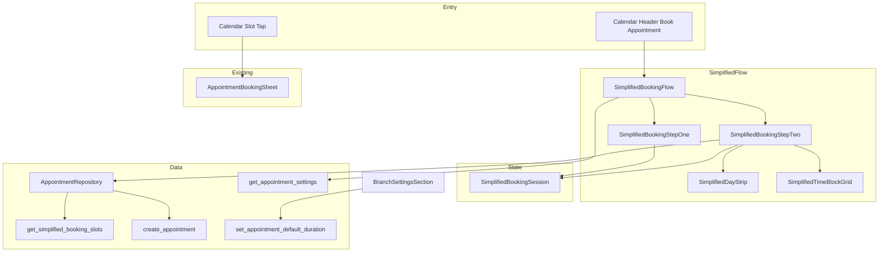

# Senior QA Review — `ui/012-simplified-slot-booking`

**Base branch:** `ui/master` (`db940c5`)
**Head:** `ui/012-simplified-slot-booking` (`ed51d71`)
**Scope:** 59 files, +6,029 / −172 lines across simplified booking UI, PostgreSQL migrations, branch settings, dev seed helpers, backend SQL tests, and Spec Kit docs.

This document analyzes every commit and functional change between `ui/master` and `ui/012-simplified-slot-booking`, identifies regression and risk areas, and defines a production-oriented test suite. Findings assume the implementation may contain defects.

---

## Executive summary

This branch delivers a **two-step simplified slot booking flow** launched from the calendar header **Book Appointment** button: step one collects patient, optional preferred doctor, and notes; step two shows a day strip, duration-sized time-block grid (four availability states), filter popover, legend, and bottom summary card. Calendar **slot tap** still opens the existing `AppointmentBookingSheet`.

Backend changes restore **per-doctor overlap** in `appointment_has_overlap` (supersedes branch-wide slot uniqueness), add **`get_simplified_booking_slots`** RPC, and raise the unset default-duration fallback from **20 → 30 minutes**. Branch settings gains a **default appointment duration** field wired to existing `set_appointment_default_duration`.

**Release confidence blockers to verify manually:**

| Area | Risk |
| ---- | ---- |
| Per-doctor overlap migration | Same clock time for two different doctors now allowed; branch-wide denial removed — regression across create, reschedule, and slot RPC |
| Header **Book Appointment** entry | Replaces prior booking-sheet header path; operators may expect free-form time entry |
| Step-one doctor optional | Spec/contracts say doctor required; UI allows advance with patient only — slot RPC falls back to first doctor; confirm disabled without `effectiveDoctorId` |
| Slot staleness on confirm | `SCHEDULE_CONFLICT` refreshes slots but no optimistic lock; concurrent booking between load and confirm |
| Default duration 20 → 30 | Clinics without explicit setting get longer blocks and fewer slots after migration |
| Filter popover + view doctor | "All doctors" remaps `alternate_doctors_available` → `available` client-side; states may not match server when filtering |
| Barrier dismissible modal | Outside tap / scrim closes flow and discards step-one data |
| `delete_staff_member` SQLSTATE syntax fix | Ancillary migration edit (`WHEN SQLSTATE =` → `WHEN SQLSTATE`); verify exception handlers still fire |

---

## Commit-by-commit change analysis

### `ce9d229` — Submitting speckit docs

| Category | Detail |
| -------- | ------ |
| **Docs** | Full `specs/011-simplified-slot-booking/` artifact set: spec, plan, research, data-model, quickstart, contracts, tasks, checklist |
| **Config** | `.cursor/rules/specify-rules.mdc`, `.specify/feature.json` point to 011 plan |

**Affected systems:** Documentation only; defines contracts for RPC, UI, and overlap rules.

**Risks:** Spec says step-one doctor required; implementation later diverges (see `97ced91` onward).

---

### `97ced91` — Implementing phases 1 and 2

| Category | Detail |
| -------- | ------ |
| **Database** | `20260627120000_simplified_slot_booking.sql` — per-doctor `appointment_has_overlap`; `get_simplified_booking_slots` internal + public wrapper |
| **API** | New read RPC; grants to `authenticated` |
| **Frontend** | `SimplifiedBookingSlot`, `SimplifiedBookingDaySlots` domain parsing; `AppointmentRepository.getSimplifiedBookingSlots` |
| **Tests** | `backend/tests/simplified_slot_booking.sql`; overlap cases updated in `appointment_management_crud.sql` |

**Affected systems:** All appointment conflict detection; new slot query path.

**Regression areas:** Any flow that relied on branch-wide same-time denial; existing create/reschedule conflict tests.

**Risks:** Two doctors at 10:00 now valid; slot RPC iterates all branch doctors per block — performance on large clinics.

---

### `1f274f2` — Implementing phase 3

| Category | Detail |
| -------- | ------ |
| **Database** | `20260627130000_appointment_default_duration_30.sql` — fallback 30 min when unset/invalid |
| **UI** | Default duration field in `BranchSettingsSection`; `AppointmentDurationOptions`; `branch_form_fields.dart` duration selector |
| **Refactor** | Duration UI extracted from `settings_cards_grid.dart` into branch card |
| **Dev seed** | `dev_clinic_seed_schedule.dart` / service / notifier — timeline alignment for slot demos |
| **Tests** | `appointment_duration_options_test.dart`, dev seed schedule tests |
| **Ancillary** | `delete_staff_member.sql` SQLSTATE handler syntax fix |

**Affected systems:** Settings clinic setup, appointment block sizing globally, dev seed data.

**Regression areas:** Clinics with implicit 20-min blocks; settings load/save paths.

**Risks:** Changing fallback without updating stored `app_settings` changes grid density for branches that never saved duration.

---

### `5b95fe4` — Implementing phases 4 and 5

| Category | Detail |
| -------- | ------ |
| **New feature** | `SimplifiedDayStrip`, `SimplifiedTimeBlockGrid`, `SimplifiedSlotSummaryCard`, `AlternateDoctorsDialog` |
| **Domain** | Slot state helpers; chip styling foundations |
| **Tests** | Widget tests for day strip, grid, summary, alternate dialog; unit tests for slot parsing |

**Affected systems:** Step-two presentation layer.

**Regression areas:** N/A (new widgets).

**Risks:** Grid shows first 8 rows with scroll for more — "show more" link from contract not implemented; scroll-only expansion.

---

### `5ac6630` — Implementing phase 6

| Category | Detail |
| -------- | ------ |
| **New feature** | `SimplifiedBookingFlow`, `SimplifiedBookingStepOne`, `SimplifiedBookingStepTwo`, `SimplifiedBookingSession` |
| **Integration** | `AppointmentCalendarPage` header wires `SimplifiedBookingFlow.show`; refresh calendar on `true` return |
| **UI** | Modal overlay with blur scrim; step indicator; back navigation clears slot |
| **Tests** | `simplified_booking_flow_test.dart` (294 lines); dev seed branch timeline test |

**Affected systems:** Calendar header booking entry; appointment create from simplified path.

**Regression areas:** `appointment_calendar_booking_test.dart` expectations; users who used header for free-form booking.

**Risks:** `canAdvanceFromStepOne` only checks patient — doctor optional; settings fetch on step-two entry can fail independently of slot load.

---

### `759f711` — Implementing phases 7 and 8

| Category | Detail |
| -------- | ------ |
| **Tests** | `appointment_repository_test.dart` expanded for `getSimplifiedBookingSlots`; calendar booking test updated for simplified flow; section K/M calendar tests adjusted |
| **Docs** | tasks.md progress |

**Affected systems:** Test coverage gate for merge confidence.

**Risks:** Widget suite does not mount full `SfCalendar` for simplified flow — header integration partially covered.

---

### `ed51d71` — Enhancing the slots view

| Category | Detail |
| -------- | ------ |
| **New feature** | `SimplifiedBookingFilterPopover` — hide fully booked toggle, view doctor, date picker |
| **UI** | `SimplifiedSlotLegend`, `SimplifiedSlotChipStyle`; grid chip visual refresh; `AppPaginatedSlideSwitcher` on day change |
| **Logic** | `_slotsForDisplay` remaps alternate state to available when no preferred doctor or "All doctors" view; no-preferred flow opens doctor picker on any available slot tap |
| **Tests** | Filter/legend/grid/flow tests extended |

**Affected systems:** Step-two UX and slot classification display.

**Regression areas:** Alternate-doctor UX when filter active; legend visibility (`showAlternateDoctors` only when preferred doctor set).

**Risks:** Client-side state remapping can show "available" chips while server returned `alternate_doctors_available`; confirm still uses correct doctor from dialog selection.

---

## Cross-cutting architecture



---

## Potential bugs and risky decisions

### High priority

1. **Per-doctor overlap restoration** — `appointment_has_overlap` filters by `doctor_id` only. Two planned appointments at the same branch time for different doctors succeed; same doctor still conflicts. Any operator workflow assuming "one appointment per slot per branch" breaks.

2. **Step-one doctor optional vs spec** — Contract (`simplified-booking-ui.md`) and spec FR require doctor in step one; `canAdvanceFromStepOne` is `patient != null` only. Without doctor, `_rpcDoctorId()` uses `doctors.firstOrNull` for slot query — grid reflects first doctor's preference, not user's intent.

3. **Confirm blocked without effective doctor** — `_canConfirm` requires `effectiveDoctorId.trim().isNotEmpty`. User can select slot in no-doctor flow only via alternate dialog; tapping "available" slot without preferred doctor always opens dialog — but if dialog lists empty, user is stuck with no explanation on disabled confirm.

4. **TOCTOU on slot confirm** — Slots loaded once per date/doctor change. Another user books same doctor/time → `SCHEDULE_CONFLICT`; refresh runs but user must re-select. No auto-select next free slot.

5. **Header vs cell-tap booking divergence** — Header → simplified (fixed duration, block grid). Cell tap → booking sheet (custom time/duration). Operators may not understand two workflows.

6. **Default duration fallback change** — Migration `20260627130000` returns 30 when setting missing/invalid. Block count and `create_appointment` duration in simplified flow both use this — silent behavior change for existing orgs.

### Medium priority

7. **Client remapping of alternate state** — `_slotsForDisplay` forces `alternateDoctorsAvailable` → `available` when viewing all doctors or no preferred doctor. Lock icon and legend semantics differ from server truth.

8. **Past blocks shown but not tappable** — Server returns `past` for today's elapsed blocks; grid renders them but tap is no-op. With "hide fully booked" on, past blocks still show (only `fullyUnavailable` hidden).

9. **Barrier dismissible** — Scrim tap and close button discard session; no confirm dialog.

10. **Notes max length** — Validated on step-one submit (2000 chars); not re-validated on confirm.

11. **Empty doctors list** — Step one shows informational text; step two `_rpcDoctorId()` returns null → empty slots, no explicit error.

12. **Filter popover date vs day strip** — Two date controls; popover "Clear filters" resets doctor/hide-booked but not date away from strip selection.

13. **`getSimplifiedBookingSlots` requires non-empty `preferredDoctorId`** — Repository asserts non-empty; "All doctors" view still passes a concrete doctor id to RPC (first doctor or view doctor).

14. **Grid collapsed to 8 slots** — `collapsedSlotCount = 8` with internal scroll; no explicit "Show more slots" affordance from contract.

### Low priority

15. **Step-two settings load only on advance** — `defaultDurationMinutes` from `getSettings` at step boundary; changing duration in another tab mid-flow not reflected until re-entry.

16. **`delete_staff_member` SQLSTATE fix** — Syntax correction only; low risk but warrants smoke test on staff delete forbidden paths.

17. **Dev seed schedule changes** — Affects local demo data only; verify calendar regression tests still seed expected overlaps.

---

## Missing automated test coverage

| Area | Gap |
| ---- | --- |
| E2E | Full authenticated flow: header → step 1 → step 2 → confirm → calendar tile visible |
| Backend | Slot RPC with org timezone ≠ UTC; partial working-day boundaries; branch with 10+ doctors performance |
| Overlap regression | Reschedule into slot occupied by *different* doctor at same time (should succeed) |
| Settings | Branch settings duration save + immediate effect on simplified grid block size |
| Filter popover | Date change via popover vs strip sync; clear filters behavior |
| No-doctor path | End-to-end book with null preferred doctor after alternate dialog |
| Accessibility | Screen reader traversal of grid states and filter popover |
| Abuse | Rapid date chevron / filter apply while slot RPC in flight |

**Existing automated tests (extend, do not duplicate):**

- **Backend:** `backend/tests/simplified_slot_booking.sql`, updates in `appointment_management_crud.sql`
- **Unit:** `simplified_booking_slot_test.dart`, `appointment_duration_options_test.dart`, `appointment_repository_test.dart`
- **Widget:** `simplified_booking_flow_test.dart`, `simplified_day_strip_test.dart`, `simplified_time_block_grid_test.dart`, `simplified_slot_summary_card_test.dart`, `simplified_slot_legend_test.dart`, `alternate_doctors_dialog_test.dart`
- **Integration:** `appointment_calendar_booking_test.dart` (header opens `SimplifiedBookingFlow`)
- **Regression:** `calendar_section_l_regression_test.dart` (minor import touch)

---

## Test implementation plan

### Suggested test layout

| Path | Sections |
| ---- | -------- |
| `frontend/test/widget/appointments/simplified_booking_flow_test.dart` | A, B, C, E |
| `frontend/test/widget/appointments/simplified_booking_step_two_test.dart` | D, F (new file if split) |
| `frontend/test/widget/appointments/simplified_time_block_grid_test.dart` | F, G |
| `frontend/test/widget/appointments/alternate_doctors_dialog_test.dart` | H |
| `frontend/test/widget/appointments/simplified_slot_summary_card_test.dart` | I |
| `frontend/test/widget/appointments/appointment_calendar_booking_test.dart` | A03, REG |
| `frontend/test/unit/appointments/appointment_repository_test.dart` | J |
| `frontend/test/widget/settings/branch_settings_section_test.dart` | K |
| `backend/tests/simplified_slot_booking.sql` | L |
| `backend/tests/appointment_management_crud.sql` | L, M |

### Widget harness rules

Simplified booking tests mount modals without full `SfCalendar` — standard `pump` / `pumpAndSettle` is acceptable here. Calendar header tests that open the flow should still avoid `pumpAndSettle` while `SfCalendar` is mounted (see `docs/ui/QA_REVIEW_ui-008-calendar.md`).

### Progress summary

| Section | Topic | Test IDs | Priority |
| ------- | ----- | -------- | -------- |
| **A** | Access, routing, calendar entry | A01–A08 | Critical |
| **B** | Step-one flow | B01–B12 | Critical |
| **C** | Step-two navigation & loading | C01–C12 | Critical |
| **D** | Filter popover | D01–D10 | High |
| **E** | Slot grid & states | E01–E14 | Critical |
| **F** | Day strip | F01–F08 | High |
| **G** | Alternate doctors | G01–G08 | Critical |
| **H** | Summary & confirm | H01–H12 | Critical |
| **I** | Settings duration | I01–I08 | High |
| **J** | Repository / parsing | J01–J06 | High |
| **K** | Integration & network | K01–K08 | High |
| **L** | Backend RPC & overlap | L01–L16 | Critical |
| **M** | Regression | M01–M10 | High |
| **N** | Abuse & edge | N01–N12 | Medium |

**Totals:** 122 test IDs.

### Verification commands

```bash
# Backend slot + overlap suite
./backend/tests/run_all_backend_tests.sh
psql -v ON_ERROR_STOP=1 -f backend/tests/simplified_slot_booking.sql
./backend/tests/run_appointment_management_tests.sh

# Frontend simplified booking suite
cd frontend
flutter test \
  test/unit/appointments/simplified_booking_slot_test.dart \
  test/unit/appointments/appointment_duration_options_test.dart \
  test/unit/appointments/appointment_repository_test.dart \
  test/widget/appointments/simplified_booking_flow_test.dart \
  test/widget/appointments/simplified_day_strip_test.dart \
  test/widget/appointments/simplified_time_block_grid_test.dart \
  test/widget/appointments/simplified_slot_summary_card_test.dart \
  test/widget/appointments/simplified_slot_legend_test.dart \
  test/widget/appointments/alternate_doctors_dialog_test.dart \
  test/widget/appointments/appointment_calendar_booking_test.dart \
  --concurrency 1

# Calendar regression (SfCalendar rules apply)
flutter test test/regression/appointments/calendar_section_l_regression_test.dart --concurrency 1
```

---

## Security and permission notes

- Simplified flow entry: `canCreateAppointments()` on calendar header (same as prior header book).
- `get_simplified_booking_slots`: `assert_appointment_access` — same gate as list appointments (`appointments.create` OR `appointments.cancel` per contract).
- `create_appointment` on confirm: existing permission and branch scoping.
- Patient search: `PatientListScope.thisBranch` with explicit `branchId` — verify no cross-branch patient booking.
- Slot RPC: `assert_appointment_branch`, `assert_appointment_doctor` on preferred doctor parameter.
- Settings duration: existing settings/admin permission via `set_appointment_default_duration`.

---

## Performance notes

- Slot RPC loops all working-hour blocks × all branch doctors × overlap query per doctor per block. Target: ≤10 doctors, ≤40 blocks/day within 300ms (per plan).
- Rapid day changes increment `_loadGeneration` — stale responses discarded; still N RPCs per navigation.
- Grid `AnimatedSize` + `AnimatedSwitcher` on filter toggle may relayout on every hide/show fully booked.
- No client cache between days — each date change hits network.

---

## Comprehensive test suite

### Legend

- **Priority:** Critical / High / Medium / Low
- **Type:** Frontend (FE), Backend (BE), Integration (INT), E2E, Regression (REG), Functional (FUNC), Edge (EDGE), Abuse (ABUSE)

---

### A. Access control, routing, and calendar entry

| Test ID | Area | Related change | Priority | Type | Preconditions | Steps | Expected result |
| ------- | ---- | -------------- | -------- | ---- | ------------- | ----- | --------------- |
| FUNC-A01 | Header entry | `5ac6630` | Critical | E2E | User with `appointments.create`; calendar loaded | Tap **Book Appointment** | `SimplifiedBookingFlow` modal opens (not `AppointmentBookingSheet`) |
| FUNC-A02 | Header hidden | `5ac6630` | Critical | FE | User with `appointments.read` only | Open calendar | Book Appointment button absent / disabled |
| FUNC-A03 | Cell tap unchanged | `5ac6630` | Critical | REG | `appointments.create`; day/week view | Tap empty calendar cell | `AppointmentBookingSheet` opens |
| FUNC-A04 | Post-book refresh | `5ac6630` | High | INT | Complete simplified booking | Observe calendar | `appointmentCalendarProvider.refresh()`; new tile visible |
| FUNC-A05 | No branch | `5ac6630` | High | FE | No `selectedBranchId` | Attempt header book | Button disabled |
| FUNC-A06 | Modal close | `5ac6630` | Medium | FE | Flow open | Tap X | Dialog pops `null`; no appointment |
| FUNC-A07 | Scrim dismiss | `5ac6630` | Medium | ABUSE | Partial step-one data | Tap outside modal | Flow closes; data lost |
| FUNC-A08 | Slot RPC forbidden | `97ced91` | Critical | BE | User lacks appointment access | Call `get_simplified_booking_slots` | `FORBIDDEN` |

---

### B. Step one — patient, doctor, notes

| Test ID | Area | Related change | Priority | Type | Preconditions | Steps | Expected result |
| ------- | ---- | -------------- | -------- | ---- | ------------- | ----- | --------------- |
| FUNC-B01 | Patient required | `5ac6630` | Critical | FE | Open flow | Tap Next without patient | Next disabled / validation error |
| FUNC-B02 | Patient search | `5ac6630` | Critical | INT | Type valid query | Select patient from results | Patient card shown; search disabled |
| FUNC-B03 | Patient debounce | `5ac6630` | Medium | FE | Rapid typing | Observe RPC count | Debounced ~300ms; stale results discarded |
| FUNC-B04 | Patient clear | `5ac6630` | Medium | FE | Patient selected | Tap Clear | Patient cleared; search re-enabled |
| FUNC-B05 | Doctor optional | `5ac6630` | High | FE | Doctors available | Select patient only; Next | Advances to step two (spec divergence — document) |
| FUNC-B06 | Doctor select | `5ac6630` | High | FE | Doctors available | Select patient + doctor | Session stores `preferredDoctorId` |
| FUNC-B07 | No doctors | `5ac6630` | Medium | FE | Empty doctors list | Open step one | Info message; can still advance with patient |
| FUNC-B08 | Notes valid | `5ac6630` | Medium | FE | ≤2000 char notes | Next | Notes stored in session |
| FUNC-B09 | Notes too long | `5ac6630` | High | NEG | >2000 char notes | Next | Validation error; stay on step one |
| FUNC-B10 | Settings load fail | `5ac6630` | Critical | INT | `getSettings` fails on advance | Tap Next with patient | Error alert + Retry; stay on step one |
| FUNC-B11 | Settings retry | `5ac6630` | High | FE | Settings error state | Tap Retry | Re-fetches settings; advances on success |
| FUNC-B12 | Step indicator | `5ac6630` | Low | FE | On step one | Observe header | "Step 1 / 2" centered |

---

### C. Step two — navigation, loading, session

| Test ID | Area | Related change | Priority | Type | Preconditions | Steps | Expected result |
| ------- | ---- | -------------- | -------- | ---- | ------------- | ----- | --------------- |
| FUNC-C01 | Step two title | `5ac6630` | Medium | FE | On step two | Observe UI | "Select Date and Time"; step 2/2 |
| FUNC-C02 | Back navigation | `5ac6630` | High | FE | Step two with slot selected | Tap back | Step one; slot cleared; doctor/patient retained |
| FUNC-C03 | Slot load on entry | `5ac6630` | Critical | INT | Enter step two | Wait for RPC | Grid populated; loading spinner clears |
| FUNC-C04 | Slot load error | `5ac6630` | Critical | INT | Slot RPC fails | Enter step two | Error alert + Retry |
| FUNC-C05 | Slot retry | `5ac6630` | High | FE | Slot error | Tap Retry | RPC re-invoked |
| FUNC-C06 | Date change reload | `5ac6630` | Critical | INT | Step two loaded | Select different day on strip | New RPC; selection cleared |
| FUNC-C07 | Doctor change reload | `5ac6630` | High | INT | Change preferred via back | Return step two | Slots refetched for doctor |
| FUNC-C08 | 90-day clamp | `5b95fe4` | High | EDGE | On max date | Tap forward chevron | Disabled; date stays at today+90 |
| FUNC-C09 | Today clamp | `5b95fe4` | High | EDGE | On today | Tap back chevron | Disabled |
| FUNC-C10 | Closed day | `97ced91` | High | BE/FE | Branch closed on weekday | Select that day | Empty blocks or "No slots available" |
| FUNC-C11 | Race discard | `5ac6630` | High | ABUSE | Slow slot RPC | Change date quickly | Only latest generation updates UI |
| FUNC-C12 | Slide animation | `ed51d71` | Low | FE | Change date forward/back | Observe grid | `AppPaginatedSlideSwitcher` animates |

---

### D. Filter popover

| Test ID | Area | Related change | Priority | Type | Preconditions | Steps | Expected result |
| ------- | ---- | -------------- | -------- | ---- | ------------- | ----- | --------------- |
| FE-D01 | Open filter | `ed51d71` | High | FE | Step two | Tap filter button | Popover: hide fully booked, doctor, date |
| FE-D02 | Hide fully booked | `ed51d71` | High | FE | Day with fully unavailable blocks | Toggle off hide | Fully unavailable chips appear |
| FE-D03 | Hide fully booked on | `ed51d71` | High | FE | Toggle on | Fully unavailable hidden; message if none left |
| FE-D04 | View doctor filter | `ed51d71` | Critical | INT | Multiple doctors | Select specific doctor | Slots RPC with that doctor id; selection cleared |
| FE-D05 | All doctors view | `ed51d71` | High | FE | Preferred doctor set | Select "All doctors" | Alternate states remapped to available in grid |
| FE-D06 | Filter badge | `ed51d71` | Medium | FE | Default filters | Open step two | No active filter badge |
| FE-D07 | Clear filters | `ed51d71` | Medium | FE | Filters changed | Clear | Hide fully booked on; doctor reset to default |
| FE-D08 | Popover date | `ed51d71` | High | FE | Change date in popover | Apply | Strip date updates; slots reload |
| FE-D09 | Apply closes | `ed51d71` | Low | FE | Edit filters | Apply | Popover closes |
| FE-D10 | Disabled when loading | `ed51d71` | Medium | FE | `enabled: false` | Open filter | Controls disabled |

---

### E. Slot grid and availability states

| Test ID | Area | Related change | Priority | Type | Preconditions | Steps | Expected result |
| ------- | ---- | -------------- | -------- | ---- | ------------- | ----- | --------------- |
| FE-E01 | Available tap | `5b95fe4` | Critical | FE | Available block | Tap chip | Selected styling; summary updates |
| FE-E02 | Past no-op | `97ced91` | High | FE | Today with past blocks | Tap past chip | No selection |
| FE-E03 | Fully unavailable no-op | `5b95fe4` | High | FE | Fully booked block | Tap chip | No selection |
| FE-E04 | Alternate opens dialog | `5b95fe4` | Critical | FE | Alternate block; preferred doctor | Tap chip | `AlternateDoctorsDialog` opens |
| FE-E05 | Lock icon alternate | `ed51d71` | Medium | FE | Alternate block | Observe chip | Lock icon + distinct style |
| FE-E06 | Selected style | `ed51d71` | Medium | FE | Select available | Observe | Primary fill, white text |
| FE-E07 | Empty day | `97ced91` | High | FE | Closed or no blocks | Load day | "No slots available for this day." |
| FE-E08 | All hidden | `ed51d71` | Medium | FE | Only fully unavailable; hide on | View grid | "No bookable slots for this day." |
| FE-E09 | Grid scroll | `5b95fe4` | Medium | FE | >8 blocks | Scroll grid | Additional rows accessible |
| FE-E10 | Semantics | `ed51d71` | Medium | FE | Various states | Screen reader | Labels include time + state |
| FE-E11 | Duration-sized blocks | `97ced91` | Critical | BE/INT | 30-min default | Compare block times | Each block length = default duration |
| FE-E12 | Legend visible | `ed51d71` | Low | FE | Preferred doctor set | View legend | Shows available / alternate / fully booked |
| FE-E13 | Legend hidden alt | `ed51d71` | Low | FE | No preferred doctor | View legend | Alternate legend hidden |
| FE-E14 | No preferred tap | `ed51d71` | Critical | FE | No preferred doctor | Tap available-looking chip | Doctor picker dialog opens |

---

### F. Day strip

| Test ID | Area | Related change | Priority | Type | Preconditions | Steps | Expected result |
| ------- | ---- | -------------- | -------- | ---- | ------------- | ----- | --------------- |
| FE-F01 | Centered selection | `5b95fe4` | High | FE | Mid-range date | Observe strip | Selected day centered in window |
| FE-F02 | Chevron prev | `5b95fe4` | High | FE | Date after min | Tap left chevron | Previous day selected |
| FE-F03 | Chevron next | `5b95fe4` | High | FE | Date before max | Tap right chevron | Next day selected |
| FE-F04 | Direct day tap | `5b95fe4` | High | FE | Tap non-selected cell | Date updates |
| FE-F05 | Selected style | `5b95fe4` | Medium | FE | Selected day | Observe | Bold, underline, primary color |
| FE-F06 | Window at min edge | `5b95fe4` | Medium | EDGE | Today selected | Observe window | Window shifts; no dates before today |
| FE-F07 | Window at max edge | `5b95fe4` | Medium | EDGE | Today+90 selected | Observe window | No dates beyond max |
| FE-F08 | Semantics | `5b95fe4` | Low | FE | Any day | A11y | Full date label announced |

---

### G. Alternate doctors dialog

| Test ID | Area | Related change | Priority | Type | Preconditions | Steps | Expected result |
| ------- | ---- | -------------- | -------- | ---- | ------------- | ----- | --------------- |
| FUNC-G01 | Lists alternates | `5b95fe4` | Critical | FE | Alternate slot | Open dialog | Only `availableDoctorIds` doctors listed |
| FUNC-G02 | Select doctor | `5b95fe4` | Critical | INT | Dialog open | Tap doctor | Dialog closes; slot + `effectiveDoctorId` set |
| FUNC-G03 | Cancel | `5b95fe4` | Medium | FE | Dialog open | Cancel | No selection change |
| FUNC-G04 | Empty alternates | `5b95fe4` | High | NEG | Slot with empty ids | Open dialog | Empty message shown |
| FUNC-G05 | No preferred title | `ed51d71` | Medium | FE | `hasPreferredDoctor: false` | Open dialog | "Select a doctor" copy |
| FUNC-G06 | Sorted names | `5b95fe4` | Low | FE | Multiple alternates | Open dialog | Doctors sorted by full name |
| FUNC-G07 | Dismiss barrier | `5b95fe4` | Medium | ABUSE | Dialog open | Tap outside | Dismissed; no doctor selected |
| FUNC-G08 | Same-time two doctors book | `97ced91` | Critical | BE | Doctor A busy; B free | Select B via dialog; confirm | `create_appointment` succeeds for doctor B |

---

### H. Summary card and confirm

| Test ID | Area | Related change | Priority | Type | Preconditions | Steps | Expected result |
| ------- | ---- | -------------- | -------- | ---- | ------------- | ----- | --------------- |
| FUNC-H01 | No selection | `5b95fe4` | High | FE | No slot selected | Observe summary | "Select a time slot above"; confirm disabled |
| FUNC-H02 | Selection label | `5b95fe4` | High | FE | Slot selected | Observe summary | Weekday, date, time range formatted |
| FUNC-H03 | Doctor name | `5b95fe4` | Medium | FE | Doctor selected | Observe summary | Doctor name below time |
| FUNC-H04 | Happy path confirm | `5ac6630` | Critical | E2E | Valid slot + doctor | Confirm appointment | RPC success; toast; modal closes `true` |
| FUNC-H05 | Uses default duration | `5ac6630` | Critical | INT | 30-min default | Confirm | `durationMinutes` = default; type `planned` |
| FUNC-H06 | Notes passed | `5ac6630` | High | INT | Notes in step one | Confirm | Notes in `create_appointment` |
| FUNC-H07 | Schedule conflict | `5ac6630` | Critical | INT | Slot taken concurrently | Confirm | `SCHEDULE_CONFLICT` message; slots refresh |
| FUNC-H08 | No doctor confirm | `5ac6630` | High | NEG | Slot selected but no `effectiveDoctorId` | Confirm | Button disabled |
| FUNC-H09 | Double confirm | `5ac6630` | High | ABUSE | Valid selection | Double-click confirm | Single appointment; loading guard |
| FUNC-H10 | Slots unavailable flag | `5ac6630` | High | FE | Slot RPC failed | Observe summary | Warning + retry; confirm disabled |
| FUNC-H11 | Loading state | `5b95fe4` | Medium | FE | Confirm in progress | Observe button | Loading indicator; disabled |
| FUNC-H12 | Gradient card | `5b95fe4` | Low | FE | Any state | Visual | Mint/teal gradient per design |

---

### I. Settings — default appointment duration

| Test ID | Area | Related change | Priority | Type | Preconditions | Steps | Expected result |
| ------- | ---- | -------------- | -------- | ---- | ------------- | ----- | --------------- |
| FUNC-I01 | Load duration | `1f274f2` | High | INT | Branch settings | Open branch card | Current default loaded |
| FUNC-I02 | Save duration | `1f274f2` | Critical | INT | Valid minutes (≥5) | Save | `set_appointment_default_duration` succeeds |
| FUNC-I03 | Invalid duration | `1f274f2` | High | NEG | Below min | Save | Validation error |
| FUNC-I04 | Affects slot RPC | `1f274f2` | Critical | INT | Change 30 → 45 | Open simplified step two | Blocks are 45 minutes wide |
| FUNC-I05 | Fallback 30 | `1f274f2` | High | BE | No setting row | Resolve duration | Returns 30 |
| FUNC-I06 | Invalid stored value | `1f274f2` | Medium | BE | Corrupt json setting | Resolve duration | Falls back to 30 |
| FUNC-I07 | Branch scope label | `1f274f2` | Low | FE | Settings UI | Observe | Branch name shown |
| FUNC-I08 | Permission gate | `1f274f2` | High | FE | `canManage: false` | View duration field | Read-only / disabled |

---

### J. Repository and parsing

| Test ID | Area | Related change | Priority | Type | Preconditions | Steps | Expected result |
| ------- | ---- | -------------- | -------- | ---- | ------------- | ----- | --------------- |
| INT-J01 | Parse all states | `97ced91` | Critical | Unit | RPC payload sample | `fromRpcBlock` | Maps four state strings correctly |
| INT-J02 | Malformed block | `97ced91` | Medium | Unit | Missing fields | Parse | Block skipped / null |
| INT-J03 | Empty blocks | `97ced91` | High | Unit | `blocks: []` | Parse day | Empty list; duration preserved |
| INT-J04 | Date format param | `97ced91` | High | Unit | Local date | `getSimplifiedBookingSlots` | `p_local_date` as YYYY-MM-DD |
| INT-J05 | setDefaultDuration | `1f274f2` | High | Unit | Valid minutes | Call repository | Returns saved value |
| INT-J06 | Unexpected shape | `97ced91` | Medium | NEG | Bad RPC data | Call repository | `StateError` thrown |

---

### K. Integration and network

| Test ID | Area | Related change | Priority | Type | Preconditions | Steps | Expected result |
| ------- | ---- | -------------- | -------- | ---- | ------------- | ----- | --------------- |
| INT-K01 | End-to-end book | `5ac6630` | Critical | E2E | Real/local Supabase | Full simplified flow | Appointment in DB + calendar |
| INT-K02 | Offline step two | `5ac6630` | High | INT | Network off on step two | Load slots | Error + retry |
| INT-K03 | Offline confirm | `5ac6630` | High | INT | Network off on confirm | Tap confirm | User-friendly error |
| INT-K04 | Branch switch mid-flow | `5ac6630` | Medium | EDGE | Change session branch | Flow open | Stale branchId in session — verify behavior |
| INT-K05 | Timezone org | `97ced91` | Critical | BE | Org TZ ≠ UTC | Slot RPC for today | Past vs available boundaries correct |
| INT-K06 | Patient branch scope | `5ac6630` | Critical | INT | Patient other branch | Search in step one | Only this-branch patients |
| INT-K07 | Contract create fields | `5ac6630` | High | INT | Confirm booking | Inspect RPC params | Matches contract table |
| INT-K08 | Calendar + simplified coexist | `5ac6630` | High | REG | Book via sheet + simplified same day | Both succeed if doctors differ |

---

### L. Backend RPC and overlap

| Test ID | Area | Related change | Priority | Type | Preconditions | Steps | Expected result |
| ------- | ---- | -------------- | -------- | ---- | ------------- | ----- | --------------- |
| BE-L01 | Today past blocks | `97ced91` | Critical | BE | Today query | `get_simplified_booking_slots` | Includes `past` blocks |
| BE-L02 | Reject past date | `97ced91` | Critical | BE | Yesterday | RPC | `INVALID_INPUT` |
| BE-L03 | Reject >90 days | `97ced91` | Critical | BE | Today+91 | RPC | `INVALID_INPUT` |
| BE-L04 | Available preferred free | `97ced91` | Critical | BE | Free slot | RPC | `available` |
| BE-L05 | Alternate state | `97ced91` | Critical | BE | Preferred busy; other free | RPC | `alternate_doctors_available` |
| BE-L06 | Fully unavailable | `97ced91` | Critical | BE | All doctors busy | RPC | `fully_unavailable` |
| BE-L07 | Same time two doctors | `97ced91` | Critical | BE | Doctor A booked | Create for doctor B same start | Success |
| BE-L08 | Same doctor conflict | `97ced91` | Critical | BE | Doctor A booked | Create for doctor A same start | `SCHEDULE_CONFLICT` |
| BE-L09 | Doctorless overlap | `97ced91` | High | BE | Two null-doctor planned | Same time | Allowed |
| BE-L10 | Invalid branch | `97ced91` | High | BE | Wrong branch id | RPC | `INVALID_BRANCH` |
| BE-L11 | Invalid doctor | `97ced91` | High | BE | Doctor not at branch | RPC | `INVALID_DOCTOR` |
| BE-L12 | No schedule | `97ced91` | Medium | BE | Null working_schedule | RPC | Empty blocks success |
| BE-L13 | Closed day | `97ced91` | Medium | BE | Non-working weekday | RPC | Empty blocks |
| BE-L14 | available_doctor_ids | `97ced91` | High | BE | Mixed availability | RPC | IDs match free doctors only |
| BE-L15 | Default duration in response | `97ced91` | Medium | BE | Branch setting 45 | RPC | `default_duration_minutes: 45` |
| BE-L16 | Reschedule cross-doctor | `97ced91` | High | BE | Appointment exists | Reschedule to same time different doctor | Allowed per crud tests |

---

### M. Regression

| Test ID | Area | Related change | Priority | Type | Preconditions | Steps | Expected result |
| ------- | ---- | -------------- | -------- | ---- | ------------- | ----- | --------------- |
| REG-M01 | Calendar sheet booking | `5ac6630` | Critical | REG | Cell tap path | Book via sheet | Unchanged behavior |
| REG-M02 | Calendar drag reschedule | ui/008 | High | REG | Existing appointment | Drag to new time | Still validates per-doctor overlap |
| REG-M03 | Calendar resize | ui/008 | High | REG | Appointment tile | Resize duration | Conflict rules unchanged |
| REG-M04 | Appointment list CRUD | V1-4 | Critical | REG | Run crud SQL | All overlap cases | Pass including new per-doctor cases |
| REG-M05 | Section L calendar regression | `759f711` | High | REG | Run `calendar_section_l_regression_test` | Pass | |
| REG-M06 | Dev seed calendar | `1f274f2` | Medium | REG | Dev seed | Calendar loads seeded appointments | |
| REG-M07 | Settings grid refactor | `1f274f2` | Medium | REG | Clinic setup | Branch cards render | No missing duration UI |
| REG-M08 | delete_staff_member | `1f274f2` | Medium | BE | Forbidden delete | RPC | `FORBIDDEN` / `LAST_ADMINISTRATOR` still mapped |
| REG-M09 | Header test update | `759f711` | High | REG | `appointment_calendar_booking_test` | Pass | Expects `SimplifiedBookingFlow` |
| REG-M10 | 240-min duration | ui/008 | Medium | REG | 240-min appointment | Create via sheet | Still allowed |

---

### N. Abuse and edge cases

| Test ID | Area | Related change | Priority | Type | Preconditions | Steps | Expected result |
| ------- | ---- | -------------- | -------- | ---- | ------------- | ----- | --------------- |
| ABUSE-N01 | Rapid day chevrons | `5b95fe4` | Medium | ABUSE | Step two | Spam chevrons | No crash; final state consistent |
| ABUSE-N02 | Rapid filter apply | `ed51d71` | Medium | ABUSE | Popover | Spam apply | No duplicate RPC crash |
| ABUSE-N03 | Back during load | `5ac6630` | Medium | ABUSE | Slot loading | Tap back | No setState after dispose |
| ABUSE-N04 | Close during save | `5b95fe4` | Medium | ABUSE | Confirm in flight | Close modal | No orphan toast / crash |
| ABUSE-N05 | Refresh during flow | `5ac6630` | Medium | ABUSE | Mid flow | Browser refresh | Session lost (desktop: window close) |
| EDGE-N06 | DST boundary day | `97ced91` | Medium | EDGE | DST transition date | Slot RPC | Blocks align to branch hours |
| EDGE-N07 | Single doctor clinic | `97ced91` | Medium | EDGE | One doctor | Alternate state | Never `alternate_doctors_available` |
| EDGE-N08 | Many doctors (10+) | `97ced91` | Medium | PERF | Large clinic | Slot RPC latency | Within 300ms target |
| EDGE-N09 | Long doctor names | `ed51d71` | Low | FE | Long name in summary | Observe layout | No overflow |
| EDGE-N10 | Leap day / month end | `5b95fe4` | Low | EDGE | Jan 31 + navigate | Strip | Valid dates only |
| EDGE-N11 | Concurrent simplified books | `5ac6630` | High | EDGE | Two users same slot | Both confirm | One succeeds; one conflict |
| EDGE-N12 | Preferred changes after slot pick | `5ac6630` | Medium | EDGE | Select slot; back; change doctor | Return | Slot cleared; new grid |

---

## Manual pre-merge checklist

- [ ] Run full backend test suite including `simplified_slot_booking.sql`
- [ ] Run simplified booking widget tests + updated calendar booking test
- [ ] Manually book via **header** and via **cell tap** on same day; confirm both paths work
- [ ] Manually book same time for two different doctors; confirm both appear on calendar
- [ ] Attempt same doctor double-book via simplified flow; confirm conflict message + slot refresh
- [ ] Change default duration in branch settings; confirm block grid resizing
- [ ] Verify org without explicit duration now uses 30-minute blocks
- [ ] Test alternate-doctor dialog and no-doctor path on a branch with 2+ doctors
- [ ] Test filter popover: hide fully booked, view doctor, date picker
- [ ] Verify read-only user cannot open simplified flow from header
- [ ] Spot-check `delete_staff_member` forbidden paths after SQLSTATE fix

---

## Document history

| Date | Author | Notes |
| ---- | ------ | ----- |
| 2026-06-28 | Branch QA review | Initial review `ui/012-simplified-slot-booking` vs `ui/master` |
