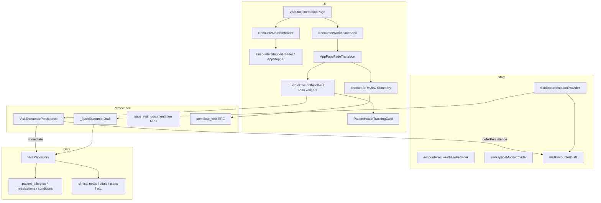

# Senior QA Review — `ui/014-visit-encounter-workspace`

**Base branch:** `ui/master`
**Head:** `ui/014-visit-encounter-workspace` (`470758b`)
**Scope:** 134 files, +19,722 / −1,431 lines across visit encounter workspace UI, deferred persistence, patient safety backend, 10 SQL migrations, and automated tests.

This document analyzes every commit and functional change between `ui/master` and `ui/014-visit-encounter-workspace`, identifies regression and risk areas, and defines a production-oriented test suite. Findings assume the implementation may contain defects.

---

## Executive summary

This branch replaces the flat 013 visit documentation page with a **clinically sequenced encounter workspace**: a joined gradient header + stepper, three documentation phases (Intake, Findings & Diagnosis, Treatment), a read-only Summary step shared by guided and expert modes, a persistent patient health tracking card (allergies, medications, chronic conditions, vitals), and **deferred persistence** that stages structured mutations until save/submit. Backend work adds patient-level safety tables and RPCs, simplifies vital signs, removes coded-diagnosis and structured-plan-output experiments, and tightens `complete_visit` to require at least one visit-level documentation field.

Overall release risk is **High** due to the size of the UI rewrite, the deferred-draft flush path on submit, frontend/backend submit-readiness divergence, and multiple superseding migrations that must apply in order.

**Release confidence blockers to verify manually:**

| Area | Risk |
| ---- | ---- |
| Deferred persistence flush on submit | Partial RPC failure can leave visit incomplete with some draft data persisted and some lost |
| Submit readiness FE vs BE | Frontend counts patient-safety-only and visit-type context as “has content”; backend `visit_has_documentation` does not |
| Rich-text clinical notes | Quill deltas are client-only; plain-text sync on submit depends on `prepareEncounterReview` flush callbacks |
| Joined header + stepper layout | Custom `CustomPainter` shoulder geometry; measurement-driven layout may break at narrow widths or DPI scaling |
| Migration chain | Ten sequential `2026070*` migrations; intermediate states briefly allowed empty or note-only completion |
| Spec / quickstart drift | `quickstart.md` still describes coded diagnosis and structured plan outputs removed in later commits |
| Completed-visit edit mode | New `startInEditMode` route param and `enterWorkspaceEditMode`; stale-write paths need manual verification |

---

## Commit-by-commit change analysis

### `c7b8229` — Adding speckit documents for redesign

| Category | Detail |
| -------- | ------ |
| **Docs** | Full spec kit for feature 014: `spec.md`, `plan.md`, `tasks.md`, contracts, data model, quickstart |

**Affected systems:** Documentation only; defines 8 user stories (P1–P3).

**Regression areas:** None (no runtime code).

**Risks:** Later implementation diverges from spec on coded diagnosis and structured plan outputs (removed in `b0e2c6f` / `20260705120000`).

---

### `326f42c` — Implementing phases 1 to 3

| Category | Detail |
| -------- | ------ |
| **New feature** | `EncounterHeader`, `EncounterPhase` enum, `bmi.dart` domain helper |
| **UI** | Encounter metadata surfaced on documentation and detail pages |

**Affected systems:** `visit_documentation_page.dart`, `visit_detail_page.dart`.

**Regression areas:** Visit header data binding vs underlying `get_visit` payload.

**Risks:** BMI derivation not yet wired into UI at this commit (completed later).

---

### `ae088c3` — Implementing phases 4 and 5

| Category | Detail |
| -------- | ------ |
| **Refactor/UI** | Five-phase regrouping: `encounter_phase_*` widgets, `encounter_documentation_layout.dart`, split `clinical_note_editor.dart` |
| **New feature** | `patient_safety_rail.dart` (later replaced by health tracking card) |
| **Tests** | `encounter_phase_regrouping_test.dart`, `patient_safety_rail_test.dart` |

**Affected systems:** All visit documentation field placement; detail page layout.

**Regression areas:** Every 013 field must remain reachable exactly once; no field duplication.

**Risks:** Phase naming later changes (Context/Assessment merged into other phases).

---

### `a0627ad` — Implementing phases 6 and 7

| Category | Detail |
| -------- | ------ |
| **New feature** | Guided stepper workspace: `encounter_workspace_shell.dart`, `encounter_step_rail.dart`, `encounter_sticky_footer.dart`, `encounter_review.dart` |
| **State** | `encounter_step_provider.dart`, `workspace_mode_provider.dart` |
| **New feature** | Expert mode accordion (`expert_mode_accordion.dart`) |
| **Tests** | `encounter_workspace_test.dart`, `expert_mode_test.dart`, `encounter_step_provider_test.dart` |

**Affected systems:** Visit documentation navigation, Riverpod step state.

**Regression areas:** Non-linear step navigation; save status in sticky footer.

**Risks:** Step rail later replaced by generic `AppStepper` and joined header.

---

### `1c4af50` — Implementing phases 8 and 9

| Category | Detail |
| -------- | ------ |
| **Database** | `20260701120000_visit_encounter_workspace.sql` — patient safety tables, diagnosis catalog, visit extensions, RPCs, RLS |
| **Backend tests** | `visit_encounter_workspace_crud.sql`, `visit_encounter_workspace_rls.sql` |
| **Frontend** | `patient_safety.dart`, safety editors, diagnosis code list, plan details form, repository extensions |
| **State** | `patient_safety_provider.dart`, expanded `visit_documentation_notifier.dart` |

**Affected systems:** `get_visit` payload shape, new RPC surface, visit repository.

**Regression areas:** Backward compatibility of `get_visit` additive keys; cross-branch RLS.

**Risks:** Large migration; diagnosis/plan structured outputs later removed.

---

### `6523c54` — Implementing phases 10 and 11

| Category | Detail |
| -------- | ------ |
| **New feature** | Investigation result capture (`investigation_result_capture_list.dart`), vital sign measurement time, pain score predefined vital |
| **Database** | Migration extension for investigation results and vital sign timestamps |
| **Backend tests** | Additional CRUD cases in encounter workspace suite |

**Affected systems:** Objective phase, `visit_investigation.dart`, vital sign list.

**Regression areas:** Prior-visit pending investigations display and result recording.

---

### `b0e2c6f` — Enhancing design

| Category | Detail |
| -------- | ------ |
| **Database** | `20260702120000_remove_coded_diagnosis.sql` — drops diagnosis catalog RPCs/tables usage from UI path |
| **Refactor** | Removes `visit_diagnosis_code.dart`, diagnosis autocomplete, assessment/context phase widgets |
| **UI** | Header redesign, mode toggle (`encounter_workspace_mode_toggle.dart`), phase label changes |

**Affected systems:** Assessment phase removed from stepper; objective phase now “Findings & Diagnosis”.

**Regression areas:** Any code/tests referencing coded diagnosis.

**Risks:** Spec US7 partially unimplemented; chronic conditions become text-only.

---

### `adc5c41` — Adding a generic stepper UI component + integrating with visits

| Category | Detail |
| -------- | ------ |
| **New feature** | `app_stepper.dart` (768 lines) — reusable stepper with badges |
| **Refactor** | Replaces `encounter_step_rail.dart` with `AppStepper` in workspace shell |
| **Tests** | `app_stepper_test.dart` |

**Affected systems:** Core UI library, visit workspace chrome.

**Regression areas:** Any future features using stepper patterns.

---

### `045b46c`, `647e445`, `800f2d0`, `045b46c` — Enhancing design (×3)

| Category | Detail |
| -------- | ------ |
| **UI** | Iterative visual polish on stepper, cards, phase layouts, tokens |

**Risks:** Visual-only commits still touch functional widgets — regression on layout keys used by tests.

---

### `14c704f` — Merge branch `ui/master` into `ui/014-visit-encounter-workspace`

| Category | Detail |
| -------- | ------ |
| **Merge** | Integrates upstream calendar/queue changes |

**Regression areas:** Appointment detail actions, shared test helpers, router.

---

### `77cd62d` — Making the visit page not depend on the app stepper + adding stepper inside the header with curved corners

| Category | Detail |
| -------- | ------ |
| **New feature** | `encounter_joined_header.dart`, `encounter_joined_header_path.dart`, `encounter_stepper_header.dart` |
| **UI** | Custom shoulder/shelf geometry joining header gradient to stepper |

**Affected systems:** Visit page top chrome; removes app-level stepper dependency.

**Regression areas:** Header measurement post-frame callbacks; back navigation.

**Risks:** Layout fragility at varying widths; `RenderBox` measurement race on first frame.

---

### `2c9227e` — Adding the health profile again with proper design

| Category | Detail |
| -------- | ------ |
| **New feature** | `patient_health_tracking_card.dart` (973 lines) replaces safety rail |
| **UI** | Structured safety editing embedded in Intake phase |

**Affected systems:** Subjective phase, patient safety CRUD (immediate or deferred).

---

### `97134cd`, `2a064cd`, `f76f884`, `d2b4378`, `13c7add`, `a7eaea7` — Design iterations

| Category | Detail |
| -------- | ------ |
| **UI** | Treatment page, summary page initial design, gradient header, unified card tokens (`encounter_field_card.dart`, `visit_page_tokens.dart`) |

**Affected systems:** Plan phase, review summary, shared card styling.

---

### `e0aee08` — Forcing richtext formats in each widget and summary

| Category | Detail |
| -------- | ------ |
| **UI** | `app_paragraph_field.dart` Quill integration; rich deltas in `clinical_note_editor.dart` |
| **State** | `richTextDrafts` map in documentation notifier |

**Risks:** Rich text not persisted to backend — only plain text fields saved via `save_visit_documentation`.

---

### `2a01f28` — Displaying multiple items selected as bullets in the summary page

| Category | Detail |
| -------- | ------ |
| **UI** | Summary bullets for lists; attachment list summary formatting |
| **Tests** | `encounter_review_test.dart` |

---

### `7ad7aff` — Adding transition fade in and fade out

| Category | Detail |
| -------- | ------ |
| **New feature** | `app_page_fade_transition.dart` — documentation ↔ summary cross-fade |
| **Refactor** | Fade logic extracted from `app_stepper.dart` |

**Risks:** Transition during rapid step changes may show stale content briefly.

---

### `ab215e2` — Forcing deferred persistence

| Category | Detail |
| -------- | ------ |
| **New feature** | `visit_encounter_draft.dart`, `visit_encounter_persistence.dart` |
| **State** | Major `visit_documentation_notifier.dart` expansion — stage/flush pattern for vitals, investigations, treatments, attachments, patient safety |
| **UI** | All list builders pass `deferPersistence: canEdit` |

**Affected systems:** Entire structured-data mutation path.

**Regression areas:** 013 immediate-persist behavior replaced for in-progress visits.

**Risks:** **Critical** — navigate away without save/submit loses staged data; partial flush on submit failure.

---

### `0c8658b` — Fixing submit button not working + forcing all fields to be optional

| Category | Detail |
| -------- | ------ |
| **Database** | `20260708120000_allow_empty_visit_documentation_on_complete.sql` |
| **Bug fix** | Submit flow wiring in `visit_documentation_page.dart`, `visit_submit_dialog.dart` |
| **UI** | Appointment detail status actions alignment |

**Risks:** Superseded by later migrations re-requiring documentation.

---

### `7d1bca7` — Designing the expert mode

| Category | Detail |
| -------- | ------ |
| **UI** | Expert mode layout refactor in workspace shell and documentation layout |

---

### `f90d5ee` — Making the summary a common step between guided and expert modes

| Category | Detail |
| -------- | ------ |
| **Refactor** | Summary via `EncounterPhase.review` + `AppPageFadeTransition`; expert scroll-to-section (`expert_mode_scroll_provider.dart`) |
| **State** | Stepper phases reduced to 3 documentation steps; review is separate fade page |
| **Tests** | Expanded `encounter_workspace_test.dart`, `expert_mode_test.dart` |

**Affected systems:** Navigation model, expert edit-from-summary flow.

---

### `6afafb9` — Wrapping summary page in a card

| Category | Detail |
| -------- | ------ |
| **UI** | `EncounterReview` wrapped in `AppCard` |

---

### `e465c20` — Modifying limits on what is acceptable to be entered in the visit

| Category | Detail |
| -------- | ------ |
| **Database** | `20260709120000_require_visit_documentation_on_complete.sql`, then `20260710120000_visit_documentation_any_field_on_complete.sql` |
| **New feature** | `visit_submit_readiness.dart`, `visit_empty_sections_warning_dialog.dart` |
| **Validation** | Section length limits; empty-section warning before submit (non-blocking) |
| **Tests** | `visit_submit_readiness_test.dart` |

**Risks:** Three migrations in four days on `complete_visit` — final rule: any visit-level field (note, vital, investigation, treatment, attachment).

---

### `84471ff` — Adding edit capability

| Category | Detail |
| -------- | ------ |
| **New feature** | Edit completed visits: `startInEditMode` route param, `enterWorkspaceEditMode()`, `encounter_field_card.dart` edit toggles |
| **Routing** | `app_routes.dart`, `router.dart` — documentation route query param |
| **UI** | Detail page routes editable users through documentation provider |

**Regression areas:** Completed visit immutability assumptions elsewhere in app.

---

### `470758b` — Fixing flutter analyze issues

| Category | Detail |
| -------- | ------ |
| **Chore** | Analyze cleanups; removes unused appointment test helper imports |

---

### Backend migrations (chronological)

| Migration | Summary |
| --------- | ------- |
| `20260701120000_visit_encounter_workspace.sql` | Patient safety tables, diagnosis catalog (later removed), RPCs, `get_visit` extensions, RLS |
| `20260702120000_remove_coded_diagnosis.sql` | Drops coded diagnosis; chronic conditions text-only |
| `20260703120000_backfill_predefined_vital_signs.sql` | Seeds predefined vital signs (e.g. pain score) |
| `20260704120000_simplify_vital_signs.sql` | Vital sign schema simplification, BMI-related fields |
| `20260705120000_remove_structured_plan_outputs.sql` | Drops `visit_plan_details` and related RPCs |
| `20260706120000_dev_reset_delete_patient_health_records.sql` | Dev reset includes patient safety tables |
| `20260707120000_delete_visit_attachment.sql` | Attachment delete RPC + storage cleanup |
| `20260708120000_allow_empty_visit_documentation_on_complete.sql` | Temporarily allows empty completion |
| `20260709120000_require_visit_documentation_on_complete.sql` | Requires clinical note content |
| `20260710120000_visit_documentation_any_field_on_complete.sql` | **Final rule:** any visit documentation field |

---

## Cross-cutting architecture



---

## Cross-cutting findings

### Missing test coverage

- Deferred persistence: no automated test for navigate-away data loss, partial flush failure, or draft-id collision under rapid create/archive
- `prepareEncounterReview` + Quill flush: no test that unsubmitted rich-text-only content is reflected in submit readiness
- Patient-safety-only submit: no integration test exposing FE/BE readiness mismatch
- Concurrent sessions: stale `expectedUpdatedAt` on completed-visit re-edit not widget-tested
- Backend: CRUD tests run as `postgres` superuser — PostgREST grant enforcement not covered in encounter suite
- Investigation result on prior visit: limited coverage in frontend tests

### Potential bugs

| ID | Severity | Area | Description | Related change |
| -- | -------- | ---- | ----------- | -------------- |
| BUG-001 | Critical | Submit | Frontend `evaluateVisitSubmitReadiness` treats patient-safety draft and visit type as content; backend `visit_has_documentation` excludes patient safety — submit can pass UI then fail RPC | `e465c20`, `encounter_step_provider.dart` |
| BUG-002 | Critical | Persistence | `_flushEncounterDraft` runs sequential RPCs without transaction — mid-flush failure leaves inconsistent visit state | `ab215e2` |
| BUG-003 | High | Persistence | User closes/navigates away with staged draft (`hasUnsavedChanges`) — no unsaved-changes guard on back button in documentation page | `ab215e2` |
| BUG-004 | High | Rich text | `richTextDrafts` are client-only; plain-text fields may be empty while Quill shows content if flush callback not registered | `e0aee08` |
| BUG-005 | High | Layout | `EncounterJoinedHeader` relies on post-frame `RenderBox` measurement; first paint or resize may misalign stepper shoulders | `77cd62d` |
| BUG-006 | Medium | Badges | `EncounterPhase.context` badge always `empty` in `deriveEncounterPhaseBadges` — dead code path; visit type folded into subjective badge only | `encounter_step_provider.dart` |
| BUG-007 | Medium | Objective | Objective badge uses `visit.vitalSigns` not `effectiveVisit` — staged vitals may not update step badge until flush | `ab215e2` |
| BUG-008 | Medium | Expert mode | `_consumePendingScroll` retries up to N frames — may fail silently if phase key not mounted | `f90d5ee` |
| BUG-009 | Medium | Submit | `completeVisit` in notifier does not pass `expectedUpdatedAt` to repository (dialog param unused in notifier path) | `visit_submit_dialog.dart` |
| BUG-010 | Low | Spec | `quickstart.md` P3 steps reference coded diagnosis and structured plan outputs removed from implementation | `b0e2c6f`, `20260705120000` |

### Potential performance issues

- `patient_health_tracking_card.dart` (~973 lines) rebuilds on every documentation state change
- Deferred draft merges (`effectiveVisit`) copy full visit graphs on each keystroke-stage operation
- `EncounterJoinedHeader` triggers up to three measurement passes per frame cycle
- `AppPageFadeTransition` keeps both documentation and summary subtrees in memory
- Flush on submit issues many sequential RPCs (O(n) per entity type) — slow on large visits
- Quill editors per clinical section — memory on expert mode (all sections mounted)

### Potential security concerns

- Patient safety RPCs use `visits.edit_soap` permission — verify read-only clinical staff cannot mutate via direct RPC
- RLS tests cover cross-org/cross-branch denial for safety tables — manual retest after migration chain
- Deferred attachment bytes held in memory until submit — sensitive files in RAM longer than 013 immediate upload
- `delete_visit_attachment` migration adds storage delete — verify branch scope on storage path
- Completed-visit edit reopens write path — confirm audit log and permission checks on re-save

### Risky implementation decisions

- **Deferred persistence by default** for all structured lists in editable visits — major behavioral change from 013
- **Rich text client-only** — formatting loss on reload is intentional but clinically surprising
- **Removed coded diagnosis after initial migration** — DB tables may exist but UI/RPCs removed; orphaned schema
- **Three-step stepper** merges Assessment into Objective — differs from original five-phase spec
- **Non-blocking empty-section warning** — allows submit with empty Intake and Treatment if any single field elsewhere has content
- **Summary as fade sibling** rather than stepper step — stepper index math uses `stepperPhases.length` for review

### Manual testing required before release

- Full guided workflow on Windows desktop at 1280×900 and 1024×768
- Expert mode toggle mid-documentation with staged draft
- Submit with only allergy added (verify BUG-001)
- Submit after adding only rich-text formatted content (no plain text)
- Navigate back without save after staging vitals/treatments
- Complete visit → re-enter edit mode → modify → save → verify detail view
- Concurrent doctor sessions on same visit (stale documentation)
- Cross-branch user denied access to visit documentation
- Lab staff attachment upload permissions unchanged
- Migration apply on staging DB with existing 013 data
- Dev clinic seed after `20260706120000` patient health reset changes

---

## Test suite

### Functional tests

#### FUNC-001 — Encounter header shows visit metadata

| Field | Value |
| ----- | ----- |
| **Area/Module** | Visit documentation header |
| **Related commit** | `326f42c` — Implementing phases 1 to 3 |
| **Priority** | Critical |
| **Type** | Functional |
| **Preconditions** | In-progress visit with doctor, date, status, optional visit type |

**Steps:**

1. Open visit documentation.
2. Compare header values to `get_visit` record.

**Expected result:** Date/time, doctor name, status indicator, and visit type (if set) match backend; no type shows graceful omission.

---

#### FUNC-002 — All 013 fields reachable in new phase layout

| Field | Value |
| ----- | ----- |
| **Area/Module** | Phase regrouping |
| **Related commit** | `ae088c3` — Implementing phases 4 and 5 |
| **Priority** | Critical |
| **Type** | Functional |
| **Preconditions** | Visit with populated 013 data |

**Steps:**

1. Open documentation in expert mode (all phases visible).
2. Verify Complaint/History under Intake, Examination/Diagnosis under Findings & Diagnosis, Plan/Treatments/Investigations/Attachments under Treatment.
3. Open completed visit detail.

**Expected result:** No field missing or duplicated vs 013; detail view uses same grouping.

---

#### FUNC-003 — Non-linear stepper navigation

| Field | Value |
| ----- | ----- |
| **Area/Module** | Guided workspace |
| **Related commit** | `a0627ad` — Implementing phases 6 and 7 |
| **Priority** | High |
| **Type** | Functional |
| **Preconditions** | In-progress visit, guided mode |

**Steps:**

1. From Intake, click Treatment step in header stepper.
2. Enter a treatment plan line.
3. Click Findings & Diagnosis without visiting Treatment again.

**Expected result:** Direct jump works; entered treatment persists in state.

---

#### FUNC-004 — Summary shows read-only consolidated view

| Field | Value |
| ----- | ----- |
| **Area/Module** | Encounter review |
| **Related commit** | `f90d5ee` — Summary common step |
| **Priority** | Critical |
| **Type** | Functional |
| **Preconditions** | Visit with content in multiple phases |

**Steps:**

1. Finish documentation and open Summary (fade transition).
2. Verify all sections render with bullets for list items.
3. Click edit link on a section.

**Expected result:** Summary is read-only; edit navigates to correct phase (guided) or scrolls (expert).

---

#### FUNC-005 — Submit completes visit and appointment

| Field | Value |
| ----- | ----- |
| **Area/Module** | Visit lifecycle |
| **Related commit** | `e465c20` — Submit limits |
| **Priority** | Critical |
| **Type** | Functional |
| **Preconditions** | In-progress visit with at least one documentation field |

**Steps:**

1. Submit via Summary flow.
2. Confirm dialog → submit.
3. Check visit and linked appointment status.

**Expected result:** Visit `completed`, appointment `completed`, success toast, appointment detail invalidated.

---

#### FUNC-006 — Submit rejected when no documentation

| Field | Value |
| ----- | ----- |
| **Area/Module** | Submit validation |
| **Related commit** | `e465c20` — `visit_documentation_any_field_on_complete` |
| **Priority** | Critical |
| **Type** | Functional |
| **Preconditions** | In-progress visit with empty documentation |

**Steps:**

1. Open fresh visit.
2. Attempt submit without entering any field.

**Expected result:** Client toast: “Enter at least one documentation field…”; RPC not called or returns `DOCUMENTATION_REQUIRED_FOR_COMPLETE` if bypassed.

---

#### FUNC-007 — Empty-section warning is non-blocking

| Field | Value |
| ----- | ----- |
| **Area/Module** | Submit warnings |
| **Related commit** | `e465c20` |
| **Priority** | High |
| **Type** | Functional |
| **Preconditions** | Visit with only one phase filled (e.g. single vital sign) |

**Steps:**

1. Submit visit.
2. Observe empty-section warning dialog.
3. Click “Continue to submit”.

**Expected result:** Warning lists empty Intake/Treatment/etc.; submit proceeds after continue.

---

#### FUNC-008 — Patient safety records persist across visits

| Field | Value |
| ----- | ----- |
| **Area/Module** | Patient safety |
| **Related commit** | `1c4af50` — phases 8 and 9 |
| **Priority** | Critical |
| **Type** | Functional |
| **Preconditions** | Two visits for same patient |

**Steps:**

1. On visit A Intake, add allergy (substance + reaction).
2. Save/submit visit A.
3. Open visit B for same patient.

**Expected result:** Allergy appears in health tracking card without re-entry.

---

#### FUNC-009 — BMI auto-derivation from height/weight

| Field | Value |
| ----- | ----- |
| **Area/Module** | Vital signs |
| **Related commit** | `326f42c` |
| **Priority** | Medium |
| **Type** | Functional |
| **Preconditions** | Predefined height/weight vital signs configured |

**Steps:**

1. Enter height and weight values.
2. Remove weight.

**Expected result:** BMI displays when both present; hides when either removed.

---

#### FUNC-010 — Edit completed visit

| Field | Value |
| ----- | ----- |
| **Area/Module** | Completed visit edit |
| **Related commit** | `84471ff` — Adding edit capability |
| **Priority** | High |
| **Type** | Functional |
| **Preconditions** | Completed visit; user with `visits.edit_soap` |

**Steps:**

1. Open visit detail → Edit.
2. Modify complaint text → Save and close.
3. Reopen detail.

**Expected result:** Changes persisted; visit remains completed.

---

### Frontend tests

#### FE-001 — Guided mode shows only active phase

| Field | Value |
| ----- | ----- |
| **Area/Module** | Workspace shell |
| **Related commit** | `a0627ad` |
| **Priority** | Critical |
| **Type** | Frontend |
| **Preconditions** | Widget test harness with `sampleEncounterDocState` |

**Steps:**

1. Pump `EncounterWorkspaceShell` in guided mode at 1280×900.
2. Assert phase widget keys.

**Expected result:** Only active phase key present; `encounter_workspace_shell` found. (Automated: `encounter_workspace_test.dart`.)

---

#### FE-002 — Expert mode shows all documentation phases

| Field | Value |
| ----- | ----- |
| **Area/Module** | Expert mode |
| **Related commit** | `7d1bca7` |
| **Priority** | High |
| **Type** | Frontend |
| **Preconditions** | Toggle workspace mode to expert |

**Steps:**

1. Switch to expert mode.
2. Verify subjective, objective, plan phase keys visible simultaneously.

**Expected result:** All phase sections mounted in scroll view.

---

#### FE-003 — Mode toggle preserves draft content

| Field | Value |
| ----- | ----- |
| **Area/Module** | Workspace mode |
| **Related commit** | `f90d5ee` |
| **Priority** | High |
| **Type** | Frontend |
| **Preconditions** | In-progress edit |

**Steps:**

1. Enter text in Intake.
2. Toggle expert → guided → expert.

**Expected result:** Text unchanged; no provider reset.

---

#### FE-004 — Summary fade transition

| Field | Value |
| ----- | ----- |
| **Area/Module** | Page transition |
| **Related commit** | `7ad7aff` |
| **Priority** | Medium |
| **Type** | Frontend |
| **Preconditions** | Guided mode |

**Steps:**

1. Navigate to Summary step.
2. Observe `AppPageFadeTransition` index change.

**Expected result:** Documentation view fades out; `EncounterReview` fades in without crash.

---

#### FE-005 — Stepper badges reflect content state

| Field | Value |
| ----- | ----- |
| **Area/Module** | Step badges |
| **Related commit** | `e465c20` |
| **Priority** | High |
| **Type** | Frontend |
| **Preconditions** | Visit with complaint only |

**Steps:**

1. Load visit with complaint text.
2. Inspect stepper badge for Intake.

**Expected result:** `hasContent` badge on Intake; empty on other phases.

---

#### FE-006 — Health tracking card visible on all phases

| Field | Value |
| ----- | ----- |
| **Area/Module** | Patient safety UI |
| **Related commit** | `2c9227e` |
| **Priority** | Critical |
| **Type** | Frontend |
| **Preconditions** | Patient with allergies |

**Steps:**

1. Navigate through Intake, Findings, Treatment, Summary.
2. Observe health card presence.

**Expected result:** Card visible on every phase; read-only when `canEdit` false.

---

#### FE-007 — Joined header renders at narrow width

| Field | Value |
| ----- | ----- |
| **Area/Module** | Header layout |
| **Related commit** | `77cd62d` |
| **Priority** | High |
| **Type** | Frontend |
| **Preconditions** | Window width 1024px |

**Steps:**

1. Pump documentation page at 1024×768.
2. Check for overflow exceptions and stepper/header alignment.

**Expected result:** No layout overflow; stepper remains usable.

---

#### FE-008 — Rich text toolbar layout in Intake

| Field | Value |
| ----- | ----- |
| **Area/Module** | Clinical note editor |
| **Related commit** | `e0aee08` |
| **Priority** | Medium |
| **Type** | Frontend |
| **Preconditions** | Editable visit |

**Steps:**

1. Open Complaint field rich editor.
2. Apply bold/italic.

**Expected result:** Toolbar visible; formatting renders in field. (Automated: `encounter_subjective_toolbar_layout_test.dart`.)

---

#### FE-009 — Field card edit toggle

| Field | Value |
| ----- | ----- |
| **Area/Module** | Encounter field card |
| **Related commit** | `84471ff` |
| **Priority** | Medium |
| **Type** | Frontend |
| **Preconditions** | Completed visit in edit mode |

**Steps:**

1. Tap edit on a field card.
2. Modify value → save.

**Expected result:** Card transitions edit → view; value updated.

---

#### FE-010 — AppStepper generic component

| Field | Value |
| ----- | ----- |
| **Area/Module** | Core UI |
| **Related commit** | `adc5c41` |
| **Priority** | Medium |
| **Type** | Frontend |
| **Preconditions** | None |

**Steps:**

1. Run `app_stepper_test.dart`.

**Expected result:** All stepper interaction tests pass.

---

### Backend tests

#### BE-001 — Patient allergy CRUD RPC

| Field | Value |
| ----- | ----- |
| **Area/Module** | Patient safety RPC |
| **Related commit** | `1c4af50` |
| **Priority** | Critical |
| **Type** | Backend |
| **Preconditions** | Local Supabase with migrations applied |

**Steps:**

1. Run `visit_encounter_workspace_crud.sql` create/update/archive allergy cases.

**Expected result:** All CRUD assertions pass.

---

#### BE-002 — Cross-org patient safety RLS denial

| Field | Value |
| ----- | ----- |
| **Area/Module** | RLS |
| **Related commit** | `1c4af50` |
| **Priority** | Critical |
| **Type** | Backend |
| **Preconditions** | Two org fixtures in RLS suite |

**Steps:**

1. Run `visit_encounter_workspace_rls.sql` cross-org cases.

**Expected result:** Create/update/archive denied; rows hidden across orgs.

---

#### BE-003 — `visit_has_documentation` accepts any visit-level documentation

| Field | Value |
| ----- | ----- |
| **Area/Module** | complete_visit |
| **Related commit** | `e465c20` |
| **Priority** | Critical |
| **Type** | Backend |
| **Preconditions** | See scenarios below |

**Scenario A — vital sign only**

| Preconditions | Visit with single vital sign, empty clinical note |
| ------------- | ------------------------------------------------- |

**Steps:**

1. Complete visit via RPC.

**Expected result:** Success — vital alone satisfies documentation requirement.

**Scenario B — non-vital documentation only**

| Preconditions | Visit with complaint text in clinical note, no vitals/investigations/plans/attachments |
| ------------- | ------------------------------------------------------------------------------------ |

**Steps:**

1. Complete visit via RPC.

**Expected result:** Success — clinical note complaint alone satisfies documentation requirement.

---

#### BE-004 — `visit_has_documentation` rejects empty visit

| Field | Value |
| ----- | ----- |
| **Area/Module** | complete_visit |
| **Related commit** | `e465c20` |
| **Priority** | Critical |
| **Type** | Backend |
| **Preconditions** | Visit with no documentation rows |

**Steps:**

1. Call `complete_visit`.

**Expected result:** `DOCUMENTATION_REQUIRED_FOR_COMPLETE` error.

---

#### BE-005 — Patient safety alone does not satisfy `visit_has_documentation`

| Field | Value |
| ----- | ----- |
| **Area/Module** | complete_visit |
| **Related commit** | `e465c20` |
| **Priority** | Critical |
| **Type** | Backend |
| **Preconditions** | Visit with only `patient_allergies` row, no visit docs |

**Steps:**

1. Add allergy for patient via RPC.
2. Attempt `complete_visit` without visit-level docs.

**Expected result:** `DOCUMENTATION_REQUIRED_FOR_COMPLETE` — documents BUG-001 backend behavior.

---

#### BE-006 — Delete visit attachment includes storage

| Field | Value |
| ----- | ----- |
| **Area/Module** | Attachments |
| **Related commit** | `20260707120000_delete_visit_attachment.sql` |
| **Priority** | High |
| **Type** | Backend |
| **Preconditions** | Attachment with storage object |

**Steps:**

1. Delete attachment via new RPC.
2. Verify DB row archived and storage object removed.

**Expected result:** No orphan storage blob.

---

#### BE-007 — Predefined vital signs backfill

| Field | Value |
| ----- | ----- |
| **Area/Module** | Vital signs |
| **Related commit** | `20260703120000_backfill_predefined_vital_signs.sql` |
| **Priority** | Medium |
| **Type** | Backend |
| **Preconditions** | Fresh migration |

**Steps:**

1. Query predefined vital signs catalog after migration.

**Expected result:** Pain score and other seeds present.

---

#### BE-008 — Dev reset clears patient health records

| Field | Value |
| ----- | ----- |
| **Area/Module** | Dev tooling |
| **Related commit** | `20260706120000` |
| **Priority** | Medium |
| **Type** | Backend |
| **Preconditions** | Dev clinic with safety data |

**Steps:**

1. Run dev reset RPC.
2. Verify `patient_allergies`, medications, conditions empty.

**Expected result:** Clean slate for reinstall tests.

---

#### BE-009 — `visit_medical_records_crud` still passes

| Field | Value |
| ----- | ----- |
| **Area/Module** | Regression |
| **Related commit** | `e465c20` |
| **Priority** | Critical |
| **Type** | Backend |
| **Preconditions** | Full migration chain |

**Steps:**

1. Run `visit_medical_records_crud.sql`.

**Expected result:** All 013-era visit tests pass with updated complete rules.

---

### Integration tests

#### INT-001 — Deferred vital sign appears after saveAll

| Field | Value |
| ----- | ----- |
| **Area/Module** | Deferred persistence |
| **Related commit** | `ab215e2` |
| **Priority** | Critical |
| **Type** | Integration |
| **Preconditions** | In-progress visit, live backend |

**Steps:**

1. Add vital sign (deferred).
2. Call saveAll / submit.
3. Reload visit via `get_visit`.

**Expected result:** Vital persisted with correct values.

---

#### INT-002 — Staged attachment uploads on submit

| Field | Value |
| ----- | ----- |
| **Area/Module** | Attachments |
| **Related commit** | `ab215e2` |
| **Priority** | High |
| **Type** | Integration |
| **Preconditions** | `canUploadAttachments` true |

**Steps:**

1. Pick file during documentation (deferred).
2. Submit visit.
3. Download attachment.

**Expected result:** File accessible; metadata correct.

---

#### INT-003 — Stale documentation on concurrent save

| Field | Value |
| ----- | ----- |
| **Area/Module** | Optimistic concurrency |
| **Related commit** | `013` baseline + `e465c20` |
| **Priority** | High |
| **Type** | Integration |
| **Preconditions** | Two sessions same visit |

**Steps:**

1. Session A loads visit.
2. Session B saves note.
3. Session A submits with old `expectedUpdatedAt`.

**Expected result:** `STALE_DOCUMENTATION` error; user prompted to reload.

---

#### INT-004 — get_visit backward compatibility

| Field | Value |
| ----- | ----- |
| **Area/Module** | API contract |
| **Related commit** | `1c4af50` |
| **Priority** | High |
| **Type** | Integration |
| **Preconditions** | Visit with safety extensions |

**Steps:**

1. Call `get_visit`.
2. Parse with current `VisitDetail` model.

**Expected result:** No parse errors; unknown keys ignored.

---

#### INT-005 — Flutter submit dialog → complete_visit RPC

| Field | Value |
| ----- | ----- |
| **Area/Module** | E2E RPC |
| **Related commit** | `0c8658b` |
| **Priority** | Critical |
| **Type** | Integration |
| **Preconditions** | RPC test client setup |

**Steps:**

1. Drive `VisitSubmitDialog` with mocked repository or test Supabase.
2. Complete visit with documentation.

**Expected result:** Dialog closes with `CompleteVisitResult`; provider state refreshed.

---

### Edge & corner cases

#### EDGE-001 — Patient-safety-only submit (FE/BE mismatch)

| Field | Value |
| ----- | ----- |
| **Area/Module** | Submit readiness |
| **Related commit** | `e465c20` |
| **Priority** | Critical |
| **Type** | Edge |
| **Preconditions** | Empty visit documentation |

**Steps:**

1. Add only an allergy (no vitals, note, etc.).
2. Attempt submit.

**Expected result:** Document actual behavior — likely passes empty-section flow then fails at RPC (BUG-001).

---

#### EDGE-002 — Rich-text-only complaint (no plain text)

| Field | Value |
| ----- | ----- |
| **Area/Module** | Rich text |
| **Related commit** | `e0aee08` |
| **Priority** | High |
| **Type** | Edge |
| **Preconditions** | Editable visit |

**Steps:**

1. Enter formatted text in Quill without plain-text sync.
2. Submit without blurring field.

**Expected result:** Document whether content counts for readiness and persists.

---

#### EDGE-003 — Section length exceeds `kMaxClinicalSectionLength`

| Field | Value |
| ----- | ----- |
| **Area/Module** | Validation |
| **Related commit** | `e465c20` |
| **Priority** | High |
| **Type** | Edge |
| **Preconditions** | Editable visit |

**Steps:**

1. Paste text exceeding max length in Diagnosis.
2. Observe stepper badge and save attempt.

**Expected result:** `error` badge; save blocked with message.

---

#### EDGE-004 — Rapid step switching during fade transition

| Field | Value |
| ----- | ----- |
| **Area/Module** | Navigation |
| **Related commit** | `7ad7aff` |
| **Priority** | Medium |
| **Type** | Edge |
| **Preconditions** | Guided mode |

**Steps:**

1. Click Summary then immediately click Intake.

**Expected result:** No crash; final step matches last click.

---

#### EDGE-005 — Draft ID collision under rapid create

| Field | Value |
| ----- | ----- |
| **Area/Module** | Draft IDs |
| **Related commit** | `ab215e2` |
| **Priority** | Low |
| **Type** | Edge |
| **Preconditions** | In-progress visit |

**Steps:**

1. Rapidly add two vital signs within same microsecond (simulate).

**Expected result:** Unique `draft:` ids; both persist on flush.

---

#### EDGE-006 — Investigation result on prior-visit pending order

| Field | Value |
| ----- | ----- |
| **Area/Module** | Investigations |
| **Related commit** | `6523c54` |
| **Priority** | Medium |
| **Type** | Edge |
| **Preconditions** | Patient with pending investigation from prior visit |

**Steps:**

1. Open new visit.
2. Record result on pending investigation line.

**Expected result:** Result linked to correct investigation; removed from pending list.

---

#### EDGE-007 — Empty rich delta (formatting-only note)

| Field | Value |
| ----- | ----- |
| **Area/Module** | Submit readiness |
| **Related commit** | `e0aee08` |
| **Priority** | Medium |
| **Type** | Edge |
| **Preconditions** | Quill field with empty effective delta |

**Steps:**

1. Apply formatting then remove all text.
2. Check badge and submit eligibility.

**Expected result:** Treated as empty per `richDeltaIsEffectivelyEmpty`.

---

### Regression tests

#### REG-001 — 013 visit list and detail routes still resolve

| Field | Value |
| ----- | ----- |
| **Area/Module** | Routing |
| **Related commit** | `84471ff` |
| **Priority** | High |
| **Type** | Regression |
| **Preconditions** | App router configured |

**Steps:**

1. Run `app_routes_visits_test.dart`.

**Expected result:** Visit routes unchanged except documented edit param.

---

#### REG-002 — Appointment queue unaffected

| Field | Value |
| ----- | ----- |
| **Area/Module** | Appointments |
| **Related commit** | `470758b` |
| **Priority** | Medium |
| **Type** | Regression |
| **Preconditions** | Queue tests |

**Steps:**

1. Run appointment queue unit/widget tests.

**Expected result:** Pass — only test helper import cleanup on this branch.

---

#### REG-003 — Appointment detail status after visit submit

| Field | Value |
| ----- | ----- |
| **Area/Module** | Appointments |
| **Related commit** | `0c8658b` |
| **Priority** | High |
| **Type** | Regression |
| **Preconditions** | Linked appointment in progress |

**Steps:**

1. Submit visit from documentation.
2. Open appointment detail.

**Expected result:** Status shows completed; actions updated (`appointment_detail_status_actions.dart`).

---

#### REG-004 — Visit attachment open/download

| Field | Value |
| ----- | ----- |
| **Area/Module** | Attachments |
| **Related commit** | `84471ff` area |
| **Priority** | Medium |
| **Type** | Regression |
| **Preconditions** | Visit with attachment |

**Steps:**

1. Run `visit_attachment_opener_test.dart`.
2. Open attachment from list.

**Expected result:** Opener invokes correctly.

---

#### REG-005 — Permission denied shows no data leak

| Field | Value |
| ----- | ----- |
| **Area/Module** | Auth/RBAC |
| **Related commit** | `326f42c` |
| **Priority** | Critical |
| **Type** | Regression |
| **Preconditions** | User without branch access |

**Steps:**

1. Navigate to visit URL outside branch scope.

**Expected result:** Access denied; no header metadata leaked.

---

### End-to-end tests

#### E2E-001 — Guided visit documentation happy path

| Field | Value |
| ----- | ----- |
| **Area/Module** | Full workflow |
| **Related commit** | Branch cumulative |
| **Priority** | Critical |
| **Type** | E2E |
| **Preconditions** | Doctor user, checked-in appointment |

**Steps:**

1. Start visit from appointment.
2. Document Intake complaint, add vital, add treatment.
3. Open Summary → submit.
4. Verify appointment queue/calendar shows completed.

**Expected result:** End-to-end completion without errors.

---

#### E2E-002 — Expert mode full documentation

| Field | Value |
| ----- | ----- |
| **Area/Module** | Expert workflow |
| **Related commit** | `f90d5ee` |
| **Priority** | High |
| **Type** | E2E |
| **Preconditions** | Doctor user |

**Steps:**

1. Toggle expert mode.
2. Fill all accordion sections.
3. Submit via Summary.

**Expected result:** Same outcome as guided mode.

---

#### E2E-003 — Completed visit edit workflow

| Field | Value |
| ----- | ----- |
| **Area/Module** | Post-completion edit |
| **Related commit** | `84471ff` |
| **Priority** | High |
| **Type** | E2E |
| **Preconditions** | Completed visit |

**Steps:**

1. Detail → Edit → modify plan → Save and close.
2. Reopen detail.

**Expected result:** Changes visible; status remains completed.

---

### User abuse tests

#### ABUSE-001 — Double-click Submit in dialog

| Field | Value |
| ----- | ----- |
| **Area/Module** | Submit dialog |
| **Related commit** | `0c8658b` |
| **Priority** | High |
| **Type** | User abuse |
| **Preconditions** | Ready to submit |

**Steps:**

1. Rapidly double-click Submit in `VisitSubmitDialog`.

**Expected result:** Single completion; `_isSubmitting` guard prevents duplicate RPC.

---

#### ABUSE-002 — Back navigation during saveAll

| Field | Value |
| ----- | ----- |
| **Area/Module** | Navigation |
| **Related commit** | `ab215e2` |
| **Priority** | High |
| **Type** | User abuse |
| **Preconditions** | Large staged draft |

**Steps:**

1. Stage multiple items.
2. Click Submit then immediately Back.

**Expected result:** Document behavior — potential data loss or orphaned partial flush.

---

#### ABUSE-003 — Rapid mode toggle spam

| Field | Value |
| ----- | ----- |
| **Area/Module** | Workspace mode |
| **Related commit** | `f90d5ee` |
| **Priority** | Medium |
| **Type** | User abuse |
| **Preconditions** | In-progress edit |

**Steps:**

1. Toggle guided/expert 10 times rapidly.

**Expected result:** No crash; state consistent.

---

#### ABUSE-004 — Rapid stepper clicks

| Field | Value |
| ----- | ----- |
| **Area/Module** | Stepper |
| **Related commit** | `adc5c41` |
| **Priority** | Medium |
| **Type** | User abuse |
| **Preconditions** | Guided mode |

**Steps:**

1. Click through all steps rapidly in random order.

**Expected result:** Final active step matches last selection; no exception.

---

#### ABUSE-005 — Refresh during submit

| Field | Value |
| ----- | ----- |
| **Area/Module** | Submit |
| **Related commit** | `ab215e2` |
| **Priority** | High |
| **Type** | User abuse |
| **Preconditions** | Slow network simulated |

**Steps:**

1. Submit visit with throttled RPC.
2. Pull-to-refresh or invalidate provider mid-flight.

**Expected result:** Graceful error or consistent state — no duplicate completion.

---

#### ABUSE-006 — Invalid visit URL

| Field | Value |
| ----- | ----- |
| **Area/Module** | Routing |
| **Related commit** | `84471ff` |
| **Priority** | Low |
| **Type** | User abuse |
| **Preconditions** | Authenticated user |

**Steps:**

1. Navigate to `/visits/not-a-uuid/documentation`.

**Expected result:** Visit not found UI; no crash.

---

## Verification commands

```bash
# Frontend — static analysis
cd frontend
flutter analyze

# Frontend — visit feature unit + widget tests
flutter test test/unit/visits test/widget/visits test/widget/core/ui/app_stepper_test.dart

# Frontend — visit routing regression
flutter test test/unit/visits/app_routes_visits_test.dart

# Backend — full visit medical records suite (includes encounter workspace CRUD + RLS)
cd backend
./tests/run_visit_medical_records_tests.sh

# Backend — individual encounter workspace suites (from backend/)
psql -h 127.0.0.1 -p 54322 -U postgres -d postgres -v ON_ERROR_STOP=1 \
  -f tests/visit_encounter_workspace_crud.sql
psql -h 127.0.0.1 -p 54322 -U postgres -d postgres -v ON_ERROR_STOP=1 \
  -f tests/visit_encounter_workspace_rls.sql

# Apply migrations (dev only)
supabase db reset
```

**Existing automated tests on this branch (extend, do not duplicate):**

- **Unit:** `bmi_test`, `encounter_step_provider_test`, `visit_submit_readiness_test`, `encounter_joined_header_path_test`, `visit_repository_*`, `visit_attachment_*`
- **Widget:** `encounter_workspace_test`, `expert_mode_test`, `encounter_review_test`, `encounter_phase_regrouping_test`, `encounter_objective_vital_sign_form_test`, `encounter_subjective_toolbar_layout_test`, `app_stepper_test`
- **Backend:** `visit_encounter_workspace_crud.sql`, `visit_encounter_workspace_rls.sql`, updated `visit_medical_records_crud.sql`

---

## Coverage matrix

| Change area | Automated coverage | Manual only | Gap |
| ----------- | ------------------ | ----------- | --- |
| Encounter header metadata | Partial | Yes | Loading/error states |
| Phase regrouping | Yes (`encounter_phase_regrouping_test`) | Yes | Detail page parity |
| Guided stepper | Partial (`encounter_workspace_test`) | Yes | Narrow width, joined header |
| Expert mode | Partial (`expert_mode_test`) | Yes | Scroll-to-edit from summary |
| Summary / review | Yes (`encounter_review_test`) | Yes | Rich text in summary |
| Deferred persistence | No | Yes | Flush failure, navigate-away |
| Patient safety CRUD | Backend yes | Yes | FE/BE submit mismatch |
| Submit validation | Unit (`visit_submit_readiness_test`) | Yes | Safety-only submit |
| Completed visit edit | No | Yes | Full edit workflow |
| BMI derivation | Yes (`bmi_test`) | No | — |
| Rich text / Quill | Partial (toolbar layout) | Yes | Persist vs display |
| Attachments deferred | No | Yes | Large files, delete draft attachment |
| Backend RLS | Yes (`visit_encounter_workspace_rls`) | Partial | PostgREST grant path |
| Migration chain | No | Yes | Staging apply on real data |
| Page fade transition | No | Yes | Rapid navigation |
