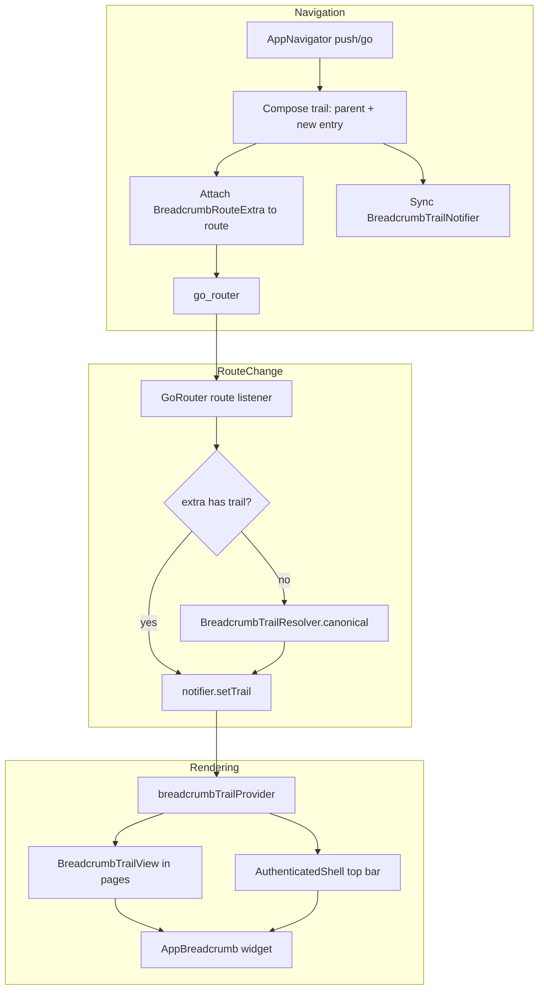

# Dynamic Breadcrumb Architecture Design

**Date:** 2026-07-31  
**Scope:** AiClinic Flutter frontend (`/frontend`)  
**Status:** Design only — for implementation subagent  
**Prerequisite:** [breadcrumb-investigation-findings.md](./breadcrumb-investigation-findings.md)

---

## 1. Problem Statement

Breadcrumbs are hardcoded per page with a fixed “canonical” parent (e.g. visit pages always show `Calendar → Appointment → …`). Cross-feature navigation (Invoices → Visit, Patients → Visit, Queue → Appointment) shows the wrong trail. Back-navigation fallbacks (`_goBack` → `goAppointmentsCalendar()`) share the same incorrect assumption.

The shell top bar and in-page breadcrumbs use separate, uncoordinated sources (URL → sidebar item vs inline `AppBreadcrumb`).

---

## 2. Goals and Non-Goals

### Goals

1. Breadcrumbs reflect the **actual navigation path** (or an explicit, caller-supplied trail).
2. **Extensible** for new routes/features without per-page hardcoding.
3. Reuse existing **`AppBreadcrumb` / `AppBreadcrumbItem`** design-system widgets.
4. Integrate with **`go_router` + `AppNavigator`** patterns already in use.
5. Correct behavior for **`push`** (stack preserved), **`go`** (stack replaced), and **direct URL / deep links**.
6. Align **back navigation** with breadcrumb parent segments.
7. Provide a path toward **localization** (unify mixed l10n / hardcoded English).
8. **Minimize breaking changes** at navigation call sites.

### Non-Goals (this iteration)

- Changing whether features use `push` vs `go` globally (only pass trail context where `go` is kept).
- Web reference parity for visit workspace (web has no visit doc page).
- Breadcrumbs for every shell route (settings, clinic management, etc.) — only routes that already show breadcrumbs plus visit billing.
- Persisting breadcrumb state across app restarts or browser refresh (refresh falls back to canonical).

---

## 3. Architecture Overview

### 3.1 Design Decision: Single Source of Truth

| Layer | Role |
|-------|------|
| **`BreadcrumbTrail` (data)** | Authoritative ordered list of segments for the current route |
| **Route `extra`** | Carries trail per stack entry (survives `pop`, works with `go_router`) |
| **`BreadcrumbTrailNotifier` (Riverpod)** | Mirror of current route’s trail for shell and widgets that lack direct `GoRouterState` access |
| **`BreadcrumbTrailResolver`** | Builds canonical trails for hub pages and deep-link fallbacks |
| **`AppBreadcrumb` (widget)** | Unchanged rendering; fed resolved `AppBreadcrumbItem`s |

**Rendering split (unchanged UX intent, unified data):**

| Surface | When shown | Data source |
|---------|------------|-------------|
| **Shell `AppTopBar.pageContext`** | Hub/list routes only (`BreadcrumbPresentation.shell`) | `breadcrumbTrailProvider` (typically 1 segment) |
| **In-page `AppPageHeader.breadcrumb`** | Detail/workspace routes (`BreadcrumbPresentation.inPage`) | Same provider (multi-segment) |

Detail pages **do not** duplicate crumbs in the top bar. Hub pages **do not** render in-page crumbs. Both read the same trail.

### 3.2 High-Level Flow



### 3.3 Trail Composition Rules

| Navigation mode | Parent trail source | Child trail |
|-----------------|---------------------|-------------|
| **`push`** | Current route’s `extra.breadcrumbTrail`, else resolver for current location | `parent.append(newEntry)` |
| **`go`** | Explicit `trail` param if passed; else same inherit rules; else canonical for destination | `parent.append(newEntry)` or full explicit trail |
| **`pop`** | Previous stack frame’s `extra` (go_router restores) | Observer re-syncs notifier |
| **Direct URL / refresh** | No extra | `BreadcrumbTrailResolver.canonicalFor(location)` |
| **Sidebar `context.go(hub)`** | Canonical for hub (resets to single segment) | N/A |

---

## 4. Data Model

### 4.1 `BreadcrumbLabel`

Supports localization without forcing every call site to resolve strings immediately.

```dart
/// lib/app/navigation/breadcrumb/breadcrumb_label.dart
sealed class BreadcrumbLabel {
  const BreadcrumbLabel();

  /// Pre-resolved display text (legacy / dynamic entity names).
  const factory BreadcrumbLabel.fixed(String text) = FixedBreadcrumbLabel;

  /// Resolved at render time via [AppLocalizations].
  const factory BreadcrumbLabel.l10n(
    String Function(AppLocalizations l10n) getter,
  ) = L10nBreadcrumbLabel;

  String resolve(BuildContext context);
}
```

**Convention:** Hub/section labels use `l10n`; entity-specific labels (patient name, invoice number, appointment label) use `fixed` and may be updated when async data loads.

### 4.2 `BreadcrumbEntry`

```dart
/// lib/app/navigation/breadcrumb/breadcrumb_entry.dart
@immutable
class BreadcrumbEntry {
  const BreadcrumbEntry({
    required this.id,
    required this.label,
    this.targetLocation,
    this.onNavigate,
  });

  /// Stable key within a trail, e.g. `hub:patients`, `patient:abc`, `visit-doc:xyz`.
  final String id;

  final BreadcrumbLabel label;

  /// go_router location for tap navigation (preferred).
  final String? targetLocation;

  /// Optional override when navigation is not a simple `go` (e.g. pop to invoices list).
  final void Function(BuildContext context)? onNavigate;
}
```

**Factories** (recommended for consistency):

```dart
abstract final class BreadcrumbEntries {
  static BreadcrumbEntry hubPatients() => ...;
  static BreadcrumbEntry hubCalendar() => ...;
  static BreadcrumbEntry hubQueue() => ...;
  static BreadcrumbEntry hubInvoices() => ...;
  static BreadcrumbEntry patient(String id, {required String name}) => ...;
  static BreadcrumbEntry appointment(String id, {required String label}) => ...;
  static BreadcrumbEntry invoice(String id, {required String number}) => ...;
  static BreadcrumbEntry visitDocument(String visitId, {String? title}) => ...;
  static BreadcrumbEntry visitDetail(String visitId, {String? title}) => ...;
  static BreadcrumbEntry visitBilling(String visitId) => ...;
}
```

### 4.3 `BreadcrumbTrail`

```dart
/// lib/app/navigation/breadcrumb/breadcrumb_trail.dart
@immutable
class BreadcrumbTrail {
  const BreadcrumbTrail(this.entries);

  final List<BreadcrumbEntry> entries;

  static const empty = BreadcrumbTrail([]);

  BreadcrumbTrail append(BreadcrumbEntry entry) =>
      BreadcrumbTrail([...entries, entry]);

  BreadcrumbTrail updateLabel(String entryId, BreadcrumbLabel label) =>
      BreadcrumbTrail([
        for (final e in entries)
          if (e.id == entryId) BreadcrumbEntry(...copy with label) else e,
      ]);

  BreadcrumbEntry? get parent =>
      entries.length > 1 ? entries[entries.length - 2] : null;

  BreadcrumbEntry? get current =>
      entries.isNotEmpty ? entries.last : null;
}
```

### 4.4 Route Extra Contract

Introduce a shared mixin/interface and extend existing extras.

```dart
/// lib/app/navigation/breadcrumb/breadcrumb_route_extra.dart
abstract interface class BreadcrumbRouteExtra {
  BreadcrumbTrail? get breadcrumbTrail;
}
```

**New file:** `visit_route_extra.dart`

```dart
class VisitRouteExtra implements BreadcrumbRouteExtra {
  const VisitRouteExtra({this.breadcrumbTrail});
  @override
  final BreadcrumbTrail? breadcrumbTrail;

  static VisitRouteExtra fromExtra(Object? extra) {
    if (extra is VisitRouteExtra) return extra;
    if (extra is BreadcrumbRouteExtra) {
      return VisitRouteExtra(breadcrumbTrail: extra.breadcrumbTrail);
    }
    return const VisitRouteExtra();
  }
}
```

**Extend existing extras** (non-breaking — new optional field):

```dart
class PatientDetailRouteExtra implements BreadcrumbRouteExtra {
  const PatientDetailRouteExtra({
    this.preview,
    this.sourceRect,
    this.breadcrumbTrail,
  });
  // ...existing fields...
  @override
  final BreadcrumbTrail? breadcrumbTrail;
}

class AppointmentDetailRouteExtra implements BreadcrumbRouteExtra {
  const AppointmentDetailRouteExtra({
    this.preview,
    this.breadcrumbTrail,
  });
  // ...
}
```

**New:** `InvoiceDetailRouteExtra`, `VisitBillingRouteExtra` (billing currently has no extra).

### 4.5 `BreadcrumbTrailNotifier`

```dart
/// lib/app/navigation/breadcrumb/breadcrumb_trail_provider.dart
class BreadcrumbTrailNotifier extends Notifier<BreadcrumbTrail> {
  @override
  BreadcrumbTrail build() => BreadcrumbTrail.empty;

  void setTrail(BreadcrumbTrail trail) => state = trail;

  void updateEntryLabel(String entryId, BreadcrumbLabel label) {
    state = state.updateLabel(entryId, label);
  }
}

final breadcrumbTrailProvider =
    NotifierProvider<BreadcrumbTrailNotifier, BreadcrumbTrail>(
  BreadcrumbTrailNotifier.new,
);
```

### 4.6 `BreadcrumbTrailResolver`

```dart
/// lib/app/navigation/breadcrumb/breadcrumb_trail_resolver.dart
abstract final class BreadcrumbTrailResolver {
  /// Single-segment hub trail for [location] (sidebar item / page title).
  static BreadcrumbTrail canonicalFor(String location, {Uri? uri});

  /// Reads trail from [GoRouterState.extra] if present.
  static BreadcrumbTrail? fromExtra(Object? extra);

  /// Inherit parent trail for navigation: extra → canonical(current).
  static BreadcrumbTrail inheritFrom(BuildContext context);

  /// Data-driven fallback when visit has appointment metadata (async).
  static Future<BreadcrumbTrail> visitDocumentFallback({
    required String visitId,
    required WidgetRef ref,
  });
}
```

**Canonical hub mapping** (initial set — extend via registry):

| Location prefix | Canonical entry |
|-----------------|-----------------|
| `/patients` (exact list) | `hub:patients` |
| `/appointments/calendar` | `hub:calendar` |
| `/appointments/queue` | `hub:queue` |
| `/billing/invoices` | `hub:invoices` |
| `/appointments/:id` | `hub:calendar` → appointment entry (deep link only) |
| `/visits/:id/document` | `hub:calendar` → `visit-doc` (weak default; see §6) |
| `/billing/visits/:id` | `hub:invoices` → `visit-billing` |

Registry lives in `breadcrumb_trail_resolver.dart` or `breadcrumb_canonical_registry.dart` for extensibility.

### 4.7 Presentation Mode

```dart
/// lib/app/navigation/breadcrumb/breadcrumb_presentation.dart
enum BreadcrumbPresentation { shell, inPage, none }

abstract final class BreadcrumbPresentationConfig {
  static BreadcrumbPresentation forLocation(String location);
}
```

| Pattern | Presentation |
|---------|--------------|
| Hub routes (patients list, invoice list, calendar, queue) | `shell` |
| Detail routes (patient, appointment, invoice, visit doc/detail) | `inPage` |
| Visit billing | `inPage` (new) |
| Unmapped / auth / design system | `none` or existing dev behavior |

---

## 5. API Design

### 5.1 `AppNavigator` Changes

Add optional `BreadcrumbTrail? trail` to methods that need explicit override. Default: **inherit + append** via private helper.

```dart
// lib/app/navigation/app_navigator.dart

void _navigatePush(
  String location, {
  Object? extra,
  BreadcrumbEntry? appendEntry,
  BreadcrumbTrail? trailOverride,
}) {
  final parent = trailOverride ?? BreadcrumbTrailResolver.inheritFrom(_context);
  final trail = appendEntry != null ? parent.append(appendEntry) : parent;
  final syncedExtra = _mergeBreadcrumbExtra(extra, trail);
  _context.push(location, extra: syncedExtra);
  _syncBreadcrumbNotifier(trail);
}

void _navigateGo(
  String location, {
  Object? extra,
  BreadcrumbTrail? trailOverride,
  BreadcrumbEntry? appendEntry,
}) { /* same pattern with _context.go */ }

void _syncBreadcrumbNotifier(BreadcrumbTrail trail) {
  ProviderScope.containerOf(_context, listen: false)
      .read(breadcrumbTrailProvider.notifier)
      .setTrail(trail);
}
```

**Updated public methods** (representative):

```dart
void pushPatientDetail(String id, {PatientListItem? preview, Rect? sourceRect, BreadcrumbTrail? trail}) =>
  _navigatePush(
    AppRoutes.patientDetail(id),
    extra: PatientDetailRouteExtra(preview: preview, sourceRect: sourceRect),
    appendEntry: BreadcrumbEntries.patient(id, name: preview?.displayName ?? '…'),
    trailOverride: trail,
  );

void pushAppointmentDetail(String appointmentId, {AppointmentListItem? preview, BreadcrumbTrail? trail}) =>
  _navigatePush(
    AppRoutes.appointmentDetail(appointmentId),
    extra: AppointmentDetailRouteExtra(preview: preview),
    appendEntry: BreadcrumbEntries.appointment(
      appointmentId,
      label: preview?.breadcrumbLabel ?? '…',
    ),
    trailOverride: trail,
  );

void pushVisitDocument(String visitId, {BreadcrumbTrail? trail}) =>
  _navigatePush(
    AppRoutes.visitDocument(visitId),
    extra: VisitRouteExtra(),
    appendEntry: BreadcrumbEntries.visitDocument(visitId),
    trailOverride: trail,
  );

void goVisitDocument(String visitId, {BreadcrumbTrail? trail}) =>
  _navigateGo(
    AppRoutes.visitDocument(visitId),
    extra: VisitRouteExtra(),
    appendEntry: trail == null ? BreadcrumbEntries.visitDocument(visitId) : null,
    trailOverride: trail,
  );

// Similar: pushVisitDetail, goVisitDetail, pushBillingInvoiceDetail,
// pushVisitBilling, goPatients, goAppointmentsCalendar, etc.
```

**Hub `go*` methods** reset trail to canonical:

```dart
void goPatients() {
  final trail = BreadcrumbTrailResolver.canonicalFor(AppRoutes.patients);
  _context.go(AppRoutes.patients);
  _syncBreadcrumbNotifier(trail);
}
```

### 5.2 Page Consumption

**Preferred:** `BreadcrumbTrailView` widget (new, thin wrapper).

```dart
/// lib/app/navigation/breadcrumb/breadcrumb_trail_view.dart
class BreadcrumbTrailView extends ConsumerWidget {
  const BreadcrumbTrailView({super.key, this.mode = BreadcrumbViewMode.inPage});

  final BreadcrumbViewMode mode;

  @override
  Widget build(BuildContext context, WidgetRef ref) {
    final trail = ref.watch(breadcrumbTrailProvider);
    if (trail.entries.isEmpty) return const SizedBox.shrink();
    return AppBreadcrumb(items: _resolveItems(context, trail));
  }

  List<AppBreadcrumbItem> _resolveItems(BuildContext context, BreadcrumbTrail trail) {
    return [
      for (final entry in trail.entries)
        AppBreadcrumbItem(
          label: entry.label.resolve(context),
          onTap: entry.id == trail.current?.id
              ? null
              : () => _navigateEntry(context, entry),
        ),
    ];
  }
}
```

**Pages replace inline `AppBreadcrumb(...)` with:**

```dart
AppPageHeader(
  title: title,
  breadcrumb: const BreadcrumbTrailView(),
)
```

**Async label refresh** (visit document appointment segment):

```dart
ref.listen(visitDetailViewProvider(visitId), (_, next) {
  next.whenData((view) {
    ref.read(breadcrumbTrailProvider.notifier).updateEntryLabel(
      'appointment:${view.appointmentId}',
      BreadcrumbLabel.fixed(_appointmentBreadcrumbLabel(view)),
    );
  });
});
```

### 5.3 Back Navigation API

```dart
/// lib/app/navigation/breadcrumb/breadcrumb_back_navigation.dart
extension BreadcrumbBackNavigation on BuildContext {
  /// Pops if possible; else navigates to breadcrumb parent; else [fallback].
  void navigateBack({VoidCallback? fallback}) {
    if (canPop()) {
      pop();
      return;
    }
    final trail = ProviderScope.containerOf(this).read(breadcrumbTrailProvider);
    final parent = trail.parent;
    if (parent != null) {
      if (parent.onNavigate != null) {
        parent.onNavigate!(this);
        return;
      }
      if (parent.targetLocation != null) {
        go(parent.targetLocation!);
        return;
      }
    }
    fallback?.call();
  }
}
```

**Visit pages** replace `_goBack` with:

```dart
context.navigateBack(fallback: () => context.nav.goAppointmentsCalendar());
```

Invoice detail keeps `onPopToInvoicesList` behavior by setting `onNavigate` on the `hub:invoices` entry when composing the trail.

### 5.4 GoRouter Integration

**Router builder** — pass extras to visit pages:

```dart
// router.dart
GoRoute(
  path: '.../document',
  builder: (context, state) => VisitDocumentPage(
    visitId: state.pathParameters['visitId']!,
    extra: VisitRouteExtra.fromExtra(state.extra),
    startInEditMode: state.uri.queryParameters['edit'] == '1',
  ),
),
```

**Route listener** (register on `GoRouter`):

```dart
/// lib/app/navigation/breadcrumb/breadcrumb_route_listener.dart
void syncBreadcrumbFromRoute(GoRouterState state, WidgetRef ref) {
  final fromExtra = BreadcrumbTrailResolver.fromExtra(state.extra);
  final trail = fromExtra ?? BreadcrumbTrailResolver.canonicalFor(state.uri.path, uri: state.uri);
  ref.read(breadcrumbTrailProvider.notifier).setTrail(trail);
}
```

Wire in `AuthenticatedShell.build` via `ref.listen` on a `goRouterStateProvider` or existing router delegate notification. If no existing provider, add:

```dart
final currentGoRouterStateProvider = Provider<GoRouterState>((ref) {
  // Implemented via GoRouter's `routerDelegate` listener or shell's GoRouterState.of
});
```

Simplest v1: call `syncBreadcrumbFromRoute` at the top of `AuthenticatedShell.build` (idempotent, runs each rebuild).

---

## 6. Fallback Behavior

### 6.1 Direct URL / Empty Stack

| Route | Default canonical trail | Back fallback |
|-------|------------------------|---------------|
| `/visits/:id/document` | `[Calendar, Visit documentation]` | `goAppointmentsCalendar()` |
| `/visits/:id/detail` | `[Calendar, Visit chronicle]` | `goAppointmentsCalendar()` |
| `/patients/:id` | `[Patients, …]` (name placeholder until loaded) | `goPatients()` |
| `/billing/invoices/:id` | `[Invoices, …]` | `goBillingInvoices()` |
| `/appointments/:id` | `[Calendar, …]` | `goAppointmentsCalendar()` |

### 6.2 Data-Enhanced Visit Fallback (recommended enhancement)

When visit document loads and no meaningful trail was in `extra` (deep link), optionally **replace** weak canonical trail:

1. Fetch visit → appointment id + label.
2. If trail is exactly the weak default, upgrade to `[Calendar, {appointmentLabel}, Visit documentation]`.

Guard: only upgrade when `extra.breadcrumbTrail == null` to avoid overwriting a correct cross-feature trail.

### 6.3 `go` Without Inherited Parent

`openVisitFromPatientHistory` uses `goVisitDocument` (replaces stack). **Fix:** pass explicit trail:

```dart
final parent = BreadcrumbTrailResolver.inheritFrom(context);
context.nav.goVisitDocument(
  visit.id,
  trail: parent.append(BreadcrumbEntries.visitDocument(visit.id)),
);
```

At patient detail, inherited trail is `[Patients, {name}]` → result `[Patients, {name}, Visit documentation]`.

### 6.4 Sidebar Navigation

`context.go(hubRoute)` via sidebar resets to canonical single-segment trail. Does not preserve detail history (expected for hub navigation).

---

## 7. Localization Strategy

### Phase 1 (this implementation)

Add ARB keys for hub/section labels used in breadcrumbs:

| Key | English | Used for |
|-----|---------|----------|
| `breadcrumbCalendar` | Calendar | Appointments calendar hub |
| `breadcrumbQueue` | Queue | Queue hub |
| `breadcrumbInvoices` | Invoices | Billing hub |
| `patients` | (existing) | Patients hub |
| `breadcrumbVisitDocumentation` | Visit documentation | Visit doc leaf |
| `breadcrumbVisitChronicle` | Visit chronicle | Visit detail leaf |
| `breadcrumbVisitBilling` | Billing | Visit billing leaf |
| `breadcrumbNotFound` | Not found | Error states |

Use `BreadcrumbLabel.l10n((l10n) => l10n.breadcrumbCalendar)` in `BreadcrumbEntries` factories.

Entity names (patient name, invoice number) remain `BreadcrumbLabel.fixed`.

### Phase 2 (follow-up)

Migrate page titles and error copy on the same pages to l10n.

---

## 8. Integration Points

### 8.1 `AuthenticatedShell`

```dart
final presentation = BreadcrumbPresentationConfig.forLocation(location);
final trail = ref.watch(breadcrumbTrailProvider);

// Sync trail from route on every build (or via listener)
syncBreadcrumbFromRoute(routerState, ref);

final pageContext = presentation == BreadcrumbPresentation.shell && trail.entries.isNotEmpty
    ? BreadcrumbTrailView(mode: BreadcrumbViewMode.shell)
    : null;
```

Remove direct call to `ShellNavConfig.breadcrumbForLocation` for production routes (keep for design-system dev section or delegate dev to resolver).

### 8.2 `ShellNavConfig`

- **Keep** `itemIdForLocation` (sidebar active state) — unchanged.
- **Add** `visits` branch to `itemIdForLocation` → `'encounters'` or `'appointments-calendar'` (product decision: recommend `'encounters'` if encounters nav exists, else `'appointments-calendar'` for visit workspace sidebar highlight).
- **Deprecate** `breadcrumbForLocation` in favor of `BreadcrumbTrailResolver` + provider; keep as thin delegate during migration if needed.

### 8.3 `AppNavigator`

Central composition point — all trail mutations go through here for consistency.

### 8.4 Cross-Feature Navigation Call Sites

These call sites should work **without changes** once `AppNavigator` inherits trails, except where `go` replaces stack and parent is lost:

| File | Call | Change needed |
|------|------|---------------|
| `invoice_detail_page.dart` | `pushVisitDocument` | None (inherit `[Invoices, INV-x]`) |
| `visit_navigation.dart` | `goVisitDocument` / `goVisitDetail` | Pass `trail:` built from `inheritFrom` |
| `appointment_detail_open_visit_button.dart` | `pushVisitDocument` | None |
| `visit_billing_page.dart` | `goVisitDocument` | Pass trail with billing parent |
| `visit_summary_section.dart` | `pushVisitBilling` | None (inherit visit doc trail) |
| `queue_appointments_table.dart` | `pushAppointmentDetail` | None (inherit `[Queue]`) |
| `appointment_calendar_page.dart` | `pushAppointmentDetail` | None (inherit `[Calendar]`) |

### 8.5 Router

Pass `VisitRouteExtra`, `InvoiceDetailRouteExtra` through builders.

---

## 9. Migration Plan

### Phase A — Infrastructure (no visible UI change)

| File | Action |
|------|--------|
| `lib/app/navigation/breadcrumb/breadcrumb_label.dart` | **Create** |
| `lib/app/navigation/breadcrumb/breadcrumb_entry.dart` | **Create** |
| `lib/app/navigation/breadcrumb/breadcrumb_trail.dart` | **Create** |
| `lib/app/navigation/breadcrumb/breadcrumb_route_extra.dart` | **Create** |
| `lib/app/navigation/breadcrumb/breadcrumb_trail_resolver.dart` | **Create** |
| `lib/app/navigation/breadcrumb/breadcrumb_trail_provider.dart` | **Create** |
| `lib/app/navigation/breadcrumb/breadcrumb_presentation.dart` | **Create** |
| `lib/app/navigation/breadcrumb/breadcrumb_trail_view.dart` | **Create** |
| `lib/app/navigation/breadcrumb/breadcrumb_back_navigation.dart` | **Create** |
| `lib/features/visits/presentation/navigation/visit_route_extra.dart` | **Create** |
| `lib/features/billing/presentation/navigation/invoice_detail_route_extra.dart` | **Create** |
| `lib/features/billing/presentation/navigation/visit_billing_route_extra.dart` | **Create** |
| `lib/l10n/app_en.arb`, `app_ar.arb` | **Add** breadcrumb keys |
| `lib/app/navigation/app_navigator.dart` | **Modify** — trail composition helpers |
| `lib/app/router.dart` | **Modify** — pass extras to visit/billing builders |
| `lib/app/shell/authenticated_shell.dart` | **Modify** — provider + presentation mode |
| `patient_detail_route_extra.dart` | **Modify** — add `breadcrumbTrail` |
| `appointment_detail_route_extra.dart` | **Modify** — add `breadcrumbTrail` |

### Phase B — Page migration (visible fix)

| File | Action |
|------|--------|
| `visit_document_page.dart` | Remove hardcoded `AppBreadcrumb`; use `BreadcrumbTrailView`; replace `_goBack` with `navigateBack`; async label updates for appointment segment |
| `visit_detail_page.dart` | Add `BreadcrumbTrailView` in header (new); `navigateBack` for any back actions |
| `appointment_detail_page.dart` | Replace hardcoded breadcrumb with `BreadcrumbTrailView`; update labels when title loads |
| `patient_detail_page.dart` | Replace `_buildBreadcrumb` with `BreadcrumbTrailView`; update patient name on load |
| `invoice_detail_page.dart` | Replace inline `AppBreadcrumb` (2 places) with `BreadcrumbTrailView`; ensure invoices hub entry uses `onNavigate` for list pop semantics |
| `visit_billing_page.dart` | Add `AppPageHeader` + `BreadcrumbTrailView`; fix `goVisitDocument` call to pass trail |

### Phase C — Navigation call sites

| File | Action |
|------|--------|
| `visit_navigation.dart` | Pass explicit `trail` on `goVisitDocument` / `goVisitDetail` |
| `visit_billing_page.dart` | Pass trail when returning to visit document |

### Phase D — Shell config cleanup

| File | Action |
|------|--------|
| `shell_nav_config.dart` | Map visit locations in `itemIdForLocation`; deprecate `breadcrumbForLocation` |

### Phase E — Tests (see §10)

Update widget tests that assert Calendar-based assumptions.

---

## 10. Test Strategy Outline

### 10.1 Unit Tests

| File | Cases |
|------|-------|
| `test/unit/navigation/breadcrumb_trail_test.dart` | `append`, `updateLabel`, `parent`/`current` |
| `test/unit/navigation/breadcrumb_trail_resolver_test.dart` | Canonical trails per location; `fromExtra` parsing |
| `test/unit/navigation/breadcrumb_label_test.dart` | `fixed` vs `l10n` resolution |
| `test/unit/visits/visit_route_extra_test.dart` | Extra parsing |
| Extend `patient_detail_route_extra_test.dart`, `appointment_detail_route_extra_test.dart` | Trail field preserved |

### 10.2 Widget / Integration Tests

| File | Update / add |
|------|--------------|
| `visit_document_page_test.dart` | **Invoice → visit path:** mock trail `[Invoices, INV-1, Visit documentation]`; assert labels; middle crumb navigates to invoice; back pops |
| `visit_document_page_test.dart` | **Calendar path:** inherit `[Calendar, Appt, Visit doc]` still works |
| `visit_document_page_test.dart` | **Deep link:** no extra → canonical; back → calendar |
| `invoice_detail_page_test.dart` | Trail from list → detail; visit link preserves invoice parent in visit crumbs |
| `appointment_detail_page_test.dart` | Queue origin: trail starts with Queue not Calendar |
| `patient_detail_page_test.dart` | Patients crumb uses l10n; patient → visit flow (if harness supports) |
| New: `breadcrumb_trail_view_test.dart` | Renders N items; last item not tappable; tap calls `go` |

### 10.3 Test Harness Updates

- `createVisitsTestRouter` / billing / patients harnesses: support injecting `BreadcrumbRouteExtra` on push.
- Router log assertions: verify navigation targets from crumb taps match trail `targetLocation`.

### 10.4 Manual QA Scenarios

1. Invoices → invoice detail → view visit → crumbs show `Invoices → INV-x → Visit documentation`; back returns to invoice.
2. Patients → patient → open visit → crumbs show `Patients → name → Visit documentation`.
3. Queue → appointment → crumbs show `Queue → title`.
4. Calendar → appointment → visit → crumbs unchanged (regression).
5. Visit doc → billing → crumbs extend; back to visit doc preserves invoice-origin trail if applicable.
6. Direct URL `/visits/:id/document` → canonical fallback; back goes to calendar.
7. RTL locale → chevrons mirror; l10n hub labels on Arabic.
8. Viewport &lt; 640px → in-page crumbs visible; top bar crumbs hidden.

---

## 11. Trade-offs and Alternatives

### 11.1 Chosen: Route Extra + Notifier Mirror

**Pros:** Works with `pop`; explicit per stack frame; testable; minimal page logic.  
**Cons:** Must keep notifier in sync; `AppNavigator` must attach extras consistently.

### 11.2 Alternative: Notifier-Only Stack

Maintain internal stack in notifier, updated only by `AppNavigator`.

**Pros:** Simpler mental model.  
**Cons:** Breaks on browser back / `pop` unless coupled to `GoRouter` observer; duplicated state.

**Rejected** — pop restoration is critical.

### 11.3 Alternative: Parse GoRouter Match Stack

Derive trail from matched routes chain.

**Pros:** No extra payload.  
**Cons:** `go_router` stack does not carry feature labels (patient name, invoice number); URLs alone are insufficient for entity crumbs.

**Rejected** — labels require feature context.

### 11.4 Alternative: Top Bar Only (Remove In-Page)

**Pros:** Single rendering surface.  
**Cons:** Mobile hides top bar crumbs (&lt; 640px); visit workspace uses in-page header heavily.

**Rejected** — violates design system mobile pattern.

### 11.5 Alternative: Change All `go` to `push` for Visits

**Pros:** Natural stack preservation.  
**Cons:** Large behavioral change; URL/bookmark semantics; out of scope.

**Partially adopted** — only pass explicit `trail` on `go` where kept.

### 11.6 Risk: Drift if Raw `context.push` Used

Mitigation: `_navigatePush` centralization; lint rule (future) banning raw `context.push` outside `AppNavigator`; code review.

---

## 12. Expected Outcomes by Scenario

| Scenario | Before | After |
|----------|--------|-------|
| Invoices → Visit | `Calendar → Appt → Visit doc` | `Invoices → INV-x → Visit doc` |
| Patients → Visit (`go`) | `Calendar → …` | `Patients → Name → Visit doc` |
| Queue → Appointment | `Calendar → Title` | `Queue → Title` |
| Calendar → Appt → Visit | `Calendar → Appt → Visit doc` | Same (no regression) |
| Visit deep link | `Calendar → …`; back → calendar | Canonical default (optionally data-enriched) |
| Invoice crumb tap | Pop to list | `onNavigate` / `targetLocation` → invoices list |
| Visit back with stack | `pop()` | `pop()` (unchanged) |

---

## 13. Implementation Checklist for Subagent

- [ ] Create breadcrumb module files (§4, §9 Phase A)
- [ ] Extend route extras + router builders
- [ ] Update `AppNavigator` with `_navigatePush` / `_navigateGo` / hub resets
- [ ] Wire `AuthenticatedShell` sync + presentation mode
- [ ] Migrate 5 feature pages + visit billing
- [ ] Fix `visit_navigation.dart` explicit trail on `go`
- [ ] Add l10n keys and use in `BreadcrumbEntries`
- [ ] Replace `_goBack` with `navigateBack`
- [ ] Update unit + widget tests (§10)
- [ ] Run `flutter test` on affected packages
- [ ] Manual QA on scenarios in §10.4

---

## 14. File Index (Quick Reference)

**New:** `lib/app/navigation/breadcrumb/*`, `visit_route_extra.dart`, `invoice_detail_route_extra.dart`, `visit_billing_route_extra.dart`

**Modified:** `app_navigator.dart`, `router.dart`, `authenticated_shell.dart`, `shell_nav_config.dart`, `visit_document_page.dart`, `visit_detail_page.dart`, `appointment_detail_page.dart`, `patient_detail_page.dart`, `invoice_detail_page.dart`, `visit_billing_page.dart`, `visit_navigation.dart`, `patient_detail_route_extra.dart`, `appointment_detail_route_extra.dart`, `app_en.arb`, `app_ar.arb`, test files listed in §10

**Unchanged:** `app_breadcrumb.dart`, `app_page_header.dart`, `app_top_bar.dart` (rendering only)
