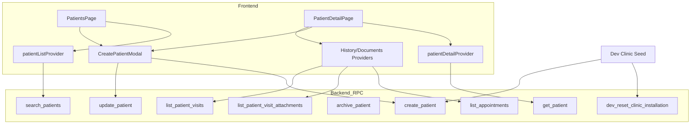

# QA Test Plan & Release Analysis — `ui/007-patients`

**Base branch:** `ui/master`
**Feature branch:** `ui/007-patients`
**Analysis date:** 2026-06-13
**Analyst role:** Senior QA / Code Reviewer
**Diff scope:** 107 files, ~10,112 insertions / ~191 deletions across 12 commits

---

## Executive Summary

This branch delivers **V1-3 Patient Management UI**: a paginated patients list with search, filters, and sort; a full patient detail page with timeline, documents, and notes; create/edit patient modals with duplicate detection; container-transform navigation; and debug-only dev clinic seed tooling. Backend work extends `search_patients`, adds `list_appointments` patient filter, `list_patient_visit_attachments`, and environment-gated `dev_reset_clinic_installation`.

Several **high-severity issues from early review were fixed** in commit `729e73c` (server-side filter/sort, patient-scoped appointments, batch attachments RPC, removed broken Assigned Doctor filter, branch-change reload, phone validation, avatar optimization). **Remaining release risks** include: patient list not invalidated after delete, no SQL tests for new filter/sort RPC params, missing widget/E2E coverage for list page and navigation transitions, and destructive dev seed tooling that must stay debug-gated.

**Release recommendation:** Conditional go — merge after addressing delete-list staleness and completing manual regression on list filters/sort across multi-page datasets.

---

## Commit-by-Commit Change Analysis

| Commit    | Summary                                                                                                                                        | Category                                 | Affected Systems                                                                                             | Regression Areas                                                                  | Risks                                                                                                          |
| --------- | ---------------------------------------------------------------------------------------------------------------------------------------------- | ---------------------------------------- | ------------------------------------------------------------------------------------------------------------ | --------------------------------------------------------------------------------- | -------------------------------------------------------------------------------------------------------------- |
| `0265f39` | Patients list UI, filters model, dev dummy clinic seed, `search_patients` prefix ranking, `dev_reset` RPC                                      | **New feature**, UI, API, DB (functions) | Frontend patients module, shell nav, core widgets (`AppDataTable`, `AppBadge`, `AppIconButton`), backend RPC | Settings shell layout, existing patient RPC contracts, dev/test DB reset flows    | `dev_reset` FK ordering bug (fixed later in `660eae2`); initial client-side filter design (fixed in `729e73c`) |
| `ad818bc` | Patient detail placeholder, container-transform transition, deferred loading, paginated slide switcher                                         | **New feature**, UI, navigation          | Router, `PatientDetailPage`, `AppNavigator`, core feedback widgets                                           | GoRouter page transitions, list row tap → detail navigation                       | Deep-link to detail without `sourceRect` may skip animation gracefully but needs verification                  |
| `7782ccb` | Full patient detail layout (wide/medium/compact), timeline, documents, notes cards, gender avatars, history providers                          | **New feature**, UI, state management    | Detail page decomposition, visit/appointment providers, settings card grid tweaks                            | Settings page card layout, visit/appointment repository usage                     | N+1 `get_visit` pattern introduced (fixed in `729e73c`); large avatar PNGs (fixed in `729e73c`)                |
| `67ecb91` | Overflow fix on detail page                                                                                                                    | **Bug fix**, UI                          | Patient detail widgets                                                                                       | Responsive layouts at breakpoints                                                 | Low — verify no new clipping                                                                                   |
| `404d248` | Pixel overflow during window resize                                                                                                            | **Bug fix**, UI                          | Detail page layout                                                                                           | Window resize during loading/loaded states                                        | Medium — resize while animating transition                                                                     |
| `17e54d5` | Patient detail header bar (back, edit, delete)                                                                                                 | **UI**, permissions                      | `_PatientDetailHeader`, auth guards                                                                          | Header action visibility by role                                                  | Edit disabled until patient loaded; delete without list invalidation                                           |
| `1b1c1dd` | Flutter analyze fixes                                                                                                                          | **Refactor**                             | Various frontend files                                                                                       | CI analyze gate                                                                   | Low                                                                                                            |
| `660eae2` | Fix `dev_reset` audit_log FK order; test harness updates                                                                                       | **Bug fix**, API/DB                      | `dev_reset_clinic_installation`, boundary tests                                                              | Dev reset in local/test environments                                              | Medium if migrations applied partially                                                                         |
| `c6820ac` | Create patient modal + duplicate candidates dialog                                                                                             | **New feature**, UI, state               | `CreatePatientModal`, patients page toolbar                                                                  | Patient create RPC, permission gates                                              | Duplicate flow UX; branch required for create                                                                  |
| `b25e83a` | Edit patient via same modal (`showEdit`)                                                                                                       | **New feature**, UI                      | Detail header, modal dual-mode                                                                               | Optimistic concurrency (`expectedUpdatedAt`), update RPC                          | Stale edit conflicts; list refresh on edit (fixed in `729e73c`)                                                |
| `729e73c` | Code review fixes: server filter/sort, appointment patient filter, attachments RPC, phone validation, avatar compression, remove doctor filter | **Bug fix**, API, performance            | `search_patients`, `list_appointments`, `list_patient_visit_attachments`, repositories, providers            | All list filter/sort behavior; appointment listing callers; detail documents load | Migration overload churn for `list_appointments` (fixed in `7ea71f4`)                                          |
| `7ea71f4` | Drop legacy `list_appointments` overload; grant fix                                                                                            | **Bug fix**, API                         | Appointment RPC signature                                                                                    | Any caller using old 5-arg overload                                               | **Critical** if migration `161600`/`170000` applied without `180000`                                           |

---

## Functional Change Inventory

### New Features
- Patients list page (`/patients`) with search, branch/last-visit filters, sort, pagination
- Patient detail page (`/patients/:patientId`) with profile, basic info, notes, timeline (past/upcoming), documents
- Create patient modal from list; edit patient modal from detail header
- Duplicate candidate warning dialog on create/update
- Container-transform navigation from list row to detail
- Debug-only "Fill Dummy Clinic" dev tool (full org seed after wipe)
- Shell nav entry for Patients

### Bug Fixes
- Layout overflow on detail page (resize + static)
- `dev_reset_clinic_installation` audit_log deletion order
- Client-side filter/sort pagination inconsistency → moved to server
- N+1 visit attachment fetches → single RPC
- Branch-wide appointment fetch → patient-filtered
- Assigned Doctor filter removed (was broken)
- Active branch change now reloads patient list
- Phone input restricted to digits with length validation
- Avatar assets compressed; `cacheWidth`/`cacheHeight` applied
- `list_appointments` function overload ambiguity resolved

### Refactors
- `PatientTableRow` simplified (removed unused `assignedDoctorName`)
- Setup dummy-data flow moved from `setupNotifier` to `ShellDevFillDummyClinic` / `devClinicSeedProvider`
- Shared core widgets extracted (`AppDataTable`, `AppDeferredLoading`, `AppPaginatedSlideSwitcher`, etc.)

### UI Changes
- New patients table, toolbar, filter sidebar, sort popover, empty states, skeleton
- Responsive detail layouts: wide (≥1080px), medium (≥720px), compact
- Gender-specific avatars with neutral fallback for null gender
- Settings cards grid minor layout adjustments

### API Changes
- `search_patients`: new params `p_last_visit_filter`, `p_sort_field`; extended response with `last_visit_at`, `next_appointment_at`
- `list_appointments`: new optional `p_patient_id`
- **New RPC:** `list_patient_visit_attachments(p_patient_id, p_limit, p_offset)`
- **New RPC:** `dev_reset_clinic_installation()` (environment-gated)
- Dropped legacy `list_appointments(uuid, timestamptz, timestamptz, uuid, text[])` overload

### Database Changes
- New indexes: `appointments_patient_start_idx` (from visit/appointment fields migration)
- Multiple `CREATE OR REPLACE FUNCTION` migrations (non-destructive DDL)
- No column/table drops in production paths

### State Management Changes
- `patientListProvider` (`AsyncNotifier`) with filter state
- `patientDetailProvider`, `patientDetailHistoryTabProvider`
- `patientPastVisitsProvider`, `patientUpcomingAppointmentsProvider`, `patientVisitDocumentsProvider`
- `devClinicSeedProvider` for debug seed progress

### Permission / Security Changes
- Route guards: `canAccessPatientList`, `canAccessPatientRegistration`, `canAccessPatientEdit`, `canAccessPatientDelete`
- `patientRouteRedirect` in router
- RPC permission checks unchanged pattern (`patients.view`, org/branch scoping)
- `list_patient_visit_attachments`: clinical vs upload access for `can_download`
- Dev seed and `dev_reset` gated: `kDebugMode` (frontend), `app.environment` (backend)

### Performance-Related Changes
- Server-side filter/sort reduces client over-fetching
- Patient-scoped appointment query (vs full branch year)
- Single attachments RPC vs N+1 `get_visit`
- Avatar decode size capped via `cacheWidth`/`cacheHeight`
- Search uses trigram/prefix indexes (existing + new partial index)

---

## System Impact Map

---

## Identified Defects & Risk Register

| ID  | Severity   | Area          | Description                                                                                                                                              | Related Change       |
| --- | ---------- | ------------- | -------------------------------------------------------------------------------------------------------------------------------------------------------- | -------------------- |
| R1  | **High**   | State         | After delete, navigates back but **does not invalidate `patientListProvider`** — deleted patient may still appear until manual refresh                   | `17e54d5`            |
| R2  | **High**   | Backend tests | **No SQL tests** for `p_last_visit_filter` / `p_sort_field` on `search_patients`                                                                         | `729e73c`            |
| R3  | **Medium** | UX            | `/patients/:id/edit` route remains **placeholder**; edit only via modal (deep-link/edit URL broken)                                                      | `b25e83a`            |
| R4  | **Medium** | Correctness   | Upcoming appointments use **patient's branchId**, not viewer's active branch — org-wide list patient from another branch may show wrong/missing upcoming | `7782ccb`            |
| R5  | **Medium** | Validation    | UI requires DOB + gender on create/edit; **backend allows null** — API clients could bypass; inconsistent if validation relaxed later                    | `c6820ac`            |
| R6  | **Medium** | Performance   | `search_patients` last-visit filter uses **correlated subqueries per patient** on count + select — may slow on large orgs                                | `729e73c`            |
| R7  | **Low**    | UX            | Search + custom sort: `name_match_rank` still primary in ORDER BY — sort may feel unexpected during active search                                        | `729e73c`            |
| R8  | **Low**    | Migration     | Multiple superseded function definitions within branch — partial apply order matters for `dev_reset`                                                     | `0265f39`, `660eae2` |
| R9  | **Low**    | Test gap      | No widget tests for `PatientsPage`, `PatientsTable`, sort popover, container transform                                                                   | All UI commits       |

---

## Comprehensive Test Suite

### Test Case Legend

- **Priority:** Critical / High / Medium / Low
- **Type:** Frontend (FE), Backend (BE), Integration (INT), E2E, Regression (REG)

---

### A. Patients List — Functional

| Test ID  | Area/Module                                   | Related Commit | Priority | Type   | Preconditions                                        | Steps                                   | Expected Result                                                             |
| -------- | --------------------------------------------- | -------------- | -------- | ------ | ---------------------------------------------------- | --------------------------------------- | --------------------------------------------------------------------------- |
| PL-F-001 | Patients List / Load                          | `0265f39`      | Critical | INT    | User with `patients.view`, active branch, ≥1 patient | Navigate to `/patients`                 | Table renders with patient rows; pagination footer shows correct total      |
| PL-F-002 | Patients List / Empty clinic                  | `0265f39`      | High     | FE     | New clinic, zero patients, no filters                | Open patients page                      | "No patients yet" empty state with add CTA (if `patients.create`)           |
| PL-F-003 | Patients List / Permission denied             | `0265f39`      | Critical | FE     | User without `patients.view`                         | Navigate to `/patients`                 | Permission denied message; no RPC leak                                      |
| PL-F-004 | Patients List / Search name happy             | `0265f39`      | Critical | INT    | Patients "Alice", "Bob" exist                        | Type "Ali" (≥3 chars), wait debounce    | Only matching patients shown; hint cleared                                  |
| PL-F-005 | Patients List / Search phone happy            | `0265f39`      | Critical | INT    | Patient phone `201234567890`                         | Type `2012345` (≥2 digits)              | Phone-prefix matches returned                                               |
| PL-F-006 | Patients List / Search too short name         | `0265f39`      | High     | FE     | On patients page                                     | Type "Al" (2 chars)                     | Inline hint; empty table; no RPC error toast                                |
| PL-F-007 | Patients List / Search too short phone        | `0265f39`      | High     | FE     | On patients page                                     | Type "2" (1 digit)                      | Validation hint displayed                                                   |
| PL-F-008 | Patients List / Search no match               | `0265f39`      | Medium   | INT    | Populated list                                       | Search "ZZZZNOTFOUND"                   | "No matches" empty state                                                    |
| PL-F-009 | Patients List / Clear search                  | `0265f39`      | Medium   | FE     | Active search filter                                 | Clear search field                      | Full list restored; page resets to 1                                        |
| PL-F-010 | Patients List / Pagination next               | `0265f39`      | Critical | INT    | >20 patients                                         | Click next page                         | New rows loaded; footer "Showing 21–40 of N"; slide animation               |
| PL-F-011 | Patients List / Pagination prev               | `0265f39`      | High     | INT    | On page 2                                            | Click previous                          | Page 1 rows; correct offset                                                 |
| PL-F-012 | Patients List / Pagination disabled at bounds | `0265f39`      | Medium   | FE     | Page 1 of 1                                          | Observe footer                          | Prev/next disabled                                                          |
| PL-F-013 | Patients List / Rapid pagination              | `0265f39`      | High     | FE     | Multi-page list                                      | Click next 5 times rapidly              | No duplicate requests crash; final page consistent                          |
| PL-F-014 | Patients List / Branch filter current         | `0265f39`      | Critical | INT    | Multi-branch patients                                | Filter sidebar → Current branch → Apply | Only active branch patients                                                 |
| PL-F-015 | Patients List / Branch filter all             | `0265f39`      | Critical | INT    | Multi-branch access                                  | Filter → All branches → Apply           | Org-wide patients; scope=organization RPC                                   |
| PL-F-016 | Patients List / Branch filter specific        | `0265f39`      | High     | INT    | ≥2 branches                                          | Select branch B → Apply                 | Only branch B patients                                                      |
| PL-F-017 | Patients List / Last visit never              | `729e73c`      | Critical | BE+INT | Mix of patients with/without completed visits        | Filter Last visit = Never               | Only patients with no completed visits; total_count consistent across pages |
| PL-F-018 | Patients List / Last visit 30 days            | `729e73c`      | Critical | BE+INT | Visits seeded at various dates                       | Filter Last 30 days                     | Correct subset; pagination math matches                                     |
| PL-F-019 | Patients List / Last visit 90 days            | `729e73c`      | High     | BE+INT | Same                                                 | Filter Last 90 days                     | Correct subset                                                              |
| PL-F-020 | Patients List / Last visit over 90 days       | `729e73c`      | High     | BE+INT | Patient visited 100 days ago                         | Filter Over 90 days                     | Patient included                                                            |
| PL-F-021 | Patients List / Sort name desc                | `729e73c`      | Critical | INT    | ≥2 pages, no search                                  | Sort → Name Z–A                         | Global desc order across pages                                              |
| PL-F-022 | Patients List / Sort last visit asc           | `729e73c`      | High     | INT    | Patients with null and non-null last visit           | Sort last visit asc                     | Nulls last; oldest first                                                    |
| PL-F-023 | Patients List / Filter + sort combo           | `729e73c`      | High     | INT    | Multi-page                                           | Apply never + name asc                  | Combined server query; consistent counts                                    |
| PL-F-024 | Patients List / Filter badge count            | `0265f39`      | Low      | FE     | Apply branch + last visit filters                    | Observe filter button badge             | Shows "2"                                                                   |
| PL-F-025 | Patients List / Clear all filters             | `0265f39`      | Medium   | FE     | Active filters                                       | Clear All in sidebar                    | Filters reset; list reloads                                                 |
| PL-F-026 | Patients List / Assigned doctor absent        | `729e73c`      | High     | FE     | Open filter sidebar                                  | Inspect filter options                  | **No** "Assigned Doctor" control                                            |
| PL-F-027 | Patients List / Branch switch reload          | `729e73c`      | Critical | INT    | Patients in branch A and B                           | View list on A → switch shell to B      | List auto-refreshes to branch B patients                                    |
| PL-F-028 | Patients List / Loading skeleton              | `0265f39`      | Medium   | FE     | Slow network mock                                    | Navigate to patients                    | Skeleton shown; toolbar remains interactive                                 |
| PL-F-029 | Patients List / Error state                   | `0265f39`      | High     | INT    | Simulate RPC failure                                 | Load page                               | Error empty state with message                                              |
| PL-F-030 | Patients List / skipLoadingOnReload           | `0265f39`      | Medium   | FE     | Loaded list                                          | Change page                             | No full-page flash; table updates                                           |

---

### B. Patient Detail — Functional

| Test ID  | Area/Module                      | Related Commit | Priority | Type | Preconditions                            | Steps                               | Expected Result                                      |
| -------- | -------------------------------- | -------------- | -------- | ---- | ---------------------------------------- | ----------------------------------- | ---------------------------------------------------- |
| PD-F-001 | Detail / Load happy              | `7782ccb`      | Critical | INT  | Valid patient ID                         | Tap row or navigate `/patients/:id` | Profile, basic info, notes, timeline, documents load |
| PD-F-002 | Detail / Preview while loading   | `ad818bc`      | High     | FE   | Navigate from list with preview          | Observe during fetch                | Preview name/avatar shown; deferred loading overlay  |
| PD-F-003 | Detail / Deep link no preview    | `ad818bc`      | High     | FE   | Direct URL `/patients/:id`               | Open in new tab                     | Page loads without crash; no transform source rect   |
| PD-F-004 | Detail / Not found               | `7782ccb`      | Critical | INT  | Invalid UUID / deleted patient           | Navigate to detail                  | Error view with retry                                |
| PD-F-005 | Detail / Permission denied       | `7782ccb`      | Critical | FE   | No `patients.view`                       | Open detail URL                     | Permission denied view                               |
| PD-F-006 | Detail / Past visits tab         | `7782ccb`      | High     | INT  | Patient with visit history               | View Past tab                       | Visits sorted desc by date                           |
| PD-F-007 | Detail / Upcoming tab            | `7782ccb`      | Critical | INT  | Patient with future appointment          | View Upcoming tab                   | Only this patient's appointments; sorted asc         |
| PD-F-008 | Detail / Upcoming empty          | `7782ccb`      | Medium   | INT  | No upcoming appointments                 | View Upcoming                       | Empty state message                                  |
| PD-F-009 | Detail / Documents list          | `729e73c`      | Critical | INT  | Patient with attachments                 | Open documents card                 | Attachments listed with visit date; single RPC       |
| PD-F-010 | Detail / Documents download gate | `729e73c`      | High     | BE   | User without clinical access, own upload | List attachments                    | `can_download` true only for permitted rows          |
| PD-F-011 | Detail / Notes display           | `7782ccb`      | Medium   | FE   | Patient with notes                       | View notes card                     | Notes text rendered                                  |
| PD-F-012 | Detail / Back navigation         | `17e54d5`      | High     | FE   | On detail page                           | Click back                          | Returns to patients list                             |
| PD-F-013 | Detail / Back with empty stack   | `17e54d5`      | Medium   | FE   | Deep-linked detail                       | Click back                          | `goPatients()` fallback                              |
| PD-F-014 | Detail / Retry on error          | `7782ccb`      | High     | FE   | Failed get_patient                       | Click retry                         | Provider invalidated; reload attempted               |
| PD-F-015 | Detail / Retry timeline          | `7782ccb`      | Medium   | FE   | Failed past visits                       | Click retry on timeline             | `patientPastVisitsProvider` invalidated              |
| PD-F-016 | Detail / Wide layout             | `7782ccb`      | Medium   | FE   | Viewport ≥1080px                         | Load detail                         | Split layout: profile left, notes/docs right         |
| PD-F-017 | Detail / Medium layout           | `7782ccb`      | Medium   | FE   | Viewport 720–1079px                      | Load detail                         | Medium split layout                                  |
| PD-F-018 | Detail / Compact layout          | `7782ccb`      | Medium   | FE   | Viewport <720px                          | Load detail                         | Stacked single column                                |
| PD-F-019 | Detail / Resize during view      | `404d248`      | High     | FE   | Detail loaded                            | Resize window rapidly               | No overflow exceptions; layout adapts                |
| PD-F-020 | Detail / Container transform     | `ad818bc`      | Medium   | FE   | Desktop                                  | Tap table row                       | 300ms expand animation from row rect                 |

---

### C. Create / Edit Patient

| Test ID  | Area/Module                  | Related Commit | Priority | Type | Preconditions                     | Steps                                         | Expected Result                                                    |
| -------- | ---------------------------- | -------------- | -------- | ---- | --------------------------------- | --------------------------------------------- | ------------------------------------------------------------------ |
| CP-F-001 | Create / Happy path          | `c6820ac`      | Critical | INT  | `patients.create`, active branch  | Add Patient → fill required fields → Register | Success toast; modal closes; navigates to detail; list invalidated |
| CP-F-002 | Create / No permission       | `c6820ac`      | Critical | FE   | No `patients.create`              | Click Add Patient                             | Button hidden or modal shows permission denied                     |
| CP-F-003 | Create / No active branch    | `c6820ac`      | High     | FE   | Branch unset in session           | Submit form                                   | Error: select active branch                                        |
| CP-F-004 | Create / Required validation | `c6820ac`      | High     | FE   | Open modal                        | Submit empty form                             | Field errors for name, phone, DOB, gender                          |
| CP-F-005 | Create / Phone digits only   | `729e73c`      | High     | FE   | Open modal                        | Type letters in phone                         | Blocked by formatter; validator fails if pasted                    |
| CP-F-006 | Create / Phone length 8–15   | `729e73c`      | High     | FE   | Open modal                        | Enter 7-digit phone                           | Validation error                                                   |
| CP-F-007 | Create / Duplicate warning   | `c6820ac`      | Critical | INT  | Existing similar patient          | Submit matching phone/name                    | Duplicate dialog; cancel aborts; proceed creates                   |
| CP-F-008 | Create / Cancel              | `c6820ac`      | Medium   | FE   | Open modal                        | Cancel / backdrop tap                         | Modal closes; no create                                            |
| CP-F-009 | Create / Enter key submit    | `c6820ac`      | Low      | FE   | Valid form                        | Press Enter                                   | Submits when ready                                                 |
| CP-F-010 | Create / Double submit guard | `c6820ac`      | High     | FE   | Slow RPC mock                     | Double-click Register                         | Single RPC; button loading state                                   |
| CP-F-011 | Edit / Happy path            | `b25e83a`      | Critical | INT  | `patients.edit`, existing patient | Edit → change name → Update                   | Success toast; detail refreshes; **list refreshes**                |
| CP-F-012 | Edit / No permission         | `b25e83a`      | Critical | FE   | No `patients.edit`                | Open detail                                   | Edit button hidden                                                 |
| CP-F-013 | Edit / Stale conflict        | `b25e83a`      | High     | INT  | Patient updated elsewhere         | Submit edit with old `expectedUpdatedAt`      | Stale error; detail invalidated                                    |
| CP-F-014 | Edit / Pre-filled fields     | `b25e83a`      | Medium   | FE   | Patient with all fields           | Open edit                                     | All fields populated; phone digits stripped                        |
| CP-F-015 | Edit / Duplicate on update   | `b25e83a`      | High     | INT  | Another patient same phone        | Update to duplicate phone                     | Duplicate dialog flow                                              |
| CP-F-016 | Edit / Modal during loading  | `17e54d5`      | Medium   | FE   | Detail still loading              | Observe edit button                           | Disabled until patient loaded                                      |

---

### D. Delete Patient

| Test ID  | Area/Module              | Related Commit | Priority     | Type | Preconditions        | Steps                          | Expected Result                                         |
| -------- | ------------------------ | -------------- | ------------ | ---- | -------------------- | ------------------------------ | ------------------------------------------------------- |
| DL-F-001 | Delete / Happy path      | `17e54d5`      | Critical     | INT  | `patients.delete`    | Delete → confirm               | Toast; navigates back; patient archived                 |
| DL-F-002 | Delete / List staleness  | `17e54d5`      | **Critical** | REG  | Deleted patient      | Return to list without refresh | **Known bug R1:** patient may still appear — verify/fix |
| DL-F-003 | Delete / No permission   | `17e54d5`      | Critical     | FE   | No `patients.delete` | View detail header             | Delete button absent                                    |
| DL-F-004 | Delete / Cancel confirm  | `17e54d5`      | Medium       | FE   | On detail            | Delete → Cancel                | Patient unchanged                                       |
| DL-F-005 | Delete / Double confirm  | `17e54d5`      | High         | FE   | Slow archive RPC     | Double-click Delete in dialog  | Single archive call                                     |
| DL-F-006 | Delete / In-flight guard | `17e54d5`      | High         | FE   | Delete in progress   | Click delete again             | Button disabled with spinner                            |
| DL-F-007 | Delete / RPC error       | `17e54d5`      | High         | INT  | Simulate FORBIDDEN   | Confirm delete                 | Error toast; stays on page                              |

---

### E. Backend — search_patients

| Test ID   | Area/Module                                    | Related Commit | Priority     | Type | Preconditions              | Steps                            | Expected Result                                                                             |
| --------- | ---------------------------------------------- | -------------- | ------------ | ---- | -------------------------- | -------------------------------- | ------------------------------------------------------------------------------------------- |
| SP-BE-001 | search_patients / Permission                   | `0265f39`      | Critical     | BE   | User without patients.view | Call RPC                         | FORBIDDEN                                                                                   |
| SP-BE-002 | search_patients / Branch scope isolation       | `0265f39`      | Critical     | BE   | Two branches               | Search branch A                  | No branch B patients                                                                        |
| SP-BE-003 | search_patients / Org scope                    | `0265f39`      | High         | BE   | Multi-branch org           | scope=organization               | All branches                                                                                |
| SP-BE-004 | search_patients / LIKE injection underscore    | `0265f39`      | Critical     | BE   | Patient `Test_Under_Score` | Query `_Under_`                  | Exact match only                                                                            |
| SP-BE-005 | search_patients / LIKE injection percent       | `0265f39`      | Critical     | BE   | Patient `50% Discount`     | Query `50%`                      | Escaped match                                                                               |
| SP-BE-006 | search_patients / Pagination stable tiebreaker | `729e73c`      | High         | BE   | Duplicate names            | Paginate limit=1                 | No overlap; stable across requests                                                          |
| SP-BE-007 | search_patients / last_visit_filter never      | `729e73c`      | **Critical** | BE   | Seed visits                | filter=never                     | Correct count ( **no automated test yet — R2** )                                            |
| SP-BE-008 | search_patients / last_visit_filter 30d        | `729e73c`      | Critical     | BE   | Visit 10 days ago          | filter=last_30_days              | Included                                                                                    |
| SP-BE-009 | search_patients / last_visit_filter over_90    | `729e73c`      | Critical     | BE   | Visit 100 days ago         | filter=over_90_days              | Included                                                                                    |
| SP-BE-010 | search_patients / sort name_desc               | `729e73c`      | High         | BE   | Named patients             | sort=name_desc                   | Z–A order                                                                                   |
| SP-BE-011 | search_patients / Invalid filter value         | `729e73c`      | Medium       | BE   | —                          | filter=invalid                   | INVALID_INPUT                                                                               |
| SP-BE-012 | search_patients / Unassigned branch            | `0265f39`      | Critical     | BE   | JWT missing branch         | branch scope + foreign branch_id | INVALID_INPUT                                                                               |
| SP-BE-013 | search_patients / Limit clamp 100              | `0265f39`      | Medium       | BE   | —                          | limit=500                        | Returns max 100                                                                             |
| SP-BE-014 | search_patients / Response schema              | `0265f39`      | High         | BE   | —                          | Any successful call              | items have id, full_name, phone, branch_id, branch_name, last_visit_at, next_appointment_at |

---

### F. Backend — list_appointments & attachments

| Test ID   | Area/Module                                       | Related Commit       | Priority | Type | Preconditions                                | Steps               | Expected Result                           |
| --------- | ------------------------------------------------- | -------------------- | -------- | ---- | -------------------------------------------- | ------------------- | ----------------------------------------- |
| LA-BE-001 | list_appointments / patient filter                | `729e73c`, `7ea71f4` | Critical | BE   | Branch with 10 appointments, 2 for patient P | p_patient_id=P      | Only P's appointments                     |
| LA-BE-002 | list_appointments / null patient filter           | `729e73c`            | High     | BE   | Branch appointments                          | p_patient_id=NULL   | All branch appointments (backward compat) |
| LA-BE-003 | list_appointments / overload dropped              | `7ea71f4`            | Critical | BE   | DB after all migrations                      | Call 5-arg overload | Function not found / use 6-arg            |
| LV-BE-001 | list_patient_visit_attachments / happy            | `729e73c`            | Critical | BE   | Patient with 3 attachments                   | Call RPC            | All returned with visit_date              |
| LV-BE-002 | list_patient_visit_attachments / cross-org        | `729e73c`            | Critical | BE   | Other org patient                            | Call RPC            | NOT_FOUND                                 |
| LV-BE-003 | list_patient_visit_attachments / archived patient | `729e73c`            | High     | BE   | Archived patient                             | Call RPC            | PATIENT_ARCHIVED                          |
| LV-BE-004 | list_patient_visit_attachments / pagination       | `729e73c`            | Medium   | BE   | >100 attachments                             | limit=50, offset=50 | Paginated correctly                       |

---

### G. Dev Tools & Security

| Test ID  | Area/Module                           | Related Commit | Priority     | Type | Preconditions              | Steps                  | Expected Result                              |
| -------- | ------------------------------------- | -------------- | ------------ | ---- | -------------------------- | ---------------------- | -------------------------------------------- |
| DV-S-001 | Dev seed / Debug only UI              | `0265f39`      | Critical     | FE   | Release/profile build      | Inspect shell dev menu | Fill Dummy Clinic absent                     |
| DV-S-002 | Dev seed / kDebugMode gate            | `0265f39`      | Critical     | FE   | Debug build                | Open dev menu          | Option visible                               |
| DV-S-003 | Dev seed / Confirmation               | `0265f39`      | High         | FE   | Debug build                | Select Fill Dummy      | Destructive warning dialog                   |
| DV-S-004 | Dev seed / Wipes and recreates        | `0265f39`      | High         | INT  | Debug + local DB           | Confirm fill           | New org/branches/patients; session preserved |
| DV-S-005 | dev_reset / Production forbidden      | `0265f39`      | **Critical** | BE   | app.environment=production | Call dev_reset         | FORBIDDEN                                    |
| DV-S-006 | dev_reset / FK order                  | `660eae2`      | Critical     | BE   | Dev environment            | Full reset             | Completes without audit_log FK violation     |
| DV-S-007 | Router / shellDevSuppressAuthRedirect | `0265f39`      | Critical     | FE   | Debug only                 | Verify production      | Auth redirects never suppressed              |
| DV-S-008 | Attachments / can_download ACL        | `729e73c`      | High         | BE   | lab_staff vs doctor        | List attachments       | Download flags differ by role                |

---

### H. Integration & E2E

| Test ID | Area/Module                             | Related Commit       | Priority | Type | Preconditions           | Steps                                             | Expected Result                                 |
| ------- | --------------------------------------- | -------------------- | -------- | ---- | ----------------------- | ------------------------------------------------- | ----------------------------------------------- |
| INT-001 | E2E / Register → detail → edit          | `c6820ac`, `b25e83a` | Critical | E2E  | Full stack local        | Create patient → edit name → verify detail + list | End-to-end data consistency                     |
| INT-002 | E2E / Search → detail → back            | `ad818bc`            | High     | E2E  | Seeded patients         | Search → open → back                              | List state preserved (search text, page)        |
| INT-003 | E2E / Filter persists across navigation | `0265f39`            | Medium   | E2E  | Active filter           | Filter → detail → back                            | Filter still applied                            |
| INT-004 | E2E / Offline during list load          | `0265f39`            | High     | INT  | Network disabled        | Open patients                                     | Error state; recover on reconnect + retry       |
| INT-005 | E2E / Offline during create             | `c6820ac`            | High     | INT  | Network drop mid-submit | Submit create                                     | Error message; no partial UI state              |
| INT-006 | E2E / Multi-tab same patient edit       | `b25e83a`            | High     | E2E  | Two tabs same patient   | Edit in both                                      | Stale conflict in second tab                    |
| INT-007 | E2E / Refresh during page transition    | `ad818bc`            | Medium   | E2E  | Mid animation           | Browser refresh                                   | Lands on valid route                            |
| INT-008 | API contract / search_patients wire     | `729e73c`            | Critical | INT  | Flutter app             | Capture RPC payload on filter change              | last_visit_filter + sort_field match wire enums |

---

### I. Regression Testing

| Test ID | Area/Module                                | Related Commit | Priority | Type | Preconditions              | Steps                                          | Expected Result                     |
| ------- | ------------------------------------------ | -------------- | -------- | ---- | -------------------------- | ---------------------------------------------- | ----------------------------------- |
| REG-001 | Settings / Card grid layout                | `7782ccb`      | Medium   | REG  | Open settings              | View cards grid                                | No layout break vs master           |
| REG-002 | Settings / Staff list still works          | `7782ccb`      | High     | REG  | —                          | Open staff settings                            | Unaffected                          |
| REG-003 | Appointments / list without patient filter | `7ea71f4`      | Critical | REG  | Existing appointment views | list_appointments branch-wide                  | Still works                         |
| REG-004 | Auth / Idle timeout                        | `0265f39`      | High     | REG  | —                          | Run idle timeout integration test              | Passes                              |
| REG-005 | Setup / Reset installation                 | `660eae2`      | High     | REG  | Dev setup page             | Reset installation                             | Still works after dev seed refactor |
| REG-006 | Shell nav / All items                      | `0265f39`      | Medium   | REG  | —                          | Click each nav item                            | Patients added; others unchanged    |
| REG-007 | Role matrix / lab_staff patients.view only | existing       | Critical | REG  | lab_staff login            | Patients list read-only; no create/edit/delete |
| REG-008 | Router / Login redirect                    | `0265f39`      | Critical | REG  | Logged out                 | Hit `/patients`                                | Redirect to login                   |

---

### J. User Abuse & Edge Cases

| Test ID | Area/Module                          | Related Commit | Priority | Type | Preconditions           | Steps                                      | Expected Result                       |
| ------- | ------------------------------------ | -------------- | -------- | ---- | ----------------------- | ------------------------------------------ | ------------------------------------- |
| AB-001  | Abuse / Random filter toggling       | `0265f39`      | Medium   | FE   | Filter sidebar open     | Rapidly change branch + last visit + apply | No crash; final state consistent      |
| AB-002  | Abuse / Search + sort spam           | `729e73c`      | Medium   | FE   | —                       | Type/search while changing sort rapidly    | Debounce + last request wins          |
| AB-003  | Abuse / Double row tap               | `ad818bc`      | High     | FE   | —                       | Double-click patient row                   | Single navigation                     |
| AB-004  | Abuse / Modal backdrop spam          | `c6820ac`      | Medium   | FE   | Create modal open       | Repeated backdrop taps                     | Single dismiss                        |
| AB-005  | Abuse / Invalid patient URL          | `7782ccb`      | High     | FE   | —                       | `/patients/not-a-uuid`                     | Graceful error                        |
| AB-006  | Abuse / XSS in patient name          | `7782ccb`      | High     | INT  | Patient name `<script>` | View list + detail                         | Rendered as text; no execution        |
| AB-007  | Abuse / Extremely long name          | `c6820ac`      | Medium   | INT  | 500-char name           | Create + view list/detail                  | Truncation/overflow handled           |
| AB-008  | Abuse / Page number URL manipulation | `0265f39`      | Low      | FE   | —                       | Set page 9999 via state                    | Empty page or clamped                 |
| AB-009  | Abuse / Refresh during delete        | `17e54d5`      | High     | E2E  | Confirm delete          | Refresh mid-RPC                            | No orphaned UI; patient state correct |
| AB-010  | Abuse / Fill dummy cancel            | `0265f39`      | Medium   | FE   | Debug                   | Cancel confirmation                        | No data change                        |

---

### K. Frontend UI / Visual

| Test ID | Area/Module                      | Related Commit | Priority | Type | Preconditions            | Steps                  | Expected Result                       |
| ------- | -------------------------------- | -------------- | -------- | ---- | ------------------------ | ---------------------- | ------------------------------------- |
| UI-001  | Visual / Table column alignment  | `0265f39`      | Medium   | FE   | Loaded table             | Compare header vs rows | Columns align at all widths           |
| UI-002  | Visual / Avatar null gender      | `729e73c`      | Medium   | FE   | Patient gender=null      | View list/detail       | Neutral person icon, not male default |
| UI-003  | Visual / Next appointment badge  | `0265f39`      | Low      | FE   | Patient with appointment | View row               | Accent badge with formatted datetime  |
| UI-004  | Visual / Sort popover badge      | `0265f39`      | Low      | FE   | Non-default sort         | View sort button       | Dot badge visible                     |
| UI-005  | Visual / Dark mode tokens        | all UI         | Medium   | FE   | Dark theme               | View list + detail     | Semantic colors consistent            |
| UI-006  | Animation / Page slide direction | `0265f39`      | Low      | FE   | Multi-page               | Next vs prev           | Slide direction matches navigation    |
| UI-007  | Animation / Modal fade           | `c6820ac`      | Low      | FE   | —                        | Open create modal      | Fade transition                       |

---

## Existing Automated Test Coverage (Branch)

| Area                  | Test Files                                                                                | Coverage Notes                                                 |
| --------------------- | ----------------------------------------------------------------------------------------- | -------------------------------------------------------------- |
| Patient list notifier | `patient_list_notifier_test.dart`                                                         | H2 regression, branch reload                                   |
| Patient list filters  | `patient_list_filters_test.dart`                                                          | Model/wire values                                              |
| Create modal          | `create_patient_modal_test.dart`                                                          | Create + edit flows (480 lines)                                |
| Detail page           | `patient_detail_page_test.dart`                                                           | Loading, layout, permissions (386 lines)                       |
| Filter sidebar        | `patients_filter_sidebar_test.dart`                                                       | No assigned doctor                                             |
| Gender avatar         | `patient_gender_avatar_test.dart`                                                         | Null gender, cache size                                        |
| History providers     | `patient_detail_history_provider_test.dart`, `patient_visit_documents_provider_test.dart` | Provider wiring                                                |
| Field validation      | `patient_field_validation_test.dart`                                                      | Phone rules                                                    |
| Backend search        | `patient_management_search_advanced.sql`                                                  | Pagination, LIKE escape, scope — **missing filter/sort tests** |
| Boundary              | `patient_repository_*_boundary_test.dart`                                                 | CRUD, archive, isolation                                       |
| Dev seed schedule     | `dev_clinic_seed_schedule_test.dart`, `dev_clinic_seed_spec_test.dart`                    | Unit spec only                                                 |

---

## Missing Test Coverage

| Gap                                                                                           | Risk                                   | Recommended Action                                 |
| --------------------------------------------------------------------------------------------- | -------------------------------------- | -------------------------------------------------- |
| No widget tests for `PatientsPage`, `PatientsTable`, `PatientsToolbar`, `PatientsSortPopover` | High UI regression risk                | Add widget tests with mocked `patientListProvider` |
| No tests for container-transform transition                                                   | Animation/navigation bugs              | Golden or smoke widget test                        |
| No SQL tests for `p_last_visit_filter` / `p_sort_field`                                       | Incorrect filter results in production | Extend `patient_management_search_advanced.sql`    |
| No widget test for patient delete flow                                                        | R1 may recur                           | Test delete confirms + list invalidation           |
| No integration test for dev clinic seed end-to-end                                            | Destructive op regression              | Boundary test with rollback                        |
| No E2E test for full list → detail → edit → back journey                                      | Workflow gaps                          | Add integration_test scenario                      |
| `list_patient_visit_attachments` no dedicated SQL test file                                   | ACL bugs                               | Add `patient_visit_attachments_list.sql`           |
| Responsive layout breakpoints                                                                 | Visual regressions                     | Manual matrix or golden tests at 360/720/1080      |

---

## Potential Bugs (Skeptical Review)

1. **R1 — Delete does not invalidate list** (`patient_detail_page.dart` `_deletePatient` navigates back without `ref.invalidate(patientListProvider)`).
2. **Search + sort interaction:** When query is active, `name_match_rank` precedes user-selected sort — users may perceive sort as "broken" during search.
3. **`over_90_days` filter:** Patients who **never visited** may be excluded (MAX visit NULL) — confirm intended vs "never" filter.
4. **Upcoming appointments branch mismatch (R4):** Org-wide patient from another branch uses patient's `branchId` for appointments — correct for branch-scoped data but confusing if user expected active branch context.
5. **Edit route placeholder (R3):** Bookmarking `/patients/:id/edit` shows pending placeholder.
6. **Partial migration apply:** Applying migrations through `110000` without `140000` breaks `dev_reset` — document in deployment runbook.
7. **Date boundary for last_visit filters:** Uses `CURRENT_DATE - INTERVAL` vs visit_date (date) — timezone edge at midnight boundaries.

---

## Potential Performance Issues

| Issue                                                                   | Impact                                   | Mitigation                                               |
| ----------------------------------------------------------------------- | ---------------------------------------- | -------------------------------------------------------- |
| Correlated subqueries in `search_patients` count for last-visit filters | Slow list load on large orgs             | EXPLAIN ANALYZE; consider materialized last_visit column |
| `list_patient_visits` limit 100 on detail                               | Truncated history for long-term patients | Pagination UI or "load more"                             |
| Container transform + multiple providers on detail open                 | 4+ parallel RPCs                         | Acceptable; monitor P95                                  |
| Dev seed creates 150 patients + appointments                            | Long-running debug op                    | Progress overlay exists; verify cancel safety            |
| Index creation without CONCURRENTLY on appointments                     | Brief write lock on migrate              | Acceptable for dev; use CONCURRENTLY in prod if large    |

---

## Potential Security Concerns

| Concern                                  | Status             | Notes                                                                    |
| ---------------------------------------- | ------------------ | ------------------------------------------------------------------------ |
| `search_patients` SQL injection via LIKE | Mitigated          | ESCAPE `\` on name query                                                 |
| Cross-org patient access                 | Mitigated          | org + branch JWT checks                                                  |
| `dev_reset` in production                | Mitigated          | Environment gate tested in boundary harness                              |
| Dev auth redirect suppression            | Mitigated          | `kDebugMode` only                                                        |
| Attachment download ACL                  | Needs verification | `can_download` computed server-side; client must enforce before download |
| IDOR via patient UUID guessing           | Mitigated          | assert_org_patient on detail RPCs                                        |

---

## Risky Implementation Decisions

1. **Modal-based edit vs routed edit** — `/edit` route unused; inconsistent with RESTful URL patterns.
2. **Local filter state in `PatientsPage` + notifier** — `_filters` duplicated in widget and notifier; desync possible if not careful.
3. **365-day upcoming window** — Hard-coded; may miss appointments >1 year out.
4. **Debug dev seed shares production RPC paths** — Correctly gated but high blast radius if gate fails.
5. **Removing Assigned Doctor filter** — Correct short-term; product may expect it soon.

---

## Manual Testing Checklist (Pre-Release)

### Critical path (must pass)
- [ ] Login as administrator → patients list loads with seeded data
- [ ] Search by name (3+ chars) and phone (2+ digits)
- [ ] Apply each last-visit filter across **>1 page** of results; verify counts
- [ ] Sort by each option across pages
- [ ] Switch active branch in shell; list updates
- [ ] Create patient with duplicate warning flow
- [ ] Edit patient from detail; verify list reflects change
- [ ] Delete patient; verify **list no longer shows patient** (R1)
- [ ] Open detail for patient with visits, upcoming appointments, documents
- [ ] Test as receptionist (create yes, delete no) and lab_staff (view only)
- [ ] Verify Fill Dummy Clinic **absent** in profile/release build

### Responsive / visual
- [ ] Detail page at 360px, 768px, 1280px widths
- [ ] Resize browser during detail load and after load
- [ ] Container transform animation from list row (desktop)

### Regression
- [ ] Settings pages unchanged functionally
- [ ] Appointment listing elsewhere still works
- [ ] Login/logout and idle timeout

---

## Test Execution Priority Summary

| Priority | Count | Focus                                                               |
| -------- | ----- | ------------------------------------------------------------------- |
| Critical | 38    | Permissions, list filter/sort, CRUD, RPC security, delete staleness |
| High     | 42    | Edge cases, regression, integration, abuse                          |
| Medium   | 28    | UX, visual, animation, validation                                   |
| Low      | 10    | Badges, minor UI polish                                             |

---

## Approval Gate

| Criterion                                | Status                  |
| ---------------------------------------- | ----------------------- |
| Core patient list + detail functional    | ✅ Implemented           |
| High-severity code review items (H1, H2) | ✅ Fixed in `729e73c`    |
| Automated test suite for new SQL params  | ❌ Missing (R2)          |
| Delete → list consistency                | ❌ Bug R1 open           |
| Widget coverage for list page            | ❌ Gap                   |
| Manual critical path                     | ⏳ Required before merge |

**QA Verdict:** **Conditional approval** — fix R1 (list invalidation on delete), add SQL tests for filter/sort params, execute manual critical path checklist, then merge.

---

*Generated from diff `ui/master...ui/007-patients` (12 commits, 107 files). Cross-reference: [code-review-ui-007-patients.md](./code-review-ui-007-patients.md).*
